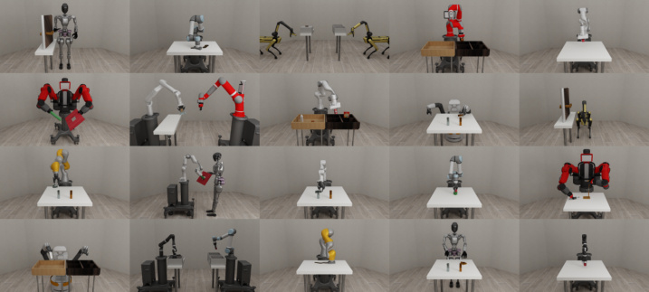
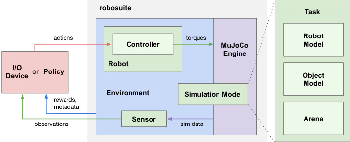
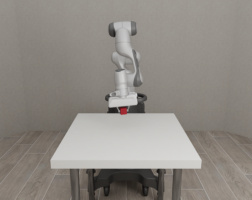

# robosuite: A Modular Simulation Framework and Benchmark for Robot Learning

> 这是一份给"完全没接触过机器人/AI"的读者看的精读笔记。语言尽量像聊天，遇到术语都展开讲。

## 一句话讲什么（TL;DR）

robosuite 是机器人 AI 的"标准考场"——基于 MuJoCo 物理引擎，把机器人仿真的每个部件（机器人本体、夹爪、控制器、任务、物体、传感器）拆成可拼接的"乐高积木"，配套 9 个标准操作任务和 SAC 基线，让全球研究者在同一张考卷、同一把尺子下公平比较算法好坏。

*所以这一节是想说：robosuite 是机器人学习领域的"ImageNet + 标准化考试卷"——模块化仿真框架 + 统一 benchmark。*

---

## 这是个什么场景

想象你在抖音刷到 10 个"全国厨艺大赛冠军"，每个人都端着自己拿手的菜说自己最强。可问题是：A 用的是自家厨房的德国蒸烤箱，B 用的是夜市路边摊小煤气灶，C 干脆只做了道凉拌黄瓜——你怎么知道谁真的厨艺更好？菜不同、灶不同、评分老师也不同，这"冠军"含金量就成了玄学。

机器人学习（让机器人通过反复试错或模仿人类来学会拧瓶盖、叠衣服这种活）长期就是这种"全是冠军、谁也不服谁"的状态：每篇论文都用自己写的仿真环境（虚拟的练习场）；每个实验室买不同牌子的机械臂硬件；同一个算法换个环境跑分能差好几倍。

大家急需一个"中央厨房"——同样的灶、同样的食材、同样的评委。

robosuite 就是来搭这个中央厨房的：给机器人学习提供统一的考场——一台共享的物理引擎、一组固定的题目、一排现成的机械臂、一套统一的"操控方向盘"。这样大家比拼的就是脑子（算法），不是装备。

它所属的具身 AI 数据集/评估领域，在 [guide/ch21-datasets.md](../guide/ch21-datasets.md) 中被定位为"第一时代（2018-2020）单实验室小规模"的代表——正是 robosuite 和 RoboMimic 定义了"仿真操作基准"这个品类。

*所以这一节是想说：robosuite 是为了让机器人算法可以"公平比武"而造的标准化场地。*

---

## 之前的人怎么做的，为什么不够好

- **每家自己写仿真**：清华一套，斯坦福一套，每篇论文跑出的"成功率 92%"根本不能横向比较。就像每家公司自己出考题、自己阅卷——你说你学生考了 95 分，可你的题是不是比别人简单一倍？没人知道。

- **OpenAI Gym 偏游戏**：早期通用平台 Gym 主要是 Atari 小游戏和经典控制题（倒立摆等），机器人方面的内容太薄，缺真实机械臂模型。Gym 的几个 MuJoCo 环境（Reacher、Pusher）也都是小玩具，离真实操作差距大。

- **真机太贵且难复现**：买一台 Franka Panda 机械臂要几十万人民币，故障一停一周；不同实验室的机器还有微小差异（标定误差、磨损），论文里的实验你根本搬不过来跑。Henderson 等人 2018 年专门写了篇 AAAI 论文（"Deep RL that matters"）痛陈这个问题。

- **控制器实现五花八门**：同样叫"末端位置控制"，不同代码库写法不同，对算法学习速度影响巨大。一个人用变阻抗 OSC、另一个人用 PD 控制器，跑同样的算法可能差一个数量级。

- **没有标配任务套**：不存在像图像识别里 ImageNet 那种"用了它大家都能比"的机器人任务集合。每篇论文都"我们自己定义了一个 X 任务"——读者根本不知道难度怎么样。

*所以这一节是想说：之前的机器人研究像没有奥运标准的运动会——成绩没法横向比较，复现别人结果也极难。*

---

## 这篇论文的新想法

**把机器人仿真拆成乐高积木**——机器人本体、夹爪、底座、控制器、任务、物体、传感器各自独立、可任意拼接，再配套提供 9 个标准任务和现成的强化学习基线。

核心设计哲学是"模块化 + 标准化"的双轮驱动：模块化让研究者自由组装新场景，标准化让所有人在同一把尺子下比较结果。这两者通常是矛盾的（自由拼装 → 大家跑的东西不同 → 又没法比了），robosuite 用"固定 9 道题 + 开放 API"的分层设计解决了这个矛盾——想跑标准赛就用 9 个 benchmark 任务，想做新实验就用模块化 API 拼装。

另一个重要洞察是：**控制器不是算法的"附属品"而是影响学习效率的核心变量**。robosuite 首次系统地提供了 6 种控制器 + 3 种阻抗变体，并用消融实验证明 OSC_POSE 比 JOINT_VELOCITY 在多数操作任务上学得更快——这个结论改变了后续许多论文默认使用 JOINT_VELOCITY 的习惯。

*所以这一节是想说：核心创新是"模块化 + 标准化"双轮驱动——既可拼可改，又有公认的考试题；同时把"控制器选择"从隐含变量变成了显式研究对象。*

---

## 它分几步做的（方法）

<!-- paper-figures:begin -->



*上图说明：Figure 1：robosuite 程序化生成环境与统一 API（论文原图）。*



*上图说明：Figure：MuJoCo 封装层—Robot / Gripper / Controller 类图（论文原图）。*



*上图说明：Figure：单臂/双臂操作任务与观测模态示例（论文原图）。*
<!-- paper-figures:end -->


把 robosuite 想成一家"机器人共享厨房"，老板帮你备齐了 6 样东西：可拼接的桌台（模块化架构）、一排现成的厨师（10 款机械臂）、统一的方向盘（6 种控制器）、各种监控摄像头（传感器+示教接口）、9 道指定菜（标准任务）、还有自动出题机（程序化生成）。下面一项一项讲。

### 5.1 双层 API 的模块化架构（Modeling API + Simulation API）

**类比**：建筑行业有两个工种——建筑设计师画图纸，施工队按图施工。robosuite 的两层 API 就是这个关系：Modeling API 是设计师画图纸，Simulation API 是施工队把图纸变成可以住人的楼。

**输入**：研究者写的几行 Python 配置代码——指定用哪个机器人、哪种夹爪、哪个桌面环境、放什么物体。

**处理**：

1. **Modeling API**（建模层）负责"组装场景描述"。它包含四个核心类：
   - **Task**：整个场景的"总图纸"。一个 Task 包含一个 Arena、一个或多个 RobotModel、零到多个 MujocoObject。
   - **Arena**：工作环境的物理描述——桌面、垃圾桶、货架等固定装置的 MJCF（MuJoCo XML Format）片段。
   - **RobotModel**：加载机器人本体（连杆结构、关节限位、扭矩上限）并绑定 GripperModel（夹爪）和 RobotBaseModel（底座）。
   - **MujocoObject**：被操作物体的模型，可从 XML 文件加载（MujocoXMLObject），也可用 Python 代码动态拼接基本几何体生成（MujocoGeneratedObject）。

   这四个类各自独立、通过 Task 类的组合接口拼装成一个完整的 MJCF 模型文件，传给 MuJoCo 物理引擎实例化。

2. **Simulation API**（仿真运行层）负责"跑起来之后的交互"。外部代码通过 OpenAI Gym 风格的接口（`reset()` → `step(action)` → 得到 `(obs, reward, done, info)`）与环境交互。关键的运行时组件包括：
   - **Environment**：封装了一个 MuJoCo 运行时对象（MjSim），提供 `make("任务名")` 创建环境、`reset()` 重置、`step(action)` 执行一步。可配置控制频率（control_freq）、回合长度（horizon）、奖励是稀疏还是密集（reward_shaping）。
   - **Controller**：将高层动作（如"末端去 (x,y,z)"）翻译成每个关节的扭矩值（详见 5.3）。
   - **Sensor**：从仿真状态中提取观测信号（详见 5.4）。
   - **Device**：人类遥操作输入设备（详见 5.4）。

**输出**：一个可交互的 Gym 风格环境对象——外部算法只需要知道"动作空间多大、观测长什么样"就能开始训练。

**关键设计决策**：为什么分成两层而不是一个大 API？因为"描述场景"和"运行仿真"的变化频率不同——你可能想在同一个场景上跑 100 种算法（Simulation API 不变），也可能想在同一个算法上跑 10 种场景（只改 Modeling API）。分层后两边可以独立变化，组合爆炸的复杂度被控制住了。

> **MJCF（MuJoCo XML Format）**：MuJoCo 用来描述虚拟世界的配置文件格式。你可以把它想成"HTML 描述网页，MJCF 描述虚拟物理世界"。一个 MJCF 文件定义了所有物体的形状、质量、摩擦系数、关节连接方式。robosuite 的核心工作之一就是把多个独立的 MJCF 片段（机器人 + 桌子 + 物体）拼接成一个完整的仿真世界。

> **OpenAI Gym 接口**：`reset() / step(action) / render()` 这套标准 API，最初由 OpenAI 2016 年定义，后来成了强化学习领域事实上的接口标准。robosuite 沿用这套接口意味着任何为 Gym 写的 RL 训练代码几乎无需修改就能对接 robosuite。

*所以这一节是想说：双层 API 架构让"搭场景"和"跑实验"解耦——换机器人/换任务只改 Modeling API 几行代码，训练代码一行不用动。*

---

### 5.2 机器人模型库：10 种机器人 + 9 种夹爪 + 4 种底座

**类比**：4S 店的展厅——丰田、宝马、奔驰、特斯拉应有尽有，每辆车的引擎参数都按厂家说明书还原。你试驾哪台都行，参数和真车一致。

**输入**：研究者在创建 Environment 时传入 `robots="Panda"` 或 `robots=["Panda", "Sawyer"]` 这样的参数。

**处理**：robosuite 把市面上常见的商用机器人都做了准确建模，参数（关节扭矩上限、自由度数、连杆长度）直接来自厂家手册。v1.5 支持的 10 款核心机器人：

| 机器人 | 制造商 | DoF | 特点 | 默认夹爪 |
|--------|--------|-----|------|----------|
| Panda | Franka Emika | 7 | 学术界最常用、高精度 | PandaGripper（平行爪） |
| Sawyer | Rethink Robotics | 7 | 经典研究平台 | RethinkGripper（长指爪） |
| IIWA | KUKA | 7 | 工业级、扭矩是其他机器人2倍 | Robotiq140Gripper |
| Jaco | Kinova | 7 | 人类辅助用途、力矩弱 | JacoThreeFingerGripper |
| Kinova3 | Kinova | 7 | 研究导向、集成传感器 | Robotiq85Gripper |
| UR5e | Universal Robots | 6 | 协作型、内置力矩传感器 | Robotiq85Gripper |
| Baxter | CoThink/Rethink | 双臂各7 | 双臂协作 | RethinkGripper |
| GR1 | Fourier Intelligence | 44 | 人形机器人、165cm/55kg | Inspire灵巧手 |
| Spot | Boston Dynamics | 12(腿)+6(臂) | 四足+机械臂 | 无 |
| TIAGo | PAL Robotics | 双臂各7 | 轮式移动+双臂 | 可配置 |

此外还有 `robosuite-models` 扩展包提供额外 8 种机器人、8 种夹爪、3 种底座。

**输出**：一个带有精确物理参数的 RobotModel 对象，可直接加载到任何 Task 中。

**关键设计决策**：模块化支持（Plug-and-Play）——任意机器人 + 任意夹爪 + 任意底座 + 任意控制器的组合都能工作。每个机器人有唯一 ID，支持同一环境中放多个相同机器人实例。自封装抽象（Self-Enclosed Abstraction）——每个 Robot 实例管理自己的初始状态、控制器映射和状态查询，外部代码不需要知道内部细节。

> **DoF（Degrees of Freedom，自由度）**：机器人能独立运动的关节数。7 自由度机械臂比 6 自由度多一个"冗余自由度"，好处是可以在保持末端位置不变的情况下调整肘部姿态，避开障碍物。人类手臂从肩到腕有 7 自由度——robosuite 的大多数机器人也是 7DoF。

> **Dexterous Hand（灵巧手）**：模仿人手多指多关节的夹爪。GR1 配备的 Inspire 灵巧手每只手有 6 个电机驱动、12 个自由度，能做精细的抓取和操作（如拧瓶盖）。这比传统两指平行爪（只有开/合一个自由度）复杂得多。

*所以这一节是想说：robosuite 替你建好了"机器人 4S 店"，10 款真实商用机器人参数精确还原，不必再为找模型烦恼。*

---

### 5.3 控制器系统：6 种身体部位控制器 + 复合控制器架构

**类比**：开车时的"驾驶模式"——舒适、运动、雪地、越野。你只用按一下方向盘上的按键，底层油门刹车 ECU 自动配合。机器人控制器干的是同一件事：把"高层意图"翻译成"每个关节多大扭矩"。

**输入**：外部算法输出的高层动作向量——可能是一个 6 维的末端位姿（OSC_POSE），也可能是一个 n 维的关节角度向量（JOINT_POSITION）。

**处理**：

robosuite v1.5 引入了**复合控制器（Composite Controller）**架构。核心思想：一个机器人可以由多个"身体部位"组成（手臂、底座、头部、躯干、腿），每个部位可以用不同的控制模式。复合控制器负责把总的动作向量拆分、分发给各部位的控制器。

提供两种复合控制器：

1. **BASIC**：直接把高层动作向量按部位切片，各部位控制器独立运行。例如：手臂用 OSC_POSE（6维）、底座用 JOINT_VELOCITY（2维）→ 总动作空间 8 维。
2. **WHOLE_BODY_IK**：把高层动作向量解释为末端位姿目标，用逆运动学求解器算出所有关节角度，再把关节角度传给各部位的 JOINT_POSITION 控制器。

6 种身体部位控制器（Body Part Controller）：

| 控制器名 | 动作含义 | 动作维度 | 适用场景 |
|----------|----------|----------|----------|
| OSC_POSE | 末端位置+姿态 (x,y,z,rx,ry,rz) | 6 | 精确操作（抓取、装配） |
| OSC_POSITION | 末端位置 (x,y,z)，保持初始姿态 | 3 | 简单搬运 |
| IK_POSE | 末端位姿（四元数表示） | 7 | 需要全姿态控制 |
| JOINT_POSITION | 每个关节目标角度 | n | 已知关节轨迹 |
| JOINT_VELOCITY | 每个关节目标角速度 | n | 运动控制 |
| JOINT_TORQUE | 每个关节扭矩 | n | 最底层控制、sim-to-real |

对 OSC_POSE、OSC_POSITION、JOINT_POSITION 三种，还各有 3 种**阻抗模式（impedance mode）**变体：

1. **fixed**（固定阻抗）：刚度和阻尼参数预设好、不在动作空间里。动作维度不变。这是最常用的模式。
2. **variable_kp**（可变刚度）：把刚度参数 kp 也加入动作空间让 RL 学习，阻尼 kd 自动取临界阻尼值。动作维度翻倍。
3. **variable**（可变阻抗）：刚度 kp 和阻尼 kd 都加入动作空间。动作维度增加到 3 倍。适合接触丰富的任务（如擦桌子、装配）。

这意味着 3 个控制器 x 3 种阻抗 + 剩余 3 个控制器 = 总共 12 种配置（见原文 Table 1）。

**输出**：每个关节在当前时步要施加的扭矩值（传给 MuJoCo 执行一步物理仿真）。

**关键设计决策**：

- 为什么要支持这么多控制器？因为**动作空间选择对学习效率影响巨大**。论文实验显示 OSC_POSE 比 JOINT_VELOCITY 在 Block Lifting 和 Door Opening 上学得快很多。原因是直觉性的：在 OSC 空间里随机探索时，末端移动方向和任务目标方向对齐；在 JOINT_VELOCITY 空间里随机探索时，7 个关节角速度同时抖动，末端可能飞到离目标很远的地方。

- 为什么要把阻抗参数也暴露给 RL？因为很多接触丰富任务（如装配、擦拭）需要机器人"知道什么时候该硬什么时候该软"。固定阻抗可能导致插销时卡死或擦桌子时用力过猛。让 RL 自己学阻抗调节，相当于教机器人"用力的轻重"——这比单纯学"去哪里"多了一个维度的智能。

- 为什么要做 Composite Controller？因为 v1.5 加入了人形机器人（GR1，44 DoF）和移动底座（Spot、TIAGo）。这些机器人不同部位的控制需求完全不同：手臂需要 6D 精确位姿控制，底座只需要平移速度控制，头部只需要看向目标。把不同部位的控制逻辑解耦后，可以让各部位用最适合的控制模式。

> **Operational Space Control（OSC，操作空间控制）**：由 Khatib 1995 年提出的经典控制理论。核心思想是"你不用关心 7 个关节怎么转，直接告诉机器人末端要去哪"——控制器用雅可比矩阵和动力学模型自动反解出关节扭矩。数学上是：τ = J^T * F，其中 τ 是关节扭矩，J 是雅可比矩阵，F 是末端期望力。人话翻译：根据"末端想去的方向"和"当前每个关节对末端运动的贡献比例"，算出每个关节该出多大力。

> **Inverse Kinematics（IK，逆运动学）**：已知"末端要到哪个位姿"，反推"每个关节要转到几度"。这是一个数学求解问题——对 7 自由度机器人有无穷多解（冗余自由度），需要额外约束（如最小化关节运动量）来选一个。robosuite 使用 mink 库作为第三方 IK 求解器的示例。

> **Impedance（阻抗）**：描述机器人对外力的"软硬"反应。高刚度 = 硬（像铁棒，碰到障碍不让步），低刚度 = 软（像弹簧，碰到障碍会退让）。可变阻抗意味着机器人能根据情况自动调整"软硬度"——接近物体时软一点（避免撞坏），夹紧物体时硬一点（抓稳）。

*所以这一节是想说：robosuite 把"怎么动"做了六步标准化——从最高层的"末端去哪"到最底层的"关节出多大力"，研究者只用关心"做什么"而不用自己写控制器。复合控制器架构更进一步，让不同身体部位能用不同的控制模式，为人形机器人时代做好了准备。*

---

### 5.4 多模态传感器 + 人类示教接口

**类比**：考场不光给你考卷，还配了眼镜、笔、老师录音、监控摄像头——你想用哪种信息答题都行。

**输入**：MuJoCo 仿真运行时的内部状态（物体位置、接触力、渲染图像等）。

**处理**：

robosuite 通过 Sensor 模块从仿真状态中提取四类感知信号：

1. **低维物理状态（Object States）**：物体的精确位置、速度、四元数姿态。用 `use_object_obs=True` 开启。适合做强化学习入门实验——信息完整，不需要视觉处理。

2. **RGB-D 相机**：用 `use_camera_obs=True` 开启。可在 Arena 或 RobotModel 中定义任意数量摄像头，挂在机器人手腕、桌面斜上方、天花板等位置。支持彩色图（RGB）、深度图（Depth）、语义分割掩码（Segmentation）。渲染基于 MuJoCo 内置的 OpenGL 渲染器或 PyGame。

3. **力/力矩传感器（Force-Torque Sensor）**：每个夹爪的手腕默认安装 6 轴力矩传感器（3 个力分量 + 3 个力矩分量）。通过 `get_sensor_measurement("gripper_force")` 读取。适合做接触丰富任务的研究。

4. **本体感知（Proprioception）**：机器人知道自己每个关节的角度（joint_positions）和角速度（joint_velocities）。这不是通过"传感器测量"得到的，而是物理引擎直接计算的——人类闭着眼也知道手在哪，这就是本体感知。

此外还提供 3 种 **I/O Device（人类遥操作输入设备）**：

- **Keyboard**：键盘映射——WASD 控制 xy 平移，QE 控制 z 上下，IJKL 控制旋转。最简单但精度低。
- **SpaceMouse**：3Dconnexion 的 6 自由度小鼠标，一个旋钮同时控制 xyz 平移 + xyz 旋转。精度高，是 RoboMimic / Diffusion Policy 实验数据的主要采集工具。
- **MJGUI**：MuJoCo 内置 GUI，用鼠标拖拽机器人末端到目标位置。可视化直观但不够灵活。

任何实现了 Device 抽象类的自定义设备都可以接入。

**输出**：一个 observation dictionary，包含研究者在创建环境时勾选的所有感知模态。

**关键设计决策**：多模态 + 可配置。同一个任务可以只给低维状态（用于调试算法），也可以给 RGB 图像（测试视觉策略），也可以加力反馈（研究接触策略）——研究者通过几个 flag 就切换"考试难度"。

> **Teleoperation（遥操作）**：人在电脑前通过输入设备远程操控虚拟机器人，每收集一条操作轨迹就是一份"专家演示"。robosuite 支持键盘、SpaceMouse、GUI 三种遥操作方式，让模仿学习研究者一站式完成数据采集。
> **SpaceMouse**：3Dconnexion 的 6 自由度小鼠标，能同时控制 xyz 三个平移和 xyz 三个旋转，是机器人示教的常用工具。
> **Demonstration（示教数据）**：模仿学习的训练数据。比如 RoboMimic、Diffusion Policy 用的就是在 robosuite 上用 SpaceMouse 录制的几百条专家演示。

*所以这一节是想说：传感器和示教接口让 robosuite 既能跑 RL 也能跑模仿学习，覆盖两条主流学习范式。*

---

### 5. 9 个标准任务 + SAC 基线（Benchmark Environments）

**类比**：高考有固定大题，所有考生做同一套卷子，结果可比。robosuite 设了 9 个标准任务，覆盖从简单到困难的层次。

**输入**：机器人模型 + 控制器 + 物体 + 随机初始化配置。

**处理**：每个任务定义了一组明确的成功条件（如物体高度达标、销插入孔中）和可选的密集奖励函数（距离越近奖励越高）。每次 `env.reset()` 会随机化物体初始位置，避免算法死记硬背。

**单臂任务（6 个）**：
- **Block Lifting**（举方块）——桌上放一个方块，举到一定高度即成功
- **Block Stacking**（叠方块）——把一个方块叠到另一个上面
- **Pick-and-Place**（分拣）——4 个物体分别放到 4 个对应容器里
- **Nut Assembly**（套螺母）——方螺母套到方螺栓、圆螺母套到圆螺栓
- **Door Opening**（开门）——转把手开门
- **Table Wiping**（擦桌子）——拿橡皮擦把白板上的痕迹全擦干净

**双臂任务（3 个）**：
- **Two Arm Lifting**（双臂抬锅）——两条机械臂各抓一个把手，把锅抬起且保持水平
- **Two Arm Peg-in-Hole**（插销）——一臂拿带孔板，一臂拿销，插进去
- **Two Arm Handover**（交接锤子）——离锤子近的那条手臂拿起后递给另一条

**输出（基线结果）**：

论文用 SAC（Soft Actor-Critic）在 9 个任务上跑基线。每个 agent 训练 500 epoch、每 epoch 500 步，硬件要求仅 2 CPU + 12G VRAM（无 GPU），约 2 天跑完。使用低维物理状态作为输入。每个实验跑 5 个随机种子并报告均值和标准差。

结果：SAC **只解决了 3 个任务**（Block Lifting、Door Opening、Two Arm Peg-in-Hole 达到近满分 episode return），其余 6 个进展缓慢。

消融实验：在 Block Lifting 和 Door Opening 上对比 OSC_POSE vs JOINT_VELOCITY，观察到 OSC_POSE 学得明显更快。论文推荐后续实验统一使用 Panda + OSC_POSE 组合。

**关键设计决策**：
- 任务难度梯度设计（单步 → 多步 → 多臂协同）让不同水平的算法都有区分度
- 每回合 500 步的 horizon 保证足够探索，同时限制计算开销
- sparse reward 和 shaped reward 两套可切换——研究 reward shaping 影响时有对照

> **SAC（Soft Actor-Critic）**：2018 年的模型无关 RL 算法，在连续动作空间学习时稳定性和样本效率都不错。robosuite 选它做基线是因为它是 model-free RL 的标杆。
> **Reward Shaping（奖励塑形）**：把"完成才给 1 否则 0"的稀疏奖励改造成"距离越近奖励越高"的密集信号，加速 RL 学习。robosuite 每个任务都提供了两种切换。
> **Episode Horizon（回合长度）**：一次"考试"的最大步数。500 步没完成算失败。

*所以这一节是想说：9 个标准任务 + SAC 基线，让 robosuite 成为机器人学习社区的"通用考卷"——不同算法终于可以公平比分了。*

---

### 6. 程序化生成 + 自定义物体（Procedural Generation）

**类比**：考场出题不能永远是同一道——不然学生死记硬背就行。robosuite 让你能"用代码批量生产略有差异的题"。

**输入**：物体描述（XML 或 Python 代码定义的几何体组合）+ placement_initializer 配置。

**处理**：

robosuite 把"物体"分两种来源：
- **MujocoXMLObject**：手写 MJCF XML 描述物体的形状、质量、摩擦系数，从文件加载。适合导入 ShapeNet、YCB 等 3D 物体数据集的模型。
- **MujocoGeneratedObject**：用 Python 代码动态拼接基本几何体（box、cylinder、sphere）和它们的相对位姿，运行时生成。参考 `HammerObject` 类（由一个头 + 杆组合而成的锤子）。

每次 `env.reset()` 时，**placement_initializer** 在桌面合法范围内采样所有物体的位置和朝向，反复尝试直到满足"不重叠、在桌面上、姿态稳定"。

**输出**：每次重置后都是一个略有差异的新场景——物体位置、朝向都不同，甚至物体本身的形状尺寸也可以参数化变化。

**关键设计决策**：
- 静态导入（XML）和动态生成（Python）并存，兼顾精度和灵活性
- placement_initializer 解耦了"物体本身"和"物体初始布局"，允许独立控制多样性来源
- 天然支持 domain randomization（随机化颜色、尺寸、摩擦等），提升策略对外观变化的鲁棒性

> **Domain Randomization（域随机化）**：训练时随机化外观和物理属性，让策略不依赖特定外观，提升从仿真到真机的迁移概率。
> **Placement Initializer**：负责"开局把物体放哪"的模块。它会反复采样直到所有物体都满足约束条件。

*所以这一节是想说：程序化生成把"任务多样性"也做成了模块化能力，为大规模数据合成和 sim-to-real 迁移打下基础。*

---

## 关键数字（What works）

> robosuite 是软件论文，"关键数字"主要是工具规模和基线表现，而非"提升了 X 个百分点"。

| 指标 | 数值 | 对比参照 | 意味着什么 |
|------|------|----------|------------|
| 机器人模型数 | 10 种（6-44 DoF）| OpenAI Gym 几乎不带商用模型 | 开箱即用的"机器人动物园" |
| 夹爪模型数 | 9 种（含灵巧手）| 多数仿真器只有 1-2 种 | 研究抓取策略泛化性 |
| 底座类型 | 4 种（固定/轮式/腿式/全向）| 早期只支持固定底座 | 扩展到移动操作研究 |
| 身体部位控制器 | 6 种 + 3 种阻抗变体 = 12 配置 | 很多仿真只支持 1-2 种 | 可做控制器对照实验 |
| 标准任务数 | 9 个（6 单臂 + 3 双臂）| dm_control 偏 locomotion | 操作研究有了固定靶子 |
| SAC 基线成功率 | 3/9 任务解决 | SAC 在 locomotion 几乎全胜 | 操作比走路难得多 |
| 硬件门槛 | 2 CPU + 12G VRAM，无 GPU | 大模型训练动辄 8 卡 A100 | 入场券压到普通工作站 |
| 训练时间 | 约 2 天/实验 | 同期 RL 实验常需一周+ | 快速迭代成为可能 |
| OSC_POSE vs JOINT_VELOCITY | OSC 在 Lift/Door 上收敛快约 2x | 原文 Figure 4 曲线 | 动作空间设计和算法本身一样重要 |
| 回合长度 | 500 步 | 原文未报告 | 长够探索、短够计算 |
| 每实验种子数 | 5 个随机种子 | 很多早期论文只跑 1-3 个 | 统计严谨性标杆 |

*所以这一节是想说：robosuite 以极低硬件门槛把"机器人学习"做成可复现、可比较的科学实验。*

---

## 实验结果说明了什么

robosuite 的实验设计不是为了"证明某算法厉害"，而是回答三个工程问题：

**问题一：纯 RL 能解决操作任务吗？**

SAC 在 9 个任务里只解决了 3 个（Block Lifting、Door Opening、Two Arm Peg-in-Hole）。这三个有一个共同特征：成功条件相对"粗粒度"（举到一定高度、转过一定角度、插进去即可），不需要极精确的多步序列规划。其余 6 个任务（如 Pick-and-Place 需要抓对 → 走对路线 → 放进对的容器）对于纯 RL 来说奖励太稀疏、步骤太多。

这个结果的历史意义：它为后来模仿学习（RoboMimic、Diffusion Policy）的发力空间标明了靶子——"SAC 做不到的那 6 个任务"成为了 IL 证明自己价值的试金石。

**问题二：控制器选择对学习效率有多大影响？**

OSC_POSE 在 Block Lifting 和 Door Opening 上比 JOINT_VELOCITY 收敛快约 2 倍。直觉解释：RL 的探索在动作空间里随机抖动。在 OSC 空间里抖一下，末端移动 1cm——这和任务结构对齐；在 JOINT_VELOCITY 空间里抖一下，7 个关节角速度同时变，末端可能跳到一米外——探索效率极低。

这个发现促使社区后续默认推荐 OSC_POSE + Panda 组合，成为事实标准。

**问题三：robosuite 作为 benchmark 的区分度够吗？**

9 个任务从"一步动作"（Lift）到"多步精确协调"（Nut Assembly、Pick-and-Place）到"双臂协同"（Handover），难度梯度清晰。SAC 能解 3 个、部分进展 2 个、几乎无进展 4 个——说明任务集有足够区分度来排列不同水平的算法。后续 RoboMimic 在同样 9 个任务上证明 IL 能解 6-7 个，进一步验证了这一区分度。

*所以这一节是想说：实验结果不是要夸 SAC 好或坏，而是标定了"纯 RL 的能力边界"和"动作空间设计的重要性"——为后续研究划出了清晰的进攻方向。*

---

## 你应该懂的几个新词

- **MuJoCo（Multi-Joint dynamics with Contact）**：物理引擎名，2012 年由 Todorov 等人发布，2021 年 DeepMind 收购后开源。专长是接触动力学（碰撞、摩擦），是机器人仿真的事实标准。类比：Unity 是游戏引擎，MuJoCo 是机器人引擎。

- **MJCF（MuJoCo XML Format）**：MuJoCo 用来描述场景的配置文件格式。类比：HTML 描述网页布局，MJCF 描述虚拟物理世界的布局。

- **DoF（Degrees of Freedom，自由度）**：机器人能独立运动的关节数量。7 自由度意味着 7 个独立旋转轴。类比：人类手臂从肩到腕大约 7 自由度。

- **End-effector（末端执行器）**：机械臂最末端的工具部件，通常是夹爪。类比：筷子尖是你"手臂"的末端执行器。

- **Operational Space Control（OSC，操作空间控制）**：用末端在三维空间里的位置/姿态作为控制量，让控制器自动解出关节扭矩。类比：开车时你想"靠边停"，方向盘和油门怎么打不用你算——OSC 就是机器人的高级辅助驾驶。

- **Impedance（阻抗）**：机器人对外力的"软硬"反应程度。高阻抗 = 硬碰硬，低阻抗 = 柔顺退让。类比：弹簧的硬度系数。

- **Composite Controller（组合控制器）**：v1.5 的核心设计——身体不同部位（手臂、底座、头部、躯干）各自使用不同控制模式。类比：人走路时腿自动走，手可以同时做精细动作——两套"控制器"并行。

- **Inverse Kinematics（IK，逆运动学）**：已知"末端要到哪"，反推"每个关节要转到几度"的数学问题。类比：你知道手指要碰到键盘上的 'A' 键，大脑反推肩肘腕各转多少度。

- **Soft Actor-Critic（SAC）**：2018 年的 model-free RL 算法，特点是同时最大化奖励和策略熵（探索多样性）。类比：教练让你既要练扣篮又要多尝试不同角度，平衡"稳"和"新"。

- **Procedural Generation（程序化生成）**：用算法/代码而非手动建模来生成场景或物体。类比：Minecraft 的世界不是预设的，是用算法动态"长"出来的。

- **Sim-to-Real Transfer（仿真到真实迁移）**：把仿真里训出的策略部署到真实机器人上。类比：在驾校模拟器里学会开车后第一次上路——能不能直接开是个学问。

- **Domain Randomization（域随机化）**：训练时随机化视觉外观和物理参数，让策略对特定条件不敏感。类比：考试前做各种变体题，上考场才不会被"换了个数字"吓到。

*所以这一节是想说：这十二个词是读机器人学习论文的"基础词汇表"——掌握它们后读 RoboMimic、Diffusion Policy 等下游论文会事半功倍。*

---

## 它有什么搞不定的

1. **Sim-to-Real 鸿沟未根本解决**：再准的仿真也不等于真实世界——纸盒在 MuJoCo 里掉地不会变形，真实世界会。摩擦系数、接触面积的微观差异在真机上被放大。robosuite 提供尽量准的接触动力学，但不声称解决 sim-to-real 问题本身。

2. **柔性/形变物体支持薄弱**：MuJoCo 主打刚体，对布料、绳索、流体等可变形物体的模拟精度和效率都不理想。叠衣服、倒水、拧毛巾这类任务做起来吃力。这也是 NVIDIA Isaac Sim（FleX 引擎）、SoftGym 等后来者的发力点。

3. **任务库偏短 horizon**：9 个任务中最长的也只需要十几步关键动作。相比家庭/工厂里的"长 horizon、多步骤、跨房间"任务差距明显。后续社区扩展（如 LIBERO 提供 130 个语言条件任务、RoboCasa 提供厨房长程任务）才补上长程挑战。

4. **无原生语言指令支持**：每个任务名是固定字符串（"Block Lifting"），不支持自然语言条件（如"把红色方块放进绿色盒子"）。VLA 时代的工作若要用 robosuite 需自己加一层语言包装。LIBERO 和 BEHAVIOR 填补了这一空缺。

5. **渲染视觉真实感一般**：MuJoCo 基于 OpenGL 的简单光照渲染，画面比 Unreal/Unity 引擎差一截。训练"从 RGB 图像直接到动作"的视觉策略时，sim-to-real 的视觉鸿沟会比较明显。NVIDIA Isaac Sim、Habitat 在渲染真实感上更强。

6. **不支持大规模并行仿真**：robosuite 是单进程运行，不像 Isaac Gym 那样支持 GPU 上并行跑上千个环境。大规模 RL 训练时吞吐量成为瓶颈。

7. **社区维护节奏依赖核心团队**：作为学术项目而非商业产品，更新节奏取决于 ARISE Initiative 团队的资源。相比 NVIDIA 持续投入的 Isaac Sim 生态，长期维护存在不确定性。

*所以这一节是想说：robosuite 解决了"标准化"和"模块化"，但"真实化"、"复杂化"、"语言化"、"规模化"都留给了后续工作。*

---

## 它和别的几篇是什么关系

- **vs RoboMimic**：RoboMimic（Mandlekar et al. 2021）是建立在 robosuite 之上的模仿学习数据集和消融实验平台。robosuite 提供环境和任务，RoboMimic 在其上用 SpaceMouse 录制了多质量层级的示教数据（proficient / multi-human / machine-generated），然后系统比较了 BC、BC-RNN、HBC 等算法。两者是"平台 + 用户"关系。

- **vs Diffusion Policy**：Chi et al. 2023 的扩散策略论文，核心实验大量跑在 robosuite 的 Square（Nut Assembly 变体）、Lift、Can（Pick-and-Place 变体）、Transport（Two Arm 变体）等任务上。robosuite 是 Diffusion Policy 证明自己强于 IBC/LSTM-GMM 的"考场"。

- **vs RLBench**：James et al. 2020 的另一个仿真操作 benchmark，基于 CoppeliaSim + PyRep。RLBench 提供 100 个任务（比 robosuite 多得多），但物理仿真精度不如 MuJoCo，且不提供标准化控制器接口。robosuite 强在"深度"（控制器/物理精度），RLBench 强在"广度"（任务数量）。

- **vs Meta-World**：Yu et al. 2020 的多任务 RL benchmark，50 个任务统一使用 Sawyer 机械臂。Meta-World 侧重多任务/元学习研究，robosuite 侧重单任务深度和模块化。两者互补——Meta-World 考"广"，robosuite 考"深"。

- **vs Isaac Gym / Isaac Lab**：NVIDIA 的 GPU 加速仿真平台，特点是能在一块 GPU 上并行跑数千个环境，吞吐量比 robosuite 高 2-3 个数量级。但 Isaac Gym 的 API 设计不如 robosuite 简洁，初学者上手门槛更高。适合大规模 RL 训练，robosuite 适合快速原型验证和模仿学习研究。

- **vs LIBERO**：Liu et al. 2023 基于 robosuite 扩展的语言条件任务集，130 个任务配自然语言指令。LIBERO 补上了 robosuite 缺失的语言条件能力，是 VLA 模型在仿真中的首选测试平台。两者是"底层框架 + 上层任务集"关系。

- **vs MimicGen**：Mandlekar et al. 2023 的自动数据扩增工具，利用 robosuite 的程序化生成能力，从少量人类示教自动生成大规模训练数据。MimicGen 是 robosuite 程序化生成设计哲学的直接受益者和延伸。

- **vs Habitat / AI2-THOR**：导航类仿真平台，强在室内场景渲染和导航任务，弱在操作物理。robosuite 主打操作，几乎没有导航成分。两者互补——Habitat 解决"去哪"，robosuite 解决"到了之后干什么"。

*所以这一节是想说：robosuite 是机器人操作学习社区的"地基"——RoboMimic、Diffusion Policy、LIBERO、MimicGen 都在其上构建，Isaac Gym/RLBench/Habitat 则覆盖不同维度。*

---

## 和本导读的关系

本篇属于 [Ch21: 数据集全景](../guide/ch21-datasets.md) 中"第一时代（2018-2020）：单实验室小规模"的核心工具。Ch21 明确将 robosuite 定位为"标准化仿真操作框架"——不是数据集本身，而是让数据集和算法可以被公平比较的底层平台。

在导读的知识体系中，robosuite 的位置是：

- **上游**：[Ch16: RL 基础](../guide/ch16-rl-basics.md)（SAC 等算法）、[Ch17: Sim-to-Real](../guide/ch17-sim-to-real.md)（仿真到真机迁移）
- **同层**：[Meta-World](meta-world.md)、[RLBench](rlbench.md)、[ManiSkill](maniskill.md)（其他仿真 benchmark）
- **下游**：[RoboMimic](robomimic.md)（模仿学习数据集）、[Diffusion Policy](diffusion-policy.md)（扩散策略算法）、[LIBERO](libero.md)（语言条件任务）、[RoboCasa](robocasa.md)（厨房长程任务）

读完本篇后再看 RoboMimic 和 Diffusion Policy，你会理解它们的实验为什么选这些任务、结果为什么可信。

*所以这一节是想说：robosuite 是 Ch21"仿真操作基准"类别的核心基础设施，后续大量明星算法论文的"考场"都建在它之上。*

---

## 思考题

**Q1：为什么 robosuite 选择 MuJoCo 而不是 Unity/Unreal 作为底层物理引擎？这个选择带来了哪些 trade-off？**

<details>
<summary>提示</summary>

从接触动力学精度、渲染质量、仿真速度、sim-to-real 迁移四个维度分析。游戏引擎的物理求解器对夹爪抓取时的接触力计算不够准确（容易穿模或打滑），MuJoCo 用凸优化形式的接触求解器牺牲了渲染画面换取了物理准确性。
</details>

**Q2：OSC_POSE 比 JOINT_VELOCITY 在操作任务上学得更快，根本原因是什么？在什么情况下 JOINT_VELOCITY 可能反而更好？**

<details>
<summary>提示</summary>

核心是"探索空间与任务空间的对齐度"。OSC 的随机探索直接在末端笛卡尔空间进行，每次抖动对应有意义的物理移动。JOINT_VELOCITY 的探索在关节空间，一次随机动作可能让末端跳到无关位置。但如果任务本身定义在关节空间（如特定姿态保持、舞蹈动作），JOINT 可能更直接。另外全身机器人的locomotion任务也常用关节控制。
</details>

**Q3：robosuite 的模块化设计（Robot/Arena/Object/Controller 分离）如何帮助研究者做"控制变量"实验？请举一个具体的消融实验例子。**

<details>
<summary>提示</summary>

模块化 = 每次只换一个"积木"其余不动。例如：固定任务（Lift）+ 固定机器人（Panda）+ 固定物体，只变控制器（OSC vs JOINT），就能纯净地测试"控制器对学习效率的影响"。不用模块化的话，换控制器可能连奖励函数都要改（因为动作维度变了），混淆因素太多。同理可以固定一切只换机器人，测试"算法对不同硬件的泛化性"。
</details>

**Q4：robosuite 的 placement_initializer 为什么要"反复采样直到无碰撞"而不是用更高效的方法（如网格化放置）？这种设计对 RL 训练有什么影响？**

<details>
<summary>提示</summary>

网格化放置虽然高效但多样性有限——物体位置只有有限种排列，RL 可能过拟合到"见过的那几种布局"。随机采样+碰撞检测保证了连续的、无限多样的初始布局分布，让策略必须学到泛化能力而非记忆。代价是 reset 时间略长，但对于 500 步的 episode 来说 reset 的几毫秒可以忽略。
</details>

**Q5：SAC 在 9 个任务里只解决了 3 个。如果你是一个 2020 年的研究生，看到这个结果后你会选择什么研究方向来"解决剩下的 6 个"？**

<details>
<summary>提示</summary>

三条可能路线：(1) 模仿学习——加入人类示教数据绕过稀疏奖励问题（RoboMimic 路线）；(2) 更好的奖励设计——用子目标分解、课程学习把长 horizon 任务拆成短 horizon 片段；(3) 结合 RL 和 IL 的混合方法（如 DAgger、residual policy learning）。历史证明路线 (1) 最先成功——RoboMimic 2021 年用 BC-RNN 解了大部分任务，Diffusion Policy 2023 年几乎全解。
</details>

**Q6：robosuite v1.5 引入了 composite controller（组合控制器），允许身体不同部位用不同控制模式。这对全身人形机器人（如 GR1）的研究为什么是必要的？**

<details>
<summary>提示</summary>

全身人形机器人有 40+ 自由度，如果统一用一种控制器，要么动作空间维度太高（JOINT 需要 44 维），要么 OSC 只能控制一个末端（但人形有双手+头+躯干+腿）。Composite controller 把身体拆成语义部件，每个部件用最合适的控制模式：手臂用 OSC_POSE 精控末端、底座用 JOINT_VELOCITY 移动、头部用 JOINT_POSITION 看向目标。这和真实人形机器人的工程实现（分层控制循环）一致。
</details>

**Q7：假设你要用 robosuite 做一个"倒水"任务的研究。你会遇到 robosuite 的哪些局限？你会怎么解决或绕过？**

<details>
<summary>提示</summary>

核心局限：MuJoCo 不擅长模拟流体（水是可变形连续介质，不是刚体）。可能的解决方案：(1) 用粒子近似法模拟水（MuJoCo 支持有限粒子但精度和效率都不理想）；(2) 把"水"替换为"大量小球"做离散化近似；(3) 换到支持流体的仿真器（如 NVIDIA FleX/Warp）；(4) 简化任务——不模拟流体本身，只用杯子倾角作为代理指标（倾斜到某个角度就算"倒出水"）。真实研究中方案 (4) 最常见。
</details>

---

## 一些好奇心问答（FAQ）

**Q1：为什么不用 Unity 或 Unreal 做机器人仿真？**

游戏引擎的物理求解器对接触动力学不够准确——夹爪抓物体时容易"穿模"或"打滑"。MuJoCo 用了凸优化形式的接触求解器，代价是渲染没游戏引擎漂亮。所以"研究用 MuJoCo，演示视频用 Unreal"是常见组合。近年 NVIDIA Isaac Sim 试图兼顾两者（PhysX 5.0 改善了接触精度 + RTX 渲染），但尚未完全取代 MuJoCo 在操作研究中的地位。

**Q2：robosuite 和 Gym、dm_control 是什么关系？**

Gym 是接口标准（reset/step/render 那一套），dm_control 是 DeepMind 的 MuJoCo 任务集（偏 locomotion），robosuite 是机械臂操作专用。三者是"协议 / locomotion 实现 / manipulation 实现"的关系——robosuite 沿用 Gym 风格 API，底层调 MuJoCo（dm_control 调的也是同一个引擎）。

**Q3：v1.5 比 v1.0 多了什么关键变化？**

两个最大升级：(1) 加了全身机器人（GR1 人形、Spot 四足、TIAGo 移动双臂），把 robosuite 从"纯桌面机械臂"扩展到"全身机器人"；(2) composite controller——身体不同部位可以挂不同控制器，这对移动操作场景是必需的。

**Q4：为什么 SAC 在操作任务上比在 locomotion 上差这么多？**

操作任务的三重困难：(1) 奖励稀疏——Pick-and-Place 只有全做对才给奖励；(2) 接触不连续——碰到/没碰到之间动力学突变；(3) 多步依赖——先抓起才能放，顺序错了全白费。locomotion 任务通常有密集奖励（每步给速度奖励）、动力学连续、不需要严格顺序。

**Q5：我自己装 robosuite 需要什么配置？**

CPU 单机就能跑。MuJoCo 2021 年后完全开源，不再需要 license 文件。安装：`pip install robosuite`，然后 4 行代码就能看到机械臂在你电脑上动起来。如果用 RGB 渲染做视觉策略学习，加一块 RTX 3060 级别 GPU 加速渲染即可。

**Q6：robosuite 的数据能直接拿来训练真机策略吗？**

不能直接用——仿真数据和真机之间存在 sim-to-real gap。但 robosuite 做了两件事降低这个鸿沟：(1) 所有控制器最终输出关节力矩（torque），这在真机上几乎所有主流机械臂都通用；(2) 程序化生成支持 domain randomization，让策略不过拟合仿真器的特定视觉外观。不过完全消除 gap 仍需配合 sim-to-real 技术（如 progressive nets、系统辨识、RL fine-tuning）。

**Q7：能在 robosuite 上跑 VLA（视觉-语言-动作）模型吗？**

可以，但 robosuite 自身不带语言指令。实践中有两种做法：(1) 用 LIBERO（基于 robosuite 扩展的语言条件任务集，130 个任务配自然语言指令）；(2) 自己加一层任务描述包装，把任务 ID 映射到语言描述。OpenVLA、Octo 等 VLA 工作通常选方案 (1)。

*所以这一节是想说：robosuite 作为基础工具很纯粹——它不试图解决所有问题，但把"标准化"做到了极致，让上层应用各取所需。*

---

## 如果你想再深入

- **Khatib 1995, "Inertial properties in robotic manipulation: An object-level framework"**——OSC（操作空间控制）的理论原典。读完才能理解 robosuite 控制器层为什么这样设计。
- **Todorov, Erez, Tassa 2012, "MuJoCo: A physics engine for model-based control"**（IROS）——MuJoCo 引擎设计论文。理解仿真器底层的接触求解机制。
- **Fan, Zhu et al. 2018, "SURREAL: Open-source reinforcement learning framework"**（CoRL）——robosuite 的前身项目，分布式 RL 框架，理解项目的起源。
- **Martin-Martin et al. 2019, "Variable impedance control in end-effector space"**（IROS）——变阻抗动作空间论文，解释 robosuite 阻抗模式的研究价值和物理直觉。
- **Mandlekar et al. 2021, "What Matters in Learning from Offline Human Demonstrations for Robot Manipulation"**（CoRL，即 RoboMimic）——robosuite 最重要的下游用户之一，大量基于 robosuite 的模仿学习消融实验。
- **Chi et al. 2023, "Diffusion Policy: Visuomotor Policy Learning via Action Diffusion"**（RSS）——在 robosuite 任务上证明扩散模型策略显著强于传统 IL 方法。
- **Liu et al. 2023, "LIBERO: Benchmarking Knowledge Transfer for Lifelong Robot Learning"**（NeurIPS）——基于 robosuite 扩展的语言条件持续学习基准。
- **robosuite 官方文档 [robosuite.ai](https://robosuite.ai)**——比论文更新更快，含 v1.5 的 composite controller 教程和 Quick Start。

*所以这一节是想说：把 robosuite 当一个生态入口——往上读控制器理论，往下看模仿学习实证，整套链条会越来越清晰。*

---

## 原文信息

**BibTeX**：

```bibtex
@article{zhu2020robosuite,
  title={robosuite: A Modular Simulation Framework and Benchmark for Robot Learning},
  author={Zhu, Yuke and Wong, Josiah and Mandlekar, Ajay and Mart{\'\i}n-Mart{\'\i}n, Roberto and Joshi, Abhishek and Lin, Kevin and Maddukuri, Abhiram and Nasiriany, Soroush and Zhu, Yifeng},
  journal={arXiv preprint arXiv:2009.12293},
  year={2020}
}
```

**链接**：
- 项目主页：[robosuite.ai](https://robosuite.ai)
- GitHub：[github.com/ARISE-Initiative/robosuite](https://github.com/ARISE-Initiative/robosuite)
- 论文 PDF：[arXiv:2009.12293](https://arxiv.org/abs/2009.12293)
- Benchmark 结果仓库：[github.com/ARISE-Initiative/robosuite-benchmark](https://github.com/ARISE-Initiative/robosuite-benchmark)

*所以这一节是想说：一切信息都可溯源——论文、代码、数据、文档都是公开的。*
