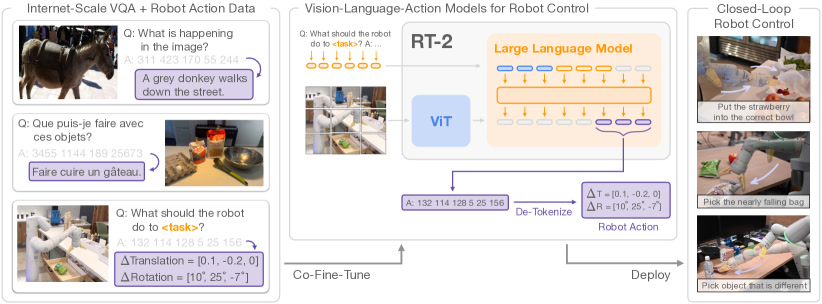
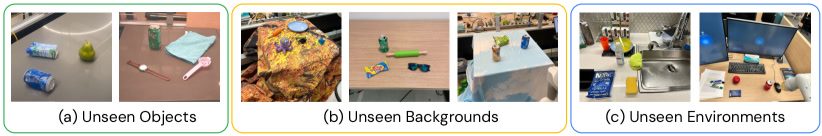
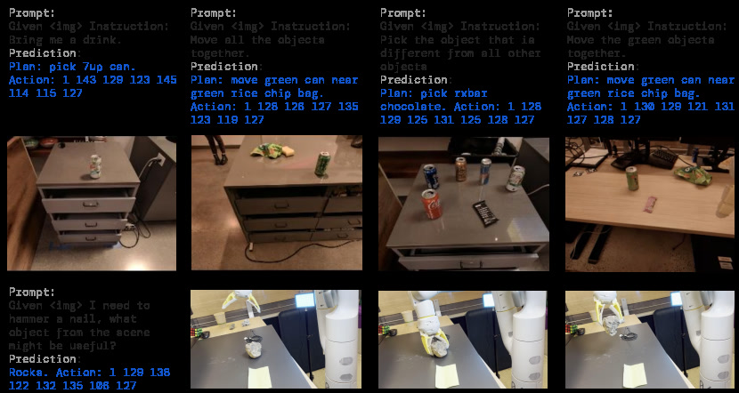

# RT-2: Vision-Language-Action Models Transfer Web Knowledge to Robotic Control

> 这是一份给"完全没接触过 AI"的读者看的精读笔记。语言尽量像聊天，公式全部翻译成人话。

## 一句话讲什么（TL;DR）

把机器人动作翻译成一句话，让会看图聊天的 AI 用写句子的方式开口指挥机器人——它会写字，就能动手。

*所以这一节是想说：RT-2 让一个本来只会写字的 AI，开口说出了机器人能听懂的"动作话"。*

---

## 这是个什么场景

下班回家，你瘫在沙发上喊一句"我饿了，桌上随便给我拿点能吃的"。理想中的家庭助手机器人此时应该：扫一眼桌子、认出哪个是零食哪个是杯子、挑出最像"能当饭吃"的那个、再把手臂伸过去抓住递给你。这听起来像理所当然的智能，但 2023 年之前的机器人，做不到这件事。

为什么做不到？因为当时业界有两种角色，谁都没法独立干完：

- 一种是"超博学的英语家教"型 AI——它能聊冷笑话、解奥数题、看图认梗（这就是 GPT-4 那一类视觉语言模型）。但你让它"把草莓放进水果碗"，它就傻眼了——它从没碰过你家厨房，**手不会动**。
- 另一种是"训练有素的机器人手臂"——能熟练抓罐子、开抽屉。可你说"把可乐递给戴眼镜的那个人"，它就懵了——它从没见过"戴眼镜"是什么意思。它**有手没脑子**。

RT-2 想干的事就一句话：把这两个角色塞进**同一个脑袋**。会聊天的家教 + 会动手的机器人 = 一个又有常识又能动手的助手。

具体长什么样：

- 你说"我饿了"，它从一堆零食里挑出 RXBar 巧克力棒递给你；
- 你说"把可乐放到泰勒·斯威夫特那张照片旁边"，它知道泰勒长什么样；
- 你说"找一个能当锤子用的东西"，它从桌上挑出石头。

而且关键是：动作必须**真的在物理世界跑起来**——不是聊天里"我会去做"那种敷衍，是手臂真的要挪、爪子真的要张。

*所以这一节是想说：RT-2 要造一个"懂常识 + 懂语言 + 真能动手"的机器人助手。*

---

## 之前的人怎么做的，为什么不够好

- **方案 A：纯堆机器人数据**
  类比：让一个从没读过书的人，靠一万次手把手的训练学会做家务。代价巨大，只学到表面动作，换个新厨房就不会了。
  问题：网上能爬到几十亿张图、几万亿字的文本，但**机器人轨迹数据**全世界加起来也只有百万级。光靠它没法泛化。

- **方案 B：把 LLM 当"高层规划师"**
  类比：经理坐办公室画 PPT 拆任务（"先去厨房 → 再开冰箱 → 再拿牛奶"），下面的小工照着干。但小工本身没读过书，只认基础动作。
  代表作：SayCan、PaLM-E（早期）。问题是"上层会想，下层不会变通"——任何"创造性"动作只能由下层老老实实执行，下层根本不知道"草莓"和"碗"在语义上有什么关系。

- **方案 C：CLIPort、MOO 这种"用 VLM 标记物体"**
  类比：让 VLM 在画面里给目标物体贴一个红点，然后小工去抓那个红点。但这把动作空间限制成了 2D（只能在桌面上动），而且需要相机标定。
  问题：VLM 只在"识别阶段"被用一下，真正的动作策略还是另一个小模型在干。**VLM 的知识没有被传给动作。**

- **方案 D：Gato 这类"从头训通用智能体"**
  类比：从婴儿状态开始什么都教（玩游戏、看图、下棋、控制机器人）。耗资巨大，效果不一定比专一的模型好。问题是 **没复用已有的 VLM**，相当于浪费了几亿美元的预训练投入。

- **核心难题**：怎么让"看图聊天的脑子"和"控制手臂的身体"**用同一套参数**学习，而不是接两根管子？

*所以这一节是想说：之前的方案要么没脑子、要么脑子和身体之间靠管子接，导致网上的常识传不到动作里。*

---

## 这篇论文的新想法

**把机器人动作直接编码成"几个数字 token"——和文字 token 用同一种格式。这样会聊天的 VLM 不需要改任何架构，只要"再多学几句话"就能开口控制机器人。**

听起来匪夷所思——一个吐字的 AI 怎么可能控制电机？关键在于：动作本身就是几个连续数字（手臂沿 X 轴移动多少、绕 Y 轴转多少度、爪子张多少），把每个数字离散化成 256 档，每档对应一个 token，就能像写句子一样"写动作"了。

*所以这一节是想说：核心创新是把"动作"翻译成 token，让 VLM 用写文章的方式开口指挥机器人。*

---

## 它分几步做的（方法）

<!-- paper-figures:begin -->



*上图说明：Figure 1（ar5iv 原图）（论文原图）。*



*上图说明：Figure 2（ar5iv 原图）（论文原图）。*



*上图说明：Figure 3（ar5iv 原图）（论文原图）。*
<!-- paper-figures:end -->

整个论文做了 5 件事：动作怎么变 token、模型怎么挑、训练怎么搭、推理怎么提速、以及如何让机器人"先想再做"（思维链推理）。这五步加在一起构成了从"会写字的 AI"到"会动手的机器人"的完整技术路线。

下图是 RT-2 从"图像 + 指令"到"电机动作"的端到端管线（零架构修改，动作 token 与文字 token 同格式）：

```
   机器人摄像头 (320×256)         用户指令 "把零食递给我"
        │                              │
        ▼                              ▼
   ┌──────────┐                  ┌──────────┐
   │ ViT 切块 │                  │ 分词器   │
   │ →300+ 视 │                  │ →文本    │
   │  觉 token│                  │  token   │
   └────┬─────┘                  └────┬─────┘
        └───────────┬────────────────┘
                    ▼  视觉+文本 token 拼成一条序列
        ┌────────────────────────────────────┐
        │ 现成 VLM 底座 (PaLI-X 55B / PaLM-E) │  架构一行不改
        │ self-attention: 同时"看图"+"想指令" │  只做 next-token 预测
        └────────────────┬───────────────────┘
                         ▼  logit masking: 只准输出动作 token
              8 个动作 token "1 128 91 241 5 101 127 217"
                         │
                         ▼ 机器人本地 de-tokenize (查表)
              7-DoF 增量 (Δxyz + Δrpy + 夹爪) + 终止位
                         │
                         ▼ 发给电机执行 → 重新拍照 → 闭环循环
```

*上图说明：图经 ViT、指令经分词器，拼成一条序列喂进现成 VLM——动作 token 和文字 token 在模型眼里毫无区别，靠 logit masking 强制只吐 8 个动作数字，本地查表还原成电机指令后闭环执行。*

### 1. 把机器人动作"装"成一句话

**类比**

打电话教朋友停车，你只能这样说："方向盘往左 3 度，油门踩 0.2 秒，刹车放开"——一串数字加一串名词。RT-2 也是这么教 VLM 说"动作话"的：把手臂的每一步动作翻译成几个数字写出来。

**它在干什么**

机器人手臂的动作其实就是 7 个连续数字 + 1 个终止信号：

- 末端位置变化：Δx、Δy、Δz（3 个数，手要往哪挪）
- 末端旋转变化：Δrx、Δry、Δrz（3 个数，手要怎么转）
- 爪子开合度：1 个数（要不要捏紧）
- 终止指令：1 个布尔值（这步是不是收工）

**等等，先慢一拍——这里几个词到底是啥？**

> **末端（end-effector）**：机器人手臂最前端的"手"，通常是夹爪或吸盘。控制机器人就是控制这只手怎么动。
>
> **6-DoF（六自由度）**：一个物体在 3D 空间能做的全部独立运动——前后/左右/上下挪 3 种 + 绕 3 个轴转 3 种。描述"我的手怎么挪到那儿"，6 个数就够。
>
> **离散化（discretization）**：把一段连续值切成一格一格。想象一根温度计从 -1 度到 +1 度，原本可以是 0.37、0.38、0.385 任何小数；现在我把这 2 度的范围平均切成 256 档，每档对应一个整数 0-255。读数变粗了，但只有 256 种可能，刚好对得上 token 的离散世界。

**关键操作**：把每个连续数字按"-1 到 +1"切成 **256 档**，每档配一个 token。所以一条完整动作 = 一串 8 个 token，比如 `"1 128 91 241 5 101 127 217"`——长得跟一句话一模一样，VLM 张嘴就能写。

然后包装成 VQA 格式喂给 VLM：

> 输入：图片 + "Q: what action should the robot take to pick up the chip bag? A:"
> 输出：`"1 128 91 241 5 101 127 217"`

> **VQA（Visual Question Answering，视觉问答）**：让 AI 看一张图回答关于这张图的问题，是 VLM 最经典的任务之一。

**两种 VLM 不同的"塞 token"方式**：

- **PaLI-X**：它的词表本来就给 0-999 每个整数都留了独立 token，所以直接用"动作数字 → 同名 token"对应即可。
- **PaLM-E**：词表里没有现成数字 token，作者干脆**把词表里出现频率最低的 256 个 token 强行覆盖成动作 token**。原本可能是某个生僻外语词，现在被改成"动作 73"。这种操作叫 symbol tuning。

**为什么这步有用**

- VLM 不需要长出新模块——零新增参数。
- 训练时只是"多教它几种新词"，复用了它已有的全部知识。
- 后续 OpenVLA 等开源 VLA 都沿用这个套路。

**为什么 256 档而不是 1024 或 64？**

论文没有明确做 bin 数量的消融实验，但 256 是一个工程上经典的权衡点。每维 256 档意味着精度约为 1/256 ≈ 0.4% 的动作范围，对于桌面抓取这种厘米级精度需求完全够用。再高（比如 1024 档）会让输出序列更长、推理更慢，但对动作质量提升有限；再低（比如 64 档）则可能在旋转等维度上丢失过多精度。后续论文如 OpenVLA 沿用了 256，说明社区对这个数字达成了共识。

**动作 token 和语言 token 的本质区别**

虽然动作 token 和语言 token 在形式上完全一样（都是词表里的一个编号），但有一个关键差异值得注意：语言 token 之间的关系是**离散的、符号化的**——"猫"和"狗"的编号差 1 不代表它们含义接近。但动作 token 之间的关系是**有序的、连续的**——编号 128 和 129 代表的物理动作确实只差一丁点。模型需要"学会"这种有序性，而不是把每个动作 token 当成独立的符号来记忆。RT-2 没有显式地教模型这一点，它完全依赖训练数据中的统计规律让模型自己领悟。这是一个隐含假设——后续工作如 VQ-BeT 尝试用 VQ-VAE 来显式编码这种连续性。

*所以这一节是想说：动作被翻译成 8 个数字 token，VLM 就能像写句子一样"写动作"，连改架构都不用。*

---

### 2. 拿现成的 VLM 当底座（PaLI-X / PaLM-E）

**类比**

想造电动车有两条路：从零设计每个螺丝，或者拿一辆现成的好燃油车把发动机换成电池电机。后者快得多——底盘、车身、内饰都现成的，只动关键那一处。RT-2 走的就是后者：拿 Google 已经训好的两个超大型 VLM 当底盘，**架构一行不改**，只在它身上"再多训一阵子"。

**它在干什么**

底座二选一：

- **RT-2-PaLI-X**：5B 参数（小号）和 55B 参数（巨无霸）两版。视觉用 ViT-22B，语言用 32B 的 encoder-decoder。
- **RT-2-PaLM-E**：12B 参数。语言用 PaLM 系列的 decoder-only LLM，视觉用 ViT-4B。

> **ViT（Vision Transformer）**：把图片切成小方块，每块当成"一个词"喂给 Transformer 处理。是现在视觉模型的主流架构。
>
> **encoder-decoder vs decoder-only**：两种 Transformer 风格。前者像"先理解后写作文"（机器翻译常用），后者像"边想边写"（GPT 风格）。
>
> **PaLI-X / PaLM-E**：Google 内部两个不同路线的多模态大模型。前者偏视觉理解，后者偏语言+具身整合。

**为什么用两个？**

作者想验证"VLA 的成功不依赖某个特定 VLM"——只要底座够强，这个套路就能复用。事实上结果显示两个版本各有所长：

- PaLI-X-55B 在符号理解、人物识别上更强（视觉训练多）；
- PaLM-E-12B 在数学推理上更强（语言训练含数学题）。

**两种底座的架构差异对 VLA 行为的影响**

这两个底座不只是"参数量不同"，它们在架构哲学上有根本差异。PaLI-X 用 encoder-decoder 架构，意味着它先用 encoder 把图像和文本"理解一遍"形成内部表示，再用 decoder 生成输出。这种架构在视觉理解任务上表现出色，因为 encoder 的双向注意力能更充分地理解图像内容。PaLM-E 用 decoder-only 架构，所有输入（图像 token + 文本 token）按顺序排列，模型从左到右依次处理——这种架构在长链推理上更自然，因为它天生就是"一步一步往前想"的模式。

结果表明：底座的预训练数据分布比架构差异更关键。PaLI-X 看过更多图像-文本对，所以视觉语义能力更强；PaLM-E 的训练集包含数学和代码，所以逻辑推理更好。这个发现对后续 VLA 设计有重要启示——选底座时，**看它吃过什么数据**比看它长什么架构更重要。

**为什么这步有用**

- 网络规模训练成本：PaLI-X-55B 大概要烧几百万美元，**复用就是省钱**。
- 全部网页知识（物体名、动作动词、人脸、品牌、外语）天然继承下来，机器人数据只需要补"具体动作"那部分。

*所以这一节是想说：不重新发明轮子，直接拿现成的"超博学家教"当机器人大脑。*

---

### 3. 联合微调（Co-Fine-Tuning）：边练新技能边复习旧本领

**类比**

学生备考时只刷新题、把课本知识全扔了，新题考完老知识也忘光——这叫"为了一棵树砍掉整片林"。聪明的做法是"上午刷新题、下午翻课本"，新旧一起练。RT-2 训练就是这思路：**机器人动作数据**和**网页 VQA 数据**混在同一个 batch 里同时喂——新技能和旧本领一起练，不让它顾此失彼。

> **微调（fine-tuning）**：在一个已经预训练好的大模型基础上，用小规模新数据继续训练，让它适应新任务。
>
> **Co-fine-tuning（联合微调）**：和单纯微调不同——训练时不丢掉原先的网页数据，而是按一定比例混进来。机器人数据 + 网页 VQA 数据 同时喂给模型。
>
> **batch（批次）**：训练时一次喂给模型的数据组。比如一个 batch 含 2048 个样本，里面可能 1024 个是机器人轨迹，1024 个是看图问答。
>
> **灾难性遗忘（catastrophic forgetting）**：神经网络的老毛病——给它学新东西，它会忘掉旧东西。Co-fine-tuning 就是为了对抗这个。

**它在干什么**

混合比例：

- RT-2-PaLI-X：机器人数据占 batch 的 **50%**。
- RT-2-PaLM-E：机器人数据占 batch 的 **66%**。

剩下的部分仍然是 WebLI 那 10 亿张图文对、VQA 题、各种网页 caption。

**训练目标**：和写文章一样的"下一个 token 预测"——给定前文，猜下一个 token。猜对得分，猜错扣分。机器人数据里的"动作 token"就是模型要猜的目标。

> **next-token prediction（下一个 token 预测）**：所有现代 LLM 的训练目标。给模型一段话，让它猜下一个词。在 VLA 里，"下一个词"可能就是"下一个动作 token"。
>
> **behavior cloning loss（行为克隆损失）**：模仿学习里的标准目标——让模型的输出和人类示范的动作一致。在 RT-2 里它就等价于 next-token prediction。

**输出约束（Output Constraint）**：测试时如果是机器人任务，模型只允许输出动作 token；如果是 VQA 任务，仍然可以输出全部自然语言。这条规则保证机器人不会突然蹦出"嗨"两个字然后机械臂崩溃。

**Co-fine-tuning 的比例选择为什么重要？**

50% 和 66% 不是随便挑的。如果机器人数据比例太低（比如 10%），模型学不到足够多的动作模式，成功率会很低。如果比例太高（比如 95%），网页知识会被严重遗忘——模型可能连"泰勒·斯威夫特"都认不出了，涌现能力全废。作者选择的比例本质上是在"动作精度"和"语义泛化"之间找甜点。55B 模型用 50% 就够（因为模型容量大，记忆力强），12B 模型需要 66%（容量小，必须多喂机器人数据才能学会）。

**输出约束是怎么实现的？**

这个细节很重要但容易被忽略。在推理时，模型其实仍然可以输出任何 token——输出约束是通过**logit masking**（对数概率屏蔽）实现的：对于机器人任务，把词表中所有非动作 token 的 logit 设成负无穷大，这样 softmax 之后它们的概率就变成 0。模型只能从 256 个动作 token 里选。这是一个简单但关键的工程技巧——没有它，模型偶尔会输出自然语言而不是动作，导致机器人"说话而不动手"。

**为什么这步有用**

消融实验里有一组数据非常震撼：

- **从零训练**（不用 VLM 预训练权重）：5B 模型在未见环境上的平均成功率 9%。
- **仅微调**（只用机器人数据 fine-tune）：42%。
- **联合微调**（co-fine-tuning）：44%（5B），63%（55B）。

意思是：**预训练 + 联合微调** 比 **从零训练** 在泛化上高了 7 倍。说明"网页知识"才是泛化能力的真正来源。

*所以这一节是想说：训练时不能让模型只啃机器人数据，必须同时复习网页知识，才能保住"会推理 + 会泛化"的本事。*

---

### 4. 远程推理：把大模型放云上、机器人当瘦客户端

**类比**

你的手机本身跑不动 GPT-4，但你照样能用——因为真正的计算在 OpenAI 数据中心，手机只是发个问题、收个答案。RT-2 用了同样的招：55B 参数的大脑塞不进机器人的小电脑，那就让大脑住在 Google 数据中心，机器人每次"想动一下"就拍张照、发条消息问云端"我下一步该怎么动？"，等回复传回来再让电机执行。

**它在干什么**

- 模型部署在多 TPU 云服务上。
- 机器人每控制周期发一次请求：发图 + 任务描述，云端返回 8 个动作 token。
- 机器人本地把 token 反离散化（de-tokenize）成连续动作，发给电机执行。

> **TPU（Tensor Processing Unit）**：Google 自研的 AI 专用芯片，比 GPU 在大模型推理上更快。
>
> **控制频率**：机器人每秒能更新多少次动作。人手大概 3-5 Hz 就够日常操作；高频精细动作（写字、缝纫）需要 30+ Hz。
>
> **闭环控制（closed-loop control）**：每动一步都重新看一眼场景再决定下一步。和"睁着眼提前规划好整套动作再瞎摸"（开环）相对。

**实测频率**：

- RT-2-PaLI-X-**55B**：1-3 Hz
- RT-2-PaLI-X-**5B**：约 5 Hz

**这是史上最大的直接控制机器人的模型**——比之前的同类工作大一个数量级以上。

**推理延迟的物理学**

为什么 55B 只能跑 1-3 Hz？因为每次推理需要做的计算量和参数量成正比。55B 参数意味着每次前向传播需要约 55B 次乘加运算（实际更多，因为还有注意力的平方复杂度）。即使是 TPU v4，每秒也只能做这么多浮点运算。而且 RT-2 的输入包含一张高分辨率图片（经过 ViT 编码后变成几百个 token）+ 一段文本指令 + 需要自回归生成 8 个动作 token——每个动作 token 的生成都依赖前一个，无法并行。这就是为什么即使在云端 TPU 集群上，55B 模型也只能做到每秒 1-3 次推理。

5 Hz 的 5B 模型和 1-3 Hz 的 55B 模型之间存在一个权衡：频率高意味着机器人反应更灵敏（杯子滑了能更快纠正），但模型小意味着语义理解能力更弱（可能认不出"泰勒·斯威夫特"）。论文在实际部署中更多使用 55B 版本，说明对于桌面抓取任务，**语义理解比反应速度更重要**。

**为什么这步有用**

- 不限制模型大小，跑得起 55B；
- 多机器人共享一个云端模型，降低单机成本；
- 网络延迟在桌面操作场景下可接受（毕竟人手抓东西也就 1-2 秒一动作）。

**代价**：高频任务（比如剥鸡蛋、缝纫）目前还跑不动。论文也承认这是当前最大瓶颈。

*所以这一节是想说：用"机器人当瘦客户端、云端跑大脑"的部署方式，把不可能的 55B 模型搬进了真实机器人。*

---

### 5. 思维链推理（Chain-of-Thought）：让机器人"先想再做"

**类比**

你让一个新手厨师做"番茄炒蛋"。笨办法是直接开始切——切到一半发现没打蛋、锅没热。聪明的做法是先在脑子里过一遍："第一步打蛋，第二步切番茄，第三步热锅放油，第四步先炒蛋再炒番茄。"先想清楚再动手，出错概率大大降低。RT-2 的思维链推理就是这个思路：让模型在输出动作 token 之前，先用自然语言写一段"计划"。

**它在干什么**

正常的 RT-2 推理流程是：输入（图片 + 指令）→ 直接输出 8 个动作 token。

加了思维链之后变成：输入（图片 + 指令）→ 先输出一段自然语言计划 → 再输出 8 个动作 token。

具体怎么做？作者在机器人数据中增加了一种新的标注格式。原来的标注是：

> Q: What action should the robot take to pick up the can?
> A: 1 128 91 241 5 101 127 217

加了思维链后变成：

> Q: What action should the robot take to pick up the can?
> A: I see a red can on the left side of the table. I need to move my arm to the left and lower it to grasp the can. 1 128 91 241 5 101 127 217

模型先用自然语言描述自己"看到了什么、打算做什么"，然后才给出具体的动作数字。

**这和 Chain-of-Thought prompting 有什么关系？**

> **Chain-of-Thought（思维链）**：2022 年 Wei 等人提出的技巧——让 LLM 在给出最终答案之前，先把推理步骤写出来。比如做数学题"3 × 7 + 2 = ?"，不是直接跳到 23，而是先写"3 × 7 = 21，21 + 2 = 23"。这个技巧被证明能显著提高 LLM 在推理任务上的表现。

RT-2 把这个文本世界的技巧搬到了机器人世界。但有两个重要的不同：第一，RT-2 的思维链不是靠 prompting（提示词工程）实现的，而是通过**在训练数据中加入思维链标注**来实现的——模型是在训练阶段学会"先想再做"的，不是推理时才被提醒的。第二，思维链的最后必须接动作 token，所以模型不能"想完就算了"——它必须把思考转化成具体行动。

**实际效果怎么样？**

论文展示了几个令人印象深刻的定性例子：

- 指令："我需要一个即兴锤子。" 思维链："I need to find an object that could be used as a hammer. I see a rock on the table, which is heavy and hard. I will pick up the rock." 然后抓起石头。——机器人做了一个需要常识推理的决策：石头硬而重，可以当锤子用。
- 指令："我累了，给我拿点喝的。" 思维链："The person is tired. An energy drink would help. I see a can of Red Bull." 然后递过红牛。——机器人把"累"和"功能饮料"联系起来了。

但论文**没有给出量化的对比数字**——没有"有思维链 vs 没有思维链"的成功率对比表。作者只说"fine-tune 几百步就观察到效果"，这说明 VLM 本来就有"先想再写"的能力（来自预训练），只需要少量数据就能激活。

**为什么没有量化？**

这是论文的一个遗憾。可能的原因是：思维链标注的数据量太少（只有几百条），统计显著性不够；也可能是因为思维链主要在"需要推理的复杂指令"上有效，而这类任务本身数量有限。后续工作（如 SayCan 的改进版本）开始更系统地研究机器人思维链的量化效果。

**思维链的推理开销**

思维链有一个明显的代价：推理时间变长。正常模式输出 8 个 token 就够了，但加了思维链后可能需要先输出 20-50 个自然语言 token 再输出 8 个动作 token。对于 55B 模型来说，多输出 30 个 token 大约意味着推理时间增加 3-4 倍。本来 1-3 Hz 的控制频率会降到 0.3-1 Hz——这在需要快速反应的任务上是不可接受的。所以思维链更适合"需要推理的一次性决策"（比如选哪个物体），而不适合"连续执行中的每一步"。

*所以这一节是想说：思维链让机器人能像人一样"先想再做"，把推理过程显式化。虽然缺乏量化验证，但它展示了 VLM 的语言推理能力可以直接服务于物理世界的决策。*

---

### 方法总结：从输入到输出的完整数据流

把上面五步连起来，RT-2 的完整工作流程如下：

1. **输入端**：机器人摄像头拍一张当前场景的 RGB 图片（分辨率通常 320×256），加上用户给的自然语言指令（比如"把零食递给我"）。
2. **图像编码**：ViT 把图片切成 16×16 的小方块（patch），每块变成一个 token 向量。320×256 的图片大约变成 300+ 个视觉 token。
3. **文本编码**：指令被分词器（tokenizer）切成文本 token。"把零食递给我"大约 5-10 个 token。
4. **Transformer 处理**：视觉 token + 文本 token 拼在一起，送进 Transformer 的注意力层。在这些层里，模型同时"看"和"想"——视觉 token 和文本 token 之间通过注意力机制互相影响。模型在这里完成"认出桌上哪个是零食"+"理解'递给我'是什么动作"的整合。
5. **动作解码**：Transformer 的最后一层输出下一个 token 的概率分布。通过 logit masking 限制只能输出动作 token，然后用贪心解码（每次选概率最高的那个 token）依次输出 8 个动作 token。
6. **反离散化**：机器人本地把 8 个 token 编号（0-255 的整数）映射回 8 个连续值（-1 到 +1 的浮点数），乘以动作范围上限，得到 7 维动作增量 + 1 个终止信号。
7. **执行**：把连续动作发给机器人的底层控制器（通常是 PID 控制器或关节插值器），电机按指令转动。
8. **循环**：执行完一步后，摄像头再拍一张新照片，重复 1-7。这就是闭环控制。

整个循环每 200-1000 毫秒跑一次（取决于模型大小）。人类操作员给一次指令，机器人自主循环几十甚至几百次直到任务完成或发出终止信号。

**为什么这个流程是"零架构修改"的？**

关键在于步骤 4 和 5——在 VLM 眼里，动作 token 和自然语言 token 没有任何区别。无论是回答"这张图里有什么？"还是"机器人该怎么动？"，模型做的都是同一件事：根据输入，预测下一个 token。唯一的区别是 logit masking 在推理时限制了输出范围。这种统一性是 RT-2 设计的精华——它意味着 VLM 为自然语言学到的所有能力（理解语义、做推理、识别物体）都能无损地服务于动作生成。不需要额外的动作头（action head）、不需要独立的策略网络——一切都在同一个 Transformer 里完成。

*所以这一节是想说：RT-2 的方法归结为"把动作变成 token，塞进现有 VLM，混合训练，云端部署，可选思维链"——五步走，零架构修改，换任何够强的 VLM 底座都能复用。*

---

下图拆解 RT-2 的训练配方——联合微调（co-fine-tuning）如何把网页数据与机器人数据混进同一个 batch 对抗遗忘：

```
【训练: 一个 batch 里两种数据混着喂】
   ┌─────────────────────────────────────────────────┐
   │  同一个 batch                                     │
   │  ┌──────────────────┐  ┌────────────────────────┐│
   │  │ 网页 VQA / caption│  │ 机器人轨迹 (动作 token)││
   │  │ WebLI 10 亿图文对 │  │ RT-1 数据集             ││
   │  │ (复习旧本领)      │  │ (学新技能)              ││
   │  └──────────────────┘  └────────────────────────┘│
   │   PaLI-X: 50% ┆ 50%    PaLM-E: 34% ┆ 66%          │
   └────────────────────────┬─────────────────────────┘
                            ▼ 统一目标: next-token 预测
                 ┌────────────────────────┐
                 │   VLM (共享全部参数)   │
                 └────────────────────────┘
        对比:  从零训练 9%  <  仅微调 42%  <  联合微调 63%(55B)
               (会遗忘网页常识)     (保住常识 → 涌现能力)

【为什么必须混】
   只喂机器人数据 ──► 灾难性遗忘 ──► 忘了"泰勒是谁"、忘了 2+1=3
   混入网页数据   ──► 常识保鲜   ──► 涌现: 认人/推理/跨语言
   模型越大, 存的知识越多 → co-ft 收益越大 (5B:+2 / 55B:+11)
```

*上图说明：联合微调把网页 VQA 与机器人轨迹按比例混进同一个 batch、用同一个 next-token 目标训练——机器人数据教新动作，网页数据防止遗忘常识，两者缺一则涌现能力崩塌；模型越大越依赖这招。*

---

## 关键数字（What works）

数字本身不重要，重要的是它们告诉你"哪条设计选择真的关键"。

| 实验 | RT-2 最优 | 上一代最优 | 倍数 | 核心变量 |
|------|-----------|-----------|------|----------|
| 未见物体/背景/环境 | 62%（PaLI-X-55B） | 32%（RT-1） | ×1.9 | VLM 预训练 |
| 涌现能力（符号/推理/人物） | 60%（PaLI-X-55B） | 17%（RT-1） | ×3.5 | 网页知识迁移 |
| Language-Table 模拟环境 | 90%（PaLI-3B） | 77%（LAVA） | ×1.2 | 跨平台泛化 |
| 联合微调 vs 从零训练 | 44%（5B co-ft） | 9%（5B scratch） | ×4.9 | 预训练贡献 |
| 55B vs 5B | 63% | 44% | ×1.4 | 模型规模缩放 |

### 数字 1：未见物体/背景/环境的平均成功率 62% vs RT-1 的 32%

- **怎么算的**：在未见物体（Easy/Hard）、未见背景、未见环境共 280+ 任务上，跑 6000 次评估。
- **对比**：RT-1（35M 参数的纯机器人 transformer）= 32%；MOO = 35%；R3M = 12%；VC-1 = 10%。
- **生活语言**：RT-2 在"换厨房、换物体、换灯光"的场景下，比上一代选手 **接近翻倍**。它真的把网页知识用上了。

### 数字 2：涌现能力评估上的 60% vs 17%

- **怎么算的**：作者专门设计了"机器人数据里完全没出现过"的指令——比如"把可乐放到泰勒·斯威夫特旁边""把香蕉放到 2 + 1 的答案附近"。共三类：符号理解、推理、人物识别。
- **对比**：RT-1 = 17%，VC-1 = 11%，RT-2-PaLI-X-55B = **60%**。
- **生活语言**：RT-1 几乎不会做这些任务（成功率刚过随机），RT-2 三倍碾压。这是"网页知识传到了动作里"最直接的证据。

### 数字 3：联合微调比单纯微调高 11 分（5B），高 11 分（55B）

- **怎么算的**：5B 模型联合微调 44% vs 仅微调 42%（差距小）；55B 模型联合微调 63% vs 仅微调 52%（差距大）。
- **生活语言**：模型越大，**保住网页知识**的边际收益越高。说明"光啃机器人数据"会让大模型把脑子里的常识忘掉一部分。

### 数字 4：从零训练只有 9% 成功率

- **怎么算的**：5B PaLI-X 不加载任何预训练权重，从随机初始化开始训。
- **对比**：联合微调 44%——**预训练把成功率拉高 5 倍**。
- **生活语言**：再给你大模型，没读过网页数据也是空架子。VLA 的能力是预训练给的，不是模型结构给的。

### 数字 5：在 Language-Table 模拟环境上 90% vs 上一代 SOTA 77%

- **怎么算的**：用更小的 PaLI-3B 在 Language-Table 桌面推动任务上微调。
- **对比**：BC-Zero = 72%、RT-1 = 74%、LAVA = 77%、**RT-2-PaLI-3B = 90%**。
- **生活语言**：即使在另一个"非 RT-1 风格"的小机器人模拟器上，VLA 套路依然吊打专项设计的方法。

### 数字 6：55B 模型 vs 5B 模型在泛化上 +20 分

- **怎么算的**：5B 联合微调平均 44%，55B 联合微调平均 63%。
- **生活语言**：**模型越大，泛化越好**。这条规律和 LLM 一样适用于 VLA。RT-2 是第一篇明确证明这一点的具身论文。

*所以这一节是想说：数据告诉我们——决定胜负的是"VLM 预训练 + 联合微调"，模型大小是放大器但不是关键。*

---

## 实验结果说明了什么

光看数字还不够，关键是从这些数字里读出三个更深层的结论。

**结论一：VLM 的知识真的"流"到了动作里，而不是停留在识别层。**

之前的方案（CLIPort、MOO）也用 VLM，但 VLM 只负责"看"——看完之后把识别结果交给另一个小模型去"动"。RT-2 的涌现能力实验直接证明了知识不仅是在"看"的时候起作用。比如"把可乐放到泰勒·斯威夫特旁边"这个任务，模型需要：先认出哪张照片是泰勒（视觉知识），然后理解"旁边"这个空间关系（语言知识），最后生成正确的抓取和放置动作序列（动作知识）。这三步在同一次前向传播中完成，没有中间的文本接口。60% 的涌现能力成功率意味着这些知识确实通过共享参数传递到了动作输出端——这是管道式方案做不到的。

**结论二：模型规模的缩放定律在 VLA 中同样成立。**

在 NLP 领域，"模型越大性能越好"是一条被反复验证的经验规律（scaling law）。RT-2 第一次在具身 AI 领域证明了同样的趋势：5B → 55B 带来了 +20 分的泛化提升。但这个缩放不是均匀的——在"已见任务"上，5B 和 55B 差距很小（都能做好训练过的动作）；差距主要体现在"未见任务"和"涌现能力"上。这说明**额外的参数容量主要用来存储更多的网页知识**，而不是学习更精细的动作控制。换句话说，如果你只需要机器人做训练集里的几十种动作，5B 够用；但如果你想要它"举一反三"，55B 的额外投入是值得的。

**结论三：co-fine-tuning 的收益在大模型上更显著，揭示了一个"遗忘-容量"的权衡。**

5B 模型上，联合微调 vs 仅微调只差 2 分（44% vs 42%）；但 55B 模型上差了 11 分（63% vs 52%）。这看似矛盾——大模型不应该更不容易遗忘吗？解释是这样的：5B 模型本身容量有限，预训练知识就没存多少，遗忘和不遗忘差别不大。55B 模型里存了大量网页知识，如果不用 co-fine-tuning 保护，微调时这些知识会被大量覆盖——损失惨重。所以 co-fine-tuning 的价值和模型存储的知识量正相关。**模型越大，越需要 co-fine-tuning。**

这三个结论合在一起，给出了 VLA 设计的一个核心指导原则：**VLA 的上限不取决于你有多少机器人数据，而取决于你的底座 VLM 有多强、以及你在微调时保住了多少它的知识。**

*所以这一节是想说：实验结果不只是"RT-2 比 RT-1 好"这么简单——它证明了知识迁移、缩放定律和联合微调这三个设计原则在具身 AI 中同样成立。*

---

## 你应该懂的几个新词

> **VLA（Vision-Language-Action Model，视觉-语言-动作模型）**：能看图、读指令、直接输出机器人动作的模型。RT-2 是这个词的命名者。

> **PaLI-X / PaLM-E**：Google 的两个 VLM 底座。前者偏视觉，后者偏语言+具身。

> **6-DoF**：六自由度，描述末端位姿需要的最少独立参数（3 平移 + 3 旋转）。

> **末端执行器（end-effector）**：机器人手臂最前端的"手"，通常是夹爪。

> **Tokenization（分词）**：把一段连续信号（文字、动作）切成离散单元（token）的过程。RT-2 把动作切成 256 档来 tokenize。

> **离散化（discretization）**：把连续区间切成有限格子。RT-2 把每维动作切成 256 档。

> **Symbol tuning（符号微调）**：把模型词表里某些罕见 token 重新赋意义，让它们承载新含义。RT-2-PaLM-E 用这招塞动作 token。

> **Co-fine-tuning（联合微调）**：训练时把"原任务数据"和"新任务数据"按比例混在 batch 里，避免遗忘。RT-2 的核心训练 trick。

> **Behavior cloning（行为克隆）**：让模型模仿专家示范——这里就是模仿人类遥操机器人的轨迹。

> **Closed-loop control（闭环控制）**：每动一步都重新看一眼再决定下一步，和开环（提前规划完一次性执行）相对。

> **Chain-of-thought（思维链）**：让模型先用自然语言写"计划"再写"动作"，把推理过程显式化。RT-2 的进阶用法。

> **Emergent capability（涌现能力）**：模型在没专门训练过的任务上突然出现的能力。RT-2 涌现了符号识别、人物识别、跨语言指令等能力。

*所以这一节是想说：上面这十几个词以后看任何 VLA 论文都会反复出现，先把它们和生活类比挂钩。*

---

## 它有什么搞不定的

论文自己也老实交代了几个翻车场景：

- **不会学新动作**：网页知识只能教它"识别新物体、理解新指令"，但**不会生出新动作**。如果机器人数据里从没出现过"擦桌子"动作，VLA 看再多视频也不会擦。物理技能仍然受限于演示数据集。这就好比你背了全世界的菜谱，但手从来没碰过锅——你知道红烧肉该放多少糖，但手抖得夹不住肉。
- **精细操作失败**：抓"具体某个部位（比如杯柄）"、灵巧动作（叠毛巾、用工具）、需要"多层间接推理"的任务，RT-2 经常翻车。256 档的离散化精度在旋转维度上大约对应 1.4 度——听起来不大，但叠毛巾需要 0.1 度级别的精度。
- **延迟限制**：55B 模型 1-3 Hz，做不了高频精细动作（剥鸡蛋、缝纫等需要 20Hz+）。这不是软件优化能解决的——是物理层面"大模型推理就是慢"。
- **依赖闭源 VLM**：RT-2 本身没开源——PaLI-X 和 PaLM-E 都是 Google 内部模型。学术界要等 OpenVLA 之类的开源复刻才能用。这意味着论文里漂亮的数字，外面的人无法独立验证。
- **推理成本高**：每次都要走云端，断网就停。一个真正有用的家庭机器人不能依赖稳定的网络连接——你不会希望你家的机器人因为 Wi-Fi 断了就举着杯子不动了。
- **单一机器人形态**：所有实验只在一种 7-DoF 桌面机器人上做。能不能泛化到双臂、四足、无人机？论文没有回答。后续 RT-X 项目试图通过跨机器人数据集来解决这个问题。
- **评估偏差风险**：6000 次评估听起来很多，但每个任务只跑 1-5 次。对于成功率 50-60% 的任务，5 次试验的统计置信度并不高——有可能因为运气好多成功了一两次就多出了 20% 的成功率。

*所以这一节是想说：RT-2 强在泛化和理解，但物理动作多样性、精细度、自治性、开源性都还是软肋。*

---

## 它和别的论文是什么关系

- **直接前作：RT-1（2022）** — 同一组人的纯机器人 transformer。RT-2 用的机器人数据集就是 RT-1 收集的（13 个机器人 17 个月在办公室厨房采的）。RT-2 = RT-1 数据 + VLM 大脑。
- **直接前作：PaLM-E（2023）** — 同一组（DeepMind）的"具身多模态语言模型"。PaLM-E 把图和机器人状态塞进 LLM 来做**高层规划**（输出文字指令），但底下还是要另一个低层策略来执行。RT-2 跨过这一步——**直接输出动作 token**，不再分两层。
- **思路同源：LLaVA（2023）** — 都是"用 VLM 当大脑做下游任务"的思路。LLaVA 把 VLM 用在聊天上，RT-2 把 VLM 用在控制上。两篇放一起读，能看清"怎么把 VLM 转成下游策略"的两种风味——LLaVA 加投影层 + 监督，RT-2 加动作 token + 联合微调。
- **直接后续：OpenVLA（2024）** — 第一个开源的 VLA。完全沿用 RT-2 的"动作 token + 联合微调"配方，但用开源底座（Llama 2 + DINOv2）替代了 PaLI-X，让学术界能复现。
- **同期对比：MOO / CLIPort** — 同样用 VLM 做机器人，但 VLM 只参与"识别"环节，动作策略是另一个独立小模型。RT-2 证明了"端到端共享参数"远胜"管道接力"。
- **思想分歧：Diffusion Policy（2023）** — 完全不同的路线。Diffusion Policy 专注"动作分布建模"（用扩散模型生成多模态轨迹），但**没有语义脑**，看不懂"草莓和水果碗的关系"。RT-2 强在语义弱在精细动作；Diffusion Policy 反过来。后续工作（如 RDT、Pi0）尝试合二为一。

*所以这一节是想说：RT-2 是 VLA 路线的奠基论文，OpenVLA 是它的开源儿子，PaLM-E 是它的爹，Diffusion Policy 是它的对手。*

---

## 和本导读的关系

RT-2 在[导读第十一章：端到端 VLA (I)——RT-1 / RT-2](../guide/ch11-rt1-rt2.md)中是和 RT-1 一起讲的。Ch11 的核心叙事是一个"两步跳跃"：

- **第一步跳跃（RT-1）**：证明 Transformer 可以直接做机器人控制——动作可以是 token。但 RT-1 从头训练一个 35M 参数的小 Transformer，没有利用任何预训练知识。它解决了"能不能"的问题。
- **第二步跳跃（RT-2）**：在 RT-1 的基础上，把底座从 35M 的小 Transformer 换成 55B 的预训练 VLM，并证明网页知识可以直接迁移到机器人控制中。它解决了"好不好"的问题。

在导读的整体架构中，Ch11 承接了 Ch10（高层规划——SayCan / Code-as-Policies）和 Ch9（VLM 基础——BLIP-2 / LLaVA）。Ch10 展示了"LLM 做规划、机器人做执行"的管道模式的天花板——文本接口的带宽不够、闭环太慢、技能受限于预设清单。RT-2 正是对这个天花板的回应：与其隔着文本接口遥控，不如让 VLM 直接"亲自下场"。而 Ch9 里学过的 LLaVA 和 BLIP-2 则提供了理解 RT-2 底座的必要背景——RT-2 就是把 LLaVA 式的"看图说话"延伸成了"看图干活"。

Ch11 之后是 Ch12（OpenVLA / VLAS / MLA），讲的是 RT-2 这条路线的开源化和后续扩展。读完本篇精读笔记再去看 Ch12，你会更容易理解为什么 OpenVLA 要做那些特定的设计选择——比如用开源底座替代 PaLI-X、用 DINOv2 替代 ViT-22B——这些都是在解决 RT-2 "闭源"这个核心局限。

*所以这一节是想说：RT-2 是导读中"从模块化到端到端"这条主线的转折点——它把 Ch9 学的 VLM 和 Ch10 讨论的规划瓶颈连接起来，给出了"VLM 直接输出动作"这个统一答案。*

---

## 思考题

以下问题没有唯一正确答案，但如果你能说出自己的思路，说明你真正理解了 RT-2。

**Q1：如果把动作 token 的离散化从 256 档改成 16 档，你觉得会发生什么？改成 65536 档呢？**

<details>
<summary>提示</summary>

想想两个极端：16 档意味着每维只有 16 种可能的动作值，精度大约 6.25%——手臂移动只能选 16 个固定位置之一，对于需要精确对准的任务（比如把杯子放在杯垫正中间）会很吃力。65536 档精度极高（0.0015%），但输出序列变长（因为需要更多 token 来表示更大的数字范围，或者词表需要扩大到 65536），推理速度会变慢。更关键的是，机器人演示数据本身的噪声可能就超过了 65536 档的分辨率——人类遥操时手抖的幅度可能就有 1% 的动作范围，那 0.0015% 的精度就是在拟合噪声。
</details>

**Q2：假设你有一个训练好的 RT-2-PaLI-X-55B，现在要让它学会"用筷子夹花生"这个新动作。你会怎么做？需要重新训练整个 55B 模型吗？**

<details>
<summary>提示</summary>

关键问题是：当前的机器人数据集里有没有类似"用工具夹小物体"的动作？如果有（比如用夹爪夹小球），可以只收集少量筷子演示数据做 LoRA 微调——不需要动全部 55B 参数，冻结大部分参数只调一小部分。但如果筷子操作需要的手指灵活性远超当前 7-DoF 机器人的能力（比如需要独立控制两根筷子，变成 14+ DoF），那问题就不只是数据了——动作空间本身需要重新定义，token 化方案也得改。这就触碰到了 RT-2 的核心局限：它不会生出新动作，只会在已有动作空间内泛化。
</details>

**Q3：论文里 co-fine-tuning 的机器人数据比例是 50%（PaLI-X）和 66%（PaLM-E）。如果把这个比例改成 99%（几乎不保留网页数据），你预测涌现能力和基础抓取能力分别会怎么变？**

<details>
<summary>提示</summary>

基础抓取能力（训练集里有的任务）可能不会下降太多——因为模型仍然在学习正确的动作。但涌现能力（认识泰勒·斯威夫特、理解"2+1=3"、跨语言指令）几乎一定会崩塌——这些能力来自网页预训练知识，如果微调时不用 co-fine-tuning 保护，这些知识会被灾难性遗忘。消融实验已经部分验证了这一点：仅微调（100% 机器人数据）的涌现能力显著低于联合微调。但注意"仅微调"不等于"99% 机器人数据的联合微调"——后者至少还保留了 1% 的网页数据，可能比完全不保留好一点。
</details>

**Q4：RT-2 用 logit masking 强制机器人任务只输出动作 token。如果去掉这个约束，让模型自由输出，你觉得会发生什么有趣的事？**

<details>
<summary>提示</summary>

最可能的情况是：模型偶尔会在动作序列中间插入自然语言——比如输出"128 91 hmm 241 5 101"。这对机器人来说是灾难性的（动作序列被打断，电机收到无法解析的指令）。但从研究角度来看，这些"泄漏"的自然语言可能非常有趣——它们可能揭示了模型在做动作决策时的"内心独白"。实际上，论文中的 chain-of-thought 实验就是这个方向的有控制版本：先让模型自由输出自然语言计划，然后再切换到动作 token。去掉约束可能会产生一种"混合输出"，虽然对执行无用，但对理解模型的推理过程可能有学术价值。
</details>

**Q5：RT-2 证明了"模型越大泛化越好"。但 OpenVLA 用 7B 的开源模型也取得了不错的效果。你怎么解释这个看似矛盾的现象？**

<details>
<summary>提示</summary>

这不矛盾，因为两个工作测量的"泛化"不是同一个东西。RT-2 的 55B vs 5B 对比是在同一个底座家族（PaLI-X）、同一个训练流程下做的——控制了所有其他变量，只改模型大小。OpenVLA 的 7B 模型用的是完全不同的底座（Llama 2 + DINOv2），不同的训练数据（Open X-Embodiment），不同的训练流程。更重要的是，2024 年的 7B 模型比 2023 年的 5B 模型"质量"更高——Llama 2 的训练数据质量和数量都远超早期的 PaLI-X-5B。所以真正的变量不只是参数量，还有底座质量、数据质量和训练方法。这也是为什么论文的结论应该读作"在其他条件不变时，更大更好"，而不是"大就是好"。
</details>

**Q6：假设网络延迟从 200ms 突然增加到 2 秒（比如服务器在另一个大陆），RT-2 还能正常工作吗？机器人会表现出什么异常行为？**

<details>
<summary>提示</summary>

如果延迟增加到 2 秒，控制频率会从 1-3 Hz 降到 0.5 Hz 以下。机器人的行为会变成"走一步停两秒再走一步"——像一个反应极慢的老人。对于简单的"拿起桌上的物体"任务，这可能还行——物体不会自己跑走。但对于需要连续调整的任务（比如把一个正在滚的球拦住），机器人会来不及反应。更严重的问题是：每次决策时看到的场景已经是 2 秒前的了——如果这 2 秒内场景发生了变化（比如有人把目标物体挪走了），机器人会朝着一个已经不存在的目标伸手。这种"状态过时"问题在闭环控制中是致命的。一个可能的缓解方案是：在本地保持一个小的"预测模型"来补偿延迟（类似游戏中的延迟补偿技术）。
</details>

**Q7：RT-2 把动作表示成"绝对动作 token"（Δx、Δy、Δz 的离散值）。如果改成"相对于上一步的变化量"会有什么不同？**

<details>
<summary>提示</summary>

实际上 RT-2 用的已经是相对量（Δ，delta）——每个 token 表示的是相对于当前位姿的增量，不是绝对坐标。如果改成绝对坐标（直接输出目标位置 x, y, z），好处是每步的误差不会累积（因为每步都直接指定终点），坏处是模型需要同时理解自身当前位置和目标位置的关系——这在不同初始位姿下会更难泛化。用增量的好处是：模型只需要关注"从这里出发往哪走"，不需要知道自己在哪——这使得策略更容易在不同起始状态间迁移。但增量的坏处是误差会累积：如果每步有 1% 的偏差，10 步之后就偏了 10%。RT-2 用闭环控制来缓解这个问题——每步都重新看一眼再决定。
</details>

*所以这一节是想说：如果你能独立回答这些问题（哪怕回答不完美），说明你已经理解了 RT-2 的核心设计权衡，而不只是记住了数字。*

---

## 一些好奇心问答（FAQ）

**Q1：动作切成 256 档够用吗？不会太粗糙？**

256 档对应每维大概 0.4% 的精度，对桌面抓取这种厘米级任务够用。但缝纫、写字这种亚毫米精度任务就不够。后续工作（Pi-0 等）改用连续动作头来解决。

**Q2：VLM 输出的是字符串数字，怎么变成电机角度？**

机器人本地有一个简单的反离散化（de-tokenize）函数：把 token 编号映射回 -1 到 +1 的连续值，再乘以预设的最大动作幅度（比如 ±5cm、±10°）。完全不需要训练，就是一行查表。

**Q3：55B 参数 + 云端推理，每次预测要花多少钱？**

论文没明确报价，但参考 PaLI-X 同规模 LLM 推理大约每 1000 tokens 几美分。8 个动作 token 一次 < 1 美分。一台机器人一天预测几万次，月成本几百美元——比硬件便宜得多。

**Q4：思维链推理（Chain-of-Thought）实际有用吗？**

定性观察"看起来更聪明"，但论文没给量化对比数字。作者只 fine-tune 了几百步就观察到效果，说明这个能力**几乎是零成本嵌入**的——VLM 本来就会写计划。

**Q5：RT-2 能装到我家扫地机器人上吗？**

不能。RT-2 训练在固定 7DoF 桌面机器人上，动作空间和扫地机器人完全不同。要换硬件，必须重新收数据微调。但**思路可以照搬**——这就是 VLA 这条路线后续繁荣的原因。

**Q6：为什么 PaLM-E-12B 比 PaLI-X-55B 在某些任务上更强？**

PaLM-E 的预训练数据里语言（含数学）占比更高，所以"算 2+1=3 然后挑那个数字旁边的物体"这种任务上更准。PaLI-X 视觉占比高，所以人脸识别、符号识别更强。**底座的预训练偏好会传递到 VLA 行为上**。

**Q7：6000 次评估听起来好多，是怎么做的？**

每个任务跑 1-5 次（次数取决于任务总数），人工搭场景、人工判断成功失败。论文用 A/B 测试框架——同一场景下 4 个模型轮流跑，控制干扰因素。这个工作量是 RT-2 含金量的一部分——不是简单算数字。

**Q8：RT-2 之后的 VLA 该看什么？**

最直接的下一步是 **OpenVLA（2024）**——它把 RT-2 的配方完全开源化，用 Llama 2 + DINOv2 替代闭源底座，所有人都能跑。后续还有 Pi-0（2024）、RT-X 集合数据集、RDT 等。

*所以这一节是想说：实操问题（精度、成本、部署、复现）作者大多想到了，但开源得等 OpenVLA。*

---

## 如果你想再深入

### 推荐阅读顺序

按"前传 → 同期对比 → 续作 → 衍生方向"四类排序：

1. **前传：RT-1（2022）** — RT-2 的纯机器人前身，35M 参数的轻量 transformer。读完能理解 RT-2 的"机器人数据从哪来"。
2. **前传：PaLM-E（2023）** — RT-2 的 VLM 底座之一，也是"VLM 做高层规划"路线的代表。RT-2 把 PaLM-E 从规划员升级成执行员。
3. **同期对比：SayCan（2022）** — 经典的"LLM 拆任务 + 学到的低层动作策略"管道。和 RT-2 对比能看清"两层管道 vs 端到端单模型"的差别。
4. **续作：OpenVLA（2024）** — 第一个开源 VLA，沿用 RT-2 配方但用开源底座。**真要复现 RT-2 思路，请直接上 OpenVLA**。
5. **同领域对照：Diffusion Policy（2023）** — 完全不同的动作建模路线（扩散模型生成轨迹）。VLA 强在语义，Diffusion Policy 强在精度，后来的 Pi-0 试图合并两者。

### 最后一个画面

论文里有一张让人印象深刻的图：研究员对着机器人说"我累了，给我拿点喝的"。机器人面对桌上一堆罐子——有可乐、有矿泉水、有红牛——它选择把红牛递了过去。

这一刻，机器人不是在执行预设的"if 累 then 给红牛"规则，也不是在调用一个外挂的"困倦识别 API"。它是用同一个大脑里继承自互联网的常识——**红牛是功能性饮料，疲劳的人会喝它**——来决定该抓哪个物体的电机要转多少度。

这是 VLA 这个名字第一次真正名副其实：**视觉、语言、动作**，三个能力从此活在同一组参数里。

*所以这一节是想说：把 RT-1 + RT-2 + OpenVLA 这三篇连起来读，就能看到 VLA 路线 2022-2024 的完整演化。RT-2 不只是技术指标好看——它让"具身 AI 拥有常识"这个口号第一次有了可量化的证据，也开启了之后两年所有 VLA 论文的赛道。*

---

## 原文信息

**标题**：RT-2: Vision-Language-Action Models Transfer Web Knowledge to Robotic Control

**作者**：Anthony Brohan, Noah Brown, Justice Carbajal, Yevgen Chebotar, Xi Chen, Krzysztof Choromanski, Tianli Ding, Danny Driess, Avinava Dubey, Chelsea Finn, Pete Florence, Chuyuan Fu, Montse Gonzalez Arenas, Keerthana Gopalakrishnan, Kehang Han, Karol Hausman, Alexander Herzog, Jasmine Hsu, Brian Ichter, Alex Irpan, Nikhil Joshi, Ryan Julian, Dmitry Kalashnikov, Yuheng Kuang, Isabel Leal, Lisa Lee, Tsang-Wei Edward Lee, Sergey Levine, Yao Lu, Henryk Michalewski, Igor Mordatch, Karl Pertsch, Kanishka Rao, Krista Reymann, Michael Ryoo, Grecia Salazar, Pannag Sanketi, Pierre Sermanet, Jaspiar Singh, Anikait Singh, Radu Soricut, Huong Tran, Vincent Vanhoucke, Quan Vuong, Ayzaan Wahid, Stefan Welker, Paul Wohlhart, Jialin Wu, Fei Xia, Ted Xiao, Peng Xu, Sichun Xu, Tianhe Yu, and Brianna Zitkovich

**机构**：Google DeepMind

**会议**：CoRL 2023（Conference on Robot Learning）

**arXiv**：[2307.15818](https://arxiv.org/abs/2307.15818)

**项目主页**：[https://robotics-transformer2.github.io](https://robotics-transformer2.github.io)

```bibtex
@inproceedings{brohan2023rt2,
  title={RT-2: Vision-Language-Action Models Transfer Web Knowledge to Robotic Control},
  author={Brohan, Anthony and Brown, Noah and Carbajal, Justice and Chebotar, Yevgen and Chen, Xi and Choromanski, Krzysztof and Ding, Tianli and Driess, Danny and Dubey, Avinava and Finn, Chelsea and Florence, Pete and Fu, Chuyuan and Gonzalez Arenas, Montse and Gopalakrishnan, Keerthana and Han, Kehang and Hausman, Karol and Herzog, Alexander and Hsu, Jasmine and Ichter, Brian and Irpan, Alex and Joshi, Nikhil and Julian, Ryan and Kalashnikov, Dmitry and Kuang, Yuheng and Leal, Isabel and Lee, Lisa and Lee, Tsang-Wei Edward and Levine, Sergey and Lu, Yao and Michalewski, Henryk and Mordatch, Igor and Pertsch, Karl and Rao, Kanishka and Reymann, Krista and Ryoo, Michael and Salazar, Grecia and Sanketi, Pannag and Sermanet, Pierre and Singh, Jaspiar and Singh, Anikait and Soricut, Radu and Tran, Huong and Vanhoucke, Vincent and Vuong, Quan and Wahid, Ayzaan and Welker, Stefan and Wohlhart, Paul and Wu, Jialin and Xia, Fei and Xiao, Ted and Xu, Peng and Xu, Sichun and Yu, Tianhe and Zitkovich, Brianna},
  booktitle={Conference on Robot Learning (CoRL)},
  year={2023}
}
```

*所以这一节是想说：以上是引用这篇论文所需的全部信息——BibTeX 可以直接复制粘贴到你的参考文献列表里。*
