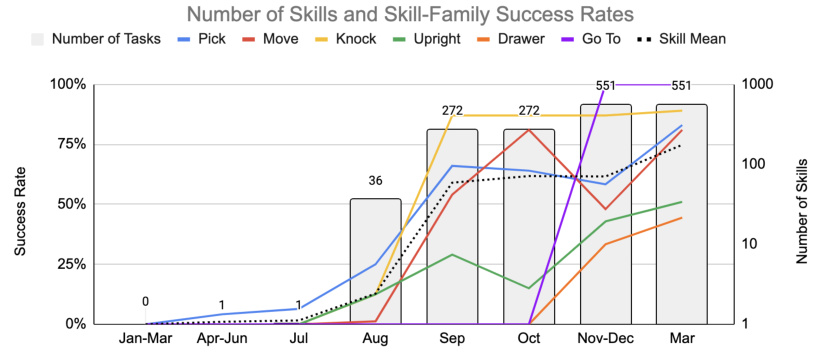
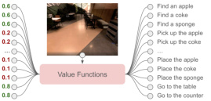

# SayCan: Do As I Can, Not As I Say

> 这是机器辅助生成的客观摘要笔记。教学版精读笔记由用户按节奏触发后单独成稿。

## 一句话讲什么（TL;DR）

让大语言模型（LLM）当"嘴和脑"出主意，机器人技能的 value function（价值函数）当"手和眼"打分，两者相乘选下一步动作。

## 这篇论文要解决什么问题（Why this paper）

想象你周末在家累瘫了，对着家用机器人喊一句"我刚把可乐洒桌上了，能帮帮我吗？"。你心里默默期待它走过去拿海绵、回来擦桌子。但现实是：机器人完全不知道"洒了"对应到自己身上是哪几个动作，更不知道厨房里有没有海绵。

这就是这篇论文要修的裂缝——**人类用嘴说的指令，和机器人能用手做的动作，对不上号**。

如果直接把这句话丢给大语言模型（LLM，比如 ChatGPT 那种），它的回答可能是"你可以拿吸尘器吸一下"。听起来很合理，可你这台是厨房机器人，根本没吸尘器，也不会用。LLM 像一个**只读过书没出过门**的学霸：常识满分，但不知道你家厨房里到底有什么、自己有几只手能干啥。

之前的两条路都各有缺陷：
- **路 A**：只用 LLM 生成动作文本——会出现机器人根本做不到的步骤
- **路 B**：只用强化学习训低层动作——听不懂"帮我从锻炼后恢复一下"这种抽象指令

SayCan 想把这两边的优点拼起来：让 LLM 负责想，让机器人自己的"手"投票表决"我能不能做到"。

## 用了什么方法（How）

整套方法的名字直接告诉你它分两半——**Say（说）+ Can（能）**。下面把这两半拆开讲。

### 第一半：Say —— 让 LLM 给候选动作打分

日常类比：假设你问一个见多识广的朋友"擦桌子第一步该干嘛"，他不会自己写文章，而是从你递给他的清单里挑——"找海绵 60%、拿可乐 5%、走去客厅 1%"。这种"给候选项打概率"的玩法，论文里叫 **scoring mode（打分模式）**，区别于平时我们熟悉的"自由生成文本"。

具体怎么操作：机器人有一份预先写好的 **技能描述清单**（如"pick up the sponge"、"go to the table"），LLM 拿到用户指令 i，就给清单里每条描述 ℓ_π 输出一个概率 p(ℓ_π | i)，意思是"这一步对完成指令有多大帮助"。

> 读到这里你可能在想：那 LLM 凭什么知道这条对、那条不对？答案是 prompt engineering（提示工程）——论文在 prompt 里塞了几个示范对话，LLM 模仿格式即可。

### 第二半：Can —— 让机器人自己说"我做不做得到"

日常类比：朋友嘴上说"你去拿冰箱里的啤酒"，但你其实**伸手摸了一圈**才知道——冰箱根本没啤酒，这步做不了。SayCan 让每个低层技能配一个 **value function（价值函数，记作 v(s, ℓ_π)）**，输出"在当前画面 s 下，这个技能能成功执行的概率"。

那 value function 怎么来的？论文用 **强化学习（Reinforcement Learning, RL）的 TD 方法（temporal difference，时间差分）** 训出来——简单说就是让机器人在仿真里反复试错，奖励 1（成功）/ 0（失败），训练出一个"打分网络"。这个网络就是论文里的 **affordance function（可供性函数）**，用来量化"环境给这个动作提供了多大可能性"。

> 读到这里你可能在想：Say 的概率和 Can 的概率怎么合到一起？答案就在下一节。

### 合体：两个概率相乘

公式很朴素：`p(c_π | s, ℓ_π) · p(ℓ_π | i)`。

日常类比：选餐厅你既要看朋友推荐（Say 高），又要看营业时间（Can 高，店得开门）；两个分都高才下手，只有一个高都不行。

每一步选乘积最高的技能去做，做完就把它追加到 prompt 里，再问下一步，直到 LLM 输出 "done"。论文里把这个流程写成了 **Algorithm 1**——一个简单的 while 循环。

### 技能怎么训出来的

- **行为克隆（Behavioral Cloning, BC，看人类演示模仿动作）**：用 BC-Z 方法训"做"——徒弟学师傅，每一刀照搬。BC 的动作执行更稳定。
- **强化学习（RL）**：用 MT-Opt 在仿真里训"判断能不能做"。RL 训出的 value function 才是用来打 affordance 分数的关键。

> 读到这里你可能在想：为什么"做"和"判断"要用两套训练？因为 BC 学不会"打分"，它只学动作；而 RL 自然会输出 value function。所以论文同时训两套，各取所长。

## 关键实验结果（What works）

实验在两个环境跑：**mock kitchen（仿造厨房，技能也是在这训的）** 和 **真实办公室厨房**。共 **101 条指令、7 个家族**（单步、抽象名词、抽象动词、结构化、躯体、众包、长程）。

- **PaLM-SayCan 在 mock 厨房：plan 成功率 84%、execution 成功率 74%**——为什么了不起？plan 84% 意味着 100 次里有 84 次能选对正确的步骤序列；execution 74% 意味着 100 次里 74 次真的把任务做完了。这是当时 LLM + 真机器人组合的标杆数字。
- **真实办公室厨房：plan 81%、execution 60%**——execution 掉了 14% 主要是真实环境光线、物体位置和训练时不同；但 plan 只掉 3% 说明 LLM 那部分泛化没问题。
- **去掉 Can（No VF 消融）：plan 67%**——比 SayCan 低 17 个百分点。这相当于"光听朋友推荐不看营业时间"，自然踩坑。
- **用生成式 LLM + 嵌入投影到最近技能（Generative 消融）：plan 74%**——也低 10 个百分点。这条对比的是同时期 Huang 等人 2022 的方法，证明 SayCan 的"打分 + 乘 affordance"比"生成 + 投影"更稳。
- **换更弱的 LLM（FLAN 137B 替代 PaLM 540B）：plan 70%、execution 61%**——为什么这个数字了不起？它第一次实证了"LLM 升级 → 机器人成功率跟着升级"。这意味着**机器人领域可以蹭 NLP 领域的进步**，是论文最有"学术影响力"的发现。
- **多语言查询**（中文 / 法语 / 西语）：planning 成功率几乎没掉。原因是 PaLM 训的多语料，SayCan 没做特别处理就免费拿到了多语言能力。

## 我读完后该懂的几个术语

- **Affordance（可供性）**：环境给某个动作提供的"可能性"。日常类比：门把手对你"招手"说"我可以被转动"。本文出现位置：第 3 节定义 affordance space `{p(c_π | s, ℓ_π)}`，整套方法的核心概念。
- **Value function / Q-function（价值函数）**：在状态 s 执行动作 a，未来累计回报的期望值。日常类比：玩游戏每个位置上方飘着的"通关概率预测"。本文出现位置：第 2 节"Preliminaries"，论文把它当成 affordance 用。
- **Grounding（落地 / 接地）**：把抽象语言对应到物理世界的物体和动作。日常类比：把"再来一杯"翻译成"具体走到吧台、拿起杯子、装水"。本文出现位置：题目就是 "Grounding Language in Robotic Affordances"，全篇核心。
- **Scoring mode（打分模式）**：不让 LLM 自由生成，而是给候选答案让它输出概率。日常类比：选择题打勾，不让你自由作文。本文出现位置：第 3 节"Connecting LLMs to Robots"，是 SayCan 的关键技巧。
- **Behavioral Cloning（BC，行为克隆）**：用人类演示数据做监督学习。日常类比：徒弟看师傅做菜每刀都模仿。本文出现位置：第 4 节实现细节，用 BC-Z 训低层动作。
- **TD（temporal difference，时间差分）**：强化学习里训 value function 的一类方法。日常类比：你考完一次模拟卷，根据结果"微调"自己对下一次成绩的预期。本文出现位置：第 2 节，用 MT-Opt 跑 TD。
- **Chain-of-Thought（CoT，思维链）**：让 LLM 在给出最终答案前先写一段"解释"。日常类比：数学题让你写过程不只写答案。本文出现位置：第 5.2 节，用来处理"不要苹果，给我别的零食"这种带否定的指令。
- **MDP（Markov Decision Process，马尔可夫决策过程）**：强化学习的数学框架，由 (S, A, P, R, γ) 组成。日常类比：把世界抽象成"状态 + 动作 + 转移规则 + 奖励"的棋盘游戏。本文出现位置：第 2 节，给 RL 提供数学背景。

## 这篇论文的局限 / 我看出的疑点

- **闭环反馈缺失**：SayCan 只在每一步开始时查一次 value function，技能中途失败或场景变化它感觉不到。**用户实际会遇到的问题**：机器人抓海绵手滑掉了，但它继续"走去桌子假装擦"——表演完整流程却没真擦干净。后续的 Inner Monologue 才补上这点。
- **技能库即上限**：能做什么完全取决于预训练的低层技能集合。**用户会遇到的问题**：你说"帮我打开微波炉"，但技能库里没有"open microwave"——SayCan 直接放弃，不会临时拼凑。论文坦诚长程任务里 65% 错误来自 LLM、35% 来自 affordance 误判。
- **value function 标定靠人手调**：每个技能的 v_min/v_max 是手动设定的（如 pick 用 0.2/0.5 截断）。**用户会遇到的问题**：换个新厨房，工程师得重新调一遍阈值，否则 affordance 概率全部偏移，整个系统就废了。
- **否定 / 歧义指令容易出错**：vanilla SayCan 处理"bring me a snack that isn't an apple"会失败，要靠 CoT prompting 兜底。**用户会遇到的问题**：你说"给我点不含咖啡因的"，它可能直接给你咖啡——因为 LLM 在 scoring 时把"咖啡"对应位置上的概率拉高了。
- **plan 和 execute 之间的 gap**：mock kitchen 84% plan / 74% execute，差 10 个点纯粹是低层动作执行失败。**用户会遇到的问题**：机器人"知道"该做什么，但手不听话——这部分 SayCan 自己解决不了，得靠 BC/RL 那边继续训。

## 与其他 12 篇的关联

- **和 RT-1 / RT-2（同组后续工作）**：SayCan 走"两段式"——LLM 高层规划 + 低层独立技能，每段单独训。RT-2 走的是"端到端"——一个 VLA（vision-language-action）模型从图+语言直接出动作，不再有显式的 plan 文本。两者本质是 trade-off：SayCan 可解释、可调试，RT-2 上限更高但黑箱。同一批人 18 个月内从 SayCan 走到 RT-2，反映了路线收敛。
- **和 Inner Monologue（论文自己点名的后续）**：Inner Monologue 在 SayCan 基础上把"成功检测器、场景描述、人类反馈"塞回 LLM 的 prompt，做成闭环。它没改 SayCan 的 Say × Can 乘法核心，只补了"做完一步看一眼"的反馈环。可以理解成 SayCan 的 v1.5。
- **和 OpenVLA / VLA 主线**：SayCan 是"语言负责思考、动作模型负责手脚"的两段路线；VLA 是"端到端从图+语言直接出动作"。OpenVLA 等论文常引用 SayCan 作为"为什么需要 grounding"的论据——即使端到端，也得让模型知道"当前场景里哪些动作可行"。SayCan 提供的是问题定义，VLA 提供的是另一种解法。
- **和 Code as Policies / PaLM-E**：这俩都是 SayCan 的"表亲"。Code as Policies 把 LLM 输出从"自然语言步骤"改成"Python 代码"，借编译器做更严格的结构化；PaLM-E 把视觉直接喂进 LLM，省掉 SayCan 那种 value function 单独训的步骤。三者共享同一个起点：**LLM 是 planner，物理世界要 ground**。

## 我建议的阅读顺序

面向零基础读者，给你一条 5 步路线，预计 90 分钟读完关键内容：

1. **先读 Abstract + 看 Figure 1（第 1 页）**——为什么这么读：用 30 秒理解论文要解决什么问题，"洒了饮料找海绵"这个例子贯穿全文。
2. **跳到 Figure 3（算法图）+ Algorithm 1（伪代码）**——为什么这么读：SayCan 的核心就是一个 while 循环 + 概率乘法，看完这两个图你已经懂 70% 了。其他章节都是在补这两张图的细节。
3. **回头读第 3 节"SayCan"主体（约 2 页）**——为什么这么读：这一节有 `p(c_π | s, ℓ_π) · p(ℓ_π | i)` 公式的推导，是论文唯一不能跳的数学部分。但放心，只是贝叶斯定理 + 假设独立。
4. **跳读第 5.1 节实验 + Table 2（消融表）**——为什么这么读：直接看数字，确认"去掉 Can 掉 17%、换弱 LLM 掉 14%"这两个对比，验证你对方法的理解。Figure 5、Figure 6 的长程示例可以扫一眼图就行。
5. **可跳过的章节**：第 2 节 "Preliminaries" 的数学推导（如果你不熟 RL 可以跳，影响不大）；第 4 节 "Implementing" 的网络架构细节（除非你要复现）；附录全部（除非你被某个具体数字困住）。

如果只有 30 分钟：读 Abstract → Figure 3 → Table 2，就能跟人对话了。

## 为什么值得读 / 不值得读

如果你只能读 1 篇 LLM × 机器人的论文，**SayCan 是首选**。它把"LLM 当 planner"这件事第一次系统化做出来，affordance 乘法这个组合简洁到可以画在餐巾纸上。

如果你要读 3 篇，加上 **Inner Monologue（闭环版的 SayCan）** 和 **RT-2（同组的端到端反命题）**——三篇连读你能看清整个领域的"两段式 vs 端到端"主线之争。

如果你要读 5 篇，再加 **Code as Policies（输出代码而非文本）** 和 **PaLM-E（多模态输入）**——你就拿到了"LLM 当 planner"这条线的完整光谱。

如果你只看 VLA 端到端那条线（OpenVLA、π0），SayCan 可以略读，但理解它对看懂"为什么 VLA 也要解决 grounding"很有帮助——SayCan 提供的是**问题的标准定义**，即使你不用它的解法，问题本身绕不开。
