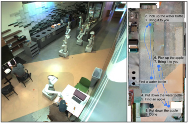

# SayCan: Do As I Can, Not As I Say — Grounding Language in Robotic Affordances

> 这是一份给"完全没接触过 AI / 机器人"的读者写的精读笔记。所有"专业词"第一次出现都会解释清楚，并用生活场景打比方。只看这份笔记就能理解全文机制。

## 一句话讲什么（TL;DR）

让"见多识广但出不了门的 AI"出主意，让机器人自己摸口袋说"这事我现在能做"，两边都点头才动手——AI 出嘴，机器人出手，两个分数相乘选下一步。

*所以这一节是想说：SayCan 用"AI 觉得应该做 × 机器人觉得能做"这个乘法，第一次让 LLM 真正指挥了真实机器人。*

---

## 这是个什么场景

周末你瘫在沙发上刷手机，可乐一不小心洒了一桌子，顺嘴对家里的机器人喊：

> "我刚把可乐洒桌上了，能帮帮我吗？"

你脑子里的画面很简单：它走过去、拿块海绵、回来擦干净。但站在机器人那一头，事情完全不是这么回事：

- 它**听**得懂"洒了"和"帮帮我"，但**不知道**对应自己身上哪几个动作。
- 它**知道**自己有机械臂和手指，但**不知道**"擦桌子"在自己的动作清单里叫什么名字。
- 更糟的是，如果你不告诉它"你家里有海绵、没有吸尘器"，它可能会建议你"用吸尘器"——一个根本不存在的解决方案。

再打几个生活里的比方：

- 你让一个只看过武侠小说的人"练一下凌波微步"——他知道这招听起来厉害，但你根本不知道脚要怎么迈。
- 你跟外国朋友点菜，他用菜单上没有的菜名报菜——服务员一脸懵，因为店里压根没这道菜。
- 你给 10 岁的弟弟发微信说"帮我把衣服从洗衣机挪到阳台"，他可能听得懂句子，但够不着晾衣绳。

这篇论文想修的，就是这条裂缝：**人嘴里说的话（高层语义），和机器人手能做的动作（底层控制），对不上号**。


*所以这一节是想说：人说的话和机器人能做的事，中间隔着一条沟——LLM 知道"应该做什么"，但不知道"能不能做"。论文就是想架桥。*

---

## 之前的人怎么做的，为什么不够好

研究者之前主要试了三条路，每一条都有致命缺陷：

**路 A：只让"AI 大脑"出主意（LLM as Zero-Shot Planner）**

做法：把用户说的话丢给一个会说话的 AI（比如 GPT-3），让它写出"步骤 1、步骤 2、步骤 3"。

问题：AI 像一个只读过书没出过门的学霸——它可能让你"用吸尘器"，但你家厨房根本没吸尘器。它不知道你家有什么，也不知道机器人能做什么。

**路 B：只让"机器人手"自己学**

做法：机器人在房间里反复试错（强化学习），学会"抓"、"放"、"走"等小动作。

问题：你跟它说"帮我恢复一下体力"，它完全懵——这种抽象指令它根本听不懂。它只认识"pick up the red bull can"这种极具体的命令。

**路 C：两个简单地接起来（先生成再匹配）**

做法：让 AI 自由写出自然语言计划，然后用文本相似度把每一步硬匹配到机器人会的动作上。

问题：AI 一旦写出个不存在的动作（比如"use a vacuum cleaner"），匹配就强行配到最像的那个，结果错得离谱。而且你丢掉了"这一步有多靠谱"的概率信息。

**共同毛病**：要么"会说不会做"，要么"会做不会想"——没有人把"应该做"和"能做"两个判断**同时**纳入决策。

> **接地问题（Grounding Problem）**：LLM 的知识悬在空中，没有"落地"到具体的物理环境和机器人能力上。就像蒙眼食客点菜——他懂美食但看不见菜单，服务员懂菜单但不懂搭配。

*所以这一节是想说：以前要么只让脑子工作，要么只让手工作，没人同时考虑"应不应该做"和"做不做得到"。*

---

## 这篇论文的新想法

一句话点睛：

> **让 AI 提名候选动作并打"想不想做"的分（Say），让机器人自己打"做不做得到"的分（Can），两个分相乘，谁高听谁的。**

类比：你周末选餐厅吃什么。

- 朋友（AI）对每家餐厅打"好不好吃"的分（Say）
- 你自己摸口袋看"去不去得起"（Can）
- 最终选择 = 朋友推荐分 × 你口袋里的钱 → 两边都高的那家才去

这个简单的乘法，第一次让 LLM 的知识真正"落地"到了真实的机器人上。

*所以这一节是想说：核心创新就是一个乘法——"应该做" × "能做"，缺一不可。*

---

## 它分几步做的（方法）

整套方法的名字直接说明结构：**Say（AI 说） + Can（机器人能）**。整个系统是一个 while 循环：每一步选一个动作执行，执行完再选下一步，直到 AI 说"done"。

### 1. 先准备一份"动作菜单"（Skill Library）

**类比**：点外卖 App 不会让你自由写"我想吃个温温的、有蛋白质的东西"，它给你一份菜单，让你从里面选。

**输入**：无（预先准备好的）

**处理**：机器人事先通过大量练习（强化学习 + 行为克隆）学会了一堆小动作，每个动作配一句英文描述：

- "pick up the sponge"（拿起海绵）
- "go to the table"（走到桌子那儿）
- "place on counter"（放到台面上）
- "find a coke can"（找到可乐罐）
- "open the drawer"（打开抽屉）

**输出**：一张包含 **551 个技能**的大菜单。每个技能有三样东西：一句话描述（ℓ_π）、一个执行策略（policy π）、一个成功率评估器（value function）。

**为什么这步有用**：把"自由作文"变成"选择题"，AI 就不会说出机器人做不到的事。后面所有打分都只在菜单内选择。

> **技能（skill）**：机器人已经学会的一个小动作。每个技能都有明确的成功/失败判定——要么做到了（奖励 1），要么没做到（奖励 0）。

> **行为克隆（Behavioral Cloning, BC）**：让 AI 看人类演示，每一步都照抄。徒弟跟师傅做菜每刀都模仿。论文里人戴 VR 头盔遥控 10 台机器人收了 **11 个月**数据（68000 条演示），用这些数据训练"执行策略"。

> **强化学习（RL）**：让 AI 通过反复试错学习。成功了+1分，失败了+0分，慢慢学会"看一眼就知道能不能做"。论文里在模拟器中训练"价值函数"，再迁移到真机器人。

*所以这一节是想说：一切从一张固定的菜单开始，AI 不能瞎点菜，只能从菜单上选。*

---

### 2. Say —— 让 AI 给菜单上每道菜打分（Task Grounding）

**类比**：考试不让你自由写"下一步该干啥"的作文，而是给你选项 A/B/C/D，让你对每个选项说"我觉得这个对的可能性是多少%"。

**输入**：用户指令（如"我把可乐洒了，帮帮我"）+ 之前已经做完的步骤 + 菜单上所有 551 个技能的文字描述

**处理**：

1. 构造一段"提示语（prompt）"，格式像人和机器人之间的对话：
   ```
   Human: 我刚把可乐洒桌上了，能帮帮我吗？
   Robot: 1. [候选动作填这里]
   ```

2. 把菜单上每道菜的描述（比如"pick up the sponge"）一个一个接到 "Robot: 1. " 后面。

3. 让 LLM 计算"在这段对话后面接这道菜，读起来有多顺畅"——这个顺畅度就是一个 0 到 1 的概率分数。分数越高，说明 LLM 觉得这道菜越像"应该做的下一步"。

**输出**：菜单上每个技能各得到一个"应该做"的分数 p(ℓ_π | i)

**关键细节**：

- LLM 不自由生成文字，而是被强制进入"打分模式（scoring mode）"——给定一个候选句子，算它出现在这个位置的概率。
- 论文使用的 LLM 是 Google 的 **PaLM 540B**（5400 亿参数）。
- 每选完一步，就把选好的动作追加到对话里（"Robot: 1. find a sponge, 2. [下一个候选]"），再问 LLM 第二步该做什么。这是一个**迭代过程**。

> **大语言模型（Large Language Model, LLM）**：一个读了海量文字的 AI，擅长"接龙"——给它开头，它能续写下一句。你可以把它当成一个见多识广但没出过门的朋友。

> **概率分布（probability distribution）**：每个选项一个 0~1 之间的数，加起来等于 1，表示"我相信每个选项的程度"。

> **提示工程（prompt engineering）**：精心设计给 AI 的开头话术，让它按你想要的格式回答。就像给学生看几道范例题再让他做新题。

**为什么这步有用**：

- AI 不会说出菜单外的东西——输出空间被约束了。
- 给每道菜一个**连续的分数**，方便后面跟机器人的分相乘。
- 不需要做"自由生成 → 匹配"这种容易出错的中间步骤。

*所以这一节是想说：AI 不写作文，只对菜单打分——这样它的每个回答都"合法"，不会出现现实中不存在的操作。*

---

### 3. Can —— 让机器人自己说"我现在做得到吗"（World Grounding）

**类比**：朋友推荐你去某餐厅吃饭，你伸手摸一圈口袋发现没钱包——这步当下做不了。"摸口袋"就是机器人在做的事。

**输入**：机器人头上摄像头的当前画面（RGB 图像）+ 某个技能的文字描述

**处理**：

1. 每个技能都配了一个"小裁判"（价值函数 / affordance function）。
2. 这个小裁判看一眼当前摄像头画面，再听一下要做的动作叫什么名字，输出一个 0~1 之间的数。
3. 这个数的含义是：**"在当前这个画面下，执行这个动作能成功的概率"**。

**输出**：菜单上每个技能各得到一个"现在能做"的分数 p(c_π | s, ℓ_π)

**直观理解几个例子**：

| 当前场景 | 候选动作 | 得分 | 原因 |
|---------|---------|------|------|
| 海绵在镜头正前方 | "pick up the sponge" | ≈0.9 | 海绵就在手边，伸手就能拿 |
| 海绵被杂物挡住 | "pick up the sponge" | ≈0.1 | 看不到海绵或者够不着 |
| 站在客厅 | "go to the table" | ≈0.7 | 要走过去，能做但需要导航 |
| 已经站在桌前 | "go to the table" | ≈0.0 | 已经在了，没必要做 |
| 手里没有任何物体 | "place sponge on table" | ≈0.0 | 手里空的，放什么？ |

**这个小裁判（价值函数）怎么训出来的**：

1. 在模拟器里让机器人反复尝试每个动作。
2. 成功了标记奖励 1.0，失败了标记 0.0。
3. 用 TD 学习（时序差分学习）训练一个神经网络，让它学会"看一眼画面就能预测这次能不能成"。
4. 训好之后从模拟器迁移到真机器人（sim-to-real transfer）。

> **可供性（affordance）**：环境给某个动作"提供"的可能性。比如门把手对你"招手"说"我可以被转动"，悬崖边的护栏说"你可以靠着我"。在论文里就是"现在做这个动作，成不成"的分数。

> **价值函数（value function）**：在当前状态下，做某个动作"能赢"（任务成功）的预期概率。论文里用 sparse reward（稀疏奖励：只在最终成功/失败时给分），所以价值函数就等于"成功概率"。

> **仿真到真实（sim-to-real）**：先在电脑里的虚拟环境练习，再搬到现实世界执行。像考前做模拟卷，上了真考场。论文里用 RetinaGAN 做图像风格迁移来缩小仿真与现实的视觉差距。


**为什么这步有用**：把"环境到底允不允许这步"这个**物理事实**塞进了决策里。AI 想得再多，物理上做不到也得 0 分。

*所以这一节是想说：机器人摸一摸口袋，告诉你"这事儿现在干不干得了"——不管 AI 怎么推荐，做不到就是做不到。*

---

### 4. 合体 —— 两个分相乘（The SayCan Formula）

**类比**：你周末选餐厅同时看两件事——朋友推荐分（Say）和餐厅是否营业（Can）。两个都高才动身；只有一项高（朋友吹爆但今天闭店）还是去不了。

**输入**：每个技能的两个分数：Say 分 + Can 分

**处理**：

```
最终分(π) = p(ℓ_π | i) × p(c_π | s, ℓ_π)
           = AI 觉得这步合理的程度 × 机器人觉得这步现在做得到的程度
```

选最终分最高的那个动作去执行。

**输出**：本轮要执行的动作 π_n = argmax_π [ p(ℓ_π | i) × p(c_π | s, ℓ_π) ]

**完整 while 循环（Algorithm 1）**：

```
n = 0
while 上一步不是 "done":
    for 菜单上每个技能 π:
        Say 分 = LLM 对"在已有步骤后面接这个技能"的概率
        Can 分 = 价值函数对"在当前画面下执行这个技能"的成功概率
        合并分 = Say 分 × Can 分
    选分最高的那个技能 π_n
    执行 π_n，观察新状态
    把 π_n 的描述追加到对话历史
    n += 1
输出 "done"，任务结束
```

**为什么用乘法而不是加法？**

- 乘法的物理含义是"两个独立条件**同时成立**的概率"。
- 类比：你周末出门 = "天气好" AND "有空"。两个都得真才出门。用乘法，任何一个 ≈ 0 就能把另一个压死。
- 如果用加法，一个特别高的分（AI 强烈推荐但做不到）也可能赢过一个两边都中等的选项——这不合理。

**为什么这步有用**：

- 只看 AI（去掉 Can）：它会推荐场景里根本不存在的物体。实验证明规划成功率从 84% 掉到 67%。
- 只看机器人（去掉 Say）：它根本听不懂任务在说啥。
- 一相乘，**两边都得满意**才能赢——AI 的常识和机器人的能力取交集。

*所以这一节是想说：核心公式就是一个乘法——AI 和机器人投票，谁都不能独裁，必须两个分都高。这是一个优雅的概率分解。*

---

### 5. 工程实现细节

**类比**：高考状元的光鲜背后是一桌子卷子和一抽屉错题本——理想公式很漂亮，现实里全是手工修补。

**机器人硬件**：

- Google Everyday Robots 的移动机械臂（Mobile Manipulator）
- 7 自由度手臂 + 两指夹爪 + 移动底座
- 输入：头顶 RGB 摄像头图像
- 动作空间：末端执行器 6-DoF 位姿 + 夹爪开合 + 底座 xy 位置和偏航角 + 终止信号

**技能训练**：

- **执行策略**（真正去做动作）：用 BC-Z 方法的行为克隆训练，输入是摄像头画面 + 技能的语言嵌入，输出是动作序列。
- **价值函数**（打成功率的分）：用 MT-Opt 方法在模拟器中做强化学习训练，然后通过 sim-to-real 迁移到真机器人。

**数据收集**：

- 10 台机器人、人类遥操作 11 个月 → 68000 条演示
- 数据没有公开——这是普通团队无法复现的主要原因

**脏活列表**：

1. **分数要"拉直"（calibration）**：训练完的价值函数输出可能挤在 0.2~0.5 之间，得手动归一化到 0~1 才像概率。
2. **每个新厨房都得重调**：换个房间、换个光线，分数就偏了，工程师得重新标定。
3. **BC 策略和 RL 价值函数各训一套**：执行动作用行为克隆的策略（成功率更高），评估能否做到用强化学习的价值函数（概率估计更准）。两套模型分开训练。
4. **语言编码**：技能描述通过 Universal Sentence Encoder 编码成向量，这个编码器和 PaLM 是两个不同的模型。

> **遥操作（teleoperation）**：人戴着 VR 头盔、拿着摇杆，操控机器人做动作，给 AI 当教材。

*所以这一节是想说：好看的公式背后是 11 个月的数据收集、两套不同的训练流程、和大量手工调参。*

---

### 6. 增强能力：思维链 + 多语言

**Chain-of-Thought（思维链）**：

SayCan 的一个弱点是处理不好否定句——你说"给我点不含咖啡因的饮料"，它可能直接给你咖啡（因为"咖啡因"这个词在句子里出现了，LLM 打分时反而把相关选项的分推高了）。

解决方案：让 LLM 先写一段"解释"（Explanation），再打分：

```
Human: 给我一杯不含咖啡因的水果味饮料
Explanation: 用户想要不含咖啡因、有水果味的饮料，我应该选青柠汽水。
Robot: 1. find a lime soda, 2. pick up the lime soda, 3. bring it to you, 4. done
```

这就是"先想再做"的思维链技术，让 LLM 先推理一遍再给答案，减少了因为表面词汇匹配导致的错误。

**多语言支持**：

PaLM 的训练数据包含多语言文本。实验中用中文、法语、西语各出了 4 条指令（共 12 条），11 条规划完美——LLM 免费提供了多语言理解能力，不需要任何额外训练。

*所以这一节是想说：思维链修补了否定句的弱点，多语言是 LLM 训练数据带来的意外收获。*

---

## 关键数字（What works）

实验在两个地方做：仿厨房（Mock Kitchen，机器人在这训练过）和真办公室厨房（Real Kitchen，没训练过，搬过去试）。共 101 条指令，7 个任务家族。

| 实验设置 | 规划成功率 | 执行成功率 | 含义 |
|---------|-----------|-----------|------|
| PaLM-SayCan（仿厨房） | **84%** | **74%** | 第一次证明"AI + 真机器人"能严肃合作 |
| PaLM-SayCan（真厨房） | 81% | 60% | 换环境规划只掉 3 点，执行掉 14 点 |
| 去掉 Can（只听 AI 的） | 67% | — | 证明 affordance 贡献了 17 个百分点 |
| 自由生成 + 硬匹配 | 74% | — | "打分"比"生成再匹配"更稳定 |
| FLAN-SayCan（换弱 LLM） | 70% | 61% | AI 越强，机器人越能干 |
| PaLM 8B（极小 LLM） | 38% | — | 小模型不行，常识不够用 |
| 多语言（中/法/西） | 11/12 正确 | — | LLM 免费带来多语言能力 |

**最有冲击力的发现**：

1. **affordance 贡献了 17 个百分点**：去掉机器人的"能做"判断（只用 LLM），规划成功率从 84% 降到 67%。说明 LLM 确实会推荐不存在的物体。

2. **LLM 越强 → 机器人越能干**：PaLM 540B（84%）> FLAN 137B（70%）> PaLM 8B（38%）。这是论文最激动人心的结论——意味着语言模型领域的进步可以**直接转化**为机器人领域的进步。

3. **执行 vs 规划的差距**：仿厨房里规划 84% 但执行只有 74%（差 10 点），真厨房里差距扩大到 21 点（81% vs 60%）。说明底层技能的鲁棒性是瓶颈——想对了但手不稳。

4. **65% 的失败来自 LLM，35% 来自 affordance**：LLM 最常见的错误是"提前终止"——做完一半就输出 done。

**按任务家族细看**：

| 家族 | 规划成功率 | 难点 |
|------|-----------|------|
| 单步原始指令 | 100% | 最简单 |
| 结构化语言 | 93% | 句式固定 |
| 抽象名词（"带个水果"） | 67% | 需要常识推理 |
| 长程任务（10+ 步） | 73% | 容易提前 done |
| 具身变化（环境不同） | 64% | affordance 判断容易偏 |

> **规划成功率（plan success rate）**：100 次里能"想对"步骤顺序的比例。由 3 个人类评分员投票决定。
>
> **执行成功率（execution success rate）**：100 次里"想对又做对"的比例。显然 ≤ 规划成功率。



*所以这一节是想说：方法是有效的。affordance 乘法贡献了 17 个百分点，而且 LLM 越强效果越好——这为"大模型 + 机器人"的整条路线提供了信心。*

---

## 实验结果说明了什么

从数字中可以提炼出五条关键结论：

**结论 1：接地（grounding）是必须的，不是可选的。**

去掉 affordance 后掉了 17 个百分点——LLM 的常识虽然丰富，但脱离物理环境就会"空想"。这验证了论文的核心假设。

**结论 2：语言模型的能力提升可以直接转移到机器人。**

从 PaLM 8B → 540B，规划成功率从 38% 跃升至 84%。这意味着机器人团队不需要重新训练任何底层策略，只要换一个更强的 LLM，机器人就自动变聪明。这是 SayCan 最激动人心的发现。

**结论 3：执行瓶颈在底层策略，不在规划。**

仿厨房规划 84% vs 执行 74%——差距来自底层技能执行失败（如抓取手滑、导航偏移）。搬到真厨房后差距进一步拉大（81% vs 60%），说明策略对训练环境的依赖性很强。

**结论 4：否定和长程是两大杀手。**

"bring me something without caffeine" 这种否定指令容易把 LLM 引向相反方向（因为 "caffeine" 出现在句子中反而推高了含咖啡因饮料的得分）。长程任务中 65% 的失败是 LLM 提前输出 "done"。这两个问题是 SayCan 后续改进（CoT、Inner Monologue）的直接动机。

**结论 5：多语言是免费的副产品。**

12 条非英语指令中 11 条规划完美。因为 PaLM 本身就是多语言模型，SayCan 的框架不需要任何修改就自动支持中文/法语/西语。

*所以这一节是想说：实验证明了 "LLM × 机器人" 这条路是可行的，同时也精准地指出了三个需要后续解决的硬伤——否定、长程提前终止、底层策略鲁棒性。*

---

## 你应该懂的几个新词

> **大语言模型（Large Language Model, LLM）**：一个读了海量文字的 AI，擅长"接龙"下一句话。你可以把它想成一个见多识广但从未出过门的朋友——什么都"听说过"，但没有亲身"做过"。

> **可供性（Affordance）**：环境对某个动作"提供"的可能性。比如门把手对你"招手"说"我可以被转动"。在 SayCan 中，就是机器人基于当前视觉画面判断"这个动作现在做不做得到"的概率。

> **价值函数（Value Function）**：强化学习中的概念。粗暴理解为"在当前局面做这个动作最终能成功的概率"。游戏里每个位置上方飘着的"通关概率预测"就是这个东西。SayCan 用它来实现 affordance 评估。

> **强化学习（Reinforcement Learning, RL）**：让 AI 通过反复试错、拿奖惩来学习。和你打游戏死了重来、慢慢知道哪个套路能过关，是一回事。

> **行为克隆（Behavioral Cloning, BC）**：让 AI 看人类演示，每一步都照抄。徒弟跟师傅做菜每刀都模仿。SayCan 用 BC 训练"真的执行"的策略。

> **接地问题（Grounding Problem）**：LLM 的知识悬在空中，需要"落地"到具体的物理环境和机器人能力。SayCan 的全部贡献就是解决这个问题。

> **提示工程（Prompt Engineering）**：给 LLM 的开头话术里塞几个示范，让它模仿格式和风格。SayCan 用提示告诉 LLM "你是一个机器人助手，请从以下技能中选择"。

> **打分模式（Scoring Mode）**：不让 LLM 自由写句子，而是给一组候选答案让它打分。和选择题打勾而不是写作文，是一个道理。SayCan 的核心创新之一就是把 LLM 从"生成模式"切换到"打分模式"。

> **思维链（Chain-of-Thought, CoT）**：让 LLM 在给答案前先写一段推理过程。和数学题要求写过程而不只写答案，是一回事。SayCan 用它来解决否定指令的问题。

> **闭环 vs 开环**：闭环 = 做一步看一眼再决定下一步；开环 = 一口气把计划列完不管中间发生什么。SayCan 是"半闭环"——每一步开始时看一眼当前画面（通过 value function），但不检查上一步有没有成功。

> **仿真到真实（Sim-to-Real）**：先让机器人在虚拟环境里练，再搬到现实——像考前模拟考再上真考场。SayCan 的 RL 策略用 RetinaGAN 做 sim-to-real 迁移。

*所以这一节是想说：上面这些词以后再看到不用慌——你在 SayCan 里都见过它们的实际运用了。*

---

## 它有什么搞不定的

1. **菜单外的事一概不会**。你说"帮我打开微波炉"，但 551 个技能里没有 "open microwave"——系统只会从现有菜单里选一个"最像的"硬上，而不是说"我不会"或者临时拼凑。这是固定技能库范式的根本局限。

2. **做到一半失败它不知道**。抓海绵手滑掉了，它继续走去桌子假装擦——表演完整流程，桌子还是脏的。因为 value function 只在每一步**开始时**评估一次，动作执行中途不会回头确认。后续的 Inner Monologue 就是为了修这个问题。

3. **否定指令是天敌**。"给我点不含咖啡因的饮料"——LLM 看到"咖啡因"三个字，反而把含咖啡因的选项分数推高了。虽然 CoT 能缓解，但不能根治。

4. **长程任务容易提前 done**。让它带饮料和零食，它带完饮料就觉得任务结束、输出 done。论文报告 65% 的 LLM 失败属于这一类。

5. **手工调参是软肋**。Value function 输出的分数范围会随环境变化漂移（训练厨房 vs 真厨房），工程师得重新标定阈值。换个新场景就得人工介入。

6. **推理速度慢**。每一步都要对 551 个技能各打一次分，长程任务可能需要十几秒到分钟级的决策时间。后续的 RT-2 把整个流程压缩到 200 毫秒。

7. **数据收集成本高**。10 台机器人遥操作 11 个月收集了 68000 条演示。这个前置成本让大多数团队无法复现。

*所以这一节是想说：SayCan 的核心局限在于——固定菜单、无失败检测、否定处理差、长程提前终止、环境迁移脆弱。后续每篇工作（Inner Monologue、RT-2、PaLM-E）都是在修其中一两个。*

---

## 它和别的几篇是什么关系

**时间线定位：**

```
2022.01  Huang et al. "Language Models as Zero-Shot Planners"  ← 前传，没加 affordance
2022.04  SayCan（本篇）                                       ← 加了 affordance 乘法
2022.07  Inner Monologue                                      ← 续作 v1.5：加闭环反馈
2022.09  Code as Policies                                     ← 表亲：让 LLM 输出代码
2023.03  PaLM-E                                               ← 表亲：把图像直接喂进 LLM
2023.07  RT-2                                                 ← 反命题：端到端，省掉两段式
```

**因果关系：**

- SayCan **证明了** "LLM + affordance" 路线的可行性 → 整个 Google Robotics 团队后续两年的工作都以此为起点
- SayCan 的"开环"缺陷 **直接催生了** Inner Monologue（加闭环反馈）
- SayCan 的"固定菜单"缺陷 **直接催生了** Code-as-Policies（用代码自由组合）
- SayCan + PaLM-E 的"两段式"缺陷 **直接催生了** RT-2（端到端直接输出动作 token）

**集合关系：**

- "模块化规划"集合 = {SayCan, Code-as-Policies, Inner Monologue, ...}
- "端到端"集合 = {RT-2, OpenVLA, ...}
- 两个集合是技术路线之争——模块化可解释但脆弱；端到端统一但不透明

**和本导读其他论文的关系：**

- **LLaVA**（Ch09）：SayCan 用纯文本 LLM 当大脑；LLaVA 说明如果给 LLM 装上眼睛（VLM），就不需要单独的 value function 来"看"环境了 → 这正是 PaLM-E 和 RT-2 走的路
- **OpenVLA / VLAs / MLA**（Ch12）：是 SayCan 路线的"反命题"——不再 plan-then-act，而是用一个端到端模型直接从视觉输出动作
- **Cosmos-Policy**（Ch15）：世界模型路线——让 AI 先"想象"动作的后果，再决定要不要做。SayCan 的 value function 可以看作是世界模型的最原始形态

*所以这一节是想说：SayCan 是 "LLM 当机器人大脑" 这整条技术路线的开山之作。后续几乎所有工作——无论是改进还是推翻——都在回应它提出的问题。*

---

## 和本导读的关系

本篇对应 [Ch10: 高层规划——SayCan / Code-as-Policies / Inner Monologue](../guide/ch10-planning.md)。

Ch10 将 SayCan 与 Code-as-Policies、Inner Monologue 三篇并列讲解，重点在于对比三种接地策略的优劣。本深度笔记则专注于 SayCan 自身的细节——特别是 value function 的训练方式、打分模式的实现细节、实验数字背后的含义。

读完本笔记后，建议接着读 Ch10 中关于 Code-as-Policies 和 Inner Monologue 的部分，你会更清楚地看到 SayCan 的局限是如何被后续工作一一修补的。

*所以这一节是想说：SayCan 是 Ch10 的核心论文，理解了它就理解了整章的起点。*

---

## 思考题

**Q1：如果把 SayCan 的乘法改成加法（Say + Can 而不是 Say × Can），会出现什么问题？**

<details>
<summary>提示</summary>

想想概率的意义。乘法 = "两件事同时成立"。加法 = "两件事的加权混合"。如果某个动作 LLM 打了 0.9 分但 affordance 只有 0.01（物理上几乎不可能），乘法结果是 0.009（几乎不选），加法结果是 0.91/2 ≈ 0.455（可能还排在前面）。加法允许一边特别低的情况被另一边"救"回来，这违背了 SayCan 的设计意图——两边都得满意才行动。
</details>

**Q2：SayCan 用打分模式而非生成模式来使用 LLM，这带来了什么好处和什么代价？**

<details>
<summary>提示</summary>

好处：(1) 输出永远合法——只能从菜单中选；(2) 得到连续分数，可以和 affordance 相乘；(3) 更可解释——能看到每个选项的分数排名。代价：(1) 不能发明菜单上没有的新动作；(2) 菜单越大，计算量越高（551 个技能各打一次分）；(3) 失去了 LLM 的组合创造力。这个代价正是 Code-as-Policies 试图克服的。
</details>

**Q3：为什么论文选择用 RL 训练 value function，而不是直接用一个预训练视觉模型（如 CLIP）来判断 affordance？**

<details>
<summary>提示</summary>

CLIP 能判断"图里有没有海绵"（物体存在性），但不能判断"在当前姿态下机器人的夹爪能不能成功抓到海绵"（动作可行性）。后者需要考虑机器人的运动学约束、物体的摆放角度、遮挡情况等——这些是纯视觉模型无法评估的。RL value function 通过大量试错学到了"在这个画面下做这个动作能成功的概率"，本质上编码了机器人的身体能力和环境的物理约束。不过，后来的 PaLM-E 确实尝试了让大 VLM 来直接替代 value function 的角色。
</details>

**Q4：SayCan 是"半闭环"的——每一步开始时看一眼，但不检查上一步是否成功。如果你要加入失败检测，应该在 Algorithm 1 的哪一行之后加入什么逻辑？**

<details>
<summary>提示</summary>

在第 11 行（Execute πn）之后、第 12 行（n = n+1）之前，加入一个 success detector：如果上一步执行失败，(a) 可以重试同一个技能；(b) 可以把"上一步失败了"作为文本反馈追加到 prompt 中，让 LLM 重新规划。方案 (b) 正是 Inner Monologue 的做法。
</details>

**Q5：论文报告换用 PaLM 8B（小模型）后规划成功率从 84% 暴跌到 38%。你认为这主要是因为小模型缺少"常识知识"还是缺少"指令跟随能力"？如何设计实验来区分这两个原因？**

<details>
<summary>提示</summary>

可以设计两组对照：(1) 简单的单步指令（如"拿起红色罐子"）——这几乎不需要常识，只需要指令跟随；(2) 需要推理的抽象指令（如"我刚运动完，给我来点恢复体力的东西"）——这需要"运动后需要水和健康食物"的常识。如果小模型在 (1) 上表现尚可但在 (2) 上崩盘，说明主要是常识缺失；如果两者都差，说明指令跟随本身就不行。论文的 Table 6 提供了一些线索——NL Single Primitive（简单）vs Long-Horizon（复杂）的差异。
</details>

**Q6：SayCan 用了 551 个预定义技能。如果你要部署到一个全新的环境（比如医院而非厨房），需要做哪些工作？成本有多高？**

<details>
<summary>提示</summary>

需要：(1) 重新设计技能菜单（医院场景的动作：推轮椅、递药瓶、按电梯按钮等）；(2) 为每个新技能收集遥操作演示数据并训练策略；(3) 为每个新技能训练 value function；(4) 在新环境中标定 value function 的分数范围；(5) 修改 prompt 中的示范例子。其中 (2) 是最贵的——论文中 10 台机器人 11 个月才覆盖一个厨房。这也是为什么后续的端到端方法（如 OpenVLA）试图绕过"预训练大量独立技能"这一步。
</details>

**Q7：如果未来有一个完美的 VLM（既能看图又能规划），SayCan 的 affordance 乘法还有存在价值吗？**

<details>
<summary>提示</summary>

取决于你对"完美"的定义。即使 VLM 能看到场景中有什么物体，它仍然可能不知道机器人的运动学约束（比如手臂最大伸展距离、夹爪最大开口）。affordance function 编码的不仅是"物体在不在"，还有"这台特定机器人在这个特定姿态下能不能完成这个特定动作"——这是身体感知，不是视觉感知。所以即使 VLM 再强，某种形式的"身体能力评估"仍然有价值。不过形式可能从独立的 value function 演变为 VLM 内部学到的隐式表征。
</details>

---

## 一些好奇心问答（FAQ）

**Q：这个系统跑一次需要多久？**

每一步要对 551 个技能各打一次 LLM 分数。用 PaLM 540B 这种超大模型，单次决策可能需要几秒到十几秒。一个 10 步的长程任务从开始到结束可能需要几分钟（包括实际执行时间）。后来的 RT-2 把整个流程压缩到 200 毫秒 / 步——快了两个数量级。

**Q：训练数据怎么来的？普通团队能复现吗？**

10 台 Everyday Robots 机器人，工程师戴 VR 头盔遥操作 11 个月，共 68000 条演示。这个数据**没有公开**。普通学术团队几乎不可能复现——这也是为什么后续出现了 Open X-Embodiment 这种大规模开源数据集。论文提供了一个简化的桌面 Colab Demo（用 UR5 + CLIPort + GPT-3），截至 2024 年还能跑。

**Q：代码开源吗？**

完整版没有开源。项目主页 say-can.github.io 上有简化的 Colab notebook。

**Q：为什么用 PaLM 而不是 GPT-4？**

时间线问题。SayCan 是 2022 年 4 月的工作，GPT-4 要到 2023 年 3 月才发布。论文团队是 Google 的，自然使用自家的 PaLM 模型。

**Q：SayCan 这个名字什么意思？**

"Do As I Can, Not As I Say" 的缩写。Say = LLM 说了什么（应该做什么），Can = 机器人能做什么。名字本身就是论文的核心主张：不要让 LLM 瞎说，要让机器人基于自己的能力来约束。

*所以这一节是想说：SayCan 的工程门槛极高（10 台机器人 11 个月），但思想极其简洁（一个乘法），这种"思想简单、工程困难"的特征定义了 2022 年的具身 AI 研究风格。*

---

## 如果你想再深入

按"前传 → 同期 → 续作 → 反命题"四类排序：

1. **前传：Huang et al. 2022 "Language Models as Zero-Shot Planners"** — 看 SayCan 之前没有 affordance 时长什么样。LLM 直接自由生成步骤，结果经常给出物理上不可能的动作。SayCan 加了 affordance 乘法后性能从 67% 跳到 84%。

2. **同期表亲：Code as Policies (2022.9)** — 不从菜单选而是让 LLM 直接写 Python 代码调用 API。优势：能自由组合出菜单上没有的新行为。劣势：代码可能有 bug，且没有 affordance 兜底。

3. **续作 v1.5：Inner Monologue (2022.7)** — 在 SayCan 上加"闭环反馈"。每步执行后收集三种文本反馈（成功检测器、场景描述器、人类反馈），追加到 prompt 中让 LLM 重新规划。修补了 SayCan "做到一半失败不知道"的致命缺陷。

4. **升级：PaLM-E (2023.3)** — 把图像 token 直接喂进 LLM，省掉了独立训练 value function 的步骤。可以理解为"把 SayCan 的 Can 也塞进 LLM 内部"。

5. **反命题：RT-2 (2023.7)** — 同一组人 15 个月后做的端到端方案。把规划和执行合成一个大 VLM，直接从像素输出动作 token。证明了"如果模型够大 + 数据够多，可以不需要 SayCan 的两段式"。

读顺序建议：

```
SayCan（你在这） → Inner Monologue（闭环补丁）
                 → Code as Policies（代码路线变体）
                          ↘
                           PaLM-E（VLM 统一路线）
                                    ↘
                                     RT-2 / OpenVLA（端到端反命题）
```

*所以这一节是想说：SayCan 是入口。从它出发，向左走是闭环改进（Inner Monologue），向右走是代码生成（Code-as-Policies），向上走是端到端革命（RT-2）。*

---

## 原文信息

```bibtex
@inproceedings{ahn2022saycan,
  title={Do As I Can, Not As I Say: Grounding Language in Robotic Affordances},
  author={Ahn, Michael and Brohan, Anthony and Brown, Noah and Chebotar, Yevgen and Cortes, Omar and David, Byron and Finn, Chelsea and Fu, Chuyuan and Gopalakrishnan, Keerthana and Hausman, Karol and others},
  booktitle={Conference on Robot Learning (CoRL)},
  year={2022}
}
```

- 项目主页：[say-can.github.io](https://say-can.github.io)
- 开源 Colab：[say-can.github.io/#open-source](https://say-can.github.io/#open-source)
- arXiv：[arxiv.org/abs/2204.01691](https://arxiv.org/abs/2204.01691)
