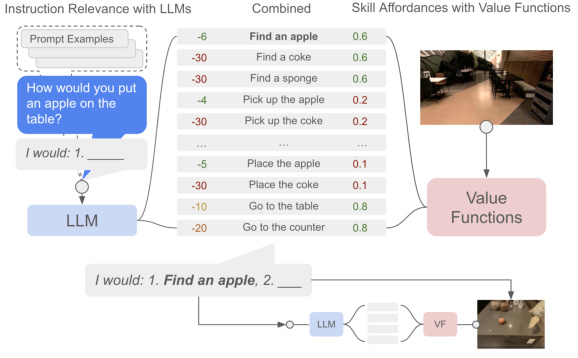

# SayCan: Do As I Can, Not As I Say

> 这是机器辅助生成的客观摘要笔记。教学版精读笔记由用户按节奏触发后单独成稿。

## 一句话讲什么（TL;DR）

让大语言模型（LLM）当"嘴和脑"出主意，机器人技能的 value function（价值函数）当"手和眼"打分，两者相乘选下一步动作。

## 这篇论文要解决什么问题（Why this paper）

想象你周末在家累瘫了，对着家用机器人喊一句"我刚把可乐洒桌上了，能帮帮我吗？"。你心里默默期待它走过去拿海绵、回来擦桌子。但现实是：机器人完全不知道"洒了"对应到自己身上是哪几个动作，更不知道厨房里有没有海绵。

这就是这篇论文要修的裂缝——**人类用嘴说的指令，和机器人能用手做的动作，对不上号**。

如果直接把这句话丢给大语言模型（LLM，比如 ChatGPT 那种），它的回答可能是"你可以拿吸尘器吸一下"。听起来很合理，可你这台是厨房机器人，根本没吸尘器，也不会用。LLM 像一个**只读过书没出过门**的学霸：常识满分，但不知道你家厨房里到底有什么、自己有几只手能干啥。

之前的两条路都各有缺陷：
- **路 A**：只用 LLM 生成动作文本——会出现机器人根本做不到的步骤
- **路 B**：只用强化学习训低层动作——听不懂"帮我从锻炼后恢复一下"这种抽象指令

SayCan 想把这两边的优点拼起来：让 LLM 负责想，让机器人自己的"手"投票表决"我能不能做到"。

**它和你日常用的产品的关系**：你今天能让 ChatGPT 帮你"想"出菜谱、让扫地机自己回去充电、让无人配送车规划路线——但这些都还是"想"和"做"分开的两件事。SayCan 是把"想"和"做"第一次系统性接到一起的论文。论文出来后 18 个月，谷歌就推出了 RT-2、PaLM-E，把同一个想法做得更深；今天你刷到的"端到端机器人"演示视频（比如 Figure 02、Apptronik Apollo），祖宗逻辑都能追到这篇。


## 用了什么方法（How）

整套方法的名字直接告诉你它分两半——**Say（说）+ Can（能）**。下面把这两半拆开讲。

### 1. Scoring Mode —— 把"自由作文"换成"选择题"

**类比**：考试时不让 LLM 写作文回答"下一步该干啥"，而是给它一份选项 A/B/C/D，让它每个选项打一个置信度。

**它在干什么**：LLM 内部本质上是在算 `p(下一个词 | 之前的词)`。Scoring mode 利用这个机制：把每条技能描述（如"pick up the sponge"）拼接到 prompt 后面，让 LLM 算出"在这个 prompt 后接这个描述"的对数似然，归一化后得到 `p(ℓ_π | i)`。

**关键步骤**：
1. 写一个 prompt 模板（dialog 格式："Human: How would you ... / Robot: 1. ..."）
2. 对每条技能描述 ℓ_π，把它拼到 "Robot: 1. " 后面
3. 让 LLM 计算这条续写的概率
4. 在所有候选技能上做 softmax，得到一个分布

**为什么这么设计**：让 LLM 自由生成会出现机器人做不到的步骤（"用吸尘器"），还要解析自然语言成技能名（容易出错）。Scoring mode 一次性解决两个问题：输出空间被强制约束在已知技能集，且不需要解析。

**消融告诉了我们什么**：论文里 Generative 基线（让 LLM 自由生成 + 用 USE embedding 投到最近技能）planning 只有 74%，比 SayCan 的 84% 低 10 个点——证明"打分"比"生成 + 投影"鲁棒。

### 2. Affordance / Value Function —— 让"手"自己投票

**类比**：朋友推荐去某家餐厅，但你伸手摸一圈口袋发现没钱包，这步就做不了。Value function 就是机器人的"摸口袋"动作。

**它在干什么**：每个技能都有一个伴生的 Q-network，输入是当前 RGB 图像 + 技能的语言描述，输出 0~1 之间的成功概率。

**核心数学（人话翻译版）**：
- 原文：`L_TD(θ) = E_(s,a,s')~D [R(s,a) + γ·E_a*~π Q^π_θ(s', a*) − Q^π_θ(s, a)]²`
- 人话：让 Q-network 学一个等式——"现在估的成功率" 要等于 "立刻拿到的奖励 + 折扣 × 下一步估的成功率"。这叫 TD（时间差分），意思是"当前估计 vs 下一步估计的差"应该越小越好。
- 在稀疏奖励下（成功 1，失败 0），训练好的 Q 函数就直接是"在这个状态做这个动作能成功的概率"——也就是 affordance。

**关键超参**：
- 输入图像 640×512，pad 到 740×592 后随机裁回 640×512（image augmentation）
- 训练用 16 个 TPUv3 chip，跑约 100 小时
- 数据采集用 3000 个 CPU worker 收 episode + 3000 个 worker 算 target Q
- Prioritized experience replay，priority = `1 + 10 · |p − 0.5|`（让 50% 成功率的样本优先重放）

**为什么这么设计**：BC（行为克隆）训出来只会"做"不会"判分"；要拿到 affordance 必须用 RL 的 value function。所以 SayCan 同时训 BC（用来执行）和 RL（用来打 affordance 分），分工明确。

### 3. 概率乘法 —— 两个分一起决定下一步

**类比**：选餐厅 = 朋友评价 × 营业时间，两项都要高。

**核心公式（人话翻译版）**：
- 原文：`p(c_i | i, s, ℓ_π) ∝ p(c_π | s, ℓ_π) · p(ℓ_π | i)`
- 人话：选哪个动作 = "LLM 觉得这步对完成指令有帮助的程度（Say）" × "RL 模型觉得这步当前能成功执行的程度（Can）"。
- 每一项的来源：
  - `p(ℓ_π | i)` 来自 PaLM 在 scoring mode 下给指令 i 续写技能描述 ℓ_π 的概率
  - `p(c_π | s, ℓ_π)` 来自 RL 训出的 Q-network，在状态 s 下输出技能 ℓ_π 的成功率

**推导背后的假设**：论文做了一个朴素假设——"成功执行的技能贡献 p(ℓ_π|i) 的进度，失败的贡献 0"。这个假设让贝叶斯展开变成简单乘法。如果你较真它在现实中不严格成立（比如你 pick 失败可能也算"接近完成"），但这个假设让方法简洁可工程化。

**Algorithm 1 的 while 循环**：
```
n = 0, π = ∅
while ℓ_πn-1 ≠ "done":
    for each π in 技能库 Π:
        p_LLM = p(ℓ_π | i, ℓ_πn-1, ..., ℓ_π0)         # Say
        p_aff = p(c_π | s_n, ℓ_π)                      # Can
        p_combined = p_aff · p_LLM
    π_n = argmax over Π
    执行 π_n，更新状态 s_(n+1)
    n += 1
```

每选完一个技能就把它**追加到 prompt 里**，再问 LLM 下一步——这样 LLM 知道当前进度。直到选中"done"才停。

### 4. 技能库 —— BC 训"做"，RL 训"判分"

**类比**：师徒关系——徒弟（BC）跟着师傅每一刀模仿，学的是手艺；裁判（RL）反复看比赛，学的是"这一招在当前局势下能不能赢"。两个角色服务不同目的。

**它在干什么**：551 个技能 × 17 个物体 × 7 个技能家族（pick / place / move-near / knock-over / open-drawer / close-drawer / go-to）。每个技能配一套 BC policy（执行）和 RL value function（打分）。

**关键数字**：
- BC 训练数据：68000 条人类遥操作演示（10 台机器人 11 个月收集）+ 12000 条筛选后的自主成功 episode
- 操作员用 VR 头盔 + 摇杆遥控机器人收集
- BC 模型：基于 BC-Z + ResNet-18 + USE 嵌入做 FiLM 条件，16 TPUv3 训 27 小时
- RL 模型：基于 MT-Opt，仿真用 Everyday Robots simulator + RetinaGAN sim-to-real
- 动作空间：6 DOF 末端执行器 + gripper 开合 + 移动底盘 x-y-yaw + terminate 标志

**为什么不用一个模型干两件事**：他们试过——BC 拿到的 success rate 在执行时更高，但 BC 的输出不是概率而是动作，没法当 affordance；RL 训出的 Q 函数才能当 affordance，但执行成功率比 BC 低。两条路线并存是工程权衡。

### 5. Value Function 校准 —— 工程师手调的脏活

**类比**：温度计出厂前要拿冰水（0°C）和沸水（100°C）校准，不然读数都偏。

**它在干什么**：训练出的 value function 数值范围不规整（可能在 0.2~0.5 之间挤着），需要 clamp 到 [0, 1] 当概率用。

**具体操作**：
- Pick：`p_aff = clamp((v − v_min) / (v_max − v_min), 0, 1)`，其中 `v_min = 0.2, v_max = 0.5`
- Go to：用距离反推，`p_aff = clamp((d_max − d) / (d_max − d_min), 0, 1)`，`d_max = 100m, d_min = 0`
- Place：直接设为 1.0（假设 pick 成功后 place 总是可行）
- Terminate：设为 0.1（小常数，让"无可选"时能正常终止）

**为什么这么设计**：理论上 value function 输出就该是 [0,1] 的概率，但训练 artifact 让分布偏移。手调 v_min/v_max 是个**已知缺陷**——换个新厨房得重调一遍。

**这告诉我们什么**：SayCan 不是即插即用的产品，是个研究 demo。落地一个新场景需要：(1) 准备技能库 (2) 训 BC + RL (3) 手调 affordance 校准 (4) 调 prompt。Inner Monologue / RT-2 都在试图减少手调环节。

### 第一半：Say —— 让 LLM 给候选动作打分

日常类比：假设你问一个见多识广的朋友"擦桌子第一步该干嘛"，他不会自己写文章，而是从你递给他的清单里挑——"找海绵 60%、拿可乐 5%、走去客厅 1%"。这种"给候选项打概率"的玩法，论文里叫 **scoring mode（打分模式）**，区别于平时我们熟悉的"自由生成文本"。

具体怎么操作：机器人有一份预先写好的 **技能描述清单**（如"pick up the sponge"、"go to the table"），LLM 拿到用户指令 i，就给清单里每条描述 ℓ_π 输出一个概率 p(ℓ_π | i)，意思是"这一步对完成指令有多大帮助"。

> 读到这里你可能在想：那 LLM 凭什么知道这条对、那条不对？答案是 prompt engineering（提示工程）——论文在 prompt 里塞了几个示范对话，LLM 模仿格式即可。

### 第二半：Can —— 让机器人自己说"我做不做得到"

日常类比：朋友嘴上说"你去拿冰箱里的啤酒"，但你其实**伸手摸了一圈**才知道——冰箱根本没啤酒，这步做不了。SayCan 让每个低层技能配一个 **value function（价值函数，记作 v(s, ℓ_π)）**，输出"在当前画面 s 下，这个技能能成功执行的概率"。

那 value function 怎么来的？论文用 **强化学习（Reinforcement Learning, RL）的 TD 方法（temporal difference，时间差分）** 训出来——简单说就是让机器人在仿真里反复试错，奖励 1（成功）/ 0（失败），训练出一个"打分网络"。这个网络就是论文里的 **affordance function（可供性函数）**，用来量化"环境给这个动作提供了多大可能性"。


> 读到这里你可能在想：Say 的概率和 Can 的概率怎么合到一起？答案就在下一节。

### 合体：两个概率相乘

公式很朴素：`p(c_π | s, ℓ_π) · p(ℓ_π | i)`。

日常类比：选餐厅你既要看朋友推荐（Say 高），又要看营业时间（Can 高，店得开门）；两个分都高才下手，只有一个高都不行。

每一步选乘积最高的技能去做，做完就把它追加到 prompt 里，再问下一步，直到 LLM 输出 "done"。论文里把这个流程写成了 **Algorithm 1**——一个简单的 while 循环。

### 技能怎么训出来的

- **行为克隆（Behavioral Cloning, BC，看人类演示模仿动作）**：用 BC-Z 方法训"做"——徒弟学师傅，每一刀照搬。BC 的动作执行更稳定。
- **强化学习（RL）**：用 MT-Opt 在仿真里训"判断能不能做"。RL 训出的 value function 才是用来打 affordance 分数的关键。

> 读到这里你可能在想：为什么"做"和"判断"要用两套训练？因为 BC 学不会"打分"，它只学动作；而 RL 自然会输出 value function。所以论文同时训两套，各取所长。

## 关键实验结果（What works）

实验在两个环境跑：**mock kitchen（仿造厨房，技能也是在这训的）** 和 **真实办公室厨房**。共 **101 条指令、7 个家族**（单步、抽象名词、抽象动词、结构化、躯体、众包、长程）。

- **PaLM-SayCan 在 mock 厨房：plan 成功率 84%、execution 成功率 74%**——具体设置：540B 参数 PaLM + 17 个 prompt 示例 + 全部 affordance 校准。数字含义：plan 84% 意味着 100 次里有 84 次能选对正确的步骤序列；execution 74% 意味着 100 次里 74 次真的把任务做完了。**现实意义**：当时 LLM + 真机器人组合的第一个像样数字，论文出来后 18 个月内 RT-2 / PaLM-E 才把它打下来。
- **真实办公室厨房：plan 81%、execution 60%**——具体设置：同一套模型搬到真厨房，没重新训。对比：plan 只掉 3 个点 vs execution 掉 14 个点。**现实意义**：LLM 部分（Say）泛化好，因为 PaLM 在文本世界已经见过厨房；但低层执行（Can）严重依赖训练时见过的物体位置、光线、抓取角度——一换环境手就抖。这就是为什么"端到端 VLA"路线后来兴起，研究者想用更多真实数据让低层也泛化。
- **去掉 Can（No VF 消融）：plan 67%**——具体设置：直接选 LLM 概率最高的技能，不乘 affordance。对比 SayCan 84% 低 17 个百分点。**现实意义**：相当于"光听朋友推荐不看营业时间"——LLM 会推荐场景里根本不存在的物体，比如指令里出现"苹果"，LLM 就推荐 pick apple，但桌上根本没苹果。
- **用生成式 LLM + 嵌入投影到最近技能（Generative 消融）：plan 74%**——具体设置：让 PaLM 自由生成步骤文本，用 USE embedding 投到最近的技能描述。对比 SayCan 84% 低 10 个百分点。**现实意义**：这条对比的是同时期 Huang 等人 2022（"Language Models as Zero-Shot Planners"），证明"scoring + affordance 乘法"比"generate + embedding nearest"鲁棒——后者一旦生成了"vacuum cleaner"这种不存在的技能，投影会强行匹配最近技能，反而错得离谱。
- **换更弱的 LLM（FLAN 137B 替代 PaLM 540B）：plan 70%、execution 61%**——具体设置：保持 SayCan 其他部分不变，只换 LLM。对比：PaLM 540B 84%、PaLM 62B 72%、PaLM 8B 38%、FLAN 137B 70%（注：这是 No VF 列的数字，generative-only 对比）。**现实意义**：第一次实证"LLM 升级 → 机器人成功率跟着升级"，意味着机器人领域可以蹭 NLP 领域的进步——这是论文最有"学术影响力"的发现，直接催生了 PaLM-E、RT-2 这条路线。
- **多语言查询**（中文 / 法语 / 西语）：12 条多语种查询，11 条 plan rate = 1.0，只有法语版"我洒了可乐能帮忙清理吗"挂了（plan rate 0）。**现实意义**：PaLM 训多语料 → SayCan 没做任何特殊处理就免费拿到多语言。这是个**意外收获**——论文设计阶段没考虑多语种，是审稿后期补的实验。
- **思维链（CoT）prompting 处理否定**：vanilla SayCan 处理"bring me a snack that isn't an apple"会失败（在 LLM 层把"apple"对应位置概率拉高）。加 CoT 后让 LLM 先生成 Explanation 再 score，否定能正确处理。论文 Table 4 给了 3 个成功例子。
- **加新技能（drawer 操作）**：21 条 drawer 任务，plan 100%、execution 33%。execution 低是因为机械臂打不开抽屉到足够宽。说明**SayCan 添加新技能极其简单**——只要给技能名 + 在 prompt 里加一两个示例 + 配 value function，整个系统就能用，不用重训 LLM。

### 长程任务的失败模式（论文 Section 5.1 + 附录 Figure 16）

- **65% 错误来自 LLM**：最常见是"长程任务过早 terminate"——比如让带饮料和零食，LLM 带完饮料就输出 done。
- **35% 错误来自 affordance 误判**：比如海绵躺在桌上，但 affordance 把它判成"不可 pick"（光线/角度问题）。
- **embodiment 类指令最难**：比如让机器人"如果你手上没东西就去拿苹果"——需要它判断自己当前 gripper 状态。embodiment 类只有 64% plan 成功率，比单步类的 100% 差 36 个百分点。


## 数据集 / 实验设置详情

### 数据集
- **BC 训练数据**：68000 条人类遥操作演示 + 12000 条机器人自主成功 episode（从 276000 条筛选出来）。10 台机器人 × 11 个月。
- **RL 训练数据**：仿真里用 MT-Opt 在线收集，加上 RetinaGAN 做 sim-to-real，无固定数据集大小（持续 online collection）。
- **遥操作方式**：操作员戴 VR 头盔追踪手部姿态，映射到机器人末端执行器；摇杆控制移动底盘。
- **数据筛选**：每条 episode 给人评分，2/3 评审同意"成功"才标 reward = 1。被标"unsafe / undesirable / infeasible"的直接丢弃。



### 评测指令
- **101 条指令 × 7 个家族**：NL Single (15) / NL Nouns (15) / NL Verbs (15) / Structured (15) / Embodiment (11) / Crowd-Sourced (15) / Long-Horizon (15)。
- **Crowd-Sourced 怎么收集**：Amazon Mechanical Turk 给场景描述（"桌上有苹果、可乐、海绵"），让人写他们会怎么命令机器人；另外在真实办公室厨房让人面对机器人提问。
- **3 评审 / 2-of-3 一致**：plan rate 和 execution rate 都用 3 人评审，2 票同意才算成功。

### 硬件配置
- **机器人**：Everyday Robots 公司的移动机械手（7-DOF 手臂 + 二指夹爪 + 全向移动底盘 + 头部 RGB 相机）
- **环境**：mock kitchen（仿造厨房，技能训练时也在这里）+ real office kitchen（真实办公室厨房）
- **物体 + 位置**：15 个常见办公室厨房物体（可乐 / 苹果 / 海绵 / 薯片等）+ 5 个语义位置（两个 counter / 桌 / 垃圾桶 / 用户位置）
- **训练算力**：BC 模型 16 TPUv3 chip × 27 小时；RL 模型 16 TPUv3 chip × 100 小时 + 6000 个 CPU worker
- **图像分辨率**：训练 640×512，BC 推理时 down sample 到 256×320（半尺寸训练损失可忽略），但 affordance value function 必须用全尺寸（半尺寸效果显著变差）

### Baseline 对比的设计
- **No VF**：去掉 value function，纯 LLM 概率选——验证 affordance 重要性
- **Generative**：让 LLM 自由生成 + USE embedding 投影最近技能——对比 Huang 2022 的方法
- **BC NL**：把整个用户指令直接喂给 BC policy——验证"高层规划"必要性（结果 0%）
- **BC USE**：把指令通过 USE embedding 投到最近技能——也几乎全是 0%（除单步外）
- **PaLM 8B / 62B / 540B + FLAN 137B**：验证 LLM 规模影响

## 关键公式 / 算法（人话翻译版）

### 公式 1：核心选择规则

```
原文：p(c_i | i, s, ℓ_π) ∝ p(c_π | s, ℓ_π) · p(ℓ_π | i)
人话：选下一步动作 c = "LLM 觉得这步合理的程度（Say）" × "RL 模型觉得这步当前能成功的程度（Can）"
每一项的来源：
  - p(ℓ_π | i)        从 PaLM 给指令 i 续写技能描述 ℓ_π 的对数似然 + softmax 得到
  - p(c_π | s, ℓ_π)   从 RL 训出的 Q-network，输入 (RGB 图, 技能名)，输出 [0,1] 成功率
推导假设：
  - 成功执行的技能贡献 p(ℓ_π|i) 的进度，失败的贡献 0
  - 这让贝叶斯展开变成简单乘法
```

### 公式 2：TD loss（训 value function）

```
原文：L_TD(θ) = E_(s,a,s')~D [R(s,a) + γ · E_a*~π Q^π_θ(s', a*) − Q^π_θ(s, a)]²
人话：让 Q-network 学一个等式 — "现在估的成功率" 应该等于 "立刻拿到的奖励 + 折扣 × 下一步估的成功率"
解释每一项：
  - D            是经验回放池（state, action, next state）三元组
  - R(s, a)      奖励，稀疏：成功 = 1，失败 = 0
  - γ            折扣因子（未来回报打折扣）
  - Q^π_θ        参数为 θ 的 Q-network
  - Σ²           平方差损失，让两端尽量相等
为什么是 affordance：
  - 在稀疏奖励 + 无折扣下，Q 函数收敛后就是"成功概率"
  - 所以同一个 Q 函数既能选动作，又能当 affordance 用
```

### 公式 3：affordance 校准（pick）

```
原文：p_aff_pick = clamp((v_pick − v_min_pick) / (v_max_pick − v_min_pick), 0, 1)
       v_max_pick = 0.5, v_min_pick = 0.2
人话：把 Q-network 输出 [0.2, 0.5] 这段值线性映射到 [0, 1]，超出范围的截断
为什么需要：
  - 训练 artifact 让 Q 输出不规整，需要 clamp 后才能当概率用
  - v_min/v_max 是工程师按经验定的，换场景要重调
```

### Algorithm 1（Python 风伪代码）

```python
def saycan(instruction, skills, llm, value_func, env):
    history = []
    while True:
        scores = {}
        for skill in skills:
            p_llm = llm.score(prompt + "\n".join(history) + f" {skill.desc}")
            p_aff = value_func(env.observation(), skill.desc)
            scores[skill] = p_llm * p_aff
        chosen = argmax(scores)
        if chosen.desc == "done":
            break
        env.execute(chosen)
        history.append(chosen.desc)
```

## 实操 FAQ（如果你想复现）

- **这模型多大？显存要多少？我的 4070 跑得动吗？**
  - PaLM 540B 是闭源的，公开 API 都用不到。论文用了 540B，但作者也证明 8B 模型能跑（成功率掉到 38%）。
  - 复现的话用 LLaMA 3 8B / Mistral 7B 替代 PaLM 即可，4070 12GB 量化后能跑。
  - RL value function 网络很小（基于 MT-Opt 的 CNN），单卡能训。
- **数据集在哪下？要授权吗？**
  - 论文的 BC 数据 68000 条 Everyday Robots 演示**没有公开**。
  - 公开版本：作者发了 `say-can.github.io/#open-source` 的 Colab，是个 tabletop 版（UR5 + 彩色方块），用 CLIPort 当 policy + ViLD 当 affordance，GPT-3 当 LLM。
- **代码在哪？官方 repo 还活着吗？最后 commit 是什么时候？**
  - 主仓没开源，只放了 tabletop 版 Colab。
  - 项目页 `say-can.github.io` 还在线，Colab 链接还能跑（截至 2024 年用户报告）。
  - 想要"完整 SayCan"得自己拼，社区有非官方实现（如 LangChain + GPT-4 + 仿真环境）。
- **推理一次要多久？**
  - 论文未直接给数字。每步要对全部 551 个技能 score，每个 score 调一次 LLM——长程任务（10 步）一次决策可能要十几秒到分钟级，取决于 LLM 推理速度。
  - 这是 SayCan 性能瓶颈之一，后续 RT-2 等端到端模型 200ms 能输出动作。
- **训练一次要烧多少卡时？预估成本？**
  - BC：16 TPUv3 × 27h ≈ 432 chip-hour
  - RL：16 TPUv3 × 100h + 6000 CPU worker（持续在线）≈ 1600 chip-hour + 大量 CPU 时
  - 数据收集：10 台真机器人 × 11 个月（这是最贵的部分，普通团队复现不了）
  - 估算成本：仅算计算（按 TPU $4/chip-hour）≈ $8000；数据收集成本难以估算，可能十万美元级。

## 失败案例与边界

论文附录 Figure 16 给了三类典型 failure：

1. **Affordance 误判**（35% 错误）：海绵明明躺桌上，affordance 模型把它判成"不可 pick"——可能因为光线、角度、与训练分布不匹配。
2. **LLM 早终止**（65% 错误中的主要分支）：长程任务里，LLM 拿来一个东西就觉得任务完成，输出 done。Figure 17 (b) 显示 SayCan 在 9 步任务里"差点"在第 5 步就 done 掉，靠 affordance 把"done"的分压低才挽救。
3. **否定 / 歧义指令**（已知 LLM 缺陷）：vanilla SayCan 处理"不要苹果给我别的零食"会失败——因为 LLM 在 score 时把"apple"位置概率反而拉高了。CoT prompting 能缓解。

**边界**：
- 技能库是硬上限——技能库没有的事 SayCan 完全做不了，没有"临时拼接"机制。
- 闭环反馈缺失——技能执行中途失败，SayCan 看不到，会继续按原 plan 走（Inner Monologue 修复了这点）。
- 仅在厨房 + 抓取场景验证，没在工业、户外、复杂导航等场景测试。

## 这篇论文之后的延伸阅读

如果想顺着 SayCan 这条线往前后扒，这 5 篇是必读 / 强推：

1. **前传**：Huang et al. 2022 "Language Models as Zero-Shot Planners"（论文里 [23]）——SayCan 的"Generative" 基线就是它。读它能看到"为什么 SayCan 要加 affordance"的反面教材。
2. **续作 v1.5**：Inner Monologue（Huang et al. 2022, [25]）——同组人加上"成功检测器、场景描述、人类反馈"塞回 prompt，做闭环。改动小、思路清晰，是理解"如何在 SayCan 上加反馈"的最佳样本。
3. **续作 v2 端到端**：RT-2（Brohan et al. 2023）——同组的"反命题"。把 vision + language + action 端到端训成一个 VLA 模型，不再需要 SayCan 那种显式 plan。
4. **竞争 / 平行**：Code as Policies（Liang et al. 2022）——LLM 输出 Python 代码而非自然语言步骤，用编译器做更严格的结构化。理解"输出格式选择"对 LLM-as-planner 多重要。
5. **硬件升级**：PaLM-E（Driess et al. 2023）——把视觉直接喂进 LLM，省掉单独训 value function 的环节。是"端到端"主线的另一篇代表。

读顺序建议：SayCan → Huang 2022 (前传) → Inner Monologue (续作) → Code as Policies (变体) → RT-2 (反命题) → PaLM-E (升级)。

## 我读完后该懂的几个术语

- **Affordance（可供性）**：环境给某个动作提供的"可能性"。日常类比：门把手对你"招手"说"我可以被转动"。本文出现位置：第 3 节定义 affordance space `{p(c_π | s, ℓ_π)}`，整套方法的核心概念。
- **Value function / Q-function（价值函数）**：在状态 s 执行动作 a，未来累计回报的期望值。日常类比：玩游戏每个位置上方飘着的"通关概率预测"。本文出现位置：第 2 节"Preliminaries"，论文把它当成 affordance 用。
- **Grounding（落地 / 接地）**：把抽象语言对应到物理世界的物体和动作。日常类比：把"再来一杯"翻译成"具体走到吧台、拿起杯子、装水"。本文出现位置：题目就是 "Grounding Language in Robotic Affordances"，全篇核心。
- **Scoring mode（打分模式）**：不让 LLM 自由生成，而是给候选答案让它输出概率。日常类比：选择题打勾，不让你自由作文。本文出现位置：第 3 节"Connecting LLMs to Robots"，是 SayCan 的关键技巧。
- **Behavioral Cloning（BC，行为克隆）**：用人类演示数据做监督学习。日常类比：徒弟看师傅做菜每刀都模仿。本文出现位置：第 4 节实现细节，用 BC-Z 训低层动作。
- **TD（temporal difference，时间差分）**：强化学习里训 value function 的一类方法。日常类比：你考完一次模拟卷，根据结果"微调"自己对下一次成绩的预期。本文出现位置：第 2 节，用 MT-Opt 跑 TD。
- **Chain-of-Thought（CoT，思维链）**：让 LLM 在给出最终答案前先写一段"解释"。日常类比：数学题让你写过程不只写答案。本文出现位置：第 5.2 节，用来处理"不要苹果，给我别的零食"这种带否定的指令。
- **MDP（Markov Decision Process，马尔可夫决策过程）**：强化学习的数学框架，由 (S, A, P, R, γ) 组成。日常类比：把世界抽象成"状态 + 动作 + 转移规则 + 奖励"的棋盘游戏。本文出现位置：第 2 节，给 RL 提供数学背景。
- **MT-Opt（Multi-Task Optimization）**：谷歌内部的多任务 RL 训练框架，用 prioritized replay + 离线数据初始化 + online 改进。日常类比：一个团队同时学开车 / 骑车 / 走路，互相借鉴经验。本文出现位置：第 4 节，用来训 RL value function。
- **BC-Z**：行为克隆 + zero-shot 任务泛化的具体网络架构（FiLM 条件 + ResNet-18 + 多模态融合）。日常类比：徒弟不仅模仿师傅，还能做没见过的菜。本文出现位置：第 4 节，BC policy 的网络架构基础。
- **RetinaGAN**：sim-to-real 的图像翻译网络，把仿真渲染图转成"看起来像真实相机"的图。日常类比：把游戏画面 P 成真实照片。本文出现位置：第 4 节、附录 C.2，RL 的 sim-to-real 关键。
- **FiLM（Feature-wise Linear Modulation）**：用语言嵌入对视觉特征做线性调制（缩放 + 平移），是 BC-Z 用的条件机制。日常类比：眼镜的"近视调节"——视觉信号根据"语言"被微调对焦。本文出现位置：附录 C.1，BC policy 网络架构。
- **USE（Universal Sentence Encoder）**：谷歌 2018 年的句子嵌入模型，把任意句子映射到 512 维向量。日常类比：把每句话压缩成一个"语义指纹"。本文出现位置：附录 C.1，用作 BC / RL 的语言编码器；以及 BC USE / Generative 基线。

## 这篇论文的局限 / 我看出的疑点

- **闭环反馈缺失**：SayCan 只在每一步开始时查一次 value function，技能中途失败或场景变化它感觉不到。**用户实际会遇到的问题**：机器人抓海绵手滑掉了，但它继续"走去桌子假装擦"——表演完整流程却没真擦干净。后续的 Inner Monologue 才补上这点。
- **技能库即上限**：能做什么完全取决于预训练的低层技能集合。**用户会遇到的问题**：你说"帮我打开微波炉"，但技能库里没有"open microwave"——SayCan 直接放弃，不会临时拼凑。论文坦诚长程任务里 65% 错误来自 LLM、35% 来自 affordance 误判。
- **value function 标定靠人手调**：每个技能的 v_min/v_max 是手动设定的（如 pick 用 0.2/0.5 截断）。**用户会遇到的问题**：换个新厨房，工程师得重新调一遍阈值，否则 affordance 概率全部偏移，整个系统就废了。
- **否定 / 歧义指令容易出错**：vanilla SayCan 处理"bring me a snack that isn't an apple"会失败，要靠 CoT prompting 兜底。**用户会遇到的问题**：你说"给我点不含咖啡因的"，它可能直接给你咖啡——因为 LLM 在 scoring 时把"咖啡"对应位置上的概率拉高了。
- **plan 和 execute 之间的 gap**：mock kitchen 84% plan / 74% execute，差 10 个点纯粹是低层动作执行失败。**用户会遇到的问题**：机器人"知道"该做什么，但手不听话——这部分 SayCan 自己解决不了，得靠 BC/RL 那边继续训。

## 与其他 12 篇的关联

- **和 RT-1 / RT-2（同组后续工作）**：SayCan 走"两段式"——LLM 高层规划 + 低层独立技能，每段单独训。RT-2 走的是"端到端"——一个 VLA（vision-language-action）模型从图+语言直接出动作，不再有显式的 plan 文本。两者本质是 trade-off：SayCan 可解释、可调试，RT-2 上限更高但黑箱。同一批人 18 个月内从 SayCan 走到 RT-2，反映了路线收敛。
- **和 Inner Monologue（论文自己点名的后续）**：Inner Monologue 在 SayCan 基础上把"成功检测器、场景描述、人类反馈"塞回 LLM 的 prompt，做成闭环。它没改 SayCan 的 Say × Can 乘法核心，只补了"做完一步看一眼"的反馈环。可以理解成 SayCan 的 v1.5。
- **和 OpenVLA / VLA 主线**：SayCan 是"语言负责思考、动作模型负责手脚"的两段路线；VLA 是"端到端从图+语言直接出动作"。OpenVLA 等论文常引用 SayCan 作为"为什么需要 grounding"的论据——即使端到端，也得让模型知道"当前场景里哪些动作可行"。SayCan 提供的是问题定义，VLA 提供的是另一种解法。
- **和 Code as Policies / PaLM-E**：这俩都是 SayCan 的"表亲"。Code as Policies 把 LLM 输出从"自然语言步骤"改成"Python 代码"，借编译器做更严格的结构化；PaLM-E 把视觉直接喂进 LLM，省掉 SayCan 那种 value function 单独训的步骤。三者共享同一个起点：**LLM 是 planner，物理世界要 ground**。

## 我建议的阅读顺序

面向零基础读者，给你一条 5 步路线，预计 90 分钟读完关键内容：

1. **先读 Abstract + 看 Figure 1（第 1 页）**——为什么这么读：用 30 秒理解论文要解决什么问题，"洒了饮料找海绵"这个例子贯穿全文。
2. **跳到 Figure 3（算法图）+ Algorithm 1（伪代码）**——为什么这么读：SayCan 的核心就是一个 while 循环 + 概率乘法，看完这两个图你已经懂 70% 了。其他章节都是在补这两张图的细节。
3. **回头读第 3 节"SayCan"主体（约 2 页）**——为什么这么读：这一节有 `p(c_π | s, ℓ_π) · p(ℓ_π | i)` 公式的推导，是论文唯一不能跳的数学部分。但放心，只是贝叶斯定理 + 假设独立。
4. **跳读第 5.1 节实验 + Table 2（消融表）**——为什么这么读：直接看数字，确认"去掉 Can 掉 17%、换弱 LLM 掉 14%"这两个对比，验证你对方法的理解。Figure 5、Figure 6 的长程示例可以扫一眼图就行。
5. **可跳过的章节**：第 2 节 "Preliminaries" 的数学推导（如果你不熟 RL 可以跳，影响不大）；第 4 节 "Implementing" 的网络架构细节（除非你要复现）；附录全部（除非你被某个具体数字困住）。

如果只有 30 分钟：读 Abstract → Figure 3 → Table 2，就能跟人对话了。

## 为什么值得读 / 不值得读

如果你只能读 1 篇 LLM × 机器人的论文，**SayCan 是首选**。它把"LLM 当 planner"这件事第一次系统化做出来，affordance 乘法这个组合简洁到可以画在餐巾纸上。

如果你要读 3 篇，加上 **Inner Monologue（闭环版的 SayCan）** 和 **RT-2（同组的端到端反命题）**——三篇连读你能看清整个领域的"两段式 vs 端到端"主线之争。

如果你要读 5 篇，再加 **Code as Policies（输出代码而非文本）** 和 **PaLM-E（多模态输入）**——你就拿到了"LLM 当 planner"这条线的完整光谱。

如果你只看 VLA 端到端那条线（OpenVLA、π0），SayCan 可以略读，但理解它对看懂"为什么 VLA 也要解决 grounding"很有帮助——SayCan 提供的是**问题的标准定义**，即使你不用它的解法，问题本身绕不开。
