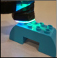
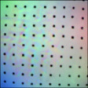
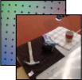

# Connecting Touch and Vision via Cross-Modal Prediction

> 这是一份给"完全没接触过 AI"的读者看的精读笔记。语言尽量像聊天，公式全部翻成人话。
>
> 本文是 2019 年 CVPR 的工作，MIT CSAIL 出品（一作 Yunzhu Li，合作者含 pix2pix / CycleGAN 作者 Jun-Yan Zhu）。论文的位置：早期跨模态预测的代表作，把"视觉和触觉之间的双向想象"第一次系统化。读这篇之前最好对 GAN 有点感觉（不要求懂数学），对 CNN 大致知道怎么处理图像就行。

## 一句话讲什么（TL;DR）

教 AI"看一眼就猜出摸起来什么感觉、摸一下就猜出在摸哪儿"，让视觉和触觉互相翻译。

*所以这一节是想说：这篇论文让机器在视觉和触觉之间做"互相翻译"。*

---

## 这是个什么场景

逛超市时你伸手抓一个香蕉，手没碰到之前你已经"知道"它会是软软滑滑的；半夜摸黑伸手够手机，手指一碰玻璃面就立刻在脑子里闪出"屏幕朝上、放在床头柜左边"的画面。这两件事都太自然了，自然到你不会觉得它是个"问题"——可对机器人来说，它压根不知道。

人类的视觉和触觉是**双向打通**的：

- 看见 → 脑子里冒出"摸起来会怎样"的预感
- 摸到 → 脑子里冒出"这玩意大概长什么样、在哪儿"的画面

这篇 2019 年的论文就在问：**机器能不能也学会这种双向想象？** 给它一段机械臂去戳东西的视频（视觉），它能不能猜出指尖那一刻摸到的"触感"（触觉图像）？反过来，只给它一张触感图，它能不能在桌面照片里指出"这个手感对应的应该是杯子边缘的那个位置"？

听起来很玄，但作者用了个巧招：把"触觉"也做成一种**图像**——靠一个叫 GelSight 的小传感器，把指尖按下去之后"被压凹的胶皮"用内置摄像头拍下来，变成一张 RGB 图。这一下，原本"摸 vs 看"的跨感官难题，被化简成了**两种图像之间的互相翻译**——就跟把英文翻成中文是一个套路。

*所以这一节是想说：把触觉变成一张图，问题就变成了"图到图的双向翻译"。*

---

## 之前的人怎么做的，为什么不够好

- **方案 A：跨模态预测都做声音或文字**
  以前研究 vision-audio、vision-text 的论文一大堆。但这些数据天生就有海量配对（视频自带声音、图片自带 caption）。视觉和触觉**没有现成的大规模配对数据**——人手摸过的东西没人录下来。

- **方案 B：直接用 pix2pix 做图到图翻译**
  pix2pix 是当时最火的"图翻译"模型（白天→黑夜、草图→照片）。但它假设**输入和输出在像素位置上是对齐的**，比如同一座山在白天图和黑夜图里都在画面正中。视觉和触觉的尺度差距太大：摄像头拍的是整张桌子（约 50cm 宽），GelSight 只能感受 1.5cm 的一小块——**两张图根本对不上号**。

- **方案 C：传统触觉传感器分类**
  早些年的触觉研究只用力传感器测压力大小、或用 GelSight 识别物体材质。它们解决的是"分类/识别"任务，不是"想象出另一个模态的图像"。

- **方案 D：人手收集小数据**
  做几百对配对数据靠研究生手动操作机械臂，规模太小，神经网络喂不饱。

- **核心难题**：缺数据 + 尺度对不齐 + GAN 容易"摆烂"输出全一样的图（mode collapse）。

*所以这一节是想说：缺数据、视野不对齐、GAN 训练崩，三座大山压着。*

---

## 这篇论文的新想法

**类比**：想教小孩认识"软硬"，最快的办法是带他去玩具店把每件玩具都摸一遍——一次几分钟太少，得连续几个月每天摸。本论文做的就是这件事的机器版：让一只机械臂当"实习品控员"，**自动戳 195 个物品 12000 次**，凑出 **300 万张"看到的画面 + 摸到的胶皮"配对图**。再给 GAN（一种会"造图"的神经网络）喂一张**参考图**（机械臂还没动作前的桌面照）和**附近几帧**视频，让它学会在视觉和触觉之间互相翻译。

一句话三件事：

- **自动造数据**：用工业机械臂代替人手，规模一下子拉到当时最大
- **参考图缩尺度差**：摄像头看的是 50cm 大场景、GelSight 看的是 1.5cm 小区域，给个对照图就只需画"差异"
- **时序几帧防摆烂**：5 帧前后画面让模型不偷懒、不糊弄

*所以这一节是想说：先用机械臂工业化造一份大数据集，再改进 GAN 来吃这份数据。*

---

## 它分几步做的（方法）

整个论文做了 4 件事：搭机械臂自动采集、做条件 GAN 基线、加参考图缩尺度、加时序帧防失同步。下面逐一拆解每一步的输入、处理过程和输出。

### 1. 用 KUKA 机械臂造一份 300 万张配对图的数据集（VisGel）

**类比**：像让一只机械手当"实习品控员"，把超市货架上的东西一个一个戳一遍，旁边架一台摄像机全程录像。每戳一下，存一张"摄像机看到的画面"和一张"指尖压凹胶皮的纹理图"。



**输入**：195 个家用物品（45 个来自 YCB 数据集 + 150 个额外购买），每次 4~10 个随机放在桌面上。

**处理过程**：

1. 一只 KUKA LBR iiwa 工业机械臂，指尖装一个 GelSight 传感器（1.5cm x 1.5cm 的胶皮里面藏摄像头）
2. 旁边三脚架上一个普通网络摄像头（webcam），全程拍机械臂和桌上的物体
3. 每次戳之前先用 ElasticFusion（一种实时 SLAM 系统）重建桌面的 3D 点云，挑一个**法线接近垂直于桌面**的位置去戳——不然戳歪了不仅戳不到东西，还会把物体推走
4. 用时间戳同步视觉帧和触觉帧

**输出**：12,000 次接触，每次录 250 帧，总共 300 万张配对的视觉-触觉图像。其中训练集 10,000 次接触（250 万帧），测试集 2,000 次接触（50 万帧）。

> **GelSight**：一种"光学触觉传感器"。表面是软胶皮，里面装一个小摄像头和几个不同方向的彩色 LED。手指压上去胶皮变形，摄像头拍下变形后的影子，就得到一张能反映"接触面凹凸纹理"的 RGB 图。简单说：**把"摸到什么"翻译成了"看到什么"**。

> **YCB 数据集**：耶鲁-CMU-伯克利联合发布的一份家用物品数据集，机器人抓取领域的"通用考题"。包含各种生活物品，从食品到工具都有。

> **ElasticFusion**：一种实时的 SLAM（同步定位与建图）系统，能在机械臂操作过程中实时重建桌面的 3D 点云。这里用它来找"哪个位置适合戳"。

**为什么这步有用**：

- 机器干活不知疲倦，能造出比人手大几个量级的数据。论文声称这是当时最大的视-触配对数据集
- 因为 GelSight 输出是图，整套问题立刻能用 CNN 处理，不用为触觉单开新架构
- 工业机械臂的位置精度比人手高得多，意味着"触点"和"视觉里手指尖位置"几乎完美对齐——后面训练时不用再校准
- 数据规模一上来，过拟合风险下降，模型更容易学到"通用的视-触关联"而不是死记硬背

**踩坑提醒**：

- 直接随机选戳点会导致大量无效样本（"戳到空气"或"戳歪把物体推走"）。SLAM 重建 + 法线检查这一步看似工程小事，却决定了数据集的可用率
- 原始 YCB 数据集有 70 个物体，但其中 25 个太小（如塑料螺母），会被机械臂遮挡住摄像头视线，所以只能用 45 个
- 每个场景放 4~10 个物体且允许重叠——这增加了场景多样性，但也引入了遮挡问题
- 戳的力度和速度需要标定——论文补充材料里能看到他们做了一套压力曲线，避免戳坏物体或损伤胶皮

**数据集的设计考量**：

为什么选择 250 帧/次、12000 次这个规模？一次触碰大约持续 5~10 秒（机械臂下降→接触→保持→抬起），250 帧覆盖了完整的动作周期。12000 次意味着对每个物体平均戳约 60 次、从不同角度和位置接触，保证了同一物体不同触碰位置的多样性。作者特别提到，数据集不限于本文的两个任务——后续研究可以用它做触觉材质分类、接触力估计等。

训练集和测试集的划分也值得注意。测试集分成两组：30 个"已见物体"（训练时出现过但换了不同的触碰位置）和 30 个"未见物体"（训练时完全没出现过）。这种设计让作者能分别评估"记忆 vs 泛化"——已见物体的结果更好说明模型利用了物体特有的视-触关联，未见物体的结果好则说明模型学到了更通用的跨模态关系。

*所以这一节是想说：先用工业机械臂工业化造一份当时全球最大的视-触配对数据集 VisGel，数据规模和划分方式都经过深思熟虑。*

---

### 2. 拿 pix2pix 做基线：图到图翻译的标准做法

**类比**：把"视觉→触觉"想成"中译英"。Pix2pix 是当时最经典的"翻译机"，它训练的方式有点像"打假博弈"——一个网络 G（生成器）拼命造假翻译，另一个网络 D（鉴别器）拼命找茬，两者互相磨练。

**输入**：一张视觉图（或一张触觉图）。

**处理过程**：

1. 生成器 G：吃一张视觉图，吐一张触觉图（或反过来）
2. 鉴别器 D：看一对图，判断"这是真的视-触配对，还是 G 编出来的"
3. 训练目标：G 和 D 玩极小极大博弈——G 想骗过 D，D 想识破 G
4. 同时加一个 L1 损失（逐像素差距），防止 G 走极端只为骗鉴别器

**输出**：给定一种模态的图像，生成另一种模态的图像。

> **条件 GAN（cGAN）**：普通 GAN 是"凭空造图"；条件 GAN 是"看一张输入图，造一张相关的输出图"，输入就是"条件"。pix2pix 是 cGAN 的一个经典实现。

> **L1 损失**：除了让 G 骗过 D，还额外要求"生成图 - 真实图"的逐像素差距尽量小，避免 G 走极端只为骗鉴别器、不顾真实性。L1 就是把每个像素的差的绝对值求和。

**关键公式人话翻译**：

论文里的核心目标函数：

> `G* = arg min_G max_D L_GAN(G, D) + lambda * L_1(G)`

人话：找一个 G，让它**在最坏的 D（最强鉴别器）面前**也能输出最像真实数据的图。同时让 G 输出和真实图的逐像素差距（L1）尽量小。`lambda = 10` 控制两个目标的权重——10 倍地强调"像素要对得上"，防止 G 只想着骗 D、完全不管质量。

`L_GAN` 里面的对数项就是"鉴别器对真假数据的得分差"：G 想让 D 给假图打高分（骗过 D），D 想让真假分得越开越好。两人轮流更新参数，互相牵制。

**为什么这步有用**：

- 给后面的改进定一个**基准线**（baseline）：作者后来给 pix2pix 加各种改造，每一项改造涨多少都能量化对比
- pix2pix 本身是当时图翻译的 SOTA，作为起点合理

但它不够好——后面的实验表明，pix2pix 直接套上来在视-触任务上效果很差，vision→touch 的 AMT fooling rate 只有 28.09%（已见物体），远低于后续改进的 46.63%。原因是它无法处理两种模态之间 30 多倍的尺度差距，而且在高度不平衡的数据上容易陷入 mode collapse。

*所以这一节是想说：先用 pix2pix 立个标杆，暴露出"尺度差 + 数据不平衡"两个核心痛点，后面再一项项改。*

---

### 3. 喂参考图：让模型只学"差异"，不用从头画整张图

**类比**：让美术生默写一张"猫躺在沙发上"和让他默写"沙发上多了一只猫（已经给你沙发的照片）"——后者难度低多了，他只要画个猫贴上去就行。



**输入**：当前帧的视觉/触觉图 + 一对"参考图" r = (x_ref, y_ref)，其中 x_ref 是机械臂还没动作前的桌面照片（参考视觉图），y_ref 是 GelSight 没接触任何东西时的"空载"图像（参考触觉图）。

**处理过程**：

1. 给生成器 G 和鉴别器 D 都**额外喂这对参考图**
2. 模型的任务从"凭空生成另一种模态的完整图像"变成"在参考图基础上预测变化部分"
3. 在生成器内部加 **skip connection**（跳跃连接）：把参考图编码器中的低层特征（桌面颜色、物体轮廓等）直接送到解码器对应层，不用编码-解码再走一遍

**输出**：质量显著提升的跨模态预测图。从 Figure 4 的定性对比可以看到，没有参考图时生成的结果几乎不可辨认，加上参考图后立刻变得真实。

> **Skip connection（跳跃连接）**：神经网络里的"绕路通道"。让前层的信息不经过中间层直接送到后层，避免一路压缩-解压时把细节丢光。U-Net 就是靠这招在医学图像分割里出名的。类比：开会时小李直接把材料递给老板，不用先转手给小张-小王-小赵。

**为什么这步有用**：

- **解决尺度差距**：触觉图只覆盖 1.5cm，硬要从这 1.5cm "推断"整张桌面的画面是不可能的。但有了参考视觉图，模型只需预测"机械臂手伸进来后画面里多了什么 + 它戳在哪儿"，难度暴跌。论文原文说这是从"几乎不可能的外推问题"变成了"可管理的差异预测问题"
- **解决传感器漂移**：不同 GelSight 的 LED 亮度、黑点位置都略有不同。参考触觉图相当于给模型一个"零点校准"——把每个传感器的个体差异归零
- 去掉 reference image 后 fooling rate 掉 5~7 个百分点（从 46.63% 降到约 41.44%），说明这不是可有可无的装饰

**参考图的工程细节**：

- 参考视觉图是每段触碰序列的第一帧（机械臂还在远处没动作时拍的）
- 参考触觉图是 GelSight 悬在空中时的读数，它包含了该传感器特有的 LED 照明分布和黑色标记点的位置
- 把参考图和当前帧一起输入时，skip connection 让"不变的部分"（桌面背景、物体位置）可以直接从编码器抄到解码器，模型只需要学"变化的部分"（机械臂出现、触觉变形）

**两个方向上参考图的作用不同**：

在 vision→touch 方向，参考视觉图帮助模型定位"哪里发生了接触"——模型把当前帧和参考帧做对比，就能找到"多出来的机械臂在哪、它戳的是哪个物体的哪个部位"。参考触觉图则提供了"空载基线"，让模型知道"没变形时 GelSight 长什么样"，从而只需预测"变形了多少"。

在 touch→vision 方向，参考视觉图直接给出了"整个场景长什么样"——模型不需要从 1.5cm 的触觉图"外推"出整张桌面，只需要在参考场景上"画上"机械臂和接触效果。这把一个几乎不可能的外推问题变成了一个可管理的差异预测问题。

*所以这一节是想说：给模型一张"什么都没发生时"的对照图，它就只需画"差异"——这是处理 30x 尺度差的关键技巧，而且在两个方向上各有不同的作用机制。*

---

### 4. 数据再平衡：让 GAN 不摆烂

**类比**：你训练一个识图 AI，可数据集里 60% 都是同一张白墙照片。模型很快就学会"无论看到什么都输出白墙"，这就**摆烂**了。解决办法是给"非白墙"的稀有样本加权重，让它们在训练里出现得更频繁。

**输入**：原始数据集中所有的视觉-触觉配对帧，包含大量"机械臂悬在空中没碰东西"的无效样本（约占 60%）。

**处理过程**：

1. 对每个触觉帧 x_t，计算它和参考触觉帧 x_ref 之间的残差图：`residual = |x_t - x_ref|`
2. 对残差图计算 Laplacian 方差——这个值反映"触觉变形有多剧烈"。机械臂悬空时残差几乎为零（Laplacian 方差极低），戳到有纹理的物体时残差很大（方差高）
3. 把 Laplacian 方差当作每个样本的"稀有度分数" w_t
4. 训练时按 w_t 做概率采样——稀有的高变形样本被多采，平庸的"空载"样本少采

**输出**：再平衡后的采样分布 p^w，使得训练数据中"有意义的接触帧"和"无意义的空载帧"的比例更平衡。

> **Mode collapse（模式坍塌）**：GAN 训练里的常见病。生成器发现"反正鉴别器看不出来，我每次都输出同一张图就行"，结果输出多样性归零。类比：考试作弊都抄一份答案。

> **Laplacian 方差**：图像处理里衡量"清晰度/纹理丰富度"的指标。对图像做 Laplacian（二阶导数）运算，然后算方差。一片白墙方差几乎是 0，一片有花纹的布方差就大。这里被借来当"触觉变形剧烈度"的近似——很聪明的工程 hack。

**为什么这步有用**：

- 在 touch→vision 任务上，不做再平衡的 pix2pix 总是把机械臂画在图像右上角——这就是典型的 mode collapse：模型发现"无论输入什么触觉图，都输出同一张带机械臂的图就行"，因为大部分样本的触觉都是空白的，这个"万金油答案"足够糊弄鉴别器
- 再平衡让"有信息的接触样本"出现频率升高，模型被迫学习不同触感和不同视觉对应关系，不能再靠万金油过关
- 去掉 rebalancing 后 fooling rate 从 46.63% 降到 39.95%（已见物体），说明它贡献了约 7 个百分点

*所以这一节是想说：用稀有度采样防 GAN 摆烂——这是整套系统能跑起来的关键工程决策。*

---

### 5. 时序多帧：让预测和真实在时间上对齐

**类比**：让你**只看一张照片**判断球在不在手里——你说不准是球刚被抓住还是刚被丢出。**多看几帧前后画面**就好判断了。

**输入**：不再是单帧 x_t，而是 5 帧序列 {x_{t-4}, x_{t-2}, x_t, x_{t+2}, x_{t+4}}。

**处理过程**：

1. 当前帧 x_t 用 RGB 彩色输入
2. 其他 4 帧（t-4, t-2, t+2, t+4）用灰度输入——因为颜色对"接触动作判断"贡献很小，但会增加参数和显存
3. 5 帧一起送入生成器的编码器，让模型看到"机械臂正在下压 / 正在抬起"的时间趋势
4. 帧间隔是 2 而不是 1——相邻帧太相似，信息冗余；隔 2 帧能拉开"前/中/后"的差异

**输出**：时间上更对齐的预测结果，尤其是"接触瞬间"的预测精度大幅提升。

**为什么这步有用**：

- 单帧模型经常把"接触瞬间"搞错——它没法判断机械臂是"正在下降中"还是"已经碰到了"。多帧能看到运动趋势，接触瞬间的误差大幅减小
- 时序在 vision→touch 方向帮助更大，因为需要判断"什么时候真正接触上"；在 touch→vision 方向帮助较小，因为输入已经过滤掉了非接触帧
- 去掉时序后 fooling rate 从 46.63% 降到约 41.44%（已见物体），再掉约 5 个百分点

**设计选择的细节**：

为什么用间隔 2 而不是连续 5 帧？作者实验发现相邻帧太相似（250 帧覆盖 5~10 秒，帧率约 25~50 fps），连续取 5 帧几乎看不出运动差异。隔 2 帧取样把时间窗口拉宽到约 8 帧的跨度，足以看清"机械臂在下降→接触→开始施压"的阶段转换。

为什么只有当前帧用 RGB、其余用灰度？这是一个显存-信息量的权衡。5 帧全用 RGB 意味着输入通道从 3+4x1=7 增加到 5x3=15，参数量和显存需求大幅增长。但颜色对"判断运动方向"贡献很小——灰度足以捕捉形状和运动信息。只保留当前帧的颜色是因为最终输出需要 RGB 颜色信息。

*所以这一节是想说：用前后几帧让预测和真实在时间上对齐，间隔和颜色的设计都经过了工程层面的仔细权衡。*

---

### 6. 最终模型架构与训练细节



**输入**：时序帧序列 x_bar_t = {x_{t-4}, x_{t-2}, x_t, x_{t+2}, x_{t+4}} + 参考图对 r = (x_ref, y_ref)。

**生成器 G 架构**：

1. **两个 ResNet-18 编码器**：一个编码输入帧序列 x_bar_t（5 帧，其中当前帧 RGB、其余灰度），输出 512 维向量；另一个编码参考图 r（视觉参考 + 触觉参考），输出 512 维向量
2. **拼接**：两个 512 维向量拼成 1024 维
3. **解码器**：5 层 strided-convolution（步进卷积），从 1024 维向量逐步上采样还原成目标模态的图像
4. **Skip connection**：从参考图编码器的各层把低级特征（轮廓、颜色）直接接到解码器对应层

**鉴别器 D 架构**：标准 ConvNet，同时接受输入帧、参考图和输出图，判断真假。

**完整目标函数人话翻译**：

论文 Equation 4：

> `L_GAN(G, D) = E_{(x_bar_t, r, y_t) ~ p^w} [log D(x_bar_t, r, y_t)] + E_{(x_bar_t, r) ~ p^w} [log(1 - D(x_bar_t, r, y_hat_t))]`

人话：鉴别器 D 看到真实配对想打高分（log D 越大越好），看到 G 生成的假配对想打低分（log(1-D) 越大越好）。G 反过来想让 D 给假配对也打高分。注意这里的数据分布 p^w 已经经过再平衡——稀有样本被多采。

论文 Equation 5：

> `L_1(G) = E_{(x_bar_t, r, y_t) ~ p^w} ||y_t - y_hat_t||_1`

人话：在再平衡分布上，让生成的图和真实图的逐像素差距尽量小。

最终目标：`G* = arg min_G max_D L_GAN(G, D) + 10 * L_1(G)`

**训练超参**：

- 优化器：Adam，学习率 0.0002
- L1 权重 lambda = 10（从 pix2pix 继承）
- 用 LSGAN 损失（最小二乘 GAN，比标准 GAN 训练更稳定）替代原始 GAN 损失
- 数据增强：随机裁剪 + 轻微扰动亮度、对比度、饱和度、色调
- 视觉→触觉和触觉→视觉两个方向各训练一个独立模型，架构完全一样只是输入输出对调

> **LSGAN（最小二乘 GAN）**：把鉴别器的输出从"0/1 分类"改成"距离回归"，损失函数从交叉熵换成均方误差。好处是梯度更平滑，训练更稳定。类比：考试从"通过/不通过"变成"按分数打"，反馈更细腻。

> **ResNet-18**：一种有 18 层的残差网络。"残差"意思是每一层只学"和输入相比多了什么"（又是差异学习！），使得很深的网络也能顺利训练。

*所以这一节是想说：最终模型是"双 ResNet-18 编码器 + 5 层卷积解码器 + skip connection"的条件 GAN，吃参考图 + 5 帧时序，输出另一种模态的图像。*

---

## 关键数字（What works）

| 指标 | pix2pix 基线 | 本文完整模型 | 对比/含义 |
|------|-------------|-------------|----------|
| **数据规模** | — | 12,000 次接触 x 250 帧 = 300 万帧 | 当时最大视-触数据集 |
| **物体数量** | — | 195 件（训练 165 / 测试 30 已见 + 30 未见） | 涵盖食品、工具、厨具、布料、文具等 |
| **V→T AMT fooling rate（已见）** | 28.09% | **46.63%** | 接近 50% 随机水平，意味着人类标注员几乎分不清真假 |
| **V→T AMT fooling rate（未见）** | 21.74% | **38.22%** | 泛化到未见物体时下降 ~8%，但仍远超基线 |
| **T→V "feels similar"（已见）** | 44.52% | **89.20%** | 接近全监督方法 90.37% |
| **T→V "feels similar"（未见）** | 25.21% | **83.44%** | 接近全监督方法 85.29%，自监督几乎追平 |
| **去掉 reference image** | — | fooling rate 降约 5~7 个百分点 | 参考图是处理尺度差的关键 |
| **去掉时序** | — | fooling rate 降约 5 个百分点 | 时序对接触瞬间预测至关重要 |
| **去掉 rebalancing** | — | fooling rate 降约 7 个百分点 | 数据再平衡治 mode collapse |
| **pix2pix mode collapse** | T→V 时总是把机械臂画在右上角 | 无此问题 | 再平衡有效消除了模式坍塌 |

关键要点：三项改造（参考图 + 再平衡 + 时序）是叠加关系，每项都贡献 5~7 个百分点，合力把 pix2pix 从 28% 抬到 47%。自监督方法在 touch→vision 上几乎追平了用 1000 张人工标注训练的全监督基线（89.20% vs 90.37%），这是一个重要信号：**规模足够大的自动化数据可以替代昂贵的人工标注**。

*所以这一节是想说：数据规模 + 三项改造让模型从"看一眼就破"做到"接近以假乱真"。*

---

## 实验结果说明了什么

### Vision → Touch 方向

**AMT 真假测试**：作者在 Amazon Mechanical Turk 上做了大规模人类感知实验。每次展示一段 64 帧的生成触觉视频和真实触觉视频，让被试判断哪个是真的。总共收集了 8,000 次判断。完整模型在已见物体上的 fooling rate 为 46.63%——意味着近一半的人类被骗了。值得注意的是，AMT 被试在实验前会接受 5 对真实视-触配对的教育，所以他们不是完全不懂触觉数据。

**接触瞬间检测**：通过追踪 GelSight 上黑色标记点的位移来量化"什么时候发生了接触"。设置一个阈值 r = 0.6，找出变形曲线超过阈值的起止时间点，和真实接触时间对比。没有时序信息的模型在接触瞬间检测上误差很大——要么完全漏掉接触事件（Figure 7b），要么时间偏移严重（Figure 7c）。加了时序后误差大幅减小。

**标记点变形追踪**：计算生成的触觉图上每个标记点与真实图上对应标记点的 L2 距离。单帧模型表现最差，因为它无法推断力的大小和方向变化。

### Touch → Vision 方向

**"Feels Similar" 测试**：因为不同位置可能摸起来感觉一样（比如平板的不同位置），所以不能要求模型预测出"唯一正确的位置"。作者改为让 AMT 被试判断"预测的位置和真实位置摸起来是不是相似"。完整模型在已见物体上达到 89.20%，几乎追平了用 1000 张人工标注位置训练的 Stacked Hourglass 监督模型（90.37%）。

**AMT 真假测试**（touch→vision 方向）：每张图只展示 1 秒，被试判断真假。pix2pix 的 fooling rate 数字看起来不低，但那是因为它输出的图全都一样（mode collapse），每张都"看起来像真的"但位置完全错。

### 可视化分析

用 Zhou et al. 的网络解释方法可视化学到的内部表示：vision→touch 模型的两个内部单元分别关注 GelSight 的位置，但一个聚焦"尖锐边缘"（如杯口），另一个聚焦"平坦表面"。这说明模型确实学到了有意义的物理特征，而不是在做无意义的像素拷贝。

*所以这一节是想说：实验证明三项改造各自有效且互补，自监督方法在触觉-视觉翻译上接近全监督水平，模型内部确实捕获了有物理意义的跨模态表征。*

---

## 你应该懂的几个新词

- **GelSight（凝胶触感传感器）**：用一块软胶皮 + 内部摄像头 + LED 的触觉传感器。把"摸到什么"变成"拍到什么"。类比：橡皮泥按手印，再用手电筒打光拍照看凹凸。

- **Cross-Modal Prediction（跨模态预测）**：从一种感官数据预测另一种感官数据。类比：闻到刚出炉的面包香，脑补出面包的金黄色泽。

- **GAN（生成对抗网络）**：两个神经网络互相博弈训练，一个造假、一个打假。类比：仿冒名画的画师 vs 拍卖行鉴定师，互相磨练对方。

- **Conditional GAN / cGAN（条件 GAN）**：在 GAN 的基础上，给一个"条件"作输入，生成"和条件相关"的输出。类比：不是"随便画一张图"，而是"按照这张草图给我画一张照片"。

- **Mode Collapse（模式坍塌）**：GAN 训练失败的典型表现，生成器只会输出极少数几种图，多样性归零。类比：作弊学生只背一道题的答案，所有考卷都填一样。

- **Reference Image（参考图）**：一张"什么动作还没发生"的对照图。类比：装修前的房间照片，让你只用关心"这次新加了什么家具"。

- **Skip Connection（跳跃连接）**：神经网络里跨层连接的"绕路通道"。类比：开会时小李直接把材料递给老板，不用先转手给小张-小王-小赵。

- **LSGAN（最小二乘 GAN）**：用均方误差替代交叉熵的 GAN 变体，训练更稳。类比：考试从"通过/不通过"变成"按分数打"。

- **AMT（Amazon Mechanical Turk）**：亚马逊的众包平台，用来雇大量真人做小任务（这里就是"判断真假图"）。类比：拉一群路人当评审。

- **Moment of Contact（接触瞬间）**：机械臂胶皮真正碰到物体的那一刻。类比：弹钢琴时手指真正按下去的瞬间，前后摸空气都不算。

- **Self-supervised（自监督）**：不需要人工打标签，靠数据自己生成的"伪标签"训练。这里的"标签"就是视觉和触觉的天然配对——同一时刻的两种传感器读数自动构成一对。

- **Laplacian 方差**：图像处理里衡量纹理丰富度的指标，用来量化触觉图的"有多大变形"。这里当作数据再平衡的采样权重。

*所以这一节是想说：把这十二个词记住，再回头读论文你会顺得多。*

---

## 它有什么搞不定的

- **泛化范围有限**：模型只学过 195 件桌面家用品。给它一张窗外的树叶或者一块金属齿轮，触觉预测大概率乱来。训练分布之外的物体/场景没有任何保障。

- **触觉歧义不可消解**：摸一块平板的不同位置触感都差不多，所以 touch→vision 不可能预测出"唯一正确的位置"。论文承认这点，因此评测改成"feels similar 算对"。但这也意味着模型在精确定位方面本质上受限——这是任务定义层面的局限，不是算法能解决的。

- **依赖固定相机视角**：webcam 一旦换位置或换镜头，整个模型可能直接失灵。参考图假设了"相机和场景的相对位置不变"。换到第一视角的可穿戴相机或者手持手机拍摄就要重训。

- **没有"力"的概念**：GelSight 测的是变形形状，可以间接反映力的大小和方向，但模型并没有显式学习"压多大的力"。它能预测"接触瞬间"的变形图案，但不能预测"按 2N 还是 5N"。后续的 visuo-tactile dynamics 工作才补上这块。

- **不涉及决策/控制**：整个工作停在"感知层"——让模型学会"看和摸之间的对应关系"。但它不做任何抓取决策，不输出机器人动作。从感知到控制之间的鸿沟（perception-action gap）是后续工作（如 Lee et al. 2019 ICRA）的目标。

- **GelSight 的物理限制**：传感器面积只有 1.5cm x 1.5cm，只能感知非常局部的接触。对于大面积接触（如整个手掌握住物体）或动态滑动，它的覆盖率不够。

- **数据集的可复现成本**：虽然 GelSight 是开源硬件（材料成本低于 100 美元），但 KUKA 工业机械臂百万级的价格让"自动化数据采集"这条路很难被普通实验室复现。后续研究大多直接使用本文公开的 VisGel 数据集。

*所以这一节是想说：泛化受限、本质歧义、视角固定、缺力的概念、不做决策、传感器局限、复现成本高——七个洞各有不同性质，有的可以工程解决，有的是理论层面的根本限制。*

---

## 它和别的论文是什么关系

- **vs pix2pix / CycleGAN（图到图翻译）**：本文的方法骨架就是 pix2pix 的条件 GAN。但 pix2pix 假设输入输出像素对齐，本文用参考图 + 时序 + 数据再平衡三项改造适配了"视觉-触觉"这个尺度差巨大的场景。CycleGAN 解决的是"无配对"翻译，本文有配对数据所以不需要 cycle consistency。

- **vs ImageBind（六模态对齐）**：ImageBind 想把视觉、文本、音频、深度、热成像、IMU 六种模态都嵌到一个共享空间里。本文是更早期的"两模态打通"，提供的训练范式（用图到图翻译做对齐）后来被许多多模态工作借用。可以把本文看成 ImageBind 的"双模态原型"。

- **vs Lee et al. 2019 ICRA "Making Sense of Vision and Touch"**：Lee 2019 ICRA 做的是自监督学习视-触联合表示（joint representation），然后把这个表示用在 contact-rich 操控任务（如插钉子）上。本文停在"想象"层（预测另一种模态的图像），Lee 2019 走到了"决策"层（用学到的表示做控制）。两者互补：本文证明了"视-触可以互译"，Lee 2019 证明了"互译学到的表示可以拿来做事"。

- **vs LLaVA / Flamingo（视觉+语言多模态）**：LLaVA 把视觉和"语言"做对齐——用 GPT-4 当"出题老师"造文本指令；本文把视觉和"触觉"做对齐——用机械臂当"出题老师"自动戳东西。两者共享一个思路：**用一个能批量生成"标签"的来源（GPT 或机械臂），绕开人工标注的瓶颈**。

- **vs Calandra 2017 "The Feeling of Success"**：Calandra 用视-触多模态预测抓取成功率，和本文的"看图想感觉"互补——它是"用感觉决定动作"，本文是"在两种感觉之间做翻译"。

- **vs Diffusion Policy / OpenVLA（操控机器人）**：那些工作让机器人"看一眼就知道怎么动"；本文还没到决策层，停在"看一眼想象出摸起来什么感觉"的感知层。但触觉感知是抓取的关键——后续 visuo-tactile policy 论文就在这条路上往决策走。

- **vs Habitat / Meta-World（仿真环境）**：那些工作让机器人在仿真里大量练习。本文反过来——**直接在真实物理世界里采集真数据**。两条路径互补：仿真便宜但 sim2real gap 大，真实采集贵但 ground truth 可靠。

- **vs SPARSH / Tactile-VLA（后续触觉工作）**：SPARSH 做了大规模触觉预训练基础模型，Tactile-VLA 把触觉接入 VLA 架构做端到端控制。本文是这条"触觉+视觉"研究线的早期奠基作，证明了触觉可以被 CNN 有效处理这一前提。

*所以这一节是想说：这是早期多模态对齐工作的"双模态精简版"，思想被后来的 ImageBind / VLA 系列 / 触觉基础模型继承。*

---

## 和本导读的关系

本文属于 [Ch18: 多模态生态](../guide/ch18-multimodal.md) 的覆盖范围。Ch18 的核心主题是"怎么把不同模态的传感器信号放进同一个空间"。本文是该章中**触觉模态**的奠基作品：

- Ch18 开篇用"闭着眼睛端咖啡"引出多模态的必要性，其中"接触才有的信息"这个盲区正是本文要解决的问题
- Ch18 介绍的 ImageBind 用"以图像为枢纽"实现六模态对齐，本文则是更早期的"双模态（视觉-触觉）对齐"尝试，用图到图翻译替代对比学习
- Ch18 提到触觉传感器（GelSight、BioTac）是"接触才有信息"这一盲区的解决方案，本文详细展示了 GelSight 如何被用于大规模数据采集和跨模态学习
- 本文证明的"自监督视-触对齐"思路，后来被 Ch18 中的 SPARSH / Tactile-VLA 等后续工作继承和扩展

读完本文再回去看 Ch18 的 18.1.4 节（视觉的三个致命盲区）会有更深的体会：触觉不是"锦上添花"，而是在暗处、接触力、滑动检测等场景下"缺了就做不了"。

*所以这一节是想说：本文是 Ch18 多模态生态中"触觉这条腿"的起点，后续的触觉基础模型和触觉 VLA 都建立在这个"触觉可以被 CNN 处理"的前提上。*

---

## 思考题

**Q1：为什么触觉要用 GelSight（光学传感器）而不是传统的力传感器？如果用力传感器，本文的方法还能跑吗？**

<details>
<summary>提示</summary>

力传感器输出的是一维或三维的力向量（标量或者 Fx/Fy/Fz），没有空间分辨率——它告诉你"总共压了多大力"，但不告诉你"哪个位置凹了多深"。GelSight 输出的是 2D RGB 图像，包含接触面的完整形状和纹理信息。本文的方法核心是"图到图翻译"（用 CNN 处理），如果触觉不是图像格式，整个 pix2pix 框架就用不了。要用力传感器的话，需要重新设计模型架构，比如用 MLP 代替卷积网络，而且信息量会大幅减少。
</details>

**Q2：参考图（reference image）看上去像是在"作弊"——模型不就是在抄参考图吗？什么情况下参考图不可用？**

<details>
<summary>提示</summary>

参考图确实让模型"抄"了大部分不变的信息（桌面、物体位置），但这正是合理的任务简化——人类预测触觉时也在用"我已经看到的场景"做条件。模型需要学的是"哪儿被戳了 + 戳出的纹理"。但参考图的前提是"相机位置固定 + 场景在接触前后基本不变"。如果是移动机器人（相机跟着动）、或者接触导致物体大幅移动/形变，参考图就不适用了。这也是本文系统难以推广到移动操作场景的原因之一。
</details>

**Q3：数据再平衡用 Laplacian 方差作为"稀有度分数"，这个选择有什么局限？能想到更好的替代方案吗？**

<details>
<summary>提示</summary>

Laplacian 方差衡量的是"纹理复杂度"，但并非所有有意义的接触都有高纹理——比如按一个软海绵，变形很大但纹理可能不复杂。一个更好的替代可能是直接用变形场的幅度（标记点位移量）作为稀有度，因为它直接衡量"接触力度"。或者用一个轻量分类器区分"有接触/无接触"来做硬采样。论文选 Laplacian 方差的好处是计算简单且不需要额外标注，是一个工程上的折中。
</details>

**Q4：touch→vision 方向上，模型达到了 89.20% 的 "feels similar" 分数，几乎追平全监督方法的 90.37%。为什么自监督能做到这么好？全监督方法用了什么额外信息？**

<details>
<summary>提示</summary>

自监督方法的"标签"是天然的时间同步配对（同一时刻的视觉帧和触觉帧），数据量巨大（300 万帧）。全监督方法用了 1000 张人工标注的 GelSight 位置标签来训练 Stacked Hourglass 网络。关键洞察：当自监督数据量足够大时（3M vs 1K），模型可以从海量弱信号中提取出和少量精确标注一样多的信息。这和后来 LLaVA 等工作的思路一致——自动化生成的大规模数据可以替代昂贵的人工标注。
</details>

**Q5：本文的方法能迁移到"模拟器中的触觉"吗？比如在 Isaac Gym 里模拟 GelSight 的输出，然后训练本文的模型。会遇到什么问题？**

<details>
<summary>提示</summary>

核心问题是 sim-to-real gap 在触觉上特别大。GelSight 的输出取决于胶皮的弹性特性、LED 的光照分布、摄像头的成像质量——这些在模拟器中很难精确模拟。视觉的 sim2real gap（纹理、光照）已经够大了，触觉的 gap 更大，因为它涉及物理接触的真实力学特性。一个可能的缓解策略是用域随机化（Ch17 的 DR）或者在模拟和真实之间做域适应（比如用 CycleGAN 把模拟触觉图转成真实风格），但目前还没有成熟方案。
</details>

**Q6：论文中 vision→touch 的时序帮助大，touch→vision 帮助不大。请解释为什么会有这种不对称。**

<details>
<summary>提示</summary>

vision→touch 需要预测"什么时候真正接触上"——这是一个时间维度的问题，单帧图像无法判断机械臂是"正在下降中"还是"已经碰到了"。多帧让模型看到运动趋势，大幅提升接触瞬间预测精度。但 touch→vision 方向已经过滤掉了"没接触"的样本（只保留传感器碰到物体的帧），所以不存在"什么时候接触"的判断问题。而且触觉的参考图已经提供了足够的对照信息，时间维度的额外信息相对冗余。
</details>

**Q7：如果你要把这个系统用在一个真实的低光仓库中帮助机器人抓取，需要做哪些改造？**

<details>
<summary>提示</summary>

至少需要：(1) 去掉固定相机假设——仓库里机器人在移动，需要从 ego-centric 视角工作，参考图策略需要重新设计；(2) 扩展训练物体到仓库中的物品（纸箱、塑料袋等），当前 195 个家用品不覆盖；(3) 在低光条件下视觉质量差，需要依赖触觉做更多判断——但本文的模型是双向的，可以反过来用 touch→vision 来"脑补"看不见的画面；(4) 加入决策层——本文只做感知，需要接一个 policy 网络把视-触表征转化成抓取动作（类似 Lee 2019 ICRA 的做法）；(5) 考虑实时性——当前模型的推理速度和实时抓取的要求之间可能有 gap。
</details>

---

## 一些好奇心问答（FAQ）

**Q1：为什么不直接用力传感器读"压力大小"，非要用 GelSight 把触觉做成图？**
因为压力只是一维标量，没有"形状/纹理"信息。GelSight 把接触面凹凸都拍下来，等于把触觉升维到 2D 图像，CNN 能直接处理，信息量大得多。而且图像格式让整套 pix2pix 框架可以直接复用——这是方法论层面的关键便利。

**Q2：12000 次接触是机械臂连续戳出来的，那中间有人监督吗？**
基本没有。SLAM 自动选戳点 + 机械臂自动执行 + 摄像头时间戳同步。研究生只需要在桌面摆好物体，让程序跑就行。论文里强调"自动化"是核心工程贡献——这也是为什么能做到 300 万帧这个数量级。

**Q3：训练 GAN 一般要算 FID/IS 这些指标，本论文为什么主要用 AMT？**
因为触觉图不是自然图像，FID（基于 ImageNet 预训练特征的 Frechet Inception Distance）的相似性指标对触觉图没有意义——ImageNet 从来没见过 GelSight 的输出。作者直接用人类感知判断"真不真"更可靠。这是 GAN 评测的常见妥协——当生成的图像属于非自然图像分布时，人类评估比自动指标更有说服力。

**Q4：模型能"想象"出从没摸过的材质吗？比如猫毛？**
论文没测。直觉上不行——模型只见过 195 个家用品。但作者展示了 30 个"未见物体"上的泛化效果，说明在"训练分布附近"（类似材质、形状的物体）还能用。完全陌生的材质需要额外数据。

**Q5：GelSight 这玩意贵吗？普通实验室能复现吗？**
2019 年时 GelSight 是开源硬件，研究生能自己搭一个，材料成本低于 100 美元（不含摄像头）。但 KUKA 工业机械臂百万级的价格很难复现。后续工作大多直接用本文公开的 VisGel 数据集做 finetune，绕开了硬件门槛。

**Q6：作者后续做了什么？**
一作 Yunzhu Li 在这之后做了一系列"物理感知 + 触觉"的工作，包括 ICRA/NeurIPS 的 visuo-tactile dynamics model，把"想象触感"延伸到"想象物体形变和动力学"。合作者 Jun-Yan Zhu 就是 pix2pix 和 CycleGAN 的作者，后来继续做图像生成和 3D 相关研究。这篇论文可以看作 Yunzhu Li 从感知走向"物理理解"的起点。

*所以这一节是想说：核心创新可复现，但要重新跑出 300 万张图得有 KUKA；模型本身只需中等 GPU。*

---

## 如果你想再深入

- **Pix2Pix 原文（Isola et al. 2017 CVPR）**：本文的方法基础。先读它的 Section 3（条件 GAN 框架），再回头看本文 Section 4.1 会非常通顺。

- **CycleGAN（Zhu et al. 2017 ICCV）**：解决"无配对图到图翻译"。本文用的是配对版（pix2pix），但如果你想把这套方法推广到没法配对的场景（比如人手摸 vs 机械臂摸），CycleGAN 是必读。合作者 Jun-Yan Zhu 就是 CycleGAN 的作者。

- **GelSight 原始论文（Johnson & Adelson 2009/2011）**：理解触觉传感器是怎么把变形变成 RGB 图的。MIT Adelson 组的代表工作。

- **Calandra et al. 2017 "The Feeling of Success"**：用视-触多模态预测抓取成功率。和本文的"看图想感觉"互补——它是"用感觉决定动作"。

- **Lee et al. 2019 ICRA "Making Sense of Vision and Touch"**：自监督学习视-触联合表示用在 contact-rich 操作任务上。可以看作本文思路在"决策层"的延伸。

- **ImageBind（2023, Meta）**：六模态共享嵌入空间。读完这篇会发现本文的"双模态对齐"思路被推广到多模态后能干什么。

- **SPARSH（2024）**：大规模触觉预训练基础模型，是"触觉+深度学习"这条线的后续里程碑。

- **Sundaram et al. 2019 Nature "可穿戴触觉手套"**：把触觉传感器做成手套，让人戴着采数据，规模比 KUKA 还大。和本文是"不同采集路径"的对比阅读。

*所以这一节是想说：往前补 pix2pix / CycleGAN / GelSight，往后追 Lee 2019 / ImageBind / SPARSH / 触觉手套，就是这条研究线的全景。*

---

## 原文信息

**BibTeX**：

```bibtex
@inproceedings{li2019connecting,
  title={Connecting Touch and Vision via Cross-Modal Prediction},
  author={Li, Yunzhu and Zhu, Jun-Yan and Tedrake, Russ and Torralba, Antonio},
  booktitle={Proceedings of the IEEE/CVF Conference on Computer Vision and Pattern Recognition (CVPR)},
  year={2019}
}
```

**链接**：

- 项目主页：[http://visgel.csail.mit.edu/](http://visgel.csail.mit.edu/)
- 论文 PDF：[arXiv](https://arxiv.org/abs/1906.06322)
- 代码 & 数据集：项目主页提供 VisGel 数据集下载和代码开源

**作者**：Yunzhu Li, Jun-Yan Zhu, Russ Tedrake, Antonio Torralba（MIT CSAIL）

*所以这一节是想说：拿到这些信息就能精确定位和引用这篇工作。*