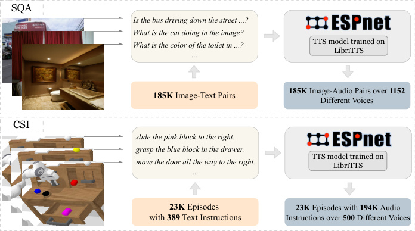
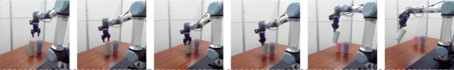

# VLAS：让机器人"听声辨人"再动手

> 给"完全没接触过 AI / 机器人"的读者写的精读笔记。所有专业词第一次出现都会解释清楚。只看这份笔记就能理解全文机制。
>
> 本篇是"VLA 三连"的第二篇。第一篇 [OpenVLA](openvla.md) 让我们看到了一个具体的自回归 VLA 是怎么搭建的；本篇 VLAS 把视角拉高——当 VLA 只能读文字时，真实世界最自然的交互方式（说话）被挡在了门外。VLAS 展示了如何把语音直接塞进 VLA、如何靠声纹实现个性化。第三篇 MLA 则会走另一条路——砍掉视觉编码器，用更轻量的方式做多模态融合。三篇合在一起，勾勒出 2024 年 VLA 领域"开源化 → 模态扩展 → 轻量化"三条主线。

---

## 一句话讲什么（TL;DR）

把一个会"看图说话"的 AI（LLaVA）改造成会"听声音 + 认嗓音 + 动手"的机器人模型：用 Whisper 编码器当耳朵、用"声纹查档案"（Voice RAG）解决"我的杯子是哪只"这种个性化问题，最终在定制化任务上比纯文字 VLA 高出 4 倍（86.5% vs 19.2%），同时语音识别副产品几乎追平专业系统 Whisper（词错率 2.79% vs 2.7%）。

*所以这一节是想说：VLAS 的核心卖点不是"让机器人听话"，而是"让机器人听出是谁在说话，并据此采取不同行动"。*

---

## 这是个什么场景

早上厨房岛台上摆了三只杯子：绿的、红的、白的。

爸爸刚进门说："帮我拿我的杯子。"半分钟后妈妈也喊了同一句话。同样的六个字，机器人到底拿哪只？

光看**字面意思**根本判断不了——"我的"两个字本身不指向任何一只具体的杯子，就像快递单上只写"送到我家"却少了地址。但你自己根本不会卡住：**你一听声音就知道"哦这是爸爸"**，脑子里立刻调出"爸爸 = 绿杯"那条记忆，伸手就拿对了。

现有的 VLA（Vision-Language-Action）模型——比如我们在 [OpenVLA 笔记](openvla.md) 里详细拆解过的那种——只能接收文字指令。文字里"拿我的杯子"和"拿我的杯子"长得一模一样，模型根本不知道是谁打的字。即使你在前面外挂一个语音转文字程序（ASR），转完之后"是谁在说"这条信息也永远抹掉了。

> **VLA（Vision-Language-Action，视觉-语言-动作模型）**：一种"看着画面 + 听着指令 + 直接输出机械臂动作"的一体化模型。我们在 [OpenVLA](openvla.md) 里已经详细讲过它的运作方式——把动作伪装成词表里的"冷门字"，让一个语言模型"说"出动作。

论文叫 **VLAS**，比 VLA 多出来那个 **S** 就是 **Speech（语音）**——让机器人**直接吃原始的声波**，而不是先经过一个"速记员"把声音转成文字再读。


*所以这一节是想说：家庭机器人面对"一群人 + 私人物品"时，必须能听出"是谁"，光听"说什么"不够。这正是 VLAS 要解决的核心痛点。*

---

## 之前的人怎么做的，为什么不够好

在 VLAS 之前，要让机器人听懂人说话，业界有两种路线：

**路线 A：外挂速记员（ASR 级联管线）**

做法很直观——在 VLA 前面串一个语音识别程序（ASR），把声音先转成文字，再把文字喂给 VLA。就像请了个速记员坐在机器人旁边，把老板说的话抄到纸上递给机器人。

> **ASR（Automatic Speech Recognition，自动语音识别）**：把语音变成文字稿的程序，相当于会议速记员。你手机上的语音输入法就是一个 ASR。

这条路有四个毛病。第一，**传话游戏**——速记员听错一个字（比如把"绿杯"写成"率杯"），后面整句话就跑偏了，误差只会积累不会减小。第二，**嗓音信息全丢了**——转成文字稿之后，"是爸爸说的还是妈妈说的"这条信息被永远抹掉。语调、情绪、口音也一并消失。第三，**变胖变慢**——原本一个模型搞定的事，现在要两个模型串联，又费内存又慢。第四，**无法处理"我的"这种代词**——因为光看文字"拿我的杯子"，模型没办法知道"我"是谁。

论文里的数据直接证明了这一点：在 CALVIN 长任务测评上，VLA + ASR 的得分是 3.13，而 VLAS 直接听语音拿到了 3.70——差距来自传话过程中积累的误差。

**路线 B：多模态输入但没用好大模型（MUTEX）**

MUTEX 也尝试过支持多种输入（包括语音），但它用的视觉模型比较老，没有充分利用近几年大语言模型的能力。就好比一辆 2010 年的混动车——概念是对的，但发动机太弱跑不快。

**路线 C：闭门巨无霸（PaLM-E / SayCan）**

Google 的 PaLM-E、SayCan 走的是另一条路——大脑负责高层规划（"先拿杯子，再倒水，最后递过去"），手脚由预设的小技能完成。这种"大脑指挥固定几只手"的方案和 VLAS 的"一个人既思考又直接动手"（端到端）是不同的设计哲学。前者灵活性高但模块间接口容易断；后者简洁但对端到端的数据和训练要求更高。

*所以这一节是想说：把语音先转文字这条路，从原理上就丢掉了"是谁在说"这条关键信息。VLAS 需要一条新路——把语音直接塞进模型内部。*

---

## 这篇论文的新想法

核心思路一句话：**不要速记员**——让机器人**直接听原始声波**，再加一个"凭嗓音查档案"的小本本（Voice RAG），就能知道"我的"指什么。

展开来说，VLAS 做了三件事。第一，在已经会"看图说话"的 LLaVA 上接一个 Whisper 编码器当耳朵，让模型能直接吃声波。第二，设计了一套三阶段训练流程（先听写、再答题、最后动手），把"听懂声音"这件事分步教会模型。第三，发明了 Voice RAG——用声纹当钥匙去外部档案库查"这是谁、他喜欢什么"，把查到的背景知识和语音、图像一起喂给大模型。

和 [OpenVLA](openvla.md) 的关系：OpenVLA 解决的是"怎么把动作塞进语言模型"——它是 VLA 范式的标准实现。VLAS 在此基础上往前走了一步——"怎么把语音也塞进去，而且不丢失声纹信息"。两篇论文共享"动作离散化"的核心技巧（把连续动作切成 256 格、借用词表里的冷门字），但 VLAS 多了一条语音通道和一个声纹检索模块。

*所以这一节是想说：把"听声音"和"查个人档案"做成机器人的内置部件，而不是外挂。*

---

## 它分几步做的（方法）

整个系统拼起来像一台四部件的厨房机器：**耳朵**（听声音的 Whisper 编码器）、**眼睛**（看画面的 ViT 编码器）、**记事本**（查档案的 Voice RAG）、**手**（输出动作的 LLM 解码器）。下面逐一拆解。


### 1. 骨架选型：站在 LLaVA 的肩膀上

**输入**：无（这是架构决策，不是数据处理步骤）

**处理**：VLAS 选择 LLaVA 作为基座。LLaVA 本身由三个零件组成——一个 CLIP ViT 视觉编码器（把图片变成数字摘要）、一组 MLP 投影层（把图的数字翻译成语言模型能听懂的格式）、一个 Vicuna 7B（Llama 微调版）语言模型骨干。LLaVA 已经学会了"看图回答问题"，VLAS 要做的只是在它身上**加耳朵、加手**。

> **LLaVA**：一个开源的"看图说话" AI。它的核心思路是：把图片切成小块、用视觉编码器提取特征、用 MLP 翻译成语言模型能读的格式、最后让语言模型根据图片特征回答问题。这和 [OpenVLA](openvla.md) 的 Prismatic-7B 骨架思路几乎一样——区别在于 OpenVLA 用了双视觉编码器（DINOv2 + SigLIP），而 VLAS 的 LLaVA 只用了单个 CLIP ViT。

**为什么这样设计**：从零教一个程序"看图 + 说话"要烧上百万美元的电费。直接用别人训好的模型，省到几张专业显卡几天就能做完。这和 [OpenVLA](openvla.md) 的"不从零造，站在 VLM 肩膀上"是同一个设计哲学。

**输出**：一个已经会看图说话的预训练模型，等着被加上耳朵和手。

*所以这一节是想说：能用现成的就别重做，本论文不发明轮子，只新加耳朵和手。*

---

### 2. 给模型装耳朵：语音编码器

**输入**：一段原始语音信号（比如"帮我拿我的杯子"这句话的波形）

**处理**：

**第一步：把声波画成 X 光片。** 语音信号先通过短时傅里叶变换（STFT）被转换成一张 80 通道的**梅尔频谱图**，然后填充到固定长度 3000 帧。

> **频谱图（Spectrogram）**：横轴是时间、纵轴是音的高低、颜色深浅代表强弱。和物理课画的"声音波形图"是亲戚。可以想成声音的 X 光片——一条声波变成一张彩色图片，方便计算机"看"声音。

**第二步：让 Whisper 读这张 X 光片。** 频谱图被送进 Whisper 编码器。Whisper 是 OpenAI 训练的语音识别模型，在 68 万小时多语言语音上预训练过，是目前最强的开源语音编码器之一。它输出一串 1500 个**隐藏向量**，每个向量代表一小段声音的"含义"。

> **向量（Vector）**：高中学过——一串有方向有长度的数字。这里就是一长串数字，描述这段声音的特征。两个向量越像（夹角越小），代表的含义越接近。
>
> **Whisper**：OpenAI 发布的开源语音识别模型，支持 99 种语言。它的编码器把声音变成数字特征，解码器把特征变成文字。VLAS 只借用了它的编码器——用来"提取声音特征"，不用它来"转文字"。

**第三步：压缩。** 1500 个向量太多了——直接塞进大模型会很慢。论文用了一个简单办法：**每 5 个相邻向量合并成 1 个**（沿时间维度做 reshape 操作），变成 300 个。这个 5 倍压缩比是实验选出来的甜蜜点——压得更狠（比如到 75 个）会把声音的意思也压没。

**第四步：翻译。** 压缩后的 300 个声音向量经过一个 MLP（多层感知机）被翻译成大模型能直接读的"词向量"。

> **MLP（多层感知机，Multi-Layer Perceptron）**：一个由几层简单运算堆成的小程序，专门做"把一种数字格式变成另一种数字格式"的活。可以想成一个翻译官，把广东话翻译成普通话——输入和输出的"意思"一样，但"格式"不同。

**输出**：300 个语言模型能读的语音 token，和图像 token、文字 token 处在同一个"语义空间"里。

**为什么这样设计**：用现成的 Whisper 编码器省去了从零训练语音理解的巨大成本。5 倍压缩在速度和信息保留之间取了平衡。MLP 翻译层让语音 token 和图像 token、文字 token 说同一种"方言"，三者可以无缝拼接进同一个语言模型。

**和 OpenVLA 的对比**：OpenVLA 的输入只有"图像 + 文字"两路。VLAS 多了一路"语音"，并且语音的处理流程（编码 → 压缩 → MLP 投影）和图像的处理流程（ViT 编码 → MLP 投影）在架构上是对称的——都是"先用专业编码器提取特征，再用 MLP 翻译成语言模型的格式"。

*所以这一节是想说：声音被翻译成大模型能读的"词"，三种感官（图、声、字）从此能在同一张桌子上对话。*

---

### 3. 凭嗓音查档案：Voice RAG

这是全文最关键的创新点。

**输入**：一段原始语音信号

**处理**：

**类比**：你进公司大门时，门禁先扫脸，扫到"这是李四"，然后从档案柜里抽出他的卡片"李四 → 工程部 → 喜欢绿杯"，把这张卡片塞进会议资料里。开会的时候你随手翻到这张卡片，就知道"李四的杯子是绿的"。

Voice RAG 做的就是这件事，只不过"扫脸"换成了"听嗓音"。

> **声纹（Voiceprint）**：每个人说话时声波的频率分布有自己的特点，独一无二，像声音版的指纹。银行的声纹支付就是用这个原理。
>
> **RAG（Retrieval-Augmented Generation，检索增强生成）**：回答前先去外部资料库查相关资料，再连着资料一起回答。可以想成**开卷考试**——遇到题先翻书，再答。普通 RAG 用文字当查询钥匙（比如搜索引擎）。VLAS 的 Voice RAG 用声纹当钥匙——这是关键区别。

**第一步：提取声纹。** 原始语音被送入一个预训练的声纹识别模块（speaker identification module），输出一个代表"这个人嗓音特征"的向量。

**第二步：查档案。** 用声纹向量去外部数据库查询。数据库里存的是简单的文字映射，比如：
- 声纹 A → "这是李四，他拥有绿色杯子，喜欢把东西放抽屉。"
- 声纹 B → "这是王五，她拥有红色杯子，喜欢把东西放架子上。"

**第三步：把档案变成 token。** 查到的文字背景知识通过语言模型的文本分词器（tokenizer）被转换成 token 序列。

**第四步：拼接。** 这些档案 token 和语音 token、图像 token 头尾相接，组成一长串输入，一起送进语言模型。

用论文里的公式说人话：

> **Emb(s, O) = concat( MLP_s(Emb_s(s)), Tok_l(RAG(s)), MLP_v(Emb_v(O)) )**

翻译：最终送进大模型的输入 = [语音的翻译] **拼上** [声纹查到的档案文字的翻译] **拼上** [图像的翻译]。三段东西首尾相接，组成一长串"词"。

**输出**：大模型的输入序列里多了一段"个人背景知识"，模型可以据此判断"我的杯子"到底指哪只。

**为什么这样设计**：

用**文字**而不是数字向量当档案内容——文字方便人工编辑。新加一个用户时手写一行"张三：白杯，怕烫"就行。用**现成的声纹识别程序**——这技术早就成熟（银行声纹支付都用了），没必要重做。最关键的好处是**新用户来了不用重训模型**——只要档案库里加一行就行。

**它有多关键**：实验里关掉 RAG 这一块，定制化任务准确率从 86.5% 直接掉到 16.0%（Table 2）。不仅大幅下降，还比纯文字 VLA 的 19.2% 还低——说明模型在训练时已经"习惯"了有档案伴随，突然抽掉档案它反而比从没见过档案的模型更懵。这反过来证明 RAG 不是锦上添花，是这套系统的**命根子**。

另一个方向的验证也很有力：把 Voice RAG 模块加到**纯文字 VLA** 上（VLA + RAG），准确率从 19.2% 跳到 82.0%——说明 RAG 本身的贡献独立于语音通道，它是个可插拔的增强模块。

*所以这一节是想说：声纹是钥匙，档案是开卷资料，"我的"问题靠这套机制解决。Voice RAG 是本文最大的贡献。*

---

### 4. 动作离散化：让大模型把"动作"也当字写

**输入**：机器人一步动作的 7 个连续值——末端执行器的 x, y, z 三个坐标、三个旋转角度（绕 x/y/z 轴各转多少度）、夹爪开合状态

**处理**：

这部分和 [OpenVLA](openvla.md) 的做法几乎一样。每个连续值被离散化到 0-255 共 256 个格子（bin），然后借用语言模型词表里**最不常用的 256 个 token** 来表示这些格子。这样模型"吐"出一个 token，就对应一个离散化的动作值。一步动作 = 7 个 token。

> **离散化（Discretization）**：把一个能取无限值的数字（比如 0.0~1.0 之间的任意小数）切成若干格，只能取 0/1/2/.../255 这种整数。像把考试成绩从分数变成 ABCD 四档。

**多步预测的小技巧**：训练时把**连续 5 步**动作拼成一个标签（5 × 7 = 35 个 token），让大模型一次预测 5 步动作，机器人连续执行。这让推理频率从每秒 1.17 步涨到每秒 2.5 步（Table 9），同时任务得分也从 2.02 涨到 3.70——因为短期内环境变化不大，提前规划反而更稳。

但 r 也不能无限大。论文测试了 r=12 和 r=20：r=12 时频率升到 2.88 Hz 但得分降到 3.35；r=20 时频率到 3.80 Hz 但得分直接崩到 0.70（Table 10）。r=5 是甜蜜点。

**输出**：35 个动作 token（5 步 × 7 维），被语言模型以自回归方式逐个生成。

**和 OpenVLA 的异同**：两者都用 256-bin 离散化 + 借用冷门 token 的方案。区别在于 OpenVLA 默认一次只预测 1 步（r=1），推理频率约 6 Hz；VLAS 默认 r=5，推理频率 2.5 Hz。VLAS 更慢是因为它多了语音编码的开销（1500 → 300 个额外 token 要处理），但多步预测把这个差距缩小了很多。

*所以这一节是想说：动作被改装成"冷门字"，大模型不需要新结构就能"说"出动作。5 步预测在速度和稳定性之间取了最优平衡。*

---

### 5. 三阶段训练：先听写，再答题，最后动手


**类比**：教小孩做菜不能第一天就让他抡菜刀。先**听写菜名**（把厨师念的菜名写下来），再**听菜名答步骤**（"宫保鸡丁怎么做？"），最后才**听指令真下厨**。每一关都把上一关学的本事拿来用。

#### 第一阶段：Speech Alignment（语音对齐）

**目标**：让语音编码器和语言模型"对上暗号"。
**数据**：LibriSpeech train-clean-360（干净英文有声书朗读数据）。
**任务**：纯听写——给一段语音，让模型输出对应的文字。
**训练细节**：只更新语音 MLP 投影层，冻住所有其他参数（Whisper 编码器、ViT 编码器、语言模型全部锁死）。学习率 1e-3，batch size 16，跑 5 个 epoch。
**有趣发现**：这个阶段**单卡训练反而比多卡好**——论文说"employing a single GPU for coarse-grained speech alignment yields better performance"。原因是多卡同步通信的开销大于并行带来的收益，在这种只更新一小部分参数的场景下，单卡更高效。

> **冻住（Freeze）**：训练时把某些模块的参数锁死，不让它被优化器修改。可以想成考试前给笔记本上锁，不允许涂改。
>
> **Epoch**：所有训练数据被完整看一遍叫 1 个 epoch。5 个 epoch = 把所有数据从头到尾看 5 遍。

#### 第二阶段：Speech Question Answering（语音问答）

**目标**：把"听"和"看"打通，让模型能同时处理图像和语音。
**数据**：三种混在一起——
- **SQA 数据集**（论文自建）：185K 条，把 LLaVA 的图文问答对里的文字问题用 TTS 程序读出来，配上 1152 种不同声音。
- **LLaVA 665K 图文指令跟随数据集**：保持文字能力不退化。
- **LibriSpeech train-clean-100**：继续练听写。

**任务**：给一张图 + 一段语音问题，让模型说出答案。
**训练细节**：除了 ViT 和 Whisper 编码器冻住外，其他所有参数（包括语言模型和两个 MLP）全部更新。学习率 2e-5，batch size 16，跑 1 个 epoch。
**产出**：这个阶段结束后的模型叫 **VLAS-Base**——它已经会"看图 + 听声音 + 回答问题"，但还不会动手。

#### 第三阶段：Robot Manipulation Fine-tuning（机器人操作微调）

**目标**：教模型动手——从图像和语音/文字指令生成机械臂动作。
**数据**：CSI 数据集（论文自建）——把 CALVIN 仿真环境的 389 条文字指令用 TTS 配上 500 种声音，生成约 194K 条语音样本。训练时一半样本用语音指令、一半用文字指令，保证模型两种都能接。
**训练细节**：同样冻住编码器、更新其余参数。学习率 2e-5，batch size 16，1 个 epoch。每个样本包含两路相机画面（静态相机 + 手腕相机，拼接成一张图）和完整运动轨迹。

**三阶段总结**：

| 阶段 | 任务 | 数据 | 更新哪些参数 | 学习率 | Epochs |
|------|------|------|-------------|--------|--------|
| I 语音对齐 | 听写 | LibriSpeech-360 | 仅语音 MLP | 1e-3 | 5 |
| II 语音问答 | 图+语音→回答 | SQA + LLaVA 665K + LibriSpeech-100 | MLP + LLM（编码器冻住） | 2e-5 | 1 |
| III 机器人微调 | 图+语音/文字→动作 | CSI（194K 语音样本） | MLP + LLM（编码器冻住） | 2e-5 | 1 |

所有阶段使用 Adam 优化器（无 weight decay）、余弦学习率调度（3% warmup）、Flash Attention 2、BF16/TF32 精度。除第一阶段用 1 卡外，均在 8 × A100 GPU 上训练。

> **Adam**：一种自适应学习率的优化器，对每个参数根据历史梯度自动调整步长。是深度学习里最常用的优化器之一。
>
> **余弦学习率调度（Cosine Schedule）**：学习率在训练过程中像余弦函数一样先快后慢地衰减。就像你学开车——刚上路油门踩猛一点快速进步，快到目的地时慢慢减速精调。Warmup 是前 3% 的步数里学习率从 0 线性升上来，避免训练刚开始时参数更新太剧烈。

**为什么要分三阶段而不是一步到位**：直接跳到第三阶段会失败——因为机器人动作的训练数据相对少（194K），不够把"听语音"这件大事从零学会。先用大量便宜的语音数据（LibriSpeech 有上千小时）把"耳朵"练好，再用少量动作数据点拨"手"，是深度学习中经典的"先预训练再微调"策略。

*所以这一节是想说：能力不能跳着教，要先听写、再答题、最后动手，每阶段建立在上一阶段之上。这种课程式训练（curriculum learning）在 VLA 领域被反复验证为有效。*

---

### 6. 数据制造：如何给机器人"造"出几十万条语音训练样本



**问题**：现有的机器人数据集只有文字指令，没有语音版本。要训 VLAS 就得有大量"图 + 语音指令 + 动作"三元组。真人录音太贵，怎么办？

**方案**：用 TTS（文字转语音）程序自动把文字指令"念"出来。具体用的是 ESPnet 框架下的 VITS 模型，在 LibriTTS 数据集上训练，支持超过 2000 种不同声音。

**SQA 数据集**（用于第二阶段）：从 LLaVA 的图文问答数据中抽取问题，用 TTS 配上随机选择的声音念出来，得到 185K 条"图 + 语音问题 + 文字答案"三元组，共用了 1152 种不同声音。

**CSI 数据集**（用于第三阶段）：CALVIN 仿真环境有 389 条文字指令，每条用 500 种声音念一遍，生成约 194K 条语音样本。

**风险**：合成语音和真人语音有差异。论文测试了 10 个真人录音，定制化任务准确率从 86.5% 降到 78.6%（Table 2），掉了约 8 个百分点。这说明模型对合成语音略有过拟合。

*所以这一节是想说：数据不够就"造"——用 TTS 把文字变语音是一条低成本路线，但合成语音和真人语音的差距是需要后续补的技术债。*

---

### 7. 完整的推理流程：一条语音指令从进入到机器人动手

把以上所有组件串起来，一条语音指令的完整生命周期如下：

1. 用户说"帮我拿我的杯子"，麦克风采集到波形信号
2. 波形经 STFT 变成 80 通道梅尔频谱图，填充到 3000 帧
3. Whisper 编码器处理频谱图，输出 1500 个隐藏向量
4. 每 5 个向量合并成 1 个，得到 300 个压缩向量
5. MLP_s 把 300 个语音向量翻译成语言模型格式的语音 token
6. 同时，声纹识别模块提取声纹，查外部数据库得到"这是李四，绿杯"
7. 背景知识文字通过 tokenizer 变成文字 token
8. 两路相机画面经 ViT + MLP_v 变成图像 token
9. 三路 token 拼接：[语音 token] + [档案 token] + [图像 token]
10. Vicuna 7B 自回归生成 35 个动作 token（5 步 × 7 维）
11. 动作 token 经反离散化变回连续值，发送给机器人控制器
12. 机器人执行 5 步动作，采集新画面，回到步骤 2

整个循环以约 2.5 Hz 运行。

*所以这一节是想说：三路输入（语音、声纹档案、图像）在语言模型内部汇合，模型一次输出 5 步动作，形成"感知 → 查档 → 决策 → 执行"的闭环。*

---

## 关键数字（What works）

| 对比项 | 指标 | VLAS | 对照 | 来源 |
|--------|------|------|------|------|
| 长任务（语音指令） | Avg. Len (满分5) | **3.70** | VLA+ASR: 3.13 | Table 1 |
| 长任务（文字指令） | Avg. Len | 3.74 | VLA(文字): 3.80 | Table 1 |
| 定制化任务 | 平均成功率 | **86.5%** | VLA(文字): 19.2% | Table 2 |
| 定制化-去掉RAG | 平均成功率 | 16.0% | VLAS(带RAG): 86.5% | Table 2 |
| 定制化-VLA+RAG | 平均成功率 | 82.0% | VLA(无RAG): 19.2% | Table 2 |
| 定制化-真人语音 | 平均成功率 | 78.6% | VLAS(合成): 86.5% | Table 2 |
| 语音识别 | WER | 2.79% | Whisper: 2.7% | Table 4 |
| 推理频率(r=5) | Hz | 2.50 | VLA(r=5): 3.60 | Table 9 |
| vs RoboFlamingo | Avg. Len (文字) | 3.74 | RoboFlamingo: 4.09 | Table 5 |
| vs OpenVLA | Avg. Len (文字) | 3.74 | Fine-tuned OpenVLA: 0.34 | Table 6 |

*所以这一节是想说：核心卖点（定制化）是 4 倍跨越，副作用（拖累原文字能力）几乎没有，但合成→真人有缺口。*

---

## 实验结果说明了什么

**结论一：直接听语音 > 先转文字再听。** VLAS 在 CALVIN 长任务上拿到 3.70，VLA+ASR 只有 3.13（Table 1）。差距来自 ASR 转录错误的累积——Whisper 在机器人专用指令上不如在通用场景下准确，错误被传递到下游动作生成。

**结论二：加耳朵没让嘴变笨。** VLAS 用文字指令得 3.74，纯文字 VLA 得 3.80（Table 1）。差 0.06，在统计意义上可以忽略。这说明多模态扩展没有以牺牲原有能力为代价。

**结论三：Voice RAG 是定制化的命根子。** 在定制化基准上（Table 2）：带 RAG 的 VLAS = 86.5%，去掉 RAG 的 VLAS = 16.0%（比纯文字 VLA 的 19.2% 还低），加 RAG 的纯文字 VLA = 82.0%。这三个数字共同说明：RAG 模块的贡献是独立的、巨大的，而且模型对 RAG 形成了依赖——一旦拿掉，表现比从未见过 RAG 的模型更差。

**结论四：定制化任务的三个层次难度递增。** Ownership（物品归属）94.7% → Preference（偏好）84.6% → Compound（复合任务）Stage-1 100% 但 Stage-2 只有 66.7%（Table 2）。多阶段复合任务的难度主要在第二阶段——因为第一阶段的结果会影响第二阶段的初始状态，误差会累积。

**结论五：真人语音 vs 合成语音有 8 个点的差距。** 86.5% → 78.6%（Table 2），说明模型对合成语音略有过拟合。真实部署时口音、情绪、环境噪声会进一步拉大这个差距。

**结论六：VLAS 在长任务上输给 RoboFlamingo（3.74 vs 4.09），但原因很清楚。** RoboFlamingo 带 LSTM 记忆模块，能"记住"前几步做了什么；VLAS 每步独立决策，无历史信息。去掉 LSTM 后 RoboFlamingo 降到约 1.0 分（Table 5），说明两者的差距完全来自记忆模块而非其他设计。作者明确指出这两条路线"completely orthogonal"——可以叠加。

**结论七：VLAS 大幅领先 OpenVLA。** Fine-tuned OpenVLA 在 CALVIN 上只拿到 0.34 分，VLAS 拿到 3.74 分（Table 6）。论文分析原因是 OpenVLA 只支持第三人称视角（一个相机），而 CALVIN 需要两路视角（静态相机 + 手腕相机），缺少手腕视角的反馈严重影响了精细操作。

**结论八：多步预测的甜蜜点是 r=5。** r=1 时 1.17 Hz / 2.02 分；r=5 时 2.5 Hz / 3.70 分；r=12 时 2.88 Hz / 3.35 分；r=20 时 3.80 Hz / 0.70 分（Table 10）。r=5 在速度和性能之间取了最优平衡。

*所以这一节是想说：八个实验结论环环相扣，核心论点是"直接听语音 + Voice RAG"这套组合拳在定制化场景下有压倒性优势，同时不损害通用能力。*

---

## 你应该懂的几个新词

- **VLA（Vision-Language-Action）**：会看图、会听话、直接出动作的一体机器人模型。[OpenVLA 笔记](openvla.md) 里有详细拆解。
- **VLAS**：本论文，VLA 多了一个 S（Speech），让机器人直接听声波。
- **ASR（Automatic Speech Recognition）**：把语音转文字的程序，会议速记员。
- **声纹（Voiceprint）**：每个人说话的频谱有独特图案，像声音版指纹。
- **RAG（Retrieval-Augmented Generation）**：回答前先翻资料库再答，开卷考试。
- **Voice RAG**：用声纹（而不是文字）当检索钥匙的 RAG，本文的核心创新。
- **LLaVA**：开源的"看图说话" AI，VLAS 的骨架。
- **Whisper**：OpenAI 的开源语音识别模型，VLAS 的"耳朵"。
- **MLP（多层感知机）**：把一种数字格式翻译成另一种的小程序。
- **频谱图（Spectrogram）**：声波的 X 光片，横轴时间、纵轴频率、颜色代表强弱。
- **离散化（Discretization）**：把连续数值切成有限格子，像把分数变成 ABCD 等级。
- **行为克隆（Behavior Cloning）**：让模型照抄专家做过的动作，像学徒抄师傅每一步。
- **冻住（Freeze）**：训练时锁死某些参数不让更新。
- **Loss（损失）**：模型答错的总罚分，学习就是想办法把这个分降到最低。
- **CALVIN**：一个机器人仿真基准环境，包含 1000 个长任务（每个由 5 个子任务串联），是评测 VLA 性能的标准平台。

*所以这一节是想说：上面这些词在论文里反复出现，懂了它们就能读 80% 的内容。*

---

## 它有什么搞不定的

**第一，真人语音掉点。** 训练用的是合成语音（TTS 程序念出来的），真人录音掉了约 8 个百分点（86.5% → 78.6%）。家里有口音重的爷爷、感冒的妈妈、嘈杂的厨房背景噪声，性能会再低一档。要解决这个问题，需要大量真人录音数据参与训练——但这恰恰是最贵的部分。

**第二，没有记忆。** 每一步动作都是孤立判断的——模型不知道上一步做了什么。复杂多步任务里第二步开始时已经忘了第一步干了啥。论文承认这是它在长任务上输给 RoboFlamingo（3.74 vs 4.09）的唯一原因。RoboFlamingo 用 LSTM 保存短期记忆，去掉 LSTM 后只有约 1.0 分。

**第三，新用户冷启动。** Voice RAG 需要一个"声纹 → 背景知识"的外部数据库。论文**完全没有说明**这个数据库怎么建——是让用户每个人录一段音吗？手填偏好还是自动学习？这在真实产品中是个巨大的工程问题。

**第四，只在仿真 + 单型号真机验证。** 主要实验在 CALVIN 仿真环境中进行。真机演示只有 UR5 机械臂的杯子抓取任务，而且**没给定量成功率**——只展示了成功案例的截图（Figure 7），没有统计多少次成功多少次失败。



**第五，声纹识别的鲁棒性未充分验证。** 论文用的是预训练的声纹模块，但没有测试过：同一个人感冒前后、情绪波动时、嘈杂环境下，声纹识别还准吗？如果声纹匹配错了，整个 Voice RAG 链条就断了。

**第六，单语言（英文）。** SQA 和 CSI 数据集全是英文合成语音。虽然 Whisper 本身支持中文等多语言，但要换语言就得重做这两个数据集。

*所以这一节是想说：方法很漂亮，但要真做产品还得补真人数据、加记忆模块、想清楚"新用户怎么入库"、跨型号和跨语言验证。*

---

## 它和别的几篇是什么关系

可以画一棵家谱：

**OpenVLA / RT-2**：VLAS 的"父辈"。它们定义了"看图听文字出动作"这条路线。OpenVLA 是开源版（7B，我们在 [OpenVLA 笔记](openvla.md) 里详细拆过），RT-2 是闭源版（55B）。VLAS 在它们基础上把"听文字"扩成"听声音 + 听声纹"。

**RoboFlamingo**：VLAS 的"同辈强者"。它在长任务上比 VLAS 强（4.09 vs 3.74），关键是它带 LSTM"短期记忆"。但 RoboFlamingo 不支持语音输入、不能做个性化。作者明确说"我们俩的优势可以叠加"——VLAS 加上 LSTM 记忆可能同时拿到两者的优势。

**MUTEX**：VLAS 的"前辈尝试者"。也支持多种输入（含语音），但用了较老的视觉模型，没充分发挥大语言模型的能力。VLAS 算是用更强的底子把这条路重走了一遍。

**PaLM-E / SayCan**：路线不同。它们是"大脑指挥固定的几只手"（高层规划 + 预设技能）；VLAS 是"一个人既思考又直接动手"（端到端动作生成）。

集合关系：所有"VLM 出动作"的论文 ⊃ "支持多模态指令"的子集 ⊃ "支持原生语音 + 声纹"的子集 = {VLAS}。

*所以这一节是想说：VLAS 是在 VLA 这条路上往"原生语音 + 个性化"方向走得最远的一篇。*

---

## 和本导读的关系

VLAS 在 [Ch12: 端到端 VLA (II)——OpenVLA / VLAS / MLA](../guide/ch12-openvla-vlas-mla.md) 中的 Section 4 被详细分析。Guide 的定位是"全景地图"——对比三个模型在开源程度、感知模态、动作表示、推理效率上的 trade-off。本笔记是"放大镜"——深入 VLAS 一篇论文的每个技术细节。

如果你从 Guide 跳过来，这份笔记会帮你理解 Guide 中"VLAS 如何绕过 ASR 瓶颈直接从语音波形生成动作"和"Voice RAG 为什么带来个性化能力"的具体机制。如果你先读了这份笔记再去看 Guide，会更容易理解三个模型之间的横向对比。

*所以这一节是想说：Guide 给你定位，这份笔记给你深度，两者互补。*

---

## 思考题

**Q1：如果把 Voice RAG 的声纹匹配换成人脸识别（Face RAG），效果和设计会有什么不同？什么场景下人脸比声纹更合适，反过来呢？**

<details>
<summary>提示</summary>

人脸识别需要摄像头对着用户（可能被遮挡或角度不对），声纹识别只需要麦克风（自然对话就行）。但在嘈杂环境下声纹会降级，而光线充足时人脸更稳定。还要考虑隐私——声纹和人脸在不同法规下的敏感度不同。思考：能不能同时用两种？融合策略会是什么样的？
</details>

**Q2：论文说"去掉 RAG 后 VLAS 性能比从未见过 RAG 的纯文字 VLA 还差（16.0% vs 19.2%）"。为什么会出现这种"拿掉外挂反而比从没用过外挂更差"的现象？**

<details>
<summary>提示</summary>

这是典型的训练-推理分布不匹配（distribution shift）。VLAS 在训练时总是"语音 + 档案"配对出现，模型学会了"先看档案再决定动作"的策略。推理时突然抽掉档案，模型的决策路径断了——它等着看档案但看不到，比一个从来没学过依赖档案的模型更加迷茫。这和人类"被宠坏"的现象类似：一直有 GPS 导航的司机突然没了导航，可能比从来不用导航的老司机更找不着路。
</details>

**Q3：VLAS 的三阶段训练中，如果跳过第二阶段（语音问答）直接从第一阶段（听写）跳到第三阶段（机器人微调），你预计会出什么问题？**

<details>
<summary>提示</summary>

第一阶段只训了语音 MLP，语言模型本身没有被更新来"理解"语音输入。直接跳到第三阶段时，语言模型面对语音 token 还是"半生不熟"的状态——它认识图像 token（预训练就有），认识文字 token（天生就有），但不知道语音 token 和前两者的关系。第二阶段正是用大量多模态数据让语言模型学会"跨模态对齐"——听到一段语音描述杯子，就能和看到杯子图片产生关联。
</details>

**Q4：论文用 256-bin 离散化动作，和 OpenVLA 一样。如果改用连续动作输出（比如直接回归 7 个浮点数），会有什么优势和劣势？**

<details>
<summary>提示</summary>

离散化的优势：可以直接复用语言模型的自回归生成机制和交叉熵损失函数，不需要改架构。劣势：精度有限（256 bin 对应约 0.4% 的分辨率），对精细操作可能不够。连续回归的优势：精度无限。劣势：需要改用回归损失（如 MSE），不能直接用语言模型的 token 生成框架，而且回归损失在多模态动作分布上容易产生"平均化"效应。OpenVLA-OFT 论文后来探索了连续动作表示作为改进方向。
</details>

**Q5：VLAS 用 r=5 的多步预测。如果环境是高度动态的（比如和人打乒乓球），这个策略还适用吗？r 应该设多大？**

<details>
<summary>提示</summary>

乒乓球场景下环境变化极快（球速 > 10m/s），5 步预测约 2 秒的动作在这期间环境已经完全变了。应该减小 r（甚至 r=1），同时提高单步推理频率（可能需要 > 30 Hz）。这就需要更小的模型或更高效的推理优化。r 的最优值本质上取决于"环境在 r 步内的变化程度"——变化越大，r 应该越小。论文中 r=20 时崩盘（0.70 分）就是这个规律的极端体现。
</details>

**Q6：论文用 TTS 合成 1152 种声音来造训练数据。如果你能额外获得 1000 小时的真人机器人指令录音，你会怎么改训练流程？**

<details>
<summary>提示</summary>

可以在第二阶段和第三阶段里混入真人录音（和合成语音按一定比例混合），缩小训练分布和测试分布的差距。还可以加一个对抗训练步骤，让模型学会不区分真人和合成语音的差异特征。另外，真人数据自然带口音和情绪变化，有助于提升鲁棒性。但要注意：真人数据的声纹标注也很重要——必须知道每段录音是谁说的，才能训练声纹识别模块。
</details>

**Q7：VLAS 和 RoboFlamingo 的作者都认为两者可以叠加。如果你来做这个"叠加版"，你会在架构上做哪些修改？**

<details>
<summary>提示</summary>

核心改动是给 VLAS 加上类似 RoboFlamingo 的 LSTM 历史编码器：每步动作执行后，把当前的图像特征和动作 token 存入 LSTM，下一步决策时把 LSTM 的隐状态和新的输入一起送进语言模型。挑战在于：语言模型的上下文窗口已经被语音 token（300 个）、档案 token 和图像 token 占满了，再加历史信息可能超出窗口。可能需要更高效的历史压缩方法，或者用更长上下文的语言模型骨干。
</details>

---

## 一些好奇心问答（FAQ）

**Q1：这模型有多大？**
A：约 70-80 亿参数（和 LLaVA v1.5 7B 同档）。Whisper 编码器约 3 亿参数，CLIP ViT 约 3 亿，Vicuna 7B 是主体。加上 MLP 投影层和声纹模块，总量在 7-8B 之间。

**Q2：训练数据从哪来？**
A：大部分是公开的。LibriSpeech（干净英文有声书）、LLaVA 665K（图文问答）、CALVIN（机器人仿真）。论文自己造了 SQA（185K 图文问答转语音）和 CSI（194K 机器人指令转语音）。

**Q3：用了多少张卡训多久？**
A：8 × A100 GPU。论文没有报告总训练时长，但从数据规模和 epoch 数推算：第一阶段 1 卡跑约 1 天，第二阶段 8 卡跑约 1-2 天，第三阶段 8 卡跑约 1 天。总计大约 3-5 天。

**Q4：我自己能跑吗？**
A：推理需要约 40GB 显存（一张 A100 或两张 RTX 4090）。训练需要 8 卡以上，预算约 50-80 卡天。

**Q5：能换中文吗？**
A：原理上可以——Whisper 本来就支持中文。但 SQA 和 CSI 全是英文合成语音，换中文要用中文 TTS 重造这两个数据集。声纹识别模块语言无关（声纹特征不依赖说什么语言），所以 Voice RAG 部分不用改。

**Q6：为什么不用 GPT-4o 那种原生多模态架构？**
A：论文投稿时（2024 年）GPT-4o 刚发布不久，其语音能力的具体架构不公开、不可复现。VLAS 用开源组件（LLaVA + Whisper）搭建，任何人都可以复现。这和 OpenVLA "用公开组件搭建的系统天然可开源"的理念一脉相承。

**Q7：声纹库怎么建？**
A：论文几乎没说。从代码和实验设置推断，是手动维护的简单字典：{声纹特征向量 → 背景知识文字字符串}。新用户来了得手动录入。这是论文公开承认的工程缺口。

**Q8：真机能跑多快？**
A：用 r=5 多步预测，推理频率 2.5 Hz（每秒 2.5 个动作）。家庭场景够用——人手日常操作也就每秒 1-3 个动作。但工业场景（如装配线）可能需要更高频率。

*所以这一节是想说：复现需要不小成本，但工程接口和瓶颈都很清楚。*

---

## 如果你想再深入

读 VLAS 之前，可以先读这几篇打底：

1. **LLaVA**（视觉-语言基座）：VLAS 的"父亲"。读完知道"看图说话"的模型是怎么搭起来的。
2. **Whisper**（语音识别）：VLAS 的"耳朵"。在 68 万小时多语言语音上预训练，了解语音编码器的工作方式。
3. **RT-2**（VLA 路线开山之作）：先读它再读 VLAS，能看出"加语音"是在什么基础上的增量改进。
4. **[OpenVLA](openvla.md)**（开源 VLA 标杆）：和 VLAS 共享动作离散化方案，是理解 VLA 范式的最佳起点。我们已经写了 [详细的精读笔记](openvla.md)。

读完 VLAS 想看续作/对照：

5. **RoboFlamingo**：在长任务上击败 VLAS 的"同辈"。带 LSTM 短期记忆，作者说两条路线可以叠加。
6. **MLA**（VLA 三连第三篇）：走另一条路——砍掉独立的视觉编码器，用语言模型的前几层直接充当编码器。如果说 VLAS 是"加模态"，MLA 就是"减组件"。

*所以这一节是想说：先读 LLaVA + Whisper + OpenVLA 三篇打底，再读 VLAS 像看了三集前传后看正片，事半功倍。读完 VLAS 再看 MLA，会看到 VLA 研究的另一个极端——轻量化。*

---

## 原文信息

**标题**：VLAS: Vision-Language-Action Model with Speech Instructions for Customized Robot Manipulation

**作者**：Wei Zhao, Pengxiang Ding, Min Zhang, Zhefei Gong, Shuanghao Bai, Han Zhao, Donglin Wang（通讯作者）

**单位**：Westlake University, Zhejiang University, Xi'an Jiaotong University

**发表**：ICLR 2025（Published as a conference paper）

**代码**：[https://github.com/whichwhichgone/VLAS](https://github.com/whichwhichgone/VLAS)

**BibTeX**：
```bibtex
@inproceedings{zhao2025vlas,
  title={VLAS: Vision-Language-Action Model with Speech Instructions for Customized Robot Manipulation},
  author={Zhao, Wei and Ding, Pengxiang and Zhang, Min and Gong, Zhefei and Bai, Shuanghao and Zhao, Han and Wang, Donglin},
  booktitle={The Thirteenth International Conference on Learning Representations (ICLR)},
  year={2025}
}
```
