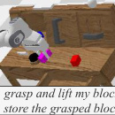

# VLAS: VLA Model With Speech Instructions

> 这是机器辅助生成的客观摘要笔记。教学版精读笔记由用户按节奏触发后单独成稿。

## 一句话讲什么（TL;DR）

让机器人直接"听懂"语音指令而不是先转文字，还能从声纹认出说话人是谁，办私人定制的活。

## 这篇论文要解决什么问题（Why this paper）

想象一个场景：你妈妈和爸爸都在家，机械臂在桌上。你说"帮我拿我的杯子"。机器人看着桌上 3 只杯子——绿的、红的、白的——它怎么知道"我的"是哪只？

这就是这篇论文盯着的痛点。**家庭服务机器人面对的是一群人，每个人对"我的杯子"的指代不一样**。仅靠语义内容（"我"+"杯子"）解决不了。

之前的 VLA（Vision-Language-Action，视觉-语言-动作模型）只吃图像 + 文字。要支持语音得先挂一个外挂 ASR（Automatic Speech Recognition，自动语音识别）把语音转成文字。但这样有两个麻烦：

- **整个系统变成两段流水线**——ASR 一段，VLA 一段。模型变大、计算变多、容易出现误差累积（一段错全段错）。类比：像传话游戏，第一个人听错一个字，最后机器人就拿错东西。
- **转成文字就丢了"语音里的额外信息"**——谁在说话（声纹）、什么情绪、什么语调。"我的杯子"这种话，没声纹就根本不知道谁是"我"。类比：把一段录音抄成文字稿，"是谁在说话"这条信息就永远丢了。

VLAS 想做的是：让一个端到端模型直接吃**原始语音**，并利用声纹去"对号入座"找私人知识。


## 用了什么方法（How）


### 1. 基座沿用 LLaVA — 站在巨人肩膀上加一只耳朵

**类比**：在已经会"看图说话"的人身上加一个"听力训练"，比从零教快得多。LLaVA 是开源里最经典的视觉问答模型，靠 ViT（Vision Transformer，把图片切块当词处理）+ MLP 投影器（一个小翻译网络）+ Vicuna（LLaMA 的对话微调版）拼起来。它解决了视觉-文本能力的冷启动问题。

**具体在干什么**：直接加载 LLaVA v1.5 的预训练权重作为起点。视觉用 CLIP-ViT 编码图像 patch；语言用 Vicuna-7B（LLaMA-7B 的对话微调版）做生成。所有的"看图听话出动作"都重用这套视觉-语言对齐能力。

**关键步骤翻译**：图像 → ViT 切成 patch 序列 → MLP 投影到 LLM 词向量空间 → 和文本 token 拼起来 → LLM 自回归生成。VLAS 在这条管道上**横插一条语音支线**（见下一节）。

**为什么这么设计**：LLaVA 全开源、可复现、性能好，作者明说"It is the milestone of open-source VLM"。从零训一个能看图听话的模型要烧几百万 GPU 小时，复用 LLaVA 直接省到 8 卡 A100 几天就能跑完。

**消融告诉我们什么**：Table 3 显示 VLAS-Base 在 6 个通用 VQA benchmark（VQAv2/VizWiz/SQA-I/VQAT/POPE/GQA）上和原版 LLaVA v1.5 几乎打平（VQAv2 78.7 vs 78.8），说明加语音模态没拖累原能力——这是"基座可重用"的硬证据。

读到这你可能在想：那语音怎么挤进这个已经很满的系统？

### 2. Whisper encoder + MLP 投影器 — 把语音塞进 LLM 的语义空间

**类比**：你的耳朵和你的眼睛看到的东西，最终都要"翻译成大脑能理解的统一思想"。声音是波形、图像是像素、文字是 token，三种"母语"都得翻译成 LLM 这个"普通话"才能一起讨论。

**具体在干什么**：语音先被切成 80-bin 的"频谱图条码"（mel-spectrogram，把声音波形按频率画成的彩色图），用 Whisper（OpenAI 出的语音识别模型）encoder 转成 1500 个隐状态向量；再通过一个 **reduction factor=5 的 reshape**（把每 5 个相邻向量合成 1 个，类比"把每 5 帧动画并成一张图"）减到 300 个；最后 MLP 把这 300 个向量翻译成 LLM 能懂的"词向量方言"。

**关键步骤翻译**：
- 原始波形 → STFT（短时傅里叶变换，把时间轴上的声音切成"每一小段的频率分布"）→ 80 维 mel-spectrogram，固定 padding 到 3000 帧
- mel-spectrogram → Whisper encoder → 1500 个隐向量（每个向量代表一小段声音的语义）
- reshape(reduction=5) → 300 个隐向量（**速度提升 5 倍，因为 LLM 要处理的 token 少了 5 倍**）
- MLP 投影 → 300 个 LLM 词向量空间的 token

**超参**（从 Section 4.1 + 附录 B.5 抠的）：
- reduction factor r=5（论文说"r=5 在性能-效率间取平衡"）
- mel-bin = 80（Whisper 标配）
- padding = 3000 帧（Whisper 标配）

**为什么这么设计**：
- 选 Whisper 而不是从零训：Whisper 是 OpenAI 开源 ASR 的 SOTA，已在 68 万小时多语言语音上预训练，**编码器输出的隐向量本身就有强语义对齐**，省力。
- reshape=5 而不是 1：1500 个语音 token 直接拼到 LLM 上下文里太挤（输入 token 数 = 图像 token + 文本 token + 1500 语音 token），推理慢一倍以上。reshape 是简单粗暴的下采样。
- 用简单 MLP 而不是 Q-Former 等复杂投影器：保持训练简单，学习率 1e-3 单卡就能收敛。

**消融告诉我们什么**：附录 B.5 Table 10 实测了 r=1/5/12/20 四档：r=1 推理 1.17 Hz、Len=2.02；r=5 推理 2.50 Hz、Len=3.70（性能反而更高，说明压缩没丢关键信息）；r=20 推理 3.80 Hz 但 Len 暴跌到 0.70（压得太狠把语义压没了）。**r=5 是甜蜜点**。

它解决了"语音 token 怎么和文本 token 在同一张桌子上对话"。

读到这你可能在想：装好了管道，可怎么训出来？毕竟"听+看+干活"三件事不是一锅就能炒熟的。

### 3. 三阶段训练 — 先听写、再答题、最后动手


**类比**：先教幼儿园听写（光会从声音转文字），再教小学听题答题（结合图像和声音回答问题），最后教初中听话干活（输出动作 token）。每一阶段教的能力都建立在前一阶段之上，不能跳着教。

**具体在干什么**：把语音→动作这个大目标拆成三个子任务，每个子任务用不同数据集 + 不同冻结策略 + 不同学习率分阶段训。

- **Stage I — Speech Alignment（粗粒度对齐）**：
  - 数据：LibriSpeech train-clean-100（干净英文有声书，~100 小时）
  - 冻结：除 MLP 投影器以外**全冻**
  - 任务：语音 → 文字转录（ASR）
  - 超参：lr=1e-3，batch=16，5 epochs，**单卡 A100**（论文说"empirically 单卡反而比 8 卡好"——因为这阶段只是粗对齐，多卡同步反而拖累）
  - 类比：让翻译器先把外语听懂，但不动核心大脑。

- **Stage II — Speech Question Answering（多模态联合微调）**：
  - 数据：SQA（自造，185K 语音问答）+ LLaVA 665K（原视觉指令数据）+ LibriSpeech train-clean-360
  - 冻结：视觉/语音 encoder 冻住，**其它（含 LLM、两个 MLP）全开**
  - 任务：语音问答 + 视觉问答 + 语音转录混合训
  - 超参：lr=2e-5，batch=16，1 epoch，**8× A100**
  - 产出：**VLAS-Base**——一个能接语音也能接文字的 VLM
  - 类比：教学生听老师口头出题（语音+图）然后答题。

- **Stage III — Robot Manipulation Fine-tuning（行为克隆）**：
  - 数据：CSI（自造，194K 条 CALVIN 仿真轨迹 + 语音指令）
  - 冻结：和 Stage II 一样
  - 任务：(图×2 + 语音 OR 文本) → 动作 token 序列
  - 超参：lr=2e-5，batch=16，1 epoch，8× A100，**5 步动作合并成一个训练标签**（提高执行频率）
  - 训练 trick：**一半样本随机替换为语音指令**，另一半保留文本，让模型同时支持两种模态
  - 类比：把会答题的学生送到工厂学操作机器，但保留它的答题能力。

**关键步骤翻译**：每阶段的 loss 都是标准交叉熵（cross-entropy）—— LLM 预测下一个 token，和真实 token 算误差。Stage I 的"下一个 token"是文字字符；Stage II 是文字答案；Stage III 是 7 维动作 token。**全程没用 RLHF、没用扩散模型，全是监督学习**。

**为什么这么设计**：直接 Stage III 端到端训会失败，因为机器人轨迹数据相对小（CSI 只有 194K），不够把"听语音"这件事从零学会。先用大规模 LibriSpeech（100+360 = 460 小时）把语音通道打通，再用小规模轨迹数据微调动作，是典型的**预训练-微调范式**。

**消融告诉我们什么**：论文没单独跑"跳过 Stage I 直接 Stage II"的消融，但从 Stage I 单卡训出更好结果可以反推：粗对齐阶段必须慢、稳，否则后续多模态训练会震荡。Table 4 显示 Stage II 后的 VLAS-Base 在 LibriSpeech 上 WER=2.79%（接近 Whisper large-v2 的 2.7%），说明三阶段分工没有在某一阶段把语音能力遗忘掉。

读到这你可能在想：阶段一训完直接能用吗？答案是不能，因为它只学了"听写"，还不会把语音和图像放一起回答问题；阶段二训完也还不能干活，因为它只会"回答"不会"动手"。三阶段层层接力。

### 4. Voice RAG（语音检索增强生成） — 听到声音就翻档案

**类比**：进门时门禁先扫脸（提取声纹），然后从档案柜里调出"这位是李四，他的杯子是绿的，他爱把东西放进抽屉"这样的小卡片，**塞给 LLM 当背景知识**再让它生成动作。普通 RAG 用文字查询（"用户问了什么"→ 文档库找答案），Voice RAG 用声纹查询（"是谁在说"→ 个人档案库找私人偏好）。

**具体在干什么**：原始语音 → 声纹提取模块（用预训练好的 speaker identification 模型，不从零训）→ 声纹当 key 查个人档案数据库 → 取出相关文字背景 → 经文本 tokenizer 变成 embedding → 和图像/语音 embedding 拼一起喂给 LLM。

**关键步骤翻译**：
- 输入：一段语音 s
- 第 1 步 voiceprint = SpeakerID(s)（声纹是一个固定维度向量，类似指纹）
- 第 2 步 background_text = Database.lookup(voiceprint)（查到"李四：绿杯、抽屉党"）
- 第 3 步 Tok_l(background_text) → 文字 token
- 第 4 步 拼接：[语音 token, 文字背景 token, 图像 token] → LLM → 动作

**关键公式（人话版）**：
原文 Eq.(1)：`Emb(s, O) = concat(MLP_s(Emb_s(s)), Tok_l(RAG(s)), MLP_v(Emb_v(O)))`
人话翻译："最终送给 LLM 的输入 = [语音的词向量化结果] 拼上 [声纹查档案得到的文字 embedding] 拼上 [图像的词向量化结果]"。三种来源的 embedding 平等地拼成一段长 token 序列。

**超参 / 设计点**：
- 声纹提取用预训练模型（论文没说具体哪个，但提到 "pre-trained speaker identification module"），**不从零训**
- 档案库用啥结构论文没说，按上下文像是 {voiceprint_id: text_string} 的简单 KV 字典

**为什么这么设计**：
- 用文字而不是 embedding 当背景：因为文字可以人工编辑（比如新加用户时手写一行"王五：红杯，怕烫")，灵活、可解释。
- 用预训练声纹模块：声纹技术早就成熟（语音助手、银行声纹支付都用），没必要重做轮子。
- 把检索到的背景塞进 prompt 而不是改模型权重：这是 RAG 范式的标准操作——**新用户来了不用再训模型**，加一行档案就行。

**消融告诉我们什么**（Table 2 关键数据）：
- VLAS（带 RAG）= 86.5%
- VLAS−RAG（不带 RAG）= 16.0%（**比纯 VLA 19.2% 还低**！）
- VLA + RAG（给 VLA 也加 RAG）= 82.0%

第 2 行最反直觉：去掉 RAG 后 VLAS 比 VLA 还差。原因是 VLAS 在训练时**已经习惯了"声纹+档案"配套出现**，突然抽掉档案它反而懵了——这说明 RAG 不只是外挂，已经深度耦合进推理流程。第 3 行说明 RAG 范式本身就强，把它搬到 VLA 上也能涨到 82%，但 VLAS 的端到端语音输入再加 4.5 个百分点。

它解决了"指令里只说'我的杯子'，机器人怎么知道是哪个"。

### 5. 动作 token 化 — 让 LLM 把动作也当字写

**类比**：LLM 本来只会写字，现在要让它"写动作"。办法：把连续的动作值切片当字处理，比如"向左 3cm"切到第 47 格，那就让 LLM 输出 token "47"。**整个 LLM 不变，只是词表里 256 个最冷门的字被征用为"动作字"**。

**具体在干什么**：连续 7 维动作 [x, y, z, ϕ, θ, ψ, g]（xyz 位置 + 三个旋转角 + 夹爪开合）每维离散成 256 格，每格映射到 LLM 词表里一个"最不常用 token"。

**关键公式（人话版）**：
原文 Eq.(2)：`p(a | Emb(s, O)) = ∏_{i=1}^{N} p(a_i | Emb(s, O), a_{<i})`
人话翻译："给定输入（语音+图像），生成整个动作序列的概率 = 每一维动作的条件概率连乘"。也就是说，模型先生成 x 维的 token，再基于 x 生成 y 维的 token，再生成 z……标准 GPT 式自回归。

具体一步动作的格式：
```
[x_token] [space] [y_token] [space] [z_token] [space] [ϕ_token] ... [g_token]
```
7 个动作 token 用空格分隔，看起来就像一句"7 个字的话"。

**超参**：
- 离散格数：256（每维）
- 动作维度：7
- 单步动作 token 数：7
- **多步合并 r=5**：训练时把连续 5 步动作拼成一个标签（35 个 token），让模型一次预测 5 步，推理时就批量执行 5 步——这是附录 B.5 的 inference 加速 trick。

**为什么这么设计**：
- 复用最冷门 token：LLM 词表里有些 token（比如稀有外语字符）训练时几乎没出现过，征用它们当动作 token，**不会和正常语言冲突**。
- 256 格而不是 1024 或 64：256 是经验值（RT-2、OpenVLA 都用），精度够用，token 数还能完全装进 LLM 词表 0-255 范围。
- 自回归而非一次输出 7 维：保证 LLM 用同一套生成机制，**不需要改架构**，只是新增了一些动作样本。

**消融告诉我们什么**：附录 B.5 Table 9 显示 r=1（每步生成 7 token、立即执行）→ Hz=1.17、Len=2.02；r=5（一次生成 35 token、连续执行 5 步）→ Hz=2.50、Len=3.70。**多步预测不仅快还准**——因为环境短期内变化不大，提前规划反而更稳。





## 关键实验结果（What works）

### 1. CALVIN ABCD/D 语音端到端 vs ASR 级联

- **设置**：CALVIN benchmark ABCD 训练、D 测试。1000 个长任务，每个含 5 个连续子任务。语音用 39 个**未在训练集出现的新声音** TTS 合成。VLAS 直接吃语音；baseline VLA + Whisper large-v2 走"语音→文字→VLA"两段管道。
- **数字**：VLAS* = 3.70 vs VLA* + ASR = 3.13 vs RoboFlamingo + ASR = 3.41（满分 5.0，越高越好）
- **对比**：VLAS 比 VLA+ASR 多 0.57，比 RoboFlamingo+ASR 多 0.29。端到端方案领先所有级联方案。
- **现实意义**：每跑 5 个任务，VLAS 多完成 1.5 个左右子任务。意味着**家里机器人完成"叠衣服+收碗+擦桌"这种串联任务时**，VLAS 出错前能多干一截才掉链子，体感差距会被用户清楚感知。

### 2. CALVIN 文本任务能力不退化

- **设置**：同样 CALVIN ABCD/D，但**喂文本指令**（不走语音）。检验"加语音通道是否拖累原文本能力"。
- **数字**：VLAS+ = 3.74 vs VLA+ = 3.80（baseline 是把同一 LLaVA 直接微调到 CALVIN）
- **对比**：差 0.06，几乎不可察。
- **现实意义**：这个对照非常关键——意味着**用户买一台支持语音的机器人，并没有为此牺牲文本指令能力**。如果加语音通道掉点 5-10%，用户会觉得"还不如用老的"。

### 3. 定制化任务（Ownership / Preference / Compound）

- **设置**：作者新建 benchmark，3 类共 5 子任务，要求模型用"个人知识"决定动作（比如"拿我的杯子"——必须知道说话人是谁、对应哪只杯）。每类 39 个未见过的声音。
- **数字**：VLAS = 86.5% vs VLA = 19.2% vs VLAS−RAG = 16.0% vs VLA+RAG = 82.0%
- **对比**：VLAS 是 VLA 的 4.5 倍。去掉 RAG 直接掉到 16%（**比纯 VLA 还差**！原因见下）。
- **现实意义**：VLA 19% ≈ 5 选 1 随机基线；VLAS 86% 是真"听懂了"。**Voice RAG 是定制化任务的命脉**：不光拉开和文本 baseline 的差距，还证明 RAG 范式独立有效（VLA+RAG 也能涨到 82%）。VLAS−RAG 比 VLA 还低，是因为 VLAS 训练时**已经习惯档案背景同时存在**，突然抽掉它反而懵——这是端到端 RAG 训练的副作用。

### 4. LibriSpeech 语音识别能力

- **设置**：在 LibriSpeech test-clean 测纯 ASR 能力，看作"附赠的语音识别副产品"。用 word error rate（WER，词错率）评估，越低越好。
- **数字**：VLAS-Base = 2.79% vs Whisper large-v2 = 2.7%
- **对比**：差 0.09 个百分点（即 100 词多错 0.09 个），可视为打平。
- **现实意义**：这意味着 VLAS-Base 顺带把语音识别也做到了 ICLR 2025 时代的 SOTA 水平——**作为一个机器人模型，它的副业 ASR 已经能和专业 ASR 一战**。说明语音模态没在三阶段训练中被遗忘。

### 5. 真人语音 sim-to-real 测试

- **设置**：找 10 个真人录"和 TTS 内容一样"的语音，替换 TTS 合成语音重新测试。
- **数字**：Len 从 3.70（TTS） → 3.61（真人）；定制化任务从 86.5% → 78.6%
- **对比**：差距 0.09（CALVIN）和 7.9 个百分点（定制化）。
- **现实意义**：合成语音 vs 真人有可测的差距——**实际意味着**模型在 TTS 数据上略过拟合。如果家里有口音重的爷爷、感冒鼻塞的妈妈、哭着说话的小孩，性能会比论文数字再低一档。要做产品必须补真人数据。

### 6. ABC/D 跨场景泛化

- **设置**：附录 B.4，训练只用 ABC 三个场景，测试用 D（全新场景）。考验泛化。
- **数字**：VLAS+ = 2.27 vs RoboFlamingo+ = 2.48 vs VLA+ = 2.14（语音版 VLAS* = 2.40 vs VLA*+ASR = 2.04）
- **对比**：换新场景大家都掉点，VLAS 掉得不离谱（3.74 → 2.27），仍优于 VLA。
- **现实意义**：未见过的厨房、未见过的桌面布局，VLAS 还能跑出 ~2.4 的 Len——**意味着"换个家也能用，不必每户重训"**。但定制化任务 ABC/D 设置下平均掉到 55.1%（vs ABCD/D 的 86.5%），说明个性化能力对场景泛化更敏感。

### 7. 推理效率（部署可行性）

- **设置**：附录 B.5，测不同 r 值（多步预测）对 Hz 和 Len 的影响。
- **数字**：r=1 → 1.17 Hz / Len 2.02；r=5 → 2.50 Hz / Len 3.70；r=12 → 2.88 Hz / Len 3.35；r=20 → 3.80 Hz / Len 0.70
- **对比**：r=5 是甜蜜点（速度涨一倍多、性能反而升）；r=20 推理飞快但任务全崩。
- **现实意义**：**2.50 Hz 意味着每秒 2-3 个动作**，对家庭服务机器人来说够用（人手日常操作也就 1-3 Hz）。能在 A100 这一档卡上 2.5 Hz 跑起来，部署难度大幅降低。

## 我读完后该懂的几个术语

- **VLA**（Vision-Language-Action，视觉-语言-动作模型）—— 让机器人"看图听话出动作"的一体模型。类比：一个又能看监控、又能听对讲、又能直接操纵机械手的工人。本文整篇都在讲它的扩展。
- **ASR**（Automatic Speech Recognition，自动语音识别）—— 语音转文字。类比：会议速记员。本文要做的就是"不用速记员"，避免它制造的转录错误传到下游。Section 4.1 的 baseline VLA+ASR 就是用 Whisper 当速记员。
- **Voiceprint / Speaker Identification**（声纹 / 说话人识别）—— 从语音里抽出"这是谁"的特征。类比：不看脸只听声音也能认人，每个人说话都有独特的频谱"指纹"。本文用预训练模块提取，作为 RAG 查询的钥匙（Section 3.1 Voice RAG 段）。
- **RAG**（Retrieval-Augmented Generation，检索增强生成）—— 回答前先去外部数据库找资料再答。类比：开卷考试。本文是用"声纹"当查询钥匙（普通 RAG 用文字当 key，本文用声纹）。Section 3.1 末段。
- **LLaVA** —— 经典开源视觉-语言模型，靠 ViT + MLP 投影 + Vicuna(LLaMA) 拼起来。类比：本文站在它肩膀上加了一只"耳朵"。Section 3.1 Network Backbone 提到它是基座。
- **CALVIN** —— 长序列机器人操作 benchmark，每个长任务由 5 个连续子任务组成。类比：5 道题串成的考试卷，前一题做错会影响后一题。Section 4.1 主战场。
- **Behavior Cloning**（行为克隆）—— 监督学习方式让模型模仿专家轨迹。类比：学徒抄师傅每一步动作。Stage III 用的就是这个。
- **mel-spectrogram**（梅尔频谱图）—— 把声音波形按频率切片画成的彩色图。类比：声音的 X 光片。Whisper 吃的就是它。

## 这篇论文的局限 / 我看出的疑点

- **依赖 TTS 合成的训练语音**（VITS + LibriTTS 1152 种声音）：合成语音和真人语音分布有差距，作者用 10 个真人录音测出来 Len 从 3.70 掉到 3.61。**实际意味着**：你买回家这台机器人，妈妈感冒鼻塞、小孩哭着说话、口音重的爷爷奶奶，可能就识别不准。
- **没有历史信息**：作者自己承认在 CALVIN 上落后 RoboFlamingo（3.74 vs 4.09），原因是 RoboFlamingo 有 LSTM policy head 记得上一步干了啥，而 VLAS 是无状态前向。**实际意味着**：复杂连续操作（比如"先把面粉倒进碗里再打鸡蛋"）容易在第二步忘了第一步的状态、出错。
- **Voice RAG 的"个人知识库"是怎么建立、怎么更新的**论文几乎没讲——实际部署中，新用户来了得手动录入档案吗？冷启动问题没回应。**实际意味着**：买回家第一天机器人完全不知道谁是谁、东西归谁，得做一套繁琐的"录声纹+登记物品归属"流程才能用。
- **只在仿真 + 单机械臂场景验证**：UR5 真机部分只展示成功案例，没有定量成功率，也没在多机械臂、移动平台上验证。

## 与其他 12 篇的关联

- **vs OpenVLA**：都基于 VLM 微调出动作策略，技术路线同源（VLM + 动作 token 化）。但 OpenVLA 只接受第三人称单视角输入，且不支持语音；论文实测 OpenVLA 在 CALVIN 上表现很差（Len=0.34），原因是缺少夹爪视角无法做精细抓取。VLAS 用了双视角拼接（gripper view + static view），这是它领先的关键之一。
- **vs RT-2 / RoboFlamingo**：同属"VLM 直接生成动作"路线，VLAS 把模态从 (图 + 文) 扩到 (图 + 文 + 语音 + 声纹)，是**模态轴的扩展**。RoboFlamingo 在 CALVIN 上比 VLAS 强 0.35，但靠的是 LSTM 历史信息——作者明说"两个工作正交，可以叠加"。
- **vs PaLM-E / SayCan**：那两篇是高层任务规划（VLM 编排预定义技能），本文是端到端动作生成，**路线不同**。PaLM-E 是"思考型大脑指挥固定的几只手"，VLAS 是"一个会思考又能直接动手的人"。
- **vs MUTEX**：MUTEX 也支持多种任务规格输入（含语音），但用的是较老的 VLM，没充分利用现代大模型能力。VLAS 算是"用 LLaVA 把 MUTEX 那条路重做一遍并加上声纹 RAG"。

## 数据集 / 实验设置详情

### 用了哪些数据集

| 阶段 | 数据集 | 规模 | 来源 | 用途 |
|---|---|---|---|---|
| Stage I | LibriSpeech train-clean-100 | ~100 小时干净英文有声书 | 公开（Panayotov et al. 2015）| 粗对齐：语音→文字 |
| Stage II | SQA（自造） | 185K 条语音问答样本，1152 种声音 | 把 LLaVA 多轮对话子集用 VITS-TTS 转语音 | 多模态联合训练 |
| Stage II | LLaVA 665K | 665K 条视觉指令对 | 公开（Liu et al. 2023）| 保留 VQA 能力 |
| Stage II | LibriSpeech train-clean-360 | ~360 小时 | 公开 | 继续打牢语音通道 |
| Stage III | CSI（自造） | 194K 条仿真轨迹 + 语音指令，500 种声音 | CALVIN 389 条文本指令 × 500 种声音 TTS | 行为克隆训机器人策略 |
| 真机 | Berkeley UR5 demo + 自造 cup-picking | 论文未给具体数量 | 半公开 + 自录 | UR5 真机微调 |

### Train/Val/Test 怎么分

- **CALVIN 主战场**：用 ABCD 训练、D 测试（默认设置，有重叠场景）；附录 B.4 用 ABC 训练、D 测试（更难，跨场景泛化）。
- **定制化 benchmark**：作者新建，每类 39 个**未在 SQA/CSI 训练集出现的新声音**做测试。论文未明确说"训练 split 多大、测试 split 多大"——猜测是从 CALVIN 衍生，按用户/物品组合枚举。
- **真人测试**：10 个真人录音替代 TTS，只做测试，不做训练。

### 硬件

- **主训练**：8× A100 GPU（40GB 或 80GB 论文未明）
- **Stage I 例外**：单卡 A100（作者实测单卡反而比多卡好——粗对齐阶段同步开销大于并行收益）
- **训练时长**：论文未明给"多少卡时"，但能反推：Stage I 5 epoch × LibriSpeech-100 ≈ 数小时（单卡）；Stage II 1 epoch × 1.2M 总样本 batch=16 ≈ 1-2 天（8 卡）；Stage III 1 epoch × 194K ≈ 数小时（8 卡）。**总计估计 50-80 卡天 A100**。

### Baseline 是哪几个

| Baseline | 出处 | 路线 | 差距 |
|---|---|---|---|
| MCIL | Lynch & Sermanet 2021 | 早期 imitation learning | VLAS 大幅领先（0.40 vs 3.74）|
| HULC | Mees et al. 2022 | 纯监督学习 | VLAS 领先（2.90 vs 3.74）|
| RT-1 | Brohan et al. 2022 | Transformer-based VLA | VLAS 领先（2.45 vs 3.74）|
| VLA（自训）| 作者从 LLaVA 微调出的"无语音"对照 | 同骨架 - 语音通道 | 同分（3.80 vs 3.74，差 0.06）|
| RoboFlamingo | Li et al. 2024b | OpenFlamingo + LSTM head | **领先 VLAS**（4.09 vs 3.74）|
| OpenVLA | Kim et al. 2024 | OpenVLA-7B | VLAS 大幅领先（0.34 vs 3.74，OpenVLA 缺夹爪视角）|
| Whisper large-v2 | Radford et al. 2023 | 通用 ASR | 平手（WER 2.7% vs 2.79%）|

## 关键公式 / 算法（人话翻译版）

### 公式 1：多模态 token 拼接

**原文 Eq.(1)**：
```
Emb(s, O) = concat(MLP_s(Emb_s(s)), Tok_l(RAG(s)), MLP_v(Emb_v(O)))
```

**人话翻译**：
"最终送进 LLM 的输入序列 = 把三个 embedding 头尾相接拼起来"。具体三段是：
- `MLP_s(Emb_s(s))` —— 语音先经 Whisper encoder 抽特征，再经 MLP 投影到 LLM 词空间
- `Tok_l(RAG(s))` —— 用语音里的声纹查档案，取出文字背景，经文本 tokenizer 转成 token
- `MLP_v(Emb_v(O))` —— 图像 O 经 ViT 抽特征，再经 MLP 投影

**每一项的来源**：
- s：原始语音波形（用户说的话）
- O：当前视觉观测（两个相机视角拼接）
- Emb_s：Whisper encoder（预训练，参数冻结）
- Emb_v：CLIP-ViT（预训练，参数冻结）
- MLP_s, MLP_v：训练阶段更新的小投影网络
- RAG(s)：声纹查档案的检索结果（文字字符串）
- Tok_l：LLaMA 自带的 BPE tokenizer

### 公式 2：动作自回归生成

**原文 Eq.(2)**：
```
p(a | Emb(s, O)) = ∏_{i=1}^{N} p(a_i | Emb(s, O), a_{<i})
```

**人话翻译**：
"给定输入（语音+图像），生成完整动作 a 的概率 = 每一维动作单独生成的条件概率连乘"。也就是 LLM 一个 token 一个 token 地往外吐：先吐 x 维动作 token、再基于它吐 y 维、再 z……标准 GPT 式自回归。

**每一项的来源**：
- a：完整动作向量 [x, y, z, ϕ, θ, ψ, g]，N=7
- a_i：动作的第 i 维（每维已离散化为 0-255 之间的 token）
- a_{<i}：前面已生成的动作 token
- Emb(s, O)：Eq.(1) 拼出来的多模态输入

### 公式 3：动作离散化

**原文 Eq.(3)**：
```
[x, y, z, ϕ, θ, ψ, g]
```

**人话翻译**：
"机器人在每个时刻的状态由 7 个数字描述：x/y/z 是末端执行器的笛卡尔位置（毫米级），ϕ/θ/ψ 是绕 x/y/z 轴的旋转角，g 是夹爪开合（0=张开，1=闭合）"。每一维离散化成 256 格，每格映射到 LLM 词表里一个最冷门 token。

**为什么 7 维**：6 自由度（DOF）描述刚体位姿（3 位置 + 3 旋转）+ 1 维夹爪 = 7。这是机器人学的标配。

## 实操 FAQ（如果你想复现）

- **这模型多大？**
  Vicuna-7B + CLIP-ViT-Large + Whisper encoder 大约 7-8B 参数总规模。和 OpenVLA-7B 同档。

- **显存要多少？**
  论文没给具体显存数字。按 7B 模型 + Flash Attention 2 + BF16 + batch=16 估算，**单卡 40GB A100 够推理**，训练阶段 II/III 用 80GB A100 比较稳。

- **数据在哪？要授权吗？**
  - LibriSpeech：CC BY 4.0，免费可商用
  - LLaVA 665K：开放下载（liuhaotian/LLaVA-Instruct-150K 等）
  - CALVIN：MIT License，免费
  - **SQA 和 CSI 是作者自造**，论文承诺"开源在 GitHub"
  - LibriTTS（用来 TTS 合成的声纹库）：CC BY 4.0

- **代码 repo 在哪？**
  论文末尾给了：https://github.com/whichwhichgone/VLAS
  （论文写的"will be publicly available"，2025 年 ICLR 发表后理论上已开源）

- **训练一次烧多少卡时？**
  - Stage I：单卡 × 5 epoch × LibriSpeech-100 ≈ 半天到一天
  - Stage II：8 卡 × 1 epoch × ~1.2M 样本 ≈ 1-2 天
  - Stage III：8 卡 × 1 epoch × 194K 样本 ≈ 数小时到一天
  - **保守估计总卡时 50-80 A100·days**（按 8 卡 8 天估算）。原文未明说。

- **能不能换中文？**
  Whisper 支持多语言，理论可以。但 SQA 和 CSI 全是英文 TTS，**直接换中文需要重做这两个数据集**。LLaVA 的视觉指令对也以英文为主。

## 失败案例与边界

附录 B.1 给了 VLAS 和 VLA 的失败案例对比（Figure 8、9）：

### VLAS 在哪些场景崩

- **Preference 任务（用户偏好）**：错误模式比较一致，**模型理解了指令但执行动作时没成功**。比如用户说"把我喜欢的杯子放抽屉"，VLAS 听懂了"红杯+抽屉"，但夹爪没夹稳掉了。作者把锅甩给"policy 架构和训练流程"，意思是底层执行能力还有提升空间，跟语音/RAG 无关。
- **Compound 任务的第二阶段**：两步任务里第二步的成功率（66.7%）比第一步（100%）大幅下降。原因是**VLAS 没有历史记忆**，第二步开始时已经忘了第一步把什么放哪了。
- **真人 vs TTS gap**：定制化任务从 86.5%（TTS）→ 78.6%（真人），8 个百分点的 sim-to-real gap。
- **跨场景定制化**：ABC/D 设置下定制化任务平均掉到 55.1%（vs ABCD/D 的 86.5%），新场景的家具布局会让"杯子在哪里"这种知识失效。

### VLA（无语音、无 RAG 的 baseline）的失败模式

- **错误更杂乱**：附录 B.1 说 VLA 的错误模式是 "diverse range"——因为它从语音里只能拿到字面语义，碰到"我的杯子"只能瞎猜，导致各种不同的失败。
- **Compound stage-2 = 5.1%**：基本全军覆没。

### 论文承认的局限

- **TTS 数据偏置**：训练全用 VITS 合成，分布单一。真人录音掉点直接证实了这个隐患。
- **缺历史信息**：作者主动提到 "lack of historical information"，承认 VLAS 在 CALVIN 上输给 RoboFlamingo 主要因为没 LSTM head。
- **个人档案库的冷启动**：怎么建库、怎么更新、怎么处理新用户——论文几乎没提。

## 这篇论文之后的延伸阅读

### 前传（先读这些再读 VLAS 更顺）

1. **LLaVA**（Liu et al. 2023, NeurIPS 2023）—— VLAS 的视觉-语言基座。读完知道 ViT+MLP+Vicuna 怎么拼起来。
2. **Whisper**（Radford et al. 2023, ICML 2023）—— VLAS 的语音 encoder。68 万小时多语言预训练的 ASR 模型。
3. **RT-2**（Brohan et al. 2023）—— VLA 范式开山之作。先读这个再读 VLAS，能看清"加语音"是个增量改动。

### 续作 / 同期可对比工作

4. **OpenVLA**（Kim et al. 2024）—— 开源 VLA 标杆，VLAS 的强对照。OpenVLA 7B 在 CALVIN 上跑得不好（Len=0.34），原因是缺夹爪视角。**对比着读能看出"双视角是否必需"**。
5. **RoboFlamingo**（Li et al. 2024b）—— 在 CALVIN 上比 VLAS 强（4.09 vs 3.74），关键是带 LSTM 历史信息。作者明说"两条路正交"，可以叠加。

### 竞争对手 / 同主题不同方法

6. **MUTEX**（Shah et al. 2023, CoRL）—— 同样支持多模态任务规格（含语音）的策略模型。VLAS 算是用 LLaVA 把 MUTEX 重做并加声纹。
7. **VITA**（Fu et al. 2024）—— 开源端到端语音 LLM，把 VLAS 的"语音→LLM"这部分推到更通用形态。如果你关心语音 LLM 本身，读这个。
8. **GPT-4o**（OpenAI 2024）—— 闭源但是同期最强的多模态语音模型。VLAS 在 robotics 子领域复刻了 GPT-4o 的"原生语音输入"思路。

## 我建议的阅读顺序

面向零基础读者，按以下 5 步读最高效：

1. **先看 Abstract + Figure 1**（10 分钟）：抓住"为什么需要语音不是文字"的故事。Figure 1 一图胜千言，直接看出 VLAS 比 VLA+ASR 强在哪。
2. **跳到 Figure 2 看架构图**（5 分钟）：脑子里建立"语音→Whisper→MLP，图像→ViT→MLP，声纹→RAG，全部送进 LLM 出动作"的整体管道。**不要急着看公式**。
3. **再读 Section 3.1 Architecture**（30 分钟）：每个组件配着 Figure 2 看。这是最核心的一节，方法论全在这。
4. **跳过 3.2 数据集章节细节**（5 分钟略读）：知道有 SQA 和 CSI 两个新数据集就够了，具体怎么生成的不影响理解方法。
5. **直接看 Table 2（定制化任务）**（15 分钟）：这是论文真正想证明的差异化卖点。**对比 VLAS vs VLAS−RAG vs VLA+RAG 三行**，能看出 RAG 对个性化是必需且充分的。Table 1 的 CALVIN 结果作为基础能力对照，扫一眼就行。
6. **可选：附录 B.5 推理效率**（10 分钟）：如果关心部署，r=5 多步预测能从 2.5 Hz 跑起来。

跳过：Section 4.4 VLAS-Base 在 VQA benchmark 上的对比（这是辅助证据，证明加语音没掉性能）；附录 B.1 的失败案例（分析失败模式，对方法理解帮助不大）。

## 为什么值得读 / 不值得读

如果你**只能读 1 篇 VLA 论文**，别选这篇——读 OpenVLA 或 RT-2 更基础，能理解 VLA 范式本身。

如果你**能读 3 篇**且关心多模态，这篇值得当第 3 篇——它展示了"如何把新模态（语音 + 声纹）端到端塞进 VLA"，是模态扩展的清晰案例。

如果你**能读 5+ 篇**且做家庭服务机器人 / 个性化交互，**必读**——它是目前少数把"声纹 + RAG"塞进 VLA 来解决"我的"指代问题的工作，Method 章节的 Voice RAG 设计是可直接借鉴的工程模式。

如果只关心 VLA 通用能力上限，它在 CALVIN 上不如 RoboFlamingo，可以略读 Method 跳过实验。
