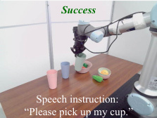
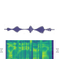
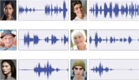

# VLAS: VLA Model With Speech Instructions

> 这是机器辅助生成的客观摘要笔记。教学版精读笔记由用户按节奏触发后单独成稿。

## 一句话讲什么（TL;DR）

让机器人直接"听懂"语音指令而不是先转文字，还能从声纹认出说话人是谁，办私人定制的活。

## 这篇论文要解决什么问题（Why this paper）

想象一个场景：你妈妈和爸爸都在家，机械臂在桌上。你说"帮我拿我的杯子"。机器人看着桌上 3 只杯子——绿的、红的、白的——它怎么知道"我的"是哪只？

这就是这篇论文盯着的痛点。**家庭服务机器人面对的是一群人，每个人对"我的杯子"的指代不一样**。仅靠语义内容（"我"+"杯子"）解决不了。

之前的 VLA（Vision-Language-Action，视觉-语言-动作模型）只吃图像 + 文字。要支持语音得先挂一个外挂 ASR（Automatic Speech Recognition，自动语音识别）把语音转成文字。但这样有两个麻烦：

- **整个系统变成两段流水线**——ASR 一段，VLA 一段。模型变大、计算变多、容易出现误差累积（一段错全段错）。类比：像传话游戏，第一个人听错一个字，最后机器人就拿错东西。
- **转成文字就丢了"语音里的额外信息"**——谁在说话（声纹）、什么情绪、什么语调。"我的杯子"这种话，没声纹就根本不知道谁是"我"。类比：把一段录音抄成文字稿，"是谁在说话"这条信息就永远丢了。

VLAS 想做的是：让一个端到端模型直接吃**原始语音**，并利用声纹去"对号入座"找私人知识。

## 用了什么方法（How）

### 1. 基座沿用 LLaVA

类比：在已经会"看图说话"的人身上加一个"听力训练"，比从零教快得多。LLaVA 是开源里最经典的视觉问答模型，靠 ViT（Vision Transformer，把图片切块当词处理）+ MLP 投影器（一个小翻译网络）+ Vicuna（LLaMA 的对话微调版）拼起来。它解决了视觉-文本能力的冷启动问题。

读到这你可能在想：那语音怎么挤进这个已经很满的系统？

### 2. Whisper encoder + MLP 投影器把语音塞进 LLM 的语义空间

类比：你的耳朵和你的眼睛看到的东西，最终都要"翻译成大脑能理解的统一思想"。语音先被切成 80-bin 的"频谱图条码"（mel-spectrogram，把声音波形按频率画成的彩色图），用 Whisper（OpenAI 出的语音识别模型）encoder 转成 1500 个隐状态向量；再通过一个**reduction factor=5 的 reshape**（把每 5 个相邻向量合成 1 个，类比"把每 5 帧动画并成一张图"）减到 300 个；最后 MLP 把这 300 个向量翻译成 LLM 能懂的"词向量方言"。

它解决了"语音 token 怎么和文本 token 在同一张桌子上对话"。

读到这你可能在想：装好了管道，可怎么训出来？毕竟"听+看+干活"三件事不是一锅就能炒熟的。

### 3. 三阶段训练（图见下）

类比：先教幼儿园听写，再教小学听题答题，最后教初中听话干活。

- **Stage I — Speech Alignment**：用 LibriSpeech-360（一个干净的英文有声书数据集）只训 MLP 投影器做"听到啥写出啥"的语音识别任务，让 LLM 学会"对应这串语音 token 应该输出什么文字"。其它部分全冻住。类比：让翻译器先把外语听懂，但不动核心大脑。
- **Stage II — Speech Question Answering Fine-tuning**：用 SQA（自造的语音问答数据集，185K 样本，1152 种声音）+ 原 LLaVA 的 VQA 数据（视觉问答）+ LibriSpeech-100，**联合微调除了视觉/语音 encoder 之外的所有部分**。产出 VLAS-Base——一个可以接语音也可以接文字的 VLM。
- **Stage III — Robot Manipulation Fine-tuning**：用 CSI（CALVIN with Speech Instructions，自造数据集，把 CALVIN 的 389 条文本指令各用 500 种声音念一遍，得到 194K 条音频）做行为克隆，把模型变成机器人策略。**训练时把一半样本随机替换成语音指令**，让模型同时支持文字 + 语音。

读到这你可能在想：阶段一训完直接能用吗？答案是不能，因为它只学了"听写"，还不会把语音和图像放一起回答问题；阶段二训完也还不能干活，因为它只会"回答"不会"动手"。三阶段层层接力。

### 4. Voice RAG（语音检索增强生成）

类比：进门时门禁先扫脸（提取声纹），然后从档案柜里调出"这位是李四，他的杯子是绿的，他爱把东西放进抽屉"这样的小卡片，**塞给 LLM 当背景知识**再让它生成动作。

具体流程：原始语音 → 声纹提取模块（用预训练好的 speaker identification 模型，不从零训）→ 声纹当 key 查个人档案数据库 → 取出相关文字背景 → 经文本 tokenizer 变成 embedding → 和图像/语音 embedding 拼一起喂给 LLM。

它解决了"指令里只说'我的杯子'，机器人怎么知道是哪个"。

### 5. 动作 token 化

类比：让 LLM 把"伸手向左 3cm"也当成一个"汉字"来生成。把连续的 7 维动作（xyz 位置 + 三个旋转角 ϕ θ ψ + 夹爪 g）每维离散成 256 格，复用 LLM 词表里**最不常用的 256 个 token**当动作词（这些词反正很少用，征用了不影响语言能力）。一步动作就是 7 个 token 串起来的一句"动作话"。

## 关键实验结果（What works）

- **CALVIN ABCD/D，长序列 5 任务平均长度（满分 5.0）：VLAS-语音 = 3.70 vs VLA+ASR = 3.13**。意思是模型平均能连完成 3.70 个子任务才出错。这个 0.57 的差距相当于"每跑 5 个任务，VLAS 多完成一个还半"——端到端比"VLA+外挂 ASR"显著强，证明端到端避免了误差累积。
- **CALVIN，VLAS-文本 = 3.74 vs VLA-文本 = 3.80**。差 0.06 几乎不可察。意义在于：**加上语音通道几乎没拖累原本的文本任务能力**——这个不掉链子的代价非常关键，否则没人愿意为了多个语音通道牺牲原能力。
- **定制化任务平均成功率：VLAS = 86.5% vs VLA = 19.2% vs VLAS−RAG = 16.0%**。VLA 19% 等于"基本靠瞎猜"——5 只杯子选对一只刚好 20%。VLAS 86% 才是真"听懂了"。**Voice RAG 是定制化任务的核心**，去掉它直接掉到 16%（比 VLA 还差，因为没了背景知识，连随机基线都不如）。
- **LibriSpeech 语音识别 WER：VLAS-Base = 2.79% vs Whisper large-v2 = 2.7%**。WER（word error rate，词错率）2.79% 意思是 100 个词错 2.79 个。**和当年通用 ASR 的 SOTA 持平**——VLAS 顺带把语音识别也做到了顶尖水平。
- **真人语音测试**：用 10 个真人录音替代 TTS 合成，Len 从 3.70 掉到 3.61。掉得不多，但说明合成语音和真人有 sim-to-real 差距。

## 我读完后该懂的几个术语

- **VLA**（Vision-Language-Action，视觉-语言-动作模型）—— 让机器人"看图听话出动作"的一体模型。类比：一个又能看监控、又能听对讲、又能直接操纵机械手的工人。本文整篇都在讲它的扩展。
- **ASR**（Automatic Speech Recognition，自动语音识别）—— 语音转文字。类比：会议速记员。本文要做的就是"不用速记员"，避免它制造的转录错误传到下游。Section 4.1 的 baseline VLA+ASR 就是用 Whisper 当速记员。
- **Voiceprint / Speaker Identification**（声纹 / 说话人识别）—— 从语音里抽出"这是谁"的特征。类比：不看脸只听声音也能认人，每个人说话都有独特的频谱"指纹"。本文用预训练模块提取，作为 RAG 查询的钥匙（Section 3.1 Voice RAG 段）。
- **RAG**（Retrieval-Augmented Generation，检索增强生成）—— 回答前先去外部数据库找资料再答。类比：开卷考试。本文是用"声纹"当查询钥匙（普通 RAG 用文字当 key，本文用声纹）。Section 3.1 末段。
- **LLaVA** —— 经典开源视觉-语言模型，靠 ViT + MLP 投影 + Vicuna(LLaMA) 拼起来。类比：本文站在它肩膀上加了一只"耳朵"。Section 3.1 Network Backbone 提到它是基座。
- **CALVIN** —— 长序列机器人操作 benchmark，每个长任务由 5 个连续子任务组成。类比：5 道题串成的考试卷，前一题做错会影响后一题。Section 4.1 主战场。
- **Behavior Cloning**（行为克隆）—— 监督学习方式让模型模仿专家轨迹。类比：学徒抄师傅每一步动作。Stage III 用的就是这个。
- **mel-spectrogram**（梅尔频谱图）—— 把声音波形按频率切片画成的彩色图。类比：声音的 X 光片。Whisper 吃的就是它。

## 这篇论文的局限 / 我看出的疑点

- **依赖 TTS 合成的训练语音**（VITS + LibriTTS 1152 种声音）：合成语音和真人语音分布有差距，作者用 10 个真人录音测出来 Len 从 3.70 掉到 3.61。**实际意味着**：你买回家这台机器人，妈妈感冒鼻塞、小孩哭着说话、口音重的爷爷奶奶，可能就识别不准。
- **没有历史信息**：作者自己承认在 CALVIN 上落后 RoboFlamingo（3.74 vs 4.09），原因是 RoboFlamingo 有 LSTM policy head 记得上一步干了啥，而 VLAS 是无状态前向。**实际意味着**：复杂连续操作（比如"先把面粉倒进碗里再打鸡蛋"）容易在第二步忘了第一步的状态、出错。
- **Voice RAG 的"个人知识库"是怎么建立、怎么更新的**论文几乎没讲——实际部署中，新用户来了得手动录入档案吗？冷启动问题没回应。**实际意味着**：买回家第一天机器人完全不知道谁是谁、东西归谁，得做一套繁琐的"录声纹+登记物品归属"流程才能用。
- **只在仿真 + 单机械臂场景验证**：UR5 真机部分只展示成功案例，没有定量成功率，也没在多机械臂、移动平台上验证。

## 与其他 12 篇的关联

- **vs OpenVLA**：都基于 VLM 微调出动作策略，技术路线同源（VLM + 动作 token 化）。但 OpenVLA 只接受第三人称单视角输入，且不支持语音；论文实测 OpenVLA 在 CALVIN 上表现很差（Len=0.34），原因是缺少夹爪视角无法做精细抓取。VLAS 用了双视角拼接（gripper view + static view），这是它领先的关键之一。
- **vs RT-2 / RoboFlamingo**：同属"VLM 直接生成动作"路线，VLAS 把模态从 (图 + 文) 扩到 (图 + 文 + 语音 + 声纹)，是**模态轴的扩展**。RoboFlamingo 在 CALVIN 上比 VLAS 强 0.35，但靠的是 LSTM 历史信息——作者明说"两个工作正交，可以叠加"。
- **vs PaLM-E / SayCan**：那两篇是高层任务规划（VLM 编排预定义技能），本文是端到端动作生成，**路线不同**。PaLM-E 是"思考型大脑指挥固定的几只手"，VLAS 是"一个会思考又能直接动手的人"。
- **vs MUTEX**：MUTEX 也支持多种任务规格输入（含语音），但用的是较老的 VLM，没充分利用现代大模型能力。VLAS 算是"用 LLaVA 把 MUTEX 那条路重做一遍并加上声纹 RAG"。

## 我建议的阅读顺序

面向零基础读者，按以下 5 步读最高效：

1. **先看 Abstract + Figure 1**（10 分钟）：抓住"为什么需要语音不是文字"的故事。Figure 1 一图胜千言，直接看出 VLAS 比 VLA+ASR 强在哪。
2. **跳到 Figure 2 看架构图**（5 分钟）：脑子里建立"语音→Whisper→MLP，图像→ViT→MLP，声纹→RAG，全部送进 LLM 出动作"的整体管道。**不要急着看公式**。
3. **再读 Section 3.1 Architecture**（30 分钟）：每个组件配着 Figure 2 看。这是最核心的一节，方法论全在这。
4. **跳过 3.2 数据集章节细节**（5 分钟略读）：知道有 SQA 和 CSI 两个新数据集就够了，具体怎么生成的不影响理解方法。
5. **直接看 Table 2（定制化任务）**（15 分钟）：这是论文真正想证明的差异化卖点。**对比 VLAS vs VLAS−RAG vs VLA+RAG 三行**，能看出 RAG 对个性化是必需且充分的。Table 1 的 CALVIN 结果作为基础能力对照，扫一眼就行。
6. **可选：附录 B.5 推理效率**（10 分钟）：如果关心部署，r=5 多步预测能从 2.5 Hz 跑起来。

跳过：Section 4.4 VLAS-Base 在 VQA benchmark 上的对比（这是辅助证据，证明加语音没掉性能）；附录 B.1 的失败案例（分析失败模式，对方法理解帮助不大）。

## 为什么值得读 / 不值得读

如果你**只能读 1 篇 VLA 论文**，别选这篇——读 OpenVLA 或 RT-2 更基础，能理解 VLA 范式本身。

如果你**能读 3 篇**且关心多模态，这篇值得当第 3 篇——它展示了"如何把新模态（语音 + 声纹）端到端塞进 VLA"，是模态扩展的清晰案例。

如果你**能读 5+ 篇**且做家庭服务机器人 / 个性化交互，**必读**——它是目前少数把"声纹 + RAG"塞进 VLA 来解决"我的"指代问题的工作，Method 章节的 Voice RAG 设计是可直接借鉴的工程模式。

如果只关心 VLA 通用能力上限，它在 CALVIN 上不如 RoboFlamingo，可以略读 Method 跳过实验。
