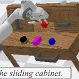

# VLAS: VLA Model With Speech Instructions

> 这是机器辅助生成的客观摘要笔记。教学版精读笔记由用户按节奏触发后单独成稿。

## 一句话讲什么（TL;DR）

让机器人**直接听人说话**就能干活，还能凭嗓音认出"是谁在说"，再去拿这个人的私人物品。

*所以这一节是想说：不是"先转文字再干活"，而是"耳朵直接通到大脑"。*

---

## 这是个什么场景

想象家里桌上摆了三只杯子：绿的、红的、白的。

- 爸爸说："帮我拿我的杯子。"
- 你妈也走进来说："帮我拿我的杯子。"
- 同样一句话，机器人到底要拿哪只？

光听**字面意思**是没法判断的——"我的"这两个字本身没有任何信息能指向某只具体的杯子。

但如果机器人能像你一样，**一听声音就知道"哦这是爸爸"**，再去翻档案"爸爸的杯子是绿的"，问题就解决了。

> **VLA（Vision-Language-Action，视觉-语言-动作模型）**：一种"看着画面 + 听着指令 + 直接输出机械臂动作"的一体化模型。可以想成一个会看监控、会听对讲、会动机械手的工人。

这篇论文叫 **VLAS**，多出来那个 **S** 就是 **Speech（语音）**——它要让机器人**直接吃原始的声波**，而不是先经过一个"速记员"把声音转成文字再读。

*所以这一节是想说：家庭机器人面对"一群人 + 私人物品"时，必须能听出"是谁"，光听"说什么"不够。*

---

## 之前的人怎么做的，为什么不够好

之前的机器人模型（VLA）只能"看图 + 读文字"。要支持语音，得在前面挂一个外挂程序把声音转成文字。

> **ASR（Automatic Speech Recognition，自动语音识别）**：把语音变成文字稿的程序，相当于会议速记员。

把 ASR 挂到 VLA 前面就成了"语音 → 文字 → 动作"两段流水线。这种做法有四个毛病：

- **传话游戏**：第一段听错一个字，后面整句话就跑偏了。比如你说"绿杯"，速记员写成"率杯"，机器人就懵了。
- **嗓音信息全丢了**：转成文字稿之后，"是爸爸说的还是妈妈说的"这条信息就永远抹掉了。语调、情绪、口音也一并消失。
- **变胖变慢**：原本一个模型，现在要两个串联，又费内存又慢。
- **无法处理"我的"这种话**：因为光看文字"拿我的杯子"，机器人没办法知道"我"是谁——文字根本没保存这个信息。

*所以这一节是想说：把语音先转文字这条路，从原理上就丢掉了"是谁在说"这条关键信息。*

---

## 这篇论文的新想法

**不要速记员**——让机器人**直接听原始声波**，再加一个"凭嗓音查档案"的小本本，就能知道"我的"指什么。

*所以这一节是想说：把"听声音"和"查个人档案"做成机器人的一部分，而不是外挂。*

---

## 它分几步做的（方法）

整个系统由四块拼起来。下面一节一节讲。

### 1. 站在前人肩膀上：用一个已经会"看图说话"的现成模型当底子

**类比**：你想让一个孩子"边看图边听话边干活"。如果他已经会"看图说话"了，你只要再教他"听话"和"干活"两件事，比从零教省力多了。

**它在干什么**：作者直接拿了一个开源的、**已经会看图回答问题**的现成模型当起点（叫 LLaVA），然后只在它身上加耳朵、加手。

> **LLM（Large Language Model，大语言模型）**：一个**会接话的大型程序**，给它前半句它能猜后半句。可以想成一个学了无数文章的高中文科生，给他写半句他能写下半句。
>
> **预训练 / 微调**：先在一大堆通用资料上学一遍叫"预训练"（像高中三年学语数外），再在某个具体任务上短期补课叫"微调"（像高考前突击专题）。

**为什么这样设计**：从零教一个程序"看图 + 说话"要烧上百万美元的电费。直接用别人训好的模型，省到几张专业显卡几天就能做完。

*所以这一节是想说：能用现成的就别重做，本论文不发明轮子，只新加耳朵和手。*

---

### 2. 把声音翻译成"大模型的语言"

**类比**：眼睛看到的画面、耳朵听到的声音、文字读到的句子，三种"母语"完全不一样。要让大模型同时处理它们，得先把三种东西都翻译成它能听懂的"普通话"。

**它在干什么**：

- 先把声波画成一张**频谱图**（像声音的 X 光片）。
  > **频谱图**：横轴是时间、纵轴是音的高低、颜色深浅代表强弱。和物理课画的"声音波形图"是亲戚。
- 把频谱图扔给一个开源的语音处理程序（叫 Whisper），它会输出一串数字向量，每个向量代表一小段声音的"含义"。
  > **向量**：高中学过——一串有方向有长度的数字。这里就是一长串数字，描述这段声音的特征。
  > **两个向量越像，它们的夹角越小**——这个直觉一会儿要用到。
- 这些向量一开始是 1500 个，太多了塞进大模型会很慢。论文用了一个简单办法：**每 5 个相邻向量合并成 1 个**，变成 300 个。
- 最后用一个**小翻译网络**（叫 MLP）把这 300 个声音向量翻译成大模型能直接读的"词向量"。
  > **MLP（多层感知机）**：一个由几层简单运算堆成的小程序，专门做"把一种数字格式变成另一种数字格式"的活。可以想成函数 y = f(x)，只是 x 和 y 都是一串数字。

**为什么这样设计**：

- 用现成的 Whisper：它已经在几十万小时的语音上学过了，省事。
- 把 1500 压成 300：少处理 5 倍的东西，速度直接快 5 倍。但太狠（比如压到 75 个）会把声音的意思也压没。论文实测 **5 倍是甜蜜点**。

*所以这一节是想说：声音被翻译成大模型能读的"词"，三种感官（图、声、字）从此能在同一张桌子上对话。*

---

### 3. 三阶段分步教：先听写，再答题，最后动手

**类比**：你要教一个孩子"听老师讲题然后操作实验仪器"。不能一上来就让他动仪器——先教他**听写**（光把听到的写下来），再教他**听老师口头出题然后答题**，最后教他**听话动手做实验**。每步都建立在前一步上。

**它在干什么**：把大目标"听话干活"拆成三段课。

- **第一阶段：听写**
  - 任务：给它一段语音，让它输出对应的文字。
  - 目的：让"声音的翻译网络"先和大模型对上暗号。
  - 这阶段只动那一个翻译小网络，**其他全部冻住**（不让动）。
  > **冻住**：训练时把某些部分锁死，不让它的内部数字被修改。可以想成考试前给笔记本上锁，不允许涂改。

- **第二阶段：答题**
  - 任务：给它一张图 + 一段问语音，让它说出答案。
  - 目的：把"听"和"看"打通，让它能听口头题答题。
  - 数据混合三种：图 + 文字问答、图 + 语音问答、纯听写。

- **第三阶段：动手**
  - 任务：给它两路相机画面 + 一段语音指令，让它输出**机械臂的动作**。
  - 训练时一半样本用语音、一半用文字，两种都不偏废。

> **Loss（损失，扣分）**：模型每次猜测后，把"猜的"和"正确答案"对比，差得多就扣分多，差得少就扣分少。整个学习过程就是想办法**让总扣分越来越小**。可以想成：模型在反复刷题，每错一道扣分，目标是把扣分降到最低。
>
> **梯度下降**：模型调整自己的方法。把"扣分"想成一座山的高度，梯度下降就是**蒙着眼睛下山**——每一步都摸出最陡的下坡方向，往下迈一小步，不停重复，最终到山谷底（扣分最少）。

**为什么这样设计**：直接跳到第三阶段会失败——因为机器人动作的训练数据相对少，不够把"听语音"这件大事从零学会。先用大量便宜的语音数据把"耳朵"练好，再用少量动作数据点拨"手"，是常见的省力办法。

*所以这一节是想说：能力不能跳着教，要先听写、再答题、最后动手，每阶段建立在上一阶段之上。*

---

### 4. 凭嗓音查档案：Voice RAG

**类比**：你进公司大门时，门禁先扫脸，扫到"这是李四"，然后从档案柜里抽出他的卡片"李四 → 工程部 → 喜欢绿杯"，把这张卡片塞进会议资料里。开会的时候你随手翻到这张卡片，就知道"李四的杯子是绿的"。

> **声纹**：每个人说话时声波的频率分布有自己的特点，独一无二，像声音版的指纹。
>
> **RAG（Retrieval-Augmented Generation，检索增强生成）**：回答前先去外部资料库查相关资料，再连着资料一起回答。可以想成**开卷考试**——遇到题先翻书，再答。

普通的 RAG 用**文字**当查询钥匙。VLAS 用**声纹**当钥匙——

**它在干什么**：

- 一段语音进来，先用一个现成的"声纹识别"程序提取声纹。
- 用声纹去一个小档案库查："这是李四，他的杯子是绿的，他爱把东西放抽屉。"
- 把查到的这段**文字背景**和原始语音、原始图像**一起**喂给大模型。
- 大模型综合这三路信息，输出动作。

**关键公式翻译成人话**：

最终送进大模型的输入 = [声音的翻译] **拼上** [声纹查到的档案文字的翻译] **拼上** [图像的翻译]

三段东西头尾相接，组成一长串"词"。

**为什么这样设计**：

- 用文字而不是数字向量当档案：文字方便人工编辑。新加一个用户时手写一行"王五：红杯，怕烫"就行。
- 用现成的声纹识别程序：这技术早就成熟，银行声纹支付都用了，没必要重做。
- **新用户来了不用重训模型**——只要档案库里加一行就行。

**它有多关键**：实验里关掉 RAG 这一块，准确率从 86% 直接掉到 16%。这说明 RAG 不是锦上添花，是这套系统的命根子。

*所以这一节是想说：声纹是钥匙，档案是开卷资料，"我的"问题靠这套机制解决。*

---

### 5. 让大模型把"动作"也当字写

**类比**：大模型本来只会写字。现在要让它"写动作"。办法是——把动作切成 256 格，每格借用大模型词表里**最冷门的一个字**当代号。模型一吐这个字，机器人就照那一格的动作执行。

**它在干什么**：

- 机器人每一步动作可以用 7 个数字描述：
  - 末端执行器（夹爪所在位置）的 x、y、z 三个坐标
  - 三个旋转角度（绕 x、y、z 轴各转多少度）
  - 夹爪开合（0=张开、1=闭合）
- 每个数字离散成 0–255 共 256 格。
- 大模型词表里有上万个字，挑出 256 个**几乎从不出现的冷门字**当动作代号。
- 模型一次吐 7 个这种字，机器人就照着做一步。

**多步预测的小技巧**：训练时把**连续 5 步**动作拼成一个标签（35 个字），让大模型一次预测 5 步动作，机器人连续执行。这让运行速度从每秒 1.17 步涨到每秒 2.5 步，还更稳——因为环境短期内变化不大，提前规划反而准。

*所以这一节是想说：动作被改装成"冷门字"，整个大模型不动，只是新增了一些动作题来教它。*

---

---

## 关键数字（What works）

下面 6 个数字是这篇论文最关键的证据。

### 数字 1：长任务得分 3.70 vs 3.13

- **设置**：把 5 个连续小任务串成长任务（满分 5 分），用 39 个**训练时没出现过的新嗓音**测试。
- **VLAS（直接听语音）= 3.70 分**
- **VLA + ASR 速记员 = 3.13 分**
- **生活语言**：每跑 5 个任务，VLAS 多完成 1.5 个左右子任务。家里串联做饭"切菜+下锅+装盘"时，VLAS 出错前能多干一截。

### 数字 2：3.74 vs 3.80（几乎打平）

- **设置**：同样的长任务，但**喂文字**指令（不走语音）。看加语音通道是否拖累原文字能力。
- **VLAS = 3.74 分；纯文字 VLA = 3.80 分**
- **生活语言**：差 0.06 分肉眼看不出来。**给机器人加耳朵没让它"嘴"变笨**——这点很关键，否则用户会觉得"还不如老的"。

### 数字 3：定制化任务 86.5% vs 19.2%

- **设置**：作者新建的"我的杯子"类任务，5 个子任务。
- **VLAS = 86.5%；纯文字 VLA = 19.2%（差不多就是 5 选 1 瞎猜）**
- **生活语言**：VLAS 是 4.5 倍。这种"我的""我喜欢的"指令，没声纹根本玩不了。

### 数字 4：去掉 RAG 直接崩盘

- **VLAS（带 RAG）= 86.5%**
- **VLAS−RAG（关掉档案）= 16.0%**（**比纯 VLA 还差！**）
- **生活语言**：模型在训练时已经习惯"声音 + 档案"配套出现，突然抽掉档案它就懵了。这反过来证明**档案查询深度融入了模型的思考**，不是可以随手拆掉的外挂。

### 数字 5：副业语音识别词错率 2.79%

- **设置**：在标准英文有声书数据集上测纯听写能力。
  > **词错率 WER**：每 100 个词错几个。越低越好。
- **VLAS = 2.79% vs 专业语音识别程序 Whisper = 2.7%**
- **生活语言**：差 0.09 个百分点（每 100 词多错 0.09 个），可视为打平。一个机器人模型，**附带把语音识别也做到了和专业产品一样的水平**。

### 数字 6：真人 vs 合成语音 86.5% → 78.6%

- **设置**：找 10 个真人录"和合成语音内容相同"的话，重测定制化任务。
- **生活语言**：掉了 7.9 个百分点。说明模型在合成语音上**略过拟合**（学得太死）。家里有口音重的爷爷、感冒的妈妈、哭闹的小孩，体验会比论文数字再低一档。

*所以这一节是想说：核心卖点（定制化）是 4 倍跨越，副作用（拖累原能力）几乎没有，但合成→真人有缺口，工程上还得补。*

---

## 你应该懂的几个新词

- **VLA（Vision-Language-Action，视觉-语言-动作模型）**：会看图、会听话、直接出动作的一体机器人模型。
- **VLAS**：本论文，VLA 多了一个 S（语音）。
- **ASR（Automatic Speech Recognition，自动语音识别）**：把语音转文字的程序，会议速记员。
- **声纹（Voiceprint）**：每个人说话的频谱有独特图案，像声音版指纹。
- **RAG（Retrieval-Augmented Generation，检索增强生成）**：回答前先翻资料库再答，相当于开卷考试。
- **LLM（Large Language Model，大语言模型）**：能接下半句的大型程序，相当于读过无数文章的高中文科生。
- **预训练 / 微调**：先广撒网学通识、再针对一个任务突击补课。
- **MLP**：一种简单结构的小程序，作用是"把一种数字格式翻译成另一种数字格式"。
- **频谱图（Spectrogram）**：声波画成的彩色图像，横轴时间、纵轴频率、颜色代表强弱。声音的 X 光片。
- **离散化**：把一个能取无限值的数字（比如 0.0~1.0 的任意小数）切成若干格，只能取 0/1/2/.../255 这种整数。像把考试成绩从分数变成 ABCD 四档。
- **行为克隆（Behavior Cloning）**：让模型抄录专家做过的动作，像学徒抄师傅每一步。
- **Loss（扣分）**：模型答错的总分。学习就是想办法把这个分降到最低。
- **梯度下降**：调参方法。蒙着眼下山，每步往最陡下坡方向迈一小步。

*所以这一节是想说：上面这十几个词在论文里反复出现，懂了它们就能读 80% 的内容。*

---

## 它有什么搞不定的

- **真人语音掉点**：训练用的是合成语音（一个程序读出来的），真人录音掉了 8 个百分点。家里有口音、感冒、小孩哭闹，性能会再降。
- **没记忆**：每一步动作都是孤立判断的。复杂多步任务里第二步开始时已经忘了第一步干了啥。论文承认这是它在长任务上输给另一篇带"记忆"的论文（RoboFlamingo）的原因。
- **新用户冷启动**：买回家第一天机器人不知道谁是谁。论文没说怎么建档案库——是让用户每个人录一段音 + 手填偏好吗？没交代。
- **只在仿真 + 单机械臂上验证**：真机演示只有 UR5 一种机械臂的成功案例，没给定量成功率。

*所以这一节是想说：方法很漂亮，但要真做产品还得补真人数据、加记忆模块、想清楚"新用户怎么入库"。*

---

## 它和别的几篇是什么关系

可以画一棵家谱：

- **OpenVLA / RT-2**：VLAS 的"父辈"。它们定义了"看图听文字出动作"这条路线。VLAS 在它们基础上把"听文字"扩成"听声音 + 听声纹"。
- **RoboFlamingo**：VLAS 的"同辈强者"。它在长任务上比 VLAS 强（4.09 vs 3.74），关键是它带"短期记忆"。作者明说"我们俩的优势可以叠加"。
- **MUTEX**：VLAS 的"前辈尝试者"。也支持多种输入（含语音），但用了较老的视觉模型，没充分发挥大模型能力。VLAS 算是用更强的底子把这条路重做了一遍。
- **PaLM-E / SayCan**：路线不同。它们是"大脑指挥固定的几只手"（高层规划 + 预设技能）；VLAS 是"一个人既思考又直接动手"（端到端动作生成）。

集合关系：所有"VLM 出动作"的论文 ⊃ "支持多模态指令"的子集 ⊃ "支持原生语音 + 声纹"的子集 = {VLAS}。

*所以这一节是想说：VLAS 是在 VLA 这条路上往"原生语音 + 个性化"方向走得最远的一篇。*

---

## 我建议这样读这篇

1. **先看摘要 + Figure 1**（10 分钟）。Figure 1 一图胜千言，直接看出 VLAS 比 VLA 强在哪。
2. **跳到 Figure 2 看整体架构**（5 分钟）。脑子里建一张图："声音→Whisper→翻译网络；图像→ViT→翻译网络；声纹→查档案→文字翻译；三路合一进 LLM 出动作。"**别着急看公式**。
3. **读方法节 Section 3.1**（30 分钟）。每个组件配着 Figure 2 看。这是核心。
4. **直接跳到 Table 2 看定制化任务**（15 分钟）。对比 VLAS、VLAS−RAG、VLA+RAG 三行——这是论文最想证明的卖点。
5. **如果关心部署**，看附录 B.5（10 分钟）。多步预测能跑到每秒 2.5 步。

跳过：详细的数据集生成流程（Section 3.2 后半）、附录 B.1 的失败案例分析。

*所以这一节是想说：5 步精读路线，2 小时之内能抓住论文核心。*

---

## 一些好奇心问答（FAQ）

**Q1：这模型有多大？**
A：约 70-80 亿参数。和当下主流的开源大模型同档（OpenVLA-7B、Vicuna-7B 都是这个量级）。

**Q2：训练数据从哪来？**
A：大部分是公开的——干净英文有声书（LibriSpeech）、图文问答（LLaVA）、机器人仿真（CALVIN）。论文自己造了两个：把图文问答用文字转语音程序读出来叫 SQA，把机器人指令也读出来叫 CSI。

**Q3：用了多少张专业显卡训练？**
A：8 张 A100（一种大约几万美元一张的专业显卡）。论文有意思的是第一阶段**单卡反而比多卡好**——多卡同步开销大于并行收益。

**Q4：我自己能跑吗？**
A：推理（让训好的模型干活）一张 40GB 的 A100 够。训练就别想了——估计要 50–80 卡天，相当于 8 卡跑 1 周。

**Q5：能换中文吗？**
A：原理上可以——Whisper 本来就支持中文。但 SQA 和 CSI 全是英文合成语音，**换中文要重做这两个数据集**。

**Q6：为什么不用更简单的"语音→文字→VLA"方案？**
A：因为转成文字之后，"是谁在说"这条信息**永远丢了**。论文整篇都在解决这个问题。如果你不需要"我的"这种指代，普通 VLA + ASR 也够用。

**Q7：声纹库怎么建？**
A：论文几乎没说。猜测是手动维护的简单字典：{声纹特征：背景文字字符串}。新用户来了得手动录入。这是论文公开的弱点。

**Q8：真机能跑多快？**
A：用多步预测的小技巧，每秒 2.5 个动作。家庭场景够用——人手日常操作也就每秒 1-3 个动作。

*所以这一节是想说：复现需要不小成本，但工程接口和瓶颈都很清楚。*

---

## 如果你想再深入

读懂 VLAS 之前，可以先读这几篇打底：

1. **LLaVA**（视觉-语言基座）：本论文的"父亲"。读完知道"看图说话"的模型是怎么搭起来的。
2. **Whisper**（语音识别）：本论文用的"耳朵"。在 68 万小时多语言语音上预训练。
3. **RT-2**（VLA 路线开山之作）：先读它再读 VLAS，能看出"加语音"是个增量改进。

读完 VLAS 想看续作 / 对照：

4. **OpenVLA**：开源 VLA 的标杆。VLAS 在论文里把它当主要对比对象之一。
5. **RoboFlamingo**：在长任务上击败 VLAS 的"同辈"。带短期记忆，作者说两条路线可以叠加。

*所以这一节是想说：先读 LLaVA + Whisper + RT-2 三篇打底，再读 VLAS 像看了三集前传后看正片，事半功倍。*
