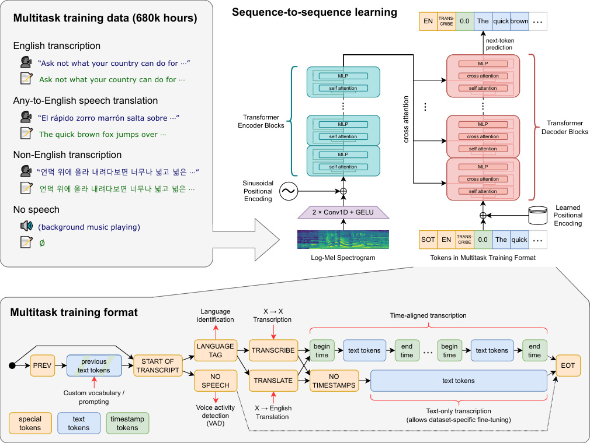
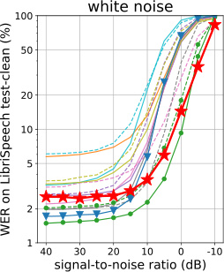

# Whisper: 用 68 万小时网页音频把语音识别一锅端

## 1. TL;DR

Whisper 用互联网上 68 万小时的弱标注（音频 + 自动/人工字幕）数据，喂进标准 Encoder-Decoder Transformer，训出一个多语种多任务语音模型。不微调直接用（zero-shot），在 12 个分布外数据集上平均 WER 比 Wav2Vec 2.0 降低 55.2%，接近人类水平。核心洞察：用"够大够杂的弱标注 + prompt-token 多任务接口"取代精标数据和工程流水线，就能换到开箱即用的鲁棒性。

*所以这一节是想说：Whisper 不是用更聪明的模型赢的，而是用"够大够杂的弱标注数据 + 多任务统一接口"换来了"开箱即用的鲁棒语音识别"。*

## 2. 场景

你打开微信给朋友发一段语音转文字。咖啡馆里背景音吵、你刚好讲了一半中文掺了句英文、朋友是带印度口音的 PM、录音断断续续 5 分钟——按下"转文字"按钮，结果出来一堆错字。这种翻车几乎每个用过语音转写的人都遇过。

为什么会这样？传统 ASR 系统像一个"只刷过有声书录音"的学霸。你拿 LibriSpeech（朗读有声书数据集）出题，他考超人分；你换一张脱口秀的卷子，他直接懵——论文反复说的"in-distribution 超人 vs out-of-distribution 凡人"悖论。

可是人不会这样。你从没听过湖南口音，第一次听也能猜个八九不离十，因为你这辈子接触过的"讲话样本"足够杂。Whisper 的判断很直白：机器想做到这种鲁棒性，不是要更巧的算法，而是让训练数据的分布逼近"互联网上一切人讲话"。

传统流水线像工厂五个工人各干各的：语音活动检测（VAD）判断哪段是说话、说话人分离（Speaker Diarization）标说话人、语音识别转文字、逆文本规范化（把 "twenty twenty three" 改成 "2023"）、加标点。每个组件单独训练维护，整套系统又复杂又脆。Whisper 想让一个 Transformer 一次把这五件事都吐出来。

论文里说的"鲁棒性"（robustness）专指分布外鲁棒性（OOD robustness），不是单纯抗噪——它包含跨数据集、跨任务、跨语种好几层。

*所以这一节是想说：现实场景里 ASR 真正的难点不是"听清楚干净录音"，而是"杂音/口音/长录音/各语言/多任务"这一堆 OOD 问题；Whisper 的目标就是开箱即用解决这些。*

## 3. 之前的人怎么做

论文把已有路线分成两派，并指出各自的瓶颈：

**第一派：自监督预训练（unsupervised pre-training）**

代表作 Wav2Vec 2.0（2020），Zhang et al. 2021 把数据规模拉到 100 万小时未标注音频。思路是让模型从原始音频里自己学语音表征（类似 BERT 的 masked modeling），然后再在小规模有标签数据上微调。优点是未标注数据极多；致命伤是只学了 encoder 没有 decoder——要做实际任务必须二次微调，微调过程依赖工程师调参且容易过拟合到特定数据集，鲁棒性反而下降。论文引用 Radford et al. 2021 的 CLIP 工作来佐证这一点：在 ImageNet 上微调 9.2% 提升，但其他 7 个数据集平均提升为零。

**第二派：多数据集监督训练**

代表作 SpeechStew（2021）合并 7 个高质量监督数据集 = 5140 小时。跨域监督有助鲁棒性，但人工标注的高质量数据就这么多，凑齐顶天 5000 小时。

**中间过渡：弱监督**

Chen et al. 2021 / Galvez et al. 2021 用自动化流水线把 ASR 数据搞到 1 万 / 3 万小时，但还是太小。

Whisper 的判断：自监督在 encoder 上花了太多力气，结果还是离"开箱即用"很远；要破局应该在弱监督上把数据规模再翻一个数量级，借鉴 CV 圈 ImageNet 到 JFT-3B 的迁移路径。

类比：自监督派像"自己关在图书馆刷题一万小时但没真做过卷子"；多数据集监督派像"刷遍市面上所有官方教辅但教辅只覆盖一小部分题型"；Whisper 的弱监督派像"上网看 68 万小时野路子讲解视频和字幕"——质量参差但接触面够广。

*所以这一节是想说：自监督学到了好特征但缺好 decoder，监督学习数据又不够；Whisper 选了第三条路——牺牲标注质量，把数据量推到 68 万小时。*

## 4. 新想法

Whisper 的三句话总结：

1. **数据：网页弱标注 -> 68 万小时 -> 多语种 + 多任务**。互联网上有海量"音频 + 自动字幕 / 人工字幕"配对，质量参差但量大。用一组启发式过滤把垃圾数据筛掉，剩下的不做任何文本规范化，让 seq2seq 模型自己学着输出"自然形态"的字幕。
2. **架构：标准 Encoder-Decoder Transformer，不动**。论文明确说"为了把功劳归到数据规模上，我们刻意用 off-the-shelf 架构"。
3. **接口：Prompt 化 token 序列指定任务**。Decoder 一开始预测一串"控制 token"——语种 / 任务（转录 or 翻译）/ 是否输出时间戳——后面才输出真正的文字。这等于把"任务定义"也变成了模型词表的一部分，一个模型变多个工具。

类比：之前的 ASR 系统像家里的厨房——切菜板、煤气灶、烤箱、微波炉各管一摊；Whisper 像把整个流程做成一台多功能料理机，你按"煮饭/煲汤/烤鸡"按钮（特殊 token）切换，原料（音频）从同一个口进。

*所以这一节是想说：Whisper 不发明新结构，而是把"数据规模 + 多任务统一接口"这两件事做到极致；架构本身只是一个尽量不出错的容器。*

## 5. 方法

<!-- paper-figures:begin -->



*上图说明：Figure 1：Whisper 多任务 seq2seq Transformer 与特殊 token 格式（论文原图）。*



*上图说明：Figure：训练数据规模与 WER 缩放规律（论文原图）。*
<!-- paper-figures:end -->

### 5.1 数据收集与清洗

像主厨进菜市场——先大筐扫货，再回厨房挑挑拣拣，最后开炉试做一道菜，吃出哪个摊主在卖坏菜，下次直接拉黑。

**来源**：互联网上的（音频, 字幕）配对，覆盖各种环境/录音设备/说话人/语言。最终数据集 68 万小时，其中 117k 小时多语种 ASR、125k 小时 X->英翻译、其余为英文 ASR。覆盖 96 个非英语种。

**数据组成细节**：

68 万小时并非均匀分布——英文 ASR 占绝大比重（约 438k 小时），这解释了英文性能为何最强。117k 小时多语种 ASR 分布在 96 个语种上，平均每语种约 1200 小时，但实际呈极端长尾分布：西班牙语/德语/法语各有数千小时，而小语种（如 Welsh、Maori）可能只有几十小时。125k 小时 X->英翻译来自"非英语音频 + 英文字幕"的配对，这种配对在 YouTube 上大量存在（非英文视频加英文字幕以获取更多观众）。

论文特别指出数据的"质量光谱"：从人工精标（如 YouTube 创作者自己打的字幕）到完全自动生成（YouTube 自动字幕功能），质量差异巨大。这种异质性实际上是特性而非缺陷——它迫使模型学会在噪声标签下提取不变的声学-文本映射关系，类似于 CLIP 从嘈杂的 alt-text 中学到视觉-语言对齐。

**过滤启发式（第一阶段：规则过滤）**：

- 排除机器生成的字幕（全大写/全小写、从不带逗号、没有标点等迹象）——避免模型学出"transcript-ese"。具体来说，如果一段字幕全部大写且无任何标点，几乎可以确认是旧版 YouTube 自动字幕系统的输出。这类数据学进去后模型会输出无标点全大写文本。
- 用 audio language detector（在 VoxLingua107 上微调的原型模型）检测音频语种，必须和文字语种匹配（CLD2 判断）；不匹配但文字是英文的，归到"X->英翻译"训练数据。这一步巧妙地把"语种不匹配"这个质量问题转化成了翻译训练数据——一石二鸟。
- 字幕级别 fuzzy 去重，防数据污染。这里用的是近似字符串匹配（Jaccard similarity 或 n-gram overlap），而非精确匹配，因为同一内容在不同来源可能有细微文本差异。
- 对评测数据集（如 TED-LIUM 3）做转录文本级去重，避免训练/测试数据泄漏。这是学术诚信的底线操作——如果不做，zero-shot 的含金量就没了。

**第二阶段：模型辅助清洗**：训练初版模型后，按数据源分组看错误率。错误率高的源人工抽查——发现大量"只转录了一半"或"对齐偏差"的脏数据以及规则过滤没抓住的机器字幕——整批剔除。

这个过程的工程细节值得展开：所谓"按数据源分组"是指按 domain/channel 级别聚合——比如某个 YouTube 频道的所有视频作为一组。如果模型在某频道上的 WER 显著偏高（比如高于全局中位数 2 倍以上），大概率是该频道的字幕质量差。人工只需抽查每组的几十条就能判断是否整批剔除。这种方法的效率极高：68 万小时数据可能来自数万个源，但错误率 top-100 的源可能贡献了 50% 以上的脏数据。剔除它们后重训模型，再迭代一轮，数据质量快速收敛。

**切片**：所有音频切成 30 秒片段，配对该时段对应的字幕。包括纯静音段（以子采样概率保留），用作 VAD 训练样本。

30 秒切片的工程考量：(1) 与模型输入窗口匹配，不需要变长处理；(2) 绝大多数字幕段落（一句话或几句话）落在 30 秒内；(3) 批处理效率高——固定长度输入不需要 padding / packing 策略。缺点是跨越 30 秒边界的长句会被截断——论文用时间戳对齐让截断发生在自然停顿处，但不可避免有少量训练样本是"断在半句话"的。

静音段子采样也有讲究：不保留静音段模型永远学不会输出 `<|nospeech|>`；全保留则静音段太多会稀释有效训练数据。论文没明说具体比例，但从推理时的表现推测保留率大约在 10-20%。

为什么"粗筛 + 训练后再细筛"的两阶段关键：规则过滤能拿掉约 80% 的垃圾，但"局部错位"或"漏转录"这剩下的 20% 规则识别不出。让模型先训一版、再看它在训练数据上哪些源错得多——错得多的源往往就是脏的——人工抽查只看 top-K 大源就能高效清洗。这是大模型时代的"数据质量飞轮"思想，LLaMA、Phi 后来都在用。

**数据量级对比**：LibriSpeech = 960 小时；SpeechStew = 5140 小时；Wav2Vec 2.0 预训练 = 100 万小时（但无标注）；Whisper = 68 万小时（带弱标注）。Whisper 相当于 SpeechStew 的 132 倍——这个量级差异是 zero-shot 鲁棒性的根本来源。

*所以这一节是想说：数据清洗不是一次过的静态流程，而是"规则筛 -> 初训模型 -> 用模型错误率定位脏源 -> 人工确认剔除"的迭代循环。数据的异质性（质量光谱）和规模（68 万小时）共同决定了模型的鲁棒性上限。*

### 5.2 输入特征

把声音变成"二维图"，模型才能像看图片一样看声音。

- 全部音频重采样到 16 kHz（人声核心信息在 8kHz 以下，16kHz 采样足够覆盖）
- 计算 80 通道 log-Mel 频谱图：25 毫秒窗口、10 毫秒步长。每秒 100 帧，30 秒 = 3000 帧。输入矩阵形状为 80 x 3000
- 全局归一化到 [-1, 1]，约零均值

"Mel 频谱"是把人耳对频率的非线性感知模拟出来的特征——低频区拉伸（人耳更敏感）、高频区压缩，再取对数压缩动态范围。相当于把声音翻译成模型能消化的"灰度照片"：横轴时间、纵轴梅尔频率、亮度代表能量。

为什么选 80 通道而不是 40 或 128？这是语音识别社区大量实验验证的甜蜜点——少了频率分辨率不够，多了计算量增加但收益饱和。Whisper V3 后来升到 128 通道，验证了"多一点确实有帮助"但幅度有限。

*所以这一节是想说：输入表示没有任何创新——标准 log-Mel 频谱图，论文刻意保持简单以把功劳归到数据规模。*

### 5.3 模型架构

像一对接力——前一棒（Encoder）听音频做笔记，后一棒（Decoder）拿着笔记一个字一个字往外吐。

Encoder 一次性把整段音频读完、压成一组"理解笔记"（hidden state）；Decoder 像 GPT 那样一个 token 一个 token 往外写字，写的时候随时通过 cross-attention 回头查笔记。

**Encoder 结构**：
- Stem：两层 1D 卷积（kernel=3，GELU 激活）。第二层 stride=2 把序列长度从 3000 减半到 1500，降低后续 Transformer 的计算量。具体计算：输入 80x3000 矩阵经第一层卷积（in_channels=80, out_channels=d_model, kernel=3, stride=1, padding=1）输出 d_model x 3000；经第二层卷积（in_channels=d_model, out_channels=d_model, kernel=3, stride=2, padding=1）输出 d_model x 1500。这比用线性投影更好，因为卷积天然捕获局部时频模式（类似声学 n-gram）。
- 加正弦位置编码（sinusoidal positional embedding）。选正弦而非学习式的原因：encoder 输入长度固定（1500），正弦编码无需额外参数且有外推理论优势。
- 之后是 N 个 Transformer block：pre-activation residual blocks（pre-LN，即 LayerNorm 在 self-attention/FFN 前面），最后一个 block 后接 final layer normalization。Pre-LN 相比 Post-LN 训练更稳定（梯度方差不会随层数增长而爆炸），这是 2020 年后大模型的标配选择。

**Encoder 自注意力的计算量分析**：序列长度 1500，attention 计算复杂度 O(n^2 * d) = O(1500^2 * d_model)。对 Large 模型（d_model=1280），单层 attention 约 1500^2 * 1280 * 3（QKV）≈ 8.6G FLOPs。32 层 encoder 总 attention FLOPs 约 276G。这是为什么 stride=2 不可省——如果保持 3000 长度，attention 成本直接翻 4 倍到 1.1T FLOPs。

**Decoder 结构**：
- 标准 Transformer decoder（masked self-attention + cross-attention + FFN）。每个 decoder block 有三个子层：(1) masked self-attention 只看已生成的 token；(2) cross-attention 的 K/V 来自 encoder 最终输出，Q 来自 decoder hidden state；(3) FFN 做非线性变换。
- 学习式位置编码（learned positional embedding），最大位置 = 448 token。448 的来源：30 秒音频最多说约 150 词英文（语速 5 词/秒），BPE 后约 200-300 token；加上 previous-text condition 和特殊 token，448 足够覆盖且有余量。
- 输入 token embedding 与输出 projection 层共享权重（tied weights）——减少参数量且稍微提高训练稳定性。具体来说，vocabulary size=51865 时，embedding 层本身就有 d_model * 51865 个参数（Large 模型约 66M），共享后省了一份。
- Cross-attention 中的 K/V 在整个解码过程中不变（因为 encoder 输出固定），可以计算一次后缓存——这是 encoder-decoder 相比 decoder-only 在推理时的效率优势。

**Encoder 和 Decoder 宽度与层数相同**（每档模型 encoder/decoder 各一半参数）。这意味着 Large 模型的 1550M 参数中，encoder 约 775M、decoder 约 775M。对比后来的 V3-turbo（encoder 保持 32 层、decoder 砍到 4 层）可以看到论文原始设计并非最优——encoder 承担了主要的声学理解任务，需要更多容量；decoder 的文本生成任务相对简单。

**Tokenizer**：GPT-2 的 byte-level BPE；多语种版在新数据上重训词表但保持词表大小不变。byte-level 意味着可以处理任意 Unicode 字符，不会有 OOV（out-of-vocabulary）问题。词表大小为 50257（GPT-2 base）+ 额外的特殊 token（语种、任务、时间戳等共 1608 个），总计 51865。byte-level BPE 对非空格分隔语言（中文、日文）不友好的原因：它在 byte 层面操作，一个汉字 UTF-8 编码为 3 字节，BPE 可能把常见汉字合并为一个 token，但罕见字需要 2-3 个 token 表示，效率低于专门的中文分词器。

**规模**：5 档模型：

| 模型 | 层数 | 宽度 | 注意力头 | 参数量 |
|------|------|------|----------|--------|
| Tiny | 4 | 384 | 6 | 39M |
| Base | 6 | 512 | 8 | 74M |
| Small | 12 | 768 | 12 | 244M |
| Medium | 24 | 1024 | 16 | 769M |
| Large | 32 | 1280 | 20 | 1550M |

每个注意力头的维度 = 宽度 / 头数。对 Large 模型：1280 / 20 = 64 维/头，这是 Transformer 论文（Vaswani 2017）的标准值。FFN 隐层维度通常为宽度的 4 倍（Large = 5120），每层 FFN 参数量 = 2 * d_model * 4 * d_model = 2 * 1280 * 5120 ≈ 13.1M。

为什么选 Encoder-Decoder 而不是 decoder-only（GPT 那种）？语音输入是定长固定特征（80x3000），用 encoder 压缩成 hidden state、再让 decoder 自回归出文字，这种结构自 1980 年代 seq2seq 就被研究透了。Encoder 能对整段音频做双向注意力（看到完整上下文），而 decoder-only 只能单向，对"听清楚发生了什么"这件事前者更自然。此外，encoder-decoder 在推理效率上有结构性优势：encoder forward 只需要跑一次，decoder 每步自回归时只需重跑 decoder 本身（配合 KV-cache），而 decoder-only 每步都要处理完整的音频 token 序列。

*所以这一节是想说：架构零创新——off-the-shelf Encoder-Decoder Transformer。论文明确说这是为了"把功劳归到数据和训练"，避免架构改进带来的干扰因素。但选择本身蕴含了工程智慧：stride=2 降序列长度、pre-LN 保稳定性、tied weights 省参数、encoder-decoder 省推理。*

### 5.4 多任务 Prompt 格式（核心设计）

像在自动售货机前先按按钮——"我要中文转录、要时间戳"，机器才知道吐什么。

Decoder 起手 token 序列（见 Figure 1）：

```
<|startoftranscript|> <|en|> <|transcribe|> <|notimestamps|> Hello world. <|endoftranscript|>
```

各 token 含义：

- `<|startoftranscript|>`：序列开始标志。这是 decoder 的 BOS（beginning of sequence），类似 GPT 的 `<|endoftext|>` 标记一段对话的开始。
- **语种 token**（99 种之一，如 `<|en|>` `<|zh|>`）：训练时由 VoxLingua107 模型提供的标签；推理时可强制指定或让模型自己预测。纯静音段输出 `<|nospeech|>`。99 个语种 token 占据词表 ID 50259-50357。训练时这些 token 相当于分类 label 被注入 decoder——模型必须先"猜对"语种才能正确续写后续内容，形成了一个隐式的课程学习（先做简单决策再做复杂生成）。
- **任务 token**：`<|transcribe|>`（转录，保持原语种）或 `<|translate|>`（翻译，永远翻成英文）。只有两个选择看似简陋，但足以覆盖论文定义的任务空间。这种"最小任务集"设计避免了多任务之间的干扰——如果加太多任务 token，小模型容易混淆。
- **时间戳控制**：`<|notimestamps|>` 表示不输出时间戳；省略则进入时间戳模式。时间戳模式和非时间戳模式实际上是两种不同的"输出格式"——模型需要学会根据这一个 token 的有无切换整个输出风格。
- **时间戳模式下**：文字 token 前后插入时间 token（量化到 20 毫秒精度，对应 Whisper 的原生时间分辨率 = hop_length/sample_rate = 160/16000 = 10ms，但论文量化到 20ms）。开始时间在文字前、结束时间在文字后。时间戳 token 共 1501 个（0.00 到 30.00 秒，步长 0.02 秒），占据词表 ID 50364-51864。这些 token 的 embedding 不是随机初始化的——论文暗示它们从正弦编码初始化以反映时间顺序。
- **Previous-text condition**：有概率（训练时约 50%）把前一段的字幕接到 decoder context 前面，让模型学会用长程文本上下文消歧（比如区分同音词"their/there/they're"或中文的"那里/哪里"）。50% 概率的设计意图是：让模型既能利用上文（有 condition 时），也能在没有上文时独立工作（无 condition 时）。如果 100% 给 condition，推理时第一段没有上文就不知所措；如果 0% 从不给，则丧失长程一致性。
- `<|endoftranscript|>`：序列结束。模型在生成完所有内容后输出这个 token，类似 EOS（end of sequence）。

**完整的 token 序列生命周期**（以时间戳模式的中文转录为例）：

```
[previous text tokens (masked)] <|startoftranscript|> <|zh|> <|transcribe|> <|0.00|> 今天天气很好 <|2.40|> <|2.40|> 我们去公园散步吧 <|5.60|> <|endoftranscript|>
```

注意：每个短语的结束时间戳 == 下一个短语的开始时间戳，形成无缝拼接。这种设计让长音频解码时能精确知道窗口应该滑到哪里。

**训练时 loss masking**：只在"当前段字幕 + 任务 token"上计算损失，previous-text condition 部分的 loss 被 mask 掉。这意味着模型只学"给定上文条件，预测当前内容"，不会把上文记忆当目标。从 loss 的角度看，模型的训练目标是 P(current_segment | audio, task_tokens, previous_text)，而非 P(previous_text + current_segment | audio, task_tokens)。这个微妙区别避免了模型把精力浪费在"背诵上文"上。

**翻译任务为什么只做 X->英？** 训练数据决定的——网络上"非英语音频配英文字幕"的数量远超其他语言对。这是数据分布决定模型能力的典型例子。据估计，X->英数据是英->X 数据的 10-100 倍，因为全球内容创作者普遍加英文字幕以扩大受众。

**语种检测的实现机制**：模型预测语种 token 时，实际上是在做一个 99 类分类——encoder 提供的 audio hidden state 经 cross-attention 传给 decoder，decoder 的第二个位置（紧接 `<|startoftranscript|>` 后）的 softmax 分布在 99 个语种 token 上产生概率。取 argmax 就是预测语种。这个副产品功能的准确率在 Fleurs 上约 80%（比专门的语种检测模型低 13.6%），但"免费"获得。

这种 prompt-token 设计的深远意义：

1. 训练时同一组参数学了所有任务（共享底层声学知识），不同任务间的梯度通过 shared encoder 实现知识迁移——翻译任务帮助 encoder 学到更好的语义表征，反哺转录任务
2. 推理时无需切模型，只改 prompt token 就行。延迟零成本——不需要加载不同权重。
3. 新任务只要扩词表就能加——比如将来要做说话人识别，加个 `<|identify_speaker|>` 就行（虽然当前没做）。这种可扩展性是 token 化接口的核心优势。
4. 这是 prompting 范式在多模态的早期典范，直接启发了 RT-2、OpenVLA 等 VLA 工作。区别在于 RT-2 把动作也 token 化（离散化关节角度），而 Whisper 把任务类型 token 化。
5. 它实现了"条件生成"的统一框架：模型的输出完全由 prompt token 条件决定，同一段音频在不同 prompt 下产生不同输出（中文字幕 vs 英文翻译 vs 带时间戳 vs 不带时间戳），这 4 种组合对应 2^2 = 4 种输出模式，全部由 2 个 binary token 控制。

*所以这一节是想说：整篇论文最值得抄的工程设计就是这个 token 格式——用 decoder 输入序列里的特殊 token 切换任务，一个模型 = 语种检测 + 转录 + 翻译 + 时间戳 + VAD。设计的精髓在于"最小 token 集控制最大任务空间"。*

### 5.5 训练细节

像新生开学发书——卷子又多又杂，老师不用"刻意压力测试"（dropout 之类的正则化），让学生自然刷过去就行。

- **优化器**：AdamW（Adam with decoupled weight decay）+ 梯度范数裁剪（gradient norm clipping）。AdamW 的 weight decay 系数论文未明说，但从"不用正则化"的表述推测可能设为 0 或极小值。梯度裁剪阈值通常在 1.0 左右，防止 FP16 训练中偶发梯度爆炸导致 loss spike。
- **学习率调度**：线性衰减到零，前 2048 步 warmup。这是最简单的调度策略——不用 cosine、不用 restart。2048 步 warmup 约占总训练的 0.2%，仅用于让 Adam 的二阶矩估计稳定下来。线性衰减意味着学习率从峰值到零匀速下降，最后几万步模型在极低学习率下做精细调整。
- **Batch size**：256 段（256 x 30s = 7680 秒/步 = 2.1 小时音频/步）。这是一个相对大的 batch——每步模型看 2.1 小时音频。大 batch 带来更稳定的梯度估计，减少训练噪声，但也意味着每步需要更多 GPU 显存。以 Large 模型为例，单段 30 秒的 encoder forward pass 约需 2GB 激活显存，256 段并行需要 512GB——远超单卡容量，必须用数据并行分布到多卡。
- **训练步数**：2^20 = 1,048,576 步 = 数据集过 2~3 遍（epoch 数极少）。计算验证：每步消耗 256 段 x 30 秒 = 7680 秒 = 2.13 小时；1M 步总消耗 = 2.13M 小时。数据集 68 万小时，所以 epoch 数 ≈ 2.13M / 680K ≈ 3.1 epoch。这个数字极低——GPT-3 只过 1 epoch，CLIP 约 32 epoch，Whisper 在两者之间偏低端。
- **精度**：FP16 + dynamic loss scaling。Dynamic loss scaling 的工作原理：初始 loss scale 设为很大的值（如 2^16），如果出现 inf/NaN 就减半，正常步数累积后翻倍。这让 FP16 训练既利用了低精度的速度优势，又不会因为 underflow 丢失小梯度。
- **显存优化**：activation checkpointing（用计算换显存）。不存储中间层激活，反向传播时重新计算。代价是约 33% 额外计算时间，但显存需求从 O(L) 降到 O(sqrt(L))。对 32 层 Large 模型，这意味着可以在更少的卡上训练。
- **正则化**：由于只过 2~3 epoch，不用 dropout / data augmentation / weight decay——靠数据多样性本身正则化。这是一个深刻的洞察：过拟合的本质是"模型把训练数据背下来"。如果每个样本只见 2~3 次，模型根本来不及记住单个样本——它只能提取共性特征。所以正则化是多余的。这和 LLM 训练（GPT-3 只过 1 epoch、没有 dropout）的逻辑完全一致。
- **V2 改进**：多训 2.5 倍 epoch（约 5~7 epoch），加回 SpecAugment（频谱随机遮挡）、Stochastic Depth（随机丢层）、BPE Dropout（随机改变分词方式）。因为 epoch 数上去了才需要正则化防过拟合——这是大数据时代"什么时候该加正则"的好教学样本。SpecAugment 具体操作：在 80x1500 的 mel 特征上随机遮挡 1-2 条频率带（每条宽 8-16 通道）和 1-2 条时间带（每条宽 20-40 帧）。这模拟了"某些频段信号缺失"的真实场景。Stochastic Depth 把每层的 residual connection 以概率 p 直接跳过该层（等效于随机减少网络深度），p 通常从浅层的 0 线性增到深层的 0.2。BPE Dropout 在分词阶段随机丢弃某些 merge 规则，让同一句话产生不同的 token 切分，迫使模型不依赖特定的子词边界。
- **Loss masking**：previous-text condition 部分不参与反向传播。技术实现上，就是把 loss tensor 中对应 previous-text 位置的 mask 设为 0。这确保梯度只从"当前段内容"流回网络参数。
- **后处理微调**：训完后在"不含说话人姓名注释"的子集上额外微调，专门擦掉"瞎猜说话人姓名"的失败模式（因为 30 秒音频上下文不足以推断说话人身份）。这相当于一次 targeted unlearning——让模型忘掉在训练中误学的"猜说话人"行为。具体做法可能是用干净子集（字幕中不含"Speaker 1:"这类前缀的数据）微调几千步，让 decoder 的条件分布偏离"输出说话人标签"。

**训练成本估算**（论文未明说）：batch 256、2^20 步、Large 1.55B 参数。粗略估计：每步 forward+backward 约 6 * 1.55B * 448（平均序列长度）≈ 4.2T FLOPs。1M 步总计约 4.2E18 FLOPs。A100 在 FP16 下理论峰值 312 TFLOPS，实际利用率约 40%，有效吞吐 125 TFLOPS。需要 4.2E18 / 125E12 = 3.36E7 GPU-秒 ≈ 9300 GPU-小时。考虑通信开销和实际效率，真实数字可能在 2-5 万 GPU-小时区间。对比：GPT-3 175B 约 350 万 GPU-小时。Whisper Large 虽然模型小很多，但序列长度长（音频 1500 帧 + 文字 448 token）且数据量巨大。Tiny/Base 在单台 8xA100 上几天就能微调。

**学习率峰值的选择逻辑**：论文没有明说具体数值，但根据 GPT-2/GPT-3 的惯例，1.55B 参数级别的模型通常用 2e-4 到 6e-4 之间的峰值学习率。过大会训不稳（loss spike），过小会收敛太慢浪费算力。

*所以这一节是想说：训练配方极简——大数据 + 少 epoch + 不正则化。只有 V2 因为 epoch 翻倍才把正则加回来。这种"数据多就不需要正则"的反常识是 scaling 时代的核心经验。训练成本相对 LLM 不算离谱，但仍需要大规模 GPU 集群。*

### 5.6 长音频解码（Buffered Transcription）

像看一本厚书——一次只看 30 秒一页，看完用上一页结尾接下一页开头，免得在某个词中间撕开。

模型只能吃 30 秒片段，但实际录音常是几小时。Whisper 的 buffered transcription 流程：

1. **转录第一段 30 秒**，模型预测时间戳。Encoder 处理整个 30 秒 mel 特征，decoder 自回归生成文字和时间戳 token。
2. **滑窗策略**：把窗口往后滑到最后一个时间戳处，避免在词中间切断。具体来说：如果模型输出了 `<|15.60|> some text <|18.20|>`，下一段音频从 18.20 秒处开始（而非机械地每 30 秒切一段）。这种"按内容边界滑窗"比固定步长滑窗精确得多，避免了把一个词的前半截音素留在上一段、后半截留在下一段的灾难。
3. **上下文传递**：上一段结尾的文本作为 previous-text condition 传给下一段 decoder。这确保了跨段连贯性——比如上一段最后说了"美团"，下一段开头如果有歧义音（如"外卖"vs"外面"），模型能利用上文语境做出正确判断。但这也引入了级联错误风险：如果上一段转写错了，错误会通过 condition 传播到下一段。
4. **温度调度（temperature fallback）**：默认 temperature=0（贪心解码，每步取 argmax）；如果生成文本 gzip 压缩率 > 2.4 或平均 log-probability < -1（说明在循环重复或困惑度过高），温度 +0.2 重试，直到 1.0。温度从 0 到 1.0 的变化效果：0 = 确定性输出（总是选概率最高的 token）；0.4 = 轻微随机性（打破 greedy 的局部最优陷阱）；0.8 = 较大随机性（更可能跳出循环模式）；1.0 = 完全按概率采样。整个 fallback 链最多重试 5 次（0, 0.2, 0.4, 0.6, 0.8, 1.0），每次重试需要重新跑一遍 decoder，最坏情况延迟翻 6 倍。
5. **5-beam beam search**：用 log probability 作为评分函数，进一步降低重复。Beam search 在每步保留 top-5 候选序列，最终选总 log prob 最高的。这比 greedy 多了"全局"视角，但计算量也是 5 倍。实际实现中 beam search 只在 temperature=0 时使用——温度 > 0 时用的是 nucleus sampling。
6. **静音检测**：`<|nospeech|>` 概率阈值 0.6 + 平均 logprob 阈值 -1 联合判断静音段。两个条件必须同时满足才判定为静音——单独的 nospeech 概率高可能只是模型不确定，加上 logprob 低（模型对所有文字输出都没信心）才能确认确实是静音。判定为静音后该段直接跳过，不输出任何文字，窗口直接前进 30 秒。
7. **初始时间戳约束**：第一个时间戳 token 被约束在 0.0~1.0 秒之间，避免模型跳过开头几个词。技术实现：在 decoder 的第一个时间戳位置，把所有 > 1.0 秒的时间戳 token 的 logit 设为负无穷（-inf），强制模型在前 1 秒内开始输出。这是因为滑窗后音频开头大概率紧跟着说话内容，跳过太多意味着出了错。

**完整的解码决策树**（伪代码逻辑）：

```
for each 30s segment:
    result = decode(audio, temperature=0, beam_size=5)
    if compression_ratio(result) > 2.4 or avg_logprob(result) < -1:
        for temp in [0.2, 0.4, 0.6, 0.8, 1.0]:
            result = decode(audio, temperature=temp)
            if compression_ratio(result) <= 2.4 and avg_logprob(result) >= -1:
                break
    if nospeech_prob > 0.6 and avg_logprob < -1:
        skip segment (silence)
    else:
        emit result
        slide window to last timestamp
```

**"压缩率检查"为什么有效**：人话一段文字 gzip 压缩比通常在 1.5~2.0——因为自然语言有丰富的词汇变化和信息量。如果模型陷入循环（反复输出 "thank you. thank you. thank you..."），重复内容压缩率飙升到 3 以上——因为 gzip 的 LZ77 算法会把重复模式压缩成极短的引用。这是一个朴素但极有效的工程兜底信号。它的优势在于：(1) 不需要定义"什么叫重复"；(2) 对任何形式的退化输出（字级重复、短语级重复、句级重复）都有效；(3) 计算几乎零成本（gzip 一段文字微秒级）。

**为什么 avg_logprob < -1 也是退化信号**：模型在正常输出时，每个 token 的 log probability 通常在 -0.3 到 -0.8 之间（对应概率 0.45~0.74，模型比较有信心）。如果平均 logprob 低于 -1（对应平均概率 < 0.37），说明模型在"猜"——它对自己的输出不确信。这通常发生在音频质量极差或音频内容不在训练分布内的情况。

Table 7 显示每加一个 heuristic 都能递增降低 WER（从 greedy 11.0% 降到最终组合约 10.0%），但不同数据集受益不均。温度调度对长播客类音频帮助最大（这类音频最容易触发循环），beam search 对短句音频帮助最大（短句的 greedy 偶尔选错一个词就是一个完整错误），VAD 对含大量静音的录音帮助最大（避免把静音段强行转写出乱七八糟的"幻觉"文字）。

*所以这一节是想说：长音频解码不是一个"自然就能工作"的事情——它需要滑窗 + 温度调度 + beam search + 压缩率检测 + VAD 阈值 + 时间戳约束这一整套 heuristic 兜底。每个 heuristic 都针对一种特定的失败模式设计，它们的组合构成了 Whisper 在生产环境中可靠运行的安全网。*

### 5.7 文本规范化器（Text Normalizer）

WER 基于字符串编辑距离，会过度惩罚"风格差异"。比如参考"$68 million"，模型输出"sixty-eight million dollars"，原始 WER 算 4 个错；但两者语义完全相同。

Whisper 配套开发了一个文本规范器（normalizer），通过迭代人工检查来识别常见的"无辜差异"模式，包括：缩写展开（you're vs you are）、数字/货币规范化（$68 million -> 68000000 dollars）、标点差异等。对多个数据集观察到 WER 降幅高达 50%。

论文承认这有过拟合到 Whisper 输出风格的风险。为验证，对比了独立开发的 FairSpeech normalizer：在大多数数据集上两者效果类似，只有 WSJ/CallHome/Switchboard 差异较大（因为这些数据集的参考转录有特殊格式）。

*所以这一节是想说：评估 zero-shot ASR 时，文本规范化是必须的——否则 WER 会因为格式差异虚高。但规范器本身也可能引入偏差，需要独立验证。*

## 6. 关键数字

| 数字 | 含义 | 来源 |
|------|------|------|
| **680,000 小时** | 训练数据总量；117k 多语种 ASR + 125k X->英翻译 + 余下英文 ASR | Sec 1 |
| **96 个非英语种** | 多语种覆盖（75 个有 ASR 训练数据） | Sec 1 |
| **30 秒** | 单次输入音频长度 | Sec 2.1 |
| **80 通道 / 25ms / 10ms** | log-Mel 频谱配置（通道 / 窗口 / 步长） | Sec 2.2 |
| **39M ~ 1550M** | 模型规模区间（Tiny ~ Large） | Table 1 |
| **2^20 步, batch 256** | 训练量 = 数据集 2~3 epoch | Sec 2.4 |
| **2.5% WER** | Whisper-Large 在 LibriSpeech test-clean（没什么可吹的） | Table 2 |
| **55.2% 平均相对 WER 下降** | 12 个 OOD 数据集 Whisper vs wav2vec 2.0 Large——核心卖点 | Table 2 |
| **29.1 BLEU** | X->英 CoVoST2 零样本 SOTA | Table 4 |
| **WER 每 16x 数据 ~= 减半** | 多语种 log-log 拟合斜率（Figure 3） | Sec 3.4 |
| **r^2 = 0.83** | 各语种数据量与 Fleurs WER 的对数-对数相关性（识别） | Figure 3 |
| **r^2 = 0.24** | 翻译任务上同一关系——比识别弱很多 | Figure 4 |
| **20 毫秒** | 时间戳 token 量化精度 | Sec 2.3 |
| **5 beam / temp 0->1.0** | 长音频解码的 beam search + 温度调度参数 | Sec 4.5 |
| **gzip 压缩比阈值 2.4** | 检测重复循环的工程信号 | Sec 4.5 |
| **13.6%** | Whisper 语种识别准确率低于 SOTA 的差距（Fleurs） | Table 5 |
| **WER ~= 人类** | Kincaid46 上 Whisper 与人类转录员差距 < 1.15% point | Sec 3.9 |

*所以这一节是想说：Whisper 跟 LibriSpeech SOTA 在干净数据上打平手，但在所有"不干净"的真实分布上是碾压性的——这个对比就是论文的核心证据。*

## 7. 实验结果说明了什么

**评估设置**：全部主结果都是 zero-shot——不用目标数据集的任何训练数据，直接在测试集上跑。这使得结果能反映真实的分布外泛化能力。

**评测数据集覆盖**：

- 英文 ASR：13 个数据集（LibriSpeech clean/other, Artie, Common Voice, Fleurs En, TED-LIUM, CHiME6, VoxPopuli En, CORAAL, AMI IHM/SDM1, Switchboard, CallHome, WSJ）
- 多语种 ASR：MLS（15 语种）、VoxPopuli、Fleurs（102 语种）
- 翻译：CoVoST2 X->En、Fleurs 改装版
- 语种识别：Fleurs
- 长音频：TED-LIUM3 全长、Meanwhile、Rev16、Kincaid46、Earnings-21/22、CORAAL
- 噪声鲁棒性：LibriSpeech + 白噪声/酒吧噪声（不同 SNR）

**关键实验结论**：

1. **OOD 鲁棒性（Table 2, Figure 2）**：Whisper Large V2 与 wav2vec 2.0 Large 在 LibriSpeech 上 WER 同为 2.7%，但 12 个 OOD 数据集平均 WER 从 29.3% 降到 12.8%（55.2% 相对下降）。这证明弱监督 + zero-shot 路线在鲁棒性上全面碾压自监督 + 微调路线。
2. **Scaling（Figure 8, Table 6）**：模型越大，多语种/翻译/语种识别持续提升；英文 ASR 因接近人类水平而饱和。数据越多也持续提升，但从 54k 到 680k 小时的边际收益递减。
3. **多任务迁移（Figure 9）**：小模型有负迁移（多任务比单任务差），大模型转为正迁移。这是 scaling 时代的典型"涌现"现象。
4. **噪声鲁棒性（Figure 5）**：低噪声下 Whisper 不如专门在 LibriSpeech 上训的模型，但 SNR < 10dB 时 Whisper 反超所有对手——因为训练数据里包含了足够多嘈杂录音。
5. **人类对比（Figure 7）**：Kincaid46 上 Whisper WER 与专业人类转录仅差约 1%。

*所以这一节是想说：实验设计的核心洞察是"用 in-distribution 匹配的模型做对照，看 OOD 上的差距"——这种 effective robustness 分析方法本身就值得学。*

## 8. 新词

- **WER（Word Error Rate, 词错率）**：(插入+替换+删除) / 参考词数。WER=10% 约每 10 词 1 错，能懂大意；WER=25% 阅读体验糟糕；WER=50% 基本没法用。Whisper 在英文大多测试集 < 10%，但 CHiME-6（嘈杂家庭录音）仍 25%。
- **Zero-shot transfer（零样本迁移）**：不在目标数据集训练集上微调，直接预训练权重跑测试集。Whisper 全部主结果都是 zero-shot。
- **Effective robustness（有效鲁棒性, Taori 2020）**：OOD 表现减去"基于 in-distribution 回归预测的预期表现"。看你在 OOD 上比同档次模型好多少，剥离"模型更强"的因素。Figure 2 可视化此概念。
- **Encoder-Decoder Transformer**：编码器双向看完整输入；解码器自回归生成 token，通过 cross-attention 查编码器输出。和 decoder-only (GPT) 不同，天然适合"输入输出不同模态"的任务。
- **BPE（Byte-Pair Encoding）**：子词分词算法。byte-level BPE 在字节层面操作，能处理任意 Unicode。
- **log-Mel 频谱**：声音的二维"图像"。横轴时间，纵轴 Mel 频率，每像素是该时刻该频段能量的对数。是 ASR 通用输入特征。
- **VAD（Voice Activity Detection）**：判断片段有无人说话。Whisper 通过 `<|nospeech|>` token 统一处理。
- **SpecAugment**：频谱图上随机遮挡时间和频率条带的数据增强方法。V2 引入。
- **BLEU**：机器翻译评估指标，看 n-gram 重叠率。越大越好。
- **Negative transfer（负迁移）**：多任务联合训练时任务间干扰，反而比单任务更差。Whisper 发现小模型有负迁移，模型够大后消失转为正迁移。
- **Inverse text normalization**：把口语形式（"twenty twenty three"）转回书面形式（"2023"）。传统 ASR 流水线需要单独模块做这件事；Whisper 让 seq2seq 直接输出自然形式，跳过这一步。
- **Previous-text conditioning**：把前一段转录结果接到当前段 decoder 输入前面，利用长程文本上下文消歧。类似 LLM 的"上下文窗口"概念。

*所以这一节是想说：除了 WER 和 zero-shot，最值得记的是 effective robustness——这是论文方法论上的关键指标，决定了它能比拼"鲁棒性"而非"绝对精度"。*

## 9. 搞不定的

论文 Section 5（Limitations）很坦诚，加上实验中暴露的问题：

1. **Decoding 不稳 / 幻觉**：长音频偶发循环重复或"幻听"——空音频段输出 "Thanks for watching!"（因为 YouTube 字幕里这种结尾太多）。靠温度调度 + beam search + gzip 检查兜底但本质是 seq2seq 常见病。后续社区做了大量"decoding 稳定性"工程改造（faster-whisper VAD 切片、whisperX 强制对齐）。

2. **小语种数据失衡 / 语种识别污染**：Welsh 上居然有 9000 小时翻译数据，调查后发现是语种识别系统误把英文音频判成 Welsh——这种数据噪声直接影响下游表现。语种识别整体低于专门模型 13.6 个百分点。

3. **说话人 diarization 不直接支持**：训练时刻意微调掉了"猜说话人姓名"行为（30 秒上下文猜不准）。要做说话人分离需额外模块（如 pyannote.audio）。

4. **超长音频依赖时间戳准确性**：30 秒滑窗依赖时间戳 token 切窗，时间戳错一个后面全错位。

5. **不能流式解码**：只能 offline 整段过。后续 streaming 改造是社区方向（whisper-streaming），但本质是"反复重跑短窗口 + 拼接"，不是真 streaming。

6. **训练数据 + 训练代码完全闭源**：只放了模型权重和推理代码。这是复现瓶颈。

7. **训练数据可能含版权内容**：68 万小时网页音频大概率含大量受版权保护的播客/视频字幕，OpenAI 没披露具体来源——法律争议风险。

8. **小模型多语种性能掉得快**：Tiny/Base 在多语种任务上崩得很厉害，部署小模型基本只能做英文。要多语种至少 Small 起步。

9. **VoxPopuli 上不如对手**：对手把 VoxPopuli 当无监督预训练数据用过且该数据集监督数据远多于 MLS——属于"评测设置不利"。

10. **中文表现低于预期**：Figure 3 显示 ZH 是 r^2=0.83 拟合线下的离群点。原因包括 byte-level BPE 对非空格语种不友好、中文训练数据可能比标称少。

11. **时间戳精度有限**：量化到 20ms 且基于 token 预测而非强制对齐——词级精度不够。需要 WhisperX 等后处理做 forced alignment。

*所以这一节是想说：Whisper 在"开箱可用"维度上很强，但 decoding 稳定性、流式、说话人分离、训练复现性这些工程坑都还在，社区生态围绕这些坑做了大量轮子。*

## 10. 与别篇关系

- **CLIP（Radford 2021, ICML）**：同一支 OpenAI 团队，思路高度相似——"网页弱标注数据 + 简单架构 + 大规模"换 zero-shot 能力。CLIP 是图文版，Whisper 是音文版。先读 CLIP 再读 Whisper 一通百通。
- **Wav2Vec 2.0（Baevski 2020, NeurIPS）**：introduction 里的主要对手。Table 2 直接对比。自监督 encoder vs 弱监督 encoder-decoder。
- **GPT-2 / GPT-3**：BPE tokenizer 和 prompt 化任务接口从 GPT 系来。"Decoder + 特殊 token 切任务"就是 prompt engineering 在语音的版本。
- **T5（Raffel 2020）**：多任务统一接口的祖师爷——"所有 NLP 任务翻译成 text-to-text"。Whisper 延伸到 audio-to-text。
- **RT-2 / OpenVLA**：Whisper 的"prompt token 切任务"思路被 VLA 工作借鉴——任务由 token 序列指定，模型由 Transformer 统一处理。如果在读 VLA 路线，Whisper 是一个很好的"多任务 prompt"小尺寸案例。
- **数据规模派（LLaMA, PaLM, Chinchilla）**：精神一致的"数据驱动"路线。Whisper 4.2 节讨论 dataset scaling 但没拟合 scaling law。
- **后续工作**：Whisper-V3/V3-turbo、Distil-Whisper、faster-whisper（CTranslate2）、whisperX（对齐+diarization）、Canary（Nvidia）、Seamless（Meta）、MMS（Meta 1100+语种）。

*所以这一节是想说：Whisper = CLIP 的语音版 + GPT 的多任务接口；确立了"弱监督多任务 audio foundation model"范式。*

## 11. 和本导读的关系

本篇属于 **Ch20（听觉智能）** 的核心论文。

Ch20 的叙事逻辑是：声音为机器人提供视觉和 RF 无法获取的信息（材质、状态变化、语音指令、方向距离），而 Whisper 解决的是其中"语音指令"这一环——让机器人能在嘈杂真实环境中准确理解人说了什么。

具体关联：

- Ch20.2-20.2.6 讲的"16kHz 采样 -> 80 通道 log-Mel 频谱图"就是 Whisper 的输入表示，那些参数选择（25ms 窗口、10ms 帧移、80 通道 Mel filterbank）在 Whisper 论文 Section 2.2 里直接使用
- Ch20.3 讲的"音频离散化"（SoundStream、EnCodec）是 Whisper 没走但平行的另一条路——把音频变成离散 token 再用 LLM 处理。Whisper 选了连续 mel 特征 + encoder 压缩这条路
- Ch20.5 的 AudioLM 是"反向"的——Whisper 是音->文，AudioLM 是文->音
- Ch12（VLA 模型）里"语言指令映射为动作"假设语音已经变成文字——Whisper 就是完成这一步的模块

Whisper 对 embodied AI 导读的核心启示：**Scaling weak supervision beats curated data for speech understanding.** 你不需要精心标注的小数据集，用互联网规模的弱标注 + 标准架构就能获得超强鲁棒性——这个结论对整个 foundation model 范式都成立。

*所以这一节是想说：在 embodied AI 技术栈中，Whisper 是"耳朵模块"——负责把嘈杂真实环境中的语音可靠地转成文字，喂给下游的 VLA / 规划器。它的成功验证了"弱监督 + 规模"路线在语音理解上的可行性。*

## 12. 思考题

<details>
<summary>Q1. 弱监督 vs 强监督（自监督）：为什么 Whisper 用"质量差但量大"的弱标注数据，反而比 Wav2Vec 2.0 用 100 万小时未标注数据 + 少量精标微调更鲁棒？</summary>

核心区别在于 decoder 的来源。Wav2Vec 2.0 的 encoder 确实从海量未标注音频中学到了优秀的声学表征，但它没有 decoder——要做实际任务必须在目标数据集上微调一个 decoder。微调过程会把 decoder 锁死到特定数据集的分布上（语速、口音、录音环境、标点风格），导致 OOD 时崩溃。

Whisper 的 decoder 是在 68 万小时多样化数据上联合训练的——它见过各种口音、噪声、语速、语种。虽然每条数据的标注可能不如人工精标准确，但 decoder 的"见识广度"远超任何微调得到的 decoder。这就好比：一个人读了 100 万页书但只做过一种卷子（Wav2Vec 微调后），vs 一个人做了 68 万种卷子虽然答案可能有少量错误（Whisper）——后者面对新卷子时更从容。

关键洞察：鲁棒性来自 decoder 训练分布的多样性，而非 encoder 特征的精度。
</details>

<details>
<summary>Q2. 多任务格式 token 的设计：如果去掉语种 token，让模型自己隐式判断语种，会发生什么？Whisper 为什么选择显式预测语种？</summary>

如果不显式预测语种 token，模型需要在内部隐式判断语种后才能决定输出什么字符集。这有几个问题：(1) 模型可能在中英混杂音频上犹豫不决，输出 token 反复在两种语言间切换；(2) 无法通过外部强制指定语种来纠正误判；(3) 丧失了"语种检测"这个免费的副产品功能。

显式预测语种 token 的好处：(1) 它作为一个 hard decision gate——模型被迫先做出语种判断再输出内容，避免了模糊状态；(2) 推理时可以强制注入语种 token 来覆盖模型的判断（当你确定音频语种时）；(3) 训练时语种标签来自外部语种检测器（VoxLingua107），为模型提供了额外的监督信号，等于多了一个辅助任务。

这种"先做分类再做生成"的 cascade 设计在多任务系统里很常见——它把一个高维决策分解成多个低维决策的序列，每步条件化前一步的结果。
</details>

<details>
<summary>Q3. Zero-shot 鲁棒性 vs 微调精度：为什么论文警告"草率微调 Whisper 反而可能损害 OOD 鲁棒性"？什么情况下应该微调？</summary>

微调本质上是让模型的参数分布从"广泛的互联网分布"收缩到"目标数据集分布"。如果目标数据集很小或分布很窄（如只有朗读体英语），微调后模型会"忘掉"训练期间学到的对其他分布的泛化能力——就像一个见多识广的翻译官被关在一个只说标准普通话的办公室里训练三个月后，可能反而听不懂方言了。

论文在 introduction 引用 Radford et al. 2021 的例子：ImageNet 微调提升了 9.2% 但其他 7 个数据集平均提升为零。这就是"微调 = 窄化"的直接证据。

什么情况应该微调：(1) 目标领域的词汇/术语在预训练数据中极少出现（如医学转录）；(2) 有足够大且足够多样的目标数据防止过拟合（如几千小时的电话录音）；(3) 不关心该领域之外的性能。实践中常见策略是 LoRA / adapter 微调（只动少量参数）来平衡专业化和泛化。
</details>

<details>
<summary>Q4. WER vs 人类表现：为什么论文说"在 LibriSpeech 上超人表现和在其他数据集上低于人类表现之间不矛盾"？</summary>

关键洞察是：当我们说"人类表现"和"机器表现"时，两者的训练条件完全不同。人类被测试时通常没有在目标数据集上"训练过"——你第一次听到一段测试音频就要转写。所以人类表现衡量的是 OOD 泛化能力。但机器通常先在目标数据集的训练集上训练过，然后在同分布的测试集上评测——衡量的是 in-distribution 泛化。

"超人"的 LibriSpeech 成绩并不意味着模型比人聪明——它意味着模型比人类更擅长"背这本教科书"。换一本书（换数据集），模型的优势消失甚至反转。

Whisper 的评估方式（zero-shot）和人类的测试条件更匹配——都是"第一次见到这个数据集就做题"。在这种公平比较下，Whisper 才真正接近人类水平。这说明衡量 ASR 系统的正确方式应该是 zero-shot OOD 评估，而非 in-distribution 评估。
</details>

<details>
<summary>Q5. 多语种能力与 scaling：Figure 3 显示"WER 每 16x 数据减半"的 log-log 关系。如果你要让一个低资源语种（如藏语，当前 50 小时训练数据）达到 WER=10% 的可用水平，需要多少数据？</summary>

假设当前 50 小时数据下藏语 WER 约 80%（根据 Figure 3 的趋势线估算低资源语种）。目标是 WER=10%。

WER 每 16x 数据减半，即 WER 正比于 data^(-0.5/log2(16)) = data^(-0.5/4) = data^(-0.125)。等等这不对——"减半"意味着 WER_new = WER_old / 2 当数据量增加 16 倍。用对数关系：log(WER) = -k * log(data) + c，其中每增加 log2(16)=4 个 log2 单位的数据，log(WER) 减少 log2(2)=1。斜率 k = 1/4 = 0.25。

从 WER=80% 到 WER=10%：需要 WER 减少 8 倍 = 2^3，对应数据增加 16^3 = 4096 倍。50 小时 x 4096 = ~200,000 小时。

这解释了为什么低资源语种如此难搞——即使有清晰的 scaling 关系，所需数据量也是天文数字。论文建议的改进路线是"targeted effort at increasing data for rarer languages"，但量级差距说明这不是简单的问题。

(注意：这个估算基于回归线的外推，实际可能因语种特性和跨语种迁移而不同。)
</details>

<details>
<summary>Q6. Transformer Encoder-Decoder 的设计选择：为什么 Whisper 的 Encoder 用正弦位置编码而 Decoder 用学习式位置编码？</summary>

Encoder 处理的是固定长度的音频特征序列（30 秒 = 1500 帧，经 stride=2 后），位置信息的语义是"时间上的绝对位置"——正弦编码天然编码了绝对位置且无需学习参数，对固定长度输入已经足够好。而且正弦编码有理论上的"外推"优势——如果将来想处理更长的音频，正弦编码不需要重训。

Decoder 处理的是变长 token 序列（不同长度的转录文本），且 token 之间的位置关系比纯时间更复杂——比如 previous-text condition + 任务 token + 时间戳 token + 实际文字混在一起，不同类型 token 的"位置语义"不同。学习式位置编码能让模型自己学会这种复杂的位置关系。代价是有最大序列长度限制（448 token），但对 30 秒音频的转录来说绰绰有余。

更深层的原因：这是沿用了 GPT-2 decoder 的设计惯例（learned positional embedding）。论文明确说用 off-the-shelf 架构，所以 encoder 用经典 Transformer 的正弦、decoder 用 GPT 的学习式，各取成熟方案。
</details>

<details>
<summary>Q7. 温度调度与 gzip 压缩率检查：为什么用 gzip 压缩率而不是直接看 token 重复率来检测循环？阈值 2.4 是怎么定的？</summary>

直接看 token 重复率有几个问题：(1) 需要定义"什么算重复"——连续重复？n-gram 重复？阈值是多少？(2) 有些合法文本确实有重复结构（如列表、歌词副歌）；(3) 实现上需要额外的计数逻辑。

gzip 压缩率是一个信息论上优雅的统一指标：它衡量的是文本的"信息熵密度"。正常人话有丰富的词汇变化，压缩后仍然较大（压缩比 1.5~2.0）。循环文本几乎没有新信息，gzip 能把它压得非常小（压缩比 > 3）。这个指标不需要手动定义"重复模式"，只需一个标量阈值就能覆盖各种退化情况（同词重复、短语重复、句子重复）。

阈值 2.4 大概率是通过在开发集上观察正常转录和退化转录的压缩比分布，选择一个能区分两者的分界点。论文没详细说明，但 2.4 略高于正常文本的上界（~2.0），留了安全余量。

这种"用压缩率作为异常检测信号"的思路在 LLM 时代也被广泛借鉴（如检测 AI 生成文本、检测 prompt injection）。
</details>

<details>
<summary>Q8. 如果你要在一个嵌入式设备（如机器人）上部署 Whisper，你会选哪个模型档位？需要做哪些工程改造？</summary>

选型：如果只做英文，Tiny（39M）或 Base（74M）在大多英文场景可用（WER < 10%）。如果要多语种，至少 Small（244M）起步。Medium（769M）是多语种的甜蜜点但对嵌入式偏大。

工程改造：

1. **量化**：INT8 或 INT4 量化减少显存和计算。faster-whisper（基于 CTranslate2）和 whisper.cpp（基于 GGML）已实现，Real-time factor < 1 在 CPU 上可达。
2. **VAD 前切**：不要把整段音频都喂给 Whisper——先用轻量 VAD（如 Silero VAD，几 MB）切出有声段，只对有声段跑 Whisper。大幅减少无效计算。
3. **Streaming 适配**：用滑窗 + 增量输出。每积累够一段有声音频就跑一次 Whisper，拼接结果。latency 约 1~3 秒。
4. **蒸馏**：Distil-Whisper 把 Large 蒸馏到 1/6 大小、6 倍速度，WER 只掉一点点。
5. **缓存优化**：encoder 输出在同一段音频内可缓存；KV-cache 复用。
6. **去掉不需要的任务**：如果只做转录不做翻译，可以在 fine-tune 时只保留相关能力。
</details>

## 13. FAQ

**Q1. Whisper 是 streaming 实时语音识别吗？**
不是。原版只能 offline 整段过 30 秒窗口。社区做了 streaming 改造（whisper-streaming 等），但本质是"反复重跑短窗口 + 拼接"，延迟约 1-3 秒，不是真 streaming 架构。

**Q2. 为什么训练时 dropout、weight decay 都没用？**
因为只过 2~3 个 epoch。数据多样性已经够防过拟合，反而加正则会拖慢收敛。V2 因为多训了 2.5 倍 epoch 才把 SpecAugment / Stochastic Depth 加回来。

**Q3. 为什么翻译只做 X->英？**
训练数据决定的——网络上"非英语音频配英文字幕"远多于其他配对。后续 Seamless（Meta）补了 X->Y。

**Q4. 为什么用 Encoder-Decoder 而不是 decoder-only？**
论文选择"成熟的 off-the-shelf 架构"。语音输入是定长特征（80x1500 经 stride 后），encoder 能双向看完整音频再压缩，比单向 decoder-only 更适合"先听完再说"的 ASR 场景。

**Q5. 30 秒为什么是这个数？**
工程取舍：太短上下文不够（消歧失败），太长 attention O(n^2) 爆炸。16kHz x 30s = 480k 采样点，经 stride 后 1500 帧，与 Transformer 序列长度匹配。

**Q6. 为什么 LibriSpeech 上 Whisper 不强？**
LibriSpeech 是有声书朗读，是 ASR 圈过拟合得最严重的一块。Whisper 没在上面微调，in-distribution 输给专家模型正常；换到任何稍微现实的录音上就赢了。

**Q7. 多任务真有正迁移吗？**
Section 4.3：模型小时有负迁移，模型够大后转为正迁移。这是 scaling 时代的典型"涌现"。

**Q8. 能在自己数据集上微调吗？**
能。HuggingFace transformers 直接支持。但小心：Whisper zero-shot 已很强，草率微调可能损害 OOD 鲁棒性。推荐 LoRA / adapter 做轻量适配。

**Q9. Whisper 对中文怎么样？**
Figure 3 显示 ZH 是离群点（worse than expected）。byte-level BPE 对中文不友好 + 中文训练数据可能比标称少。英文 >> 欧洲语 > 普通话 > 小众语种。社区有中文微调版（Belle-Whisper 等）。

**Q10. 模型为什么没继续推到 10B+？**
4.1 节显示英语 ASR 上 Large 已接近人类水平，继续放大边际收益很小。加上 OpenAI 重心转向 LLM，Whisper 走到 1.5B 就停了。V3/V3-turbo 主要是数据 + trick 升级。

## 14. 再深入

按推荐优先级：

1. **CLIP（Radford 2021, ICML）**：精神先祖，同团队同方法论。先读 CLIP 再读 Whisper 一通百通
2. **Wav2Vec 2.0（Baevski 2020, NeurIPS）**：主要对照对象，自监督路线代表
3. **GPT-2 论文 + WebText**：理解"网页弱监督预训练"范式的源头
4. **Scaling Laws（Kaplan 2020）+ Chinchilla（Hoffmann 2022）**：Whisper 4.2 节的 scaling 分析受这两篇启发
5. **Distil-Whisper（HuggingFace 2023）**：蒸馏到 1/6 大小、6 倍速度，工程必读
6. **WhisperX（Bain 2023）**：解决 diarization + 强制对齐，是工业落地常见装配
7. **Seamless（Meta 2023）**：多语种 X->Y 翻译，Whisper 之后的 audio foundation model
8. **OpenAI Whisper 仓库**（github.com/openai/whisper）：约 2k 行 Python，`transcribe.py` 里是长音频 heuristic 全集
9. **faster-whisper / whisper.cpp**：流行加速实现，看怎么把 1.5B 模型塞到笔记本/手机
10. **Conformer（Gulati 2020）**：Conv + Transformer 混合的 ASR 架构，用作对照
11. **Whisper-V3 / V3-turbo**：V3 升 128 通道 mel；V3-turbo 把 decoder 砍到 4 层快 8 倍——"不平衡 encoder/decoder"的好教科书
12. **MMS（Meta 2023）**：把多语种推到 1100+ 语种，用宗教文本朗读凑数据

## 15. 原文信息

```bibtex
@inproceedings{radford2023robust,
  title={Robust Speech Recognition via Large-Scale Weak Supervision},
  author={Radford, Alec and Kim, Jong Wook and Xu, Tao and Brockman, Greg and McLeavey, Christine and Sutskever, Ilya},
  booktitle={Proceedings of the 40th International Conference on Machine Learning (ICML)},
  year={2023}
}
```

- **机构**：OpenAI
- **代码**：https://github.com/openai/whisper
- **模型权重**：开源（Tiny ~ Large V3）
- **训练数据/代码**：闭源
- **核心贡献**：证明了弱监督数据 scaling 在语音识别上被严重低估；一个标准 Transformer 在 68 万小时网页数据上训出了接近人类水平的 zero-shot 多语种 ASR 系统

*所以这一节是想说：这是一篇"工程型"论文——不发明新算法，而是把"数据规模 + 多任务接口"做到极致，确立了 audio foundation model 的范式。*
