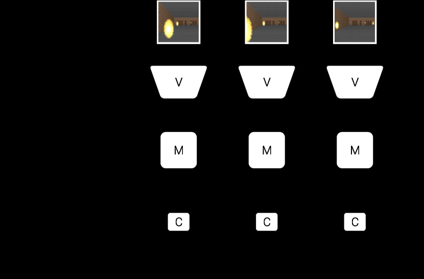
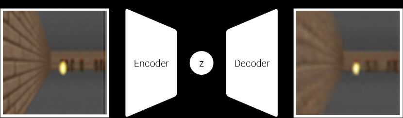
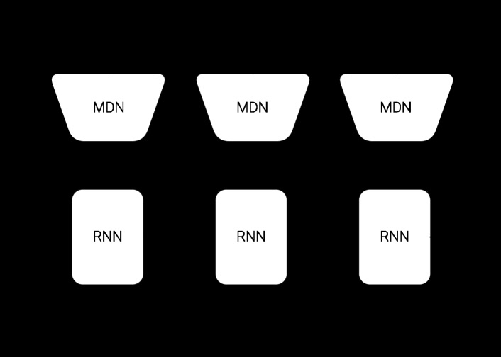

# World Models

> 这是一份给"完全没接触过 AI"的读者看的精读笔记。语言尽量像聊天，公式全部翻译成人话。

## 一句话讲什么（TL;DR）

让 AI 先在自己脑子里反复"做白日梦"练打游戏，练熟了再去真游戏里上场——居然真能赢。

*所以这一节是想说：这篇论文教 agent 先做梦、在梦里练，再回现实场上比赛。*

---

## 这是个什么场景

先想个跟你有关的画面：你在学打棒球（或羽毛球、乒乓球，都一样）。

> 投手扔出一个 100 mph 的快球，球离开手只飞 0.4 秒就到你眼前。
> 可你"眼睛看到 -> 大脑想 -> 手挥棒"这套流程要 0.2 秒。
> 那职业击球手是怎么打中的？他们脑子里早就装了一个**预测器**：
> "投手抬手的姿势 -> 这是外角下坠球 -> 球会到这里"——脑子先一步在"梦里"演过，肌肉只是把演练好的动作放出来。

人不是真的"看到再决定"，而是**脑子里随时在悄悄做白日梦预测下一秒**。这篇论文要给 AI agent 装的，就是这种"脑内白日梦机器"。

为什么需要这玩意？因为当时教 AI 玩游戏卡在两件烦事上（用的是强化学习——RL，reinforcement learning，让 agent 通过试错+奖励学怎么得高分）：

- **真游戏跑一局太贵**：每一帧都要 3D 引擎渲染、物理计算，像每练一次挥棒都得请人开一次球场。
- **大脑做大就乱**：把"看图的眼睛"和"做决策的脑子"塞进一个大网络一起训，没法搞清楚到底是哪一步动作立了功（这叫信用分配难题）。

作者的目标特别直接：**让 agent 大部分时间在"自己脑内的廉价梦境"里练，而不是去真游戏里耗；同时把"看 + 记忆"做得很大，把"做决策"做得超小**——这样既快又稳。

*所以这一节是想说：人靠脑内预测打棒球，作者想让 agent 也靠脑内梦境训练自己。*

---

## 之前的人怎么做的，为什么不够好

- **方案 A：传统 model-free RL（直接在真环境训）**
  类比：每打一局就要请人开一次球场。**租场费高**，而且玩家脑子（神经网络）只能用很小一个，因为大脑越大越难告诉它"刚才哪一步错了"。

- **方案 B：用确定性模型预测下一帧**
  类比：教练给你的"模拟训练机"只会按一种固定剧本走。但真实世界是有随机的——投手可能突然甩个变速。**确定性模型一被识破，agent 就开始钻 BUG**："我只要往左站着，模拟器永远不出球"。

- **方案 C：PILCO 用高斯过程学动力学**
  类比：用一种很数学的工具去拟合"输入->下一步"。**只在状态简单时管用**，输入是高维像素时算不动。

- **方案 D：把 VAE/自编码器和控制器一起端到端训**
  做法是先把图压成小向量，再训控制器。**没有"预测未来"的部分**，agent 只看当下一帧。

- **结论**：缺的是一个**会预测未来、还带点随机性**的脑内模拟器，并且这个模拟器要便宜到 agent 可以在里面反复训。

*所以这一节是想说：之前的人要么真环境硬训太贵，要么模拟器太死板会被钻空子，没人把"概率梦境"用起来。*

---

## 这篇论文的新想法

**把 agent 拆成"看 + 记忆 + 决策"三件套。让"看"和"记忆"先无监督学一个梦境模型，然后让小脑袋（决策）整个训练过程都在梦里跑——最后再把策略搬回真环境。**

听起来反直觉——你怎么能"在梦里"学会真本事？关键是这个梦不是定式的，而是带概率分布的随机梦境，一旦你想钻空子，梦的随机性会把你打回原形。

*所以这一节是想说：核心创新是用一个"概率梦境"代替真环境，让 agent 的整个 RL 训练都在自己的梦里完成。*

---

## 它分几步做的（方法）

<!-- paper-figures:begin -->



*上图说明：Figure 1（ar5iv 原图）（论文原图）。*



*上图说明：Figure 2（ar5iv 原图）（论文原图）。*



*上图说明：Figure 3（ar5iv 原图）（论文原图）。*
<!-- paper-figures:end -->

把 agent 想成一个开车的人：**V** 是眼睛（看清画面）、**M** 是大脑里的"老司机直觉"（记得路况、预感下一秒）、**C** 是手脚（拧方向盘踩油门）。前两个拼起来就是"世界模型"，第三个是真正做决策的小肌肉。论文最妙的设计：眼睛和直觉做得很大，手脚做得超小。

整个训练流程分为四大阶段：收集数据 -> 训练 V（压缩画面）-> 训练 M（预测未来）-> 训练 C（做决策）。前三步都不用任何奖励信号，只有最后一步才需要"分数"。

### 1. V 模块：用 VAE 把每帧图压成 32 个数字

**类比**

像你给朋友发语音描述一张照片：你不会一个像素一个像素念，而是说"赛道、左边一片绿草、远处左转弯"——抽出几十个关键维度就够。VAE 干的就是这事，把一张图压成 32 个数。

**它在干什么**

1. 输入 64x64 的彩色画面（比手机壁纸缩略图还小）。
2. 通过 4 层卷积网络压缩到一个 32 维向量（赛车任务）或 64 维（VizDoom 任务）。
3. 一个反向的解码器尝试根据这 32 个数把整张图还原回去。
4. 训练目标 = "原图和还原图差多少"（L2 重建损失） + "压缩出来的向量分布是否接近标准正态"（KL 散度损失）。

**等等，先慢一拍 —— VAE 到底是什么？**

> **VAE（Variational Autoencoder，变分自编码器）**：一种"把图压成向量、又能从向量解压回图"的网络。和普通自编码器的区别：它输出的不是一个固定向量，而是一个**概率分布**（一个均值 mu 加一个方差 sigma）。直觉是：相邻的两张图压出来的向量也会挨得近，所以向量空间是"平滑"的，不是离散坑坑洼洼的。

> **潜变量 z（latent vector）**：32 或 64 维的小向量，是一帧图的"压缩摘要"，可以理解成"这张图的指纹"。

> **KL 损失（KL loss）**：罚分项，逼 z 的分布不能乱跑、要贴近一个标准正态分布。这是让 VAE 的潜空间变"平滑"的关键约束。

**网络架构细节**

论文用的是 ConvVAE（卷积变分自编码器）。具体结构：

- 编码器：4 层卷积，每层 stride=2（每层把空间尺寸缩小一半），使用 ReLU 激活。从 64x64x3 逐步压缩到一个低维向量。
- 瓶颈层输出两组数：mu（均值向量，32 维）和 sigma（标准差向量，32 维）。实际的 z 通过"重参数化技巧"从 N(mu, sigma*I) 中采样得到。
- 解码器：4 层反卷积（转置卷积），把 32 维向量逐步"放大"回 64x64x3 的图像。最后一层不用 ReLU（因为输出要在 0-1 之间表示像素值）。

训练数据怎么来？让一个随机策略（乱按手柄）在真环境里跑 10000 局，把每一帧截图存下来。VAE 只需要这些截图，不需要知道"这些画面对应的奖励是多少"——纯无监督。

**为什么这步有用**

- 后面的"梦境"和"决策"都不再处理像素，只处理 32 维向量。**计算量降到原来的几百分之一**。
- 由于 KL 约束，z 空间分布平滑，未来的 M 模块就算预测略有偏差，落到附近的 z 也能解码成"还算合理"的画面，不会一下子坏掉。这是 VAE 比普通 Autoencoder 的关键优势——普通 Autoencoder 的潜空间是坑坑洼洼的，跑偏一点就解码出垃圾。
- V 是**纯无监督**学的——只用了 10000 段随机乱开的录像，没有任何奖励信号。便宜。
- 训练时间极短：单 GPU 不到 1 小时，只需跑 1 个 epoch。

**V 模块的数据流**

```
原始像素 (64x64x3)
    |
    v
[Conv stride=2] x 4 层
    |
    v
mu (32维), sigma (32维)
    |
    v  (重参数化采样)
z = mu + sigma * epsilon,  epsilon ~ N(0,I)
    |
    v
[Deconv stride=2] x 4 层
    |
    v
重建像素 (64x64x3)
```

*所以这一节是想说：先训一个会"压缩-解压"图像的网络当眼睛，把高维像素降成低维向量，所有后续计算都在这个低维空间跑。*

---

### 2. M 模块：用 MDN-RNN 学习"下一秒会发生什么"

**类比**

像天气预报员预报明天有没有雨。靠谱的预报员不会拍胸脯说"明天下午 3 点 17 分一定下雨"，而是说"60% 概率下午下小雨，30% 阴天，10% 突然出太阳"——给的是**一片概率云**。M 模块就是这种气象员，预报的不是"下一帧确定长这样"，而是"下一帧可能落在哪些位置，各占多大概率"。

**它在干什么**

1. 输入：当前帧的 z（来自 V）+ 当前动作 a + RNN 上一步的隐状态 h。
2. 输出：一组高斯分布的参数（5 个高斯混合而成）—— 描述"下一帧 z 的可能取值是哪些、各占多大概率"。
3. 训练时，给它海量的"动作 a + 当前 z"序列，让它预测真实的下一个 z。

**等等，先慢一拍 —— RNN 和 MDN 是什么？**

> **RNN（Recurrent Neural Network，循环神经网络）**：能记住"过去发生了什么"的网络。普通网络看一帧就忘，RNN 会保留一个隐藏状态 h，把过去的信息浓缩进去。这里用的是 LSTM，一种特别擅长长记忆的 RNN。

> **MDN（Mixture Density Network，混合密度网络）**：一种输出层，不输出单点，而是输出"几个高斯分布的混合"。每个高斯有自己的均值和方差，加权混合就是预测的概率云。

> **隐藏状态 h（hidden state）**：RNN 的"记忆笔记本"。它把过去看过的所有 z 和动作 a 都浓缩成一个固定长度的向量。

> **温度 tau（temperature）**：一个控制"采样有多冒险"的旋钮。tau 越高，从混合高斯里采样到的 z 越乱、世界越不可预测；tau -> 0 几乎只取均值，世界变得确定但呆板。

**架构细节与训练过程**

M 模块的完整学名是 MDN-RNN（混合密度网络 + 循环神经网络），灵感来自 Alex Graves 的手写生成工作和 SketchRNN。具体架构：

- 核心是一个 LSTM：赛车任务用 256 个隐藏单元，VizDoom 用 512 个隐藏单元。
- 输出层是 MDN：输出 5 个高斯分量的参数。对于每个高斯分量，需要输出 mu_i（均值向量，和 z 同维度）、sigma_i（标准差向量，和 z 同维度）、pi_i（混合权重，标量）。论文简化了一点：不建模各维度之间的相关性（对角协方差矩阵），减少参数量。
- VizDoom 任务额外预测一个 done 信号（agent 是否在下一帧死亡），用逻辑回归判断概率是否超过 50%。

训练过程：

- 用 V 把收集到的所有帧预处理为 z 序列（存储的是 mu 和 sigma，每次构建 batch 时重新采样 z，防止过拟合到特定采样值）。
- 训练目标：最大化真实 z_{t+1} 在 MDN 预测的混合高斯分布下的对数似然。换人话说就是让"预测的概率云"尽量覆盖到真实下一帧的位置。
- 训练 20 个 epoch，单 GPU 不到 1 小时。

**M 模块的数学表达**

```
输入:  (a_t, z_t, h_t)
       a_t = 当前动作
       z_t = 当前帧的潜变量
       h_t = LSTM上一步的隐状态

LSTM更新:
       h_{t+1} = LSTM(concat(a_t, z_t), h_t)

MDN输出:
       {pi_k, mu_k, sigma_k}_{k=1..5} = MDN_head(h_{t+1})
       
       P(z_{t+1}) = sum_{k=1}^{5} pi_k * N(z_{t+1} | mu_k, sigma_k^2 * I)

采样时:
       先按pi_k选一个高斯分量k*
       再从N(mu_{k*}, tau * sigma_{k*}^2 * I)采样 -> z_{t+1}
```

注意最后一行的 tau：采样时可以把 sigma 乘以温度系数 tau 来放大或缩小随机性。这个小旋钮是整篇论文最重要的工程发现之一。

**为什么用 5 个高斯而不是 1 个？**

单个高斯只能表示"一种可能性的模糊版"。但环境中有离散事件：比如怪物"放火球"和"不放火球"是两种完全不同的未来。5 个高斯分量可以分别对准这些不同模态——一个高斯对应"放了火球的未来"，另一个对应"没放的未来"，加权混合起来就是完整的概率预测。

**为什么这步有用**

- **能产生"梦境"**：把 M 串起来连续采样 z_1 -> z_2 -> z_3...... 再让 V 解码，就生成了一段虚构的视频。这个梦比真游戏便宜 100 倍。
- **概率而非确定**：因为输出是概率分布，agent 没办法找一个固定漏洞——每次梦境的细节都不一样，钻空子就被随机性打掉。
- **tau 旋钮的妙用**：训练时把 tau 调高（梦更乱），agent 就被迫学"鲁棒策略"；测试到真环境时反而像降难度。
- **隐状态 h 编码了"对未来的预感"**：h 不仅是过去的总结，更是对未来概率分布的浓缩表示。去掉 h 让 C 只看 z，赛车分数从 906 暴跌到 632——说明 h 里的"预感"对决策至关重要。

*所以这一节是想说：RNN 学的是"未来 z 的概率云"，概率性是防止 agent 钻 BUG 的核心设计；5 个高斯分量捕捉环境中的离散随机事件。*

---

### 3. C 模块：故意做小到只有几百个参数的"决策器"

**类比**

老司机开了 20 年车，"看路 + 经验"那部分（V+M）已经强得离谱，但他踩刹车那一脚根本不需要复杂思考——肌肉记忆里就一句"现在该多左 30 度、油门减半"。C 就是这只脚，故意做得简单到肌肉级，反而最稳。

**它在干什么**

最简朴的一行公式：

```
a_t = W_c * [z_t ; h_t] + b_c
```

人话翻译：**把"当前 z（看到了什么）"和"RNN 隐状态 h（记得发生过什么）"拼成一个向量，乘上一张数字表 W_c 加偏置，输出动作 a**。一行线性运算结束。

- 赛车任务：输入维度 = 32 (z) + 256 (h) = 288，输出 3 个动作 (方向盘、油门、刹车)。参数量 = 288 * 3 + 3 = **867 个参数**（V 是 430 万，M 是 42 万）。
- VizDoom：输入维度 = 64 (z) + 512 (h) + 512 (c，LSTM 的 cell 状态) = 1088，输出 1 个动作（左/停/右的连续值）。参数量 = **1088 个参数**。

动作输出经过 tanh 压到合理范围：方向盘 [-1, 1]，油门 [0, 1]，刹车 [0, 1]。VizDoom 把连续输出三等分映射为离散动作。

**关键术语解释**

> **线性控制器（linear controller）**：决策只通过一个矩阵乘法 + 加偏置完成，没有非线性、没有隐藏层。简单到能用进化算法直接搜参数。

> **CMA-ES（Covariance Matrix Adaptation Evolution Strategy，协方差矩阵自适应进化策略）**：一种"进化算法"。每次撒一群参数，评估每个的得分，把得分高的留下来"繁殖"出新一代，反复迭代。适合参数量在几千以内、奖励稀疏的情况。

> **信用分配问题（credit assignment problem）**：RL 的老大难——比赛结束你赢了，但具体是 1000 步里的哪一步立了功？很难分辨。模型越大越难分。

**CMA-ES 训练细节**

- 种群大小 64：每一代随机生成 64 组不同的 W_c 参数。
- 每组参数跑 16 次不同随机种子的 rollout，取平均累计奖励作为适应度。
- 每代保留得分高的个体，用协方差矩阵建模"好参数长什么样"，朝那个方向采样下一代。
- 赛车任务：训练约 1800 代后收敛。在 64 核机器上并行，每 25 代评估一次最优个体。
- 不需要梯度：进化算法只看最终累计分数，不需要损失函数可微。这是 C 可以做线性模型的前提——反正不需要反向传播。

**为什么这步有用**

- **小到能用进化算法**：C 只有几百到一千参数，CMA-ES 从最终累计得分里就能学出来，不需要可微分（不需要算梯度）。
- **复杂度都丢给了世界模型**：V+M 加起来上百万参数，可以放心用反向传播无监督训；C 只负责把已经学好的特征翻译成动作。
- **训练能爆量并行**：进化算法天生适合多机并行，每一代撒 64 个个体，每个跑 16 次 rollout——一台 64 核机器随便跑。
- **信用分配被极度简化**：只有 867 个参数时，"哪个参数立了功"的搜索空间极小。

*所以这一节是想说：让"看 + 记"无限大、"决策"无限小，巧妙绕开了 RL 的信用分配难题，用进化算法代替梯度下降。*

---

### 4. 在梦里训 -> 把策略搬回现实

**类比**

像围棋手晚上闭眼在脑子里复盘几百盘棋——根本不用找真对手，每一步都是自己脑里想出来的。等到第二天比赛，他直接把昨晚在脑里练熟的招式搬到棋盘上。这一节就是让 agent 学会这件事：先在梦里训，再原地搬到真游戏里上场。

**它在干什么**（以 VizDoom 任务为例）

1. 用随机策略在真 VizDoom 跑 10000 局，收集动作 + 帧。
2. 训 V 把每帧压成 z（64维）；训 M 学 P(z_{t+1}, done_{t+1} | a_t, z_t, h_t)，多预测一个"是否阵亡"。
3. **此时脱离真环境**：把 M 包装成一个伪 OpenAI Gym 环境——它的 step() 方法不调真游戏，而是从 MDN 采样下一帧 z 和"是否死"。
4. C 在这个伪环境里用 CMA-ES 训练。整个过程只在 64 维的 z 空间运转，**根本不渲染图像**，超快。
5. 训练好后，把 C 直接插回真 VizDoom，看分数。

**关键步骤的工程细节**

梦境环境的接口设计：

```python
class DreamEnv(gym.Env):
    def reset(self):
        # 从训练数据中随机取一个起始 z
        self.z = random_initial_z()
        self.h = rnn.initial_state()
        return concat(self.z, self.h)
    
    def step(self, action):
        # M 预测下一帧
        next_z_dist = rnn.forward(action, self.z, self.h)
        self.z = next_z_dist.sample(temperature=tau)
        self.h = rnn.get_hidden_state()
        # M 同时预测死亡概率
        done = (death_probability > 0.5)
        reward = 1.0  # 活着就+1（存活时间就是总奖励）
        return concat(self.z, self.h), reward, done
```

注意这个环境完全不渲染画面——agent 的"观测"就是 z 和 h 拼起来的向量。V 的解码器在整个训练过程中根本没被调用。这就是为什么梦里训练比真游戏快好几个数量级。

**温度 tau 的选择**

这是论文最重要的工程发现。tau 控制 M 采样时的随机性：

- tau = 0.1（几乎确定性）：梦境里怪物永远不放火球（模式坍塌），agent 学到的策略只是"站着不动"，回到真世界被秒杀。
- tau = 1.0（标准随机性）：梦境基本正常，但 agent 仍能找到一些"只存在于梦里的漏洞"。
- tau = 1.15（略高随机性）：梦境比现实更难，漏洞被随机性掩盖，agent 被迫学真本事。迁移回真世界后表现最好。
- tau = 1.30（很高随机性）：梦太乱了，agent 很难学到任何有用的东西，但学到的策略风险极低（方差小）。

**关键术语解释**

> **梦境 / 幻觉环境（hallucinated environment）**：M 模块自己生成的虚拟游戏。所有"画面"都是采样出来的 z，可以也可以不解码回像素——agent 只需要 z 就够。

> **done 信号**：游戏是否结束（agent 死亡）。M 不仅预测下一帧 z，还预测"下一步会不会死"，这样梦境才算一个完整 RL 环境。

> **sim2real 迁移（simulation to reality transfer）**：在仿真训好策略，搬到真世界。这里"仿真"是 agent 自己脑内的，比传统 sim2real 更激进。

> **对抗性策略（adversarial policy）**：agent 发现的"钻 M 模型漏洞"的策略。比如做某种动作组合让梦境里的怪物永远不放火球。这种策略在真环境完全无效。

**为什么这步有用**

- **VizDoom 实验里 agent 在梦里训完搬回真游戏，分数 1092 +/- 556**，远超解题门槛 750，也比直接在 OpenAI 排行榜上的最强 model-free 方法（820）高得多。
- 在梦里训便宜——不用渲染 3D 画面、不用跑游戏引擎物理，每秒能多跑几个数量级的 step。
- **这是历史上第一次有论文展示"完全脑内训练"的策略能迁移回真环境**。后来 Dreamer 系列就是这条路上的巨人。

*所以这一节是想说：把 M 包装成 Gym 环境，agent 整个 RL 训练流程在梦里完成，再原地搬回真世界；tau 是控制"梦的难度"的关键旋钮。*

---

### 5. 对抗利用与温度调节："钻空子"与"反钻空子"

**类比**

小时候玩游戏你发现了一个 BUG：站在某个角落敌人永远打不到你。你靠这个 BUG 通了关，但你没学到真本事——换个游戏立刻暴露。这一节讲的就是 agent 在梦里找到类似 BUG，以及作者怎么用温度 tau 来"封堵"这些 BUG。

**问题：为什么 agent 能钻世界模型的空子？**

两个原因：

1. M 只是一个近似模型，它训练数据有限，对某些罕见状态的预测不准。agent 可以主动把自己逼到这些"M 不熟悉的区域"，在那里获得虚假高分。
2. C 能直接访问 M 的隐状态 h——相当于给了玩家"读游戏内存"的能力。agent 可以学会直接操控 h 里的某些维度来影响 M 的输出。

**解决方案：MDN + 温度 tau**

- MDN 本身已经比确定性模型好——因为它输出的是概率分布而非单点预测，agent 的对抗策略在不同采样下表现不一致，稳定利用变难。
- 提高 tau 进一步放大随机性：漏洞在高 tau 下被随机噪声淹没，agent 必须找到"在各种随机场景下都管用"的策略——这些策略更可能在真世界也管用。
- 但 tau 不能无限高：太高时梦境完全混乱，agent 学不到任何规律。实验表明 tau=1.15 是最佳平衡点。

**更根本的解法（论文 Discussion 提到但未实现）**

作者指出，更通用的方法是 Schmidhuber "Learning to Think" 框架中的做法：让 C 学会判断 M 什么时候靠谱、什么时候不靠谱，选择性地忽略 M 的不可靠预测。但在这篇论文中，作者采用了更简单的 tau 调节方案。

*所以这一节是想说：梦境模型必然有漏洞，温度 tau 是目前最简单有效的"反钻空子"工具，本质是用更大的随机性逼出鲁棒策略。*

---

### 6. 迭代训练流程（论文第 5 节）

**类比**

第一天你随便逛了一条街，只看到了面包店和花店，于是你脑子里的"这条街的地图"只有这两家店。第二天你特意往巷子深处走，发现了隐藏的咖啡馆。你的地图更新了。第三天你带着更完整的地图去探索，又发现了二楼的书店......每次探索都让你的地图更准，更准的地图又引导你去发现新地方。

论文提出了这种迭代方案（虽然在简单任务上只用了一轮）：

```
1. 初始化 M 和 C
2. 在真环境用当前 C 跑 N 局，收集所有观测和动作
3. 用新数据重训 M（学 P(x_{t+1}, r_{t+1}, a_{t+1}, d_{t+1} | x_t, a_t, h_t)）
   同时在新 M 里训 C
4. 如果任务没完成，回到第 2 步
```

关键延伸思想：

- **好奇心驱动探索**：M 的损失函数反过来用——如果 M 预测不准（损失高），说明 agent 到了"未知区域"，给正奖励鼓励它去那里，这样收集到的数据能最大化地改善世界模型。
- **技能吸收**：一旦 C 学会了"走路"等低级技能，M 可以把这些技能"吸收"进自己的预测里，C 就可以释放容量去学更高级的规划技能。这是一种自然的课程学习。
- **与神经科学的联系**：海马体重放（hippocampal replay）——动物休息时大脑会重放最近的经验来巩固记忆，这和"在 M 中重复训练"有相似之处。

*所以这一节是想说：一轮"收数据 -> 训模型 -> 梦中训策略"只是最简单版本；理想的系统应该是迭代的、好奇心驱动的、能自动扩展世界模型覆盖范围的。*

---

### 方法总结：完整训练流水线

把上面六步串起来，整个系统的训练流程如下：

```
阶段 1: 数据收集
  - 随机策略在真环境跑 10000 局
  - 存储所有帧和动作

阶段 2: 训练 V（无监督，< 1小时）
  - ConvVAE: 64x64x3 -> z (32维/64维)
  - 损失 = L2重建 + KL散度
  - 把所有帧预处理为 z 序列

阶段 3: 训练 M（无监督，< 1小时）
  - MDN-RNN: (z_t, a_t, h_t) -> P(z_{t+1}) [+ P(done)]
  - LSTM 256/512 units + 5个高斯分量
  - 损失 = 负对数似然

阶段 4: 训练 C（在梦境中，约 1-2 天）
  - 把 M 包装成 Gym 环境（梦境）
  - 设置 tau = 1.15
  - CMA-ES 优化 867/1088 个线性参数
  - 适应度 = 梦境中的平均累计奖励

阶段 5: 部署
  - 把训好的 C 插入真环境
  - V 编码真实帧 -> z
  - M 更新隐状态 h
  - C 根据 [z, h] 输出动作
```

*所以这一节是想说：整个方法的精髓是"前三步无监督、最后一步廉价 RL"，总计算成本极低但效果突出。*

---

## 关键数字（What works）

数字本身不重要，重要的是它们告诉你哪些设计选择是关键。

| 指标 | 数值 | 对比基准 | 说明了什么 |
|------|------|----------|------------|
| CarRacing-v0 得分 | 906 +/- 21 | DQN 343, A3C 652, 前最强 838 | 首次"通关"此任务（要求>=900） |
| VizDoom 梦中训->真环境 | 1092 +/- 556 | 解题门槛 750, 排行榜最强 820 | 完全没真环境训过，直接 SOTA |
| 去掉 h 的消融 | 632 +/- 251 | 完整模型 906 | h 编码的"未来预感"是关键 |
| tau=1.15 vs tau=1.0 | 1092 vs 868 | tau=0.1 只有 193 | 略高温度逼出鲁棒策略 |
| C 参数量 | 867 | V: 434万, M: 42万 | 决策器小到能放 Excel |
| V+M 训练时间 | 各 < 1 小时 | 单 GPU | 消费级硬件可复现 |
| CMA-ES 收敛代数 | ~1800 代 | 64核并行约 1-2 天 | 比 deep RL 稳定得多 |
| 随机数据集规模 | 10000 局 | 随机策略收集 | 无需专家数据 |

| 温度 tau | 梦境得分 | 真环境得分 | 解读 |
|----------|----------|------------|------|
| 0.10 | 2086 +/- 140 | 193 +/- 58 | 梦太确定，学到幻觉策略 |
| 0.50 | 2060 +/- 277 | 196 +/- 50 | 同上，模式坍塌 |
| 1.00 | 1145 +/- 690 | 868 +/- 511 | 基本正常，但仍有漏洞 |
| 1.15 | 918 +/- 546 | 1092 +/- 556 | 最佳平衡点 |
| 1.30 | 732 +/- 269 | 753 +/- 139 | 更鲁棒但学得少 |

*所以这一节是想说：数据告诉我们，赢的关键不是模型大，是"概率梦境 + 高温随机性"这套配方；V+M 的无监督训练极其廉价，真正的创新在系统设计而非算力投入。*

---

## 实验结果说明了什么

从上面的数字里可以提炼出五条核心洞察：

**洞察 1：世界模型可以完全替代真环境进行策略训练。** VizDoom 实验最惊人的一点：agent 从未在真 VizDoom 中训练过哪怕一步，却在首次部署时就超越了所有在真环境中训练的方法。这证明了"在梦中学习"不是降级版 RL，而是一种可能优于直接 RL 的范式。

**洞察 2：隐状态 h 比当前观测 z 更重要。** 消融实验（去掉 h 后得分从 906 掉到 632）说明：对于需要预判的任务，"对未来的预期"比"当前看到了什么"更重要。人类击球手靠的也是预判而非反射。

**洞察 3：概率性是世界模型能用于训练的前提。** 确定性模型（tau=0.1）在梦里得分极高但真环境崩溃——说明确定性预测必然被利用。MDN 的概率输出 + tau 控制是让"梦里练的本事能搬到现实"的核心机制。

**洞察 4：最佳温度不是 1.0 而是偏高。** 这个发现非常反直觉——你会以为"最逼真的梦"最好，但实际上"比现实更难的梦"训出来的策略才最强。类比：在高海拔训练的运动员回到平地表现更好。

**洞察 5：极简控制器 + 大世界模型是一种有效的架构范式。** 867 个参数的线性模型打败了几百万参数的 deep RL 网络——不是因为线性更好，而是因为它站在 V+M 提供的优质特征上。这个"大感知 + 小决策"的设计哲学影响了后续所有世界模型工作。

*所以这一节是想说：五条洞察可以浓缩为一句——"好的世界模型 + 概率随机性 + 大感知小决策"是比"大脑端到端训"更好的 RL 方案。*

---

## 你应该懂的几个新词

> **世界模型（World Model）**：agent 脑子里学到的"环境会怎么动"的预测器。给定当前状态和动作，预测下一状态。

> **强化学习（Reinforcement Learning, RL）**：agent 通过和环境交互、收奖励/惩罚来学策略。和监督学习区别：没有标签，只有"做对/做错"的稀疏反馈。

> **VAE（Variational Autoencoder）**：把图压成低维向量、又能解压回图的生成网络。压出来的向量空间分布平滑。

> **MDN-RNN（Mixture Density Network + RNN）**：循环网络 + 混合高斯输出。学的是"下一步状态的概率分布"，而非确定值。

> **潜空间 / 潜变量（latent space / latent vector）**：高维输入被压缩到的低维空间。每张图、每个状态在那里都是一个点。

> **隐状态 h（hidden state）**：RNN 浓缩过去信息的向量。h 里其实编码了"对未来的预期"。

> **温度 tau（temperature）**：调节生成模型采样冒险程度的旋钮。高 = 多样性大，低 = 单一确定。

> **CMA-ES（进化策略）**：基于"撒一群参数->留高分->繁殖"的优化算法，不需要梯度。适合参数少、奖励稀疏的场景。

> **梦境 / 幻觉环境（dream / hallucinated environment）**：用 M 模块自己生成的虚拟环境，agent 在里面反复训练而不接触真实环境。

> **sim2real**：在仿真环境训好的策略搬到真实环境上还能用。本论文的"梦 -> 真"是其极端版本。

> **信用分配（credit assignment）**：奖励来自一长串动作的最后一步，到底是哪一步立了功？大模型很难分清，所以这篇把"决策器"做小。

> **catastrophic forgetting（灾难性遗忘）**：神经网络学新任务把旧任务忘光的毛病。论文 Discussion 里也提到 M 模型有这风险。

> **模式坍塌（mode collapse）**：MDN 在低温度时只激活一个高斯分量，忽略其他可能性。表现为环境变得完全确定、丧失随机性。

> **对角协方差（diagonal covariance）**：假设各维度之间不相关，只建模每个维度自己的方差。简化计算但丢失维度间的关联信息。

*所以这一节是想说：上面这些词以后看任何 RL / 世界模型论文都会反复出现，先把它们和生活类比挂钩。*

---

## 它有什么搞不定的

1. **VAE 不知道什么是"任务相关"**：VAE 是无监督训的，会认真还原 Doom 墙砖花纹，却没认真还原赛道路面（路面才是开车关键）。换新任务可能要重训。论文自己也承认：和奖励一起训可以让 VAE 聚焦任务相关区域，但代价是丧失通用性。

2. **梦境容量有限（LSTM 记忆瓶颈）**：LSTM 那 256-512 个隐藏单元装不下太复杂世界。游戏越复杂，梦越糊。论文承认未来要换更大模型（Transformer / 外置记忆）。实际上后续的 Dreamer 用 RSSM 部分解决了这个问题，但到 Minecraft 级别仍然捉襟见肘。

3. **梦容易被钻空子（模型利用问题）**：尽管用了概率 MDN 和 tau 调节，agent 偶尔还是会发现"在梦里这样动怪物就不放火球"——学到了梦里的 bug 而非真规律。tau 调高能缓解但不能根治。这是所有 model-based RL 的核心困境：模型越被利用越多，利用点越容易暴露。

4. **单步预测的误差累积**：M 每次只预测一步 z_{t+1}，但梦境需要连续预测几百步。每步的小误差会累积，导致长梦境和真实环境越来越偏。这就像你用天气预报接力：今天预报明天、明天的预报再预报后天——十天后的预报基本是随机的。

5. **不支持迭代改进的闭环（单轮数据收集）**：论文只用了随机策略的数据训世界模型。在更复杂任务中，随机策略探索不到关键区域，世界模型对那些区域一无所知。论文提出了迭代方案但没有实验验证。

6. **缺乏层次化规划**：V-M-C 是"一步一步走"的，没有"先想大策略再填细节"的层次结构。论文 Discussion 提到 Learning to Think 框架支持层次化，但本文没实现。

7. **只在低像素简单环境验证**：64x64 像素的赛车和 Doom 比起真实机器人视觉任务（1080p、复杂光照、不可控动态物体）差了好几个数量级。

*所以这一节是想说：世界模型既要够准（不然不能迁移），又要够乱（不然被钻空子）；容量、精度、利用三个矛盾至今仍是核心挑战。*

---

## 它和别的几篇是什么关系

- **直接续作：Dreamer V1 / V2 / V3**（同位置就有 [dreamer-v1.md](dreamer-v1.md) / [dreamer-v2.md](dreamer-v2.md)）。Hafner 等人把 World Models 思路升级——把 VAE+MDN-RNN 换成更结构化的 RSSM（同时维护确定性和随机性两条路径），并把 C 改成可微分的 actor-critic，用反向传播直接穿过梦境训策略（不再需要进化算法）。Dreamer V3 甚至在 Minecraft 中从像素学会挖钻石。可以理解成"World Models 的工业化升级版"。

- **方法学源头：Schmidhuber 1990s 系列**。论文反复引用 Schmidhuber "On Learning to Think"（2015）和 "Making the World Differentiable"（1990），本质是把那套"C-M 系统"用现代深度学习重新实现。Ha 的贡献是把 30 年前的理论变成了能跑、能复现、能理解的代码和交互式网页。

- **对照：Diffusion Policy / IBC（[diffusion-policy.md](diffusion-policy.md) / [ibc.md](ibc.md)）**。Diffusion Policy 在动作空间建概率分布；World Models 在状态空间建概率分布。两者都拥抱"概率胜于确定"的思想，但应用在不同维度。

- **对照：模仿学习路线（[gail.md](gail.md)）**。GAIL 不学世界模型，只学专家行为分布；World Models 不学专家，只学世界。两者代表 RL 学习的两条思路：学"别人怎么做" vs 学"世界怎么动"。

- **影响：具身 AI 全家**。后来的 PaLM-E、Cosmos-Policy、OpenVLA 都受"先学一个世界 / 表征模型，再训控制"这条路线影响。Cosmos 把"梦境"从游戏放大到工业仿真级。

- **对比：MuZero（2019）**。MuZero 也学世界模型，但不学解码回像素——它的世界模型只预测"价值"和"奖励"，是一种更隐式的路线。World Models 是显式的（可以解码出画面看），MuZero 是隐式的（只管有用信息）。

*所以这一节是想说：World Models 是 2010 年代后期"梦境 + 世界模型"的奠基论文，后续 Dreamer / MuZero / Cosmos 系列都是它的衍生品。*

---

## 和本导读的关系

在本导读（Embodied AI Roadmap）中，World Models 位于 [Ch15: 世界模型](../guide/ch15-world-models.md)，是该章节讲解的**第一个里程碑**，也是整个"世界模型"技术路线的概念祖先。

具体定位：

- **Ch14（模仿学习）** 讲的是"你做给机器人看"——数据来自人类示教。**Ch15（世界模型）** 讲的是"让机器人自己做梦"——数据来自自身探索。World Models 是从 Ch14 跨入 Ch15 的那篇桥梁论文。
- 本导读 Ch15 的演化主线：**Ha 2018 -> Dreamer 2020-2023 -> Genie 2024 -> Cosmos 2025**。每篇都是在 World Models 的骨架上扩展：更大的模型容量、更好的训练方式、更通用的环境覆盖。
- 理解 World Models 的 V-M-C 三件套结构，是读懂后续所有世界模型论文的前提。Dreamer 的 RSSM 就是 M 的升级版；Cosmos 的视频预训练就是 V 的放大版；各种 actor-critic 就是 C 的可微分升级版。

*所以这一节是想说：World Models 是 Ch15 的"第零篇"——它定义了问题、给出了最小可行解、指明了演化方向。后续所有里程碑都是在回答"Ha 2018 的方案哪里不够好、怎么做更好"。*

---

## 思考题

1. 如果把 V 模块换成一个普通 Autoencoder（不加 KL 损失），M 模块的梦境生成会出什么问题？

<details><summary>提示</summary>普通 Autoencoder 的潜空间不平滑——两个相邻的 z 解码出来的图可能完全不一样。想想 M 预测 z_{t+1} 时稍有误差，落到了一个"空洞区域"会怎样。</details>

2. 论文为什么不把 V、M、C 三个模块端到端一起训？这样做会有什么好处和坏处？

<details><summary>提示</summary>好处：V 可以学到"对决策有用的特征"而不是"对还原像素有用的特征"。坏处：C 太小（867参数）用进化算法训，根本没有梯度可以传回 V 和 M——整个链条不可微。想想 Dreamer 是怎么解决这个问题的。</details>

3. 假设你把 C 从线性模型换成一个 3 层 MLP（几万个参数），理论上决策能力更强，但实际效果可能变差。为什么？

<details><summary>提示</summary>CMA-ES 在几千参数时高效，但几万参数时搜索空间爆炸。而且更大的 C 更容易过拟合梦境中的 M 的漏洞——它有足够的容量去"记住"那些只在梦里管用的对抗策略。</details>

4. 为什么 tau=1.15 比 tau=1.0 在真环境表现更好，但 tau=1.30 反而不如 tau=1.15？

<details><summary>提示</summary>tau=1.15 刚好让梦境"比现实难一点"，淹没了 M 的大部分漏洞但保留了足够的结构让 agent 学到规律。tau=1.30 让梦变得太随机——就像一个"每隔 3 秒规则就随机变化"的游戏，根本没有可学的稳定模式。</details>

5. M 模块用 5 个高斯分量而不是 1 个。如果环境是完全确定性的（比如推箱子游戏，同样动作永远同样结果），用 5 个分量有什么优势和劣势？

<details><summary>提示</summary>优势：即使环境确定，5 个分量让 M 仍然输出概率分布，tau 调节仍然有效——agent 不容易过拟合。劣势：确定性环境用 5 个分量是过度参数化，训练可能浪费容量在"本不存在的模态"上。想想 Dreamer 后来怎么处理这个问题（用离散分类分布代替高斯混合）。</details>

6. 论文收集训练数据时用的是完全随机策略。如果环境有"锁"（比如必须先找到钥匙才能开门），随机策略永远收集不到"门打开后的世界"的数据。这对世界模型有什么影响？迭代训练怎么解决这个问题？

<details><summary>提示</summary>世界模型对"门后的世界"一无所知——梦境中那扇门后面会是纯噪声或胡乱生成的画面。迭代训练让 C 先学会"找钥匙开门"，然后收集门后的数据来更新 M。这就是为什么论文第 5 节提出好奇心驱动探索。</details>

7. 如果我们不用 CMA-ES，而是想用标准的策略梯度（如 PPO）来训 C，需要对系统做什么改动？这样做有什么得失？

<details><summary>提示</summary>PPO 需要梯度，所以 C 不能只是线性层——整个 M->C->奖励 这条链路需要可微分。你需要定义一个可微分的奖励函数，并且 M 的采样过程也需要重参数化技巧。好处是 C 可以做大；代价是实现复杂，且 C 更容易利用 M 的可微分路径来"攻击"M。Dreamer 正是这条路线。</details>

*所以这一节是想说：这些问题覆盖了 V-M-C 各自的设计权衡，以及整个系统从"玩具版"演进到"工业版"时必须面对的核心取舍。*

---

## 一些好奇心问答（FAQ）

**Q1：为什么不直接在真游戏里训？**

慢且贵。真 VizDoom 一秒只能跑几十帧，每帧要渲染 3D。M 模块的"梦境"只在 32/64 维向量空间运转，**一秒能跑上千 step**。再加上 CMA-ES 一代要评估 1000 多次 rollout，差距是几个数量级。

**Q2：为什么决策器 C 故意做这么小？**

CMA-ES（进化算法）只能搜几千以内的参数。把 C 做小，等于把"信用分配"问题缩到最小搜索空间——奖励一来，能马上分清是哪个参数立了功。复杂度全留给了 V+M（用反向传播无监督训，没有信用分配难题）。

**Q3：MDN-RNN 为什么必须输出概率而不是单点？**

如果是单点确定预测，agent 一定会找到"M 的 bug 区域"——某些状态下预测明显失真，agent 在那里能拿无限分但回真世界全错。概率分布 + 温度 tau 让这种 bug 区每次采样都不一样，agent 学到的策略被迫鲁棒。

**Q4：为什么 tau=1.15 比 tau=1.0 在真环境表现更好？**

直觉是"更乱的梦更接近真实"。tau=1.0 时梦境稍微平滑，agent 找到了一些"现实里不存在的便利"；tau=1.15 让那些便利消失，逼 agent 学硬本事。tau=0.1 又走另一极端——梦完全确定，怪物根本不放火球，agent 学到的是 fantasy。

**Q5：这模型能跑多大的环境？**

论文里只跑了 CarRacing 和 VizDoom 两个相对简单的游戏。LSTM 隐藏状态只有 256/512 维，装不下《我的世界》或《GTA》那种规模。后续 Dreamer V2/V3 用 RSSM 把容量做大，并加了类别分布，才能扩展到 Atari 全集和复杂控制任务。

**Q6：V、M、C 三块能一起端到端训吗？**

理论上可以（论文脚注说过），但作者发现分开训更稳。一起训会让 V 朝"对 C 有利但还原图变差"的方向跑偏。Dreamer 系列后来用 actor-critic + 可微梦境实现了端到端，但那是更后面的工程。

**Q7：CMA-ES 训完 C 要多久？**

赛车任务约 1800 代，每代 64 个个体 x 每个 16 次 rollout。一台 64 核机器并行跑大约 1-2 天。比纯 deep RL（如 A3C 跑同任务的天数）省时间，因为奖励稀疏时进化算法更稳。

**Q8：那这篇为什么算 founder 级？**

因为它第一次干净地把"无监督学世界模型 + 在梦里 RL + 迁移回现实"这个 pipeline 跑通，并且开源代码 + 写了交互式网页版（worldmodels.github.io）。后来 Dreamer、MuZero、Cosmos 等等都是在它的骨架上扩。

**Q9：论文里的"梦境"和 GAN 生成的假图有什么区别？**

GAN 生成的是独立的静态图片；梦境是一段有因果关系的序列——"你做了动作 A，所以下一帧变成了 B"。梦境有动力学（因果链），GAN 没有。这就是为什么 M 用 RNN 而不是 GAN。

**Q10：论文用了多少真环境交互数据？**

10000 局随机 rollout。以 VizDoom 每局最多 2100 步计算，最多约 2100 万步观测。但关键是这些数据只用来训 V 和 M（无监督），C 的训练完全在梦里——所以真正的 RL 样本效率是无限高（零真实 RL 交互）。

*所以这一节是想说：实操问题（多大、多久、为什么这么设计）作者基本都给了答案，门槛远比想象低。*

---

## 如果你想再深入

按"前传 -> 续作 -> 衍生方向"排序：

1. **前传：Schmidhuber "On Learning to Think" (2015)** — 本论文反复引用，给了 C-M 系统的元理论。读完会发现这篇 2018 论文是 1990 年代思想的现代实现。
2. **续作：Dreamer V1 (2020)** — 用 RSSM 取代 VAE+MDN-RNN，并把 C 改成 actor-critic，用反向传播直接穿过梦境训策略。本仓库里有 [dreamer-v1.md](dreamer-v1.md)。
3. **续作：Dreamer V2 (2021) / V3 (2023)** — 把分布换成类别离散，扩展到 Atari 全集。本仓库 [dreamer-v2.md](dreamer-v2.md)。
4. **衍生：MuZero (2019)** — 不学解码图像、只学"未来奖励 / 价值"的隐式世界模型。在围棋 / Atari 都达到 SOTA。
5. **衍生：Cosmos-Policy (2025)** — 把 World Models 思路放大到工业仿真级，物理保真度高得多，本仓库 [cosmos-policy.md](cosmos-policy.md)。
6. **交互式网页版：worldmodels.github.io** — 作者用 Distill 框架做的交互式论文，可以在浏览器里实时调 tau、看梦境变化。理解温度效应的最佳方式。

*所以这一节是想说：把 World Models + Dreamer V1 + Dreamer V2 这三篇连起来读，就能看到"在梦里学策略"这条路十年间的完整演化。*

---

## 原文信息

```bibtex
@inproceedings{ha2018world,
  title={World Models},
  author={Ha, David and Schmidhuber, J{\"u}rgen},
  booktitle={Advances in Neural Information Processing Systems (NeurIPS)},
  year={2018},
  note={Originally published as arXiv:1803.10122, March 2018}
}
```

- arXiv: https://arxiv.org/abs/1803.10122
- 交互式论文: https://worldmodels.github.io
- 代码: https://github.com/worldmodels/worldmodels.github.io (含 TensorFlow 实现)
- 发表会议: NeurIPS 2018
- 作者: David Ha (Google Brain), Juergen Schmidhuber (NNAISENSE / IDSIA)

*所以这一节是想说：这篇论文以极低的门槛（消费级 GPU、开源代码、交互式网页）成为了世界模型方向传播最广的入门论文。*
