## 3DShape2VecSet: A 3D Shape Representation for Neural Fields and Generative Diffusion Models

BIAO ZHANG, KAUST, Saudi Arabia
JIAPENG TANG, TU Munich, Germany
MATTHIAS NIESSNER, TU Munich, Germany
PETER WONKA, KAUST, Saudi Arabia

Fig. 1. **Left:** Shape autoencoding results (surface reconstruction from point clouds) **Right:** the various down-stream applications of **3DShape2VecSet** (from
top to down): (a) category-conditioned generation; (b) point clouds conditioned generation (shape completion from partial point clouds); (c) image conditioned
generation (shape reconstruction from single-view images); (d) text-conditioned generation.

We introduce 3DShape2VecSet, a novel shape representation for neural fields
designed for generative diffusion models. Our shape representation can encode 3D shapes given as surface models or point clouds, and represents them
as neural fields. The concept of neural fields has previously been combined
with a global latent vector, a regular grid of latent vectors, or an irregular grid
of latent vectors. Our new representation encodes neural fields on top of a set
of vectors. We draw from multiple concepts, such as the radial basis function
representation and the cross attention and self-attention function, to design
a learnable representation that is especially suitable for processing with
transformers. Our results show improved performance in 3D shape encoding and 3D shape generative modeling tasks. We demonstrate a wide variety
of generative applications: unconditioned generation, category-conditioned
generation, text-conditioned generation, point-cloud completion, and image[conditioned generation. Code: https://1zb.github.io/3DShape2VecSet/.](https://1zb.github.io/3DShape2VecSet/)

Additional Key Words and Phrases: 3D Shape Generation, 3D Shape Representation, Diffusion Models, Shape Reconstruction, Generative models

Authors’ addresses: Biao Zhang, KAUST, Saudi Arabia, biao.zhang@kaust.edu.sa; Jiapeng Tang, TU Munich, Germany, jiapeng.tang@tum.de; Matthias Nießner, TU Munich,
Germany, niessner@tum.de; Peter Wonka, KAUST, Saudi Arabia, peter.wonka@kaust.
edu.sa.

1 INTRODUCTION

The ability to generate realistic and diverse 3D content has many
potential applications, including computer graphics, gaming, and virtual reality. To this end, many generative models have been explored,
_e.g_ ., generative adversarial networks, variational autoencoders, normalizing flows, and autoregressive models. Recently, diffusion models have emerged as one of the most popular method with fantastic
results in the 2D image domain [Ho et al. 2020; Rombach et al. 2022]
and have shown their superiority over other generative methods. For
instance, it is possible to do unconditional generation [Karras et al.
2022; Rombach et al. 2022], text conditioned generation [Rombach
et al. 2022; Saharia et al. 2022], and generative image inpainting [Lugmayr et al. 2022]. However, the success in the 2D domain has not
yet been matched in the 3D domain.
In this work, we will study diffusion models for 3D shape generation. One major challenge in adapting 2D diffusion models to 3D is
the design of a suitable shape representation. The design of such a
shape representation is the major focus of our work, and we will
discuss several design choices that lead to the development of our
proposed representation.

Different from 2D images, there are several predominant ways
to represent 3D data, _e.g_ ., voxels, point clouds, meshes, and neural fields. In general, we believe that surface-based representations
are more suitable for downstream applications than point clouds.
Among the available choices, we choose to build on neural fields as
they have many advantages: they are continuous, represent complete surfaces and not only point samples, and they enable many
interesting combinations of traditional data structure design and
representation learning using neural networks.
Two major approaches for 2D diffusion models are to either use a
compressed latent space, _e.g_ ., latent diffusion [Rombach et al. 2022],
or to use a sequence of diffusion models of increasing resolution,
_e.g_ ., [Ramesh 2022; Saharia et al. 2022]. While both of these approaches seem viable in 3D, our initial experiments indicated that it
is much easier to work with a compressed latent space. We therefore
follow the latent diffusion approach.
A subsequent design choice for a latent diffusion approach is to decide between a learned representation or a manually designed representation. A manually designed representation such as wavelets [Hui
et al. 2022] is easier to design and more lightweight, but in many contexts learned representations have shown to outperform manually
designed ones. We therefore opt to explore learned representations.
This requires a two-stage training strategy. The first stage is an
autoencoder (variational autoencoder) to encode 3D shapes into a
latent space. The second stage is training a diffusion model in the
learned latent space.
In the case of training diffusion models for 3D neural fields, it
is even more necessary to generate in latent space. First, diffusion
models often work with data of fixed size ( _e.g_ ., images of a given
fixed resolution). Second, a neural field is a continuous real-valued
function that can be seen as an infinite-dimensional vector. For both
reasons, we decide to find a way to encode shapes into latent space
before all else (as well as a decoding method for reverting latents
back to shapes).
Finally, we have to design a suitable learned neural field representation that provides a good trade-off between compression
and reconstruction quality. Such a design typically requires three
components: a spatial data structure to store the latent information,
a spatial interpolation method, and a neural network architecture.
There are multiple options proposed in the literature shown in Fig. 2.
Early methods used a single global latent vector in combination
with an MLP network [Mescheder et al. 2019; Park et al. 2019]. This
concept is simple and fast but generally struggles to reconstruct
high-quality shapes. Better shape details can be achieved by using a
3D regular grid of latents [Peng et al. 2020] together with tri-linear
interpolation and an MLP. However, such a representation is too
large for generative models and it is only possible to use grids of
very low resolution ( _e.g_ ., 8×8×8). By introducing sparsity, _e.g_ ., [Yan
et al. 2022; Zhang et al. 2022], latents are arranged in an irregular
grid. The latent size is largely reduced, but there is still a lot of
room for improvement which we capitalize on in the design of
3DShape2VecSet.
The design of 3DShape2VecSet combines ideas from neural fields,
radial basis functions, and the network architecture of attention
layers. Similar to radial basis function representation for continuous
functions, we can also re-write existing methods in a similar form

(linear combination). Inspired by cross attention in the transformer
network [Vaswani et al. 2017], we derived the proposed latent representation which is a fixed-size set of latent vectors. There are
two main reasons that we believe contribute to the success of the
representations. First, the representation is well-suited for the use
with transformer-based networks. As transformer-based networks
tend to outperform current alternatives, we can better benefit from
this network architecture. Instead of only using MLPs to process
latent information, we use a linear layer and cross-attention. Second, the representation no longer uses explicitly designed positional
features, but only gives the network the option to encode positional
information in any form it considers suitable. This is in line with our
design principle of favoring learned representations over manually
designed ones. See Fig. 2 e) for the proposed latent representation.
Using our novel shape representation, we can train diffusion models in the learned 3D shape latent space. Our results demonstrate an
improved shape encoding quality and generation quality compared
to the current state of the art. While pioneering work in 3D shape
generation using diffusion models already showed unconditional
3D shape generation, we show multiple novel applications of 3D diffusion models: category-conditioned generation, text-conditioned
shape generation, shape reconstruction from single-view image, and
shape reconstruction from partial point clouds.

To sum up, our contributions are as follows:

(1) We propose a new representation for 3D shapes. Any shape
can be represented by a fixed-length array of latents and
processed with cross-attention and linear layers to yield a
neural field.
(2) We propose a new network architecture to process shapes
in the proposed representation, including a building block to
aggregate information from a large point cloud using crossattention.
(3) We improve the state of the art in 3D shape autoencoding to
yield a high fidelity reconstruction including local details.
(4) We propose a latent set diffusion framework that improves
the state of the art in 3D shape generation as measured by
FID, KID, FPD, and KPD.
(5) We show 3D shape diffusion for category-conditioned generation, text-conditioned generation, point-cloud completion,
and image-conditioned generation.

2 RELATED WORK

In this section, we briefly review the literature of 3D shape learning
with various data representations and 3D shape generative models.

2.1 3D Shape Representations

We mainly discuss the following representations for 3D shapes,
including voxels, point clouds, and neural fields.

_Voxels._ Voxel grids, extended from 2D pixel grids, simply represent a 3D shape as a discrete volumetric grid. Due to their regular
structure, early works take advantage of 3D transposed convolution
operators for shape prediction [Brock et al. 2016; Choy et al. 2016;
Dai et al. 2017; Girdhar et al. 2016; Wu et al. 2016, 2015]. A drawback of the voxels-based decoders is that the computational and
memory costs of neural networks cubicly increases with respect to

2

(a) RBF (b) Global Latent

(x _𝑖,_ f _𝑖_ )

(c) Latent Grid

f _𝑖_ x

(e) Latent Set (Ours)

(d) Irregular Latent Grid

Fig. 2. **Continuous function representations.** Scalars are represented with spheres while vectors are cubes. The arrows show how spatial interpolation is
computed. x _𝑖_ and x are the coordinates of an anchor and a querying point respectively. _𝜆𝑖_ is the SDF value of the anchor point x _𝑖_ in (a). f _𝑖_ is the associate
feature vector located in x _𝑖_ in (c)(d). The queried SDF/feature of x is based on the distance function _𝜙_ (x _,_ x _𝑖_ ) in (a)(c)(d), while our proposed latent set
representation (e) utilizes the similarity _𝜙_ (x _,_ f _𝑖_ ) between querying coordinate and anchored features via a cross attention mechanism.

Table 1. **Neural fields for 3D shapes.** We categorize methods according
to the position of the latents.

# Latents Latent Position Methods

Multiple Global Ours

the grid resolution. Thus, most voxel-based methods are limited to
low-resolution. Octree-based decoders [Häne et al. 2017; Meagher
1980; Riegler et al. 2017b,a; Tatarchenko et al. 2017; Wang et al.
2017, 2018] and sparse hash-based decoders [Dai et al. 2020] take
3D space sparsity into account, alleviating the efficiency issues and
supporting high-resolution outputs.

_Point Clouds._ Early works on neural-network-based point cloud
processing include PointNet [Qi et al. 2017a,b] and DGCNN [Wang
et al. 2019]. These works are built upon per-point fully connected
layers. More recently, transformers [Vaswani et al. 2017] were proposed for point cloud processing, _e.g_ ., [Guo et al. 2021; Zhang et al.
2022; Zhao et al. 2021]. These works are inspired by Vision Transformers (ViT) [Dosovitskiy et al. 2021] in the image domain. Points
are firstly grouped into patches to form tokens and then fed into
a transformer with self-attention. In this work, we also introduce
a network for processing point clouds. Improving upon previous
works, we compress a given point cloud to a small representation
that is more suitable for generative modeling.

_Neural Fields._ A recent trend is to use neural fields as a 3d data
representation. The key building block is a neural network which
accepts a 3D coordinate as input, and outputs a scalar [Chen and

Table 2. **Generative models for 3d shapes.**

Generative 3D

Models Representation

3D-GAN [Wu et al. 2016] GAN Voxels
l-GAN [Achlioptas et al. 2018] GAN _[★]_ Point Clouds
IM-GAN [Chen and Zhang 2019] GAN _[★]_ Fields

PointFlow [Yang et al. 2019] NF Point Clouds

GenVoxelNet [Xie et al. 2020] EBM Voxels

PointGrow [Sun et al. 2020] AR Point Clouds

PolyGen [Nash et al. 2020] AR Meshes

GenPointNet [Xie et al. 2021] EBM Point Clouds
3DShapeGen [Ibing et al. 2021] GAN _[★]_ Fields

DPM [Luo and Hu 2021] DM Point Clouds

PVD [Zhou et al. 2021] DM Point Clouds
AutoSDF[Mittal et al. 2022] AR _[★]_ Voxels
CanMap [Cheng et al. 2022] AR _[★]_ Point Clouds
ShapeFormer[Yan et al. 2022] AR _[★]_ Fields
3DILG [Zhang et al. 2022] AR _[★]_ Fields
LION [Zeng et al. 2022] DM _[★]_ Point Clouds

SDF-StyleGAN [Zheng et al. 2022] GAN Fields

TriplaneDiffusion [Shue et al. 2022] [⋄] DM _[★]_ Fields

Ours DM _[★]_ Fields

_★_ Generative models in latent space.
⋄ Works in submission.

Zhang 2019; Mescheder et al. 2019; Michalkiewicz et al. 2019; Park
et al. 2019] or a vector [Chan et al. 2022; Mildenhall et al. 2020]. A
3D object is then implicitly defined by this neural network. Neural
fields have gained lots of popularity as they can generate objects
with arbitrary topologies and infinite resolution. The methods are
also called _neural implicit representations_ or _coordinate-based_ networks. For neural fields for 3d shape modeling, we can categorize
methods into global methods and local methods. 1) The global methods encode a shape with a single global latent vector [Mescheder
et al. 2019; Park et al. 2019]. Usually the capacity of these kind of

3

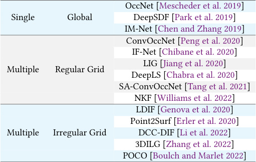
methods is limited and they are unable to encode shape details. 2)
The local methods use localized latent vectors which are defined for
3D positions defined on either a regular [Chibane et al. 2020; Jiang
et al. 2020; Peng et al. 2020; Tang et al. 2021] or irregular grid [Boulch
and Marlet 2022; Genova et al. 2020; Li et al. 2022; Zhang et al. 2022].
In contrast, we propose a latent representation where latent vectors
do not have associated 3D positions. Instead, we learn to represent
a shape as a list of latent vectors. See Tab. 1.

2.2 Generative models.

We have seen great success in different 2D image generative models in the past decade. Popular deep generative methods include
generative adversarial networks (GANs) [Goodfellow et al. 2014],
variational autoencoers (VAEs) [Kingma and Welling 2014], normalizing flows (NFs) [Rezende and Mohamed 2015], energy-based
models [LeCun et al. 2006; Xie et al. 2016], autoregressive models
(ARs) [Esser et al. 2021; Van Den Oord et al. 2017] and more recently, diffusion models (DMs) [Ho et al. 2020] which are the chosen
generative model in our work.
In 3D domain, GANs have been popular for 3D generation [Achlioptas et al. 2018; Chen and Zhang 2019; Ibing et al. 2021; Wu et al.
2016; Zheng et al. 2022], while only a few works are using NFs [Yang
et al. 2019] and VAEs [Mo et al. 2019]. A lot of recent work employs
ARs [Cheng et al. 2022; Mittal et al. 2022; Nash et al. 2020; Sun et al.
2020; Yan et al. 2022; Zhang et al. 2022]. DMs for 3D shapes are
relatively unexplored compared to other generative methods.
There are several DMs dealing with point cloud data [Luo and Hu
2021; Zeng et al. 2022; Zhou et al. 2021]. Due to the high freedom
degree of regressed coordinates, it is always difficult to obtain clean
manifold surfaces via post-processing. As mentioned before, we
believe that neural fields are generally more suitable than point
clouds for 3D shape generation. The area of combining DMs and
neural fields is still underexplored.
DreamFusion [Poole et al. 2022] explores how to extract 3D information from a pretrained 2D image diffusion model. The recent
NeuralWavelet [Hui et al. 2022] first encodes shapes (represented as
signed distance fields) into the frequency domain with the wavelet
transform, and then train DMs on the frequency coefficients. While
this formulation is elegant, generative models generally work better on learned representations. Some concurrent works [Chou et al.
2022; Shue et al. 2022] in submission also utilize DMs in a latent space
for neural field generation. The TriplaneDiffusion [Shue et al. 2022]
trains an autodecoder first for each shape. DiffusionSDF [Chou et al.
2022] runs a shape autoencoder based on triplane features [Peng
et al. 2020].

_Summary of 3D generation methods._ We list several 3d generation
methods in Tab. 2, highlighting the choice of generative model (GAN,
DM, EBM, NF, or AR) and the choice of data structure to represent
3D shapes (point clouds, meshes, voxels or fields).

3 PRELIMINARIES

An attention layer [Vaswani et al. 2017] has three types of inputs:
queries, keys, and values. Queries Q = [q1 _,_ q2 _, . . .,_ q _𝑁𝑞_ ] ∈ R _[𝑑]_ [×] _[𝑁][𝑞]_

and keys K = [k1 _,_ k2 _, . . .,_ k _𝑁𝑘_ ] ∈ R _[𝑑]_ [×] _[𝑁][𝑘]_ are first compared to

√
produce coefficients q [⊺] _𝑗_ [k] _[𝑖]_ [/] _𝑑_ (they need to be normalized with the

softmax function),

where _𝜙_ (x _,_ x _𝑖_ ) is a radial basis function (RBF) and typically represents the similarity (or dissimilarity) between two inputs,

_𝜙_ (x _,_ x _𝑖_ ) = _𝜙_ (∥x − x _𝑖_ ∥) _._ (7)

Given ground-truth occupancies of x _𝑖_, the values of _𝜆𝑖_ can be obtained by solving a system of linear equations. In this way, we
can represent the continuous function O(·) as a set of _𝑀_ points
including their corresponding weights,

           - _𝜆𝑖_ ∈ R _,_ x _𝑖_ ∈ R [3][�] _𝑖_ _[𝑀]_ =1 _[.]_ (8)

~~√~~
q [⊺] _𝑗_ [k] _[𝑖]_ [/]
_𝐴𝑖,𝑗_ =

(1)

~~�~~
_𝑑._

_𝑗_ _[𝑖]_ _𝑑_

~~�~~ _𝑖𝑁_ = _𝑘_ 1 [exp] ~~�~~ q [⊺] _𝑗_ [k] _[𝑖]_ [/] ~~√~~

The coefficients are then used to (linearly) combine values V =

[v1 _,_ v2 _, . . .,_ v _𝑁𝑘_ ] ∈ R _[𝑑][𝑣]_ [×] _[𝑁][𝑘]_ . We can write the output of an attention
layer as follows,

Attention(Q _,_ K _,_ V)

= �o1 o2    - · ·    - _𝑁𝑞_    - ∈ R _[𝑑][𝑣]_ [×] _[𝑁][𝑞]_

∑︁ _𝑁𝑘_

_𝐴𝑖,_ 2v _𝑖_   - · ·
_𝑖_ =1

∑︁ _𝑁𝑘_

_𝐴𝑖,𝑁𝑞_ v _𝑖_
_𝑖_ =1

(2)

=

�∑︁ _𝑁𝑘_

_𝐴𝑖,_ 1v _𝑖_
_𝑖_ =1

_Cross Attention._ Given two sets A = �a1 _,_ a2 _, . . .,_ a _𝑁𝑎_  - ∈ R _[𝑑][𝑎]_ [×] _[𝑁][𝑎]_

and B = �b1 _,_ b2 _, . . .,_ b _𝑁𝑏_ - ∈ R _[𝑑][𝑏]_ [×] _[𝑁][𝑏]_, the query vectors Q are constructed with a linear function q(·) : R _[𝑑][𝑎]_ → R _[𝑑]_ by taking elements
of A as input. Similarly, we construct K and V with k(·) : R _[𝑑][𝑏]_ → R _[𝑑]_

and v(·) : R _[𝑑][𝑏]_ → R _[𝑑]_, respectively. The inputs of both k(·) and v(·)
are from B. Each column in the output of Eq. (2) can be written as,

 _𝑑_ _,_ (3)

o(a _𝑗_ _,_ B) =

∑︁ _𝑁𝑏_

∑︁ _𝑁𝑏_ 1 - √

v(b _𝑖_ ) · q(a _𝑗_ ) [⊺] k(b _𝑖_ )/
_𝑖_ =1 _𝑍_ (a _𝑗_ _,_ B) [exp]

                - ~~√~~                where _𝑍_ (a _𝑗_ _,_ B) = [�] _𝑖_ _[𝑁]_ = _[𝑏]_ 1 [exp] q(a _𝑗_ ) [⊺] k(b _𝑖_ )/ _𝑑_ is a normalizing fac
tor. The cross attention operator between two sets is,

CrossAttn(A _,_ B) = �o(a1 _,_ B) o(a2 _,_ B) - · · o(a _𝑁𝑎_ _,_ B) [�] ∈ R _[𝑑]_ [×] _[𝑁][𝑎]_

(4)

_Self Attention._ In the case of self attention, we let the two sets be
the same A = B,

SelfAttn(A) = CrossAttn(A _,_ A) _._ (5)

4 LATENT REPRESENTATION FOR NEURAL FIELDS

Our representation is inspired by radial basis functions (RBFs). We
will therefore describe our surface representation design using RBFs
as a starting point, and how we extended them using concepts
from neural fields and the transformer architecture. A continuous
function can be represented with a set of weighted points in 3D
using RBFs:

OˆRBF (x) =

_𝑀_
∑︁

_𝑖_ =1

_𝜆𝑖_ - _𝜙_ (x _,_ x _𝑖_ ) (6)

4

|Col1|Col2|K, V|
|---|---|---|
|||· · ·|
||||

|Point Cloud Position Embeddings Surface Sampling V latents K, queries Attention ... Q ... latent Cross|Col2|Col3|Col4|Query Points Position Embeddings Target Q Cross Attention K, V · · · Isosurface Regularization Attention Attention Attention · · · ... ... ... Self Self Self KL|Col6|Col7|Col8|
|---|---|---|---|---|---|---|---|
|Surface Sampling|Surface Sampling|Surface Sampling|Surface Sampling|Surface Sampling|Surface Sampling|Surface Sampling|Isosurface|
|Surface Sampling|||||KL Regularization|||
|Surface Sampling||||||||
|Surface Sampling||_..._||||||

|Col1|K V|
|---|---|
|||
|||
|_..._|Q|

|Col1|Col2|Col3|
|---|---|---|
||||
||_..._||

|Col1|Col2|
|---|---|
|||
||_..._|

|Col1|Col2|
|---|---|
|||
|_..._||

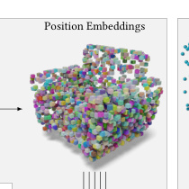

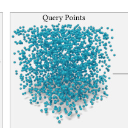

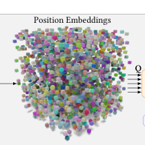

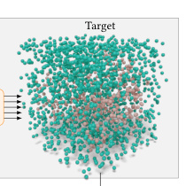

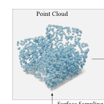

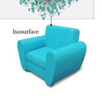

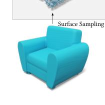

Fig. 3. **Shape autoencoding pipeline.** Given a 3D ground-truth surface mesh as the input, we first sample a point cloud that is mapped to positional
embeddings and encode them into a set of latent codes through a cross-attention module ( **Sec. 5.1** ). Next, we perform (optional) compression and KLregularization in the latent space to obtain structured and compact latent shape representations ( **Sec. 5.2** ). Finally, the self-attention is carried out to aggregate
and exchange the information within the latent set. And a cross-attention module is designed to calculate the interpolation weights of query points. The
interpolated feature vectors are fed into a fully connected layer for occupancy prediction ( **Sec. 5.3** ).

However, in order to retain the details of a 3d shape, we often need
a very large number of points ( _e.g_ ., _𝑀_ = 80 _,_ 000 in [Carr et al. 2001]).
This representation does not benefit from recent advances in representation learning and cannot compete with more compact learned
representations. We therefore want to modify the representation to
change it into a neural field.
One approach to neural fields is to represent each shape as a
separate neural network (making the network weights of a fixed
size network the representation of a shape) and train a diffusion
process as hypernetwork. A second approach is to have a shared
encoder-decoder network for all shapes and represent each shape as
a latent computed by the encoder. We opt for the second approach,
as it leads to more compact representations because it is jointly
learned from all shapes in the data set and the network weights
themselves do not count towards the latent representation. Such a
neural field takes a tuple of coordinates x and _𝐶_ -dimensional latent
f as input and outputs occupancy,

OˆNN (x) = NN(x _,_ f) _,_ (9)

where NN : R [3] × R _[𝐶]_ →[0 _,_ 1] is a neural network. A first approach
was to use a single global latent f, but a major limitation is the
ability to encode shape details [Mescheder et al. 2019]. Some followup works study _coordinate-dependent_ latents [Chibane et al. 2020;
Peng et al. 2020; Sajjadi et al. 2022] that combine traditional data
structures such as regular grids with the neural field concept. Latent
vectors are arranged in a spatial data structure and then interpolated (trilinearly) to obtain the coordinate-dependent latent fx. A
recent work 3DILG [Zhang et al. 2022] proposed a sparse representation for 3D shapes, using latents f _𝑖_ arranged in an irregular grid at
point locations x _𝑖_ . The final coordinate-dependent latent fx is then
estimated by kernel regression,

      -      where _𝑍_ x _,_ {x _𝑖_ } _𝑖_ _[𝑀]_ =1 = [�] _𝑖_ _[𝑀]_ =1 _[𝜙]_ [(][x] _[,]_ [ x] _[𝑖]_ [)][ is a normalizing factor. Thus]
the representation for a 3D shape can be written as

           f _𝑖_ ∈ R _[𝐶]_ _,_ x _𝑖_ ∈ R [3][�] _[𝑀]_ (11)

_𝑖_ =1 _[.]_

After that, an MLP : R _[𝐶]_ →[0 _,_ 1] is applied to project the approximated feature F [ˆ] KN (x) to occupancy,

Oˆ3DILG (x) = MLP �FˆKN (x)� _._ (12)

_Neural networks with latent sets (proposed)._ We initially explored
many variations for 3D shape representation based on irregular
and regular grids as well as tri-planes, frequency compositions, and
other factored representations. Ultimately, we could not improve
on existing irregular grids. However, we were able to achieve a
significant improvement with the following change. We aim to keep
the structure of an irregular grid and the interpolation, but without
representing the actual spatial position explicitly. We let the network encode spatial information. Both the representations (RBF in
Eq. (6) and 3DILG in Eq. (10)) are composed by two parts, values and
similarities. We keep the structure of the interpolation, but eliminate
explicit point coordinates and integrate cross attention from Eq. (3).
The result is the following _learnable_ function approximator,

1 √

_𝑒_ [q][(][x][)] [⊺][k][(][f] _[𝑖]_ [)/]

~~�~~ ~~�~~
_𝑍_ x _,_ {f _𝑖_ } _𝑖_ _[𝑀]_ =1

_𝑑,_ (13)

F (ˆ x) =

_𝑀_
∑︁

_𝑖_ =1

1
v(f _𝑖_ ) ·

1
f _𝑖_ - _𝜙_ (x _,_ x _𝑖_ ) _,_ (10)

~~�~~ ~~�~~
_𝑍_ x _,_ {x _𝑖_ } _𝑖_ _[𝑀]_ =1

√
where _𝑍_ �x _,_ {f _𝑖_ } _𝑖_ _[𝑀]_ =1� = [�] _𝑖_ _[𝑀]_ =1 _[𝑒]_ [q][(][x][)] [⊺][k][(][f] _[𝑖]_ [)/] _𝑑_ is a normalizing factor.

Similar to the MLP in Eq. 12, we apply a single fully connected layer
to get desired occupancy values,

O(ˆ x) = FC �F (ˆ x)� _._ (14)

Compared to 3DILG and all other coordinate-latent-based methods,
we dropped the dependency of the coordinate set {x _𝑖_ } _𝑖_ _[𝑀]_ =1 [, the new]

fx = F [ˆ] KN (x) =

_𝑀_
∑︁

_𝑖_ =1

5

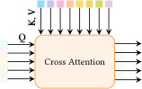

(a) Learnable Queries

Subsample and Copy

(b) Point Queries

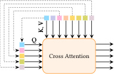

Fig. 4. **Two ways to encode a point cloud.** (a) uses a learnable query set;
(b) uses a downsampled version of input point embeddings as the query set.

representation only contains a set of latents,

             f _𝑖_ ∈ R _[𝐶]_ [�] _[𝑀]_ (15)

_𝑖_ =1 _[.]_

An alternative view of our proposed function approximator is to
see it as cross attention between query points x and a set of latents.

5 NETWORK ARCHITECTURE FOR SHAPE
REPRESENTATION LEARNING

In this section, we will discuss how we design a variational autoencoder based on the latent representation proposed in Sec. 4. The
architecture has three components discussed in the following: a 3D
shape encoder, KL regularization block, and a 3D shape decoder.

5.1 Shape encoding

We sample the surfaces of 3D input shapes in a 3D shape dataset.
This results in a point cloud of size _𝑁_ for each shape, {x _𝑖_ ∈ R [3] } _𝑖_ _[𝑁]_ =1
or in matrix form X ∈ R [3][×] _[𝑁]_ . While the dataset used in the paper
originally represents shapes as triangle meshes, our framework
is directly compatible with other surface representations, such as
scanned point clouds, spline surfaces, or implicit surfaces.
In order to learn representations in the form of Eq. (15), the first
challenge is to aggregate the information contained in a possibly
large point cloud {x _𝑖_ } _𝑖_ _[𝑁]_ =1 [into a smaller set of latent vectors][ {][f] _[𝑖]_ [}] _𝑖_ _[𝑀]_ =1 [.]
We design a set-to-set network to this effect.
A popular solution to this problem in previous work is to divide
the large point cloud into a smaller set of patches and to learn one
latent vector per patch. Although this is a very well researched
and standard component in many networks, we discovered a more
successful way to aggregate features from a large point cloud that is
better compatible with the transformer architecture. We considered
two options.
One way is to define a learnable query set. Inspired by DETR [Carion et al. 2020] and Perceiver [Jaegle et al. 2021], we use the cross
attention to encode X,

Enclearnable (X) = CrossAttn(L _,_ PosEmb(X)) ∈ R _[𝐶]_ [×] _[𝑀]_ _,_ (16)

where L ∈ R _[𝐶]_ [×] _[𝑀]_ is a _learnable query_ set where each entry is _𝐶_ dimensional, and PosEmb : R [3] → R _[𝐶]_ is a column-wise positional
embedding function.
Another way is to utilize the point cloud itself. We first subsample
the point cloud X to a smaller one with furthest point sampling,
X0 = FPS(X) ∈ R [3][×] _[𝑀]_ . The cross attention is applied to X0 and X,

Encpoints (X) = CrossAttn(PosEmb(X0) _,_ PosEmb(X)) _,_ (17)

which can also be seen as a “partial” self attention. See Fig. 4 for
an illustration of both design choices. Intuitively, the number _𝑀_
affects the reconstruction performance: the larger the _𝑀_, the better
reconstruction. However, _𝑀_ strongly affects the training time due
to the transformer architecture, so it should not be too large. In our
final model, the number of latents _𝑀_ is set as 512, and the number
of channels _𝐶_ is 512 to provide a trade off between reconstruction
quality and training time.

5.2 KL regularization block

Latent diffusion [Rombach et al. 2022] proposed to use a variational
autoencoder (VAE) [Kingma and Welling 2014] to compress images.
We adapt this design idea for our 3D shape representation and
also regularize the latents with KL-divergence. We should note
that the KL regularization is optional and only necessary for the
second-stage diffusion model training. If we just want a method for
surface reconstruction from point clouds, we do not need the KL
regularization.
We first linear project latents to mean and variance by two network branches, respectively,

FC _𝜇_ (f _𝑖_ ) = [�] _𝜇𝑖,𝑗_ - _𝑗_ ∈[1 _,_ 2 _,_ ··· _,𝐶_ 0 ]

      -       FC _𝜎_ (f _𝑖_ ) = log _𝜎𝑖,𝑗_ [2]

(18)

_𝑗_ ∈[1 _,_ 2 _,_ ··· _,𝐶_ 0 ]

where FC _𝜇_ : R _[𝐶]_ → R _[𝐶]_ [0] and FC _𝜎_ : R _[𝐶]_ → R _[𝐶]_ [0] are two linear
projection layers. We use a different size of output channels _𝐶_ 0,
where _𝐶_ 0 ≪ _𝐶_ . This compression enables us to train diffusion
models on smaller latents of total size _𝑀_ - _𝐶_ 0 ≪ _𝑀_ - _𝐶_ . We can
write the bottleneck of the VAE formally, ∀ _𝑖_ ∈[1 _,_ 2 _,_ - · · _, 𝑀_ ] _, 𝑗_ ∈

[1 _,_ 2 _,_ - · · _,𝐶_ 0],

_𝑧𝑖,𝑗_ = _𝜇𝑖,𝑗_ + _𝜎𝑖,𝑗_                 - _𝜖,_ (19)

where _𝜖_ ∼N (0 _,_ 1). The KL regularization can be written as,

_𝐶_ 0
∑︁

_𝑗_ =1

   -    - 1
Lreg {f _𝑖_ } _𝑖_ _[𝑀]_ =1 = _𝑀_ - _𝐶_ 0

_𝑀_
∑︁

_𝑖_ =1

1
2

- _𝜇𝑖,𝑗_ [2] [+] _[ 𝜎]_ _𝑖,𝑗_ [2] [−] [log] _[𝜎]_ _𝑖,𝑗_ [2] _._ (20)

In practice, we set the weight for KL loss as 0 _._ 001 and report the
performance for different values of _𝐶_ 0 in Sec. 8.1. Our recommended
setting is _𝐶_ 0 = 32.

5.3 Shape decoding

To increase the expressivity of the network, we add a latent learning
network between the two parts. Because our latents are a set of
vectors, it is natural to use transformer networks here. Thus, the
proposed network here is a series of self attention blocks,

                      {f _𝑖_ } _𝑖_ _[𝑀]_ =1 [←] [SelfAttn][(] _[𝑙]_ [)][ �] {f _𝑖_ } _𝑖_ _[𝑀]_ =1 _,_ for _𝑖_ = 1 _,_     - · · _, 𝐿._ (21)

The SelfAttn(·) with a superscript ( _𝑙_ ) here means _𝑙_ -th block. The
latents {f _𝑖_ } _𝑖_ _[𝑀]_ =1 [obtained using either Eq. (][16][) or Eq. (][17][) are fed into]
the self attention blocks. Given a query x, the corresponding latent
is interpolated using Eq. (13), and the occupancy is obtained with a
fully connected layer as shown in Eq. (14).

6

Shape Encoding (Sec. 5.1) Latent Decoding (Sec. 5.3)

FCup

### · · · · · ·

|Col1|Col2|Col3|Col4|Col5|Col6|Self Attention Self Attention|Col8|
|---|---|---|---|---|---|---|---|
|||||||||
|||||||||
|||||||||
|||||||||
|||||||||
|||||||||

|(a) Unconditional Denoising|Col2|al Denoising|Col4|
|---|---|---|---|
|Self Attention Cross Attention K V Q Condition|Self Attention Cross Attention K V Q Condition|Condition|Condition|
|Self Attention Cross Attention K V Q Condition|Self Attention Cross Attention Q|Self Attention Cross Attention Q|Self Attention Cross Attention Q|
|Self Attention Cross Attention K V Q Condition|Self Attention Cross Attention Q|Self Attention Cross Attention Q||
|Self Attention Cross Attention K V Q Condition|Self Attention Cross Attention Q|Self Attention Cross Attention Q||
|Self Attention Cross Attention K V Q Condition|Self Attention Cross Attention Q|Self Attention Cross Attention Q||
|Self Attention Cross Attention K V Q Condition|Self Attention Cross Attention Q|Self Attention Cross Attention Q||
|Self Attention Cross Attention K V Q Condition|Self Attention Cross Attention Q|Self Attention Cross Attention Q||

(b) Conditional Denoising Network

Fig. 7. **Denoising network** . Our denoising network is composed of several
denoising layers (a box in the figure denotes a layer). The denoising layer
for unconditional generation contains two sequential self attention blocks.
The denoising layer for conditional generation contains a self attention
and a cross attention block. The cross attention is for injecting condition
information such as categories, images or partial point clouds.

The function Denoiser(· _,_  - _,_ ·) is a set denoising network (set-to-set
function). The network can be easily modeled by a self-attention
transformer. Each layer consists of two attention blocks. The first
one is a self attention for attentive learning of the latent set. The
second one is for injecting the condition information C (Fig. 7 (b))
as in prior works [Rombach et al. 2022]. For simple information
like categories, C is a learnable embedding vector ( _e.g_ ., 55 different
embedding vectors for 55 categories). For a single-view image, we
use ResNet-18 [He et al. 2016] as the context encoder to extract
a global feature vector as condition C. For text conditioning, we
use BERT [Devlin et al. 2018] to learn a global feature vector as
C. For partial point clouds, we use the shape encoder introduced
in Sec. 5.1 to obtain a set of latent embeddings as C. In the case
of unconditional generation, the cross attention degrades to self
attention (Fig. 7 (a)).

7 EXPERIMENTAL SETUP

We use the dataset of ShapeNet-v2 [Chang et al. 2015] as a benchmark, containing 55 categories of man-made objects. We use the
training/val splits in [Zhang et al. 2022]. We preprocess shapes as
in [Mescheder et al. 2019]. Each shape is first converted to a watertight mesh, and then normalized to its bounding box, from which
we further sample a dense surface point cloud of size 500,000. To
learn the neural fields, we randomly sample 500,000 points with
occupancies in the 3D space, and 500,000 points with occupancies in
the near surface region. For the single-view object reconstruction,
we use the 2D rendering dataset provided by 3D-R2N2 [Choy et al.
2016], where each shape is rendered into RGB images of size of
224 × 224 from 24 random viewpoints. For text-driven shape generation, we use the text prompts of ShapeGlot [Achlioptas et al. 2019].
For data preprocess of shape completion training, we create partial
point clouds by sampling point cloud patches.

{f _𝑖_ } _𝑖_ _[𝑀]_ =1

_𝑀_

_𝑀_

Fig. 5. **KL regularization.** Given a set of latents {f _𝑖_ ∈ R _[𝐶]_ } _𝑖_ _[𝑀]_ =1 [obtained]
from the shape encoding in Sec. 5.1, we employ two linear projection layers
FC _𝜇,_ FC _𝜎_ to predict the mean and variance of a low-dimensional latent
space, where a KL regularization commonly used in VAE training is applied
to constrain the feature diversity. Then, we obtain smaller latents {z _𝑖_ ∈
R _[𝐶]_ [0] } of size _𝑀_ - _𝐶_ 0 ≪ _𝑀_ - _𝐶_ via reparametrization sampling. Finally, the
compressed latents are mapped back to the original space by FCup to obtain
a higher dimensionality for the shape decoding in Sec. 5.3.

Forward Diffusion Process

|Col1|Add Noise|Col3|Add Noise|Col5|Add Noise|Col7|
|---|---|---|---|---|---|---|
|Reverse Difusion Process|Reverse Difusion Process|Reverse Difusion Process|Reverse Difusion Process|Reverse Difusion Process|Reverse Difusion Process|Reverse Difusion Process|
||Denoise||Denoise||Denoise||
||||||||

Fig. 6. **Latent set diffusion models.** The diffusion model operates on
compressed 3D shapes in the form of a regularized set of latent vectors
{z _𝑖_ } _𝑖_ _[𝑀]_ =1 [.]

_Loss._ We optimize the binary cross entropy loss between our
approximated function and the ground-truth indicator function as
in prior works [Mescheder et al. 2019].

Lrecon �{f _𝑖_ } _𝑖_ _[𝑀]_ =1 _[,]_ [ O]     - = Ex∈R3 �BCE �O(ˆ x) _,_ O(x)�� _._ (22)

_Surface reconstruction._ We sample query points in a grid of resolution 128 [3] . The final surface is reconstructed with Marching
Cubes [Lorensen and Cline 1987].

6 SHAPE GENERATION

Our proposed diffusion model combines design decisions from latent
diffusion (the idea of the compressed latent space), EDM [Karras et al.
2022] (most of the training details), and our shape representation
design (the architecture is based on attention and self-attention
instead of convolution).
We train diffusion models in the latent space, _i.e_ ., the bottleneck
in Eq. (19). Following the diffusion formulation in EDM [Karras et al.
2022], our denoising objective is

1
En _𝑖_ ∼N(0 _,𝜎_ 2I) _𝑀_

_𝑀_
∑︁

_𝑖_ =1

      -       ���Denoiser {z _𝑖_ + n _𝑖_ } _𝑖_ _[𝑀]_ =1 _[, 𝜎,]_ [ C]

2

(23)

_𝑖_ [−] [z] _[𝑖]_ ���2 _[,]_

where Denoiser(· _,_ - _,_ ·) is our denoising neural network, _𝜎_ is the noise
level, and C is the optional conditional information ( _e.g_ ., categories,
images, partial point clouds and texts). We denote the corresponding
output of z _𝑖_ + n _𝑖_ with the subscript _𝑖_, i.e. Denoiser(· _,_ - _,_ ·) _𝑖_ . We should
minimize the loss for every noise level _𝜎_ . The sampling is done by
solving ordinary/stochastic differential equations (ODE/SDE). See
Fig. 6 for an illustration and EDM [Karras et al. 2022] for a detailed
description for both the forward (training) and reverse (sampling)
process.

7

Table 3. **Shape autoencoding (surface reconstruction from point clouds) on ShapeNet.** We show averaged metrics on all 55 categories and individual
metrics for the 7 largest categories. We compare with existing representative methods, **OccNet** (global latent), **ConvOccNet** (local latent grid), **IF-Net**
(multiscale local latent grid), and **3DILG** (irregular latent grid). For our method, we show two different designs. The column **Learned Queries** shows results of
using Eq. (16), while the column **Point Queries** means we are using a subsampled point set as queries in Eq. (17). The results of **Point Queries** are generally
better than **Learned Queries** . This is expected because input-dependent queries ( **Point Queries** ) are better than fixed queries ( **Learned Queries** ).

Ours
OccNet ConvOccNet IF-Net 3DILG
Learned Queries Point Queries

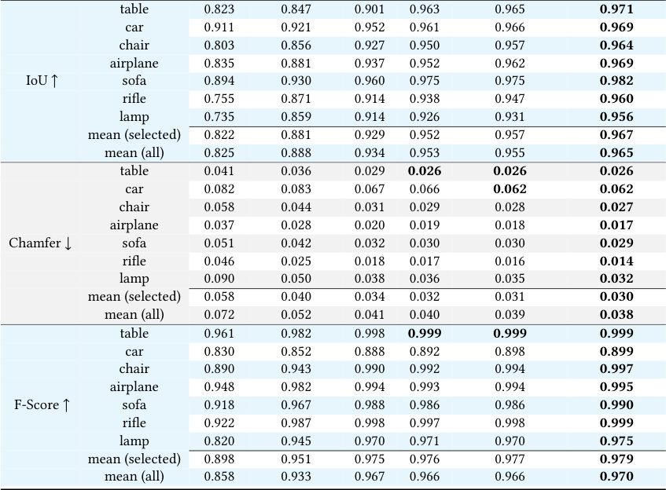

7.1 Baselines

For shape auto-encoding, we conduct experiments against stateof-the-art methods for implicit surface reconstruction from point
clouds. We use OccNet [Mescheder et al. 2019], ConvOccNet [Peng
et al. 2020], IF-Net [Chibane et al. 2020], and 3DILG [Zhang et al.
2022] as baselines. The OccNet is the first work of learning neural
fields from a single global latent vector. ConvOccNet and IF-Net
learn local neural fields based on latent vectors arranged in a regular
grid, while 3DILG uses latent vectors on an irregular grid.
For 3D shape generation, we compare against recent state-of-theart generative models, including PVD [Zhou et al. 2021], 3DILG [Zhang
et al. 2022], and NeuralWavelet [Hui et al. 2022]. PVD is a diffusion
model for 3D point cloud generation, and 3DILG utilizes autoregressive models. NeuralWavelet utilized diffusion models in the
frequency domain of shapes.

7.2 Evaluation metrics

To evaluate the reconstruction accuracy of shape auto-encoding
from point clouds, we adopt Chamfer distance, volumetric Intersectionover-Union (IoU), and F-score as primary evaluation metrics. IoU
is computed based on the occupancy predictions of 50 _𝑘_ querying
points sampled in 3D space. Chamfer distance and F-score are calculated between two sampled point clouds with the size of 50 _𝑘_
respectively from reconstructed and ground-truth surfaces. For IoU
and F-score, higher is better, while for Chamfer, lower is better.
To measure the mesh quality of unconditional and conditional
shape generation, we follow [Ibing et al. 2021; Shue et al. 2022; Zhang
et al. 2022] to adapt the Fréchet Inception Distance (FID) and Kernel
Inception Distance (KID) commonly used to assess the image generative models to rendered images of 3d shapes. To calculate FID and
KID of rendered images, we render each shape from 10 viewpoints.
The metrics are named as **Rendering-FID** and **Rendering-KID** .
The Rendering-FID is defined as,

                     Rendering-FID = ∥ _𝜇_ g − _𝜇_ r ∥+ _𝑇𝑟_ Σ _𝑔_ + Σ _𝑟_  - 2(Σ _𝑔_ Σ _𝑟_ ) [1][/][2][�] (24)

8

Fig. 8. **Visualization of shape autoencoding results (surface reconstruction from point clouds from ShapeNet).**

9

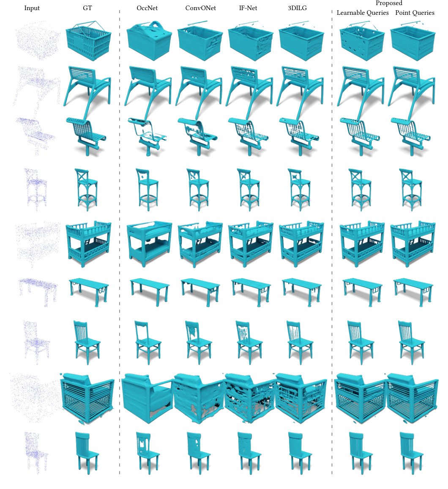
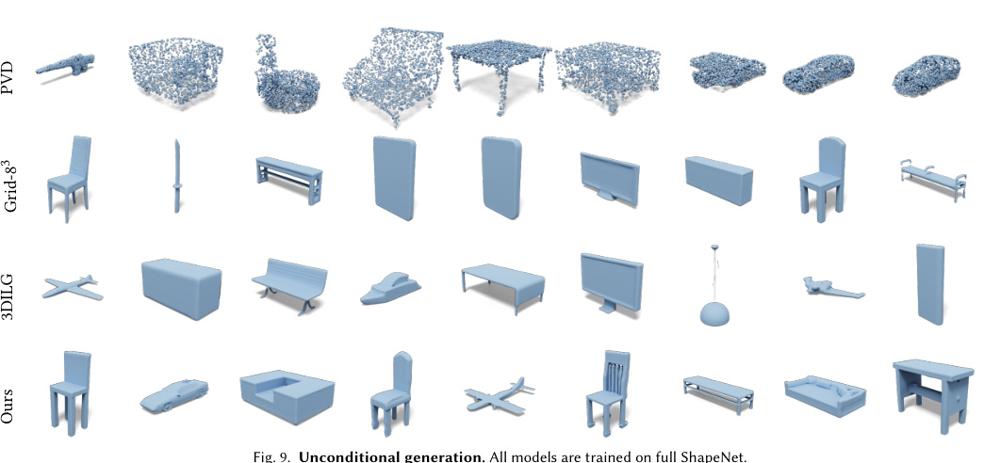

where _𝑔_ and _𝑟_ denotes the generated and training datasets respectively. _𝜇_ and Σ are the statistical mean and covariance matrix of the
feature distribution extracted by the Inception network.
The Rendering-KID is defined as,

_𝑙𝑟_ max = 5 _𝑒_ - 5 in the first _𝑡_ 0 = 80 epochs, and then gradually

decreased using the cosine decay schedule _𝑙𝑟_ max ∗ 0 _._ 5 [1][+] _[𝑐𝑜𝑠]_ [(] _𝑇_ _[𝑡]_ [−] - _[𝑡]_ _𝑡_ [0]

_𝑇_ - _𝑡_ 0 [)]

until reaching the minimum value of 1 _𝑒_ - 6. The diffusion models
are trained on 4 A100 with batch size of 256 for _𝑇_ = 8 _,_ 000 epochs.
The learning rate is linearly increased to _𝑙𝑟𝑚𝑎𝑥_ = 1 _𝑒_ - 4 in the first
_𝑡_ 0 = 800 epochs, and then gradually decreased using the above
mentioned decay schedule until reaching 1 _𝑒_ - 6. We use the default
settings for the hyperparameters of EDM [Karras et al. 2022]. During
sampling, we obtain the final latent set via only 18 denoising steps.

8 RESULTS

We present our results for multiple applications: 1) shape autoencoding, 2) unconditional generation, 3) category-conditioned
generation, 4) text-conditioned generation, 5) shape completion,
6) image-conditioned generation. Finally, we perform a shape novelty analysis to validate that we are not overfitting to the dataset.

8.1 Shape Auto-Encoding

We show the quantitative results in Tab. 3 for a deterministic autoencoder without the KL block described in Sec. 5.2. In particular,
we show results for the largest 7 categories as well as averaged results over the categories. The two design choices of shape encoding
described in Sec. 5.1 are also investigated. The case of using the
subsampled point cloud as queries is better than learnable queries in
all categories. Thus we use subsampled point clouds in our later experiments. The visualization of reconstruction results can be found
in Fig. 8. We visualize some extremely difficult shapes from the
datasets (test split). These shapes often contain some thin structures.
However, our method still performs well.
Both our method and the competitor 3DILG use transformer as
the main backbone. However, we differ in nature. 1) For encoding,
3DILG uses KNN to aggregate local information and we use cross

∑︁

maxy∈G _[𝐷]_ [(][x] _[,]_ [ y][)]
x∈R

�2
(25)

Rendering-KID = MMD

1
|R|

where _𝐷_ (x _,_ y) is a polynomial kernel function to evaluate the similarity of two samples, G and R are feature distributions of generated
set and reference set, respectively. The function MMD(·) is Maximum Mean Discrepancy. However, the rendering-based FID and KID
are essentially designed to understand 3D shapes from 2D images.
Thus, they have the inherent issue of not accurately understanding
shape compositions in the 3D world. To compensate their drawbacks, we also adapt the FID and KID to 3D shapes directly. For each
generated or ground-truth shape, we sample 4096 points (with normals) from the surface mesh and then feed them into a pre-trained
PointNet++ [Qi et al. 2017b] to extract a global latent vector, representing the global structure of the 3D shape. The PointNet++ is first
pretrained on shape classification on ShapeNet-55. As we use point
clouds, we call the FID and KID for 3D shapes as Fréchet PointNet++
Distance (FPD) and Kernel PointNet++ Distance (KPD). The two
metrics are defined similarly as in Eq. (24) and Eq. (25), except that
the features are extracted from a PointNet++ network.

7.3 Implementation

For the shape auto-encoder, we use the point cloud of size 2048 as
input. At each iteration, we individually sample 1024 query points
from the bounding volume ([−1 _,_ 1] [3] ) and the other 1024 points
from near surface region for the occupancy values prediction. The
shape auto-encoder is trained on 8 A100, with batch size of 512
for _𝑇_ = 1 _,_ 600 epochs. The learning rate is linearly increased to

10

Fig. 10. **Category-conditional generation.** From top to bottom, we show category ( _airplane, chair, table_ ) conditioned generation results.

attention. KNN manually selects neighboring points according to
spatial similarities (distances) while cross attention learns the similarities on the go. 2) 3DILG uses a set of points and one latent
per point. Our representation only contains a set of latents. This
simplification makes the second-stage generative model training
easier. 3) For decoding, 3DILG applies spatial interpolation and we
use interpolation in feature space. The used cross attention can be
seen as learnable interpolation. This gives us more flexibility.

The numerical results for the reconstruction are significant. The
maximum achievable number for the metrics IoU and F1 is 1. The
improvement has to be interpreted in how much closer we get to 1.
The visualizations also highlight the improvement.

_Ablation study of the number of latents._ The number _𝑀_ is the
number of latent vectors used in the network. Intuitively, a larger
_𝑀_ leads to a better reconstruction. We show results of _𝑀_ in Tab. 4.
Thus, in all of our experiments, _𝑀_ is set to 512. We are limited by
computation time to work with larger _𝑀_ .

11

_Ablation study of the KL block._ We described the KL block in Sec. 5.2
that leads to additional compression. In addition, this block changes
the deterministic shape encoding into a variational autoencoder.
The introduced hyperparameter is _𝐶_ 0. A smaller _𝐶_ 0 leads to a higher
compression rate. The choice of _𝐶_ 0 is ablated in Tab. 5. Clearly, larger
_𝐶_ 0 gives better results. The reconstruction results of _𝐶_ 0 = 8 _,_ 16 _,_ 32 _,_ 64
are very close. However, they differ significantly in the second stage,
because a larger latent size could make the training of diffusion
models more difficult. This result is very encouraging for our model,
because it indicates that aggressively increasing the compression
in the KL block does not decrease reconstruction performance too
much. We can also see that compressing with the KL block by decreasing _𝐶_ 0 is much better than compressing using fewer latent
vectors _𝑀_ .

8.2 Unconditional Shape Generation

_Comparison with surface generation._ We evaluate the task of unconditional shape generation with the proposed metrics in Tab. 6.
We also compared our method with a baseline method proposed
in [Zhang et al. 2022]. The method is called Grid-8 [3] because the
latent grid size is 8 [3], which is exactly the same as in AutoSDF [Mittal
et al. 2022]. The table also shows the results of different _𝐶_ 0. Our
results are best when _𝐶_ 0 = 32 in all metrics. When _𝐶_ 0 = 64 the
results become worse. This also aligns with our conjecture that a
larger latent size makes the training more difficult.

_Comparison with point cloud generation._ Additionally, we compare
our method with PVD [Zhou et al. 2021] which is a point cloud
diffusion method. We re-train PVD using the official released code
on our preprocessed dataset and splits. We use the same evaluation
protocol as before but with one major difference. Since PVD can only
generate point clouds without normals, we use another pretrained
PointNet++ (without normals) as the feature extractor to calculate
Surface-FPD and Surface-KPD. The Tab. 7 shows we can beat PVD
by a large margin. Additionally, we also show the metrics calculated
on rendered images. Visualization of generated results can be found
in Fig. 9.

8.3 Category-conditioned generation

We train a category-conditioned generation model using our method.
We evaluate our models in Tab. 8. We should note that the competitor
method NeuralWavelet [Hui et al. 2022] trains models for categories
separately; thus, NeuralWavelet is not a true category-conditioned
model. We also visualize some results ( _airplane, chair, and table_ )
in Fig. 10. Our training is more challenging, as we train on a dataset
that is an order of magnitude larger and we train for all classes
jointly. While NeuralWavelet already has good results, the joint
training is necessary / beneficial for many subsequent applications.
Additionally, we show evaluation metrics and more competitor
methods in Tab. 9. First, we use precision and recall (P&R) [Sajjadi
et al. 2018] to quantify the percentage of generated samples that
are similar to training and the percentage of training data that can
be generated, respectively. 3DILG, NeuralWavelet, and our method,
can achieve high precision which means they can generate similar
shapes to training. However, our method also shows significantly

Fig. 11. **Text conditioned generation.** For each text prompt, we generate
3 shapes. Our results ( **Right** ) are compared with AutoSDF ( **Left** ).

better recall, which means our method can generate a higher percentage of the training data. For 3DShapeGen and AutoSDF, both
precision and recall are low compared to other methods. Second,
we show other metrics based on point cloud distances (CD and
EMD) [Achlioptas et al. 2018]. The smaller the better for MMD
and the larger the better for COV. These metrics are often used to
evaluate point cloud generation.

8.4 Text-conditioned generation

The results of our text-conditioned generation model can be found
in Fig. 11. Since the model is a probabilistic model, we can sample
shapes given a text prompt. The results are very encouraging and
they constitute the first demonstration of text-conditioned 3D shape
generation using diffusion models. To the best of our knowledge,
there are no published competing methods at the point of submitting
this work.

8.5 Probabilistic shape completion

We also extend our diffusion model for probabilistic shape completion by using a partial point cloud as conditioning input. The comparison against ShapeFormer [Yan et al. 2022] is depicted in Fig. 12. As
seen, our latent set diffusion can predict more accurate completion,
and we also have the ability to achieve more diverse generations.

8.6 Image-conditioned shape generation.

We also provide comparisons on the task of single-view 3D object
reconstruction in Fig. 13. Compared to other deterministic methods
including OccNet [Mescheder et al. 2019] and IM-Net [Chen and
Zhang 2019], our latent set diffusion can not only reconstruct more
accurate surface details, (e.g. long rods and tiny holes in the back),

12

Table 4. **Ablation study** for different number of latents _𝑀_ for
shape autoencoding

_𝑀_ = 512 _𝑀_ = 256 _𝑀_ = 128 _𝑀_ = 64

Chamfer ↓ **0.038** 0.039 0.043 0.049

Table 5. **Ablation study** for different number of channels _𝐶_ 0 for shape (variational)
autoencoding.

_𝐶_ 0 = 1 _𝐶_ 0 = 2 _𝐶_ 0 = 4 _𝐶_ 0 = 8 _𝐶_ 0 = 16 _𝐶_ 0 = 32 _𝐶_ 0 = 64
IoU ↑ 0.727 0.816 0.957 0.960 0.962 0.963 **0.964**
Chamfer ↓ 0.133 0.087 **0.038** **0.038** **0.038** **0.038** **0.038**

Table 6. **Unconditional generation** on full ShapeNet.

Ours
Grid-8 [3] 3DILG
_𝐶_ 0 = 8 _𝐶_ 0 = 16 _𝐶_ 0 = 32 _𝐶_ 0 = 64
Surface-FPD ↓ 4.03 1.89 2.71 1.87 **0.76** 0.97
Surface-KPD (×10 [3] ) ↓ 6.15 2.17 3.48 2.42 **0.66** 1.11
Rendering-FID ↓ 32.78 24.83 28.25 27.26 **17.08** 24.24
Rendering-KID (×10 [3] ) ↓ 14.12 10.51 14.60 19.37 **6.75** 11.76

Table 7. **Unconditional generation** on full ShapeNet.

PVD Ours

Surface-KPD (×10 [3] ) ↓ 2.65 **0.53**
Rendering-FID ↓ 270.64 **17.08**
Rendering-KID (×10 [3] ) ↓ 281.54 **6.75**

Table 8. **Category conditioned generation.** _NW_ is short for NeuralWavelet. The dash sign “-” means the method NeuralWavelet does not release models

|ained on these categories.|Col2|Col3|Col4|Col5|
|---|---|---|---|---|
|airplane 3DILG NW Ours|chair 3DILG NW Ours|table 3DILG NW Ours|car 3DILG NW Ours|sofa 3DILG NW Ours|
|Surface-FID 0.71 **0.38** 0.62 Surface-KID (×103) 0.81 **0.53** 0.83|0.96 1.14 **0.76** 1.21 1.50 **0.70**|2.10 **1.12** 1.19 3.84 **1.55** 1.87|2.93 - **2.04** 7.35 - **3.90**|1.83 - **0.77** 3.36 - **0.70**|

Table 9. **Category conditioned generation II.** We show results for additional metrics and additional methods for category conditioned generation.

|chair 3DILG 3DShapeGen AutoSDF NW Ours|table 3DILG 3DShapeGen AutoSDF NW Ours|
|---|---|
|Precision ↑ 0.87 0.56 0.42 **0.89** 0.86 Recall ↑ 0.65 0.45 0.23 0.57 **0.86** |**0.85** 0.64 0.64 0.83 0.83 0.59 0.52 0.69 0.68 **0.89**|
|MMD-CD (×10~~2~~) ↓ **1.78** 2.14 7.27 2.14 **1.78** MMD-EMD (×102) ↓ 9.43 10.55 19.57 11.15 **9.41** COV-CD (×102) ↑ 31.95 28.01 6.31 29.19 **37.48** COV-EMD (×102) ↑ 36.29 36.69 18.34 34.91 **45.36**|2.85 2.65 2.77 2.68 **2.38** 11.02 9.53 9.63 9.60 **8.81** 18.54 23.61 21.55 21.71 **25.83** 27.73 43.26 29.16 30.74 **43.58**|

but also support multi-modal prediction, which is a desired property
to deal with severe occlusions.

8.7 Shape novelty analysis

We use shape retrieval to demonstrate that we are not simply overfitting to the training set. Given a generated shape, we measure the
Chamfer distance between it and training shapes. The visualization
of retrieved shapes can be found in Fig. 14. Clearly, the model can
synthesize new shapes with realistic structures.

8.8 Limitations

While our method shows convincing results on a variety of tasks,
our design choices also have drawbacks that we would like to discuss. For instance, we require a two stage training strategy. While
this leads to improved performance in terms of generation quality,
training the first stage is more time consuming than relying on
manually-designed features such as wavelets [Hui et al. 2022]. In
addition, the first stage might require retraining if the shape data in

consideration changes, and for the second stage – the core of our
diffusion architecture – training time is also relatively high. Overall,
we believe that there is significant potential for future research avenues to speed up training, in particular, in the context of diffusion
models.

9 CONCLUSION

We have introduced 3DShape2VecSet, a novel shape representation
for neural fields that is tailored to generative diffusion models. To
this end, we combine ideas from radial basis functions, previous
neural field architectures, variational autoencoding, as well as cross
attention and self-attention to design a learnable representation.
Our shape representation can take a variety of inputs including
triangle meshes and point clouds and encode 3D shapes as neural fields on top of a set of latent vectors. As a result, our method
demonstrates improved performance in 3D shape encoding and 3D

13

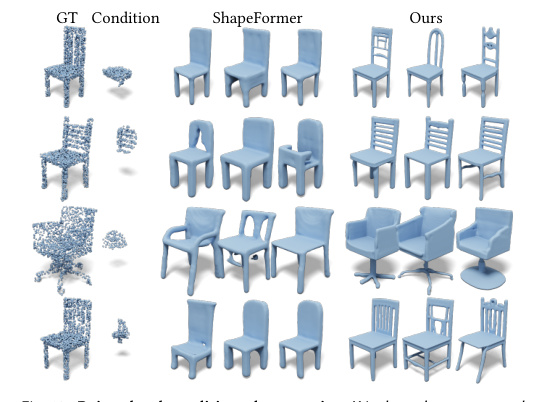

results given a partial cloud. The ground-truth point cloud and the partial
point cloud used as condition are shown in **Left** . We compare our results
( **Right** ) with ShapeFormer ( **Middle** ).

condition image. In the **middle** we show results obtained by the method
IM-Net and OccNet. Our generated results are shown on the **right** .

Fig. 14. **Shape generation novelty.** For a generated shape, we retrieve
the top-1 similar shape in the training set. The similarity is measured using
Chamfer distance of sampled surface point clouds. In each pair, we show
the retrieved shape ( **left** ) and the generated shape ( **right** ). The generated
shapes are from our category-conditioned generation results.

shape generative modeling tasks, including unconditioned generation, category-conditioned generation, text-conditioned generation,
point-cloud completion, and image-conditioned generation.
In future work, we see many exciting possibilities. Most importantly, we believe that our model further advances the state of the
art in point cloud and shape processing on a large variety of tasks.
In particular, we would like to employ the network architecture of
3DShape2VecSet to tackle the problem of surface reconstruction
from scanned point clouds. In addition, we can see many applications for content-creation tasks, for example 3D shape generation
of textured models along with their material properties. Finally, we
would like to explore editing and manipulation tasks leveraging
pretrained diffusion models for prompt to prompt shape editing,
leveraging the recent advances in image diffusion models.

ACKNOWLEDGMENTS

We would like to acknowledge Anna Frühstück for helping with
figures and the video voiceover. This work was supported by the
SDAIA-KAUST Center of Excellence in Data Science and Artificial
Intelligence (SDAIA-KAUST AI) as well as the ERC Starting Grant
Scan2CAD (804724).

REFERENCES

Panos Achlioptas, Olga Diamanti, Ioannis Mitliagkas, and Leonidas Guibas. 2018. Learning representations and generative models for 3d point clouds. In _International_
_conference on machine learning_ . PMLR, 40–49.
Panos Achlioptas, Judy Fan, Robert Hawkins, Noah Goodman, and Leonidas J Guibas.
2019. ShapeGlot: Learning language for shape differentiation. In _Proceedings of the_
_IEEE/CVF International Conference on Computer Vision_ . 8938–8947.
Alexandre Boulch and Renaud Marlet. 2022. Poco: Point convolution for surface
reconstruction. In _Proceedings of the IEEE/CVF Conference on Computer Vision and_
_Pattern Recognition_ . 6302–6314.
Andrew Brock, Theodore Lim, James M Ritchie, and Nick Weston. 2016. Generative and
discriminative voxel modeling with convolutional neural networks. _arXiv preprint_
_arXiv:1608.04236_ (2016).
Nicolas Carion, Francisco Massa, Gabriel Synnaeve, Nicolas Usunier, Alexander Kirillov,
and Sergey Zagoruyko. 2020. End-to-end object detection with transformers. In
_European conference on computer vision_ . Springer, 213–229.
Jonathan C Carr, Richard K Beatson, Jon B Cherrie, Tim J Mitchell, W Richard Fright,
Bruce C McCallum, and Tim R Evans. 2001. Reconstruction and representation of
3D objects with radial basis functions. In _Proceedings of the 28th annual conference_
_on Computer graphics and interactive techniques_ . 67–76.
Rohan Chabra, Jan E Lenssen, Eddy Ilg, Tanner Schmidt, Julian Straub, Steven Lovegrove,
and Richard Newcombe. 2020. Deep local shapes: Learning local sdf priors for
detailed 3d reconstruction. In _European Conference on Computer Vision_ . Springer,
608–625.
Eric R. Chan, Connor Z. Lin, Matthew A. Chan, Koki Nagano, Boxiao Pan, Shalini De
Mello, Orazio Gallo, Leonidas Guibas, Jonathan Tremblay, Sameh Khamis, Tero
Karras, and Gordon Wetzstein. 2022. Efficient Geometry-aware 3D Generative
Adversarial Networks. In _CVPR_ .
Angel X Chang, Thomas Funkhouser, Leonidas Guibas, Pat Hanrahan, Qixing Huang,
Zimo Li, Silvio Savarese, Manolis Savva, Shuran Song, Hao Su, et al. 2015. Shapenet:
An information-rich 3d model repository. _arXiv preprint arXiv:1512.03012_ (2015).
Zhiqin Chen and Hao Zhang. 2019. Learning implicit fields for generative shape
modeling. In _Proceedings of the IEEE/CVF Conference on Computer Vision and Pattern_
_Recognition_ . 5939–5948.
An-Chieh Cheng, Xueting Li, Sifei Liu, Min Sun, and Ming-Hsuan Yang. 2022. Autoregressive 3d shape generation via canonical mapping. _arXiv preprint arXiv:2204.01955_
(2022).
Julian Chibane, Thiemo Alldieck, and Gerard Pons-Moll. 2020. Implicit functions in
feature space for 3d shape reconstruction and completion. In _Proceedings of the_
_IEEE/CVF Conference on Computer Vision and Pattern Recognition_ . 6970–6981.
Gene Chou, Yuval Bahat, and Felix Heide. 2022. DiffusionSDF: Conditional Generative
Modeling of Signed Distance Functions. _arXiv preprint arXiv:2211.13757_ (2022).
Christopher Bongsoo Choy, Danfei Xu, JunYoung Gwak, Kevin Chen, and Silvio
Savarese. 2016. 3D-R2N2: A Unified Approach for Single and Multi-view 3D Object
Reconstruction. _european conference on computer vision_ (2016), 628–644.

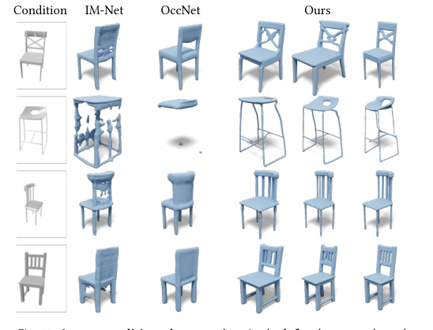

14

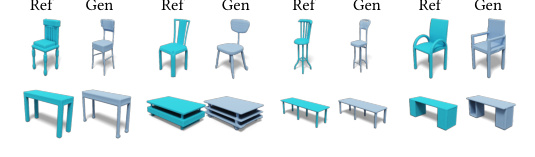
Angela Dai, Christian Diller, and Matthias Nießner. 2020. Sg-nn: Sparse generative
neural networks for self-supervised scene completion of rgb-d scans. In _Proceedings_
_of the IEEE/CVF Conference on Computer Vision and Pattern Recognition_ . 849–858.
Angela Dai, Charles Ruizhongtai Qi, and Matthias Nießner. 2017. Shape completion
using 3d-encoder-predictor cnns and shape synthesis. In _Proceedings of the IEEE_
_conference on computer vision and pattern recognition_ . 5868–5877.
Jacob Devlin, Ming-Wei Chang, Kenton Lee, and Kristina Toutanova. 2018. Bert: Pretraining of deep bidirectional transformers for language understanding. _arXiv_
_preprint arXiv:1810.04805_ (2018).
Alexey Dosovitskiy, Lucas Beyer, Alexander Kolesnikov, Dirk Weissenborn, Xiaohua
Zhai, Thomas Unterthiner, Mostafa Dehghani, Matthias Minderer, Georg Heigold,
Sylvain Gelly, Jakob Uszkoreit, and Neil Houlsby. 2021. An Image is Worth 16x16
Words: Transformers for Image Recognition at Scale. _ICLR_ (2021).
Philipp Erler, Paul Guerrero, Stefan Ohrhallinger, Niloy J Mitra, and Michael Wimmer. 2020. Points2surf learning implicit surfaces from point clouds. In _European_
_Conference on Computer Vision_ . Springer, 108–124.
Patrick Esser, Robin Rombach, and Bjorn Ommer. 2021. Taming transformers for highresolution image synthesis. In _Proceedings of the IEEE/CVF Conference on Computer_
_Vision and Pattern Recognition_ . 12873–12883.
Kyle Genova, Forrester Cole, Avneesh Sud, Aaron Sarna, and Thomas Funkhouser. 2020.
Local deep implicit functions for 3d shape. In _Proceedings of the IEEE/CVF Conference_
_on Computer Vision and Pattern Recognition_ . 4857–4866.
Rohit Girdhar, David F Fouhey, Mikel Rodriguez, and Abhinav Gupta. 2016. Learning a
predictable and generative vector representation for objects. In _European Conference_
_on Computer Vision_ . Springer, 484–499.
Ian Goodfellow, Jean Pouget-Abadie, Mehdi Mirza, Bing Xu, David Warde-Farley, Sherjil
Ozair, Aaron Courville, and Yoshua Bengio. 2014. Generative adversarial nets.
_Advances in Neural Information Processing Systems_ 27 (2014), 2672–2680.
Meng-Hao Guo, Jun-Xiong Cai, Zheng-Ning Liu, Tai-Jiang Mu, Ralph R Martin, and
Shi-Min Hu. 2021. Pct: Point cloud transformer. _Computational Visual Media_ 7, 2
(2021), 187–199.
Christian Häne, Shubham Tulsiani, and Jitendra Malik. 2017. Hierarchical surface
prediction for 3d object reconstruction. In _2017 International Conference on 3D Vision_
_(3DV)_ . IEEE, 412–420.
Kaiming He, Xiangyu Zhang, Shaoqing Ren, and Jian Sun. 2016. Deep residual learning
for image recognition. In _Proceedings of the IEEE conference on computer vision and_
_pattern recognition_ . 770–778.
Jonathan Ho, Ajay Jain, and Pieter Abbeel. 2020. Denoising diffusion probabilistic
models. _Advances in Neural Information Processing Systems_ 33 (2020), 6840–6851.
Ka-Hei Hui, Ruihui Li, Jingyu Hu, and Chi-Wing Fu. 2022. Neural wavelet-domain
diffusion for 3d shape generation. In _SIGGRAPH Asia 2022 Conference Papers_ . 1–9.
Moritz Ibing, Isaak Lim, and Leif Kobbelt. 2021. 3d shape generation with grid-based
implicit functions. In _Proceedings of the IEEE/CVF Conference on Computer Vision_
_and Pattern Recognition_ . 13559–13568.
Andrew Jaegle, Felix Gimeno, Andy Brock, Oriol Vinyals, Andrew Zisserman, and
Joao Carreira. 2021. Perceiver: General perception with iterative attention. In
_International conference on machine learning_ . PMLR, 4651–4664.
Chiyu Jiang, Avneesh Sud, Ameesh Makadia, Jingwei Huang, Matthias Nießner, Thomas
Funkhouser, et al. 2020. Local implicit grid representations for 3d scenes. In _Pro-_
_ceedings of the IEEE/CVF Conference on Computer Vision and Pattern Recognition_ .
6001–6010.
Tero Karras, Miika Aittala, Timo Aila, and Samuli Laine. 2022. Elucidating the Design
Space of Diffusion-Based Generative Models. In _Proc. NeurIPS_ .
Diederik P. Kingma and Max Welling. 2014. Auto-Encoding Variational Bayes. In
_International Conference on Learning Representations (ICLR)_, Yoshua Bengio and
Yann LeCun (Eds.).
Yann LeCun, Sumit Chopra, Raia Hadsell, M Ranzato, and F Huang. 2006. A tutorial on
energy-based learning. _Predicting structured data_ 1, 0 (2006).
Tianyang Li, Xin Wen, Yu-Shen Liu, Hua Su, and Zhizhong Han. 2022. Learning deep
implicit functions for 3D shapes with dynamic code clouds. In _Proceedings of the_
_IEEE/CVF Conference on Computer Vision and Pattern Recognition_ . 12840–12850.
William E Lorensen and Harvey E Cline. 1987. Marching cubes: A high resolution
3D surface construction algorithm. _ACM siggraph computer graphics_ 21, 4 (1987),
163–169.
Andreas Lugmayr, Martin Danelljan, Andrés Romero, Fisher Yu, Radu Timofte, and
Luc Van Gool. 2022. RePaint: Inpainting using Denoising Diffusion Probabilistic
Models. _ArXiv_ abs/2201.09865 (2022).
Shitong Luo and Wei Hu. 2021. Diffusion probabilistic models for 3d point cloud
generation. In _Proceedings of the IEEE/CVF Conference on Computer Vision and_
_Pattern Recognition_ . 2837–2845.
Donald JR Meagher. 1980. _Octree encoding: A new technique for the representation,_
_manipulation and display of arbitrary 3-d objects by computer_ . Electrical and Systems
Engineering Department Rensseiaer Polytechnic ....
Lars Mescheder, Michael Oechsle, Michael Niemeyer, Sebastian Nowozin, and Andreas
Geiger. 2019. Occupancy networks: Learning 3d reconstruction in function space.
In _Proceedings of the IEEE/CVF conference on computer vision and pattern recognition_ .

4460–4470.
Mateusz Michalkiewicz, Jhony K Pontes, Dominic Jack, Mahsa Baktashmotlagh, and
Anders Eriksson. 2019. Deep level sets: Implicit surface representations for 3d shape
inference. _arXiv preprint arXiv:1901.06802_ (2019).
Ben Mildenhall, Pratul P. Srinivasan, Matthew Tancik, Jonathan T. Barron, Ravi Ramamoorthi, and Ren Ng. 2020. NeRF: Representing Scenes as Neural Radiance Fields
for View Synthesis. In _ECCV_ .
Paritosh Mittal, Yen-Chi Cheng, Maneesh Singh, and Shubham Tulsiani. 2022. Autosdf:
Shape priors for 3d completion, reconstruction and generation. In _Proceedings of the_
_IEEE/CVF Conference on Computer Vision and Pattern Recognition_ . 306–315.
Kaichun Mo, Paul Guerrero, Li Yi, Hao Su, Peter Wonka, Niloy Mitra, and Leonidas
Guibas. 2019. StructureNet: Hierarchical Graph Networks for 3D Shape Generation.
_ACM Transactions on Graphics (TOG), Siggraph Asia 2019_ 38, 6 (2019), Article 242.
Charlie Nash, Yaroslav Ganin, SM Ali Eslami, and Peter Battaglia. 2020. Polygen: An
autoregressive generative model of 3d meshes. In _International conference on machine_
_learning_ . PMLR, 7220–7229.
Jeong Joon Park, Peter Florence, Julian Straub, Richard Newcombe, and Steven Lovegrove. 2019. Deepsdf: Learning continuous signed distance functions for shape
representation. In _Proceedings of the IEEE/CVF conference on computer vision and_
_pattern recognition_ . 165–174.
Songyou Peng, Michael Niemeyer, Lars Mescheder, Marc Pollefeys, and Andreas Geiger.
2020. Convolutional occupancy networks. In _European Conference on Computer_
_Vision_ . Springer, 523–540.
Ben Poole, Ajay Jain, Jonathan T Barron, and Ben Mildenhall. 2022. Dreamfusion:
Text-to-3d using 2d diffusion. _arXiv preprint arXiv:2209.14988_ (2022).
Charles R Qi, Hao Su, Kaichun Mo, and Leonidas J Guibas. 2017a. Pointnet: Deep
learning on point sets for 3d classification and segmentation. In _Proceedings of the_
_IEEE conference on computer vision and pattern recognition_ . 652–660.
Charles Ruizhongtai Qi, Li Yi, Hao Su, and Leonidas J Guibas. 2017b. Pointnet++: Deep
hierarchical feature learning on point sets in a metric space. _Advances in neural_
_information processing systems_ 30 (2017).
Aditya Ramesh. 2022. Hierarchical Text-Conditional Image Generation with CLIP
Latents.
Danilo Rezende and Shakir Mohamed. 2015. Variational Inference with Normalizing
Flows. In _International Conference on Machine Learning_ . 1530–1538.
Gernot Riegler, Ali Osman Ulusoy, Horst Bischof, and Andreas Geiger. 2017b. Octnetfusion: Learning depth fusion from data. In _2017 International Conference on 3D Vision_
_(3DV)_ . IEEE, 57–66.
Gernot Riegler, Ali Osman Ulusoy, and Andreas Geiger. 2017a. Octnet: Learning deep
3d representations at high resolutions. In _Proceedings of the IEEE Conference on_
_Computer Vision and Pattern Recognition_, Vol. 3.
Robin Rombach, Andreas Blattmann, Dominik Lorenz, Patrick Esser, and Björn Ommer.
2022. High-resolution image synthesis with latent diffusion models. In _Proceedings of_
_the IEEE/CVF Conference on Computer Vision and Pattern Recognition_ . 10684–10695.
Chitwan Saharia, William Chan, Saurabh Saxena, Lala Li, Jay Whang, Emily Denton,
Seyed Kamyar Seyed Ghasemipour, Burcu Karagol Ayan, S Sara Mahdavi, Rapha Gontijo Lopes, et al. 2022. Photorealistic Text-to-Image Diffusion Models with Deep
Language Understanding. _arXiv preprint arXiv:2205.11487_ (2022).
Mehdi SM Sajjadi, Olivier Bachem, Mario Lucic, Olivier Bousquet, and Sylvain Gelly.
2018. Assessing generative models via precision and recall. _Advances in neural_
_information processing systems_ 31 (2018).
Mehdi SM Sajjadi, Henning Meyer, Etienne Pot, Urs Bergmann, Klaus Greff, Noha Radwan, Suhani Vora, Mario Lučić, Daniel Duckworth, Alexey Dosovitskiy, et al. 2022.
Scene representation transformer: Geometry-free novel view synthesis through setlatent scene representations. In _Proceedings of the IEEE/CVF Conference on Computer_
_Vision and Pattern Recognition_ . 6229–6238.
J Ryan Shue, Eric Ryan Chan, Ryan Po, Zachary Ankner, Jiajun Wu, and Gordon
Wetzstein. 2022. 3D Neural Field Generation using Triplane Diffusion. _arXiv_
_preprint arXiv:2211.16677_ (2022).
Yongbin Sun, Yue Wang, Ziwei Liu, Joshua Siegel, and Sanjay Sarma. 2020. Pointgrow:
Autoregressively learned point cloud generation with self-attention. In _Proceedings_
_of the IEEE/CVF Winter Conference on Applications of Computer Vision_ . 61–70.
Jiapeng Tang, Jiabao Lei, Dan Xu, Feiying Ma, Kui Jia, and Lei Zhang. 2021. Sa-convonet:
Sign-agnostic optimization of convolutional occupancy networks. In _Proceedings of_
_the IEEE/CVF International Conference on Computer Vision_ . 6504–6513.
Maxim Tatarchenko, Alexey Dosovitskiy, and Thomas Brox. 2017. Octree Generating
Networks: Efficient Convolutional Architectures for High-resolution 3D Outputs.
In _2017 IEEE International Conference on Computer Vision (ICCV)_ . 2107–2115.
Aaron Van Den Oord, Oriol Vinyals, et al. 2017. Neural discrete representation learning.
_Advances in neural information processing systems_ 30 (2017).
Ashish Vaswani, Noam Shazeer, Niki Parmar, Jakob Uszkoreit, Llion Jon es, Aidan N
Gomez, Łukasz Kaiser, and Illia Polosukhin. 2017. Attention is all you need. _Advances_
_in neural information processing systems_ 30 (2017).
Peng-Shuai Wang, Yang Liu, Yu-Xiao Guo, Chun-Yu Sun, and Xin Tong. 2017. O-cnn:
Octree-based convolutional neural networks for 3d shape analysis. _ACM Transactions_
_on Graphics (TOG)_ 36, 4 (2017), 72.

15

Peng-Shuai Wang, Chun-Yu Sun, Yang Liu, and Xin Tong. 2018. Adaptive O-CNN: a
patch-based deep representation of 3D shapes. In _SIGGRAPH Asia 2018 Technical_
_Papers_ . ACM, 217.
Yue Wang, Yongbin Sun, Ziwei Liu, Sanjay E Sarma, Michael M Bronstein, and Justin M
Solomon. 2019. Dynamic graph cnn for learning on point clouds. _Acm Transactions_
_On Graphics (tog)_ 38, 5 (2019), 1–12.
Francis Williams, Zan Gojcic, Sameh Khamis, Denis Zorin, Joan Bruna, Sanja Fidler,
and Or Litany. 2022. Neural fields as learnable kernels for 3d reconstruction. In
_Proceedings of the IEEE/CVF Conference on Computer Vision and Pattern Recognition_ .
18500–18510.
Jiajun Wu, Chengkai Zhang, Tianfan Xue, Bill Freeman, and Josh Tenenbaum. 2016.
Learning a probabilistic latent space of object shapes via 3d generative-adversarial
modeling. In _Advances in Neural Information Processing Systems_ . 82–90.
Zhirong Wu, Shuran Song, Aditya Khosla, Fisher Yu, Linguang Zhang, Xiaoou Tang, and
Jianxiong Xiao. 2015. 3d shapenets: A deep representation for volumetric shapes.
In _Proceedings of the IEEE conference on computer vision and pattern recognition_ .
1912–1920.
Jianwen Xie, Yang Lu, Song-Chun Zhu, and Yingnian Wu. 2016. A theory of generative
convnet. In _International Conference on Machine Learning_ . PMLR, 2635–2644.
Jianwen Xie, Yifei Xu, Zilong Zheng, Song-Chun Zhu, and Ying Nian Wu. 2021. Generative pointnet: Deep energy-based learning on unordered point sets for 3d generation,
reconstruction and classification. In _Proceedings of the IEEE/CVF Conference on Com-_
_puter Vision and Pattern Recognition_ . 14976–14985.
Jianwen Xie, Zilong Zheng, Ruiqi Gao, Wenguan Wang, Song-Chun Zhu, and Ying Nian
Wu. 2020. Generative VoxelNet: learning energy-based models for 3D shape synthesis and analysis. _IEEE Transactions on Pattern Analysis and Machine Intelligence_

(2020).
Xingguang Yan, Liqiang Lin, Niloy J Mitra, Dani Lischinski, Daniel Cohen-Or, and
Hui Huang. 2022. Shapeformer: Transformer-based shape completion via sparse
representation. In _Proceedings of the IEEE/CVF Conference on Computer Vision and_
_Pattern Recognition_ . 6239–6249.
Guandao Yang, Xun Huang, Zekun Hao, Ming-Yu Liu, Serge Belongie, and Bharath
Hariharan. 2019. Pointflow: 3d point cloud generation with continuous normalizing
flows. In _Proceedings of the IEEE/CVF International Conference on Computer Vision_ .
4541–4550.
Xiaohui Zeng, Arash Vahdat, Francis Williams, Zan Gojcic, Or Litany, Sanja Fidler, and
Karsten Kreis. 2022. LION: Latent Point Diffusion Models for 3D Shape Generation.
_arXiv preprint arXiv:2210.06978_ (2022).
Biao Zhang, Matthias Nießner, and Peter Wonka. 2022. 3DILG: Irregular Latent Grids
for 3D Generative Modeling. In _Advances in Neural Information Processing Systems_ .
[https://openreview.net/forum?id=RO0wSr3R7y-](https://openreview.net/forum?id=RO0wSr3R7y-)
Hengshuang Zhao, Li Jiang, Jiaya Jia, Philip HS Torr, and Vladlen Koltun. 2021. Point
transformer. In _Proceedings of the IEEE/CVF International Conference on Computer_
_Vision_ . 16259–16268.
Xin-Yang Zheng, Yang Liu, Peng-Shuai Wang, and Xin Tong. 2022. SDF-StyleGAN:
Implicit SDF-Based StyleGAN for 3D Shape Generation. In _Comput. Graph. Forum_
_(SGP)_ .
Linqi Zhou, Yilun Du, and Jiajun Wu. 2021. 3d shape generation and completion through
point-voxel diffusion. In _Proceedings of the IEEE/CVF International Conference on_
_Computer Vision_ . 5826–5835.

16

