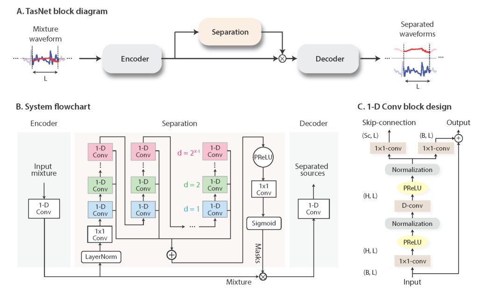
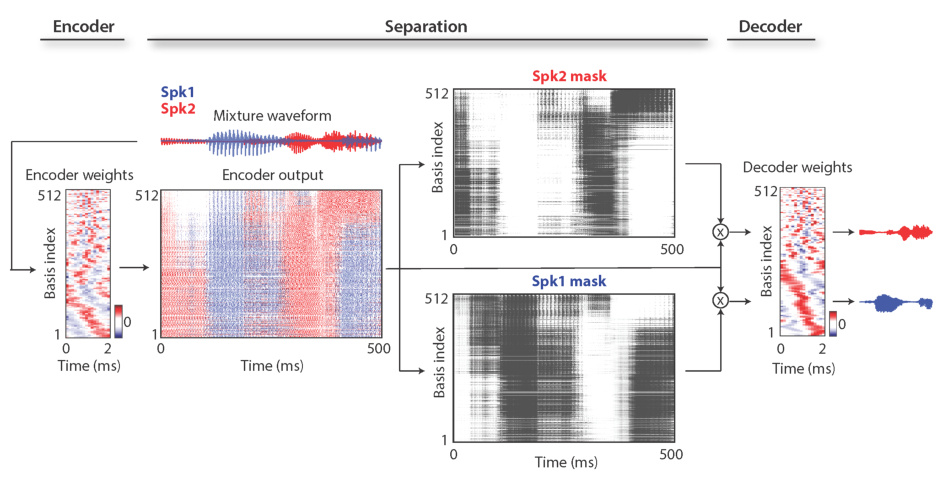
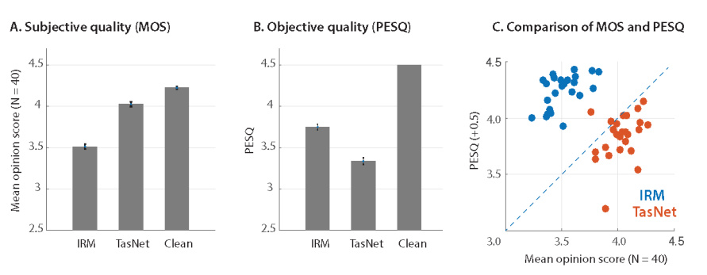
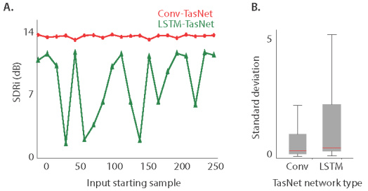
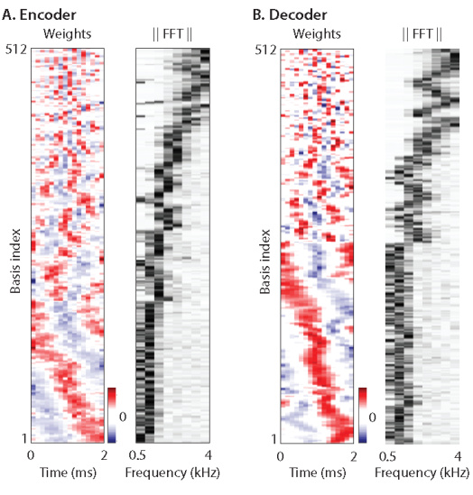

1

# Conv-TasNet: Surpassing Ideal Time-Frequency Magnitude Masking for Speech Separation

Yi Luo, Nima Mesgarani

_**Abstract**_ **—Single-channel, speaker-independent speech sepa-**
**ration methods have recently seen great progress. However,**
**the accuracy, latency, and computational cost of such methods**
**remain insufficient. The majority of the previous methods have**
**formulated the separation problem through the time-frequency**
**representation of the mixed signal, which has several drawbacks,**
**including the decoupling of the phase and magnitude of the signal,**
**the suboptimality of time-frequency representation for speech**
**separation, and the long latency in calculating the spectrograms.**
**To address these shortcomings, we propose a fully-convolutional**
**time-domain audio separation network (Conv-TasNet), a deep**
**learning framework for end-to-end time-domain speech separa-**
**tion. Conv-TasNet uses a linear encoder to generate a representa-**
**tion of the speech waveform optimized for separating individual**
**speakers. Speaker separation is achieved by applying a set of**
**weighting functions (masks) to the encoder output. The modified**
**encoder representations are then inverted back to the waveforms**
**using a linear decoder. The masks are found using a temporal**
**convolutional network (TCN) consisting of stacked 1-D dilated**
**convolutional blocks, which allows the network to model the**
**long-term dependencies of the speech signal while maintaining**
**a small model size. The proposed Conv-TasNet system signifi-**
**cantly outperforms previous time-frequency masking methods in**
**separating two- and three-speaker mixtures. Additionally, Conv-**
**TasNet surpasses several ideal time-frequency magnitude masks**
**in two-speaker speech separation as evaluated by both objective**
**distortion measures and subjective quality assessment by human**
**listeners. Finally, Conv-TasNet has a significantly smaller model**
**size and a shorter minimum latency, making it a suitable solution**
**for both offline and real-time speech separation applications. This**
**study therefore represents a major step toward the realization**
**of speech separation systems for real-world speech processing**
**technologies.**

_**Index Terms**_ **—Source separation, single-channel, time-domain,**
**deep learning, real-time**

I. INTRODUCTION

Robust speech processing in real-world acoustic environments often requires automatic speech separation. Because of
the importance of this research topic for speech processing
technologies, numerous methods have been proposed for solving this problem. However, the accuracy of speech separation,
particularly for new speakers, remains inadequate.
Most previous speech separation approaches have been
formulated in the time-frequency (T-F, or spectrogram) representation of the mixture signal, which is estimated from the
waveform using the short-time Fourier transform (STFT) [1].
Speech separation methods in the T-F domain aim to approximate the clean spectrogram of the individual sources from
the mixture spectrogram. This process can be performed by
directly approximating the spectrogram representation of each
source from the mixture using nonlinear regression techniques,

where the clean source spectrograms are used as the training
target [2]–[4]. Alternatively, a weighting function (mask) can
be estimated for each source to multiply each T-F bin in
the mixture spectrogram to recover the individual sources. In
recent years, deep learning has greatly advanced the performance of time-frequency masking methods by increasing the
accuracy of the mask estimation [5]–[12]. In both the direct
method and the mask estimation method, the waveform of
each source is calculated using the inverse short-time Fourier
transform (iSTFT) of the estimated magnitude spectrogram of
each source together with either the original or the modified
phase of the mixture sound.
While time-frequency masking remains the most commonly
used method for speech separation, this method has several
shortcomings. First, STFT is a generic signal transformation
that is not necessarily optimal for speech separation. Second,
accurate reconstruction of the phase of the clean sources is
a nontrivial problem, and the erroneous estimation of the
phase introduces an upper bound on the accuracy of the
reconstructed audio. This issue is evident by the imperfect
reconstruction accuracy of the sources even when the ideal
clean magnitude spectrograms are applied to the mixture.
Although methods for phase reconstruction can be applied to
alleviate this issue [11], [13], [14], the performance of the
method remains suboptimal. Third, successful separation from
the time-frequency representation requires a high-resolution
frequency decomposition of the mixture signal, which requires
a long temporal window for the calculation of STFT. This
requirement increases the minimum latency of the system,
which limits its applicability in real-time, low-latency applications such as in telecommunication and hearable devices.
For example, the window length of STFT in most speech
separation systems is at least 32 ms [5], [7], [8] and is even
greater in music separation applications, which require an even
higher resolution spectrogram (higher than 90 ms) [15], [16].
Because these issues arise from formulating the separation
problem in the time-frequency domain, a logical approach is
to avoid decoupling the magnitude and the phase of the sound
by directly formulating the separation in the time domain.
Previous studies have explored the feasibility of time-domain
speech separation through methods such as independent component analysis (ICA) [17] and time-domain non-negative
matrix factorization (NMF) [18]. However, the performance of
these systems has not been comparable with the performance
of time-frequency approaches, particularly in terms of their
ability to scale and generalize to large data. On the other
hand, a few recent studies have explored deep learning for
time-domain audio separation [19]–[21]. The shared idea in all

these systems is to replace the STFT step for feature extraction
with a data-driven representation that is jointly optimized with
an end-to-end training paradigm. These representations and
their inverse transforms can be explicitly designed to replace
STFT and iSTFT. Alternatively, feature extraction together
with separation can be implicitly incorporated into the network
architecture, for example by using an end-to-end convolutional
neural network (CNN) [22], [23]. These methods are different
in how they extract features from the waveform and in terms
of the design of the separation module. In [19], a convolutional
encoder motivated by discrete cosine transform (DCT) is used
as the front-end. The separation is then performed by passing
the encoder features to a multilayer perceptron (MLP). The
reconstruction of the waveforms is achieved by inverting the
encoder operation. In [20], the separation is incorporated
into a U-Net 1-D CNN architecture [24] without explicitly
transforming the input into a spectrogram-like representation.
However, the performance of these methods on a large speech
corpus such as the benchmark introduced in [25] has not
been tested. Another such method is the time-domain audio
separation network (TasNet) [21], [26]. In TasNet, the mixture
waveform is modeled with a convolutional encoder-decoder architecture, which consists of an encoder with a non-negativity
constraint on its output and a linear decoder for inverting the
encoder output back to the sound waveform. This framework is
similar to the ICA method when a non-negative mixing matrix
is used [27] and to the semi-nonnegative matrix factorization
method (semi-NMF) [28], where the basis signals are the
parameters of the decoder. The separation step in TasNet is
done by finding a weighting function for each source (similar
to time-frequency masking) for the encoder output at each
time step. It has been shown that TasNet has achieved better
or comparable performance with various previous T-F domain
systems, showing its effectiveness and potential.
While TasNet outperformed previous time-frequency speech
separation methods in both causal and non-causal implementations, the use of a deep long short-term memory (LSTM)
network as the separation module in the original TasNet significantly limited its applicability. First, choosing smaller kernel
size (i.e. length of the waveform segments) in the encoder
increases the length of the encoder output, which makes
the training of the LSTMs unmanageable. Second, the large
number of parameters in deep LSTM network significantly
increases its computational cost and limits its applicability to
low-resource, low-power platforms such as wearable hearing
devices. The third problem which we will illustrate in this
paper is caused by the long temporal dependencies of LSTM
networks which often results in inconsistent separation accuracy, for example, when changing the starting point of the
mixture. To alleviate the limitations of the previous TasNet,
we propose the fully-convolutional TasNet (Conv-TasNet) that
uses only convolutional layers in all stages of processing.
Motivated by the success of temporal convolutional network
(TCN) models [29]–[31], Conv-TasNet uses stacked dilated 1D convolutional blocks to replace the deep LSTM networks
for the separation step. The use of convolution allows parallel
processing on consecutive frames or segments to greatly speed
up the separation process and also significantly reduces the

2

model size. To further decrease the number of parameters and
the computational cost, we substitute the original convolution
operation with depthwise separable convolution [32], [33].
We show that with these modifications, Conv-TasNet significantly increases the separation accuracy over the previous
LSTM-TasNet in both causal and non-causal implementations.
Moreover, the separation accuracy of Conv-TasNet surpasses
the performance of ideal time-frequency magnitude masks,
including the ideal binary mask (IBM [34]), ideal ratio mask
(IRM [35], [36]), and Winener filter-like mask (WFM [37])
in both signal-to-distortion ratio (SDR) and subjective (mean
opinion score, MOS) measures.
The rest of the paper is organized as follows. We introduce
the proposed Conv-TasNet in section II, describe the experimental procedures in section III, and show the experimental
results and analysis in section IV.

II. CONVOLUTIONAL TIME-DOMAIN AUDIO SEPARATION
NETWORK

The fully-convolutional time-domain audio separation network (Conv-TasNet) consists of three processing stages, as
shown in figure 1 (A): encoder, separation, and decoder. First,
an encoder module is used to transform short segments of the
mixture waveform into their corresponding representations in
an intermediate feature space. This representation is then used
to estimate a multiplicative function (mask) for each source at
each time step. The source waveforms are then reconstructed
by transforming the masked encoder features using a decoder
module. We describe the details of each stage in this section.

_A. Time-domain speech separation_

The problem of single-channel speech separation can be
formulated in terms of estimating _C_ sources _s_ 1( _t_ ) _, . . ., sc_ ( _t_ ) _∈_
R [1] _[×][T]_, given the discrete waveform of the mixture _x_ ( _t_ ) _∈_
R [1] _[×][T]_, where

In time-domain audio separation, we aim to directly estimate
_si_ ( _t_ ) _, i_ = 1 _, . . ., C_, from _x_ ( _t_ ).

_B. Convolutional encoder-decoder_

The input mixture sound can be divided into overlapping
segments of length _L_, represented by **x** _k ∈_ R [1] _[×][L]_, where _k_ =
1 _, . . .,_ _T_ [ˆ] denotes the segment index and _T_ [ˆ] denotes the total
number of segments in the input. **x** _k_ is transformed into a _N_ dimensional representation, **w** _∈_ R [1] _[×][N]_ by a 1-D convolution
operation, which is reformulated as a matrix multiplication
(the index _k_ is dropped from now on):

**w** = _H_ ( **xU** ) (2)

where **U** _∈_ R _[N]_ _[×][L]_ contains _N_ vectors (encoder basis functions) with length _L_ each, and _H_ ( _·_ ) is an optional nonlinear
function. In [21], [26], _H_ ( _·_ ) was the rectified linear unit
(ReLU) to ensure that the representation is non-negative. The
decoder reconstructs the waveform from this representation

_x_ ( _t_ ) =

_C_

- _si_ ( _t_ ) (1)

_i_ =1

3

Fig. 1. (A): the block diagram of the TasNet system. An encoder maps a segment of the mixture waveform to a high-dimensional representation and a
separation module calculates a multiplicative function (i.e., a mask) for each of the target sources. A decoder reconstructs the source waveforms from the
masked features. (B): A flowchart of the proposed system. A 1-D convolutional autoencoder models the waveforms and a temporal convolutional network
(TCN) separation module estimates the masks based on the encoder output. Different colors in the 1-D convolutional blocks in TCN denote different dilation
factors. (C): The design of 1-D convolutional block. Each block consists of a 1 _×_ 1- _conv_ operation followed by a depthwise convolution ( _D_ _−conv_ ) operation,
with nonlinear activation function and normalization added between each two convolution operations. Two linear 1 _×_ 1 _−conv_ blocks serve as the residual
path and the skip-connection path respectively.

using a 1-D transposed convolution operation, which can be
reformulated as another matrix multiplication:

**x** ˆ = **wV** (3)

where ˆ **x** _∈_ R [1] _[×][L]_ is the reconstruction of **x**, and the rows
in **V** _∈_ R _[N]_ _[×][L]_ are the decoder basis functions, each with
length _L_ . The overlapping reconstructed segments are summed
together to generate the final waveforms.
Although we reformulate the encoder/decoder operations as
matrix multiplication, the term ”convolutional autoencoder” is
used because in actual model implementation, convolutional
and transposed convolutional layers can more easily handle
the overlap between segments and thus enable faster training
and better convergence. [1]

_C. Estimating the separation masks_

The separation for each frame is performed by estimating
_C_ vectors (masks) **m** _i ∈_ R [1] _[×][N]_ _, i_ = 1 _, . . ., C_ where _C_ is the
number of speakers in the mixture that is multiplied by the
encoder output **w** . The mask vectors **m** _i_ have the constraint

1With our Pytorch implementation, this is possibly due to the different _auto-_
_grad_ mechanisms in fully-connected layer and 1-D (transposed) convolutional
layers.

that **m** _i ∈_ [0 _,_ 1]. The representation of each source, **d** _i ∈_
R [1] _[×][N]_, is then calculated by applying the corresponding mask,
**m** _i_, to the mixture representation **w** :

**d** _i_ = **w** _⊙_ **m** _i_ (4)

where _⊙_ denotes element-wise multiplication. The waveform
of each source ˆ **s** _i, i_ = 1 _, . . ., C_ is then reconstructed by the
decoder:

ˆ **s** _i_ = **d** _i_ **V** (5)

The unit summation constraint in [21], [26], [�] _i_ _[C]_ =1 **[m]** _[i]_ [ =] **[ 1]** [,]
was applied based on the assumption that the encoder-encoder
architecture can perfectly reconstruct the input mixture. In
section IV-A, we will examine the consequence of relaxing
this unity summation constraint on separation accuracy.

_D. Convolutional separation module_

Motivated by the temporal convolutional network (TCN)

[29]–[31], we propose a fully-convolutional separation module
that consists of stacked 1-D dilated convolutional blocks, as
shown in figure 1 (B). TCN was proposed as a replacement
for RNNs in various sequence modeling tasks. Each layer in
a TCN consists of 1-D convolutional blocks with increasing

dilation factors. The dilation factors increase exponentially
to ensure a sufficiently large temporal context window to
take advantage of the long-range dependencies of the speech
signal, as denoted with different colors in figure 1 (B). In
Conv-TasNet, _M_ convolutional blocks with dilation factors
1 _,_ 2 _,_ 4 _, . . .,_ 2 _[M]_ _[−]_ [1] are repeated _R_ times. The input to each
block is zero padded accordingly to ensure the output length
is the same as the input. The output of the TCN is passed to
a convolutional block with kernel size 1 (1 _×_ 1 _−conv_ block,
also known as _pointwise_ convolution) for mask estimation. The
1 _×_ 1 _−conv_ block together with a nonlinear activation function
estimates _C_ mask vectors for the _C_ target sources.

Figure 1 (C) shows the design of each 1-D convolutional
block. The design of the 1-D convolutional blocks follows

[38], where a residual path and a skip-connection path are
applied: the residual path of a block serves as the input to the
next block, and the skip-connection paths for all blocks are
summed up and used as the output of the TCN. To further
decrease the number of parameters, depthwise separable convolution ( _S_ - _conv_ ( _·_ )) is used to replace standard convolution
in each convolutional block. Depthwise separable convolution
(also referred to as separable convolution) has proven effective
in image processing tasks [32], [33] and neural machine
translation tasks [39]. The depthwise separable convolution
operator decouples the standard convolution operation into two
consecutive operations, a depthwise convolution ( _D_ - _conv_ ( _·_ ))
followed by pointwise convolution (1 _×_ 1 _−conv_ ( _·_ )):

_D_  - _conv_ ( **Y** _,_ **K** ) = _concat_ ( **y** _j_ ⊛ **k** _j_ ) _, j_ = 1 _, . . ., N_ (6)

_S_  - _conv_ ( **Y** _,_ **K** _,_ **L** ) = _D_  - _conv_ ( **Y** _,_ **K** ) ⊛ **L** (7)

where **Y** _∈_ R _[G][×][M]_ is the input to _S_ - _conv_ ( _·_ ), **K** _∈_ R _[G][×][P]_

is the convolution kernel with size _P_, **y** _j ∈_ R [1] _[×][M]_ and
**k** _j ∈_ R [1] _[×][P]_ are the rows of matrices **Y** and **K**, respectively,
**L** _∈_ R _[G][×][H][×]_ [1] is the convolution kernel with size 1, and
⊛ denotes the convolution operation. In other words, the
_D_ - _conv_ ( _·_ ) operation convolves each row of the input _Y_ with
the corresponding row of matrix _K_, and the 1 _×_ 1 _−conv_
block linearly transforms the feature space. In comparison
with the standard convolution with kernel size **K** [ˆ] _∈_ R _[G][×][H][×][P]_,
depthwise separable convolution only contains _G×P_ + _G×H_
parameters, which decreases the model size by a factor of
_H×P_
_H_ + _P_ _[≈]_ _[P]_ [ when] _[ H][ ≫]_ _[P]_ [.]

A nonlinear activation function and a normalization operation are added after both the first 1 _×_ 1- _conv_ and _D_ - _conv_
blocks respectively. The nonlinear activation function is the
parametric rectified linear unit (PReLU) [40]:

4

channel and the time dimensions:

**F** _−_ _E_ [ **F** ]
_gLN_ ( **F** ) = _⊙_ _γ_ + _β_ (9)

~~�~~ _V ar_ [ **F** ] + _ϵ_

1
_E_ [ **F** ] =
_NT_

1
_V ar_ [ **F** ] =
_NT_

- ( **F** _−_ _E_ [ **F** ]) [2] (11)

_NT_

- **F** (10)

_NT_

where **F** _∈_ R _[N]_ _[×][T]_ is the feature, _γ, β ∈_ R _[N]_ _[×]_ [1] are trainable
parameters, and _ϵ_ is a small constant for numerical stability.
This is identical to the standard layer normalization applied in
computer vision models where the channel and time dimension
correspond to the width and height dimension in an image

[41]. In causal configuration, gLN cannot be applied since
it relies on the future values of the signal at any time step.
Instead, we designed a cumulative layer normalization (cLN)
operation to perform step-wise normalization in the causal
system:

**f** _k −_ _E_ [ **f** _t≤k_ ]
_cLN_ ( **f** _k_ ) = ~~�~~ _V ar_ [ **f** _t≤k_ ] + _ϵ_ _⊙_ _γ_ + _β_ (12)

1
_E_ [ **f** _t≤k_ ] =
_Nk_

1
_V ar_ [ **f** _t≤k_ ] =
_Nk_

- ( **f** _t≤k −_ _E_ [ **f** _t≤k_ ]) [2] (14)

_Nk_

- **f** _t≤k_ (13)

_Nk_

where **f** _k ∈_ R _[N]_ _[×]_ [1] is the _k_ -th frame of the entire feature
**F**, **f** _t≤k ∈_ R _[N]_ _[×][k]_ corresponds to the feature of _k_ frames

[ **f** 1 _, . . .,_ **f** _k_ ], and _γ, β ∈_ R _[N]_ _[×]_ [1] are trainable parameters applied
to all frames. To ensure that the separation module is invariant
to the scaling of the input, the selected normalization method
is applied to the encoder output **w** before it is passed to the
separation module.
At the beginning of the separation module, a linear 1 _×_
1- _conv_ block is added as a bottleneck layer. This block
determines the number of channels in the input and residual
path of the subsequent convolutional blocks. For instance, if
the linear bottleneck layer has _B_ channels, then for a 1-D
convolutional block with _H_ channels and kernel size _P_, the
size of the kernel in the first 1 _×_ 1- _conv_ block and the first
_D_ - _conv_ block should be **O** _∈_ R _[B][×][H][×]_ [1] and **K** _∈_ R _[H][×][P]_

respectively, and the size of the kernel in the residual paths
should be **L** _Rs ∈_ R _[H][×][B][×]_ [1] . The number of output channels
in the skip-connection path can be different than _B_, and we
denote the size of kernels in that path as **L** _Sc ∈_ R _[H][×][Sc][×]_ [1] .

III. EXPERIMENTAL PROCEDURES

_A. Dataset_

We evaluated our system on two-speaker and three-speaker
speech separation problems using the WSJ0-2mix and WSJ03mix datasets [25]. 30 hours of training and 10 hours of
validation data are generated from speakers in si tr s from
the datasets. The speech mixtures are generated by randomly
selecting utterances from different speakers in the Wall Street
Journal dataset (WSJ0) and mixing them at random signalto-noise ratios (SNR) between -5 dB and 5 dB. 5 hours of

_PReLU_ ( _x_ ) =

_x,_ if _x ≥_ 0
(8)
_αx,_ otherwise

where _α ∈_ R is a trainable scalar controlling the negative
slope of the rectifier. The choice of the normalization method
in the network depends on the causality requirement. For
noncausal configuration, we found empirically that global
layer normalization (gLN) outperforms all other normalization
methods. In gLN, the feature is normalized over both the

5

Fig. 2. Visualization of the encoder and decoder basis functions, encoder representation, and source masks for a sample 2-speaker mixture. The speakers
are shown in red and blue. The encoder representation is colored according to the power of each speaker at each basis function and point in time. The basis
functions are sorted according to their Euclidean similarity and show diversity in frequency and phase tuning.

evaluation set is generated in the same way using utterances
from 16 unseen speakers in si dt 05 and si et 05. The scripts
for creating the dataset can be found at [42]. All the waveforms
are resampled at 8 kHz.

_B. Experiment configurations_

The networks are trained for 100 epochs on 4-second long
segments. The initial learning rate is set to 1 _e_ _[−]_ [3] . The learning
rate is halved if the accuracy of validation set is not improved
in 3 consecutive epochs. Adam [43] is used as the optimizer. A
50% stride size is used in the convolutional autoencoder (i.e.
50% overlap between consecutive frames). Gradient clipping
with maximum _L_ 2-norm of 5 is applied during training. The
hyperparameters of the network are shown in table I. A
Pytorch implementation of the Conv-TasNet model can be
found at [2] .

_C. Training objective_

The objective of training the end-to-end system is maximizing the scale-invariant source-to-noise ratio (SI-SNR),
which has commonly been used as the evaluation metric for
source separation replacing the standard source-to-distortion
ratio (SDR) [5], [9], [44]. SI-SNR is defined as:
 **s** _target_ := _[⟨]_ _∥_ [ˆ] **[s]** **s** _[,]_ **[s]** _∥_ _[⟩]_ [2] **[s]**

|Symbol|Description|
|---|---|
|_N_|Number of filters in autoencoder|
|_L_|Length of the filters (in samples)|
|_B_|Number of channels in bottleneck and the residual paths’ 1_ ×_ 1-_conv_ blocks|
|_Sc_|Number of channels in skip-connection paths’ 1_ ×_ 1-_conv_ blocks|
|_H_|Number of channels in convolutional blocks|
|_P_|Kernel size in convolutional blocks|
|_X_|Number of convolutional blocks in each repeat|
|_R_|Number of repeats|

**s** _target_ := _[⟨]_ [ˆ] **[s]** _[,]_ **[s]** _[⟩]_ [2] **[s]**

_target_ _∥_ **s** _∥_ [2]

**e** _noise_ := ˆ **s** _−_ **s** _target_
SI-SNR := 10 _log_ 10 _∥_ **s** _target∥_ [2][2]

(15)

TABLE I
HYPERPARAMETERS OF THE NETWORK.

signal power. Scale invariance is ensured by normalizing ˆ **s**
and **s** to zero-mean prior to the calculation. Utterance-level
permutation invariant training (uPIT) is applied during training
to address the source permutation problem [7].

_D. Evaluation metrics_

We report the scale-invariant signal-to-noise ratio improvement (SI-SNRi) and signal-to-distortion ratio improvement
(SDRi) [44] as objective measures of separation accuracy. SISNR is defined in equation 15. The reported improvements in
tables III to V indicate the additive values over the original
mixture. In addition to the distortion metrics, we also evaluated
the quality of the separated mixtures using both the perceptual
evaluation of subjective quality (PESQ, [45]) and the mean
opinion score (MOS) [46] by asking 40 normal hearing sub



_∥_ **e** _noise∥_ [2]

where ˆ **s** _∈_ R [1] _[×][T]_ and **s** _∈_ R [1] _[×][T]_ are the estimated and original
clean sources, respectively, and _∥_ **s** _∥_ [2] = _⟨_ **s** _,_ **s** _⟩_ denotes the

2https://github.com/naplab/Conv-TasNet

jects to rate the quality of the separated mixtures. All human
testing procedures were approved by the local institutional
review board (IRB) at Columbia University in the City of New
York.

_E. Comparison with ideal time-frequency masks_

Following the common configurations in [5], [7], [9], the
ideal time-frequency masks were calculated using STFT with a
32 ms window size and 8 ms hop size with a Hanning window.
The ideal masks include the ideal binary mask (IBM), ideal
ratio mask (IRM), and Wiener filter-like mask (WFM), which
are defined for source _i_ as:

6

sources. In this case, the overcompleteness of the representation is crucial. If there exist only a unique weight feature for
the mixture as well as for the sources, the non-negativity of
the mask cannot be guaranteed. Also note that in both assumptions, we put no constraint on the relationship between the
encoder and decoder basis functions **U** and **V**, meaning that
they are not forced to reconstruct the mixture signal perfectly.
One way to explicitly ensure the autoencoder property is by
choosing **V** to be the pseudo-inverse of **U** (i.e. least square
reconstruction). The choice of encoder/decoder design affects
the mask estimation: in the case of an autoencoder, the unit
summation constraint must be satisfied; otherwise, the unit
summation constraint is not strictly required. To illustrate this
point, we compared five different encoder-decoder configurations:

1) Linear encoder with its pseudo-inverse (Pinv) as decoder,
i.e. **w** = **x** ( **V** _[T]_ **V** ) _[−]_ [1] **V** _[T]_ and ˆ **x** = **wV**, with Softmax
function for mask estimation.
2) Linear encoder and decoder where **w** = **xU** and
**x** ˆ = **wV**, with Softmax or Sigmoid function for mask
estimation.
3) Encoder with ReLU activation and linear decoder where
**w** = _ReLU_ ( **xU** ) and ˆ **x** = **wV**, with Softmax or
Sigmoid function for mask estimation.

Separation accuracy of different configurations in table III
shows that pseudo-inverse autoencoder leads to the worst
performance, indicating that an explicit autoencoder configuration does not necessarily improve the separation score in
this framework. The performance of all other configurations
is comparable. Because linear encoder and decoder with
Sigmoid function achieves a slightly better accuracy over
other methods, we used this configuration in all the following
experiments.

_B. Optimizing the network parameters_

We evaluate the performance of Conv-TasNet on two
speaker separation tasks as a function of different network
parameters. Table II shows the performance of the systems
with different parameters, from which we can conclude the
following statements:

(i) Encoder/decoder: Increasing the number of basis signals
in the encoder/decoder increases the overcompleteness
of the basis signals and improves the performance.
(ii) Hyperparameters in the 1-D convolutional blocks: A
possible configuration consists of a small bottleneck
size _B_ and a large number of channels in the convolutional blocks _H_ . This matches the observation in

[48], where the ratio between the convolutional block
and the bottleneck _H/B_ was found to be best around 5.
Increasing the number of channels in the skip-connection
block improves the performance while greatly increases
the model size. Therefore, we selected a small skipconnection block as a trade-off between performance and
model size.
(iii) Number of 1-D convolutional blocks: When the receptive
field is the same, deeper networks lead to better performance, possibly due to the increased model capacity.

_IBMi_ ( _f, t_ ) =

1 _, |Si_ ( _f, t_ ) _| > |Sj_ = _i_ ( _f, t_ ) _|_
(16)
0 _,_ otherwise

_|Si_ ( _f, t_ ) _|_
_IRMi_ ( _f, t_ ) = ~~�~~ _C_ (17)
_j_ =1 _[|S][j]_ [(] _[f, t]_ [)] _[|]_

_|Si_ ( _f, t_ ) _|_ [2]
_WFMi_ ( _f, t_ ) = ~~�~~ _C_ (18)
_j_ =1 _[|S][j]_ [(] _[f, t]_ [)] _[|]_ [2]

where _Si_ ( _f, t_ ) _∈_ C _[F][ ×][T]_ are the complex-valued spectrograms of clean sources _i_ = 1 _, . . ., C_ .

IV. RESULTS

Figure 2 visualizes all the internal variables of ConvTasNet for one example mixture sound with two overlapping
speakers (denoted by red and blue). The encoder and decoder
basis functions are sorted by the similarity of the Euclidean
distance of the basis functions found using the unweighted
pair group method with arithmetic mean (UPGMA) method

[47]. The basis functions show a diversity of frequency and
phase tuning. The representation of the encoder is colored
according to the power of each speaker at the corresponding
basis output at each time point, demonstrating the sparsity of
the encoder representation. As can be seen in figure 2, the
estimated masks for the two speakers highly resemble their
encoder representations, which allows for the suppression of
the encoder outputs that correspond to the interfering speaker
and the extraction of the target speaker in each mask. The
separated waveforms for the two speakers are estimated by the
linear decoder, whose basis functions are shown in figure 2.
The separated waveforms are shown on the right.

_A. Non-negativity of the encoder output_

The non-negativity of the encoder output was enforced
in [21], [26] using a rectified-linear nonlinearity (ReLU)
function. This constraint was based on the assumption that the
masking operation on the encoder output is only meaningful
when the mixture and speaker waveforms can be represented
with a non-negative combination of the basis functions, since
an unbounded encoder representation may result in unbounded
masks. However, by removing the nonlinear function _H_,
another assumption can be made: with an unbounded but
highly overcomplete representation of the mixture, a set of
non-negative masks can still be found to reconstruct the clean

7

TABLE II
THE EFFECT OF DIFFERENT CONFIGURATIONS IN CONV-TASNET.

|N|L|B|H|Sc|P|X|R|Normali- zation|Causal|Receptive field (s)|Model size|SI-SNRi (dB)|SDRi (dB)|
|---|---|---|---|---|---|---|---|---|---|---|---|---|---|
|128 256 512|40 40 40|128 128 128|256 256 256|128 128 128|3 3 3|7 7 7|2 2 2|gLN gLN gLN|× × ×|1.28 1.28 1.28|1.5M 1.5M 1.7M|13.0 13.1 13.3|13.3 13.4 13.6|
|512 512 512 512 512 512|40 40 40 40 40 40|128 128 128 256 256 256|256 512 512 256 512 512|256 128 512 256 256 512|3 3 3 3 3 3|7 7 7 7 7 7|2 2 2 2 2 2|gLN gLN gLN gLN gLN gLN|× × × × × ×|1.28 1.28 1.28 1.28 1.28 1.28|2.4M 3.1M 6.2M 3.2M 6.0M 8.1M|13.0 13.3 13.5 13.0 13.4 13.2|13.3 13.6 13.8 13.3 13.7 13.5|
|512 512 512|40 40 40|128 128 128|512 512 512|128 128 128|3 3 3|6 4 8|4 6 3|gLN gLN gLN|× × ×|1.27 0.46 3.83|5.1M 5.1M 5.1M|14.1 13.9 14.5|14.4 14.2 14.8|
|512 512 512|32 16 16|128 128 128|512 512 512|128 128 128|3 3 3|8 8 8|3 3 3|gLN gLN cLN|× × ✓|3.06 1.53 1.53|5.1M 5.1M 5.1M|14.7 **15.3** 10.6|15.0 **15.6** 11.0|

TABLE III
SEPARATION SCORE FOR DIFFERENT SYSTEM CONFIGURATIONS.

|Encoder|Mask|Model size|SI-SNRi (dB)|SDRi (dB)|
|---|---|---|---|---|
|Pinv Linear ReLU|Softmax Softmax Sigmoid Softmax Sigmoid|1.5M|12.1 12.9 **13.1** 13.0 12.9|12.4 13.2 **13.4** 13.3 13.2|

(iv) Size of receptive field: Increasing the size of receptive
field leads to better performance, which shows the importance of modeling the temporal dependencies in the
speech signal.
(v) Length of each segment: Shorter segment length consistently improves performance. Note that the best system
uses a filter length of only 2 ms ( _fs_ _[L]_ [=] 800016 [= 0] _[.]_ [002] _[s]_ [),]

which makes it very difficult to train a deep LSTM
network with the same _L_ due to the large number of
time steps in the encoder output.
(vi) Causality: Using a causal configuration leads to a significant drop in the performance. This drop could be due
to the causal convolution and/or the layer normalization
operations.

_C. Comparison of Conv-TasNet with previous methods_

We compared the separation accuracy of Conv-TasNet with
previous methods using SDRi and SI-SNRi. Table IV compares the performance of Conv-TasNet with other state-of-theart methods on the same WSJ0-2mix dataset. For all systems,
we list the best results that have been reported in the literature.
The numbers of parameters in different methods are based on
our implementations, except for [12] which is provided by the
authors. The missing values in the table are either because
the numbers were not reported in the study or because the
results were calculated with a different STFT configuration.
The previous TasNet in [26] is denoted by the (B)LSTM

TasNet. While the BLSTM-TasNet already outperformed IRM
and IBM, the non-causal Conv-TasNet significantly surpasses
the performance of all three ideal T-F masks in SI-SNRi
and SDRi metrics with a significantly smaller model size
comparing with all previous methods.

Table V compares the performance of Conv-TasNet with
those of other systems on a three-speaker speech separation
task involving the WSJ0-3mix dataset. The non-causal ConvTasNet system significantly outperforms all previous STFTbased systems in SDRi. While there is no prior result on a
causal algorithm for three-speaker separation, the causal ConvTasNet significantly outperforms even the other two non-causal
STFT-based systems [5], [7]. Examples of separated audio for
two and three speaker mixtures from both causal and noncausal implementations of Conv-TasNet are available online

[49].

TABLE IV
COMPARISON WITH OTHER METHODS ON WSJ0-2MIX DATASET.

|Method|Model size|Causal|SI-SNRi (dB)|SDRi (dB)|
|---|---|---|---|---|
|DPCL++ [5] uPIT-BLSTM-ST [7] DANet [8] ADANet [9] cuPIT-Grid-RD [50] CBLDNN-GAT [12] Chimera++ [10] WA-MISI-5 [11] BLSTM-TasNet [26] **Conv-TasNet-gLN**|13.6M 92.7M 9.1M 9.1M 47.2M 39.5M 32.9M 32.9M 23.6M **5.1M**|× × × × × × × × × ×|10.8 – 10.5 10.4 – – 11.5 12.6 13.2 **15.3**|– 10.0 – 10.8 10.2 11.0 12.0 13.1 13.6 **15.6**|
|uPIT-LSTM [7] LSTM-TasNet [26] **Conv-TasNet-cLN**|46.3M 32.0M **5.1M**|✓ ✓ ✓|– **10.8** 10.6|7.0 **11.2** 11.0|
|IRM IBM WFM|– – –|– – –|12.2 13.0 13.4|12.6 13.5 13.8|

TABLE V
COMPARISON WITH OTHER SYSTEMS ON WSJ0-3MIX DATASET.

|Method|Model size|Causal|SI-SNRi (dB)|SDRi (dB)|
|---|---|---|---|---|
|DPCL++ [5] uPIT-BLSTM-ST [7] DANet [8] ADANet [9] **Conv-TasNet-gLN**|13.6M 92.7M 9.1M 9.1M **5.1M**|× × × × ×|7.1 – 8.6 9.1 **12.7**|– 7.7 8.9 9.4 **13.1**|
|**Conv-TasNet-cLN**|**5.1M**|✓|**7.8**|**8.2**|
|IRM IBM WFM|– – –|– – –|12.5 13.2 13.6|13.0 13.6 14.0|

_D. Subjective and objective quality evaluation of Conv-TasNet_

In addition to SDRi and SI-SNRi, we evaluated the subjective and objective quality of the separated speech and
compared with three ideal time-frequency magnitude masks.
Table VI shows the PESQ score for Conv-TasNet and IRM,
IBM, and WFM, where IRM has the highest score for both
WSJ0-2mix and WSJ0-3mix dataset. However, since PESQ
aims to predict the subjective quality of speech, human quality
evaluation can be considered as the ground truth. Therefore,
we conducted a psychophysics experiment in which we asked
40 normal hearing subjects to listen and rate the quality of
the separated speech sounds. Because of the practical limitations of human psychophysics experiments, we restricted the
subjective comparison of Conv-TasNet to the ideal ratio mask
(IRM) which has the highest PESQ score among the three
ideal masks (table VI). We randomly chose 25 two-speaker
mixture sounds from the two-speaker test set (WSJ0-2mix).
We avoided a possible selection bias by ensuring that the
average PESQ scores for the IRM and Conv-TasNet separated
sounds for the selected 25 samples were equal to the average
PESQ scores over the entire test set (comparison of tables VI
and VII). The length of each utterance was constrained to be
within 0.5 standard deviation of the mean of the entire test
set. The subjects were asked to rate the quality of the clean
utterances, the IRM-separated utterances, and the Conv-TasNet
separated utterances on the scale of 1 to 5 (1: bad, 2: poor, 3:
fair, 4: good, 5: excellent). A clean utterance was first given
as the reference for the highest possible score (i.e. 5). Then
the clean, IRM, and Conv-TasNet samples were presented to
the subjects in random order. The mean opinion score (MOS)
of each of the 25 utterances was then averaged over the 40
subjects.

Figure 3 and table VII show the result of the human
subjective quality test, where the MOS for Conv-TasNet is
significantly higher than the MOS for the IRM ( _p <_ 1 _e −_ 16,
t-test). In addition, the superior subjective quality of ConvTasNet over IRM is consistent across most of the 25 test
utterances as shown in figure 3 (C). This observation shows
that PESQ consistently underestimates MOS for Conv-TasNet
separated utterances, which may be due to the dependence of
PESQ on the magnitude spectrogram of speech [45] which
could produce lower scores for time-domain approaches.

8

TABLE VI
PESQ SCORES FOR THE IDEAL T-F MASKS AND CONV-TASNET ON THE
ENTIRE WSJ0-2MIX AND WSJ0-3MIX TEST SETS.

|Dataset|PESQ IRM IBM WFM Conv-TasNet|
|---|---|
|WSJ0-2mix WSJ0-3mix|**3.74** 3.33 3.70 3.24 **3.52** 2.91 3.45 2.61|

TABLE VII
MEAN OPINION SCORE (MOS, N=40) AND PESQ FOR THE 25 SELECTED
UTTERANCES FROM THE WSJ0-2MIX TEST SET.

|Method|MOS|PESQ|
|---|---|---|
|**Conv-TasNet-gLN** IRM|**4.03** 3.51|3.22 **3.74**|
|Clean|4.23|4.5|

_E. Processing speed comparison_

Table VIII compares the processing speed of LSTM-TasNet
and causal Conv-TasNet. The speed is evaluated as the average
processing time for the systems to separate each frame in the
mixtures, which we refer to as time per frame (TPF). TPF
determines whether a system can be implemented in real time,
which requires a TPF that is smaller than the frame length.
For the CPU configuration, we tested the system with one
processor on an Intel Core i7-5820K CPU. For the GPU
configuration, we preloaded both the systems and the data to a
Nvidia Titan Xp GPU. LSTM-TasNet with CPU configuration
has a TPF close to its frame length (5 ms), which is only
marginally acceptable in applications where only a slower
CPU is available. Moreover, the processing in LSTM-TasNet
is done sequentially, which means that the processing of each
time frame must wait for the completion of the previous
time frame, further increasing the total processing time of the
entire utterance. Since Conv-TasNet decouples the processing
of consecutive frames, the processing of subsequent frames
does not have to wait until the completion of the current frame
and allows the possibility of parallel computing. This process
leads to a TPF that is 5 times smaller than the frame length
(2 ms) in our CPU configuration. Therefore, even with slower
CPUs, Conv-TasNet can still perform real-time separation.

TABLE VIII
PROCESSING TIME FOR CAUSAL LSTM-TASNET AND CONV-TASNET.
THE SPEED IS EVALUATED AS THE AVERAGE TIME REQUIRED TO
SEPARATE A FRAME (TIME PER FRAME, TPF).

|Method|CPU/GPU TPF (ms)|
|---|---|
|LSTM-TasNet Conv-TasNet-cLN|4.3/0.2 **0.4/0.02**|

_F. Sensitivity of LSTM-TasNet to the mixture starting point_

Unlike language processing tasks where sentences have
determined starting words, it is difficult to define a general
starting sample or frame for speech separation and enhancement tasks. A robust audio processing system should therefore

9

Fig. 3. Subjective and objective quality evaluation of separated utterances in WSJ0-2mix. (A): The mean opinion scores (MOS, N = 40) for IRM, Conv-TasNet
and the clean utterance. Conv-TasNet significantly outperforms IRM ( _p <_ 1 _e_ _−_ 16, t-test). (B): PESQ scores are higher for IRM compared to the Conv-TasNet
( _p <_ 1 _e −_ 16, t-test). Error bars indicate standard error (STE) (C): MOS versus PESQ for individual utterances. Each dot denotes one mixture utterance,
separated using the IRM (blue) or Conv-TasNet (red). The subjective ratings of almost all utterances for Conv-TasNet are higher than their corresponding
PESQ scores.

be insensitive to the starting point of the mixture. However, we
empirically found that the performance of the causal LSTMTasNet is very sensitive to the exact starting point of the
mixture, which means that shifting the input mixture by several
samples may adversely affect the separation accuracy. We
systematically examined the robustness of LSTM-TasNet and
causal Conv-TasNet to the starting point of the mixture by
evaluating the separation accuracy for each mixture in the
WSJ0-2mix test set with different sample shifts of the input.
A shift of _s_ samples corresponds to starting the separation at
sample _s_ instead of the first sample. Figure 4 (A) shows the
performance of both systems on the same example mixture
with different values of input shift. We observe that, unlike
LSTM-TasNet, the causal Conv-TasNet performs consistently
well for all shift values of the input mixture. We further tested
the overall robustness for the entire test set by calculating
the standard deviation of SDRi in each mixture with shifted
mixture inputs similar to figure 4 (A). The box plots of all
the mixtures in the WSJ0-2mix test set in figure 4 (B) show
that causal Conv-TasNet performs consistently better across
the entire test set, which confirms the robustness of ConvTasNet to variations in the starting point of the mixture. One
explanation for this inconsistency may be due to the sequential processing constraint in LSTM-TasNet which means that
failures in previous frames can accumulate and affect the
separation performance in all following frames, while the
decoupled processing of consecutive frames in Conv-TasNet
alleviates the effect of occasional error.

_G. Properties of the basis functions_

One of the motivations for replacing the STFT representation of the mixture signal with the convolutional encoder
in TasNet was to construct a representation of the audio
that is optimized for speech separation. To shed light on
the properties of the encoder and decoder representations, we
examine the basis functions of the encoder and decoder (rows
of the matrices **U** and **V** ). The basis functions are shown

Fig. 4. (A): SDRi of an example mixture separated using LSTM-TasNet and
causal Conv-TasNet as a function of the starting point in the mixture. The
performance of Conv-TasNet is considerably more consistent and insensitive
to the start point. (B): Standard deviation of SDRi across all the mixtures in
the WSJ0-2mix test set with varying starting points.

in figure 5 for the best noncausal Conv-TasNet, sorted in
the same way as figure 2. The magnitudes of the FFTs for
each filter are also shown in the same order. As seen in the
figure, the majority of the filters are tuned to lower frequencies.
In addition, it shows that filters with the same frequency
tuning express various phase values for that frequency. This
observation can be seen by the circular shift of the lowfrequency basis functions. This result suggests an important
role for low-frequency features of speech such as pitch as
well as explicit encoding of the phase information to achieve
superior speech separation performance.

V. DISCUSSION

In this paper, we introduced the fully-convolutional timedomain audio separation network (Conv-TasNet), a deep
learning framework for time-domain speech separation. This
framework addresses the shortcomings of speech separation
in the STFT domain, including the decoupling of phase and
magnitude, the suboptimal representation of the mixture audio
for separation, and the high latency of calculating the STFT.

Fig. 5. Visualization of encoder and decoder basis functions and the
magnitudes of their FFTs. The basis functions are sorted based on their
pairwise Euclidean similarity.

The improvements are accomplished by replacing the STFT
with a convolutional encoder-decoder architecture. The separation in Conv-TasNet is done using a temporal convolutional
network (TCN) architecture together with a depthwise separable convolution operation to address the challenges of deep
LSTM networks. Our evaluations showed that Conv-TasNet
significantly outperforms STFT speech separation systems
even when the ideal time-frequency masks for the target
speakers are used. In addition, Conv-TasNet has a smaller
model size and a shorter minimum latency, which makes it
suitable for low-resource, low latency applications.
Unlike STFT which has a well-defined inverse transform
that can perfectly reconstruct the input, best performance in
the proposed model is achieved by an overcomplete linear
convolutional encoder-decoder framework without guaranteeing the perfect reconstruction of the input. This observation
motivates rethinking of autoencoder and overcompleteness in
the source separation problem which may share similarities
to the studies of overcomplete dictionary and sparse coding

[51], [52]. Moreover, the analysis of the encoder/decoder basis
functions in section IV-G revealed two interesting properties.
First, most of the filters are tuned to low acoustic frequencies
(more than 60% tuned to frequencies below 1 kHz). This
pattern of frequency representation, which we found using a
data-driven method, roughly resembles the well-known melfrequency scale [53] as well as the tonotopic organization
of the frequencies in the mammalian auditory system [54],

[55]. In addition, the overexpression of lower frequencies
may indicate the importance of accurate pitch tracking in
speech separation, similar to what has been reported in human
multitalker perception studies [56]. In addition, we found

10

that filters with the same frequency tuning explicitly express
various phase information. In contrast, this information is
implicit in the STFT operations, where the real and imaginary
parts only represent symmetric (cosine) and asymmetric (sine)
phases, respectively. This explicit encoding of signal phase
values may be the key reason for the superior performance of
TasNet over the STFT-based separation methods.
The combination of high accuracy, short latency, and small
model size makes Conv-TasNet a suitable choice for both
offline and real-time, low-latency speech processing applications such as embedded systems and wearable hearing and
telecommunication devices. Conv-TasNet can also serve as a
front-end module for tandem systems in other audio processing
tasks, such as multitalker speech recognition [57]–[60] and
speaker identification [61], [62]. On the other hand, several
limitations of Conv-TasNet must be addressed before it can be
actualized, including the long-term tracking of speakers and
generalization to noisy and reverberant environments. Because
Conv-TasNet uses a fixed temporal context length, the longterm tracking of an individual speaker may fail, particularly
when there is a long pause in the mixture audio. In addition,
the generalization of Conv-TasNet to noisy and reverberant
conditions must be further tested [26], as time-domain approaches are more prone to temporal distortions which are particularly severe in reverberant acoustic environments. In such
conditions, extending the Conv-TasNet framework to incorporate multiple input audio channels may prove advantageous
when more than one microphone is available. Previous studies
have shown the benefit of extending speech separation to
multichannel inputs [63]–[65], particularly in adverse acoustic
conditions and when the number of interfering speakers is
large (e.g., more than 3).
In summary, Conv-TasNet represents a significant step
toward the realization of speech separation algorithms and
opens many future research directions that would further
improve its accuracy, speed, and computational cost, which
could eventually make automatic speech separation a common
and necessary feature of every speech processing technology
designed for real-world applications.

VI. ACKNOWLEDGMENTS

This work was funded by a grant from the National Institute
of Health, NIDCD, DC014279; a National Science Foundation
CAREER Award; and the Pew Charitable Trusts.

REFERENCES

[1] D. Wang and J. Chen, “Supervised speech separation based on deep
learning: An overview,” _IEEE/ACM Transactions on Audio, Speech, and_
_Language Processing_, 2018.

[2] X. Lu, Y. Tsao, S. Matsuda, and C. Hori, “Speech enhancement based
on deep denoising autoencoder.” in _Interspeech_, 2013, pp. 436–440.

[3] Y. Xu, J. Du, L.-R. Dai, and C.-H. Lee, “An experimental study on
speech enhancement based on deep neural networks,” _IEEE Signal_
_processing letters_, vol. 21, no. 1, pp. 65–68, 2014.

[4] ——, “A regression approach to speech enhancement based on deep
neural networks,” _IEEE/ACM Transactions on Audio, Speech and Lan-_
_guage Processing (TASLP)_, vol. 23, no. 1, pp. 7–19, 2015.

[5] Y. Isik, J. Le Roux, Z. Chen, S. Watanabe, and J. R. Hershey, “Singlechannel multi-speaker separation using deep clustering,” _Interspeech_
_2016_, pp. 545–549, 2016.

[6] D. Yu, M. Kolbæk, Z.-H. Tan, and J. Jensen, “Permutation invariant
training of deep models for speaker-independent multi-talker speech
separation,” in _Acoustics, Speech and Signal Processing (ICASSP), 2017_
_IEEE International Conference on_ . IEEE, 2017, pp. 241–245.

[7] M. Kolbæk, D. Yu, Z.-H. Tan, and J. Jensen, “Multitalker speech
separation with utterance-level permutation invariant training of deep
recurrent neural networks,” _IEEE/ACM Transactions on Audio, Speech,_
_and Language Processing_, vol. 25, no. 10, pp. 1901–1913, 2017.

[8] Z. Chen, Y. Luo, and N. Mesgarani, “Deep attractor network for
single-microphone speaker separation,” in _Acoustics, Speech and Signal_
_Processing (ICASSP), 2017 IEEE International Conference on_ . IEEE,
2017, pp. 246–250.

[9] Y. Luo, Z. Chen, and N. Mesgarani, “Speaker-independent speech
separation with deep attractor network,” _IEEE/ACM Transactions_
_on Audio, Speech, and Language Processing_, vol. 26, no. 4, pp.
[787–796, 2018. [Online]. Available: http://dx.doi.org/10.1109/TASLP.](http://dx.doi.org/10.1109/TASLP.2018.2795749)
[2018.2795749](http://dx.doi.org/10.1109/TASLP.2018.2795749)

[10] Z.-Q. Wang, J. Le Roux, and J. R. Hershey, “Alternative objective
functions for deep clustering,” in _Proc. IEEE International Conference_
_on Acoustics, Speech and Signal Processing (ICASSP)_, 2018.

[11] Z.-Q. Wang, J. L. Roux, D. Wang, and J. R. Hershey, “End-to-end speech
separation with unfolded iterative phase reconstruction,” _arXiv preprint_
_arXiv:1804.10204_, 2018.

[12] C. Li, L. Zhu, S. Xu, P. Gao, and B. Xu, “CBLDNN-based speakerindependent speech separation via generative adversarial training,” in
_Acoustics, Speech and Signal Processing (ICASSP), 2018 IEEE Inter-_
_national Conference on_ . IEEE, 2018.

[13] D. Griffin and J. Lim, “Signal estimation from modified short-time
fourier transform,” _IEEE Transactions on Acoustics, Speech, and Signal_
_Processing_, vol. 32, no. 2, pp. 236–243, 1984.

[14] J. Le Roux, N. Ono, and S. Sagayama, “Explicit consistency constraints
for stft spectrograms and their application to phase reconstruction.” in
_SAPA@ INTERSPEECH_, 2008, pp. 23–28.

[15] Y. Luo, Z. Chen, J. R. Hershey, J. Le Roux, and N. Mesgarani, “Deep
clustering and conventional networks for music separation: Stronger
together,” in _Acoustics, Speech and Signal Processing (ICASSP), 2017_
_IEEE International Conference on_ . IEEE, 2017, pp. 61–65.

[16] A. Jansson, E. Humphrey, N. Montecchio, R. Bittner, A. Kumar, and
T. Weyde, “Singing voice separation with deep u-net convolutional
networks,” in _18th International Society for Music Information Retrieval_
_Conference_, 2017, pp. 23–27.

[17] S. Choi, A. Cichocki, H.-M. Park, and S.-Y. Lee, “Blind source separation and independent component analysis: A review,” _Neural Information_
_Processing-Letters and Reviews_, vol. 6, no. 1, pp. 1–57, 2005.

[18] K. Yoshii, R. Tomioka, D. Mochihashi, and M. Goto, “Beyond nmf:
Time-domain audio source separation without phase reconstruction.” in
_ISMIR_, 2013, pp. 369–374.

[19] S. Venkataramani, J. Casebeer, and P. Smaragdis, “End-to-end source
separation with adaptive front-ends,” _arXiv preprint arXiv:1705.02514_,
2017.

[20] D. Stoller, S. Ewert, and S. Dixon, “Wave-u-net: A multi-scale neural network for end-to-end audio source separation,” _arXiv preprint_
_arXiv:1806.03185_, 2018.

[21] Y. Luo and N. Mesgarani, “Tasnet: time-domain audio separation
network for real-time, single-channel speech separation,” in _Acoustics,_
_Speech and Signal Processing (ICASSP), 2018 IEEE International_
_Conference on_ . IEEE, 2018.

[22] S.-W. Fu, T.-W. Wang, Y. Tsao, X. Lu, and H. Kawai, “End-to-end waveform utterance enhancement for direct evaluation metrics optimization
by fully convolutional neural networks,” _IEEE/ACM Transactions on_

11

_Audio, Speech and Language Processing (TASLP)_, vol. 26, no. 9, pp.
1570–1584, 2018.

[23] S. Pascual, A. Bonafonte, and J. Serr`a, “Segan: Speech enhancement
generative adversarial network,” _Proc. Interspeech 2017_, pp. 3642–3646,
2017.

[24] O. Ronneberger, P. Fischer, and T. Brox, “U-net: Convolutional networks
for biomedical image segmentation,” in _International Conference on_
_Medical image computing and computer-assisted intervention_ . Springer,
2015, pp. 234–241.

[25] J. R. Hershey, Z. Chen, J. Le Roux, and S. Watanabe, “Deep clustering:
Discriminative embeddings for segmentation and separation,” in _Acous-_
_tics, Speech and Signal Processing (ICASSP), 2016 IEEE International_
_Conference on_ . IEEE, 2016, pp. 31–35.

[26] Y. Luo and N. Mesgarani, “Real-time single-channel dereverberation
and separation with time-domain audio separation network,” _Proc._
_Interspeech 2018_, pp. 342–346, 2018.

[27] F.-Y. Wang, C.-Y. Chi, T.-H. Chan, and Y. Wang, “Nonnegative leastcorrelated component analysis for separation of dependent sources
by volume maximization,” _IEEE transactions on pattern analysis and_
_machine intelligence_, vol. 32, no. 5, pp. 875–888, 2010.

[28] C. H. Ding, T. Li, and M. I. Jordan, “Convex and semi-nonnegative matrix factorizations,” _IEEE transactions on pattern analysis and machine_
_intelligence_, vol. 32, no. 1, pp. 45–55, 2010.

[29] C. Lea, R. Vidal, A. Reiter, and G. D. Hager, “Temporal convolutional
networks: A unified approach to action segmentation,” in _European_
_Conference on Computer Vision_ . Springer, 2016, pp. 47–54.

[30] C. Lea, M. D. Flynn, R. Vidal, A. Reiter, and G. D. Hager, “Temporal convolutional networks for action segmentation and detection,” in
_proceedings of the IEEE Conference on Computer Vision and Pattern_
_Recognition_, 2017, pp. 156–165.

[31] S. Bai, J. Z. Kolter, and V. Koltun, “An empirical evaluation of generic
convolutional and recurrent networks for sequence modeling,” _arXiv_
_preprint arXiv:1803.01271_, 2018.

[32] F. Chollet, “Xception: Deep learning with depthwise separable convolutions,” _arXiv preprint_, 2016.

[33] A. G. Howard, M. Zhu, B. Chen, D. Kalenichenko, W. Wang,
T. Weyand, M. Andreetto, and H. Adam, “Mobilenets: Efficient convolutional neural networks for mobile vision applications,” _arXiv preprint_
_arXiv:1704.04861_, 2017.

[34] D. Wang, “On ideal binary mask as the computational goal of auditory scene analysis,” in _Speech separation by humans and machines_ .
Springer, 2005, pp. 181–197.

[35] Y. Li and D. Wang, “On the optimality of ideal binary time–frequency
masks,” _Speech Communication_, vol. 51, no. 3, pp. 230–239, 2009.

[36] Y. Wang, A. Narayanan, and D. Wang, “On training targets for supervised speech separation,” _IEEE/ACM Transactions on Audio, Speech and_
_Language Processing (TASLP)_, vol. 22, no. 12, pp. 1849–1858, 2014.

[37] H. Erdogan, J. R. Hershey, S. Watanabe, and J. Le Roux, “Phasesensitive and recognition-boosted speech separation using deep recurrent
neural networks,” in _Acoustics, Speech and Signal Processing (ICASSP),_
_2015 IEEE International Conference on_ . IEEE, 2015, pp. 708–712.

[38] A. Van Den Oord, S. Dieleman, H. Zen, K. Simonyan, O. Vinyals,
A. Graves, N. Kalchbrenner, A. Senior, and K. Kavukcuoglu, “Wavenet:
A generative model for raw audio,” _CoRR abs/1609.03499_, 2016.

[39] L. Kaiser, A. N. Gomez, and F. Chollet, “Depthwise separable convolutions for neural machine translation,” _arXiv preprint arXiv:1706.03059_,
2017.

[40] K. He, X. Zhang, S. Ren, and J. Sun, “Delving deep into rectifiers:
Surpassing human-level performance on imagenet classification,” in
_Proceedings of the IEEE international conference on computer vision_,
2015, pp. 1026–1034.

[41] J. L. Ba, J. R. Kiros, and G. E. Hinton, “Layer normalization,” _arXiv_
_preprint arXiv:1607.06450_, 2016.

[[42] “Script to generate the multi-speaker dataset using wsj0,” http://www.](http://www.merl.com/demos/deep-clustering)
[merl.com/demos/deep-clustering.](http://www.merl.com/demos/deep-clustering)

[43] D. Kingma and J. Ba, “Adam: A method for stochastic optimization,”
_arXiv preprint arXiv:1412.6980_, 2014.

[44] E. Vincent, R. Gribonval, and C. F´evotte, “Performance measurement
in blind audio source separation,” _IEEE transactions on audio, speech,_
_and language processing_, vol. 14, no. 4, pp. 1462–1469, 2006.

[45] A. W. Rix, J. G. Beerends, M. P. Hollier, and A. P. Hekstra, “Perceptual
evaluation of speech quality (pesq)-a new method for speech quality
assessment of telephone networks and codecs,” in _Acoustics, Speech,_
_and Signal Processing, 2001. Proceedings.(ICASSP’01). 2001 IEEE_
_International Conference on_, vol. 2. IEEE, 2001, pp. 749–752.

[46] ITU-T Rec. P.10, “Vocabulary for performance and quality of service,”
2006.

12

[47] R. R. Sokal, “A statistical method for evaluating systematic relationship,”
_University of Kansas science bulletin_, vol. 28, pp. 1409–1438, 1958.

[48] M. Sandler, A. Howard, M. Zhu, A. Zhmoginov, and L.-C. Chen,
“Mobilenetv2: Inverted residuals and linear bottlenecks,” in _Proceedings_
_of the IEEE Conference on Computer Vision and Pattern Recognition_,
2018, pp. 4510–4520.

[[49] “Audio samples for Conv-TasNet,” http://naplab.ee.columbia.edu/](http://naplab.ee.columbia.edu/tasnet.html)
[tasnet.html.](http://naplab.ee.columbia.edu/tasnet.html)

[50] C. Xu, X. Xiao, and H. Li, “Single channel speech separation with
constrained utterance level permutation invariant training using grid
lstm,” in _Acoustics, Speech and Signal Processing (ICASSP), 2018 IEEE_
_International Conference on_ . IEEE, 2018.

[51] T.-W. Lee, M. S. Lewicki, M. Girolami, and T. J. Sejnowski, “Blind
source separation of more sources than mixtures using overcomplete
representations,” _IEEE signal processing letters_, vol. 6, no. 4, pp. 87–
90, 1999.

[52] M. Zibulevsky and B. A. Pearlmutter, “Blind source separation by sparse
decomposition in a signal dictionary,” _Neural computation_, vol. 13, no. 4,
pp. 863–882, 2001.

[53] S. Imai, “Cepstral analysis synthesis on the mel frequency scale,” in
_Acoustics, Speech, and Signal Processing, IEEE International Confer-_
_ence on ICASSP’83._, vol. 8. IEEE, 1983, pp. 93–96.

[54] G. L. Romani, S. J. Williamson, and L. Kaufman, “Tonotopic organization of the human auditory cortex,” _Science_, vol. 216, no. 4552, pp.
1339–1340, 1982.

[55] C. Pantev, M. Hoke, B. Lutkenhoner, and K. Lehnertz, “Tonotopic organization of the auditory cortex: pitch versus frequency representation,”
_Science_, vol. 246, no. 4929, pp. 486–488, 1989.

[56] C. J. Darwin, D. S. Brungart, and B. D. Simpson, “Effects of fundamental frequency and vocal-tract length changes on attention to one of two
simultaneous talkers,” _The Journal of the Acoustical Society of America_,
vol. 114, no. 5, pp. 2913–2922, 2003.

[57] J. R. Hershey, S. J. Rennie, P. A. Olsen, and T. T. Kristjansson, “Superhuman multi-talker speech recognition: A graphical modeling approach,”
_Computer Speech & Language_, vol. 24, no. 1, pp. 45–66, 2010.

[58] C. Weng, D. Yu, M. L. Seltzer, and J. Droppo, “Deep neural networks
for single-channel multi-talker speech recognition,” _IEEE/ACM Trans-_
_actions on Audio, Speech and Language Processing (TASLP)_, vol. 23,
no. 10, pp. 1670–1679, 2015.

[59] Y. Qian, X. Chang, and D. Yu, “Single-channel multi-talker speech
recognition with permutation invariant training,” _arXiv_ _preprint_
_arXiv:1707.06527_, 2017.

[60] K. Ochi, N. Ono, S. Miyabe, and S. Makino, “Multi-talker speech
recognition based on blind source separation with ad hoc microphone
array using smartphones and cloud storage.” in _INTERSPEECH_, 2016,
pp. 3369–3373.

[61] Y. Lei, N. Scheffer, L. Ferrer, and M. McLaren, “A novel scheme for
speaker recognition using a phonetically-aware deep neural network,”
in _Acoustics, Speech and Signal Processing (ICASSP), 2014 IEEE_
_International Conference on_ . IEEE, 2014, pp. 1695–1699.

[62] M. McLaren, Y. Lei, and L. Ferrer, “Advances in deep neural network
approaches to speaker recognition,” in _Acoustics, Speech and Signal_
_Processing (ICASSP), 2015 IEEE International Conference on_ . IEEE,
2015, pp. 4814–4818.

[63] S. Gannot, E. Vincent, S. Markovich-Golan, A. Ozerov, S. Gannot,
E. Vincent, S. Markovich-Golan, and A. Ozerov, “A consolidated
perspective on multimicrophone speech enhancement and source separation,” _IEEE/ACM Transactions on Audio, Speech and Language_
_Processing (TASLP)_, vol. 25, no. 4, pp. 692–730, 2017.

[64] Z. Chen, J. Li, X. Xiao, T. Yoshioka, H. Wang, Z. Wang, and Y. Gong,
“Cracking the cocktail party problem by multi-beam deep attractor network,” in _Automatic Speech Recognition and Understanding Workshop_
_(ASRU), 2017 IEEE_ . IEEE, 2017, pp. 437–444.

[65] Z.-Q. Wang, J. Le Roux, and J. R. Hershey, “Multi-channel deep
clustering: Discriminative spectral and spatial embeddings for speakerindependent speech separation,” in _Acoustics, Speech and Signal Pro-_
_cessing (ICASSP), 2018 IEEE International Conference on_ . IEEE,
2018.

