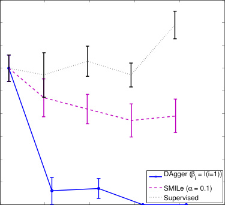
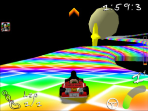
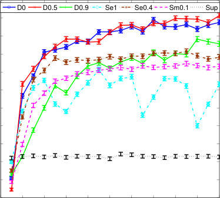
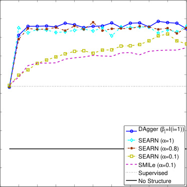

## **A Reduction of Imitation Learning and Structured Prediction** **to No-Regret Online Learning**

**Stéphane Ross** **Geoffrey J. Gordon** **J. Andrew Bagnell**
Robotics Institute Machine Learning Department Robotics Institute
Carnegie Mellon University Carnegie Mellon University Carnegie Mellon University
Pittsburgh, PA 15213, USA Pittsburgh, PA 15213, USA Pittsburgh, PA 15213, USA
stephaneross@cmu.edu ggordon@cs.cmu.edu dbagnell@ri.cmu.edu

Machine Learning Department
Carnegie Mellon University
Pittsburgh, PA 15213, USA
ggordon@cs.cmu.edu

Robotics Institute
Carnegie Mellon University
Pittsburgh, PA 15213, USA
dbagnell@ri.cmu.edu

**Abstract**

Sequential prediction problems such as imitation
learning, where future observations depend on
previous predictions (actions), violate the common i.i.d. assumptions made in statistical learning. This leads to poor performance in theory
and often in practice. Some recent approaches
(Daumé III et al., 2009; Ross and Bagnell, 2010)
provide stronger guarantees in this setting, but remain somewhat unsatisfactory as they train either
non-stationary or stochastic policies and require
a large number of iterations. In this paper, we
propose a new iterative algorithm, which trains a
stationary deterministic policy, that can be seen
as a no regret algorithm in an online learning setting. We show that any such no regret algorithm,
combined with additional reduction assumptions,
must find a policy with good performance under
the distribution of observations it induces in such
sequential settings. We demonstrate that this
new approach outperforms previous approaches
on two challenging imitation learning problems
and a benchmark sequence labeling problem.

**1** **INTRODUCTION**

Sequence Prediction problems arise commonly in practice.
For instance, most robotic systems must be able to predict/make a sequence of actions given a sequence of observations revealed to them over time. In complex robotic systems where standard control methods fail, we must often
resort to learning a controller that can make such predictions. Imitation learning techniques, where expert demon

Appearing in Proceedings of the 14 _[th]_ International Conference on
Artificial Intelligence and Statistics (AISTATS) 2011, Fort Lauderdale, FL, USA. Volume 15 of JMLR: W&CP 15. Copyright
2011 by the authors.

strations of good behavior are used to learn a controller,
have proven very useful in practice and have led to stateof-the art performance in a variety of applications (Schaal,
1999; Abbeel and Ng, 2004; Ratliff et al., 2006; Silver
et al., 2008; Argall et al., 2009; Chernova and Veloso, 2009;
Ross and Bagnell, 2010). A typical approach to imitation
learning is to train a classifier or regressor to predict an expert’s behavior given training data of the encountered observations (input) and actions (output) performed by the expert. However since the learner’s prediction affects future
input observations/states during execution of the learned
policy, this violate the crucial i.i.d. assumption made by
most statistical learning approaches.

Ignoring this issue leads to poor performance both in theory and practice (Ross and Bagnell, 2010). In particular,
a classifier that makes a mistake with probability _ϵ_ under
the distribution of states/observations encountered by the
expert can make as many as _T_ [2] _ϵ_ mistakes in expectation
over _T_ -steps under the distribution of states the classifier
itself induces (Ross and Bagnell, 2010). Intuitively this is
because as soon as the learner makes a mistake, it may encounter completely different observations than those under
expert demonstration, leading to a compounding of errors.

Recent approaches (Ross and Bagnell, 2010) can guarantee
an expected number of mistakes linear (or nearly so) in the
task horizon _T_ and error _ϵ_ by training over several iterations and allowing the learner to influence the input states
where expert demonstration is provided (through execution
of its own controls in the system). One approach (Ross and
Bagnell, 2010) learns a non-stationary policy by training
a different policy for each time step in sequence, starting
from the first step. Unfortunately this is impractical when
_T_ is large or ill-defined. Another approach called SMILe
(Ross and Bagnell, 2010), similar to SEARN (Daumé III
et al., 2009) and CPI (Kakade and Langford, 2002), trains
a stationary stochastic policy (a finite mixture of policies)
by adding a new policy to the mixture at each iteration of
training. However this may be unsatisfactory for practical
applications as some policies in the mixture are worse than

**A Reduction of Imitation Learning and Structured Prediction to No-Regret Online Learning**

others and the learned controller may be unstable.

We propose a new meta-algorithm for imitation learning
which learns a stationary deterministic policy guaranteed
to perform well under its induced distribution of states
(number of mistakes/costs that grows linearly in _T_ and
classification cost _ϵ_ ). We take a reduction-based approach
(Beygelzimer et al., 2005) that enables reusing existing supervised learning algorithms. Our approach is simple to
implement, has no free parameters except the supervised
learning algorithm sub-routine, and requires a number of
iterations that scales nearly linearly with the effective horizon of the problem. It naturally handles continuous as well
as discrete predictions. Our approach is closely related to
no regret online learning algorithms (Cesa-Bianchi et al.,
2004; Hazan et al., 2006; Kakade and Shalev-Shwartz,
2008) (in particular _Follow-The-Leader_ ) but better leverages the expert in our setting. Additionally, we show that
any no-regret learner can be used in a particular fashion to
learn a policy that achieves similar guarantees.

We begin by establishing our notation and setting, discuss
related work, and then present the DAGGER (Dataset Aggregation) method. We analyze this approach using a noregret and a reduction approach (Beygelzimer et al., 2005).
Beyond the reduction analysis, we consider the sample
complexity of our approach using online-to-batch (CesaBianchi et al., 2004) techniques. We demonstrate DAGGER
is scalable and outperforms previous approaches in practice
on two challenging imitation learning problems: 1) learning to steer a car in a 3D racing game ( _Super Tux Kart_ ) and
2) and learning to play _Super Mario Bros._, given input image features and corresponding actions by a human expert
and near-optimal planner respectively. Following Daumé
III et al. (2009) in treating structured prediction as a degenerate imitation learning problem, we apply DAGGER to
the OCR (Taskar et al., 2003) benchmark prediction problem achieving results competitive with the state-of-the-art
(Taskar et al., 2003; Ratliff et al., 2007; Daumé III et al.,
2009) using only single-pass, greedy prediction.

**2** **PRELIMINARIES**

We begin by introducing notation relevant to our setting.
We denote by Π the class of policies the learner is considering and _T_ the task horizon. For any policy _π_, we let _d_ _[t]_ _π_
denote the distribution of states at time _t_ if the learner executed policy _π_ from time step 1 to _t −_ 1. Furthermore, we
denote _dπ_ = _T_ [1] - _Tt_ =1 _[d]_ _π_ _[t]_ [the average distribution of states]

if we follow policy _π_ for _T_ steps. Given a state _s_, we denote _C_ ( _s, a_ ) the expected immediate cost of performing action _a_ in state _s_ for the task we are considering and denote
_Cπ_ ( _s_ ) = E _a∼π_ ( _s_ )[ _C_ ( _s, a_ )] the expected immediate cost of
_π_ in _s_ . We assume _C_ is bounded in [0 _,_ 1]. The total cost
of executing policy _π_ for _T_ -steps ( _i.e._, the cost-to-go) is
denoted _J_ ( _π_ ) = [�] _t_ _[T]_ =1 [E] _[s][∼][d][t]_ _π_ [[] _[C][π]_ [(] _[s]_ [)] =] _[ T]_ [E] _[s][∼][d]_ _π_ [[] _[C][π]_ [(] _[s]_ [)]][.]

In imitation learning, we may not necessarily know or observe true costs _C_ ( _s, a_ ) for the particular task. Instead,
we observe expert demonstrations and seek to bound _J_ ( _π_ )
for any cost function _C_ based on how well _π_ mimics the
expert’s policy _π_ _[∗]_ . Denote _ℓ_ the observed surrogate loss
function we minimize instead of _C_ . For instance _ℓ_ ( _s, π_ )
may be the expected 0-1 loss of _π_ with respect to _π_ _[∗]_ in
state _s_, or a squared/hinge loss of _π_ with respect to _π_ _[∗]_ in _s_ .
Importantly, in many instances, _C_ and _ℓ_ may be the same
function– for instance, if we are interested in optimizing the
learner’s ability to predict the actions chosen by an expert.

Our goal is to find a policy ˆ _π_ which minimizes the observed
surrogate loss under its induced distribution of states, i.e.:

_π_ ˆ = arg min E _s∼dπ_ [ _ℓ_ ( _s, π_ )] (1)
_π∈_ Π

As system dynamics are assumed both unknown and complex, we cannot compute _dπ_ and can only sample it by executing _π_ in the system. Hence this is a non-i.i.d. supervised
learning problem due to the dependence of the input distribution on the policy _π_ itself. The interaction between policy and the resulting distribution makes optimization difficult as it results in a non-convex objective even if the loss
_ℓ_ ( _s, ·_ ) is convex in _π_ for all states _s_ . We now briefly review
previous approaches and their guarantees.

**2.1** **Supervised Approach to Imitation**

The traditional approach to imitation learning ignores the
change in distribution and simply trains a policy _π_ that performs well under the distribution of states encountered by
the expert _dπ∗_ . This can be achieved using any standard
supervised learning algorithm. It finds the policy ˆ _πsup_ :

_π_ ˆ _sup_ = arg min E _s∼dπ∗_ [ _ℓ_ ( _s, π_ )] (2)
_π∈_ Π

Assuming _ℓ_ ( _s, π_ ) is the 0-1 loss (or upper bound on the 01 loss) implies the following performance guarantee with
respect to any task cost function _C_ bounded in [0 _,_ 1]:

**Theorem** **2.1.** _(Ross_ _and_ _Bagnell,_ _2010)_ _Let_
E _s∼dπ∗_ [ _ℓ_ ( _s, π_ )] = _ϵ, then J_ ( _π_ ) _≤_ _J_ ( _π_ _[∗]_ ) + _T_ [2] _ϵ._

_Proof._ Follows from result in Ross and Bagnell (2010)
since _ϵ_ is an upper bound on the 0-1 loss of _π_ in _dπ∗_ .

Note that this bound is tight, i.e. there exist problems
such that a policy _π_ with _ϵ_ 0-1 loss on _dπ∗_ can incur extra cost that grows quadratically in _T_ . Kääriäinen (2006)
demonstrated this in a sequence prediction setting [1] and

1In their example, an error rate of _ϵ >_ 0 when trained to
predict the next output in sequence with the previous correct
output as input can lead to an expected number of mistakes of

_T_

2 _[−]_ [1] _[−]_ [(1] _[−]_ 4 [2] _ϵ_ _[ϵ]_ [)] _[T]_ [ +1]

_T_

4 [2] _ϵ_ _[ϵ]_ [)] + 2 [1]

2 _[−]_ 4 _ϵ_ + 2 [over sequences of length] _[ T]_ [ at test time.]

This is bounded by _T_ [2] _ϵ_ and behaves as Θ( _T_ [2] _ϵ_ ) for small _ϵ_ .

**Stéphane Ross, Geoffrey J. Gordon, J. Andrew Bagnell**

Ross and Bagnell (2010) provided an imitation learning example where _J_ (ˆ _πsup_ ) = (1 _−_ _ϵT_ ) _J_ ( _π_ _[∗]_ ) + _T_ [2] _ϵ_ . Hence the
traditional supervised learning approach has poor performance guarantees due to the quadratic growth in _T_ . Instead
we would prefer approaches that can guarantee growth linear or near-linear in _T_ and _ϵ_ . The following two approaches
from Ross and Bagnell (2010) achieve this on some classes
of imitation learning problems, including all those where
surrogate loss _ℓ_ upper bounds _C_ .

**2.2** **Forward Training**

The forward training algorithm introduced by Ross and
Bagnell (2010) trains a non-stationary policy (one policy
_πt_ for each time step _t_ ) iteratively over _T_ iterations, where
at iteration _t_, _πt_ is trained to mimic _π_ _[∗]_ on the distribution
of states at time _t_ induced by the previously trained policies _π_ 1 _, π_ 2 _, . . ., πt−_ 1. By doing so, _πt_ is trained on the
actual distribution of states it will encounter during execution of the learned policy. Hence the forward algorithm
guarantees that the expected loss under the distribution of
states induced by the learned policy matches the average
loss during training, and hence improves performance.

We here provide a theorem slightly more general than the
one provided by Ross and Bagnell (2010) that applies to
any policy _π_ that can guarantee _ϵ_ surrogate loss under its
own distribution of states. This will be useful to bound the
performance of our new approach presented in Section 3.

Let _Q_ _[π]_ _t_ _[′]_ [(] _[s, π]_ [)][ denote the] _[ t]_ [-step cost of executing] _[ π]_ [ in initial]
state _s_ and then following policy _π_ _[′]_ and assume _ℓ_ ( _s, π_ ) is
the 0-1 loss (or an upper bound on the 0-1 loss), then we
have the following performance guarantee with respect to
any task cost function _C_ bounded in [0 _,_ 1]:

**Theorem 2.2.** _Let π be such that_ E _s∼dπ_ [ _ℓ_ ( _s, π_ )] = _ϵ, and_
_Q_ _[π]_ _T −_ _[∗]_ _t_ +1 [(] _[s, a]_ [)] _[ −]_ _[Q][π]_ _T −_ _[∗]_ _t_ +1 [(] _[s, π][∗]_ [)] _[ ≤]_ _[u][ for all action][ a][,][ t][ ∈]_
_{_ 1 _,_ 2 _, . . ., T_ _}, d_ _[t]_ _π_ [(] _[s]_ [)] _[ >]_ [ 0] _[, then][ J]_ [(] _[π]_ [)] _[ ≤]_ _[J]_ [(] _[π][∗]_ [) +] _[ uTϵ][.]_

_Proof._ We here follow a similar proof to Ross and Bagnell
(2010). Given our policy _π_, consider the policy _π_ 1: _t_, which
executes _π_ in the first _t_ -steps and then execute the expert
_π_ _[∗]_ . Then

_J_ ( _π_ )
= _J_ ( _π_ _[∗]_ ) + [�] _t_ _[T]_ =0 _[ −]_ [1][[] _[J]_ [(] _[π]_ [1:] _[T][ −][t]_ [)] _[ −]_ _[J]_ [(] _[π]_ [1:] _[T][ −][t][−]_ [1][)]]
= _J_ ( _π_ _[∗]_ ) + [�] _t_ _[T]_ =1 [E] _[s][∼][d][t]_ _π_ [[] _[Q]_ _T_ _[π]_ _−_ _[∗]_ _t_ +1 [(] _[s, π]_ [)] _[ −]_ _[Q][π]_ _T −_ _[∗]_ _t_ +1 [(] _[s, π][∗]_ [)]]
_≤_ _J_ ( _π_ _[∗]_ ) + _u_ [�] _t_ _[T]_ =1 [E] _[s][∼][d][t]_ _π_ [[] _[ℓ]_ [(] _[s, π]_ [)]]
= _J_ ( _π_ _[∗]_ ) + _uTϵ_

The inequality follows from the fact that _ℓ_ ( _s, π_ ) upper
bounds the 0-1 loss, and hence the probability _π_ and _π_ _[∗]_

pick different actions in _s_ ; when they pick different actions,
the increase in cost-to-go _≤_ _u_ .

In the worst case, _u_ could be _O_ ( _T_ ) and the forward algorithm wouldn’t provide any improvement over the tra

ditional supervised learning approach. However, in many
cases _u_ is _O_ (1) or sub-linear in _T_ and the forward algorithm leads to improved performance. For instance if _C_ is
the 0-1 loss with respect to the expert, then _u ≤_ 1. Additionally if _π_ _[∗]_ is able to recover from mistakes made by _π_, in
the sense that within a few steps, _π_ _[∗]_ is back in a distribution
of states that is close to what _π_ _[∗]_ would be in if _π_ _[∗]_ had been
executed initially instead of _π_, then _u_ will be _O_ (1). [2] A
drawback of the forward algorithm is that it is impractical
when _T_ is large (or undefined) as we must train _T_ different
policies sequentially and cannot stop the algorithm before
we complete all _T_ iterations. Hence it can not be applied
to most real-world applications.

**2.3** **Stochastic Mixing Iterative Learning**

**3** **DATASET AGGREGATION**

We now present DAGGER (Dataset Aggregation), an iterative algorithm that trains a deterministic policy that
achieves good performance guarantees under its induced
distribution of states.

In its simplest form, the algorithm proceeds as follows.
At the first iteration, it uses the expert’s policy to gather
a dataset of trajectories _D_ and train a policy ˆ _π_ 2 that best
mimics the expert on those trajectories. Then at iteration
_n_, it uses ˆ _πn_ to collect more trajectories and adds those
trajectories to the dataset _D_ . The next policy ˆ _πn_ +1 is the
policy that best mimics the expert on the whole dataset _D_ .

2This is the case for instance in Markov Desision Processes
(MDPs) when the Markov Chain defined by the system dynamics
and policy _π_ _[∗]_ is rapidly mixing. In particular, if it is _α_ -mixing
with exponential decay rate _δ_ then _u_ is _O_ ( 1 _−_ exp(1 _−δ_ ) [)][.]

SMILe, proposed by Ross and Bagnell (2010), alleviates
this problem and can be applied in practice when _T_ is
large or undefined by adopting an approach similar to
SEARN (Daumé III et al., 2009) where a stochastic stationary policy is trained over several iterations. Initially
SMILe starts with a policy _π_ 0 which always queries and
executes the expert’s action choice. At iteration _n_, a policy ˆ _πn_ is trained to mimic the expert under the distribution of trajectories _πn−_ 1 induces and then updates _πn_ =
_πn−_ 1 + _α_ (1 _−_ _α_ ) _[n][−]_ [1] (ˆ _πn −_ _π_ 0). This update is interpreted
as adding probability _α_ (1 _−_ _α_ ) _[n][−]_ [1] to executing policy ˆ _πn_
at any step and removing probability _α_ (1 _−_ _α_ ) _[n][−]_ [1] of executing the queried expert’s action. At iteration _n_, _πn_ is
a mixture of _n_ policies and the probability of using the
queried expert’s action is (1 _−_ _α_ ) _[n]_ . We can stop the algorithm at any iteration _N_ by returning the re-normalized
policy ˜ _πN_ = _[π][N]_ _[−]_ [(1] _[−][α]_ [)] _[N][N][π]_ [0] which doesn’t query the expert

policy ˜ _πN_ = _[N]_ 1 _−_ (1 _−α_ ) _[N]_ [0] which doesn’t query the expert

anymore. Ross and Bagnell (2010) showed that choosing
_α_ in _O_ ( [1][2] [)][ and] _[ N]_ [ in] _[ O]_ [(] _[T]_ [ 2][ log] _[ T]_ [)][ guarantees near-linear]

_α_ in _O_ ( _T_ [1][2] [)][ and] _[ N]_ [ in] _[ O]_ [(] _[T]_ [ 2][ log] _[ T]_ [)][ guarantees near-linear]

regret in _T_ and _ϵ_ for some class of problems.

**A Reduction of Imitation Learning and Structured Prediction to No-Regret Online Learning**

Initialize _D ←∅_ .
Initialize ˆ _π_ 1 to any policy in Π.
**for** _i_ = 1 **to** _N_ **do**

Let _πi_ = _βiπ_ _[∗]_ + (1 _−_ _βi_ )ˆ _πi_ .
Sample _T_ -step trajectories using _πi_ .
Get dataset _Di_ = _{_ ( _s, π_ _[∗]_ ( _s_ )) _}_ of visited states by _πi_
and actions given by expert.
Aggregate datasets: _D ←D_ _Di_ .

[�]
Train classifier ˆ _πi_ +1 on _D_ .
**end for**
**Return** best ˆ _πi_ on validation.

**Algorithm 3.1:** DAGGER Algorithm.

In other words, DAGGER proceeds by collecting a dataset
at each iteration under the current policy and trains the next
policy under the aggregate of all collected datasets. The intuition behind this algorithm is that over the iterations, we
are building up the set of inputs that the learned policy is
likely to encounter during its execution based on previous
experience (training iterations). This algorithm can be interpreted as a _Follow-The-Leader_ algorithm in that at iteration _n_ we pick the best policy ˆ _πn_ +1 in hindsight, i.e. under
all trajectories seen so far over the iterations.

To better leverage the presence of the expert in our imitation learning setting, we optionally allow the algorithm to
use a modified policy _πi_ = _βiπ_ _[∗]_ + (1 _−_ _βi_ )ˆ _πi_ at iteration
_i_ that queries the expert to choose controls a fraction of the
time while collecting the next dataset. This is often desirable in practice as the first few policies, with relatively few
datapoints, may make many more mistakes and visit states
that are irrelevant as the policy improves.

We will typically use _β_ 1 = 1 so that we do not have to specify an initial policy ˆ _π_ 1 before getting data from the expert’s
behavior. Then we could choose _βi_ = _p_ _[i][−]_ [1] to have a probability of using the expert that decays exponentially as in
SMILe and SEARN. We show below the only requirement
is that _{βi}_ be a sequence such that _βN_ = _N_ [1] - _Ni_ =1 _[β][i][ →]_ [0]

is that _{βi}_ be a sequence such that _βN_ = _N_ [1] - _Ni_ =1 _[β][i][ →]_ [0]

as _N →∞_ . The simple, parameter-free version of the algorithm described above is the special case _βi_ = _I_ ( _i_ = 1)
for _I_ the indicator function, which often performs best in
practice (see Section 5). The general DAGGER algorithm is
detailed in Algorithm 3.1. The main result of our analysis
in the next section is the following guarantee for DAGGER.
Let _π_ 1: _N_ denote the sequence of policies _π_ 1 _, π_ 2 _, . . ., πN_ .
Assume _ℓ_ is strongly convex and bounded over Π. Suppose
_βi ≤_ (1 _−_ _α_ ) _[i][−]_ [1] for all _i_ for some constant _α_ independent
of _T_ . Let _ϵN_ = min _π∈_ Π [1] - _Ni_ =1 [E] _[s][∼][d]_ [[] _[ℓ]_ [(] _[s, π]_ [)]][ be the]

of _T_ . Let _ϵN_ = min _π∈_ Π _N_ [1] - _Ni_ =1 [E] _[s][∼][d]_ _πi_ [[] _[ℓ]_ [(] _[s, π]_ [)]][ be the]

true loss of the best policy in hindsight. Then the following
holds in the infinite sample case (infinite number of sample
trajectories at each iteration):

**Theorem 3.1.** _For_ DAGGER _, if N is_ _O_ [˜] ( _T_ ) _there exists a_
_policy_ ˆ _π ∈_ _π_ ˆ1: _N s.t._ E _s∼dπ_ ˆ [ _ℓ_ ( _s,_ ˆ _π_ )] _≤_ _ϵN_ + _O_ (1 _/T_ )

In particular, this holds for the policy _π_ ˆ =
arg min _π∈π_ ˆ1: _N_ E _s∼dπ_ [ _ℓ_ ( _s, π_ )]. 3 If the task cost
function _C_ corresponds to (or is upper bounded by) the
surrogate loss _ℓ_ then this bound tells us directly that
_J_ (ˆ _π_ ) _≤_ _TϵN_ + _O_ (1). For arbitrary task cost function _C_,
then if _ℓ_ is an upper bound on the 0-1 loss with respect to
_π_ _[∗]_, combining this result with Theorem 2.2 yields that:

**Theorem 3.2.** _For_ DAGGER _, if N is_ _O_ [˜] ( _uT_ ) _there exists a_
_policy_ ˆ _π ∈_ _π_ ˆ1: _N s.t. J_ (ˆ _π_ ) _≤_ _J_ ( _π_ _[∗]_ ) + _uTϵN_ + _O_ (1) _._

**Finite Sample Results** In the finite sample case, suppose we sample _m_ trajectories with _πi_ at each iteration _i_, and denote this dataset _Di_ . Let ˆ _ϵN_ =
min _π∈_ Π _N_ [1] - _Ni_ =1 [E] _[s][∼][D]_ _i_ [[] _[ℓ]_ [(] _[s, π]_ [)]][ be the training loss of the]

best policy on the sampled trajectories, then using AzumaHoeffding’s inequality leads to the following guarantee:

**Theorem 3.3.** _For_ DAGGER _, if N is O_ ( _T_ [2] log(1 _/δ_ )) _and_
_m is O_ (1) _then with probability at least_ 1 _−_ _δ there exists a_
_policy_ ˆ _π ∈_ _π_ ˆ1: _N s.t._ E _s∼dπ_ ˆ [ _ℓ_ ( _s,_ ˆ _π_ )] _≤_ _ϵ_ ˆ _N_ + _O_ (1 _/T_ )

A more refined analysis taking advantage of the strong convexity of the loss function (Kakade and Tewari, 2009) may
lead to tighter generalization bounds that require _N_ only of
order _O_ [˜] ( _T_ log(1 _/δ_ )). Similarly:

**Theorem 3.4.** _For_ DAGGER _, if N is O_ ( _u_ [2] _T_ [2] log(1 _/δ_ ))
_and m is O_ (1) _then with probability at least_ 1 _−_ _δ there_
_exists a policy_ ˆ _π ∈_ _π_ ˆ1: _N s.t. J_ (ˆ _π_ ) _≤_ _J_ ( _π_ _[∗]_ )+ _uT_ _ϵ_ ˆ _N_ + _O_ (1) _._

**4** **THEORETICAL ANALYSIS**

The theoretical analysis of DAGGER only relies on the noregret property of the underlying _Follow-The-Leader_ algorithm on strongly convex losses (Kakade and Tewari, 2009)
which picks the sequence of policies ˆ _π_ 1: _N_ . Hence the presented results also hold for _any_ other no regret online learning algorithm we would apply to our imitation learning setting. In particular, we can consider the results here a reduction of imitation learning to no-regret online learning
where we treat mini-batches of trajectories under a single
policy as a single online-learning example. We first briefly
review concepts of online learning and no regret that will
be used for this analysis.

**4.1** **Online Learning**

In online learning, an algorithm must provide a policy _πn_ at
iteration _n_ which incurs a loss _ℓn_ ( _πn_ ). After observing this
loss, the algorithm can provide a different policy _πn_ +1 for
the next iteration which will incur loss _ℓn_ +1( _πn_ +1). The

3It is not necessary to find the best policy in the sequence
that minimizes the loss under its distribution; the same guarantee
holds for the policy which uniformly randomly picks one policy
in the sequence ˆ _π_ 1: _N_ and executes that policy for _T_ steps.

**Stéphane Ross, Geoffrey J. Gordon, J. Andrew Bagnell**

loss functions _ℓn_ +1 may vary in an unknown or even adversarial fashion over time. A no-regret algorithm is an algorithm that produces a sequence of policies _π_ 1 _, π_ 2 _, . . ., πN_
such that the average regret with respect to the best policy
in hindsight goes to 0 as _N_ goes to _∞_ :

min _π_ ˆ _∈π_ ˆ1: _N_ E _s∼dπ_ ˆ [ _ℓ_ ( _s,_ ˆ _π_ )]
_≤_ [1] - _N_ [E] _[s][∼][d]_ [(] _[ℓ]_ [(] _[s,]_ [ ˆ] _[π]_

_≤_ _γN_ + [2] _[ℓ]_ _N_ [max] [ _nβ_ + _T_ [�] _i_ _[N]_ = _nβ_ +1 _[β][i]_ [] + min] _[π][∈]_ [Π] - _Ni_ =1 _[ℓ][i]_ [(] _[π]_ [)]

= _γN_ + _ϵN_ + [2] _[ℓ]_ [max] [ _nβ_ + _T_ [�] _i_ _[N]_ = _n_ +1 _[β][i]_ []]

_N_ [max] [ _nβ_ + _T_ [�] _i_ _[N]_ = _nβ_ +1 _[β][i]_ []]

_≤_ _N_ [1] - _Ni_ =1 [E] _[s][∼][d]_ _πi_ ˆ [(] _[ℓ]_ [(] _[s,]_ [ ˆ] _[π][i]_ [))]

_≤_ [1] - _N_ [[][E] _[s][∼][d]_ [(] _[ℓ]_ [(] _[s,]_ [ ˆ] _[π][i]_

_≤_ _N_ [1] - _Ni_ =1 [[][E] _[s][∼][d]_ _πi_ [(] _[ℓ]_ [(] _[s,]_ [ ˆ] _[π][i]_ [)) + 2] _[ℓ]_ [max][ min(1] _[, Tβ][i]_ [)]]

_≤_ _γN_ + [2] _[ℓ]_ [max] [ _nβ_ + _T_ [�] _i_ _[N]_ = _n_ +1 _[β][i]_ [] + min] _[π][∈]_ [Π] 

_N_

- _ℓi_ ( _π_ ) _≤_ _γN_ (3)

_i_ =1

Under an error reduction assumption that for any input distribution, there is some policy _π ∈_ Π that achieves surrogate loss of _ϵ_, this implies we are guaranteed to find a
policy ˆ _π_ which achieves _ϵ_ surrogate loss under its own
state distribution in the limit, provided _βN →_ 0. For instance, if we choose _βi_ to be of the form (1 _−_ _α_ ) _[i][−]_ [1], then
1 1
_N_ [[] _[n][β]_ [ +] _[ T]_ [ �] _i_ _[N]_ = _nβ_ +1 _[β][i]_ []] _[ ≤]_ _Nα_ [[log] _[ T]_ [ + 1]][ and this extra]

penalty becomes negligible for _N_ as _O_ [˜] ( _T_ ). As we need
at least _O_ [˜] ( _T_ ) iterations to make _γN_ negligible, the number of iterations required by DAGGER is similar to that required by any no-regret algorithm. Note that this is not
as strong as the general error or regret reductions considered in (Beygelzimer et al., 2005; Ross and Bagnell, 2010;
Daumé III et al., 2009) which require only classification:
we require a no-regret method or strongly convex surrogate
loss function, a stronger (albeit common) assumption.

1

_N_

_N_

- _ℓi_ ( _πi_ ) _−_ min 1

_π∈_ Π _N_
_i_ =1

for lim _N_ _→∞_ _γN_ = 0. Many no-regret algorithms guarantee that _γN_ is _O_ [˜] ( _N_ [1] [)][ (e.g. when] _[ ℓ]_ [is strongly convex)]

(Hazan et al., 2006; Kakade and Shalev-Shwartz, 2008;
Kakade and Tewari, 2009).

**4.2** **No Regret Algorithms Guarantees**

Now we show that no-regret algorithms can be used to find
a policy which has good performance guarantees under its
own distribution of states in our imitation learning setting.
To do so, we must choose the loss functions to be the loss
under the distribution of states of the current policy chosen
by the online algorithm: _ℓi_ ( _π_ ) = E _s∼dπi_ [ _ℓ_ ( _s, π_ )].

For our analysis of DAGGER, we need to bound the total variation distance between the distribution of states encountered by ˆ _πi_ and _πi_, which continues to call the expert.
The following lemma is useful:

**Lemma 4.1.** _||dπi −_ _dπ_ ˆ _i||_ 1 _≤_ 2 _Tβi._

_Proof._ Let _d_ the distribution of states over _T_ steps conditioned on _πi_ picking _π_ _[∗]_ at least once over _T_ steps. Since _πi_
always executes ˆ _πi_ over _T_ steps with probability (1 _−_ _βi_ ) _[T]_

we have _dπi_ = (1 _−_ _βi_ ) _[T]_ _dπ_ ˆ _i_ + (1 _−_ (1 _−_ _βi_ ) _[T]_ ) _d_ . Thus

_||dπi −_ _dπ_ ˆ _i||_ 1
= (1 _−_ (1 _−_ _βi_ ) _[T]_ ) _||d −_ _dπ_ ˆ _i||_ 1
_≤_ 2(1 _−_ (1 _−_ _βi_ ) _[T]_ )
_≤_ 2 _Tβi_

The last inequality follows from the fact that (1 _−_ _β_ ) _[T]_ _≥_
1 _−_ _βT_ for any _β ∈_ [0 _,_ 1].

This is only better than the trivial bound _||dπi −_ _dπ_ ˆ _i||_ 1 _≤_ 2
for _βi ≤_ _T_ 1 [.] Assume _βi_ is non-increasing and define
_nβ_ the largest _n ≤_ _N_ such that _βn >_ _T_ 1 [.] Let _ϵN_ =
min _π∈_ Π _N_ [1] - _Ni_ =1 [E] _[s][∼][d]_ _πi_ [[] _[ℓ]_ [(] _[s, π]_ [)]][ the loss of the best pol-]

icy in hindsight after _N_ iterations and let _ℓ_ max be an upper
bound on the loss, i.e. _ℓi_ ( _s,_ ˆ _πi_ ) _≤_ _ℓ_ max for all policies ˆ _πi_,
and state _s_ such that _dπ_ ˆ _i_ ( _s_ ) _>_ 0. We have the following:

**Theorem 4.1.** _For_ DAGGER _, there exists a policy_ ˆ _π ∈_
_π_ ˆ1: _N s.t._ E _s∼dπ_ ˆ [ _ℓ_ ( _s,_ ˆ _π_ )] _≤_ _ϵN_ + _γN_ + [2] _[ℓ]_ _N_ [max] [ _nβ_ +

_T_ [�] _i_ _[N]_ = _nβ_ +1 _[β][i]_ []] _[, for][ γ][N][ the average regret of]_ [ ˆ] _[π]_ [1:] _[N]_ _[.]_

_Proof._ The last lemma implies E _s∼dπi_ ˆ ( _ℓi_ ( _s,_ ˆ _πi_ )) _≤_
E _s∼dπi_ ( _ℓi_ ( _s,_ ˆ _πi_ )) + 2 _ℓ_ max min(1 _, Tβi_ ). Then:

**Finite Sample Case:** The previous results hold if the online learning algorithm observes the infinite sample loss,
i.e. the loss on the true distribution of trajectories induced
by the current policy _πi_ . In practice however the algorithm
would only observe its loss on a small sample of trajectories at each iteration. We wish to bound the true loss under
its own distribution of the best policy in the sequence as a
function of the regret on the finite sample of trajectories.

At each iteration _i_, we assume the algorithm samples _m_
trajectories using _πi_ and then observes the loss _ℓi_ ( _π_ ) =
E _s∼Di_ ( _ℓ_ ( _s, π_ )), for _Di_ the dataset of those _m_ trajectories.
The online learner guarantees _N_ 1 - _Ni_ =1 [E] _[s][∼][D]_ _i_ [(] _[ℓ]_ [(] _[s, π][i]_ [))] _[ −]_
min _π∈_ Π [1] - _N_ [E] _[s][∼][D]_ _i_ [(] _[ℓ]_ [(] _[s, π]_ [))] _≤_ _γN_ . Let ˆ _ϵN_ =

min _π∈_ Π _N_ [1] - _Ni_ =1 [E] _[s][∼][D]_ _i_ [(] _[ℓ]_ [(] _[s, π]_ [))] _≤_ _γN_ . Let ˆ _ϵN_ =

min _π∈_ Π [1] - _N_ [E] _[s][∼][D][i]_ [[] _[ℓ]_ [(] _[s, π]_ [)]][ the training loss of the]

min _π∈_ Π _N_ [1] - _Ni_ =1 [E] _[s][∼][D][i]_ [[] _[ℓ]_ [(] _[s, π]_ [)]][ the training loss of the]

best policy in hindsight. Following a similar analysis to
Cesa-Bianchi et al. (2004), we obtain:

**Theorem 4.2.** _For_ DAGGER _, with probability at least_ 1 _−δ,_
_there exists a policy_ ˆ _π ∈_ _π_ ˆ1: _N s.t._ E _s∼dπ_ ˆ [ _ℓ_ ( _s,_ ˆ _π_ )] _≤_ _ϵ_ ˆ _N_ +

       _N_ [max] [ _nβ_ + _T_ [�] _i_ _[N]_ = _nβ_ +1 _[β][i]_ [] +] _[ ℓ]_ [max]

_γN_ + [2] _[ℓ]_ [max]

2 log(1 _/δ_ )

_γN_ + _N_ [max] [ _nβ_ + _T_ [�] _i_ = _nβ_ +1 _[β][i]_ [] +] _[ ℓ]_ [max] _mN_ _, for_

_γN the average regret of_ ˆ _π_ 1: _N_ _._

_Proof._ Let _Yij_ be the difference between the expected per
step loss of ˆ _πi_ under state distribution _dπi_ and the average per step loss of ˆ _πi_ under the _j_ _[th]_ sample trajectory
with _πi_ at iteration _i_ . The random variables _Yij_ over all
_i ∈{_ 1 _,_ 2 _, . . ., N_ _}_ and _j ∈{_ 1 _,_ 2 _, . . ., m}_ are all zero
mean, bounded in [ _−ℓ_ max _, ℓ_ max] and form a martingale
(considering the order _Y_ 11 _, Y_ 12 _, . . ., Y_ 1 _m, Y_ 21 _, . . ., YNm_ ).
By Azuma-Hoeffding’s inequality _mN_ 1 - _Ni_ =1 - _mj_ =1 _[Y][ij][ ≤]_

**A Reduction of Imitation Learning and Structured Prediction to No-Regret Online Learning**

 _ℓ_ max

2 log(1 _/δ_ )

_ℓ_ max _mN_ with probability at least 1 _−_ _δ_ . Hence, we

obtain that with probability at least 1 _−_ _δ_ :

min _π_ ˆ _∈π_ ˆ1: _N_ E _s∼dπ_ ˆ [ _ℓ_ ( _s,_ ˆ _π_ )]
_≤_ [1] - _N_ [E] _[s][∼][d]_ [[] _[ℓ]_ [(] _[s,]_ [ ˆ] _[π][i]_

_≤_ _N_ [1] - _Ni_ =1 [E] _[s][∼][d]_ _πi_ ˆ [[] _[ℓ]_ [(] _[s,]_ [ ˆ] _[π][i]_ [)]]

_≤_ [1] - _N_ [E] _[s][∼][d]_ [[] _[ℓ]_ [(] _[s,]_ [ ˆ] _[π][i]_

_N_ [1] - _Ni_ =1 [E] _[s][∼][d]_ _πi_ [[] _[ℓ]_ [(] _[s,]_ [ ˆ] _[π][i]_ [)] +] [2] _[ℓ]_ _N_ [max]

_≤_ _N_ [1] - _Ni_ =1 [E] _[s][∼][d]_ _πi_ [[] _[ℓ]_ [(] _[s,]_ [ ˆ] _[π][i]_ [)] +] [2] _[ℓ]_ _N_ [max] [ _nβ_ + _T_ [�] _i_ _[N]_ = _nβ_ +1 _[β][i]_ []]

= [1] - _N_ [E] _[s][∼][D]_ [[] _[ℓ]_ [(] _[s,]_ [ ˆ] _[π][i]_ [)] +] 1 - _N_ - _m_ _[Y][ij]_

_N_ [1] - _Ni_ =1 [E] _[s][∼][D]_ _i_ [[] _[ℓ]_ [(] _[s,]_ [ ˆ] _[π][i]_ [)] +] _mN_ 1 - _Ni_ =1 - _mj_ =1 _[Y][ij]_
+ [2] _[ℓ]_ [max] [ _nβ_ + _T_ [�] _[N]_ _[β][i]_ []]

_N_ [max] [ _nβ_ + _T_ [�] _i_ _[N]_ = _nβ_ +1 _[β][i]_ []]

_N_ [1] - _Ni_ =1 [E] _[s][∼][D]_ _i_ [[] _[ℓ]_ [(] _[s,]_ [ ˆ] _[π][i]_ [)] +] _[ ℓ]_ [max] ~~�~~

_≤_ [1]

2 log(1 _/δ_ )

_N_ _i_ =1 _i_ _mN_

+ [2] _[ℓ]_ [max] [ _nβ_ + _T_ [�] _[N]_ _[β][i]_ []]

_N_ [max] [ _nβ_ + _T_ [�] _i_ _[N]_ = _nβ_ +1 _[β][i]_ []]

    _≤_ _ϵ_ ˆ _N_ + _γN_ + _ℓ_ max

_mN/δ_ ) + [2] _[ℓ]_ _N_ [max]

We compare performance on a race track called Star Track.
As this track floats in space, the kart can fall off the track at
any point (the kart is repositioned at the center of the track
when this occurs). We measure performance in terms of the
average number of falls per lap. For SMILe and DAGGER,
we used 1 lap of training per iteration ( _∼_ 1000 data points)
and run both methods for 20 iterations. For SMILe we
choose parameter _α_ = 0 _._ 1 as in Ross and Bagnell (2010),
and for DAGGER the parameter _βi_ = _I_ ( _i_ = 1) for _I_ the indicator function. Figure 2 shows 95% confidence intervals
on the average falls per lap of each method after 1, 5, 10, 15
and 20 iterations as a function of the total number of training data collected. We first observe that with the baseline

4.5

4

3.5

3

2.5

2

1.5

1

2 log(1 _/δ_ )

_N_ [max] [ _nβ_ + _T_ [�] _i_ _[N]_ = _nβ_ +1 _[β][i]_ []]

The use of Azuma-Hoeffding’s inequality suggests we need
_Nm_ in _O_ ( _T_ [2] log(1 _/δ_ )) for the generalization error to be
_O_ (1 _/T_ ) and negligible over _T_ steps. Leveraging the strong
convexity of _ℓ_ as in (Kakade and Tewari, 2009) may lead to
a tighter bound requiring only _O_ ( _T_ log( _T/δ_ )) trajectories.

**5** **EXPERIMENTS**

To demonstrate the efficacy and scalability of DAGGER, we
apply it to two challenging imitation learning problems and
a sequence labeling task (handwriting recognition).

**5.1** **Super Tux Kart**

Super Tux Kart is a 3D racing game similar to the popular
Mario Kart. Our goal is to train the computer to steer the
kart moving at fixed speed on a particular race track, based
on the current game image features as input (see Figure 1).
A human expert is used to provide demonstrations of the
correct steering (analog joystick value in [-1,1]) for each of
the observed game images. For all methods, we use a linear

Figure 1: Image from Super Tux Kart’s Star Track.

controller as the base learner which updates the steering at
5Hz based on the vector of image features [4] .

4Features _x_ : LAB color values of each pixel in a 25x19 resized image of the 800x600 image; output steering: ˆ _y_ = _w_ _[T]_ _x_ + _b_
where _w_, _b_ minimizes ridge regression objective: _L_ ( _w, b_ ) =
_n_ 1 - _ni_ =1 [(] _[w][T][ x][i]_ [ +] _[ b][ −]_ _[y][i]_ [)][2][ +] _[λ]_ 2 _[w][T][ w]_ [, for regularizer] _[ λ]_ [ = 10] _[−]_ [3][.]

0

**Number of Training Data** x 104

**Number of Training Data**

Figure 2: Average falls/lap as a function of training data.

supervised approach where training always occurs under
the expert’s trajectories that performance does not improve
as more data is collected. This is because most of the training laps are all very similar and do not help the learner to
learn how to recover from mistakes it makes. With SMILe
we obtain some improvements but the policy after 20 iterations still falls off the track about twice per lap on average. This is in part due to the stochasticity of the policy
which sometimes makes bad choices of actions. For DAGGER, we were able to obtain a policy that never falls off
the track after 15 iterations of training. Though even after
5 iterations, the policy we obtain almost never falls off the
track and is significantly outperforming both SMILe and
the baseline supervised approach. Furthermore, the policy
obtained by DAGGER is smoother and looks qualitatively
better than the policy obtained with SMILe. A video available on YouTube (Ross, 2010a) shows a qualitative comparison of the behavior obtained with each method.

**5.2** **Super Mario Bros.**

Super Mario Bros. is a platform video game where the
character, Mario, must move across each stage by avoid

**Stéphane Ross, Geoffrey J. Gordon, J. Andrew Bagnell**

ing being hit by enemies and falling into gaps, and before
running out of time. We used the simulator from a recent
Mario Bros. AI competition (Togelius and Karakovskiy,
2009) which can randomly generate stages of varying difficulty (more difficult gaps and types of enemies). Our goal
is to train the computer to play this game based on the current game image features as input (see Figure 3). Our expert in this scenario is a near-optimal planning algorithm
that has full access to the game’s internal state and can
simulate exactly the consequence of future actions. An action consists of 4 binary variables indicating which subset
of buttons we should press in _{_ left,right,jump,speed _}_ . For

Figure 3: Captured image from Super Mario Bros.

all methods, we use 4 independent linear SVM as the base
learner which update the 4 binary actions at 5Hz based on
the vector of image features [5] .

We compare performance in terms of the average distance
travelled by Mario per stage before dying, running out of
time or completing the stage, on randomly generated stages
of difficulty 1 with a time limit of 60 seconds to complete
the stage. The total distance of each stage varies but is
around 4200-4300 on average, so performance can vary
roughly in [0,4300]. Stages of difficulty 1 are fairly easy
for an average human player but contain most types of enemies and gaps, except with fewer enemies and gaps than
stages of harder difficulties. We compare performance of
DAgger, SMILe and SEARN [6] to the supervised approach
(Sup). With each approach we collect 5000 data points per
iteration (each stage is about 150 data points if run to completion) and run the methods for 20 iterations. For SMILe
we choose parameter _α_ = 0 _._ 1 (Sm0.1) as in Ross and Bag

5For the input features _x_ : each image is discretized in a grid
of 22x22 cells centered around Mario; 14 binary features describe each cell (types of ground, enemies, blocks and other special items); a history of those features over the last 4 images is
used, in addition to other features describing the last 6 actions
and the state of Mario (small,big,fire,touches ground), for a total of 27152 binary features (very sparse). The _k_ _[th]_ output binary
variable ˆ _yk_ = _I_ ( _wk_ _[T]_ _[x]_ [ +] _[ b][k]_ _[>]_ [ 0)][, where] _[ w][k][, b][k]_ [optimizes the]
SVM objective with regularizer _λ_ = 10 _[−]_ [4] using stochastic gradient descent (Ratliff et al., 2007; Bottou, 2009).
6We use the same cost-to-go approximation in Daumé III et al.
(2009); in this case SMILe and SEARN differs only in how the
weights in the mixture are updated at each iteration.

nell (2010). For DAGGER we obtain results with different choice of the parameter _βi_ : 1) _βi_ = _I_ ( _i_ = 1) for _I_
the indicator function (D0); 2) _βi_ = _p_ _[i][−]_ [1] for all values
of _p ∈{_ 0 _._ 1 _,_ 0 _._ 2 _, . . .,_ 0 _._ 9 _}_ . We report the best results obtained with _p_ = 0 _._ 5 (D0.5). We also report the results with
_p_ = 0 _._ 9 (D0.9) which shows the slower convergence of
using the expert more frequently at later iterations. Similarly for SEARN, we obtain results with all choice of _α_ in
_{_ 0 _._ 1 _,_ 0 _._ 2 _, . . .,_ 1 _}_ . We report the best results obtained with
_α_ = 0 _._ 4 (Se0.4). We also report results with _α_ = 1 _._ 0
(Se1), which shows the unstability of such a pure policy
iteration approach. Figure 4 shows 95% confidence intervals on the average distance travelled per stage at each iteration as a function of the total number of training data
collected. Again here we observe that with the supervised

Figure 4: Average distance/stage as a function of data.

approach, performance stagnates as we collect more data
from the expert demonstrations, as this does not help the
particular errors the learned controller makes. In particular, a reason the supervised approach gets such a low score
is that under the learned controller, Mario is often stuck at
some location against an obstacle instead of jumping over
it. Since the expert always jumps over obstacles at a significant distance away, the controller did not learn how to
get unstuck in situations where it is right next to an obstacle. On the other hand, all the other iterative methods
perform much better as they eventually learn to get unstuck
in those situations by encountering them at the later iterations. Again in this experiment, DAGGER outperforms
SMILe, and also outperforms SEARN for all choice of _α_
we considered. When using _βi_ = 0 _._ 9 _[i][−]_ [1], convergence is
significantly slower could have benefited from more iterations as performance was still improving at the end of the
20 iterations. Choosing 0 _._ 5 _[i][−]_ [1] yields slightly better performance (3030) then with the indicator function (2980).
This is potentially due to the large number of data generated where mario is stuck at the same location in the early
iterations when using the indicator; whereas using the ex

3200

3000

2800

2600

2400

2200

2000

1800

1600

1400

1200

1000

**Number of Training Data** x 104

**Number of Training Data**

**A Reduction of Imitation Learning and Structured Prediction to No-Regret Online Learning**

pert a small fraction of the time still allows to observe those
locations but also unstucks mario and makes it collect a
wider variety of useful data. A video available on YouTube
(Ross, 2010b) also shows a qualitative comparison of the
behavior obtained with each method.

**5.3** **Handwriting Recognition**

Finally, we demonstrate the efficacy of our approach on a
structured prediction problem involving recognizing handwritten words given the sequence of images of each character in the word. We follow Daumé III et al. (2009) in adopting a view of structured prediction as a degenerate form of
imitation learning where the system dynamics are deterministic and trivial in simply passing on earlier predictions
made as inputs for future predictions. We use the dataset
of Taskar et al. (2003) which has been used extensively in
the literature to compare several structured prediction approaches. This dataset contains roughly 6600 words (for
a total of over 52000 characters) partitioned in 10 folds.
We consider the large dataset experiment which consists of
training on 9 folds and testing on 1 fold and repeating this
over all folds. Performance is measured in terms of the
character accuracy on the test folds.

We consider predicting the word by predicting each character in sequence in a left to right order, using the previously
predicted character to help predict the next and a linear
SVM [7], following the greedy SEARN approach in Daumé
III et al. (2009). Here we compare our method to SMILe,
as well as SEARN (using the same approximations used
in Daumé III et al. (2009)). We also compare these approaches to two baseline, a non-structured approach which
simply predicts each character independently and the supervised training approach where training is conducted
with the previous character always correctly labeled. Again
we try all choice of _α ∈{_ 0 _._ 1 _,_ 0 _._ 2 _, . . .,_ 1 _}_ for SEARN, and
report results for _α_ = 0 _._ 1, _α_ = 1 (pure policy iteration)
and the best _α_ = 0 _._ 8, and run all approaches for 20 iterations. Figure 5 shows the performance of each approach on
the test folds after each iteration as a function of training
data. The baseline result without structure achieves 82%
character accuracy by just using an SVM that predicts each
character independently. When adding the previous character feature, but training with always the previous character
correctly labeled (supervised approach), performance increases up to 83.6%. Using DAgger increases performance
further to 85.5%. Surprisingly, we observe SEARN with
_α_ = 1, which is a pure policy iteration approach performs
very well on this experiment, similarly to the best _α_ = 0 _._ 8
and DAgger. Because there is only a small part of the input that is influenced by the current policy (the previous

7Each character is 8x16 binary pixels (128 input features); 26
binary features are used to encode the previously predicted letter in the word. We train the multiclass SVM using the all-pairs
reduction to binary classification (Beygelzimer et al., 2005).

0.86

0.855

0.85

0.845

0.84

0.835

0.83

0.815

0.81
0 2 4 6 8 10 12 14 16 18 20

**Training Iteration**

Figure 5: Character accuracy as a function of iteration.

predicted character feature) this makes this approach not
as unstable as in general reinforcement/imitation learning
problems (as we saw in the previous experiment). SEARN
and SMILe with small _α_ = 0 _._ 1 performs similarly but significantly worse than DAgger. Note that we chose the simplest (greedy, one-pass) decoding to illustrate the benefits
of the DAGGER approach with respect to existing reductions. Similar techniques can be applied to multi-pass or
beam-search decoding leading to results that are competitive with the state-of-the-art.

**6** **FUTURE WORK**

We show that by batching over iterations of interaction
with a system, no-regret methods, including the presented
DAGGER approach can provide a learning reduction with
strong performance guarantees in both imitation learning
and structured prediction. In future work, we will consider
more sophisticated strategies than simple greedy forward
decoding for structured prediction, as well as using base
classifiers that rely on Inverse Optimal Control (Abbeel and
Ng, 2004; Ratliff et al., 2006) techniques to learn a cost
function for a planner to aid prediction in imitation learning. Further we believe techniques similar to those presented, by leveraging a cost-to-go estimate, may provide
an understanding of the success of online methods for reinforcement learning and suggest a similar data-aggregation
method that can guarantee performance in such settings.

**Acknowledgements**

This work is supported by the ONR MURI grant N0001409-1-1052, Reasoning in Reduced Information Spaces, and
by the National Sciences and Engineering Research Council of Canada (NSERC).

**Stéphane Ross, Geoffrey J. Gordon, J. Andrew Bagnell**

**References**

P. Abbeel and A. Y. Ng. Apprenticeship learning via inverse reinforcement learning. In _Proceedings of the 21st_
_International Conference on Machine Learning (ICML)_,
2004.

B. D. Argall, S. Chernova, M. Veloso, and B. Browning. A
survey of robot learning from demonstration. _Robotics_
_and Autonomous Systems_, 2009.

A. Beygelzimer, V. Dani, T. Hayes, J. Langford, and
B. Zadrozny. Error limiting reductions between classification tasks. In _Proceedings of the 22nd International_
_Conference on Machine Learning (ICML)_, 2005.

[L. Bottou. sgd code, 2009. URL http://www.leon.](http://www.leon.bottou.org/projects/sgd)
[bottou.org/projects/sgd.](http://www.leon.bottou.org/projects/sgd)

N. Cesa-Bianchi, A. Conconi, and C. Gentile. On the generalization ability of on-line learning algorithms. 2004.

S. Chernova and M. Veloso. Interactive policy learning
through confidence-based autonomy. 2009.

H. Daumé III, J. Langford, and D. Marcu. Search-based
structured prediction. _Machine Learning_, 2009.

E. Hazan, A. Kalai, S. Kale, and A. Agarwal. Logarithmic regret algorithms for online convex optimization. In
_Proceedings of the 19th annual conference on Computa-_
_tional Learning Theory (COLT)_, 2006.

M. Kääriäinen. Lower bounds for reductions, 2006.
Atomic Learning workshop.

S. Kakade and J. Langford. Approximately optimal approximate reinforcement learning. In _Proceedings of_
_the 19th International Conference on Machine Learning_
_(ICML)_, 2002.

S. Kakade and S. Shalev-Shwartz. Mind the duality gap:
Logarithmic regret algorithms for online optimization.
In _Advances in Neural Information Processing Systems_
_(NIPS)_, 2008.

S. Kakade and A. Tewari. On the generalization ability of online strongly convex programming algorithms.
In _Advances in Neural Information Processing Systems_
_(NIPS)_, 2009.

N. Ratliff, D. Bradley, J. A. Bagnell, and J. Chestnutt.
Boosting structured prediction for imitation learning.
In _Advances in Neural Information Processing Systems_
_(NIPS)_, 2006.

N. Ratliff, J. A. Bagnell, and M. Zinkevich. (Online) subgradient methods for structured prediction. In _Proceed-_
_ings of the International Conference on Artificial Intelli-_
_gence and Statistics (AISTATS)_, 2007.

S. Ross. Comparison of imitation learning approaches
on Super Tux Kart, 2010a. [URL http://www.](http://www.youtube.com/watch?v=V00npNnWzSU)
[youtube.com/watch?v=V00npNnWzSU.](http://www.youtube.com/watch?v=V00npNnWzSU)

S. Ross. Comparison of imitation learning approaches
on Super Mario Bros, 2010b. [URL http://www.](http://www.youtube.com/watch?v=anOI0xZ3kGM)
[youtube.com/watch?v=anOI0xZ3kGM.](http://www.youtube.com/watch?v=anOI0xZ3kGM)

S. Ross and J. A. Bagnell. Efficient reductions for imitation learning. In _Proceedings of the 13th International_
_Conference on Artificial Intelligence and Statistics (AIS-_
_TATS)_, 2010.

S. Schaal. Is imitation learning the route to humanoid
robots? In _Trends in Cognitive Sciences_, 1999.

D. Silver, J. A. Bagnell, and A. Stentz. High performance
outdoor navigation from overhead data using imitation
learning. In _Proceedings of Robotics Science and Sys-_
_tems (RSS)_, 2008.

B. Taskar, C. Guestrin, and D. Koller. Max margin markov
networks. In _Advances in Neural Information Processing_
_Systems (NIPS)_, 2003.

J. Togelius and S. Karakovskiy. Mario AI Competition,
2009. [URL http://julian.togelius.com/](http://julian.togelius.com/mariocompetition2009)
[mariocompetition2009.](http://julian.togelius.com/mariocompetition2009)

