.
## **Diffusion Policy: Visuomotor Policy** **Learning via Action Diffusion**

**Cheng Chi** _[∗]_ **[1]** **, Zhenjia Xu** _[∗]_ **[1]** **, Siyuan Feng** **[2]** **, Eric Cousineau** **[2]** **, Yilun Du** **[3]** **, Benjamin Burchfiel** **[2]** **,**
**Russ Tedrake** **[2,3]** **, Shuran Song** **[1,4]**

**Abstract**
This paper introduces Diffusion Policy, a new way of generating robot behavior by representing a robot’s visuomotor
policy as a conditional denoising diffusion process. We benchmark Diffusion Policy across 15 different tasks from 4
different robot manipulation benchmarks and find that it consistently outperforms existing state-of-the-art robot learning
methods with an average improvement of 46.9%. Diffusion Policy learns the gradient of the action-distribution score
function and iteratively optimizes with respect to this gradient field during inference via a series of stochastic Langevin
dynamics steps. We find that the diffusion formulation yields powerful advantages when used for robot policies, including
gracefully handling multimodal action distributions, being suitable for high-dimensional action spaces, and exhibiting
impressive training stability. To fully unlock the potential of diffusion models for visuomotor policy learning on physical
robots, this paper presents a set of key technical contributions including the incorporation of receding horizon control,
visual conditioning, and the time-series diffusion transformer. We hope this work will help motivate a new generation of
policy learning techniques that are able to leverage the powerful generative modeling capabilities of diffusion models.
Code, data, and training details is available diffusion-policy.cs.columbia.edu

**Keywords**
Imitation learning, visuomotor policy, manipulation

|Col1|Action Representation Scalar (Regression) Mixture of Gaussians Categorical|
|---|---|
|**Explicit Policy**|**Explicit Policy**|
|||

energy function conditioned on both action and observation and optimizes for actions that minimize the energy landscape c)
Diffusion policy refines noise into actions via a learned gradient field. This formulation provides stable training, allows the learned
policy to accurately model multimodal action distributions, and accommodates high-dimensional action sequences.

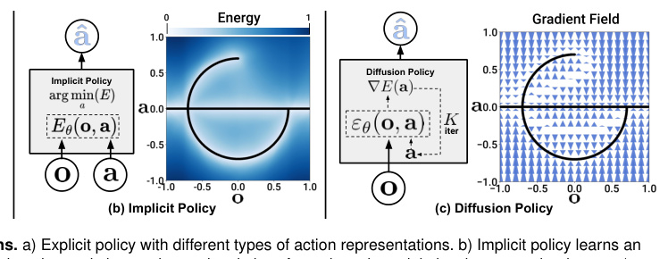

**1** **Introduction**

Policy learning from demonstration, in its simplest form, can
be formulated as the supervised regression task of learning to
map observations to actions. In practice however, the unique
nature of predicting robot actions — such as the existence
of multimodal distributions, sequential correlation, and the
requirement of high precision — makes this task distinct and
challenging compared to other supervised learning problems.

Prior work attempts to address this challenge by
exploring different _action representations_ (Fig 1 a) – using
mixtures of Gaussians Mandlekar et al. (2021), categorical
representations of quantized actions Shafiullah et al. (2022),
or by switching the _the policy representation_ (Fig 1 b) – from
explicit to implicit to better capture multi-modal distributions
Florence et al. (2021); Wu et al. (2020).

In this work, we seek to address this challenge by
introducing a new form of robot visuomotor policy that

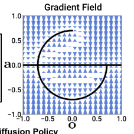

generates behavior via a “conditional denoising diffusion
process Ho et al. (2020) on robot action space”, **Diffusion**
**Policy** . In this formulation, instead of directly outputting
an action, the policy infers the action-score gradient,
conditioned on visual observations, for _K_ denoising
iterations (Fig. 1 c). This formulation allows robot policies
to inherit several key properties from diffusion models –
significantly improving performance.

   - **Expressing multimodal action distributions.** By
learning the gradient of the action score function
Song and Ermon (2019) and performing Stochastic
Langevin Dynamics sampling on this gradient field,
Diffusion policy can express arbitrary normalizable
distributions Neal et al. (2011), which includes multimodal action distributions, a well-known challenge
for policy learning.

2

   - **High-dimensional output space.** As demonstrated by
their impressive image generation results, diffusion
models have shown excellent scalability to highdimension output spaces. This property allows the
policy to jointly infer a _sequence_ of future actions
instead of _single-step_ actions, which is critical for
encouraging temporal action consistency and avoiding
myopic planning.

   - **Stable training.** Training energy-based policies often
requires negative sampling to estimate an intractable
normalization constant, which is known to cause
training instability Du et al. (2020); Florence et al.
(2021). Diffusion Policy bypasses this requirement
by learning the gradient of the energy function and
thereby achieves stable training while maintaining
distributional expressivity.

Our **primary contribution** is to bring the above
advantages to the field of robotics and demonstrate their
effectiveness on complex real-world robot manipulation
tasks. To successfully employ diffusion models for
visuomotor policy learning, we present the following
technical contributions that enhance the performance of
Diffusion Policy and unlock its full potential on physical
robots:

   - **Closed-loop action sequences.** We combine the
policy’s capability to predict high-dimensional action
sequences with _receding-horizon control_ to achieve
robust execution. This design allows the policy to
continuously re-plan its action in a closed-loop manner
while maintaining temporal action consistency –
achieving a balance between long-horizon planning
and responsiveness.

   - **Visual** **conditioning.** We introduce a visionconditioned diffusion policy, where the visual
observations are treated as conditioning instead of a
part of the joint data distribution. In this formulation,
the policy extracts the visual representation once
regardless of the denoising iterations, which
drastically reduces the computation and enables
real-time action inference.

   - **Time-series diffusion transformer.** We propose
a new transformer-based diffusion network that
minimizes the over-smoothing effects of typical
CNN-based models and achieves state-of-the-art
performance on tasks that require high-frequency
action changes and velocity control.

We systematically evaluate Diffusion Policy across **15**
tasks from **4** different benchmarks Florence et al. (2021);
Gupta et al. (2019); Mandlekar et al. (2021); Shafiullah
et al. (2022) under the behavior cloning formulation.
The evaluation includes both simulated and real-world
environments, 2DoF to 6DoF actions, single- and multi-task
benchmarks, and fully- and under-actuated systems, with
rigid and fluid objects, using demonstration data collected
by single and multiple users.
Empirically, we find **consistent** performance boost across
all benchmarks with an average improvement of 46.9%,

providing strong evidence of the effectiveness of Diffusion
Policy. We also provide detailed analysis to carefully
examine the characteristics of the proposed algorithm and
the impacts of the key design decisions.
This work is an extended version of the conference paper
Chi et al. (2023). We expand the content of this paper in the
following ways:

  - Include a new discussion section on the connections
between diffusion policy and control theory. See Sec.
4.5.

  - Include additional ablation studies in simulation on
alternative network architecture design and different
pretraining and finetuning paradigms, Sec. 5.4.

  - Extend the real-world experimental results with three
bimanual manipulation tasks including Egg Beater,
Mat Unrolling, and Shirt Folding in Sec. 7.

The code, data, and training details are publicly available
for reproducing our results diffusion-policy.cs.
columbia.edu.

**2** **Diffusion Policy Formulation**

We formulate visuomotor robot policies as Denoising
Diffusion Probabilistic Models (DDPMs) Ho et al. (2020).
Crucially, Diffusion policies are able to express complex
multimodal action distributions and possess stable training
behavior – requiring little task-specific hyperparameter
tuning. The following sections describe DDPMs in more
detail and explain how they may be adapted to represent
visuomotor policies.

_2.1_ _Denoising Diffusion Probabilistic Models_

DDPMs are a class of generative model where the output
generation is modeled as a denoising process, often called
Stochastic Langevin Dynamics Welling and Teh (2011).
Starting from **x** _[K]_ sampled from Gaussian noise, the DDPM
performs _K_ iterations of denoising to produce a series
of intermediate actions with decreasing levels of noise,
**x** _[k]_ _,_ **x** _[k][−]_ [1] _..._ **x** [0], until a desired noise-free output **x** [0] is formed.
The process follows the equation

**x** _[k][−]_ [1] = _α_ ( **x** _[k]_ _−_ _γεθ_ ( **x** _[k]_ _,_ _k_ )+ _N_ �0 _,_ _σ_ [2] _I_ �) _,_ (1)

where _εθ_ is the noise prediction network with parameters _θ_
that will be optimized through learning and _N_ �0 _,_ _σ_ [2] _I_ - is
Gaussian noise added at each iteration.
The above equation 1 may also be interpreted as a single
noisy gradient descent step:

**x** _[′]_ = **x** _−_ _γ_ ∇ _E_ ( **x** ) _,_ (2)

where the noise prediction network _εθ_ ( **x** _,_ _k_ ) effectively
predicts the gradient field ∇ _E_ ( **x** ), and _γ_ is the learning rate.
The choice of _α,_ _γ,_ _σ_ as functions of iteration step _k_, also
called noise schedule, can be interpreted as learning rate
scheduling in gradient decent process. An _α_ slightly smaller
than 1 has been shown to improve stability Ho et al. (2020).
Details about noise schedule will be discussed in Sec 3.3.

_Diffusion Policy_ 3

|Col1|a t|a t+1|a t+2|a t+3|Col6|Col7|
|---|---|---|---|---|---|---|
||at|at+1|at+2|at+3|||

**Figure 2. Diffusion Policy Overview** a) General formulation. At time step _t_, the policy takes the latest _To_ steps of observation
data _Ot_ as input and outputs _Ta_ steps of actions _At_ . b) In the CNN-based Diffusion Policy, FiLM (Feature-wise Linear Modulation)
Perez et al. (2018) conditioning of the observation feature _Ot_ is applied to every convolution layer, channel-wise. Starting from **A** _t_ _[K]_
drawn from Gaussian noise, the output of noise-prediction network _εθ_ is subtracted, repeating _K_ times to get **A** _t_ [0], the denoised
action sequence. c) In the Transformer-based Vaswani et al. (2017) Diffusion Policy, the embedding of observation **O** _t_ is passed
into a multi-head cross-attention layer of each transformer decoder block. Each action embedding is constrained to only attend to
itself and previous action embeddings (causal attention) using the attention mask illustrated.

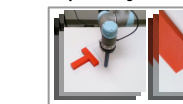

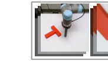

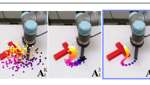

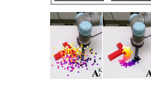

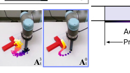

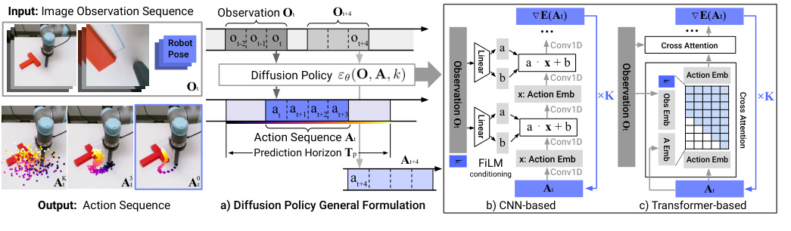

_2.2_ _DDPM Training_

The training process starts by randomly drawing unmodified
examples, **x** [0], from the dataset. For each sample, we
randomly select a denoising iteration _k_ and then sample a
random noise _ε_ _[k]_ with appropriate variance for iteration _k_ .
The noise prediction network is asked to predict the noise
from the data sample with noise added.

_L_ = _MSE_ ( _ε_ _[k]_ _,_ _εθ_ ( **x** [0] + _ε_ _[k]_ _,_ _k_ )) (3)

As shown in Ho et al. (2020), minimizing the loss function
in Eq 3 also minimizes the variational lower bound of the
KL-divergence between the data distribution _p_ ( **x** [0] ) and the
distribution of samples drawn from the DDPM _q_ ( **x** [0] ) using
Eq 1.

_2.3_ _Diffusion for Visuomotor Policy Learning_

While DDPMs are typically used for image generation ( **x**
is an image), we use a DDPM to learn robot visuomotor
policies. This requires two major modifications in the
formulation: 1. changing the output **x** to represent robot
actions. 2. making the denoising processes _conditioned_ on
input observation **O** _t_ . The following paragraphs discuss each
of the modifications, and Fig. 2 shows an overview.
**Closed-loop action-sequence prediction:** An effective
action formulation should encourage temporal consistency
and smoothness in long-horizon planning while allowing
prompt reactions to unexpected observations. To accomplish
this goal, we commit to the action-sequence prediction
produced by a diffusion model for a fixed duration before
replanning. Concretely, at time step _t_ the policy takes the
latest _To_ steps of observation data **O** _t_ as input and predicts
_Tp_ steps of actions, of which _Ta_ steps of actions are executed
on the robot without re-planning. Here, we define _To_ as
the observation horizon, _Tp_ as the action prediction horizon
and _Ta_ as the action execution horizon. This encourages
temporal action consistency while remaining responsive.
More details about the effects of _Ta_ are discussed in Sec 4.3.
Our formulation also allows receding horizon control Mayne
and Michalska (1988) to futher improve action smoothness
by warm-starting the next inference setup with previous
action sequence prediction.

**Visual observation conditioning:** We use a DDPM to
approximate the conditional distribution _p_ ( **A** _t_ _|_ **O** _t_ ) instead of
the joint distribution _p_ ( **A** _t_ _,_ **O** _t_ ) used in Janner et al. (2022a)
for planning. This formulation allows the model to predict
actions conditioned on observations without the cost of
inferring future states, speeding up the diffusion process and
improving the accuracy of generated actions. To capture the
conditional distribution _p_ ( **A** _t_ _|_ **O** _t_ ), we modify Eq 1 to:

**A** _t_ _[k][−]_ [1] = _α_ ( **A** _t_ _[k]_ _[−]_ _[γε][θ]_ [(] **[O]** _[t]_ _[,]_ **[A]** _t_ _[k][,]_ _[k]_ [)+] _[N]_ �0 _,_ _σ_ [2] _I_ �) (4)

The training loss is modified from Eq 3 to:

_L_ = _MSE_ ( _ε_ _[k]_ _,_ _εθ_ ( **O** _t_ _,_ **A** _t_ [0] [+] _[ε]_ _[k][,]_ _[k]_ [))] (5)

The exclusion of observation features **O** _t_ from the output
of the denoising process significantly improves inference
speed and better accommodates real-time control. It also
helps to make **end-to-end** training of the vision encoder
feasible. Details about the visual encoder are described in
Sec. 3.2.

**3** **Key Design Decisions**

In this section, we describe key design decisions for
Diffusion Policy as well as its concrete implementation of
_εθ_ with neural network architectures.

_3.1_ _Network Architecture Options_

The first design decision is the choice of neural network
architectures for _εθ_ . In this work, we examine two common
network architecture types, convolutional neural networks
(CNNs) Ronneberger et al. (2015) and Transformers
Vaswani et al. (2017), and compare their performance
and training characteristics. Note that the choice of noise
prediction network _εθ_ is independent of visual encoders,
which will be described in Sec. 3.2.
**CNN-based Diffusion Policy** We adopt the 1D temporal
CNN from Janner et al. (2022b) with a few modifications:
First, we only model the conditional distribution _p_ ( **A** _t_ _|_ **O** _t_ )
by conditioning the action generation process on observation
features **O** _t_ with Feature-wise Linear Modulation (FiLM)

4

Perez et al. (2018) as well as denoising iteration _k_, shown
in Fig 2 (b). Second, we only predict the action trajectory
instead of the concatenated observation action trajectory.
Third, we removed inpainting-based goal state conditioning
due to incompatibility with our framework utilizing a
receding prediction horizon. However, goal conditioning is
still possible with the same FiLM conditioning method used
for observations.

In practice, we found the CNN-based backbone to work
well on most tasks out of the box without the need for much
hyperparameter tuning. However, it performs poorly when
the desired action sequence changes quickly and sharply
through time (such as velocity command action space), likely
due to the inductive bias of temporal convolutions to prefer
low-frequency signals Tancik et al. (2020).

**Time-series diffusion transformer** To reduce the oversmoothing effect in CNN models Tancik et al. (2020), we
introduce a novel transformer-based DDPM which adopts
the transformer architecture from minGPT Shafiullah et al.
(2022) for action prediction. Actions with noise _At_ _[k]_ [are]
passed in as input tokens for the transformer decoder
blocks, with the sinusoidal embedding for diffusion iteration
_k_ prepended as the first token. The observation **O** _t_ is
transformed into observation embedding sequence by a
shared MLP, which is then passed into the transformer
decoder stack as input features. The “gradient” _εθ_ ( **Ot** _,_ **At** _[k]_ _,_ _k_ )
is predicted by each corresponding output token of the
decoder stack.

In our state-based experiments, most of the bestperforming policies are achieved with the transformer
backbone, especially when the task complexity and rate of
action change are high. However, we found the transformer
to be more sensitive to hyperparameters. The difficulty of
transformer training Liu et al. (2020) is not unique to
Diffusion Policy and could potentially be resolved in the
future with improved transformer training techniques or
increased data scale.

**Recommendations.** In general, we recommend starting
with the CNN-based diffusion policy implementation as the
first attempt at a new task. If performance is low due to task
complexity or high-rate action changes, then the Time-series
Diffusion Transformer formulation can be used to potentially
improve performance at the cost of additional tuning.

_3.2_ _Visual Encoder_

The visual encoder maps the raw image sequence into
a latent embedding _Ot_ and is trained end-to-end with
the diffusion policy. Different camera views use separate
encoders, and images in each timestep are encoded
independently and then concatenated to form _Ot_ . We used a
standard ResNet-18 (without pretraining) as the encoder with
the following modifications: 1) Replace the global average
pooling with a spatial softmax pooling to maintain spatial
information Mandlekar et al. (2021). 2) Replace BatchNorm
with GroupNorm Wu and He (2018) for stable training.
This is important when the normalization layer is used in
conjunction with Exponential Moving Average He et al.
(2020) (commonly used in DDPMs).

_3.3_ _Noise Schedule_

The noise schedule, defined by _σ_, _α_, _γ_ and the additive
Gaussian Noise _ε_ _[k]_ as functions of _k_, has been actively
studied Ho et al. (2020); Nichol and Dhariwal (2021).
The underlying noise schedule controls the extent to
which diffusion policy captures high and low-frequency
characteristics of action signals. In our control tasks, we
empirically found that the Square Cosine Schedule proposed
in iDDPM Nichol and Dhariwal (2021) works best for our
tasks.

_3.4_ _Accelerating Inference for Real-time_
_Control_

We use the diffusion process as the policy for robots; hence,
it is critical to have a fast inference speed for closed-loop
real-time control. The Denoising Diffusion Implicit Models
(DDIM) approach Song et al. (2021) decouples the number
of denoising iterations in training and inference, thereby
allowing the algorithm to use fewer iterations for inference
to speed up the process. In our real-world experiments,
using DDIM with 100 training iterations and 10 inference
iterations enables 0.1s inference latency on a Nvidia 3080
GPU.

**4** **Intriguing Properties of Diffusion Policy**

In this section, we provide some insights and intuitions about
diffusion policy and its advantages over other forms of policy
representations.

_4.1_ _Model Multi-Modal Action Distributions_

The challenge of modeling multi-modal distribution in
human demonstrations has been widely discussed in
behavior cloning literature Florence et al. (2021); Shafiullah
et al. (2022); Mandlekar et al. (2021). Diffusion Policy’s
ability to express multimodal distributions naturally and
precisely is one of its key advantages.
Intuitively, multi-modality in action generation for
diffusion policy arises from two sources – an underlying
stochastic sampling procedure and a stochastic initialization.
In Stochastic Langevin Dynamics, an initial sample **A** _t_ _[K]_ [is]
drawn from standard Gaussian at the beginning of each
sampling process, which helps specify different possible
convergence basins for the final action prediction **A** _t_ [0][. This]
action is then further stochastically optimized, with added
Gaussian perturbations across a large number of iterations,
which enables individual action samples to converge and
move between different multi-modal action basins. Fig. 3,
shows an example of the Diffusion Policy’s multimodal
behavior in a planar pushing task (Push T, introduced below)
without explicit demonstration for the tested scenario.

_4.2_ _Synergy with Position Control_

We find that Diffusion Policy with a position-control
action space consistently outperforms Diffusion Policy with
velocity control, as shown in Fig 4. This surprising result
stands in contrast to the majority of recent behavior cloning
work that generally relies on velocity control Mandlekar
et al. (2021); Shafiullah et al. (2022); Zhang et al. (2018);
Florence et al. (2019); Mandlekar et al. (2020b,a). We

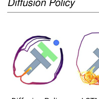

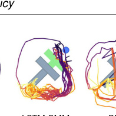

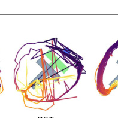

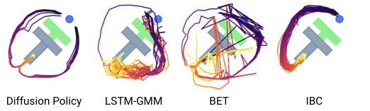

**Figure 3.** **Multimodal behavior.** At the given state, the
end-effector (blue) can either go left or right to push the block.
**Diffusion Policy** learns both modes and commits to only one
mode within each rollout. In contrast, both **LSTM-GMM**
Mandlekar et al. (2021) and **IBC** Florence et al. (2021) are
biased toward one mode, while **BET** Shafiullah et al. (2022) fails
to commit to a single mode due to its lack of temporal action
consistency. Actions generated by rolling out 40 steps for the
best-performing checkpoint.

speculate that there are two primary reasons for this
discrepancy: First, action multimodality is more pronounced
in position-control mode than it is when using velocity
control. Because Diffusion Policy better expresses action
multimodality than existing approaches, we speculate that
it is inherently less affected by this drawback than existing
methods. Furthermore, position control suffers less than
velocity control from compounding error effects and is thus
more suitable for action-sequence prediction (as discussed in
the following section). As a result, Diffusion Policy is both
less affected by the primary drawbacks of position control
and is better able to exploit position control’s advantages.

|Velocity vs Positional Control|Col2|Col3|Col4|Col5|Col6|
|---|---|---|---|---|---|
|Square Kitchen p4 0.25 0.00 0.25 0.50 0.75 1.00   Velocity vs Positional Control LSTM~~-~~GMM ~~BET~~ DiffusionPolicy~~-~~C ~~DiffusionPolicy-T~~|Square Kitchen p4 0.25 0.00 0.25 0.50 0.75 1.00   Velocity vs Positional Control LSTM~~-~~GMM ~~BET~~ DiffusionPolicy~~-~~C ~~DiffusionPolicy-T~~|Square Kitchen p4 0.25 0.00 0.25 0.50 0.75 1.00   Velocity vs Positional Control LSTM~~-~~GMM ~~BET~~ DiffusionPolicy~~-~~C ~~DiffusionPolicy-T~~|Square Kitchen p4 0.25 0.00 0.25 0.50 0.75 1.00   Velocity vs Positional Control LSTM~~-~~GMM ~~BET~~ DiffusionPolicy~~-~~C ~~DiffusionPolicy-T~~|Square Kitchen p4 0.25 0.00 0.25 0.50 0.75 1.00   Velocity vs Positional Control LSTM~~-~~GMM ~~BET~~ DiffusionPolicy~~-~~C ~~DiffusionPolicy-T~~|Square Kitchen p4 0.25 0.00 0.25 0.50 0.75 1.00   Velocity vs Positional Control LSTM~~-~~GMM ~~BET~~ DiffusionPolicy~~-~~C ~~DiffusionPolicy-T~~|
|Square Kitchen p4 0.25 0.00 0.25 0.50 0.75 1.00   Velocity vs Positional Control LSTM~~-~~GMM ~~BET~~ DiffusionPolicy~~-~~C ~~DiffusionPolicy-T~~||LSTM~~-~~GMM ~~BET~~|LSTM~~-~~GMM ~~BET~~|||
|Square Kitchen p4 0.25 0.00 0.25 0.50 0.75 1.00   Velocity vs Positional Control LSTM~~-~~GMM ~~BET~~ DiffusionPolicy~~-~~C ~~DiffusionPolicy-T~~||DiffusionPolicy~~-~~C |DiffusionPolicy~~-~~C |||
|Square Kitchen p4 0.25 0.00 0.25 0.50 0.75 1.00   Velocity vs Positional Control LSTM~~-~~GMM ~~BET~~ DiffusionPolicy~~-~~C ~~DiffusionPolicy-T~~|~~DiffusionPolicy-T~~|~~DiffusionPolicy-T~~|~~DiffusionPolicy-T~~|~~DiffusionPolicy-T~~|~~DiffusionPolicy-T~~|
|Square Kitchen p4 0.25 0.00 0.25 0.50 0.75 1.00   Velocity vs Positional Control LSTM~~-~~GMM ~~BET~~ DiffusionPolicy~~-~~C ~~DiffusionPolicy-T~~||||||
|Square Kitchen p4 0.25 0.00 0.25 0.50 0.75 1.00   Velocity vs Positional Control LSTM~~-~~GMM ~~BET~~ DiffusionPolicy~~-~~C ~~DiffusionPolicy-T~~||||||
|Square Kitchen p4 0.25 0.00 0.25 0.50 0.75 1.00   Velocity vs Positional Control LSTM~~-~~GMM ~~BET~~ DiffusionPolicy~~-~~C ~~DiffusionPolicy-T~~||||||
|Square Kitchen p4 0.25 0.00 0.25 0.50 0.75 1.00   Velocity vs Positional Control LSTM~~-~~GMM ~~BET~~ DiffusionPolicy~~-~~C ~~DiffusionPolicy-T~~|||uare Kit|uare Kit|hen p4|

**Figure 4. Velocity v.s. Position Control.** The performance
difference when switching from velocity to position control.
While both BCRNN and BET performance decrease, Diffusion
Policy is able to leverage the advantage of position and improve
its performance.

_4.3_ _Benefits of Action-Sequence Prediction_

Sequence prediction is often avoided in most policy learning
methods due to the difficulties in effectively sampling from
high-dimensional output spaces. For example, IBC would
struggle in effectively sampling high-dimensional action
space with a non-smooth energy landscape. Similarly, BCRNN and BET would have difficulty specifying the number
of modes that exist in the action distribution (needed for
GMM or k-means steps).
In contrast, DDPM scales well with output dimensions
without sacrificing the expressiveness of the model, as
demonstrated in many image generation applications.
Leveraging this capability, Diffusion Policy represents action
in the form of a high-dimensional action sequence, which
naturally addresses the following issues:

drawn from different modes, resulting in jittery actions that
alternate between the two valid trajectories.

- **Robustness to idle actions** : Idle actions occur when
a demonstration is paused and results in sequences of
identical positional actions or near-zero velocity actions.
It is common during teleoperation and is sometimes
required for tasks like liquid pouring. However, singlestep policies can easily overfit to this pausing behavior.
For example, BC-RNN and IBC often get stuck in realworld experiments when the idle actions are not explicitly
removed from training.

|.0 .1 .2 .3 .4 .5 .6 1 2 4 8 16 32 64 128 Action Horizon (steps)|Col2|Col3|Col4|Col5|Col6|Col7|Col8|Col9|Col10|
|---|---|---|---|---|---|---|---|---|---|
|1 2 4 8 16 32 64 128 Action Horizon (steps) .0 .1 .2 .3 .4 .5 .6 ||||||||||
|1 2 4 8 16 32 64 128 Action Horizon (steps) .0 .1 .2 .3 .4 .5 .6 ||||||||||
|1 2 4 8 16 32 64 128 Action Horizon (steps) .0 .1 .2 .3 .4 .5 .6 ||||||||||
|1 2 4 8 16 32 64 128 Action Horizon (steps) .0 .1 .2 .3 .4 .5 .6 ||||||||||
|1 2 4 8 16 32 64 128 Action Horizon (steps) .0 .1 .2 .3 .4 .5 .6 ||||||||||

|Col1|Col2|Col3|Col4|Col5|Col6|Col7|Col8|Col9|
|---|---|---|---|---|---|---|---|---|
||||||||||
||||||||||
||||||||||
||||||||||
||||||||||
|0 1 2 3 4 5 6 7 Latency (steps)|0 1 2 3 4 5 6 7 Latency (steps)|0 1 2 3 4 5 6 7 Latency (steps)|0 1 2 3 4 5 6 7 Latency (steps)|0 1 2 3 4 5 6 7 Latency (steps)|0 1 2 3 4 5 6 7 Latency (steps)|0 1 2 3 4 5 6 7 Latency (steps)|0 1 2 3 4 5 6 7 Latency (steps)|0 1 2 3 4 5 6 7 Latency (steps)|

**Figure 5. Diffusion Policy Ablation Study.** Change
(difference) in success rate relative to the maximum for each
task is shown on the Y-axis. **Left** : trade-off between temporal
consistency and responsiveness when selecting the action
horizon. **Right** : Diffusion Policy with position control is robust
against latency. Latency is defined as the number of steps
between the last frame of observations to the first action that
can be executed.

_4.4_ _Training Stability_

While IBC, in theory, should possess similar advantages
as diffusion policies. However, achieving reliable and highperformance results from IBC in practice is challenging
due to IBC’s inherent training instability Ta et al.
(2022). Fig 6 shows training error spikes and unstable
evaluation performance throughout the training process,
making hyperparameter turning critical and checkpoint
selection difficult. As a result, Florence et al. (2021)
evaluate every checkpoint and report results for the bestperforming checkpoint. In a real-world setting, this workflow
necessitates the evaluation of many policies on hardware to
select a final policy. Here, we discuss why Diffusion Policy
appears significantly more stable to train.
An implicit policy represents the action distribution using
an Energy-Based Model (EBM):

_pθ_ ( **a** _|_ **o** ) = _[e]_ _Z_ _[−]_ ( _[E]_ **o** _[θ]_ _,_ [ (] _θ_ **[o]** _[,]_ **[a]** ) [)] (6)

where _Z_ ( **o** _,_ _θ_ ) is an intractable normalization constant (with
respect to **a** ).

6

To train the EBM for implicit policy, an InfoNCE-style
loss function is used, which equates to the negative loglikelihood of Eq 6:

_e_ _[−][E][θ]_ [ (] **[o]** _[,]_ **[a]** [)]
_LinfoNCE_ = _−_ log( _e_ _[−][E][θ]_ [ (] **[o]** _[,]_ **[a]** [)] + ∑ _Nj_ = _neg_ 1 _[e][−][E][θ]_ [ (] **[o]** _[,]_ [�] **[a]** _[ j]_ [)] [)] (7)

where a set of negative samples _{_ - **a** _[j]_ _}_ _[N]_ _j_ = _[neg]_ 1 [are used to estimate]
the intractable normalization constant _Z_ ( **o** _,_ _θ_ ). In practice,
the inaccuracy of negative sampling is known to cause
training instability for EBMs Du et al. (2020); Ta et al.
(2022).
Diffusion Policy and DDPMs sidestep the issue of
estimating _Z_ ( **a** _,_ _θ_ ) altogether by modeling the **score**
**function** Song and Ermon (2019) of the same action
distribution in Eq 6:

∇ **a** log _p_ ( **a** _|_ **o** ) = _−_ ∇ **a** _Eθ_ ( **a** _,_ **o** ) _−_ ∇ **a** log _Z_ ( **o** _,_ _θ_ )

~~�~~ ~~��~~               =0

_≈−εθ_ ( **a** _,_ **o** )

(8)
where the noise-prediction network _εθ_ ( **a** _,_ **o** ) is approximating the negative of the score function ∇ **a** log _p_ ( **a** _|_ **o** ) Liu
et al. (2022), which is independent of the normalization
constant _Z_ ( **o** _,_ _θ_ ). As a result, neither the inference (Eq 4)
nor training (Eq 5) process of Diffusion Policy involves
evaluating _Z_ ( **o** _,_ _θ_ ), thus making Diffusion Policy training
more stable.

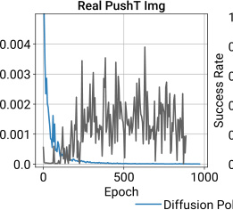

|Col1|Col2|
|---|---|
|||
|||
|||
|||

|Sim PushT State .0 .8 .6 .4 .2 .0 0 500 1000 Epoch licy IBC|Col2|Col3|ushT State|Col5|
|---|---|---|---|---|
|0 500 1000 Epoch .0 .2 .4 .6 .8 .0 Sim PushT State  icy IBC|||||
|0 500 1000 Epoch .0 .2 .4 .6 .8 .0 Sim PushT State  icy IBC|||||
|0 500 1000 Epoch .0 .2 .4 .6 .8 .0 Sim PushT State  icy IBC|||||
|0 500 1000 Epoch .0 .2 .4 .6 .8 .0 Sim PushT State  icy IBC|||||
|0 500 1000 Epoch .0 .2 .4 .6 .8 .0 Sim PushT State  icy IBC|||||

**Figure 6. Training Stability.** Left: IBC fails to infer training
actions with increasing accuracy despite smoothly decreasing
training loss for energy function. Right: IBC’s evaluation success
rate oscillates, making checkpoint selection difficult (evaluated
using policy rollouts in simulation).

_4.5_ _Connections to Control Theory_

Diffusion Policy has a simple limiting behavior when the
tasks are very simple; this potentially allows us to bring
to bear some rigorous understanding from control theory.
Consider the case where we have a linear dynamical system,
in standard state-space form, that we wish to control:

**s** _t_ +1 = **As** _t_ + **Ba** _t_ + **w** _t_ _,_ **w** _t ∼_ _N_ (0 _,_ Σ _w_ ) _._

Now imagine we obtain demonstrations (rollouts) from a
linear feedback policy: **a** _t_ = _−_ **Ks** _t_ _._ This policy could be
obtained, for instance, by solving a linear optimal control
problem like the Linear Quadratic Regulator. Imitating this
policy does not need the modeling power of diffusion, but
as a sanity check, we can see that Diffusion Policy does the
right thing.

In particular, when the prediction horizon is one time
step, _Tp_ = 1, it can be seen that the optimal denoiser which
minimizes

_L_ = _MSE_ ( _ε_ _[k]_ _,_ _εθ_ ( **s** _t_ _,_ _−_ **Ks** _t_ + _ε_ _[k]_ _,_ _k_ )) (9)

is given by

_εθ_ ( **s** _,_ **a** _,_ _k_ ) = [1] [ **a** + **Ks** ] _,_

_σk_

where _σk_ is the variance on denoising iteration _k_ .
Furthermore, at inference time, the DDIM sampling will
converge to the global minima at **a** = _−_ **Ks** _._
Trajectory prediction ( _Tp >_ 1) follows naturally. In order
to predict **a** _t_ + _t′_ as a function of **s** _t_, the optimal denoiser will
produce **a** _t_ + _t′_ = _−_ **K** ( **A** _−_ **BK** ) _[t][′]_ **s** _t_ ; all terms involving **w** _t_ are
zero in expectation. This shows that in order to perfectly
clone a behavior that depends on the state, the learner
must implicitly learn a (task-relevant) dynamics model
Subramanian and Mahajan (2019); Zhang et al. (2020).
Note that if either the plant or the policy is nonlinear, then
predicting future actions could become significantly more
challenging and once again involve multimodal predictions.

**5** **Evaluation**

We systematically evaluate Diffusion Policy on 15 tasks
from 4 benchmarks Florence et al. (2021); Gupta et al.
(2019); Mandlekar et al. (2021); Shafiullah et al. (2022).
This evaluation suite includes both simulated and real
environments, single and multiple task benchmarks, fully
actuated and under-actuated systems, and rigid and
fluid objects. We found Diffusion Policy to consistently
outperform the prior state-of-the-art on all of the tested
benchmarks, with an average success-rate improvement of
46.9%. In the following sections, we provide an overview of
each task, our evaluation methodology on that task, and our
key takeaways.

_5.1_ _Simulation Environments and datasets_

**Robomimic** Mandlekar et al. (2021) is a large-scale
robotic manipulation benchmark designed to study imitation
learning and offline RL. The benchmark consists of 5 tasks
with a proficient human (PH) teleoperated demonstration
dataset for each and mixed proficient/non-proficient human
(MH) demonstration datasets for 4 of the tasks (9 variants
in total). For each variant, we report results for both stateand image-based observations. Properties for each task are
summarized in Tab 3.
**Push-T** adapted from IBC Florence et al. (2021), requires
pushing a T-shaped block (gray) to a fixed target (red)
with a circular end-effector (blue)s. Variation is added by
random initial conditions for T block and end-effector. The
task requires exploiting complex and contact-rich object
dynamics to push the T block precisely, using point contacts.
There are two variants: one with RGB image observations
and another with 9 2D keypoints obtained from the groundtruth pose of the T block, both with proprioception for endeffector location.
**Multimodal Block Pushing** adapted from BET Shafiullah
et al. (2022), this task tests the policy’s ability to model
multimodal action distributions by pushing two blocks

Lift Can Square Transport ToolHang Push-T
ph mh ph mh ph mh ph mh ph ph

LSTM-GMM **1.00** /0.96 **1.00** /0.93 **1.00** /0.91 **1.00** /0.81 0.95/0.73 0.86/0.59 0.76/0.47 0.62/0.20 0.67/0.31 0.67/0.61
IBC 0.79/0.41 0.15/0.02 0.00/0.00 0.01/0.01 0.00/0.00 0.00/0.00 0.00/0.00 0.00/0.00 0.00/0.00 0.90/0.84
BET **1.00** /0.96 **1.00** /0.99 **1.00** /0.89 **1.00** /0.90 0.76/0.52 0.68/0.43 0.38/0.14 0.21/0.06 0.58/0.20 0.79/0.70

DiffusionPolicy-C **1.00** /0.98 **1.00** /0.97 **1.00** /0.96 **1.00** / **0.96 1.00** / **0.93 0.97** / **0.82** 0.94/0.82 **0.68** / **0.46** 0.50/0.30 0.95/ **0.91**
DiffusionPolicy-T **1.00** / **1.00 1.00** / **1.00 1.00** / **1.00 1.00** /0.94 **1.00** /0.89 0.95/0.81 **1.00** / **0.84** 0.62/0.35 **1.00** / **0.87** **0.95** /0.79

**Table 1. Behavior Cloning Benchmark (State Policy)** We present success rates with different checkpoint selection methods in
the format of (max performance) / (average of last 10 checkpoints), with each averaged across 3 training seeds and 50 different
environment initial conditions (150 in total). LSTM-GMM corresponds to BC-RNN in RoboMimicMandlekar et al. (2021), which we
reproduced and obtained slightly better results than the original paper. Our results show that Diffusion Policy significantly improves
state-of-the-art performance across the board.

Lift Can Square Transport ToolHang Push-T
ph mh ph mh ph mh ph mh ph ph

LSTM-GMM **1.00** /0.96 **1.00** /0.95 **1.00** /0.88 0.98/0.90 0.82/0.59 0.64/0.38 0.88/0.62 0.44/0.24 0.68/0.49 0.69/0.54
IBC 0.94/0.73 0.39/0.05 0.08/0.01 0.00/0.00 0.03/0.00 0.00/0.00 0.00/0.00 0.00/0.00 0.00/0.00 0.75/0.64
DiffusionPolicy-C **1.00** / **1.00 1.00** / **1.00 1.00** /0.97 **1.00** /0.96 0.98/ **0.92 0.98** / **0.84 1.00** / **0.93 0.89** / **0.69** **0.95** / **0.73** **0.91** / **0.84**
DiffusionPolicy-T **1.00** / **1.00 1.00** /0.99 **1.00** / **0.98 1.00** / **0.98 1.00** /0.90 0.94/0.80 0.98/0.81 0.73/0.50 0.76/0.47 0.78/0.66

**Table 2. Behavior Cloning Benchmark (Visual Policy)** Performance are reported in the same format as in Tab 1. LSTM-GMM
numbers were reproduced to get a complete evaluation in addition to the best checkpoint performance reported. Diffusion Policy
shows consistent performance improvement, especially for complex tasks like Transport and ToolHang.

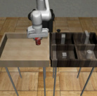

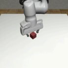

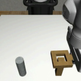

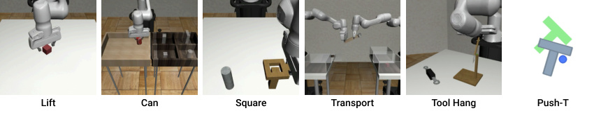

Task # Rob # Obj ActD #PH #MH Steps Img? HiPrec

Simulation Benchmark

Lift 1 1 7 200 300 400 Yes No
Can 1 1 7 200 300 400 Yes No
Square 1 1 7 200 300 400 Yes Yes
Transport 2 3 14 200 300 700 Yes No
ToolHang 1 2 7 200 0 700 Yes Yes

Push-T 1 1 2 200 0 300 Yes Yes

BlockPush 1 2 2 0 0 350 No No

Kitchen 1 7 9 656 0 280 No No

Realworld Benchmark

Push-T 1 1 2 136 0 600 Yes Yes
6DoF Pour 1 liquid 6 90 0 600 Yes No
Peri Spread 1 liquid 6 90 0 600 Yes No
Mug Flip 1 1 7 250 0 600 Yes No

**Table 3. Tasks Summary.** # Rob: number of robots, #Obj:
number of objects, ActD: action dimension, PH:
proficient-human demonstration, MH: multi-human
demonstration, Steps: max number of rollout steps, HiPrec:
whether the task has a high precision requirement. BlockPush
uses 1000 episodes of scripted demonstrations.

into two squares in any order. The demonstration data is
generated by a scripted oracle with access to groundtruth
state info. This oracle randomly selects an initial block
to push and moves it to a randomly selected square. The
remaining block is then pushed into the remaining square.
This task contains **long-horizon** multimodality that can not

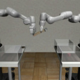

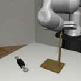

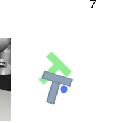

be modeled by a single function mapping from observation
to action.
**Franka Kitchen** is a popular environment for evaluating
the ability of IL and Offline-RL methods to learn multiple
long-horizon tasks. Proposed in Relay Policy Learning
Gupta et al. (2019), the Franka Kitchen environment
contains 7 objects for interaction and comes with a
human demonstration dataset of 566 demonstrations, each
completing 4 tasks in arbitrary order. The goal is to
execute as many demonstrated tasks as possible, regardless
of order, showcasing both short-horizon and long-horizon
multimodality.

_5.2_ _Evaluation Methodology_

We present the **best-performing** **for** **each** **baseline**
**method** on each benchmark from all possible sources –
our reproduced result (LSTM-GMM) or original number
reported in the paper (BET, IBC). We report results from the
average of the last 10 checkpoints (saved every 50 epochs)
across **3** training seeds and **50** environment initializations

- (an average of **1500** experiments in total). The metric for
most tasks is success rate, except for the Push-T task, which
uses target area coverage. In addition, we report the average

_∗_ Due to a bug in our evaluation code, only 22 environment initializations
are used for robomimic tasks. This does not change our conclusion since all
baseline methods are evaluated in the same way.

8

BlockPush Kitchen
p1 p2 p1 p2 p3 p4

LSTM-GMM 0.03 0.01 **1.00** 0.90 0.74 0.34
IBC 0.01 0.00 0.99 0.87 0.61 0.24
BET 0.96 0.71 0.99 0.93 0.71 0.44
DiffusionPolicy-C 0.36 0.11 **1.00** **1.00** **1.00** **0.99**
DiffusionPolicy-T **0.99** **0.94** **1.00** 0.99 0.99 0.96

**Table 4. Multi-Stage Tasks (State Observation)** . For
PushBlock, _px_ is the frequency of pushing _x_ blocks into the
targets. For Kitchen, _px_ is the frequency of interacting with _x_ or
more objects (e.g. bottom burner). Diffusion Policy performs
better, especially for difficult metrics such as _p_ 2 for Block
Pushing and _p_ 4 for Kitchen, as demonstrated by our results.

of best-performing checkpoints for robomimic and PushT tasks to be consistent with the evaluation methodology
of their respective original papers Mandlekar et al. (2021);
Florence et al. (2021). All state-based tasks are trained for
4500 epochs, and image-based tasks for 3000 epochs. Each
method is evaluated with its best-performing action space:
position control for Diffusion Policy and velocity control
for baselines (the effect of action space will be discussed
in detail in Sec 5.3). The results from these simulation
benchmarks are summarized in Table 1 and Table 2.

_5.3_ _Key Findings_

Diffusion Policy outperforms alternative methods on all tasks
and variants, with both state and vision observations, in
our simulation benchmark study (Tabs 1, 2 and 4) with an
average improvement of 46.9%. The following paragraphs
summarize the key takeaways.
**Diffusion Policy can express short-horizon multi-**
**modality.** We define short-horizon action multimodality as
multiple ways of achieving **the same immediate goal**, which
is prevalent in human demonstration data Mandlekar et al.
(2021). In Fig 3, we present a case study of this type of shorthorizon multimodality in the Push-T task. Diffusion Policy
learns to approach the contact point equally likely from left
or right, while LSTM-GMM Mandlekar et al. (2021) and
IBC Florence et al. (2021) exhibit bias toward one side and
BET Shafiullah et al. (2022) cannot commit to one mode.
**Diffusion Policy can express long-horizon multimodal-**
**ity.** Long-horizon multimodality is the completion of **differ-**
**ent sub-goals** in inconsistent order. For example, the order of
pushing a particular block in the Block Push task or the order
of interacting with 7 possible objects in the Kitchen task are
arbitrary. We find that Diffusion Policy copes well with this
type of multimodality; it outperforms baselines on both tasks
by a large margin: 32% improvement on Block Push’s p2
metric and 213% improvement on Kitchen’s p4 metric.
**Diffusion Policy can better leverage position control.**
Our ablation study (Fig. 4) shows that selecting position

control as the diffusion-policy action space significantly
outperformed velocity control. The baseline methods we
evaluate, however, work best with velocity control (and this
is reflected in the literature where most existing work reports
using velocity-control action spaces Mandlekar et al. (2021);
Shafiullah et al. (2022); Zhang et al. (2018); Florence et al.
(2019); Mandlekar et al. (2020b,a)).

**The tradeoff in action horizon.** As discussed in Sec
4.3, having an action horizon greater than 1 helps the
policy predict consistent actions and compensate for idle
portions of the demonstration, but too long a horizon reduces
performance due to slow reaction time. Our experiment
confirms this trade-off (Fig. 5 left) and found the action
horizon of 8 steps to be optimal for most tasks that we tested.

**Robustness against latency.** Diffusion Policy employs
receding horizon position control to predict a sequence
of actions into the future. This design helps address the
latency gap caused by image processing, policy inference,
and network delay. Our ablation study with simulated
latency showed Diffusion Policy is able to maintain peak
performance with latency up to 4 steps (Fig 5). We also find
that velocity control is more affected by latency than position
control, likely due to compounding error effects.

**Diffusion Policy is stable to train.** We found that the
optimal hyperparameters for Diffusion Policy are mostly
consistent across tasks. In contrast, IBC Florence et al.
(2021) is prone to training instability. This property is
discussed in Sec 4.4.

_5.4_ _Ablation Study_

We explore alternative vision encoder design decisions
on the simulated robomimic square task. Specifically, we
evaluated 3 different architectures: ResNet-18, ResNet-34
He et al. (2016) and ViT-B/16 Dosovitskiy et al. (2020).
For each architecture, we evaluated 3 different training
strategies: training end-to-end from scratch, using frozen
pre-trained vision encoder, and finetuning pre-trained vision
encoders (with 10x lower learning rate with respect to the
policy network). We use ImageNet-21k Ridnik et al. (2021)
pretraining for ResNet and CLIP Radford et al. (2021)
pretraining for ViT-B/16. The quantitative comparison on
square task with proficient-human (PH) dataset is shown in
Tab. 5.

We found training ViT from scratch to be challenging
(with only 22% success rate), likely due to the limited
amount data. We also found training with frozen pretrained
vision encoder to yield poor performance, which indicates
that diffusion policy prefers different vision representation
than what is offered in popular pretraining methods.
However, we found finetuning the pretrained vision encoder
with a small learning rate (10x smaller vs diffusion
policy network) gives the best performance overall. This
is especially true for the CLIP-trained ViT-B/16, which
reaches 98% success rate with only 50 epochs of training.
Overall, the best performance across different architectures
is not large, despite their significant theoretical capacity gap.
We anticipate that their performance gap could be more
pronounced on a complex task.

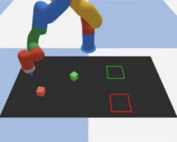

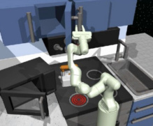

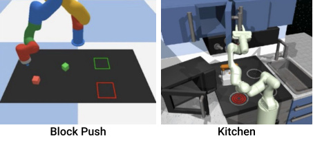
_Diffusion Policy_ 9

Archicture & From Pretrained
Prertain Datset Scatch frozen finetuning

Resnet18 (in21) 0.94 0.58 0.92
Resnet34 (in21) 0.92 0.40 0.94
ViT-base (clip) 0.22 0.70 0.98

**Table 5. Vision Encoder Comparison** All models are trained
on the robomimic square (ph) task using CNN-based diffusion
policy. Each model is trained for 500 epochs and evaluated
every 50 epochs under 50 different environment initial
conditions.

IoU 0.84 0.14 0.19 0.24 0.25 0.53 0.24 0.66 **0.80**
Succ% 1.00 0.00 0.00 0.20 0.10 0.65 0.15 0.80 **0.95**
Dur. 20.3 56.3 41.6 47.3 51.7 57.5 55.8 31.7 **22.9**

**Table 6. Realworld Push-T Experiment.** a) Hardware setup.
b) Illustration of the task. The robot needs to 1 _⃝_ precisely push
the T-shaped block into the target region, **and** 2 _⃝_ move the
end-effector to the end-zone. c) The ground truth end state
used to calculate IoU metrics used in this table. Table: Success
is defined by the end-state IoU greater than the minimum IoU in
the demonstration dataset. Average episode duration presented
in seconds. T-E2E stands for end-to-end trained
Transformer-based Diffusion Policy

**6** **Realworld Evaluation**

We evaluated Diffusion Policy in the realworld performance
on 4 tasks across 2 hardware setups – with training data from
different demonstrators for each setup. On the realworld
Push-T task, we perform ablations examining Diffusion
Policy on 2 architecture options and 3 visual encoder options;
we also benchmarked against 2 baseline methods with
both position-control and velocity-control action spaces.
On all tasks, Diffusion Policy variants with both CNN
backbones and end-to-end-trained visual encoders yielded
the best performance. More details about the task setup and
parameters may be found in supplemental materials.

_6.1_ _Realworld Push-T Task_

Real-world Push-T is significantly harder than the simulated
version due to 3 modifications: 1. The real-world Push-T
task is **multi-stage** . It requires the robot to 1 _⃝_ push the
T block into the target and then 2 _⃝_ move its end-effector
into a designated end-zone to avoid occlusion. 2. The policy
needs to make fine adjustments to make sure the T is fully
in the goal region before heading to the end-zone, creating
additional short-term multimodality. 3. The IoU metric is

measured at the **last step** instead of taking the maximum over
all steps. We threshold success rate by the minimum achieved
IoU metric from the human demonstration dataset. Our UR5based experiment setup is shown in Fig 6. Diffusion Policy
predicts robot commands at 10 Hz and these commands then
linearly interpolated to 125 Hz for robot execution.
**Result Analysis.** Diffusion Policy performed close to
human level with 95% success rate and 0.8 v.s. 0.84
average IoU, compared with the 0% and 20% success rate
of best-performing IBC and LSTM-GMM variants. Fig 7
qualitatively illustrates the behavior for each method starting

Deng et al. (2009) and R3MNair et al. (2022)), as seen in
Tab. 6. Diffusion Policy with R3M achieves an 80% success
rate but predicts jittery actions and is more likely to get stuck
compared to the end-to-end trained version. Diffusion Policy
with ImageNet showed less promising results with abrupt
actions and poor performance. We found that end-to-end
training is still the most effective way to incorporate visual
observation into Diffusion Policy, and our best-performing
models were all end-to-end trained.
**Robustness against perturbation** Diffusion Policy’s
robustness against visual and physical perturbations was
evaluated in a separate episode from experiments in Tab
6. As shown in Fig 8, three types of perturbations are
applied. 1) The front camera was blocked for 3 secs by a
waving hand (left column), but the diffusion policy, despite
exhibiting some jitter, remained on-course and pushed the
T block into position. 2) We shifted the T block while
Diffusion Policy was making fine adjustments to the T
block’s position. Diffusion policy immediately re-planned
to push from the opposite direction, negating the impact of
perturbation. 3) We moved the T block while the robot was
en route to the end-zone after the first stage’s completion.
The Diffusion Policy immediately changed course to adjust
the T block back to its target and then continued to the endzone. This experiment indicates that Diffusion Policy may
be able to **synthesize novel behavior** in response to unseen
observations.

_6.2_ _Mug Flipping Task_

The mug flipping task is designed to test Diffusion Policy’s
ability to handle complex **3D rotations** while operating close
to the hardware’s kinematic limits. The goal is to reorient a
randomly placed mug to have 1 _⃝_ the lip facing down 2 _⃝_ the
handle pointing left, as shown in Fig. 9. Depending on the
mug’s initial pose, the demonstrator might directly place the
mug in desired orientation, or may use additional push of the

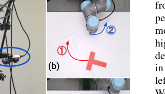

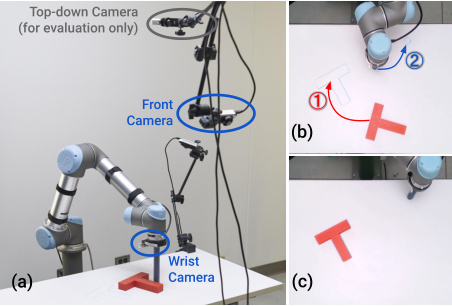

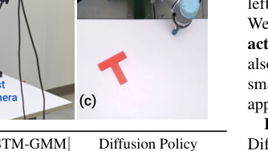

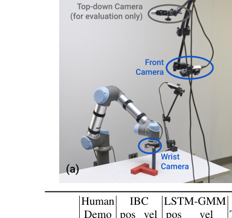
10

of captured behaviors is best appreciated with the video.
Although never demonstrated, the policy is also able to
sequence multiple pushes for handle alignment or regrasps
for dropped mug when necessary. For comparison, we also
train a LSTM-GMM policy trained with a subset of the same
data. For 20 in-distribution initial conditions, the LSTMGMM policy never aligns properly with respect to the mug,
and fails to grasp in all trials.

Avg of End States

|Col1|A|
|---|---|
|**C**|**C**|
|**D**|**D**|

nominal circle at the center of the pizza dough (illustrated
by the green circle in Fig 10). The goal for the **periodic**
**spreading task** is to spread sauce on pizza dough, with
performance measured by sauce coverage. Variations across
evaluation episodes come from random locations for the
dough and the sauce bowl. The success rate is computed by
thresholding with minimum human performance. Results are
best viewed in supplemental videos. Both tasks were trained

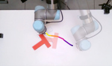

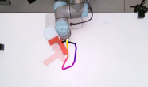

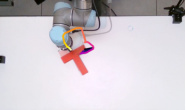

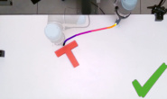

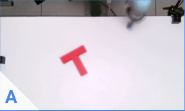

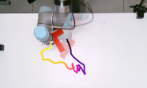

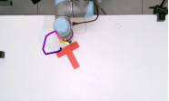

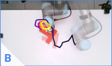

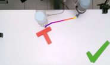

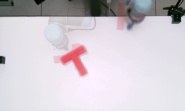

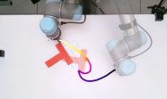

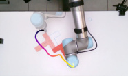

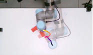

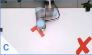

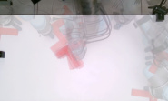

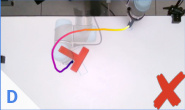

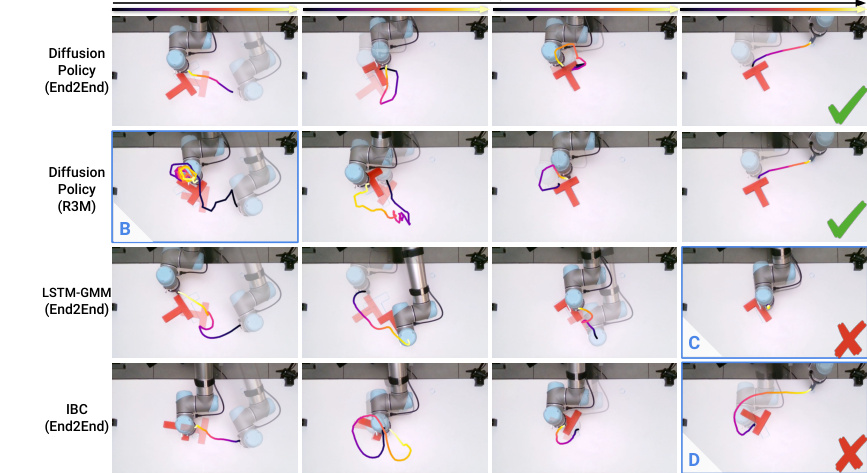

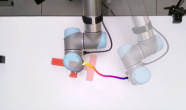

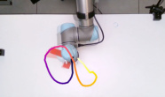

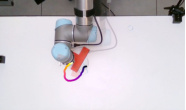

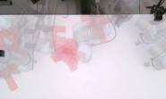

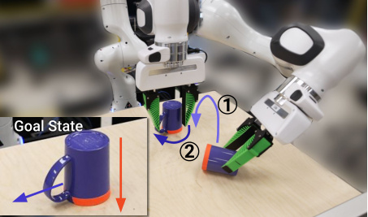

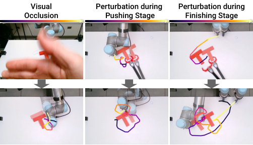

_Diffusion Policy_ 11

Human 0.79 1.00 0.79 1.00

LSTM-GMM 0.06 0.00 0.27 0.00
Diffusion Policy **0.74** **0.79** **0.77** **1.00**

**Figure 10. Realworld Sauce Manipulation.** [Left] **6DoF**
**pouring Task.** The robot needs to 1 _⃝_ dip the ladle to scoop
sauce from the bowl, 2 _⃝_ approach the center of the pizza
dough, 3 _⃝_ pour sauce, and 4 _⃝_ lift the ladle to finish the task.

[Right] **Periodic spreading Task** The robot needs to 1 _⃝_
approach the center of the sauce with a grasped spoon, 2 _⃝_
spread the sauce to cover pizza in a spiral pattern, and 3 _⃝_ lift
the spoon to finish the task.

with the same Push-T hyperparameters, and successful
policies were achieved on the first attempt.
The sauce pouring task requires the robot to remain
stationary for a period of time to fill the ladle with viscous
tomato sauce. The resulting idle actions are known to be
challenging for behavior cloning algorithms and therefore
are often avoided or filtered out. Fine adjustments during
pouring are necessary during sauce pouring to ensure
coverage and to achieve the desired shape.
The demonstrated sauce-spreading strategy is inspired by
the human chef technique, which requires both a longhorizon cyclic pattern to maximize coverage and shorthorizon feedback for even distribution (since the tomato
sauce used often drips out in lumps with unpredictable
sizes). Periodic motions are known to be difficult to learn
and therefore are often addressed by specialized action
representations Yang et al. (2022). Both tasks require the
policy to self-terminate by lifting the ladle/spoon.
**Result Analysis.** Diffusion policy achieves close-tohuman performance on both tasks, with coverage 0.74 vs
0.79 on pouring and 0.77 vs 0.79 on spreading. Diffusion
policy reacted gracefully to external perturbations such
as moving the pizza dough by hand during pouring and
spreading. Results are best appreciated with videos in the
supplemental material.
LSTM-GMM performs poorly on both sauce pouring and
spreading tasks. It failed to lift the ladle after successfully
scooping sauce in 15 out of 20 of the pouring trials. When
the ladle was successfully lifted, the sauce was poured
off-centered. LSTM-GMM failed to self-terminate in all
trials. We suspect LSTM-GMM’s hidden state failed to
capture sufficiently long history to distinguish between the
ladle dipping and the lifting phases of the task. For sauce
spreading, LSTM-GMM always lifts the spoon right after
the start, and failed to make contact with the sauce in all 20
experiments.

grippers. We also extend the observation space to include
the actual and desired values of these quantities. The image
observation space is comprised of two scene cameras and
two wrist cameras, one attached to each arm. The action
space is extended to include the desired poses of both endeffectors and the desired gripper widths of both grippers.

_7.2_ _Teleoperation_

For these coordinated bimanual tasks, we found using
2 SpaceMouse simultaneously quite challenging for the
demonstrator. Thus, we implemented two new teleoperation
modes: using a Meta Quest Pro VR device with two
[hand controllers, or haptic-enabled control using 2 Haption](https://www.haption.com/en/products-en/virtuose-6d-tao-en.html#fa-download-downloads)
Virtuose [™] [6D HF TAO devices using bilateral position-](https://www.haption.com/en/products-en/virtuose-6d-tao-en.html#fa-download-downloads)
position coupling as described succinctly in the haptics
section of Siciliano et al. (2008). This coupling is performed
between a Haption device and a Franka Panda arm. More
details on the controllers themselves may be found in Sec.
D.1. The following provides more details on each task and
policy performance.

_7.3_ _Bimanual Egg Beater_

The bimanual egg beater task is illustrated and described
in Fig. 11, using a OXO [™] [Egg Beater and a Room](https://www.oxo.com/egg-beater.html)
Essentials [™] [plastic bowl. We chose this task to illustrate the](https://www.target.com/p/114oz-plastic-serving-bowl-jet-gray-room-essentials-8482/-/A-86701588)
importance of haptic feedback for teleoperating bimanual
manipulation even for common daily life tasks such as
coordinated tool use. Without haptic feedback, an expert was
unable to successfully complete a single demonstration out
of 10 trials. 5 failed due to robot pulling the crank handle
off the egg beater; 3 failed due to robot losing grasp of
the handle; 2 failed due to robot triggering torque limit. In
contrast, the same operator could easily perform this task 10
out of 10 times with haptic feedback. Using haptic feedback
made it possible for the demonstrations to be both quicker
and higher quality than without feedback.
**Result Analysis.** Diffusion policy is able to complete this
task with 55% success rate over 20 trials, trained using
210 demonstrations. The primary failure modes for these
were out-of-domain initial positioning of the egg beater, or
missing the egg beater crank handle or losing grasp of it. The
initial and final states for all rollouts are visualized in 18 and
19.

_7.4_ _Bimanual Mat Unrolling_

The mat unrolling task is shown and described in Fig.
[12, using a XXL Dog Buddy](https://www.amazon.com/DogBuddy-Dog-Food-Mat-Waterproof/dp/B08GGDNB71) [™] Dog Mat. This task was
teleoperated using the VR setup, as it did not require rich

12

**Figure 11. Bimanual Egg Beater Manipulation.** The robot
needs to 1 _⃝_ push the bowl into position (only if too close to the
left arm), 2 _⃝_ approach and pick up the egg beater with the right
arm, 3 _⃝_ place the egg beater in the bowl, 4 _⃝_ approach and
grasp the egg beater crank handle, and 5 _⃝_ turn the crank
handle 3 or more times.

**Figure 12. Bimanual Mat Unrolling.** The robot needs to 1 _⃝_
pick up one side of the mat (if needed), using the left or right
arm, 2 _⃝_ lift and unroll the mat (if needed), 3 _⃝_ ensure that both
sides of the mat are grasped, 4 _⃝_ lift the mat, 5 _⃝_ place the mat
oriented with the table, mostly centered, and 6 _⃝_ release the mat.

haptic feedback to perform the task. We taught this skill to
be omnidextrous, meaning it can unroll either to the left or
right depending on the initial condition.
**Result Analysis.** Diffusion policy is able to complete this
task with 75% success rate over 20 trials, trained using 162
demonstrations. The primary failure modes for these were
missed grasps during initial grasp of the mat, where the
policy struggled to correct itself and thus got stuck repeating
the same behavior. The initial and final states for all rollouts
are visualized in 16 and 17.

_7.5_ _Bimanual Shirt Folding._

The shirt folding task is described and illustrated in Fig. 13,
using a short-sleeve T-shirt. This task was also teleoperated
using the VR setup as it did not require rich feedback
to perform the task. Due to the kinematic and workspace
constraints, this task is notably longer and can take up
to nine discrete steps. The last few steps require both
grippers to come very close towards each other. Having our
mid-level controller explicitly handling collision avoidance
was especially important for both teleoperation and policy
rollout.
**Result Analysis.** Diffusion policy is able to complete this
task with 75% success rate over 20 trials, trained using 284
demonstrations. The primary failure modes for these were
missed grasps for initial folding (the sleeves and the color),
and the policy being unable to stop adjusting the shirt at the
end. The initial and final states for all rollouts are visualized
in 20 and 21.

**8** **Related Work**

Creating capable robots without requiring explicit programming of behaviors is a longstanding challenge in the field
Atkeson and Schaal (1997); Argall et al. (2009); Ravichandar

**Figure 13. Bimanual Shirt Folding.** The robot needs to 1 _⃝_
approach and grasp the closest sleeve with both arms, 2 _⃝_ fold
the sleeve and release, 3 _⃝_ drag the shirt closer (if needed), 4 _⃝_
approach and grasp the other sleeve with both arms, 5 _⃝_ fold the
sleeve and release, 6 _⃝_ drag the shirt to a orientation for folding,
_⃝_ 7 grasp and fold the shirt in half by its collar, 8 _⃝_ drag the shirt
to the center, and 9 _⃝_ smooth out the shirt and move the arms
away.

et al. (2020). While conceptually simple, behavior cloning
has shown surprising promise on an array of real-world
robot tasks, including manipulation Zhang et al. (2018);
Florence et al. (2019); Mandlekar et al. (2020b,a); Zeng
et al. (2021); Rahmatizadeh et al. (2018); Avigal et al. (2022)
and autonomous driving Pomerleau (1988); Bojarski et al.
(2016). Current behavior cloning approaches can be categorized into two groups, depending on the policy’s structure.
**Explicit Policy.** The simplest form of explicit policies
maps from world state or observation directly to action
Pomerleau (1988); Zhang et al. (2018); Florence et al.
(2019); Ross et al. (2011); Toyer et al. (2020); Rahmatizadeh
et al. (2018); Bojarski et al. (2016). They can be
supervised with a direct regression loss and have efficient
inference time with one forward pass. Unfortunately, this
type of policy is not suitable for modeling multi-modal
demonstrated behavior, and struggles with high-precision
tasks Florence et al. (2021). A popular approach to
model multimodal action distributions while maintaining
the simplicity of direction action mapping is convert
the regression task into classification by discretizing the
action space Zeng et al. (2021); Wu et al. (2020); Avigal
et al. (2022). However, the number of bins needed to
approximate a continuous action space grows exponentially
with increasing dimensionality. Another approach is to
combine Categorical and Gaussian distributions to represent
continuous multimodal distributions via the use of MDNs
Bishop (1994); Mandlekar et al. (2021) or clustering with
offset prediction Shafiullah et al. (2022); Sharma et al.
(2018). Nevertheless, these models tend to be sensitive to
hyperparameter tuning, exhibit mode collapse, and are still
limited in their ability to express high-precision behavior
Florence et al. (2021).
**Implicit Policy.** Implicit policies (Florence et al. 2021;
Jarrett et al. 2020) define distributions over actions by using
Energy-Based Models (EBMs) (LeCun et al. 2006; Du and
Mordatch 2019; Dai et al. 2019; Grathwohl et al. 2020;

_Diffusion Policy_ 13

Du et al. 2020). In this setting, each action is assigned
an energy value, with action prediction corresponding to
the optimization problem of finding a minimal energy
action. Since different actions may be assigned low
energies, implicit policies naturally represent multi-modal
distributions. However, existing implicit policies (Florence
et al. 2021) are unstable to train due to the necessity of
drawing negative samples when computing the underlying
Info-NCE loss.
**Diffusion Models.** Diffusion models are probabilistic
generative models that iteratively refine randomly sampled
noise into draws from an underlying distribution. They can
also be conceptually understood as learning the gradient field
of an implicit action score and then optimizing that gradient
during inference. Diffusion models (Sohl-Dickstein et al.
2015; Ho et al. 2020) have recently been applied to solve
various different control tasks (Janner et al. 2022a; Urain
et al. 2022; Ajay et al. 2022).
In particular, Janner et al. (2022a) and Huang et al.
(2023) explore how diffusion models may be used in the
context of planning and infer a trajectory of actions that
may be executed in a given environment. In the context of
Reinforcement Learning, Wang et al. (2022) use diffusion
model for policy representation and regularization with statebased observations. In contrast, in this work, we explore
how diffusion models may instead be effectively applied in
the context of behavioral cloning for effective visuomotor
control policy. To construct effective visuomotor control
policies, we propose to combine DDPM’s ability to predict
high-dimensional action squences with closed-loop control,
as well as a new transformer architecture for action diffusion
and a manner to integrate visual inputs into the action
diffusion model.

Wang et al. (2023) explore how diffusion models learned
from expert demonstrations can be used to augment
classical explicit polices without directly taking advantage
of diffusion models as policy representation.
Concurrent to us, Pearce et al. (2023), Reuss et al.
(2023) and Hansen-Estruch et al. (2023) has conducted
a complimentary analysis of diffusion-based policies in
simulated environments. While they focus more on effective
sampling strategies, leveraging classifier-free guidance for
goal-conditioning as well as applications in Reinforcement
Learning, and we focus on effective action spaces, our
empirical findings largely concur in the simulated regime.
In addition, our extensive real-world experiments provide
strong evidence for the importance of a receding-horizon
prediction scheme, the careful choice between velocity and
position control, and the necessity of optimization for realtime inference and other critical design decisions for a
physical robot system.

**9** **Limitations and Future Work**

Although we have demonstrated the effectiveness of
diffusion policy in both simulation and real-world systems,
there are limitations that future work can improve. First,
our implementation inherits limitations from behavior
cloning, such as suboptimal performance with inadequate
demonstration data. Diffusion policy can be applied to
other paradigms, such as reinforcement learning Wang et al.

(2023); Hansen-Estruch et al. (2023), to take advantage of
suboptimal and negative data. Second, diffusion policy has
higher computational costs and inference latency compared
to simpler methods like LSTM-GMM. Our action sequence
prediction approach partially mitigates this issue, but may
not suffice for tasks requiring high rate control. Future
work can exploit the latest advancements in diffusion model
acceleration methods to reduce the number of inference
steps required, such as new noise schedules Chen (2023),
inference solvers Karras et al. (2022), and consistency
models Song et al. (2023).

**10** **Conclusion**

In this work, we assess the feasibility of diffusion-based
policies for robot behaviors. Through a comprehensive
evaluation of 15 tasks in simulation and the real world,
we demonstrate that diffusion-based visuomotor policies
consistently and definitively outperform existing methods
while also being stable and easy to train. Our results also
highlight critical design factors, including receding-horizon
action prediction, end-effector position control, and efficient
visual conditioning, that is crucial for unlocking the full
potential of diffusion-based policies. While many factors
affect the ultimate quality of behavior-cloned policies —
including the quality and quantity of demonstrations, the
physical capabilities of the robot, the policy architecture,
and the pretraining regime used — our experimental results
strongly indicate that policy structure poses a significant
performance bottleneck during behavior cloning. We hope
that this work drives further exploration in the field into
diffusion-based policies and highlights the importance of
considering all aspects of the behavior cloning process
beyond just the data used for policy training.

**11** **Acknowledgement**

We’d like to thank Naveen Kuppuswamy, Hongkai Dai,
Aykut Onol, Terry Suh, Tao Pang, Huy Ha, Samir Gadre, [¨]
Kevin Zakka and Brandon Amos for their thoughtful
discussions. We thank Jarod Wilson for 3D printing support
and Huy Ha for photography and lighting advice. We thank
Xiang Li for discovering the bug in our evaluation code on
GitHub.

**Funding**

This work was supported by the Toyota Research Institute, NSF
CMMI-2037101 and NSF IIS-2132519. We would like to thank
Google for the UR5 robot hardware. The views and conclusions
contained herein are those of the authors and should not be
interpreted as necessarily representing the official policies, either
expressed or implied, of the sponsors.

**References**

Ajay A, Du Y, Gupta A, Tenenbaum J, Jaakkola T and Agrawal
P (2022) Is conditional generative modeling all you need for
decision-making? _arXiv preprint arXiv:2211.15657_ .

Argall BD, Chernova S, Veloso M and Browning B (2009) A
survey of robot learning from demonstration. _Robotics and_
_autonomous systems_ 57(5): 469–483.

14

Atkeson CG and Schaal S (1997) Robot learning from
demonstration. In: _ICML_, volume 97. pp. 12–20.

Avigal Y, Berscheid L, Asfour T, Kr¨oger T and Goldberg K (2022)
Speedfolding: Learning efficient bimanual folding of garments.
In: _2022 IEEE/RSJ International Conference on Intelligent_
_Robots and Systems (IROS)_ . IEEE, pp. 1–8.

Bishop CM (1994) _Mixture density networks_ . Aston University.

Bojarski M, Del Testa D, Dworakowski D, Firner B, Flepp B,
Goyal P, Jackel LD, Monfort M, Muller U, Zhang J et al.
(2016) End to end learning for self-driving cars. _arXiv preprint_
_arXiv:1604.07316_ .

Chen T (2023) On the importance of noise scheduling for diffusion
models. _arXiv preprint arXiv:2301.10972_ .

Chi C, Feng S, Du Y, Xu Z, Cousineau E, Burchfiel B and Song S
(2023) Diffusion policy: Visuomotor policy learning via action
diffusion. In: _Proceedings of Robotics: Science and Systems_
_(RSS)_ .

Dai B, Liu Z, Dai H, He N, Gretton A, Song L and Schuurmans D
(2019) Exponential family estimation via adversarial dynamics
embedding. _Advances in Neural Information Processing_
_Systems_ 32.

Deng J, Dong W, Socher R, Li LJ, Li K and Fei-Fei L (2009)
Imagenet: A large-scale hierarchical image database. In: _2009_
_IEEE conference on computer vision and pattern recognition_ .
Ieee, pp. 248–255.

Dosovitskiy A, Beyer L, Kolesnikov A, Weissenborn D, Zhai X,
Unterthiner T, Dehghani M, Minderer M, Heigold G, Gelly S
et al. (2020) An image is worth 16x16 words: Transformers for
image recognition at scale. _arXiv preprint arXiv:2010.11929_ .

Du Y, Li S, Tenenbaum J and Mordatch I (2020) Improved
contrastive divergence training of energy based models. _arXiv_
_preprint arXiv:2012.01316_ .

Du Y and Mordatch I (2019) Implicit generation and generalization
in energy-based models. _arXiv preprint arXiv:1903.08689_ .

Florence P, Lynch C, Zeng A, Ramirez OA, Wahid A, Downs L,
Wong A, Lee J, Mordatch I and Tompson J (2021) Implicit
behavioral cloning. In: _5th Annual Conference on Robot_
_Learning_ .

Florence P, Manuelli L and Tedrake R (2019) Self-supervised
correspondence in visuomotor policy learning. _IEEE Robotics_
_and Automation Letters_ 5(2): 492–499.

Grathwohl W, Wang KC, Jacobsen JH, Duvenaud D and Zemel
R (2020) Learning the stein discrepancy for training and
evaluating energy-based models without sampling. In:
_International Conference on Machine Learning_ .

Gupta A, Kumar V, Lynch C, Levine S and Hausman K (2019)
Relay policy learning: Solving long-horizon tasks via imitation
and reinforcement learning. _arXiv preprint arXiv:1910.11956_ .

Hansen-Estruch P, Kostrikov I, Janner M, Kuba JG and Levine S
(2023) Idql: Implicit q-learning as an actor-critic method with
diffusion policies. _arXiv preprint arXiv:2304.10573_ .

He K, Fan H, Wu Y, Xie S and Girshick R (2020) Momentum
contrast for unsupervised visual representation learning. In:

_Proceedings of the IEEE/CVF conference on computer vision_

_and pattern recognition_ . pp. 9729–9738.

He K, Zhang X, Ren S and Sun J (2016) Deep residual learning for
image recognition. In: _Proceedings of the IEEE conference on_
_computer vision and pattern recognition_ . pp. 770–778.

Ho J, Jain A and Abbeel P (2020) Denoising diffusion probabilistic
models. _arXiv preprint arXiv:2006.11239_ .

Huang S, Wang Z, Li P, Jia B, Liu T, Zhu Y, Liang W and Zhu SC
(2023) Diffusion-based generation, optimization, and planning
in 3d scenes. _arXiv preprint arXiv:2301.06015_ .

Janner M, Du Y, Tenenbaum J and Levine S (2022a) Planning
with diffusion for flexible behavior synthesis. In: _International_
_Conference on Machine Learning_ .

Janner M, Du Y, Tenenbaum J and Levine S (2022b) Planning with
diffusion for flexible behavior synthesis. In: Chaudhuri K,
Jegelka S, Song L, Szepesvari C, Niu G and Sabato S (eds.)

_Proceedings of the 39th International Conference on Machine_

_Learning_, Proceedings of Machine Learning Research. PMLR.

Jarrett D, Bica I and van der Schaar M (2020) Strictly batch
imitation learning by energy-based distribution matching.
_Advances in Neural Information Processing Systems_ 33: 7354–
7365.

Karras T, Aittala M, Aila T and Laine S (2022) Elucidating the
design space of diffusion-based generative models. _arXiv_
_preprint arXiv:2206.00364_ .

Khatib O (1987) A unified approach for motion and force control of
robot manipulators: The operational space formulation. _IEEE_
_Journal on Robotics and Automation_ 3(1): 43–53. DOI:10.
1109/JRA.1987.1087068. Conference Name: IEEE Journal on
Robotics and Automation.

LeCun Y, Chopra S, Hadsell R, Huang FJ and et al (2006) A tutorial
on energy-based learning. In: _Predicting Structured Data_ . MIT
Press.

Liu L, Liu X, Gao J, Chen W and Han J (2020) Understanding
the difficulty of training transformers. _arXiv preprint_
_arXiv:2004.08249_ .

Liu N, Li S, Du Y, Torralba A and Tenenbaum JB (2022)
Compositional visual generation with composable diffusion
models. _arXiv preprint arXiv:2206.01714_ .

Mandlekar A, Ramos F, Boots B, Savarese S, Fei-Fei L, Garg A and
Fox D (2020a) Iris: Implicit reinforcement without interaction
at scale for learning control from offline robot manipulation
data. In: _2020 IEEE International Conference on Robotics and_
_Automation (ICRA)_ . IEEE.

Mandlekar A, Xu D, Mart´ın-Mart´ın R, Savarese S and Fei-Fei L
(2020b) Learning to generalize across long-horizon tasks from
human demonstrations. _arXiv preprint arXiv:2003.06085_ .

Mandlekar A, Xu D, Wong J, Nasiriany S, Wang C, Kulkarni R,
Fei-Fei L, Savarese S, Zhu Y and Mart´ın-Mart´ın R (2021)
What matters in learning from offline human demonstrations
for robot manipulation. In: _5th Annual Conference on Robot_
_Learning_ .

Mayne DQ and Michalska H (1988) Receding horizon control
of nonlinear systems. In: _Proceedings of the 27th IEEE_
_Conference on Decision and Control_ . IEEE, pp. 464–465.

Nair S, Rajeswaran A, Kumar V, Finn C and Gupta A (2022) R3m:
A universal visual representation for robot manipulation. In:
_6th Annual Conference on Robot Learning_ .

Neal RM et al. (2011) Mcmc using hamiltonian dynamics.
_Handbook of markov chain monte carlo_ .

Nichol AQ and Dhariwal P (2021) Improved denoising diffusion
probabilistic models. In: _International Conference on Machine_
_Learning_ . PMLR, pp. 8162–8171.

_Diffusion Policy_ 15

Pearce T, Rashid T, Kanervisto A, Bignell D, Sun M, Georgescu R,
Macua SV, Tan SZ, Momennejad I, Hofmann K et al. (2023)
Imitating human behaviour with diffusion models. _arXiv_
_preprint arXiv:2301.10677_ .

Perez E, Strub F, De Vries H, Dumoulin V and Courville A (2018)
Film: Visual reasoning with a general conditioning layer. In:
_Proceedings of the AAAI Conference on Artificial Intelligence_ .

Pomerleau DA (1988) Alvinn: An autonomous land vehicle in a
neural network. _Advances in neural information processing_
_systems_ 1.

Radford A, Kim JW, Hallacy C, Ramesh A, Goh G, Agarwal S,
Sastry G, Askell A, Mishkin P, Clark J et al. (2021) Learning
transferable visual models from natural language supervision.
In: _International conference on machine learning_ . PMLR, pp.
8748–8763.

Rahmatizadeh R, Abolghasemi P, B¨ol¨oni L and Levine S (2018)
Vision-based multi-task manipulation for inexpensive robots
using end-to-end learning from demonstration. In: _2018 IEEE_
_international conference on robotics and automation (ICRA)_ .
IEEE, pp. 3758–3765.

Ravichandar H, Polydoros AS, Chernova S and Billard A (2020)
Recent advances in robot learning from demonstration. _Annual_
_review of control, robotics, and autonomous systems_ 3: 297–
330.

Reuss M, Li M, Jia X and Lioutikov R (2023) Goal-conditioned
imitation learning using score-based diffusion policies. In:
_Proceedings of Robotics: Science and Systems (RSS)_ .

Ridnik T, Ben-Baruch E, Noy A and Zelnik-Manor L (2021)
Imagenet-21k pretraining for the masses.

Ronneberger O, Fischer P and Brox T (2015) U-net: Convolutional networks for biomedical image segmentation. In: _Med-_

_ical Image Computing and Computer-Assisted Intervention–_

_MICCAI 2015: 18th International Conference, Munich, Ger-_

_many, October 5-9, 2015, Proceedings, Part III 18_ . Springer,
pp. 234–241.

Ross S, Gordon G and Bagnell D (2011) A reduction of imitation
learning and structured prediction to no-regret online learning.
In: _Proceedings of the fourteenth international conference_
_on artificial intelligence and statistics_ . JMLR Workshop and
Conference Proceedings, pp. 627–635.

Shafiullah NMM, Cui ZJ, Altanzaya A and Pinto L (2022) Behavior
transformers: Cloning $k$ modes with one stone. In: Oh AH,
Agarwal A, Belgrave D and Cho K (eds.) _Advances in Neural_
_Information Processing Systems_ .

Sharma P, Mohan L, Pinto L and Gupta A (2018) Multiple
interactions made easy (mime): Large scale demonstrations
data for imitation. In: _Conference on robot learning_ . PMLR.

Siciliano B, Khatib O and Kr¨oger T (2008) _Springer handbook of_
_robotics_, volume 200. Springer.

Sohl-Dickstein J, Weiss E, Maheswaranathan N and Ganguli
S (2015) Deep unsupervised learning using nonequilibrium
thermodynamics. In: _International Conference on Machine_
_Learning_ .

Song J, Meng C and Ermon S (2021) Denoising diffusion
implicit models. In: _International Conference on Learning_
_Representations_ .

Song Y, Dhariwal P, Chen M and Sutskever I (2023) Consistency
models. _arXiv preprint arXiv:2303.01469_ .

Song Y and Ermon S (2019) Generative modeling by estimating
gradients of the data distribution. _Advances in neural_

_information processing systems_ 32.

Subramanian J and Mahajan A (2019) Approximate information
state for partially observed systems. In: _2019 IEEE 58th_
_Conference on Decision and Control (CDC)_ . IEEE, pp. 1629–
1636.

Ta DN, Cousineau E, Zhao H and Feng S (2022) Conditional
energy-based models for implicit policies: The gap between
theory and practice. _arXiv preprint arXiv:2207.05824_ .

Tancik M, Srinivasan P, Mildenhall B, Fridovich-Keil S, Raghavan
N, Singhal U, Ramamoorthi R, Barron J and Ng R (2020)
Fourier features let networks learn high frequency functions
in low dimensional domains. _Advances in Neural Information_
_Processing Systems_ 33: 7537–7547.

Toyer S, Shah R, Critch A and Russell S (2020) The magical
benchmark for robust imitation. _Advances in Neural_
_Information Processing Systems_ 33: 18284–18295.

Urain J, Funk N, Chalvatzaki G and Peters J (2022) Se (3)diffusionfields: Learning cost functions for joint grasp and
motion optimization through diffusion. _arXiv preprint_
_arXiv:2209.03855_ .

Vaswani A, Shazeer N, Parmar N, Uszkoreit J, Jones L, Gomez AN,
Kaiser Ł and Polosukhin I (2017) Attention is all you need.
_Advances in neural information processing systems_ 30.

Wang Z, Hunt JJ and Zhou M (2022) Diffusion policies as an
expressive policy class for offline reinforcement learning.
_arXiv preprint arXiv:2208.06193_ .

Wang Z, Hunt JJ and Zhou M (2023) Diffusion policies as an
expressive policy class for offline reinforcement learning.
In: _The Eleventh International Conference on Learning_
_Representations_ . [URL https://openreview.net/](https://openreview.net/forum?id=AHvFDPi-FA)
[forum?id=AHvFDPi-FA.](https://openreview.net/forum?id=AHvFDPi-FA)

Welling M and Teh YW (2011) Bayesian learning via stochastic
gradient langevin dynamics. In: _Proceedings of the 28th_
_international conference on machine learning (ICML-11)_ . pp.
681–688.

Wu J, Sun X, Zeng A, Song S, Lee J, Rusinkiewicz S
and Funkhouser T (2020) Spatial action maps for mobile
manipulation. In: _Proceedings of Robotics: Science and_
_Systems (RSS)_ .

Wu Y and He K (2018) Group normalization. In: _Proceedings of the_
_European conference on computer vision (ECCV)_ . pp. 3–19.

Yang J, Zhang J, Settle C, Rai A, Antonova R and Bohg J (2022)
Learning periodic tasks from human demonstrations. In: _2022_
_International Conference on Robotics and Automation (ICRA)_ .
IEEE, pp. 8658–8665.

Zeng A, Florence P, Tompson J, Welker S, Chien J, Attarian M,
Armstrong T, Krasin I, Duong D, Sindhwani V et al. (2021)
Transporter networks: Rearranging the visual world for robotic
manipulation. In: _Conference on Robot Learning_ . PMLR, pp.
726–747.

Zhang A, McAllister RT, Calandra R, Gal Y and Levine S
(2020) Learning invariant representations for reinforcement
learning without reconstruction. In: _International Conference_
_on Learning Representations_ .

Zhang T, McCarthy Z, Jow O, Lee D, Chen X, Goldberg K
and Abbeel P (2018) Deep imitation learning for complex
manipulation tasks from virtual reality teleoperation. In: _2018_

_IEEE International Conference on Robotics and Automation_

_(ICRA)_ . IEEE, pp. 5628–5635.

16

Zhou Y, Barnes C, Lu J, Yang J and Li H (2019) On the continuity
of rotation representations in neural networks. In: _Proceedings_

_of the IEEE/CVF Conference on Computer Vision and Pattern_

_Recognition_ . pp. 5745–5753.

**A** **Diffusion Policy Implementation Details**

_A.1_ _Normalization_

Properly normalizing action data is critical to achieve best
performance for Diffusion Policy. Scaling the min and max
of each action dimension independently to [ _−_ 1 _,_ 1] works well
for most tasks. Since DDPMs clip prediction to [ _−_ 1 _,_ 1] at
each iteration to ensure stability, the common zero-mean
unit-variance normalization will cause some region of the
action space to be inaccessible. When the data variance is
small (e.g., near constant value), shift the data to zero-mean
without scaling to prevent numerical issues. We leave action
dimensions corresponding to rotation representations (e.g.
Quaternion) unchanged.

_A.2_ _Rotation Representation_

For all environments with velocity control action space, we
followed the standard practice Mandlekar et al. (2021) to use
3D axis-angle representation for the rotation component of
action. Since velocity action commands are usually close
to 0, the singularity and discontinuity of the axis-angle
representation don’t usually cause problems. We used the
6D rotation representation proposed in Zhou et al. (2019) for
all environments (real-world and simulation) with positional
control action space.

_A.3_ _Image Augmentation_

Following Mandlekar et al. (2021), we employed random
crop augmentation during training. The crop size for each
task is indicated in Tab. 7. During inference, we take a static
center crop with the same size.

_A.4_ _Hyperparameters_

Hyerparameters used for Diffusion Policy on both simulation
and realworld benchmarks are shown in Tab. 7 and Tab.
8. Since the Block Push task uses a Markovian scripted
oracle policy to generate demonstration data, we found its
optimal hyper parameter for observation and action horizon
to be very different from other tasks with human teleop
demostrations.
We found that the optimal hyperparameters for CNNbased Diffusion Policy are consistent across tasks. In
contrast, transformer-based Diffusion Policy’s optimal
attention dropout rate and weight decay varies greatly
across different tasks. During tuning, we found increasing
the number of parameters in CNN-based Diffusion Policy
always improves performance, therefore the optimal model
size is limited by the available compute and memory
capacity. On the other hand, increasing model size for
transformer-based Diffusion Policy (in particular number
of layers) hurts performance sometimes. For CNN-based
Diffusion Policy, We found using FiLM conditioning to
pass-in observations is better than impainting on all tasks

|State-CNN Vi|Col2|Col3|Col4|Col5|Col6|Col7|Col8|Col9|si|on-CNN|Col12|Col13|Col14|Visi|on-T|Col17|ransf|Col19|o|rmer|Col22|
|---|---|---|---|---|---|---|---|---|---|---|---|---|---|---|---|---|---|---|---|---|---|
|||||||||||||||||||||||
|||||||||||||||||||||||
|||||||||||||||||||||||
|||||||||||||||||||||||
|||||||||||||||||||||||
||||||||1 2 3 4 5 6 7 8|||||||||||||||
|1 2 3 4 5 6 7 8|1 2 3 4 5 6 7 8|1 2 3 4 5 6 7 8|1 2 3 4 5 6 7 8|1 2 3 4 5 6 7 8|1 2 3 4 5 6 7 8|1 2 3 4 5 6 7 8|1 2 3 4 5 6 7 8|1 2 3 4 5 6 7 8|1 2 3 4 5 6 7 8|1 2 3 4 5 6 7 8|1 2 3 4 5 6 7 8|1 2 3 4 5 6 7 8|1 2 3 4 5 6 7 8|1 2 3 4 5 6 7 8|1 2 3 4 5 6 7 8|1 2 3 4 5 6 7 8|1 2 3 4 5 6 7 8|1 2 3 4 5 6 7 8|1 2 3 4 5 6 7 8|1 2 3 4 5 6 7 8|1 2 3 4 5 6 7 8|

**Figure 14. Observation Horizon Ablation Study.** State-based
Diffusion Policy is not sensitive to observation horizon.
Vision-based Diffusion Policy prefers low but _>_ 1 observation
horizon, with 2 being a good compromise for most tasks.

|Push-T Data Effi|Col2|Col3|ciency|Col5|
|---|---|---|---|---|
||||||
||||||
||||||
||||||
||||||
||||||
||||||
|40 60 90 1|40 60 90 1|40 60 90 1|30 200|30 200|

|Squar|Col2|e Data Effici|Col4|ency|Col6|
|---|---|---|---|---|---|
|||||||
|||||||
|||||||
|||||||
|||||||
|||||||
|||||||
|40 60 90 130 20|40 60 90 130 20|40 60 90 130 20|40 60 90 130 20|40 60 90 130 20|40 60 90 130 20|

**Figure 15. Data Efficiency Ablation Study.** Diffusion Policy
outperforms LSTM-GMM Mandlekar et al. (2021) at every
training dataset size.

except Push-T. Performance reported for DiffusionPolicy-C
on Push-T in Tab. 1 used impaiting instead of FiLM.

On simulation benchmarks, we used the iDDPM algorithm
Nichol and Dhariwal (2021) with the same 100 denoising
diffusion iterations for both training and inference. We used
DDIM Song et al. (2021) on realworld benchmarks to reduce
the inference denoising iterations to 16 therefore reducing
inference latency.

We used batch size of 256 for all state-based experiments
and 64 for all image-based experiments. For learning-rate
scheduling, we used cosine schedule with linear warmup.
CNN-based Diffusion Policy is warmed up for 500 steps
while Transformer-based Diffusion Policy is warmed up for
1000 steps.

_A.5_ _Data Efficiency_

We found Diffusion Policy to outperform LSTM-GMM
Mandlekar et al. (2021) at every training dataset size, as
shown in Fig. 15.

**B** **Additional Ablation Results**

_B.1_ _Observation Horizon_

We found state-based Diffusion Policy to be insensitive
to observation horizon, as shown in Fig. 14. However,
vision-based Diffusion Policy, in particular the variant with
CNN backbone, see performance decrease with increasing
observation horizon. In practice, we found an observation
horizon of 2 is good for most of the tasks for both state and
image observations.

_Diffusion Policy_ 17

**H-Param** **Ctrl To Ta Tp ImgRes** **CropRes** **#D-Params #V-Params Lr** **WDecay D-Iters Train D-Iters Eval**

Lift Pos 2 8 16 2x84x84 2x76x76 256 22 1e-4 1e-6 100 100
Can Pos 2 8 16 2x84x84 2x76x76 256 22 1e-4 1e-6 100 100
Square Pos 2 8 16 2x84x84 2x76x76 256 22 1e-4 1e-6 100 100
Transport Pos 2 8 16 4x84x85 4x76x76 264 45 1e-4 1e-6 100 100
ToolHang Pos 2 8 16 2x240x240 2x216x216 256 22 1e-4 1e-6 100 100
Push-T Pos 2 8 16 1x96x96 1x84x84 256 22 1e-4 1e-6 100 100
Block Push Pos 3 1 12 N/A N/A 256 0 1e-4 1e-6 100 100
Kitchen Pos 2 8 16 N/A N/A 256 0 1e-4 1e-6 100 100

Real Push-T Pos 2 6 16 2x320x240 2x288x216 67 22 1e-4 1e-6 100 16
Real Pour Pos 2 8 16 2x320x240 2x288x216 67 22 1e-4 1e-6 100 16
Real Spread Pos 2 8 16 2x320x240 2x288x216 67 22 1e-4 1e-6 100 16
Real Mug Flip Pos 2 8 16 2x320x240 2x288x216 67 22 1e-4 1e-6 100 16

**Table 7. Hyperparameters for CNN-based Diffusion Policy** Ctrl: position or velocity control To: observation horizon Ta: action
horizon Tp: action prediction horizon ImgRes: environment observation resolution (Camera views x W x H) CropRes: random crop
resolution #D-Params: diffusion network number of parameters in millions #V-Params: vision encoder number of parameters in
millions Lr: learining rate WDecay: weight decay D-Iters Train: number of training diffusion iterations D-Iters Eval: number of
inference diffusion iterations (enabled by DDIM Song et al. (2021))

**H-Param** **Ctrl To Ta Tp #D-params #V-params #Layers Emb Dim Attn Drp Lr** **WDecay D-Iters Train D-Iters Eval**

Lift Pos 2 8 10 9 22 8 256 0.3 1e-4 1e-3 100 100
Can Pos 2 8 10 9 22 8 256 0.3 1e-4 1e-3 100 100
Square Pos 2 8 10 9 22 8 256 0.3 1e-4 1e-3 100 100
Transport Pos 2 8 10 9 45 8 256 0.3 1e-4 1e-3 100 100
ToolHang Pos 2 8 10 9 22 8 256 0.3 1e-4 1e-3 100 100
Push-T Pos 2 8 16 9 22 8 256 0.01 1e-4 1e-1 100 100
Block Push Vel 3 1 5 9 0 8 256 0.3 1e-4 1e-3 100 100
Kitchen Pos 4 8 16 80 0 8 768 0.1 1e-4 1e-3 100 100

Real Push-T Pos 2 6 16 80 22 8 768 0.3 1e-4 1e-3 100 16

**Table 8. Hyperparameters for Transformer-based Diffusion Policy** Ctrl: position or velocity control To: observation horizon Ta:
action horizon Tp: action prediction horizon #D-Params: diffusion network number of parameters in millions #V-Params: vision
encoder number of parameters in millions Emb Dim: transformer token embedding dimension Attn Drp: transformer attention
dropout probability Lr: learining rate WDecay: weight decay (for transformer only) D-Iters Train: number of training diffusion
iterations D-Iters Eval: number of inference diffusion iterations (enabled by DDIM Song et al. (2021))

_B.2_ _Performance Improvement Calculation_

For each task _i_ (column) reported in Tab. 1, Tab. 2
and Tab. 4 (mh results ignored), we find the maximum
performance for baseline methods _max_ ~~_b_~~ _aselinei_ and
the maximum performance for Diffusion Policy variant
(CNN vs Transformer) _max_ _oursi_ . For each task, the
performance improvement is calculated as _improvementi_ =
_max_ ~~_o_~~ _maxursi−baselinemax_ ~~_b_~~ _aselinei_ _i_ (positive for all tasks). Finally, the

average improvement is calculated as _avg_ _improvement_ =
1
_N_ [∑] _N_ _[i]_ _[improvement][i]_ [ =][ 0] _[.]_ [46858] _[ ≈]_ [46] _[.]_ [9%.]

**C** **Realworld Task Details**

_C.1_ _Push-T_

_C.1.1_ _Demonstrations_ 136 demonstrations are collected
and used for training. The initial condition is varied by
randomly pushing or tossing the T block onto the table. Prior
to this data collection session, the operator has performed
this task for many hours and should be considered proficient
at this task.

_C.1.2_ _Evaluation_ We used a fixed training time of 12
hours for each method, and selected the last checkpoint
for each, with the exception of IBC, where the checkpoint
with minimum training set action prediction MSE error due
to IBC’s training stability issue. The difficulty of training
and checkpoint selection for IBC is demonstrated in main

text Fig. 7. Each method is evaluated for 20 episodes, all
starting from the same set of initial conditions. To ensure
the consistency of initial conditions, we carefully adjusted
the pose of the T block and the robot according to overlayed
images from the top-down camera. Each evaluation episode
is terminated by either keeping the end-effector within the
end-zone for more than 0.5 second, or by reaching the 60
sec time limit. The IoU metric is directly computed in the
top-down camera pixel space.

_C.2_ _Sauce Pouring and Spreading_

_C.2.1_ _Demonstrations_ 50 demonstrations are collected,
and 90% are used for training for each task. For pouring,
initial locations of the pizza dough and sauce bowl are varied.
After each demonstration, sauce is poured back into the
bowl, and the dough is wiped clean. For spreading, location
of the pizza dough as well as the poured sauce shape are
varied. For resetting, we manually gather sauce towards
the center of the dough, and wipe the remaining dough
clean. The rotational components for tele-op commands are
discarded during spreading and sauce transferring to avoid
accidentally scooping or spilling sauce.

_C.2.2_ _Evaluation_ Both Diffusion Policy and LSTM-GMM
are trained for 1000 epochs. The last checkpoint is used for
evaluation.
Each method is evaluated from the same set of random
initial conditions, where positions of the pizza dough and

18

sauce bowl are varied. We use a similar protocol as in **Push-**
**T** to set up initial conditions. We do not try to match initial
shape of poured sauce for spreading. Instead, we make sure
the amount of sauce is fixed during all experiments.
The evaluation episodes are terminated by moving the
spoon upward (away form the dough) for 0.5 seconds, or
when the operator deems the policy’s behavior is unsafe.
The coverage metric is computed by first projecting the
RGB image from both the left and right cameras onto
the table space through homography, then computing the
coverage in each projected image. The maximum coverage
between the left and right cameras is reported.

**D** **Realworld Setup Details**

_D.0.1_ _UR5 robot station_ Experiments for the **Push-T** task
are performed on the UR5 robot station.
The UR5 robot accepts end-effector space positional
command at 125Hz, which is linearly interpolated from the
10Hz command from either human demonstration or the
policy. The interpolation controller limits the end-effector
velocity to be below 0.43 m/s and its position to be
within the region 1cm above the table for safety reason.
Position-controlled policies directly predicts the desired endeffector pose, while velocity-controlled policies predicts the
difference the current positional setpoint and the previous
setpoint.
The UR5 robot station has 5 realsense D415 depth camera
recording 720p RGB videos at 30fps. Only 2 of the cameras
are used for policy observation, which are down-sampled to
320x240 at 10fps.
During demonstration, the operator teleoperates the robot
via a 3dconnexion SpaceMouse at 10Hz.

_D.1_ _Franka Robot Station_

Experiments for **Sauce Pouring and Spreading, Bimanual**
**Egg Beater, Bimanual Mat Unrolling, and Bimanual**
**Shirt Folding** tasks are performed on the Franka robot
station.
For the non-haptic control, a custom mid-level controller
is implemented to generate desired joint positions from
desired end effector poses from the learned policies. At
each time step, we solve a differential kinematics problem
(formulated as a Quadratic Program) to compute the desired
joint velocity to track the desired end effector velocity. The
resulting joint velocity is Euler integrated into joint position,
which is tracked by a joint-level controller on the robot.
This formulation allows us to impose constraints such as
collision avoidance for the two arms and the table, safety
region for end effector and joint limits. It also enables
regulating redundant DoF in the null space of the end
effector commands. This mid-level controller is particularly
valuable for safeguarding the learned policy during hardware
deployment.
For haptic teleoperation control, another custom mid-level
controller is implemented, but formulated as a pure torquecontroller. The controller is formulated using Operational
Space Control Khatib (1987) as a Quadratic Program
operating at 200 Hz, where position, velocity, and torque
limits are added as constraints, and the primary spatial
objective and secondary null-space posture objectives are

**Figure 16.** Initial states for Mat Unrolling

**Figure 17.** Final states for Mat Unrolling

posed as costs. This, coupled with a good model of the
Franka Panda arm, including reflected rotor inertias, allows
us to perform good tracking with pure spatial feedback, and
even better tracking with feedforward spatial acceleration.
Collision avoidance has not yet been enabled for this control
mode.
Note that for inference, we use the non-haptic control.
Future work intends to simplify this control strategy and only
use a single controller for our given objectives.
The operator uses a SpaceMouse or VR controller input
device(s) to control the robot’s end effector(s), and the
grippers are controlled by a trigger button on the respective
device. Tele-op and learned policies run at 10Hz, and the
mid-level controller runs around 1kHz. Desired end effector
pose commands are interpolated by the mid-level controller.
This station has 2 realsense D415 RGBD camera streaming
VGA RGB images at 30fps, which are downsampled to
320x240 at 10fps as input to the learned policies.

_D.2_ _Initial and Final States of Bimanual Tasks_

The following figures show the initial and final state of four
bimanual tasks. Green and red boxes indicate successful and
failed rollouts respectively. Since mat and shirt are very flat
objects, we used a homographic projection to better visualize
the initial and final states.

_Diffusion Policy_ 19

**Figure 18.** Initial states for Egg Beater

**Figure 19.** Final states for Egg Beater

**Figure 20.** Initial states for Shirt Folding

**Figure 21.** Final states for Shirt Folding

