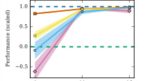

## **Generative Adversarial Imitation Learning**


**Jonathan Ho**
Stanford University
```
hoj@cs.stanford.edu

```


**Stefano Ermon**
Stanford University
```
ermon@cs.stanford.edu

```


**Abstract**


Consider learning a policy from example expert behavior, without interaction
with the expert or access to reinforcement signal. One approach is to recover the
expert’s cost function with inverse reinforcement learning, then extract a policy
from that cost function with reinforcement learning. This approach is indirect
and can be slow. We propose a new general framework for directly extracting a
policy from data, as if it were obtained by reinforcement learning following inverse
reinforcement learning. We show that a certain instantiation of our framework
draws an analogy between imitation learning and generative adversarial networks,
from which we derive a model-free imitation learning algorithm that obtains significant performance gains over existing model-free methods in imitating complex
behaviors in large, high-dimensional environments.


**1** **Introduction**


We are interested in a specific setting of imitation learning—the problem of learning to perform a
task from expert demonstrations—in which the learner is given only samples of trajectories from
the expert, is not allowed to query the expert for more data while training, and is not provided
reinforcement signal of any kind. There are two main approaches suitable for this setting: behavioral
cloning [20], which learns a policy as a supervised learning problem over state-action pairs from
expert trajectories; and inverse reinforcement learning [25, 18], which finds a cost function under
which the expert is uniquely optimal.


Behavioral cloning, while appealingly simple, only tends to succeed with large amounts of data, due
to compounding error caused by covariate shift [23, 24]. Inverse reinforcement learning (IRL), on
the other hand, learns a cost function that prioritizes entire trajectories over others, so compounding
error, a problem for methods that fit single-timestep decisions, is not an issue. Accordingly, IRL has
succeeded in a wide range of problems, from predicting behaviors of taxi drivers [31] to planning
footsteps for quadruped robots [22].


Unfortunately, many IRL algorithms are extremely expensive to run, requiring reinforcement learning
in an inner loop. Scaling IRL methods to large environments has thus been the focus of much
recent work [7, 14]. Fundamentally, however, IRL learns a cost function, which explains expert
behavior but does not directly tell the learner how to act. Given that learner’s true goal often is to
take actions imitating the expert—indeed, many IRL algorithms are evaluated on the quality of the
optimal actions of the costs they learn—why, then, must we learn a cost function, if doing so possibly
incurs significant computational expense yet fails to directly yield actions?


We desire an algorithm that tells us explicitly how to act by directly learning a policy. To develop such
an algorithm, we begin in Section 3, where we characterize the policy given by running reinforcement
learning on a cost function learned by maximum causal entropy IRL [31, 32]. Our characterization
introduces a framework for directly learning policies from data, bypassing any intermediate IRL step.


Then, we instantiate our framework in Sections 4 and 5 with a new model-free imitation learning
algorithm. We show that our resulting algorithm is intimately connected to generative adversarial


networks [9], a technique from the deep learning community that has led to recent successes in
modeling distributions of natural images: our algorithm harnesses generative adversarial training to fit
distributions of states and actions defining expert behavior. We test our algorithm in Section 6, where
we find that it outperforms competing methods by a wide margin in training policies for complex,
high-dimensional physics-based control tasks over various amounts of expert data.


**2** **Background**


**Preliminaries** R will denote the extended real numbers R _∪{∞}_ . Section 3 will work with
finite state and action spaces _S_ and _A_ to avoid technical machinery out of the scope of this paper
(concerning compactness of certain sets of functions), but our algorithms and experiments later in the
paper will run in high-dimensional continuous environments. Π is the set of all stationary stochastic
policies that take actions in _A_ given states in _S_ ; successor states are drawn from the dynamics model
_P_ ( _s_ _[′]_ _|s, a_ ). We work in the _γ_ -discounted infinite horizon setting, and we will use an expectation
with respect a policy _π ∈_ Π to denote an expectation with respect to the trajectory it generates:
E _π_ [ _c_ ( _s, a_ )] ≜ E [ [�] _[∞]_ _t_ =0 _[γ][t][c]_ [(] _[s][t][, a][t]_ [)]][, where] _[ s]_ [0] _[ ∼]_ _[p]_ [0][,] _[ a][t][ ∼]_ _[π]_ [(] _[·|][s][t]_ [)][, and] _[ s][t]_ [+1] _[ ∼]_ _[P]_ [(] _[·|][s][t][, a][t]_ [)][ for] _[ t][ ≥]_ [0][.]
We will use E [ˆ] _τ_ to denote empirical expectation with respect to trajectory samples _τ_, and we will
always refer to the expert policy as _πE_ .


**Inverse reinforcement learning** Suppose we are given an expert policy _πE_ that we wish to rationalize with IRL. For the remainder of this paper, we will adopt maximum causal entropy IRL [31, 32],
which fits a cost function from a family of functions _C_ with the optimization problem


maximize
_c∈C_


- min _π∈_ Π _[−][H]_ [(] _[π]_ [) +][ E] _[π]_ [[] _[c]_ [(] _[s, a]_ [)]] _−_ E _πE_ [ _c_ ( _s, a_ )] (1)


where _H_ ( _π_ ) ≜ E _π_ [ _−_ log _π_ ( _a|s_ )] is the _γ_ -discounted causal entropy [3] of the policy _π_ . In practice,
_πE_ will only be provided as a set of trajectories sampled by executing _πE_ in the environment, so the
expected cost of _πE_ in Eq. (1) is estimated using these samples. Maximum causal entropy IRL looks
for a cost function _c ∈C_ that assigns low cost to the expert policy and high cost to other policies,
thereby allowing the expert policy to be found via a certain reinforcement learning procedure:


RL( _c_ ) = arg min _−H_ ( _π_ ) + E _π_ [ _c_ ( _s, a_ )] (2)
_π∈_ Π


which maps a cost function to high-entropy policies that minimize the expected cumulative cost.


**3** **Characterizing the induced optimal policy**


To begin our search for an imitation learning algorithm that both bypasses an intermediate IRL
step and is suitable for large environments, we will study policies found by reinforcement learning
on costs learned by IRL on the largest possible set of cost functions _C_ in Eq. (1): _all_ functions
R _[S×A]_ = _{c_ : _S × A →_ R _}_ . Using expressive cost function classes, like Gaussian processes [15]
and neural networks [7], is crucial to properly explain complex expert behavior without meticulously
hand-crafted features. Here, we investigate the best IRL can do with respect to expressiveness, by
examining its capabilities with _C_ = R _[S×A]_ .


Of course, with such a large _C_, IRL can easily overfit when provided a finite dataset. Therefore,
we will incorporate a (closed, proper) convex cost function regularizer _ψ_ : R _[S×A]_ _→_ R into our
study. Note that convexity is a not particularly restrictive requirement: _ψ_ must be convex as a
function defined on all of R _[S×A]_, not as a function defined on a small parameter space; indeed, the
cost regularizers of Finn et al. [7], effective for a range of robotic manipulation tasks, satisfy this
requirement. Interestingly, will in fact find that _ψ_ plays a central role in our discussion, not a nuisance
in our analysis.


Now, let us define an IRL primitive procedure, which finds a cost function such that the expert
performs better than all other policies, with the cost regularized by _ψ_ :


            -             IRL _ψ_ ( _πE_ ) = arg max _c∈_ R _[S×A][ −][ψ]_ [(] _[c]_ [) +] min _π∈_ Π _[−][H]_ [(] _[π]_ [) +][ E] _[π]_ [[] _[c]_ [(] _[s, a]_ [)]] _−_ E _πE_ [ _c_ ( _s, a_ )] (3)


2


Now let ˜ _c ∈_ IRL _ψ_ ( _πE_ ). We are interested in a policy given by RL(˜ _c_ )—this is the policy given by
running reinforcement learning on the output of IRL.


To characterize RL(˜ _c_ ), it will be useful to transform optimization problems over policies into convex
problems. For a policy _π ∈_ Π, define its occupancy measure _ρπ_ : _S × A →_ R as _ρπ_ ( _s, a_ ) =
_π_ ( _a|s_ ) [�] _t_ _[∞]_ =0 _[γ][t][P]_ [(] _[s][t]_ [ =] _[ s][|][π]_ [)][. The occupancy measure can be interpreted as the distribution of]
state-action pairs that an agent encounters when navigating the environment with policy _π_, and it
allows us to write E _π_ [ _c_ ( _s, a_ )] = [�] _s,a_ _[ρ][π]_ [(] _[s, a]_ [)] _[c]_ [(] _[s, a]_ [)][ for any cost function] _[ c]_ [. A basic result [][21][]]
is that the set of valid occupancy measures _D_ ≜ _{ρπ_ : _π ∈_ Π _}_ can be written as a feasible set
of affine constraints: if _p_ 0( _s_ ) is the distribution of starting states and _P_ ( _s_ _[′]_ _|s, a_ ) is the dynamics

      -      model, then _D_ = _ρ_ : _ρ ≥_ 0 and - _[ρ]_ [(] _[s, a]_ [) =] _[ p]_ [0][(] _[s]_ [) +] _[ γ]_ _[′]_ _[P]_ [(] _[s][|][s][′][, a]_ [)] _[ρ]_ [(] _[s][′][, a]_ [)] _[ ∀]_ _[s][ ∈S]_ .


      -      model, then _D_ = _ρ_ : _ρ ≥_ 0 and - _a_ _[ρ]_ [(] _[s, a]_ [) =] _[ p]_ [0][(] _[s]_ [) +] _[ γ]_ [ �] _s_ _[′]_ _,a_ _[P]_ [(] _[s][|][s][′][, a]_ [)] _[ρ]_ [(] _[s][′][, a]_ [)] _[ ∀]_ _[s][ ∈S]_ .

Furthermore, there is a one-to-one correspondence between Π and _D_ :

**Proposition 3.1** (Theorem 2 of Syed et al. [29]) **.** _If ρ ∈D, then ρ is the occupancy measure for_
_πρ_ ( _a|s_ ) ≜ _ρ_ ( _s, a_ ) _/_ [�] _a_ _[′][ ρ]_ [(] _[s, a][′]_ [)] _[, and][ π][ρ][ is the only policy whose occupancy measure is][ ρ][.]_


We are therefore justified in writing _πρ_ to denote the unique policy for an occupancy measure _ρ_ . We
will need one more tool: for a function _f_ : R _[S×A]_ _→_ R, its convex conjugate _f_ _[∗]_ : R _[S×A]_ _→_ R is
given by _f_ _[∗]_ ( _x_ ) = sup _y∈_ R _S×A x_ _[T]_ _y −_ _f_ ( _y_ ).


Now, we are ready to characterize RL(˜ _c_ ), the policy learned by RL on the cost recovered by IRL:
**Proposition 3.2.** RL _◦_ IRL _ψ_ ( _πE_ ) = arg min _π∈_ Π _−H_ ( _π_ ) + _ψ_ _[∗]_ ( _ρπ −_ _ρπE_ ) (4)


The proof of Proposition 3.2 is in Appendix A.1. The proof relies on the observation that the optimal
cost function and policy form a saddle point of a certain function. IRL finds one coordinate of this
saddle point, and running reinforcement learning on the output of IRL reveals the other coordinate.


Proposition 3.2 tells us that _ψ_ -regularized inverse reinforcement learning, implicitly, seeks a policy
whose occupancy measure is close to the expert’s, as measured by the convex function _ψ_ _[∗]_ . Enticingly,
this suggests that various settings of _ψ_ lead to various imitation learning algorithms that directly solve
the optimization problem given by Proposition 3.2. We explore such algorithms in Sections 4 and 5,
where we show that certain settings of _ψ_ lead to both existing algorithms and a novel one.


The special case when _ψ_ is a constant function is particularly illuminating, so we state and show it
directly using concepts from convex optimization.
**Corollary 3.2.1.** _If ψ is a constant function,_ ˜ _c ∈_ IRL _ψ_ ( _πE_ ) _, and_ ˜ _π ∈_ RL(˜ _c_ ) _, then ρπ_ ˜ = _ρπE_ _._


_a_ _[ρ]_ [(] _[s, a]_ [) =] _[ p]_ [0][(] _[s]_ [) +] _[ γ]_ [ �]


_a_ _[′][ ρ]_ [(] _[s, a][′]_ [)] _[, and][ π][ρ][ is the only policy whose occupancy measure is][ ρ][.]_


In other words, if there were no cost regularization at all, then the recovered policy will exactly match
the expert’s occupancy measure. To show this, we will need a lemma that lets us speak about causal
entropies of occupancy measures:
**Lemma 3.1.** _Let_ _H_ [¯] ( _ρ_ ) = _−_ [�] _[ρ]_ [(] _[s, a]_ [) log(] _[ρ]_ [(] _[s, a]_ [)] _[/]_ _[′][ ρ]_ [(] _[s, a][′]_ [))] _[. Then,]_ [ ¯] _[H][ is strictly concave,]_


**Lemma 3.1.** _Let_ _H_ [¯] ( _ρ_ ) = _−_ [�] _s,a_ _[ρ]_ [(] _[s, a]_ [) log(] _[ρ]_ [(] _[s, a]_ [)] _[/]_ [ �] _a_ _[′][ ρ]_ [(] _[s, a][′]_ [))] _[. Then,]_ [ ¯] _[H][ is strictly concave,]_

_and for all π ∈_ Π _and ρ ∈D, we have H_ ( _π_ ) = _H_ [¯] ( _ρπ_ ) _and_ _H_ [¯] ( _ρ_ ) = _H_ ( _πρ_ ) _._


_s,a_ _[ρ]_ [(] _[s, a]_ [) log(] _[ρ]_ [(] _[s, a]_ [)] _[/]_ [ �]


The proof of this lemma is in Appendix A.1. Proposition 3.1 and Lemma 3.1 together allow us to
freely switch between policies and occupancy measures when considering functions involving causal
entropy and expected costs, as in the following lemma:
**Lemma 3.2.** _If L_ ( _π, c_ ) = _−H_ ( _π_ ) + E _π_ [ _c_ ( _s, a_ )] _and_ _L_ [¯] ( _ρ, c_ ) = _−H_ [¯] ( _ρ_ ) + [�] _s,a_ _[ρ]_ [(] _[s, a]_ [)] _[c]_ [(] _[s, a]_ [)] _[, then,]_

_for all cost functions c, L_ ( _π, c_ ) = _L_ [¯] ( _ρπ, c_ ) _for all policies π ∈_ Π _, and_ _L_ [¯] ( _ρ, c_ ) = _L_ ( _πρ, c_ ) _for all_
_occupancy measures ρ ∈D._


Now, we are ready to give a direct proof of Corollary 3.2.1.


_Proof of Corollary 3.2.1._ Define _L_ [¯] ( _ρ, c_ ) = _−H_ [¯] ( _ρ_ ) + [�] _s,a_ _[c]_ [(] _[s, a]_ [)(] _[ρ]_ [(] _[s, a]_ [)] _[ −]_ _[ρ][E]_ [(] _[s, a]_ [))][. Given that]

_ψ_ is a constant function, we have the following, due to Lemma 3.2:


_c_ ˜ _∈_ IRL _ψ_ ( _πE_ ) = arg max (5)
_c∈_ R _[S×A]_ [ min] _π∈_ Π _[−][H]_ [(] _[π]_ [) +][ E] _[π]_ [[] _[c]_ [(] _[s, a]_ [)]] _[ −]_ [E] _[π][E]_ [[] _[c]_ [(] _[s, a]_ [)] + const] _[.]_


= arg max _c∈_ R _[S×A]_ [ min] _ρ∈D_ _[−][H]_ [¯] [(] _[ρ]_ [) +]


- _ρ_ ( _s, a_ ) _c_ ( _s, a_ ) _−_ 

_s,a_ _s,a_


- _ρE_ ( _s, a_ ) _c_ ( _s, a_ ) = arg max _L_ ¯( _ρ, c_ ) _._ (6)

_s,a_ _c∈_ R _[S×A]_ [ min] _ρ∈D_


3


This is the dual of the optimization problem

minimize _−H_ [¯] ( _ρ_ ) subject to _ρ_ ( _s, a_ ) = _ρE_ ( _s, a_ ) _∀_ _s ∈S, a ∈A_ (7)
_ρ∈D_

with Lagrangian _L_ [¯], for which the costs _c_ ( _s, a_ ) serve as dual variables for equality constraints. Thus,
_c_ ˜ is a dual optimum for (7). Because _D_ is a convex set and _−H_ [¯] is convex, strong duality holds;
moreover, Lemma 3.1 guarantees that _−H_ [¯] is in fact strictly convex, so the primal optimum can
be uniquely recovered from the dual optimum [4, Section 5.5.5] via ˜ _ρ_ = arg min _ρ∈D_ _L_ [¯] ( _ρ,_ ˜ _c_ ) =
arg min _ρ∈D −H_ [¯] ( _ρ_ ) + [�] _s,a_ _[c]_ [˜][(] _[s, a]_ [)] _[ρ]_ [(] _[s, a]_ [) =] _[ ρ][E][,]_ [ where the first equality indicates that][ ˜] _[ρ]_ [ is the]
unique minimizer of _L_ [¯] ( _·,_ ˜ _c_ ), and the third follows from the constraints in the primal problem (7). But
if ˜ _π ∈_ RL(˜ _c_ ), then, by Lemma 3.2, its occupancy measure satisfies _ρπ_ ˜ = ˜ _ρ_ = _ρE_ .


From this argument, we can deduce the following:


**IRL is a dual of an occupancy measure matching problem**, and the recovered cost function is the
dual optimum. Classic IRL algorithms that solve reinforcement learning repeatedly in an inner loop,
such as the algorithm of Ziebart et al. [31] that runs a variant of value iteration in an inner loop, can be
interpreted as a form of dual ascent, in which one repeatedly solves the primal problem (reinforcement
learning) with fixed dual values (costs). Dual ascent is effective if solving the unconstrained primal is
efficient, but in the case of IRL, it amounts to reinforcement learning!


**The induced optimal policy is the primal optimum.** The induced optimal policy is obtained by
running RL after IRL, which is exactly the act of recovering the primal optimum from the dual
optimum; that is, optimizing the Lagrangian with the dual variables fixed at the dual optimum values.
Strong duality implies that this induced optimal policy is indeed the primal optimum, and therefore
matches occupancy measures with the expert. IRL is traditionally defined as the act of finding a cost
function such that the expert policy is uniquely optimal, but now, we can alternatively view IRL as a
procedure that tries to _induce a policy that matches the expert’s occupancy measure_ .


**4** **Practical occupancy measure matching**


We saw in Corollary 3.2.1 that if _ψ_ is constant, the resulting primal problem (7) simply matches
occupancy measures with expert at all states and actions. Such an algorithm, however, is not
practically useful. In reality, the expert trajectory distribution will be provided only as a finite set of
samples, so in large environments, most of the expert’s occupancy measure values will be exactly
zero, and exact occupancy measure matching will force the learned policy to never visit these unseen
state-action pairs simply due to lack of data. Furthermore, with large environments, we would like to
use function approximation to learn a parameterized policy _πθ_ . The resulting optimization problem of
finding the appropriate _θ_ would have as many constraints as points in _S × A_, leading to an intractably
large problem and defeating the very purpose of function approximation.


Keeping in mind that we wish to eventually develop an imitation learning algorithm suitable for large
environments, we would like to relax Eq. (7) into the following form, motivated by Proposition 3.2:


minimize _dψ_ ( _ρπ, ρE_ ) _−_ _H_ ( _π_ ) (8)
_π_

by modifying the IRL regularizer _ψ_ so that _dψ_ ( _ρπ, ρE_ ) ≜ _ψ_ _[∗]_ ( _ρπ −_ _ρE_ ) smoothly penalizes violations
in difference between the occupancy measures.


**Entropy-regularized apprenticeship learning** It turns out that with certain settings of _ψ_, Eq. (8)
takes on the form of regularized variants of existing _apprenticeship learning_ algorithms, which
indeed do scale to large environments with parameterized policies [11]. For a class of cost functions
_C ⊂_ R _[S×A]_, an apprenticeship learning algorithm finds a policy that performs better than the expert
across _C_, by optimizing the objective

minimize _π_ max _c∈C_ [E] _[π]_ [[] _[c]_ [(] _[s, a]_ [)]] _[ −]_ [E] _[π][E]_ [[] _[c]_ [(] _[s, a]_ [)]] (9)


Classic apprenticeship learning algorithms restrict _C_ to convex sets given by linear combinations
of basis functions _f_ 1 _, . . ., fd_, which give rise a feature vector _f_ ( _s, a_ ) = [ _f_ 1( _s, a_ ) _, . . ., fd_ ( _s, a_ )] for
each state-action pair. Abbeel and Ng [1] and Syed et al. [29] use, respectively,


_C_ linear = _{_ [�]


_i_ _[w][i][f][i]_ [ :] _[ ∥][w][∥]_ [2] _[ ≤]_ [1] _[}]_ and _C_ convex = _{_ [�]


_i_ _[w][i][f][i]_ [ :][ �]


_i_ _[w][i]_ [ = 1] _[, w][i][ ≥]_ [0] _[ ∀][i][}][ .]_ (10)


4


_C_ linear leads to feature expectation matching [1], which minimizes _ℓ_ 2 distance between expected
feature vectors: max _c∈C_ linear E _π_ [ _c_ ( _s, a_ )] _−_ E _πE_ [ _c_ ( _s, a_ )] = _∥_ E _π_ [ _f_ ( _s, a_ )] _−_ E _πE_ [ _f_ ( _s, a_ )] _∥_ 2. Meanwhile,
_C_ convex leads to MWAL [28] and LPAL [29], which minimize worst-case excess cost among the
individual basis functions, as max _c∈C_ convex E _π_ [ _c_ ( _s, a_ )] _−_ E _πE_ [ _c_ ( _s, a_ )] = max _i∈{_ 1 _,...,d}_ E _π_ [ _fi_ ( _s, a_ )] _−_
E _πE_ [ _fi_ ( _s, a_ )].


We now show how Eq. (9) is a special case of Eq. (8) with a certain setting of _ψ_ . With the indicator
function _δC_ : R _[S×A]_ _→_ R, defined by _δC_ ( _c_ ) = 0 if _c ∈C_ and + _∞_ otherwise, we can write the
apprenticeship learning objective (9) as

max _c∈C_ [E] _[π]_ [[] _[c]_ [(] _[s, a]_ [)]] _[−]_ [E] _[π][E]_ [[] _[c]_ [(] _[s, a]_ [)] = max] _c∈_ R _[S×A][−][δ][C]_ [(] _[c]_ [) +] �( _ρπ_ ( _s, a_ ) _−ρπE_ ( _s, a_ )) _c_ ( _s, a_ ) = _δC_ _[∗]_ [(] _[ρ][π]_ _[−][ρ][π]_ _E_ [)]

_s,a_


Therefore, we see that entropy-regularized apprenticeship learning

minimize _π_ _−H_ ( _π_ ) + max _c∈C_ [E] _[π]_ [[] _[c]_ [(] _[s, a]_ [)]] _[ −]_ [E] _[π][E]_ [[] _[c]_ [(] _[s, a]_ [)]] (11)


is equivalent to performing RL following IRL with cost regularizer _ψ_ = _δC_, which forces the implicit
IRL procedure to recover a cost function lying in _C_ . Note that we can scale the policy’s entropy
regularization strength in Eq. (11) by scaling _C_ by a constant _α_ as _{αc_ : _c ∈C}_, recovering the
original apprenticeship objective (9) by taking _α →∞_ .


**Cons of apprenticeship learning** It is known that apprenticeship learning algorithms generally do
not recover expert-like policies if _C_ is too restrictive [29, Section 1]—which is often the case for the
linear subspaces used by feature expectation matching, MWAL, and LPAL, unless the basis functions
_f_ 1 _, . . ., fd_ are very carefully designed. Intuitively, unless the true expert cost function (assuming it
exists) lies in _C_, there is no guarantee that if _π_ performs better than _πE_ on all of _C_, then _π_ equals _πE_ .
With the aforementioned insight based on Proposition 3.2 that apprenticeship learning is equivalent
to RL following IRL, we can understand exactly why apprenticeship learning may fail to imitate: it
forces _πE_ to be encoded as an element of _C_ . If _C_ does not include a cost function that explains expert
behavior well, then attempting to recover a policy from such an encoding will not succeed.


**Pros of apprenticeship learning** While restrictive cost classes _C_ may not lead to exact imitation,
apprenticeship learning with such _C_ can scale to large state and action spaces with policy function
approximation. Ho et al. [11] rely on the following policy gradient formula for the apprenticeship
objective (9) for a parameterized policy _πθ_ :
_∇θ_ max _c∈C_ [E] _[π][θ]_ [[] _[c]_ [(] _[s, a]_ [)]] _[ −]_ [E] _[π][E]_ [[] _[c]_ [(] _[s, a]_ [)] =] _[ ∇][θ]_ [E] _[π][θ]_ [[] _[c][∗]_ [(] _[s, a]_ [)] =][ E] _[π][θ]_ [ [] _[∇][θ]_ [ log] _[ π][θ]_ [(] _[a][|][s]_ [)] _[Q][c][∗]_ [(] _[s, a]_ [)]]

where _c_ _[∗]_ = arg max E _πθ_ [ _c_ ( _s, a_ )] _−_ E _πE_ [ _c_ ( _s, a_ )] _, Qc∗_ (¯ _s,_ ¯ _a_ ) = E _πθ_ [ _c_ _[∗]_ (¯ _s,_ ¯ _a_ ) _| s_ 0 = ¯ _s, a_ 0 = ¯ _a_ ] [(12)]
_c∈C_

Observing that Eq. (12) is the policy gradient for a reinforcement learning objective with cost _c_ _[∗]_, Ho
et al. propose an algorithm that alternates between two steps:


1. Sample trajectories of the current policy _πθi_ by simulating in the environment, and fit a
cost function _c_ _[∗]_ _i_ [, as defined in Eq. (12). For the cost classes] _[ C]_ [linear][ and] _[ C]_ [convex][ (10), this cost]
fitting amounts to evaluating simple analytical expressions [11].
2. Form a gradient estimate with Eq. (12) with _c_ _[∗]_ _i_ [and the sampled trajectories, and take a trust]
region policy optimization (TRPO) [26] step to produce _πθi_ +1.


This algorithm relies crucially on the TRPO policy step, which is a natural gradient step constrained
to ensure that _πθi_ +1 does not stray too far _πθi_, as measured by KL divergence between the two
policies averaged over the states in the sampled trajectories. This carefully constructed step scheme
ensures that divergence does not occur due to high noise in estimating the gradient (12). We refer the
reader to Schulman et al. [26] for more details on TRPO.


With the TRPO step scheme, Ho et al. were able train large neural network policies for apprenticeship learning with linear cost function classes (10) in environments with hundreds of observation
dimensions. Their use of these linear cost function classes, however, limits their approach to settings
in which expert behavior is well-described by such classes. We will draw upon their algorithm to
develop an imitation learning method that both scales to large environments and imitates arbitrarily
complex expert behavior. To do so, we first turn to proposing a new regularizer _ψ_ that wields more
expressive power than the regularizers corresponding to _C_ linear and _C_ convex (10).


5


**5** **Generative adversarial imitation learning**


As discussed in Section 4, the constant regularizer leads to an imitation learning algorithm that exactly
matches occupancy measures, but is intractable in large environments. The indicator regularizers
for the linear cost function classes (10), on the other hand, lead to algorithms incapable of exactly
matching occupancy measures without careful tuning, but are tractable in large environments. We
propose the following new cost regularizer that combines the best of both worlds, as we will show in
the coming sections:

_ψ_ GA( _c_ ) ≜ �E+ _π∞E_ [ _g_ ( _c_ ( _s, a_ ))] ifotherwise _c <_ 0 [where] _[ g]_ [(] _[x]_ [) =]  - _−_ + _x∞ −_ log(1 _−_ _ex_ ) ifotherwise _x <_ 0 (13)


This regularizer places low penalty on cost functions _c_ that assign an amount of negative cost to
expert state-action pairs; if _c_, however, assigns large costs (close to zero, which is the upper bound
for costs feasible for _ψ_ GA) to the expert, then _ψ_ GA will heavily penalize _c_ . An interesting property of
_ψ_ GA is that it is an average over expert data, and therefore can adjust to arbitrary expert datasets. The
indicator regularizers _δC_, used by the linear apprenticeship learning algorithms described in Section 4,
are always fixed, and cannot adapt to data as _ψ_ GA can. Perhaps the most important difference between
_ψ_ GA and _δC_, however, is that _δC_ forces costs to lie in a small subspace spanned by finitely many basis
functions, whereas _ψ_ GA allows for any cost function, as long as it is negative everywhere.


Our choice of _ψ_ GA is motivated by the following fact, shown in the appendix (Corollary A.1.1):

_ψ_ GA _[∗]_ [(] _[ρ][π]_ _[−]_ _[ρ][π]_ _E_ [) =] max (14)
_D∈_ (0 _,_ 1) _[S×A]_ [ E] _[π]_ [[log(] _[D]_ [(] _[s, a]_ [))] +][ E] _[π][E]_ [[log(1] _[ −]_ _[D]_ [(] _[s, a]_ [))]]


where the maximum ranges over discriminative classifiers _D_ : _S × A →_ (0 _,_ 1). Equation (14) is the
optimal negative log loss of the binary classification problem of distinguishing between state-action
pairs of _π_ and _πE_ . It turns out that this optimal loss is (up to a constant shift) the Jensen-Shannon
divergence _D_ JS( _ρπ, ρπE_ ) ≜ _D_ KL ( _ρπ∥_ ( _ρπ_ + _ρE_ ) _/_ 2) + _D_ KL ( _ρE∥_ ( _ρπ_ + _ρE_ ) _/_ 2), which is a squared
metric between distributions [9, 19]. Treating the causal entropy _H_ as a policy regularizer, controlled
by _λ ≥_ 0, we obtain a new imitation learning algorithm:

minimize _ψ_ GA _[∗]_ [(] _[ρ][π]_ _[−]_ _[ρ][π]_ _E_ [)] _[ −]_ _[λH]_ [(] _[π]_ [) =] _[ D]_ [JS][(] _[ρ][π][, ρ][π]_ _E_ [)] _[ −]_ _[λH]_ [(] _[π]_ [)] _[,]_ (15)
_π_


which finds a policy whose occupancy measure minimizes Jensen-Shannon divergence to the expert’s.
Equation (15) minimizes a true metric between occupancy measures, so, unlike linear apprenticeship
learning algorithms, it can imitate expert policies exactly.


**Algorithm** Equation (15) draws a connection between imitation learning and generative adversarial
networks [9], which train a generative model _G_ by having it confuse a discriminative classifier
_D_ . The job of _D_ is to distinguish between the distribution of data generated by _G_ and the true
data distribution. When _D_ cannot distinguish data generated by _G_ from the true data, then _G_ has
successfully matched the true data. In our setting, the learner’s occupancy measure _ρπ_ is analogous
to the data distribution generated by _G_, and the expert’s occupancy measure _ρπE_ is analogous to the
true data distribution.


Now, we present a practical algorithm, which we call _generative adversarial imitation learning_
(Algorithm 1), for solving Eq. (15) for model-free imitation in large environments. Explicitly, we
wish to find a saddle point ( _π, D_ ) of the expression


E _π_ [log( _D_ ( _s, a_ ))] + E _πE_ [log(1 _−_ _D_ ( _s, a_ ))] _−_ _λH_ ( _π_ ) (16)


To do so, we first introduce function approximation for _π_ and _D_ : we will fit a parameterized policy
_πθ_, with weights _θ_, and a discriminator network _Dw_ : _S × A →_ (0 _,_ 1), with weights _w_ . Then, we
alternate between an Adam [12] gradient step on _w_ to increase Eq. (16) with respect to _D_, and a
TRPO step on _θ_ to decrease Eq. (16) with respect to _π_ . The TRPO step serves the same purpose
as it does with the apprenticeship learning algorithm of Ho et al. [11]: it prevents the policy from
changing too much due to noise in the policy gradient. The discriminator network can be interpreted
as a local cost function providing learning signal to the policy—specifically, taking a policy step that
decreases expected cost with respect to the cost function _c_ ( _s, a_ ) = log _D_ ( _s, a_ ) will move toward
expert-like regions of state-action space, as classified by the discriminator. (We derive an estimator
for the causal entropy gradient _∇θH_ ( _πθ_ ) in Appendix A.2.)


6


**Algorithm 1** Generative adversarial imitation learning


1: **Input:** Expert trajectories _τE ∼_ _πE_, initial policy and discriminator parameters _θ_ 0 _, w_ 0
2: **for** _i_ = 0 _,_ 1 _,_ 2 _, . . ._ **do**
3: Sample trajectories _τi ∼_ _πθi_
4: Update the discriminator parameters from _wi_ to _wi_ +1 with the gradient


Eˆ _τi_ [ _∇w_ log( _Dw_ ( _s, a_ ))] + ˆE _τE_ [ _∇w_ log(1 _−_ _Dw_ ( _s, a_ ))] (17)


5: Take a policy step from _θi_ to _θi_ +1, using the TRPO rule with cost function log( _Dwi_ +1( _s, a_ )).
Specifically, take a KL-constrained natural gradient step with


Eˆ _τi_ [ _∇θ_ log _πθ_ ( _a|s_ ) _Q_ ( _s, a_ )] _−_ _λ∇θH_ ( _πθ_ ) _,_

(18)
where _Q_ (¯ _s,_ ¯ _a_ ) = E [ˆ] _τi_ [log( _Dwi_ +1( _s, a_ )) _| s_ 0 = ¯ _s, a_ 0 = ¯ _a_ ]


6: **end for**


**6** **Experiments**


We evaluated Algorithm 1 against baselines on 9 physics-based control tasks, ranging from lowdimensional control tasks from the classic RL literature—the cartpole [2], acrobot [8], and mountain
car [17]—to difficult high-dimensional tasks such as a 3D humanoid locomotion, solved only recently
by model-free reinforcement learning [27, 26]. All environments, other than the classic control tasks,
were simulated with MuJoCo [30]. See Appendix B for a complete description of all the tasks.


Each task comes with a true cost function, defined in the OpenAI Gym [5]. We first generated expert
behavior for these tasks by running TRPO [26] on these true cost functions to create expert policies.
Then, to evaluate imitation performance with respect to sample complexity of expert data, we sampled
datasets of varying trajectory counts from the expert policies. The trajectories constituting each
dataset each consisted of about 50 state-action pairs. We tested Algorithm 1 against three baselines:


1. Behavioral cloning: a given dataset of state-action pairs is split into 70% training data and
30% validation data. The policy is trained with supervised learning, using Adam [12] with
minibatches of 128 examples, until validation error stops decreasing.


2. Feature expectation matching (FEM): the algorithm of Ho et al. [11] using the cost function
class _C_ linear (10) of Abbeel and Ng [1]


3. Game-theoretic apprenticeship learning (GTAL): the algorithm of Ho et al. [11] using the
cost function class _C_ convex (10) of Syed and Schapire [28]


We used all algorithms to train policies of the same neural network architecture for all tasks: two
hidden layers of 100 units each, with tanh nonlinearities in between. The discriminator networks for
Algorithm 1 also used the same architecture. All networks were always initialized randomly at the
start of each trial. For each task, we gave FEM, GTAL, and Algorithm 1 exactly the same amount of
environment interaction for training.


Figure 1 depicts the results, and the tables in Appendix B provide exact performance numbers. We
found that on the classic control tasks (cartpole, acrobot, and mountain car), behavioral cloning
suffered in expert data efficiency compared to FEM and GTAL, which for the most part were able
produce policies with near-expert performance with a wide range of dataset sizes. On these tasks,
our generative adversarial algorithm always produced policies performing better than behavioral
cloning, FEM, and GTAL. However, behavioral cloning performed excellently on the Reacher task,
on which it was more sample efficient than our algorithm. We were able to slightly improve our
algorithm’s performance on Reacher using causal entropy regularization—in the 4-trajectory setting,
the improvement from _λ_ = 0 to _λ_ = 10 _[−]_ [3] was statistically significant over training reruns, according
to a one-sided Wilcoxon rank-sum test with _p_ = _._ 05. We used no causal entropy regularization for all
other tasks.


On the other MuJoCo environments, we saw a large performance boost for our algorithm over the
baselines. Our algorithm almost always achieved at least 70% of expert performance for all dataset


7


~~1.0~~


0.8


0.6


0.4


0.2


~~0.0~~


~~1.0~~


0.8


~~0.6~~


0.4


0.2


~~0.0~~


Cartpole

|Col1|Col2|Col3|Col4|Col5|Col6|Col7|Col8|Col9|
|---|---|---|---|---|---|---|---|---|
|||0.2<br>0.4<br>0.6<br>0.8|||0.2<br>0.4<br>0.6<br>0.8||0.2<br>0.4<br>0.6<br>0.8||


1 4 7 10


Hopper

|Col1|1.0|Col3|1.0|Col5|1.0|Col7|
|---|---|---|---|---|---|---|
||~~0.6~~<br>0.8||~~0.0~~<br>0.5||0.8<br>||
||0.2<br>0.4<br>||−1.0<br>−0.5<br>||0.2<br>0.4<br>~~0.6~~||


4 11 18 25


~~0.0~~


~~0.0~~


HalfCheetah


4 11 18 25


Humanoid


80 160 240


Reacher


Number of trajectories in dataset




Expert


Random


Behavioral cloning


Acrobot


1 4 7 10


Walker


4 11 18 25


~~0.0~~


~~−1.5~~


Mountain Car


1 4 7 10


Ant


4 11 18 25


~~0.0~~


~~0.0~~


Ours (¸ = 0)


Ours (¸ = 10 [¡][3] )


Ours (¸ = 10 [¡][2] )


Number of trajectories in dataset


Expert
Random


Behavioral cloning
FEM


GTAL
Ours

(a)


(a) (b)

Figure 1: (a) Performance of learned policies. The _y_ -axis is negative cost, scaled so that the expert
achieves 1 and a random policy achieves 0. (b) Causal entropy regularization _λ_ on Reacher.


sizes we tested, nearly always dominating all the baselines. FEM and GTAL performed poorly for
Ant, producing policies consistently worse than a policy that chooses actions uniformly at random.
Behavioral cloning was able to reach satisfactory performance with enough data on HalfCheetah,
Hopper, Walker, and Ant; but was unable to achieve more than 60% for Humanoid, on which our
algorithm achieved exact expert performance for all tested dataset sizes.


**7** **Discussion and outlook**


As we demonstrated, our method is generally quite sample efficient in terms of expert data. However,
it is not particularly sample efficient in terms of environment interaction during training. The number
of such samples required to estimate the imitation objective gradient (18) was comparable to the
number needed for TRPO to train the expert policies from reinforcement signals. We believe that we
could significantly improve learning speed for our algorithm by initializing policy parameters with
behavioral cloning, which requires no environment interaction at all.


Fundamentally, our method is model free, so it will generally need more environment interaction than
model-based methods. Guided cost learning [7], for instance, builds upon guided policy search [13]
and inherits its sample efficiency, but also inherits its requirement that the model is well-approximated
by iteratively fitted time-varying linear dynamics. Interestingly, both our Algorithm 1 and guided cost
learning alternate between policy optimization steps and cost fitting (which we called discriminator
fitting), even though the two algorithms are derived completely differently.


Our approach builds upon a vast line of work on IRL [31, 1, 29, 28], and hence, just like IRL,
our approach does not interact with the expert during training. Our method explores randomly
to determine which actions bring a policy’s occupancy measure closer to the expert’s, whereas
methods that do interact with the expert, like DAgger [24], can simply ask the expert for such actions.
Ultimately, we believe that a method that combines well-chosen environment models with expert
interaction will win in terms of sample complexity of both expert data and environment interaction.


**Acknowledgments**


We thank Jayesh K. Gupta and John Schulman for assistance and advice. This work was supported
by the SAIL-Toyota Center for AI Research, and by a NSF Graduate Research Fellowship (grant no.
DGE-114747).


**References**


[1] P. Abbeel and A. Y. Ng. Apprenticeship learning via inverse reinforcement learning. In _Proceedings of the_
_21st International Conference on Machine Learning_, 2004.

[2] A. G. Barto, R. S. Sutton, and C. W. Anderson. Neuronlike adaptive elements that can solve difficult
learning control problems. _Systems, Man and Cybernetics, IEEE Transactions on_, (5):834–846, 1983.


8


[3] M. Bloem and N. Bambos. Infinite time horizon maximum causal entropy inverse reinforcement learning.
In _Decision and Control (CDC), 2014 IEEE 53rd Annual Conference on_, pages 4911–4916. IEEE, 2014.

[4] S. Boyd and L. Vandenberghe. _Convex optimization_ . Cambridge university press, 2004.

[5] G. Brockman, V. Cheung, L. Pettersson, J. Schneider, J. Schulman, J. Tang, and W. Zaremba. OpenAI
Gym. _arXiv preprint arXiv:1606.01540_, 2016.

[6] T. M. Cover and J. A. Thomas. _Elements of information theory_ . John Wiley & Sons, 2012.

[7] C. Finn, S. Levine, and P. Abbeel. Guided cost learning: Deep inverse optimal control via policy
optimization. In _Proceedings of the 33rd International Conference on Machine Learning_, 2016.

[8] A. Geramifard, C. Dann, R. H. Klein, W. Dabney, and J. P. How. Rlpy: A value-function-based reinforcement learning framework for education and research. _JMLR_, 2015.

[9] I. Goodfellow, J. Pouget-Abadie, M. Mirza, B. Xu, D. Warde-Farley, S. Ozair, A. Courville, and Y. Bengio.
Generative adversarial nets. In _NIPS_, pages 2672–2680, 2014.

[10] J.-B. Hiriart-Urruty and C. Lemaréchal. _Convex Analysis and Minimization Algorithms_, volume 305.
Springer, 1996.

[11] J. Ho, J. K. Gupta, and S. Ermon. Model-free imitation learning with policy optimization. In _Proceedings_
_of the 33rd International Conference on Machine Learning_, 2016.

[12] D. Kingma and J. Ba. Adam: A method for stochastic optimization. _arXiv preprint arXiv:1412.6980_, 2014.

[13] S. Levine and P. Abbeel. Learning neural network policies with guided policy search under unknown
dynamics. In _Advances in Neural Information Processing Systems_, pages 1071–1079, 2014.

[14] S. Levine and V. Koltun. Continuous inverse optimal control with locally optimal examples. In _Proceedings_
_of the 29th International Conference on Machine Learning_, pages 41–48, 2012.

[15] S. Levine, Z. Popovic, and V. Koltun. Nonlinear inverse reinforcement learning with gaussian processes.
In _Advances in Neural Information Processing Systems_, pages 19–27, 2011.

[16] P. W. Millar. The minimax principle in asymptotic statistical theory. In _Ecole d’Eté de Probabilités de_
_Saint-Flour XI—1981_, pages 75–265. Springer, 1983.

[17] A. W. Moore and T. Hall. Efficient memory-based learning for robot control. 1990.

[18] A. Y. Ng and S. Russell. Algorithms for inverse reinforcement learning. In _ICML_, 2000.

[19] X. Nguyen, M. J. Wainwright, and M. I. Jordan. On surrogate loss functions and f-divergences. _The Annals_
_of Statistics_, pages 876–904, 2009.

[20] D. A. Pomerleau. Efficient training of artificial neural networks for autonomous navigation. _Neural_
_Computation_, 3(1):88–97, 1991.

[21] M. L. Puterman. _Markov decision processes: discrete stochastic dynamic programming_ . John Wiley &
Sons, 2014.

[22] N. D. Ratliff, D. Silver, and J. A. Bagnell. Learning to search: Functional gradient techniques for imitation
learning. _Autonomous Robots_, 27(1):25–53, 2009.

[23] S. Ross and D. Bagnell. Efficient reductions for imitation learning. In _AISTATS_, pages 661–668, 2010.

[24] S. Ross, G. J. Gordon, and D. Bagnell. A reduction of imitation learning and structured prediction to
no-regret online learning. In _AISTATS_, pages 627–635, 2011.

[25] S. Russell. Learning agents for uncertain environments. In _Proceedings of the Eleventh Annual Conference_
_on Computational Learning Theory_, pages 101–103. ACM, 1998.

[26] J. Schulman, S. Levine, P. Abbeel, M. Jordan, and P. Moritz. Trust region policy optimization. In
_Proceedings of The 32nd International Conference on Machine Learning_, pages 1889–1897, 2015.

[27] J. Schulman, P. Moritz, S. Levine, M. Jordan, and P. Abbeel. High-dimensional continuous control using
generalized advantage estimation. _arXiv preprint arXiv:1506.02438_, 2015.

[28] U. Syed and R. E. Schapire. A game-theoretic approach to apprenticeship learning. In _Advances in Neural_
_Information Processing Systems_, pages 1449–1456, 2007.

[29] U. Syed, M. Bowling, and R. E. Schapire. Apprenticeship learning using linear programming. In
_Proceedings of the 25th International Conference on Machine Learning_, pages 1032–1039, 2008.

[30] E. Todorov, T. Erez, and Y. Tassa. Mujoco: A physics engine for model-based control. In _Intelligent_
_Robots and Systems (IROS), 2012 IEEE/RSJ International Conference on_, pages 5026–5033. IEEE, 2012.

[31] B. D. Ziebart, A. Maas, J. A. Bagnell, and A. K. Dey. Maximum entropy inverse reinforcement learning.
In _AAAI_, AAAI’08, 2008.

[32] B. D. Ziebart, J. A. Bagnell, and A. K. Dey. Modeling interaction via the principle of maximum causal
entropy. In _ICML_, pages 1255–1262, 2010.


9


**A** **Proofs**


**A.1** **Proofs for Section 3**


_Proof of Lemma 3.1._ First, we show strict concavity of _H_ [¯] . Let _ρ_ and _ρ_ _[′]_ be occupancy measures, and
suppose _λ ∈_ [0 _,_ 1]. For all _s_ and _a_, the log-sum inequality [6] implies:


_λρ_ ( _s, a_ ) + (1 _−_ _λ_ ) _ρ_ _[′]_ ( _s, a_ )

_−_ ( _λρ_ ( _s, a_ ) + (1 _−_ _λ_ ) _ρ_ _[′]_ ( _s, a_ )) log (19)

~~�~~

_a_ _[′]_ [(] _[λρ]_ [(] _[s, a][′]_ [) + (1] _[ −]_ _[λ]_ [)] _[ρ][′]_ [(] _[s, a][′]_ [))]


_λρ_ ( _s, a_ ) + (1 _−_ _λ_ ) _ρ_ _[′]_ ( _s, a_ )
= _−_ ( _λρ_ ( _s, a_ ) + (1 _−_ _λ_ ) _ρ_ _[′]_ ( _s, a_ )) log
_λ_ ~~[�]~~ _a_ _[′][ ρ]_ [(] _[s, a][′]_ [) + (1] _[ −]_ _[λ]_ [)] ~~[ �]~~ _a_ _[′][ ρ][′]_


(20)
_a_ _[′][ ρ][′]_ [(] _[s, a][′]_ [)]


_a_ _[′][ ρ]_ [(] _[s, a][′]_ [) + (1] _[ −]_ _[λ]_ [)] ~~[ �]~~


_λρ_ ( _s, a_ ) (1 _−_ _λ_ ) _ρ_ _[′]_ ( _s, a_ )
_≥−λρ_ ( _s, a_ ) log (21)
_λ_ ~~[�]~~ _a_ _[′][ ρ]_ [(] _[s, a][′]_ [)] _[ −]_ [(1] _[ −]_ _[λ]_ [)] _[ρ][′]_ [(] _[s, a]_ [) log] (1 _−_ _λ_ ) ~~[�]~~ _a_ _[′][ ρ][′]_ [(] _[s, a][′]_ [)]


 - _ρ_ ( _s, a_ )
= _λ_ _−ρ_ ( _s, a_ ) log

~~�~~

_a_ _[′][ ρ]_ [(] _[s, a][′]_ [)]


 - _ρ_ ( _s, a_ )
= _λ_ _−ρ_ ( _s, a_ ) log

~~�~~


- - _ρ_ _[′]_ ( _s, a_ )
+ (1 _−_ _λ_ ) _−ρ_ _[′]_ ( _s, a_ ) log

~~�~~ _[′]_


_a_ _[′][ ρ][′]_ [(] _[s, a][′]_ [)]


_,_ (22)


with equality if and only if _πρ_ ≜ _ρ_ ( _s, a_ ) _/_ [�] _a_ _[′][ ρ]_ [(] _[s, a][′]_ [) =] _[ ρ][′]_ [(] _[s, a]_ [)] _[/]_ [ �] _a_ _[′][ ρ][′]_ [(] _[s, a][′]_ [)][ ≜] _[π][ρ][′]_ [. Summing]
both sides over all _s_ and _a_ shows that _H_ [¯] ( _λρ_ + (1 _−_ _λ_ ) _ρ_ _[′]_ ) _≥_ _λH_ [¯] ( _ρ_ ) + (1 _−_ _λ_ ) _H_ [¯] ( _ρ_ _[′]_ ) with equality if
and only if _πρ_ = _πρ′_ . Applying Proposition 3.1 shows that equality in fact holds if and only if _ρ_ = _ρ_ _[′]_,
so _H_ [¯] is strictly concave.


Now, we turn to verifying the last two statements, which also follow from Proposition 3.1 and the
definition of occupancy measures. First,


_H_ ( _π_ ) = E _π_ [ _−_ log _π_ ( _a|s_ )] (23)

= _−_          - _ρπ_ ( _s, a_ ) log _π_ ( _a|s_ ) (24)


_s,a_


- _ρπ_ ( _s, a_ ) log ~~�~~ _ρπ_ ( _s, a_ )

_s,a_ _a_ _[′][ ρ][π]_ [(]


= _−_ 


(25)
_a_ _[′][ ρ][π]_ [(] _[s, a][′]_ [)]


= _H_ [¯] ( _ρπ_ ) _,_ (26)


and second,


- _ρ_ ( _s, a_ ) log _ρ_ ( _s, a_ )

~~�~~
_s,a_ _a_ _[′][ ρ]_ [(]


_H_ ¯ ( _ρ_ ) = _−_ 


(27)
_a_ _[′][ ρ]_ [(] _[s, a][′]_ [)]


= _−_ - _ρπρ_ ( _s, a_ ) log _πρ_ ( _a|s_ ) (28)


_s,a_


= E _πρ_ [ _−_ log _πρ_ ( _a|s_ )] (29)

= _H_ ( _πρ_ ) _._ (30)


_Proof of Proposition 3.2._ This proof relies on properties of saddle points. For a reference, we refer
the reader to Hiriart-Urruty and Lemaréchal [10, section VII.4].


Let ˜ _c ∈_ IRL _ψ_ ( _πE_ ), ˜ _π ∈_ RL(˜ _c_ ) = RL _◦_ IRL _ψ_ ( _πE_ ), and

_πA ∈_ arg min _−H_ ( _π_ ) + _ψ_ _[∗]_ ( _ρπ −_ _ρπE_ ) (31)
_π_

= arg min _π_ max _c_ _−H_ ( _π_ ) _−_ _ψ_ ( _c_ ) + �( _ρπ_ ( _s, a_ ) _−_ _ρπE_ ( _s, a_ )) _c_ ( _s, a_ ) (32)

_s,a_


We wish to show that _πA_ = ˜ _π_ . To do this, let _ρA_ be the occupancy measure of _πA_, let ˜ _ρ_ be the
occupancy measure of ˜ _π_, and define _L_ [¯] : _D ×_ R _[S×A]_ _→_ R by


_L_ ¯( _ρ, c_ ) = _−H_ ¯ ( _ρ_ ) _−_ _ψ_ ( _c_ ) + 


- _ρ_ ( _s, a_ ) _c_ ( _s, a_ ) _−_ 

_s,a_ _s,a_


_ρπE_ ( _s, a_ ) _c_ ( _s, a_ ) _._ (33)

_s,a_


10


The following relationships then hold, due to Proposition 3.1:


_ρA ∈_ arg min max _L_ ¯( _ρ, c_ ) _,_ (34)
_ρ∈D_ _c_

_c_ ˜ _∈_ arg max min _L_ ¯( _ρ, c_ ) _,_ (35)
_c_ _ρ∈D_

_ρ_ ˜ _∈_ arg min _L_ ¯( _ρ,_ ˜ _c_ ) _._ (36)
_ρ∈D_


Now _D_ is compact and convex and R _[S×A]_ is convex; furthermore, due to convexity of _−H_ [¯] and _ψ_, we
also have that _L_ [¯] ( _·, c_ ) is convex for all _c_, and that _L_ [¯] ( _ρ, ·_ ) is concave for all _ρ_ . Therefore, we can use
minimax duality [16]:


min _L_ ¯( _ρ, c_ ) = max _L_ ¯( _ρ, c_ ) (37)
_ρ∈D_ [max] _c∈C_ _c∈C_ [min] _ρ∈D_


Hence, from Eqs. (34) and (35), ( _ρA,_ ˜ _c_ ) is a saddle point of _L_ [¯], which implies that


_ρA ∈_ arg min _L_ ¯( _ρ,_ ˜ _c_ ) _._ (38)
_ρ∈D_


Because _L_ [¯] ( _·, c_ ) is strictly convex for all _c_ (Lemma 3.1), Eqs. (36) and (38) imply _ρA_ = ˜ _ρ_ . Since
policies corresponding to occupancy measures are unique (Proposition 3.1), we get _πA_ = ˜ _π_ .


**A.2** **Proofs for Section 5**


In Eq. (13) of Section 5, we described a cost regularizer _ψ_ GA, which leads to an imitation learning
algorithm (15) that minimizes Jensen-Shannon divergence between occupancy measures. To justify
our choice of _ψ_ GA, we show how to convert certain surrogate loss functions _φ_, for binary classification
of state-action pairs drawn from the occupancy measures _ρπ_ and _ρπE_, into cost function regularizers
_ψ_, for which _ψ_ _[∗]_ ( _ρπ −_ _ρπE_ ) is the minimum expected risk _Rφ_ ( _ρπ, ρπE_ ) for _φ_ :


_Rφ_ ( _π, πE_ ) =        - min (39)

_γ∈_ R _[ρ][π]_ [(] _[s, a]_ [)] _[φ]_ [(] _[γ]_ [) +] _[ ρ][π][E]_ [(] _[s, a]_ [)] _[φ]_ [(] _[−][γ]_ [)]
_s,a_


Specifically, we will restrict ourselves to strictly decreasing convex loss functions. Nguyen et al.

[19] show a correspondence between minimum expected risks _Rφ_ and _f_ -divergences, of which
Jensen-Shannon divergence is a special case. Our following construction, therefore, can generate any
imitation learning algorithm that minimizes an _f_ -divergence between occupancy measures, as long
as that _f_ -divergence is induced by a strictly decreasing convex surrogate _φ_ .


**Proposition A.1.** _Suppose φ_ : R _→_ R _is a strictly decreasing convex function. Let T be the range of_
_−φ, and define gφ_ : R _→_ R _and ψφ_ : R _[S×A]_ _→_ R _by:_


       - _−x_ + _φ_ ( _−φ−_ 1( _−x_ )) _if x ∈_ _T_
_gφ_ ( _x_ ) =
+ _∞_ _otherwise_


(40)


_ψφ_ ( _c_ ) =






_ρπE_ ( _s, a_ ) _gφ_ ( _c_ ( _s, a_ )) _if c_ ( _s, a_ ) _∈_ _T for all s, a_

_s,a_


+ _∞_ _otherwise_


_Then, ψφ is closed, proper, and convex, and_ RL _◦_ IRL _ψφ_ ( _πE_ ) = arg min _π −H_ ( _π_ ) _−_ _Rφ_ ( _ρπ, ρπE_ ) _._


_Proof._ To verify the first claim, it suffices to check that _gφ_ ( _x_ ) = _−x_ + _φ_ ( _−φ_ _[−]_ [1] ( _−x_ )) is closed,
proper, and convex. Convexity follows from the fact that _x �→_ _φ_ ( _−φ_ _[−]_ [1] ( _−x_ )) is convex, because
it is a concave function followed by a nonincreasing convex function. Furthermore, because _T_ is
nonempty, _gφ_ is proper. To show that _gφ_ is closed, note that because _φ_ is strictly decreasing and
convex, the range of _φ_ is either all of R or an open interval ( _b, ∞_ ) for some _b ∈_ R. If the range of
_φ_ is R, then _gφ_ is finite everywhere and is therefore closed. On the other hand, if the range of _φ_ is
( _b, ∞_ ), then _φ_ ( _x_ ) _→_ _b_ as _x →∞_, and _φ_ ( _x_ ) _→∞_ as _x →−∞_ . Thus, as _x →_ _b_, _φ_ _[−]_ [1] ( _−x_ ) _→∞_,
so _φ_ ( _−φ_ _[−]_ [1] ( _−x_ )) _→∞_ too, implying that _gφ_ ( _x_ ) _→∞_ as _x →_ _b_, which means _gφ_ is closed.


11


Now, we verify the second claim. By Proposition 3.2, all we need to check is that _−Rφ_ ( _ρπ, ρπE_ ) =
_ψφ_ _[∗]_ [(] _[ρ][π][ −]_ _[ρ][π]_ _E_ [)][:]


_ρπE_ ( _s, a_ ) _gφ_ ( _c_ ( _s, a_ )) (41)

_s,a_


_ψφ_ _[∗]_ [(] _[ρ][π]_ _[−]_ _[ρ][π]_ _E_ [) = max]
_c∈C_


�( _ρπ_ ( _s, a_ ) _−_ _ρπE_ ( _s, a_ )) _c_ ( _s, a_ ) _−_ 

_s,a_ _s,a_


=      - max (42)

_c∈T_ [(] _[ρ][π]_ [(] _[s, a]_ [)] _[ −]_ _[ρ][π][E]_ [(] _[s, a]_ [))] _[c][ −]_ _[ρ][π][E]_ [(] _[s, a]_ [)[] _[−][c]_ [ +] _[ φ]_ [(] _[−][φ][−]_ [1][(] _[−][c]_ [))]]
_s,a_

=      - max (43)

_c∈T_ _[ρ][π]_ [(] _[s, a]_ [)] _[c][ −]_ _[ρ][π][E]_ [(] _[s, a]_ [)] _[φ]_ [(] _[−][φ][−]_ [1][(] _[−][c]_ [))]
_s,a_

=      - max (44)

_γ∈_ R _[ρ][π]_ [(] _[s, a]_ [)(] _[−][φ]_ [(] _[γ]_ [))] _[ −]_ _[ρ][π][E]_ [(] _[s, a]_ [)] _[φ]_ [(] _[−][φ][−]_ [1][(] _[φ]_ [(] _[γ]_ [)))]
_s,a_

=      - max (45)

_γ∈_ R _[ρ][π]_ [(] _[s, a]_ [)(] _[−][φ]_ [(] _[γ]_ [))] _[ −]_ _[ρ][π][E]_ [(] _[s, a]_ [)] _[φ]_ [(] _[−][γ]_ [)]
_s,a_

= _−Rφ_ ( _ρπ, ρπE_ ) (46)


where we made the change of variables _c →−φ_ ( _γ_ ), justified because _T_ is the range of _−φ_ .


Having showed how to construct a cost function regularizer _ψφ_ from _φ_, we obtain, as a corollary, a
cost function regularizer for the logistic loss, whose optimal expected risk is, up to a constant, the
Jensen-Shannon divergence.

**Corollary A.1.1.** _The cost regularizer_ (13)

_ψGA_ ( _c_ ) ≜ �E _πE_ [ _g_ ( _c_ ( _s, a_ ))] _if c <_ 0 _where_ _g_ ( _x_ ) =  - _−x −_ log(1 _−_ _ex_ ) _if x <_ 0
+ _∞_ _otherwise_ + _∞_ _otherwise_


_satisfies_

_ψGA_ _[∗]_ [(] _[ρ][π]_ _[−]_ _[ρ][π]_ _E_ [) =] max (47)
_D∈_ (0 _,_ 1) _[S×A]_ [ E] _[π]_ [[log(] _[D]_ [(] _[s, a]_ [))] +][ E] _[π][E]_ [[log(1] _[ −]_ _[D]_ [(] _[s, a]_ [))]] _[.]_


_Proof._ Using the logistic loss _φ_ ( _x_ ) = log(1 + _e_ _[−][x]_ ), we see that Eq. (40) reduces to the claimed _ψ_ GA.
Applying Proposition A.1, we get

_ψ_ GA _[∗]_ [(] _[ρ][π]_ _[−]_ _[ρ][π]_ _E_ [) =] _[ −][R][φ]_ [(] _[ρ][π][, ρ][π]_ _E_ [)] (48)


= - max - 1

_γ∈_ R _[ρ][π]_ [(] _[s, a]_ [) log] 1 + _e_ _[−][γ]_
_s,a_

= - max - 1

_γ∈_ R _[ρ][π]_ [(] _[s, a]_ [) log] 1 + _e_ _[−][γ]_
_s,a_


- - 1
+ _ρπE_ ( _s, a_ ) log 1 + _e_ _[γ]_


(49)


- - 1
+ _ρπE_ ( _s, a_ ) log 1 _−_ 1 + _e_ _[−][γ]_


(50)


=      - max (51)

_γ∈_ R _[ρ][π]_ [(] _[s, a]_ [) log(] _[σ]_ [(] _[γ]_ [)) +] _[ ρ][π][E]_ [(] _[s, a]_ [) log(1] _[ −]_ _[σ]_ [(] _[γ]_ [))] _[,]_
_s,a_


where _σ_ ( _x_ ) = 1 _/_ (1 + _e_ _[−][x]_ ) is the sigmoid function. Because the range of _σ_ is (0 _,_ 1), we can write


_ψ_ GA _[∗]_ [(] _[ρ][π]_ _[−]_ _[ρ][π]_ _E_ [) =]  - max (52)

_d∈_ (0 _,_ 1) _[ρ][π]_ [(] _[s, a]_ [) log] _[ d]_ [ +] _[ ρ][π][E]_ [(] _[s, a]_ [) log(1] _[ −]_ _[d]_ [)]
_s,a_

= max      - _ρπ_ ( _s, a_ ) log( _D_ ( _s, a_ )) + _ρπE_ ( _s, a_ ) log(1 _−_ _D_ ( _s, a_ )) _,_ (53)
_D∈_ (0 _,_ 1) _[S×A]_

_s,a_


which is the desired expression.


We conclude with a policy gradient formula for causal entropy.

**Lemma A.1.** _The causal entropy gradient is given by_


_∇θ_ E _πθ_ [ _−_ log _πθ_ ( _a|s_ )] = E _πθ_ [ _∇θ_ log _πθ_ ( _a|s_ ) _Q_ log( _s, a_ )] _,_
(54)
_where_ _Q_ log(¯ _s,_ ¯ _a_ ) = E _πθ_ [ _−_ log _πθ_ ( _a|s_ ) _| s_ 0 = ¯ _s, a_ 0 = ¯ _a_ ] _._


12


_Proof._ For an occupancy measure _ρ_ ( _s, a_ ), define _ρ_ ( _s_ ) = [�] _a_ _[ρ]_ [(] _[s, a]_ [)][. Next,]


     _∇θ_ E _πθ_ [ _−_ log _πθ_ ( _a|s_ )] = _−∇θ_ _ρπθ_ ( _s, a_ ) log _πθ_ ( _a|s_ )


_s,a_


= _−_ 


�( _∇θρπθ_ ( _s, a_ )) log _πθ_ ( _a|s_ ) _−_ 

_s,a_ _s_

�( _∇θρπθ_ ( _s, a_ )) log _πθ_ ( _a|s_ ) _−_ 

_s,a_ _s_


_πθ_ ( _a|s_ ) _∇θ_ log _πθ_ ( _a|s_ )

_a_


_∇θπθ_ ( _a|s_ )

_a_


= _−_ 


_ρπθ_ ( _s_ )  
_s_ _a_

_ρπθ_ ( _s_ )  
_s_ _a_


The second term vanishes, because [�] _a_ _[∇][θ][π][θ]_ [(] _[a][|][s]_ [) =] _[ ∇][θ]_ - _a_ _[π][θ]_ [(] _[a][|][s]_ [) =] _[ ∇][θ]_ [1 = 0][. We are left with]


    _∇θ_ E _πθ_ [ _−_ log _πθ_ ( _a|s_ )] = ( _∇θρπθ_ ( _s, a_ ))( _−_ log _πθ_ ( _a|s_ )) _,_


_s,a_


which is the policy gradient for RL with the fixed cost function _c_ log( _s, a_ ) ≜ _−_ log _πθ_ ( _a|s_ ). The
resulting formula is given by the standard policy gradient formula for _c_ log.


**B** **Environments and detailed results**


The environments we used for our experiments are from the OpenAI Gym [5]. The names and version
numbers of these environments are listed in Table 1, which also lists dimension or cardinality of their
observation and action spaces (numbers marked “continuous” indicate dimension for a continuous
space, and numbers marked “discrete” indicate cardinality for a finite space).


Table 1: Environments


Task Observation space Action space Random policy performance Expert performance


Cartpole-v0 4 (continuous) 2 (discrete) 18 _._ 64 _±_ 7 _._ 45 200 _._ 00 _±_ 0 _._ 00
Acrobot-v0 4 (continuous) 3 (discrete) _−_ 200 _._ 00 _±_ 0 _._ 00 _−_ 75 _._ 25 _±_ 10 _._ 94
Mountain Car-v0 2 (continuous) 3 (discrete) _−_ 200 _._ 00 _±_ 0 _._ 00 _−_ 98 _._ 75 _±_ 8 _._ 71
Reacher-v1 11 (continuous) 2 (continuous) _−_ 43 _._ 21 _±_ 4 _._ 32 _−_ 4 _._ 09 _±_ 1 _._ 70
HalfCheetah-v1 17 (continuous) 6 (continuous) _−_ 282 _._ 43 _±_ 79 _._ 53 4463 _._ 46 _±_ 105 _._ 83
Hopper-v1 11 (continuous) 3 (continuous) 14 _._ 47 _±_ 7 _._ 96 3571 _._ 38 _±_ 184 _._ 20
Walker-v1 17 (continuous) 6 (continuous) 0 _._ 57 _±_ 4 _._ 59 6717 _._ 08 _±_ 845 _._ 62
Ant-v1 111 (continuous) 8 (continuous) _−_ 69 _._ 68 _±_ 111 _._ 10 4228 _._ 37 _±_ 424 _._ 16
Humanoid-v1 376 (continuous) 17 (continuous) 122 _._ 87 _±_ 35 _._ 11 9575 _._ 40 _±_ 1750 _._ 80


The amount of environment interaction used for FEM, GTAL, and our algorithm is shown in Table 2.
To reduce gradient variance for these three algorithms, we also fit value functions, with the same
neural network architecture as the policies, and employed generalized advantage estimation [27]
(with _γ_ = _._ 995 and _λ_ = _._ 97). The exact experimental results are listed in Table 3. Means and
standard deviations are computed over 50 trajectories. For the cartpole, mountain car, acrobot, and
reacher, these statistics are further computed over 7 policies learned from random initializations.


Table 2: Parameters for FEM, GTAL, and Algorithm 1


Task Training iterations State-action pairs per iteration


Cartpole 300 5000
Mountain Car 300 5000
Acrobot 300 5000
Reacher 200 50000
HalfCheetah 500 50000
Hopper 500 50000
Walker 500 50000
Ant 500 50000
Humanoid 1500 50000


13


Table 3: Learned policy performance


Task Dataset size Behavioral cloning FEM GTAL Ours


Cartpole 1 72 _._ 02 _±_ 35 _._ 82 200 _._ 00 _±_ 0 _._ 00 200 _._ 00 _±_ 0 _._ 00 200 _._ 00 _±_ 0 _._ 00
4 169 _._ 18 _±_ 59 _._ 81 200 _._ 00 _±_ 0 _._ 00 200 _._ 00 _±_ 0 _._ 00 200 _._ 00 _±_ 0 _._ 00
7 188 _._ 60 _±_ 29 _._ 61 200 _._ 00 _±_ 0 _._ 00 199 _._ 94 _±_ 1 _._ 14 200 _._ 00 _±_ 0 _._ 00
10 177 _._ 19 _±_ 52 _._ 83 199 _._ 75 _±_ 3 _._ 50 200 _._ 00 _±_ 0 _._ 00 200 _._ 00 _±_ 0 _._ 00
Acrobot 1 _−_ 130 _._ 60 _±_ 55 _._ 08 _−_ 133 _._ 14 _±_ 60 _._ 80 _−_ 81 _._ 35 _±_ 22 _._ 40 _−_ 77 _._ 26 _±_ 18 _._ 03
4 _−_ 93 _._ 20 _±_ 32 _._ 58 _−_ 94 _._ 21 _±_ 47 _._ 20 _−_ 94 _._ 80 _±_ 46 _._ 08 _−_ 83 _._ 12 _±_ 23 _._ 31
7 _−_ 96 _._ 92 _±_ 34 _._ 51 _−_ 95 _._ 08 _±_ 46 _._ 67 _−_ 95 _._ 75 _±_ 46 _._ 57 _−_ 82 _._ 56 _±_ 20 _._ 95
10 _−_ 95 _._ 09 _±_ 33 _._ 33 _−_ 77 _._ 22 _±_ 18 _._ 51 _−_ 94 _._ 32 _±_ 46 _._ 51 _−_ 78 _._ 91 _±_ 15 _._ 76
Mountain Car 1 _−_ 136 _._ 76 _±_ 34 _._ 44 _−_ 100 _._ 97 _±_ 12 _._ 54 _−_ 115 _._ 48 _±_ 36 _._ 35 _−_ 101 _._ 55 _±_ 10 _._ 32
4 _−_ 133 _._ 25 _±_ 29 _._ 97 _−_ 99 _._ 29 _±_ 8 _._ 33 _−_ 143 _._ 58 _±_ 50 _._ 08 _−_ 101 _._ 35 _±_ 10 _._ 63
7 _−_ 127 _._ 34 _±_ 29 _._ 15 _−_ 100 _._ 65 _±_ 9 _._ 36 _−_ 128 _._ 96 _±_ 46 _._ 13 _−_ 99 _._ 90 _±_ 7 _._ 97
10 _−_ 123 _._ 14 _±_ 28 _._ 26 _−_ 100 _._ 48 _±_ 8 _._ 14 _−_ 120 _._ 05 _±_ 36 _._ 66 _−_ 100 _._ 83 _±_ 11 _._ 40
HalfCheetah 4 _−_ 493 _._ 62 _±_ 246 _._ 58 734 _._ 01 _±_ 84 _._ 59 1008 _._ 14 _±_ 280 _._ 42 4515 _._ 70 _±_ 549 _._ 49
11 637 _._ 57 _±_ 1708 _._ 10 _−_ 375 _._ 22 _±_ 291 _._ 13 226 _._ 06 _±_ 307 _._ 87 4280 _._ 65 _±_ 1119 _._ 93
18 2705 _._ 01 _±_ 2273 _._ 00 343 _._ 58 _±_ 159 _._ 66 1084 _._ 26 _±_ 317 _._ 02 4749 _._ 43 _±_ 149 _._ 04
25 3718 _._ 58 _±_ 1856 _._ 22 502 _._ 29 _±_ 375 _._ 78 869 _._ 55 _±_ 447 _._ 90 4840 _._ 07 _±_ 95 _._ 36
Hopper 4 50 _._ 57 _±_ 0 _._ 95 3571 _._ 98 _±_ 6 _._ 35 3065 _._ 21 _±_ 147 _._ 79 3614 _._ 22 _±_ 7 _._ 17
11 1025 _._ 84 _±_ 266 _._ 86 3572 _._ 30 _±_ 12 _._ 03 3502 _._ 71 _±_ 14 _._ 54 3615 _._ 00 _±_ 4 _._ 32
18 1949 _._ 09 _±_ 500 _._ 61 3230 _._ 68 _±_ 4 _._ 58 3201 _._ 05 _±_ 6 _._ 74 3600 _._ 70 _±_ 4 _._ 24
25 3383 _._ 96 _±_ 657 _._ 61 3331 _._ 05 _±_ 3 _._ 55 3458 _._ 82 _±_ 5 _._ 40 3560 _._ 85 _±_ 3 _._ 09
Walker 4 32 _._ 18 _±_ 1 _._ 25 3648 _._ 17 _±_ 327 _._ 41 4945 _._ 90 _±_ 65 _._ 97 4877 _._ 98 _±_ 2848 _._ 37
11 5946 _._ 81 _±_ 1733 _._ 73 4723 _._ 44 _±_ 117 _._ 18 6139 _._ 29 _±_ 91 _._ 48 6850 _._ 27 _±_ 39 _._ 19
18 1263 _._ 82 _±_ 1347 _._ 74 4184 _._ 34 _±_ 485 _._ 54 5288 _._ 68 _±_ 37 _._ 29 6964 _._ 68 _±_ 46 _._ 30
25 1599 _._ 36 _±_ 1456 _._ 59 4368 _._ 15 _±_ 267 _._ 17 4687 _._ 80 _±_ 186 _._ 22 6832 _._ 01 _±_ 254 _._ 64
Ant 4 1611 _._ 75 _±_ 359 _._ 54 _−_ 2052 _._ 51 _±_ 49 _._ 41 _−_ 5743 _._ 81 _±_ 723 _._ 48 3186 _._ 80 _±_ 903 _._ 57
11 3065 _._ 59 _±_ 635 _._ 19 _−_ 4462 _._ 70 _±_ 53 _._ 84 _−_ 6252 _._ 19 _±_ 409 _._ 42 3306 _._ 67 _±_ 988 _._ 39
18 2597 _._ 22 _±_ 1366 _._ 57 _−_ 5148 _._ 62 _±_ 37 _._ 80 _−_ 3067 _._ 07 _±_ 177 _._ 20 3033 _._ 87 _±_ 1460 _._ 96
25 3235 _._ 73 _±_ 1186 _._ 38 _−_ 5122 _._ 12 _±_ 703 _._ 19 _−_ 3271 _._ 37 _±_ 226 _._ 66 4132 _._ 90 _±_ 878 _._ 67
Humanoid 80 1397 _._ 06 _±_ 1057 _._ 84 5093 _._ 12 _±_ 583 _._ 11 5096 _._ 43 _±_ 24 _._ 96 10200 _._ 73 _±_ 1324 _._ 47
160 3655 _._ 14 _±_ 3714 _._ 28 5120 _._ 52 _±_ 17 _._ 07 5412 _._ 47 _±_ 19 _._ 53 10119 _._ 80 _±_ 1254 _._ 73
240 5660 _._ 53 _±_ 3600 _._ 70 5192 _._ 34 _±_ 24 _._ 59 5145 _._ 94 _±_ 21 _._ 13 10361 _._ 94 _±_ 61 _._ 28


Task Dataset size Behavioral cloning Ours ( _λ_ = 0) Ours ( _λ_ = 10 _[−]_ [3] ) Ours ( _λ_ = 10 _[−]_ [2] )


Reacher 4 _−_ 10 _._ 97 _±_ 7 _._ 07 _−_ 67 _._ 23 _±_ 88 _._ 99 _−_ 32 _._ 37 _±_ 39 _._ 81 _−_ 46 _._ 72 _±_ 82 _._ 88
11 _−_ 6 _._ 23 _±_ 3 _._ 29 _−_ 6 _._ 06 _±_ 5 _._ 36 _−_ 6 _._ 61 _±_ 5 _._ 11 _−_ 9 _._ 26 _±_ 21 _._ 88
18 _−_ 4 _._ 76 _±_ 2 _._ 31 _−_ 8 _._ 25 _±_ 21 _._ 99 _−_ 5 _._ 66 _±_ 3 _._ 15 _−_ 5 _._ 04 _±_ 2 _._ 22


14


