## **Implicit Behavioral Cloning**

**Pete Florence, Corey Lynch, Andy Zeng, Oscar Ramirez, Ayzaan Wahid,**
**Laura Downs, Adrian Wong, Johnny Lee, Igor Mordatch, Jonathan Tompson**

Robotics at Google

**Abstract:** We find that across a wide range of robot policy learning scenarios, treating
supervised policy learning with an _implicit model_ generally performs better, on average,
than commonly used explicit models. We present extensive experiments on this finding,
and we provide both intuitive insight and theoretical arguments distinguishing the properties of implicit models compared to their explicit counterparts, particularly with respect
to approximating complex, potentially discontinuous and multi-valued (set-valued)
functions. On robotic policy learning tasks we show that implicit behavioral cloning
policies with energy-based models (EBM) often outperform common explicit (Mean
Square Error, or Mixture Density) behavioral cloning policies, including on tasks with
high-dimensional action spaces and visual image inputs. We find these policies provide
competitive results or outperform state-of-the-art offline reinforcement learning methods
on the challenging human-expert tasks from the D4RL benchmark suite, despite using
no reward information. In the real world, robots with implicit policies can learn complex
and remarkably subtle behaviors on contact-rich tasks from human demonstrations,
including tasks with high combinatorial complexity and tasks requiring 1mm precision.

**Keywords:** Implicit Models, Energy-Based Models, Imitation Learning

**1** **Introduction**

Behavioral cloning (BC) [1] remains one of the simplest machine learning methods to acquire robotic
skills in the real world. BC casts the imitation of expert demonstrations as a supervised learning problem,
and despite valid concerns (both empirical and theoretical) about its shortcomings (e.g., compounding
errors [2, 3]), in practice it enables some of the most compelling results of real robots generalizing complex
behaviors to new unstructured scenarios [4, 5, 6]. Although considerable research has been devoted to
developing new imitation learning methods [7, 8, 9] to address BC’s known limitations, here we investigate
a fundamental design decision that has largely been overlooked: the form of the policy itself. Like many
other supervised learning methods, BC policies are often represented by explicit continuous feed-forward
models (e.g., deep networks) of the form ˆ **a** = _Fθ_ ( **o** ) that map directly from input observations **o** to output
actions **a** _∈A_ . But what if _Fθ_ is the wrong choice?

In this work, we propose to reformulate BC using _implicit models_ - specifically, the composition of
argmin with a continuous energy function _Eθ_ (see Sec. 2 for definition) to represent the policy _πθ_ :

**a** ˆ =argmin _Eθ_ ( **o** _,_ **a** ) instead of **a** ˆ = _Fθ_ ( **o** ) _._
**a** _∈A_

This formulates imitation as a conditional energy-based modeling (EBM) problem [10] (Fig. 1), and at
inference time (given **o** ) performs implicit regression by optimizing for the optimal action ˆ **a** via sampling
or gradient descent [11, 12]. While implicit models have been used as partial components (e.g., value
functions) for various reinforcement learning (RL) methods [13, 14, 15, 16], our work presents a distinct
yet simple method: do BC with implicit models. Further, this enables a unique case study that investigates
the choice between implicit vs. explicit policies that may inform other policy learning settings beyond BC.

Our experiments show that this simple change can lead to remarkable improvements in performance
across a wide range of contact-rich tasks: from bi-manually scooping piles of small objects into bowls with
spatulas, to precisely pushing blocks into fixtures with tight 1mm tolerances, to sorting mixed collections of
blocks by their colors. Results show that implicit models for BC exhibit the capacity to learn long-horizon,
closed-loop visuomotor tasks better than their explicit counterparts – and surprisingly, give rise to a new
class of BC baselines that are competitive with state-of-the-art offline RL algorithms on standard simulated

Pre-print. Video and code are expected to be released soon.

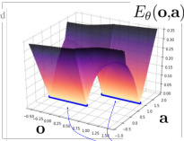

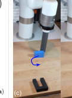

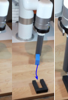

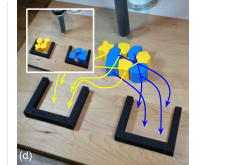

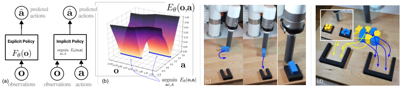

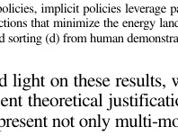

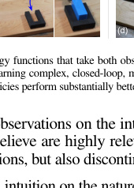

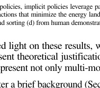

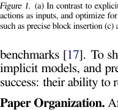

**y** ˆ = argmin **y** _Eθ_ ( **x** _,_ **y** ). We use techniques from the energy-based model (EBM) literature to train
such a model. Given a dataset of samples _{_ **x** _i,_ **y** _i}_, and regression bounds **y** min _,_ **y** max _∈_ R _[m]_, training
consists of generating a set of negative counter-examples _{_ **y** ˜ _i_ _[j][}]_ _j_ _[N]_ =1 [neg.] [for each sample] **[ x]** _[i]_ [ in a batch, and]
employing an InfoNCE-style [18] loss function. This loss equates to the negative log likelihood of
_pθ_ ( **y** _|_ **x** )= [exp(] _Z_ _[−]_ ( _[E]_ **x** _[θ]_ _,θ_ [(] **[x]** ) _[,]_ **[y]** [))], and the counter-examples are used to estimate _Z_ ( **x** _i,θ_ ):

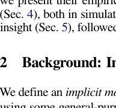

_L_ InfoNCE =

_N_

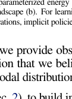

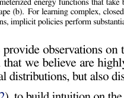

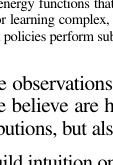

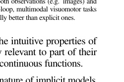

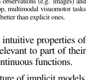

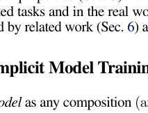

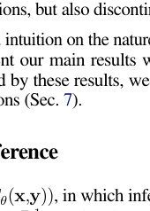

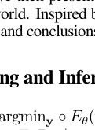

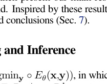

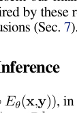

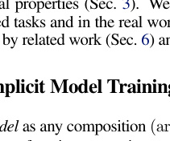

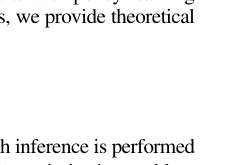

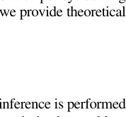

- _−_ log� _p_ ˜ _θ_ ( **y** _i|_ **x** _, {_ **y** ˜ _i_ _[j][}]_ _j_ _[N]_ =1 [neg.][)] - _,_ _p_ ˜ _θ_ ( **y** _i|_ **x** _, {_ **y** ˜ _i_ _[j][}]_ _j_ _[N]_ =1 [neg.][)=] _e_ _[−][E][θ]_ [(] **[x]** _[i][,]_ **[y]** _[i]_ [)]

_i_ =1 _e_ _[−][E][θ]_ [(] **[x]** _[i][,]_ **[y]** _[i]_ [)] + ~~[�]~~ _[N]_ _j_ =1 [neg] _[e]_

_e_ _[−][E][θ]_ [(] **[x]** _[i][,]_ **[y]** _[i]_ [)] + ~~[�]~~ _[N]_ _j_ =1 [neg] _[e][−][E][θ]_ [(] **[x]** _[i][,]_ **[y]** [˜] _i_ _[j]_ [)]

With a trained energy model _Eθ_ ( **x** _,_ **y** ), implicit inference can be performed with stochastic optimization
to solve ˆ **y** =argmin **y** _Eθ_ ( **x** _,_ **y** ). To demonstrate a breadth of approaches, we present results with three
different EBM training and inference methods discussed below, however a comprehensive comparison of all
EBM variants is outside the scope of this paper; see [19] for a comprehensive reference. We use either a) a
derivative-free (sampling-based) optimization procedure, b) an auto-regressive variant of the derivative-free
optimizer which performs coordinate descent, or c) gradient-based Langevin sampling [11, 12] with gradient
penalty [20] loss during training – see the Appendix for descriptions and comparisons of these choices.

**3** **Intriguing Properties of Implicit vs. Explicit Models**

Consider an explicit model **y** = _fθ_ ( **x** ), and an implicit model argmin **y** _Eθ_ ( **x** _,_ **y** ) where both _fθ_ ( _·_ ) and _Eθ_ ( _·_ )
are represented by almost-identical network architectures. Comparing these models, we examine: (i) how do
they perform near discontinuities?, (ii) how do they fit multi-valued functions?, and (iii) how do they extrapolate? For both _fθ_ and _Eθ_ we use almost-identical ReLU-activation fully-connected Multi-Layer Perceptrons
(MLPs), with the only difference being the additional input of **y** in the latter. Explicit “MSE” models are
trained with Mean Square Error (MSE), explicit “MDN” models are Mixture Density Networks (MDN)

[21], and implicit “EBM” models are trained with _L_ InfoNCE and optimized with derivative-free optimization.
Figs. 2, 3 show models trained on a number of R [1] _→_ R [1] functions (Fig. 2) and multi-valued functions
(Fig. 3). For each of these we examine regions of discontinuities, multi-modalities, and/or extrapolation.

**Discontinuities.** Implicit models are able to approximate discontinuities sharply without introducing
intermediate artifacts (Fig. 2a), whereas explicit models (Fig. 2d), because they fit a continuous function
to the data, take every intermediate value between training samples. As the frequency of discontinuities
increases, the implicit model predictions remain sharp at discontinuities, while also respecting local
continuities, and with piece-wise linear extrapolations up to some decision boundary between training

2

Implicit

**y** = arg min

_Eθ_ ( **x**, **y** )

**y**

ReLU-MLP trained as EBM
2:512:512:1
5k steps

shown density is:

normalized

_y_ ( _Eθ_ ( **x**, **y** ))

|Col1|Col2|
|---|---|
|||
|||
|||
|x   )|x   )|

|Col1|y|Col3|Col4|Col5|
|---|---|---|---|---|
||y ||||
||y |x|x|x|

Explicit

**y** = _fθ_ ( **x** )

ReLU-MLP trained with MSE
1:512:512:1
20k steps

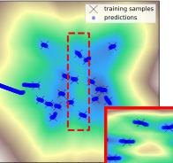

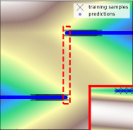

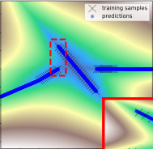

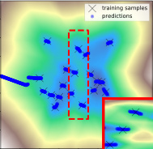

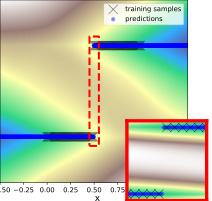

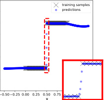

|Col1|y|Col3|Col4|
|---|---|---|---|
||y |||
||y |x |x |

_Figure 2._ Comparison between implicit vs explicit learning of 1D functions, R [1] _→_ R [1], showing extrapolation (outside of _x_ =[0 _,_ 1]) behavior beyond
training samples and detailed views (red insets) of interpolation behavior at discontinuities. (a,d) Single discontinuity between constant values; (b,e)
piecewise continuous sections with differing _dx_ _[dy]_ [, (c,f) random Gaussian noise, for unregularized models.]

Implicit
ReLU-MLP trained as EBM
2:512:512:1
5k steps

shown density is:
normalized(softmin

_y_ (softmin _y_

_y_ ( _Eθ_ ( **x**, **y** )))

|Col1|Col2|
|---|---|
|||
|( c )||

Explicit
ReLU-MLP trained as MDN
1:512:512:10 gaussians
5k steps

shown density is:

1 − _pθ_ ( **y** | **x** )

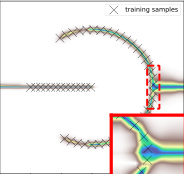

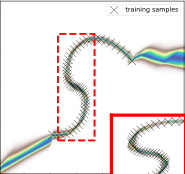

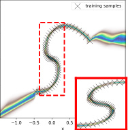

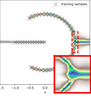

|Col1|Col2|
|---|---|
|||

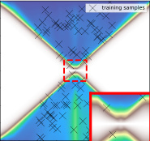

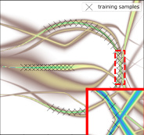

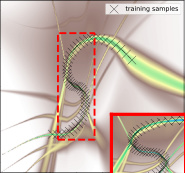

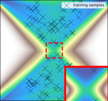

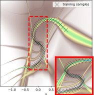

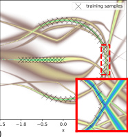

_Figure 3._ Representations of multi-valued functions showing extrapolations beyond the training samples (outside of shown ‘X’ training samples) and
detail views of notable regions. (a,d) Split circle with discontinuities and mode count changes; (b,e) locally continuous curve exhibiting hysteretic
behavior, (c,f) set function of disjoint uniformly valid ranges.

examples (Fig. 2a-c). The explicit model interpolates across each discontinuity (Fig. 2d-f). Once the
training data is uncorrelated (i.e. random noise) and without regularization (Fig. 2c, Fig. 2f), implicit
models exhibit a nearest-neighbors-like behavior, though with non-zero _∂x_ _[∂y]_ [segments around each sample.]

**Extrapolation.** For extrapolation outside the convex hull of the training data (Fig. 2a-f), even with
discontinuous or multi-valued functions, implicit models often perform piecewise linear extrapolation
of the piecewise linear portion of the model nearest to the edge of the training data domain. Recent work

[22] has shown that explicit models tend to perform linear extrapolation, but the analysis assumes the
ground truth function is continuous.

**Multi-valued functions.** Instead of using argmin to identify a single optimal value, argmin may return a
set of values, which may either be interpreted probabilistically as sampling likely values from the distribution,
or in optimization as the _set_ of minimizers (argmin is set-valued). Fig. 3 compares a ReLU-MLP trained
as a Mixture Density Network (MDN) vs an EBM across three example multi-valued functions.

3

**Visual Generalization** Of particular relevance to learning visuomotor policies, we also find striking
differences in extrapolation ability with converting high-dimensional image inputs into continuous outputs.
Fig. 4 shows how on a simple visual coordinate regression task, which is a notoriously hard problem
for convolutional networks [23], an MSE-trained Conv-MLP model [24] with CoordConv [23] struggles
to extrapolate outside the convex hull of the training data. This is consistent with findings in [5, 25]. A
Conv-MLP trained via late fusion (Fig. 4b) as an EBM, on the other hand, extrapolates well with only a
few training data samples, achieving 1 to 2 orders of magnitude lower test-set error in the low-data regime
(Fig. 4d). This is additional evidence that distinguishes implicit models from explicit models in a distinct
way from multi-modality, which is absent in this experiment.

_Figure 4._ Comparison of implicit and explicit ConvMLP models on a simple coordinate regression task [23], R _[W]_ _[×][H][×][C]_ _→_ R [2] (a). The architectures
shown in (b) are trained on images (example in a) to regress the ( _u,v_ ) coordinate of a green few-pixel dot. The _spatial generalization_ plot (c) shows the
convex hull (gray dotted line) of the training data and shows that with only 10 training examples, the MSE-trained models struggle both to interpolate
and extrapolate (c, top left). At 30 train examples (c, top right) it can reasonably interpolate, but still struggles with extrapolation. ConvMLP-EBM,
instead (c,bottom) performs well with little data, with 1 to 2 orders of magnitude lower test-set MSE loss (d) in the low-data regime.

**4** **Policy Learning Results**

_Figure 5._ Comparisons between implicit and explicit policies across 6 various simulated and real domains (Table 1), including author-reported baselines
on the human-expert D4RL tasks. See Appendix for full experimental protocol. Standard deviations are shown in Tables 2, 3, 4, 5, 6.

We evaluate implicit models for learning BC policies
across a variety of robotic task domains (Fig. 5). The image human unknown multimodal

Benchmark input demos cardinality solutions

goals of our experiments are three-fold: (i) to compare
the performance of otherwise-identical policies when D4RL Human-ExpertsParticle Integrator
represented as either implicit or explicit models, (ii) to Block Pushing
test how well our models (both implicit and explicit) Planar Sweeping

Bi-Manual Sweeping

compare with author-reported baselines on a standard Real Robot
set of tasks, and (iii) to demonstrate that implicit models _Table 1._ Each benchmark is characterized by a unique set of attributes.
can be used to learn effective policies from human
demonstrations with visual observations on a real robot. The following results and discussions are
organized by task domain – each evaluating a unique set of desired properties for policy learning (Table 1).
All tasks are characterized by discontinuities and require generalization (e.g., extrapolation) to some degree.

**D4RL [17]** is a recent benchmark for offline reinforcement learning. We evaluate our implicit (EBM) and
explicit (MSE) policies across the subset of tasks for which offline datasets of human demonstrations are
provided, which is arguably is the hardest set of tasks. Surprisingly, we find that our implementations of

4

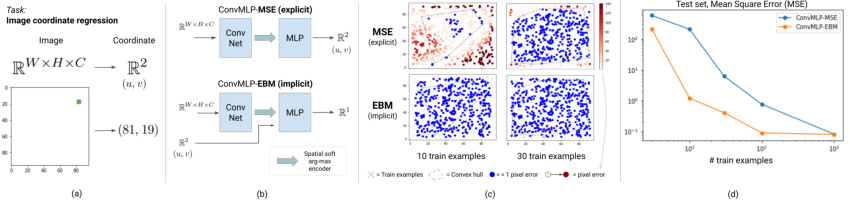

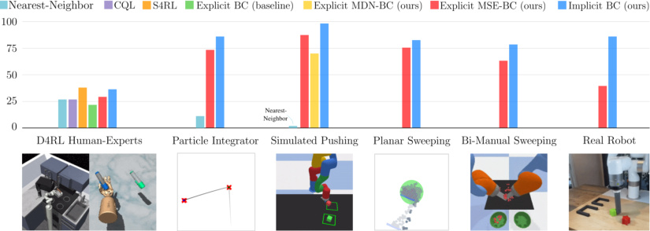

image human unknown multimodal
Benchmark input demos cardinality solutions

D4RL Human-Experts
Particle Integrator
Block Pushing
Planar Sweeping
Bi-Manual Sweeping
Real Robot

_Table 1._ Each benchmark is characterized by a unique set of attributes.

Baselines Ours

_Explicit_ _Implicit_ _Explicit_ _Implicit_
Method Nearest- BC CQL [26] S4RL [27] BC (MSE) BC (EBM) BC (MSE) BC (EBM)
Neighbor (from CQL [26]) w/ RWR [28] w/ RWR [28]

Uses data ( **o** _,_ **a** ) ( **o** _,_ **a** ) ( **o** _,_ **a** _,r_ ) ( **o** _,_ **a** _,r_ ) ( **o** _,_ **a** ) ( **o** _,_ **a** ) ( **o** _,_ **a** _,r_ ) ( **o** _,_ **a** _,r_ )

_Domain_ _Task Name_

kitchen-complete 1.92 _±_ 0.00 1.4 1.8 3.08 1.76 _±_ 0.04 **3.37** _±_ 0.19 1.22 _±_ 0.18 **3.37** _±_ 0.01
Franka kitchen-partial 1.70 _±_ 0.00 1.4 1.9 **2.99** 1.69 _±_ 0.02 1.45 _±_ 0.35 1.86 _±_ 0.26 2.18 _±_ 0.05
kitchen-mixed 1.46 _±_ 0.00 1.9 2.0 **2.15** _±_ **0.06** 1.51 _±_ 0.39 2.03 _±_ 0.06 **2.25** _±_ **0.14**

Adroit

pen-human 1908.0 _±_ 0.0 1121.9 1214.0 1419.6 2141 _±_ 109 **2586** _±_ **65** 2108 _±_ 58.8 **2446** _±_ **207**
hammer-human -85.2 _±_ 0.0 -82.4 300.2 **496.2** -38 _±_ 25 -133 _±_ 26 -35.1 _±_ 45.1 -9.3 _±_ 45.5
door-human 91.8 _±_ 0.0 -41.7 234.3 **736.5** 79 _±_ 15 361 _±_ 67 17.9 _±_ 13.8 399 _±_ 34
relocate-human -3.8 _±_ 0.0 -5.6 2.0 2.1 -3.5 _±_ 1.1 -0.1 _±_ 2.4 -3.7 _±_ 0.3 **3.6** _±_ **2.5**

_Table 2._ Baseline comparisons on D4RL [17] tasks with human-expert data. Results shown are the average of 3 random seeds, 100 evaluations each,
with _±_ std. dev. Baselines from [26] and [27] didn’t report standard deviations. See Appendix for more on experimental protocol.

both implicit and explicit policies significantly outperform the BC baselines reported on the benchmark,
and provide competitive results with state-of-the-art offline reinforcement learning results reported thus
far, including CQL [26] and S4RL [27]. By adding perhaps the simplest way to use reward information,
if we prioritize sampling to be only the top 50% of demonstrations sorted by their returns (similar to
Reward-Weighted Regression (RWR) [28]), this intriguingly generally improves implicit policies, in some
cases to new state-of-the-art performance, while less so for explicit models. This suggests that implicit BC
policies value data quality higher than explicit BC policies do. A simple Nearest-Neighbor baseline (see
Appendix) performs better than one might expect on these tasks, but on average not as well as implicit BC.

While many of the D4RL tasks have complex high-dimensional action spaces (up to 30-D), they do not
emphasize the full spectrum of task attributes (Table 1) we are interested in. The following tasks isolate
other attributes or introduce new ones, such as highly stochastic dynamics (i.e., single-point-of-contact
block pushing), complex multi-object interactions (many small particles), and combinatorial complexity.

**N-D Particle Integrator** is a simple environment with linear dynamics
but where a discontinuous oracle policy is used to generate training
demonstrations: once within the vicinity of goal-conditioned location
(Fig. 5, shown for _N_ = 2), the policy must switch to the second goal.
The benefit of studying this environment is two-fold: (i) it has none of
the complicating attributes in Table 1 and so allows us to study discontinuities in isolation, and (ii) we can define this simple environment to be
in _N_ dimensions. Varying _N_ from 1 to 32 dimensions, but holding the

_Figure 6._ Comparison of policy performance

number of demonstrations constant, we find we are able to train 95% on the _N_ -D particle environment, 2,000
successful implicit policies up to 16 dimensions, whereas explicit (MSE) demonstrations each.
policies can only do 8 dimensions with the same success rate. The Nearest-Neighbor baseline, meanwhile,
cannot generalize, and only performs well on the 1D task (see Appendix for more analysis).

**Simulated Pushing** consists of a simulated 6DoF robot
xArm6 in PyBullet [29] equipped with a small cylindrical Method Single Target, Multi Target, Single Target,states states pixels
end effector. The task is to push a block into the target goal EBM **100** _±_ **0** 99.0 _±_ 0.0 **100** _±_ **0**
zone, marked by a green square labeled on the tabletop. We MDN **100** _±_ **0** **99.7** _±_ **0.5** 10.0 _±_ 4.3
investigate 2 variants: (a) pushing a single block to a single MSENearest-Neighbor 98.34.0 _± ±_ 0.00.5 89.70.0 _± ±_ 0.04.8 87.04.3 _± ±_ 1.94.1
target zone, or (b) also pushing the block to a second goal

_Table 3._ Results on simulated xArm6 pushing tasks, average

zone (multistage). We evaluate implicit (EBM) and explicit of 3 random seeds, 100 evaluations each, with _±_ std. dev.
(MSE and MDN [30, 31]) policies on both variants, trained
from a dataset of 2,000 demonstrations using a scripted policy that readjusts its pushing direction if the
block slips from the end effector. Results in Table 3 show that all learning methods perform well on the
single-target task, while MSE struggles with the slightly longer task horizon. For the image-based task, the
MDN significantly struggles compared to MSE and EBM. The failures of the Nearest-Neighbor baseline,
with only 0-4% success rate, show that generalization is required for this task.

**Planar Sweeping** [32] is a 2D environment that consists of an agent (in the form of a blue stick) where the
task is to push a pile of 50 - 100 randomly positioned particles into a green goal zone. The agent has 3
degrees of freedom (2 for position, 1 for orientation). We train implicit (EBM) and explicit (MSE) policies
from 50 teleoperated human demonstrations, and test on episodes with unseen particle configurations. For
the image-based inputs, we also test two types of encoders with different forms of dimensionality reduction:
spatial soft(arg)max and average pooling over dense features (see Appendix for architecture descriptions).

5

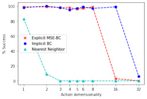

Method Single Target, Multi Target, Single Target,
states states pixels

EBM **100** _±_ **0** 99.0 _±_ 0.0 **100** _±_ **0**
MDN **100** _±_ **0** **99.7** _±_ **0.5** 10.0 _±_ 4.3
MSE 98.3 _±_ 0.5 89.7 _±_ 4.8 87.0 _±_ 4.1
Nearest-Neighbor 4.0 _±_ 0.0 0.0 _±_ 0.0 4.3 _±_ 1.9

_Table 3._ Results on simulated xArm6 pushing tasks, average
of 3 random seeds, 100 evaluations each, with _±_ std. dev.

For the state-based inputs, since the number of particles vary between episodes, we flatten the poses of the
particles and 0-pad the vector to match the size of the vector at maximum particle cardinality.

The results in Table 4 (averaged

image-based EBMs seem to syner
MSE image + softmax 62.9 _±_ 5.0 51.4 _±_ 8.9 56.6 _±_ 5.2

posed to pooling, which works best _Figure 7 & Table 4._ Image-based implicit (EBM) policies outperform explicit (MSE) ones in
for MSE explicit policies. In both learning to control the agent (blue) to sweep an unknown number of particles (gray) into a target
cases, state observations as inputs goal zone (green). Trained on 50 human demonstrations.
do not perform well compared with image pixel inputs. This is likely because the particles have symmetries
in image space, but not when observed as a vector of poses.

**Simulated Bi-Manual Sweeping** consists of two robot KUKA IIWA arms equipped with spatula-like end
effectors. The task is to scoop up randomly configured particles from a 0 _._ 4 _m_ [2] workspace and transport
them into two bowls, which should be filled up equally. Successfully scooping particles and transporting
them requires precise coordination between the two arms (e.g., such that the particles do not drop while
being transported to the bowls). The action space is 12DoF (6DoF Cartesian per arm), and each episode
consists of 700 steps recorded at 10Hz. Perspective RGB images from a simulated camera are used as
visual input, along with current end effector poses as state input. The task is characterized by many mode
changes and discontinuities (transitioning from scooping to lifting, from lifting to transporting, and deciding
which bowl to transport to). EBM and MSE policies on the task use the best corresponding image encoder
from the planar sweeping task. As shown in Table 5, our results show that EBM outperforms MSE by 14%.

Method Input and Encoder Success %

EBM image + softmax **78.2** _±_ 2.7
MSE image + pool 63.9 _±_ 7.7

_Figure 8 & Table 5._ Image-based implicit (EBM) policies outperform explicit (MSE) ones in learning to control two robot arms (6DoF + 6DoF) with
spatula-like end effectors to scoop up particles (red) from a workspace and equally distribute them across two bowls (green). Success % is the average
ratio of particles successfully moved into the bowls across 10 rollouts over 3 different model seeds. Trained on 1,000 scripted demonstrations.

**Real Robot Manipulation**, using a cylindrical end-effector on an xArm6 robot (Fig. 9a), we evaluate
implicit BC and explicit BC policies on 4 real-world manipulation pushing tasks: 1) pushing a red block
and a green block into assigned target fixtures, 2) pushing the red and green blocks into either target fixture,
in either order, 3) precise pushing and insertion of a blue block into a tight (1mm tolerance) target fixture,
and 4) sortation of 4 blue blocks and 4 yellow into different targets. The observation input is only raw
perspective RGB images at 5Hz, with task horizons up to 60 seconds, and teleoperated demonstrations.

Task Push-Red-then-Green Push-Red/Green-Multimodal Insert-Blue Sort-Blue-from-Yellow

# demos 95 410 223 502
Avg. lengths _±_ std. 19.1 _±_ 2.5 19.0 _±_ 3.1 22.1 _±_ 5.5 45.2 _±_ 8.2

[min, max] (seconds) [14.2, 25.1] [11.8, 28.1] [13.0, 43.5] [25.8, 60.5]

Success criterion 1.0 if both blocks in target 1.0 if both blocks in target 0.5 for partial insert1.0 for full insert 18 [for each correct block in target]

_Success avg. (%)_
Implicit BC (EBM) **85.0** _±_ **5.0** **88.3** _±_ **7.6** **83.3** _±_ **3.8** **48.3** _±_ **4.6**
Explicit BC (MSE) 35.0 _±_ 18.0 55.0 _±_ 18.0 6.7 _±_ 9.4 19.6 _±_ 1.5

_Table 6._ Real-world robot results, success % shown is mean +/- std.dev (20 rollouts per seed, 3 seeds = 60 trials per method per task).

Across all four tasks, we observe significantly higher performance for the implicit policies compared to
the explicit baseline. This is especially apparent on the pushing-and-oriented-insertion task ( _Insert Blue_ ),
which requires highly discontinuous behavior in order to subtly nudge enough, but not too far, the block
into place (Fig. 9c). On this task we see the implicit BC policy has an _order of magnitude_ higher success
rate than the explicit BC policy. The sorting task in particular ( _Sort-Blue-From-Yellow_, Fig. 9d) is our
attempt to push the generalization abilities of our models, and we see a 2.4x higher success rate for the

6

# ResNet layers

Method Input & Encoder 8 14 20

EBM image + softmax 78.7 _±_ 4.9 82.1 _±_ 0.9 **82.6** _±_ **3.1**
EBM image + pool 78.0 _±_ 2.2 76.5 _±_ 1.0 74.2 _±_ 1.9
EBM state 28.7 _±_ 0.8 29.2 _±_ 0.5 28.9 _±_ 0.2

MSE image + softmax 62.9 _±_ 5.0 51.4 _±_ 8.9 56.6 _±_ 5.2
MSE image + pool 75.6 _±_ 1.3 73.9 _±_ 1.7 74.8 _±_ 1.2
MSE state 28.9 _±_ 0.2 28.2 _±_ 0.4 27.8 _±_ 0.3

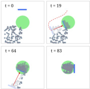

_Figure 7 & Table 4._ Image-based implicit (EBM) policies outperform explicit (MSE) ones in
learning to control the agent (blue) to sweep an unknown number of particles (gray) into a target
goal zone (green). Trained on 50 human demonstrations.

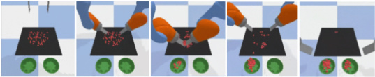
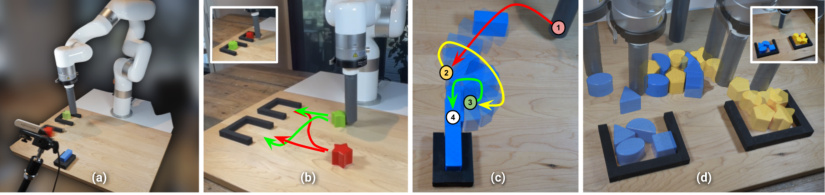

_Figure 9._ Results using our hardware configuration (a, see Appendix for full description) on real-world visual manipulation tasks, including (b)
multi-modal targeted block pushing, (c) precise oriented insertion requiring 1mm precision, and (d) a combinatorially complex sorting task.

implicit policy. Note these experimental results are averaged over 3 different models, for each task, for
each policy type. The red/green pushing tasks, including multi-modal variant (Fig. 9b), also show notably
higher success rates for the implicit policies. These real-world results are best appreciated in our video.

**5** **Theoretical Insight: Universal Approximation with Implicit Models**

In previous sections, we have empirically demonstrated the ability of implicit models to handle discontinuities (Section 3), and we hypothesized this is one of the reasons for the strong performance of implicit
BC policies (Section 4). Two theoretical questions we now ask are: (i) is there a provable notion for _what_
_class of functions_ can be represented by implicit models given some analytical _E_ ( _·_ ), and (ii) given that
energy functions learned from data may always be expected to have non-zero error of approximating any
function, are there inference risks with large behaviour shifts resulting from a combination of argmin and
spurious peaks in _E_ ( _·_ )? Recent work [33] has shown that a large class of functions (namely, functions
defined by finitely many polynomial inequalities) can be approximated implicitly by argmin **y** _g_ ( **x** _,_ **y** ) using
SOS polynomials to represent _g_ ( _·_ ). Here we show that for implicit models with _gθ_ represented by any
continuous function approximator (such as a deep ReLU-MLP network), argmin **y** _gθ_ ( **x** _,_ **y** ) can represent a
larger set of functions including multi-valued functions and discontinuous functions (Thm. 1), to arbitrary
accuracy (Thm. 2). These results are stated formally in the following; proofs are in the Appendix.

**Theorem 1.** _For any set-valued function F_ ( **x** ): **x** _∈_ R _[m]_ _→P_ (R _[n]_ ) _\{∅} where the graph of F is closed,_
_there exists a continuous function g_ ( **x** _,_ **y** ): R _[m]_ [+] _[n]_ _→_ R [1] _, such that_ argmin _g_ ( **x** _,_ **y** )= _F_ ( **x** ) _for all_ **x** _._
**y**

_Figure 10._ Visual explanation of the results presented in Thms. 1 and Thms. 2, the construction of a continuous function _g_ ( _x, y_ ) for which
argmin _y g_ ( _x,y_ ) yields _f_ ( _x_ ) = _{{_ 1 _,_ 0 _}_ if _x_ = 1 _,_ 1 if _x >_ 1 _,_ 0 otherwise _}_ . The function _g_ ( _·_ ) (b) is the minimum distance to the graph of
_f_ (), for example the infimum over a set of cones (a). The approximation guarantee (Thm. 2) can be visualized via the level-sets of _g_ ( _·_ ) (b,c), and a
slice (d) of _g_ ( _·_ ). For more explanation, see the Appendix.

.
**Theorem 2.** _For any set-valued function F_ ( **x** ): **x** _∈_ R _[m]_ _→P_ (R _[n]_ ) _\{∅}, there exists a function g_ ( _·_ ) _that_
_can be approximated by some continuous function approximator gθ_ ( _·_ ) _with arbitrarily small bounded error_
_ϵ, such that_ ˆ **y** = _argmin_ _gθ_ ( **x** _,_ **y** ) _provides the guarantee that the distance from_ ( **x** _,_ **y** ˆ) _to the graph of F is_
**y**

_less than ϵ._

Of practical note, explicit functions ( _F_ ( **x** ) in Thms. 1 and 2) with arbitrarily small or large Lipschitz
constants can be approximated by an implicit function with bounded Lipschitz constant (see Appendix
for more discussion). This means that implicit functions can approximate steep or discontinuous explicit
functions without large gradients in the function approximator that may cause generalization issues. This is
not the case for explicit continuous function approximators, which must match the large gradient of the
approximated function. In both their multi-valued nature and discontinuity-handling, the approximation
capabilities of implicit models are distinctly superior to explicit models. See Fig. 10 for visual intuition,
and more discussion in the Appendix.

7

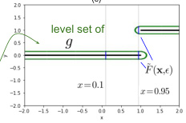

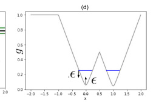

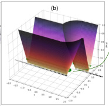

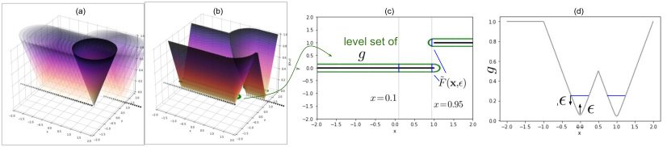

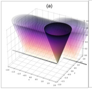
**6** **Related Work**

**Energy-Based Models, Implicit Learning.** Reviews of energy-based models can be found in LeCun et al.

[10] and Song & Kingma [19]. Du & Mordatch [12] proposed Langevin MCMC [11] sampling for training
and implicit inference, and argued for several strengths of implicit generation, including compositionality
and empirical results such as out-of-distribution generalization and long-horizon sequential prediction.
A general framework for energy-based learning of behaviors is also presented in [34]. In applications,
energy based models have recently shown state-of-the-art results across a number of domains, including
various computer vision tasks [35, 36], as well as generative modeling tasks such as image and text
generation [12, 37, 38]. Many other works have investigated using the notion of implicit functions in
learning, including works that investigate implicit layers [39, 40, 41, 42]. There is also a surge of interest in
geometry representation learning in implicit representations [43, 44, 45, 46]. In robotics, implicit models
have been developed for modeling discontinuous contact dynamics [47].

**Energy-Based Models in Policy Learning** . In reinforcement learning, [13] uses an EBM formulation as
the policy representation. Other recent work [14] uses EBMs in a model-based planning framework, or
uses EBMs in imitation learning [48] but with an on-policy algorithm. A trend as well in recent RL works
has been to utilize an EBM as part of an overall algorithm, i.e. [15, 16].)

**Policy Learning via Imitation Learning.** In addition to behavioral cloning (BC) [1], the machine learning
and robotics communities have explored many additional approaches in imitation learning [49, 50, 51], often
in ways that need additional information. One route is by collecting on-policy data of the learned policy,
and potentially either labeling with rewards to perform on-policy reinforcement learning (RL) [52, 53, 54]
or labeling actions by an expert [2]. Distribution-matching algorithms like GAIL [7] require no labeling,
but may require millions of on-policy environment interactions. While algorithms like ValueDice [55]
implement distribution matching in a sample-efficient off-policy setting, they have not been proven on
image-observations or high degree-of-freedom action spaces. Another route to using more information
beyond BC is for the off-policy data to be labeled with rewards, which is the focus of the offline RL
community [17]. All of these directions are good ideas. A perhaps not fully appreciated finding, however,
is that in some cases even the simplest forms of BC can yield surprisingly good results. On offline RL
benchmarks, prior works’ implementations of BC already show reasonably competitive results with offline
RL algorithms [17, 56]. In real-world robotics research, BC has been widely used in policy learning

[4, 30, 5, 25]. Perhaps the success of BC comes from its _simplicity_ : it has the lowest data collection
requirements (no reward labels or on-policy data required), can be data-efficient [5, 25], and it is arguably
the simplest to implement and easiest to tune (with fewer hyperparameters than RL-based methods).

**Approximation of Discontinuous Functions.** The foundational results of Cybenko [57] and others in
Universal Approximation of neural networks have had foundational impact in guiding machine learning
research and applications. Various approaches have been developed in the function approximation literature
and elsewhere to approximate discontinuous functions [58, 59, 60, 61], which typically do not use neural
networks. Also motivated by applications to modeling phenomena for robots, [62] develops theory of
approximating discontinuous functions with neural networks, but the method requires a-priori knowledge
of the discontinuity’s location. Our work builds on the well-known and well-applied results in continuous
neural networks, but through composition with argmin provides a notion of universal approximation even
for discontinuous, set-valued functions.

**7** **Conclusion**

In this paper we showed that reformulating supervised imitation learning as a conditional energy-based
modeling problem, with inference-time implicit regression, often greatly outperforms traditional explicit
policy baselines. This includes on tasks with _high-dimensional action spaces_ (up to 30-dimensional in
the D4RL human-expert tasks), _visual observations_, and _in the real world_ . In terms of limitations, a
primary comparison with explicit models is that they typically require more compute, both in training
and inference (see Appendix for comparisons). However, we have both shown that we can run implicit
policies for real-time vision-based control in the real world, and training time is modest compared to
offline RL algorithms. To further motivate the use of implicit models, we presented an intuitive analysis
of energy-based model characteristics, highlighting a number of potential benefits that, to the best of our
knowledge, are not discussed in the literature, including their ability to accurately model discontinuities.
Lastly, to ground our results theoretically we developed a notion of universal approximation for implicit
models which is distinct from that of explicit models.

8

**Acknowledgments**

The authors would like to thank Vikas Sindwhani for project direction advice; Steve Xu, Robert Baruch,
Arnab Bose for robot software infrastructure; Jake Varley, Alexa Greenberg for ML infrastructure; and
Kamyar Ghasemipour, Jon Barron, Eric Jang, Stephen Tu, Sumeet Singh, Jean-Jacques Slotine, Anirudha
Majumdar, Vincent Vanhoucke for helpful feedback and discussions.

**References**

[1] D. A. Pomerleau. Alvinn: An autonomous land vehicle in a neural network. Technical report, Carnegie Melon
Univ. Pittsburgh, PA. Artificial Intelligence and Psychology., 1989.

[2] S. Ross, G. Gordon, and D. Bagnell. A reduction of imitation learning and structured prediction to no-regret
online learning. In _Proceedings of the fourteenth international conference on artificial intelligence and statistics_,
pages 627–635. JMLR Workshop and Conference Proceedings, 2011.

[3] S. Tu, A. Robey, T. Zhang, and N. Matni. On the sample complexity of stability constrained imitation learning.
_arXiv preprint arXiv:2102.09161_, 2021.

[4] T. Zhang, Z. McCarthy, O. Jow, D. Lee, X. Chen, K. Goldberg, and P. Abbeel. Deep imitation learning for
complex manipulation tasks from virtual reality teleoperation. In _2018 IEEE International Conference on_
_Robotics and Automation (ICRA)_, pages 5628–5635. IEEE, 2018.

[5] P. Florence, L. Manuelli, and R. Tedrake. Self-supervised correspondence in visuomotor policy learning. _IEEE_
_Robotics and Automation Letters_, 5(2):492–499, 2019.

[6] A. Zeng, S. Song, J. Lee, A. Rodriguez, and T. Funkhouser. Tossingbot: Learning to throw arbitrary objects with
residual physics. _IEEE Transactions on Robotics_, 2020.

[7] J. Ho and S. Ermon. Generative adversarial imitation learning. _Advances in neural information processing_
_systems_, 29:4565–4573, 2016.

[8] P. Abbeel and A. Y. Ng. Apprenticeship learning via inverse reinforcement learning. In _Proceedings of the_
_twenty-first international conference on Machine learning_, 2004.

[9] J. Ho, J. Gupta, and S. Ermon. Model-free imitation learning with policy optimization. In _International_
_Conference on Machine Learning_ . PMLR, 2016.

[10] Y. LeCun, S. Chopra, R. Hadsell, M. Ranzato, and F. Huang. A tutorial on energy-based learning. _Predicting_
_structured data_, 1(0), 2006.

[11] M. Welling and Y. W. Teh. Bayesian learning via stochastic gradient langevin dynamics. In _Proceedings of the_
_28th international conference on machine learning (ICML-11)_, pages 681–688. Citeseer, 2011.

[12] Y. Du and I. Mordatch. Implicit generation and modeling with energy based models. _Advances in Neural_
_Information Processing Systems_, 32:3608–3618, 2019.

[13] T. Haarnoja, H. Tang, P. Abbeel, and S. Levine. Reinforcement learning with deep energy-based policies. In
_International Conference on Machine Learning_, pages 1352–1361. PMLR, 2017.

[14] Y. Du, T. Lin, and I. Mordatch. Model-based planning with energy-based models. In L. P. Kaelbling, D. Kragic,
and K. Sugiura, editors, _Proceedings of the Conference on Robot Learning_, volume 100 of _Proceedings of_
_Machine Learning Research_, pages 374–383. PMLR, 30 Oct–01 Nov 2020.

[15] I. Kostrikov, J. Tompson, R. Fergus, and O. Nachum. Offline reinforcement learning with fisher divergence critic
regularization. _arXiv preprint arXiv:2103.08050_, 2021.

[16] O. Nachum and M. Yang. Provable representation learning for imitation with contrastive fourier features. _arXiv_
_preprint arXiv:2105.12272_, 2021.

[17] J. Fu, A. Kumar, O. Nachum, G. Tucker, and S. Levine. D4rl: Datasets for deep data-driven reinforcement
learning. _arXiv preprint arXiv:2004.07219_, 2020.

[18] A. v. d. Oord, Y. Li, and O. Vinyals. Representation learning with contrastive predictive coding. _arXiv preprint_
_arXiv:1807.03748_, 2018.

[19] Y. Song and D. P. Kingma. How to train your energy-based models. _arXiv preprint arXiv:2101.03288_, 2021.

9

[20] A. Jolicoeur-Martineau and I. Mitliagkas. Gradient penalty from a maximum margin perspective. _arXiv preprint_
_arXiv:1910.06922_, 2021.

[21] C. M. Bishop. Mixture density networks. _Neural Computing Research Group Report_, 1994.

[22] K. Xu, M. Zhang, J. Li, S. S. Du, K.-i. Kawarabayashi, and S. Jegelka. How neural networks extrapolate: From
feedforward to graph neural networks. _arXiv preprint arXiv:2009.11848_, 2020.

[23] R. Liu, J. Lehman, P. Molino, F. Petroski Such, E. Frank, A. Sergeev, and J. Yosinski. An intriguing failing of
convolutional neural networks and the coordconv solution. _Advances in Neural Information Processing Systems_,
31, 2018.

[24] S. Levine, C. Finn, T. Darrell, and P. Abbeel. End-to-end training of deep visuomotor policies. _The Journal of_
_Machine Learning Research (JMLR)_, 2016.

[25] A. Zeng, P. Florence, J. Tompson, S. Welker, J. Chien, M. Attarian, T. Armstrong, I. Krasin, D. Duong,
V. Sindhwani, et al. Transporter networks: Rearranging the visual world for robotic manipulation. In _Conference_
_on Robot Learning_, 2020.

[26] A. Kumar, A. Zhou, G. Tucker, and S. Levine. Conservative q-learning for offline reinforcement learning.
_Advances in Neural Information Processing Systems (NeurIPS)_, 2020.

[27] S. Sinha and A. Garg. S4rl: Surprisingly simple self-supervision for offline reinforcement learning. _arXiv_
_preprint arXiv:2103.06326_, 2021.

[28] J. Peters and S. Schaal. Reinforcement learning by reward-weighted regression for operational space control. In
_Proceedings of the 24th international conference on Machine learning_, pages 745–750, 2007.

[29] E. Coumans and Y. Bai. Pybullet, a python module for physics simulation for games, robotics and machine
learning. _GitHub Repository_, 2016.

[30] R. Rahmatizadeh, P. Abolghasemi, L. Bölöni, and S. Levine. Vision-based multi-task manipulation for inexpensive
robots using end-to-end learning from demonstration. In _2018 IEEE international conference on robotics and_
_automation (ICRA)_, pages 3758–3765. IEEE, 2018.

[31] D. Ha and J. Schmidhuber. Recurrent world models facilitate policy evolution. In _Advances in Neural Information_
_Processing Systems 31_, pages 2451–2463, 2018.

[32] H. Suh and R. Tedrake. The surprising effectiveness of linear models for visual foresight in object pile
manipulation. _Workshop on Algorithmic Foundations of Robotics (WAFR)_, 2020.

[33] S. Marx, E. Pauwels, T. Weisser, D. Henrion, and J. B. Lasserre. Semi-algebraic approximation using christoffel–
darboux kernel. _Constructive Approximation_, pages 1–39, 2021.

[34] I. Mordatch. Concept learning with energy-based models. _arXiv preprint arXiv:1811.02486_, 2018.

[35] F. K. Gustafsson, M. Danelljan, G. Bhat, and T. B. Schön. Energy-based models for deep probabilistic regression.
In _European Conference on Computer Vision_, pages 325–343. Springer, 2020.

[36] F. K. Gustafsson, M. Danelljan, R. Timofte, and T. B. Schön. How to train your energy-based model for
regression. _BMVC_, 2020.

[37] Y. Du, S. Li, B. J. Tenenbaum, and I. Mordatch. Improved contrastive divergence training of energy based models.
In _Proceedings of the 38th International Conference on Machine Learning (ICML-21)_, 2021.

[38] Y. Deng, A. Bakhtin, M. Ott, A. Szlam, and M. Ranzato. Residual energy-based models for text generation.
_ICLR_, 2020.

[39] B. Amos and J. Z. Kolter. Optnet: Differentiable optimization as a layer in neural networks. In _International_
_Conference on Machine Learning_, pages 136–145. PMLR, 2017.

[40] V. Niculae, A. Martins, M. Blondel, and C. Cardie. Sparsemap: Differentiable sparse structured inference. In
_International Conference on Machine Learning_, pages 3799–3808. PMLR, 2018.

[41] P.-W. Wang, P. Donti, B. Wilder, and Z. Kolter. Satnet: Bridging deep learning and logical reasoning using a
differentiable satisfiability solver. In _International Conference on Machine Learning_, pages 6545–6554. PMLR,
2019.

[42] S. Bai, J. Z. Kolter, and V. Koltun. Deep equilibrium models. _NeurIPS 2019_, 2019.

10

[43] J. J. Park, P. Florence, J. Straub, R. Newcombe, and S. Lovegrove. Deepsdf: Learning continuous signed distance
functions for shape representation. In _Proceedings of the IEEE/CVF Conference on Computer Vision and Pattern_
_Recognition_, pages 165–174, 2019.

[44] L. Mescheder, M. Oechsle, M. Niemeyer, S. Nowozin, and A. Geiger. Occupancy networks: Learning 3d
reconstruction in function space. In _Proceedings of the IEEE/CVF Conference on Computer Vision and Pattern_
_Recognition_, pages 4460–4470, 2019.

[45] Z. Chen and H. Zhang. Learning implicit fields for generative shape modeling. In _Proceedings of the IEEE/CVF_
_Conference on Computer Vision and Pattern Recognition_, pages 5939–5948, 2019.

[46] S. Saito, Z. Huang, R. Natsume, S. Morishima, A. Kanazawa, and H. Li. Pifu: Pixel-aligned implicit function
for high-resolution clothed human digitization. In _Proceedings of the IEEE/CVF International Conference on_
_Computer Vision_, pages 2304–2314, 2019.

[47] S. Pfrommer, M. Halm, and M. Posa. Contactnets: Learning discontinuous contact dynamics with smooth,
implicit representations. _arXiv preprint arXiv:2009.11193_, 2020.

[48] M. Liu, T. He, M. Xu, and W. Zhang. Energy-based imitation learning. _arXiv preprint arXiv:2004.09395_, 2020.

[49] T. Osa, J. Pajarinen, G. Neumann, J. A. Bagnell, P. Abbeel, and J. Peters. An algorithmic perspective on imitation
learning. _arXiv preprint arXiv:1811.06711_, 2018.

[50] X. B. Peng, P. Abbeel, S. Levine, and M. van de Panne. Deepmimic: Example-guided deep reinforcement
learning of physics-based character skills. _ACM Transactions on Graphics (TOG)_, 37(4):1–14, 2018.

[51] X. B. Peng, Z. Ma, P. Abbeel, S. Levine, and A. Kanazawa. Amp: Adversarial motion priors for stylized
physics-based character control. _arXiv preprint arXiv:2104.02180_, 2021.

[52] C. G. Atkeson and S. Schaal. Robot learning from demonstration. In _ICML_, volume 97, pages 12–20. Citeseer,
1997.

[53] A. Y. Ng, S. J. Russell, et al. Algorithms for inverse reinforcement learning. In _Icml_, volume 1, page 2, 2000.

[54] A. Rajeswaran, V. Kumar, A. Gupta, G. Vezzani, J. Schulman, E. Todorov, and S. Levine. Learning complex
dexterous manipulation with deep reinforcement learning and demonstrations. _arXiv preprint arXiv:1709.10087_,
2017.

[55] I. Kostrikov, O. Nachum, and J. Tompson. Imitation learning via off-policy distribution matching. In _International_
_Conference on Learning Representations_, 2020.

[56] C. Gulcehre, Z. Wang, A. Novikov, T. L. Paine, S. G. Colmenarejo, K. Zolna, R. Agarwal, J. Merel,
D. Mankowitz, C. Paduraru, et al. Rl unplugged: Benchmarks for offline reinforcement learning. _arXiv_
_preprint arXiv:2006.13888_, 2020.

[57] G. Cybenko. Approximation by superpositions of a sigmoidal function. _Mathematics of control, signals and_
_systems_, 2(4):303–314, 1989.

[58] P. Butzer, S. Ries, and R. Stens. Approximation of continuous and discontinuous functions by generalized
sampling series. _Journal of approximation theory_, 50(1):25–39, 1987.

[59] A. L. Tampos, J. E. C. Lope, and J. S. Hesthaven. Accurate reconstruction of discontinuous functions using
the singular pade-chebyshev method. _IAENG International Journal of Applied Mathematics_, 42(ARTICLE):
242–249, 2012.

[60] G. Kvernadze. Approximation of the discontinuities of a function by its classical orthogonal polynomial fourier
coefficients. _Mathematics of computation_, 79(272):2265–2285, 2010.

[61] E. Stella, C. Ladera, and G. Donoso. A very accurate method to approximate discontinuous functions with a
finite number of discontinuities. _arXiv preprint arXiv:1601.05132_, 2016.

[62] R. R. Selmic and F. L. Lewis. Neural-network approximation of piecewise continuous functions: application to
friction compensation. _IEEE transactions on neural networks_, 13(3):745–751, 2002.

[63] P.-T. De Boer, D. P. Kroese, S. Mannor, and R. Y. Rubinstein. A tutorial on the cross-entropy method. _Annals of_
_operations research_, 134(1):19–67, 2005.

[64] C. Nash and C. Durkan. Autoregressive energy machines. In _International Conference on Machine Learning_,
pages 1735–1744. PMLR, 2019.

11

[65] W. Grathwohl, K.-C. Wang, J.-H. Jacobsen, D. Duvenaud, M. Norouzi, and K. Swersky. Your classifier is secretly
an energy based model and you should treat it like one. _arXiv preprint arXiv:1912.03263_, 2019.

[66] T. Miyato, T. Kataoka, M. Koyama, and Y. Yoshida. Spectral normalization for generative adversarial networks.
In _International Conference on Learning Representations_, 2018.

[67] E. Bingham and H. Mannila. Random projection in dimensionality reduction: applications to image and text data.
In _Proceedings of the seventh ACM SIGKDD international conference on Knowledge discovery and data mining_,
pages 245–250, 2001.

[68] N. Srivastava, G. Hinton, A. Krizhevsky, I. Sutskever, and R. Salakhutdinov. Dropout: a simple way to prevent
neural networks from overfitting. _The journal of machine learning research_, 15(1):1929–1958, 2014.

[69] K. He, X. Zhang, S. Ren, and J. Sun. Identity mappings in deep residual networks. In _European conference on_
_computer vision_, pages 630–645. Springer, 2016.

[70] K. He, X. Zhang, S. Ren, and J. Sun. Deep residual learning for image recognition. _IEEE Conference on_
_Computer Vision and Pattern Recognition (CVPR)_, 2016.

12

## **Appendix for Implicit Behavioral Cloning**

**Contents**

**A Contributions Statement** **14**

**B** **Energy-Based Model Training and Implicit Inference Details** **14**

B.1 Method with Derivative-Free Optimization. . . . . . . . . . . . . . . . . . . . . . . . . 14

B.2 Method with Autoregressive Derivative-Free Optimization. . . . . . . . . . . . . . . . 15

B.3 Method with Gradient-based, Langevin MCMC . . . . . . . . . . . . . . . . . . . . . 16

B.3.1 Gradient Penalty . . . . . . . . . . . . . . . . . . . . . . . . . . . . . . . . . 16

B.4 Comparison of EBM Variants . . . . . . . . . . . . . . . . . . . . . . . . . . . . . . . 16

**C Additional Experimental Details and Analysis** **17**

C.1 Per-Task Summary of # Demonstrations and Environment Dimensionalities . . . . . . . 17

C.2 Training and Inference Times, Implicit vs. Explicit Comparison . . . . . . . . . . . . . 17

C.3 Additional Real-World Experimental Details . . . . . . . . . . . . . . . . . . . . . . . 18

C.3.1 Robot Hardware Configuration, Workspace, and Objects . . . . . . . . . . . . 18

C.3.2 Robot Policy and Controller . . . . . . . . . . . . . . . . . . . . . . . . . . . 18

C.4 Nearest-Neighbor Baseline . . . . . . . . . . . . . . . . . . . . . . . . . . . . . . . . 18

C.5 _N_ -D Particle Environment Description . . . . . . . . . . . . . . . . . . . . . . . . . . 19

C.6 Analysis: Training Data Sparsity in the _N_ -D Particle Tasks . . . . . . . . . . . . . . . 19

C.7 Additional D4RL tasks . . . . . . . . . . . . . . . . . . . . . . . . . . . . . . . . . . 19

**D Policy Learning Results Overview and Protocol** **20**

D.1 D4RL Experiments . . . . . . . . . . . . . . . . . . . . . . . . . . . . . . . . . . . . 20

D.2 Simulated Pushing Experiments . . . . . . . . . . . . . . . . . . . . . . . . . . . . . . 21

D.3 Simulated _N_ -D Particle Environment Experiments . . . . . . . . . . . . . . . . . . . . 23

D.4 Simulated Sweeping Experiments . . . . . . . . . . . . . . . . . . . . . . . . . . . . . 24

D.5 Real-world Pushing Experiments . . . . . . . . . . . . . . . . . . . . . . . . . . . . . 25

**E** **Model Architectures** **26**

E.1 MLPs . . . . . . . . . . . . . . . . . . . . . . . . . . . . . . . . . . . . . . . . . . . 26

E.2 ConvMLPs . . . . . . . . . . . . . . . . . . . . . . . . . . . . . . . . . . . . . . . . 26

**F** **Proofs** **26**

F.1 Definitions . . . . . . . . . . . . . . . . . . . . . . . . . . . . . . . . . . . . . . . . 26

F.2 Proofs . . . . . . . . . . . . . . . . . . . . . . . . . . . . . . . . . . . . . . . . . . . 27

**G Theory Implications and Discussion** **30**

**H Limitations** **30**

13

**A** **Contributions Statement**

Due to space constraints we did not include a comprehensive contributions statement in the main manuscript,
but include one here for clarity:

1. We present Implicit Behavioral Cloning (Implicit BC), which is a novel, simple method for
imitation learning in which behavioral cloning is cast as a conditional energy-based modeling
(EBM) problem, and inference is performed via sampling-based or gradient-based optimization.

2. We validate Implicit BC in real-world robot experiments, in which we demonstrate physical
robots performing several end-to-end, contact-rich pushing tasks (including precision insertion,
and multi-item sorting) driven with only images as input, and only human demonstrations
provided as training data. Implicit BC performs significantly better than our explicit BC baseline
across all real-world tasks, including an _order-of-magnitude_ increase in performance on the
precision insertion task. On the sorting task, the models are shown to be capable of solving
an up-to-60-second horizon for a contact-rich, combinatorial task with complex multi-object
collisions.

3. We present extensive simulation experiments comparing Implicit BC to both comparable explicit
models from the same codebase, and also author-reported quantitative results on the humanexpert tasks from the standard D4RL benchmark. We find both our explicit BC and implicit BC
models provide competitive or state-of-the-art performance on D4RL tasks with human-provided
demonstrations, despite using no reward information. Averaged across all tasks, we find implicit
BC outperforms our own best explicit BC models.

4. We analyze the nature of implicit models in simple 1D-1D examples, and we highlight aspects of
implicit models that we believe are not known to the generative modeling community, including
their behavior (i) at discontinuities and (ii) in extrapolation.

5. We provide theoretical insight into implicit models, including proofs of their (i) representational
abilities (Thm. 1), and (ii) approximation abilities (Thm. 2), which are shown to be distinct from
continuous explicit models in their ability to handle discontinuities and set-valued functions.

**B** **Energy-Based Model Training and Implicit Inference Details**

Our results critically depend on energy-based model (EBM) training, but we do not consider the specific
methods we use to be our main contributions (see Sec. A for a list). That said, after considerable experience
training conditional EBMs on both simple function-fitting tasks, and on policy learning tasks, we believe it is
useful to the research community to describe method specifics in detail. Our goal is to emphasize simplicity
when possible, in order to encourage more folks to use implicit energy-based regression rather than explicit
regression. We first review our approach using derivative-free optimization, then our autoregressive version,
and then our approach using Langevin gradient-based sampling. For each, we discuss (i) how to _train_ the
models, and (ii) how to perform _inference_ with the models. For a more comprehensive overview of training
EBMs, see [19]. Note we will release code as well for training and inference.

For all methods, to compute **y** min and **y** max we (1) take the per-dimension min and max over the training
data, (2) add a small buffer, typically 0.05( **y** max _−_ **y** min) on each side, and then (3) clip these min and
max values to the environments’ allowed min/max values. For agents that do not use the full range of the
environments’ allowed values for a given dimension, this enables more precision on that action dimension.
Also all methods use Adam optimizer with default _β_ 1 =0 _._ 9, _β_ 2 =0 _._ 999 values.

**B.1** **Method with Derivative-Free Optimization.**

For training, this method is very simple. For counter-examples we draw from the uniform random
distribution: ˜ **y** _∼U_ ( **y** min _,_ **y** max), where **y** min _,_ **y** max _∈_ R _[m]_ . Training consists of drawing batches of data,
sampling counterexamples for each sample in each batch, and applying _L_ InfoNCE (Sec. 2). We typically use
a batch size of 512, with 256 counter-examples per sample in the batch. All _{_ **x** _}_ and _{_ **y** _}_ (i.e. **o** and **a** for
observations and actions), in the training dataset are normalized to per-dimension zero-mean, unit variance.
We use typically a 1 _e−_ 3 initial learning rate and an exponential decay, 0.99 decay each 100 steps. We
find that regularizing the models with Dropout does not help performance, perhaps because the stochastic
training process (counter-example sampling in each training step) self-regularizes the models.

14

Given a trained energy model _Eθ_ ( **x** _,_ **y** ), we use the following derivative-free optimization algorithm to
perform inference:

**Algorithm 1:** Derivative-Free Optimizer

**Result:** ˆ **y**
Initialize: _{_ **y** ˜ _i}_ _[N]_ _i_ =1 [samples] _∼U_ ( **y** min _,_ **y** max), _σ_ = _σ_ init ;
**for** _iter in 1, 2, ..., Niters_ **do**

_{Ei}_ _[N]_ _i_ =1 [samples] = _{Eθ_ ( **x** _,_ **y** ˜ _i_ ) _}_ _[N]_ _i_ [samples] (compute energies);
_e_ _[−][Ei]_
_{p_ ˜ _i}_ _[N]_ _i_ =1 [samples] = _{_ ~~�~~ _Nj_ =1samples _e_ _[−][Ej]_ _[}]_ (softmax);

**if** _iter < Niters_ **then**

_{_ **y** ˜ _i}_ _[N]_ _i_ =1 [samples] _←∼_ Multinomial( _N_ samples _,{p_ ˜ _i}_ _[N]_ _i_ =1 [samples] _,{_ **y** ˜ _i}_ _[N]_ _i_ =1 [samples] ) (resample with replacement);
_{_ **y** ˜ _i}_ _[N]_ _i_ =1 [samples] _←{_ **y** ˜ _i}_ _[N]_ _i_ =1 [samples] + _∼N_ (0 _,σ_ ) (add noise);
_{_ **y** ˜ _i}_ _[N]_ _i_ =1 [samples] =clip( _{_ **y** ˜ _i}_ _[N]_ _i_ =1 [samples] _,_ **y** min _,_ **y** max) (clip to **y** bounds) ;
_σ_ _←Kσ_ (shrink sampling scale) ;
**y** ˆ =argmax( _{p_ ˜ _i},{_ **y** ˜ _i}_ )

Where Multinomial( _N_ samples _,{p_ ˜ _i}_ _[N]_ _i_ =1 [samples] _,{_ **y** ˜ _i}_ _[N]_ _i_ =1 [samples] ) refers to sampling _N_ samples times from the multinomial
distribution with probabilities _{p_ ˜ _i}_ _[N]_ _i_ =1 [samples] returning associated elements _{_ **y** ˜ _i}_ _[N]_ _i_ =1 [samples] . For simplicity the
noise is written as being drawn from _∼N_ (0 _,σ_ ), but this should be an _N_ samples-dimensional vector with
an independent Gaussian noise sample for each element. This algorithm is very similar to the Cross
Entropy Method [63], but has a few differences: (i) our algorithm does not use a fixed number of elites, (ii)
re-sampling with replacement, and (iii) we shrink the sampling variance via a prescribed schedule rather
than computing empirical variances. We typically use _σ_ init =0 _._ 33 _, K_ =0 _._ 5 _, N_ iters =3 _, N_ samples =16 _,_ 384,
unless otherwise noted.

While the above method works great for up to **y** of 5 dimensions or less (Sec. B.4), we look at both
autoregressive and gradient-based methods for scaling to higher dimensions.

**B.2** **Method with Autoregressive Derivative-Free Optimization.**

In the autoregressive version we interleave training and inference with _m_ models, for **y** _∈_ R _[m]_, i.e. one
model _Eθ_ _[j]_ [(] **[x]** _[,]_ **[y]** [:] _[j]_ [)][ for each dimension] _[ j]_ [ =1] _[,]_ [2] _[,...,m]_ [. Model] _[ E]_ _θ_ _[j]_ [(] **[x]** _[,]_ **[y]** [:] _[j]_ [)][ takes in all] **[ y]** [ dimensions up to] _[ j]_ [.]
This isolates sampling to one degree of freedom at a time, and enables scaling to higher dimensional action
spaces. For more on autoregressive energy models, see [64].

**Algorithm 2:** Autoregressive Derivative-Free Optimizer

**Result:** ˆ **y**
Initialize: _{_ **y** ˜ _i}_ _[N]_ _i_ =1 [samples] _∼U_ ( **y** min _,_ **y** max), _σ_ = _σ_ init ;
**for** _iter in 1, 2, ..., Niters_ **do**

**for** _j in 0, 1, ..., m_ **do**

_{Ei}_ _[N]_ _i_ =1 [samples] = _{Eθ_ _[j]_ [(] **[x]** _[,]_ **[y]** [˜] _i_ [:] _[j]_ [)] _[}]_ _i_ _[N]_ [samples] (compute energies);
_e_ _[−][Ei]_
_{p_ ˜ _i}_ _[N]_ _i_ =1 [samples] = _{_ ~~�~~ _Nj_ =1samples _e_ _[−][Ej]_ _[}]_ (softmax);

_→_ _if training, apply LInfoNCE and update parameters of Eθ_ _[j]_
**if** _iter < Niters_ **then**

_{_ **y** ˜ _i_ [:] _[j][}]_ _i_ _[N]_ =1 [samples] _←∼_ Multinomial( _N_ samples _,{p_ ˜ _i}_ _[N]_ _i_ =1 [samples] _,{_ **y** ˜ _i_ [:] _[j][}]_ _i_ _[N]_ =1 [samples] ) (resample with replacement);
_{_ **y** ˜ _i_ _[j][}][N]_ _i_ =1 [samples] _←{_ **y** ˜ _i_ _[j][}][N]_ _i_ =1 [samples] + _∼N_ (0 _,σ_ ) (add noise);
_{_ **y** ˜ _i}_ _[N]_ _i_ =1 [samples] =clip( _{_ **y** ˜ _i}_ _[N]_ _i_ =1 [samples] _,_ **y** min _,_ **y** max) (clip to **y** bounds) ;
_σ_ _←Kσ_ (shrink sampling scale) ;
**y** ˆ =argmax( _{p_ ˜ _i},{_ **y** ˜ _i}_ )

15

**B.3** **Method with Gradient-based, Langevin MCMC**

For gradient-based MCMC (Markov Chain Monte Carlo) training we use the approach described in [12, 34]
which uses stochastic gradient Langevin dynamics (SGLD) [11]:

_k_ **y** ˜ _ij_ [=] _[k][−]_ [1] **[y]** [˜] _i_ _[j]_ _[−][λ]_ �1 _i_ [)+] _[ω][k]_ [�] _, ω_ _[k]_ _∼N_ (0 _,σ_ )

2 _[∇]_ **[y]** _[E][θ]_ [(] **[x]** _[i][,][ k][−]_ [1] **[y]** [˜] _[j]_

Note that in the conditional case, _∇_ is respect to only **y**, and not **x** . As in [12, 34] we initialize _{_ [0] **y** ˜ _}_ from
the uniform distribution, similar to Sec. B.1, but then optimize these contrastive samples with MCMC. For
each _N_ neg, we run _N_ MCMC steps of the MCMC chain. As recommended in [65] we use a polynomiallydecaying schedule for the step-size _λ_ . Note backpropagation is not performed backwards through the
chain, but rather a `stop_gradient()` is used after implicitly generating the samples [12]. Also as in

[12] we clip gradient steps, choosing to clip the full ∆ **y** value, i.e. after the gradient and noise have been
combined. Additionally for inference we run the Langevin MCMC chain a second time, giving twice
as many inference Langevin steps as were used during training. Also, for Langevin, all _{_ **y** _}_ (i.e. **a** for
actions), in the training dataset are normalized per-dimension to span the range [ **y** min = _−_ 1 _,_ **y** max =1].

**B.3.1** **Gradient Penalty**

For additional stability of training, we use both spectral normalization [66] as in [12], and also add gradient
penalties. Gradient penalties are well known in the GAN community, and the form of our gradient penalty
is inspired by [20]:

_Lgrad_ =

_N_

_N_ neg

_i_ =1

_j_ =1

   - �2

- max 0 _,_ ( _||∇_ **y** _Eθ_ ( **x** _i,_ _[k]_ **y** ˜ _i_ _[j]_ [)] _[||][∞][−][M]_ [)]

_k_ = _{·}_

Where the sums over _i_, _j_, _k_, represent respectively the sum over training samples, counter-examples per
each data sample, and some subset of iterative chain samples for which we find it is sufficient to use only
the final step, _k_ = _{N_ MCMC _}_ . _M_ controls the scale of the gradient relative to the noise _ω_ in SGLD. If _M_
is too large, then the noise in SGLD has little effect; if _M_ is too small, then the noise overpowers the
gradient. Empirically we find _M_ =1 is a good setting. On each step of training, the gradient penalty loss is
simply added to the InfoNCE loss, i.e. _L_ = _L_ grad+ _L_ InfoNCE. Lastly, we note there are other approaches for
improving stability of Langevin-based training, such as loss functions with entropy regularization [37].

To aid intuition on why constraints on the gradients _∇E_ ( _·_ ) are allowable restrictions for the model,
Corollary 1.1 shows that the energy model is capable of having an arbitrary Lipschitz constant.

**B.4** **Comparison of EBM Variants**

A key comparison between these methods is the tradeoff
of simplicity for higher-dimensional action spaces. As
shown in Fig. 11, with only 2,000 demonstrations in the
_N_ -D particle environment, the joint-dimensions-optimized
derivative-free version (Sec. B.1) fails to solve the environment past _N_ =5 dimensions, due to the curse of dimensionality and its naive sampling. Both the autoregressive
(Sec. B.2) and Langevin (Sec. B.3) versions are able to
solve the environment reliably up to 16 dimensions, and
with nonzero success at 32 dimensions. The autoregressive version requires no new gradient stabilization, and can _Figure 11._ Comparison of used EBM methods on the _N_ -D
use only the same loss function, _L_ InfoNCE, but is memory- particle environment, showing methods using DFO (derivative-free optimization, Sec. B.1), autoregressive DFO (Sec. B.2), or
intensive, requiring _N_ separate models for _N_ dimensions. Langevin dynamics (Sec. B.3).
The Langevin version scales to high dimensions with only
one model, but requires gradient stabilization. For more on autoregressive and Langevin generative EBMs,
see [64] and [12, 37]. Which variant is used for each of our evaluation tasks is enumerated in Section D.

16

**C** **Additional Experimental Details and Analysis**

**C.1** **Per-Task Summary of # Demonstrations and Environment Dimensionalities**

In this section, with the table below, we highlight key aspects of the different evaluated policy learning
experimental tasks, specifically the # of demonstrations for each task and the dimensionalities of the
environments (comprised of the observation spaces, state spaces, and action spaces). As is highlighted in
the table, the various tasks cover a wide set of challenges, including: low-data-regime tasks, and tasks with
high observation, state, and/or action dimensionalities.

Demonstrations Dimensionalities

_Domain_ _Task Name_ # _Observations_ _States_ _Actions_ Results Shown In Comment

kitchen-complete **19** **60** **60** **9**

D4RL Human-Experts

Particle Integrator

kitchen-partial 601 **60** **60** **9**
kitchen-mixed 601 **60** **60** **9**
pen-human **50** **45** **45** **24**
hammer-human **25** **46** **46** **26**
door-human **25** **39** **39** **28**
relocate-human **25** **39** **39** **30**

"1D"-Particle 2,000 4 4 1

"2D"-Particle 2,000 8 8 2
"3D"-Particle 2,000 12 12 3
"4D"-Particle 2,000 16 16 4
"5D"-Particle 2,000 20 20 5
"6D"-Particle 2,000 24 24 6
"8D"-Particle 2,000 **32** **32** 8
"16D"-Particle 2,000 **64** **64** **16**
"32D"-Particle 2,000 **128** **128** **32**

Table 2

Figure 6

Single Target, States 2,000 10 10 2
Simulated Pushing Multi Target, States 2,000 13 13 2 Table 3
Single Target, Pixels 2,000 **129,600** 10 2 180x240x3 image

Image input **50** **27,648** **203** 3 96x96x3 image
Planar Sweeping Table 4
State input **50** **203** **203** 3

Bi-Manual Sweeping Image-and-state input 1,000 **27,660** **372** **12** Table 5 96x96x3 image

Push-Red-Then-Green **95** **32,400** 8 2

Real Robot

Push-Red/Green-Multimodal 410 **32,400** 8 2
Table 6 90x120x3 image.
Insert-Blue 223 **32,400** 8 2
Sort-Blue-From-Yellow 502 **32,400** **26** 2

_Table 7._ Summary of the # demonstrations and _observation/state/action-_ dimensionalities for each of the environments used in policy learning experiments. Highlighted in color are **(red), low-data-regime tasks** with # demos under 100, **(green), high observation dimensionality** above 25, **(blue),**
**high state dimensionality** above 25, and **(cyan), high action dimensionality** at or above 9.

**C.2** **Training and Inference Times, Implicit vs. Explicit Comparison**

**D4RL Train+Eval Times.** Table 8 compares example training + evaluation times for the chosen bestperforming models on the D4RL tasks. We report both the training steps/second, and then also the full
time for running an experiment, which comprises training to 100k steps with intermittently evaluating 100
episodes every 10k steps.

|Col1|Implicit BC|Explicit BC|Comment|
|---|---|---|---|
|Configuration _Summary:_|As in Section D.1 512 batch size 512x8 MLP 100 Langevin iterations 8 counter examples|As in Section D.1 512 batch size 2048x8 MLP||
|Device|TPUv3|TPUv3||
|Task|door-human-v0|door-human-v0||
|Training rate (steps/sec) Total train + eval time (hrs)|17.9 3.4|101.3 0.66|100k train steps, 100 evals every 10k steps|

_Table 8._ Comparison of training+evaluation times for implicit vs. explicit models on an example D4RL task.

As is shown in Table 8, the best-performing implicit models, which are 100-iteration Langevin models,
take 5.6x the train+eval time compared to the best-performing explicit models. Note that even the 3.4-hour
full train+eval time for the implicit model is considerably faster than what has been reported [15] for
completing a train+eval on a comparable D4RL task for CQL: 16.3 hours.

**Real-World Image-based Train and Inference Times.** The following compares relevant training and
inference times for our real-world tasks. In contrast to the D4RL scenario discussed above, in this scenario
(a) there are large image observations to process, and (b) there are no simulated evaluations run during

17

training. We report the training steps/sec rate, as well as the total train time, which is performed on a server
of 8 GPUs. Once trained, the model is then deployed on a single-GPU machine, for which we report the
inference times.

|Col1|Implicit BC|Explicit BC|Comment|
|---|---|---|---|
|Configuration _Summary:_|As in Section D.5 128 batch size 90x120 images 4-layer ConvMaxPool 1024x4 MLP 256 counter examples|As in Section D.5 128 batch size 90x120 images 4-layer ConvMaxPool 1024x4 MLP||
|Training Device|8x V100 GPU|8x V100 GPU||
|Task|Push-Red-Then-Green|Push-Red-Then-Green||
|Training rate (steps/sec) Total train time (hrs)|4.7 5.0|5.5 5.8|100k train steps|
|Inference Device|1x RTX 2080 Ti GPU|1x RTX 2080 Ti GPU||
|Inference parameters|1024 samples 3 dfo iterations|||
|Inference time (ms)|7.22|3.49||

_Table 9._ Example comparison of training and inference times for implicit vs. explicit models used for a Real Robot task.

Table 9 shows that for these visual models, the training times are reasonably comparable for the implicit
and explicit models – 5.0 and 5.8 hours respectively. Compared to the previous D4RL scenario, this can be
explained because the training time is mostly dominated by visual processing. As the implicit models use
late fusion (Sec. E), the visual processing time is identical to the explicit models. For inference, the chosen
implicit models show a modest increase in inference time, up to 7.22 milliseconds (ms) from 3.49 ms for
the explicit model. This can be attributed to time spent on the iterative derivative-free optimization. Note
that the inference time of the implicit model can be adjusted by adding/decreasing the number of samples
and iterations. For example, using the same trained model but increasing the samples from 1024 to 2048
causes the inference time to increase to 9.25 ms.

**C.3** **Additional Real-World Experimental Details**

**C.3.1** **Robot Hardware Configuration, Workspace, and Objects**

Our real-world experiments make use of a UFACTORY xArm6 robot arm with all state logged at 100 Hz.
Observations are recorded from an Intel RealSense D415 camera, using RGB-only images at 640x360
resolution, logged at 30 Hz. The cylindrical end-effector is made from a 6 inch long plastic PVC pipe
[sourced from McMaster-Carr (9173K515). The work surface is 24 x 18 inch smooth wood cutting board.](https://www.mcmaster.com/9173K515/)
[The manipulated objects are from the Play22 Baby Blocks Shape Sorter toy kit (Play22). The targets for](https://play22usa.com/shop/ols/products/16olfxvr5t)
the tasks were constructed by hand out of wood and spraypainted black. All demonstrations were provided
by a mouse-based interface for providing real-time demonstrations.

The 6DOF robot is constrained to move in a 2D plane above the table. This aids in safety of the robot
during operation, since it is constrained to not collide with the table and cannot provide normal forces
against objects down into the table either.

**C.3.2** **Robot Policy and Controller**

The learned visual-feedback policy operates at 5 Hz. On a GTX 2080 Ti GPU, the implicit models
(configuration in Sec. D.5) complete inference in under 10 ms (see Sec. C.2), and so could be run faster
than 5 Hz, but we find 5 Hz to be sufficient. The learned action space is a delta Cartesian setpoint, from the
previous setpoint to the new one. The setpoints are linearly interpolated from their 5 Hz rate to be 100 Hz
setpoints to our joint level controller. The joint level controller uses PyBullet [29] for inverse kinematics,
and sends joint positions to the xArm6 robot at 100 Hz.

**C.4** **Nearest-Neighbor Baseline**

This baseline memorizes all training data, and performs inference by looking up the closest observation in
the training set and returning the corresponding action. Specifically, given a finite training dataset of pairs
_{_ ( **x** _,_ **y** ) _}i_, denote the inputs as _X_ = _{_ **x** _}i_ and outputs _Y_ = _{_ **y** _}i_, preserving the ordering in both _X_ and _Y_ .

18

Given some new observation **x** _[′]_, the Nearest-Neighbor model, _N_ ( _·_ ), computes:

_N_ ( **x** _[′]_ )= _Y_ [argmin _|_ **x** _[′]_ _−X_ [ _i_ ] _|_ ]
_i_

for some norm _|·|_ . Specifically we used L2 norm. We experimented with normalizing all observations
per-dimension to be unit-variance, but did not find this to improve results. For environments with state-only
observations (no images), we can compute this exactly and quickly all in processor memory, but for the
image-observation Simulated Pushing task we tested, the dataset did not fit in memory. Accordingly,
we used a random linear projection, which is known to be a viable method for nearest-neighbor lookup
of image data [67], from the observation space to a 128-dimensional vector. We then stored all these
128-dimensional vectors in memory, and used these for Nearest-Neighbor lookups.

**C.5** _N_ **-D Particle Environment Description**

In this environment, the agent (i.e., particle) moves from its current configuration _q ∈_ R _[N]_ to a goal
configuration _g_ 0 _∈_ R _[N]_, followed by a second goal configuration _g_ 1 _∈_ R _[N]_ . Given its position _q_ and
velocity ˙ _q_, its action is the target position ˆ _q_ _∈_ R _[N]_ applied to a PD controller which computes acceleration ¨ _q_
according to: ¨ _q_ = _kp_ (ˆ _q−q_ )+ _kd_ ( [ˆ] _q_ ˙ _−q_ ˙) where target velocity [ˆ] _q_ ˙ =0, and _kp_ and _kd_ are environment-fixed
constant gains. Initial and goal particle configurations are randomized, for each dimension, in the range

[0 _,_ 1] for each episode, and differ between training and testing. To generate demonstrations, a scripted
policy returns actions _q_ = _g_ 0 until the agent falls within a radius _r_ of _g_ 0, then returns actions _q_ = _g_ 1 until
the agent falls within a radius _r_ of _g_ 1. Agent state and goal positions are used as input to the policy, which
is trained to imitate the behavior of the scripted policy and tested on its capacity to generalize to new goal
configurations. This task can be thought of as modeling an _N_ -dimensional step function while dealing with
compounding errors. The mode switch between goals presents a discontinuity that needs to be learned.

**C.6** **Analysis: Training Data Sparsity in the** _N_ **-D Particle Tasks**

To complement other analyses on generalization, sample
complexity, and interpolation/extrapolation, we analyze in
Fig. 12 another notion of generalization: training data sparsity. In the _N_ -D particle experiments, as we increase N but
hold the number of demonstrations constant, the training
data effectively becomes much sparser over the observation space. New test-time environments for evaluation are
accordingly, as _N_ increases, on average farther and farther
away from the training set. This helps explain how the
Nearest-Neighbor baseline cannot solve this task well past
1D, since memorizing the training data is insufficient, and
to succeed in a higher-dimensional environment a model _Figure 12._ Depiction of _training data sparsity_ on the _N_ -D par
ticle tasks, as _N_ is varied. Shown, for each _N_ -D variant of the

must generalize. This analysis complements our simple task, is the average distance of an evaluation episode initialization
1D->1D figures on extrapolation/interpolation (Fig. 2 and to the training set of 2,000 demonstrations.
Fig. 3 in the main paper) and our visual generalization and sample complexity analysis (Fig. 4 in the main
paper).

**C.7** **Additional D4RL tasks**

In the main paper we focused on the human-expert tasks from D4RL, but here provide results on additional
D4RL tasks as well. Note that the other tasks shown, except for ‘random’, use a reinforcement-learningtrained agent for the task, and this reinforcement-learning agent itself has a policy that is a uni-modal
continuous, explicit function approximator, and it was optimized as such. Additionally, as expected,
supervised imitation learning methods, which do not make use of the additional reward information from
the provided demonstrations, perform comparatively worse on tasks with sub-optimal demonstrations. This
is true of all tasks with “*medium*” and “*random” in their task name. Additionally, as stated in Section D,
we choose the EBM hyperparameters to maximize performance on the human-expert based environments
(“Franka” and “Adroit” tasks) at the expense of lower performance on the “Gym”-mujoco tasks. However,
for fair comparison with other methods, and according to the standard D4RL evaluation protocol, a single
set of hyperparameters was used for all tasks rather than presenting results that maximize each environment.

19

Baselines Ours

_Explicit_ _Implicit_ _Explicit_ _Implicit_
Method BC CQL [26] S4RL [27] BC (MSE) BC (EBM) BC (MSE) BC (EBM)
(from CQL) w/ RWR [28] w/ RWR [28]

Uses data ( **o** _,_ **a** ) ( **o** _,_ **a** _,r_ ) ( **o** _,_ **a** _,r_ ) ( **o** _,_ **a** ) ( **o** _,_ **a** ) ( **o** _,_ **a** _,r_ ) ( **o** _,_ **a** _,r_ )

_Domain_ _Task Name_

kitchen-complete 1.4 1.8 3.08 1.76 _±_ 0.04 **3.37** _±_ 0.19 1.22 _±_ 0.18 **3.37** _±_ 0.01
Franka kitchen-partial 1.4 1.9 **2.99** 1.69 _±_ 0.02 1.45 _±_ 0.35 1.86 _±_ 0.26 2.18 _±_ 0.05
kitchen-mixed 1.9 2.0 **2.15** _±_ **0.06** 1.51 _±_ 0.39 2.03 _±_ 0.06 **2.25** _±_ **0.14**

Adroit

Gym

pen-human 1121.9 1214.0 1419.6 2141 _±_ 109 **2586** _±_ **65** 2108 _±_ 58.8 **2446** _±_ **207**
hammer-human -82.4 300.2 **496.2** -38 _±_ 25 -133 _±_ 26 -35.1 _±_ 45.1 -9.3 _±_ 45.5
door-human -41.7 234.3 **736.5** 79 _±_ 15 361 _±_ 67 17.9 _±_ 13.8 399 _±_ 34
relocate-human -5.6 2.0 2.1 -3.5 _±_ 1.1 -0.1 _±_ 2.4 -3.7 _±_ 0.3 **3.6** _±_ **2.5**

halfcheetah-medium 4202 5232 5778 4273 4086
walker2d-medium 304 3637 4298 822 676
hopper-medium 923 1867 2548 966 2430
halfcheetah-medium-replay 4934 6101 4029 2766
walker2d-medium-replay 970 1392 480 433
hopper-medium-replay 940 1132 543 382
halfcheetah-medium-expert 4164 7467 9528 11758 4040
walker2d-medium-expert 520 4533 5152 640 745
hopper-medium-expert 3621 3592 3674 909 876
halfcheetah-expert 13004 12731 12802 9436
walker2d-expert 5772 7067 2677 3746
hopper-expert 3527 3557 3619 3549
halfcheetah-random -118 4115 6213 0 -392
walker2d-random 33 323 1145 145 -1.63
hopper-random 308 331 331 284 308

_Table 10._ Baseline comparisons on D4RL [17] tasks, including Mujoco gym tasks. Results shown are the average of 3 random training initialization
seeds, 100 evaluations each.

**D** **Policy Learning Results Overview and Protocol**

In each section below we describe the protocols for the individual simulation experiments. Note that Figure
5 was produced by averaging the performance of the best policies, for each type, within each domain across
the different tasks of that domain.

For EBM variants that were used for which task: Simulated Pushing and Real World, with action
dimensionality of 2, used derivative-free optimization (Sec. B.1). For Planar Sweeping, with action
dimensionality 3, and Bi-Manual Sweeping, with action dimensionality 12, we used autoregressive
derivative-free optimization (Sec. B.2). D4RL, with action dimensionality between 3 and 30, used Langevin
dynamics (Sec. B.3). Particle, with action dimensionality between 1 and 32, used Langevin dynamics as
well. See Sec. B.4 for a comparison of variants.

**D.1** **D4RL Experiments**

For **D4RL** experiments, we run sweeps over several hyperparameters for both the Implicit BC (EBM)
and Explicit MSE-BC models. We choose the final hyperparameters based on max average performance
over 3 D4RL environments: hammer-human-v0, door-human-v0, and relocate-human-v0. We use the
same final hyperparameters across all D4RL tasks for the final results. Note that we paid closest attention
to the human-teleoperation task performance when selecting a single set of hyper parameters for D4RL,
particularly at the expense of slightly lower task performance on the gym-mujoco D4RL tasks. For all
evaluations, we report average results over 100 episodes for 3 seeds. To calculate the aggregate D4RL
performance metric “D4RL Human-Experts" in Figure 5 of the paper, we first calculated the normalized
performance metric for the kitchen-complete, kitchen-partial, kitchen-mixed, pen-human, hammer-human,
door-human and relocate-human environments, then calculated the average across all these tasks.

The following hyperparameters were used for D4RL evaluation:

20

**D4RL Implicit BC (EBM)**

|Hyperparameter|Chosen Value|Swept Values|
|---|---|---|
|EBM variant train iterations batch size learning rate learning rate decay learning rate decay steps network size (width x depth) activation dense layer type train counter examples action boundary buffer gradient penalty gradient margin langevin iterations langevin learning rate init. langevin learning rate final langevin polynomial decay power langevin delta action clip langevin noise scale langevin 2nd iteration learning rate|Langevin 100,000 512 0.0005 0.99 100 512x8 ReLU spectral norm 8 0.05 final step only 1 100 0.5 1.00E-05 2 0.5 0.5 1.00E-05|128x32, 512x8 swish, ReLU regular, spectral norm 1, 8, 64 0.001, 0.05 all steps, final step only 0.6, 1.0, 1.3 100, 150 2.0, 1.0, 0.5, 0.1 1e-4, 1e-5, 1e-6 2.0, 1.0 0.05, 0.1, 0.5 0.5, 1.0 1e-1, 1e-2, 1e-5|

Shown also is an indication of training stability, across 5 different seeds, shown for the pen task.

_(a)_ A plot of the total EBM loss on the pen-human-v0 D4RL environment for each of 5
seeds. Note that with Langevin sampling, as the sample quality improves, the EBM loss
can rise.

**D4RL Explicit MSE-BC**

|Hyperparameter|Chosen Value|Swept Values|
|---|---|---|
|train iterations batch size sequence length learning rate learning rate decay learning rate decay steps dropout rate network size (width x depth) activation|100,000 512 2 0.001 0.99 200 0.1 2048x8 ReLU|1e-3, 0.5e-3 0.0, 0.1 128x16, 128x32, 512x16, 512x32, 1024x4, 1024x8, 2048x4, 2048x8|

**D.2** **Simulated Pushing Experiments**

_(b)_ A plot of the eval returns from the same run on pen-human-v0 for 5 seeds, average
of 100 evals.

For **Simulated Pushing** experiments, we run separate sweeps for each model for each of the States and
Pixels versions of the task. All chosen hyperparameter sweeps and chosen values are given in tables below,
and results are reported as the average of 100 episodes for 3 seeds.

21

**Simulated Pushing, States, Implicit BC (EBM)**

|Hyperparameter|Chosen Value|Swept Values|
|---|---|---|
|EBM variant train iterations batch size sequence length learning rate learning rate decay learning rate decay steps network size (width x depth) activation dense layer type train counter examples action boundary buffer gradient penalty dfo samples dfo iterations|DFO 100,000 512 2 0.001 0.99 100 128x8 ReLU regular 256 0.05 none 16384 3|2, 4 2048x4, 128x8, 128x16, 128x32|

**Simulated Pushing, States, Explicit MSE-BC**

|Hyperparameter|Chosen Value|Swept Values|
|---|---|---|
|train iterations batch size sequence length learning rate learning rate decay learning rate decay steps dropout rate network size (width x depth) activation|100,000 512 2 0.0005 0.99 100 0.1 1024x8 ReLU|4e-3, 2e-3, 1e-3, 0.5e-3, 0.2e-3 100, 150, 200, 400 1024x4, 1024x8, 2048x4, 2048x8|

**Simulated Pushing, States, Explicit MDN-BC**

|Hyperparameter|Chosen Value|Swept Values|
|---|---|---|
|train iterations batch size sequence length learning rate learning rate decay learning rate decay steps dropout rate network size (width x depth) training temperature test temperature test variance exponent|100,000 512 2 0.001 0.99 100 0.1 512x8 1.0 1.0 1.0|512x8, 512x16 0.5, 1.0, 2.0 0.5, 1.0, 2.0 1.0, 4.0|

**Simulated Pushing, Pixels, Implicit BC (EBM)**

|Hyperparameter|Chosen Value|Swept Values|
|---|---|---|
|EBM variant train iterations batch size sequence length learning rate learning rate decay learning rate decay steps image size MLP network size (width x depth) Conv. Net. activation dense layer type train counter examples action boundary buffer gradient penalty dfo samples dfo iterations|DFO 100,000 128 2 0.001 0.99 100 240x180 1024x4 4-layer ConvMaxPool ReLU regular 256 0.05 none 4096 3|128, 256 120x90, 240x180 512x4, 1024x4, 256x14, 256x26, 1024x14, 1024x26 1024, 4096, 16384|

22

**Simulated Pushing Pixels MSE-BC**

|Hyperparameter|Chosen Value|Swept Values|
|---|---|---|
|train iterations batch size sequence length learning rate learning rate decay learning rate decay steps image size dropout rate (MLP only) network size (width x depth) Conv. Net. activation coord conv|100,000 64 2 0.001 0.99 100 240x180 0.1 512x4 4-layer ConvMaxPool ReLU True|120x90, 240x180 128x2, 128x4, 512x2, 512x4 True, False|

**Simulated Pushing Pixels MDN-BC**

|Hyperparameter|Chosen Value|Swept Values|
|---|---|---|
|train iterations batch size sequence length learning rate learning rate decay learning rate decay steps dropout rate (MLP only) image size network num components network size (width x depth) Conv. Net. activation training temperature test temperature test variance exponent|100,000 32 2 0.001 0.99 100 0.1 120x90 26 512x8 4-layer ConvMaxPool ReLU 2.0 2.0 4.0|120x90, 240x180 512x8, 512x16 0.5, 1.0, 2.0 0.5, 1.0, 2.0 1.0, 4.0|

**D.3** **Simulated** _N_ **-D Particle Environment Experiments**

For a detailed description of this environment and its dynamics, see Section C.5. We used the following
hyper parameters for evaluation on this environment:

**Particle Implicit BC (EBM)**

23

|Hyperparameter|Chosen Value|
|---|---|
|EBM variant train iterations batch size sequence length learning rate learning rate decay learning rate decay steps network size (width x depth) activation dense layer type train counter examples gradient penalty gradient margin langevin iterations langevin learning rate init. langevin learning rate final langevin polynomial decay power langevin delta action clip langevin noise scale langevin 2nd iteration learning rate|Langevin 50,000 128 2 0.001 0.99 100 128x16 ReLU spectral norm 64 final step only 1 50 0.1 1.00E-05 2 0.1 1.0 not used|

**Particle Explicit MSE-BC**

|Hyperparameter|Chosen Value|
|---|---|
|train iterations batch size sequence length learning rate learning rate decay learning rate decay steps dropout rate network size (width x depth) activation|100,000 512 2 0.001 0.99 200 0.1 128x16 ReLU|

**D.4** **Simulated Sweeping Experiments**

For **Planar Sweeping**, for both explicit and implicit models, results are shown for different types of
encoders, and different # of Dense ResNet layers (Sec. E) shown in the table, each is the average of 100
evaluations each across 3 different seeds. The best models, for each implicit and explicit, were taken from
Planar Sweeping and evaluated on **Bi-Manual Sweeping** .

We used the following hyper parameters for evaluation on the simulated planar sweeping, and bi-manual
sweeping environment:

**Planar Sweeping Implicit BC (EBM)**

|Hyperparameter|Chosen Value|Swept Values|
|---|---|---|
|EBM variant train iterations batch size sequence length learning rate Conv. Net. # encoder features # Conv ResNet encoder layers # spatial softmax heads # dense ResNet layers activation train counter examples per action dim inference examples per action dim|Autoregressive 1,000,000 64 2 1e-4 ConvResNet 64 26 64 20 ReLU 1024 1024|1e-3, 1e-4 8, 16, 32, 64 8, 14, 20 128, 256, 512, 1024 128, 256, 512, 1024|

**Planar Sweeping Explicit MSE-BC**

|Hyperparameter|Chosen Value|Swept Values|
|---|---|---|
|train iterations batch size sequence length learning rate Conv. Net. # encoder features # Conv ResNet encoder layers # spatial softmax heads # dense ResNet layers activation|1,000,000 64 2 1e-4 ConvResNet 64 26 64 20 ReLU|1e-3, 1e-4 8, 16, 32, 64 8, 14, 20|

**Bi-manual Sweeping Implicit BC (EBM)**

24

|Hyperparameter|Chosen Value|
|---|---|
|EBM variant train iterations batch size sequence length learning rate Conv. Net. # encoder features # Conv ResNet encoder layers # spatial softmax heads # dense ResNet layers activation train counter examples per action dim inference examples per action dim|Autoregressive 1,000,000 32 2 1e-4 ConvResNet 64 26 64 20 ReLU 1024 1024|

**Bi-manual Sweeping Explicit MSE-BC**

|Hyperparameter|Chosen Value|
|---|---|
|train iterations batch size sequence length learning rate Conv. Net. # encoder features # Conv ResNet encoder layers # spatial softmax heads # dense ResNet layers activation|1,000,000 32 2 1e-4 ConvResNet 64 26 64 20 ReLU|

**D.5** **Real-world Pushing Experiments**

For **Real World**, explicit and implicit models were taken from Simulated Pushing, Pixels, and applied
to the real world. We used the following hyper parameters for evaluation on the real-world pushing
environments:

**Real-world Tasks Pixels Implicit BC (EBM)**

|Hyperparameter|Pushing|Pushing Multimodal|Insertion|Sorting|
|---|---|---|---|---|
|EBM variant train iterations batch size sequence length learning rate learning rate decay learning rate decay steps image size MLP network size (width x depth) Conv. Net. activation dense layer type train counter examples action boundary buffer gradient penalty dfo samples dfo iterations|DFO 100,000 128 2 0.001 0.99 100 120x90 1024x4 4-layer ConvMaxPool ReLU regular 256 0.05 none 1024 3|DFO 100,000 256 2 0.001 0.99 100 120x90 1024x4 4-layer ConvMaxPool ReLU regular 256 0.05 none 1024 3|DFO 100,000 256 2 0.001 0.99 100 120x90 2048x4 4-layer ConvMaxPool ReLU regular 256 0.05 none 2048 3|DFO 100,000 256 2 0.001 0.99 100 120x90 1024x4 4-layer ConvMaxPool ReLU regular 256 0.05 none 2048 3|

**Pushing Pixels MSE-BC**

|Hyperparameter|Pushing|Pushing Multimodal|Insertion|Sorting|
|---|---|---|---|---|
|train iterations batch size sequence length learning rate learning rate decay learning rate decay steps image size dropout rate (MLP only) MLP network size (width x depth) Conv. Net. activation|100,000 128 2 0.001 0.99 100 120x90 0.1 512x4 4-layer ConvMaxPool ReLU|100,000 128 2 0.001 0.99 100 120x90 0.1 1024x4 4-layer ConvMaxPool ReLU|100,000 128 2 0.001 0.99 100 120x90 0.1 1024x4 4-layer ConvMaxPool ReLU|100,000 128 2 0.001 0.99 100 120x90 0.1 1024x4 4-layer ConvMaxPool ReLU|

25

**E** **Model Architectures**

_Figure 14._ Simple depictions of architectures used for state-observation models (a), and visuomotor models (b). _T_ is sequence length, _m_ is observation
dimensionality, _n_ is action dimensionality, _W_, _H_, _C_ are image width, height and channels.

.

**E.1** **MLPs**

For non-image-observation models, we use MLPs (Multi Layer Perceptrons) that when used as EBMs
(Fig. 14a), take in the actions and output an energy in R [1], or when trained as MSE models instead output
the actions. All results shown used ReLU activations, although we experimented with Swish as well.
Configurable model elements consisted of: Dropout [68], using ResNet skip connections [69], and spectral
normalization dense layers instead of regular dense layers [66].

**E.2** **ConvMLPs**

For visuomotor models (Fig. 14b), we use the common ConvMLP [24] style architecture, but when used as
an EBM, concatenate actions with image encodings from a CNN model. The MLP portion is identical to
the section above. For the CNNs, for all models for the sweeping experiments, we used 26-layer ResNets

[70] (“ConvResNets”) which maintain full-image spatial resolution before the encoder. For the simulated
and real-world pushing experiments, we used a progressively-spatially-reduced model (“ConvMaxPool”)
composed of interleaving convolutions with max-pooling, with feature dimensions [32, 64, 128, 256].
Both models used 3x3 convolution kernels. Configurable options include: using CoordConv [23], i.e. a
pixel coordinate map augmented as input, and either spatial soft (arg)max [24] or global average pooling
encoders.

**F** **Proofs**

**F.1** **Definitions**

A function _f_ is _Lipschitz continuous_ with constant _L_ if _||f_ ( **x** ) _−f_ ( **y** ) _||≤_ _L||_ **x** _−_ **y** _||_ for all **x** _,_ **y** . We say
that _f_ is _L_ -Lipschitz, so a 1-Lipschitz function is a function that is continuous with Lipschitz constant 1.
The magnitude of the gradient of an _L_ -Lipschitz function is always less than or equal to _L_ .

26

The _distance function_ from a point **x** _∈_ R _[n]_ to a non-empty set, _S_ _⊂_ R _[n]_ is defined as:

_dS_ ( **x** )= inf
**x** _[′]_ _∈S_ _[||]_ **[x]** _[−]_ **[x]** _[′][||]_

A _closed set_ is a set that contains all of its boundary points (points that can be approached from the interior
and exterior of the set). Equivalently, a set if closed if and only if it contains all of its limit points (points
that are the limit of some sequence of points in the set).

The _power set_ of R _[n]_, _P_ (R _[n]_ ) is the set of all subsets of R _[n]_ including the empty set and all of R _[n]_ .

The _graph_, _GF_, of a function _F_ :R _[m]_ _→_ R _[n]_ is the set of points:

_GF_ = _{_ ( **x** _,F_ ( **x** )) _∀_ **x** _∈_ R _[m]_ _}⊂_ R _[m]_ [+] _[n]_

The _graph_, _GF_, of a multi-valued function _F_ :R _[m]_ _→P_ (R _[n]_ ) is the set of points:

_GF_ = _{_ ( **x** _,_ **y** ) _∈_ R _[m]_ [+] _[n]_ _|_ **x** _∈_ R _[m]_ _,_ **y** _∈F_ ( **x** ) _}_

**F.2** **Proofs**

**Lemma 3.** _The_ distance function _from any point_ **v** _to a non-empty set, S ⊂_ R _[n]_ _, is well-defined and_
_1-Lipschitz._

_Proof._ The distance function from a point **v** to a non-empty set, _S_ is defined as:

_dS_ ( **v** )= inf
**v** _S∈S_ _[||]_ **[v]** _[−]_ **[v]** _[S][||]_

The set of distance values is a set of positive real numbers, so the infimum exists due to the _completeness_
of R. Therefore the distance function is well defined.

For any **v**, let **v** _S_ be a point in the closure of _S_ with _||_ **v** _−_ **v** _S||_ = _dS_ ( **v** ). Then, to establish continuity using
the triangle inequality, we can state that for a given **u** at a distance _ϵ_ from **v** (as pictured in Fig. 15a),

_||_ **u** _−_ **v** _||_ = _ϵ_
_dS_ ( **u** ) = _||_ **u** _−_ **u** _S||_
_≤||_ **u** _−_ **v** _S||_ _dS_ is an infimum
_≤||_ **u** _−_ **v** _||_ + _||_ **v** _−_ **v** _S||_ by the triangle inequality
_dS_ ( **u** ) _≤_ _ϵ_ + _dS_ ( **v** )
_dS_ ( **v** ) _≤_ _ϵ_ + _dS_ ( **u** ) **v** and **u** can be exchanged.
_|dS_ ( **u** ) _−dS_ ( **v** ) _| ≤_ _ϵ_
_|dS_ ( **u** ) _−dS_ ( **v** ) _| ≤_ 1 _·||_ **u** _−_ **v** _||_

Since **u** and **v** can be reversed we have, _|dS_ ( **u** ) _−dS_ ( **v** ) _|_ _<ϵ_ and thus _dS_ is continuous over R _[n]_ with a
Lipschitz constant of 1.

**Lemma 4.** _If dS_ : R _[n]_ _→_ R _is the distance function to a_ closed _set S ⊂_ R _[n]_ _, then for every_ **x** _∈_ R _[n]_ _there_
_exists an element_ **x** _[′]_ _∈S such that dS_ ( **x** )= _||_ **x** _−_ **x** _[′]_ _||._

_Proof._ Let _B_ be a closed ball of radius _dS_ ( **x** )+1 around **x** . The distance from **x** to _B∩S_ is equal to the
distance from **x** to _S_ . Since _dS_ is defined as an infimum, there must exist an infinite sequence of points
_{_ **x** _i}⊂_ _B_ _∩S_ with distances _di_ = _||_ **x** _−_ **x** _i||_ whose limit is _dS_ ( **x** ). The set _B_ _∩S_ is closed and bounded
and, therefore, compact. The infinite sequence _{xi}_ must therefore have at least one sub-sequence that
converges to a point **x** _[′]_ _∈_ _B_ _∩S_ . Since the distances of the full series converge to _dS_ ( **x** ), we know that
_||_ **x** _−_ **x** _[′]_ _||_ = _dS_ ( **x** ).

**Lemma 5.** _For any continuous function F_ ( **x** ) : **x** _∈_ R _[m]_ _→_ R _[n]_ _, the distance to the graph of F is a_
_continuous function g_ ( **x** _,_ **y** ): R _[m]_ [+] _[n]_ _→_ R _, such that Fg_ ( **x** )= _argmin_ **y** _g_ ( **x** _,_ **y** )= _F_ ( **x** ) _for all_ **x** _._

27

_Proof._ Let _g_ ( **x** _,_ **y** ) be the distance in R _[m]_ [+] _[n]_ from the point ( **x** _,_ **y** ) to the graph of _F_ .

The _graph_, _GF_, of a function _F_ :R _[m]_ _→_ R _[n]_ is the set of points:

_GF_ = _{_ ( **x** _,F_ ( **x** )) _∀_ **x** _∈_ R _[m]_ _}⊂_ R _[m]_ [+] _[n]_

Since the graph _GF_ is a non-empty set the distance function _g_ ( **x** _,_ **y** ) is well defined and continuous, as
shown in Lemma 3.

We must still show that _Fg_ ( **x** ) = argmin **y** _g_ ( **x** _,_ **y** ) = _F_ ( **x** ) for all **x** . We know that _g_ ( **x** _,_ **y** ) _≥_ 0 _∀_ **x** _,_ **y**,
because _g_ is a distance function.

For any **x** _∈_ R _[n]_, clearly _g_ ( **x** _,F_ ( **x** ))=0, since the point ( **x** _,F_ ( **x** )) _∈GF_ and thus the distance from ( **x** _,F_ ( **x** ))
to a point in _GF_ is zero.

Consider a point ( **x** _,_ **y** ) where **y** = _F_ ( **x** ) and therefore ( **x** _,_ **y** ) _/∈GF_ . Since _F_ is continuous, _GF_ is closed and
there will exist a point, ( **x** _[′]_ _,F_ ( **x** _[′]_ )) _∈GF_ that achieves the infimum, _dG_ (( **x** _,_ **y** ))= _||_ ( **x** _,_ **y** ) _−_ ( **x** _[′]_ _,F_ ( **x** _[′]_ )) _||_ .

_||_ ( **x** _,_ **y** ) _−_ ( **x** _[′]_ _,F_ ( **x** _[′]_ )) _||_ = _||_ ( **x** _−_ **x** _[′]_ _,_ **y** _−F_ ( **x** _[′]_ )) _||≤||_ **x** _−_ **x** _[′]_ _||_ + _||_ **y** _−F_ ( **x** _[′]_ ) _||_

At least one of **x** = **x** _[′]_ or **y** = _F_ ( **x** _[′]_ ), so _g_ ( **x** _,F_ ( **x** )) _>_ 0.

Therefore, for any **x** _∈_ R _[m]_, _g_ ( **x** _,_ **y** ) achieves its unique minimum _g_ ( **x** _,_ **y** ) = 0 at **y** = _F_ ( **x** ) and thus
_Fg_ ( **x** )=argmin **y** _g_ ( **x** _,_ **y** )= _F_ ( **x** ).

_(a)_ Distance to the graph of a continuous function.

_(b)_ Distance to the graph of a (single-valued) discontinuous function.

We have shown that for _F_ : R _[m]_ _→_ R _[n]_ we can construct a continuous _g_ ( **x** _,_ **y** ) that satisfies _Fg_ ( **x** ) =
argmin **y** _g_ ( **x** _,_ **y** )= _F_ ( **x** ) for all _x∈_ R _[m]_ if _F_ is single-valued and continuous. However, the functions we
are modeling are often discontinuous or multi-valued. If the single-valued function is discontinuous, there
will be open boundaries on the graph where the point that minimizes the distance function is not in the
graph of _F_ (Fig. 16b). In that example, there will be two values of **y** that minimize _g_ for the same value of
**x**, in which case _Fg_ ( **x** ) will not be well defined as a single-valued function. We can disambiguate the two
cases to get a well-defined _Fg_, but we cannot reliably recover the original _F_ at the discontinuity.

In order to handle discontinuities and multi-valued functions, we will extend the definition to allow functions
that map to multiple values, _F_ :R _[m]_ _→P_ (R _[n]_ ) _\{∅}_ . The multi-valued function _F_ maps from R _[m]_ to the
_power set P_ (R _[n]_ ) _\{∅}_, which is the set of all subsets of R _[n]_, except the empty set. We no longer require
continuity, but instead directly require the one important property of a continuous function that was used in
the proof of Lemma 5, namely that the graph of _F_ is closed. In the simple case of a jump discontinuity (as
in fig. 16b), the function must include both sides of the discontinuity.

**Theorem 1.** _For any multi-valued (set-valued) function F_ ( **x** ): **x** _∈_ R _[m]_ _→P_ (R _[n]_ ) _\{∅} where the graph of_
_F is closed, there exists a 1-Lipschitz function g_ ( **x** _,_ **y** ): R _[m]_ [+] _[n]_ _→_ R _, such that argmin_ **y** _g_ ( **x** _,_ **y** )= _F_ ( **x** ) _for_
_all_ **x** _._

_Proof._ The _graph_, _GF_, of a multi-valued function _F_ :R _[m]_ _→P_ (R _[n]_ ) is the set of points:

_GF_ = _{_ ( **x** _,_ **y** ) _∈_ R _[m]_ [+] _[n]_ _|_ **x** _∈_ R _[m]_ _,_ **y** _∈F_ ( **x** ) _}_

28

We can again define _g_ as the distance to _GF_ . Because _GF_ is a non-empty set, we know that _g_ is well-defined
and uniformly continuous (Lemma 3).

_g_ ( **x** _,_ **y** ) = _dGF_ (( **x** _,_ **y** ))

We will now show that _g_ ( **x** _,_ **y** )=0 for all points in _GF_ and _g_ ( **x** _,_ **y** ) _>_ 0 for all points not in _GF_ .

For any point ( **x** _,_ **y** ) _∈GF_, that is **x** _∈_ R _[m]_ and **y** _∈F_ ( **x** ), the distance from ( **x** _,_ **y** ) to _GF_ is zero.

_g_ ( **x** _,_ **y** ) = _dGF_ (( **x** _,_ **y** )) = 0

For any point ( **x** _,_ **y** ) _/∈GF_, that is **x** _∈_ R _[m]_ and **y** _/∈F_ ( **x** ), we must show that the distance to _GF_ is strictly
positive. Since the graph _GF_ is closed (because we require it to be so), by Lemma 4, we know that there
exists a point ( **x** _[′]_ _,_ **y** _[′]_ ) _∈GF_ that achieves the minimum distance exactly.

_g_ ( **x** _,_ **y** ) = _dGF_ (( **x** _,_ **y** ))

= _||_ ( **x** _,_ **y** ) _−_ ( **x** _[′]_ _,_ **y** _[′]_ ) _||_

= _||_ ( **x** _−_ **x** _[′]_ _,_ **y** _−_ **y** _[′]_ ) _||_

_≤||_ **x** _−_ **x** _[′]_ _||_ + _||_ **y** _−_ **y** _[′]_ _||_

At least one of **x** = **x** _[′]_ or **y** = **y** _[′]_, so _g_ ( **x** _,_ **y** ) _>_ 0.

Because the empty set is excluded from the range of _F_, there will be at least one **y** _∈_ _F_ ( **x** ) for any **x** .
Therefore, at **x**, the minimum value of _g_ ( **x** _,_ **y** ) will be zero and argmin **y** _g_ ( **x** _,_ **y** )= _F_ ( **x** ) exactly.

We have shown that the implicit function _g_ ( **x** _,_ **y** ) is well-defined and continuous and has a Lipschitz value
of 1, even if _F_ is very badly behaved.

**Corollary 1.1** _The function g_ ( **x** _,_ **y** ) _in Thm. 1 can be chosen to have an arbitrary positive Lipschitz_
_constant._

_Proof._ The distance function _dS_ ( **x** ) : R _[n]_ _→_ R from any point **x** to a non-empty set _S_, has a Lipschitz
constant of 1 (Lemma 3). Let _g_ 1 = _dGF_, the distance to the graph of _F_ . If our desired Lipschitz constant
is _L>_ 0, we can compose _g_ 1 with another function _fL_ : R _→_ R that has a Lipschitz constant of _L_ to get
_gL_ = _fL◦g_ 1. For example, if _fL_ ( _x_ )= _Lx_, we get _gL_ ( **x** _,_ **y** )= _fL_ ( _g_ 1( **x** _,_ **y** ))= _L dGF_ ( **x** _,_ **y** ).

_|gL_ ( **x** _,_ **y** ) _−gL_ ( **x** _[′]_ _,_ **y** _[′]_ ) _|_ = _|fL_ ( _g_ 1( **x** _,_ **y** )) _−fL_ ( _g_ 1( **x** _[′]_ _,_ **y** _[′]_ )) _|_

_≤_ _L |g_ 1( **x** _,_ **y** ) _−g_ 1( **x** _[′]_ _,_ **y** _[′]_ ) _|_

_≤_ _L ·_ 1 _||_ ( **x** _,_ **y** ) _−_ ( **x** _[′]_ _,_ **y** _[′]_ ) _||_

Therefore, _gL_ has a Lipschitz constant of _L_ .

**Theorem 2.** _For any set-valued function F_ ( **x** ) : R _[m]_ _→_ _P_ (R _[n]_ ) _\{∅}, there exists a continuous implicit_
_function g_ : R _[m]_ [+] _[n]_ _→_ R _that has a_ continuous function approximator _, gθ with arbitrarily small bounded_
_error ϵ, that provides the guarantee that any point in the graph of Fθ_ ( **x** )= _argmin_ **y** _gθ_ ( **x** _,_ **y** ) _is within ϵ of_
_the graph of F_ _._

_Proof._ Let _g_ ( **x** _,_ **y** )=2 _dGF_ ( **x** _,_ **y** ), twice the distance to the graph of _F_ . By Thm. 1, this _g_ is continuous and
satisfies argmin **y** _g_ ( **x** _,_ **y** )= _F_ ( **x** ).

For an arbitrary _ϵ>_ 0, let _gθ_ :R _[m]_ [+] _[n]_ _→_ R be a function approximator for _g_ with bounded error _ϵ_, _|gθ_ _−g|<ϵ_ .
Since _g_ is a continuous function, the existence of a bounded-error function approximator is guaranteed by
well-known results in universal approximation of continuous functions, for example [57].

The question now is whether bounded errors in _gθ_ approximating _g_, when composed with argmin, can
provide any guarantee on a property of argmin **y** _gθ_ ( **x** _,_ **y** ).

Note that _Fθ_ as an approximator for _F_ is unbounded, since _F_ may be badly behaved. This can be
demonstrated at any point where _F_ has a discontinuity. Suppose _||_ **x** _−_ **x** _[′]_ _||<ϵ_ and _F_ ( **x** ) and _F_ ( **x** _[′]_ ) have

29

values that are arbitrarily far apart. Because of the _ϵ_ error in _gθ_, the argmin **y** _gθ_ ( **x** _,_ **y** ) may find values in
_F_ ( **x** _[′]_ ) that introduce arbitrary error in _Fθ_ ( **x** ).

Let _Fθ_ ( **x** )=argmin **y** _gθ_ ( **x** _,_ **y** ). For any point ( **x** _,_ **y** ) in the graph of _Fθ_, we can show that _gθ_ ( **x** _,_ **y** ) _<ϵ_ . Let
**y** _[′]_ be any point in _F_ ( **x** ). Since ( **x** _,_ **y** _[′]_ ) is in the graph of _F_, we know that _g_ ( **x** _,_ **y** _[′]_ )=0. With the bounded
error, _|gθ −g| < ϵ_, we know that _gθ_ ( **x** _,_ **y** _[′]_ ) _< ϵ_ . Thus, although the argmin may be achieved elsewhere,
_gθ_ ( **x** _,_ **y** ) may not have a value greater than _ϵ_ .

_gθ_ ( **x** _,_ **y** ) _≤_ _gθ_ ( **x** _,_ **y** _[′]_ )

_< g_ ( **x** _,_ **y** _[′]_ )+ _ϵ_

_gθ_ ( **x** _,_ **y** ) _< ϵ_

Also because _gθ_ is an approximator for _g_, we know that for ( **x** _,_ **y** ) in the graph of _Fθ_, _g_ ( **x** _,_ **y** ) _<gθ_ ( **x** _,_ **y** )+ _ϵ_
and thus _g_ ( **x** _,_ **y** ) _<_ 2 _ϵ_ . Since _g_ ( **x** _,_ **y** ) is twice the distance to the graph of _F_, the distance from ( **x** _,_ **y** ) to the
graph of _F_ is less than _ϵ_ .

_g_ ( **x** _,_ **y** ) _≤_ _gθ_ ( **x** _,_ **y** )+ _ϵ ≤_ 2 _ϵ_
_g_ ( **x** _,_ **y** ) = 2 _dGF_ ( **x** _,_ **y** ) _≤_ 2 _ϵ_
_dGF_ ( **x** _,_ **y** ) _≤_ _ϵ_

Therefore, any point ( **x** _,_ **y** ) in the graph of _Fθ_ must lie within _ϵ_ of _GF_, the graph of _F_ .

Note that this is not symmetric. There are no guarantees on _gθ_ other than that it is continuous and within _ϵ_
of _g_ . A point in _GF_ may be arbitrarily far from _GFθ_ as tiny variations in _gθ_ can eliminate some values from
the set _F_ ( **x** ).

**G** **Theory Implications and Discussion**

The practical implications of Theorems 1 and 2 are that they provide a number of favorable properties for
real-world modeling tasks, such as robot policy learning, that exhibit discontinuities and multi-modalities.
For one, implicit functions can model steep or discontinuous oracle policies without large gradients in the
function approximator. We hypothesize this leads to policies with better stability characteristics and fewer
generalization issues for out-of-domain samples. Thm. 1 also shows that implicit models can represent
represent multi-valued (set-valued) functions, including ones with discontinuities. With Thm. 2 there is
a notion provided of still having guarantees on the output of implicit inference, despite expected errors
in the function approximator. One way to consider the guarantee is via the level sets of the function,
as shown in Figure 10 of the main paper. To discuss an illustrative example, for a simple step function
discontinuity (as in Figure 10) this guarantee provides that, although the precise “decision boundary” of the
discontinuity may not be represented perfectly, that decision boundary can be approximated to arbitrary
precision. Further, even when the decision boundary is estimated imperfectly, the inferred values will
correspond to either side of the discontinuity, and nowhere else (it will not, for example estimate a value
somewhere halfway between the two sides of the discontinuity).

Note also that Theorems 1 and 2 do not show that a learning algorithm will actually be able to recover a
model with such properties, but only that such a model exists. This is in line with other results in function
approximation with neural networks, for example [57]. Additionally, in the implicit model case another
consideration is not only whether the parameters _θ_ of such a parameterized model, _gθ_ can be found, but
then also whether at inference time the optimization problem argmin **y** _gθ_ ( **x** _,_ **y** ) can even be solved. In
general, _g_ ( _·_ ) will be non-convex, and may be a hard global optimization problem. We have shown in
practice, however, we are able to perform satisfactory inference on many policy learning tasks of interest.

**H** **Limitations**

Although we have examined performance increases on several tasks using implicit BC policies over explicit
BC policies, evaluated as a method for behavioral cloning, there are a few limitations. For one, compared to
a simple Mean Square Error (MSE) BC policy, there is both increased training and inference computational

30

cost. As shown in Sec. C.2, however, the increase in inference time for the models used in the real world is
modest, and we have validated the models in the real world to be fast enough for real-time vision-based
control. Further, the training times of our presented models are modest compared to reported numbers for
offline RL methods (Sec. C.2) A second limitation is the increased implementation complexity of implicit
models compared to explicit models. However, we have provided a guide (Sec. B) for how to train the
models, which we hope encourages readers to try implicit models.

31

