## **Meta-World: A Benchmark and Evaluation for** **Multi-Task and Meta Reinforcement Learning**

**Tianhe Yu** _[∗]_ [1] **, Deirdre Quillen** _[∗]_ [2] **, Zhanpeng He** _[∗]_ [3] **, Ryan Julian** _[∗]_ [4] **, Avnish Narayan** _[∗]_ [4] **,**
**Hayden Shively** [4], **Adithya Bellathur** [4],
**Karol Hausman** [5], **Chelsea Finn** [1], **Sergey Levine** [2]

Stanford University [1], UC Berkeley [2], Columbia University [3],
University of Southern California [4], Robotics at Google [5]

**Abstract:** Meta-reinforcement learning algorithms can enable robots to acquire
new skills much more quickly, by leveraging prior experience to learn how to
learn. However, much of the current research on meta-reinforcement learning focuses on task distributions that are very narrow. For example, a commonly used
meta-reinforcement learning benchmark uses different running velocities for a
simulated robot as different tasks. When policies are meta-trained on such narrow
task distributions, they cannot possibly generalize to more quickly acquire entirely
new tasks. Therefore, if the aim of these methods is enable faster acquisition of
entirely new behaviors, we must evaluate them on task distributions that are sufficiently broad to enable generalization to new behaviors. In this paper, we propose
an open-source simulated benchmark for meta-reinforcement learning and multitask learning consisting of 50 distinct robotic manipulation tasks. Our aim is to
make it possible to develop algorithms that generalize to accelerate the acquisition
of entirely new, held-out tasks. We evaluate 7 state-of-the-art meta-reinforcement
learning and multi-task learning algorithms on these tasks. Surprisingly, while
each task and its variations (e.g., with different object positions) can be learned
with reasonable success, these algorithms struggle to learn with multiple tasks at
the same time, even with as few as ten distinct training tasks. Our analysis and
open-source environments pave the way for future research in multi-task learning
and meta-learning that can enable meaningful generalization, thereby unlocking
the full potential of these methods. [1]

**Keywords:** meta-learning, multi-task reinforcement learning, benchmarks

**1** **Introduction**
While reinforcement learning (RL) has achieved some success in domains such as assembly [1], ping
pong [2], in-hand manipulation [3], and hockey [4], state-of-the-art methods require substantially
more experience than humans to acquire only one narrowly-defined skill. If we want robots to be
broadly useful in realistic environments, we instead need algorithms that can learn a wide variety of
skills reliably and efficiently. Fortunately, in most specific domains, such as robotic manipulation or
locomotion, many individual tasks share common structure that can be reused to acquire related tasks
more efficiently. For example, most robotic manipulation tasks involve grasping or moving objects
in the workspace. However, while current methods can learn to individual skills like screwing on a
bottle cap [1] and hanging a mug [5], we need algorithms that can efficiently learn shared structure
across many related tasks, and use that structure to learn new skills quickly, such as screwing a jar lid
or hanging a bag. Recent advances in machine learning have provided unparalleled generalization

_∗_ denotes equal contribution
1Videos of the benchmark tasks are on the anonymous project page: `meta-world.github.io` .
Our open-sourced code for the benchmark is available at: `[https://github.com/rlworkgroup/](https://github.com/rlworkgroup/metaworld)`
`[metaworld](https://github.com/rlworkgroup/metaworld)` .
All of the open-sourced baselines and launchers for our experiments can be found at `[https://github.](https://github.com/rlworkgroup/garage)`
`[com/rlworkgroup/garage](https://github.com/rlworkgroup/garage)` .
This manuscript is an update on a manuscript that appeared at the 3rd Conference on Robot Learning
(CoRL 2019), Osaka, Japan.

capabilities in domains such as images [6] and speech [7], suggesting that this should be possible;
however, we have yet to see such generalization to diverse tasks in reinforcement learning settings.

Recent works in meta-learning and multi-task reinforcement learning have shown promise for addressing this gap. Multi-task RL methods aim to learn a single policy that can solve multiple tasks
more efficiently than learning the tasks individually, while meta-learning methods train on many
tasks, and optimize for fast adaptation to a new task. While these methods have made progress, the
development of both classes of approaches has been limited by the lack of established benchmarks
and evaluation protocols that reflect realistic use cases. On one hand, multi-task RL methods have
largely been evaluated on disjoint and overly diverse tasks such as the Atari suite [8], where there
is little efficiency to be gained by learning across games [9]. On the other hand, meta-RL methods
have been evaluated on very narrow task distributions. For example, one popular evaluation of metalearning involves choosing different running directions for simulated legged robots [10], which then
enables fast adaptation to new directions. While these are technically distinct tasks, they are a far
cry from the promise of a meta-learned model that can adapt to any new task within some domain.
In order to study the capabilities of current multi-task and meta-reinforcement learning methods and
make it feasible to design new algorithms that actually generalize and adapt quickly on meaningfully
distinct tasks, we need evaluation protocols and task suites that are broad enough to enable this sort
of generalization, while containing sufficient shared structure for generalization to be possible.

The key contributions of this work are a suite of 50 diverse simulated manipulation tasks and an
extensive empirical evaluation of how previous methods perform on sets of such distinct tasks. We
contend that multi-task and meta reinforcement learning methods that aim to efficiently learn many
tasks and quickly generalize to new tasks should be evaluated on distributions of tasks that are diverse and exhibit shared structure. To this end, we present a benchmark of simulated manipulation
tasks with everyday objects, all of which are contained in a shared, table-top environment with a simulated Sawyer arm. By providing a large set of distinct tasks that share common environment and
control structure, we believe that this benchmark will allow researchers to test the generalization capabilities of the current multi-task and meta RL methods, and help to identify new research avenues
to improve the current approaches. Our empirical evaluation of existing methods on this benchmark
reveals that, despite some impressive progress in multi-task and meta-reinforcement learning over
the past few years, current methods are generally not able to learn diverse task sets, much less generalize successfully to entirely new tasks. We provide an evaluation protocol with evaluation modes
of varying difficulty, and observe that current methods show varying amounts of success on these
modes This opens the door for future developments in multi-task and meta reinforcement learning:
instead of focusing on further increasing performance on current narrow task suites, we believe that
it is essential for future work in these areas to focus on increasing the capabilities of algorithms to
handle highly diverse task sets.

By doing so, we can enable meaningful generalization across many tasks and achieve the full potential of meta-learning as a means of incorporating past experience to make it possible for robots to
acquire new skills as quickly as people can.

**2** **Related Work**

Previous works that have proposed benchmarks for reinforcement learning have largely focused on
single task learning settings [11, 12, 13]. One popular benchmark used to study multi-task learning
is the Arcade Learning Environment, a suite of dozens of Atari 2600 games [14]. While having a
tremendous impact on the multi-task reinforcement learning research community [9, 15, 8, 16, 17],
the Atari games included in the benchmark have significant differences in visual appearance, controls, and objectives, making it challenging to acquire any efficiency gains through shared learning.
In fact, many prior multi-task learning methods have observed substantial negative transfer between
the Atari games [9, 15]. In contrast, we would like to study a case where positive transfer between
the different tasks should be possible. We therefore propose a set of related yet diverse tasks that
share the same robot, action space, and workspace.

Meta-reinforcement learning methods have been evaluated on a number of different problems, including maze navigation [18, 19, 20], continuous control domains with parametric variation across
tasks [10, 21, 22, 23], bandit problems [19, 18, 20, 24], levels of an arcade game [25], and locomotion tasks with varying dynamics [26, 27]. Complementary to these evaluations, we aim to develop
a testbed of tasks and an evaluation protocol that are reflective of the challenges in applying meta

2

Figure 1: Meta-World contains 50 manipulation tasks, designed to be diverse yet carry shared structure that can be leveraged for efficient multi-task RL and transfer to new tasks via meta-RL. In the
most difficult evaluation, the method must use experience from 45 training tasks (left) to quickly
learn distinctly new test tasks (right). A larger view of the environments can be found on the next
page.

learning to robotic manipulation problems, including both parameteric and non-parametric variation
in tasks.

There is a long history of robotics benchmarks [28, 29, 30], datasets [31, 32, 33, 34, 35, 36, 37],
competitions [38] and standardized object sets [39, 40] that have played an important role in robotics
research. Similarly, there exists a number of robotics simulation benchmarks including visual navigation [41, 42, 43, 44, 45], autonomous driving [46, 47, 48], grasping [49, 50, 51], single-task
manipulation [52], among others. In this work, our aim is to continue this trend and provide a large
suite of tasks that will allow researchers to study multi-task learning, meta-learning, and transfer
in general. Further, unlike these prior simulation benchmarks, we particularly focus on providing a
suite of many diverse manipulation tasks and a protocol for multi-task and meta RL evaluation.

**3** **The Multi-Task and Meta-RL Problem Statements**
Our proposed benchmark is aimed at making it possible to study generalization in meta-RL and
multi-task RL. In this section, we define the meta-RL and multi-task RL problem statements, and
describe some of the challenges associated with task distributions in these settings.

We use the formalism of Markov decision processes (MDPs), where each task _T_ corresponds to a
different finite horizon MDP, represented by a tuple ( _S, A, P, R, H, γ_ ), where _s ∈_ _S_ correspond to
states, _a ∈_ _A_ correspond to the available actions, _P_ ( _st_ +1 _|st, at_ ) represents the stochastic transition
dynamics, _R_ ( _s, a_ ) is a reward function, _H_ is the horizon and _γ_ is the discount factor. In standard
reinforcement learning, the goal is to learn a policy _π_ ( _a|s_ ) that maximizes the expected return, which
is the sum of (discounted) rewards over all time. In multi-task and meta-RL settings, we assume a
distribution of tasks _p_ ( _T_ ). Different tasks may vary in any aspect of the Markov decision process,
though efficiency gains in adaptation to new tasks are only possible if the tasks share some common
structure. For example, as we describe in the next section, the tasks in our proposed benchmark have
the same action space and horizon, and structurally similar rewards and state spaces. [2]

**Multi-task RL problem statement.** The goal of multi-task RL is to learn a single, taskconditioned policy _π_ ( _a|s, z_ ), where _z_ indicates an encoding of the task ID. This policy should
maximize the average expected return across all tasks from the task distribution _p_ ( _T_ ), given by
E _T ∼p_ ( _T_ )[E _π_ [ [�] _[T]_ _t_ =0 _[γ][t][R][t]_ [(] _[s][t][, a][t]_ [)]]][. The information about the task can be provided to the policy in]
various ways, e.g. using a one-hot task identification encoding _z_ that is passed in addition to the cur

2In practice, the policy must be able to read in the state for each of the tasks, which typically requires them
to at least have the same dimensionality. In our benchmarks, some tasks have different numbers of objects, but
the state dimensionality is always the same, meaning that some state coordinates are unused for some tasks.

3

rent state. There is no separate test set of tasks, and multi-task RL algorithms are typically evaluated
on their average performance over the _training_ tasks.

**Meta-RL problem statement.** Meta-reinforcement learning aims to leverage the set of training task
to learn a policy _π_ ( _a|s_ ) that can quickly adapt to new test tasks that were not seen during training,
where both training and test tasks are assumed to be drawn from the same task distribution _p_ ( _T_ ).
Typically, the training tasks are referred to as the _meta-training_ set, to distinguish from the adaptation
(training) phase performed on the (meta-) test tasks. During meta-training, the learning algorithm
has access to _M_ tasks _{Ti}_ _[M]_ _i_ =1 [that are drawn from the task distribution] _[ p]_ [(] _[T]_ [ )][. At meta-test time, a]
new task _Tj ∼_ _p_ ( _T_ ) is sampled that was not seen during meta-training, and the meta-trained policy
must quickly adapt to this task to achieve the highest return with a small number of samples. A
key premise in meta-RL is that a sufficiently powerful meta-RL method can meta-learn a model that
effectively implements a highly efficient reinforcement learning procedure, which can then solve
entirely new tasks very quickly – much more quickly than a conventional reinforcement learning
algorithm learning from scratch. However, in order for this to happen, the meta-training distribution
_p_ ( _T_ ) must be sufficiently broad to encompass these new tasks. Unfortunately, most prior work in
meta-RL evaluates on very narrow task distributions, with only one or two dimensions of parametric
variation, such as the running direction for a simulated robot [10, 21, 22, 23].

**4** **Meta-World**
If we want meta-RL methods to generalize effectively to entirely new tasks, we must meta-train on
broad task distributions that are representative of the range of tasks that a particular agent might need
to solve in the future. To this end, we propose a new multi-task and meta-RL benchmark, which we
call Meta-World. In this section, we motivate the design decisions behind the Meta-World tasks,
discuss the range of tasks, describe the representation of the actions, observations, and rewards, and
present a set of evaluation protocols of varying difficulty for both meta-RL and multi-task RL.

**4.1** **The Space of Manipulation Tasks: Parametric and Non-Parametric Variability**

A task, _T_, in Meta-World is defined as the tuple _(reward function, initial object position,_
_target position)_ Meta-learning makes two critical assumptions: first, that the meta-training
and meta-test tasks are drawn from the same
distribution, _p_ ( _T_ ), and second, that the task
distribution _p_ ( _T_ ) exhibits shared structure that
can be utilized for efficient adaptation to new
tasks. If _p_ ( _T_ ) is defined as a family of variations within a particular control task, as in prior
work [10, 22], then it is unreasonable to hope
for generalization to entirely new control tasks.
For example, an agent has little hope of being
able to quickly learn to open a door, without
having ever experienced doors before, if it has
only been trained on a set of meta-training tasks
that are homogeneous and narrow. Thus, to enable meta-RL methods to adapt to entirely new
tasks, we propose a much larger suite of tasks
consisting of 50 qualitatively-distinct manipulation tasks, where continuous parameter variation cannot be used to describe the differences
between tasks.

|Parametric Task Variation|Col2|
|---|---|
| | |
|Reach Puck||

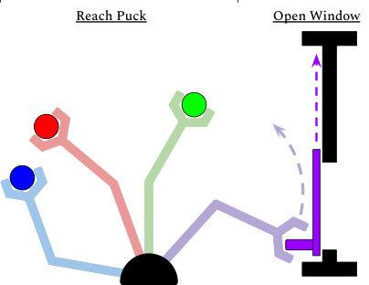

Figure 2: Parametric/non-parametric variation: all
“reach puck” tasks (left) can be parameterized by the
puck position, while the difference between “reach
puck” and “open window” (right) is non-parametric.

With such non-parametric variation, however, “reach puck” tasks (left) can be parameterized by the
there is the danger that tasks will not exhibit puck position, while the difference between “reach
enough shared structure, or will lack the task puck” and “open window” (right) is non-parametric.
overlap needed for the method to avoid memorizing each of the tasks. Motivated by this challenge,
we design each task to include parametric variation in object and goal positions, as illustrated in
Figure 2. Introducing this parametric variability not only creates a substantially larger (infinite)
variety of tasks, but also makes it substantially more practical to expect that a meta-trained model
will generalize to acquire entirely new tasks more quickly, since varying the positions provides for

4

wider coverage of the space of possible manipulation tasks. Without parametric variation, the model
could for example memorize that any object at a particular location is a door, while any object
at another location is a drawer. If the locations are not fixed, this kind of memorization is much
less likely, and the model is forced to generalize more broadly. With enough tasks and variation
within tasks, pairs of qualitatively-distinct tasks are more likely to overlap, serving as a catalyst for
generalization. For example, closing a drawer and pushing a block can appear as nearly the same
task for some initial and goal positions of each object.

Note that this kind of parametric variation, which we introduce _for each task_, essentially represents
the entirety of the task distribution for previous meta-RL evaluations [10, 22], which test on single
tasks (e.g., running towards a goal) with parametric variability (e.g., variation in the goal position).
Our full task distribution is therefore substantially broader, since it includes this parametric variability _for each of the_ 50 _tasks_ .

To provide shared structure, the 50 environments require the same robotic arm to interact with
different objects, with different shapes, joints, and connectivity. The tasks themselves require the
robot to execute a combination of reaching, pushing, and grasping, depending on the task. By
recombining these basic behavioral building blocks with a variety of objects with different shapes
and articulation properties, we can create a wide range of manipulation tasks. For example, the
**open door** task involves pushing or grasping an object with a revolute joint, while the **open drawer**
task requires pushing or grasping an object with a sliding joint. More complex tasks require a
combination of these building blocks, which must be executed in the right order. We visualize all of
the tasks in Meta-World in Figure 1, and include a description of all tasks in Appendix A.

All of the tasks are implemented in the MuJoCo physics engine [53], which enables fast simulation
of physical contact. To make the interface simple and accessible, we base our suite on the Multiworld
interface [54] and the OpenAI Gym environment interfaces [11], making additions and adaptations
of the suite relatively easy for researchers already familiar with Gym.

**4.2** **Actions, Observations, and Rewards**

In order to represent policies for multiple tasks with one model, the observation and action spaces
must contain significant shared structure across tasks. All of our tasks are performed by a simulated
Sawyer robot. The action space is a 2-tuple consisting of the change in 3D space of the end-effector
followed by a normalized torque that the gripper fingers should apply. The actions in this space range
between _−_ 1 and 1. For all tasks, the robot must either manipulate one object with a variable goal
position, or manipulate two objects with a fixed goal position. The observation space is represented
as a 6-tuple of the 3D Cartesian positions of the end-effector, a normalized measurement of how
open the gripper is, the 3D position of the first object, the quaternion of the first object, the 3D
position of the second object, the quaternion of the second object, all of the previous measurements
in the environment, and finally the 3D position of the goal. If there is no second object or the goal
is not meant to be included in the observation, then the quantities corresponding to them are zeroed
out. The observation space is always 39 dimensional.

Designing reward functions for Meta-World requires two major considerations. First, to guarantee
that our tasks are within the reach of current single-task reinforcement learning algorithms, which
is a prerequisite for evaluating multi-task and meta-RL algorithms, we design well-shaped reward
functions for each task that make each of the tasks at least individually solvable. More importantly,
the reward functions must exhibit shared structure across tasks. Critically, even if the reward function admits the same optimal policy for multiple tasks, varying reward scales or structures can make
the tasks appear completely distinct for the learning algorithm, masking their shared structure and
leading to preferences for tasks with high-magnitude rewards [8]. Accordingly, we adopt a structured, multi-component reward function for all tasks, which leads to effective policy learning for
each of the task components. For instance, in a task that involves a combination of reaching, grasping, and placing an object, let _o ∈_ R [3] be the object position, where _o_ = ( _ox, oy, oz_ ), _h ∈_ R [3] be the
position of the robot’s gripper, _z_ target _∈_ R be the target height of lifting the object, and _g ∈_ R [3] be
goal position. With the above definition, the multi-component reward function _R_ is the combination
of a reaching reward, a grasping reward, and a placing reward or subsets thereof for simpler tasks
that only involve reaching and/or pushing. With this design, the reward functions across all tasks
have a similar magnitude that ranges between 0 and 10, where 10 always corresponds to the rewardfunction being solved, and conform to similar structure, as desired. The full form of the reward
function and a list of all task rewards is provided in Appendix E.

5

Figure 3: Visualization of three of our multi-task and meta-learning evaluation protocols, ranging from within
task adaptation in ML1, to multi-task training across 10 distinct task families in MT10, to adapting to new tasks
in ML10. Our most challenging evaluation mode ML45 is shown in Figure 1.

**4.3** **Evaluation Protocol**

With the goal of providing a challenging benchmark to facilitate progress in multi-task RL and
meta-RL, we design an evaluation protocol with varying levels of difficulty, ranging from the level
of current goal-centric meta-RL benchmarks to a setting where methods must learn distinctly new,
challenging manipulation tasks based on diverse experience across 45 tasks. We hence divide our
evaluation into five categories, which we describe next. We then detail our evaluation criteria.

**Meta-Learning 1 (ML1): Few-shot adaptation to goal variation within one task.** The simplest
evaluation aims to verify that previous meta-RL algorithms can adapt to new object or goal configurations on only one type of task. ML1 uses single Meta-World Tasks, with the meta-training
“tasks” corresponding to 50 random initial object and goal positions, and meta-testing on 50 heldout positions. This resembles the evaluations in prior works [10, 22]. We evaluate algorithms on
three individual tasks from Meta-World: reaching, pushing, and pick and place, where the variation is over reaching position or goal object position. The goal positions are not provided in the
observation, forcing meta-RL algorithms to adapt to the goal through trial-and-error.

**Multi-Task 1 (MT1): Learning one multi-task policy that generalizes to 50 tasks belonging**
**to the same environment** . This evaluation aims to verify how well multi-task algorithms can learn
across a large related task distribution. MT1 uses single Meta-World environments, with the training
“tasks” corresponding to 50 random initial object and goal positions. The goal positions are provided
in the observation and are a fixed set, as to focus on the ability of algorithms in acquiring a distinct
skill across multiple goals, rather than generalization and robustness.

**Multi-Task 10, Multi-Task 50 (MT10, MT50): Learning one multi-task policy that generalizes**
**to 50 tasks belonging to 10 and 50 training environments, for a total of 500, and 2,500 training**
**tasks.** A first step towards adapting quickly to distinctly new tasks is the ability to train a single policy that can solve multiple distinct training tasks. The multi-task evaluation in Meta-World tests the
ability to learn multiple tasks at once, without accounting for generalization to new tasks. The MT10
evaluation uses 10 environments: reach, push, pick and place, open door, open drawer, close drawer,
press button top-down, insert peg side, open window, and open box. The larger MT50 evaluation
uses all 50 Meta-World environments. In our experiments, the algorithm is typically provided with
a one-hot vector indicating the current task. The positions of objects and goal positions are fixed in
all tasks in this evaluation, so as to focus on acquiring the distinct skills, rather than generalization
and robustness.

**Meta-Learning 10, Meta-Learning 45 (ML10, ML45): Few-shot adaptation to new test tasks**
**with 10 and 50 meta-training tasks.** With the objective to test generalization to new tasks, we hold

6

out 5 tasks and meta-train policies on 10 and 45 tasks. We randomize object and goals positions
and intentionally select training tasks with structural similarity to the test tasks. Task IDs are not
provided as input, requiring a meta-RL algorithm to identify the tasks from experience.

**Success metrics.** Since values of reward are not directly indicative how successful a policy is, we
define an interpretable success metric for each task, which will be used as the evaluation criterion
for all of the above evaluation settings. Since all of our tasks involve manipulating one or more
objects into a goal configuration, this success metric is typically based on the distance between the
task-relevant object and its final goal pose, i.e. _∥o −_ _g∥_ 2 _< ϵ_, where _ϵ_ is a small distance threshold
such as 5 cm. For the complete list of success metrics and thresholds for each task, see Appendix 12.

**5** **Experimental Results and Analysis**

The first, most basic goal of our experiments is to verify that each of the 50 presented tasks are indeed
solveable by existing single-task reinforcement learning algorithms. We provide this verification
in Appendix B. Beyond verifying the individual tasks, the goals of our experiments are to study
the following questions: (1) can existing state-of-the-art meta-learning algorithms quickly learn
qualitatively new tasks when meta-trained on a sufficiently broad, yet structured task distribution,
and (2) how do different multi-task and meta-learning algorithms compare in this setting? To answer
these questions, we evaluate various multi-task and meta-learning algorithms on the Meta-World
benchmark. We include the training curves of all evaluations in Figure 15 in the Appendix C.
Videos of the tasks and evaluations, along with all source code, are on the project webpage [3] .

In the multi-task evaluation, we evaluate the following RL algorithms: **multi-task proximal policy**
**optimization (PPO)** [55]: a policy gradient algorithm adapted to the multi-task setting by providing the one-hot task ID as input, **multi-task trust region policy optimization (TRPO)** [56]: an
on-policy policy gradient algorithm adapted to the multi-task setting using the one-hot task ID as
input, **multi-task soft actor-critic (SAC)** [57]: an off-policy actor-critic algorithm adapted to the
multi-task setting using the one-hot task ID as input, and an on-policy version of **task embeddings**
**(TE)** [58]: a multi-task reinforcement learning algorithm that parameterizes the learned policies
via shared skill embedding space. For the meta-RL evaluation, we study three algorithms: **RL** [2]

[18, 19]: an on-policy meta-RL algorithm that corresponds to training a GRU network with hidden states maintained across episodes within a task and trained with PPO, **model-agnostic meta-**
**learning (MAML)** [10, 21]: an on-policy gradient-based meta-RL algorithm that embeds policy
gradient steps into the meta-optimization, and is trained with PPO, and **probabilistic embeddings**
**for actor-critic RL (PEARL)** [22]: an off-policy actor-critic meta-RL algorithm, which learns to
encode experience into a probabilistic embedding of the task that is fed to the actor and the critic.
We use the baselines in the Garage [59] reinforcement learning library, which we developed for
benchmarking Meta-World.

We show results of the simplest meta-learning evaluation mode, ML1, in Figure 4. We find that
there is room for improvement even in this very simple setting. Next, we look at results of multitask learning across distinct tasks, starting with MT10 in Figure 5 and in Table 1.
We find that multi-task SAC is able to the learn the MT10 task suite well, achieving around 68%
success rate averaged across tasks, while multi-task PPO and TRPO are only able to achieve around
a 30% success rate. However, as we scale to 50 distict tasks with MT50, we find that MT-SAC and
MT-PPO only achieve around a 35-38% success rate, indicating that there is significant room for
improvement in these methods

Finally, we study the ML10 and ML45 meta-learning benchmarks, which require learning the metatraining tasks and generalizing to new meta-test tasks with small amounts of experience. From
Figure 8 and Table 1, we find that the prior meta-RL methods, MAML and RL [2] reach 35% and
31% success on ML10 test tasks, while PEARL achieves only 13% on ML10. On ML45, MAML
and RL [2] solve around 39.9% and 33.3% of the meta-test tasks. Note that, on both ML10 and
ML45, the meta-training performance of all methods also has considerable room for improvement,
suggesting that optimization challenges are generally more severe in the meta-learning setting. The
fact that some methods nonetheless exhibit meaningful generalization suggests that the ML10 and
ML45 benchmarks are solvable, but challenging for current methods, leaving considerable room for
improvement in future work.

3Videos are on the project webpage, at `meta-world.github.io`

7

|Col1|Col2|Col3|Col4|Col5|Col6|MAML-TRPO|
|---|---|---|---|---|---|---|
|||||||MAML~~-~~TRPO RL2~~-~~PPO |
||~~SuccessRate~~|~~SuccessRate~~|~~SuccessRate~~|~~SuccessRate~~|~~SuccessRate~~|~~SuccessRate~~|
||||||||

Figure 4: Comparison on our simplest meta-RL evaluation, ML1 on 10 seeds. RL [2] shows the strongest performance in generalization. Pearl shows the weakest performance, though this could be attributed to difficulty
in training its task encoder

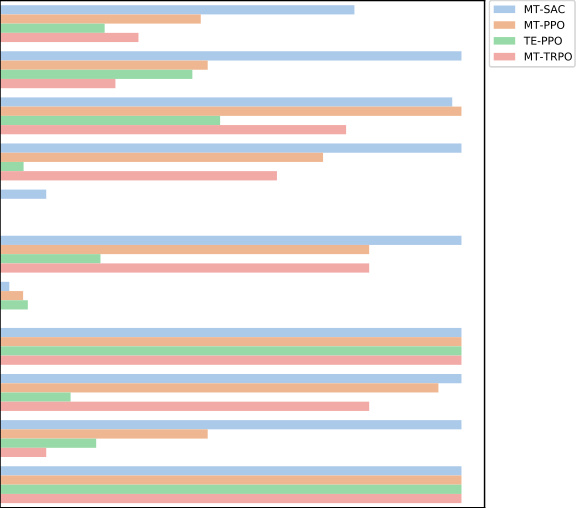

|Col1|Col2|Col3|Col4|Col5|
|---|---|---|---|---|
||||||

Figure 5: Performance of the tested MTRL algorithms on 10 seeds. MT-SAC performs the best
on MT-10, exhibiting the greatest sample efficiency and performance. For detailed plots of these
algorithm’s learning curves, see appendix C.

8

|Col1|Col2|Col3|Col4|Col5|Col6|
|---|---|---|---|---|---|
|||||||
|||||||
|||||||
|||||||
|||||||
|||||||
|||||||
|||||||
|||||||
|||||||
||~~SuccessRate~~|~~SuccessRate~~|~~SuccessRate~~|~~SuccessRate~~|~~SuccessRate~~|
|||||||
|||||||
|||||||
|||||||
|||||||
|||||||
|||||||

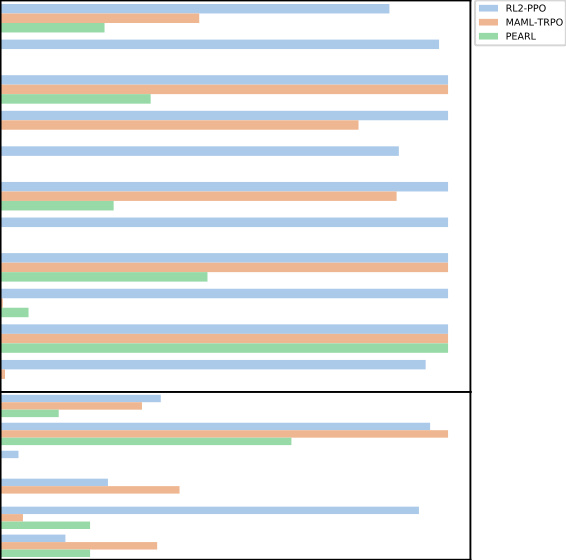

Figure 6: Performance of the tested meta-RL algorithms on 10 seeds. RL [2] shows the highest performance on the training tasks (86.9%), however its ability to generalize is not that much greater than
MAML (35.8% for RL [2] and 31.6% for MAML).

9

|Col1|Col2|Col3|Col4|Col5|Col6|MT-SAC|
|---|---|---|---|---|---|---|
|||||||MT~~-~~PPO TE~~-~~PPO |
||||||||
||||||||
||||||||
||||||||
||||||||
||||||||
||||||||
||||||||
||||||||
||||||||
||||||||
||||||||
||||||||
||||||||
||||||||
||||||||
||||||||
||||||||
||||||||
||||||||
||||||||
||||||||
||||||||
||||||||
||||||||
||||||||
||||||||
||||||||
||||||||
||||||||
||||||||
||||||||
||||||||
||||||||
||||||||
||||||||
||||||||
||||||||
||||||||
||||||||
||||||||
||||||||
||||||||
||||||||
||||||||
||||||||
||||||||
||||||||
||||||||

Figure 7: Performance of the tested MTRL algorithms on 10 seeds. In MT-10, MT-SAC showed the
highest performance, however its performance does not scale to MT-50, the more difficult benchmark. MT-PPO exhibits the better performance in this benchmark.

10

|Col1|Col2|
|---|---|
|||
|||
|||
|||
|||
|||
|||
|||
|||
|||
|||
|||
|||
|||
|||
|||
|||
|||
|||
|||
|||
|||
|||
|||
|||
|||
|||
|||
|||
|||
|||
|||
|||
|||
|||
|||
|||
|||
|||
|||
|||
|||
||~~SuccessRate~~|
|||
|||
|||
|||

Figure 8: Average of maximum success rate for ML-45. Note that, even on the challenging ML-45 benchmark,
current methods already exhibit some degree of generalization, but meta-training performance leaves considerable room for improvement, suggesting that future work could attain better performance on these benchmarks.
Though PEARL has week training performance, it has comparable performance on test tasks. RL [2] has the
highest We also show the max average success rates for all benchmarks in Table 1.

11

Methods MT10 MT50

Multi-task PPO 30.5% **35.4** %
Multi-task TRPO 31.3% 21.0%
Task embeddings 20.9% 11.8%
Multi-task SAC **68.3** % **38.5** %

ML10 ML45
Methods meta-train meta-test meta-train meta-test

MAML 44.4% 31.6% 40.7% **39.9%**
RL [2] **86.9%** **35.8** % **70%** 33.3%
PEARL 23.2% 13% 14.5% 22%

Table 1: The average maximum success rate over all tasks for MT10, MT50, ML10, and ML45 on 10 seeds.
The best performance in each benchmark is bolden. For MT10 and MT50, we show the average training
success rate of multi-task SAC and multi-task PPO respectively outperform other methods. For ML10 and
ML45, we show the meta-train and meta-test success rates. RL [2] achieves best meta-train performance in ML10
and ML45, while MAML and RL2 get the best generalization performance in ML10 and ML45 meta-test tasks
respectively.

**6** **Conclusion and Directions for Future Work**

We proposed an open-source benchmark for meta-reinforcement learning and multi-task learning,
which consists of a large number of simulated robotic manipulation tasks.

Unlike previous evaluation benchmarks in meta-RL, our benchmark specifically emphasizes generalization to distinctly new tasks, not just in terms of parametric variation in goals, but completely
new objects and interaction scenarios.

While meta-RL can in principle make it feasible for agents to acquire new skills more quickly by
leveraging past experience, previous evaluation benchmarks utilize very narrow task distributions,
making it difficult to understand the degree to which meta-RL actually enables this kind of generalization. The aim of our benchmark is to make it possible to develop new meta-RL algorithms that
actually exhibit this sort of generalization. Our experiments show that current meta-RL methods in
fact cannot yet generalize effectively to entirely new tasks and do not even learn the meta-training
tasks effectively when meta-trained across multiple distinct tasks. This suggests a number of directions for future work, which we describe below.

**Future directions for algorithm design.** The main conclusion from our experimental evaluation
with our proposed benchmark is that current meta-RL algorithms generally struggle in settings where
the meta-training tasks are highly diverse. This issue mirrors the challenges observed in multi-task
RL, which is also challenging with our task suite, and has been observed to require considerable additional algorithmic development to attain good results in prior work [9, 15, 16]. A number of recent
works have studied algorithmic improvements in the area of multi-task reinforcement learning, as
well as potential explanations for the difficulty of RL in the multi-task setting [8, 60]. Incorporating some of these methods into meta-RL, as well as developing new techniques to enable meta-RL
algorithms to train on broader task distributions, would be a promising direction for future work
to enable meta-RL methods to generalize effectively across diverse tasks, and our proposed benchmark suite can provide future algorithms development with a useful gauge of progress towards the
eventual goal of broad task generalization.

**Future extensions of the benchmark.** While the presented benchmark is significantly broader
and more challenging than existing evaluations of meta-reinforcement learning algorithms, there
are a number of extensions to the benchmark that would continue to improve and expand upon its
applicability to realistic robotics tasks. First, in many situations, the poses of objects are not directly
accessible to a robot in the real world. Hence, one interesting and important direction for future
work is to consider image observations and sparse rewards. Sparse rewards can be derived already
using the success metrics, while support for image rendering is already supported by the code.
However, for meta-learning algorithms, special care needs to be taken to ensure that the task cannot
be inferred directly from the image, else meta-learning algorithms will memorize the training tasks
rather than learning to adapt. Another natural extension would be to consider including a breadth
of compositional long-horizon tasks, where there exist combinatorial numbers of tasks. Such tasks
would be a straightforward extension, and provide the possibility to include many more tasks with
shared structure. Another challenge when deploying robot learning and meta-learning algorithms is
the manual effort of resetting the environment. To simulate this case, one simple extension of the
benchmark is to significantly reduce the frequency of resets available to the robot while learning.
Lastly, in many real-world situations, the tasks are not available all at once. To reflect this challenge
in the benchmark, we can add an evaluation protocol that matches that of online meta-learning
problem statements [61]. We leave these directions for future work, either to be done by ourselves

12

or in the form of open-source contributions. To summarize, we believe that the proposed form of the
task suite represents a significant step towards evaluating multi-task and meta-learning algorithms
on diverse robotic manipulation problems that will pave the way for future research in these areas.

**Acknowledgments**

We thank Suraj Nair for feedback on a draft of the paper. We thank K.R Zentner for her help in
maintaining Meta-World. This research was supported in part by the National Science Foundation
under IIS-1651843, IIS-1700697, and IIS-1700696, the Office of Naval Research, ARL DCIST CRA
W911NF-17-2-0181, DARPA, Google, Amazon, and NVIDIA.

**References**

[1] S. Levine, C. Finn, T. Darrell, and P. Abbeel. End-to-end training of deep visuomotor policies.
_Journal of Machine Learning Research (JMLR)_, 2016.

[2] K. M¨ulling, J. Kober, O. Kroemer, and J. Peters. Learning to select and generalize striking
movements in robot table tennis. _IJRR_, 2013.

[3] M. Andrychowicz, B. Baker, M. Chociej, R. Jozefowicz, B. McGrew, J. Pachocki,
A. Petron, M. Plappert, G. Powell, A. Ray, et al. Learning dexterous in-hand manipulation.
_arXiv:1808.00177_, 2018.

[4] Y. Chebotar, K. Hausman, M. Zhang, G. Sukhatme, S. Schaal, and S. Levine. Combining
model-based and model-free updates for trajectory-centric reinforcement learning. In _ICML_,
2017.

[5] L. Manuelli, W. Gao, P. R. Florence, and R. Tedrake. kpam: Keypoint affordances for categorylevel robotic manipulation. _CoRR_, abs/1903.06684, 2019.

[6] A. Krizhevsky, I. Sutskever, and G. E. Hinton. Imagenet classification with deep convolutional
neural networks. In _Advances in neural information processing systems_, 2012.

[7] J. Devlin, M. Chang, K. Lee, and K. Toutanova. BERT: pre-training of deep bidirectional
transformers for language understanding. _CoRR_, abs/1810.04805, 2018.

[8] M. Hessel, H. Soyer, L. Espeholt, W. Czarnecki, S. Schmitt, and H. van Hasselt. Multi-task
deep reinforcement learning with popart. _CoRR_, abs/1809.04474, 2018.

[9] E. Parisotto, J. L. Ba, and R. Salakhutdinov. Actor-mimic: Deep multitask and transfer reinforcement learning. _arXiv:1511.06342_, 2015.

[10] C. Finn, P. Abbeel, and S. Levine. Model-agnostic meta-learning for fast adaptation of deep
networks. In _International Conference on Machine Learning_, 2017.

[11] G. Brockman, V. Cheung, L. Pettersson, J. Schneider, J. Schulman, J. Tang, and W. Zaremba.
Openai gym. _arXiv:1606.01540_, 2016.

[12] K. Cobbe, O. Klimov, C. Hesse, T. Kim, and J. Schulman. Quantifying generalization in
reinforcement learning. _arXiv:1812.02341_, 2018.

[13] Y. Tassa, Y. Doron, A. Muldal, T. Erez, Y. Li, D. d. L. Casas, D. Budden, A. Abdolmaleki,
J. Merel, A. Lefrancq, et al. Deepmind control suite. _arXiv:1801.00690_, 2018.

[14] M. C. Machado, M. G. Bellemare, E. Talvitie, J. Veness, M. J. Hausknecht, and M. Bowling. Revisiting the arcade learning environment: Evaluation protocols and open problems for
general agents. _CoRR_, abs/1709.06009, 2017.

[15] A. A. Rusu, S. G. Colmenarejo, C. Gulcehre, G. Desjardins, J. Kirkpatrick, R. Pascanu,
V. Mnih, K. Kavukcuoglu, and R. Hadsell. Policy distillation. _arXiv:1511.06295_, 2015.

[16] L. Espeholt, H. Soyer, R. Munos, K. Simonyan, V. Mnih, T. Ward, Y. Doron, V. Firoiu,
T. Harley, I. Dunning, et al. Impala: Scalable distributed deep-rl with importance weighted
actor-learner architectures. _arXiv:1802.01561_, 2018.

[17] S. Sharma and B. Ravindran. Online multi-task learning using active sampling. 2017.

[18] Y. Duan, J. Schulman, X. Chen, P. L. Bartlett, I. Sutskever, and P. Abbeel. Rl$ˆ2$: Fast
reinforcement learning via slow reinforcement learning. _CoRR_, abs/1611.02779, 2016.

[19] J. X. Wang, Z. Kurth-Nelson, D. Tirumala, H. Soyer, J. Z. Leibo, R. Munos, C. Blundell,
D. Kumaran, and M. Botvinick. Learning to reinforcement learn, 2016. _arXiv:1611.05763_ .

[20] N. Mishra, M. Rohaninejad, X. Chen, and P. Abbeel. A simple neural attentive meta-learner.
_arXiv:1707.03141_, 2017.

[21] J. Rothfuss, D. Lee, I. Clavera, T. Asfour, and P. Abbeel. Promp: Proximal meta-policy search.
_arXiv:1810.06784_, 2018.

[22] K. Rakelly, A. Zhou, D. Quillen, C. Finn, and S. Levine. Efficient off-policy metareinforcement learning via probabilistic context variables. _arXiv:1903.08254_, 2019.

13

[23] C. Fernando, J. Sygnowski, S. Osindero, J. Wang, T. Schaul, D. Teplyashin, P. Sprechmann,
A. Pritzel, and A. Rusu. Meta-learning by the baldwin effect. In _Proceedings of the Genetic_
_and Evolutionary Computation Conference Companion_, pages 1313–1320. ACM, 2018.

[24] S. Ritter, J. X. Wang, Z. Kurth-Nelson, S. M. Jayakumar, C. Blundell, R. Pascanu, and
M. Botvinick. Been there, done that: Meta-learning with episodic recall. _arXiv preprint_
_arXiv:1805.09692_, 2018.

[25] A. Nichol, V. Pfau, C. Hesse, O. Klimov, and J. Schulman. Gotta learn fast: A new benchmark
for generalization in rl. _arXiv:1804.03720_, 2018.

[26] A. Nagabandi, I. Clavera, S. Liu, R. S. Fearing, P. Abbeel, S. Levine, and C. Finn. Learning to adapt in dynamic, real-world environments through meta-reinforcement learning.
_arXiv:1803.11347_, 2018.

[27] S. Sæmundsson, K. Hofmann, and M. P. Deisenroth. Meta reinforcement learning with latent
variable gaussian processes. _arXiv:1803.07551_, 2018.

[28] B. Calli, A. Walsman, A. Singh, S. Srinivasa, P. Abbeel, and A. M. Dollar. Benchmarking in manipulation research: The ycb object and model set and benchmarking protocols.
_arXiv:1502.03143_, 2015.

[29] Y. Lee, E. S. Hu, Z. Yang, A. Yin, and J. J. Lim. IKEA furniture assembly environment
for long-horizon complex manipulation tasks. _CoRR_, abs/1911.07246, 2019. URL `[http:](http://arxiv.org/abs/1911.07246)`
`[//arxiv.org/abs/1911.07246](http://arxiv.org/abs/1911.07246)` .

[30] S. James, Z. Ma, D. R. Arrojo, and A. J. Davison. Rlbench: The robot learning benchmark and
learning environment, 2019.

[31] I. Lenz, H. Lee, and A. Saxena. Deep learning for detecting robotic grasps. _IJRR_, 2015.

[32] C. Finn, I. Goodfellow, and S. Levine. Unsupervised learning for physical interaction through
video prediction. In _Advances in neural information processing systems_, pages 64–72, 2016.

[33] K.-T. Yu, M. Bauza, N. Fazeli, and A. Rodriguez. More than a million ways to be pushed. a
high-fidelity experimental dataset of planar pushing. In _IROS_, 2016.

[34] Y. Chebotar, K. Hausman, Z. Su, A. Molchanov, O. Kroemer, G. Sukhatme, and S. Schaal.
Bigs: Biotac grasp stability dataset. In _ICRA 2016 Workshop on Grasping and Manipulation_
_Datasets_, 2016.

[35] A. Gupta, A. Murali, D. P. Gandhi, and L. Pinto. Robot learning in homes: Improving generalization and reducing dataset bias. In _Advances in Neural Information Processing Systems_,
pages 9112–9122, 2018.

[36] A. Mandlekar, Y. Zhu, A. Garg, J. Booher, M. Spero, A. Tung, J. Gao, J. Emmons, A. Gupta,
E. Orbay, et al. Roboturk: A crowdsourcing platform for robotic skill learning through imitation. _arXiv:1811.02790_, 2018.

[37] P. Sharma, L. Mohan, L. Pinto, and A. Gupta. Multiple interactions made easy (mime): Large
scale demonstrations data for imitation. _arXiv preprint arXiv:1810.07121_, 2018.

[38] N. Correll, K. E. Bekris, D. Berenson, O. Brock, A. Causo, K. Hauser, K. Okada, A. Rodriguez,
J. M. Romano, and P. R. Wurman. Analysis and observations from the first amazon picking
challenge. _IEEE Transactions on Automation Science and Engineering_, 15(1):172–188, 2016.

[39] B. Calli, A. Singh, A. Walsman, S. Srinivasa, P. Abbeel, and A. M. Dollar. The ycb object
and model set: Towards common benchmarks for manipulation research. In _International_
_Conference on Advanced Robotics (ICAR)_, 2015.

[40] Y. S. Choi, T. Deyle, T. Chen, J. D. Glass, and C. C. Kemp. A list of household objects for
robotic retrieval prioritized by people with als. In _International Conference on Rehabilitation_
_Robotics_, 2009.

[41] M. Savva, A. Kadian, O. Maksymets, Y. Zhao, E. Wijmans, B. Jain, J. Straub, J. Liu, V. Koltun,
J. Malik, et al. Habitat: A platform for embodied ai research. _arXiv:1904.01201_, 2019.

[42] E. Kolve, R. Mottaghi, D. Gordon, Y. Zhu, A. Gupta, and A. Farhadi. Ai2-thor: An interactive
3d environment for visual ai. _arXiv:1712.05474_, 2017.

[43] S. Brodeur, E. Perez, A. Anand, F. Golemo, L. Celotti, F. Strub, J. Rouat, H. Larochelle, and
A. Courville. Home: A household multimodal environment. _arXiv:1711.11017_, 2017.

[44] M. Savva, A. X. Chang, A. Dosovitskiy, T. Funkhouser, and V. Koltun. Minos: Multimodal
indoor simulator for navigation in complex environments. _arXiv:1712.03931_, 2017.

[45] F. Xia, A. R. Zamir, Z. He, A. Sax, J. Malik, and S. Savarese. Gibson env: Real-world perception for embodied agents. In _Computer Vision and Pattern Recognition_, 2018.

[46] A. Dosovitskiy, G. Ros, F. Codevilla, A. Lopez, and V. Koltun. Carla: An open urban driving
simulator. _arXiv:1711.03938_, 2017.

14

[47] B. Wymann, E. Espi´e, C. Guionneau, C. Dimitrakakis, R. Coulom, and A. Sumner. Torcs, the
open racing car simulator. _Software available at http://torcs. sourceforge. net_, 4(6), 2000.

[48] S. R. Richter, Z. Hayder, and V. Koltun. Playing for benchmarks. In _Proceedings of the IEEE_
_International Conference on Computer Vision_, pages 2213–2222, 2017.

[49] D. Kappler, J. Bohg, and S. Schaal. Leveraging big data for grasp planning. In _2015 IEEE_
_International Conference on Robotics and Automation (ICRA)_, pages 4304–4311. IEEE, 2015.

[50] A. Kasper, Z. Xue, and R. Dillmann. The kit object models database: An object model database
for object recognition, localization and manipulation in service robotics. _IJRR_, 2012.

[51] C. Goldfeder, M. Ciocarlie, H. Dang, and P. K. Allen. The columbia grasp database. 2008.

[52] L. Fan, Y. Zhu, J. Zhu, Z. Liu, O. Zeng, A. Gupta, J. Creus-Costa, S. Savarese, and L. Fei-Fei.
Surreal: Open-source reinforcement learning framework and robot manipulation benchmark.
In _Conference on Robot Learning_, 2018.

[53] E. Todorov, T. Erez, and Y. Tassa. Mujoco: A physics engine for model-based control. In
_International Conference on Intelligent Robots and Systems_, 2012.

[54] A. V. Nair, V. Pong, M. Dalal, S. Bahl, S. Lin, and S. Levine. Visual reinforcement learning
with imagined goals. In _Advances in Neural Information Processing Systems_, 2018.

[55] J. Schulman, F. Wolski, P. Dhariwal, A. Radford, and O. Klimov. Proximal policy optimization
algorithms. _arXiv preprint arXiv:1707.06347_, 2017.

[56] J. Schulman, S. Levine, P. Abbeel, M. Jordan, and P. Moritz. Trust region policy optimization.
In _International conference on machine learning_, pages 1889–1897, 2015.

[57] T. Haarnoja, A. Zhou, P. Abbeel, and S. Levine. Soft actor-critic: Off-policy maximum entropy
deep reinforcement learning with a stochastic actor. _arXiv preprint arXiv:1801.01290_, 2018.

[58] K. Hausman, J. T. Springenberg, Z. Wang, N. Heess, and M. Riedmiller. Learning an embedding space for transferable robot skills. _International Conference on Learning Representations_,
2018.

[59] T. garage contributors. Garage: A toolkit for reproducible reinforcement learning research.

`[https://github.com/rlworkgroup/garage](https://github.com/rlworkgroup/garage)`, 2021.

[60] T. Schaul, D. Borsa, J. Modayil, and R. Pascanu. Ray interference: a source of plateaus in
deep reinforcement learning. _arXiv preprint arXiv:1904.11455_, 2019.

[61] C. Finn, A. Rajeswaran, S. Kakade, and S. Levine. Online meta-learning. _ICML_, 2019.

15

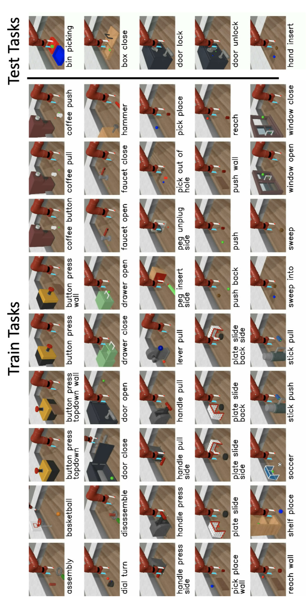

16

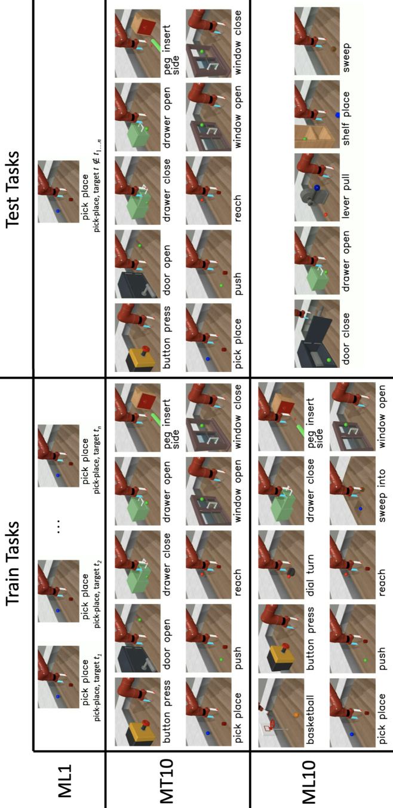

17

**A** **Task Descriptions**

In Table 2, we include a description of each of the 50 Meta-World tasks.

Task Description

turn on faucet Rotate the faucet counter-clockwise. Randomize faucet positions
sweep Sweep a puck off the table. Randomize puck positions
assemble nut Pick up a nut and place it onto a peg. Randomize nut and peg positions
turn off faucet Rotate the faucet clockwise. Randomize faucet positions
push Push the puck to a goal. Randomize puck and goal positions
pull lever Pull a lever down 90 degrees. Randomize lever positions
turn dial Rotate a dial 180 degrees. Randomize dial positions
push with stick Grasp a stick and push a box using the stick. Randomize stick positions.
get coffee Push a button on the coffee machine. Randomize the position of the coffee machine
pull handle side Pull a handle up sideways. Randomize the handle positions
basketball Dunk the basketball into the basket. Randomize basketball and basket positions
pull with stick Grasp a stick and pull a box with the stick. Randomize stick positions
sweep into hole Sweep a puck into a hole. Randomize puck positions
disassemble nut pick a nut out of the a peg. Randomize the nut positions
place onto shelf pick and place a puck onto a shelf. Randomize puck and shelf positions
push mug Push a mug under a coffee machine. Randomize the mug and the machine positions
press handle side Press a handle down sideways. Randomize the handle positions
hammer Hammer a screw on the wall. Randomize the hammer and the screw positions
slide plate Slide a plate into a cabinet. Randomize the plate and cabinet positions
slide plate side Slide a plate into a cabinet sideways. Randomize the plate and cabinet positions
press button wall Bypass a wall and press a button. Randomize the button positions
press handle Press a handle down. Randomize the handle positions
pull handle Pull a handle up. Randomize the handle positions
soccer Kick a soccer into the goal. Randomize the soccer and goal positions
retrieve plate side Get a plate from the cabinet sideways. Randomize plate and cabinet positions
retrieve plate Get a plate from the cabinet. Randomize plate and cabinet positions
close drawer Push and close a drawer. Randomize the drawer positions
press button top Press a button from the top. Randomize button positions
reach reach a goal position. Randomize the goal positions
press button top wall Bypass a wall and press a button from the top. Randomize button positions
reach with wall Bypass a wall and reach a goal. Randomize goal positions
insert peg side Insert a peg sideways. Randomize peg and goal positions
pull Pull a puck to a goal. Randomize puck and goal positions
push with wall Bypass a wall and push a puck to a goal. Randomize puck and goal positions
pick out of hole Pick up a puck from a hole. Randomize puck and goal positions
pick&place w/ wall Pick a puck, bypass a wall and place the puck. Randomize puck and goal positions
press button Press a button. Randomize button positions
pick&place Pick and place a puck to a goal. Randomize puck and goal positions
pull mug Pull a mug from a coffee machine. Randomize the mug and the machine positions
unplug peg Unplug a peg sideways. Randomize peg positions
close window Push and close a window. Randomize window positions
open window Push and open a window. Randomize window positions
open door Open a door with a revolving joint. Randomize door positions
close door Close a door with a revolving joint. Randomize door positions
open drawer Open a drawer. Randomize drawer positions
insert hand Insert the gripper into a hole.
close box Grasp the cover and close the box with it. Randomize the cover and box positions
lock door Lock the door by rotating the lock clockwise. Randomize door positions
unlock door Unlock the door by rotating the lock counter-clockwise. Randomize door positions
pick bin Grasp the puck from one bin and place it into another bin. Randomize puck positions

Table 2: A list of all of the Meta-World tasks and a description of each task.

**B** **Benchmark Verification with Single-Task Learning**

In this section, we aim to verify that each of the benchmark tasks are individually solvable provided
enough data. To do so, we consider two state-of-the-art single task reinforcement learning methods,

18

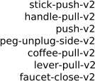

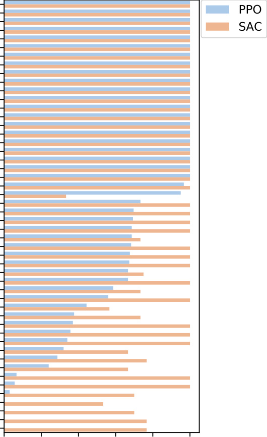

Figure 11: Performance of independent policies trained on individual tasks using soft actor-critic
(SAC) and proximal policy optimization (PPO) on 3 seeds. We verify that SAC can solve all of the
tasks and PPO can also solve most of the tasks.

proximal policy optimization (PPO) [55] and soft actor-critic (SAC) [57]. This evaluation is purely
for validation of the tasks, and not an official evaluation protocol of the benchmark. Details of
the hyperparameters are provided in Appendix D. The results of this experiment are illustrated in
Figure 11. We indeed find that SAC can learn to perform all of the 50 tasks to some degree, while
PPO can solve a large majority of the tasks.

**C** **Learning curves**

In evaluating meta-learning algorithms, we care not just about performance but also about efficiency,
i.e. the amount of data required by the meta-training process. While the adaptation process for all
algorithms is extremely efficient, requiring only a few trajectories, the meta-learning process can be
very inefficient. In Figure 12, we show full learning curves of the three meta-learning methods on
ML1. In Figure 15, we show full learning curves of MT10, ML10, MT50 and ML45. The MT10 and

19

MT50 learning curves show the efficiency of multi-task learning, a critical evaluation metric, since
sample efficiency gains are a primary motivation for using multi-task learning. Unsurprisingly, we
find that off-policy algorithms such as soft actor-critic are able to learn with substantially less data
than on-policy algorithms.

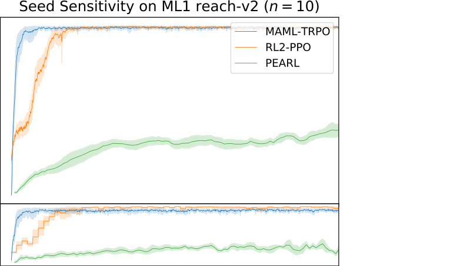

Figure 12: Comparison of PEARL, MAML, and RL [2] learning curves on ML-1 reach.

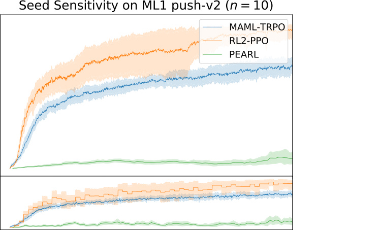

Figure 13: Comparison of PEARL, MAML, and RL [2] learning curves on ML-1 push.

20

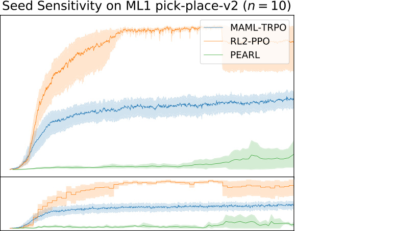

Figure 14: Comparison of PEARL, MAML, and RL [2] learning curves on the simplest evaluation,
ML-1, where the methods need to adapt quickly to new object and goal positions within the one
meta-training task.

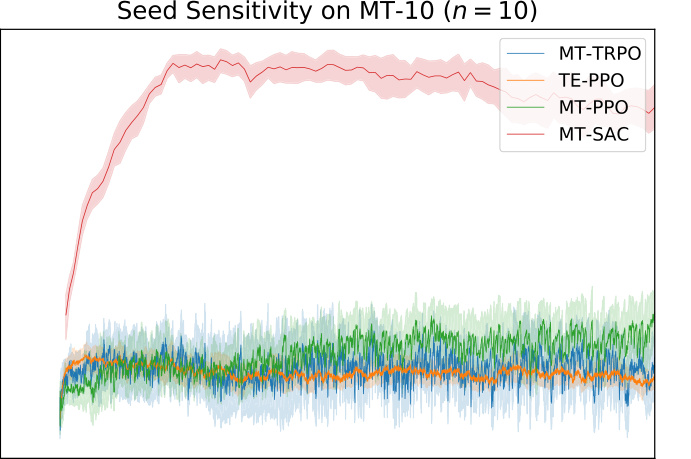

Figure 15: Comparison of MTRL algorithms on MT-10. MT-SAC vastly outperforms is on-policy
counterparts in performance and sample efficiency.

21

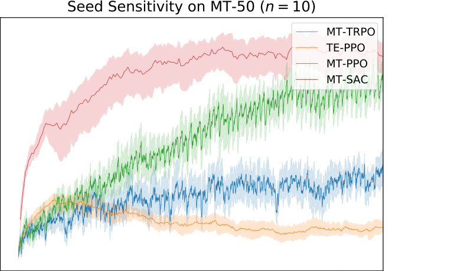

Figure 16: Comparison of MTRL algorithms on MT-50. MT-SAC vastly outperforms is on-policy
counterparts in sample efficiency. Its performance tapers off, and with more training, MT-PPO
outperforms it.

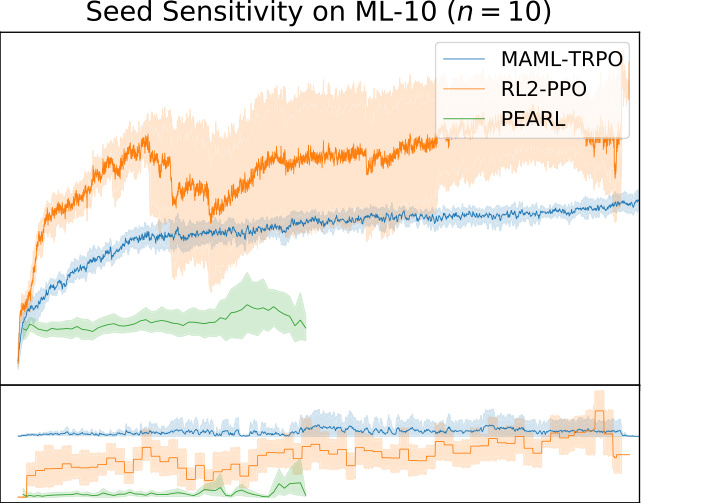

Figure 17: Performance of meta-RL algorithms on ML-10. RL [2] significantly outperforms other
methods in terms of sample efficiency and performance on test tasks. MAML has better test performance early on, RL [2] outperforms it with more training.

22

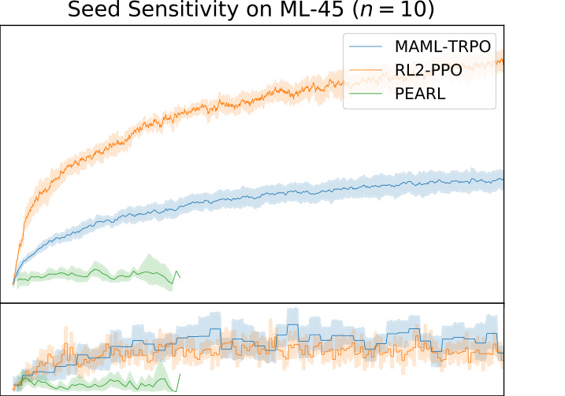

Figure 18: Learning curves of all methods on the ML-45 benchmark. Y-axis represents success
rate averaged over tasks in percentage (%). The dashed lines represent asymptotic performances.
PEARL underperforms MAML and RL [2] . RL [2] significantly outperforms other methods in terms of
sample efficiency and performance on train tasks. RL [2] and MAML have similar performance on
test tasks.

23

**D** **Hyperparameter Details**

In this section, we provide hyperparameter values for each of the methods in our experimental
evaluation.

**D.1** **Single Task SAC**

**Description** **value** `variable` `name`

Normal Hyperparameters

Batch size 500 `batch` `size`
Number of epochs 500 `n` ~~`e`~~ `pochs`
Path length per 500 `max` ~~`p`~~ `ath` ~~`l`~~ `ength`
roll-out

Discount factor 0 _._ 99 `discount`

Algorithm-Specific Hyperparameters

Policy hidden sizes (256 _,_ 256) `hidden` ~~`s`~~ `izes`
Activation function of ReLU `hidden` ~~`n`~~ `onlinearity`
hidden layers

Policy learning rate 3 _×_ 10 _[−]_ [4] `policy` ~~`l`~~ `r`
Q-function learning 3 _×_ 10 _[−]_ [4] `qf` `lr`
rate

Policy minimum _e_ _[−]_ [20] `min` ~~`s`~~ `td`
standard deviation

Policy maximum _e_ [2] `max` ~~`s`~~ `td`
standard deviation

Gradient steps per 500 `gradient` `steps` ~~`p`~~ `er` ~~`i`~~ `tr`
epoch

Number of epoch 40 `epoch` `cycles`
cycles

Soft target
interpolation
parameter

5 _×_ 10 _[−]_ [3] `target` ~~`u`~~ `pdate` ~~`t`~~ `au`

Use automatic entropy True `use` ~~`a`~~ `utomatic` ~~`e`~~ `ntropy` ~~`t`~~ `uning`
Tuning

Table 3: Hyperparameters used for Garage experiments with Single Task SAC

24

**D.2** **Single Task PPO**

**Description** **value** `variable` `name`

Normal Hyperparameters

Batch size 5 _,_ 000 `batch` `size`
Number of epochs 4 _,_ 000 `n` ~~`e`~~ `pochs`
Path length per roll-out 500 `max` ~~`p`~~ `ath` ~~`l`~~ `ength`
Discount factor 0 _._ 99 `discount`

Algorithm-Specific Hyperparameters

Policy mean hidden sizes (128 _,_ 128) `hidden` ~~`s`~~ `izes`
Policy minimum standard 0 _._ 5 `min` ~~`s`~~ `td`
deviation

Policy maximum standard 1 _._ 5 `max` ~~`s`~~ `td`
deviation

Policy share standard
deviation and mean
network

True `std` ~~`s`~~ `hare` `network`

Activation function of tanh `hidden` ~~`n`~~ `onlinearity`
mean hidden layers

Optimizer learning rate 5 _×_ 10 _[−]_ [4] `learning` `rate`
Likelihood ratio clip range 0 _._ 2 `lr` `clip` ~~`r`~~ `ange`
Advantage estimation _λ_ 0 _._ 95 `gae` ~~`l`~~ `ambda`
Use layer normalization False `layer` `normalization`
Entropy method max `entropy` ~~`m`~~ `ethod`
Loss function surrogate˙clip `pg` `loss`
Maximum number of 256 `max` ~~`e`~~ `pochs`
epochs for update

Minibatch size for 32 `batch` `size`
optimization

Value Function Hyperparameters

Policy hidden sizes (128 _,_ 128) `hidden` ~~`s`~~ `izes`
Activation function of tanh `hidden` ~~`n`~~ `onlinearity`
hidden layers

Initial value for standard 1 `init` ~~`s`~~ `td`
deviation

Use trust region constraint False `use` ~~`t`~~ `rust` `region`
Normalize inputs True `normalize` ~~`i`~~ `nputs`
Normalize outputs True `normalize` ~~`o`~~ `utputs`

Table 4: Hyperparameters used for Garage experiments with Single Task PPO

Below we summarize in as much detail as possible the hyperparameters used for each experiment in
this chapter. Seed values were individually chosen at random for each experiment.

25

**D.3** **MT-PPO**

**Description** **MT10** **MT50** `variable` ~~`n`~~ `ame`

Normal Hyperparameters

Batch size 100 _,_ 000 500 _,_ 000 `batch` ~~`s`~~ `ize`
Number of epochs 10 _,_ 000 10 _,_ 000 `n` ~~`e`~~ `pochs`
Path length per roll-out 500 500 `max` ~~`p`~~ `ath` `length`
Discount factor 0 _._ 99 0 _._ 99 `discount`

Algorithm-Specific Hyperparameters

Policy mean hidden sizes (512 _,_ 512) `hidden` ~~`s`~~ `izes`
Policy minimum standard 0 _._ 5 0 _._ 5 `min` ~~`s`~~ `td`
deviation

Policy maximum standard 1 _._ 5 1 _._ 5 `max` ~~`s`~~ `td`
deviation

Policy share standard True True `std` ~~`s`~~ `hare` ~~`n`~~ `etwork`
deviation and mean network

Activation function of hidden tanh tanh `hidden` ~~`n`~~ `onlinearity`
layers

Optimizer learning rate 5 _×_ 10 _[−]_ [4] 5 _×_ 10 _[−]_ [4] `learning` ~~`r`~~ `ate`
Likelihood ratio clip range 0 _._ 2 0 _._ 2 `lr` ~~`c`~~ `lip` ~~`r`~~ `ange`
Advantage estimation _λ_ 0 _._ 97 0 _._ 97 `gae` ~~`l`~~ `ambda`
Use layer normalization False False `layer` ~~`n`~~ `ormalization`
Use trust region constraint False False `use` ~~`t`~~ `rust` ~~`r`~~ `egion`
Entropy method max max `entropy` ~~`m`~~ `ethod`
Policy entropy coefficient 5 _e −_ 3 5 _e −_ 3 `policy` ~~`e`~~ `nt` ~~`c`~~ `oeff`
Loss function surrogate˙clip surrogate˙clip `pg` ~~`l`~~ `oss`
Maximum number of epochs 16 16 `max` ~~`e`~~ `pochs`
for update

Minibatch size for 32 32 `batch` ~~`s`~~ `ize`
optimization

Value Function Hyperparameters

Value Function hidden sizes (512 _,_ 512) (512 _,_ 512) `hidden` ~~`s`~~ `izes`
Activation function of hidden tanh tanh `hidden` ~~`n`~~ `onlinearity`
layers

Trainable standard deviation True True `learn` ~~`s`~~ `td`
Initial value for standard 1 1 `init` ~~`s`~~ `td`
deviation

Use layer normalization False False `layer` ~~`n`~~ `ormalization`
Use trust region constraint False False `use` ~~`t`~~ `rust` ~~`r`~~ `egion`
Normalize inputs True True `normalize` ~~`i`~~ `nputs`
Normalize outputs True True `normalize` ~~`o`~~ `utputs`

Table 5: Hyperparameters used for Garage experiments with Multi-Task PPO

26

**D.4** **MT-TRPO**

**Description** **MT10** **MT50** `variable` ~~`n`~~ `ame`

Normal Hyperparameters

Batch size 100 _,_ 000 500 _,_ 000 `batch` ~~`s`~~ `ize`
Number of epochs 10 _,_ 000 10 _,_ 000 `n` ~~`e`~~ `pochs`
Path length per roll-out 500 500 `max` ~~`p`~~ `ath` `length`
Discount factor 0 _._ 99 0 _._ 99 `discount`

Algorithm-Specific Hyperparameters

Policy mean hidden sizes (512 _,_ 512) `hidden` `sizes`
Policy minimum standard deviation 0 _._ 5 0 _._ 5 `min` ~~`s`~~ `td`
Policy maximum standard deviation 1 _._ 5 1 _._ 5 `max` ~~`s`~~ `td`
Policy share standard deviation and True True `std` ~~`s`~~ `hare` ~~`n`~~ `etwork`
mean network

Activation function of hidden layers tanh tanh `hidden` `nonlinearity`
Advantage estimation _λ_ 0 _._ 95 0 _._ 95 `gae` ~~`l`~~ `ambda`
Maximum KL divergence 1 _×_ 10 _[−]_ [2] 1 _×_ 10 _[−]_ [2] `max` ~~`k`~~ `l` ~~`s`~~ `tep`
Number of CG iterations 10 10 `cg` ~~`i`~~ `ters`
Regularization coefficient 1 _×_ 10 _[−]_ [5] 1 _×_ 10 _[−]_ [5] `reg` ~~`c`~~ `oeff`
Use layer normalization False False `layer` ~~`n`~~ `ormalization`
Use trust region constraint False False `use` ~~`t`~~ `rust` ~~`r`~~ `egion`
Entropy method no˙entropy no˙entropy `entropy` ~~`m`~~ `ethod`
Loss function surrogate surrogate `pg` ~~`l`~~ `oss`

Value Function Hyperparameters

Hidden sizes (512 _,_ 512) (512 _,_ 512) `hidden` `sizes`
Activation function of hidden layers tanh tanh `hidden` `nonlinearity`
Trainable standard deviation True True `learn` ~~`s`~~ `td`
Initial value for standard deviation 1 1 `init` ~~`s`~~ `td`
Use layer normalization False False `layer` ~~`n`~~ `ormalization`
Use trust region constraint True True `use` ~~`t`~~ `rust` ~~`r`~~ `egion`
Normalize inputs True True `normalize` `inputs`
Normalize outputs True True `normalize` `outputs`

Table 6: Hyperparameters used for Garage experiments with Multi-Task TRPO

27

**D.5** **MT-SAC**

**Description** **MT10** **MT50** `variable` ~~`n`~~ `ame`

General Hyperparameters

Batch size 5 _,_ 000 25 _,_ 000 `batch` ~~`s`~~ `ize`
Number of epochs 500 500 `epochs`
Path length per roll-out 500 500 `max` ~~`p`~~ `ath` `length`
Discount factor 0 _._ 99 0 _._ 99 `discount`

Algorithm-Specific Hyperparameters

Policy hidden sizes (400 _,_ 400) (400 _,_ 400) `hidden` `sizes`
Activation function of ReLU ReLU `hidden` `nonlinearity`
hidden layers

Policy learning rate 3 _×_ 10 _[−]_ [4] 3 _×_ 10 _[−]_ [4] `policy` `lr`
Q-function learning rate 3 _×_ 10 _[−]_ [4] 3 _×_ 10 _[−]_ [4] `qf` ~~`l`~~ `r`
Policy minimum standard _e_ _[−]_ [20] _e_ _[−]_ [20] `min` ~~`s`~~ `td`
deviation

Policy maximum standard _e_ [2] _e_ [2] `max` ~~`s`~~ `td`
deviation

Gradient steps per epoch 500 500 `gradient` ~~`s`~~ `teps` ~~`p`~~ `er` `itr`
Number of epoch cycles 200 40 `epoch` ~~`c`~~ `ycles`
Soft target interpolation 5 _×_ 10 _[−]_ [3] 5 _×_ 10 _[−]_ [3] `target` `update` ~~`t`~~ `au`
parameter

Use automatic entropy True True `use` ~~`a`~~ `utomatic` ~~`e`~~ `ntropy` `tuning`
Tuning

Minimum Buffer Batch 1500 7500 `min` ~~`b`~~ `uffer` ~~`s`~~ `ize`
Size

Table 7: Hyperparameters used for Garage experiments with Multi-Task SAC

28

**D.6** **TE-PPO**

**Description** **MT10** **MT50** `argument` ~~`n`~~ `ame`

General Hyperparameters

Batch size 50 _,_ 000 250 _,_ 000 `batch` ~~`s`~~ `ize`
Number of epochs 4 _,_ 000 2 _,_ 000 `n` ~~`e`~~ `pochs`

Algorithm-Specific Hyperparameters

Policy hidden sizes (32 _,_ 16) (32 _,_ 16) `hidden` ~~`s`~~ `izes`
Activation function of hidden layers tanh tanh `hidden` ~~`n`~~ `onlinearity`
Likelihood ratio clip range 0 _._ 2 0 _._ 2 `lr` ~~`c`~~ `lip` ~~`r`~~ `ange`
Latent dimension 4 4 `latent` ~~`l`~~ `ength`
Inference window length 6 6 `inference` ~~`w`~~ `indow`
Embedding maximum standard deviation 0 _._ 2 0 _._ 2 `embedding` ~~`m`~~ `ax` ~~`s`~~ `td`
Policy entropy coefficient 2 _e −_ 2 2 _e −_ 2 `policy` ~~`e`~~ `nt` ~~`c`~~ `oeff`
Value function Gaussian MLP fit with `baseline`
observations, latent variables
and returns

Table 8: Hyperparameters used for Garage experiments with Task Embeddings PPO

29

**D.7** **MAML**

**Description** **ML1** **ML10** **ML45** `argument` ~~`n`~~ `ame`

Meta-/Multi-Task Hyperparameters

Meta-batch size 20 20 45 `meta` `batch` ~~`s`~~ `ize`
Roll-outs per task 10 10 20 `rollouts` ~~`p`~~ `er` ~~`t`~~ `ask`

General Hyperparameters

Path length per roll-out 500 500 500 `max` ~~`p`~~ `ath` ~~`l`~~ `ength`
Discount factor 0 _._ 99 0 _._ 99 0 _._ 99 `discount`

Algorithm-specific
Hyperparameters

Policy hidden sizes (128 _,_ 128) (128 _,_ 128) (128 _,_ 128) `hidden` ~~`s`~~ `izes`
Activation function of tanh tanh tanh `hidden` ~~`n`~~ `onlinearity`
hidden layers

Activation function of tanh tanh tanh `output` ~~`n`~~ `onlinearity`
output layer

Inner algorithm learning 1 _×_ 10 _[−]_ [4] 1 _×_ 10 _[−]_ [4] 1 _×_ 10 _[−]_ [4] `inner` ~~`l`~~ `r`
rate

Optimizer learning rate 1 _×_ 10 _[−]_ [3] 1 _×_ 10 _[−]_ [3] 1 _×_ 10 _[−]_ [3] `outer` ~~`l`~~ `r`
Maximum KL divergence 1 _×_ 10 _[−]_ [2] 1 _×_ 10 _[−]_ [2] 1 _×_ 10 _[−]_ [2] `max` ~~`k`~~ `l` ~~`s`~~ `tep`
Number of inner gradient 1 1 1 `num` ~~`g`~~ `rad` ~~`u`~~ `pdate`
updates

Policy entropy coefficient 5 _×_ 10 _[−]_ [5] 5 _×_ 10 _[−]_ [5] 5 _×_ 10 _[−]_ [5] `policy` ~~`e`~~ `nt` ~~`c`~~ `oeff`

Table 9: Hyperparameters used for Garage experiments with MAML

30

**D.8** **RL** [2]

**Description** **ML1** **ML10** **ML45** `argument` ~~`n`~~ `ame`

Meta-/Multi-Task Hyperparameters

Meta-batch size 25 10 25 `meta` ~~`b`~~ `atch` ~~`s`~~ `ize`
Roll-outs per task 10 10 10 `rollouts` ~~`p`~~ `er` `task`

General Hyperparameters

Path length per roll-out 500 500 500 `max` ~~`p`~~ `ath` ~~`l`~~ `ength`
Discount factor 0 _._ 99 0 _._ 99 0 _._ 99 `discount`

Algorithm-Specific Hyperparameters

Policy hidden sizes (256 _,_ ) (256 _,_ ) (256 _,_ ) `hidden` ~~`s`~~ `izes`
Activation function of tanh tanh tanh `hidden` ~~`n`~~ `onlinearity`
hidden layers

Activation function of sigmoid sigmoid sigmoid `recurrent` ~~`n`~~ `onlinearity`
recurrent layers

Optimizer learning rate 5 _×_ 10 _[−]_ [4] 5 _×_ 10 _[−]_ [4] 5 _×_ 10 _[−]_ [4] `optimizer` ~~`l`~~ `r`
Likelihood ratio clip range 0 _._ 2 0 _._ 2 0 _._ 2 `lr` ~~`c`~~ `lip` ~~`r`~~ `ange`
Advantage estimation _λ_ 0 _._ 95 0 _._ 95 0 _._ 95 `gae` ~~`l`~~ `ambda`
Optimizer maximum 10 10 10 `optimizer` ~~`m`~~ `ax` ~~`e`~~ `pochs`
epochs

RNN cell type used in GRU GRU GRU `cell` ~~`t`~~ `ype`
Policy

Value function Linear feature baseline `baseline`
Policy entropy coefficient 5 _×_ 10 _[−]_ [6] 5 _×_ 10 _[−]_ [6] 5 _×_ 10 _[−]_ [6] `policy` ~~`e`~~ `nt` ~~`c`~~ `oeff`
Minimum policy standard 0 _._ 5 0 _._ 5 0 _._ 5 `min` ~~`s`~~ `td`
deviation

Maximum policy standard 0 _._ 5 0 _._ 5 0 _._ 5 `max` ~~`s`~~ `td`
deviation

Table 10: Hyperparameters used for Garage experiments with RL [2]

31

**D.9** **PEARL**

**Description** **ML1** **ML10** **ML45** `argument` ~~`n`~~ `ame`

Meta-/Multi-Task Hyperparameters

Meta-batch size 16 10 45 `meta` ~~`b`~~ `atch` `size`
Tasks sampled per epoch 15 10 45 `num` ~~`t`~~ `asks` ~~`s`~~ `ample`
Number of independent 5 `num` ~~`e`~~ `vals`
evaluations

Steps sampled per 450 1 _,_ 650 1 _,_ 650 `num` ~~`s`~~ `teps` ~~`p`~~ `er` ~~`e`~~ `val`
evaluation

General Hyperparameters

Batch size 500 1 _,_ 000 1 _,_ 000 `batch` ~~`s`~~ `ize`
Path length per roll-out 500 `max` ~~`p`~~ `ath` ~~`l`~~ `ength`
Reward scale 10 _,_ 000 `reward` ~~`s`~~ `cale`
Discount factor 0 _._ 99 `discount`

Algorithm-Specific
Hyperparameters

Policy hidden sizes (300 _,_ 300 _,_ 300) `net` ~~`s`~~ `ize`
Activation function of ReLU `hidden` ~~`n`~~ `onlinearity`
hidden layers

Policy learning rate 3 _×_ 10 _[−]_ [4] `policy` ~~`l`~~ `r`
Q-function learning rate 3 _×_ 10 _[−]_ [4] `qf` ~~`l`~~ `r`
Value function learning 3 _×_ 10 _[−]_ [4] `vf` ~~`l`~~ `r`
rate

Context learning rate 3 _×_ 10 _[−]_ [4] `context` ~~`l`~~ `r`
Latent dimension 7 `latent` ~~`d`~~ `imension`
Policy mean regularization 1 _×_ 10 _[−]_ [3] `policy` ~~`m`~~ `ean` ~~`r`~~ `eg` ~~`c`~~ `oeff`
coefficient

Policy standard deviation 1 _×_ 10 _[−]_ [3] `policy` ~~`s`~~ `td` `reg` ~~`c`~~ `oeff`
regularization coefficient

Soft target interpolation 5 _×_ 10 _[−]_ [3] `soft` ~~`t`~~ `arget` ~~`t`~~ `au`
parameter

KL _λ_ 0 _._ 01 `KL` ~~`l`~~ `ambda`
Use information True `use` ~~`i`~~ `nformation` ~~`b`~~ `ottleneck`
bottleneck

Use next observation in False `use` ~~`n`~~ `ext` ~~`o`~~ `bservation` `in` ~~`c`~~ `ontext`
context

Gradient steps per epoch 1 60 14 `num` ~~`s`~~ `teps` ~~`p`~~ `er` ~~`e`~~ `poch`
Steps sampled in the initial 1 _,_ 000 5 _,_ 000 22 _,_ 500 `num` ~~`i`~~ `nitial` ~~`s`~~ `teps`
epoch

Prior steps sampled per 2500 `num` ~~`s`~~ `teps` ~~`p`~~ `rior`
epoch

Posterior steps sampled 2500 `num` ~~`s`~~ `teps` ~~`p`~~ `osterior`
per epoch

Extra posterior steps 2500 `num` ~~`e`~~ `xtra` ~~`s`~~ `teps` ~~`p`~~ `osterior`
sampled per epoch

Embedding batch size 250 `embedding` ~~`b`~~ `atch` ~~`s`~~ `ize`
Embedding minibatch size 250 `embedding` ~~`m`~~ `ini` ~~`b`~~ `atch` `size`

Table 11: Hyperparameters used for Garage experiments with PEARL

32

**E** **Reward Functions and Single-Task Results**

**E.1** **Reward Functions**

The variables that will be discussed are the following:

_O ∈_ R [3] : object position

_h ∈_ R [3] : hand/gripper position

_t ∈_ R [3] : target/goal position

_hl ∈_ R [3] : position of the left hand/gripper pad

_hr ∈_ R [3] : position of the right hand/gripper pad

_Oi ∈_ R [3] : initial position of the object

_hi ∈_ R [3] : initial position of the hand/gripper
_g ∈_ R : gripper closed/open amount

The following tolerance function is used frequently:

_S_ - _bminm−x_ _,_ 0 _._ 1� _x < bmin_

_S_ - _x−bmax_ _,_ 0 _._ 1� _x ≥_ _bmax_

_bmmax_ _,_ 0 _._ 1� _x ≥_ _bmax_

_L_ ( _x, bmin, bmax, m_ ) =






1 _bmin ≤_ _x ≤_ _bmax_
_S_ - _bmin−x_ _,_ 0 _._ 1� _x < bmin_

Where S is defined to be a long-tail sigmoid:

�� 1    -    - _−_ 1
_S_ ( _a_ 1 _, a_ 2) = _a_ [2] 1 [+ 1]
_a_ 2 _−_ 1 _[−]_ [1]

With these basics in place, we define a caging tensor that describes behaviour in an axis which
intersects the gripper’s actuated fingers (in code, the Y axis):

_CLR_ ( _c_ 1 _, c_ 2) = _L_
�����

����

����

_−_ _oi,_ ( _y_ ) _−_ _c_ 2

����

- _hhR,L,_ (( _yy_ ))� _−_ _o_ ( _y_ )

_, c_ 1 _, c_ 2 _,_
���� ����

- _hL,_ ( _y_ )
_hR,_ ( _y_ )

A similar caging value describes behaviour in the other two axes (in code, X and Z axes):

_CP_ ( _c_ 3) = _L_ - _∥o_ ( _xz_ ) _−_ _h_ ( _xz_ ) _∥,_ 0 _, c_ 3 _, ∥oi,_ ( _xz_ ) _−_ _hi,_ ( _xz_ ) _∥−_ _c_ 3�

These get lumped together as follows ( _TH_ 0 is the Hamacher product):

_C_ ( _c_ 1 _, c_ 2 _, c_ 3) = _TH_ 0( _TH_ 0( _CLR,_ (0) _, CLR,_ (1)) _, CP_ ( _c_ 3))

The caging reward has two modes: medium density and high density. The arguments _c_ 1 _, c_ 2 _, c_ 3 are
passed to _C_

_Rcage,dense_ ( _c_ 1 _, c_ 2 _, c_ 3) = - 00 _.._ 55( _CC_ + _TH_ 0( _C, g_ )) _C >otherwise_ 0 _._ 97

_Rcage_ ( _c_ 1 _, c_ 2 _, c_ 3 _, c_ 4) = - 00 _.._ 55( _LL_ ( _∥_ ( _∥oo − −hh∥∥,_ 0 _,_ 0 _, c, c_ 44 _, ∥, ∥oo − −hhi∥i∥_ )) + _TH_ 0( _C, g_ )) _otherwiseC >_ 0 _._ 97

In each set of expressions given below, the arguments passed to _Rcage_ or _Rcage,dense_ correspond to

[ _c_ 1 _, c_ 2 _, c_ 3 _..._ ]. The caging reward also considers [ _h, hi, o, oi_ ] as described on the previous page, but
these arguments are omitted for brevity.

If computation involves a parameter _A_, understand that _A_ is non-zero _iff_ the Sawyer successfully
grasps the object. As such, _A_ serves as a post-grasp guidance term.

Common patterns include _A_ + _TH_ 0( _Rcage, L_ ( _t−o, ..._ )), _TH_ 0(1 _−g, L_ ( _o−h, ..._ )), and _L_ ( _t−o, ..._ )+
_L_ ( _o −_ _h, ..._ ). As a general rule, rewards for simple tasks consist of summed tolerances, while more
difficult tasks add complexity in the form of Hamacher Products. The Hamacher Products combine
tolerances, grip effort, and/or _Rcage_ to produce a smooth, dense reward.

33

**E.1.1** **Basketball**

_A_ = I _∥o−h∥<_ 0 _._ 035 & _g>_ 0 & _o_ ( _z_ ) _−oi_ ( _z_ ) _>_ 0 _._ 01 _·_ (1 + _L_ ( _∥⟨_ 1 _,_ 1 _,_ 2 _⟩·_ ( _t −_ _o_ ) _∥,_ 0 _,_ 0 _._ 08 _, ∥⟨_ 1 _,_ 1 _,_ 2 _⟩·_ ( _t −_ _oi_ ) _∥_ ))

_A_ + _TH_ 0( _Rcage,dense_ (0 _._ 025 _,_ 0 _._ 06 _,_ 0 _._ 005) _,_ _∥⟨_ 1 _,_ 1 _,_ 2 _⟩·_ ( _t −_ _o_ ) _∥≥_ 0 _._ 08
_L_ ( _∥⟨_ 1 _,_ 1 _,_ 2 _⟩·_ ( _t −_ _o_ ) _∥,_ 0 _,_ 0 _._ 08 _, ∥⟨_ 1 _,_ 1 _,_ 2 _⟩·_ ( _t −_ _oi_ ) _∥_ ))

10 _otherwise_

_R_ =






**E.1.2** **Button Press Top Down**

_R_ = - 5 _TH_ 0(1 _−_ _g, L_ ( _∥o −_ _h∥,_ 0 _,_ 0 _._ 01 _, ∥o −_ _hi∥_ )) _∥o −_ _h∥_ _>_ 0 _._ 03
5 _TH_ 0(1 _−_ _g, L_ ( _∥o −_ _h∥,_ 0 _,_ 0 _._ 01 _, ∥o −_ _hi∥_ )) + 5 _L_ ( _|t_ ( _z_ ) _−_ _o_ ( _z_ ) _|,_ 0 _,_ 0 _._ 005 _, |t_ ( _z_ ) _−_ _oi,_ ( _z_ ) _|_ )) _otherwise_

**E.1.3** **Button Press Top Down Wall**

_R_ = - 5 _TH_ 0(1 _−_ _g, L_ ( _∥o −_ _h∥,_ 0 _,_ 0 _._ 01 _, ∥o −_ _hi∥_ )) _∥o −_ _h∥_ _>_ 0 _._ 03
5 _TH_ 0(1 _−_ _g, L_ ( _∥o −_ _h∥,_ 0 _,_ 0 _._ 01 _, ∥o −_ _hi∥_ )) + 5 _L_ ( _|t_ ( _z_ ) _−_ _o_ ( _z_ ) _|,_ 0 _,_ 0 _._ 005 _, |t_ ( _z_ ) _−_ _oi,_ ( _z_ ) _|_ )) _otherwise_

**E.1.4** **Button Press**

_R_ = - 2 _TH_ 0( _g, L_ ( _∥o −_ _h∥,_ 0 _,_ 0 _._ 05 _, ∥o −_ _hi∥_ )) _∥o −_ _h∥_ _>_ 0 _._ 05
2 _TH_ 0( _g, L_ ( _∥o −_ _h∥,_ 0 _,_ 0 _._ 05 _, ∥o −_ _hi∥_ )) + 8 _L_ ( _|t_ ( _y_ ) _−_ _o_ ( _y_ ) _|,_ 0 _,_ 0 _._ 005 _, |t_ ( _y_ ) _−_ _oi,_ ( _y_ ) _|_ )) _otherwise_

**E.1.5** **Button Press Wall**

_R_ = - 2 _TH_ 0(1 _−_ _g, L_ ( _∥o −_ _h∥,_ 0 _,_ 0 _._ 01 _, ∥o −_ _hi∥_ )) _∥o −_ _h∥_ _>_ 0 _._ 07
4 + 2 _g_ + 4( _L_ ( _|t_ ( _y_ ) _−_ _o_ ( _y_ ) _|,_ 0 _,_ 0 _._ 005 _, |t_ ( _y_ ) _−_ _oi,_ ( _y_ ) _|_ ) [2] )) _otherwise_

**E.1.6** **Coffee Button**

_R_ = - 2 _TH_ 0( _g, L_ ( _∥o −_ _h∥,_ 0 _,_ 0 _._ 05 _, ∥o −_ _hi∥_ )) _∥o −_ _h∥_ _>_ 0 _._ 05
2 _TH_ 0( _g, L_ ( _∥o −_ _h∥,_ 0 _,_ 0 _._ 05 _, ∥o −_ _hi∥_ )) + 8 _L_ ( _|t_ ( _y_ ) _−_ _o_ ( _y_ ) _|,_ 0 _,_ 0 _._ 005 _, |t_ ( _y_ ) _−_ _oi,_ ( _y_ ) _|_ )) _otherwise_

**E.1.7** **Coffee Pull**

_A_ = I _∥o−h∥<_ 0 _._ 04 & _g>_ 0 _·_ (1 + 5 _L_ ( _∥⟨_ 2 _,_ 2 _,_ 1 _⟩·_ ( _t −_ _o_ ) _∥,_ 0 _,_ 0 _._ 05 _, ∥⟨_ 2 _,_ 2 _,_ 1 _⟩·_ ( _t −_ _oi_ ) _∥_ ))

_A_ + _TH_ 0( _Rcage_ (0 _._ 02 _,_ 0 _._ 05 _,_ 0 _._ 05 _,_ 0 _._ 04) _,_ _∥⟨_ 2 _,_ 2 _,_ 1 _⟩·_ ( _t −_ _o_ ) _∥≥_ 0 _._ 05
_L_ ( _∥⟨_ 2 _,_ 2 _,_ 1 _⟩·_ ( _t −_ _o_ ) _∥,_ 0 _,_ 0 _._ 05 _, ∥⟨_ 2 _,_ 2 _,_ 1 _⟩·_ ( _t −_ _oi_ ) _∥_ ))

10 _otherwise_

_R_ =






**E.1.8** **Coffee Push**

_A_ = I _∥o−h∥<_ 0 _._ 04 & _g>_ 0 _·_ (1 + 5 _L_ ( _∥⟨_ 2 _,_ 2 _,_ 1 _⟩·_ ( _t −_ _o_ ) _∥,_ 0 _,_ 0 _._ 05 _, ∥⟨_ 2 _,_ 2 _,_ 1 _⟩·_ ( _t −_ _oi_ ) _∥_ ))

_A_ + _TH_ 0( _Rcage_ (0 _._ 02 _,_ 0 _._ 05 _,_ 0 _._ 05 _,_ 0 _._ 04) _,_ _∥⟨_ 2 _,_ 2 _,_ 1 _⟩·_ ( _t −_ _o_ ) _∥≥_ 0 _._ 05
_L_ ( _∥⟨_ 2 _,_ 2 _,_ 1 _⟩·_ ( _t −_ _o_ ) _∥,_ 0 _,_ 0 _._ 05 _, ∥⟨_ 2 _,_ 2 _,_ 1 _⟩·_ ( _t −_ _oi_ ) _∥_ ))

10 _otherwise_

_R_ =






**E.1.9** **Door Close**

  - 6 _L_ ( _∥t −_ _o∥,_ 0 _,_ 0 _._ 05 _, ∥t −_ _oi∥_ )) + 3 _L_ ( _∥t −_ _h∥,_ 0 _,_ 0 _._ 012 _,_ 0 _._ 1 + _∥hi −_ _o∥_ ) _∥t −_ _o∥≥_ 0 _._ 05
_R_ =
10 _otherwise_

**E.1.10** **Door Lock**

_R_ = 2 _TH_ 0( _g, L_ ( _∥⟨_ 1 _,_ 4 _,_ 2 _⟩·_ ( _o −_ _h_ ) _∥,_ 0 _,_ 0 _._ 01 _, ∥⟨_ 1 _,_ 4 _,_ 2 _⟩·_ ( _o −_ _hi_ ) _∥_ )) + 8 _L_ ( _|t_ ( _z_ ) _−_ _oi,_ ( _z_ ) _|,_ 0 _,_ 0 _._ 005 _,_ 0 _._ 1)

34

**E.1.11** **Door Unlock**

_R_ =

2 _L_ ( _∥⟨_ 1 _,_ 4 _,_ 2 _⟩·_ ( _o −_ _h_ + _⟨_ 0 _,_ 0 _._ 055 _,_ 0 _._ 07 _⟩_ ) _∥,_

0 _,_

0 _._ 02 _,_
_∥⟨_ 1 _,_ 4 _,_ 2 _⟩·_ ( _oi −_ _hi_ + _⟨_ 0 _,_ 0 _._ 055 _,_ 0 _._ 07 _⟩_ ) _∥_ )) + 8 _L_ ( _|t_ ( _x_ ) _−_ _oi,_ ( _x_ ) _|,_ 0 _,_ 0 _._ 005 _,_ 0 _._ 1)

**E.1.12** **Door Open**

_alt_ = I _∥h_ ( _xy_ ) _−o_ ( _xy_ ) _∥>_ 0 _._ 12 _·_ �0 _._ 4 + 0 _._ 04 log - _∥h_ ( _xy_ ) _−_ _o_ ( _xy_ ) _∥−_ 0 _._ 12��

_ready_ = - _TH_ 0 - _L_ ( _∥h −_ _o −⟨_ 0 _._ 05 _,_ 0 _._ 03 _, −_ 0 _._ 01 _⟩∥,_ 0 _,_ 0 _._ 06 _,_ 0 _._ 5) _, L_ ( _alt −_ _h_ ( _z_ ) _,_ 0 _,_ 0 _._ 01 _,_ _[alt]_ 2 [)] _[,]_ - _h_ ( _z_ ) _< alt_

_L_ ( _∥h −_ _o −⟨_ 0 _._ 05 _,_ 0 _._ 03 _, −_ 0 _._ 01 _⟩∥,_ 0 _,_ 0 _._ 06 _,_ 0 _._ 5) _otherwise_

_R_ = - 2 _TH_ 0 ( _g, ready_ ) + 8 �0 _._ 2I _o_ ( _θ_ ) _<_ 0 _._ 03 + 0 _._ 8 _L_ ( _o_ ( _θ_ ) + [2] 3 _[π]_

_[π]_ _[π]_

3 _[,]_ [ 0] _[,]_ [ 0] _[.]_ [5] _[,]_ 3

2 _TH_ 0 ( _g, ready_ ) + 8 �0 _._ 2I _o_ ( _θ_ ) _<_ 0 _._ 03 + 0 _._ 8 _L_ ( _o_ ( _θ_ ) + [2] 3 _[π]_ _[,]_ [ 0] _[,]_ [ 0] _[.]_ [5] _[,]_ _[π]_ 3 [)] - _|t_ ( _x_ ) _−_ _o_ ( _x_ ) _| >_ 0 _._ 08

10 _otherwise_

**E.1.13** **Box Close**

_alt_ = I _∥h_ ( _xy_ ) _−o_ ( _xy_ ) _∥>_ 0 _._ 02 _·_ �0 _._ 4 + 0 _._ 04 log - _∥h_ ( _xy_ ) _−_ _o_ ( _xy_ ) _∥−_ 0 _._ 02��

_ready_ = - _TH_ 0 - _L_ ( _∥h −_ _o∥,_ 0 _,_ 0 _._ 02 _,_ 0 _._ 5) _, L_ ( _alt −_ _h_ ( _z_ ) _,_ 0 _,_ 0 _._ 01 _,_ _[alt]_ 2 [)] _[,]_ - _h_ ( _z_ ) _< alt_

_L_ ( _∥h −_ _o∥,_ 0 _,_ 0 _._ 02 _,_ 0 _._ 5) _otherwise_

_R_ = - 2 _TH_ 0 - _g_ +12 _[, ready]_ - + 8 �0 _._ 2I _o_ ( _z_ ) _>_ 0 _._ 04 + 0 _._ 8 _L_ ( _⟨_ 1 _,_ 1 _,_ 3 _⟩∥t −_ _o∥,_ 0 _,_ 0 _._ 05 _,_ 0 _._ 25)� _|t −_ _o| ≥_ 0 _._ 08

10 _otherwise_

**E.1.14** **Drawer Open**

_R_ = 5 ( _L_ ( _∥t −_ _o∥,_ 0 _,_ 0 _._ 02 _,_ 0 _._ 2) + _L_ ( _∥_ ( _o −_ _h_ ) _· ⟨_ 3 _,_ 3 _,_ 1 _⟩∥,_ 0 _,_ 0 _._ 01 _, ∥_ ( _oi −_ _hi_ ) _· ⟨_ 3 _,_ 3 _,_ 1 _⟩∥_ ))

**E.1.15** **Drawer Close**

  - _TH_ 0 ( _L_ ( _∥t −_ _o∥,_ 0 _,_ 0 _._ 05 _, ∥t −_ _oi∥−_ 0 _._ 05) _, TH_ 0 ( _g, L_ ( _∥o −_ _h∥,_ 0 _,_ 0 _._ 005 _, ∥oi −_ _hi∥−_ 0 _._ 005))) _∥t −_ _o∥_ _>_ 0 _._ 065
_R_ =
10 _otherwise_

**E.1.16** **Faucet Close**

  - 4 _L_ ( _∥o −_ _h∥,_ 0 _,_ 0 _._ 01 _, ∥oi −_ _hi∥−_ 0 _._ 01) + 6 _L_ ( _∥t −_ _o∥,_ 0 _,_ 0 _._ 07 _, ∥t −_ _oi∥−_ 0 _._ 07) _∥t −_ _o∥_ _>_ 0 _._ 07
_R_ =
10 _otherwise_

**E.1.17** **Faucet Open**

(4 _L_ ( _∥o −_ _h_ + _⟨−._ 04 _,_ 0 _, ._ 03 _⟩∥,_ 0 _,_ 0 _._ 01 _, ∥oi −_ _hi∥−_ 0 _._ 01)
_∥t −_ _o_ + _⟨−._ 04 _,_ 0 _, ._ 03 _⟩∥_ _>_ 0 _._ 07
+ 6 _L_ ( _∥t −_ _o_ + _⟨−._ 04 _,_ 0 _, ._ 03 _⟩∥,_ 0 _,_ 0 _._ 07 _, ∥t −_ _oi∥−_ 0 _._ 07))

10 _otherwise_

_R_ =






**E.1.18** **Hand Insert**

_A_ = I _∥o−h∥<_ 0 _._ 02 & _g>_ 0 _·_ (1 + 7 _L_ ( _∥t −_ _o∥,_ 0 _,_ 0 _._ 05 _, ∥t −_ _oi∥_ ))

  - _A_ + _TH_ 0 ( _Rcage,dense_ (0 _._ 015 _,_ 0 _._ 05 _,_ 0 _._ 005) _, L_ ( _∥t −_ _o∥,_ 0 _,_ 0 _._ 05 _, ∥t −_ _oi∥_ )) _∥t −_ _o∥_ _>_ 0 _._ 05
_R_ =
10 _otherwise_

**E.1.19** **Pick Place**

_A_ = I _∥o−h∥<_ 0 _._ 02 & _g>_ 0 & _o_ ( _z_ ) _>_ 0 _._ 01 _·_ (1 + 5 _L_ ( _∥t −_ _o∥,_ 0 _,_ 0 _._ 05 _, ∥t −_ _oi∥_ ))

  - _A_ + _TH_ 0 ( _Rcage,dense_ (0 _._ 015 _,_ 0 _._ 05 _,_ 0 _._ 005) _, L_ ( _∥t −_ _o∥,_ 0 _,_ 0 _._ 05 _, ∥t −_ _oi∥_ )) _∥t −_ _o∥_ _>_ 0 _._ 05
_R_ =
10 _otherwise_

35

**E.1.20** **Pick Out Of Hole**

A funnel-shaped surface guides the gripper as it seeks to grab and lift the object; this prevents the
gripper from running into the side of the hole in the table. The height (or ”altitude”) of this surface
is given by _alt_ since the variables _h_ and _z_ are already used.

_alt_ = I _∥h_ ( _xy_ ) _−oi,_ ( _xy_ ) _∥>_ 0 _._ 03 _·_ �0 _._ 15 + 0 _._ 015 log - _∥h_ ( _xy_ ) _−_ _oi,_ ( _xy_ ) _∥−_ 0 _._ 03��

_A_ =I _∥o−h∥<_ 0 _._ 04 & _g<_ 0 _._ 33 & _o_ ( _z_ ) _−oi,_ ( _z_ ) _>_ 0 _._ 02

 
_•_ 1 + 5 _TH_ 0

- _L_ ( _∥t −_ _o∥,_ 0 _,_ 0 _._ 02 _, ∥t −_ _oi∥_ ) _,_ ��
_max_ (I _h_ ( _z_ ) _>alt, L_ ( _alt −_ _h_ ( _z_ ) _,_ 0 _,_ 0 _._ 01 _,_ 0 _._ 02))

  - _A_ + _TH_ 0 ( _Rcage,dense_ (0 _._ 015 _,_ 0 _._ 05 _,_ 0 _._ 005) _, L_ ( _∥t −_ _o∥,_ 0 _,_ 0 _._ 05 _, ∥t −_ _oi∥_ )) _∥t −_ _o∥_ _>_ 0 _._ 05
_R_ =
10 _otherwise_

**E.1.21** **Plate Slide Back Side**

_A_ = I _∥o−h∥<_ 0 _._ 07 & _h_ ( _z_ ) _≤_ 0 _._ 03

  - _A ·_ (2 + 7 _L_ ( _∥t −_ _o∥,_ 0 _,_ 0 _._ 05 _, ∥t −_ _oi∥_ )) + (1 _−_ _A_ ) _·_ 1 _._ 5 _L_ ( _∥o −_ _h∥,_ 0 _,_ 0 _._ 05 _, ∥oi −_ _hi∥−_ 0 _._ 05) _∥t −_ _o∥_ _>_ 0 _._ 05
_R_ =
10 _otherwise_

**E.1.22** **Plate Slide Back**

_A_ = I _∥o−h∥<_ 0 _._ 07 & _h_ ( _z_ ) _≤_ 0 _._ 03

  - _A ·_ (2 + 7 _L_ ( _∥t −_ _o∥,_ 0 _,_ 0 _._ 05 _, ∥t −_ _oi∥_ )) + (1 _−_ _A_ ) _·_ 1 _._ 5 _L_ ( _∥o −_ _h∥,_ 0 _,_ 0 _._ 05 _, ∥oi −_ _hi∥−_ 0 _._ 05) _∥t −_ _o∥_ _>_ 0 _._ 05
_R_ =
10 _otherwise_

**E.1.23** **Plate Slide Side**

_A_ = I _∥o−h∥<_ 0 _._ 07 & _h_ ( _z_ ) _≤_ 0 _._ 03

  - _A ·_ (2 + 7 _L_ ( _∥t −_ _o∥,_ 0 _,_ 0 _._ 05 _, ∥t −_ _oi∥_ )) + (1 _−_ _A_ ) _·_ 1 _._ 5 _L_ ( _∥o −_ _h∥,_ 0 _,_ 0 _._ 05 _, ∥oi −_ _hi∥−_ 0 _._ 05) _∥t −_ _o∥_ _>_ 0 _._ 05
_R_ =
10 _otherwise_

**E.1.24** **Plate Slide**

_R_ = - 8 _TH_ 0( _L_ ( _∥t −_ _o∥,_ 0 _,_ 0 _._ 05 _, ∥t −_ _oi∥_ ) _, L_ ( _∥o −_ _h∥,_ 0 _,_ 0 _._ 05 _, ∥oi −_ _hi∥_ )) _∥t −_ _o∥≥_ 0 _._ 05
10 _otherwise_

**E.1.25** **Handle Press Side**

  - 10 _TH_ 0( _L_ ( _|t_ ( _z_ ) _−_ _o_ ( _z_ ) _|,_ 0 _,_ 0 _._ 05 _, |t_ ( _z_ ) _−_ _oi,_ ( _z_ ) _|_ ) _, L_ ( _∥o −_ _h∥,_ 0 _,_ 0 _._ 02 _, ∥oi −_ _hi∥−_ 0 _._ 02)) _∥t −_ _o∥_ _>_ 0 _._ 05
_R_ =
10 _otherwise_

**E.1.26** **Handle Press**

  - 10 _TH_ 0( _L_ ( _|t_ ( _z_ ) _−_ _o_ ( _z_ ) _|,_ 0 _,_ 0 _._ 05 _, |t_ ( _z_ ) _−_ _oi,_ ( _z_ ) _|_ ) _, L_ ( _∥o −_ _h∥,_ 0 _,_ 0 _._ 02 _, ∥oi −_ _hi∥−_ 0 _._ 02)) _∥t −_ _o∥_ _>_ 0 _._ 05
_R_ =
10 _otherwise_

**E.1.27** **Handle Pull**
_A_ = I _∥o−h∥<_ 0 _._ 035 & _g>_ 0 & _o_ ( _z_ ) _−oi,_ ( _z_ ) _>_ 0 _._ 01 _·_ (1 + 5 _L_ ( _|t_ ( _z_ ) _−_ _o_ ( _z_ ) _|,_ 0 _,_ 0 _._ 05 _, |t_ ( _z_ ) _−_ _oi,_ ( _z_ ) _|_ ))

  - _A_ + _TH_ 0  - _Rcage,dense_ (0 _._ 022 _,_ 0 _._ 05 _,_ 0 _._ 01) _, L_ ( _|t_ ( _z_ ) _−_ _o_ ( _z_ ) _|,_ 0 _,_ 0 _._ 05 _, |t_ ( _z_ ) _−_ _oi,_ ( _z_ ) _|_ )� _∥t −_ _o∥_ _>_ 0 _._ 05
_R_ =
10 _otherwise_

**E.1.28** **Handle Pull Side**
_A_ = I _∥o−h∥<_ 0 _._ 035 & _g>_ 0 & _o_ ( _z_ ) _−oi,_ ( _z_ ) _>_ 0 _._ 01 _·_ (1 + 5 _L_ ( _|t_ ( _z_ ) _−_ _o_ ( _z_ ) _|,_ 0 _,_ 0 _._ 05 _, |t_ ( _z_ ) _−_ _oi,_ ( _z_ ) _|_ ))

  - _A_ + _TH_ 0  - _Rcage,dense_ (0 _._ 032 _,_ 0 _._ 06 _,_ 0 _._ 01) _, L_ ( _|t_ ( _z_ ) _−_ _o_ ( _z_ ) _|,_ 0 _,_ 0 _._ 05 _, |t_ ( _z_ ) _−_ _oi,_ ( _z_ ) _|_ )� _∥t −_ _o∥_ _>_ 0 _._ 05
_R_ =
10 _otherwise_

36

**E.1.29** **Reach**

_R_ = 10 _L_ ( _∥t −_ _h∥,_ 0 _,_ 0 _._ 05 _, ∥t −_ _hi∥_ )

**E.1.30** **Reach Wall**

_R_ = 10 _L_ ( _∥t −_ _h∥,_ 0 _,_ 0 _._ 05 _, ∥t −_ _hi∥_ )

**E.1.31** **Push**

_A_ = I _∥o−h∥<_ 0 _._ 02 & _g>_ 0

_R_ = - ( _A_ + 1) _· Rcage,dense_ (0 _._ 015 _,_ 0 _._ 05 _,_ 0 _._ 005) + _A ·_ (1 + 5 _L_ ( _∥t −_ _o∥,_ 0 _,_ 0 _._ 05 _, ∥t −_ _oi∥_ )) _∥t −_ _o∥_ _>_ 0 _._ 05
10 _otherwise_

**E.1.32** **Sweep Into Goal**

Note: This technically uses a _Rcage,dense_ function with slightly different margin parameters than the
one described above (they are constant rather than dynamic), but the behaviour is mostly the same.

(2 _Rcage,dense_ (0 _._ 02 _,_ 0 _._ 05 _,_ 0 _._ 01)
_∥t −_ _o∥_ _>_ 0 _._ 05
+ 2 _TH_ 0 ( _Rcage,dense_ (0 _._ 02 _,_ 0 _._ 05 _,_ 0 _._ 01) _, L_ ( _∥t −_ _o∥,_ 0 _,_ 0 _._ 05 _, ∥t −_ _oi∥_ )))

10 _otherwise_

_R_ =






**E.1.33** **Sweep**

Note: This technically uses a _Rcage,dense_ function with slightly different margin parameters than the
one described above (they are constant rather than dynamic), but the behaviour is mostly the same.

(2 _Rcage,dense_ (0 _._ 02 _,_ 0 _._ 05 _,_ 0 _._ 01)
_∥t −_ _o∥_ _>_ 0 _._ 05
+ 2 _TH_ 0 ( _Rcage,dense_ (0 _._ 02 _,_ 0 _._ 05 _,_ 0 _._ 01) _, L_ ( _∥t −_ _o∥,_ 0 _,_ 0 _._ 05 _, ∥t −_ _oi∥_ )))

10 _otherwise_

_R_ =






**E.1.34** **Push Back**

Note: This technically uses a _Rcage,dense_ function with slightly different margin parameters than the
one described above (they are constant rather than dynamic), but the behaviour is mostly the same.

_A_ = I _∥o−h∥<_ 0 _._ 01 & 0 _<g<_ 0 _._ 55 & _∥t−oi∥−∥t−o∥>_ 0 _._ 01 _·_ (1 + 5 _L_ ( _∥t −_ _o∥,_ 0 _,_ 0 _._ 05 _, ∥t −_ _oi∥_ ))

  - _A_ + _TH_ 0 ( _Rcage,dense_ (0 _._ 01 _,_ 0 _._ 05 _,_ 0 _._ 01) _, L_ ( _∥t −_ _o∥,_ 0 _,_ 0 _._ 05 _, ∥t −_ _oi∥_ )) _∥t −_ _o∥_ _>_ 0 _._ 05
_R_ =
10 _otherwise_

**E.1.35** **Window Open**

_R_ = 10 _TH_ 0( _L_ ( _|t_ ( _x_ ) _−_ _o_ ( _x_ ) _|,_ 0 _,_ 0 _._ 05 _, |t_ ( _x_ ) _−_ _oi,_ ( _x_ ) _|_ ) _, L_ ( _∥o −_ _h∥,_ 0 _,_ 0 _._ 02 _, ∥oi −_ _hi∥−_ 0 _._ 02))

**E.1.36** **Window Close**

_R_ = 10 _TH_ 0( _L_ ( _|t_ ( _x_ ) _−_ _o_ ( _x_ ) _|,_ 0 _,_ 0 _._ 05 _, |t_ ( _x_ ) _−_ _oi,_ ( _x_ ) _|_ ) _, L_ ( _∥o −_ _h∥,_ 0 _,_ 0 _._ 02 _, ∥oi −_ _hi∥−_ 0 _._ 02))

**E.1.37** **Dial Turn**

_R_ = 10 _TH_ 0( _L_ ( _∥t −_ _o∥,_ 0 _,_ 0 _._ 05 _, ∥t −_ _oi∥−_ 0 _._ 05) _,_
_TH_ 0( _g,_
_L_ ( _∥o −_ _h_ + _⟨_ 0 _._ 05 _,_ 0 _._ 02 _,_ 0 _._ 09 _⟩∥,_

0 _,_

0 _._ 005 _,_
_∥oi −_ _hi_ + _⟨_ 0 _._ 05 _,_ 0 _._ 02 _,_ 0 _._ 09 _⟩∥−_ 0 _._ 005)))

37

**E.1.38** **Bin Picking**

Two funnel-shaped surfaces guide the gripper as it seeks to carry the object between the two bins;
this prevents the gripper from running into the side of the bins. The height (or ”altitude”) of this
surface is given by _alt_ since the variables _h_ and _z_ are already used.

_alt_ = _min_ (I _∥h_ ( _xy_ ) _−oi,_ ( _xy_ ) _∥>_ 0 _._ 03 _·_ �0 _._ 2 + 0 _._ 02 log - _∥h_ ( _xy_ ) _−_ _oi,_ ( _xy_ ) _∥−_ 0 _._ 03�� _,_

I _∥h_ ( _xy_ ) _−t_ ( _xy_ ) _∥>_ 0 _._ 03 _·_ �0 _._ 2 + 0 _._ 02 log       - _∥h_ ( _xy_ ) _−_ _t_ ( _xy_ ) _∥−_ 0 _._ 03��)

             _A_ = I _∥o−h∥<_ 0 _._ 04 & _g<_ 0 _._ 43 & _o_ ( _z_ ) _−oi,_ ( _z_ ) _>_ 0 _._ 02 _·_ 1 + 5 _TH_ 0

- _L_ ( _∥t −_ _o∥,_ 0 _,_ 0 _._ 05 _, ∥t −_ _oi∥_ ) _,_ ��
_max_ (I _h_ ( _z_ ) _>alt, L_ ( _alt −_ _h_ ( _z_ ) _,_ 0 _,_ 0 _._ 01 _,_ 0 _._ 05))

  - _A_ + _TH_ 0 ( _Rcage,dense_ (0 _._ 015 _,_ 0 _._ 05 _,_ 0 _._ 01) _, L_ ( _∥t −_ _o∥,_ 0 _,_ 0 _._ 05 _, ∥t −_ _oi∥_ )) _∥t −_ _o∥_ _>_ 0 _._ 05
_R_ =
10 _otherwise_

**E.1.39** **Assembly**

In addition to the components described below, the assembly reward is weighted by how level the
object is (tilted object quaternions are penalized).

_alt_ = I _∥t_ ( _xy_ ) _−o_ ( _xy_ ) _∥>_ 0 _._ 02 _·_ �0 _._ 4 + 0 _._ 04 log - _∥t_ ( _xy_ ) _−_ _o_ ( _xy_ ) _∥−_ 0 _._ 02��

_A_ = 0 _._ 1I _o_ ( _z_ ) _>_ 0 _._ 02 _or∥t_ ( _xy_ ) _−o_ ( _xy_ ) _∥<_ 0 _._ 02 + 0 _._ 9 _L_ ( _⟨_ 1 _,_ 1 _,_ 3 _⟩⟨t_ ( _x_ ) _−_ _o_ ( _x_ ) _, t_ ( _y_ ) _−_ _o_ ( _y_ ) _, alt −_ _o_ ( _z_ ) _⟩,_ 0 _,_ 0 _._ 02 _,_ 0 _._ 4)

  - 2 _Rcage,dense_ (0 _._ 015 _,_ 0 _._ 02 _,_ 0 _._ 01) + 8 _A_ _|t_ ( _x_ ) _−_ _o_ ( _x_ ) _| >_ 0 _._ 02
_R_ =
10 _otherwise_

**E.1.40** **Disassemble**

In addition to the components described below, the disassemble reward is weighted by how level the
object is (tilted object quaternions are penalized).

_R_ = - 2 _Rcage,dense_ (0 _._ 015 _,_ 0 _._ 02 _,_ 0 _._ 01) + 6 �0 _._ 1I _o_ ( _z_ ) _>_ 0 _._ 02 + 0 _._ 9 _L_ ( _∥t −_ _o∥,_ 0 _,_ 0 _._ 02 _,_ 0 _._ 2)� _o_ ( _z_ ) _> t_ ( _z_ )
10 _otherwise_

**E.1.41** **Hammer**

In addition to the components described below, the hammer reward is weighted by how level the
object is (tilted object quaternions are penalized).

_R_ = - 2 _Rcage,dense_ (0 _._ 015 _,_ 0 _._ 02 _,_ 0 _._ 01) + 6 �0 _._ 1I _o_ ( _z_ ) _>_ 0 _._ 02 + 0 _._ 9 _L_ ( _∥t −_ _o∥,_ 0 _,_ 0 _._ 02 _,_ 0 _._ 2)� _|o_ ( _y_ ) _−_ _oi,_ ( _y_ ) _| >_ 0 _._ 09
10 _otherwise_

**E.1.42** **Lever Pull**

_R_ = 10 _TH_ 0( _L_ ( _∥t −_ _o∥,_ 0 _,_ 0 _._ 04 _, ∥t −_ _oi∥_ ) _,_
_L_ ( _⟨_ 4 _,_ 1 _,_ 4 _⟩·_ ( _h −_ _o_ + _⟨_ 0 _,_ 0 _._ 055 _,_ 0 _._ 07 _⟩_ ) _,_ 0 _,_ 0 _._ 02 _, ⟨_ 4 _,_ 1 _,_ 4 _⟩·_ ( _hi −_ _oi_ + _⟨_ 0 _,_ 0 _._ 055 _,_ 0 _._ 07 _⟩_ )))

**E.1.43** **Stick Push**

Note: _a_ is the second object in the environment, which in this case is a thermos.

2 + 5 _L_ ( _∥t −_ _o∥,_ 0 _,_ 0 _._ 12 _, ∥t −_ _oi∥−_ 0 _._ 12)
_∥h −_ _o∥_ _<_ 0 _._ 02 _, g >_ 0 _, o_ ( _z_ ) _−_ _oi,_ ( _z_ ) _>_ 0 _._ 01 _, ∥t −_ _a∥_ _>_ 0 _._ 12
+ 3 _L_ ( _∥t −_ _a∥,_ 0 _,_ 0 _._ 12 _, ∥t −_ _ai∥−_ 0 _._ 12)

10 _∥h −_ _o∥_ _<_ 0 _._ 02 _, g >_ 0 _, o_ ( _z_ ) _−_ _oi,_ ( _z_ ) _>_ 0 _._ 01 _, ∥t −_ _a∥≤_ 0 _._ 12
_Rcage,dense_ (0 _._ 04 _,_ 0 _._ 05 _,_ 0 _._ 01) _otherwise_

38

_R_ =






**E.1.44** **Stick Pull**

Note: _a_ is the second object in the environment, which in this case is a thermos. _in_ is a condition
involving lots of vector offsets from the object observations. It indicates whether the stick is inserted
into the thermos’ handle or not. The variable _stick_ ~~_i_~~ _n_ ~~_p_~~ _lace_, and _stick_ ~~_g_~~ _rabbed_ have also been
defined so that the reward function fits on one page.

_stick_ ~~_i_~~ _n_ ~~_p_~~ _lace_ = _L_ ( _∥_ ( _o −_ _a_ ) _· ⟨_ 1 _,_ 1 _,_ 2 _⟩∥,_ 0 _,_ 0 _._ 12 _, ∥_ ( _oi −_ _ai_ ) _· ⟨_ 1 _,_ 1 _,_ 2 _⟩∥_ )

_stick_ ~~_g_~~ _rabbed_ = _∥h −_ _o∥_ _<_ 0 _._ 02 _, g >_ 0 _, o_ ( _z_ ) _−_ _oi,_ ( _z_ ) _>_ 0 _._ 01

1 + 6 _· stick_ ~~_i_~~ _n_ ~~_p_~~ _lace_ _stick_ ~~_g_~~ _rabbed, ¬in, ∥t −_ _a∥_ _>_ 0 _._ 12
6 + _stick_ ~~_i_~~ _n_ ~~_p_~~ _lace_ + 2 _L_ ( _∥t −_ _o∥,_ 0 _,_ 0 _._ 12 _, ∥t −_ _oi∥_ ) _stick_ ~~_g_~~ _rabbed, in, ∥t −_ _a∥_ _>_ 0 _._ 12
+ _L_ ( _∥t −_ _a∥,_ 0 _,_ 0 _._ 12 _, ∥t −_ _ai∥_ )

10 _stick_ ~~_g_~~ _rabbed, in, ∥t −_ _a∥≤_ 0 _._ 12
_TH_ 0( _Rcage,dense_ (0 _._ 014 _,_ 0 _._ 05 _,_ 0 _._ 01) _, stick_ ~~_i_~~ _n_ ~~_p_~~ _lace_ ) _otherwise_

_R_ =






**E.1.45** **Shelf Place**

In addition to the components described below, the shelf-place reward includes negative components
that help avoid collision with the shelf.

_A_ = I _∥o−h∥<_ 0 _._ 025 & _g>_ 0 & _o_ ( _z_ ) _>_ 0 _._ 01 _·_ (1 + 5 _L_ ( _∥t −_ _o∥,_ 0 _,_ 0 _._ 05 _, ∥t −_ _oi∥_ ))

_R_ = - _A_ + _TH_ 0( _Rcage_ (0 _._ 01 _,_ 0 _._ 02 _,_ 0 _._ 05 _,_ 0 _._ 01) _, L_ ( _∥t −_ _o∥,_ 0 _,_ 0 _._ 05 _, ∥t −_ _oi∥_ )) _∥t −_ _o∥≥_ 0 _._ 05
10 _otherwise_

**E.1.46** **Peg Insert**

In addition to the components described below, the peg-insert reward includes negative components
that help avoid collision with the hole/box into which the peg gets inserted.

_A_ = I _∥o−h∥<_ 0 _._ 08 & _g>_ 0 & _o_ ( _z_ ) _>_ 0 _._ 01 _·_ (1 + 5 _L_ ( _∥⟨_ 2 _,_ 2 _,_ 1 _⟩·_ ( _t −_ _o_ ) _∥,_ 0 _,_ 0 _._ 05 _, ∥⟨_ 2 _,_ 2 _,_ 1 _⟩·_ ( _t −_ _oi_ ) _∥_ ))

_A_ + _TH_ 0( _Rcage_ (0 _._ 0075 _,_ 0 _._ 01 _,_ 0 _._ 03 _,_ 0 _._ 005) _,_ _∥⟨_ 2 _,_ 2 _,_ 1 _⟩·_ ( _t −_ _o_ ) _∥≥_ 0 _._ 07
_L_ ( _∥⟨_ 2 _,_ 2 _,_ 1 _⟩·_ ( _t −_ _o_ ) _∥,_ 0 _,_ 0 _._ 05 _, ∥⟨_ 2 _,_ 2 _,_ 1 _⟩·_ ( _t −_ _oi_ ) _∥_ ))

10 _otherwise_

_R_ =






**E.1.47** **Peg Unplug**
_A_ = I _∥o−h∥<_ 0 _._ 035 & _g>_ 0 _._ 5 & _o_ ( _x_ ) _−oi,_ ( _x_ ) _>_ 0 _._ 015 _·_ (1 + 5 _L_ ( _∥t −_ _o∥,_ 0 _,_ 0 _._ 05 _, ∥t −_ _oi∥_ ))

_R_ = - _A_ + 2 _Rcage_ (0 _._ 01 _,_ 0 _._ 025 _,_ 0 _._ 05 _,_ 0 _._ 005) _∥t −_ _o∥≥_ 0 _._ 07
10 _otherwise_

**E.1.48** **Soccer**

In addition to the components described below, the soccer reward function includes parameters to
fine-tune movements near the goal line.

3 _Rcage_ (0 _._ 013 _,_ 0 _._ 023 _,_ 0 _._ 05 _,_ 0 _._ 005)
_∥⟨_ 3 _,_ 1 _,_ 1 _⟩_ ( _t −_ _o_ ) _∥≥_ 0 _._ 07
+ 6 _._ 5 _L_ ( _∥⟨_ 3 _,_ 1 _,_ 1 _⟩_ ( _t −_ _o_ ) _∥,_ 0 _,_ 0 _._ 07 _, ∥⟨_ 3 _,_ 1 _,_ 1 _⟩_ ( _t −_ _oi_ ) _∥_ )

10 _otherwise_

_R_ =






**E.1.49** **Pick Place Wall**

The pick-place-wall reward is essentially two pick-place rewards stacked on top of one another. The
first pick-place reward incentivizes movement to a neutral midpoint above the wall (to avoid running
into it). The second pick-place reward incentivizes movement to the target position. The math is
such that there is no discontinuity between the two reward components.

**E.1.50** **Push Wall**

The push-wall reward is the same as the pick-place-wall reward, but without incentives to pick up
the object. Additionally, the midpoint is configured to be next to the wall (so that policies push the
object around the wall) rather than above the wall.

39

Task Success Metric

faucet-open I _∥o−t∥_ 2 _<_ 0 _._ 07
sweep I _∥o−t∥_ 2 _<_ 0 _._ 05
pick-out-of-hole I _∥o−t∥_ 2 _<_ 0 _._ 07
faucet-close I _∥o−t∥_ 2 _<_ 0 _._ 07
push I _∥o−t∥_ 2 _<_ 0 _._ 05
stick-push I _∥o−t∥_ 2 _<_ 0 _._ 12 _and_ I _grasped_ ( _o_ )
coffee-button I _∥o−t∥_ 2 _<_ 0 _._ 02
handle-pull-side I _∥o−t∥_ 2 _<_ 0 _._ 08
basketball I _∥o−t∥_ 2 _<_ 0 _._ 08
stick-pull I _∥o−t∥_ 2 _<_ 0 _._ 12 _and_ I _grasped_ ( _o_ )
sweep-into I _∥o−t∥_ 2 _<_ 0 _._ 05
disassemble I _oz−ozinitial >_ 0 _._ 15
assembly I _∥o−t∥_ 2 _<_ 0 _._ 02 _and_ I _gz−oz>_ 0
shelf-place I _∥o−t∥_ 2 _<_ 0 _._ 07
coffee-push I _∥o−t∥_ 2 _<_ 0 _._ 07
handle-press-side I _∥o−t∥_ 2 _<_ 0 _._ 02
hammer I _nail travels >_ 0 _._ 09 _into wood block_
plate-slide I _∥o−t∥_ 2 _<_ 0 _._ 07
plate-slide-side I _∥o−t∥_ 2 _<_ 0 _._ 07
button-press-wall I _∥o−t∥_ 2 _<_ 0 _._ 03
handle-press I _∥o−t∥_ 2 _<_ 0 _._ 02
handle-pull I _∥o−t∥_ 2 _<_ 0 _._ 05
soccer I _∥o−t∥_ 2 _<_ 0 _._ 07
plate-slide-back-side I _∥o−t∥_ 2 _<_ 0 _._ 07
plate-slide-back I _∥o−t∥_ 2 _<_ 0 _._ 07
drawer-close I _∥o−t∥_ 2 _<_ 0 _._ 055
reach I _∥o−t∥_ 2 _<_ 0 _._ 05
button-press-topdown-wall I _∥o−t∥_ 2 _<_ 0 _._ 02
reach-wall I _∥o−t∥_ 2 _<_ 0 _._ 05
peg-insert-side I _∥o−t∥_ 2 _<_ 0 _._ 07
push-wall I _∥o−t∥_ 2 _<_ 0 _._ 07
pick-place-wall I _∥o−t∥_ 2 _<_ 0 _._ 07
button-press I _∥o−t∥_ 2 _<_ 0 _._ 02
button-press-topdown I _∥o−t∥_ 2 _<_ 0 _._ 02
pick-place I _∥o−t∥_ 2 _<_ 0 _._ 07
push-back I _∥o−t∥_ 2 _<_ 0 _._ 07
coffee-pull I _∥o−t∥_ 2 _<_ 0 _._ 07
peg-unplug-side I _∥o−t∥_ 2 _<_ 0 _._ 07
dial-turn I _∥o−t∥_ 2 _<_ 0 _._ 07
lever-pull I _rad_ ( _o_ ) _−rad_ ( _t_ ) _<π/_ 24
window-close I _∥o−t∥_ 2 _<_ 0 _._ 05
window-open I _∥o−t∥_ 2 _<_ 0 _._ 05
door-open I _∥o−t∥_ 2 _<_ 0 _._ 08
door-close I _∥o−t∥_ 2 _<_ 0 _._ 08
drawer-open I _∥o−t∥_ 2 _<_ 0 _._ 03
hand-insert I _∥o−t∥_ 2 _<_ 0 _._ 05
box-close I _∥o−t∥_ 2 _<_ 0 _._ 08
door-lock I _∥o−t∥_ 2 _<_ 0 _._ 02
door-unlock I _∥o−t∥_ 2 _<_ 0 _._ 02
bin-picking I _∥o−t∥_ 2 _<_ 0 _._ 05

Table 12: A list of success metrics used for each of the Meta-World tasks. All units are in meters.

40

