## **See Through Smoke: Robust Indoor Mapping with Low-cost** **mmWave Radar**

Chris Xiaoxuan Lu [1][,][2], Stefano Rosa [1], Peijun Zhao [1], Bing Wang [1], Changhao Chen [1],
John A. Stankovic [3], Niki Trigoni [1], Andrew Markham [1]

1 University at Oxford, Oxford, England, United Kingdom
2 University of Liverpool, Liverpool, England, United Kingdom
3 University of Virginia, Charlottesville, Virginia, USA

**ABSTRACT**

This paper presents the design, implementation and evaluation of
milliMap, a single-chip millimetre wave (mmWave) radar based
indoor mapping system targetted towards low-visibility environments to assist in emergency response. A unique feature of milliMap
is that it only leverages a low-cost, off-the-shelf mmWave radar,
but can reconstruct a dense grid map with accuracy comparable
to lidar, as well as providing semantic annotations of objects on
the map. milliMap makes two key technical contributions. First,
it autonomously overcomes the sparsity and multi-path noise of
mmWave signals by combining cross-modal supervision from a
co-located lidar during training and the strong geometric priors of
indoor spaces. Second, it takes the spectral response of mmWave
reflections as features to robustly identify different types of objects
e.g. doors, walls etc. Extensive experiments in different indoor environments show that milliMap can achieve a map reconstruction
error less than 0.2m and classify key semantics with an accuracy
of ∼ 90%, whilst operating through dense smoke.

**CCS CONCEPTS**

- **Human-centered computing** → **Ubiquitous and mobile com-**
**puting** ; • **Hardware** → _Sensor applications and deployments_ .

**KEYWORDS**

Millimeter wave radar; Indoor mapping; Emergency response; Mobile robotics

**ACM Reference Format:**
Chris Xiaoxuan Lu [1][,] [2], Stefano Rosa [1], Peijun Zhao [1], Bing Wang [1], Changhao
Chen [1], and John A. Stankovic [3], Niki Trigoni [1], Andrew Markham [1] . 2020. See
Through Smoke: Robust Indoor Mapping with Low-cost mmWave Radar. In
_The 18th Annual International Conference on Mobile Systems, Applications,_
_and Services (MobiSys ’20), June 15–19, 2020, Toronto, ON, Canada._ ACM,
[New York, NY, USA, 14 pages. https://doi.org/10.1145/3386901.3388945](https://doi.org/10.1145/3386901.3388945)

**1** **INTRODUCTION**

Emergency responders are frequently exposed to harsh and dangerous environments, with consequent threat to life. Statistics collected

Permission to make digital or hard copies of all or part of this work for personal or
classroom use is granted without fee provided that copies are not made or distributed
for profit or commercial advantage and that copies bear this notice and the full citation
on the first page. Copyrights for components of this work owned by others than ACM
must be honored. Abstracting with credit is permitted. To copy otherwise, or republish,
to post on servers or to redistribute to lists, requires prior specific permission and/or a
fee. Request permissions from permissions@acm.org.
_MobiSys ’20, June 15–19, 2020, Toronto, ON, Canada_
© 2020 Association for Computing Machinery.
ACM ISBN 978-1-4503-7954-0/20/06...$15.00
[https://doi.org/10.1145/3386901.3388945](https://doi.org/10.1145/3386901.3388945)

by the Federal Emergency Management Agency [6] report that over
a 10-year period in USA, 2, 775 firefighters died on duty. Where
there is a need to save and evacuate victims from a burning, collapsed or flooded building, it is vital for emergency responders to
have increased situational awareness. In most search and rescue
cases this requires, and begins with, making a map of the unknown
environment [11]. Rather than relying entirely on firefighters to
slowly explore the building, a promising alternative is to use mobile robots to rapidly survey and build the crucial map. Emergency
personnel can then be re-localized accurately within the map and
key features such as exit routes can be indicated.
State-of-the-art mapping sensors on mobile platforms (e.g., a
smartphone or a mobile robot) use optical sensors, such as laser
range scanners (lidar) [53], RGB cameras [13, 16] and stereo cameras [23] to produce accurate indoor maps. However, not only are
optical sensors impaired by the presence of airborne obscurants
(e.g., dust, fog and smoke), their use cases are also significantly
restricted by poor-illumination (e.g., dimness, darkness and glare).
These adverse conditions regularly occur in emergency situations,
e.g., dense smoke for firefighting. Acoustic sensor based mapping
approaches, such as ultrasonic [8] and microphones [47, 77], are
robust to lighting dynamics, but they either suffer from limited
sensing range or become ineffective in noisy environments.
The demand of mapping in the above challenging situations motivates us to consider single-chip millimetre wave (mmWave) radar,
which has recently emerged as an innovative low-cost, low-power
sensor modality in the automotive industry [27]. A key advantage
of mmWave radar is its imperviousness to adverse environmental
conditions, such as smoke, fog and dust. In the specific case of
fire response, mmWave radars can ‘see’ through smoke and help
firefighters understand smoke-filled environments where many
other optical sensors fail. Compared with the cumbersome lidar
or mechanical radar (e.g., CTS350-X [65]), single-chip mmWave
radars are lightweight and thus more able to fit payloads of micro
robots and form factors of mobile or wearable devices.
Despite these advantages, mmWave-based mapping in indoor environments is still under-explored. The main issues lie in the strong
indoor multi-path reflections as well as the sparse measurements
returned by single chip radars. In extreme cases, we observe up to
75% outliers due to multi-path reflections, along with more than two
orders of magnitude lower point density than a lidar counterpart.
To this extent, we propose milliMap, an approach overcoming
the above issues to produce an occupancy grid map with semantic
annotations on space accessibility, such as doors, lifts, glass, and
walls. When taking emergency response into design consideration,
a new set of design challenges arises. _First_, unlike [64] that aims

MobiSys ’20, June 15–19, 2020, Toronto, ON, Canada C. Lu et al.

**Mobile Robot**

|atform mmWave mmWave cGAN based Dense Lidar Only used Odometry Scans Patches Generator Patches GT in training Cross-modal Supervision Door Mapping Semantic Lift Glass Wall Range FFT Profile Extracted SOI Classifier Object Semantics|mmWave mmWave cGAN based Dense Lidar Only used Odometry Scans Patches Generator Patches GT in training Cross-modal Supervision|Col3|
|---|---|---|
|mmWave Scans Only used in training ** atform** mmWave Patches Odometry Dense Patches Lidar GT Cross-modal Supervision Door Lift Glass Wall Range FFT Profile Extracted SOI Classifier Object Semantics **Semantic** **Mapping** cGAN based Generator|mmWave Scans Only used in training mmWave Patches Odometry Dense Patches Lidar GT Cross-modal Supervision cGAN based Generator|Door Lift Glass Wall Range FFT Profile Extracted SOI Classifier Object Semantics|
||||

**Figure 1: System overview of milliMap, comprising of (1) mobile robotic sensing (2) map reconstruction (3) semantic mapping.**

to optimize mmWave network performance by pinpointing _sparse_
indoor reflectors with expensive SDRs, milliMap leverages a lowcost radar to reconstruct a _dense map_ . _Second_, due to unknown
floor plans and the demand of rapid response against disaster [55],
precisely moving a mmWave radar along pre-designed or navigated
trajectories for object imaging is practically unfeasible, leaving prior
solutions [80, 81] unsuitable in an emergency context. _Third_, as
building materials have complex internal layers and non-negligible
diffusion effects [20, 33], previous identification methods only using
the specular reflection from object surfaces [82] results in suboptimal performance.
milliMap tackles the above challenges via a novel mobile perception approach with the following contributions:

- A mobile robot based mapping system using single-chip mmWave
radars for both occupancy grid mapping and semantic mapping
in low-visibility indoor environments.

- A generative learning approach that combines the cross-modal
supervision from a co-located lidar and geometric priors of indoor
spaces. Our approach overcomes the sparsity and noise issues
of mmWave signals and is able to produce dense maps with an
error less than 0.2m.

- A semantic mapping method that robustly identifies objects by
harnessing the multi-path effects of mmWave reflections, providing a classification accuracy ∼ 90%.

- A real-time prototype implementation with extensive real-world
evaluations, including testing in smoke-filled conditions.

The rest of the paper is organized as follows. We describe primer
and system overview in Sec. 2 and Sec. 3 respectively. The proposed
map reconstruction approach is introduced in Sec. 4, followed by
semantic mapping in Sec. 5. Sec. 6 details our prototype implementation and we evaluate it in Sec. 7. We summarize related work in
Sec. 8 and limitations in Sec. 9, and conclude this work in Sec. 10.

**2** **PRIMER**

**2.1** **Principles of mmWave Radar**

**Range Measurement** The single chip mmWave radar uses a frequency modulated continuous wave (FMCW) approach [60], and
has the ability to simultaneously measure both the range and relative radial speed of the target. In FMCW, a radar uses a linear

‘chirp’ or swept frequency transmission. When receiving the signal
reflected by an obstacle, the radar front-end performs a dechirp operation by mixing the received signal with the transmitted signals,
which produces an Intermediate Frequency (IF) signal. Based on
this IF signal, the distance _d_ between the object and the radar can
be calculated as:

_d_ = _[f][I F]_ _[c]_ (1)

2 _S_

where _c_ represents the light speed 3 × 10 [8] _m_ / _s_, _fI F_ is the frequency
of the IF signal, and _S_ is the frequency slope of the chirp. In the
presence of multiple obstacles at different ranges, a fast Fourier
transform (FFT) is performed on the IF signal, where each peak after
FFT represents one or more obstacles at a corresponding distance.
**Angle Measurement** A mmWave radar estimates the obstacle
angle by using a linear receiver antenna array. It works by emitting
chirps with the same initial phase, and then simultaneous sampling
from multiple receiver antennas. Based on the differences in phase
of the received signals, the Angle of Arrival (AoA) for the reflected
signal can be estimated [50]. Formally, the AoA estimated from any
two receiver antennas can be calculated as:

_θ_ = _sin_ [−][1] ( 2 _[λω]_ _πd_ [)] (2)

where _ω_ denotes the phase difference, _d_ represents the distance
between consecutive antennas and _λ_ is the wave length. When
multiple pairs of receiver antennas are available, sophisticated algorithms, such as beamforming [22] and MUSIC [43] can be used to
obtain the AoA. At this point, the position of a reflecting obstacle
can be jointly determined by AoA and ranging estimation.

**2.2** **Generative Adversarial Networks**

By extending deep neural networks (DNNs) to work in the generative context, Generative Adversarial Networks (GANs) [19] trains
two neural networks simultaneously: a generator _G_ and a discriminator _D_ . A vanilla generator _G_ takes a noise vector as input and
generates a data sample by evaluating _G_ . When conditioned generation is needed, the noise vector can be replaced with an explicit
source _s_, in which case _G_ becomes a conditional generator [45].
The discriminator _D_, on the other hand is trained to distinguish
between the real samples and the generated samples from _G_ . Effectively, the discriminator provides feedback about the quality of the

milliMap MobiSys ’20, June 15–19, 2020, Toronto, ON, Canada

**Figure 2: Bayesian grid mapping. Each cell in the map can**

**known state (grey) if it has never been observed.**

generated sample to _G_, which uses this feedback to generate better
samples subsequently and combats the discriminator. Iteratively,
the two neural networks play a competitive game and both become
better at their respective tasks. As discussed later, we exploit this
generative ability to create dense maps from sparse input.

**3** **MILLIMAP OVERVIEW**

We introduce milliMap, a mmWave radar based indoor mapping
system to facilitate environment sensing and understanding under
low-visibility conditions. milliMap takes as input the mmWave
reflections from the environment captured by a low-cost, singlechip mmWave radar, and outputs a dense grid map with semantic
annotation on obstacles. Fig. 1 shows the following modules in
milliMap:
**Mobile Robot Sensing** . This module serves as the frontend, by
which milliMap collects environment information from a mmWave
radar and a lidar co-located on a mobile robot. Note the lidar is only
used in the offline training phase to serve as ground truth/label
provider. For online mapping phase, only the mmWave sensor is
used.
**Grid Map Reconstruction** . Given the multi-modal data collection,
this module uses a conditional GAN to reconstruct a dense grid
map that depicts and marks obstacles, free spaces and unknown
areas. In particular, this module features an autonomous learning
fashion where our reconstruction model automatically leverages
lidar samples as training supervision without human annotation.
Once the training is over, the model can generate dense maps from
mmWave signals alone, even in unseen low-visibility environments
(e.g. smoke distribution) during training.
**Semantic Mapping** . The last module of milliMap is semantic
mapping that classifies the obstacle semantics on the reconstructed
grid map based mmWave reflection traits. Beyond simply using the
specular reflections along direct paths, our recognizer considers and
characterizes the multi-path effects to enhance the classification
robustness.

**4** **GRID MAP RECONSTRUCTION**

The goal of map reconstruction is to generate a detailed and accurate
map. In terms of map representation, this work uses an occupancy
grid, which is widely used for mobile robot navigation [58] and can
be easily understood by human users. As shown in Fig. 2, each cell
(i.e., grid) on the map can be in one of three states: “free" when it
is empty, “occupied" when it contains an obstacle or “unknown"
when it has never been observed. With these three states, place
reachability can be inferred, allowing safe and fast navigation.

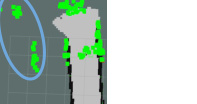

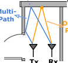

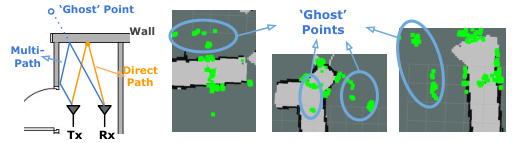

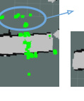

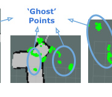

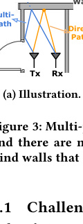

lenges of mmWave based grid mapping. A mmWave radar detects
ambient objects based on signal reflection. After several on-board
pre-processing steps (e.g., interference mitigation), the range and
orientation of reflecting points can be estimated and these points
collectively form a _point cloud_ in the field of view. However, unlike
the dense point clouds generated by lidars or depth cameras, the
mmWave point cloud in indoor environment has two fundamental
issues: i) multi-path noise and ii) sparsity.

_4.1.1_ _Multi-path Noise._ Similar to any radio frequency technology,
the signal propagation of MIMO mmWave in indoor environments
is subject to multi-path issue due to aliasing from imperfect beams

[31] and reflection from surrounding objects (see Fig. 3a). As a
consequence, reflected signals arriving at a receiver antenna are
normally from two or more paths, leading to smearing and jitter.
Multi-path is the primary contributor to the non-negligible proportion of pertinent noise artefacts or ‘ghost points’ in a mmWave
point cloud. Given ∼ 15m bound of our indoor environment, we
empirically found that, in extremely severe multi-path scenarios,
e.g., corridor corners, ghost points can account for > 75% points of
a frame, which severely impacts grid mapping steps. Fig. 3b shows
examples of noisy point clouds, where we can see many ghost
points behind walls.

_4.1.2_ _Sparsity._ As shown in Fig. 4, the point cloud given by a
single-chip mmWave radar is approximately ∼ 100 reflective points
per scan, which is over 100× sparser than a lidar. Such sparsity
results from three factors, including (1) the fundamental specularity of mmWave signals, (2) the low-cost single-chip design and (3)
restricted sensing range by manually settings. Wireless mmWave
signals are highly specular i.e., the signals exhibit mirror-like reflections from objects [21]. As a result, not all reflections from the object
propagate back to the mmWave receiver and major parts of the
reflecting objects do not appear in the point cloud. Moreover, unlike
massive array radar technology, due to cost and size constraints, the
mmWave radar in our use only has 7 antennas, which fundamentally limits its resolution. Moreover, as opposed to massive MIMO
radar technologies, the mmWave radar in this case only has 3 × 4
antennas. Such a design is effective in both cost and size but results
in poor angular resolution (15 [◦] in azimuth, 58 [◦] in elevation) and
targets which are closely spaced will be ‘smeared’ together. Moreover, in order to lower bandwidth and improve signal-to-noise ratio,

MobiSys ’20, June 15–19, 2020, Toronto, ON, Canada C. Lu et al.

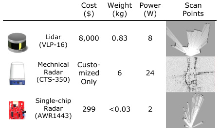

**Figure 4: Comparison of lidar, mechanical radar and our**
**single-chip radar. In each category, the features of a rep-**
**resentative model are listed. Notably, compared with a li-**
**dar and a mechanical radar [65], our beamforming radar is**
**much cheaper and lighter, but only provides few points.**

algorithms such as CFAR (Constant False Alarm Rate) [63] are used
for data processing and _only_ provide an aggregated point cloud,
further reducing density. The third factor resulting in sparsity is
specific to indoor mapping tasks and a consequence of multi-path
noise. mmWave point clouds contain a non-negligible portion of
‘ghost points’, which can mislead map densification. In order to
suppress these ‘ghost points’, we discard points outside of a sensing
radius of 6m, as multi-path effects generally incur false-positive
points at longer distances [68]. However, this restriction inevitably
decreases the density of point clouds further.

**4.2** **Reconstruction Framework**

With knowledge of the properties of mmWave data, milliMap aims
to create a dense grid map. Owing to the complex interaction of
the aforementioned challenges, this essentially requires an upsampling approach that can simultaneously address the sparsity and
noise/outlier issues, which is far from trivial. Such a huge design
challenge makes classic methods based on heuristics inadequate
here (as seen in Sec. 7.1).
**Reconstruction Neural Network.** To address the sparsity and
noise challenge, we propose to use generative neural network (i.e.,
GAN in this work) reconstruct maps. As discussed in Sec. 2.2, conditional GAN is a learning paradigm that has proved to be a very
effective tool for improving image resolution and generating realistic looking images. More importantly, GAN has the proven ability
to _reconstruct details_ [69], which can be crucial for route planning
for search and rescue. Intuitively, GAN can utilize receptive fields
in its CNN generator to denoise and densify image patches by referring to its neighboring contexts. Therefore, the generator in GAN
can learn to fill in the missing gaps due to sparsity and eliminates
artifacts caused by multipath. The discriminator in GAN further
allows us to recover the underlying outline similar to the real ones.
In fact, using GAN to perform denoising [67] and super resolution

[35] has become a predominant fashion in the computer vision
field when heuristics fall short. Concretely, our adopted network
architecture is constructed based on pix2pixHD [62], which is a recently proposed encoder-decoder framework based on conditional
GAN [42]. It comprises of a generator _G_ and a discriminator _D_ . In

our context, the goal of the generator _G_ is to transform sparse and
noisy patches to dense and clean images, while the discriminator
_D_ aims to distinguish real images (i.e., partial environment maps)
from the transformed ones. As in many other generative networks,
U-Net [51] is adopted as the backbone in our generator. To allow a
large receptive field without large memory overhead, our network
also uses multi-scale discriminators and downsamples the real and
synthesized images by different factors to create an image pyramid
of various scales. The discriminators are trained to distinguish real
and generated images at various scales.
**Cross-modal Supervision by Collocation** : Training the above
neural network requires a large number of labelled images. However
in reality, actual maps are not always available and even when they
are, maps can be outdated because in general most buildings do not
precisely match with blueprints [57]. Manually calibrating each map
incurs huge labor costs and is hard to scale. On the other hand, it is a
common practice to use lidar to map indoor/outdoor environments

[34, 59, 71]. Modern lidar can be very accurate and we therefore
consider to use it for creating a fresh map that is consistent with
the mmWave radar observations. To achieve such a generic and
cheap labeling manner, milliMap adopts a cross-modal supervised
learning fashion by using only partial labels (i.e., lidar patches)
generated from a co-located lidar, allowing a robot to learn about
the occupancy of the indoor environment by simply traversing
an environment. After the learning phase, the mmWave radar on
the robot is able to gain mapping skills from past experience and
becomes capable of generating a lidar-like map _independently_ .

**4.3** **Network Input**

Given the above neural network, it is not immediately clear what
representation of the inputs is best. Similar to most networks for
image-to-image translation, our network expects image-like inputs,
with a fixed, relatively low, number of channels and spatial correlations between neighbouring pixels. This is not met by the inherent
irregularity of point clouds. We thus need to firstly convert the
point cloud to an image-like representation and then use existing
networks to process it.
**Limitation of Scan Inputs.** Perhaps the most straightforward representation is a virtual 2D laser _scan_ obtained from the 3D point
cloud. After projecting each scan to a planar 2D image via raytracing, generative convolutional neural networks are able to take it as
an input and generate a denser and denoised image. The dense images can then be converted back to angular distance measurements
via raytracing and used for mapping. However, as the mmWave
point cloud is very sparse, the converted scan image from each
frame contains few spatial correlations between neighboring pixels.
Directly feeding such non-informative images to a network incurs
overfitting and hard to generalize in new environments [56]. For
these reasons as well as our goal for developing _2D_ maps (i.e., z-axis
is not needed for end maps), in this work we chose to work directly
on map _2D patches_ .
**Patches as Input** The way map patches are generated differs between the training and prediction phases. During training, since
we have access to the full, yet sparse, grid maps through running
off-the-shelf Bayesian grid mapping [25], we can generate patches
by dividing the full map into a regular grid of patches of a given

milliMap MobiSys ’20, June 15–19, 2020, Toronto, ON, Canada

size (6 × 6 _m_ [2] in this work), with an overlap of 50%. However, at
prediction time, we only generate patches along the robot’s trajectory, in order to reduce inference time. In particular, since we
have access to a reasonably accurate odometry (e.g. from wheel
odometry and/or inertial measurements), we can detect when the
robot is moving out of the current patch, and extract a new patch
along the direction of travel, without overlapping with the previous
patch (6 × 6 _m_ [2] ). This simplification ensures we don’t have to merge
two overlapping predictions. We then feed patches of the generated
map along with the past robot trajectory to our network for denoising and densification. The advantage of this hybrid approach is
that patches are built in real-time, whilst the more expensive map
densification process is only triggered when entering a new patch.
Hereafter, we denote the reconstructed map patches as x and the
noisy mmWave patches as s. The pivotal goal of milliMap is to
translate mmWave patches to dense map patches through a deep
neural network. The dense patches are then stitched together to
produce a full map.

**4.4** **Reconstruction Loss Functions**

The objective function of our network is comprised of losses from
four sources: (1) a conditional GAN, (2) an intermediate feature
matching, (3) a perceptual loss, and (4) a map prior.
**Reconstruction Likelihood.** We use conditional GANs to model
the conditional distribution of real map patches x given the input
mmWave map patches s, which are converted from the sparse point
cloud. The conditional GAN loss can be expressed as:

L _cGAN_ ( _G_, _Dk_ ) =E(s,x)[log _Dk_ (s, x)]

+Es[log(1 − _Dk_ (s, _G_ (s))]

where _G_ tries to minimize this objective function against an adversary network _Dk_ that tries to maximize it [42]. In particular, as
our network uses multi-scale discriminators, _Dk_ here is the specific
discriminator for _k_ -th scale. In the meantime, to stabilize training
and generate meaningful statistics at multiple scales, we follow

[14, 62] and introduce the feature matching loss L _F M_ ( _G_, _Dk_ ) in
our objective function:

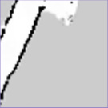

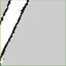

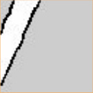

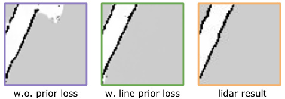

**Figure 5: Effectiveness of map prior loss on a straight corri-**
**dor patch. A line detector is used in this case to construct the**
**map-prior loss and the produced ‘corridor’ is straighter and**
**more complete. lidar is used as pseudo-ground truth.**

important low-level geometrics. Recent research found that the latent spaces of appearance and geometry are not strongly correlated.
Standard neural network generators can learn appearance transformation, however, lack the ability to embed complex geometry cues
for effective image-to-image translation [18, 78]. Nevertheless, 2D
indoor maps in modern buildings often have strong geometric structures that follow certain patterns, e.g. following rectilinear outlines
for ease of construction. As this geometric information is fairly
ubiquitous [17], one can leverage it as a prior to bootstrap the patch
generation process and enhance the quality of the final stitched
map. Formally, given a generated patch _G_ (s) and its corresponding
real patch x, we define a _map-prior loss_ as follows:

L _MP_ ( _G_ ) = E(s,x)

_M_

||h [(] _[j]_ [)] ∗ _G_ (s) − h [(] _[j]_ [)] ∗ x||1 (3)
_j_ =1

L _F M_ ( _G_, _Dk_ ) = E(s,x)

_T_

_i_ =1

1
|| _D_ [(] _[i]_ [)]
_Ni_ _k_ [(][s][,][ x][) −] _[D]_ _k_ [(] _[i]_ [)][(][s][,] _[G]_ [(][s][))||][1]

where _T_ is the total number of layers, _D_ [(] _[i]_ [)]
_k_ [produces the features of] _[ i]_ [-]
th layer and _Ni_ denotes the number of nodes in that layer. milliMap
computes this feature matching loss on multiple discriminators
which is in line with our multi-scale architecture. Lastly, to compare
high level differences and stabilize GAN training [32], we also
introduce a perceptual loss in the objective function:

where ∗ represents the convolution operator and h [(] _[j]_ [)] is one of _M_
convolution kernels with _fixed_ weights, determined by the types
of convolution. For example, h [(] _[j]_ [)] can be a line or edge detection
mask, capturing different geometric properties of images. Through
a detector mask, this map-prior loss encourages the consistency
between source and target patches corresponding to a certain geometric prior. For example, many objects (e.g., walls and doors) on
indoor floor plans are line based [17]. Therefore, when using line
detectors to embed such a prior in the loss, we can achieve better reconstruction performances in corridors, as shown in Fig. 5. Choices
of convolution masks are flexible, mainly depending on the noise
level of inputs as well as a particular map/building type. We will
quantitatively discuss the impacts of different types of detectors in
Sec. 7.2.
Finally, our full objective combines reconstruction likelihood
and map prior as:

  L _total_ =

L _cGAN_ ( _G_, _Dk_ ) + _λ_ 1L _F M_ ( _G_, _Dk_ )
_k_ =1,2,..., _K_

L _V GG_ ( _G_ ) = E(s,x)

_J_

|| _F_ [(] _[j]_ [)] ( _G_ (s)) − _F_ [(] _[j]_ [)] (x)||1
_j_ =1

_K_ (4)

+ _λ_ 2L _V GG_ ( _G_ ) + _λ_ 3L _MP_ ( _G_ )

where _F_ is a pre-trained loss network used for image classification
that helps to quantify the perceptual differences of the content
between images. In this work, we follow [32] and adopt the VGG
network as _F_ . Each layer _j_ in the VGG network measures different
levels of perception.
**Map Prior.** The above losses only consider the efficacy of reconstruction in the latent space of high-level appearance but ignore the

where _λ_ 1, _λ_ 2 and _λ_ 3 are hyper-parameters for regularization. _K_
denotes the number of distinct scales for discriminators.

**5** **SEMANTIC MAPPING**

So far we have introduced how milliMap reconstructs a dense grid
map from mmWave signals. Nevertheless, in order to best assist the
decision making of emergency response, a thorough map should not

MobiSys ’20, June 15–19, 2020, Toronto, ON, Canada C. Lu et al.

only tell _where_ the obstacles are but also their _semantics_ . Exhausting
the whole universe of indoor semantics is beyond the scope of this
work; instead milliMap follows [54] and focuses on 4 predominant
construction objects that semantically describe space accessibility:
(1) horizontal access object (AO) - doors, (2) vertical AO - lifts, (3)
alternative AO - glass and (4) non-AO - walls.

**5.1** **Complex Construction Objects**

**Challenge.** The main challenge here lies in the complexity of interior construction objects, with prior art on material identification
difficult to directly apply. Specifically, previous work focuses on
objects made of a single material or containing very thin layers (e.g.,
cardboard box). For these simple objects, the received mmWave
signals are from the specular reflection from the object _surface_ and
thus prior work (e.g., [82]) can directly use the _strongest/peak_ signal strength (RSS) value to determine the object type. However
in our case, many construction objects in indoor environments,
ranging from composite walls to hollow doors, consist of multiple
slabs made from different materials. For instance, fig. 6a shows the
diagram of common interior building wall, in which 5 different
layers are stacked together. Each of the slabs often has sufficient
thickness that affects propagation characteristics of mmWave signals as well as resulting in multiple reflections from internal layers

[24]. Additionally as discussed in [20, 33], building materials have
different roughness and the diffusion effect of mmWave on some
rough surfaces (e.g., the surface of wall) can be significant. Such
diffusion effects, unfortunately, further complicates the problem of
object identification (see Fig. 6b). Intuitively, the compound effect
of diffusion, multiple internal reflections and specular reflection is
hard to model by only using a peak RSS value.
**Key Idea and Observations.** From the perspective of a receiver,
both diffusion and multiple internal reflections cause multi-path effects. Owing to differences in several properties, such as roughness
and interior layers, the multi-path effects exhibit certain patterns,
captured in the 1D range FFT profile (see Sec. 2.1 for definition).
Fig. 7a shows an example of a range FFT profile. The peak value in
this example represents the normalized intensity of the specular
reflection along the direct path, where neighbor values around it
are due to multi-path effects from diffusion and multi-reflections.
To illustrate what patterns we can extract from the shape of the
peak, we extract features (e.g. peak value, standard deviation) from
27, 952 collected profiles of 3 common construction objects. Fig. 7b,
7d and 7c show the average value and standard deviations, from
which two key observations can be drawn. First, peak value differences (feature index 2) between construction objects can be vague
(e.g., glass versus lift) that confuses object classification. Second,
both the magnitude and shape of neighboring points exhibit more
distinct patterns, providing better object signatures.

**5.2** **Semantic Recognizer**

Based on the above observations, we propose a semantic recognizer
that operates by first extracting a segment of interest from the
range FFT profile, and then using a classifier to identify different
types of obstacles.
**Segment of Interest.** Notably, the first step before performing
segment extraction is to acquire a scan at a perpendicular angle

|Rx Tx Specular|Col2|
|---|---|
|Tx Multiple Internal Reflections Diffuse Scaterrin Reflection|Tx Multiple Internal Reflections Diffuse Scaterrin Reflection|
|1st Slab|1st Slab|
|2nd Slab||
|3rd Slab||

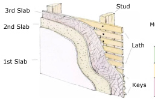

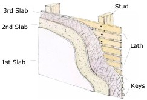

**Figure 6: mmWave signal propagation on a wall. (6a) A com-**
**mon interior building wall has multiple layers. (6b) The dif-**
**fusion and multiple internal reflections on a simplified wall**
**model (with only three slabs), result in complicated multi-**
**path effects. We exploit these signatures for classification.**

to the object. To combat the limited angular resolution of the TI
board (see Sec. 2, milliMap tasks the robot platform to mechanically scan its horizontal field of view, and then determines the
perpendicular angle by pinpointing the pose that yields the largest
reflection intensity. Once a perpendicular pose is determined, the
robot platform enters the static mode and starts to record the range
profile at this instant. A practical issue of applying the above intuition is determining the number of points to consider after the
peak, namely finding a _segment of interest (SOI)_ in the range profile. As multiple objects are in the mmWave radar’s field of view, a
range profile often contains extraneous information corresponding
to non-target objects. Directly using the whole profile as features
will thus confuse a _single_ object classifier. As the target object in
our case is the nearest object perpendicular to the robot/radar, the
starting point of a SOI is easy to find because it has the steepest
increasing gradient in the profile. To mitigate the potential aliasing
issue due to 40mm ranging resolution, we always use the prior
index to the steepest point as the starting point of SOI. We empirically found that at a SOI width of 6 points, the best tradeoff can be
achieved. In Sec. 7.6, we will further discuss the impact of different
SOI widths on semantic classification. Fig. 7a illustrates the SOI
extraction process.
**Object Classifier.** Taking the extracted SOI as input, a classifier is
used to identify a target object. The classifier adopted by milliMap
is a convolution neural network (CNN), which is widely used in
many classification tasks for its superior accuracy and efficiency.
Specifically, this classifier comprises of three 1D convolution layers
and a dense layer with softmax activation. The kernel sizes and
strides of all three convolution layers 32 and 1, and the activation
functions are Exponential Linear Unit (ELU). We compare the performance of this CNN classifier with other baseline classifiers in
Sec. 7.1 to further justify our choice.

**6** **IMPLEMENTATION**

For the purpose of reproducing our approach, we release our dataset
[and the source code at https://github.com/ChristopherLu/milliMap.](https://github.com/ChristopherLu/milliMap)
**Multi-modal Robotic Sensing Platform.** A Turtlebot 2 platform
equipped with multiple sensors is used a a prototype data collection
platform. This dataset contains synchronized mmWave point cloud
data from a TI AWR1443 board, lidar data from a Velodyne VLP-16

**(a)**

**(b)**

milliMap MobiSys ’20, June 15–19, 2020, Toronto, ON, Canada

1.0

0.9

0.8

0.7

|Col1|Col2|Col3|Col4|Col5|
|---|---|---|---|---|
||||||
||||||

Feature Index

**(b) Door**

|Col1|Col2|Col3|Col4|Col5|
|---|---|---|---|---|
||||||
||||||

Feature Index

**(c) Lift**

|Col1|Col2|Col3|Col4|Col5|
|---|---|---|---|---|
||||||
||||||

Feature Index

**(d) Glass**

1.0

0.9

0.8

0.7

1.0

0.9

0.8

0.7

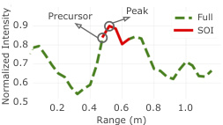

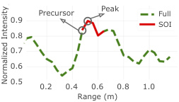

**(a) SOI Extraction**

**Figure 7: Semantic Mapping: (a)** 16 **cm-wide SOI, determined by the corresponding peak in the range FFT profile; (b-d) ‘average’**
**SOI aggregated from** 27, 952 **training samples. SOIs of different materials have distinct patterns. Note that the first feature**
**index, namely the starting point in (b-d) is the precursor index to the detected peak value.**

and wheel odometry. The bandwidth of the used radar is 4GHz
(77GHz - 81GHz) which yields a ranging resolution of ∼ 4cm. It
has 120 degree azimuth field of view and 30 degree elevation field
of view. In addition, we provide RGB images from a front-facing
monocular camera. The mmWave sensor, lidar and camera are coaxially located on the robot along the vertical axis. The navigation of
the mobile robot is implemented using ROS [49] on a Linux notebook, which is a widely adopted practice in the robotics community.
Besides controlling, the notebook is also responsible for sensor data
storage. Once the collection phase is completed, the notebook sends
the collection back to a backend server for offline model training.
During the online phase, model inference is expected to be done
either by an embedded GPU or the notebook itself. We will discuss
the real-time performance soon in Sec. 7.7.
**Testbeds.** Two buildings are surveyed at the time of writing. The
A Building has a size of ∼ 1, 100 _m_ [2] and contains four floors, mostly
composed of corridors and atrium; the B Building has a size of
∼ 205 _m_ [2] and contains one floor with a combination of corridors
and rooms. The A Building dataset presents a combination of walls,
doors, lifts and large glass handrails; the B Building dataset presents
walls, doors, glass panes, lifts and clutter. Notably, despite similar
high-level semantics, these buildings differ in pathway widths, door
types, glass sizes and more importantly, layouts.
**Data Collection Procedure.** To collect the dataset of map reconstruction, we use a remote control to drive our mobile robot moving
from a starting point to an end point on each floor of the buildings.
Particularly, we do not set any specific traveling routes in data
collection, but let the robot freely traverse the indoor space. The
reconstruction dataset contains the data from the mmWave radar,
lidar and wheel odometry. Sec. 7.1 introduces how the collected data
are used for training and testing. The semantic mapping dataset is
acquired in the same places as above. In data collection, a mmWave
radar on the robot is firstly rotated to a pose perpendicular to the
target object/material surface with a distance ∼ 0.5 meter. Then at
each collection point, we acquire data at a rate of 10Hz and semantically label these offline from location logs. In total, we collected
45, 535 frames from 4 types of objects in two buildings.

**7** **EXPERIMENTAL EVALUATION**

**7.1** **Grid Map Reconstruction Performance**

We start with the validation of the grid map reconstruction method
proposed in Sec. 4.

**Evaluation Metrics.** Throughout this section, two metrics are
consistently adopted to quantify map reconstruction performances:
mean absolute error ( _L_ 1) and mean _intersection-over-union (IoU)_,
both of which are widely used [65]. The mean _L_ 1 is calculated as
follows [72]:

where _p_ is the index of the pixel and _P_ is the patch. _x_ ( _p_ ) and _y_ ( _p_ ) are
the values of the pixels in the processed patch and the ground truth
respectively. We will omit “mean” hereafter for presentation ease.
It is worth mentioning that as the image resolution is 1dm/pixel
in our case, _the L_ 1 _mapping error is thus in the units of decimeters_ .
It is also worth mentioning that our goal is to build an indoor
map for navigation in search and rescue applications. Therefore
it is necessary to have a good idea of the free space and obstacles.
Although this property is difficult to be numerically reported, we
will qualitatively discuss it when comparing reconstruction results.
**Evaluation Protocol.** We perform cross-floor and cross-building
tests to examine the effectiveness of the trained model. To avoid
the known overfitting issues of DNN in our model and we particularly follow this cross-test evaluation principle on unseen scenarios.
Concretely, our collected dataset is divided into training and testing sets. In particular, the training set contains 12, 000 augmented
patch images extracted from maps of the 1st, 2nd and 3rd floors
in _A_ Building. The data augmentation strategy we adopt here is
the standard rotation and translation transformations on original
patches to promote model generalization. Our test set comprises
49 patch images extracted from maps of the 4th floor in _A_ Building
and 12 patches extracted from the 2nd floor of _B_ Building.As introduced in Sec. 6, the environments of _A_ Building and _B_ Building
notably differ in pathway widths, door types, glass sizes and more
importantly, layouts etc.Moreover, the path followed by our robot
on the 4th floor is quite different from that of other three floors in
_A_ Building. The above scenario variety helps us maximally follow
the cross-testing principle.
All training and testing patch images have size 64 × 64. Concerning model training, three loss weights _λ_ 1, _λ_ 2 and _λ_ 3 are set to 10,
10 and 5 respectively. We adopt a line detector as the convolution
kernel in Eq. (3), _M_ is set to 4, corresponding to 4 line directions in
0°, 45°, 90° and 135°. The training batch size is set to 16 and we use
the Adam optimizer at a learning rate of 2 _e_ [−][3] .
**Effectiveness of Densification Before and After Mapping.** We
first investigate the effect of two input representations (refer to

_L_ 1 = [1]

_N_

| _x_ ( _p_ ) − _y_ ( _p_ )| (5)
_p_ ∈ _P_

MobiSys ’20, June 15–19, 2020, Toronto, ON, Canada C. Lu et al.

**Table 1: Densification Before and After Mapping.**

|Col1|Method|A Building|Col4|B Building|Col6|
|---|---|---|---|---|---|
||_Method_|L1|IoU|L1|IoU|
|Scan (before)|Pix2Pix [28]|2.776|0.186|3.602|0.150|
|Scan (before)|Pix2PixHD [62]|2.309|0.226|3.722|0.152|
|Patch (after)|Pix2Pix [28]|2.214|0.319|3.200|0.173|
|Patch (after)|Pix2PixHD [62]|**2.096**|**0.380**|**2.752**|**0.239**|

Section 4.3): (i) we perform densification of each scan and then
aggregate them using grid mapping (denoted as _scan_ representation)
and (ii) we aggregate scans using grid mapping and then perform
densification on image patches (denoted as _patch_ representation).
As Tab. 1 shows, the reconstruction results of _patch_ representation
are significantly better than _scan_ for both networks, implying the
effectiveness of _patch_ representation. Given the best-performing
Pix2PixHD network, the _L_ 1 errors of _scan_ are 20% inferior to _patch_,
with over 35% inferior IoU scores on both datasets. The reason is
that the single _scan_ densification easily overfits to straight lines,
which is consistent with our discussion in Sec. 4.3.
**Network Architecture Validation** After understanding the effective processing order, we adopt the _patch_ representation for
subsequent experiments and continue to validate different architectures of reconstruction networks. As milliMap is the first indoor
mapping work dealing with very sparse inputs of such low-cost
mmWave radar, we can only compare the following commonly
used generative networks: Conditional Variational Autoencoder
(CVAE) [65], BicycleGAN [79], Pix2Pix [28] and Pix2PixHD [62].
Notably, CVAE is the network architecture adopted by [65], though
their goal is not sparse-to-dense due to the use of a customized
mechanical radar. Beside these deep learning methods, we also
compare with lineFitting [46], a classic reconstruction method for
line-based indoor floor plans. Tab. 2 shows the performance comparison of different reconstruction methods. Despite its success
on lidar map reconstruction, the classic line fitting method obviously struggles on both datasets and provides < 50% IoU than our
approach, attributed to the substantial sparsity in raw mmWave
maps. In particular, it is observed in Fig. 8 that there are many
falsely closed corridors predicted by the line fitting method. Such
misclassified free space and navigable routes is contrary to our goal
for safe/efficient navigation as areas falsely marked as obstacles
are in general more detrimental than areas falsely marked as free
space, since a robot or a firefighter is typically capable of avoiding
unpredicted obstacles. In contrast, when computing a path to a certain location, falsely closed corridors could make whole areas of the
building appear inaccessible. On the side of DNN methods, we did
not find the advantages of using variational methods, implying that
random sampling from a learnt distribution actually counteracts
the benefits of uncertainty modelling and tends to output blurred
reconstructions. We hypothesize that the performance gain can be
also attributed to the strong regularity within indoor maps, which
favors deterministic learning methods. Lastly, despite their close
correlation, we found that Pix2PixHD outperforms Pix2Pix on both
datasets, thanks to the use of multi-scale discriminators and more
losses. By introducing the map-prior loss, our method can further
gain 9.6% L1 accuracy than Pix2PixHD, and ∼ 5% better IoU performance overall on both datasets, which is a comparable delta to

**Table 2: Reconstruction method comparison.**

|Method|A Building|Col3|B Building|Col5|
|---|---|---|---|---|
|_Method_|L1|IoU|L1|IoU|
|LineFitting [46]|3.180|0.167|4.114|0.103|
|CVAE [65]|2.408|0.323|3.082|0.221|
|BicycleGAN [79]|2.538|0.303|3.393|0.195|
|Pix2Pix [28]|2.214|0.319|3.200|0.173|
|Pix2PixHD [62]|2.096|0.380|2.752|0.239|
|Ours|**1.976**|**0.402**|**2.536**|**0.247**|

the field of image reconstruction/translation [78]. Note that the
prior loss is simply an additional loss term that incurs no further
computation overhead for either inference or training; however, it
still leads to a performance increase.
**Explanation of ‘Ghost’ Areas.** Interestingly, in the last column
of Fig. 8, there are ‘ghost’ areas on the generated maps, where part
of a wall (black) is incorrectly marked as free regions (white). Recall
that we adopt a cross-modal supervised learning framework that
uses lidar patches as supervision labels. These labels, however, can
be error-prone when encountering glass objects (see the second
column in Fig. 8), which is a commonly-known limitation of lidar. Although glass is opaque to mmWave, considering the high
appearance similarity (see Fig. 9), we hypothesize the ‘ghost area’
of our generated grid map of _A_ Building can be attributed to the
misleading lidar patches of glass in training. ‘Ghost’ areas do not
appear with scan inputs, due to its overfitting to straight corridors.

**7.2** **Effectiveness of Sub-components**

In order to understand the contribution of key sub-components in
the reconstruction neural network, we further conduct an effectiveness analysis on: i) loss functions and ii) multi-scale discriminators.
**Different Loss Functions.** We modify the objective function of
Eq. 4, by alternating different loss terms for reconstruction likelihood as well as alternating variants of our proposed map-prior
term. Tab. 3 shows that feature matching loss plays a vital role
which brings 16% − 24% gain in _L_ 1. The perceptual loss (i.e., VGG
loss) also helps and removing it incurs a average performance decline (∼ 7%) on both datasets. This is reasonable because the VGG
network is pre-trained by general image classification tasks and
hence becomes less effective in our specific mapping task.
These experiments indicate that, although grid maps are more
about geometrics, these appearance losses are still important for
stabilising generator training and improving realism. Interestingly,
when we implement the map prior loss as edge detectors, its efficacy
is not as helpful as the line detectors. This is because edges are a
broad concept for any image and cannot effectively incorporate
the geometrics of line-based maps. Moreover, as our supervision
signals are from the imperfect lidar patches, the edge detectors are
sensitive to the noises of lidar. In contrast, line detectors focus on
low-frequency components of images and thus can be more robust
to noise.
**Number of Scales.** Next we examine the impact of multi-scale discriminators. Recall that milliMap uses a 2-scale discriminator while
our ablation study further examines the cases of 1- and 3-scales. As
shown in Tab. 3, the overall impact of multi-scale discriminators is
not substantial (∼ 5%) when varying the number of scales. This is

milliMap MobiSys ’20, June 15–19, 2020, Toronto, ON, Canada

**Figure 8: Qualitative reconstruction results. milliMap achieves a comparable performance to the lidar counterpart. Solid cir-**
**cles on Lidar GT are glass objects; dashed circles are ‘ghost areas’ in generation. Red circles show corridors that have been**
**erroneously closed by the line-fitting method (** _**false obstacles**_ **). Top Row:** _**A**_ **Building; Bottom Row:** _**B**_ **Building.**

**Table 3: Effectiveness on losses and number of scales.**

**Figure 9: Incorrect lidar supervision due to presence of glass**
**objects in training data.**

|Col1|Col2|A Building|Col4|B Building|Col6|
|---|---|---|---|---|---|
|||L1|IoU|L1|IoU|
|Losses|w.o. FM|2.408|0.323|3.082|0.221|
|Losses|w.o. VGG|2.115|0.379|2.762|0.242|
|Losses|Edge Loss|2.214|0.319|3.200|0.173|
|# of Scales|1|2.024|0.394|2.633|**0.250**|
|# of Scales|3|2.022|0.387|2.863|0.219|
|Ours|Ours|**1.931**|**0.398**|**2.589**|0.238|

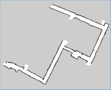

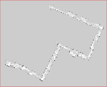

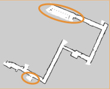

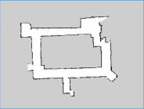

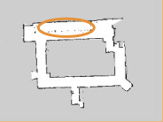

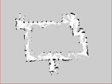

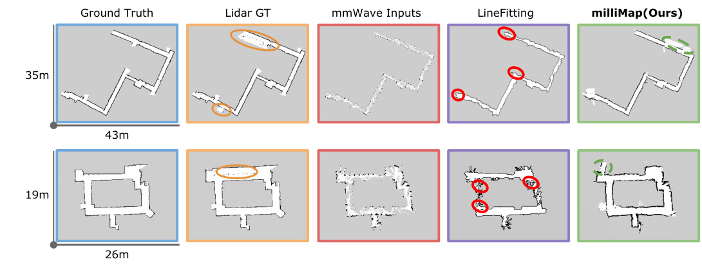

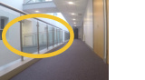

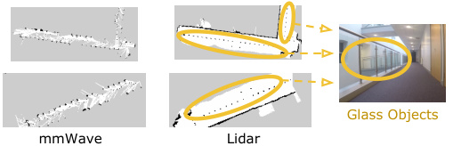

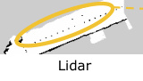

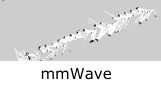

as expected because the multi-scale discriminators were originally
designed for high-resolution images while our input patches are not.
We observed a marginal improvement from single-scale to 2-scale
discriminators as more diverse feature matching is introduced in
different scales. However, such increase of scales soon counteracts
the benefits when the 3-scale network becomes oversized and overfits. This overfitting issue is more obvious on B _Building_ dataset
due to cross-building testing.

**7.3** **Testing in Smoke-filled Environments**

Thick smoke is a common event that occurs in many emergency
incidents such as firefighting. In this experiment we examine the
potential use of milliMap in smoke-filled environments. To this
end, we use a smoke machine to create different smoke densities in a
corridor (12 × 1.5m [2] ) in another building where various sensor data
were collected on the robotic platform for comparison, including
lidar, depth camera, RGB-camera and mmWave radar. Fig. 10 shows
the reconstructed map in 3 scenarios with different levels of smoke
distributions. As we can see, lidar gives very inaccurate map results
even with low levels of smoke. Due to the occlusion and reflection
effects of smoke particles, lidar generates many non-existent objects
and/or misses a lot of real ones. In fact, even under the lightest
smoke condition, lidar already undergoes substantial performance

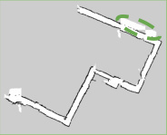

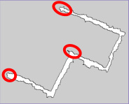

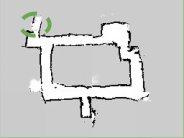

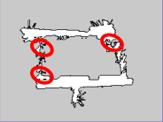

degradation. Depth and RGB cameras also fails to see through
smoke due to similar reasons. In contrast, the mmWave radar is
able to see through smoke and milliMap reconstructs the corridor
accurately in all 3 smoke-filled scenarios. These results demonstrate
that our mmWave based reconstruction model trained in benign
environments can transfer its mapping ability to unseen smokefilled environments. Based on this trial, we believe there are many
promising use cases of it for emergency situations.

**7.4** **Extending to Hand-held Devices**

First responders, who carry hand-held or helmet-mounted devices,
need to work in a team with robots for complementary operations.
To this extent, we test milliMap’s potential for map construction
on hand-held devices, without retraining, but directly using the
model trained using a robot. The main differences are that the odometry of the hand-held device is inferred from an embedded inertial
measurement unit by pedestrian dead reckoning (PDR) methods

[30]. However, compared to wheel odometry, PDR odometry drifts
more and has a lower sampling rate due to step discretization. As
a consequence, the raw patch images of PDR are of lower fidelity.
Furthermore, due to different viewpoints (e.g., different heights of
robots and pedestrians), the mmWave observations have obvious

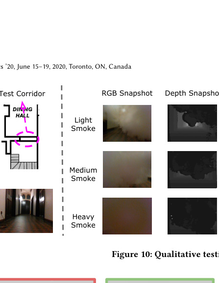

|Col1|Col2|Col3|Col4|Col5|Col6|
|---|---|---|---|---|---|
||||A B|A B||
||||A B|A B|Build.  Build.|

|Col1|Col2|Col3|Col4|Col5|
|---|---|---|---|---|
||||||
||||A Buil B Buil|d.  d.|
||||||
||||||

~~0.0~~ ~~0.2~~ ~~0.4~~ ~~0.6~~ ~~0.0~~ ~~0.2~~ ~~0.4~~ ~~0.6~~
Error (m) Error (rad)

**(a) Translation** **(b) Orientation**

**Figure 12: Error CDFs for the downstream localization tasks.**

**Figure 11: Qualitative result for hand-held cases.**

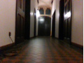

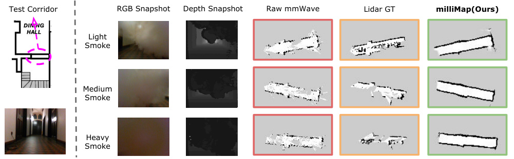

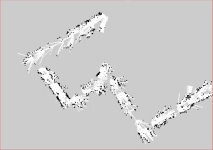

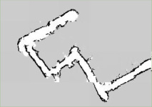

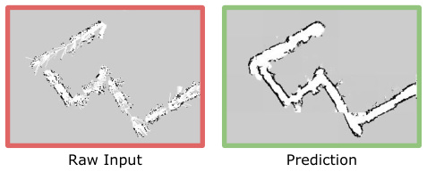

differences from the training samples. Despite these compromising factors, as can be seen in Fig. 11, milliMap still gives a good
reconstruction with ∼ 0.83 _m_ error, providing a much better sense
of space accessibility than using raw data alone. This experiment
serves to demonstrate how teams of robots and people could build
a common map.

**7.5** **Downstream Navigation Tasks**

We now test whether the produced maps, despite their imperfections, can still be used for autonomous navigation. In particular,
we investigate if another robot or person is able to localize in the
predicted map with comparable accuracy to that of a lidar map. We
run Monte Carlo localization using mmWave raw measurements
on the reconstructed maps using the standard _amcl_ ROS package
with default parameters. Each time the robot or person starts at a
random location and samples a radar frame. The pseudo-ground
truth is derived by localization with lidar on a lidar map of the same
floor. Fig. 12 shows the cumulative error distribution for 50 Monte
Carlo runs. For the reconstructed map of _A_ Building, our robot
achieved a mean translation accuracy of 0.285m and orientation
accuracy of 0.142 rad; on the reconstructed map of _B_ Building, the
mean translation and orientation accuracy are 0.178m and 0.140
rad respectively. Given the size of the two buildings, these results
show that the map produced by milliMap can be used to accurately
localize and navigate firefighters or robots.

**7.6** **Semantic Mapping Performance**

**Metrics and Baselines.** To validate the performance of semantic
classification, we adopt the 4 metrics for standard classification

tasks: _accuracy, precision, recall and F1 score_ . For comparison, we
implement RSA [82], a method identifying objects based on the
mmWave reflectivity on different surface materials. Furthermore,
to justify our choice of CNN classifier, we also compare with other
4 commonly used classifiers, including support vector machine
(SVM), random forest (RF), k-nearest neighbors (KNN), multi-layer
perceptron (MLP). All of these classifiers take as inputs SOI and
predict an object label out of glass, lift, wall and door.
**Evaluation Protocol.** The evaluation protocol here is similar to
the one described in Sec. 7.1. Specifically, classifiers are developed
on a training set collected from three floors in _A_ Building and we
test the trained classifier on a new floor in _A_ Building as well as in a
new building of _B_ . Overall, our training and test sets contain 27, 952
and 17, 583 samples (two test buildings) respectively. When training
baselines and our classifier, the best model for online inference is
determined by 5-fold cross validation.
**Overall Performance.** Tab. 4 summarizes the semantic mapping
performance where a SOI with a width of 6 is used. Clearly, our CNN
classifier achieves the best performance overall on two datasets and
MLP classifier is second to it. All shallow-learning based classifiers
(i.e., SVM, RF, KNN) underperformed relative to the deep-learning
based methods. This is reasonable as MLP and CNN are able to
learn meaningful feature representation in training, rather than a
shallow classifier on raw data. Because of these meaningful features,
MLP and CNN based classifiers can generalize across floors and
buildings. In contrast, as RSA only considers the specular reflection from the surface material while ignoring the rich information
conveyed by multi-path reflections, it struggles to robustly identify
objects in both cases. As expected, cross-building classification ( _B_

milliMap MobiSys ’20, June 15–19, 2020, Toronto, ON, Canada

**Table 4: Results of Material Classification: Accuracy (Acc.),**
**Precision (Prec.), Recall (Rec.) and F1 Score.**

|Col1|A Building|Col3|Col4|Col5|B Building|Col7|Col8|Col9|
|---|---|---|---|---|---|---|---|---|
||Acc.|Prec.|Rec.|F1|Acc.|Prec.|Rec.|F1|
|RSA|0.67|0.74|0.69|0.71|0.50|0.58|0.53|0.56|
|KNN|0.83|0.87|0.86|0.87|0.67|0.68|0.75|0.71|
|SVM|0.82|0.86|0.85|0.85|0.67|0.70|0.68|0.69|
|RF|0.86|0.89|0.89|0.89|0.67|0.68|0.72|0.70|
|MLP|0.90|0.92|**0.91**|0.91|0.74|0.77|0.78|0.77|
|_Ours_|**0.92**|**0.93**|0.89|**0.91**|**0.80**|**0.84**|**0.92**|**0.88**|

Building Dataset) is more challenging than cross-floor classification ( _A_ Building Dataset) because building differences are more
substantial than floor differences, resulting in a performance gap
∼ 15% on average. Fig. 13 further plots the confusion matrix of our
CNN classifier. We observed that walls are the most difficult objects
to identify on both datasets, coinciding with its greater structural
complexity than other objects. In contrast, lifts are generally made
of steel, allowing them to be easily identified and yields very high
accuracy.

1.0

1.0

0.8

1.0

0.5

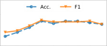

Width of SOI

**(a)** _**A**_ **Building**

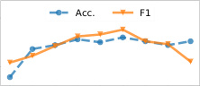

Width of SOI

**(b)** _**B**_ **Building**

door

glass

lift

wall

0.8

0.6

0.4

0.2

0.0

0.8

0.6

0.4

0.2

0.0

door

glass

lift

wall

**Figure 14: Impact of the SOI width on semantic mapping.**

training database, known as out-of-set or foreign/alien objects, and
could cause false detections. To detect and mitigate their impacts on
our semantic mapping, we introduce an ‘unknown’ label to mark
these out-of-set classes. Inspired by the ‘alien device’ detection
technique in [37], we take the maximum probability value from the
class distributions of softmax output (see Sec. 5.2) as a classification
score. To distinguish an unknown object from the known ones, we
apply a threshold on the classification score - if the score is less
than the threshold, we mark the object as unknown. The rationale
behind such a score threshold is based on the principles of network
learning and that the summation of a softmax distribution is always equal to 1. Indeed, the goal of learning a CNN classifier is to
maximize the softmax probability for individual true classes while
a flat probability distribution over multiple classes in testing time
often implies an out-of-set label.
As shown in Fig. 15, compared to the samples with the known
labels, the probability distribution output by the softmax layer for
three out-of-set objects are substantially more scattered and flat.
Their resulting classification score is accordingly lower than the
known samples. Based on 500 samples from 5 different alien objects
(e.g., basins, tables, chairs, sofa and fridges.), we empirically found
that a threshold of 0.92 on the softmax classification score can correctly detect over 96% of samples as unknowns. In the meantime, it
only results in less than 2.2% false negative rate for known samples.

**7.7** **System Efficiency**

In the last experiment, we investigate the runtime latency, summarized in Tab. 5. Four platforms fitting the payload of mobile robots
are used in our evaluation, including Raspberry Pi 3 (RPi 3), Raspberry Pi 4 (RPi 4), NVIDIA Jetson TX2 (TX2) and a mini netbook.
In the implementations, we use TensorFlow Lite [7] to compress
our models as per the convention of efficient on-device inference of
DNNs. Tab. 5 suggests that both map reconstruction and semantic
mapping modules are able to run in real-time on all platforms. Even
for the most challenging case (i.e., map reconstruction on RPi 3),
a runtime of 2.58s is also acceptable, because an input patch to
our reconstruction network is generated by a robot crossing over a
6 × 6 _m_ [2] square (see Sec. 4.3) while most ground robots’ max speeds
are ≤ 1m/s.

**8** **RELATED WORK**

**RF-based Imaging and Tracking.** Signal reflection of RF waves
has been widely leveraged to perform imaging and target tracking.
In the WiFi bands, researchers have used commodity WiFi chips

[10, 26, 29, 39, 48, 52] to imagine static objects, localize humans and
recognize predefined hand gestures. Additionally, by leveraging a
specialized FMCW radar [2–5, 73–75], WiFi signals can be used to

|0.|94 0.|00 0.|00 0.|06|
|---|---|---|---|---|
|0.|00 0.|90 0.|00 0.|10|
|~~0.~~|~~00~~ ~~0.~~|~~00~~ ~~0.~~|~~99~~ ~~0.~~|~~01~~|
|0.|14 0.|00 0.|00 0.|86|
||||||

|0.|84 0.|08 0.|00 0.|09|
|---|---|---|---|---|
|0.|00 0.|75 0.|00 0.|25|
|~~0.~~|~~00~~ ~~0.~~|~~00~~ ~~1.~~|~~00~~ ~~0.~~|~~00~~|
|0.|22 0.|03 0.|00 0.|75|
||||||

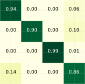

Prediction

**(a)** _**A**_ **Building**

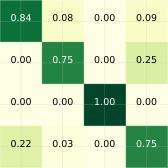

Prediction

**(b)** _**B**_ **Building**

**Figure 13: Confusion Matrix of CNN classifier: (a)** _**A**_ **Building**
**(b)** _**B**_ **Building.**

**Impact of SOI Length.** The width of SOIs is an important parameter which essentially determines the tradeoff between information
richness of features and noise levels. To investigate its impact on
the end-to-end object classification, we vary the width from 1 to
9, at a step of 1. As we can see in Fig. 14, an effective width falls
into the range of [4, 6] while either an over-long or over-short SOI
results in a sub-optimal classification result. Notably, the negative
impact of over-long SOIs is not as significant as the over-short
case for unseen floors (see Fig. 14a). We hypothesize that this is
attributed to the adopted CNN which likely learns to suppress extraneous information of non-target reflections and such extraneous
noise is similar across floors in the same building. However, the
limitation of over-long SOIs becomes significant in the case of an
unseen building, as suggested by the drop of F1 score in Fig. 14b.
This is reasonable because more different secondary reflections are
experienced due to the distinct building structures which makes
the learned suppression hard to generalize. Empirically, SOIs with
the width of 6 gives the best overall performance.
**Dealing with Out-of-set Objects.** In real-world applications, it
is possible that some objects or materials are not included in the

MobiSys ’20, June 15–19, 2020, Toronto, ON, Canada C. Lu et al.

door
glass

lift
wall

door
glass

lift
wall

door
glass

lift
wall

door
glass

lift
wall

~~0~~ ~~5~~ ~~10~~ ~~15~~ ~~20~~ ~~25~~ ~~30~~ ~~35~~
Index

**(a) Various known (in-database) classes.**

~~0~~ ~~5~~ ~~10~~ ~~15~~ ~~20~~ ~~25~~ ~~30~~ ~~35~~
Index

**(b) Out of set: tables**

~~0~~ ~~5~~ ~~10~~ ~~15~~ ~~20~~ ~~25~~ ~~30~~ ~~35~~
Index

**(c) Out of set: chairs**

~~0~~ ~~5~~ ~~10~~ ~~15~~ ~~20~~ ~~25~~ ~~30~~ ~~35~~
Index

**(d) Out of set: basins**

|Col1|RPi 3|RPi 4|TX2|Netbook|
|---|---|---|---|---|
|**Map Recon. (s)**|2.58|1.01|0.65|0.33|
|**Semantic Mapping (ms)**|0.17|0.08|0.06|0.02|

**Figure 15: Softmax distribution comparison between known**
**classes and out-of-set classes. A dark color represents a large**
**value i.e. high confidence and the horizontal axis denotes**
**sample index. For known labels (top row), the distribution is**
**unimodal. In contrast, the distribution of out-of-set samples**
**are spread over multiple classes, yielding low classification**
**scores.**

accurately track/imagine human body dynamics, as well as recover
pose estimation under NLOS scenarios. In the vein of mmWavebased tracking, Babak et al. use FMCW hardware and apply SAR
with sparse measurements in absence of device movement noises

[40], while Xu et al. uses customized mmWave probe to recover
human speeches via throat localization [66]. On the side of environment sensing, research effort has been devoted to pinpoint indoor
major reflectors, thereby combating the environment sensitivity
of mmWave communications [44, 64, 76]. Nevertheless, major reflectors are still sparse points which are incomparable to the dense
grid maps to first responders. Recent works [80, 81] pioneered the
research of low-cost mmWave devices to explicitly image objects.
By continuously moving or navigating in front of a specific object, they can infer the geometry of small indoor objects. However,
such iterative mapping and navigation strategy violates limited
time budgetsin search and rescue scenarios. In contrast, milliMap
uses a low-cost off-the-shelf mmWave radar to reconstruct a dense
occupancy grid map while a robot travels freely in an environment.
**RF-based Material/Object Identification.** By charactering the
reflection intensity of RF signals, the RSA system [82] measures
the reflected mmWave signals at multiple locations and then use an
aggregated value to identify a target’s surface material. A similar
work is RadarCat [70], a contact based material identification systems leveraging 60 GHz signals. milliMap differs from the RSA and
Radar in that it does not require multiple measurements at different
locations nor a physical contact with the target material. Recent
studies also found mmWave signals can detect and classify hidden
electronic devices [38] and even screen activities [36]. On the other
side, WiFi CSI [15], UWB [12] and RFID [61] have recently been
utilized to identify materials based on their phase and RSS readings.

**Table 5: Runtime efficiency of key modules in milliMap.**

However, these systems are sensitive to the calibrated positions of
pairs of transmitters and receivers, while milliMap is a single-chip
solution to mobile robotic platform.
**Indoor Mapping/Imaging with non-RF Sensors.** Optical sensors, such as RGB cameras [13, 16], laser rangers [53] and stereo
cameras [23] are established sensor modalities to produce accurate indoor maps. However, these sensors are notoriously fragile
under adverse vision conditions, e.g., darkness, glare and smoke
debris. Acoustic sensors such as microphones [41, 47, 77] are recently found to be effective for indoor mapping and object imaging
but their performances are restricted by limited sensing ranges
and sensitive to environmental noises as well as sound-absorbing
materials.

**9** **LIMITATIONS AND FUTURE WORK**

This work focuses on a proof-of-principle mapping using mmWave
radar, towards our vision of augmenting emergency response with
low-cost mobile sensing systems. There are limitations and a number of avenues for future exploration. Firstly, the turtlebot platform
is not rugged enough for a real disaster situation. Other more robust
platforms have been designed to tackle this problem [9], e.g. the
use of tracked or snake-like robots. Aerial micro-robots are also a
potential alternative for rapid exploration, and the form-factor of
the single chip radar is ideally suited as a primary sensor for these
agents. Secondly, further trials need to be performed under diverse
conditions such as different buildings, varying obscurants (e.g. dust
in a factory) and under real emergency conditions. Thirdly, we have
focussed on using a single agent to build a map, in future work we
will explore how to use swarms of robots to cooperatively explore
and build the map e.g. by using SLAM [1].

**10** **CONCLUSIONS**

Indoor mapping in low-visibility environments full of airborne particulates is a challenging yet important problem. Particularly of
importance to emergency responders, an accurate map can significantly aid in situational awareness and become a life saver in search
and rescue scenarios. To this end, milliMap used a mmWave radar
on a mobile robot to create a dense map that indicates place reachability and object semantics on the map. We also demonstrated how
another agent could relocalize within the map. With extensive experiments in different indoor environments and under smoke-filled
conditions, we show the performance of reconstruction, semantic
classification and system efficiency of milliMap, demonstrating its
ability to generalise to previously unseen environments.

**ACKNOWLEDGMENTS**

We thank all anonymous reviewers and our shepherd for their
helpful comments. This work was supported, in part, by the awards
70NANB17H185 and 60NANB17D16 from the U.S. Department of
Commerce, National Institute of Standards and Technology (NIST)
and the UK EPSRC through Programme Grant EP/M019918/1.

milliMap MobiSys ’20, June 15–19, 2020, Toronto, ON, Canada

**REFERENCES**

[1] Markus Achtelik, Michael Achtelik, Yorick Brunet, Margarita Chli, Savvas
Chatzichristofis, Jean-Dominique Decotignie, Klaus-Michael Doth, Friedrich
Fraundorfer, Laurent Kneip, Daniel Gurdan, et al. 2012. Sfly: Swarm of micro
flying robots. In _2012 IEEE/RSJ International Conference on Intelligent Robots and_
_Systems_ . IEEE, 2649–2650.

[2] Fadel Adib, Chen-Yu Hsu, Hongzi Mao, Dina Katabi, and Frédo Durand. 2015.
Capturing the human figure through a wall. _ACM Transactions on Graphics_ 34, 6
(2015), 219.

[3] Fadel Adib, Zachary Kabelac, and Dina Katabi. 2015. Multi-Person Localization
via RF Body Reflections. In _NSDI_ .

[4] Fadel Adib, Zach Kabelac, Dina Katabi, and Robert C Miller. 2014. 3D tracking
via body radio reflections. In _NSDI_ .

[5] Fadel Adib and Dina Katabi. 2013. _See through walls with WiFi!_ ACM SIGCOMM.

[6] Federal Emergency Management Agency. [n. d.]. Fire in the United States (1989 1998). file:///home/chris/Desktop/10409.pdf

[7] Oscar Alsing. 2018. Mobile Object Detection using TensorFlow Lite and Transfer
Learning.

[8] Kok Seng Chong and Lindsay Kleeman. 1999. Feature-based mapping in real,
large scale environments using an ultrasonic array. _The International Journal of_
_Robotics Research_ 18, 1 (1999), 3–19.

[9] Jeffrey Delmerico, Stefano Mintchev, Alessandro Giusti, Boris Gromov, Kamilo
Melo, Tomislav Horvat, Cesar Cadena, Marco Hutter, Auke Ijspeert, Dario Floreano, et al. 2019. The current state and future outlook of rescue robotics. _Journal_
_of Field Robotics_ 36, 7 (2019), 1171–1191.

[10] Saandeep Depatla, Lucas Buckland, and Yasamin Mostofi. 2015. X-ray vision
with only wifi power measurements using rytov wave models. _IEEE Transactions_
_on Vehicular Technology_ 64, 4 (2015), 1376–1387.

[11] Ashutosh Dhekne, Ayon Chakraborty, Karthikeyan Sundaresan, and Sampath
Rangarajan. 2019. TrackIO: tracking first responders inside-out. In _16th_ { _USENIX_ }
_Symposium on Networked Systems Design and Implementation (_ { _NSDI_ } _19)_ .

[12] Ashutosh Dhekne, Mahanth Gowda, Yixuan Zhao, Haitham Hassanieh, and
Romit Roy Choudhury. 2018. Liquid: A wireless liquid identifier. In _Proceedings_
_of the 16th Annual International Conference on Mobile Systems, Applications, and_
_Services_ . ACM, 442–454.

[13] Jiang Dong, Yu Xiao, Marius Noreikis, Zhonghong Ou, and Antti Ylä-Jääski. 2015.
imoon: Using smartphones for image-based indoor navigation. In _Proceedings of_
_the 13th ACM Conference on Embedded Networked Sensor Systems_ . ACM, 85–97.

[14] Alexey Dosovitskiy and Thomas Brox. 2016. Generating images with perceptual
similarity metrics based on deep networks. In _NIPS_ .

[15] Chao Feng, Jie Xiong, Liqiong Chang, Ju Wang, Xiaojiang Chen, Dingyi Fang, and
Zhanyong Tang. 2019. WiMi: Target Material Identification with Commodity WiFi Devices. In _2019 IEEE 39th International Conference on Distributed Computing_
_Systems (ICDCS)_ .

[16] Ruipeng Gao, Mingmin Zhao, Tao Ye, Fan Ye, Yizhou Wang, Kaigui Bian, Tao
Wang, and Xiaoming Li. 2014. Jigsaw: Indoor floor plan reconstruction via mobile
crowdsensing. In _Proceedings of the 20th annual international conference on Mobile_
_computing and networking_ . ACM, 249–260.

[17] Andrea Garulli, Antonio Giannitrapani, Andrea Rossi, and Antonio Vicino. 2005.
Mobile robot SLAM for line-based environment representation. In _CDC_ .

[18] Aaron Gokaslan, Vivek Ramanujan, Daniel Ritchie, Kwang In Kim, and James
Tompkin. 2018. Improving shape deformation in unsupervised image-to-image
translation. In _ECCV_ .

[19] Ian Goodfellow, Jean Pouget-Abadie, Mehdi Mirza, Bing Xu, David Warde-Farley,
Sherjil Ozair, Aaron Courville, and Yoshua Bengio. 2014. Generative adversarial
nets. In _NIPS_ .

[20] Angelos A Goulianos, Alberto L Freire, Tom Barratt, Evangelos Mellios, Peter
Cain, Moray Rumney, Andrew Nix, and Mark Beach. 2017. Measurements and
characterisation of surface scattering at 60 GHz. In _IEEE 86th Vehicular Technology_
_Conference (VTC-Fall)_ .

[21] Junfeng Guan, Sohrab Madani, Suraj Jog, and Haitham Hassanieh. 2020. High
Resolution Millimeter Wave Imaging For Self-Driving Cars. _IEEE CVPR_ (2020).

[22] Simon Haykin, John Litva, and Terence J Shepherd. 1993. _Radar array processing_ .
Springer.

[23] Peter Henry, Michael Krainin, Evan Herbst, Xiaofeng Ren, and Dieter Fox. 2014.
RGB-D mapping: Using depth cameras for dense 3D modeling of indoor environments. In _Experimental robotics_ . Springer, 477–491.

[24] Christopher L Holloway, Patrick L Perini, Ronald R DeLyser, and Kenneth C Allen.
1997. Analysis of composite walls and their effects on short-path propagation
modeling. _IEEE Transactions on Vehicular Technology_ 46, 3 (1997), 730–738.

[25] Armin Hornung, Kai M. Wurm, Maren Bennewitz, Cyrill Stachniss, and Wolfram
Burgard. 2013. OctoMap: An Efficient Probabilistic 3D Mapping Framework
Based on Octrees. _Autonomous Robots_ [(2013). https://doi.org/10.1007/s10514-](https://doi.org/10.1007/s10514-012-9321-0)
[012-9321-0 Software available at http://octomap.github.com.](https://doi.org/10.1007/s10514-012-9321-0)

[26] Donny Huang, Rajalakshmi Nandakumar, and Shyamnath Gollakota. 2014. Feasibility and limits of wi-fi imaging. In _SenSys_ .

[[27] Texas Instruments. [n. d.]. Automotive mmWave sensors. http://www.ti.com/](http://www.ti.com/sensors/mmwave/overview.html)
[sensors/mmwave/overview.html](http://www.ti.com/sensors/mmwave/overview.html)

[28] Phillip Isola, Jun-Yan Zhu, Tinghui Zhou, and Alexei A Efros. 2017. Image-toimage translation with conditional adversarial networks. In _CVPR_ .

[29] Yifei Jiang, Yun Xiang, Xin Pan, Kun Li, Qin Lv, Robert P Dick, Li Shang, and
Michael Hannigan. 2013. Hallway based automatic indoor floorplan construction using room fingerprints. In _Proceedings of the 2013 ACM international joint_
_conference on Pervasive and ubiquitous computing_ . ACM, 315–324.

[30] Antonio R Jimenez, Fernando Seco, Carlos Prieto, and Jorge Guevara. 2009. A
comparison of pedestrian dead-reckoning algorithms using a low-cost MEMS
IMU. In _WISP_ .

[31] Suraj Jog, Jiaming Wang, Junfeng Guan, Thomas Moon, Haitham Hassanieh,
and Romit Roy Choudhury. 2019. Many-to-many beam alignment in millimeter
wave networks. In _16th_ { _USENIX_ } _Symposium on Networked Systems Design and_
_Implementation (_ { _NSDI_ } _19)_ .

[32] Justin Johnson, Alexandre Alahi, and Li Fei-Fei. 2016. Perceptual losses for
real-time style transfer and super-resolution. In _ECCV_ .

[33] Y Kuga and P Phu. 1996. Experimental studies of millimeter-wave scattering in
discrete random media and from rough surfaces. _Progress In Electromagnetics_
_Research_ 14 (1996), 37–88.

[34] KUKA. [n. d.]. Mobile robots from KUKA. [https://www.kuka.com/en-de/](https://www.kuka.com/en-de/products/mobility/mobile-robots)
[products/mobility/mobile-robots](https://www.kuka.com/en-de/products/mobility/mobile-robots)

[35] Christian Ledig, Lucas Theis, Ferenc Huszár, Jose Caballero, Andrew Cunningham, Alejandro Acosta, Andrew Aitken, Alykhan Tejani, Johannes Totz, Zehan
Wang, et al. 2017. Photo-realistic single image super-resolution using a generative
adversarial network. In _Proceedings of the IEEE conference on computer vision and_
_pattern recognition_ . 4681–4690.

[36] Zhengxiong Li, Fenglong Ma, Aditya Singh Rathore, Zhuolin Yang, Baicheng
Chen, Lu Su, and Wenyao Xu. 2020. Wavespy: Remote and through-wall screen
attack via mmwave sensing. In _2020 IEEE Symposium on Security and Privacy_
_(SP)_ .

[37] Zhengxiong Li, Aditya Singh Rathore, Chen Song, Sheng Wei, Yanzhi Wang, and
Wenyao Xu. 2018. PrinTracker: Fingerprinting 3D printers using commodity
scanners. In _Proceedings of the 2018 ACM SIGSAC Conference on Computer and_
_Communications Security_ .

[38] Zhengxiong Li, Zhuolin Yang, Chen Song, Changzhi Li, Zhengyu Peng, and
Wenyao Xu. 2018. E-Eye: Hidden electronics recognition through mmwave nonlinear effects. In _Proceedings of the 16th ACM Conference on Embedded Networked_
_Sensor Systems_ .

[39] Hongbo Liu, Yu Gan, Jie Yang, Simon Sidhom, Yan Wang, Yingying Chen, and Fan
Ye. 2012. Push the limit of WiFi based localization for smartphones. In _Proceedings_
_of the 18th annual international conference on Mobile computing and networking_ .
ACM, 305–316.

[40] Babak Mamandipoor, Greg Malysa, Amin Arbabian, Upamanyu Madhow, and
Karam Noujeim. 2014. 60 ghz synthetic aperture radar for short-range imaging:
Theory and experiments. In _ACSSC_ .

[41] Wenguang Mao, Mei Wang, and Lili Qiu. 2018. Aim: acoustic imaging on a
mobile. In _Proceedings of the 16th Annual International Conference on Mobile_
_Systems, Applications, and Services_ . ACM, 468–481.

[42] Mehdi Mirza and Simon Osindero. 2014. Conditional generative adversarial nets.
In _arXiv preprint arXiv:1411.1784_ .

[43] JW Odendaal, E Barnard, and CWI Pistorius. 1994. Two-dimensional superresolution radar imaging using the MUSIC algorithm. _IEEE Transactions on Antennas_
_and Propagation_ 42, 10 (1994), 1386–1391.

[44] Joan Palacios, Paolo Casari, and Joerg Widmer. 2017. JADE: Zero-knowledge
device localization and environment mapping for millimeter wave systems. In
_IEEE INFOCOM 2017-IEEE Conference on Computer Communications_ . IEEE, 1–9.

[45] Guim Perarnau, Joost van de Weijer, Bogdan Raducanu, and Jose M Álvarez. 2016.
Invertible Conditional GANs for image editing. In _NIPS Workshop on Adversarial_
_Training_ .

[46] Samuel T Pfister, Stergios I Roumeliotis, and Joel W Burdick. 2003. Weighted line
fitting algorithms for mobile robot map building and efficient data representation.
In _ICRA_ .

[47] Swadhin Pradhan, Ghufran Baig, Wenguang Mao, Lili Qiu, Guohai Chen, and Bo
Yang. 2018. Smartphone-based Acoustic Indoor Space Mapping. _Proceedings of_
_the ACM on Interactive, Mobile, Wearable and Ubiquitous Technologies_ 2, 2 (2018),
75.

[48] Qifan Pu, Sidhant Gupta, Shyamnath Gollakota, and Shwetak Patel. 2013. Wholehome gesture recognition using wireless signals. In _MobiCom_ .

[49] Morgan Quigley, Ken Conley, Brian Gerkey, Josh Faust, Tully Foote, Jeremy Leibs,
Rob Wheeler, and Andrew Y Ng. 2009. ROS: an open-source Robot Operating
System. In _ICRA workshop on open source software_, Vol. 3. 5.

[50] Peng Rong and Mihail L Sichitiu. 2006. Angle of arrival localization for wireless
sensor networks. In _SECON_ .

[51] Olaf Ronneberger, Philipp Fischer, and et al. 2015. U-net: Convolutional networks
for biomedical image segmentation. In _MICCAI_ .

[52] Li Sun, Souvik Sen, Dimitrios Koutsonikolas, and Kyu-Han Kim. 2015. Widraw:
Enabling hands-free drawing in the air on commodity wifi devices. In _MobiCom_ .

[53] Hartmut Surmann, Andreas Nüchter, and Joachim Hertzberg. 2003. An autonomous mobile robot with a 3D laser range finder for 3D exploration and

MobiSys ’20, June 15–19, 2020, Toronto, ON, Canada C. Lu et al.

digitalization of indoor environments. _Robotics and Autonomous Systems_ 45, 3-4
(2003), 181–198.

[54] H Tashakkori, A Rajabifard, and M Kalantari. 2016. Facilitating the 3D Indoor
Search and Rescue Problem: An Overview of the Problem and an Ant Colony
Solution Approach. _ISPRS Annals of Photogrammetry, Remote Sensing & Spatial_
_Information Sciences_ 4 (2016).

[55] Seyedeh Hosna Tashakkori Hashemi. 2017. _Indoor search and rescue using a 3D_
_indoor emergency spatial model_ . Ph.D. Dissertation.

[56] Lucas Theis, Aäron van den Oord, and Matthias Bethge. 2015. A note on the
evaluation of generative models. In _ICLR_ .

[57] Sebastian Thrun. 2002. Probabilistic Robotics. _Commun. ACM_ 45, 3 (March 2002),
[52âĂŞ57. https://doi.org/10.1145/504729.504754](https://doi.org/10.1145/504729.504754)

[58] Sebastian Thrun, Wolfram Burgard, and Dieter Fox. 2005. _Probabilistic robotics_ .
MIT press.

[59] Tiberius Tomoiagă, Cristian Predoi, and Liviu Coşereanu. 2016. Indoor mapping
using low cost LIDAR based systems. In _Applied Mechanics and Materials_, Vol. 841.
Trans Tech Publ, 198–205.

[60] Deepak Uttam and B Culshaw. 1985. Precision time domain reflectometry in
optical fiber systems using a frequency modulated continuous wave ranging
technique. _Journal of Lightwave Technology_ (1985).

[61] Ju Wang, Jie Xiong, Xiaojiang Chen, Hongbo Jiang, Rajesh Krishna Balan, and
Dingyi Fang. 2017. TagScan: Simultaneous target imaging and material identification with commodity RFID devices. In _Proceedings of the 23rd Annual International_
_Conference on Mobile Computing and Networking_ . ACM, 288–300.

[62] Ting-Chun Wang, Ming-Yu Liu, Jun-Yan Zhu, Andrew Tao, Jan Kautz, and Bryan
Catanzaro. 2018. High-resolution image synthesis and semantic manipulation
with conditional gans. In _CVPR_ .

[63] DK Barton HR Ward. 1969. _Handbook of radar measurement_ .

[64] Teng Wei, Anfu Zhou, and Xinyu Zhang. 2017. Facilitating robust 60 ghz network
deployment by sensing ambient reflectors. In _14th_ { _USENIX_ } _Symposium on_
_Networked Systems Design and Implementation (_ { _NSDI_ } _17)_ . 213–226.

[65] Rob Weston, Sarah Cen, Paul Newman, and Ingmar Posner. 2018. Probably
unknown: Deep inverse sensor modelling in radar. In _ICRA_ .

[66] Chenhan Xu, Zhengxiong Li, Hanbin Zhang, Aditya Singh Rathore, Huining Li,
Chen Song, Kun Wang, and Wenyao Xu. 2019. WaveEar: Exploring a mmWavebased Noise-resistant Speech Sensing for Voice-User Interface. In _Proceedings_
_of the 17th Annual International Conference on Mobile Systems, Applications, and_
_Services_ . ACM.

[67] Qiaojing Yan and Wei Wang. 2017. DCGANs for image super-resolution, denoising and debluring. _Advances in Neural Information Processing Systems_ (2017),
487–495.

[68] Yan Yan, Long Li, Guodong Xie, Changjing Bao, Peicheng Liao, Hao Huang, Yongxiong Ren, Nisar Ahmed, Zhe Wang, et al. 2016. Multipath effects in millimetrewave wireless communication using orbital angular momentum multiplexing.

_Scientific reports_ 6 (2016), 33482.

[69] Bo Yang, Stefano Rosa, Andrew Markham, Niki Trigoni, and Hongkai Wen. 2018.
Dense 3D object reconstruction from a single depth view. _IEEE transactions on_
_pattern analysis and machine intelligence_ (2018).

[70] Hui-Shyong Yeo, Gergely Flamich, Patrick Schrempf, David Harris-Birtill, and
Aaron Quigley. 2016. Radarcat: Radar categorization for input & interaction. In
_UIST_ . 833–841.

[71] Ji Zhang and Sanjiv Singh. 2014. LOAM: Lidar Odometry and Mapping in Realtime.. In _Robotics: Science and Systems_, Vol. 2.

[72] Hang Zhao, Orazio Gallo, Iuri Frosio, and Jan Kautz. 2016. Loss functions for
image restoration with neural networks. _IEEE Transactions on computational_
_imaging_ 3, 1 (2016), 47–57.

[73] Mingmin Zhao, Tianhong Li, Mohammad Abu Alsheikh, Yonglong Tian, Hang
Zhao, Antonio Torralba, and Dina Katabi. 2018. Through-wall human pose
estimation using radio signals. In _CVPR_ .

[74] Mingmin Zhao, Yingcheng Liu, Aniruddh Raghu, Tianhong Li, Hang Zhao, Antonio Torralba, and Dina Katabi. 2019. Through-wall human mesh recovery using
radio signals. In _Proceedings of the IEEE International Conference on Computer_
_Vision_ . 10113–10122.

[75] Mingmin Zhao, Yonglong Tian, Hang Zhao, Mohammad Abu Alsheikh, and et al.
2018. RF-based 3D skeletons. In _SIGCOMM_ .

[76] Anfu Zhou, Shaoyuan Yang, Yi Yang, Yuhang Fan, and Huadong Ma. 2019. Autonomous Environment Mapping Using Commodity Millimeter-wave Network
Device. In _IEEE INFOCOM 2019-IEEE Conference on Computer Communications_ .
IEEE, 1126–1134.

[77] Bing Zhou, Mohammed Elbadry, Ruipeng Gao, and Fan Ye. 2017. BatMapper:
Acoustic sensing based indoor floor plan construction using smartphones. In
_Proceedings of the 15th Annual International Conference on Mobile Systems, Appli-_
_cations, and Services_ . ACM, 42–55.

[78] Jun-Yan Zhu, Taesung Park, Phillip Isola, and Alexei A Efros. 2017. Unpaired
image-to-image translation using cycle-consistent adversarial networks. In _ICCV_ .

[79] Jun-Yan Zhu, Richard Zhang, Deepak Pathak, Trevor Darrell, Alexei A Efros,
Oliver Wang, and Eli Shechtman. 2017. Toward multimodal image-to-image
translation. In _NIPS_ .

[80] Yanzi Zhu, Yuanshun Yao, Ben Y Zhao, and Haitao Zheng. 2017. Object recognition and navigation using a single networking device. In _Proceedings of the 15th_
_Annual International Conference on Mobile Systems, Applications, and Services_ .
ACM, 265–277.

[81] Yibo Zhu, Yanzi Zhu, Zengbin Zhang, Ben Y Zhao, and Haitao Zheng. 2015.
60GHz mobile imaging radar. In _Proceedings of the 16th International Workshop_
_on Mobile Computing Systems and Applications_ . ACM, 75–80.

[82] Yanzi Zhu, Yibo Zhu, Ben Y Zhao, and Haitao Zheng. 2015. Reusing 60ghz radios
for mobile radar imaging. In _MobiCom_ .

