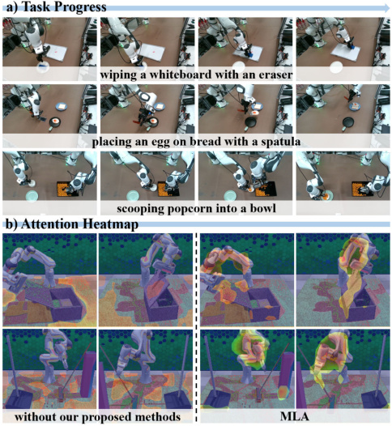
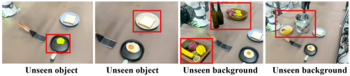
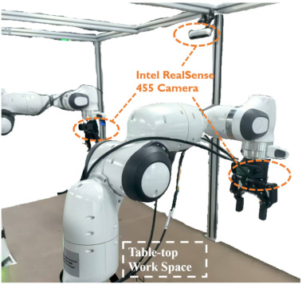
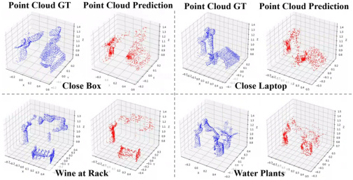

## MLA: A Multisensory Language-Action Model for Multimodal Understanding and Forecasting in Robotic Manipulation

Zhuoyang Liu [1] _[∗]_, Jiaming Liu [1] _[∗†]_, Jiadong Xu [1], Nuowei Han [1], Chenyang Gu [1], Hao Chen [3], Kaichen Zhou [1],
Renrui Zhang [3], Kai Chin Hsieh [1], Kun Wu [2], Zhengping Che [2] _[†]_, Jian Tang [2], Shanghang Zhang [1][�]

_**Abstract**_ **— Vision-language-action models (VLAs) have shown**
**generalization capabilities in robotic manipulation tasks by**
**inheriting from vision-language models (VLMs) and learning**
**action generation. Most VLA models focus on interpreting**
**vision and language to generate actions, whereas robots must**
**perceive and interact within the spatial-physical world. This**
**gap highlights the need for a comprehensive understanding of**
**robotic-specific multisensory information, which is crucial for**
**achieving complex and contact-rich control. To this end, we**
**introduce a multisensory language–action (MLA) model that**
**collaboratively perceives heterogeneous sensory modalities and**
**predicts future multisensory objectives to facilitate physical**
**world modeling. Specifically, to enhance perceptual representa-**
**tions, we propose an encoder-free multimodal alignment scheme**
**that innovatively repurposes the large language model itself**
**as a perception module, directly interpreting multimodal cues**
**by aligning 2D images, 3D point clouds, and tactile tokens**
**through positional correspondence. To further enhance MLA’s**
**understanding of physical dynamics, we design a future multi-**
**sensory generation post-training strategy that enables MLA to**
**reason about semantic, geometric, and interaction information,**
**providing more robust conditions for action generation. For**
**evaluation, the MLA model outperforms the previous state-of-**
**the-art 2D and 3D VLA methods by 12% and 24% in complex,**
**contact-rich real-world tasks, respectively, while also demon-**
**strating improved generalization to unseen configurations.**
**[Project website: https://robotic-mla.github.io/](https://robotic-mla.github.io/)**

I. INTRODUCTION

Recent robot imitation learning has achieved remarkable
advances in training policies from expert demonstrations to
perform diverse vision–language manipulation tasks. Meanwhile, vision–language models (VLMs) [1], [2] pre-trained
on internet-scale data have been proven to possess strong
capabilities in common-sense reasoning in general scenarios.
Building on these progresses, vision–language–action (VLA)
models have been proposed [3], [4], [5], which not only
inherit the properties of VLMs but also extend them by
training with robot demonstrations for action prediction. As
a result, VLA models demonstrate impressive generalization
and precise manipulation, effectively mapping human instructions and visual observations to the robot control signal.
In the real world, robots must perceive spatial environments, reason about semantic relationships, and interact with
dynamic environment configurations. However, most existing
VLA models rely primarily on 2D image integration [6],

[3], which is fundamentally inadequate for capturing spatial

_∗_ Equal contribution. _†_ Project lead. 1State Key Laboratory of Multimedia
Information Processing, School of Computer Science, Peking University.
2Beijing Innovation Center of Humanoid Robotics (X-Humanoid). 3The
Chinese University of Hong Kong (CUHK).

Fig. 1: (a) Unlike vanilla VLA methods that rely on 2D
images and natural language instructions to generate actions, (b) we propose MLA, a multisensory language–action
model that collaboratively processes diverse robotic-specific
modalities and predicts their future states to enhance physical
dynamics modeling in robotic control. (c) MLA achieves
state-of-the-art performance across a variety of real-world
and simulation tasks.

dependencies and modeling physical dynamics. **On the one**
**hand**, to address these limitations, several studies enhance
VLAs with richer multimodal observations. Specifically,
some approaches incorporate 3D inputs to improve geometric
scene understanding [7], [8], while others introduce tactile
signals to capture interaction feedback from manipulated objects [9], [10]. Existing VLA models often require modalityspecific encoders to enrich perceptual capacity, which undermines efficiency. Furthermore, without pre-training on multisensory inputs, the large language model (LLM) backbone
of VLAs exhibits limited representation to align with the
newly introduced multimodal features. **On the other hand**,
several VLA studies attempt to reason about the physical
dynamics by predicting future states, such as subgoal images

and camera-view depth maps [11], [12], [13]. However,
these approaches remain limited in predicting complete point
cloud structures and tactile interaction information, which
are essential not only for understanding complex, contactrich scenes but also for effective motion planning in robotic
manipulation. Consequently, a critical question arises: how
can multisensory modalities be integrated into a unified
representation and predicted in their future states to collaboratively enhance VLA models’ physical-world understanding
and action generation?
To address this question, we propose **MLA**, a multisensory
language–action model that collaboratively processes diverse
sensory inputs and predicts their corresponding future states
to enhance physical-world modeling for robotic control. As
shown in Figure 1, to avoid introducing additional modalityspecific encoders that lack pretraining alignment with LLM’s
embeddings, MLA adopts an encoder-free multimodal alignment mechanism, repurposing the initial transformer blocks
of the LLM as a perception module to directly interpret
visual, geometric, and tactile cues. In particular, we project
3D points and the spatial positions of the tactile gripper
onto 2D image planes using camera parameters, thereby
constructing cross-modal positional mappings. These positional correspondences serve as positive pairs for token-level
contrastive learning, aligning multimodal features within the
LLM’s embedding space. This position-guided consistency
constraint enhances the multimodal representations of our
MLA model and supports more comprehensive physicalworld perception. To further enhance the LLM’s understanding of physical robotic scenes, we propose a future
multisensory generation post-training strategy. Specifically,
the lightweight transformer-based decoders and tailored generation scheme are designed to process the LLM’s finallayer features and generate the future states of multiple
modalities, including 2D images, 3D point clouds, and tactile
signals. Through this predictive process, MLA is able to
reason about physical dynamics from multiple dimensions,
encompassing semantic information, geometric structures,
and object-centric interactions. Notably, the proposed methods are applied only during training and do not affect MLA’s
inference efficiency, while enriching feature conditions for
action generation.
Since existing open-source real-world datasets [14], [15],

[16] lack multisensory information, we pretrain the LLM
solely on large-scale image–action paired datasets following
common practice [5], [4], including more than 570K trajectories. Subsequently, we perform supervised fine-tuning (SFT)
on downstream task datasets using the proposed encoderfree multimodal alignment mechanism, and finally conduct
future multisensory generation post-training, progressively
equipping our model with the ability to integrate perception, understanding, and action generation from multisensory inputs in the real physical world. To systematically
evaluate our model, we design six complex, contact-rich
real-world robotic experiments covering both single- and
dual-arm manipulation tasks, where MLA achieves state-ofthe-art success rates and demonstrates strong generalization

to unseen objects and backgrounds. For reproducibility, we
further evaluate MLA on the RLBench [17] simulator and
also obtain competitive performance. As tactile sensing in
simulation is not realistic, we incorporate tactile signals only
in real-world experiments. Our contributions are summarized
as follows:

_•_ We propose MLA, a multisensory language-action
model with an encoder-free multimodal alignment
mechanism, repurposing the LLM itself to directly align
with and interpret image, point cloud, and tactile cues.

_•_ To further strengthen MLA’s understanding of physical
dynamics, we introduce a future multisensory generation post-training strategy that enables it to reason
about semantic, geometric, and interaction information,
providing more robust conditions for action generation.

_•_ Through a progressive pipeline of pretraining, SFT,
and post-training, MLA achieves state-of-the-art success
rates and strong generalization on complex real-world
tasks, including both single- and dual-arm manipulation.

II. RELATED WORK

**Vision-language-action (VLA) models** [5], [3], [6], [8],

[4] have advanced rapidly with the development of visionlanguage models (VLMs) and large-scale robotic datasets.
PaLM-E [18] pioneered the adaptation of VLMs to robotic
data, and subsequent works followed this paradigm, further
extending its capabilities [5], [3]. Meanwhile, diffusion and
flow modeling have emerged as effective tools for modeling
the multimodal distributions of robotic actions [19], [20].
This has motivated approaches that condition continuous
action experts on VLM representations [6], [21], [3], as well
as recent scaling efforts using transformer-based diffusion
architectures [22], [23], [4]. Moreover, some studies further
enhance action generation by incorporating richer sensory inputs, such as 3D point clouds [8], [24] and tactile signals [9],

[10]. These methods often require modality-specific encoders
which undermines efficiency. Also, without multisensory pretraining, the LLM backbone struggles to align and interpret
them efficiently.

**Robotic world knowledge forecasting policy**, which predicts and reasons about future world knowledge, has gained
considerable attention in robotics for its ability to capture the
dynamics of the physical environment. Early attempts [25],

[26] employed generative models to directly predict future
images, and then leveraged the learned representations to
train an action generator. Subsequent work [11], [27], [28]
explored the use of latent action tokens as forward-dynamics
representations for action planning and generation. Another
line of VLA research [29], [13], [30], [12] focuses on leveraging future state prediction to facilitate action generation.
While these methods are confined to 2D image prediction
and struggle with complex, contact-rich scenes, MLA introduces comprehensive multisensory forecasting for robotics,
yielding more robust representations for action generation.

Fig. 2: **Overall Framework of MLA.** a) Beyond language instructions and robot states, MLA introduces an innovative
encoder-free multimodal alignment mechanism that directly enables the LLM to integrate RGB images, point clouds, and
tactile signals, aligning them through token-level contrastive learning. Furthermore, MLA incorporates a future multisensory
generation post-training strategy, allowing the model to generate future multisensory states and providing more robust
conditions for action generation. b) MLA adopts a three-stage training paradigm: large-scale pretraining, supervised finetuning with cross-modal alignment, and post-training with future state prediction.

III. METHOD

_A. Preliminary_

Similar to the VLA problem [3], [6], our MLA imitation
learning is formulated as a probabilistic sequence decisionmaking task. At each timestep _t_, the policy _πθ_ takes multimodal inputs, including the image observation _It_, point
cloud _Pt_, tactile signal _Tt_, robot state _St_, and language
instruction _L_ . It then predicts both the immediate action
sequence _at_ : _t_ + _H_ and the future keyframe observations across
modalities _It_ + _N_ _, Pt_ + _N_ _, Tt_ + _N_ . Formally, the generative process is expressed as:

_at_ : _t_ + _H_ _, It_ + _N_ _, Pt_ + _N_ _, Tt_ + _N ∼_ _πθ_  - _· | It, Pt, Tt, St, L_  - _._

We follow the experimental setup with Franka singleand dual-arm configurations and represent actions as endeffector pose [5], [4]. In the single-arm setting, each action
is a 7-DoF vector _at_ = (∆ _x,_ ∆ _y,_ ∆ _z, Rr, Rp, Ry, g_ ), where
∆ _x,_ ∆ _y,_ ∆ _z_ denote the Cartesian position delta, _Rr, Rp, Ry_
correspond to the Euler angles for rotation, and _g_ is the
gripper width. In the dual-arm configuration, the action is
represented by concatenating two 7-DoF vectors into a 14DoF representation.

_B. MLA Architecture_

As shown in Figure 2, our proposed MLA model is built
upon a LLM, where the parameters are initialized from
the LLM backbone of Prismatic VLM [1], similar to prior
work [5]. Distinct from conventional VLA frameworks that
employ vision encoders, our model introduces lightweight
tokenizers that directly convert raw multisensory inputs into a
shared token sequence and repurpose the LLM itself as a unified MLA model. Furthermore, we incorporate transformerbased decoders that predict future multimodal states.

**Image Tokenizer.** For each input image _I ∈_ R _[H][×][W][ ×]_ [3],
our Vision Tokenizer converts it into a compact token sequence. Following previous works [31], [32], the image is
divided into non-overlapping patches of size 14 _×_ 14, yielding
a token sequence of length _N_ img = 256 with a batchsize
of _B_ and an embedding dimension of _dh_ = 4096, i.e.,
_f_ [img] _∈_ R _[B][×][N]_ [img] _[×][d][h]_ .

**3D Point Cloud Tokenizer.** Given raw point clouds _P ∈_
R _[B][×]_ [1024] _[×]_ [3], our 3D Tokenizer partitions the points into local
groups centered at sampled anchor points. Following [33],
the tokenizer consists of three blocks, each incorporating farthest point sampling (FPS) [34] for downsampling, k-nearest
neighbors (KNN) for local aggregation, and a learnable linear
layer for feature encoding. After 3D tokenization, we obtain
a compact representation consisting of _N_ pc = 256 tokens,
_f_ [pc] _∈_ R _[B][×][N]_ [pc] _[×][d][h]_ .

**Tactile Tokenizer.** For tactile sensing, we design a simple MLP-based tokenizer to embed low-dimensional tactile
signals into the shared token space. Specifically, we attach
two tactile sensors to the gripper fingers. From each sensor,
we extract six values: normal force, tangential force, and
tangential force direction (two components each). The raw
signal is processed by a lightweight MLP, producing a tactile
token _f_ [tac] _∈_ R _[B][×]_ [1] _[×][d][h]_ .

**LLM Backbone.** We adopt LLaMA-2 7B as our base
model and repurpose it into a unified perception-andreasoning policy. Specifically, tokens from images, point
clouds, tactile signals, and language are projected into a
shared embedding space _f_ _∈_ R _[B][×][N][t][×]_ [4096] and jointly
processed by the LLM. The noise tokens required by the
diffusion-based action head are appended to the end of
the token sequence, enabling the model to perform diffusion modeling. Diffusion noise and timesteps are embedded
through MLP projectors. This design eliminates the need

for separate modality-specific encoders and fully leverages
the large-scale pretrained LLM to directly interpret roboticspecific multisensory cues and generate robust actions.
**Future Prediction Decoder.** For future multisensory generation, we adopt transformer decoders to predict future
sensory observations from the LLM’s final hidden states
_h_ . Each decoder maps the unified multimodal embeddings
into its target space, such as image, point cloud, and tactile vectors, and is supervised by the corresponding future
state. The transformer-based decoder follows a standard
query–key–value attention design, consisting of four stacked
self-attention and feed-forward layers, enabling effective
modeling of the multimodal embeddings.

_C. Encoder-Free Multimodal Alignment_

Previous VLA models [5], [3] rely on vision encoders
that are large-scale pretrained on general-domain data, such
as SigLIP [35], to process robotic observations. However,
these encoders are rarely trained on robot-domain datasets
and have not been exposed to robotic-specific sensors. As
a result, their representations are limited in aligning with
and interpreting robotic data. In addition, pretraining newly
introduced encoders often incurs substantial computational
cost, and their incorporation constrains inference efficiency.
Inspired by prior works on contrastive learning [35], which
adopt a self-supervised approach to align semantic information from heterogeneous modalities into a unified embedding
space, we propose an _Encoder-Free Multimodal Alignment_
method. This method repurposes the initial transformer
blocks of the LLM as a unified perception module via tokenlevel contrastive loss, enhancing multisensory representations
without the need for additional modality-specific encoders.
In practice, we employ the embedding features from the 8th
transformer block for self-supervised alignment and further
examine the effect of using different block outputs in our
ablation study.
**Formulation of Positive and Negative Pairs.** For the
Transformer-based model, the positional indicators of tokens can provide both positional alignment and semantic
contextual alignment [36]. Therefore, we construct crossmultisensory positional mappings to formulate the positive
and negative pairs in our token-level contrastive loss. In
contrast, directly treating multimodal tokens with misaligned
positional information as positive pairs may lead to semantic
misalignment. As shown in the right part of Figure 2, we
project 3D points and the 3D positions of tactile grippers
onto 2D image planes using the camera parameters. Since
each 3D point cloud token ( _{fi_ _[pc][}]_ _i_ _[N]_ =1 _[pc]_ [) is aggregated from a]
set of 3D points, we unproject its center point into 2D image
coordinates. For the tactile token ( _f_ _[tac]_ ), we directly read the
robot state and project the tactile gripper’s position in the 3D
world coordinate onto the 2D image plane. Subsequently, we
identify the corresponding 2D image patch onto which these
features project, and align the 3D token and tactile token with
the corresponding 2D token ( _{fj_ _[img]_ _}_ _[N]_ _j_ =1 _[img]_ [) as positive pairs]
( _fj_ _[img]_ - _fi_ _[pc]_ [–] _[f][ tac]_ [), while the remaining unmatched tokens are]
treated as negative pairs.

**Image–Point Cloud Alignment.** Since image and 3D
embeddings have the same token sequence length (256),
we apply a token-level InfoNCE loss to pull positive pairs
together in the embedding space and push negative pairs
apart, where _τ_ denotes the temperature.

_L_ img ~~p~~ c = _−_ [1]

256

     -      
�256 log exp _⟨fj_ [img] _, fi_ [pc] _[⟩][/τ]_

_i_ =1 ~~�~~ 256 [exp] ~~�~~ _⟨f_ [img] _, f_ [pc] _[⟩]_

256

~~�~~ 256 _j_ =1 [exp] ~~�~~ _⟨fj_ [img] _, fi_ [pc] _[⟩][/τ]_ ~~�~~

**Tactile–Image and Point Cloud Alignment.** In the
single-arm setting, since tactile embeddings consist of a
single token, this yields one positive sample per tactile token
( _f_ [tac] _, fj_ [img] ) and ( _f_ [tac] _, fi_ [pc][)][, while other tokens serve as]
negatives. A unidirectional contrastive loss is applied to pull
the tactile embedding toward its corresponding tokens:

_L_ tac ~~i~~ mg _/_ pc = _−_ log ~~�~~ 256 _j/i_ exp(=1 [exp(] _⟨f_ [tac] _[⟨][f]_ _, f_ [ tac] _j/i_ [img] _[, f][/]_ _j/i_ [ img][pc] _⟩/τ_ _[/]_ [pc] ) _⟩/τ_ )

The overall contrastive objective is the sum of the three
losses: _L_ contrastive = _L_ img ~~p~~ c + _L_ tac ~~i~~ mg + _L_ tac ~~p~~ c. Through
this contrastive learning objective, the model effectively captures consistent semantic and spatial information, enabling
multimodal features to be seamlessly integrated within the
LLM’s unified embedding space.

_D. Future Multisensory Generation_

While some VLA studies [11], [30], [13] adopt future
observation prediction to enable models to reason about
physical dynamics, they still fall short in forecasting diverse
robotic-specific modalities that are essential for fully capturing the semantic, geometric, and interaction information of
the physical world. To further enhance MLA’s understanding
of robotic physical scenes, we propose a future multisensory
generation post-training strategy, making the first attempt to
jointly forecast the future states of images, point cloud, and
tactile modalities that are most relevant for manipulation.
**Image Prediction.** For the visual stream, we adopt a
transformer-based decoder, where the last-layer hidden states
of the LLM are injected as input features and the future image generation is supervised with an MSE loss. Unlike previous VLA methods that predict dense future frames (close
to the current timestep), MLA predicts future keyframes.
Following prior work [33], keyframes are identified based on
changes in the robotic joint velocity and action transitions. To
ease optimization of the image generation loss, background
pixels are removed using the corresponding depth map,
restricting prediction to foreground regions.
**Point Cloud Prediction.** For 3D geometry, we adopt a
transformer-based decoder to reconstruct the next-keyframe
point cloud. Inspired by the masked autoencoder method for
point clouds [37], we partition the ground-truth point cloud
into _G_ local patches by sampling _G_ center points with FPS
and grouping _M_ neighboring points for each center using
KNN. The decoder then outputs the predicted coordinates
_P_ ˆ _∈_ R _[G][×][M]_ _[×]_ [3], supervised with Chamfer Distance against
the ground truth _P_ . This operation enhances the stability of

Fig. 3: **Real-world results.** All models are evaluated over 15 rollouts from different manipulated object positions on the
tabletop, with task completion determined by human judgment.

future point cloud prediction by first aligning coarse center
points to establish the basic 3D structure, and subsequently
refining local neighbor points.
**Tactile Prediction.** For tactile feedback, the decoder outputs a low-dimensional tactile embedding supervised by an
MSE loss against the ground truth.
By jointly predicting the future states of images, point
clouds, and tactile signals, MLA achieves more comprehensive feature representations across semantic, geometric, and
interaction dimensions. It is worth noting that these futurestate prediction losses are applied only during the posttraining stage and do not affect inference efficiency.

_E. Overall Training Recipe_

**Large-Scale Pretraining.** Similar to previous VLA methods [5], we construct a large-scale dataset of over 570K
trajectories by combining diverse open-source datasets, such
as Open-X-Embodiment [14] and RoboMIND [16]. Since the
observations in these datasets primarily consist of image and
language modalities, we pretrain MLA using only these inputs for 10 epochs. For the other modalities, we reserve their
token positions in the sequence, ensuring a smooth transition
to subsequent training stages. For the action generation loss
( _L_ diff ), we adopt a standard DDPM objective, minimizing
the MSE between the predicted and ground-truth noise.
**Supervised Fine-Tuning.** The pretrained model is subsequently adapted to high-quality, task-specific datasets using
the proposed encoder-free multimodal alignment mechanism.
In this stage, all multisensory modalities are introduced,
including image, point cloud, tactile signals, and language
instruction. We incorporate the proposed contrastive loss
(as detailed in Section III-C) to enhance MLA’s crossmodal alignment and multimodal representations. The overall
training objective loss is _L_ sft = _L_ diff + _L_ contrastive.
**Post-Training.** Finally, the model undergoes future multisensory generation post-training. In this stage, the training
data and input modalities are the same as in the SFT phase.
Additionally, the training incorporates future multimodal prediction supervision, as described in Section III-D, enabling
the model to capture physical dynamics and thereby achieve
more robust action generation. The overall supervision is
_L_ post = _L_ diff + _L_ contrastive + _L_ future. Note that we perform
SFT followed by post-training to progressively equip our

model with the ability to integrate perception, understanding,
and action generation from multisensory inputs in the real
physical world. During inference, we employ DDIM [38]
with _n_ sampling steps (e.g., _n_ = 4).

Fig. 4: **Single-arm Experiment Setup.** We show the details
about single-arm setup and assets of real-world experiments.

IV. EXPERIMENTS

In Section IV-A, we compare MLA model with recent
VLA models on single- and dual-arm real-world tasks.
Section IV-B presents an ablation study of each component,
while Section IV-C demonstrates MLA’s generalization in
real-world settings. Section IV-D benchmarks MLA against
VLA baselines in the RLBench simulator for reproducibility.

_A. Real-World Experiment_

**Real-World Experiment Setup.** We evaluated four complex contact-rich tasks on a single-arm Franka robot and two
tasks on a dual-arm setup combining two Franka robots.
As shown in Figure 4, for the single arm, two RealSense
D455 cameras were used to provide image and point cloud
data from a third-person view and a wrist view, with only
the third-person view contributing to cross-modal alignment.
Each gripper was equipped with two tactile sensors (Tashan
TS-E-A). For the dual arm, three D455 cameras were employed, including one third-person view and two wrist views.
**Self-collected Data.** For the single-arm setting, we designed four contact-rich tasks: (1) pressing a stamp onto
paper, (2) wiping a whiteboard with an eraser, (3) placing a
dish on a rack, and (4) placing an egg on bread with a spatula.
For the dual-arm setting, we evaluated two collaborative
tasks: (1) scooping popcorn into a bowl and (2) opening

Fig. 5: **Visualization** of real-world task progress and attention heatmaps from the final-layer output features of MLA.

a pot lid and picking corn from the pot. All demonstrations
were collected using the Gello [39] platform, with 200 highquality demonstrations per task.
**Training and Evaluation Details.** We train MLA for
300 epochs during SFT and 100 epochs during post-training
using the AdamW optimizer. Baselines are initialized with
their pretrained parameters and fine-tuned under their respective protocols. We compare against two closely related
baselines: _π_ 0 [3], a state-of-the-art 2D VLA model, and SpatialVLA [8], a state-of-the-art 3D VLA model. All models
use the same number of camera viewpoints, and each task is
evaluated with 15 rollouts under consistent test conditions.
**Results.** As shown in Figure 3, MLA achieves superior
performance across six tasks, outperforming _π_ 0 and SpatialVLA by an average of 12% and 24%, respectively. In the
Wiping a Whiteboard task, MLA effectively leverages tactile
sensing to regulate the downward and lateral movements of
the end effector during wiping. The superior performance is
attributed to MLA’s ability to better align with and interpret
robotic multisensory inputs, thereby enhancing its perceptual
representation of the physical environment compared to
the baselines. Furthermore, relative to SpatialVLA, MLA’s
advantage arises from its capability to generate future multisensory states, which enables improved modeling of physical
dynamics and provides more robust conditions for action
generation. As shown in Figure 5 a), we visualize the robot
execution progress for several tasks.

_B. Ablation Study_

To validate each of our proposed contributions, we conducted an ablation study on two real-world tasks, including
pressing a stamp onto paper and placing an egg on bread.

Fig. 6: **Ablation study.** We systematically analyze the contributions of each component in the MLA model.

**Impact of Input Modalities and Alignment Strategies**
**in the Encoder-Free Multimodal Alignment Scheme.** As
shown in Figure 6 a), we first examine the role of different
input modalities and alignment strategies under the following
configurations: (Ex1) 2D image input only, (Ex2) 2D image +
3D point cloud with simple token-level concatenation, (Ex3)
2D image + 3D point cloud + tactile signals with simple
token-level concatenation, (Ex4) all modalities with imagelevel contrastive alignment, and (Ex5) our proposed all
modalities with token-level contrastive alignment. Compared
with Ex1 and Ex2, Ex3 demonstrates that semantic, spatial,
and interactive perception are all critical for contact-rich
manipulation. Compared with Ex1–Ex3, Ex5 achieves significant improvements, showing that the proposed positionguided consistency constraint strengthens multimodal representations. Furthermore, compared to Ex4, where multimodal
inputs from the same timestep are treated as positives and
those from different timesteps as negatives, Ex5 still achieves
a 7% accuracy gain, highlighting the advantage of token-level
cross-modal alignment in physical-world perception.

**Impact of Contrastive Loss Position.** As shown in Figure 6 b), we investigate the effect of applying contrastive loss
at different layers of the LLaMA-2 backbone. Specifically,
we select the 4th, 8th, 12th, and 32nd layers for cross-modal
alignment during the SFT and post-training stages. The
results reveal that applying token-level contrastive learning
at the 8th layer yields the best performance, as it aligns
features at relatively shallow layers while leaving sufficient
subsequent transformer blocks to focus on future state prediction and action generation. Interestingly, applying selfsupervision at the 32nd layer yields limited gains, as the final
hidden states are already optimized for multiple objectives.

**Impact of Multimodal Data Encoding Methods.** We
also compare injecting additional 2D [35] and 3D [33] with
our proposed approach that repurposes the LLM itself as a
unified perception module. The results show that introducing
extra encoders not only decreases performance (–7%) but
also reduces inference efficiency.

**Impact of Different Generation Modalities in Future**
**State Generation.** As shown in Figure 6 c), building upon
the MLA model following SFT, we further evaluated three
ablation variants during post-training: (1) without image
generation, (2) without point cloud generation, and (3)
without tactile signal generation. The results indicate that

|ABLE I: Results uilt-in RLBench|s on the RLBench benchmark. Each model is evaluated over 20 rollouts, with success determined by th evaluation module. Results report average manipulation success rates (S.R., %) with variance.|
|---|---|
|Models|Close Close Toilet Sweep to Close Phone Take Take frame Place wine Water Mean S.R. box laptop lid seat down dustpan fridge on base umbrella out off hanger at rack plants & Var|
|OpenVLA [5] _π_0 [3] HybridVLA [4] SpatialVLA [8] UP-VLA [40] _DreamVLA*_ [11] **MLA**|0.60 0.35 0.75 0.55 0.85 0.20 0.30 0.15 0.20 0.05 0.40_±_0.02 0.85 **0.95** 0.90 0.85 **1.00** 0.05 0.10 **0.90** 0.65 0.25 0.65_±_0.04 0.85 0.75 **1.00** 0.80 0.95 0.50 0.50 0.30 0.70 0.25 0.66_±_0.05 0.80 0.70 0.85 0.20 0.80 0.15 0.25 0.40 0.15 0.30 0.46_±_0.03 0.80 0.40 0.65 0.10 0.80 0.15 0.35 0.55 0.20 0.20 0.42_±_0.04 **0.95** 0.75 0.95 0.25 **1.00** 0.35 **0.55** 0.50 **0.85** 0.35 0.65_±_0.05 **0.95** 0.90 **1.00** **1.00** 0.95 **0.60** 0.50 **0.90** 0.75 **0.55** **0.81**_±_**0.03**|

removing future state generation from any modality leads to a
drop in accuracy, reaffirming that generating comprehensive
semantic, spatial, and interactive information provide more
robust feature conditions for action generation. Finally, we
investigate the impact of predicting **future adjacent frames**
**(64%)** versus **future keyframes (70%)** on manipulation performance. The results show that predicting adjacent frames
introduces high redundancy, leading to limited improvements
in motion planning and dynamic representation of MLA.

TABLE II: **Generalization experiments.** Visualization of
the two generalization scenarios along with the corresponding quantitative results. The red boxes highlight the differences from the training setup.

Model Original Unseen Object Unseen Background

_π_ 0 47 35 (-26%) 25 (-47%)
MLA 53 45 (-15%) 40 (-25%)

_C. Generalization Experiment_

As shown in Table II, we designed two common generalization scenarios to compare our MLA with _π_ 0, including unseen manipulated objects and unseen complex backgrounds.
The most challenging task, placing an egg on bread with a
spatula, is selected as the evaluation task. For unseen objects,
we replace the egg with lettuce and change the color of the
target plate. Across these foreground modifications, MLA
shows almost no decrease in success rate for the initial
subtask. For unseen backgrounds, cluttered scenes are introduced during testing by adding unseen objects around the
manipulated object. Even under such challenging background
conditions, MLA maintains a 40% success rate in completing
the entire task. These results demonstrate that MLA can
better perceive and reason about robotic manipulation scenes,
whether facing semantic variations in manipulated objects
or background interference. This robustness is attributed to
its strong multimodal perception capability and its ability to
anticipate the future states of manipulated objects.

_D. Simulation Experiment_

**Simulation Benchmark.** To systematically evaluate the
performance of MLA, we conducted experiments on 10 tasks
in the RLBench [17] benchmark, which is based on the

CoppeliaSim simulator. For each task, 100 demonstration
trajectories were collected using the official Motion Planning
Library [41]. Observations consist of a front-view camera
image and the corresponding point cloud data. We extract
the keyframes following the approach in [33].
**Training and Evaluation Details.** As tactile sensing
in simulation is not realistic, we provide only image and
point cloud modalities to MLA and all baseline methods.
We selected several state-of-the-art baselines from relevant
domains, including OpenVLA [5], _π_ 0 [3], HybridVLA [4],
SpatialVLA [8], UP-VLA [40], and _DreamV LA_ _[∗]_ [11]. For
each baseline, we loaded the officially released pretrained
checkpoints. Since _DreamV LA_ _[∗]_ does not provide a general
large-scale pretrained checkpoint, we re-implemented its
input and generation strategy on our backbone for a fair
comparison. All tasks were trained jointly, and evaluation
was performed using 20 rollouts per task.
**Results.** As shown in Table I, MLA achieves an average
score of 81% across 10 tasks, significantly outperforming
_π_ 0 (65%), SpatialVLA (46%), and other baselines. The
improvements are particularly notable on more challenging
tasks, such as _Place Wine at Rack Location_ and _Water plants_ .
These results validate the effectiveness of our proposed
multimodal alignment and future multisensory generation
post-training, which enable MLA to progressively enhance
its representations and achieve higher action accuracy. They
also demonstrate that our paradigm remains effective even
without access to expensive sensors such as tactile devices.
Furthermore, as shown in Figure 5 b), we visualize the attention heatmaps from the output features of MLA and a variant
without our proposed approach. The results clearly show that
MLA learns better feature representations and focuses more
effectively on both the robot and the manipulated objects.

V. CONCLUSIONS

In this work, we introduced MLA, a multisensory language–action model that integrates 2D visual, 3D geometric, and tactile cues through encoder-free multimodal
alignment and enhances physical-world understanding via
future multisensory generation. We progressively equip a
LLM with the ability to integrate perception, understanding,
and action generation from multisensory inputs in the real
world through large-scale pretraining, supervised fine-tuning,
and post-training. MLA not only achieves state-of-the-art
performance and demonstrates strong generalization across
both real-world and simulation tasks, but also provides a new
multimodal foundation model paradigm for the community.

VI. ACKNOWLEDGEMENT

This work was supported by the National Natural Science Foundation of China (625B2007). This work was also
supported by the National Natural Science Foundation of
China (62476011). This work was also supported by Beijing
Innovation Center of Humanoid Robotics.

REFERENCES

[1] S. Karamcheti, S. Nair, A. Balakrishna, P. Liang, T. Kollar, and
D. Sadigh, “Prismatic vlms: Investigating the design space of visuallyconditioned language models,” in _Forty-first International Conference_
_on Machine Learning_, 2024.

[2] P. Wang, S. Bai, S. Tan, S. Wang, Z. Fan, J. Bai, K. Chen,
X. Liu, J. Wang, W. Ge _et al._, “Qwen2-vl: Enhancing vision-language
model’s perception of the world at any resolution,” _arXiv preprint_
_arXiv:2409.12191_, 2024.

[3] K. Black, N. Brown, D. Driess, A. Esmail, M. Equi, C. Finn _et al._,
“pi0: A vision-language-action flow model for general robot control,”
_arXiv preprint arXiv:2410.24164_, 2024.

[4] J. Liu, H. Chen, P. An, Z. Liu, R. Zhang, C. Gu, X. Li, Z. Guo,
S. Chen, M. Liu _et al._, “Hybridvla: Collaborative diffusion and autoregression in a unified vision-language-action model,” _arXiv preprint_
_arXiv:2503.10631_, 2025.

[5] M. J. Kim, K. Pertsch, S. Karamcheti, T. Xiao, A. Balakrishna,
S. Nair, R. Rafailov, E. Foster, G. Lam, P. Sanketi _et al._, “Openvla: An open-source vision-language-action model,” _arXiv preprint_
_arXiv:2406.09246_, 2024.

[6] Q. Li, Y. Liang, Z. Wang, L. Luo, X. Chen, M. Liao, F. Wei, Y. Deng,
S. Xu, Y. Zhang _et al._, “Cogact: A foundational vision-language-action
model for synergizing cognition and action in robotic manipulation,”
_arXiv preprint arXiv:2411.19650_, 2024.

[7] H. Zhen, X. Qiu, P. Chen, J. Yang, X. Yan, Y. Du, Y. Hong, and
C. Gan, “3d-vla: a 3d vision-language-action generative world model,”
in _Proceedings of the 41st International Conference on Machine_
_Learning_, 2024, pp. 61 229–61 245.

[8] D. Qu, H. Song, Q. Chen, Y. Yao, X. Ye, Y. Ding, Z. Wang,
J. Gu _et al._, “Spatialvla: Exploring spatial representations for visuallanguage-action model,” _arXiv preprint arXiv:2501.15830_, 2025.

[9] Z. Cheng, Y. Zhang, W. Zhang, H. Li _et al._, “Omnivtla: Vision-tactilelanguage-action model with semantic-aligned tactile sensing,” _arXiv_
_preprint arXiv:2508.08706_, 2025.

[10] J. Huang, S. Wang, F. Lin, Y. Hu, C. Wen, and Y. Gao, “Tactilevla: Unlocking vision-language-action model’s physical knowledge for
tactile generalization,” _arXiv preprint arXiv:2507.09160_, 2025.

[11] W. Zhang, H. Liu, Z. Qi, Y. Wang, X. Yu, J. Zhang, R. Dong,
J. He, H. Wang, Z. Zhang _et al._, “Dreamvla: a vision-language-action
model dreamed with comprehensive world knowledge,” _arXiv preprint_
_arXiv:2507.04447_, 2025.

[12] Y. Wang, X. Li, W. Wang, J. Zhang, Y. Li, Y. Chen, X. Wang,
and Z. Zhang, “Unified vision-language-action model,” _arXiv preprint_
_arXiv:2506.19850_, 2025.

[13] Q. Zhao, Y. Lu, M. J. Kim, Z. Fu, Z. Zhang, Y. Wu, Z. Li, Q. Ma,
S. Han, C. Finn _et al._, “Cot-vla: Visual chain-of-thought reasoning
for vision-language-action models,” in _Proceedings of the Computer_
_Vision and Pattern Recognition Conference_, 2025, pp. 1702–1713.

[14] Open X-Embodiment Collaboration, A. Padalkar, A. Pooley _et al._,
“Open X-Embodiment: Robotic learning datasets and RT-X models,”
[https://arxiv.org/abs/2310.08864, 2023.](https://arxiv.org/abs/2310.08864)

[15] A. Khazatsky, K. Pertsch, S. Nair, A. Balakrishna, S. Dasari _et al._,
“Droid: A large-scale in-the-wild robot manipulation dataset,” 2024.

[16] K. Wu, C. Hou, J. Liu, Z. Che, X. Ju _et al._, “Robomind: Benchmark on
multi-embodiment intelligence normative data for robot manipulation,”
in _Robotics: Science and Systems (RSS) 2025_ . Robotics: Science and
Systems Foundation, 2025.

[17] S. James, Z. Ma, D. R. Arrojo, and A. J. Davison, “Rlbench: The
robot learning benchmark & learning environment,” _IEEE Robotics_
_and Automation Letters_, vol. 5, no. 2, pp. 3019–3026, 2020.

[18] D. Driess, F. Xia, M. S. Sajjadi, C. Lynch, A. Chowdhery, B. Ichter,
A. Wahid, J. Tompson, Q. Vuong, T. Yu _et al._, “Palm-e: an embodied
multimodal language model,” in _Proceedings of the 40th International_
_Conference on Machine Learning_, 2023, pp. 8469–8488.

[19] C. Chi, S. Feng, Y. Du, Z. Xu, E. Cousineau, B. Burchfiel, and S. Song,
“Diffusion policy: Visuomotor policy learning via action diffusion,” in
_Proceedings of Robotics: Science and Systems (RSS)_, 2023.

[20] Y. Ze, G. Zhang, K. Zhang, C. Hu, M. Wang, and H. Xu, “3d diffusion
policy,” _arXiv preprint arXiv:2403.03954_, 2024.

[21] P. Intelligence, K. Black, N. Brown, J. Darpinian, K. Dhabalia,
D. Driess, A. Esmail, M. Equi, C. Finn _et_ _al._, “ _π_ 0 _._ 5: a
vision-language-action model with open-world generalization,” 2025.

[[Online]. Available: https://arxiv.org/abs/2504.16054](https://arxiv.org/abs/2504.16054)

[22] S. Liu, L. Wu, B. Li, H. Tan, H. Chen, Z. Wang, K. Xu _et al._, “Rdt1b: a diffusion foundation model for bimanual manipulation,” in _The_
_Thirteenth International Conference on Learning Representations_ .

[23] H. Chen, J. Liu, C. Gu, Z. Liu, R. Zhang, X. Li, X. He, Y. Guo, C.-W.
Fu, S. Zhang _et al._, “Fast-in-slow: A dual-system foundation model
unifying fast manipulation within slow reasoning,” _arXiv preprint_
_arXiv:2506.01953_, 2025.

[24] C. Li, J. Wen, Y. Peng, Y. Peng, F. Feng, and Y. Zhu, “Pointvla:
Injecting the 3d world into vision-language-action models,” 2025.

[[Online]. Available: https://arxiv.org/abs/2503.07511](https://arxiv.org/abs/2503.07511)

[25] Y. Hu, Y. Guo, P. Wang, X. Chen, Y.-J. Wang, J. Zhang,
K. Sreenath, C. Lu, and J. Chen, “Video prediction policy: A generalist
robot policy with predictive visual representations,” _arXiv preprint_
_arXiv:2412.14803_, 2024.

[26] S. Zhou, Y. Du, J. Chen, Y. Li, D.-Y. Yeung, and C. Gan, “Robodreamer: Learning compositional world models for robot imagination,”
_arXiv preprint arXiv:2404.12377_, 2024.

[27] Q. Bu, J. Cai, L. Chen, X. Cui, Y. Ding, S. Feng, S. Gao, X. He, X. Hu,
X. Huang _et al._, “Agibot world colosseo: A large-scale manipulation
platform for scalable and intelligent embodied systems,” _arXiv preprint_
_arXiv:2503.06669_, 2025.

[28] Z. Liu, J. Liu, H. Chen, Z. Guo, C. Hou, C. Gu, J. Yu, X. Mi,
R. Zhang, Z. Che, J. Tang, P.-A. Heng, and S. Zhang, “Last0: Latent
spatio-temporal chain-of-thought for robotic vision-language-action
[model,” 2026. [Online]. Available: https://arxiv.org/abs/2601.05248](https://arxiv.org/abs/2601.05248)

[29] H. Wu, Y. Jing, C. Cheang, G. Chen, J. Xu, X. Li, M. Liu, H. Li,
and T. Kong, “Unleashing large-scale video generative pre-training for
visual robot manipulation,” _arXiv preprint arXiv:2312.13139_, 2023.

[30] J. Zhang, Y. Guo, Y. Hu, X. Chen, X. Zhu, and J. Chen, “Up-vla:
A unified understanding and prediction model for embodied agent,”
[2025. [Online]. Available: https://arxiv.org/abs/2501.18867](https://arxiv.org/abs/2501.18867)

[31] J. Chen, Z. Cai, P. Chen, S. Chen, K. Ji, X. Wang, Y. Yang, and
B. Wang, “Sharegpt-4o-image: Aligning multimodal models with gpt4o-level image generation,” _arXiv preprint arXiv:2506.18095_, 2025.

[32] X. Wang, X. Zhang, Z. Luo, Q. Sun, Y. Cui, J. Wang, F. Zhang,
Y. Wang, Z. Li, Q. Yu _et al._, “Emu3: Next-token prediction is all you
need,” _arXiv preprint arXiv:2409.18869_, 2024.

[33] Y. Jia, J. Liu, S. Chen, C. Gu, Z. Wang, L. Luo, X. Li, P. Wang,
Z. Wang, R. Zhang _et al._, “Lift3d policy: Lifting 2d foundation models
for robust 3d robotic manipulation,” in _Proceedings of the Computer_
_Vision and Pattern Recognition Conference_, 2025, pp. 17 347–17 358.

[34] C. R. Qi, H. Su, K. Mo, and L. J. Guibas, “Pointnet: Deep learning
on point sets for 3d classification and segmentation,” in _Proceedings_
_of the IEEE conference on computer vision and pattern recognition_,
2017, pp. 652–660.

[35] X. Zhai, B. Mustafa, A. Kolesnikov, and L. Beyer, “Sigmoid loss
for language image pre-training,” in _International Conference on_
_Computer Vision (ICCV)_, 2023.

[36] Y. Tang, R. Zhang, J. Liu, Z. Guo, B. Zhao, Z. Wang, P. Gao, H. Li,
D. Wang, and X. Li, “Any2point: Empowering any-modality large
models for efficient 3d understanding,” in _European Conference on_
_Computer Vision_ . Springer, 2025, pp. 456–473.

[37] Y. Pang, W. Wang, F. E. H. Tay, W. Liu, Y. Tian, and L. Yuan,
“Masked autoencoders for point cloud self-supervised learning,”
[2022. [Online]. Available: https://arxiv.org/abs/2203.06604](https://arxiv.org/abs/2203.06604)

[38] J. Song, C. Meng, and S. Ermon, “Denoising diffusion implicit
models,” _arXiv preprint arXiv:2010.02502_, 2020.

[39] P. Wu, Y. Shentu, Z. Yi, X. Lin, and P. Abbeel, “Gello: A general, lowcost, and intuitive teleoperation framework for robot manipulators,”
[2024. [Online]. Available: https://arxiv.org/abs/2309.13037](https://arxiv.org/abs/2309.13037)

[40] J. Zhang, Y. Guo, Y. Hu, X. Chen, X. Zhu, and J. Chen, “Up-vla:
A unified understanding and prediction model for embodied agent,”
_arXiv preprint arXiv:2501.18867_, 2025.

[41] I. A. S¸ucan, M. Moll, and L. E. Kavraki, “The Open Motion Planning
Library,” _IEEE Robotics & Automation Magazine_, vol. 19, no. 4, pp.
[72–82, December 2012, https://ompl.kavrakilab.org.](https://ompl.kavrakilab.org)

[42] Y. Zhu, P. Stone, and Y. Zhu, “Bottom-up skill discovery from
unsegmented demonstrations for long-horizon robot manipulation,”
_IEEE Robotics and Automation Letters_, vol. 7, no. 2, pp. 4126–4133,
2022.

[43] S. Nasiriany, T. Gao, A. Mandlekar, and Y. Zhu, “Learning and
retrieval from prior data for skill-based imitation learning,” in _Confer-_
_ence on Robot Learning (CoRL)_, 2022.

[44] H. Liu, S. Nasiriany, L. Zhang, Z. Bao, and Y. Zhu, “Robot learning
on the job: Human-in-the-loop autonomy and learning during deployment,” in _Robotics: Science and Systems (RSS)_, 2023.

[45] E. Jang, A. Irpan, M. Khansari, D. Kappler, F. Ebert, C. Lynch,
S. Levine, and C. Finn, “Bc-z: Zero-shot task generalization with
robotic imitation learning,” in _Conference on Robot Learning_ . PMLR,
2022, pp. 991–1002.

[46] L. Y. Chen, S. Adebola, and K. Goldberg, “Berkeley UR5 demonstra[tion dataset,” https://sites.google.com/view/berkeley-ur5/home.](https://sites.google.com/view/berkeley-ur5/home)

[47] F. Ebert, Y. Yang, K. Schmeckpeper, B. Bucher, G. Georgakis,
K. Daniilidis, C. Finn, and S. Levine, “Bridge data: Boosting generalization of robotic skills with cross-domain datasets,” in _RSS_, 2022.

[48] H. Walke, K. Black, A. Lee, M. J. Kim, M. Du, C. Zheng, T. Zhao,
P. Hansen-Estruch, Q. Vuong, A. He, V. Myers, K. Fang, C. Finn,
and S. Levine, “Bridgedata v2: A dataset for robot learning at scale,”
2023.

[49] R. Mendonca, S. Bahl, and D. Pathak, “Structured world models from
human videos,” _CoRL_, 2023.

[50] A. Padalkar, G. Quere, A. Raffin, J. Silv´erio, and F. Stulp, “A guided
reinforcement learning approach using shared control templates for
learning manipulation skills in the real world,” 2023.

[51] N. M. M. Shafiullah, A. Rai, H. Etukuru, Y. Liu, I. Misra, S. Chintala,
and L. Pinto, “On bringing robots home,” 2023.

[52] J. Luo, C. Xu, F. Liu, L. Tan, Z. Lin, J. Wu, P. Abbeel, and S. Levine,
“FMB: A functional manipulation benchmark for generalizable robotic
[learning,” https://functional-manipulation-benchmark.github.io, 2023.](https://functional-manipulation-benchmark.github.io)

[53] A. Brohan, N. Brown, J. Carbajal, Y. Chebotar, J. Dabis, C. Finn,
K. Gopalakrishnan, K. Hausman, A. Herzog, J. Hsu, J. Ibarz _et al._,
“Rt-1: Robotics transformer for real-world control at scale,” in _arXiv_
_preprint arXiv:2212.06817_, 2022.

[54] M. Heo, Y. Lee, D. Lee, and J. J. Lim, “Furniturebench: Reproducible
real-world benchmark for long-horizon complex manipulation,” in
_Robotics: Science and Systems_, 2023.

[55] S. Dass, J. Yapeter, J. Zhang, J. Zhang, K. Pertsch, S. Nikolaidis,
and J. J. Lim, “CLVR jaco play dataset,” 2023. [Online]. Available:
[https://github.com/clvrai/clvr](https://github.com/clvrai/clvr_jaco_play_dataset) ~~j~~ aco ~~p~~ lay ~~d~~ ataset

[56] D. Kalashnikov, A. Irpan, P. Pastor, J. Ibarz, A. Herzog, E. Jang,
D. Quillen, E. Holly, M. Kalakrishnan, V. Vanhoucke _et al._, “QTOpt: Scalable deep reinforcement learning for vision-based robotic
manipulation,” _arXiv preprint arXiv:1806.10293_, 2018.

[57] C. Lynch, A. Wahid, J. Tompson, T. Ding, J. Betker, R. Baruch,
T. Armstrong, and P. Florence, “Interactive language: Talking to robots
in real time,” _IEEE Robotics and Automation Letters_, 2023.

[58] J. Gu, F. Xiang, X. Li, Z. Ling, X. Liu, T. Mu, Y. Tang, S. Tao,
X. Wei, Y. Yao, X. Yuan, P. Xie, Z. Huang, R. Chen, and H. Su,
“Maniskill2: A unified benchmark for generalizable manipulation
[skills,” 2023. [Online]. Available: https://arxiv.org/abs/2302.04659](https://arxiv.org/abs/2302.04659)

[59] Z. J. Cui, Y. Wang, N. M. M. Shafiullah, and L. Pinto, “From play to
policy: Conditional behavior generation from uncurated robot data,”
_arXiv preprint arXiv:2210.10047_, 2022.

[60] S. Dasari, F. Ebert, S. Tian, S. Nair, B. Bucher, K. Schmeckpeper,
S. Singh, S. Levine, and C. Finn, “Robonet: Large-scale multi-robot
learning,” in _Conference on Robot Learning_ . PMLR, 2020, pp. 885–
897.

[61] V. Kumar, R. Shah, G. Zhou, V. Moens, V. Caggiano, A. Gupta, and
A. Rajeswaran, “Robohive: A unified framework for robot learning,” in
_Thirty-seventh Conference on Neural Information Processing Systems_
_Datasets and Benchmarks Track_, 2023.

[62] A. Mandlekar, Y. Zhu, A. Garg, J. Booher, M. Spero, A. Tung,
J. Gao, J. Emmons, A. Gupta, E. Orbay, S. Savarese, and L. FeiFei, “RoboTurk: A crowdsourcing platform for robotic skill learning
through imitation,” _CoRR_, vol. abs/1811.02790, 2018.

[63] S. Belkhale, Y. Cui, and D. Sadigh, “Hydra: Hybrid robot actions for
imitation learning,” _arxiv_, 2023.

[64] E. Rosete-Beas, O. Mees, G. Kalweit, J. Boedecker, and W. Burgard,
“Latent plans for task agnostic offline reinforcement learning,” in
_Proceedings of the 6th Conference on Robot Learning (CoRL)_, 2022.

[65] O. Mees, J. Borja-Diaz, and W. Burgard, “Grounding language with
visual affordances over unstructured data,” in _Proceedings of the_
_IEEE International Conference on Robotics and Automation (ICRA)_,
London, UK, 2023.

[66] G. Zhou, V. Dean, M. K. Srirama, A. Rajeswaran, J. Pari, K. Hatch,
A. Jain, T. Yu, P. Abbeel, L. Pinto, C. Finn, and A. Gupta, “Train
offline, test online: A real robot learning benchmark,” 2023.

[67] J. Oh, N. Kanazawa, and K. Kawaharazuka, “X-embodiment u-tokyo
[pr2 datasets,” 2023. [Online]. Available: https://github.com/ojh6404/](https://github.com/ojh6404/rlds_dataset_builder)
rlds ~~d~~ [ataset](https://github.com/ojh6404/rlds_dataset_builder) ~~b~~ uilder

[68] T. Matsushima, H. Furuta, Y. Iwasawa, and Y. Matsuo, “Weblab xarm
dataset,” 2023.

APPENDIX

_A. Real-world Robot Set-up_

The experimental setup and environments for the singlearm and dual-arm setups are shown in Figure 4 and Figure 7,
respectively.
For single-arm tasks, we employ a Franka Research 3
robotic arm equipped with a ROBOTIQ adaptive gripper as
the end-effector. Visual observations are provided by two
Intel RealSense D455 cameras, one positioned at a right-front
third-person viewpoint and the other mounted on the wrist.
In addition, two Tashan TS-E-A tactile sensors are attached
to the fingertips of the gripper to capture tactile feedback.

Fig. 7: **Dual-arm Experiment Setup.** For dual-arm experiments, we use two parallel FR3 arms to achieve collaborative
manipulation.

For dual-arm tasks, we utilize two parallel Franka Research 3 arms with the same end-effector configuration as
the single-arm asset. The observation setup includes an
additional front-facing RealSense D455 camera along with
two wrist-mounted cameras, ensuring comprehensive multiview perception.

_B. Additional Dataset Details_

**Large-scale Pretraining Dataset.** To ensure the quality
and consistency of training data, we curated 28 high-quality
datasets from Open-X-Embodiment [14], DROID [15] and
RoboMIND [16] datasets and applied customized sampling
ratios, resulting in a total of 570K trajectories and 36M
frames, as shown in Table III. The action representations
across datasets were unified to align with those used in the
fine-tuning stage, thereby maximizing the utility of pretraining. During pretraining, since these datasets only provide
2D image observations, we restricted the input modalities
to 2D RGB images, language instructions, and robot states.
Meanwhile, the token sequences corresponding to 3D point
clouds and tactile signals were reserved as empty tokens,
ensuring consistency of input sequences between pretraining
and fine-tuning. In the fine-tuning stage, we further incorporated multi-view images, which were encoded through
a shared tokenizer and concatenated sequentially after the
single-view image tokens if needed.

TABLE III: **Datasets used for pre-training.** The names
of selected 28 datasets for large-scale pretraining and their
sampling ratios (%).

Dataset Ratio (%)

Austin Buds [42] 0.01
Austin Sailor [43] 0.04
Austin Sirius [44] 0.10
BC-Z [45] 7.54
Berkeley Autolab Ur5 [46] 0.35
BridgeV2 [47], [48] 20.93
CMU Stretch [49] 0.02
DLR Sara Grid Clamp [50] 0.02
DROID [15] 4.82
Dobb-E [51] 0.18
FMB Dataset [52] 1.50
Fractal [53] 13.67
Furniture Bench [54] 0.09
Jaco Play [55] 0.19
Kuka [56] 20.22
Language Table [57] 7.70
Maniskill [58] 5.26
Nyu Franka Play [59] 0.24
Robo-Net [60] 11.53
Roboset [61] 3.18
RoboTurk [62] 0.70
Stanford Hydra [63] 0.20
Taco Play [64], [65] 1.26
Toto [66] 0.17
Utokyo Pr2 Fridge [67] 0.01
Utokyo Pr2 Tabletop [67] 0.04
Utokyo Xarm Pap [68] 0.04
RoboMIND [16] 0.10

**Self-collected and Real-world Dataset.** Building upon
our real-world experimental setup, we present the detailed
procedures of six robotic tasks, while the four tasks:
_1. Pressing a stamp onto paper._ This task requires the
robot to first pick up a stamp, and, once a stable grasp is
established, press it downward to imprint on a sheet of paper.
The stamping process involves significant tangential force
feedback, and the completion of stamping can be detected by
the abrupt change in tangential force, while visual feedback
is not involved.
_2. Wiping a whiteboard with an eraser._ This task requires
the robot to first pick up a whiteboard eraser and then erase
the colored blocks on the board by recognizing them through
vision. In addition to the visual feedback used for judging the
erasure, tactile signals during lateral movements also provide
cues about the distance traveled and whether contact with the
board has been established.
_3. Placing a dish on a rack._ This task requires the robot
to first grasp a plate from its edge and then perform a large
rotational motion to accurately place it into a dish rack.
Since the plate must be inserted in an upright orientation,
the model is required to form an accurate spatial perception
and precisely predict the necessary rotation.
_4. Placing an egg on bread with a spatula._ This task can
be divided into three subtasks: picking up the spatula, lifting
the egg, and placing the egg onto the bread. The subtask
of lifting the egg requires the model to perceive the contact
between the spatula tip and the pan, and to slide along the
bottom of the egg to lift it. Moreover, this process demands

Fig. 8: **Visualization of Image Prediction.** We selected four
image prediction results during training. For each sample, the
image ground truth is shown on the left and the prediction
result is shown on the right.

precise position prediction. Overall, the task heavily relies
on spatial perception and tactile feedback.
_5. Scooping popcorn into a bowl._ In this task, the robot’s
right arm uses a spatula to scoop popcorn from a box and
pour it into a bowl held by the left arm. The scooping process
relies on tactile feedback, while the pouring step requires
spatial coordination between the two arms.
_6. Opening a pot lid and picking corn from the pot._ In
this task, the left arm first opens the pot lid, after which
the right arm retrieves corn from the pot and places it
onto a plate, followed by the left arm closing the lid. Each
step requires precise position prediction, and the two arms
must collaborate to avoid collisions and other undesired
interactions.

_C. Additional Visualizations_

In this section, we provide additional visualizations of
the multimodel future generation results during training on
RLBench data.

Fig. 9: **Visualization of Point Cloud Prediction.** We selected four point cloud prediction results during training. For
each sample, the point cloud ground truth is shown on the
left and the prediction result is shown on the right.

**Image Prediction.** As illustrated in Figure 8, MLA is
supervised during training by performing image-to-image
prediction with the next key frame, thereby forecasting the
future image observation. In the context of multi-task joint
training, MLA is able to predict most of the critical scene

information, including the robot arm’s pose, the state of the
manipulated object, and the lighting conditions simulating
real-world environments. This enhances the model’s ability
to perceive the overall scene dynamics.
**Point Cloud Prediction.** As shown in Figure 9, during the
multimodal future prediction process, MLA simultaneously
receives supervision from the next key frame’s point cloud.
By employing the supervision method described in Section
III-D, MLA efficiently predicts point clouds with accurate
geometric features and rich local information. The concurrent
prediction of both image and point cloud modalities fully
leverages the unified representation within the MLA model.
Furthermore, through predicting the point cloud modality,
the model’s understanding of object spatial positions is
significantly enhanced.

