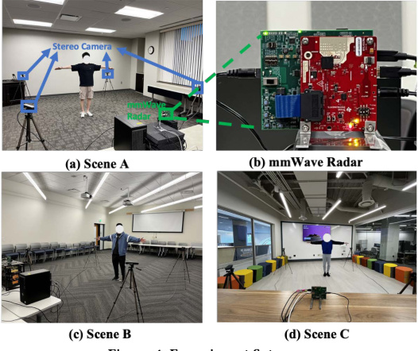
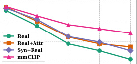
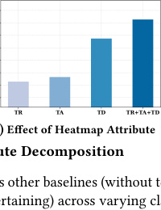
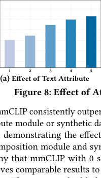
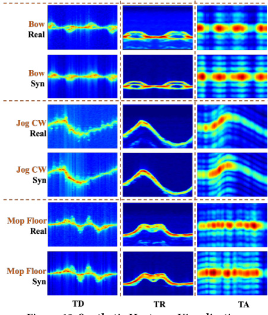

# **mmCLIP: Boosting mmWave-based Zero-shot HAR via** **Signal-Text Alignment**

Qiming Cao [1], Hongfei Xue [2][∗], Tianci Liu [1], Xingchen Wang [1], Haoyu Wang [1]

Xincheng Zhang [1], Lu Su [1][∗]

1Purdue University, 2The University of North Carolina at Charlotte
Email: [1] {cao393, liu3351, wang2930, wang5346, zhan5104, lusu}@purdue.edu, [2] hongfei.xue@charlotte.edu

**ABSTRACT**

Millimeter-wave (mmWave) based human activity recognition
(HAR) systems have demonstrated promising performance in various applications, leveraging the power of deep neural networks.
However, these systems are suffering from the scarcity of available
mmWave data for model training. To address this challenge, we explore the possibility of transferring knowledge from large AI models
built on massive text and visual data to enhance the generalizability
of mmWave-based HAR models. Towards this end, we introduce
mmCLIP, a novel system that aligns mmWave signal space and text
space to facilitate zero-shot recognition for unseen activities. To
enable this alignment, we employ cross-modality signal synthesis
to augment mmWave signal data using large human mesh datasets
and design an activity attribute decomposition and recomposition
approach to characterize the semantic interconnections among activities. We conducted extensive experiments to demonstrate the
effectiveness of our proposed framework.

**CCS CONCEPTS**

- **Human-centered computing** → **Ubiquitous and mobile com-**
**puting** ; • **Computer systems organization** → **Embedded and**
**cyber-physical systems** .

**KEYWORDS**

Wireless Sensing, mmWave, Human Activity Recognition, Signal
Augmentation, Visual-Language Model, Large Language Model

**ACM Reference Format:**
Qiming Cao [1], Hongfei Xue [2][∗], Tianci Liu [1], Xingchen Wang [1], Haoyu Wang [1],
Xincheng Zhang [1], Lu Su [1][∗] . 2024. mmCLIP: Boosting mmWave-based Zeroshot HAR via Signal-Text Alignment. In _ACM Conference on Embedded_
_Networked Sensor Systems (SenSys ’24), November 4–7, 2024, Hangzhou, China._
[ACM, New York, NY, USA, 14 pages. https://doi.org/10.1145/3666025.3699331](https://doi.org/10.1145/3666025.3699331)

**1** **INTRODUCTION**

With the rising quest for intelligent systems that enhance human
life, human activity recognition (HAR) plays a pivotal element in

*Hongfei Xue and Lu Su are corresponding authors.

[This work is licensed under a Creative Commons Attribution International 4.0 License.](https://creativecommons.org/licenses/by/4.0/)

_SenSys ’24, November 4–7, 2024, Hangzhou, China_
© 2024 Copyright held by the owner/author(s).
ACM ISBN 979-8-4007-0697-4/24/11
[https://doi.org/10.1145/3666025.3699331](https://doi.org/10.1145/3666025.3699331)

understanding human behavior, which enables a wide spectrum
of applications ranging from healthcare [47, 50, 51] and surveillance [20, 35, 41] to smart homes [2, 38, 45] and human-computer
interactions [31]. A variety of sensors can be utilized for HAR tasks,
including cameras, wearable devices, and wireless signals. Among
them, mmWave has emerged as a particularly advantageous sensing
solution due to its low-cost and high-resolution nature.
However, the generalizability of the mmWave-based HAR remains constrained. The current implementations of mmWave-based
HAR are predominantly tailored for specific, narrowly defined classification tasks, limiting their ability to identify activities beyond
their initial training scope. This limitation primarily arises from
the insufficiency of available mmWave sensing data, since the data
collection process for mmWave-based HAR is laborious and timeintensive, requiring specialized hardware and software, significant
participant engagement, as well as meticulous synchronization
and calibration processes. These stringent requirements render
large-scale data collection both financially and logistically prohibitive. Consequently, researchers are often limited to collecting
customized small datasets for their specific tasks, thereby impeding
the advancement of generalizable mmWave-based HAR systems.
In recent years, we have witnessed remarkable advancements
in the field of artificial intelligence (AI), particularly in natural
language processing (NLP) [4, 8, 10, 44] and computer vision
(CV) [37, 43, 55]. The cornerstone of these successes lies in the
utilization of large datasets and expansive models. Scaling laws [24]
have underscored this paradigm, demonstrating that the synergistic
combination of big data and large models yields great generalizability. _Given these achievements, a fundamental question arises: Is it pos-_
_sible to transfer the knowledge in large AI models built upon massive_
_text and visual data to elevate the generalizability of mmWave-based_
_HAR models?_
To answer this question, we introduce mmCLIP, a novel framework designed to harness the knowledge embedded in extensive
computer vision datasets and large language models to perform
mmWave-based zero-shot HAR tasks. The main idea of our approach is to align the high-level representation space of mmWave
signals with the text semantic space of pre-trained large language
models (LLMs), enabling the framework to leverage the generalizability of these language models for predicting unseen activities.
However, achieving accurate alignment between these two embedding spaces necessitates a substantial volume of paired signal-text
data with diverse activity samples — a dataset that is neither readily
available nor feasible to collect manually. To address this challenge,
we propose leveraging cross-modality signal synthesis to augment
mmWave signal data from the large human mesh datasets with text
descriptions, thereby facilitating knowledge transfer from visual

184

SenSys ’24, November 4–7, 2024, Hangzhou, China Cao et al.

data. This strategy allows us to generate an extensive synthetic
paired dataset, which can be employed to pre-train our model. Then,
we fine-tune the model by collecting a smaller set of real-world
data to bridge the simulation-to-reality gap.
Another challenge is that directly aligning the signal data to the
original text label space may not be able to yield satisfactory generalization results, as the text labels in many cases cannot precisely
characterize human activities and thus may fail to capture the subtle
relationships among different activities. For example, the activities
“drink water” and “pick up an object” appear quite different from
a text label perspective due to the distinct words used. However,
the movements of limbs and torso involved in these activities are
very similar. To capture such similarity, in our model, we introduce
an activity attribute decomposition and recomposition approach.
For instance, during the activity of “sit down”, an individual will
“bend his/her legs”, “keep his/her arms slightly bent forward”, and
“remain stationary”. In this description, we describe the “legs status”,
“arms status”, and “location status” of the subject performing the
activity, regarding these statuses as distinct attributes of the activity.
In our model design, we leverage the knowledge embedded in the
LLMs to decompose the text label into attribute descriptions and
further into text attribute embeddings. In this way, we can characterize the semantic relations among activities, represented as the
similarities of their attribute embeddings. Returning to the example
of “drink water" and “pick up an object," from an attribute perspective, these two activities share similar descriptions and therefore
have high embedding similarity. This allows the model to capture
the relationship between them. On the other hand, mmWave signals can also characterize human activities by capturing activity
attributes such as the movements of limbs and torso. In summary,
our model explicitly extracts activity attributes from both signal and
text space, allowing for a more nuanced and accurate representation
of activities and their semantic interconnections.
We conclude the contributions of our paper as follows:

  - We propose the mmCLIP framework which aligns the signal
and text embedding space to achieve mmWave-based unseen
activity recognition, where the model has never been trained
on either the mmWave signal data or the exact text label of
the unseen activities.

  - We employ cross-modality signal synthesis to augment
mmWave signal data using large human mesh datasets with
text descriptions, thereby expanding the representation of
human activities in signal space. We design an activity attribute decomposition and recomposition approach to characterize human activities from the attribute level, reinforcing
the semantic interconnections among activities as well as
the alignment of signal and text space.

  - To evaluate the proposed mmCLIP framework, we constructed a real-world human activity recognition testbed
using commercial off-the-shelf (COTS) mmWave devices.

  - Our evaluation results demonstrate that the mmCLIP system
achieved an average accuracy of 76.4% on ten-class zeroshot classification tasks, highlighting the effectiveness of the
mmCLIP framework for zero-shot HAR tasks.

**2** **SYSTEM OVERVIEW**

The goal of our proposed mmCLIP framework is to develop an
mmWave-based zero-shot human activity recognition system. Unlike conventional activity classifiers that predict the probability distribution over a fixed set of predetermined classes, mmCLIP aligns
the high-level representation space of mmWave signals with the
text semantic space of large pre-trained language models through
contrastive learning, thereby enabling the framework to leverage
the generalizability of these language models for predicting unseen activities. However, accurate alignment of the two embedding spaces requires a substantial volume of paired signal-text data
with diverse activity samples, and the paired real-world dataset
is very limited. To address this, in our mmCLIP framework, we
create a large synthetic dataset for pre-training and collect a small
real-world dataset for fine-tuning our framework to bridge the
sim-to-real gap. For fine-tuning, rather than directly adjusting the
trained network parameters, we utilize the Low-rank Adaptation
(LoRA [19]) framework, which allows for efficient model tuning on a
very small parameter set. In addition, we design an activity attribute
decomposition and recomposition framework for both mmWave
signals and text labels to characterize the relations among activities,
facilitating the accurate classification of unseen activities. During
the inference of an **unseen activity** label, for which our framework has never been trained on either the signal data or the exact
text label of the corresponding activity, our mmCLIP model generates signal embedding for the unseen activity, identifies the closest
matching text activity embedding from all candidate activities, and
assigns the related label to the unseen activity. Correspondingly,
the activities used in the fine-tuning process are regarded as **seen**
**activities** .

**2.1** **Pretraining of mmCLIP**

The objective of this step is to create a large paired signal-text
human motion dataset to pre-train our proposed mmCLIP model,
thereby enabling accurate alignment of the signal embedding space
with the activity text space. This dataset is created by leveraging the
existing online large human mesh dataset (i.e., BABEL [42]) with
diverse human activities and corresponding language labels describing actions, and utilizing the signal simulator [58] to synthesize the
corresponding mmWave signals from this dynamic mesh dataset
by simulating the signal propagation and reflection on the mesh
surface. In this way, we successfully build the synthetic dataset by
pairing the simulated signals and the corresponding activity labels
from the descriptive text.
Regarding the design of our mmCLIP model, as illustrated in
Fig. 1, there are two branches (i.e., Text and Signal Branches). In
the text branch, the activity text label in the synthetic dataset is fed
into the Text Attributes Module. In this module, we first utilize the
ChatGPT-based Attribute Describer to provide detailed descriptions
of various attributes of the activity (e.g., a comprehensive description of the activity, how the subject’s arms or legs move during
the activities, whether the subject changes location, etc.) using incontext learning [12]. Next, we feed the text attribute descriptions
from ChatGPT into the CLIP-based Attribute Embedding Generator (i.e., a weight-frozen CLIP text encoder) to generate the text
attribute embeddings for this text label. Subsequently, all the text

185

mmCLIP: Boosting mmWave-based Zero-shot HAR via Signal-Text Alignment SenSys ’24, November 4–7, 2024, Hangzhou, China

**Figure 1: System Overview of mmCLIP Framework**

attribute embeddings are fed into the Text Attributes Aggregation
Module to obtain the aggregated text embedding that represents
this text label before the contrastive learning step. In the signal
branch of the model, the generated IF signals are fed into the Signal
Attributes Module, which first generates three different heatmaps
corresponding to the angle, Doppler, and range states of the activity.
We then developed a hierarchical Transformer-based Attribute Embedding Generator to create attribute embeddings that correspond
to the text attribute embeddings in the text branch. Similarly, all the
signal embeddings are fed into the Signal Attributes Aggregation
Module to obtain the aggregated signal embedding. Finally, we
perform contrastive learning on the paired signal-text attribute embeddings and their corresponding aggregated embeddings within
the Contrastive Learning Module. Specifically, this module focuses
on pulling the signal embeddings toward the text embeddings that
belong to the same activity, while pulling the signal embeddings
against the text embeddings that belong to different activities in the
embedding space. After the learning process, the signal embeddings
are mapped to the text embeddings space, ensuring that signal and
text embeddings related to the same activity are clustered together.

**2.2** **Fine-tuning of mmCLIP**

To bridge the sim-to-real gap, we collect a small real-world dataset
to fine-tune the mmCLIP model. Specifically, we employ the Lowrank Adaptation (LoRA), a model tuning framework, to fine-tune
the parameters in the Signal Attributes Module and the Signal/Text
Attributes Aggregation Module. This approach allows us to adjust
the network parameters efficiently using only a small fraction of
parameters, rather than retraining the entire model.

**2.3** **Label Inference of Unseen Activities**

During the inference of unseen activities, we first feed the collected
activity IF signals into the trained Signal Attributes Module and
Signal Attributes Aggregation Module to generate the aggregated
signal embeddings. Next, we input the candidate text labels into the
Text Attributes Module and Text Attributes Aggregation Module
to generate aggregated text embeddings for all the candidate text
labels. To determine the class of the unseen pose, we find the closest
matching text embedding from all candidate activities and assign
the corresponding label to the unseen activity. By leveraging the
descriptive capabilities of the ChatGPT model and the generalizability of the pre-trained CLIP model, our framework can generate
embeddings for completely unseen labels, thus enabling unseen
class classification.

**3** **METHODOLOGY**

In this section, we will provide a detailed introduction to our proposed mmCLIP framework, which includes the model and training
scheme designs.
In our model design, we design an activity attribute decomposition and recomposition approach to generate both the signal and
text activity embeddings and employ the contrastive learning approach to align the signal with text embedding spaces. The rationale
behind attribute decomposition and subsequent recomposition is
to capture the subtle semantic relations among activities in the embedding space which enables our model to gain explicit clues and
relations about the activities, thereby improving the recognition
results for unseen activities. From the text perspective, although the

186

SenSys ’24, November 4–7, 2024, Hangzhou, China Cao et al.

embeddings of all activity text labels in the CLIP embedding space
are closely grouped due to contrastive learning with images, each
activity is treated as an individual embedding. Consequently, the
relationships among the activity text embeddings are not properly
characterized. To address this, our model proposes to use in-context
learning and ChatGPT to automatically decompose the activity text
labels into activity attribute descriptions and further transform
them into attribute embeddings using the CLIP text encoder. In this
way, we can capture the semantic relations among activities, represented as the similarities of their attribute embeddings. From the
signal perspective, contrastive learning forces the Signal Attribute
Embedding Generator to produce signal attribute embeddings that
are close to the corresponding text attribute descriptions, which
compels the model to focus on patterns in the signals that are
related to the corresponding activity attributes.
In the rest of this section, we illustrate how we decompose the activity inputs, both text and signals, into attributes using the Text Attribute Module (Sec. 3.1) and the Signal Attribute Module (Sec. 3.2),
respectively. These attribute embeddings are then recomposed using the Text/Signal Attribute Aggregation Module (Sec. 3.3) into
embeddings to represent the entire activity. Lastly, the contrastive
learning is performed in the Contrastive Learning module (Sec. 3.4).
For the training scheme design, we first pre-train (Sec. 3.5) our
framework using the created synthesized dataset. Then, we collect a small real-world dataset to fine-tune (Sec. 3.6) our model.
Lastly, we elaborate on how to conduct unseen activity recognition
(Sec. 3.7).

**3.1** **Text Attributes Module**

This module is designed to conduct attribute decomposition on
activity text labels, thereby enabling the capture of subtle semantic
relationships among activities in the embedding space. The decomposition process is accomplished in two steps. First, the activity text
labels are decomposed into activity text attribute descriptions. This
step is automated using the ChatGPT-based Attribute Describer,
which leverages in-context learning by providing ChatGPT with
template descriptions and task samples. Supported by the generative capabilities of ChatGPT, high-quality text attribute descriptions for any activity can be automatically generated. Second, the
attribute descriptions are encoded into text attribute embeddings.
This is achieved using the CLIP-based Attribute Embedding Generator, which utilizes CLIP’s text encoder to transform text attribute
descriptions into embedding representations.

_3.1.1_ _ChatGPT-based Attribute Describer._ In this design, we employ ChatGPT, a large language model (LLM) trained on extensive
datasets of textual content, as our text attribute describer to facilitate the generation of high-quality motion descriptions for the
activity text labels. While it may be feasible to manually decompose
activity labels for tasks with a limited number of activities, as described later in Section 3.5, using a LLM like ChatGPT is essential
for handling massive sets of text labels from the mesh dataset. To
ensure the output aligns with our goal, we utilize in-context learning, an efficient method to enhance the performance of the LLM on
specialized tasks. In-context learning does not require parameter
fine-tuning; instead, it involves providing the model with taskspecific descriptions and examples that help tailor its responses. As

**Figure 2: ChatGPT-based Attribute Describer**

illustrated in Fig. 2, the LLM is provided with a context template,
which includes a detailed task description and a few user-crafted
examples (the user only needs to do this once for all the activities).
The task description specifies the expected outputs of the activity
text attributes, and the designed examples help ensure that the
LLM’s outputs align closely with our expectations. This ensures
the LLM’s output activity descriptions are accurate and relevant to
the specific activity labels.
Specifically, for an activity text label _𝑦_ _[𝑇]_ _𝑖_ [, we can decompose it]
into _𝑁_ text attribute descriptions { _𝑇𝑛_ } _𝑛_ _[𝑁]_ =1 [. In our design, the decom-]
posed text attributes represent the different aspects of the activities
and should also be sensible in the context of mmWave signals. Here
are five attributes used in our paper. First, we include an augmented
general description of the activity to preserve the comprehensive
information encapsulated in the original activity label. Second, we
decompose the activity based on body part movements, focusing
on the torso, arm, and leg movements. These attributes are important since all the activities, whether seen or unseen, may share
similar postures among certain body parts. By leveraging this design, the model can characterize the relationships among activities,
which enables the use of semantic activity information to facilitate
the recognition of unseen activities. Last, since the RF signal is
sensitive to the target locational changes, we also incorporate an
attribute description that explicitly details the locational changes
occurring during the activity. As illustrated in Fig. 2, we prompted
the ChatGPT to generate the text attribute descriptions of the activity “lunge”. By simply replacing the word marked in red with the
designated activity, the ChatGPT model can automatically produce
a satisfactory response that includes five sentences to describe the
designed five attributes (marked in blue) accurately.

_3.1.2_ _CLIP-based Attribute Embedding Generator._ Contrastive
Language-Image Pretraining (CLIP [43]) model is trained using
contrastive learning on the image and text modalities. Trained on
a large image and caption dataset, its text encoder can effectively
capture the nuances and context of language, which is used as

187

mmCLIP: Boosting mmWave-based Zero-shot HAR via Signal-Text Alignment SenSys ’24, November 4–7, 2024, Hangzhou, China

the Attribute Embedding Generator to generate the attribute embeddings from the text descriptions. Specifically, after acquiring
language attribute description { _𝑇𝑛_ } _𝑛_ _[𝑁]_ =1 [from ChatGPT-based At-]
tribute Descriptor, we employ the CLIP text encoder to generate
the attribute embedding { _𝑡_ _[𝑛]_ } _𝑛_ _[𝑁]_ =1 [.]

**3.2** **Signal Attributes Module**

This module aims to generate signal attribute embeddings from the
IF signals. To achieve this, we first utilize the designed Heatmapbased Activity Describer to generate the Time-Doppler (TD), TimeRange (TR), and Time-Angle (TA) heatmaps for the activity signals
within a certain time window. Note that these heatmaps represent
different aspects of the activities from the signal perspective, which
is essential for recognizing complex activities, as ambiguous movement observed from a single heatmap may be more distinguishable
when combining all of the attributes. For instance, solely using the
TD heatmap may not sufficiently differentiate between clockwise
and counter-clockwise walking. Adding the TA heatmaps helps resolve such ambiguities. Similarly, while the TR heatmap effectively
distinguishes between stationary and mobile activities, it is less
effective for detecting subtle micro-movements without changes
in location. Then, we proposed the Transformer-based Attributes
Embedding Generator to output the activity signal attribute embeddings to align with the text attribute embeddings in the previous
section from the obtained heatmaps.

_3.2.1_ _Heatmap-based Activity Describer._ Given the collected IF signal data, we first perform a range Fast Fourier Transform along the
axis of ADC samples and then remove static clutter by subtracting the mean value from each range bin. This process results in a
radar data tensor of size R _[𝑁][𝑃]_ [×] _[𝑁][𝐶]_ [×] _[𝑁][𝑅]_, where _𝑁𝑃_ is the number of
transceiver pairs, _𝑁𝐶_ is the number of chirps, and _𝑁𝑅_ is the number
of range bins. To generate the TD, TA, and TR heatmaps, we begin
by implementing a _𝐷_ -point sliding window with a step size of _𝑆_
along the chirp axis. This operation produces a sequence of windowed radar cubes, each of size R _[𝑁][𝑃]_ [×] _[𝐷]_ [×] _[𝑁][𝑅]_ . For the TR heatmap,
we aggregate the values across the chirp and antenna axes for each
windowed radar cube. This produces a sequence of vectors at different time points indicating the intensity of possible objects at
each range bin. These vectors are then concatenated by the temporal order to form the final TR heatmap. Similarly, to generate the
TA and TD heatmaps, we first perform an FFT along the antenna
or chirp axis of each windowed radar cube, respectively. For the
TA heatmap, we aggregate the values across the chirp and range
axes, while for the TD heatmap, aggregation is performed across
the range and antenna axes. Finally, we resize all the heatmaps
to a uniform shape R _[𝐻]_ [×] _[𝑇]_, producing a 3-channel heatmap matrix
_𝑀_ ∈R _[𝐻]_ [×] _[𝑇]_ [×][3]

_3.2.2_ _Transformer-based Attribute Embedding Generator._ In this
section, we develop a transformer-based signal attribute embedding
generator that hierarchically extracts features from the heatmaps
and transforms them into detailed attribute embeddings. The process begins with three heatmap encoder branches, each dedicated
to extracting radar features from one heatmap. Following this, an
attribute token learner is employed to fuse and refine the attribute
features obtained from each branch. The output from the attribute

**Figure 3: Transformer-based Attribute Embedding Generator**
**and Attributes Aggregation Module**

token learner is the attribute embedding, which will then be aligned
with the text attribute embedding in the Contrastive Learning Module.
**Multi-branch Heatmap Descriptor Encoder.** As all the heatmaps
have a time dimension, it is essential to efficiently model their temporal structure to extract useful motion features. In our design,
we crop the heatmaps along the time dimension using sliding windows and feed the obtained patches into the encoder. This approach
enforces the model to capture and analyze the changes along the
temporal dimension. Specifically, given the input heatmap matrix
_𝑀_ ∈R _[𝐻]_ [×] _[𝑇]_ [×][3], we first use three separate transformer encoders to
extract heatmap features from each heatmap encoder. The encoding procedure includes three stages: patch embedding, temporal
embedding, and self-attention. For the patch embedding, we apply
a sliding window with size _𝐻_ × _𝑤_ on the heatmap along the _𝑇_
axis to create a series of element time patches _𝑋_ ∈R [⌊] _[𝑇]_ [/] _[𝑊]_ [⌋×] _[𝐻]_ [×] _[𝑤]_ .
These patches will then be flattened and linearly projected into
embedding _𝑋_ ∈R [⌊] _[𝑇]_ [/] _[𝑊]_ [⌋×] _[𝐷]_ . Such a design crops the heatmap as
patches with sequential order, however, the temporal relationships
among consecutive patches are not explicitly encoded. Because the
self-attention operation is permutation invariant, the Transformer
architecture itself does not have any information on the position of
each patch. To this end, we add a pre-initialized learnable temporal embedding (i.e., positional encoding) _𝑃_ ∈R [⌊] _[𝑇]_ [/] _[𝑊]_ [⌋×] _[𝐷]_ to retain
the absolute position information. In this way, we can obtain the
position-encoded input element representation _𝑋_ [ˆ] = _𝑋_ + _𝑃_ .
We then apply multi-head self-attention blocks to extract longterm interactions of features received at different patches for every

188

SenSys ’24, November 4–7, 2024, Hangzhou, China Cao et al.

heatmap. Each self-attention head functions as an individual feature
extraction layer that focuses on different positions in the heatmaps.
Specifically, the temporal patches _𝑋_ [ˆ] ∈R [⌊] _[𝑇]_ [/] _[𝑊]_ [⌋×] _[𝐷]_ is linearly transformed into the query _𝑄_, key _𝐾_, and value _𝑉_ matrix with dimension
R [⌊] _[𝑇]_ [/] _[𝑊]_ [⌋×] _[𝐷]_ [/] _[𝐻]_,

_𝑄_ = _𝑋𝑊_ [ˆ] _𝑄_ _[𝑇]_ _[, 𝐾]_ [=][ ˆ] _[𝑋𝑊]_ _𝐾_ _[𝑇]_ _[,𝑉]_ [=][ ˆ] _[𝑋𝑊]_ _𝑉_ _[𝑇]_ _[,]_ (1)

where _𝑊𝑄,𝑊𝐾_ _,𝑊𝑉_ are the linear transformation matrix and _𝐻_ is
the number of heads. The attention function maps the query with
the key-value pair and calculates the output with the weighted sum,
which can be written as:

loss

L _𝑐𝑙𝑠_ = − [1]

_𝐼_

L _𝑎𝑡𝑡𝑟_ = − [1]

_𝐼_

∑︁

_𝑛_

∑︁ _𝑒𝑥𝑝_ ( _𝑠𝑖𝑚_ ( _ℎ_ _[𝑛]_ _𝑖_ _[,𝑡]_ _𝑖_ _[𝑛]_ [)/] _[𝜏]_ [)]

( _𝑙𝑜𝑔_
_𝑖_ ~~�~~ _𝑗_ _[𝑒𝑥𝑝]_ [(] _[𝑠𝑖𝑚]_ [(] _[ℎ]_ ~~_[𝑛]_~~ _𝑖_ _[,𝑡]_ ~~_[𝑛]_~~ _𝑗_ [)/] _[𝜏]_ [)] [+]

_𝑒𝑥𝑝_ ( _𝑠𝑖𝑚_ ( _ℎ_ _[𝑛]_ _𝑖_ _[,𝑡]_ _𝑖_ _[𝑛]_ [)/] _[𝜏]_ [)]
_𝑙𝑜𝑔_

~~�~~ _𝑗_ _[𝑒𝑥𝑝]_ [(] _[𝑠𝑖𝑚]_ [(] _[ℎ]_ ~~_[𝑛]_~~ _𝑗_ _[,𝑡]_ _𝑖_ ~~_[𝑛]_~~ [)/] _[𝜏]_ [)] [)]

(3)

where _𝑖, 𝑗_ is the mini-batch index and _𝜏_ is the temperature parameter.
We then compute the text class embedding _𝑡𝑖_ _[𝑐𝑙𝑠]_ and heatmap class
embedding _ℎ_ _[𝑐𝑙𝑠]_ _𝑖_ and optimize the class loss through cross-entropy:

∑︁ _𝑒𝑥𝑝_ ( _𝑠𝑖𝑚_ ( _ℎ_ _[𝑐𝑙𝑠]_ _𝑖_ _,𝑡𝑖_ _[𝑐𝑙𝑠]_ )/ _𝜏_ )

( _𝑙𝑜𝑔_ +
_𝑖_ ~~�~~ _𝑗_ _[𝑒𝑥𝑝]_ [(] _[𝑠𝑖𝑚]_ [(] _[ℎ][𝑐𝑙𝑠]_ _𝑖_ _,𝑡_ _[𝑐𝑙𝑠]_ _𝑗_ )/ _𝜏_ )

_𝑒𝑥𝑝_ ( _𝑠𝑖𝑚_ ( _ℎ_ _[𝑐𝑙𝑠]_ _𝑖_ _,𝑡𝑖_ _[𝑐𝑙𝑠]_ )/ _𝜏_ )
_𝑙𝑜𝑔_ )

~~�~~ _𝑗_ _[𝑒𝑥𝑝]_ [(] _[𝑠𝑖𝑚]_ [(] _[ℎ][𝑐𝑙𝑠]_ _𝑗_ _[,𝑡]_ _𝑖_ _[𝑐𝑙𝑠]_ )/ _𝜏_ )

_𝑧𝑖_ = _𝐴𝑡𝑡𝑒𝑛𝑡𝑖𝑜𝑛_ ( _𝑄, 𝐾,𝑉_ ) = _𝑠𝑜𝑓𝑡𝑚𝑎𝑥_ ( _[𝑄𝐾][𝑇]_

) _𝑉_ (2)
_𝑑𝑘_

(4)

~~√~~

where _𝑑𝑘_ is the scaling factor. The output attention matrix _𝑧_ can be
obtained by concatenating _𝑧𝑖_ from _𝐻_ attention head, and the final
output for the encoder block can be written as _𝑧_ = _𝑀𝐿𝑃_ ( _𝐿𝑁_ ( _𝑧_ )) +
_𝑧_, where _𝑀𝐿𝑃_ (·) is a multi-layer perceptron and _𝐿𝑁_ (·) is layer
normalization.
**Attribute Token Learner** Given the output ˇ _𝑧_ ∈R [⌊] _[𝑇]_ [/] _[𝑊]_ [⌋×] _[𝐷]_ from
the transformer encoders of each branch, we concatenate the feature input along the embedding dimension ˇ _𝑧_ ∈R [⌊] _[𝑇]_ [/] _[𝑊]_ [⌋×][3] _[𝐷]_ . In
this way, the attribute-specific features can be fused within the
corresponding time window. In addition, we add _𝑁_ learnable token
{ _ℎ_ _[𝑛]_ } _𝑛_ _[𝑁]_ =1 [of shape][ R][3] _[𝐷]_ [as addition inputs to present the signal at-]
tributes embedding. Then, we obtain a concatenated embedding
_𝑧_ ˆ = [ _ℎ_ [1] ; · · · ; _ℎ_ _[𝑁]_ ; ˇ _𝑧_ ], which will be fed into a new transformer block
to generate the signal attribute embeddings.

**3.3** **Attributes Aggregation Modules**

From Sec. 3.1 and Sec. 3.2, we have obtained the text attribute embeddings { _𝑡_ _[𝑛]_ } _𝑛_ _[𝑁]_ =1 [and signal attribute embeddings][ {] _[ℎ][𝑛]_ [}] _𝑛_ _[𝑁]_ =1 [of the]
activity. We employ the Signal/Text Attribute Aggregation Module
to aggregate these signal/text attribute embeddings. While the structures of these two modules are identical, each module is trained
with its own set of weights. As illustrated in Fig. 3 (b), we use a
lightweight self-attention network to recompose the attribute embeddings into an aggregated embedding. Additionally, the model
incorporates a learnable token (i.e., _𝑡_ _[𝑐𝑙𝑠]_ in the text branch and _ℎ_ _[𝑐𝑙𝑠]_

in the signal branch) as an additional input embedding to represent
the aggregated text/signal information for the activity. During the
inference, these embeddings are utilized to calculate the similarity
scores between the mmWave signal and candidate text labels.

**3.4** **Contrastive Learning Module**

In this section, our goal is to train the entire framework that can
generate meaningful signal attribute embeddings and properly combine the text and signal attribute embeddings. This is accomplished
using contrastive learning which pulls positive pairs (e.g., signal
and text embeddings belonging to the same activity) closer while
pushs negative pairs (e.g., signal and text embeddings from different
activities) further apart. Formally, for a batch of heatmaps, we first
optimize the cosine similarity _𝑠𝑖𝑚_ (·) between text attribute embedding _𝑡_ _[𝑛]_ and heatmap attribute embedding _ℎ_ _[𝑛]_ via cross-entropy

The final loss is calculated by combining the attribute and class loss
as follows:

L F = _𝜆𝛼_ L _𝑎𝑡𝑡𝑟_ + _𝜆𝛽_ L _𝑐𝑙𝑠_ (5)

where _𝜆𝛼_ and _𝜆𝛽_ are the hyper-parameters.

**3.5** **Model Pretraining using Large Synthetic**
**Dataset**

In this paper, our objective is to achieve zero-shot human activity
recognition on the mmWave-based sensing system. To accomplish
this, we propose to take advantage of the generalizability of the
Visual Language Models (VLM). A critical component of this approach is the development of a large signal-text human activity
dataset with diverse human activities, which will enable accurate
alignment between the signal and text embedding spaces. However,
collecting mmWave sensing data is uniquely challenging due to
the need for specialized hardware and software, significant participant involvement, and meticulous environment preparation. These
requirements make large-scale data collection both costly and logistically complex. To address this problem, we propose to leverage
the abundant human mesh data in computer vision to generate a
large synthesized dataset and pre-train our framework using the
synthesized dataset. In computer vision, we can directly obtain
the 3D mesh data of human motion from the abundant 3D human
mesh datasets [33] or apply mesh estimation algorithms [15] on the
large activity motion video datasets [26]. Existing work [58] has
demonstrated that the IF signals can be directly simulated from the
3D human mesh which demonstrated effectiveness on challenging
pose estimation tasks. In this way, we can obtain a large synthetic
dataset with paired text labels and mmWave signals.
**IF Signal Simulation** In computer graphics, the human mesh is a
three-dimensional model that represents the human body with a
collection of triangle faces that define the shape of the body in the
virtual space. For a human pose consisting of a set of triangular faces
at time { _𝐹𝑖_ _[𝑡]_ [}] _𝑖_ _[𝐼]_ =1 [, the first step is to identify the visible triangular]
faces from the perspective of the transceiver at locations _𝐿𝑇_ and
_𝐿𝑅_ in R [3] using the Hidden Point Removal (HPR) algorithm [25]. To
simulate the IF signal, it is necessary to determine the phase and
strength of the reflected signal at each time _𝑡_ for each triangular
face _𝐹𝑚_ _[𝑡]_ ∈R [3] . We denote the center locations, surface norms, and

189

mmCLIP: Boosting mmWave-based Zero-shot HAR via Signal-Text Alignment SenSys ’24, November 4–7, 2024, Hangzhou, China

areas of all visible triangular faces at time _𝑡_ as { _𝐹𝑚_ _[𝑡]_ } _𝑚_ _[𝑀]_ =1 [,][ {] _[𝑁][𝑡𝑚]_ [}] _𝑚_ _[𝑀]_ =1 [,]
and { _𝐴𝑚_ _[𝑡]_ } _𝑚_ _[𝑀]_ =1 [, respectively.]
The phase of the mixed IF signal for each triangular face at time
_𝑡_ is calculated as _𝑝_ ( _𝑡_ ) = exp [�] _𝑗_ 2 _𝜋_ [�] _𝑓_ 0 _𝜏𝑚_ _[𝑡]_ + _𝑆𝑡𝜏𝑚_ _[𝑡]_ ��, where _𝑓_ 0 is the
starting frequency of the chirp signal, _𝑆_ is the frequency slope,
_𝜏𝑚_ _[𝑡]_ = (|| _𝐿𝑇_ - _𝐹𝑚_ _[𝑡]_ || + || _𝐹𝑚_ _[𝑡]_ - _𝐿𝑅_ ||)/ _𝑐_ is the time-of-flight of the chirp
signal received after reflected from the triangular faces, _𝑐_ is the
speed of light, and || · || is the Euclidean distance. To calculate
signal strength, factors such as the angle of the mesh triangles
to the transceivers, the distance from the mesh triangles to the
transceivers, and the size of the mesh triangles are considered.
We use the quasi-specular reflector model [28], which calculates

the reflection ratio of a triangular face _𝐹𝑚_ _[𝑡]_ by _𝐶𝑚_ _[𝑡]_ = exp �− 2 _[𝜃]_ _𝜎𝑡_ [2] ~~[2]~~ �,
where _𝜎_ is an empirical parameter and _𝜃𝑡_ is the angle between
the strongest reflection direction and the received signal direction,
calculated using the face norm _𝑁𝑚_ _[𝑡]_ .
The simulated IF signal at time _𝑡_ is obtained by summing up the
IF signals from each of the visible triangular faces:

**3.7** **Zero-shot Inference**

For all the unseen activity text labels, we can apply the Text Attributes Module and the Text Attribute Aggregation Module to
generate the aggregated text embedding _𝑡_ _[𝑐𝑙𝑠]_ . Similarly, we can
encode the radar signal using our Signal Attribute Module and
the Signal Attribute Aggregation Module to generate the aggregated signal embedding _ℎ_ _[𝑐𝑙𝑠]_ ∈R _[𝐷]_ . The recognition task is then
reformulated to

_𝑦_ ˆ = arg max
_𝑦𝑖_ ∈ _𝑌_

~~�~~ _𝐶𝑖𝑒𝑥𝑝_ =1 _[𝑒𝑥𝑝]_ ( _𝑠𝑖𝑚_ [(] _[𝑠𝑖𝑚]_ ( _ℎ_ _[𝑐𝑙𝑠]_ [(] _[ℎ]_ _,𝑡_ _[𝑐𝑙𝑠]_ _𝑖_ _[𝑐𝑙𝑠][,𝑡]_ _𝑖_ _[𝑐𝑙𝑠]_ )/ _𝜏_ )/) _𝜏_ ) (8)

By modeling the recognition process as calculating the similarity
between radar signal embedding and text embeddings, the model
can recognize new activities.

**4** **SYSTEM IMPLEMENTATION**

**4.1** **Testbeds**

As illustrated in Fig. 4 (a), (b), we employ the TI AWR1843 BOOST
mmWave radar [52], coupled with the TI DCA1000 evaluation module, to collect and stream mmWave data. The radar system comprises three transmitting and four receiving antennas, which emit
and receive Frequency Modulated Continuous Wave (FMCW) signals. Each FMCW chirp spans a bandwidth of 3.9 GHz, increasing
linearly from 77 GHz to 80.9 GHz. The radar is configured to transmit 10 frames per second, synchronizing with the frame rate of
online mesh data. Each frame consists of 128 chirps, with each chirp
containing 256 sampling points. Given these device settings, our
mmWave setup can achieve a sensing range of up to 11 meters,
a range resolution of 4.3 cm, a sensing velocity of 4.5 m/s, and
a velocity resolution of 7.1 cm/s. In our experimental setup, the
mmWave testbed is placed on a table at a height of around 1 meter,
with the distance between the radar and the subject varying from
1 to 6 meters. Additionally, four Zed 2i stereo cameras [49] are
deployed and fused to capture high-quality skeletal data for each
activity simultaneously. These skeletal structures are then utilized
to generate the SMPL parameters using SMPLify [3].

**4.2** **Synthetic Data Preparation**

We utilize the AMASS [33] human motion capture dataset, complemented by paired textual labels from the BABEL [42] and HumanML3D [18] datasets, as our source for synthetic data. AMASS
is an extensive motion capture corpus featuring over 50 hours of
continuous motion sequences, which encompass more than 200
daily activity classes performed by 500 subjects. The Babel dataset
provides frame-level short and general textual descriptions for these
motion sequences. For our purposes, we first generate a textual
label for each sequence by listing all actions within a specific action window, then concatenating them into a single string. This
concatenated string is then fed into the text attribute module for attribute generation. The HumanML3D dataset provides an additional
source of textual labels for the AMASS dataset, offering four general
textual descriptions written by different human labelers for each
continuous motion sequence. Given that our activity observation
window lasts only 3 seconds, we selectively use motion sequences
that are shorter than 5 seconds to ensure that the textual labels

_𝑠_ ( _𝑡_ ) =

_𝑀_
∑︁

_𝑚_ =1

_𝐴𝑚_ _[𝑡]_ _𝐶𝑚_ _[𝑡]_ _𝑝_ ( _𝑡_ ) (6)
|| _𝐿𝑇_ - _𝐹𝑚_ _[𝑡]_ || · || _𝐹𝑚_ _[𝑡]_ - _𝐿𝑅_ ||

For each transceiver pair, we apply the same process and sum up
the IF signals. Finally, we introduce Gaussian white noise to the
aggregated IF signal to simulate the thermal noise in real-world
electrical circuits.

**3.6** **Real-world Data Fine-tuning**

We incorporate an additional local fine-tuning step to bridge the
sim-to-real gap using a small amount of real-world data. For the finetuning process, we employ Low-rank decomposition (LoRA) [19],
a method that trains only a small fraction of parameters instead of
training the entire model parameters. Specifically, for a pretrained
weight matrix _𝑊_ ∈R _[𝑚]_ [×] _[𝑛]_, LoRA constrains the update Δ _𝑊_ through
a low-rank decomposition _𝑊_ + Δ _𝑊_ = _𝑊_ + _𝐵𝐴_, where _𝐵_ ∈R _[𝑚]_ [×] _[𝑟]_,
_𝐴_ ∈R _[𝑟]_ [×] _[𝑛]_, and the rank _𝑟_ ≪ min( _𝑚,𝑛_ ). During training, _𝑊_ is
frozen and does not receive gradient updates, while _𝐴_ and _𝐵_ contain
trainable parameters.
**Fine-tuning Loss Function.** Since the number of training samples
in each batch may exceed the number of distinct activity labels in
the training data for fine-tuning, multiple training samples corresponding to the same activity label can appear in a training batch.
As a result, there can be more than one positive pair in a batch.
Therefore, treating the similarity score learning as a simple 1-in-N
classification problem with cross-entropy loss is inappropriate [54].
Instead, we employ the Kullback–Leibler (KL) divergence as the
signal-text contrastive loss to optimize our framework, enhancing
the model’s ability to distinguish between the positive and negative pairs effectively. Specifically, let _𝑝_ ( _ℎ,𝑡_ ) and _𝑞_ ( _ℎ,𝑡_ ) represent
the ground truth and estimated similarity matrices for each batch,
respectively. Correspondingly, we derive the symmetric matrices
_𝑝_ ( _𝑡,ℎ_ ) and _𝑞_ ( _𝑡,ℎ_ ). The loss function can be re-written as:

L _𝑐𝑙𝑠_ = [1] 2 [E][(] _[ℎ,𝑡]_ [)∈] _[𝐷]_ [(] _[𝐾𝐿]_ [(] _[𝑝]_ [(] _[ℎ,𝑡]_ [)] _[,𝑞]_ [(] _[ℎ,𝑡]_ [)) +] _[ 𝐾𝐿]_ [(] _[𝑝]_ [(] _[𝑡,ℎ]_ [)] _[,𝑞]_ [(] _[𝑡,ℎ]_ [)))] (7)

where _𝐷_ is the entire dataset.

190

SenSys ’24, November 4–7, 2024, Hangzhou, China Cao et al.

are accurately aligned with the motion sequences. Similarly, the
original textual label from HumanML3D will be parsed by our text
attribute module for attribute generation. Note that although the
textual labels from BABEL and HumanML3D provide descriptions,
they are generally broad and pertain to specific motions. These descriptions lack the detailed granularity necessary for limb motions,
thus posing a challenge for the model to accurately capture subtle
activity relationships without the motion decomposition module.
The radar is positioned three meters in front of the subject and
mounted at a height of 1 meter above the ground at the start of
each motion sequence. The designated activity area for the subject
is confined to a 5m by 6m space, accommodating a wide range of
daily activities. We employ the same chirp configuration in our
signal simulation as we use for collecting real local mmWave data,
ensuring consistency between synthetic and real-world datasets.
By combining all of the motion sequences and labels from these
datasets, we obtained a diverse synthetic RF dataset comprising 30
hours of high-quality paired synthetic text-radar samples.

**4.3** **Model Training Detail**

We employ the CLIP-ViTB-32 as the pretrained model for our CLIPbased text embedding generation module. For textual attribute generation, we set the number of attributes as 5 and utilize GPT4-turbo
for label generation. For the multi-attribute heatmap generator,
we utilize a window of 256 chirps with a 16-chirp interval. In our
transformer-based attribute embedding generator, we employ a
2-layer transformer block for initial extraction in each branch, followed by a 6-layer transformer block with 8 attention heads in the
property learner module. In the attribute aggregation module, we
utilize a lightweight single-layer transformer block. We optimize
our models using the Adam optimizer with a learning rate of 0.0001
and apply exponential weight decay at a rate of 0.9 after each epoch.
As stated in Equation 5, the hyperparameters _𝜆𝛼_ and _𝜆𝛽_ are set to
1. All deep learning models are implemented using PyTorch [40]
and trained on NVIDIA A100 GPUs.

**5** **EXPERIMENTS**

**5.1** **Experiment Setup**

_5.1.1_ _Local Data collection._ In our experiment, we design and collect radar data including a total of 60 activities across three different
environments [1] that cover common activities in real-world scenarios to evaluate our system, as illustrated in Fig. 4 (a), (c), (d). These
activities can be divided mainly into three categories: fitness activities (e.g., squats, jumping jacks, lunges, etc.), daily activities
(e.g., drinking water, walking in a circle, sitting, etc.), and gesture
controls (e.g., drawing a circle, swiping left, etc.), ensuring diversity
in the activities. We recruited 8 subjects with heights ranging from
165 cm to 185 cm to perform these activities repeatedly for duration
between 30 and 60 seconds in front of the mmWave radar. This
contributes a dataset with approximately 6 hours of real-world sensing data. During these sessions, we simultaneously collected the IF
signal data from the mmWave radar and corresponding pose data
from four stereo cameras. It is important to note that the pose data
generated from the stereo cameras is not used in the synthetic data

1All the data collection was approved by the IRB of the authors’ institution.

pretraining and is only utilized in Sec. 5.5 to evaluate the quality of
our simulator. Most activity cycles are less than 3 seconds, aligning
with our radar signal observation window, except for mobile activities such as walking in a circle, and walking forward and backward
which take more time to finish an activity cycle. In the default
setting, we use three non-overlapping 10 classes as the unseen class
groups. For each group, we use the rest of 50 classes as the seen
activities. We repeat the experiment 3 times for each group and then
calculate the final result by averaging the result from each group. In
the scenario with fewer than 50 seen classes, we maintain the same
group of unseen activities. To adjust the number of seen activities,
we randomly remove excess activities from the seen activity group.
This procedure is repeated three times to ensure variability and
robustness in our results.

_5.1.2_ _Models for Evaluation._ In our experiments, we mainly evaluate the text attribute module, synthetic dataset pertaining module,
and real data fine-tuning module with the model setting as follows:
**Tent:** Tent [64] is a pioneering work designed for zero-shot human activity recognition by aligning multiple sensing modalities,
including mmWave, LiDAR, and video, with CLIP’s text embedding
space. The model proposed in Tent receives mmWave radar point
cloud as input and utilizes a limited set of real-world mmWave
point cloud data from seen activities for model training. It further
adopts a learnable soft prompt [63] to enhance the understanding
of textual information. For a fair comparison, we modified Tent’s
input modality to heatmap and adjusted the corresponding network
structure accordingly.
**Real:** This baseline model configuration is the minimum implementation of our model, which utilizes only a set of real-world data
from seen activities for model training, without integrating the text
attributes module and synthetic dataset, sharing the same design
principle as Tent [64].
**Syn:** In this basic model setting, only the large synthetic dataset is
used for model pretraining, without incorporating real data finetuning or the text attributes module.

191

mmCLIP: Boosting mmWave-based Zero-shot HAR via Signal-Text Alignment SenSys ’24, November 4–7, 2024, Hangzhou, China

**100**

**80**

**40**
**4** **7** **10** **13** **16**

**Figure 7: Effect of Unseen Activities**

**80**

**75**

**70**

**65**

**60**

**55**

**50**

**45**

**80**

**70**

**60**

**50**

**40**

**80**
**70**
**60**
**50**

**10**

|Col1|Col2|Col3|Col4|Col5|Col6|Real Real+Attr Syn+Real|
|---|---|---|---|---|---|---|
|||||||**mmCLIP**|

**0** **10** **20** **30** **40** **50**

**Figure 6: Effect of Seen Activities**

**Syn+Attr:** This baseline model is enhanced with the synthetic
dataset pertaining and our proposed text attribute decomposition
module, but it does not include fine-tuning with real data from seen
activities.
**Syn+Real:** This model combines synthetic dataset pretraining with
real data fine-tuning but does not incorporate the text attribute
decomposition module.
**mmCLIP:** This is the full implementation of our proposed model,
incorporating synthetic data pretraining, real data fine-tuning, and
the text attribute decomposition module.

**5.2** **Overall Zero-shot Performance**

In this section, we evaluate the overall zero-shot performance of
the mmCLIP model and compare it with multiple baseline methods
introduced in Sec. 5.1.2. As demonstrated in Fig. 5, our proposed
mmCLIP model achieves superior performance in classification
accuracy compared to all of the baseline methods, with a notable
76 _._ 4% average classification accuracy on three non-overlapping 10class unseen activity groups. Note that in our zero-shot setting, the
model can not access the data from unseen activities during training, which brings a significant challenge to the classification task.
We can see that the performance of the Real baseline closely mirrors
that of Tent; however, both fail to produce satisfactory results due to
the absence of synthetic data pre-training and the attribute decomposition module. It can also be seen that the performance of models
Real+Attr, Syn+Attr, and mmCLIP decreases significantly when
the attribute decomposition module is removed. This underscores
the effectiveness of our proposed attribute decomposition module,
which characterizes subtle relations among activities to facilitate
zero-shot inference. Additionally, we can see the performance of
Syn+Real exceeds that of Syn by a large margin, which is trained
only on the synthetic dataset. The unsatisfactory performance from
model Syn is due to the existence of a simulation-to-reality gap
between the synthetic dataset and real-world radar signals, demonstrating the effectiveness of our fine-tuning approach in mitigating
this gap, thereby enhancing zero-shot activity recognition performance.

**5.3** **Study of Zero-shot Settings**

_5.3.1_ _Effect of Number of Seen Activities._ In this section, we investigate the impact of the number of seen activities on zero-shot performance. As illustrated in Fig. 6, an increase in the number of seen
activities from 0 to 50 classes significantly enhances the model’s
performance, with optimal results observed at 50 classes. We can

pretraining, which leverages large-scale synthetic datasets to reduce data collection efforts while maintaining decent performance.

_5.3.2_ _Effect of Number of Unseen Activities._ We also explore the
impact of the number of unseen activities on mmCLIP’s scalability
in real-world deployments. In Fig. 7, we show the model’s performance as the number of unseen classes increases from 4 to 16 with
an interval of 3. Initially, all models exhibit decent performance
for simpler classification tasks (e.g., 4 classes). However, as the
classification task becomes more challenging (e.g., 16 classes), the
performance of baseline models significantly decreases. In contrast, mmCLIP maintains robust performance despite the increase
in classification complexity (e.g. above 68% in 16-classes classification). This demonstrates our proposed attribute decomposition
module and synthetic data pretraining strategy can transfer effective knowledge from pervasive text and visual data and characterize
the nuanced relationship between activities.

_5.3.3_ _Effect of Attribute Module._ In this section, we evaluate the
impact of our text and heatmap attribute modules on model performance, as illustrated in Fig. 8. For the text attributes module, we
assess the performance impact by varying the number of attributes
from 1 to 5. In Fig. 8a, the results show that the model performance
improves consistently with the increase in the number of attributes.
This result supports that more attributes allow for a more distinctive characterization of activities, enabling our model to use these
attributes as effective cues to infer unseen activities.
For the heatmap attribute decomposition module, we choose
three baseline models by retaining only one attribute. As shown
in Fig. 8b, the performance of TD heatmap is better than TR and
TA. This is possibly because the Doppler attribute is more sensitive to subtle body part movement compared to the range and

**80**

**75**

**70**

**65**

**60**

**55**

192

SenSys ’24, November 4–7, 2024, Hangzhou, China Cao et al.

**100**

**80**

**60**

**40**

**20**

**10e9**

**10e8**

**10e7**

**10e6**

**10e5**

**10e4**

**10e3**

**10e2**

**10e1**

**10e0**

**80**

**70**

**60**

**50**

**40**

**30**

**Figure 9: Effect of Fine-tuning**

tures for classification. However, none of these baseline approaches
surpassed mmCLIP, which underscores that integrating multiple
attributes allows our heatmap encoder to learn detailed activity
features that align with text attributes to infer unseen activities
more effectively.

_5.3.4_ _Effect of Fine-tuning Methods._ In this section, we assess the
accuracy and fine-tuning overhead of LoRA in our model by comparing it with different baseline fine-tuning methods. In addition to
LoRA, we explore two additional fine-tuning baselines: (a) mixing
data from the synthetic dataset with data from the real-world activity dataset and training the model from scratch, and (b) full-model
fine-tuning with the pretrained model from the synthetic dataset.
As shown in Fig. 9, we observe that fine-tuning approach (a) is not
effective in both classification accuracy and training overhead. The
reason behind this is that this approach needs to train the full model
and the training process is dominated by the overwhelming volume of synthetic dataset, thus leading to unsatisfied performance.
Approach (b) also shows suboptimal results due to the requirement
of adjusting all model parameters, which often leads to the issue
of catastrophic forgetting. Our model, on the other hand, archives
the best classification accuracy with only utilizing 0 _._ 25% training
parameter compared to the baseline methods, demonstrating the
effectiveness of our fine-tuning method.

_5.3.5_ _Effect of Loss Function._ In this section, we evaluate the impact of different loss functions on model performance. We examine
two commonly used loss functions as our baseline: (a) cosine similarity loss, and (b) mean-square error (MSE) loss. For these baseline
loss functions, we compute the loss only for each positive sample
(paired heatmap data sample and text sample) without explicitly
distinguishing the negative samples (unpaired heatmap data sample and text sample). The results, as shown in Fig. 10, indicate that
neither baseline loss function can show satisfied performance in
the zero-shot classification task. The reason is that the baseline
loss functions focus solely on making the embeddings of the same
class similar, while the contrastive losses not only account for the
intra-class alignment of embeddings but also consider the interconnection between different classes. This result demonstrates that
our contrastive loss function is more effective in creating a robust
semantic space for each activity, as it enhances both intra-class
alignment and inter-class differentiation.

_5.3.6_ _Cross-Environment Zero-shot Performance._ We now evaluate
the generalization ability of our system to different environments.
We use Scene A (a conference room) as our basic environment, and
use Scene B (another conference room), and Scene C (a resting area)
as the test environment. Specifically, we pre-train the model with
the synthetic dataset, which is environment-independent, then we

**100**

**90**

**80**

**50**

|Col1|Col2|Col3|Col4|Col5|Col6|
|---|---|---|---|---|---|
|||||||
|||||||
|||||||
|||||||
|||||~~**RF-Net**~~ **Syn+Attr** ||
|||||~~**Real+At**~~ **mmCLIP**|~~**r**~~ |

**0** **1** **3** **5** **7**

**Figure 11: Few-shot Performance**

fine-tune the model with the real seen activity data from the base
environment and test it in the other environments with the same
set of subjects. During the experiment, the subjects are asked to
perform the same activities as they did in the base environment.
The classification results for Scene A (base environment), Scene B
(test environment), and Scene C (test environment) are 76 _._ 4%, 72 _._ 4%,
and 75 _._ 3%, respectively. We can see only a marginal performance
drop when transitioning from the base to the test environments.
This robustness can be attributed to our synthetic data pre-training
strategy, which enables the model to learn motion-specific features
independent of the environment, thus enhancing its ability to generalize across different scenarios.

**5.4** **Few-shot Performance**

While zero-shot recognition is highly promising for training generalizable models capable of handling unseen classes, a few labeled
samples from unseen activities may be available in practical scenarios to boost the model’s performance. This motivates us to also
evaluate our framework in the few-shot setting. A typical few-shot
learning scheme [14, 27, 39] works by first pretraining a model on
a set of base classes with sufficient labeled data to learn general features and representations. After this pretraining phase, the model
is fine-tuned to quickly adapt and recognize new classes using only
a small number of labeled examples from those classes, leveraging
techniques like meta-learning or transfer learning to efficiently generalize to new tasks with limited data. These approaches struggle to
work in zero-shot scenarios, which distinguishes our method from
the approaches tailored exclusively for few-shot learning. In our
approach, the synthetic data pre-training and real data fine-tuning
of seen activities enable our model to capture effective feature representations from various activities. This foundation allows our
framework to be easily extended to few-shot learning scenarios.
We employ a basic metric-based few-shot method that requires
no additional training. Specifically, using a few representative
heatmap examples from each unseen class, we can calculate the corresponding heatmap class embeddings. During the inference stage,
we compute the heatmap class embedding from incoming heatmap
samples and assess the similarity with the few-shot heatmap class
embedding. The class label is then determined by selecting the class
with the highest similarity. To compare with the existing few-shot
framework, we have adapted RF-Net [11] as the few-shot baseline.
Specifically, we adapted the selection of meta-tasks chosen from
different environments for the same activity, to now be selected
from among the base classes, followed by fine-tuning for the target
classes.

193

mmCLIP: Boosting mmWave-based Zero-shot HAR via Signal-Text Alignment SenSys ’24, November 4–7, 2024, Hangzhou, China

test it on various unseen classification tasks using real-world radar
signals. In this setting, our model achieves an impressive accuracy
of 89 _._ 7%, demonstrating the simulator’s capability to capture essential motion features beneficial for our zero-shot classification
task, although it may not perfectly replicate the physical world. In
Fig. 12, we show an example heatmap attribute from the activity
bowing, jogging clockwise, and mopping the floor. The odd rows
display the real heatmap signals captured during the activity, while
the even rows illustrate the synthetic heatmap signals generated by
our simulation module. The columns from left to right correspond
to time-Doppler, time-range, and time-angle heatmaps, respectively.
The visual similarity between the real and simulated signals underscores the effectiveness of our signal simulation module.

**5.6** **System Complexity and Latency**

As illustrated in Fig. 11, there is a clear increasing trend in classification accuracy for all models as the number of few-shot examples
increases from zero-shot to 7-shot settings. With just a one-shot
sample provided from each unseen class, our model achieves significantly higher accuracy compared to the zero-shot setting. This
improvement is mainly because the model in the zero-shot setting
relies solely on the semantic connection between activities to infer
unseen classes while the model in the few-shot setting can leverage
the representative samples from unseen activities as an observation
to approximate the real distribution of unseen classes to enhance
prediction. We also observe that our approach consistently outperforms the RF-Net baseline, this is because RF-Net is tailored
primarily for adapting the same activity across different environments, thus it may not be able to efficiently handle the few-shot
learning scenarios studied in this paper, whose goal is to recognize
new activities with only a few labeled samples. Additionally, our
framework leverages the powerful representation capabilities of
the large pre-trained model, thereby helping to construct a robust
feature space even with a limited dataset. It is also noteworthy
that the model Syn, which is pre-trained on the synthetic dataset,
achieves decent performance in the one-shot setting. This highlights the effectiveness of the synthetic data pre-training strategy
that helps the model capture useful activity motion features with
diverse activity motion data from other modalities at minimum
data collection effort.

**5.5** **Quality of The Signal Simulator**

In this section, we evaluate the quality of our signal simulator, which
shares the same design principle as [6, 61]. Specifically, we first utilize the collected activity pose data to simulate radar signals for all
60 activities. We then train the model in the same manner as we pretrain mmCLIP using the large synthetic dataset and subsequently

In this section, we analyze the computational complexity and the
latency of the proposed system. For the complexity of our proposed
mmCLIP framework, we report the number of trainable parameters
in the deep learning model. In the synthetic data pertaining stage,
the overall number of trainable parameters is 20 _𝑀_, where the text
branch has 4 _𝑀_ parameters and the signal branch has 16M parameters. Compared with the original CLIP model with a total 150 _𝑀_
parameters [62], we can see our model is substantially more compact, enhancing its efficiency for the Human Activity Recognition
task. During the fine-tuning stage, the total number of trainable
parameters is reduced to 500 _𝐾_, with the text branch accounting for
30 _𝐾_ parameters and the signal branch for 470 _𝐾_ parameters. This
reduction highlights the efficiency of LoRA fine-tuning. For latency
measurements, we conducted inference on a desktop equipped with
an NVIDIA A6000 GPU and an Intel Xeon Gold 6254 CPU, reporting
the average latency. Given that the text embedding can be computed
in advance of the inference stage, the primary latency originates
from the signal branch, which has a processing time of approximately 7 _𝑚𝑠_ . This performance demonstrates that our proposed
system is capable of operating in real-time, making it suitable for
real-world applications.

**6** **RELATED WORK**

**6.1** **mmWave-based Human Activity**
**Recognition**

The advancements in deep learning have spurred the development
of various mmWave-based sensing systems for human activity
recognition [5, 23, 29, 48, 59]. These systems employ various signal
processing techniques to manipulate signal attributes into formats
suitable for neural networks. However, a common limitation of
these approaches is their dependence on abundant training data to
achieve optimal performance. This requirement can pose challenges
in real-world applications where such extensive data collection may
not be feasible.

**6.2** **RF-based Zero-shot Human Activity**
**Recognition**

Due to the substantial effort required to collect mmWave signal
datasets, recent research has explored few-shot and zero-shot activity recognition to improve the model’s generalizability with limited

194

SenSys ’24, November 4–7, 2024, Hangzhou, China Cao et al.

or no data. Studies such as [11, 16, 57] have proposed few-shot learning systems where the model is pretrained on a source dataset and
benefits from a few representative samples in unseen classes to enhance its generalizability. In the zero-shot setting, where real-world
signal data from unseen classes is not accessible, the classification
challenge significantly increases. To address this, researchers have
developed two primary approaches for zero-shot recognition using
RF signals: the signal simulation-based approach and the semantic
space projection-based approach. For the signal simulation-based
approach, works like [1, 9] proposed simulating the initial Doppler
heatmap from vision data of the unseen activity and refining it
through deep neural networks. [6, 61] developed more sophisticated simulators capable of generating high-quality IF signals from
vision data. To achieve zero-shot recognition, these works require
the unseen activity label available in the training stage to synthesize radar signals using the physical simulator. These synthesized
signals are then used to train a classification model with fixed
output classes tailored to these predetermined classes to achieve
zero-shot recognition. Such a design inherently limits flexibility, as
the trained classification model would fail in scenarios where new
unseen activities are encountered. In contrast, this paper addresses
a more practical yet challenging problem, where both the signal
and the label of the unseen activities are not observed during model
training. To tackle this problem, our approach leverages language
reasoning, utilizing pre-trained text embeddings and their semantic
relationships to bridge the gap between seen and unseen classes.
This enables our model to train on a set of seen activities and
generalize to different unseen activity classification tasks, without
explicitly acquiring unseen activity labels in the training stage.
On the other hand, the semantic space projection-based approach
involves projecting the signal embedding space to the embedding
space of other modalities that have been trained on a larger dataset
to enhance zero-shot capabilities. For example, [21] utilized text
semantic space with word embedding to bridge unseen and seen
activities. Most recently, [64] proposed incorporating a text encoder
from an existing visual-language model, such as CLIP [43], to facilitate the zero-shot recognition task. Unlike these approaches,
our mmCLIP framework employs a pre-train & fine-tune training
scheme that utilizes cross-modal signal synthesis to augment diverse mmWave data for pre-training, coupled with small real-world
datasets for fine-tuning, to enhance the alignment of embedding
spaces between radar signals and textual labels. Additionally, we
designed an attribute decomposition and recomposition module for
both the signal and text modality. This helps the model to characterize subtle activity relationships leveraging the element activity
attribute that may be shared between seen and unseen activities,
thereby substantially improving classification performance for unseen classes.

**6.3** **Visual Language Models**

Foundational visual language models (VLMs), such as CLIP [43]
and ALIGN [22], have been extensively trained via contrastive pretraining using large-scale image-text pairs, demonstrating remarkable zero-shot transfer capabilities across a variety of downstream
vision tasks. These applications include few-shot and zero-shot
image recognition [60, 62, 63], object detection [17, 53, 56], image
captioning [7, 34], cross-modal retrieval [13, 32], and video-based

HAR [30, 36, 46]. However, adapting pre-trained visual language
models to radar-based HAR introduces significant challenges due
to the absence of temporal information in image-based training
data and the modality gap between image-text and signal-text pairs,
necessitating innovative approaches to bridge these gaps.

**7** **DISCUSSION AND FUTURE WORK**

While mmCLIP represents a pioneering endeavor towards a more
generalizable Human Activity Recognition (HAR) system by leveraging knowledge from a pre-trained visual-language model, it opens
up substantial avenues for future research:
**Different Radar View and Subject Position:** mmCLIP is primarily evaluated under conditions where the subject maintains a
forward-facing orientation relative to the radar while engaging in
most of the activities. In practical settings, variations in the radar’s
view direction and the subject’s orientation can significantly alter
the reflection patterns. This variability poses substantial challenges
to the zero-shot recognition of unseen activities, underscoring the
need for further development to accommodate a range of orientations and positions. A promising direction for future research
includes simulating signals by adjusting the radar view and subject
location to better mimic real-world scenarios.
**Multi-Modal Sensing:** A critical future direction for mmCLIP involves enhancing its capabilities to support multi-modal sensing.
By delving into attribute decomposition, mmCLIP combines the
physical signals with textual attributes. This methodology facilitates integration with other sensing modalities that utilize different
physical properties, thereby enhancing environment perception for
a more robust analysis.
**Adapting To Different Downstream Tasks:** Broadening mmCLIP’s utility to encompass various downstream tasks such as
virtual reality interactions, elderly care, and gesture recognition
presents another promising avenue. This expansion could be facilitated by developing a larger vision-text dataset that captures
diverse human motions across different contexts, utilizing 3D mesh
generation tools [15] for synthetic dataset generation.

**8** **CONCLUSION**

In this paper, we tackle the problem of mmWave-based zero-shot
human activity recognition. Specifically, we propose mmCLIP, a
novel mmWave sensing system that can recognize unseen activities
by transferring knowledge from the advanced pretrained visual
language model, which is pre-trained through pervasive text-image
pairs. To facilitate the knowledge transfer process, we generate
a comprehensive synthetic mmWave radar dataset by leveraging
existing cross-modal vision datasets. Additionally, we introduce
an attribute decomposition module that effectively characterizes
the nuanced relationships between activities. Such model design
enhances our system’s ability to understand and classify complex
activity patterns. The superior zero-shot classification results on
unseen activities demonstrate the effectiveness of our proposed
mmCLIP framework.

**9** **ACKNOWLEDGEMENT**

This work was supported in part by the US National Science Foundation under Grants CNS-2154059 and IIS-2348427.

195

mmCLIP: Boosting mmWave-based Zero-shot HAR via Signal-Text Alignment SenSys ’24, November 4–7, 2024, Hangzhou, China

**REFERENCES**

[1] Karan Ahuja, Yue Jiang, Mayank Goel, and Chris Harrison. 2021. Vid2Doppler:
synthesizing Doppler radar data from videos for training privacy-preserving
activity recognition. In _Proceedings of the 2021 CHI Conference on Human Factors_
_in Computing Systems_ . 1–10.

[2] Valentina Bianchi, Marco Bassoli, Gianfranco Lombardo, Paolo Fornacciari, Monica Mordonini, and Ilaria De Munari. 2019. IoT wearable sensor and deep learning:
An integrated approach for personalized human activity recognition in a smart
home environment. _IEEE Internet of Things Journal_ 6, 5 (2019), 8553–8562.

[3] Federica Bogo, Angjoo Kanazawa, Christoph Lassner, Peter Gehler, Javier Romero,
and Michael J Black. 2016. Keep it SMPL: Automatic estimation of 3D human
pose and shape from a single image. In _European Conference on Computer Vision_ .
Springer, 561–578.

[4] Tom B. Brown, Benjamin Mann, Nick Ryder, Melanie Subbiah, Jared Kaplan,
Prafulla Dhariwal, Arvind Neelakantan, Pranav Shyam, Girish Sastry, Amanda
Askell, Sandhini Agarwal, Ariel Herbert-Voss, Gretchen Krueger, Tom Henighan,
Rewon Child, Aditya Ramesh, Daniel M. Ziegler, Jeffrey Wu, Clemens Winter,
Christopher Hesse, Mark Chen, Eric Sigler, Mateusz Litwin, Scott Gray, Benjamin
Chess, Jack Clark, Christopher Berner, Sam McCandlish, Alec Radford, Ilya
Sutskever, and Dario Amodei. 2020. Language Models are Few-Shot Learners.
[arXiv:2005.14165 [cs.CL] https://arxiv.org/abs/2005.14165](https://arxiv.org/abs/2005.14165)

[5] Peibei Cao, Weijie Xia, Ming Ye, Jutong Zhang, and Jianjiang Zhou. 2018. RadarID: human identification based on radar micro-Doppler signatures using deep
convolutional neural networks. _IET Radar, Sonar & Navigation_ 12, 7 (2018),
729–734.

[6] Xingyu Chen and Xinyu Zhang. 2023. Rf genesis: Zero-shot generalization of
mmwave sensing through simulation-based data synthesis and generative diffusion models. In _Proceedings of the 21st ACM Conference on Embedded Networked_
_Sensor Systems_ . 28–42.

[7] Jaemin Cho, Seunghyun Yoon, Ajinkya Kale, Franck Dernoncourt, Trung Bui,
and Mohit Bansal. 2022. Fine-grained image captioning with clip reward. _arXiv_
_preprint arXiv:2205.13115_ (2022).

[8] Kevin Clark, Minh-Thang Luong, Quoc V Le, and Christopher D Manning. 2020.
Electra: Pre-training text encoders as discriminators rather than generators. _arXiv_
_preprint arXiv:2003.10555_ (2020).

[9] Kaikai Deng, Dong Zhao, Qiaoyue Han, Zihan Zhang, Shuyue Wang, Anfu Zhou,
and Huadong Ma. 2023. Midas: Generating mmwave radar data from videos for
training pervasive and privacy-preserving human sensing tasks. _Proceedings of_
_the ACM on Interactive, Mobile, Wearable and Ubiquitous Technologies_ 7, 1 (2023),
1–26.

[10] Jacob Devlin, Ming-Wei Chang, Kenton Lee, and Kristina Toutanova. 2019. BERT:
Pre-training of Deep Bidirectional Transformers for Language Understanding.
[arXiv:1810.04805 [cs.CL] https://arxiv.org/abs/1810.04805](https://arxiv.org/abs/1810.04805)

[11] Shuya Ding, Zhe Chen, Tianyue Zheng, and Jun Luo. 2020. RF-net: A unified
meta-learning framework for RF-enabled one-shot human activity recognition.
In _Proceedings of the 18th Conference on Embedded Networked Sensor Systems_ .
517–530.

[12] Qingxiu Dong, Lei Li, Damai Dai, Ce Zheng, Zhiyong Wu, Baobao Chang, Xu
Sun, Jingjing Xu, and Zhifang Sui. 2022. A survey on in-context learning. _arXiv_
_preprint arXiv:2301.00234_ (2022).

[13] Han Fang, Pengfei Xiong, Luhui Xu, and Yu Chen. 2021. Clip2video: Mastering
video-text retrieval via image clip. _arXiv preprint arXiv:2106.11097_ (2021).

[14] Chelsea Finn, Pieter Abbeel, and Sergey Levine. 2017. Model-agnostic metalearning for fast adaptation of deep networks. In _International conference on_
_machine learning_ . PMLR, 1126–1135.

[15] Shubham Goel, Georgios Pavlakos, Jathushan Rajasegaran, Angjoo Kanazawa,
and Jitendra Malik. 2023. Humans in 4D: Reconstructing and tracking humans
with transformers. In _Proceedings of the IEEE/CVF International Conference on_
_Computer Vision_ . 14783–14794.

[16] Taesik Gong, Yeonsu Kim, Jinwoo Shin, and Sung-Ju Lee. 2019. MetaSense: fewshot adaptation to untrained conditions in deep mobile sensing. In _Proceedings of_
_the 17th Conference on Embedded Networked Sensor Systems_ . 110–123.

[17] Xiuye Gu, Tsung-Yi Lin, Weicheng Kuo, and Yin Cui. 2021. Open-vocabulary
object detection via vision and language knowledge distillation. _arXiv preprint_
_arXiv:2104.13921_ (2021).

[18] Chuan Guo, Shihao Zou, Xinxin Zuo, Sen Wang, Wei Ji, Xingyu Li, and Li Cheng.
2022. Generating Diverse and Natural 3D Human Motions From Text. In _Pro-_
_ceedings of the IEEE/CVF Conference on Computer Vision and Pattern Recognition_
_(CVPR)_ . 5152–5161.

[19] Edward J Hu, Yelong Shen, Phillip Wallis, Zeyuan Allen-Zhu, Yuanzhi Li, Shean
Wang, Lu Wang, and Weizhu Chen. 2021. Lora: Low-rank adaptation of large
language models. _arXiv preprint arXiv:2106.09685_ (2021).

[20] Altaf Hussain, Tanveer Hussain, Waseem Ullah, and Sung Wook Baik. 2022.
Vision transformer and deep sequence learning for human activity recognition
in surveillance videos. _Computational Intelligence and Neuroscience_ 2022, 1 (2022),
3454167.

[21] Md Tamzeed Islam and Shahriar Nirjon. 2020. Wi-Fringe: Leveraging text semantics in WiFi CSI-based device-free named gesture recognition. In _2020 16th_
_International Conference on Distributed Computing in Sensor Systems (DCOSS)_ .
IEEE, 35–42.

[22] Chao Jia, Yinfei Yang, Ye Xia, Yi-Ting Chen, Zarana Parekh, Hieu Pham, Quoc Le,
Yun-Hsuan Sung, Zhen Li, and Tom Duerig. 2021. Scaling up visual and visionlanguage representation learning with noisy text supervision. In _International_
_conference on machine learning_ . PMLR, 4904–4916.

[23] Branka Jokanovic, Moeness Amin, and Baris Erol. 2017. Multiple joint-variable domains recognition of human motion. In _2017 IEEE Radar Conference (RadarConf)_ .
IEEE, 0948–0952.

[24] Jared Kaplan, Sam McCandlish, Tom Henighan, Tom B Brown, Benjamin Chess,
Rewon Child, Scott Gray, Alec Radford, Jeffrey Wu, and Dario Amodei. 2020.
Scaling laws for neural language models. _arXiv preprint arXiv:2001.08361_ (2020).

[25] Sagi Katz, Ayellet Tal, and Ronen Basri. 2007. Direct visibility of point sets. In
_ACM SIGGRAPH 2007 papers_ . 24–es.

[26] Will Kay, Joao Carreira, Karen Simonyan, Brian Zhang, Chloe Hillier, Sudheendra
Vijayanarasimhan, Fabio Viola, Tim Green, Trevor Back, Paul Natsev, et al. 2017.
The kinetics human action video dataset. _arXiv preprint arXiv:1705.06950_ (2017).

[27] Gregory Koch, Richard Zemel, Ruslan Salakhutdinov, et al. 2015. Siamese neural
networks for one-shot image recognition. In _ICML deep learning workshop_, Vol. 2.
Lille, 1–30.

[28] Belal Korany, Chitra R Karanam, Hong Cai, and Yasamin Mostofi. 2019. XModalID: Using WiFi for through-wall person identification from candidate video
footage. In _The 25th Annual International Conference on Mobile Computing and_
_Networking_ . 1–15.

[29] Yier Lin, Julien Le Kernec, Shufan Yang, Francesco Fioranelli, Olivier Romain,
and Zhiqin Zhao. 2018. Human activity classification with radar: Optimization
and noise robustness with iterative convolutional neural networks followed with
random forests. _IEEE Sensors Journal_ 18, 23 (2018), 9669–9681.

[30] Ziyi Lin, Shijie Geng, Renrui Zhang, Peng Gao, Gerard De Melo, Xiaogang Wang,
Jifeng Dai, Yu Qiao, and Hongsheng Li. 2022. Frozen clip models are efficient
video learners. In _European Conference on Computer Vision_ . Springer, 388–404.

[31] Zhihan Lv, Fabio Poiesi, Qi Dong, Jaime Lloret, and Houbing Song. 2022. Deep
learning for intelligent human–computer interaction. _Applied Sciences_ 12, 22
(2022), 11457.

[32] Yiwei Ma, Guohai Xu, Xiaoshuai Sun, Ming Yan, Ji Zhang, and Rongrong Ji. 2022.
X-clip: End-to-end multi-grained contrastive learning for video-text retrieval. In
_Proceedings of the 30th ACM International Conference on Multimedia_ . 638–647.

[33] Naureen Mahmood, Nima Ghorbani, Nikolaus F Troje, Gerard Pons-Moll, and
Michael J Black. 2019. AMASS: Archive of motion capture as surface shapes. In
_Proceedings of the IEEE/CVF international conference on computer vision_ . 5442–
5451.

[34] Ron Mokady, Amir Hertz, and Amit H Bermano. 2021. Clipcap: Clip prefix for
image captioning. _arXiv preprint arXiv:2111.09734_ (2021).

[35] Inzamam Mashood Nasir, Mudassar Raza, Jamal Hussain Shah, Shui-Hua Wang,
Usman Tariq, and Muhammad Attique Khan. 2022. HAREDNet: A deep learning
based architecture for autonomous video surveillance by recognizing human
actions. _Computers and Electrical Engineering_ 99 (2022), 107805.

[36] Bolin Ni, Houwen Peng, Minghao Chen, Songyang Zhang, Gaofeng Meng, Jianlong Fu, Shiming Xiang, and Haibin Ling. 2022. Expanding language-image
pretrained models for general video recognition. In _European Conference on_
_Computer Vision_ . Springer, 1–18.

[37] Alex Nichol, Prafulla Dhariwal, Aditya Ramesh, Pranav Shyam, Pamela Mishkin,
Bob McGrew, Ilya Sutskever, and Mark Chen. 2021. Glide: Towards photorealistic
image generation and editing with text-guided diffusion models. _arXiv preprint_
_arXiv:2112.10741_ (2021).

[38] Hao Niu, Duc Nguyen, Kei Yonekawa, Mori Kurokawa, Shinya Wada, and Kiyohito Yoshihara. 2020. Multi-source transfer learning for human activity recognition in smart homes. In _2020 IEEE international conference on smart computing_
_(SMARTCOMP)_ . IEEE, 274–277.

[39] Archit Parnami and Minwoo Lee. 2022. Learning from few examples: A summary
of approaches to few-shot learning. _arXiv preprint arXiv:2203.04291_ (2022).

[40] Adam Paszke, Sam Gross, Francisco Massa, Adam Lerer, James Bradbury, Gregory
Chanan, Trevor Killeen, Zeming Lin, Natalia Gimelshein, Luca Antiga, et al. 2019.
Pytorch: An imperative style, high-performance deep learning library. _Advances_
_in neural information processing systems_ 32 (2019).

[41] Andrea Prati, Caifeng Shan, and Kevin I-Kai Wang. 2019. Sensors, vision and
networks: From video surveillance to activity recognition and health monitoring.
_Journal of Ambient Intelligence and Smart Environments_ 11, 1 (2019), 5–22.

[42] Abhinanda R Punnakkal, Arjun Chandrasekaran, Nikos Athanasiou, Alejandra
Quiros-Ramirez, and Michael J Black. 2021. BABEL: Bodies, action and behavior
with english labels. In _Proceedings of the IEEE/CVF Conference on Computer Vision_
_and Pattern Recognition_ . 722–731.

[43] Alec Radford, Jong Wook Kim, Chris Hallacy, Aditya Ramesh, Gabriel Goh,
Sandhini Agarwal, Girish Sastry, Amanda Askell, Pamela Mishkin, Jack Clark,
et al. 2021. Learning transferable visual models from natural language supervision.
In _International conference on machine learning_ . PMLR, 8748–8763.

196

SenSys ’24, November 4–7, 2024, Hangzhou, China Cao et al.

[44] Alec Radford, Jeffrey Wu, Rewon Child, David Luan, Dario Amodei, Ilya Sutskever,
et al. 2019. Language models are unsupervised multitask learners. _OpenAI blog_
1, 8 (2019), 9.

[45] Hossein Raeis, Mohammad Kazemi, and Shervin Shirmohammadi. 2021. Human
activity recognition with device-free sensors for well-being assessment in smart
homes. _IEEE Instrumentation & Measurement Magazine_ 24, 6 (2021), 46–57.

[46] Hanoona Rasheed, Muhammad Uzair Khattak, Muhammad Maaz, Salman Khan,
and Fahad Shahbaz Khan. 2023. Fine-tuned clip models are efficient video learners. In _Proceedings of the IEEE/CVF Conference on Computer Vision and Pattern_
_Recognition_ . 6545–6554.

[47] Fatemeh Serpush, Mohammad Bagher Menhaj, Behrooz Masoumi, and Babak
Karasfi. 2022. Wearable sensor-based human activity recognition in the smart
healthcare system. _Computational intelligence and neuroscience_ 2022, 1 (2022),
1391906.

[48] Akash Deep Singh, Sandeep Singh Sandha, Luis Garcia, and Mani Srivastava.
2019. Radhar: Human activity recognition from point clouds generated through
a millimeter-wave radar. In _Proceedings of the 3rd ACM Workshop on Millimeter-_
_wave Networks and Sensing Systems_ . 51–56.

[49] StereoLabs. 1930. _StereoLabs AI Camera_ [. https://www.stereolabs.com](https://www.stereolabs.com)

[50] Abdulhamit Subasi, Kholoud Khateeb, Tayeb Brahimi, and Akila Sarirete. 2020.
Human activity recognition using machine learning methods in a smart healthcare environment. In _Innovation in health informatics_ . Elsevier, 123–144.

[51] Chi Ian Tang, Ignacio Perez-Pozuelo, Dimitris Spathis, and Cecilia Mascolo. 2020.
Exploring contrastive learning in human activity recognition for healthcare.
_arXiv preprint arXiv:2011.11542_ (2020).

[52] TI. 1930. _Texas Instruments_ [. http://www.ti.com](http://www.ti.com)

[53] Vidit Vidit, Martin Engilberge, and Mathieu Salzmann. 2023. Clip the gap: A
single domain generalization approach for object detection. In _Proceedings of the_
_IEEE/CVF conference on computer vision and pattern recognition_ . 3219–3229.

[54] Mengmeng Wang, Jiazheng Xing, and Yong Liu. 2021. Actionclip: A new paradigm
for video action recognition. _arXiv preprint arXiv:2109.08472_ (2021).

[55] Zirui Wang, Jiahui Yu, Adams Wei Yu, Zihang Dai, Yulia Tsvetkov, and Yuan Cao.
2021. Simvlm: Simple visual language model pretraining with weak supervision.

_arXiv preprint arXiv:2108.10904_ (2021).

[56] Xiaoshi Wu, Feng Zhu, Rui Zhao, and Hongsheng Li. 2023. Cora: Adapting clip for
open-vocabulary detection with region prompting and anchor pre-matching. In
_Proceedings of the IEEE/CVF conference on computer vision and pattern recognition_ .
7031–7040.

[57] Rui Xiao, Jianwei Liu, Jinsong Han, and Kui Ren. 2021. OneFi: One-Shot Recognition for Unseen Gesture via COTS WiFi. In _Proceedings of the 19th ACM Conference_
_on Embedded Networked Sensor Systems_ . 206–219.

[58] Hongfei Xue, Qiming Cao, Chenglin Miao, Yan Ju, Haochen Hu, Aidong Zhang,
and Lu Su. 2023. Towards generalized mmwave-based human pose estimation
through signal augmentation. In _Proceedings of the 29th Annual International_
_Conference on Mobile Computing and Networking_ . 1–15.

[59] Xianlin Zeng, Yiming Shi, and Anfu Zhou. 2022. Multi-har: Human activity
recognition in multi-person scenes based on mmwave sensing. In _2022 IEEE_
_8th International Conference on Computer and Communications (ICCC)_ . IEEE,
1789–1793.

[60] Renrui Zhang, Rongyao Fang, Wei Zhang, Peng Gao, Kunchang Li, Jifeng Dai, Yu
Qiao, and Hongsheng Li. 2021. Tip-adapter: Training-free clip-adapter for better
vision-language modeling. _arXiv preprint arXiv:2111.03930_ (2021).

[61] Xiaotong Zhang, Zhenjiang Li, and Jin Zhang. 2022. Synthesized MillimeterWaves for Human Motion Sensing. In _Proceedings of the 20th ACM Conference on_
_Embedded Networked Sensor Systems_ . 377–390.

[62] Kaiyang Zhou, Jingkang Yang, Chen Change Loy, and Ziwei Liu. 2022. Conditional
prompt learning for vision-language models. In _Proceedings of the IEEE/CVF_
_conference on computer vision and pattern recognition_ . 16816–16825.

[63] Kaiyang Zhou, Jingkang Yang, Chen Change Loy, and Ziwei Liu. 2022. Learning
to prompt for vision-language models. _International Journal of Computer Vision_
130, 9 (2022), 2337–2348.

[64] Yunjiao Zhou, Jianfei Yang, Han Zou, and Lihua Xie. 2023. Tent: Connect language models with iot sensors for zero-shot activity recognition. _arXiv preprint_
_arXiv:2311.08245_ (2023).

197

