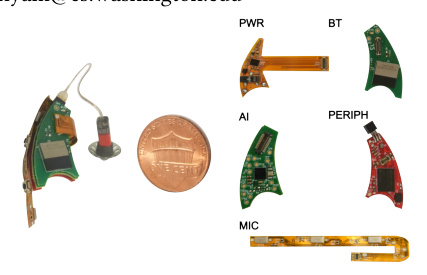
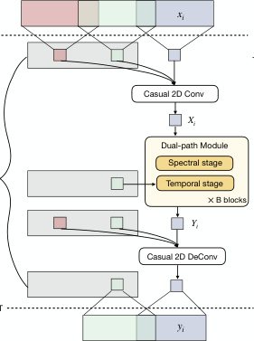
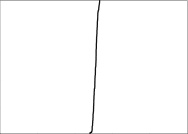
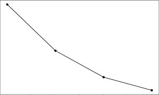
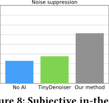
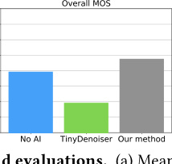

# **Wireless Hearables With Programmable Speech AI** **Accelerators**

### Malek Itani

Paul G. Allen School, University

of Washington, Seattle, WA, USA

malek@cs.washington.edu

### Tuochao Chen

Paul G. Allen School, University

of Washington, Seattle, WA, USA

tuochao@cs.washington.edu

### Arun Raghavan

Department of Otolaryngology,

University of Washington, USA

amraghav@uw.edu

### Gavriel Kohlberg

Department of Otolaryngology,

University of Washington, USA

kohlberg@uw.edu

**Abstract**

The conventional wisdom has been that designing ultra
compact, battery-constrained wireless hearables with on
device speech AI models is challenging due to the high

computational demands of streaming deep learning models.

Speech AI models require continuous, real-time audio pro
cessing, imposing strict computational and I/O constraints.

We present _NeuralAids,_ a fully on-device speech AI system

for wireless hearables, enabling real-time speech enhance
ment and denoising on compact, battery-constrained devices.

Our system bridges the gap between state-of-the-art deep

learning for speech enhancement and low-power AI hard
ware by making three key technical contributions: 1) a wire
less hearable platform integrating a speech AI accelerator for

efficient on-device streaming inference, 2) an optimized dual
path neural network designed for low-latency, high-quality

speech enhancement, and 3) a hardware-software co-design

that uses mixed-precision quantization and quantization
aware training to achieve real-time performance under strict

power constraints. Our system processes 6 ms audio chunks

in real-time, achieving an inference time of 5.54 ms while

consuming 71.6 mW. In real-world evaluations, including

a user study with 28 participants, our system outperforms

prior on-device models in speech quality and noise suppres
sion, paving the way for next-generation intelligent wireless

hearables that can enhance hearing entirely on-device.

[This work is licensed under a Creative Commons Attribution 4.0 Interna-](https://creativecommons.org/licenses/by/4.0)

[tional License.](https://creativecommons.org/licenses/by/4.0)

_ACM MOBICOM ’25, Hong Kong, China_

© 2025 Copyright held by the owner/author(s).

ACM ISBN 979-8-4007-1129-9/2025/11

[https://doi.org/10.1145/3680207.3765251](https://doi.org/10.1145/3680207.3765251)

### Shyamnath Gollakota

Paul G. Allen School, University

of Washington, Seattle, WA, USA

gshyam@cs.washington.edu

**Figure 1: NeuralAid hardware.** The device has five inter
connected flexible and rigid circuit boards that together form

an AI-enabled hearable. PWR (2-layer flexible PCB): man
ages power, charging, and programming, BT (2-layer rigid

PCB): houses the BLE SoC, AI (6-layer rigid PCB): contains

a low-power AI accelerator for real-time speech AI, PERIPH

(4-layer rigid PCB): hosts peripherals including RAM, NOR

flash, IMU, and I2S DAC, MIC (2-layer flexible PCB): has a

microphone array with three mics and two push buttons.

**CCS Concepts**

 - **Computing methodologies** → **Artificial intelligence** ;
**Machine learning** ; • **Computer systems organization**
→ **Embedded and cyber-physical systems** ; • **Human-**
**centered computing** → **Ubiquitous and mobile devices** .

**Keywords**

Enhanced hearing, quantization-aware training, hearing aids

**ACM Reference Format:**

Malek Itani, Tuochao Chen, Arun Raghavan, Gavriel Kohlberg,

and Shyamnath Gollakota. 2025. Wireless Hearables With Pro
grammable Speech AI Accelerators. In _The 31st Annual International_

_Conference on Mobile Computing and Networking (ACM MOBICOM_

_’25), November 4–8, 2025, Hong Kong, China._ ACM, New York, NY,

[USA, 15 pages. https://doi.org/10.1145/3680207.3765251](https://doi.org/10.1145/3680207.3765251)

**1** **Introduction**

In recent years, intelligent hearables have made significant

advances in enhanced hearing, leveraging deep learning

to program acoustic scenes in real time [7, 10, 57]. These

advancements enable capabilities such as speech enhance
ment [51], noise suppression [7], and even target speech

hearing [58]. However, current implementations rely on

wired headsets and computationally demanding platforms

like smartphones or high-power embedded systems [10, 57,

58]—devices with far greater processing power, memory,

and energy budgets than what can realistically fit within

ultra-compact, battery-constrained hearables like earbuds

and hearing aids.

The fundamental challenge is that streaming deep learn
ing models are traditionally associated with high compu
tational demands and power consumption. This raises key

questions about whether real-time speech AI models can

be deployed on small, battery-powered hearables. Offload
ing computations to a smartphone is unreliable due to the

stringent sub-10 ms algorithmic latency requirements of en
hanced and augmented audio applications, which are highly

sensitive to wireless network variability, I/O delays, and oper
ating system overhead on smartphones. Meanwhile, running

speech AI models on-device has so far been constrained by

the limited availability of AI accelerators that are both pow
erful enough for real-time speech AI and small enough to fit

within these miniature wireless devices. Overcoming these

barriers is essential to unlocking the next generation of truly

intelligent and self-sufficient wireless hearables.

In this paper, we explore whether it is possible to design

wireless hearables that can run real-time speech AI mod
els entirely on-device while understanding the trade-offs

between power consumption and efficiency. Achieving this

requires addressing three key challenges.

- Existing research platforms for hearables lack the compu
tational capabilities required to run deep learning models for

augmented and enhanced audio applications. In contrast to

classification tasks, these models must continuously operate

in a streaming manner, processing audio input at a minimum

sampling rate of 16 kHz. To do this, they should process

audio in small chunks of around 6 ms, maintain an inference

time of under 6 ms to ensure real-time performance, and

continuously output audio at the same sampling rate. Meet
ing these requirements imposes significant computational

and I/O constraints. Further, due to the limited non-valatile

storage available on these compact devices, the model size

must not exceed 1.5 MB and to enable more than six hours

of continuous operation on a 675 hearing aid battery, deep

learning power consumption must be below 100 mW.

- Tiny, low-power AI accelerator hardware [1, 3] is inher
ently far more constrained than GPUs and general-purpose

**Figure 2:** A person wearing a NeuralAid, which rests behind

the ear, with a receiver inserted into their ear canal.

embedded CPUs like the Raspberry Pi. On the other hand,

effective neural architectures for speech enhancement rely

on components such as convolutions [30], LSTMs [28], trans
formers [54], and state-space layers [27]. These models prior
itize speech quality over real-time, on-device, or low-power

constraints — indeed, transformers and state-space models

exceed our target hardware’s runtime and memory limits.

While efforts like TinyLSTM [19] and its successor Tiny
Denoiser [45] aim for on-device deployment, their 25 ms

algorithmic latency falls short of the low-latency require
ments for enhanced hearing applications.

- While smartphones and general-purpose embedded de
vices can run floating point operations, this increases the

runtime and power consumption on low-power hardware.

In general, low-power AI accelerators function as a compute

cluster with standard processors for general-purpose tasks

and a dedicated neural accelerator optimized for low-power,

highly quantized integer computations. However, quantiz
ing all neural network weights, activations, and inputs can

significantly degrade audio quality. Further, different neural

network layers are affected differently by quantization errors,

necessitating mixed-precision quantization and compensa
tion for non-linear errors at each layer. Thus, achieving opti
mal performance requires a low-power hardware-software

co-design approach.

We introduce _NeuralAids_, which makes three key contribu
tions across wireless hearable hardware, embedded systems,

deep learning, and hardware-software co-design.

- **Wireless hearables with speech AI accelerators.** We

design NeuralAids, a real-time speech AI system built on

a modular hardware architecture with five stacked PCBs

(Fig. 1). It integrates a low-power AI accelerator (Green
Waves GAP9) with an nRF53-based System-on-Chip (SoC)

for Bluetooth Low Energy (BLE) connectivity, audio pro
cessing, sensors, and both volatile and non-volatile memory.

The system runs speech AI models, using GAP9’s compute

cluster for real-time neural network inference. Optimized

power management, high-speed audio interfaces, and flexi
ble storage enable continuous operation in a behind-the-ear

compact form factor (Fig. 2), making NeuralAids a unique

platform for real-time speech AI applications.

- **Real-time on-device efficient neural network.** Prior

on-device models like TinyDenoiser [45] are constrained by

their limited complexity and inability to achieve effective

performance with sub-10ms latencies. Instead, we begin with

dual-path models that process audio in the time-frequency

(TF) domain, treating time and frequency components as

sequences using recurrent networks [6, 65]. These architec
tures achieve state-of-the-art performance by modeling both

temporal and frequency relationships. However, they are

computationally expensive, as running recurrent networks

across each frequency prevents real-time operation. Thus,

they cannot run in real time on our hardware. To address

this, our proposed architecture compresses frequencies us
ing a linear layer and replaces LSTMs with Gated Recurrent

Units (GRUs). These architectural changes and others listed

in §2.2.2 achieve real-time performance by reducing runtime

while outperforming TinyDenoiser for the denoising task.

- **Hardware-software co-design.** Floating-point speech

denoising models cannot achieve real-time operation on our

target accelerator hardware. To address this, we explore var
ious quantized model configurations and use quantization
aware training (QAT) to simulate non-linear quantization er
rors and fine-tune the network to mitigate error propagation

across layers. This narrows the performance gap between

our mixed-precision and fully floating-point speech models.

We evaluated our system for speech enhancement in noisy

scenarios. Our results are as follows:

- Before quantization, our floating-point dual-path network

architecture improves speech quality by 2.41 dB over Tiny
Denoiser. Applying quantization-aware training reduces the

performance gap between our mixed-precision and floating
point networks from 7.86 dB to 0.57 dB.

- Our proposed mixed-precision network can process 6 ms

audio chunks within 5.54 ms on the GAP9 processor, achiev
ing real-time operation. Furthermore, the model uses only

299 kB of memory and consumes 71.64 mW on our hardware.

- Our system generalizes to six real-world indoor and out
door environments, as well as to wearer head motion. Our

training relies solely on synthetic data and does not require

any training data collection using our hearable hardware.

- In a user study with 28 participants, our system achieved

a higher mean opinion score and better noise removal com
pared to both the raw, unprocessed input and TinyDenoiser.

This paper demonstrates that effective speech AI models

can indeed run on low-power wireless hearables. We believe

that this paves the way for integrating on-device AI models

for enhanced hearing into billions of wireless earbuds and

hearing aids, unlocking exciting new opportunities.

**2** **System Design**

We present our hearable hardware, an efficient streaming

neural network and a hardware-software co-design.

**2.1** **NeuralAids Hardware**

The hardware has a low-power BLE SoC that controls a tiny

AI accelerator to process incoming audio in real-time.

_2.1.1_ _Stacked printed circuits boards._ The systems are dis
tributed across the 5 printed circuit boards (PCBs) shown in

Fig. 1, referred to as PWR, BT, AI, PERIPH and MIC. These

circuits are stacked on top of each other and placed in the

hearing aid case. The board functionalities are as follows:

- _PWR:_ A 2-layer flex board that houses components for

power management, battery charging, and monitoring. It

also exposes programming pads for the BLE SoC and AI

accelerator. The board is powered by a 3.85V battery pack

consisting of four CP1254 batteries (75 mAh each, 300 mAh

total). A Texas Instruments BQ25120 power management

and charging IC is integrated to charge the battery and gen
erate a regulated 1.8V supply required to power the device

components. This chip can also produce a 3.3V voltage do
main on demand via I2C to power indicator LEDs on other

circuits. A switch is included to manually turn the device

on and off. The programming pads are designed for interfac
ing with a 2 × 7 array of 1.27 mm pogo pins, with one pad

also serving as a charging interface for the battery via a 5V

source. The board has a long flexible section with a Molex

2167010209 board-to-board connector at the tip that con
nects to the BT board. Since the board exposes programming

pads, it is placed along the edge of the case.

- _BT:_ A 2-layer rigid board containing an ISP2053, which

is a BLE SoC based on nRF5340 that integrates additional

components such as capacitors, oscillators and an antenna.

A resistor is soldered in one of two possible positions to

hardcode the device’s side (i.e. left or right device). A board
to-board connector (Molex 513382674) attaches this circuit

to the AI board, enabling power and data exchange between

the two boards.

- _AI:_ A 6-layer rigid board houses the low-power AI accel
erator (GreenWaves GAP9). An FPF1204UCX load switch is

used to enable the BLE SoC to control power to the AI chip,

allowing it to connect and disconnect power as needed. This

board connects to the PERIPH circuit.

- _PERIPH:_ A 4-layer rigid board contains peripheral devices,

including an AP Memory APS256XXN 256 Mbit RAM chip

and an SSM6515 ultra-low-power I2S DAC and amplifier. The

AI accelerator can control power to the RAM chip using a

load switch (FPF1204UCX) when the RAM is not needed.

Additionally, this board includes a NOR flash (Macronix

MX25UW12845G) and an IMU (BMI323), which are reserved

for future research. A right-angled 1 mm pitch connector is

used to connect a Phonak Audeo Marvel M Receiver-in-canal

(RIC), allowing audio playback into the ear canal. The board

connects to the MIC circuit using Molex 5050661022.

- _MIC:_ A 2-layer flexible microphone array with 3 PDM mi
crophones (TDK T5837) and 2 buttons (Omron B3U-1000P).

_2.1.2_ _Hardware subsystems._ The NeuralAid system consists

of three main subsystems: Bluetooth, AI, and Audio.

- _Bluetooth subsystem:_ This is built around the BLE SoC,

which is the first chip to boot when the device powers on

and manages power delivery to the AI chip. It has direct

access to the buttons on the MIC board and receives system
level interrupts such as wake-up and reset signals. There are

two channels between the BLE and AI chips: 1) A 115200

baud UART interface for low-speed, spontaneous commu
nication, and 2) an I2S interface for high-speed, continuous

communication. The BLE SoC enables wireless connectivity

with external devices. After waking up the AI chip, it trans
mits advertising packets and accepts connections, allowing

remote control and data exchange for audio streaming or

playback. The BLE SoC is dual-core; we run time-critical

BLE-related tasks on one core, while tasks like interfacing

or GPIO control run on another core.

- _Audio subsystem:_ This manages audio from microphone

capture to playback through the RIC. Although audio in
terfaces directly with GAP9, all its Serial Audio Interfaces

(SAIs) derive their clocks from the BLE chip. GAP9 manages

three SAIs for different purposes: 1) reading audio from mi
crophones, 2) writing audio to speakers, and 3) exchanging

audio with the BLE SoC (e.g., for streaming). The BLE SoC

provides a 3.072 MHz audio clock, enabling high-quality mi
crophone capture. GAP9’s Smart Filter Unit (SFU) converts

incoming PDM samples to PCM using an 8th-order cascaded

integrator-comb filter with a 64× decimation ratio and 2 sam
ples per stage. The output is shifted by 24 bits to generate

32-bit PCM samples at 48 kHz, which are then downsampled

to 16 kHz via the SFU’s resampler block for processing. For

playback, the speaker SAI interface transmits 32-bit PCM

samples at 48 kHz via I2S to the DAC. Since internal process
ing occurs at 16 kHz, the SFU’s resampler upsamples audio

back to 48 kHz. The BLE I2S interface relays recorded audio

and external playback between the BLE and AI chips.

- _AI subsystem:_ The AI accelerator processes incoming audio

in real-time using a neural network. Every 96 audio samples

(6 ms at 16 kHz), it performs speech enhancement. First, the

system converts 32-bit PCM audio to 16-bit float using a

dedicated fixed-to-floating point converter. A pre-emphasis

**Table 1: Power consumption of various NeuralAid com-**
**ponents.** Speaker amplification was calibrated by placing a

NeuralAid in a silicone ear model and measuring the sound

level 8 mm from the RIC tip. The amplification was adjusted

to increase the sound level by 20 dB. The ambient noise level

was 33 dBA in both the calibration and testing environments.

**Component** **Power (mW)**

BLE chip 6.75

Microphone array 2.02

Speaker 1.49

filter with a coefficient of 0.97 removes DC components. The

audio is then placed in a ring buffer and an FFT converts it

into the frequency domain. The neural network processes

the frequency-domain audio, after which an inverse FFT and

overlap-add reconstruct the time-domain signal. The output

is converted back to 32-bit integers for playback through

the RIC. Although the microphone array has three micro
phones, only one is used in this paper. For efficiency, FFT

and inverse FFT run on GAP9’s compute cluster, while other

operations execute on the fabric controller. All GAP9 compo
nents, including the fabric controller, compute cluster, and

peripherals, are clocked at at 370 MHz. The AI chip also

communicates with onboard RAM via an Octal SPI interface.

_2.1.3_ _Component power consumption._ Table 1 presents the

power consumption of the BLE SoC, microphone array, and

speaker while running real-time AI speech enhancement.

The combined power consumption of these components is

10.26 mW. The power consumption of the AI accelerator,

which varies based on the complexity of the neural network,

is analyzed in detail in the following sections.

**2.2** **Efficient Streaming Neural Network**

We have three key requirements for achieving a streaming

speech enhancement network: (1) achieving a low end-to
end latency of less than 20 ms between the audio and visual

scenes, with an algorithmic latency of 10 ms or less, (2) com
pleting the processing of the current chunk before the next

chunk arrives, and (3) generalizing effectively to unseen re
verberant and noisy environments, as well as diverse wearers,

without requiring training data collected from hardware.

As shown in Fig. 3A, end-to-end latency is defined as the

time for a single audio sample to travel from the microphone

input buffer, through the speech enhancement network, and

into the speaker output buffer. This latency consists of two

components: algorithmic latency, introduced by factors such

as chunk size, lookahead, and overlap-add; and hardware

latency, which accounts for the computation and I/O time

required to process each chunk [60].

**D.**

**B.**

_xi_ −1

Caching

State _hi_

|(i −|1)LC i|Col3|LC (i +|Col5|+ 1)LC|Col7|
|---|---|---|---|---|---|---|
||_x_ _L_|_x_ _L_|_xi_+1 _L_|_xi_+1 _L_|||
||_x_ _L_|_x_ _L_|_xi_+1 _L_|_xi_+1 _L_|_L_||
||_i_ _B_|_i_ _B_| _C_| _C_| _F_||
||**Inve** _LB_|**Inve** _LB_|**Analysis Wind** **Netwo**|**Analysis Wind** **Netwo**|** ow & DFT** **rk**|** ow & DFT** **rk**|
||**Inve** _LB_|**Inve** _LB_|**rse DFT & Synt**|**rse DFT & Synt**|**   hesis Window**|**   hesis Window**|
||**Inve** _LB_|**Inve** _LB_|||||
||**Inve** _LB_|**Inve** _LB_|||||
||**Inve** _LB_|_LB_|_LC_|_LC_|_LF_||
||||||||
||||||||
||||_yi_|_yi_|||

|(i −1|1)LC i|LC (i +|+ 1)LC|Col5|
|---|---|---|---|---|
|| ||||
||_x_ _L_|_xi_+1 _L_|_L_||
||_i_ _B_|**Analysis W** **DFT** **Netwo** **Inverse** _C_|** indow** **rk** ** DFT** _F_||
||_LB_|_LB_|_LB_|_LB_|
||_LB_|_LC_|** ck Samples** ** Window** _LF_||
|||**Drop Lookba** **Synthesis**|**Drop Lookba** **Synthesis**|**Drop Lookba** **Synthesis**|
|||_LC_|_LF_||
||||||
||||||
|||_yi_|||

**Figure 3: Efficient streaming neural network.** (A) Decomposition of the end-to-end latency in streaming speech enhance
ment. (B) The normal overlap-add operation introduces additional algorithmic latency with lookback padding. (C) The overall

architecture of our streaming speech enhancement network with history caching states for computing reuse. (D) Dual-window

approach during overlap-add can reduce the additional algorithmic latency introduced by the lookback padding.

_2.2.1_ _Problem Formulation._ Given an acoustic environment,
let _𝑠_ ( _𝑡_ ) represent the clean target speech received at the
microphone, and let _𝑛_ ( _𝑡_ ) denote all background noise. The
mixture audio, _𝑥_ ( _𝑡_ ), can be expressed as:

_𝑥_ ( _𝑡_ ) = _𝑠_ ( _𝑡_ ) + _𝑛_ ( _𝑡_ ) (1)

Since our enhancement network N processes audio chunks

in a streaming manner, we divide the continuous waveform

into smaller audio chunks: _𝑥_ ( _𝑡_ ) = [ _𝑥_ 0 _,𝑥_ 1 _, . . .,𝑥𝑁_ ], _𝑠_ ( _𝑡_ ) =

[ _𝑠_ 0 _,𝑠_ 1 _, . . .,𝑠𝑁_ ], and _𝑛_ ( _𝑡_ ) = [ _𝑛_ 0 _,𝑛_ 1 _, . . .,𝑛𝑁_ ]. The process of

streaming speech enhancement can be formulated as,

_𝑠_ ˆ _𝑖,ℎ𝑖_ = N ( _𝑥𝑖,ℎ𝑖_ −1) (2)

Here, ˆ _𝑠𝑖_ represents an estimation of the clean speech _𝑠𝑖_,

while _ℎ𝑖_ −1 denotes the cache or memory state from previous

chunks, which can be reused as the previous intermediate

output, and _ℎ𝑖_ represents the current cache or memory state.

_2.2.2_ _Neural Network Architecture._ Existing low-power, on
device speech enhancement networks, like TinyLSTM [19]

and its successor TinyDenoiser [45], have two drawbacks: (1)

their simple architecture significantly limits enhancement

performance, and (2) they exhibit high algorithmic latency

of around 25 ms, restricting real-time applications. While

several advanced speech enhancement models have been

proposed in recent years [8, 47, 59], they fail to meet our

real-time, on-device, and low-power constraints. Our goal is

to significantly improve speech enhancement performance

while maintaining low-latency and real-time constraints.

The overall architecture of our network is shown in Fig.3C.

It is a dual-path Time-Frequency (TF) domain model based

on TF-GridNet[59], which achieves superior performance for

speech enhancement tasks. First, the small audio chunk _𝑥𝑖_ is

transformed into its time-frequency representation _𝑋𝑖_ using

a Short-Time Fourier Transform (STFT) followed by a causal

2D convolutional layer. The transformed representation _𝑋𝑖_

is then processed by multiple dual-path modules—the most

computationally intensive components of the network. Each

dual-path module has two stages: a spectral stage that pro
cesses frequency information and a temporal stage that han
dles time dependencies. Finally, the enhanced time-frequency

representation _𝑌𝑖_ is passed through a 2D causal deconvolu
tion layer and reconstructed back into a time-domain signal

_𝑦𝑖_ using the inverse STFT and overlap-add operations.

To enable real-time operation on low-power devices while

maintaining low latency, we highlight three modifications.

**Low-complexity dual-path architecture.** In the original

TF-GridNet, the spectral stage consists of a bi-directional

LSTM that processes the frequency domain of _𝑋𝑖_, while the

temporal stage consists of a causal uni-directional LSTM that

processes the time domain of _𝑋𝑖_ . We observed that the pri
mary contributor to inference time is the bi-directional LSTM

in the spectral stage, as it must process the long sequence of

frequency bins sequentially. Using recurrent models to pro
cess frequency sequences sequentially slows computation.

To reduce its complexity, we first apply a strided convolu
tion layer to compress the frequency dimension before us
ing the frequency-domain LSTM. This reduces the sequence

length processed by the LSTM, thereby decreasing its exe
cution time. Additionally, compared to LSTMs, GRUs offer

lower computational cost while maintaining similar perfor
mance [14]. To further optimize the runtime of the spectral

module, we replace the LSTM module with a GRU module.

**Dual-window approach for low-algorithmic latency.**

As shown in Fig. 3A, to achieve low algorithmic latency, we

process the input audio _𝑥𝑖_ in small chunks of size _𝐿𝐶_ (ms),

with an additional lookahead of _𝐿𝐹_ (ms) and a lookback of
_𝐿𝐵_ (ms); we set _𝐿𝐶_ = 6 _𝑚𝑠_, _𝐿𝐵_ = 6 _𝑚𝑠_ and _𝐿𝐹_ = 4 _𝑚𝑠_ . Looka
head and lookback padding improve frequency resolution,

which is important for enhancement performance [60]. How
ever, increasing the lookahead and lookback padding also

introduce higher algorithmic latency.

With lookahead padding _𝐿𝐹_, the network must wait for

an additional _𝐿𝐹_ ms of audio samples before applying the

STFT. While lookback padding does not introduce additional

waiting time at input, it causes algorithmic latency during the

iSTFT process. Specifically, the overlap-add processing step

of the current chunk _𝑦𝑖_ requires the lookback padding from

the next chunk _𝑦𝑖_ +1, as shown in Fig. 3B. Thus, the overlap
add process must wait for the next chunk (an additional

_𝐿𝐵_ + _𝐿𝐶_ ms) to reconstruct the current output chunk.

To eliminate the algorithmic latency introduced by look
back padding, we adopt a dual-window-size approach [32,

60], where the synthesis window is shorter than the analysis

window, as shown in Fig. 3D. By discarding the lookback

samples after the inverse DFT and before applying the syn
thesis window, the overlap-add process for the current chunk

no longer depends on the next chunk’s output. We use a rect
angular window for analysis and use a specific function for

the synthesis window _𝑠_, described below, valid for _𝐿𝐶_ _> 𝐿𝐹_,

to achieve perfect signal reconstruction [21]:

_𝑠_ [ _𝑖_ ] = 


1 if _𝑖_ ∈[ _𝐿𝐹_ _, 𝐿𝐶_ ]

1 otherwise
⌊ _[𝐿][𝐶]_ [+] _[𝐿][𝐵]_ ⌋+1

_𝐿𝐶_

With this approach, our lookback padding can increase fre
quency resolution without introducing additional algorith
mic latency. As a result, we achieve a low algorithmic latency

of _𝐿𝑐_ + _𝐿𝐹_ = 10 _𝑚𝑠_ .

**Cache state management.** When processing a stream of

continuous chunks, many values can be reused to avoid re
dundant computations. To achieve this, we maintain and

update a cache state _ℎ𝑖_ at every inference step. As shown

in Fig. 3C, our cache state _ℎ𝑖_ consists of four components:

1) Since the kernel of the first 2D causal convolution layer

requires prior chunks, we can avoid recomputing the STFT

frames of these prior chunks by caching and reusing them,

as illustrated in the figure. 2) We store the output of the se
quence of dual-path modules from previous chunks, allowing

us to compute the causal 2D deconvolution more efficiently.

3) Since computing the ISTFT for the current chunk depends

on previous chunks, we maintain a buffer for the intermedi
ate outputs of the 2D deconvolution layer. 4) We store the

hidden and cell states of the temporal unidirectional LSTM

for each dual-path module. This allows us to fully leverage

the long-term receptive field of the recurrent network.

_2.2.3_ _Training for Real-world Generalization._ Our speech

enhancement system must generalize to complex real-world

acoustics, where variations arise from multipath propaga
tion, head-related transfer functions (HRTFs), diverse noise

profiles, and motion. To ensure real-world generalization,

we adopt a two-step training strategy.

**Training.** In the first stage, we train our model on the Lib
riSpeech [35] dataset (360 hours of clean speech). To en
hance generalization across reverberation and human wear
ers, we convolve each speech sample and background noise

with a binaural room-impulse-response (BRIR) that captures

the acoustic transformations caused by a room and the hu
man head. We use four real-world BRIR datasets—CIPIC[5],

RRBRIR [22], ASH-Listening-Set [52], and CATTRIR [23]—

and split them into training, validation, and test sets with
out overlap. We also use WHAM! (58.03 hours of diverse

background noise) [62]. For each training sample, we ran
domly select a 5-second clean speech clip _𝑎_ ( _𝑡_ ) from LibriSpeech, a BRIR _ℎ𝜃,𝜙_ ( _𝑡_ ) from BRIR datasets recorded at

azimuthal angle _𝜃_ and polar angle _𝜙_, and a 5-second back
ground noise clip _𝑛_ ( _𝑡_ ) from WHAM. Then we mix them as,
_𝑥_ ( _𝑡_ ) = _ℎ𝜃,𝜙_ ( _𝑡_ ) ∗ _𝑎_ ( _𝑡_ ) + _𝑛_ ( _𝑡_ ). We do not convolute _𝑛_ ( _𝑡_ ) with
_ℎ𝜃,𝜙_ ( _𝑡_ ), as WHAM! noise is recorded in a binaural format.
During training, our target is _𝑠_ ( _𝑡_ ) = _ℎ𝜃,𝜙_ ( _𝑡_ ) ∗ _𝑎_ ( _𝑡_ ) to pre
serve the binaural characteristic of clean speech. We optimize

                     -                     - ∥ _𝑠_ ∥ [2]
the model using the SNR loss: _𝐿𝑆𝑁𝑅_ _𝑠,𝑠_ ˆ = ∥ _𝑠_ - _𝑠_ ˆ∥ [2] [. Training]

runs for 200 epochs, each with 20k samples, using AdamW

with gradient clipping (0.1). The learning rate follows three

sequential schedulers: 1) linearly increases from 1e-4 to 1e
3 over 10 epochs, 2) maintains 1e-3 for 140 epochs, and 3)

halves every 15 epochs for the final 50 epochs.

In practice, each device runs its own network, processing

audio independently. Thus, we train two separate networks

- one for the left channel and one for the right.

**Fine-tuning with motion and data augmentation.** In

the previous stage, the sound source and wearer’s head were

assumed to be static. However, real-world scenarios involve

motion. To address this, we fine-tune the model with time
varying _𝜃_ and _𝜙_, following motion simulation from [58].

Specifically, the source’s position updates every 25 ms,

with a 2.5% probability of triggering a random motion event.

When triggered, the angular velocity in the azimuthal and

polar directions is sampled from [ _𝜋_ /6 _, 𝜋_ /2] rad/s, and the

source moves at this velocity for a random duration between

0.1 and 1 s, during which no other motion event is trig
gered. The Steam Audio SDK [50] is used for motion trajec
tory simulation, creating a mix of stationary and moving

segments within the same audio clip. Since BRIR datasets

contain recordings at discrete positions, we approximate in
termediate positions using nearest-neighbor BRIR selection

based on the current [ _𝜃_ ( _𝑡_ ) _,𝜙_ ( _𝑡_ )].

We also augment, with a 30 % probability, the mixture sig
nal with white, pink, and brown noise, mimicking real-world

noise sources like microphone thermal noise and HVAC sys
tems. White noise is generated with a standard deviation

sampled from [0,0.002), while pink and brown noise are cre
ated using the Python colorednoise library and scaled by

a random factor from [0,0.05]. Additionally, also with a 30 %

probability, we randomly augment the speed of the target

speech to 80–120 % of its original value. We fine-tune the

model for 100 additional epochs, incorporating motion sim
ulation and noise augmentation. Instead of SNR loss, we

use a multi-resolution spectrogram loss [53, 64]. Optimiza
tion uses AdamW with a gradient clipping of 0.1, and a

ReduceLROnPlateau scheduler (patience = 5, factor = 0.5)

starting at 1e-3 learning rate.

**2.3** **Hardware-Software Co-Design**

_2.3.1_ _Hardware Constraints._ GAP9’s limited memory and

compute resources impose strict constraints on neural net
works that it can run efficiently. It has only 1.5 MB of L2 mem
ory and 128 KB of L1 memory. Models exceeding this require

external L3 memory, which is slow and power-intensive.

Efficient DSP and neural network inference rely on GAP9’s

compute cluster — 9 RISC-V cores and the NE16 accelerator.

The NE16 is optimized for streamed multiply-accumulate op
erations but only supports up to 8-bit quantized weights and

8-/16-bit activations. The RISC-V cores handle both integer

and floating-point operations but are less efficient for neural

networks. Thus, the network must be carefully designed by

identifying the parts of the network that can be efficiently

run on the NE16 with quantization without degrading the

output speech quality.

_2.3.2_ _Quantizing Neural Networks._ Quantization is the pro
cess of converting tensors in the computational graph from a

full-precision representation (e.g., fp32) to a lower-precision

fixed-point representation (e.g., int8). This helps reduce

memory usage, runtime and power consumption.

We denote the parameters of the network N (·) as _𝜃_, which

are originally stored in floating-point precision. Quantization

can be classified into two types:

- _Weight quantization:_ Applied to network parameters _𝜃_ .

- _Activation quantization:_ Applied to intermediate activation

maps generated during inference.

We use uniform int8 quantization, with asymmetric thresh
olds for activations and symmetric thresholds for weights.

A uniform quantizer is defined as follows: let _𝑟_ ∈ R _[𝑛]_ be
a vector to be quantized, _𝑆_ ∈ R [+] be the quantizer scaling
factor, _𝑍_ ∈ R be the zero-point and let _𝑏_ be the bit width.

The quantization process can be formulated as:

_𝑄_ ( _𝑟_ ) = ⌊ _𝑟_ / _𝑆_ ⌉+ _𝑍_ (3)

where _𝑄_ ( _𝑟_ ) is the fixed point representation of _𝑟_ in quantization space. ⌊·⌉ denotes the rounding of the input to the

nearest integer value.

Dequantization maps _𝑄_ ( _𝑟_ ) back to _𝑟_, and is given by:

_𝑟_ ˆ = _𝑆_ ( _𝑄_ ( _𝑟_ ) − _𝑍_ ) (4)

Since the recovered values ˆ _𝑟_ may not exactly match _𝑟_ due to

rounding, a **quantization error** is introduced.

A key aspect of uniform quantization is choosing the scal
ing factor _𝑆_ . It defines how a given range [ _𝛼, 𝛽_ ] of real values
_𝑟_ is divided into discrete partitions [20]: _𝑆_ = 2 _[𝛽][𝑏]_ [−] - _[𝛼]_ 1 [. In our im-]

plementation, we use a Min-Max Moving Average Observer

to determine [ _𝛼, 𝛽_ ].
In asymmetric quantization, the range [ _𝛼, 𝛽_ ] is not necessarily symmetric with respect to the origin, i.e., − _𝛼_ ≠ _𝛽_ . In

symmetric quantization, in contrast, a symmetric clipping

range (− _𝛼_ = _𝛽_ ) is used and its scaling factor _𝑆_ is computed
as, _𝑆_ = [max] 2 _[𝑏]_ [(−][−][1] - _[𝛼,𝛽]_ 1 [)] [20], with the zero-point set to _𝑍_ = 0.

Furthermore, in neural networks, quantization is usually

applied to a high-dimension tensor (dimension ≥ 2). There

are two methods for quantizing higher dimension tensors:

- _Per-tensor quantization:_ The entire tensor is quantized

using the same _𝑆_ and _𝑍_ .

- _Per-channel quantization:_ Each channel is quantized inde
pendently with different _𝑆_ and _𝑍_ .

Given the constraints of the GAP9 hardware, we deploy

per-tensor asymmetric quantization for activations and per
channel symmetric quantization for weights.

_2.3.3_ _Mixed-Precision Configuration._ One method for quan
tizing a trained floating-point neural network is Post-Training

Quantization (PTQ). This involves: 1) calibrating the quanti
zation range using a representative dataset, and 2) quantizing

all tensors in the network to a lower-precision format.

We start PTQ by applying full int8 quantization, but as

shown in Table 3, this results in severe performance degra
dation due to quantization errors. Instead, inspired by [46],

we adopt mixed-precision quantization to mitigate perfor
mance loss. The key idea is that different network submod
ules have varying sensitivity to quantization errors. By se
lectively quantizing certain modules to bfloat16 instead

of int8, we can preserve critical information and recover

performance from quantization errors. According to [16, 46],

input and output quantization is sensitive to the quantization

error and leads to performance degradation. The rationale

is that the first convolution layer processes raw input data,

so maintaining high precision helps retain essential features.

The last deconvolution layer reconstructs the final output,

where high precision is crucial for generating high-quality

audio. Hence, we quantized first input convolution and last

deconvolution layers to bfloat16 instead of int8.

_2.3.4_ _Quantization-Aware Training for Better Performance._

While mixed-precision PTQ helps mitigate some performance

loss, there remains a significant performance drop compared

to the floating-point network. This degradation is even more

pronounced (Table. 3) in model architectures with a large

number of sub-components like ours, which restricts the

deployment of advanced models on our accelerator.

To further reduce quantization errors, we apply Quanti
zation Aware Training (QAT). The key idea behind QAT is

to simulate quantization errors during training, allowing

the model to adjust and converge to a more optimal solution

under quantization constraints.

During QAT, floating-point weights and activations are

rounded to their quantized equivalents. Since quantization is

a non-differentiable operation, we use the Straight-Through

Estimator to approximate gradients, where: _𝜕_ ⌊ _𝑥_ ⌉/ _𝑥_ = 1.

**QAT implementation.** We describe the details below.

_Initialization:_ We begin with a pretrained floating-point

model with parameters _𝜃_ and apply the mixed-precision

quantization described in §2.3.3.

_Learned Step-Size Quantization (LSQ):_ We enhance vanilla

QAT with LSQ [17], which allows the network to learn the

quantizer scale factor _𝑆_ using gradients of the task loss. This

helps reduce activation quantization errors.

_Fine-tuning:_ The mixed-precision model is fine-tuned for

30 epochs using the FQSE framework [15].

_Training Setup:_ Each epoch processes only 4,000 mixtures

due to QAT’s high computational cost. We use an initial

learning rate of 1e-3, with a ReduceLROnPlateau scheduler.

**3** **Experiments and Results**
**3.1** **Benchmark results**

_3.1.1_ _Evaluation Metrics._ Our evaluation consists of two

main components: speech enhancement evaluation and sys
tem evaluation. The former assesses the network’s noise sup
pression capability and the quality of the enhanced speech.

- _SISDRi:_ Scale-Invariant Signal-to-Distortion Ratio (SISDR)

is a commonly used metric in speech enhancement tasks to

assess the quality of enhanced speech relative to the refer
ence clean speech [26]. SISDR Improvement (SISDRi) can be

computed between the input and output speech to assess

how much the network improves the quality of the speech

compared to the clean reference speech.

- _PESQ:_ Perceptual Evaluation of Speech Quality (PESQ) is

an objective metric that assesses how closely an enhanced

signal matches a reference clean speech signal [42], mimick
ing human perception.

- _DNSMOS:_ Deep Noise Suppression MOS (DNSMOS) is a

neural network based objective metric designed to predict

Mean Opinion Score (MOS) for speech quality in speech

enhancement. We use the ITU P.835 personalized DNSMOS

OVRL implementation as our score [41].

For system evaluation, we measure memory consumption,

runtime, and power consumption on the AI accelarator.

- _Memory:_ GreenWaves’ conversion process reports where

neural network parameters are stored. We sum L1 and L2

memory usage to determine total memory consumption.

- _Runtime:_ Models run on GAP9 by sending tasks to its

compute cluster. Runtime is measured by sending a model

execution task, counting elapsed clock cycles until the task

completes, and dividing the elapsed cycles by clock frequency.

The reported runtime is averaged over 100 iterations.

- _Power:_ To measure GAP9’s power consumption during

continuous speech enhancement, we power it with a 1.8V

source, run inference on each incoming audio chunk every

6 ms, and measure the current over several minutes. Power

is calculated as the product of current and voltage.

_3.1.2_ _Model comparison._ We compare multiple FP32 models

that when fully quantized meet our real-time requirements:

- _TinyDenoiser:_ Prior state-of-the-art TinyDenoiser model

[46] performs on-device speech denoising. For fair compar
ison, we modify its algorithmic latency to 10ms with the

same chunk size and padding as our model.

- _TFGridNet-6F:_ We use the causal implementation from [58]

without self-attention and LayerNormalization modules. Its

hyperparameters are _𝐿𝐵_ = 6 _𝑚𝑠_, _𝐿𝐶_ = 6 _𝑚𝑠_, _𝐿𝐹_ = 4 _𝑚𝑠_, _𝐵_ = 6,
_𝐷_ = 32 and _𝐻_ = 32. Since TF-GridNet is not real-time even

at 4× compression, we apply 6× frequency compression to

the spectral module to meet real-time requirements.

- _Our Model:_ We set model hyperparameters to _𝐿𝐵_ = 6 _𝑚𝑠_,
_𝐿𝐶_ = 6 _𝑚𝑠_, _𝐿𝐹_ = 4 _𝑚𝑠_, _𝐵_ = 6, _𝐷_ = 32 and _𝐻_ = 32. We apply 4×

frequency compression on the spectral module.

As shown in Table. 2, our FP32 model achieves the best SIS
DRi, PESQ and DNSMOS scores at floating model resolution.

**Table 2: Floating-point (FP32) network results.**

Model SISDRi (dB) PESQ DNSMOS

TinyDenoiser 6.24 ± 3.43 1.37 ± 0.27 2.06 ± 0.64
TFGridNet-6F 8.43 ± 3.46 1.74 ± 0.49 2.48 ± 0.68
Our model 8.65 ± 3.41 1.76 ± 0.49 2.50 ± 0.66

_3.1.3_ _Quantization evaluation._ Next, we evaluate how differ
ent quantization configurations affect performance, runtime,

power, and memory consumption. We compare our model

with TinyDenoiser [46] under three configurations:

- _bfloat16:_ We quantize both TinyDenoiser and our model

into bfloat16 resolution.

- _int8 PTQ:_ We quantize both TinyDenoiser and our model

into int8 resolution, using Post Training Quantization.

- _Mix PTQ:_ For TinyDenoiser, we follow the mix-precision

configuration as the original paper [46], where we quantize

the linear layers into bfloat16 and quantize the LSTM layers

into int8. For our model, we quantize the input 2D Conv

and output 2D DeConv into bfloat16 and quantize other

parts into int8. Then we apply Post Training Quantization

on these mixed precision models.

- _Mix QAT:_ We follow the same mixed precision quantiza
tion configuration for TinyDenoiser and our model, then we

apply Quantization-Aware Training.

The results of different quantization configurations are

shown in Table 3. While full INT8 quantization achieves

the lowest runtime, memory usage, and power consump
tion for both TinyDenoiser and our model, it significantly

degrades speech enhancement performance. TinyDenoiser

experiences a 2.76 dB drop, while our model suffers a 10.46 dB

decline. The larger performance drop in our model is due to

more severe quantization noise accumulation in its deeper

and more complex architecture.

Applying mixed-precision quantization helps recover 0.36 dB

of SISDRi for TinyDenoiser and 2.6 dB for our model. How
ever, the performance loss compared to the floating-point

model remains non-negligible. After QAT, TinyDenoiser

achieves an SISDRi of 5.97 dB, while our model reaches

8.19 dB, demonstrating the effectiveness of QAT, especially

for deeper and more complex networks. Our mixed-precision

model with QAT achieves the best performance within hard
ware constraints. Considering runtime, memory, and power

consumption, our model balances performance and memory

efficiency while maintaining real-time requirements ( _<_ 6 _𝑚𝑠_ )

and power constraints (71 _._ 6 _𝑚𝑊_ ), trading some runtime and

power efficiency for improved speech enhancement.

In Fig. 4, we plot the output SISDR as a function of in
put SISDR for both the floating-point model and the mixed
precision QAT model. The results show that QAT reduces the

performance gap between our floating-point and quantized

**Figure 4: QAT reduces the gap between our floating-**
**point and quantized models across input noise levels.**

models across all input noise levels. An interesting observa
tion is that the performance gap increases with higher input

SISDR. As input SISDR increases, the output speech quality

becomes clearer, making quantization noise more dominant

and its effects more pronounced compared to scenarios with

lower input SISDR [15].

_3.1.4_ _End-to-end hardware runtime evaluation._ Fig. 5 shows

CDF plots of the hardware runtime for key subcomponents

of our audio processing pipeline. In addition to AI inference

with our speech enhancement model, the pipeline performs

FFT and inverse FFT for time-frequency conversion. Runtime

is measured by recording clock cycles before and after the

execution of each component and dividing the difference

by the clock frequency. The plots are generated by consoli
dating runtime measurements over 100 iterations. Since we

use rectangular synthesis windows (i.e., containing all ones),

there is no need to apply a window before the FFT. However,

for the inverse FFT, we apply an analysis window (not nec
essarily all ones) and so include the overlap-add operation

in the runtime measurements. Figs. 5a-5c show consistent

runtimes, with AI inference being the most time-consuming

step. Fig. 5d shows that the full pipeline, including additional

tasks such as data copying and type conversion, executes in

under 6 ms, ensuring real-time performance.

_3.1.5_ _Wireless throughput._ Fig. 6 plots the wireless through
put of our NeuralAid device at different distances from the

receiver. To measure throughput, we stream 10,000 packets,

each 196 bytes in size, over BLE from the hearing aid to a

laptop in a large conference room. The total transmission

time is recorded and used to compute the throughput. As

expected, throughput decreases as the distance increases

due to higher packet loss and retransmissions. Beyond 3 me
ters, throughput drops below 200 kbps, primarily due to the

limited range of the device’s low-profile integrated antenna.

**3.2** **In-the-Wild Evaluation**

We evaluated our system in previously unseen indoor and

outdoor environments, using participants who were not in
cluded in the training data. It is important to emphasize

**Table 3: Power consumption and quantization results.** We measure the SISDRi, model size, runtime and power consumption

for different Post-Training Quantization (PTQ) and Quantization-Aware Training (QAT) strategies and different models. The

bfloat16 network configurations cannot run in real-time on the target AI accelerator.

**Model** **Quantization config** **SISDRi (dB)** **Memory (kB)** **Runtime (ms)** **Power (mW)**

TinyDenoiser BFLOAT16 6.30 ± 3.52     -     -     TinyDenoiser int8 PTQ 3.54 ± 3.34 1135.2 0.53 23.08
TinyDenoiser Mix PTQ 3.90 ± 3.33 1195.9 0.58 24.12
TinyDenoiser Mix QAT 5.97 ± 3.35 1195.9 0.58 24.12

Our model BFLOAT16 8.76 ± 3.41     -     -     Our model int8 PTQ -1.70± 7.5 280.4 5.19 58.57
Our model Mix PTQ 0.90 ± 5.40 298.8 5.54 71.64
Our model Mix QAT 8.19 ± 3.38 298.8 5.54 71.64

1.0

0.8

0.6

0.4

0.2

1.0

0.8

0.6

0.4

0.2

0.0

0 10 20 30 40 50
Time ( _μ_ s)

**(a)**

0.0

0 10 20 30 40 50
Time ( _μ_ s)

**(b)**

1.0

0.8

0.6

0.4

0.2

1.0

0.8

0.6

0.4

0.2

0.0

5.50 5.54 5.58 5.62 5.66 5.70
Time (ms)

0.0

5.50 5.54 5.58 5.62 5.66 5.70
Time (ms)

the system performance. Instead, we use subjective metrics

to allow human participants to rate the audio quality.

For this user study, we recruited 28 participants (19 male

and 9 female) ranging in age from 18 to over 70 years, with

an average age of 43. The only inclusion criteria was that the

participants were adults and could follow English instruc
tions. Each participant evaluated the system in three modes,

selected in a random order, across 15 scenarios.

(1) **No AI** : In this mode, there is no noise suppression and

thus the participants hear the unfiltered mixture of the

speech signal and background noise.

(2) **TinyDenoiser** : Prior state-of-the-art TinyDenoiser

model.

(3) **Our method** : In this mode, we use our NeuralAid

model fine-tuned with motion and colored noise as

described in §2.2.3.

For each of these modes, we ask the participants to rate the

speech quality by asking them the following questions [58]:

(1) **Noise suppression** : _How INTRUSIVE/NOTICEABLE_

_were the INTERFERING SPEAKERS and BACKGROUND_

_NOISES? 1 - Very intrusive, 2 - Somewhat intrusive, 3 -_

_Noticeable, but not intrusive, 4 - Slightly noticeable, 5 -_

_Not noticeable_

(2) **Overall MOS** : _If the goal is to focus on this target_

_speaker, how was your OVERALL experience? 1 - Bad, 2_

_- Poor, 3 - Fair, 4 - Good, 5 - Excellent_

**Results.** As shown in Fig. 8, our system significantly re
duces background noise, as demonstrated by the increase

in the mean opinion score for the noise suppression task

from 2.15 in the “no AI” setting to 3.57. Additionally, our

NeuralAids framework improved the overall mean opinion

score (MOS) from 2.96 to 3.38.

Notably, while TinyDenoiser improves the average noise

suppression score from 2.15 in the "no AI" setting to 2.38,

it reduces the overall mean opinion score (MOS) from 2.96

to 1.96. This is because, although TinyDenoiser effectively

**(c)** **(d)**

**Figure 5: End-to-end hardware run-time evaluation.**

that our training data consists solely of publicly available

datasets, as detailed in §2.2.3, and does not include any data

collected with our own hardware. The various acoustic envi
ronments evaluated are shown in Fig. 7, covering indoor set
tings such as noisy office spaces, as well as outdoor locations

like busy streets with traffic noise and natural environments

like parks with multiple noise sources. In indoor spaces, the

noise sources included chatter from a nearby event with

many people, as well as sounds of coughing, table knocking,

and other typical office noises. In outdoor settings, in addi
tion to traffic noise, we also encountered airplane sounds. In

all these settings, we had a speaker read a different text in the

presence of uncontrolled environmental sounds. The wearer

and the speaker were free to move and/or rotate their head

and adopted different postures like sitting and standing.

**Evaluation procedure.** Since the speaker is speaking

in the presence of unknown noise, it is difficult to obtain

the ground truth audio signal for our speakers in the real

world. So, we cannot rely on objective metrics to evaluate

260

240

220

200

180

160

1 2 3 4 5 6 7
Distance (m)

**Figure 6: Wireless throughput from the NeuralAid de-**
**vice to a nearby receiver as a function of distance.**

reduces noise, it also significantly degrades speech quality by

introducing distortions and choppiness. As a result, under
standing the extracted speech becomes more difficult. This

outcome aligns with our quantitative benchmarking results

from §3.1. The likely reason is that TinyDenoiser, designed

to minimize computational complexity, incorporates only a

minimal number of components, making it challenging to

both suppress noise and preserve speech quality effectively.

An important observation was that the system effectively

adapts to sudden and rapid changes in the speaker’s position

caused by the wearer rotating their head. Many participants

in the study frequently turned their heads to look at dif
ferent sound sources and objects in their surroundings. To

assess this quantitatively, we evaluated the performance of a

fine-tuned model across angular velocities ranging from 10

deg/s to 90 deg/s using our synthetic test set. As shown in

Table. 4, the fine-tuned system demonstrates slightly better

performance than the non-fine-tuned version and exhibits ro
bustness to angular velocities of up to 90 deg/s. Notably, the

non-fine-tuned version still performs well on samples with

moving speakers despite not being trained on them. This

could be due to the fact that this network operates on left

and right audio channels independently and it does not use

time-difference features which vary drastically with motion.

**4** **Related Work**

**AI-based enhanced hearing systems.** Recent systems,

such as Clearbuds [7], enhance speech of the user wear
ing the earbuds. However, the processing is not on-device

but instead occurs on a smartphone. Further, the target ap
plication is telephony, with delay constraints of 100–200 ms,

which is an order of magnitude higher than our system.

Enhanced hearing systems like Semantic Hearing [57] al
low users to pick and choose which classes of sounds they

want to hear (e.g., car honks). This relies on a wired head
set, with processing performed on an attached smartphone

that has significantly higher processing capabilities. Simi
larly, prior work on target speech hearing [58] and sound

bubbles [10] enable users to hear target speakers based on

**Table 4: Motion results.** Enhancement quality (SISDRi)

with and without motion fine-tuning (FT). Results are shown

for different ranges of angular speeds (deg/s).

Speed (-90,-60) (-60,-30) (-30,0) (0,30) (30,60) (60,90)

FT 10.71 10.28 10.46 10.44 10.24 10.49

W/o FT 10.42 9.95 10.19 10.18 9.99 10.20

user-selected characteristics or distance. These require mul
tiple microphones distributed across a wired over-the-head

headset, with processing performed on an external platform

like an Orange Pi or a Raspberry Pi.

Unlike all these prior works, our system operates on fully

wireless hearables and addresses the fundamental question of

whether one can design wireless hearables with programmable

low-power AI accelerators and if deep learning models for

speech processing can be designed to run on these wireless

hearables in real time while meeting the size, power, and

compute constraints of these wireless hearable platforms.

**Commercial hearables.** Conventional hearables use statis
tical signal processing for speech enhancement. However,

deep neural networks have been demonstrated to achieve su
perior source separation, outperforming traditional methods

by up to 9 dB [7, 29]. Companies like Google [36] have begun

integrating AI accelerators, such as the Tensor A1 chip in

Pixel earbuds, though specific technical details of applica
tions remain undisclosed. Similarly, in late 2024, Phonak [2]

introduced AI-powered hearing aids. These commercial so
lutions remain proprietary, often provide limited technical

detail, making fair and in-depth comparisons challenging.

This highlights the need for academic exploration into the

design space of programmable, low-power speech AI for

hearables and a better understanding of the challenges of

running streaming deep learning models on hearables—a

gap our work addresses.

**Hearable platforms.** Existing platforms have been designed

to enable earable research [9, 11, 18, 40], but none support

on-device speech AI acceleration. The Nokia Lab eSense plat
form [25] introduced sensor-integrated earbuds, enabling

data collection and application development for physiolog
ical sensing and tracking. OpenEarable [43], OpenEarable

2.0 [44], and ClearBuds [7] further advanced open-source

earable platforms. However, the OpenEarable series lacks

AI acceleration, relies on a DSP chip and focuses on physio
logical sensing [31]. ClearBuds, meanwhile, uses a compute
limited microcontroller, making real-time on-device deep

learning challenging. Similarly, the OpenMHA platform [38]

lacks a hearable or hearing aid form factor and does not

include any AI accelerator.

OmniBuds [33] expanded eSense’s bio-sensing capabilities

and introduced on-board machine learning for physiolog
ical signal processing and classification tasks. However, it

**Figure 7: Different outdoor and indoor in-the-wild scenarios.** Indoor pictures taken without humans just for this figure.

opinion score for the noise suppression quality reported for

the three modes of operation, and (b) overall reported mean

opinion score on the speech quality.

has not demonstrated speech AI, which is computationally

more demanding. Additionally, it remains closed-source, and

even the specific chip used for on-device ML has not been

disclosed – the authors contacted the OmniBuds team, who

could not provide this information. Speech AI requires signif
icantly more computational power than classification tasks

due to its high sampling rate, extensive I/O requirements,

real-time constraints, and the need for causal processing

within sub-10 ms latency. Prior to our work, achieving this

on low-power hearables was considered challenging.

**Low-latency speech processing.** Applications have differ
ent latency constraints in that they either can wait to process

an entire audio file or require much quicker responses. In

augmented hearing, minimizing latency between input and

processed output is crucial. However, this can degrade per
formance due to less available information for predicting

the output [60]. Prior work has proposed architectures for

low-latency speech tasks [48, 49, 55, 56, 58], and some speech

challenges focus on these low-latency models [4]. But, these

are designed for devices with significantly higher clock fre
quencies, power budgets, and memory footprints than our

target hardware and none of these neural networks meet the

computational constraints of wireless hearables.

**Deep learning with computational contraints.** Common

methods include quantization [39], pruning, and knowledge

distillation [34]. In the audio domain, these techniques have

been applied to tasks such as keyword spotting [66], speaker

verification [37], and sound event detection [63]. Prior work

has also explored these techniques for speech enhancement

and denoising [12, 13, 15, 34, 61]. However, these models

are not designed to operate in real-time on hearable hard
ware. Moreover, they do not process time and frequency

components as individual sequences—an essential feature of

state-of-the-art enhancement models. [16] proposes a quan
tized network, but it is neither causal nor real-time.

The closest works to ours are TinyLSTM [19] and TinyDe
noiser [45], recurrent neural network (RNN)-based methods

for speech enhancement. TinyDenoiser has been shown to

run in real-time on GAP9. However, both models have an al
gorithmic latency of 25 ms. Furthermore, as shown in §3.1.3,

when modified for lower latency, performance degrades sig
nificantly. In contrast, we present the first dual-path speech

enhancement network capable of real-time operation on

low-power AI accelerators. We also explore mixed-precision

quantization and quantization-aware training, evaluating

various trade-offs concerning run-time performance on the

target accelerator platform.

**5** **Limitations and Discussion**

The power consumption figures reported in this paper as
sume that the AI accelerator is continuously active, process
ing audio at all times. However, in real-world usage, energy

consumption and battery life depend on how often the AI

accelerator is actually in use. A more efficient design could ac
tivate the AI accelerator only when significant background

noise is detected, allowing it to operate in a duty-cycled

manner and significantly reducing average energy consump
tion. The effectiveness of this approach would depend on

how frequently the wearer encounters noisy environments

throughout the day, and the noise threshold, which is user

dependent. Exploring such an adaptive system would be an

interesting direction for future research.

Our goal was to demonstrate that effective speech AI mod
els can run on low-power wireless hearables. We address

this fundamental challenge using the GAP9 accelerator. How
ever, other low-power AI accelerators are becoming increas
ingly available including the Analog Devices MAX78000 and

MAX78002, Arm Ethos U-55 and U-85, and Kendryte K210,

K230, and K510. Investigating their capabilities for running

speech AI models would be important for future research.

Recent research has explored techniques with wired head
sets like semantic hearing [57], sound bubbles [10], and target

speech hearing [58]. While we do not demonstrate the fea
sibility of implementing these capabilities on wireless hear
ables, it is worth noting that some of these systems [10, 58]

rely on the dual-path model architecture that we optimize

in this paper. Further, recent models like TF-MLPNet [24]

achieve promising results for speech separation using tiny

quantized models. This suggests a potential path for expand
ing to these capabilities in the near future.

Our hardware currently utilizes passive noise cancella
tion, where the earbuds physically block external sounds.

However, we can enhance isolation by incorporating active

noise cancellation (ANC). This would involve implementing

ANC signal processing algorithms, which must meet strict

delay requirements. The GAP9 hardware supports ANC al
gorithms, making integration feasible for future iterations.

Future work could also integrate additional sensors, such

as PPG and temperature sensors, to support non-speech

applications like physiological sensing [33]. Although our

hardware has multiple microphones per device, our neural

networks use only one. Exploring multi-microphone process
ing on a single hearable and across both ears could enhance

performance and warrants further investigation.

Since the inclusion criteria in our user study does not focus

on hearing loss, future research is needed to incorporate

signal-processing-based personalization algorithms tailored

to individuals with hearing loss. This would involve adapting

the system based on medical hearing loss prescriptions and

systematically evaluating its effectiveness across different

levels of hearing impairment.

Our paper focuses on behind-the-ear hearing aid form

factor devices. The next step in this research would be in
tegrating these speech AI models into earbud-form-factor

devices, which is likely feasible due to the compact size of

the target low-power AI accelerator.

Finally, the presence of a real-time AI accelerator with

sufficient I/O support not only enables enhanced hearing

capabilities but also paves the way for a broad spectrum

of augmented intelligence applications. These may include

situational awareness, personal voice assistants, and cogni
tive support tools that extend beyond hearing enhancement.

Thus, platforms such as ours that have embedded AI ac
celerators can enable broader research and development in

edge-AI-powered intelligence augmentation.

**6** **Conclusion**

The emergence of low-power programmable AI accelerators

presents an opportunity to bridge state-of-the-art speech AI

with wireless earbuds and hearing aids. In this paper, we

introduce NeuralAids, a fully on-device speech AI system

for real-time speech enhancement and denoising on wireless

hearables. Our real-world evaluations highlight the feasibil
ity of deploying advanced speech AI models on low-power

wireless hearables, paving the way for next-gen intelligent

audio devices that achieve on-device enhanced hearing.

**Acknowledgments**

The researchers are partly supported by the Moore Inventor

Fellow award #10617, UW WE-REACH grant, Thomas J. Ca
ble Endowed Professorship, and a UW CoMotion innovation

gap fund. This work was facilitated through the use of com
putational, storage, and networking infrastructure provided

by the UW HYAK Consortium.

**References**

[[1] 2023. GAP9 processor | GreenWaves Technologies. https://github.com/](https://github.com/GreenWaves-Technologies/nn_menu_gap9)

[GreenWaves-Technologies/nn_menu_gap9.](https://github.com/GreenWaves-Technologies/nn_menu_gap9)

[2] 2024. AI noise cancelling hearing aid: Phonak audéo sphereTM infinio,

[Phonak. https://www.phonak.com/en-us/hearing-devices/hearing-](https://www.phonak.com/en-us/hearing-devices/hearing-aids/audeo-sphere)

[aids/audeo-sphere](https://www.phonak.com/en-us/hearing-devices/hearing-aids/audeo-sphere)

[[3] 2025. NDP120 – Syntiant. https://www.syntiant.com/ndp120.](https://www.syntiant.com/ndp120)

[4] Michael A. Akeroyd, Will Bailey, Jon Barker, Trevor J. Cox, John F.

Culling, Simone Graetzer, Graham Naylor, Zuzanna Podwińska, and

Zehai Tu. 2023. The 2nd Clarity Enhancement Challenge for Hearing

Aid Speech Intelligibility Enhancement: Overview and Outcomes. In

_ICASSP_ .

[5] V.R. Algazi, R.O. Duda, D.M. Thompson, and C. Avendano. 2001. The

[CIPIC HRTF database. 99-102 pages. doi:10.1109/ASPAA.2001.969552](https://doi.org/10.1109/ASPAA.2001.969552)

[6] Rong Chao, Wen-Huang Cheng, Moreno La Quatra, Sabato Marco

Siniscalchi, Chao-Han Huck Yang, Szu-Wei Fu, and Yu Tsao. 2024. An

Investigation of Incorporating Mamba for Speech Enhancement. _arXiv_

(2024).

[7] Ishan Chatterjee, Maruchi Kim, Vivek Jayaram, Shyamnath Gollakota,

Ira Kemelmacher, Shwetak Patel, and Steven M Seitz. 2022. ClearBuds:

wireless binaural earbuds for learning-based speech enhancement. In

_MobiSys_ .

[8] Jingjing Chen, Qirong Mao, and Dong Liu. 2020. Dual-path transformer

network: Direct context-aware modeling for end-to-end monaural

speech separation. _arXiv preprint arXiv:2007.13975_ (2020).

[9] Tao Chen, Xiaoran Fan, Yongjie Yang, and Longfei Shangguan. 2023.

Towards Remote Auscultation with Commodity Earphones. In _Proceed-_

_ings of the 20th ACM Conference on Embedded Networked Sensor Systems_

(Boston, Massachusetts) _(SenSys ’22)_ . Association for Computing Ma
[chinery, New York, NY, USA, 853–854. doi:10.1145/3560905.3568084](https://doi.org/10.1145/3560905.3568084)

[10] Tuochao Chen, Malek Itani, Sefik Eskimez, Takuya Yoshioka, and

Shyamnath Gollakota. 2024. Hearable devices with sound bubbles.

_Nature Electronics_ (2024).

[11] Tao Chen, Yongjie Yang, Xiaoran Fan, Xiuzhen Guo, Jie Xiong, and

Longfei Shangguan. 2024. Exploring the Feasibility of Remote Car
diac Auscultation Using Earphones. In _Proceedings of the 30th Annual_

_International Conference on Mobile Computing and Networking_ (Wash
ington D.C., DC, USA) _(ACM MobiCom ’24)_ . Association for Computing

[Machinery, New York, NY, USA, 357–372. doi:10.1145/3636534.3649366](https://doi.org/10.1145/3636534.3649366)

[12] Xiuyi Chen, Guangcan Liu, Jing Shi, Jiaming Xu, and Bo Xu. 2018.

Distilled Binary Neural Network for Monaural Speech Separation. In

_IJCNN_ [. doi:10.1109/IJCNN.2018.8489456](https://doi.org/10.1109/IJCNN.2018.8489456)

[13] Hyeong-Seok Choi, Sungjin Park, Jie Hwan Lee, Hoon Heo, Dongsuk

Jeon, and Kyogu Lee. 2021. Real-Time Denoising and Dereverberation

wtih Tiny Recurrent U-Net. In _ICASSP_ .

[14] Junyoung Chung, Caglar Gulcehre, KyungHyun Cho, and Yoshua

Bengio. 2014. Empirical evaluation of gated recurrent neural networks

on sequence modeling. _arXiv preprint arXiv:1412.3555_ (2014).

[15] Elad Cohen, Hai Victor Habi, and Arnon Netzer. [n. d.]. Towards Fully

Quantized Neural Networks For Speech Enhancement. In _Interspeech_

_2023_ .

[16] Elad Cohen, Hai Victor Habi, Reuven Peretz, and Arnon Netzer. 2024.

Fully Quantized Neural Networks for Audio Source Separation. _IEEE_

_Open Journal of Signal Processing_ [5 (2024), 926–933. doi:10.1109/OJSP.](https://doi.org/10.1109/OJSP.2024.3425287)

[2024.3425287](https://doi.org/10.1109/OJSP.2024.3425287)

[17] Steven K Esser, Jeffrey L McKinstry, Deepika Bablani, Rathinakumar

Appuswamy, and Dharmendra S Modha. 2019. Learned step size

quantization. _arXiv preprint arXiv:1902.08153_ (2019).

[18] Xiaoran Fan, Longfei Shangguan, Siddharth Rupavatharam, Yanyong

Zhang, Jie Xiong, Yunfei Ma, and Richard Howard. 2021. HeadFi:

bringing intelligence to all headphones. In _Proceedings of the 27th_

_Annual International Conference on Mobile Computing and Networking_

(New Orleans, Louisiana) _(MobiCom ’21)_ . Association for Computing

[Machinery, New York, NY, USA, 147–159. doi:10.1145/3447993.3448624](https://doi.org/10.1145/3447993.3448624)

[19] Igor Fedorov, Marko Stamenovic, Carl Jensen, Li-Chia Yang, Ari Man
dell, Yiming Gan, Matthew Mattina, and Paul N Whatmough. 2020.

TinyLSTMs: Efficient neural speech enhancement for hearing aids.

_InterSpeech_ (2020).

[20] Amir Gholami, Sehoon Kim, Zhen Dong, Zhewei Yao, Michael W

Mahoney, and Kurt Keutzer. 2022. A survey of quantization methods

for efficient neural network inference. In _Low-Power Computer Vision_ .

[21] Daniel Griffin and Jae Lim. 1984. Signal estimation from modified

short-time Fourier transform. _IEEE Transactions on acoustics, speech,_

_and signal processing_ 32, 2 (1984), 236–243.

[22] IoSR-Surrey. 2016. IoSR-surrey/realroombrirs: Binaural impulse re
sponses captured in real rooms. [https://github.com/IoSR-Surrey/](https://github.com/IoSR-Surrey/RealRoomBRIRs)

[RealRoomBRIRs.](https://github.com/IoSR-Surrey/RealRoomBRIRs)

[[23] IoSR-Surrey. 2023. Simulated Room Impulse Responses. https://iosr.](https://iosr.uk/software/index.php)

[uk/software/index.php.](https://iosr.uk/software/index.php)

[24] Malek Itani, Tuochao Chen, and Shyamnath Gollakota. 2025. TF
MLPNet: Tiny Real-Time Neural Speech Separation. In _Clarity Chal-_

_lenge, InterSpeech_ .

[25] Fahim Kawsar, Chulhong Min, Akhil Mathur, and Alessandro Monta
nari. 2018. Earables for Personal-Scale Behavior Analytics. _IEEE Perva-_

_sive Computing_ [17, 3 (2018), 83–89. doi:10.1109/MPRV.2018.03367740](https://doi.org/10.1109/MPRV.2018.03367740)

[26] Jonathan Le Roux, Scott Wisdom, Hakan Erdogan, and John R Hershey.

2019. SDR–half-baked or well done?. In _ICASSP 2019-2019 IEEE Interna-_

_tional Conference on Acoustics, Speech and Signal Processing (ICASSP)_ .

IEEE, 626–630.

[27] Kai Li and Guo Chen. 2024. SPMamba: State-space model is all you

need in speech separation. In _arXiv_ .

[28] Yi Luo, Zhuo Chen, and Takuya Yoshioka. 2020. Dual-Path RNN:

Efficient Long Sequence Modeling for Time-Domain Single-Channel

Speech Separation. In _ICASSP_ .

[29] Yi Luo and Nima Mesgarani. 2019. Conv-tasnet: Surpassing ideal

time–frequency magnitude masking for speech separation. _IEEE/ACM_

_transactions on audio, speech, and language processing_ 27, 8 (2019).

[30] Yi Luo and Nima Mesgarani. 2019. Conv-TasNet: Surpassing

Ideal Time–Frequency Magnitude Masking for Speech Separation.

_IEEE/ACM Trans. Audio, Speech and Lang. Proc._ (2019).

[31] Dong Ma, Andrea Ferlini, and Cecilia Mascolo. 2021. OESense: em
ploying occlusion effect for in-ear human sensing. In _Proceedings of_

_the 19th Annual International Conference on Mobile Systems, Appli-_

_cations, and Services_ (Virtual Event, Wisconsin) _(MobiSys ’21)_ . As
sociation for Computing Machinery, New York, NY, USA, 175–187.

[doi:10.1145/3458864.3467680](https://doi.org/10.1145/3458864.3467680)

[32] Dirk Mauler and Rainer Martin. 2007. A low delay, variable resolution,

perfect reconstruction spectral analysis-synthesis system for speech

enhancement. In _2007 15th European Signal Processing Conference_ . IEEE,

222–226.

[33] Alessandro Montanari, Ashok Thangarajan, Khaldoon Al-Naimi, An
drea Ferlini, Yang Liu, Ananta Narayanan Balaji, and Fahim Kawsar.

2024. OmniBuds: A Sensory Earable Platform for Advanced Bio
[Sensing and On-Device Machine Learning. arXiv:2410.04775 [cs.ET]](https://arxiv.org/abs/2410.04775)

[https://arxiv.org/abs/2410.04775](https://arxiv.org/abs/2410.04775)

[34] Rayan Daod Nathoo, Mikolaj Kegler, and Marko Stamenovic. 2024.

Two-Step Knowledge Distillation for Tiny Speech Enhancement. In

_ICASSP 2024 - 2024 IEEE International Conference on Acoustics, Speech_

_and Signal Processing (ICASSP)_ [. 10141–10145. doi:10.1109/ICASSP48485.](https://doi.org/10.1109/ICASSP48485.2024.10446796)

[2024.10446796](https://doi.org/10.1109/ICASSP48485.2024.10446796)

[35] Vassil Panayotov, Guoguo Chen, Daniel Povey, and Sanjeev Khudanpur.

2015. Librispeech: An ASR corpus based on public domain audio books.

In _ICASSP_ .

[36] Bill Park. 2024. Meet Pixel Buds Pro 2, the first buds built for Gemini,

[Google. https://blog.google/products/pixel/google-pixel-buds-pro-2/](https://blog.google/products/pixel/google-pixel-buds-pro-2/)

[37] Massimo Pavan, Gioele Mombelli, Francesco Sinacori, and Manuel

Roveri. 2024. TinySV: Speaker Verification in TinyML with On-device

Learning. (2024).

[38] Chaslav Pavlovic, Volker Hohmann, Hendrik Kayser, Louis Wong,

Tobias Herzke, S. Prakash, zezhang Hou, and Paul Maanen. 2018. Open

portable platform for hearing aid research. _The Journal of the Acoustical_

_Society of America_ [143 (03 2018), 1738–1738. doi:10.1121/1.5035670](https://doi.org/10.1121/1.5035670)

[39] Antonio Polino, Razvan Pascanu, and Dan Alistarh. 2018. Model

compression via distillation and quantization. In _ICLR_ .

[40] Jay Prakash, Zhijian Yang, Yu-Lin Wei, Haitham Hassanieh, and

Romit Roy Choudhury. 2020. EarSense: earphones as a teeth activity

sensor. In _Proceedings of the 26th Annual International Conference on_

_Mobile Computing and Networking_ (London, United Kingdom) _(Mobi-_

_Com ’20)_ . Association for Computing Machinery, New York, NY, USA,

[Article 40, 13 pages. doi:10.1145/3372224.3419197](https://doi.org/10.1145/3372224.3419197)

[41] Chandan K A Reddy, Vishak Gopal, and Ross Cutler. 2022. DNSMOS

P.835: A Non-Intrusive Perceptual Objective Speech Quality Metric

[to Evaluate Noise Suppressors. arXiv:2110.01763 [eess.AS] https:](https://arxiv.org/abs/2110.01763)

[//arxiv.org/abs/2110.01763](https://arxiv.org/abs/2110.01763)

[42] Antony W Rix, John G Beerends, Michael P Hollier, and Andries P

Hekstra. 2001. Perceptual evaluation of speech quality (PESQ)-a new

method for speech quality assessment of telephone networks and

codecs. In _2001 IEEE international conference on acoustics, speech, and_

_signal processing. Proceedings (Cat. No. 01CH37221)_, Vol. 2. IEEE, 749–

752.

[43] Tobias Röddiger, Tobias King, Dylan Ray Roodt, Christopher Clarke,

and Michael Beigl. 2023. OpenEarable: Open Hardware Earable Sensing

Platform _(UbiComp/ISWC ’22 Adjunct)_ .

[44] Tobias Röddiger, Michael Küttner, Philipp Lepold, Tobias King, Dennis

Moschina, Oliver Bagge, Joseph A. Paradiso, Christopher Clarke, and

Michael Beigl. 2025. OpenEarable 2.0: Open-Source Earphone Platform

for Physiological Ear Sensing. _Proc. ACM Interact. Mob. Wearable_

_Ubiquitous Technol._ (2025).

[45] Manuele Rusci, Marco Fariselli, Martin Croome, Francesco Paci, and

Eric Flamand. 2022. Accelerating RNN-based Speech Enhancement on

a Multi-Core MCU with Mixed FP16-INT8 Post-Training Quantization.

In _arXiv_ .

[46] Manuele Rusci, Marco Fariselli, Martin Croome, Francesco Paci, and

Eric Flamand. 2023. Accelerating RNN-Based Speech Enhancement

on a Multi-core MCU with Mixed FP16-INT8 Post-training Quanti
zation. In _Machine Learning and Principles and Practice of Knowledge_

_Discovery in Databases_ . Springer Nature Switzerland, Cham, 606–617.

[47] Kohei Saijo, Gordon Wichern, François G Germain, Zexu Pan, and

Jonathan Le Roux. 2024. TF-Locoformer: Transformer with local

modeling by convolution for speech separation and enhancement.

In _IWAENC_ . IEEE, 205–209.

[48] Hiroshi Sato, Takafumi Moriya, Masato Mimura, Shota Horiguchi,

Tsubasa Ochiai, Takanori Ashihara, Atsushi Ando, Kentaro Shinayama,

and Marc Delcroix. 2024. SpeakerBeam-SS: Real-time Target Speaker

Extraction with Lightweight Conv-TasNet and State Space Modeling.

[arXiv:2407.01857 [eess.AS] https://arxiv.org/abs/2407.01857](https://arxiv.org/abs/2407.01857)

[49] Hendrik Schröter, Alberto N. Escalante-B., Tobias Rosenkranz,

and Andreas Maier. 2022. DeepFilterNet2: Towards Real-Time

Speech Enhancement on Embedded Devices for Full-Band Audio.

[arXiv:2205.05474 [eess.AS] https://arxiv.org/abs/2205.05474](https://arxiv.org/abs/2205.05474)

[50] SDK. 2023. Steam Audio. [https://valvesoftware.github.io/steam-](https://valvesoftware.github.io/steam-audio/)

[audio/.](https://valvesoftware.github.io/steam-audio/)

[51] Irtaza Shahid, Yang Bai, Nakul Garg, and Nirupam Roy. 2022. VoiceFind:

Noise-Resilient Speech Recovery in Commodity Headphones _(IASA_

_’22)_ .

[52] ShanonPearce. 2022. Shanonpearce/ash-listening-set: A dataset of

filters for headphone correction and binaural synthesis of spatial au
[dio systems on headphones. https://github.com/ShanonPearce/ASH-](https://github.com/ShanonPearce/ASH-Listening-Set/tree/main)

[Listening-Set/tree/main](https://github.com/ShanonPearce/ASH-Listening-Set/tree/main)

[53] Christian J Steinmetz and Joshua D Reiss. 2020. auraloss: Audio focused

loss functions in PyTorch. In _Digital music research network one-day_

_workshop (DMRN+ 15)_ .

[54] Cem Subakan, Mirco Ravanelli, Samuele Cornell, Mirko Bronzi, and

Jianyuan Zhong. 2021. Attention is All You Need in Speech Separation.

In _ICASSP_ .

[55] Jean-Marc Valin, Umut Isik, Neerad Phansalkar, Ritwik Giri, Karim

Helwani, and Arvindh Krishnaswamy. 2020. A Perceptually-Motivated

Approach for Low-Complexity, Real-Time Enhancement of Fullband

[Speech. arXiv:2008.04259 [eess.AS] https://arxiv.org/abs/2008.04259](https://arxiv.org/abs/2008.04259)

[56] Bandhav Veluri, Justin Chan, Malek Itani, Tuochao Chen, Takuya

Yoshioka, and Shyamnath Gollakota. 2023. Real-Time Target Sound

Extraction. In _ICASSP_ .

[57] Bandhav Veluri, Malek Itani, Justin Chan, Takuya Yoshioka, and Shyam
nath Gollakota. 2023. Semantic Hearing: Programming Acoustic Scenes

with Binaural Hearables. In _ACM UIST_ .

[58] Bandhav Veluri, Malek Itani, Tuochao Chen, Takuya Yoshioka, and

Shyamnath Gollakota. 2024. Look Once to Hear: Target Speech Hearing

with Noisy Examples. In _ACM CHI_ .

[59] Zhong-Qiu Wang, Samuele Cornell, Shukjae Choi, Younglo Lee,

Byeong-Yeol Kim, and Shinji Watanabe. 2023. TF-GRIDNET: Making

Time-Frequency Domain Models Great Again for Monaural Speaker

Separation. In _ICASSP_ [. doi:10.1109/ICASSP49357.2023.10094992](https://doi.org/10.1109/ICASSP49357.2023.10094992)

[60] Zhong-Qiu Wang, Gordon Wichern, Shinji Watanabe, and Jonathan

Le Roux. 2022. STFT-domain neural speech enhancement with very

low algorithmic latency. _IEEE/ACM Transactions on Audio, Speech, and_

_Language Processing_ 31 (2022), 397–410.

[61] Nils L. Westhausen and Bernd T. Meyer. 2023. Low Bit Rate Binaural

Link for Improved Ultra Low-Latency Low-Complexity Multichannel

Speech Enhancement in Hearing Aids. In _WASPAA_ .

[62] Gordon Wichern, Joe Antognini, Michael Flynn, Licheng Richard Zhu,

Emmett McQuinn, Dwight Crow, Ethan Manilow, and Jonathan Le

Roux. 2019. WHAM!: Extending Speech Separation to Noisy Environ
[ments. arXiv:1907.01160 [cs.SD]](https://arxiv.org/abs/1907.01160)

[63] Yushu Wu, Xiao Quan, Mohammad Rasool Izadi, and Chuan-Che Jeff

Huang. 2024. “It os Okay to be Uncommon”: Quantizing Sound Event

Detection Networks on Hardware Accelerators with Uncommon Sub
Byte Support. In _ICASSP_ . 281–285.

[64] Ryuichi Yamamoto, Eunwoo Song, and Jae-Min Kim. 2020. Parallel

WaveGAN: A fast waveform generation model based on generative

adversarial networks with multi-resolution spectrogram. In _ICASSP_ .

[65] Lei Yang, Wei Liu, Ruijie Meng, Gunwoo Lee, Soonho Baek, and Han
Gil Moon. 2024. Fspen: an Ultra-Lightweight Network for Real Time

Speech Enahncment. In _ICASSP_ .

[66] Yundong Zhang, Naveen Suda, Liangzhen Lai, and Vikas Chandra.

2018. Hello Edge: Keyword Spotting on Microcontrollers. In _arXiv_ .

