# **Non-Line-of-Sight 3D Object Reconstruction** **via mmWave Surface Normal Estimation**

Laura Dodds [1], Tara Boroushaki [1], Kaichen Zhou [1], Fadel Adib [1] _[,]_ [2]

{ldodds,tarab,zhouk777,fadel}@mit.edu
1 Massachusetts Institute of Technology, 2 Cartesian Systems

**Abstract**
This paper presents the design, implementation, and evaluation of
mmNorm, a new and highly-accurate method for non-line-of-sight
3D object reconstruction using millimeter wave (mmWave) signals.
In contrast to past approaches for millimeter-wave-based imaging
that perform backprojection for 3D object reconstruction, mmNorm
reconstructs the surface by estimating the object’s surface normals.
To do this, it introduces a novel algorithm that directly estimates
the surface normal vector field from mmWave reflections. By then
inverting the normal field, it can reconstruct structural isosurfaces,
then solve for the exact surface through a novel mmWave optimization framework.
We built an end-to-end prototype of mmNorm using a TI IWR1443
Boost mmWave radar and a UR5e Robotic Arm, and evaluated it
in over 110 real-world experiments across more than 60 different
everyday objects (covering most of the standard YCB dataset). In a
head-to-head comparison with state-of-the-art baselines, mmNorm
achieves 96% reconstruction accuracy (3D F-score) compared to 78%
for the best-performing baseline. These results show that mmNorm
is capable of high-accuracy mmWave object reconstruction.

**CCS Concepts**

- **Computer systems organization** → **Sensor networks** ; • **Net-**
**works** → _Sensor networks_ .

**ACM Reference Format:**
Laura Dodds, Tara Boroushaki, Kaichen Zhou, Fadel Adib. 2025. Non-Lineof-Sight 3D Object Reconstruction via mmWave Surface Normal Estimation
. In _The 23rd Annual International Conference on Mobile Systems, Applications_
_and Services (MobiSys ’25), June 23–27, 2025, Anaheim, CA, USA._ ACM, New
[York, NY, USA, 14 pages. https://doi.org/10.1145/3711875.3729138](https://doi.org/10.1145/3711875.3729138)
**1** **Introduction**
The past few years have witnessed growing interest in millimeter
wave (mmWave) based reconstruction in the mobile community[12,
18, 23, 77]. Unlike classical vision-based imaging systems, which are
limited to line-of-sight, these mmWave-based systems can operate
in non-line-of-sight (NLOS) conditions, enabling them to sense
objects in closed boxes and beneath occlusions. This is because
mmWave signals can traverse through many everyday occlusions
(e.g., cardboard, fabric, etc)[6, 40, 46], and reflect off objects behind
these occlusions, allowing them to produce images of the occluded
objects. This capability, combined with the recent emergence of lowcost commercial mmWave radars, has the potential to enable many
promising applications. For example, pick-and-place robots can

[This work is licensed under a Creative Commons Attribution-NonCommercial-](https://creativecommons.org/licenses/by-nc-sa/4.0)
[ShareAlike 4.0 International License.](https://creativecommons.org/licenses/by-nc-sa/4.0)
_MobiSys ’25, Anaheim, CA, USA_
© 2025 Copyright held by the owner/author(s).
ACM ISBN 979-8-4007-1453-5/2025/06
[https://doi.org/10.1145/3711875.3729138](https://doi.org/10.1145/3711875.3729138)

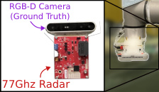

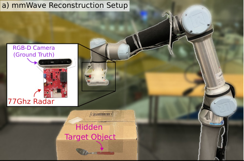

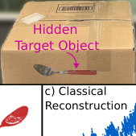

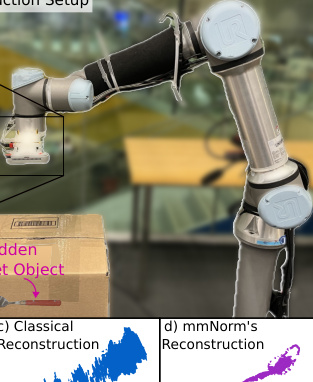

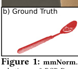

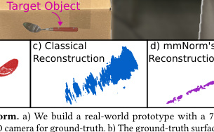

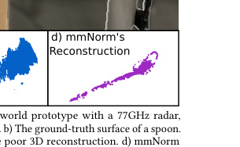

achieves high accuracy reconstructions.
leverage non-line-of-sight reconstructions to find and manipulate
hidden objects, such as those beneath clutter or within a closed box.
Similarly, Augmented Reality (AR) devices could leverage them
to perceive occluded objects and display them to the user, truly
augmenting our human perception. Smart home devices can use
them for NLOS gesture recognition, to enable non-verbal commands
even when users are hidden from view.
However, enabling these applications requires accurate 3D objectlevel reconstructions. For example, robots rely on precise 3D reconstructions to reason about complex interactions with the environment, and execute successful manipulation tasks (e.g., grasping,
pushing, etc). Additionally, more representative object reconstructions would significantly improve AR user experience. Furthermore,
smart home devices would require precise reconstructions to identify small differences between gestures and execute the corresponding commands.
Unfortunately, existing approaches for mmWave-based 3D object
reconstruction cannot deliver on these applications due to their
low accuracy. To see why, it is helpful to first understand a typical
mmWave reconstruction output in a real-world setting, such as
the one shown in Fig. 1. Here, we attached a commercial mmWave
radar to a robotic arm, [1] as shown in Fig. 1a, and used an RGB-D
camera to provide the ground truth. [2] Fig. 1b shows the groundtruth point cloud in red, and Fig. 1c shows a standard mmWave

1The robotic arm moves the mmWave radar to construct a synthetic aperture radar,
similar to prior work[6, 18].
2While the mmWave image is collected in NLOS, to capture the ground truth, we
remove the occlusion to capture an RGB-D image in line-of-sight.

MobiSys ’25, June 23–27, 2025, Anaheim, CA, USA Laura Dodds, Tara Boroushaki, Kaichen Zhou, Fadel Adib

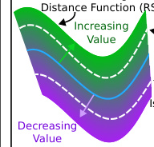

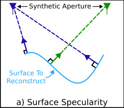

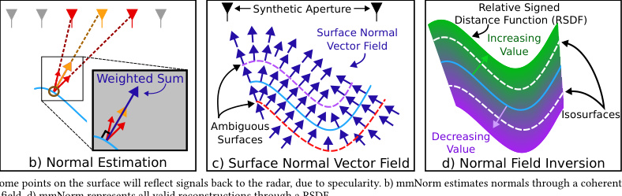

point cloud reconstruction in blue[18]. Here, the classical mmWave define an object’s curvature). For example, in Fig. 2a, when measurreconstruction approach does not accurately represent the surface ing the response from the surface (shown in light-blue), the antenna
geometry. For example, the classical reconstruction contains points location on the left (shown in the dark-blue) will primarily receive
spread across a wide volume in space. In fact, the reconstruction reflections from the two points on the surface where the normal
covers a volume almost twice the size of the original object. This (shown by dark blue arrows) points directly towards the antenna.
poor level of reconstruction would, for example, make it difficult for Other points on the surface will mostly reflect signals away from
a robot to plan successful grasps for this object, since it is difficult that antenna’s location. In another example, the antenna location
to identify the location of the handle. shown in green will receive responses from a different point on the
The reason why existing approaches are limited is inherent to surface (shown by the green arrow).
how they perform 3D reconstruction. Specifically, the vast majority Using this core insight, we design mmNorm to estimate surface
of existing approaches start by leveraging a raytracing-based imag- normals and use these to directly estimate the object’s curvature.
ing algorithm (such as backprojection [79] or the range-migration At the heart of its method is the following fundamental observation:
algorithm [24, 67]) to generate a 3D mmWave image. Then, this each point on the object’s surface has a surface normal that is diimage is directly used to generate an occupancy distribution. For ex- rected toward the antenna position receiving that point’s strongest
ample, to create object point clouds, it is common to select all voxels reflection. mmNorm’s goal is to solve the inverse problem to this
in the 3D mmWave image above a certain power threshold[7, 18, 23], observation. To do so, its method introduces the following three
as we demonstrated in the example above. techniques:
Unfortunately, this approach is limited by the available band- _1. mmWave Surface Normal Estimation._ First, mmNorm aims to eswidth of the mmWave radar. Since commercial mmWave radars timate the surface normals of the object through a coherent filter
have a bandwidth of at most about 4GHz [3], their depth resolution using mmWave reflections. Let us explain this method using the
is limited to ∼4cm, which leads to a corresponding distortion in illustration shown in Fig. 2b. The figure shows an object’s surface
occupancy-distribution based point clouds. This is why, in the above in light blue, and the brown circle highlights the point for which we
example, the reconstruction is smeared in the depth (vertical) di- will estimate the surface normal vector. We start by constructing
mension. While this resolution is sufficient for reconstructing large "candidate" surface normals from this point towards each radar
objects, such as buildings or vehicles[7, 23, 56], it is not sufficient for location. Then, we allow different radar locations to "vote" on the
applications that require object-level 3D reconstruction. For exam- direction of the normal based on the reflections received at that
ple, a pick-and-place robot requires sub-cm reconstruction quality location. For example, the orange radar location receives a strong
to reliably grasp an object, such as a tool, bottle, or utensil[63]. reflection from this point, so it will cast a strong vote shown by the
In this paper, we depart from this classical approach, and propose orange arrow. In contrast, the red radar locations receive weaker
mmNorm, a fundamentally new method for mmWave 3D object reflections and therefore will cast weaker votes. Finally, we geometreconstruction. Let us first see the benefit of our method through rically combine these votes to produce a final normal estimate, as
a real-world result in Fig. 1d. Here, our reconstruction (purple) shown by the dark blue arrow. Since this method is applied to every
closely matches the ground-truth and significantly outperforms the point in 3D space, not just points on the surface (as their locations
classical method. are unknown a priori), it results in a normal vector field like that
Our key idea behind mmNorm’s design is that, instead of estimat- shown by the dark blue arrows in Fig. 2c. We describe this method,
ing occupancy distribution from ray tracing, we directly estimate including how we design a coherent filter to produce each radar’s
the object’s curvature, then use this to generate a high-accuracy 3D "vote", in more details in §2.
reconstruction. We explain our high-level approach through Fig. 2. _2. mmWave Normal Field Inversion._ Next, mmNorm aims to invert
First, to estimate an object’s curvature, we rely on the fact that most the field to produce the surface geometry. However, each vector field
objects exhibit primarily specular (i.e., mirror-like) reflections at defines multiple possible surfaces. For example, Fig. 2c shows two
mmWave frequencies[42]. This creates a relationship between the example surfaces in red and purple which are valid reconstructions
radar’s received reflections and the object’s surface normals (which defined by the vector field, but are far from the ground-truth surface

3The bandwidth is typically limited by government regulations. While some work has
investigated reconstruction with larger bandwidths, these systems are restricted to
non-commercial or government use[16].

define an object’s curvature). For example, in Fig. 2a, when measuring the response from the surface (shown in light-blue), the antenna
location on the left (shown in the dark-blue) will primarily receive
reflections from the two points on the surface where the normal
(shown by dark blue arrows) points directly towards the antenna.
Other points on the surface will mostly reflect signals away from
that antenna’s location. In another example, the antenna location
shown in green will receive responses from a different point on the
surface (shown by the green arrow).
Using this core insight, we design mmNorm to estimate surface
normals and use these to directly estimate the object’s curvature.
At the heart of its method is the following fundamental observation:
each point on the object’s surface has a surface normal that is directed toward the antenna position receiving that point’s strongest
reflection. mmNorm’s goal is to solve the inverse problem to this
observation. To do so, its method introduces the following three
techniques:
_1. mmWave Surface Normal Estimation._ First, mmNorm aims to estimate the surface normals of the object through a coherent filter
using mmWave reflections. Let us explain this method using the
illustration shown in Fig. 2b. The figure shows an object’s surface
in light blue, and the brown circle highlights the point for which we
will estimate the surface normal vector. We start by constructing
"candidate" surface normals from this point towards each radar
location. Then, we allow different radar locations to "vote" on the
direction of the normal based on the reflections received at that
location. For example, the orange radar location receives a strong
reflection from this point, so it will cast a strong vote shown by the
orange arrow. In contrast, the red radar locations receive weaker
reflections and therefore will cast weaker votes. Finally, we geometrically combine these votes to produce a final normal estimate, as
shown by the dark blue arrow. Since this method is applied to every
point in 3D space, not just points on the surface (as their locations
are unknown a priori), it results in a normal vector field like that
shown by the dark blue arrows in Fig. 2c. We describe this method,
including how we design a coherent filter to produce each radar’s
"vote", in more details in §2.
_2. mmWave Normal Field Inversion._ Next, mmNorm aims to invert
the field to produce the surface geometry. However, each vector field
defines multiple possible surfaces. For example, Fig. 2c shows two
example surfaces in red and purple which are valid reconstructions
defined by the vector field, but are far from the ground-truth surface
shown in light blue. Thus, it is infeasible to directly recover a
single surface from the vector field. To address this, our next step is
_mmWave Normal Field Inversion_ . Here, we adapt a technique from

Non-Line-of-Sight 3D Object Reconstruction via mmWave Surface Normal Estimation MobiSys ’25, June 23–27, 2025, Anaheim, CA, USA

**Figure 3: Specular reflection.** Only some
points reflect signals back to radar.

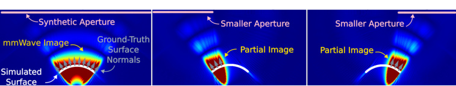

**Figure 4: The Surface Normal to mmWave Image Relationship.** The mmWave image will only contain the portion of the
surface with normals pointing within the aperture.

computer vision called Signed Distance Function. Specifically, we
design a _Relative_ Signed Distance Function (RSDF), which enables
us to model all possible reconstructions as isosurfaces [4] of a single
3D implicit function. We show an example of this function with
the color gradient in Fig. 2d. In §3, we describe how we adapt this
technique to our problem domain to invert the mmWave vector
normal field by accounting for the RF and geometric characteristics
of the mmWave field.
_3. mmWave Structural Isosurface Optimization._ The final step of
mmNorm’s design aims to select the optimal isosurface. This technique overcomes the aforementioned surface ambiguity by evaluating how well different candidate isosurfaces correspond to our
received signals. To do this, for a given isosurface, it simulates the
signal that would be reflected from that surface to each radar location. Then, it formulates a cost function as the difference between
these simulated signals and actual received signals. By optimizing
across cost, it can identify optimal isosurfaces, as we detail in §4.
We built an end-to-end prototype of mmNorm, consisting of a
TI IWR1443Boost radar attached to a UR5e robot arm. The robot
moves the radar to produce a 2D synthetic aperture above the target
object. We evaluate the 3D surface reconstruction across over 60
objects in the YCB dataset[8], a common robotic-manipulation
dataset of everyday objects. We include results in both line-of-sight
and non-line-of-sight. Our empirical evaluation demonstrates that:

- mmNorm achieves 96% reconstruction accuracy (3D F-score),
compared to 78% for the best-performing baseline.

- By zooming in on individual points, our evaluation shows that
in the best-performing baseline, only 44% of the points have
less than 5% reconstruction error (displacement error relative to
object’s size), in contrast to 85% for mmNorm.
**Contributions:** This paper presents mmNorm, a first-of- its-kind
method for mmWave-based 3D object reconstruction, which operates using surface normal estimation. It introduces multiple innovations, including _mmWave Surface Normal Estimation_, _mmWave_
_Normal Field Inversion_, and _mmWave Structural Isosurface Optimiza-_
_tion_ . Finally, the paper also contributes an end-to-end prototype
and real-world evaluation, which demonstrates its accuracy and
robustness.
In reflecting on these results, one might wonder how mmNorm
achieves such high-accuracy reconstruction without additional
bandwidth. In backprojection-based reconstruction, there is a direct relationship between the available bandwidth and the resulting
resolution. In contrast, mmNorm operates in a different subspace.
The mathematical derivation of this subspace, and the theoretical
limitations of mmNorm is an interesting avenue for future work.
The code, dataset, and a video demonstration are available here:

[https://github.com/signalkinetics/mmNorm](https://github.com/signalkinetics/mmNorm)

4An isosurface is a surface where the value of a 3D function is constant.

**2** **mmWave Surface Normal Estimation**
The first step of mmNorm’s reconstruction pipeline is to directly
estimate an object’s surface normal vector field from mmWave
reflections. In this section, we first describe the underlying relationship between the object’s surface normal, the radar location, and
the resulting mmWave image. Then, we describe how we leverage
this relationship when designing our mmWave surface normal field
estimation algorithm.

**2.1** **The Normal to Image Relationship**
To understand the impact of an object’s surface normals on its
mmWave image, it is helpful to understand how the mmWave image
is obtained in the first place. Typical mmWave imaging systems
leverage the concept of synthetic aperture radar [37, 43]. In these
systems, a radar is moved through space to collect measurements
from different locations, which together form a "synthetic aperture".
At each location in the synthetic aperture, a radar transmits a signal,
which reflects off the object and is received back at the radar.
However, the radar will not receive reflections from all points on
the object’s surface. This is because, at mmWave frequencies, most
objects exhibit primarily specular (i.e., mirror-like) reflections [42],
where the angle of incidence is equal to the angle of reflection. [5] This
phenomenon can be seen through Fig. 3, where we demonstrate it
in 2D for simplicity. Here, we show one radar location within the
synthetic aperture in black. First, we consider a signal transmitted
along the purple line. In this case, the signal will reflect off the
light-blue object and away from the radar (due to specularity),
preventing the radar from ever receiving this reflection. Next, we
consider a signal transmitted along the red line. In this case, the
signal is reflected back to the radar, allowing the radar to properly
receive the reflection. This is because this portion of the surface
has a normal, shown by the red arrow, which is directed towards
the radar. Thus, the radar will only receive reflections from the
portions of the surface where the normal points directly towards
the radar.
This phenomenon creates a relationship between the radar locations, the object’s surface normal, and the resulting mmWave image.
We demonstrate this through an example in Fig. 4. Here, we show
the cross-section view of a simulated mmWave image, where the
simulated aperture is shown by the pink line, the simulated surface
is shown by the white line, and the surface’s ground truth normal
vectors are shown by the gray arrows. We simulated the received
reflections at each radar location using a standard free-space path
loss simulation[71, 72, 80], and produced a mmWave image using
the standard near-field backprojection algorithm[79]. The heatmap

5A surface is considered electromagnetically smooth if the surface height variations are
less than 8 cos _𝜆_ ( _𝜃𝑖_ ) [, where] _[ 𝜃][𝑖]_ [is the incident angle [][52][]. For a 77 GHz system, surfaces]
exhibit diffuse scattering reflections when surface height variations are >0.49mm,
which is very rough to human touch.

MobiSys ’25, June 23–27, 2025, Anaheim, CA, USA Laura Dodds, Tara Boroushaki, Kaichen Zhou, Fadel Adib

Total

**Figure 5: mmWave Normal Estimation.** mmNorm estimates normal vectors by a) constructing candidate
vectors, b) weighting them via a coherent filter, and c) combining them through a weighted sum

shows the magnitude of the resulting mmWave image, where red
and blue represents areas of high and low reflection power, respectively. In the first example in Fig. 4a, the full surface is contained
within the red region of the image. This is because all of the surface’s normal vectors point within the aperture, so reflections from
every portion of the surface can be received from at least one radar
location. Next, we show two more examples in Fig. 4b/c, where
we image the same surface with a smaller portion of the aperture.
Here, only a small portion of the surface is within the red region.
This is because these sub-apertures only receive reflections from
the portions of the surface where the normal vectors are pointing
within the sub-aperture, and all other portions of the surface reflect
signals away (due to specularity).
Based on these results, we can now understand the following
two key points about the relationship between the mmWave image
and the object’s surface normals:

- If we incorporate measurements only from a small sub-aperture
in the imaging, we will only see part of the surface – i.e., other
parts entirely disappear as we see in Fig. 4b/c.

 - The portion of the surface that can be seen in the mmWave image
depends on the normals – i.e., we will only see the portion with
normals pointing towards the sub-aperture.
These observations reveal the relationship between the normal
vector, radar location, and mmWave image value.
Note, however, that the mmWave image alone is not enough to
reconstruct the surface. This is because while the surface (white)
lies within the red region in the mmWave image of Fig. 4a, the
red region covers a much larger area than the surface itself (due to
limited bandwidth). This necessitates a more sophisticated approach
for surface normal estimation.

**2.2** **mmWave Normal Field Estimation**
Next, we describe how we can leverage the above relationship to
design a surface normal estimation algorithm.
To start, we consider a single voxel in 3D space. If we draw a
straight line between the voxel and each radar location, we would
trace out different candidate normals vectors. Then, if we can identify which radar locations contributed the most to this voxel’s
mmWave image value, [6] we can combine their candidate vectors
to form our final estimate of the surface normal at that point. The
question becomes: how do we identify the radar locations that
contribute most?
To answer this question, we break each voxel’s mmWave image
value down into the components that result from each individual
radar location within the aperture. We then allow each radar location to "vote" on the direction of the surface normal based on how

6Here, the mmWave image refers to one similar to that of Fig. 4.

cally combining the votes, we can estimate the surface normal.
We explain how our method estimates the normal at a given
voxel _𝑣𝑖_, using Fig. 5 as an example. The figure depicts an example
scenario, where an object surface is shown in blue, and the given
voxel is outlined in brown. We describe our method through the
following three steps:
(1) First, we construct a set of candidate normal vectors. For example, Fig. 5a shows the candidate vectors as black arrows,
where each candidate is a unit vector pointing from the voxel
towards one radar location (shown in gray) within the synthetic
aperture. Formally:

_𝑝_ _𝑗_               - _𝑣𝑖_
u _𝑖,𝑗_ = (1)
|| _𝑝_ _𝑗_                           - _𝑣𝑖_ ||

where _𝑢𝑖,𝑗_ is the candidate unit normal vector pointing from
voxel _𝑣𝑖_ to the j [th] radar location _𝑝_ _𝑗_ .
(2) Next, we allow each radar location to "vote" on the correct surface normal. We do so by using the received signal from each
radar location to assign a weight to its associated candidate vector. This is shown in Fig. 5b, where the colored arrows represent
the weighted candidate vectors. Vectors in the direction of the
surface normal will have a large weighting, such as the orange
vector. We describe our method for calculating this weighting
function in §2.2.1. Formally, our weighted candidates are:

r _𝑖,𝑗_ = _𝑤𝑖,𝑗_ u _𝑖,𝑗_ (2)

where _𝑟𝑖,𝑗_ is the j [th] weighted candidate vector for voxel _𝑣𝑖_ . _𝑤𝑖,𝑗_
is the weighting value for the j [th] radar location.
(3) Finally, we compute the final surface normal estimate as the
weighted sum of all candidate vectors, as shown by the blue
arrow in Fig. 5c. Formally:

where ˆ _𝑛𝑖_ is the (normalized) surface normal vector estimate,
and A is the number of radar locations.
By applying the above process for each voxel in 3D space, we
estimate the full surface normal vector field of the object.
_2.2.1_ _mmWave Candidate Weighting Function._ Next, we describe
how we compute the weighting values for different candidate vectors of a given voxel (i.e., step 2 above). At a high level, our weighting values depend on a coherent filter which we design to identify
how much each radar location contributes to the final mmWave
image value at this voxel.
To understand our filter design, it is helpful to first understand
how the mmWave image is created. Consider a mmWave image
which is constructed using the standard near-field backprojection

1
nˆ _𝑖_ =

|| ~~[�]~~ _[𝐴]_ _𝑗_ =1 [r] _[𝑖,𝑗]_ [||]

_𝐴_
∑︁

r _𝑖,𝑗_ (3)
_𝑗_ =1

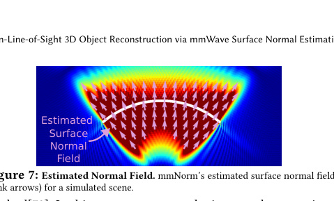

voxel, the algorithm first computes individual values from each
radar location. It does so by correlating each received signal with
the appropriate round-trip distance to the voxel. Formally, since
mmWave radars typically leverage frequency-modulated continuous waves (FMCW), we apply a wide-band correlation as:

|Col1|Col2|A|
|---|---|---|
||||

_𝐼_ _𝑗_ ( _𝑣𝑖_ ) =

_𝑇_
∑︁

∑︁

_ℎ_ _𝑗_ ( _𝑡_ ) _𝑒_ _[𝑗]_ [2] _[𝜋]_ [(][2][||] _[𝑝]_ _[𝑗]_ [−] _[𝑣][𝑖]_ [||)/] _[𝜆][𝑡]_ (4)
_𝑡_ =1

where _𝐼_ _𝑗_ ( _𝑣𝑖_ ) is the complex value of _𝑣𝑖_ for the j [th] individual radar
location. _𝜆𝑡_ is the wavelength of the t [th] sample (out of _𝑇_ ) in the
FMCW chirp, _ℎ_ _𝑗_ ( _𝑡_ ) is the t [th] sample of the time-domain baseband
received signal from the j [th] radar location.
Then, the final complex voxel value, _𝑆_ ( _𝑣𝑖_ ), is computed as the
sum across all the values from individual radar locations:

Surface

**Figure 8: Surface Ambiguity.** The vector field (green arrows) for a ground-truth
surface (black) can represent multiple surfaces (red & purple).

presented earlier (in Fig. 4a). [7] Here, the direction of the estimated
vectors closely match the object’s curvature, showing the success
of our proposed approach.
A few additional points are worth noting:
_Generalizing to Non-Specular Reflections:_ While our explanation thus
far has relied on the fact that surfaces exhibit primarily specular
reflections, our method still applies to cases with some level of
diffuse scattering. For mmWave frequencies, diffuse reflections
from many surfaces can be modeled with the directive model[4, 49],
where the reflection power is symmetric around the specular angle,
but spread across a range of angles. This model applies to many
common materials spanning concrete, drywall, and marble [4, 49].
When the reflected power is symmetric around the specular angle,
two weighted candidate vectors on opposite sides of the surface
normal will still sum to the direction of the normal. For example,
in Fig. 5b, the two red vectors sum to the direction of the object’s
normal. This allows directive diffuse reflections to further reinforce
our normal estimate.
_Behavior of Weighting Function:_ For radar locations which are not
in the direction of the surface normal (e.g., the green & purple radar
locations in Fig. 5b), the projection magnitudes are not always low.
At first glance, this might appear to be an issue, since the large
projection magnitudes would result in strongly weighted (and incorrect) candidate vectors, which one would expect to distort the
final normal estimate. However, it can be shown that the projection
magnitudes for radar locations far from the normal direction oscillate, producing both positive and negative weights. This causes
these weighted candidate vectors to point in opposite directions.
Thus, they cancel when summed together, preventing these radar
locations from influencing the final normal estimate.
_Non-Uniform Object Properties:_ At first glance, it may appear that
mmNorm requires the object to exhibit uniform properties (e.g.,
material, reflection power, etc) across the object surface. However,
this is not the case. It is important to note that mmNorm is not
solving the problem, “for a given radar location, which point on
the surface produces the strongest reflection?", but the inverse,
“For a given point on the surface, which radar location receives
the strongest reflection?" For example, in Fig. 5, we compare the
response at a single point on the surface (the brown voxel) across
all radar locations. Thus, relative changes across the surface of the
object have minimal impact. We demonstrate mmNorm’s ability to
reconstruct objects with variable properties (e.g., multiple materials)
in §6.
**3** **mmWave Normal Field Inversion**
Now that we have described mmNorm’s approach to estimating
a surface normal field we can move on to inverting this field to

7We only show the portion of the estimated vector field which lies within the highpower (red) region of the mmWave image, since other locations suffer poor signal-tonoise ratio and thus poor normal estimation accuracy.

_𝑆_ ( _𝑣𝑖_ ) =

_𝐴_
∑︁

_𝐼_ _𝑗_ ( _𝑣𝑖_ ) (5)
_𝑗_ =1

Now, the goal of our filter is to determine how much each individual voxel value, _𝐼_ _𝑗_ ( _𝑣𝑖_ ), contributed to the final complex sum,
_𝑆_ ( _𝑣𝑖_ ). To do so, we project the individual voxel values onto the
computed sum, _𝑆_ ( _𝑣𝑖_ ). We show two examples in red and purple in
Fig. 6, which plots the complex values as vectors on the IQ plane. It
is important to note that these vectors represent complex values,
and not the direction of a candidate surface normal vectors. The
final mmWave voxel value ( _𝑆_ ( _𝑣𝑖_ )) is shown as the blue vector. First,
we consider an antenna which is in the direction of the surface
normal Since it received a strong reflection from this voxel, it’s
complex value (red) will contribute strongly to the sum, and thus
will point in a similar direction as the sum. Therefore, its projection
onto the sum (the dotted red arrow) will have a large magnitude.
Next, we consider an antenna not in the direction of the normal.
It will not receive a strong reflection from this voxel, and thus its
value will not be related to the sum. Here, its complex value (purple)
will point in a different direction, and its projection magnitude will
be low.
Using this intuition, we define our weighting function for the
candidate unit vectors to be the magnitude of the projection of
individual voxel values onto the final sum. Formally:

_𝑤𝑖,𝑗_ = [ℜ{] _[𝐼]_ _[𝑗]_ [(] _[𝑣][𝑖]_ [)}ℜ{] _[𝑆]_ [(] _[𝑣][𝑖]_ [)} + ℑ{] _[𝐼]_ _[𝑗]_ [(] _[𝑣][𝑖]_ [)}ℑ{] _[𝑆]_ [(] _[𝑣][𝑖]_ [)}] (6)

|| _𝑆_ ( _𝑣𝑖_ )||

where ℜ{·} and ℑ{·} are the real and imaginary components of a
complex number, respectively.

We can then use this weighting function to compute the final
normal estimate, as described previously, using Eqs. 1- 3.
Finally, we repeat this process for each voxel to estimate the full
surface normal vector field. Fig. 7 shows an example of mmNorm’s
estimated normal field (as pink arrows) for the simulated scene we

MobiSys ’25, June 23–27, 2025, Anaheim, CA, USA Laura Dodds, Tara Boroushaki, Kaichen Zhou, Fadel Adib

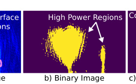

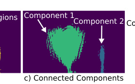

recover the surface.
**3.1** **The Surface Ambiguity Problem**
Typically, one can convert an object’s surface normals to the object
shape by finding the surface that is perpendicular to every normal
vector. However, when given a normal vector field, there are multiple such surfaces. We show this through an example in Fig. 8. Here,
we show a ground-truth surface in black, and its normal vector
field as green arrows. Based on this visualization, it becomes clear
that we can construct multiple possible surfaces for this vector
field, such as the two examples in red and purple. Each of these
surfaces is perpendicular to the normal vectors within this field,
and is therefore a valid possible surface.

**3.2** **Relative Signed Distance Function**
To address this, our idea is to generate an implicit function capturing
all possible surfaces, and in §4 we will describe how we optimize
across this function to find the final surface.
To capture the object’s shape, we design an implicit function similar to a signed distance function (SDF) from the computer graphics
and vision community[65]. An SDF is a 3D function which defines,
at each point in space, the distance from this point to the nearest
point on the object’s surface. Typically, an SDF is zero on the object’s surface, positive outside the surface, and negative inside the
surface.
In our case, since we cannot identify the object’s surface directly,
we cannot find the exact SDF. Instead, we define a new implict
function called a Relative Signed Distance Function (RSDF), which
is an SDF that is offset by an unknown constant. For example, Fig. 2d
shows an example of a 2D cross-section of an RSDF function as a
color gradient, where brighter green represents increasing values,
and brighter purple represents decreasing (negative) values.
Unlike a standard SDF, where the object’s surface is defined by
the zero level-set, the RSDF cannot be used to directly identify the
object’s surface. Instead, we will use the RSDF to define all possible
ambiguous surfaces through its different isosurfaces. An isosurface
is a 3D surface where a function is the same value across the whole
surface[65]. For example, Fig. 2d shows two example isosurface
cross-sections as white lines. For each of these lines, the color (and
therefore RSDF value) is constant across the whole line. Due to the
construction of the RSDF, this means that each isosurface is one
valid reconstruction for the given normal vector field.
To generate our RSDF, we rely on the fact that a normal vector
field is the gradient of the SDF[31]. Thus, we can generate an RSDF
via a surface integral over our vector field. This integral will be
offset from the standard SDF, since we do not know where within
the integral the zero level-set is.
Next, we formalize how to compute this surface integral. We will
approximate the integral as a discrete summation, since our vector

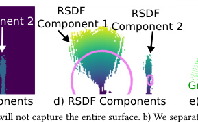

field is defined along discrete voxels. To start we choose a voxel,
_𝑣_ 0, to act as a starting point. We assign the RSDF at this voxel to
0, and will compute remaining RSDF values relative to this voxel.
Formally, the RSDF _𝑓_ _[𝑅]_ at _𝑣_ 0 is:

_𝑓_ _[𝑅]_ ( _𝑣_ 0 ) = 0 (7)

Next, to compute the RSDF value at another voxel _𝑣𝑖_, we first find
a path of voxels from _𝑣_ 0 to _𝑣𝑖_ . Then, we apply a discrete summation
along this path to find the RSDF at _𝑣𝑖_ .

∑︁
_𝑓_ _[𝑅]_ ( _𝑣𝑖_ ) = ( ˆnk · dk ) + _𝑓_ _[𝑅]_ ( _𝑣_ 0 ) (8)

_𝑘_ ∈ _𝑃_

where _𝑃_ is a path of voxels connecting _𝑣_ 0 to _𝑣𝑖_, and dk is the vector
along the path P, pointing from voxel _𝑣𝑘_ −1 to _𝑣𝑘_ . [8]

Now, the absolute SDF, _𝑓_, is a constant offset, _𝐶_, from _𝑓_ _[𝑅]_ :

_𝑓_ ( _𝑣𝑖_ ) = _𝑓_ _[𝑅]_ ( _𝑣𝑖_ ) − _𝐶_ (9)

Now, all possible surfaces are captured as different isosurfaces
within _𝑓_ _[𝑅]_ ( _𝑣𝑖_ ) (or _𝑓_ ( _𝑣𝑖_ )). Furthermore, the problem of finding the
correct surface can be reduced to finding the proper offset constant
_𝐶_, and then taking the zero level-set of the final SDF as the object
surface estimate.
_3.2.1_ _Dealing with Complex Surfaces._ So far, our discussion has
focused on scenarios where the object exposes a single surface
curvature. For example, the top side of a box facing the mmWave
radar consists of one flat surface, while a cylinder exposes one
continuous, curved surface. However, many objects contain more
complex curvatures. For example, a spatula contains multiple surface components: one rounded portion for the handle and one flat
portion for the flipper.
This becomes a problem if we cannot capture the full normal
vector field connecting these different surface components. For
example, recall from §2.1 that a synthetic aperture is only capable
of capturing reflections from portions of the surface whose normal
vectors point within the aperture. Therefore, if there is a portion
of the spatula’s handle, for example, which has normals pointing
outside the aperture, there will be gaps within our estimated normal vector field. This creates a problem when recovering the full
surface, since the relative change in the surface within that missing
component will not be recovered. It also creates a discontinuity in
the normal vector field which is difficult to invert.
To address this challenge, we leverage the original mmWave
image to identify different captured portions of the object and
compute the RSDF for each independently. Here, it is important to
recall that the mmWave image, such as the one shown in Fig. 4, does
not have enough resolution for surface reconstruction, but often has
more than enough information to localize different portions of the

8We compute this with dynamic programming.

Non-Line-of-Sight 3D Object Reconstruction via mmWave Surface Normal Estimation MobiSys ’25, June 23–27, 2025, Anaheim, CA, USA

objects. We realize the above approach by identifying contiguous
areas of the surface as the areas of high reflection power in the
image.
We explain our method through an example in Fig. 9, which
contains results from a real-world, non-line-of-sight experiment
for different stages our our method. Here, we consider 2D cross
section of a mug on its side with two separate surface components:
one large, curved surface for the cup, and one small surface for the
handle. Fig. 9a shows the ground-truth surface as a pink line, and
the initial mmWave image as a heatmap. As described previously,
the mmWave image does not capture the full object. This is shown
in the region circled in white, which appears dark blue in the image.
Our approach to overcome this is composed of three steps:

(1) First, we convert the mmWave image into a binary image. We
assign all voxels above a threshold to 1, and all voxels below
the threshold to 0. This can be seen in Fig. 9b, where the purple/yellow regions indicates 0/1. Here, there are two main yellow regions corresponding to the two different surface portions
of the object. Formally,

match the real-world received reflections. Our approach follows
three key steps:

(1) To start, we simulate the received reflections from a given set of
isosurfaces (e.g., one isosurface per RSDF component). We do
so by first using standard ray-tracing to find reflection points
along the isosurface in each RSDF component[31]. Then, we
apply a standard free-space path loss simulation[72] to compute
the total received signal at a given radar location. Formally:

∑︁

_𝑟_ ∈ _𝑅𝑛_ ( _𝐶𝑛_ )

1
(11)
_𝑑𝑟_ ( _𝐶𝑛_ ) _[𝑒]_ [−] _[𝑗]_ [2] _[𝜋𝑑][𝑟]_ [(] _[𝐶][𝑛]_ [)/] _[𝜆][𝑡]_

_ℎ_ ˆ _𝑗_ ( _𝑡,_ C) =

_𝑁_
∑︁

_𝑛_ =1

where _ℎ_ [ˆ] _𝑗_ ( _𝑡,_ C) is the t [th] sample of the estimated time-domain
received signal from the j [th] radar location for the isosurfaces
defined by the constants C. _𝑅𝑛_ ( _𝐶𝑛_ ) is the set of rays from the
ray tracing which intersect with the n [th] RSDF isosurface _𝑑𝑟_ ( _𝐶𝑛_ )
is the round-trip distance along ray _𝑟_ . _𝑁_ is the number of RSDF
components.
(2) Next, we aim to evaluate how well these simulated signals
match the real-world received signals. To do so, we formulate
a cost function, _𝐿_ ( _𝐶_ ), which takes the difference between the
simulated and actual signals: [10]

_𝑚_ ( _𝑣𝑖_ ) =

1 if | _𝑆_ ( _𝑣𝑖_ )| _> 𝜏_
(10)
0 else

where _𝑚_ ( _𝑣𝑖_ ) is the binary image, and _𝜏_ is the threshold. [9]

(2) Next, we find connected components within the binary image.
This can be seen in Fig. 9c, where the blue and teal regions
indicate two different components, which each correspond to
one portion of the object’s surface. To find these components,
we can leverage a standard breadth-first-search (BFS) [32].
(3) Finally, we compute a separate RSDF across each connected
component. The output from this step can be seen in Fig. 9d,
where the color gradients represent the RSDF components.
Lighter colors indicate larger values and darker colors indicate smaller RSDF values.
When we apply the above approach, we will be left with multiple
different unknown constants, one for each RSDF component. Then,
identifying the proper isosurfaces can be reduced to the problem
of finding the vector of constants C = { _𝐶_ 1 _, ...,𝐶𝑛, ...,𝐶𝑁_ }, and selecting the zero-level set of each SDF component to estimate each
object surface component.

**4** **Structural Isosurface Optimization**
To overcome the surface ambiguity problem, we are inspired by
work in the computer vision and graphics community on imaging
and rendering[31, 65], where the goal is to derive a 3D scene from
a 2D image. In these systems, rather than attempting to directly
solve the inverse problem (e.g., directly estimating the 3D scene),
they instead optimize the scene through different forward models.
For example, they construct a 3D scene, simulate its 2D image, and
compare it to the target image. Then, they can iteratively update
the scene parameters until it properly matches the target image.
We adapt this technique to solve the mmWave isosurface ambiguity problem. Specifically, we construct different isosurfaces from
each of our RSDF components. Then, we simulate the radar signal
which would be reflected from each of the candidate isosurfaces,
and compare it to the actual received signals. Then, we select the
optimal isosurfaces as the ones whose simulated reflections best

9In our implementation, we select _𝜏_ with the Li thresholding algorithm[38].

(3) Finally, we choose the isosurface with minimum cost:

Cˆ = arg min _𝐿_ (C) (13)
C

where C [ˆ] is the constant defining our estimated isosurface.
We show an example output of our optimization method for the
real-world example from Fig. 9. Fig. 9e shows the final 3D surface
reconstruction determined through Eq. 13 (red), and the 3D groundtruth (green) of a mug on its side. This example shows how our
optimization is able to select isosurfaces for each of the 2 RSDF
components to produce a reconstruction which closely matches the
ground truth.

One may wonder how this approach is able to successfully select
isosurfaces without simulating real-world factors such as noise,
surface reflectivity, etc. The reason why is similar to why SAR or
antenna array systems work well using the same model without
incorporating such factors.

**5** **Implementation & Evaluation**
**Physical Setup:** The physical setup, as shown in Fig. 1, includes
a UR5e robotic arm[62] with a wrist-mounted TI mmWave radar
(IWR1443Boost[3] and DCA1000EVM[2]), and a wrist-mounted
Intel Realsense depth camera (D415[29]). The radar is connected
to a computer running Windows 10 pro, which captures the data
for processing. The robotic arm moves the radars over a 2D grid
to create a synthetic aperture above the object. The robot scans at
∼0.1 m/s. We note that this scanning speed is primarily limited by
the time synchronization between the radar and the robot, and can
be improved in future, integrated systems. We move the radars in
an 60cmx45cm grid (which is large enough to ensure that objects
are contained entirely within the aperture), with the target object

10We choose to use the FFT, since there is a direct relationship between the FFT of an
FMCW signal and the distance to the isosurface[30]

_𝐿_ (C) =

_𝐴_
∑︁

|| | _𝐹𝐹𝑇_ ( _ℎ_ [ˆ] _𝑗_ ( _𝑡,_ C)) | −| _𝐹𝐹𝑇_ ( _ℎ_ _𝑗_ ( _𝑡_ )) | || (12)
_𝑗_ =1

MobiSys ’25, June 23–27, 2025, Anaheim, CA, USA Laura Dodds, Tara Boroushaki, Kaichen Zhou, Fadel Adib

placed roughly in the center. Our aperture forms a dense grid with
∼ _𝜆_ /4 spacing between the measurements to prevent aliasing. Our
radar collects 512 samples from 77.5GHz-80.5GHz. It has a 6 dB
antenna field of view of 100° (horizontal) and 40° (elevation). [11]

**Software:** To produce mmWave images, we used a standard nearfield backprojection implementation[79] in CUDA. We implemented
the processing described in §2- §4 in Python/ C++/CUDA on machines running Ubuntu 22.04 with Intel(R) Xeon(R) CPUs and
NVIDIA GeForce GTX 1080 GPUs. We compute each image with a
voxel size of 1 mm × 1 mm × 1 mm. We evaluate the isosurface optimization (Eq. 13) across isosurfaces sampled every _𝜆_ /2 ≈ 1 _._ 9 mm.
**Computational Complexity:** The computational complexity of
mmNorm’s normal estimation algorithm (§2) is _𝑂_ ( _𝑉_ × _𝐴_ ), where V
is the number of voxels and A is the number of antennas. This is similar to the standard backprojection algorithm [17], and is similarly
parallelizable. RSDF (§3) is implemented using a breadth-first search,
and thus has a runtime of _𝑂_ ( _𝑉_ ). Finally, mmNorm’s isosurface optimization (§4) is computed with a complexity of _𝑂_ ( _𝐶_ × _𝐼_ × _𝐴_ × _𝑅_ × _𝑇_ ),
where R is the number of rays used in raytracing, and I is the
number of candidate isosurfaces for each RSDF component. The
number of RSDF components, and number of candidate isosurfaces
per RSDF can be approximated as scalars (typically <4 and <60, respectively). Thus, the complexity of the optimization is dominated
by _𝑂_ ( _𝐴_ × _𝑅_ × _𝑇_ ). This isosurface optimization step is also highly
parallelizable.
**Evaluation Environment:** We evaluated mmNorm in a multipathrich indoor office setting, with tables, chairs, desks, etc. In our
experiments, there were people walking in the background, and
standard wireless interference (e.g., WiFi, Bluetooth, etc). For each
object, we ran experiments in line-of-sight and non-line-of-sight
(fully occluded by a layer of cardboard). The object is placed on
a surface ∼40cm below the aperture. To allow our evaluation to
focus only on target object reconstruction, we minimize background
reflections by placing objects on styrofoam[1].
**Object Selection:** Our evaluation covered 61 different everyday
objects from the YCB dataset [8], a common dataset of objects for
robotic manipulation. These objects span a wide diversity, including
complex objects with multiple surface components (e.g., mug, spatula), composite materials (e.g., power drill, utensils), sharp edges
(e.g., knife, scissors), varied curvatures (e.g., flat box vs marble), etc.
Furthermore, our objects include a wide variety of material types,
including wood, metal, cardboard, multiple types of plastic, rubber,
foam, and glass.
**Metrics:** _Point Error:_ This metric measures the error of a given
point within our reconstructions, by measuring the distance from
this point to its nearest neighbor in the ground-truth point cloud
( _𝑃𝐺_ ). Formally, point error _𝑃_ ( _𝑥𝑖, 𝑃𝐺_ ) is:

_𝑃_ ( _𝑥𝑖, 𝑃𝐺_ ) = min || _𝑥𝑖_         - _𝑥𝑔_ || (14)
_𝑥𝑔_ ∈ _𝑃𝐺_

where _𝑥𝑖_ / _𝑥𝑔_ are points in the reconstruction/ground-truth.
We aggregate this error across all points and experiments to
measure the overall reconstruction accuracy.
_Relative Point Error._ This metric measures the point error rela

11In practice, this field of view may limit the recoverable surface normals. We note that
future systems can overcome this by using spotlight SAR to point the radar towards
the scene, avoiding potentially unrecoverable normals.

tive to the object’s size Formally, this is defined as the point error
normalized by the diameter of the object:

_𝑅𝑃_ ( _𝑥𝑖, 𝑃𝐺_ _,𝑑𝐺_ ) = _[𝑃]_ [(] _[𝑥][𝑖][, 𝑃][𝐺]_ [)] x100% (15)

_𝑑𝐺_

where _𝑅𝑃_ ( _𝑥𝑖, 𝑃𝐺,𝑑𝐺_ ) is the relative point error, and _𝑑𝐺_ is the longest
distance between two points on the object.
_Shape Error (3D F-Score):_ We measure the similarity between the
reconstructed and ground-truth shapes with the standard 3D FScore[61], which balances precision (accuracy of predicted points)
and recall (coverage of ground truth points). A point is accurate if
it is within a threshold distance of the ground truth. Similarly, a
ground truth point is covered if it is within the threshold distance
of the reconstruction:

where _𝐹𝑆_, _𝑃𝑅_, _𝑅𝐸_, denote F-Score, precision and recall respectively.
1 is an indicator variable. _𝑃𝑚_ is the reconstructed point cloud. _𝜏_ is
the threshold distance. [12] F-Score ranges from 0 to 1, with 1 denoting
a high-accuracy reconstruction.
To evaluate only the difference in shape, we break down the total
error into shape error and position error (see below). The shape
error is obtained after subtracting the estimated position error as a
single translation applied to all points in the reconstruction.
_Position Error:_ We measure the vertical distance between the
ground truth and reconstructed point clouds. Formally, we take the
difference between the 80 [th] percentile height in reconstruction and
the 80 [th] percentile ground-truth height:

_𝑇_ ( _𝑃𝑚, 𝑃𝐺_ ) = |pcntl({ _𝑧𝑖_ | _𝑧𝑖_ ∈ _𝑃𝑚_ } _,_ 80) − pcntl({ _𝑧_ _𝑗_ | _𝑧_ _𝑗_ ∈ _𝑃𝐺_ } _,_ 80)|

where _𝑧𝑖_ and _𝑧_ _𝑗_ are the z (height) coordinates of points within _𝑃𝑚_
and _𝑃𝐺_, respectively. pcntl(· _,_ ·) is the percentile operator.
_Cosine Similarity:_ To measure our estimated normal accuracy, we
use the cosine similarity[44] to measure the similarity between
two vectors. Here, 1 represents perfectly aligned vectors, and 0
represents perpendicular vectors. [13] Formally:

_𝑆_ ( ˆni _,_ nj ) = | ˆni · nj | / (| ˆni ||nj |) (16)
where ˆni and nj are the estimated and ground-truth normals.
**Baselines:** We implemented two state-of-the-art baselines.
_Backprojection[18]:_ Our first baseline reconstructs a 3D mmWave
image of the object through standard backprojection imaging, and
then selects the voxels that exceeds a certain threshold relative to
the maximum image value. It uses the center of these voxels as
points to reconstruct a 3D point cloud of the object. We selected
the threshold which produces the highest median F-Score across
all objects.
_Interferometric[20]:_ This baseline iteratively produces 2D SAR
images of the target with small bandwidths, then compares the
change in phase across frequency to derive the object’s depth. Since
this method only estimates changes in depth, and requires a reference point to provide absolute depth, we offset the reconstruction

12In our implementation, _𝜏_ is 0.015m.
13Since a normal vector can point in two directions (into or out of the object), we
flip ground-truth normals to match the nearest direction of the estimates– e.g., two
opposite vectors (180° apart) have a cosine similarity=1.

_𝑁𝑚_
∑︁ 1 _𝑑_ ( _𝑥𝑖,𝑃𝐺_ ) _<𝜏_

_𝑖_ =1

1

_𝐹𝑆_ = [2] _[ 𝑃𝑅𝑅𝐸]_

_𝑃𝑅_ + _𝑅𝐸_ _[, 𝑅𝐸]_ [=] _𝑁𝐺_

_𝑁𝐺_ ∑︁ _𝑗_ =1 1 _𝑑_ ( _𝑥𝑗,𝑃𝑚_ ) _<𝜏_ _, 𝑃𝑅_ = _𝑁_ 1 _𝑚_

Non-Line-of-Sight 3D Object Reconstruction via mmWave Surface Normal Estimation MobiSys ’25, June 23–27, 2025, Anaheim, CA, USA

Multi-Object
Extension

|Isometric View|Top View|
|---|---|
|||
|||
|||
|||
|||

|Isometric View|Top View|
|---|---|
|||
|||
|||
|||
|||

|Isometric View Power|Top View r Drill|
|---|---|
|||
|||
|||
|||
|||

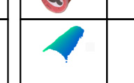

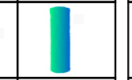

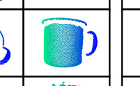

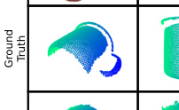

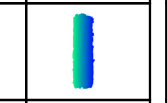

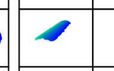

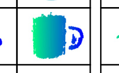

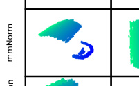

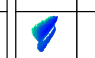

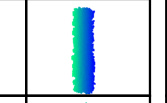

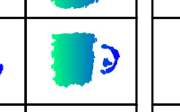

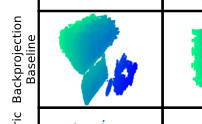

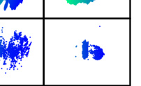

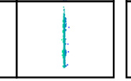

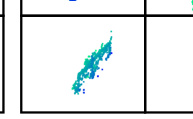

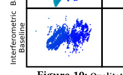

by the average height (depth) of the high-power regions in the
standard, 3D mmWave image.
**Ground Truth:** To obtain a ground-truth 3D reconstruction, we
used the Intel Realsense D415[29] depth camera on the robot wrist
to capture a depth image from directly above the object. [14] For
NLOS experiments, we first captured the depth image in line-ofsight before placing the occlusion. [15]

**6** **Results**
We report the results from 116 real-world experimental trials.
**6.1** **Qualitative Results**
First, we provide qualitative performance results for mmNorm and
the baselines across three of the NLOS experiments.
Fig. 10 shows the qualitative results, including the RGB (1st row),
ground truth point cloud (2nd row), mmNorm’s reconstruction (3rd
row), the _Backprojection_ baseline’s reconstruction (4th row), and the
_Interferometric_ baseline’s reconstruction (5th row). The color of the
points denotes the x coordinate of that point. To ensure consistency,
all point clouds in a column are plotted from the same angle. We
show experiments for a mug, chips can, and power drill, visualized
from both an isometric and top view. We note that:

 - Let us first consider the chips can (middle). Looking at the isometric view, we can see that mmNorm’s reconstructed surface
closely matches the ground truth in its curvature. In contrast, the
_Backprojection_ baseline vastly overestimates the voxels that correspond to the surface to the extent that one cannot identify that
it is curved altogether. Furthermore, the _Interferometric_ baseline

14For high optical specularity (e.g., a shiny spoon), the depth image may be noisy.
We align a ground-truth mesh (provided by YCB) to the depth image using Iterative
Closest Point, & use the top mesh surface as ground truth.
15A few experiments reconstructed the cardboard occlusion and the hidden object.
Since the occlusion is not in our ground-truth, we removed points above a set height,
corresponding to the occlusion (for mmNorm&baselines).

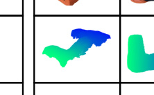

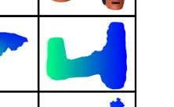

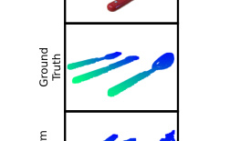

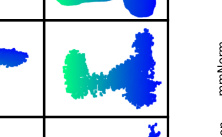

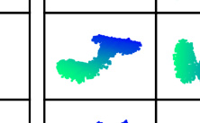

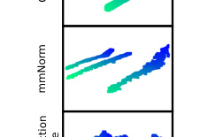

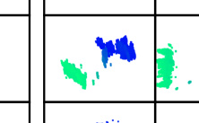

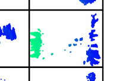

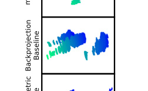

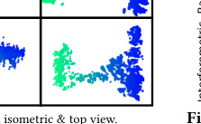

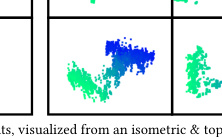

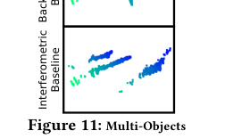

is very sparse, making it difficult to delineate the surface. [16] The
same can be seen in the isometric view of the mug, whereby
mmNorm succeeds in capturing the surface curvature, but both
of the baselines fail. These show how mmNorm significantly
outperforms the baselines in surface reconstruction.

- Let us next consider the top view of the mug. Here, we can
see that both mmNorm and the _Backprojection_ baseline closely
match the ground truth (with mmNorm slightly outperforming
the baseline). This is expected, since the synthetic aperture produces a high horizontal resolution, which allows for accurate
2D reconstruction in both mmNorm and the baselines. However,
when viewed from the side, the baseline will have points spread
across a large depth range due to the radar’s limited depth resolution, while mmNorm achieves accurate 3D reconstruction. On
the other hand, the _Interferometric_ baseline is again sparse.

- mmNorm can accurately reconstruct complex surfaces like the
mug and power drill. For example, it captures both the handle
and the curve of the mug, which has complicated surface normals.
This shows the benefit of mmNorm’s techniques for generating
reconstructions of objects with complex geometries.

- mmNorm also succeeds across various materials (metal, plastic,
cardboard, composite) and textures, as seen here.

_6.1.1_ _Extension to Multiple Objects._ Next, we demonstrate an extension of mmNorm for multiple objects. Here, we placed three
objects - a fork, knife, and spoon - in the environment. Fig. 11
shows results for mmNorm and the baselines. Here, mmNorm’s

16Here, the _Interferometric_ baseline is sparse since it applies a single threshold to
determine which voxels in the 2D image are considered within the object. The threshold
was selected to maximize the median & 90 [th] percentile performance of the baseline.
However, since our evaluation covers a large diversity of objects, some objects are
under-thresholded and thus contain fewer points. In other cases, objects such as the
power drill do not appear sparse (but still exhibit poor 3D reconstruction). A similar
phenomenon can be observed in the _Backprojection_ baseline.

MobiSys ’25, June 23–27, 2025, Anaheim, CA, USA Laura Dodds, Tara Boroushaki, Kaichen Zhou, Fadel Adib

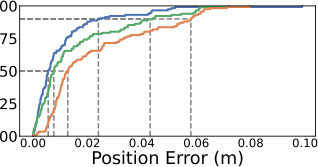

**(b) Position Error.**

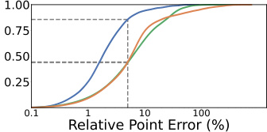

**(a) Shape Error.** **(b) Position Error.** **(c) Relative Point Error.**

**Figure 12: Performance Results.** a) Shape, b) position, & c) relative point error for mmNorm (blue), _Backprojection_ (green), and _Interferometric_ (orange).

**(a) Shape Error.**

reconstruction closely match the ground-truth curvatures, while
the baseline reconstructions contain significant distortions. This
highlights mmNorm’s potential for more complicated scenarios
containing multiple objects.
**6.2** **Performance Results**
_6.2.1_ _Shape Error._ To evaluate the shape error, we compute the 3D
F-Score (defined in §5) for mmNorm and the baselines.
Fig. 12a plots a CDF of the shape error for mmNorm (blue), the
_Backprojection_ baseline (green), and the _Interferometric_ baseline
(orange). The dashed lines show the median and 25 [th] percentiles.
We note the following:

 - mmNorm achieves a median F-score of 96%, in contrast to only
72% and 78% for the _Backprojection_ and _Interferometric_ baselines.
This shows the benefit of mmNorm’s techniques for enabling
accurate reconstructions.

 - Similarly, we compare the 25 [th] percentile performances. Since
larger F-Scores are better, the 25 [th] percentile demonstrates the
robustness (or lack thereof) to challenging scenarios. mmNorm
acheives a 25 [th] percentile of 84%, while the _Backprojection_ and the
_Interferometric_ baselines only achieve 60% and 49%, respectively.
This demonstrates the robustness of mmNorm’s techniques for
reconstructing high-accuracy shapes in challenging scenarios.

_6.2.2_ _Position Error._ We evaluate position error defined in §5.
Fig. 12b plots a CDF of the position error in meters for mmNorm
(blue), _Backprojection_ (green), and _Interferometric_ (orange). Dashed
lines show the 50 [th] /90 [th] percentiles. Note:

- The _Backprojection_ and _Interferometric_ baselines have a median
position error of 0.8 cm and 1.3 cm, respectively. mmNorm
achieves a median position error of 0.6 cm. Note that this position
error is _in addition to_ the shape error. It shows that mmNorm
not only exceeds the shape accuracy of state-of-the-art baselines, but also matches the median position accuracy of the best
performing baseline.

 - The baselines have a 90 [th] percentile position error of 4.3 cm &
5.8 cm, compared to mmNorm’s 2.4 cm. Thus, mmNorm achieves
an almost 2x improvement in the 90 [th] percentile over the baselines, showing the benefit of its techniques for producing reconstructions with accurate absolute depth.
_6.2.3_ _Relative Point Error._ Next, we measure the error of the individual points relative to the object’s size by measuring the relative
point error (defined in §5).
Fig. 12c plots a CDF of the relative point error in log scale for
mmNorm (blue), _Backprojection_ (green), and _Interferometric_ (orange). The dashed lines show what percentage of points within the
reconstructions achieve an error less than 5% of the object’s size. We
note that both baselines have only 44% of their points with an error

within 5% of the object’s size, in contrast to 85% for mmNorm. This
reinforces mmNorm’s significant improvement over the baselines.

**6.3** **Microbenchmarks**
We performed microbenchmark experiments to understand the
impact of various factors on mmNorm’s performance.
_6.3.1_ _Surface Normal Vector Field Accuracy._ Our first microbenchmark evaluates the accuracy of mmNorm’s surface normal vector
field produced in §2. To do so, we produce ground-truth surface
normal vector fields by: 1) aligning the ground-truth object mesh
(provided in the YCB dataset) with the camera’s depth image using
ICP[5], 2) using the mesh to produce a ground-truth, 3D SDF of
the object[68], and 3) taking the gradient of the SDF to produce
the ground- truth normal vector field[54, 65]. [17] For each normal
estimated by mmNorm, we measure the cosine-similarity (see §5)
between the ground-truth and estimated normal vectors. We aggregate this across all normal estimates. [18]

We compare this to the performance of normals that would
be produced using the reconstructions of the _Backprojection_ and
_Interferometric_ baselines. To do so, we use a standard point-cloud
normal estimation method[81] to estimate the normal vector for
each point in the baseline reconstructions. We then measure the
cosine-similarity for every normal. [19]

Fig. 13 plots a CDF of the cosine-similarity for mmNorm (blue),
_Backprojection_ (green), and _Interferometric_ (orange). The dashed
lines show the 50 [th] /25 [th] percentile. We note that:

- mmNorm achieves a 50 [th] and 25 [th] percentile cosine-similarity
of 0.99 and 0.94, respectively. This demonstrates that mmNorm
is capable of producing high-accuracy normal vectors.

 - In contrast, _Backprojection_ achieves a 50 [th] and 25 [th] percentile
of 0.54 and 0.22, and _Interferometric_ achieves only 0.66 and 0.36,
respectively. This shows that state-of-the-art approaches cannot
accurately estimate surface normals.
_6.3.2_ _Benefit of Isosurface Optimization._ Next, we evaluate the
benefit of mmNorm’s isosurface optimization technique (per §4),
by comparing mmNorm’s performance with two partial implementations. These implementations still estimate normal vectors (§2)
and produce RSDF components (§3) in the same way. However,
they do not leverage the isosurface optimization. Instead, the first
partial implementation simply selects the isosurface in the center
(vertically) of each RSDF component. To do so, it selects the unknown RSDF constant ( _𝐶𝑛_ ) as the average of the maximum and
minimum RSDF values, as _𝐶𝑛_ = (max( _𝑓𝑛_ _[𝑅]_ [) +][ min][(] _[𝑓]_ _𝑛_ _[𝑅]_ [)) /][ 2. The sec-]
ond partial implementation selects an isosurface weighted by the
mmWave SAR image magnitude. Specifically, we discretely sample

17We interpolate the ground-truth vector field to match mmNorm.
18For this microbenchmark, we remove objects with no valid mesh file.
19Again, we interpolate the ground-truth normals at each point.

Non-Line-of-Sight 3D Object Reconstruction via mmWave Surface Normal Estimation MobiSys ’25, June 23–27, 2025, Anaheim, CA, USA

1.00

0.50

0.25

0.00

|mmNorm Backprojection Baseline Interferometric Baseline Better|Col2|Col3|Col4|Col5|
|---|---|---|---|---|
|||||Better|
||||||

|1.00|Col2|Col3|
|---|---|---|
||LOS NLOS|LOS NLOS|
|0.75|||
|0.75||NLOS|

0.0 0.2 0.4 0.6 0.8 1.0
Cosine Similarity

**Figure 15: Impact of Non-Line-of-Sight.** CDF of
point error in LOS (blue) and NLOS (red).

|1.00|Col2|Col3|Col4|Col5|Col6|
|---|---|---|---|---|---|
||mmNorm (Full)|mmNorm (Full)|mmNorm (Full)|mmNorm (Full)|mmNorm (Full)|
|0.75||||||
|0.~~001~~ ~~0.0~~ Poin 0.25 ~~0.50~~||||      | mmNorm (Center Isosurface) mmNorm (Weigh~~-~~ ted Isosurface)|
|0.~~001~~ ~~0.0~~ Poin 0.25 ~~0.50~~||||||
|0.~~001~~ ~~0.0~~ Poin 0.25 ~~0.50~~||||||
|0.~~001~~ ~~0.0~~ Poin 0.25 ~~0.50~~||~~1~~ ~~0.1~~ t Error (m)|~~1~~ ~~0.1~~ t Error (m)|~~1~~ ~~0.1~~ t Error (m)|~~1~~ ~~0.1~~ t Error (m)|

**Figure 14: Benefit of Optimization.** CDF of point
error for mmNorm(blue)&, and partial impls. selecting the
center (red), and weighted center (pink).

**Figure 13: Normal Field Accuracy.** CDF of cosine
similarity of normal estimates for mmNorm.

isosurfaces every _𝜆_ /2 ≈ 1 _._ 9 mm, and compute the total SAR image
magnitude across each isosurface. We then compute the average
isosurface weighted by the total SAR image power. Formally:

| _𝑆_ ( _𝑣𝑖_ )|

_𝑣𝑖_ ∈( _𝑓𝑛_ _[𝑅]_ [−] _[𝑐]_ [=][0][)]

_𝐶𝑛_ =

�max( _𝑓𝑛_ _[𝑅]_ [)]
_𝑐_ =min( _𝑓𝑛_ _[𝑅]_ [)] _[ 𝑐𝑤][𝑐]_

_𝑐_ = ( _𝑓𝑛_ [)] ∑︁

_,_ _𝑤𝑐_ =

~~�~~ _𝑐_ max=min( _𝑓𝑛_ ( _[𝑅]_ _𝑓_ [)] _𝑛_ _[𝑅]_ [)] _[ 𝑤][𝑐]_ _𝑣𝑖_ ∈( _𝑓𝑛_ _[𝑅]_ [−]

where _𝑤𝑐_ are the weighting values based on mmWave image.

Fig. 14 plots a CDF of the overall point error in log scale for
mmNorm (blue), the partial implementation using the RSDF center
(red), and the partial implementation using weighted centers (pink).
The dashed lines show the median and 90 [th] percentile. We note that
the partial implementation using RSDF centers achieves a median
and 90 [th] percentile error of 1.6 cm and 3.3 cm, respectively, and the
partial implementation using weighted centers achieves 1.1 cm and
2.9 cm, respectively. In contrast, mmNorm achieves a roughly 3x
and 2.5x improvement, with a median and 90 [th] percentile error of
0.4 cm and 1.2 cm.
_6.3.3_ _Impact of Non-Line-of-Sight._ Next, we evaluate how NLOS
impacts mmNorm by comparing the performance in LOS and NLOS
(when fully occluded by a layer of cardboard).
Fig. 15 plots a CDF of the overall point error in log scale for
mmNorm in LOS (blue) and NLOS (red). The dashed lines show the
median and 90 [th] percentile. We note that in LOS, mmNorm achieves
a median and 90 [th] percentile of 0.39 cm and 1.1 cm, respectively. In
NLOS conditions, mmNorm achieves a median and 90 [th] percentile
error of 0.43 cm and 1.2 cm, respectively. This shows that mmNorm
is capable of producing high-accuracy reconstructions in NLOS,
with a neglibile performance difference compared to LOS. [20]

**7** **Related Work**
**mmWave-based 3D Object Reconstruction.** Previous research
in mmWave reconstruction falls in two main categories: first-principles
and machine learning based approaches.
Within first-principle-based methods, the most common approach involves applying ray-tracing based imaging algorithms(e.g.,
range migration algorithm or backprojection) to generate 3D mmWave
images. Then, this image is directly used for occupancy detection
(e.g., by selecting all voxels that exceed a power threshold)[15, 18,
36, 37, 39, 51]. As shown in our results, mmNorm significantly
outperforms this method (the _Backprojection_ baseline) when using commercially available bandwidth. In principle, one could rely
on significantly larger bandwidth (≥10 GHz) to obtain more accurate 3D object reconstructions [15, 22, 36, 37, 39, 51]. However,

20Note that similar to any mmWave system, while the SNR would decrease with thicker
occlusions, this can be offset with higher transmit power.

such bandwidth is reserved only for government and military use,
making it unsuitable for commercial applications.
To overcome the bandwidth limitations, some works have proposed interferometric methods, which rely primarily on the phase.
Existing approaches have only demonstrated imaging a handful of
metallic objects in anechoic chamber [19–22] and do not generalize
well. Indeed, our results show that mmNorm significantly outperform the _Interferometric_ baseline[20], which is a state-of-the-art
system in this space. Finally, mmNorm is also related to [82], which
leverages incoherent methods to estimate an object’s 2D surface
normals and perform coarse reconstruction. In contrast, mmNorm
develops coherent methods for 3D surface normal estimation and
object reconstruction, producing significantly finer reconstructions
of smaller-scale objects and features.

The second category utilizes machine learning to produce high
resolution reconstructions using a limited, commercially available
bandwidth. These works focus on a specific category (or limited
categories) of objects, and use advanced learning models to produce
reconstructions beyond the radar resolution. For example, there has
been work on reconstructing human bodies[9–12, 27, 34, 69, 75–78],
human faces[74], vehicles[23, 56–58, 60], and scene-level features
(e.g., walls, furniture, etc)[7, 14, 35, 41, 47, 53]. However, these
works are limited in that they can only produce 3D reconstructions for objects within their specific category. Also, enabling such
learning-based approaches requires exhaustive training data. In
contrast, mmNorm uses an entirely first-principles-based approach
for mmWave 3D object reconstruction (for objects orders of magnitude smaller than cars, humans, etc). Thus, mmNorm generalizes
to completely unseen objects and environments without requiring
exhaustive training data.
**Surface Normal Characterization.** Certain perception tasks require characterizing a surface using its normals. Past work has done
this by first reconstructing human or scene-level features using RF
signals, then estimating the normals (in a straightforward fashion
or using machine learning) [26, 35, 45, 69]. This is fundamentally
different than mmNorm which estimates surface normals from first
principles, then uses them to reconstruct the surface with high accuracy. Indeed, our §6.3.1 micro-benchmark shows that mmNorm
is _>_ 4x more accurate than such methods, which first reconstruct
the surface then use it to estimate normals.
**Optical-based 3D Object Reconstruction.** Optical-based 3D reconstruction has been extensively studied over the past decade,
with prior work leveraging LiDAR [55, 66, 70] or RGB [50, 59, 73]
scans of an object to produce 3D reconstructions. However, these
methods are limited to the line-of-sight and cannot reconstruct fullyoccluded objects (e.g., inside boxes, behind obstacles, or covered by

MobiSys ’25, June 23–27, 2025, Anaheim, CA, USA Laura Dodds, Tara Boroushaki, Kaichen Zhou, Fadel Adib

|Hollow Objects|Limited Coverage|Missing Transitions|
|---|---|---|
||||
|mmNorm's Reconstruction Offset Ground-Truth|Missing Surface|Missing Transition|

clutter). This is because they rely on visible light or near-infrared,
which cannot traverse through occlusions. In contrast, mmNorm
enables NLOS 3D reconstruction by leveraging mmWave signals,
which can traverse many everyday occlusions.
There have also been a small number of works that investigate
reflecting light around the corner to reconstruct hidden objects [13,
25, 28, 33, 64]. However, this approach cannot reconstruct fully
occluded objects (e.g., within a closed box). Also, these works rely
on expensive equipment and/or high-powered lasers which are
unsafe for human exposure.

**8** **Limitations**
We highlight few limitations and avenues to overcome them:
**Metal Occlusions.** Similar to existing mmWave imaging systems,
mmNorm cannot reconstruct objects hidden behind metal (or very
thick) occlusions.
**Hollow Objects.** In the case of a hollow (and non-metallic) object,
such as an empty cardboard box, the mmWave signals may traverse
through the object and the radar may receive reflections from both
the top and bottom surfaces. However, since mmNorm only produces one isosurface per RSDF component, it cannot reconstruct
both surfaces. For example, in the first column of Fig. 16 we show
an RGB image, ground truth point cloud (green), and mmNorm’s
reconstruction (red) for an empty box. Here, mmNorm’s reconstruction does not align with the top (or bottom) of the box.
It would be interesting future work to extend mmNorm to detect
these scenarios and produce reconstructions for both the top and
bottom surfaces of narrow, hollow objects.
**Limited Coverage.** mmNorm inherits the existing coverage limitation of synthetic aperture radar. Specifically, recall from §2.1
that a mmWave image is only able to capture portions of the surface where the normal points within the aperture. This prevents
mmNorm from reconstructing the normals (and thus the surface)
for parts of the object where the normal points outside the aperture.
We show an example of a mini soccer ball in Fig. 16 (2 [nd] col). Due
to the limited aperture, mmNorm is only able to reconstruct the top
portion of the object (where normals point within the aperture).
It would be interesting future work to investigate other aperture
lengths and shapes to improve the surface coverage of mmNorm,
as well as to leverage deep learning methods for completing an
object’s shape from a partial reconstruction.
**Missing Object Transitions.** In some cases, mmNorm is unable
to capture sharp transitions in the object’s shape. We show this
through an example of a mustard bottle in Fig. 16 (3 [rd] col). While
the reconstruction closely matches at many points on the object, it
deviates at the bottle’s cap, as shown within the blue circle. This is
because mmNorm is unable to recover the surface normals corresponding with the sharp transition of the object (due to the same
coverage problem described above). In many cases, this is overcome
by leveraging different RSDF components to separate the different

object surfaces. However, in this case, both the main body and
the cap are very close to each other. Thus, they are selected to be
within one RSDF component. This prevents mmNorm from separately optimizing their isosurfaces, resulting in the reconstruction
error shown. It would be interesting future work to identify this
case (e.g., by detecting sharp changes in signal response or through
a mmWave segmentation network) and split the RSDF into separate
components so their isosurfaces can be optimized independently,
allowing for better reconstruction.
**Internal Object Multipath:** mmNorm’s normal estimates may be
impacted by multipath within an object. We believe it would be
interesting future work to investigate the impact of this phenomenon, and incorporate it into the normal estimation or isosurface
optimization to improve the object reconstruction.
**Computational Complexity and Scanning Time:** Finally, future work can investigate avenues for enabling real-time scanning
and computation. First, we envision future work can leverage faster,
integrated scanners, similar to those used in mmWave airport scanners which can scan a large aperture in a few seconds (despite using
a much larger bandwidth than our system which is not commercially available). Second, since many steps of mmNorm’s algorithms
are highly parallelizable, mmNorm could benefit from similar optimizations to existing SAR image computations (e.g., GPU, hardware
acceleration, etc) [17, 48] to enable future real-time computation.

**9** **Conclusion & Future Opportunities**
We presented mmNorm, a fundamentally new method for NLOS
3D object reconstruction via mmWave surface normal estimation,
opening future work along multiple dimensions.
For example, it would be interesting to investigate how mmNorm’s
methods may bring benefit to _larger objects or scene-level reconstruc-_
_tions._ By leveraging surface normal estimates in these scenarios, it
may be possible to further enhance autonomous vehicle sensing or
RF-SLAM systems.
Also, we imagine that future work could enable _camera-quality_
_NLOS reconstructions._ Similar to how past work has enabled lidarquality scene reconstructions from long-range mmWave measurements [35], we envision that one could leverage mmNorm’s reconstructions as input to a deep learning model to produce photorealistic reconstructions.
Further, we believe mmNorm can _enable novel downstream tasks_
For example, we envision a new domain of NLOS robotic systems
which can directly locate and grasp objects which are hidden from
view (i.e., objects within boxes of packing peanuts or hidden in
dark locations). Furthermore, future work could investigate combining arrays on AR headsets with human motion to reconstruct
surrounding objects and display high-resolution hidden models to
the user. Finally, high-accuracy reconstruction could enable new
capabilities in areas such as gesture recognition, NLOS quality control in shipping and logistics, and hidden object classification and
completion.

More broadly, we hope that this work motivates a new direction
for high-accuracy, non-line-of-sight 3D reconstruction.

**Acknowledgments.** We thank the anonymous reviewers and the Signal
Kinetics group for their help and feedback. This research is sponsored by
NSF (Award #2313234) and the MIT Media Lab. Tara Boroushaki is supported
by the Microsoft PhD fellowship.

Non-Line-of-Sight 3D Object Reconstruction via mmWave Surface Normal Estimation MobiSys ’25, June 23–27, 2025, Anaheim, CA, USA

**References**

[[1] 2021. mmWave Radar Radome Design Guide. https://www.ti.com/lit/an/swra705/](https://www.ti.com/lit/an/swra705/swra705.pdf)
[swra705.pdf. Texas Instruments.](https://www.ti.com/lit/an/swra705/swra705.pdf)

[[2] 2023. TI DCA1000EVM. https://www.ti.com/tool/DCA1000EVM.](https://www.ti.com/tool/DCA1000EVM)

[[3] 2023. TI IWR1443Boost. https://www.ti.com/product/IWR1443#tech-docs.](https://www.ti.com/product/IWR1443##tech-docs)

[4] 2024. 5G mmWave Channel Modeling with Diffuse Scattering in an Office Envi[ronment . https://www.remcom.com/resources/examples/5g-mmwave-channel-](https://www.remcom.com/resources/examples/5g-mmwave-channel-modeling-with-diffuse-scattering-in-an-office-environment)
[modeling-with-diffuse-scattering-in-an-office-environment. Remcom.](https://www.remcom.com/resources/examples/5g-mmwave-channel-modeling-with-diffuse-scattering-in-an-office-environment)

[[5] 2024. ICP registration. https://www.open3d.org/docs/release/tutorial/pipelines/](https://www.open3d.org/docs/release/tutorial/pipelines/icp_registration.html)
[icp_registration.html.](https://www.open3d.org/docs/release/tutorial/pipelines/icp_registration.html)

[6] Daniel Arnitz, Claire M Watts, Andreas Pedross-Engel, and Matthew S Reynolds.
2022. A portable K-band (24 GHz) 3-D millimeter wave imaging system for
detecting and dimensioning hidden objects. In _Passive and Active Millimeter-_
_Wave Imaging XXV_, Vol. 12111. SPIE, 38–42.

[7] Pingping Cai and Sanjib Sur. 2023. Millipcd: Beyond traditional vision indoor
point cloud generation via handheld millimeter-wave devices. _Proceedings of_
_the ACM on Interactive, Mobile, Wearable and Ubiquitous Technologies_ 6, 4 (2023),
1–24.

[8] Berk Calli, Arjun Singh, James Bruce, Aaron Walsman, Kurt Konolige, Siddhartha Srinivasa, Pieter Abbeel, and Aaron M Dollar. 2017. Yale-CMUBerkeley dataset for robotic manipulation research. _The International Jour-_
_nal of Robotics Research_ [36, 3 (2017), 261–268. doi:10.1177/0278364917700714](https://doi.org/10.1177/0278364917700714)
[arXiv:https://doi.org/10.1177/0278364917700714](https://arxiv.org/abs/https://doi.org/10.1177/0278364917700714)

[9] Anjun Chen, Xiangyu Wang, Kun Shi, Yuchi Huo, Jiming Chen, and Qi Ye. 2024.
Towards Weather-Robust 3D Human Body Reconstruction: Millimeter-Wave
Radar-Based Dataset, Benchmark, and Multi-Modal Fusion. _IEEE Transactions on_
_Circuits and Systems for Video Technology_ (2024).

[10] Anjun Chen, Xiangyu Wang, Kun Shi, Shaohao Zhu, Bin Fang, Yingfeng Chen,
Jiming Chen, Yuchi Huo, and Qi Ye. 2023. Immfusion: Robust mmwave-rgb
fusion for 3d human body reconstruction in all weather conditions. In _2023 IEEE_
_International Conference on Robotics and Automation (ICRA)_ . IEEE, 2752–2758.

[11] Anjun Chen, Xiangyu Wang, Zhi Xu, Kun Shi, Yan Qin, Yuchi Huo, Jiming Chen,
and Qi Ye. 2024. AdaptiveFusion: Adaptive Multi-Modal Multi-View Fusion for
3D Human Body Reconstruction. _arXiv preprint arXiv:2409.04851_ (2024).

[12] Anjun Chen, Xiangyu Wang, Shaohao Zhu, Yanxu Li, Jiming Chen, and Qi Ye.
2022. mmbody benchmark: 3d body reconstruction dataset and analysis for
millimeter wave radar. In _Proceedings of the 30th ACM International Conference_
_on Multimedia_ . 3501–3510.

[13] Wenzheng Chen, Simon Daneau, Fahim Mannan, and Felix Heide. 2019. Steadystate non-line-of-sight imaging. In _Proceedings of the IEEE/CVF Conference on_
_Computer Vision and Pattern Recognition_ . 6790–6799.

[14] Yuwei Cheng, Jingran Su, Mengxin Jiang, and Yimin Liu. 2022. A novel radar point
cloud generation method for robot environment perception. _IEEE Transactions_
_on Robotics_ 38, 6 (2022), 3754–3773.

[15] R Trevor Clark, Stephanie L McDaid, and David M Sheen. 2024. Rotational millimeter-wave shoe scanner using the discrete Fourier transform for
backprojection-based image reconstruction. In _Radar Sensor Technology XXVIII_,
Vol. 13048. SPIE, 248–254.

[16] Federal Communications Commission. 2003. _FCC Opens 70, 80, and 90 GHz_
_Spectrum Bands for Deployment of Broadband "Millimeter Wave" Technolo-_
_gies_ [. https://www.fcc.gov/document/fcc-opens-70-80-and-90-ghz-spectrum-](https://www.fcc.gov/document/fcc-opens-70-80-and-90-ghz-spectrum-bands-deployment-broadband)
[bands-deployment-broadband](https://www.fcc.gov/document/fcc-opens-70-80-and-90-ghz-spectrum-bands-deployment-broadband)

[17] Helena Cruz, Mário Véstias, José Monteiro, Horácio Neto, and Rui Policarpo
Duarte. 2022. A Review of Synthetic-Aperture Radar Image Formation Algorithms
and Implementations: A Computational Perspective. _Remote Sensing_ 14, 5 (2022).
[doi:10.3390/rs14051258](https://doi.org/10.3390/rs14051258)

[18] Laura Dodds, Hailan Shanbhag, Junfeng Guan, Saurabh Gupta, and Haitham
Hassanieh. 2024. Around the Corner mmWave Imaging in Practical Environments.
In _Proceedings of the 30th Annual International Conference on Mobile Computing_
_and Networking_ . 1–15.

[19] Jingkun Gao, Bin Deng, Yuliang Qin, Xiang Li, and Hongqiang Wang. 2019.
Point cloud and 3-D surface reconstruction using cylindrical millimeter-wave
holography. _IEEE Transactions on Instrumentation and Measurement_ 68, 12 (2019),
4765–4778.

[20] Jingkun Gao, Yuliang Qin, Bin Deng, Hongqiang Wang, and Xiang Li. 2017. A
novel method for 3-D millimeter-wave holographic reconstruction based on
frequency interferometry techniques. _IEEE Transactions on Microwave Theory_
_and Techniques_ 66, 3 (2017), 1579–1596.

[21] Jingkun Gao, Yuliang Qin, Bin Deng, Hongqiang Wang, and Xiang Li. 2018. Novel
efficient 3D short-range imaging algorithms for a scanning 1D-MIMO array. _IEEE_
_Transactions on Image Processing_ 27, 7 (2018), 3631–3643.

[22] Borja Gonzalez-Valdes, Yuri Alvarez-Lopez, Jose Angel Martinez-Lorenzo, Fernando Las Heras Andres, and Carey Rappaport. 2013. On the use of improved
imaging techniques for the development of a multistatic three-dimensional
millimeter-wave portal for personnel screening. _Progress In Electromagnetics_
_Research_ 138 (2013), 83–98.

[23] Junfeng Guan, Sohrab Madani, Suraj Jog, Saurabh Gupta, and Haitham Hassanieh.

2020. Through fog high-resolution imaging using millimeter wave radar. In
_Proceedings of the IEEE/CVF Conference on Computer Vision and Pattern Recognition_ .
11464–11473.

[24] Qijia Guo, Jie Liang, Tianying Chang, and Hong-Liang Cui. 2019. Millimeterwave imaging with accelerated super-resolution range migration algorithm. _IEEE_
_Transactions on Microwave Theory and Techniques_ 67, 11 (2019), 4610–4621.

[25] Otkrist Gupta, Thomas Willwacher, Andreas Velten, Ashok Veeraraghavan, and
Ramesh Raskar. 2012. Reconstruction of hidden 3D shapes using diffuse reflections. _Optics express_ 20, 17 (2012), 19096–19108.

[26] William D Harcourt, David G Macfarlane, and Duncan A Robertson. 2024. 3D
terrain mapping and filtering from coarse resolution data cubes extracted from
real-aperture 94 GHz radar. _IEEE Transactions on Geoscience and Remote Sensing_
(2024).

[27] Kareeb Hasan, Beng Oh, Nithurshan Nadarajah, and Mehmet Rasit Yuce. 2024.
mm-CasGAN: A cascaded adversarial neural framework for mmWave radar point
cloud enhancement. _Information Fusion_ 108 (2024), 102388.

[28] Felix Heide, Lei Xiao, Wolfgang Heidrich, and Matthias B Hullin. 2014. Diffuse
mirrors: 3D reconstruction from diffuse indirect illumination using inexpensive
time-of-flight sensors. In _Proceedings of the IEEE Conference on Computer Vision_
_and Pattern Recognition_ . 3222–3229.

[[29] Intel RealSense. 2019. https://www.intelrealsense.com.](https://www.intelrealsense.com)

[30] Mohinder Jankiraman. 2018. _FMCW radar design_ . Artech House.

[31] Yue Jiang, Dantong Ji, Zhizhong Han, and Matthias Zwicker. 2020. Sdfdiff:
Differentiable rendering of signed distance fields for 3d shape optimization. In
_Proceedings of the IEEE/CVF conference on computer vision and pattern recognition_ .
1251–1261.

[32] Taenam Kim and Kyungyong Chwa. 1986. Parallel algorithms for a depth first
search and a breadth first search. _International journal of computer mathematics_
19, 1 (1986), 39–54.

[33] Ahmed Kirmani, Tyler Hutchison, James Davis, and Ramesh Raskar. 2011. Looking around the corner using ultrafast transient imaging. _International journal of_
_computer vision_ 95 (2011), 13–28.

[34] Hao Kong, Haoxin Lyu, Jiadi Yu, Linghe Kong, Junlin Yang, Yanzhi Ren, Hongbo
Liu, and Yi-Chao Chen. 2024. mmHand: 3D Hand Pose Estimation Leveraging mmWave Signals. In _2024 IEEE 44th International Conference on Distributed_
_Computing Systems (ICDCS)_ . IEEE, 1062–1073.

[35] Haowen Lai, Gaoxiang Luo, Yifei Liu, and Mingmin Zhao. 2024. Enabling Visual
Recognition at Radio Frequency. In _Proceedings of the 30th Annual International_
_Conference on Mobile Computing and Networking_ . 388–403.

[36] Jaime Laviada, Ana Arboleya-Arboleya, Yuri Álvarez, Borja González-Valdés,
and Fernando Las-Heras. 2017. Multiview three-dimensional reconstruction by
millimetre-wave portable camera. _Scientific reports_ 7, 1 (2017), 6479.

[37] Jaime Laviada, Miguel Lopez-Portugues, Ana Arboleya-Arboleya, and Fernando
Las-Heras. 2018. Multiview mm-wave imaging with augmented depth camera
information. _IEEE Access_ 6 (2018), 16869–16877.

[38] CH Li and Peter Kwong-Shun Tam. 1998. An iterative algorithm for minimum
cross entropy thresholding. _Pattern recognition letters_ 19, 8 (1998), 771–776.

[39] Bo Lin, Chao Li, Yicai Ji, Xiaojun Liu, and Guangyou Fang. 2023. A MillimeterWave 3D Imaging Algorithm for MIMO Synthetic Aperture Radar. _Sensors_ 23, 13
(2023), 5979.

[40] Ting Liu, Yao Zhao, Yunchao Wei, Yufeng Zhao, and Shikui Wei. 2019. Concealed
Object Detection for Activate Millimeter Wave Image. _IEEE Transactions on_
_Industrial Electronics_ [66, 12 (2019), 9909–9917. doi:10.1109/TIE.2019.2893843](https://doi.org/10.1109/TIE.2019.2893843)

[41] Chris Xiaoxuan Lu, Stefano Rosa, Peijun Zhao, Bing Wang, Changhao Chen,
John A Stankovic, Niki Trigoni, and Andrew Markham. 2020. See through smoke:
robust indoor mapping with low-cost mmwave radar. In _Proceedings of the 18th_
_International Conference on Mobile Systems, Applications, and Services_ . 14–27.

[42] Jonathan S Lu, Patrick Cabrol, Daniel Steinbach, and Ravikumar V Pragada. 2013.
Measurement and characterization of various outdoor 60 GHz diffracted and
scattered paths. In _MILCOM 2013-2013 IEEE Military Communications Conference_ .
IEEE, 1238–1243.

[43] Aditya Varma Muppala, Adib Y Nashashibi, Ehsan Afshari, and Kamal Sarabandi.
2024. Fast-Fourier Time-Domain SAR Reconstruction for Millimeter-Wave FMCW
3-D Imaging. _IEEE Transactions on Microwave Theory and Techniques_ (2024).

[44] Hieu V. Nguyen and Li Bai. 2011. Cosine Similarity Metric Learning for Face
Verification. In _Computer Vision – ACCV 2010_, Ron Kimmel, Reinhard Klette,
and Akihiro Sugimoto (Eds.). Springer Berlin Heidelberg, Berlin, Heidelberg,
709–720.

[45] S Pawliczek, R Herschel, and N Pohl. 2019. 3D millimeter wave screening for
metallic surface defect detection. In _2019 16th European Radar Conference (EuRAD)_ .
IEEE, 113–116.

[46] Andreas Pedross-Engel, Claire M Watts, and Matthew S Reynolds. 2021. A twosided, reflection-based K-Band 3-D millimeter-wave imaging system with image
beat pattern mitigation. _IEEE Transactions on Microwave Theory and Techniques_
69, 11 (2021), 5045–5056.

[47] Akarsh Prabhakara, Tao Jin, Arnav Das, Gantavya Bhatt, Lilly Kumari, Elahe
Soltanaghai, Jeff Bilmes, Swarun Kumar, and Anthony Rowe. 2023. High resolu

MobiSys ’25, June 23–27, 2025, Anaheim, CA, USA Laura Dodds, Tara Boroushaki, Kaichen Zhou, Fadel Adib

tion point clouds from mmwave radar. In _2023 IEEE International Conference on_
_Robotics and Automation (ICRA)_ . IEEE, 4135–4142.

[48] Dan Pritsker. 2015. Efficient Global Back-Projection on an FPGA. In _2015 IEEE_
_Radar Conference (RadarCon)_ [. 0204–0209. doi:10.1109/RADAR.2015.7130996](https://doi.org/10.1109/RADAR.2015.7130996)

[49] Ming-Hao Ren, Xi Liao, Jihua Zhou, Yang Wang, Yu Shao, Shasha Liao, and
Jie Zhang. 2020. Diffuse Scattering Directive Model Parameterization Method
for Construction Materials at mmWave Frequencies. _International Journal of_
_Antennas and Propagation_ [2020, 1 (2020), 1583854. doi:10.1155/2020/1583854](https://doi.org/10.1155/2020/1583854)
[arXiv:https://onlinelibrary.wiley.com/doi/pdf/10.1155/2020/1583854](https://arxiv.org/abs/https://onlinelibrary.wiley.com/doi/pdf/10.1155/2020/1583854)

[50] Ruizhi Shao, Zerong Zheng, Hongwen Zhang, Jingxiang Sun, and Yebin Liu. 2022.
Diffustereo: High quality human reconstruction via diffusion-based stereo using
sparse cameras. In _European Conference on Computer Vision_ . Springer, 702–720.

[51] David M Sheen and Thomas E Hall. 2011. Calibration, reconstruction, and
rendering of cylindrical millimeter-wave image data. In _Passive Millimeter-Wave_
_Imaging Technology XIV_, Vol. 8022. SPIE, 123–134.

[52] Ruiyi Shen and Yasaman Ghasempour. 2023. Scattering from Rough Surfaces in
100+ GHz Wireless Mobile Networks: From Theory to Experiments. In _Proceedings_
_of the 29th Annual International Conference on Mobile Computing and Networking_
(Madrid, Spain) _(ACM MobiCom ’23)_ . Association for Computing Machinery, New
[York, NY, USA, Article 92, 15 pages. doi:10.1145/3570361.3613306](https://doi.org/10.1145/3570361.3613306)

[53] Akash Deep Singh, Yunhao Ba, Ankur Sarker, Howard Zhang, Achuta Kadambi,
Stefano Soatto, Mani Srivastava, and Alex Wong. 2023. Depth estimation from
camera image and mmwave radar point cloud. In _Proceedings of the IEEE/CVF_
_Conference on Computer Vision and Pattern Recognition_ . 9275–9285.

[54] Herman Hansson Söderlund, Alex Evans, and Tomas Akenine-Möller. 2022. Ray
Tracing of Signed Distance Function Grids. _Journal of Computer Graphics Tech-_
_niques Vol_ 11, 3 (2022).

[55] Su Sun, Cheng Zhao, Yuliang Guo, Ruoyu Wang, Xinyu Huang, Yingjie Victor
Chen, and Liu Ren. 2024. Behind the Veil: Enhanced Indoor 3D Scene Reconstruction with Occluded Surfaces Completion. In _Proceedings of the IEEE/CVF_
_Conference on Computer Vision and Pattern Recognition_ . 12744–12753.

[56] Yue Sun, Zhuoming Huang, Honggang Zhang, Zhi Cao, and Deqiang Xu. 2021.
3DRIMR: 3D reconstruction and imaging via mmWave radar based on deep
learning. In _2021 IEEE International Performance, Computing, and Communications_
_Conference (IPCCC)_ . IEEE, 1–8.

[57] Yue Sun, Zhuoming Huang, Honggang Zhang, and Xiaohui Liang. 2022. 3D
reconstruction of multiple objects by mmWave radar on UAV. In _2022 IEEE 19th_
_International Conference on Mobile Ad Hoc and Smart Systems (MASS)_ . IEEE,
491–495.

[58] Yue Sun, Honggang Zhang, Zhuoming Huang, and Benyuan Liu. 2021. Deeppoint:
A deep learning model for 3d reconstruction in point clouds via mmwave radar.
_arXiv preprint arXiv:2109.09188_ (2021).

[59] Stanislaw Szymanowicz, Chrisitian Rupprecht, and Andrea Vedaldi. 2024. Splatter
image: Ultra-fast single-view 3d reconstruction. In _Proceedings of the IEEE/CVF_
_Conference on Computer Vision and Pattern Recognition_ . 10208–10217.

[60] Bin Tan, Zhixiong Ma, Xichan Zhu, Sen Li, Lianqing Zheng, Sihan Chen, Libo
Huang, and Jie Bai. 2022. 3-D object detection for multiframe 4-D automotive
millimeter-wave radar point cloud. _IEEE Sensors Journal_ 23, 11 (2022), 11125–
11138.

[61] Maxim Tatarchenko*, Stephan R. Richter*, René Ranftl, Zhuwen Li, Vladlen
Koltun, and Thomas Brox. 2019. What Do Single-view 3D Reconstruction Networks Learn? _CVPR_ .

[[62] Universal Robots, UR5e. 2021. https://www.universal-robots.com/products/ur5-](https://www.universal-robots.com/products/ur5-robot/)
[robot/.](https://www.universal-robots.com/products/ur5-robot/)

[63] Jacob Varley, Chad DeChant, Adam Richardson, Joaquín Ruales, and Peter Allen.
2017. Shape completion enabled robotic grasping. In _2017 IEEE/RSJ International_
_Conference on Intelligent Robots and Systems (IROS)_ (Vancouver, BC, Canada).
[IEEE Press, 2442–2447. doi:10.1109/IROS.2017.8206060](https://doi.org/10.1109/IROS.2017.8206060)

[64] Andreas Velten, Di Wu, Adrian Jarabo, Belen Masia, Christopher Barsi, Chinmaya
Joshi, Everett Lawson, Moungi Bawendi, Diego Gutierrez, and Ramesh Raskar.
2013. Femto-photography: capturing and visualizing the propagation of light.
_ACM Transactions on Graphics (ToG)_ 32, 4 (2013), 1–8.

[65] Delio Vicini, Sébastien Speierer, and Wenzel Jakob. 2022. Differentiable signed
distance function rendering. _ACM Transactions on Graphics (TOG)_ 41, 4 (2022),
1–18.

[66] Ignacio Vizzo, Benedikt Mersch, Rodrigo Marcuzzi, Louis Wiesmann, Jens Behley,
and Cyrill Stachniss. 2022. Make it dense: Self-supervised geometric scan completion of sparse 3d lidar scans in large outdoor environments. _IEEE Robotics and_
_Automation Letters_ 7, 3 (2022), 8534–8541.

[67] Mou Wang, Shunjun Wei, Jiadian Liang, Xiangfeng Zeng, Chen Wang, Jun Shi,
and Xiaoling Zhang. 2021. RMIST-Net: Joint range migration and sparse reconstruction network for 3-D mmW imaging. _IEEE Transactions on Geoscience and_
_Remote Sensing_ 60 (2021), 1–17.

[68] Peng-Shuai Wang, Yang Liu, and Xin Tong. 2022. Dual Octree Graph Networks
for Learning Adaptive Volumetric Shape Representations. _ACM Transactions on_
_Graphics (SIGGRAPH)_ 41, 4 (2022).

[69] Qingtao Wang, Tao Wang, Zhaohui Bu, Mengting Cui, Haipo Cui, and Li Ding.
2024. Segmentation-aided Upsampling for High-Resolution Reconstruction of

3D MMW Images. _IEEE Sensors Journal_ (2024).

[70] Yiduo Wang, Nils Funk, Milad Ramezani, Sotiris Papatheodorou, Marija Popović,
Marco Camurri, Stefan Leutenegger, and Maurice Fallon. 2021. Elastic and
efficient LiDAR reconstruction for large-scale exploration tasks. In _2021 IEEE_
_International Conference on Robotics and Automation (ICRA)_ . IEEE, 5035–5041.

[71] Sahil Waqar and Matthias Pätzold. 2023. A Simulation-Based Framework for
the Design of Human Activity Recognition Systems Using Radar Sensors. _IEEE_
_Internet of Things Journal_ (2023).

[72] Carl J Weisman. 2002. _The essential guide to RF and wireless_ . Pearson Education.

[73] Haozhe Xie, Hongxun Yao, Xiaoshuai Sun, Shangchen Zhou, and Shengping
Zhang. 2019. Pix2vox: Context-aware 3d reconstruction from single and multiview images. In _Proceedings of the IEEE/CVF international conference on computer_
_vision_ . 2690–2698.

[74] Jiahong Xie, Hao Kong, Jiadi Yu, Yingying Chen, Linghe Kong, Yanmin Zhu, and
Feilong Tang. 2023. mm3DFace: Nonintrusive 3D facial reconstruction leveraging
mmWave signals. In _Proceedings of the 21st Annual International Conference on_
_Mobile Systems, Applications and Services_ . 462–474.

[75] Hongfei Xue, Qiming Cao, Yan Ju, Haochen Hu, Haoyu Wang, Aidong Zhang, and
Lu Su. 2022. M4esh: mmwave-based 3d human mesh construction for multiple
subjects. In _Proceedings of the 20th ACM Conference on Embedded Networked_
_Sensor Systems_ . 391–406.

[76] Hongfei Xue, Qiming Cao, Chenglin Miao, Yan Ju, Haochen Hu, Aidong Zhang,
and Lu Su. 2023. Towards generalized mmwave-based human pose estimation
through signal augmentation. In _Proceedings of the 29th Annual International_
_Conference on Mobile Computing and Networking_ . 1–15.

[77] Hongfei Xue, Yan Ju, Chenglin Miao, Yijiang Wang, Shiyang Wang, Aidong
Zhang, and Lu Su. 2021. mmMesh: Towards 3D real-time dynamic human
mesh construction using millimeter-wave. In _Proceedings of the 19th Annual_
_International Conference on Mobile Systems, Applications, and Services_ . 269–282.

[78] Jiarui Yang, Songpengcheng Xia, Yifan Song, Qi Wu, and Ling Pei. 2024. mmBaT:
A Multi-Task Framework for Mmwave-Based Human Body Reconstruction and
Translation Prediction. In _ICASSP 2024-2024 IEEE International Conference on_
_Acoustics, Speech and Signal Processing (ICASSP)_ . IEEE, 8446–8450.

[79] Muhammet Emin Yanik, Dan Wang, and Murat Torlak. 2020. Development and
demonstration of MIMO-SAR mmWave imaging testbeds. _IEEE Access_ 8 (2020),
126019–126038.

[80] Xiaotong Zhang, Zhenjiang Li, and Jin Zhang. 2022. Synthesized millimeterwaves for human motion sensing. In _Proceedings of the 20th ACM Conference on_
_Embedded Networked Sensor Systems_ . 377–390.

[81] Qian-Yi Zhou, Jaesik Park, and Vladlen Koltun. 2018. Open3D: A Modern Library
for 3D Data Processing. _arXiv:1801.09847_ (2018).

[82] Yanzi Zhu, Yuanshun Yao, Ben Y. Zhao, and Haitao Zheng. 2017. Object Recognition and Navigation using a Single Networking Device. In _Proceedings of the_
_15th Annual International Conference on Mobile Systems, Applications, and Ser-_
_vices_ (Niagara Falls, New York, USA) _(MobiSys ’17)_ . Association for Computing
[Machinery, New York, NY, USA, 265–277. doi:10.1145/3081333.3081339](https://doi.org/10.1145/3081333.3081339)

