## **Can WiFi Estimate Person Pose?**

**Fei Wang** **[1,2]** _[∗]_ **Stanislav Panev** **[2]** **Ziyi Dai** **[1]** **Jinsong Han** **[3]** **Dong Huang** **[2]**

1Xi’an Jiaotong University 2Carneige Mellon University 3Zhejiang University
```
         feiwang@cmu.edu, spanev@cmu.edu, dzy219@gmail.com
            hanjinsong@zju.edu.cn, donghuang@cmu.edu

```

**Abstract**


WiFi human sensing has achieved great progress in indoor localization, activity
classification, etc. Retracing the development of these work, we have a natural
question: can WiFi devices work like cameras for vision applications? In this paper
We try to answer this question by exploring the ability of WiFi on estimating single
person pose. We use a 3-antenna WiFi sender and a 3-antenna receiver to generate
WiFi data. Meanwhile, we use a synchronized camera to capture person videos
for corresponding keypoint annotations. We further propose a fully convolutional
network (FCN), termed WiSPPN, to estimate single person pose from the collected
data and annotations. Evaluation on over 80k images (16 sites and 8 persons)
replies aforesaid question with a positive answer. _Codes have been made publicly_
_available at_ _`[https: // github. com/ geekfeiw/ WiSPPN](https://github.com/geekfeiw/WiSPPN)`_ .


**1** **Introduction**


The key components of ubiquitous WiFi networks, WiFi devices, have been widely explored in many
human sensing work such as indoor localization [1–4] and activity classification [5–7]. Retracing the
development of these work, a natural question arises: whether WiFi devices can work like cameras
for fine-grained human sensing task such as the person pose estimation. If the answer is yes, WiFi
could be an alternative or supplementary solution for cameras in some situation such as sensing
through-wall, under occlusion and in the dark. Besides the advancement in the physical properties
comparing to cameras, WiFi devices are prevalent, requiring less cost in deployment, and rise less
privacy concerns for the public.


Though estimating person pose estimation with WiFi is with high practical impact for above explanations, it is full of challenges. First, WiFi is designed for wireless communication, which carries
no direct information on the person keypoint coordinates. We cannot benefit from the most popular
person pose estimation schema in computer vision techniques, inferring the person location from a
image then regressing the keypoint heatmaps [8,9]. Thus in order to learn the mapping from WiFi
signals to person pose, pose supervision must be prepared and it must be corresponding with WiFi
signals. To deal with this problem, we combine a camera with WiFi antennas to capture person
videos. The camera and WiFi are synchronized with Unix time to guarantee the correspondence. The
pose supervision is derived from videos through the AlphaPose [8], an accurate yet fast open-source
person pose estimation repository.


Second, it is very pioneering that estimating person pose from WiFi signals, thus we have little work
to refer. Even in computer vision community, it takes decades to reach an acceptable performance
for image or video inputs. Generally, deep networks that estimates with WiFi should be completely
different. After abundant survey, we propose WiSPPN (abbreviation of WiFi single person pose
networks), which is a selective combination of CSI-Net [10], ResNet [11] and FCN [12]. To be
exact, we utilize the up-sampling stage of CSI-Net to encoding WiFi signals. Then we use ResNet to
extracting feature. Moreover, we propose an innovative pose embedding approach which is inspired


_∗_ Work done when at CMU.


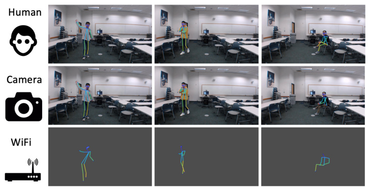

Figure 1: Person pose estimation examples of a camera-based approach (AlphaPose [8]) and the
WiFi-based approach (ours). Rendered images in the _1st_ row are manually marked.


by the adjacency matrix in the graph theory. This approach would take the length constraint of pose
coordinates and make pose estimation can be done with FCN.


When solve these two challenges, we achieve single person pose estimation with WiFi. Evaluation
over 80k images shows that our approach achieve single person pose well.


The contribution of this paper can be summarized as follows.


1. We put forwards a question that whether WiFi can be used like cameras for vision problem. We
positively answered this question by demonstrating that WiFi singles can be used for single person
pose estimation.


2. To answer this question, we built a multi-modality system, collected a dataset and propose a novel
deep networks to learn the mapping from WiFi signals to person keypoint coordinates.


**2** **Related Work**


**Camera.** Estimating multi-person pose from RGB images is a widely-studied problem [13–15]. The
leading solutions of COCO Challenge, such as AlphaPose [8] and CPN [9], are prone to apply a
person detector to crop every person from images, then to do single person pose estimation from
cropped feature maps, regressing the heatmap of each body keypoints. Coordinates with highest
confidence are the estimation of single person pose.


**Other sensors.** Due to the potential usages of pose estimation, researchers have applied many other
sensors to estimate person body pose or sketch. Wall++ [16] enables a common wall large electrodes
with water-based nickel [17] painted. Then the Wall++ can sense airborne electromagnetic variance
caused by human body and estimate person pose. LiSense [18] and StarLight [19] use ceiling
LED and photo-resistor blanket to capture human body shadow on the blanket, then reconstruct
body sketch/pose. With promoted technology, person’s hand can also be reconstructed by similar
systems [20]. RF-Capture [21] and RF-Pose [22] implements radars with frequency modulated
continuous wave (FMCW) equipment to estimate person body sketch/pose. Even, single-photon
sensors can be used to reconstruct person body [23,24]. Comparing to these sensors, devices with
WiFi chips may be the most pervasive, such as routers, cell phones and blooming Internet-of-Things.


**3** **Background**


2


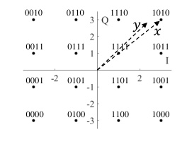

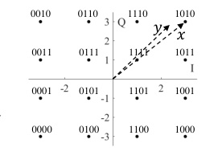

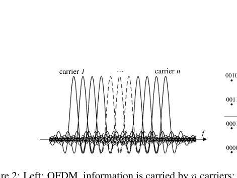

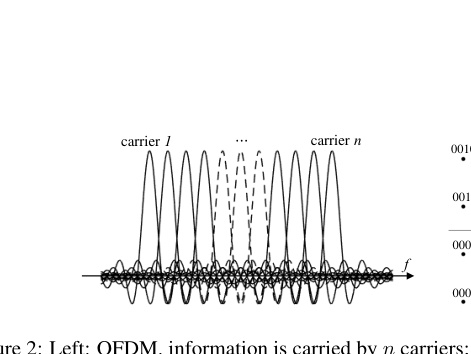

modulated signal carries 4 bits data. If carrying ‘1010’, it would be modulated to _x_ = 3 + 3 _i_ and
broadcasts. The received signal is _y_, and the variation during propagation is _h_ = _y/x_, which is used
for human sensing.


**3.1** **WiFi Signals and Channel State Information**


Under IEEE 802.11 n/g/ac protocols, WiFi works around 2.4/5GHz (central frequency) with multiple
channels. In each channel, the bandwidth is 20/40/80/160MHz. Within the band, carriers with
different frequencies are modulated to carry information for wireless communication in parallel,
which is called orthogonal frequency division multiplexing (OFDM) and illustrated in the left of Fig. 2.
During propagation, WiFi carriers decay in power and shift in phase. Moreover, their frequencies
may also change when encountering a moving object due to the Doppler Effect. Channel State
Information (CSI), a physical layer indicator, can be used to represent these variation of carriers.


Take the modulation method of 16-quadrature amplitude modulation (16-QAM) for example [2], as
shown in the right of Fig. 2, one modulated carrier contains 4bits information one time. When the
sender sends a ‘1111’ to the receiver, the carrier would be modulated to _x_ = 1 + 1 _i_ . If the receiver
receives a _y_ = 0 _._ 8 + 0 _._ 9 _i_ . Thus the variation happening during propagation is _h_ = _y/x_ = 0 _._ 2 + 3 _._ 4 _i_,
which is called CSI of this carrier. For the human sensing application, human body as an object, is
able to make carrier change. In this paper, we aims to learn the mapping rule from the change to
single person pose coordinates. We set WiFi working within a 20MHz band, the CSI of 30 carriers
can be obtained through a open-source tool [25]. In the remaining content of this paper, WiFi signals
and CSI indicate the same thing if not stated specially.


**3.2** **AlphaPose**


AlphaPose is an open-source multi-person pose estimation repository [3], which is also applicable
for single person pose estimation. AlphaPose is a two-step framework, which first detects person
bounding boxes by a person detector (YOLOv3 [26]) then estimates pose for each detected box by
the pose regressor. With the innovative regional multi-person pose estimation framework (RMPE) [8],
AlphaPose gains estimation resilience to the inaccurate person detection, which largely facilitates the
pose estimation performance. Please refer [8] for more details on AlphaPose and RMPE.


When applied to single person pose estimation, AlphaPose generates _n_ three-element predictions
in the format of ( _xi, yi_ ; _ci_ ), where _n_ is the number of keypoints to be estimated, _xi_ and _yi_ are the
coordinates of the _i-th_ keypoint, and _ci_ is the confidence of the above coordinates. In this paper,
we use the COCO person keypoint setting and _n_ is 18. Four estimation examples of AlphaPose are
shown in the top of Figure. 1.


**4** **Methodology**


2More modulation method can be found at, http://mcsindex.com/
3https://github.com/MVIG-SJTU/AlphaPose/tree/pytorch


3


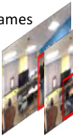

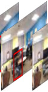

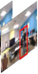


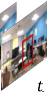

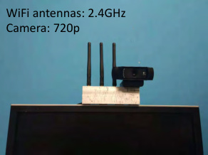

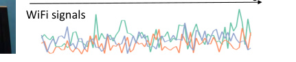

with WiFi. Right: Examples of frames and WiFi signals of the 10th,20th and 30th carriers.


4


5


18


7


8


𝑥𝑦𝑐

|Col1|Col2|Col3|Equ. 1|
|---|---|---|---|
|||||


18×3


|𝑦.|Col2|Pose Adjacent Matrix<br>3×18×18|Col4|
|---|---|---|---|
|𝑦.||Pose Adjacent Matrix<br>3×18×18|Pose Adjacent Matrix<br>3×18×18|
|Pose Adjacent Matrix<br>3×18×18|Pose Adjacent Matrix<br>3×18×18|Pose Adjacent Matrix<br>3×18×18|Pose Adjacent Matrix<br>3×18×18|
|Pose Adjacent Matrix<br>3×18×18|Pose Adjacent Matrix<br>3×18×18|Pose Adjacent Matrix<br>3×18×18||


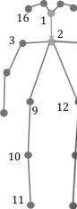

Figure 4: CMU keypoint ordering [14] and pose adjacent matrix.


**4.1** **System Build**


To do pose estimation from WiFi by learning, we must have pose annotations. However we cannot
mark person pose coordinates in the WiFi signals, thus we use a camera aligned with WiFi antennas
to capture person videos. Then the video is processed by AlphaPose [8] for pose annotations in
coordinates and confidences. Besides, the camera and WiFi antennas are synchronized by the their
recorded time-stamps. The WiFi CSI recording system is comprised with 2 ends, one 3-antenna
sender and one 3-antenna receiver. The sender broadcasts WiFi signals, meanwhile the receiver
parses CSI through [25] when receiving the broadcasting WiFi. In our setting, the parsed CSI is a
tensor with the size of _n ×_ 30 _×_ 3 _×_ 3, where the _n_ is for the number of received WiFi packages; 30
is for the subcarrier number; the last two 3s represent the antenna numbers of sender and receiver,
respectively. The WiFi pose system is shown Fig. 3. In our data acquisition, we set the sampling rate
of WiFi devices and the camera as 100Hz and 20Hz, respectively. Thus we have a paired dataset in
which every 5 CSI samples and one image frame are synchronized by their time-stamps.


**4.2** **Pose Adjacent Matrix**


As Section. 3.2 said, we have 18 person keypoint coordinates, ( _x, y_ ; _c_ ), for each video frame from
those with single person. Note that AlphaPose may predict multiple persons for single-person
frame (false-positive), in this situation, we only keep the one with highest confidence. Many work
have demonstrated that regressing keypoint coordinates harms the generalization ability in person pose
estimation []. Thus in this paper, we learn to regress pose adjacent matrix (PAM), instead of directly
regressing person keypoint coordinates. The PAM is a 3 _×_ 18 _×_ 18 matrix, also annotating the pose
coordinates and confidences of 18 keypoints. The PAM is comprised of 3 submatrixes, _x_ _[′]_, _y_ _[′]_ and _c_ _[′]_ .
The _x_ _[′]_ and _c_ _[′]_ are generated by Equ. (1) from the 18 three-element entries: ( _xi, yi_ ; _ci_ ) _, i ∈_ [1 _,_ 2 _, ...,_ 18].
The _y_ _[′]_ is generated similar to generating _x_ _[′]_ .


        - _xi −_ _xj,_ _i ̸_ = _j_ ;         - _ci × cj,_ _i ̸_ = _j_ ;
_x_ _[′]_ _i,j_ [=] _xi,_ _i_ = _j._ _c_ _[′]_ _i,j_ [=] _ci,_ _i_ = _j._ (1)


4


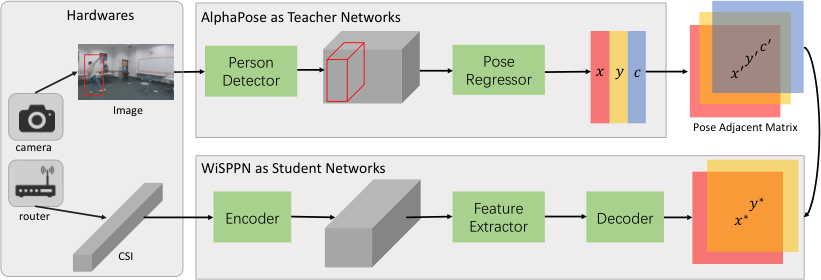

Figure 5: WiSPPN System Framework


To be specific in the Graph Theory view, we take person skeleton as a directed complete
graph (DCG) [27], each keypoint as a node of the graph. For the _x_ _[′]_ and _y_ _[′]_ of PAM, the diagonal items are the coordinate values in _x_ and _y_ axes of these 18 nodes, respectively. Meanwhile,
the elements in other indexes are the displacement of two adjacent nodes–hence the name of pose
adjacent matrix. For the _c_ _[′]_ of PAM, the diagonal items are the confidence values of corresponding
nodes. While we think the displacement between two nodes happens independently, thus we computer
_c_ _[′]_ _i,j_ [=] _[ c][i][ ×][ c][j]_ [ for other indexes. Finally, we innovatively embed person keypoint coordinates as well]
as the displacements between keypoints into the PAM.


The main advancement of PAM is that it provides additional constraint of human skeleton shape
for person pose estimation. Take the displacement in _y_ axis from the _nose_ to the _neck_ for example,
the displacement is a negative value in majority of situation because the neck is below the nose in
human skeleton for a standing person. The negativity take the direction of nose to neck as constraint.
Besides, the absolute value of the displacement take the length of nose to neck as constraint. When
we regress PAM, the additional regression on its displacements work as the regularization item, taking
person skeleton shape into consideration and highly increasing the approach generalization ability
comparing to regressing keypoint coordinates directly.


**4.3** **Network Framework**


We donate the training dataset as **D** = _{_ (I _t,_ C _t_ ) _, t ∈_ [1 _, n_ ] _}_, where I _t_ and C _t_ are a pair of synchronized image frame and CSI series, respectively; _t_ means the sampling moment; and _n_ is the dataset
size. We propose a novel deep network to train **D** for the purpose of learning to a mapping rule
from CSI series to person body keypoints. The network framework is comprised of AlphaPose [8] as
a teacher network and WiSPPN as the student network, shown in Fig. 5. The teacher and student
network are termed as **T** ( _·_ ) and **S** ( _·_ ), respectively. For each (I _t,_ C _t_ ) pair, **T** ( _·_ ) takes I _t_ as input, and
outputs the corresponding body keypoint coordinates and confidence, ( _xt, yt_ ; _ct_ ), with the person
detector and pose regressor. We then convert the outputs to a body pose adjacent matrix, PAM _t_, with
aforesaid Euqation. 1. We formulize the operation of the teacher network as **T** (I _t_ ) _→_ PAM _t_, where
PAM _t_ is the cross-modality supervision to teach **S** ( _·_ ).

We go into details on **S** ( _·_ ), i.e., WiSPPN. In the training stage, **S** ( _·_ ) takes C _t_ as input, and outputs
a corresponding prediction of pose adjacent matrix. Then **S** ( _·_ ) is optimized by the supervision
of PAM _t_ . As shown in Fig. 5, WiSPPN consists of three key modules, i.e., the encoder, feature
extractor and the decoder. A C _t_ is converted to the PAM _t_ prediction undergoing these three modules
successively. Next we explain our designing intentions and parameter details on these three modules.


1. Encoder. The encoder is designed to upsample C _t_ to a proper width and height which are suitable
for the mainstream convolutional backbone networks such as VGG [28] and ResNet [11]. Recall
that our WiFi system is comprised of a sender and a receiver both with 3 antennas, which outputs
CSI samples with size of 30 _×_ 3 _×_ 3 through a open-source tool [25], where the 30 is the number
of OFDM carriers described in Section. 3.1. As said in Section. 4.1, one image matches with 5
continuous CSI samples due to the sampling rate inconformity, leading to C _t ∈_ **R** [5] _[×]_ [30] _[×]_ [3] _[×]_ [3], and
we reshape it to be 150 _×_ 3 _×_ 3 along the time axis, which makes C _t ∈_ **R** [150] _[×]_ [3] _[×]_ [3] . However, a
general RGB image is with size like 3 _×_ 224 _×_ 224, where 3 is for the 3 color channels in Red, Green


5


|Col1|Block 1 Block 2 Block 3 Block 4|Col3|Col4|Col5|Col6|Col7|Col8|Col9|Col10|Col11|Col12|Col13|Col14|Col15|Col16|Col17|Col18|Col19|Col20|Col21|Col22|Col23|Col24|Col25|Col26|Col27|Col28|Col29|Col30|Col31|Col32|Col33|Col34|
|---|---|---|---|---|---|---|---|---|---|---|---|---|---|---|---|---|---|---|---|---|---|---|---|---|---|---|---|---|---|---|---|---|---|
|||||||||||||||||||||||||||||||||||
|||||||||||||||||||||||||||||||||||
|C"|||||||||||||||||||||||||||||||||F"<br>300×18×|
|C"|C"|C"|C"|C"|C"|C"|C"|C"|C"|C"|C"|C"|C"|C"|C"|C"|C"|C"|C"|C"|C"|C"|C"|C"|C"|C"|C"|C"|C"|C"|C"|C"|C"|
|C"||||||||||||||||||||||||||||||||||


Figure 6: Four stacked residual blocks (16 convolutional layers) work as the feature extractor, and
convert C _t_ to F _t_ .

|Input.|C ∈R150×144×144<br>t|Col3|
|---|---|---|
|Block name|Output size|Parameters|
|Block 1|150x144x144|~~~~<br><br>3_ ×_ 3_, c_ = 150_, s_ = 1<br>3_ ×_ 3_, c_ = 150_, s_ = 1<br>3_ ×_ 3_, c_ = 150_, s_ = 1<br>3_ ×_ 3_, c_ = 150_, s_ = 1<br>~~~~<br>|
|Block 2|150x72x72|~~~~<br><br>3_ ×_ 3_, c_ = 150_, s_ = 2<br>3_ ×_ 3_, c_ = 150_, s_ = 1<br>3_ ×_ 3_, c_ = 150_, s_ = 1<br>3_ ×_ 3_, c_ = 150_, s_ = 1<br>~~~~<br>|
|Block 3|300x36x36|~~~~<br><br>3_ ×_ 3_, c_ = 300_, s_ = 2<br>3_ ×_ 3_, c_ = 300_, s_ = 1<br>3_ ×_ 3_, c_ = 300_, s_ = 1<br>3_ ×_ 3_, c_ = 300_, s_ = 1<br>~~~~<br>|
|Block 4|300x18x18|~~~~<br><br>3_ ×_ 3_, c_ = 300_, s_ = 2<br>3_ ×_ 3_, c_ = 300_, s_ = 1<br>3_ ×_ 3_, c_ = 300_, s_ = 1<br>3_ ×_ 3_, c_ = 300_, s_ = 1<br>~~~~<br>|
|**Output.**|F_t ∈_**R**~~300~~~~_×_18~~~~_×_18~~|F_t ∈_**R**~~300~~~~_×_18~~~~_×_18~~|


Table 1: Parameters of the feature extractor. The 3 _×_ 3 means a convolutional layer with 3 _×_ 3 kernel;
_c_ and _s_ stand for the _out-channel_ and _stride_ of a convolutional layer.


and Blue; and 224s are the height and width of the image. To enlarger the width and height of CSI
samples, CSI-Net [10] use 8 stacked transposed convolutional layers to upsample its input from size
of 30 _×_ 1 _×_ 1 to 6 _×_ 224 _×_ 224 gradually, which is operation-consuming. In WiSPPN, we apply one
bilinear interpolation operation to directly convert C _t ∈_ **R** [150] _[×]_ [144] _[×]_ [144] for further feature extraction.


2. Feature extractor. With the upsampled C _t_, the feature extractor are used to learn efficient
features for the person pose estimation. Because C _t_ lacks spatial information of person body
keypoints comparing to images, we need a powerful feature extractor to release its spatial information.
Conventionally, a deeper network could have a more powerful feature learning ability. Thus we tend
to use a deeper network as the feature extractor of WiSPPN. However, deeper networks are prone to be
gradient vanishing or gradient exploding because the chain rule in the backpropagation optimization
could result in exponential gradients in the very deep convolutional layers. The ResNets [11] are
a cluster of the most widely-used backbone networks in deep learning domain, especially in the
computer vision research. The ResNets alleviate this problem by the shortcut connection and residual
blocks. Considering this advantage, we stack 4 basic blocks of ResNet [11] (16 convolutional
layers) as the feature extractor of WiSPPN (shown in Fig 6), which learn features with a size of
300 _×_ 18 _×_ 18, termed as F _t_ . The detailed parameters of feature extractor are listed in Table. 1. Note
that a batch normalization [29] and a rectified linear unit activation [30] follow every convolutional
layer, successively.


3. Decoder. The decoder is designed to do shape adaption between the learned features, F _t_, and the
supervision outputted by **T** ( _·_ ), PAM _t_ . As described in Section. 4.2, the pose adjacent matrix is a
novel form for embedding the 18 body keypoint coordinates and the corresponding confidences, and
is with the size of 3 _×_ 18 _×_ 18. In the pose estimation task, a body keypoint can be localized as in
two coordinates, i.e., the _x_ axis and the _y_ axis. Thus the decoder is designed to take F _t_ as input and


6


𝐶𝑜𝑛𝑣1 𝐶𝑜𝑛𝑣2


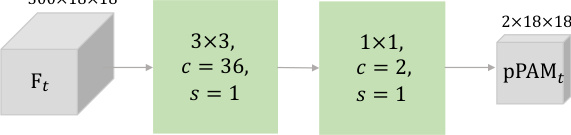

Figure 7: Two convolutional layers work as the decoder to predict pose adjacent matrix. Abbreviations
share the same meaning as in Table. 1.


predict pose adjacent matrix within ( _x, y_ ) dimensions, leading to a predicted pose adjacent matrix
pPAM _t ∈_ **R** [2] _[×]_ [18] _[×]_ [18] . To achiever this purpose, we stack two convolutional layers illustrated in
Fig. 7, where _Conv_ 1 is mainly to release channel-wise information (from 300 to 36); and _Conv_ 2 is
mainly to further reorganize spatial information of F _t_ with the 1 _×_ 1 convolutional kernels.


Summarily, with the encoder, feature extractor, and decoder, the student network, WiSPPN, predicts a
pose adjacent matrix on each CSI input, C _t_ . We formalize this process as **S** (C _t_ ) _→_ pPAM _t_ . During
training stage, every predicted pPAM _t_ is supervised by the corresponding result of the teacher
network, i.e., PAM _t_ . Once the student network learns well, it gains the ability to do single person
pose estimation only with CSI input. Next we describe processes of training stage, including the loss
computation and implementation details.


**4.4** **Pose Adjacent Matrix Similarity Loss**


As above description, **T** ( _·_ ) outputs PAM _∈_ **R** [3] _[×]_ [18] _[×]_ [18] as supervisions, and **S** ( _·_ ) outputs pPAM _∈_
**R** [2] _[×]_ [18] _[×]_ [18] as predictions. With the supervisions and the predictions, L2 loss is a basic option to be
applied to optimize WiSPPN as follows.


_L_ = _∥_ pPAM _[x]_ _−_ PAM _[x]_ _∥_ [2] 2 [+] _[ ∥]_ [pPAM] _[y][ −]_ [PAM] _[y][∥]_ 2 [2] (2)


where _∥·∥_ [2] 2 [is a operator to compute L2 distance;][ pPAM] _[x]_ [ and][ PAM] _[x]_ [ are the prediction and supervi-]
sion of pose adjacent matrix for body keypoint coordinate in the _x_ axis, respectively; pPAM _[y]_ and
PAM _[y]_ are with similar representation while in the _y_ axis.


In this paper, we take the prediction confidence of keypoints in to the loss computing as follows.


_L_ = PAM _[c]_ _∗_ ( _∥_ pPAM _[x]_ _−_ PAM _[x]_ _∥_ [2] 2 [+] _[ ∥]_ [pPAM] _[y][ −]_ [PAM] _[y][∥]_ 2 [2][)] (3)


**4.5** **Training Details and Pose Association**


We implemented WiSPPN with Pytorch 1.0. The network is trained for 20 epochs with initial learning
rate of 0.001, batch size of 32 and Adam optimizer. The learning rate decays by 0.5 at the epoch of
5th, 10th and 15th.


Once WiSPPN trained, we use it to estimate person pose from testing CSI samples. Taking one
sample for example, we can get a predicted PAM (pPAM _∈R_ [2] _[×]_ [18] _[ times]_ [18] ). We take the diagonal
elements in pPAM as the body keypoint prediction by following equations.


For _x_ axis:


_x_ _[∗]_ _k_ [= pPAM] (1 _,k,k_ ) _[, k][ ∈]_ [[1] _[,]_ [ 18]] (4)


For _y_ axis:


_yk_ _[∗]_ [= pPAM] (2 _,k,k_ ) _[, k][ ∈]_ [[1] _[,]_ [ 18]] (5)


.


7


no.1 no.2 no.3 no.4


no.5 no.6 no.7 no.8


no.9 no.10 no.11 no.12


no.13 no.14 no.15 no.16


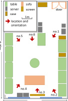


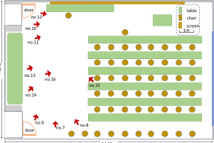


Figure 8: Floor plans and site images of data collection environments. Data were collected at 16
sites from 2 rooms. Arrows mark the location and orientation of WiFi receivers; circles mark the
corresponding location of WiFi senders.


**5** **Evaluation**


**5.1** **Data Collection**


We collected data under an approval of Carnegie Mellon University IRB [4] . We recruited 8 volunteers,
and asked them to do casual daily actions in two rooms of the campus, one laboratory room and one
class room. Floor plans and data collection positions are illustrated in Fig. 8. During the actions, we
run the system in Fig. 3 to record CSI samples and videos, simultaneously. For each volunteer, data
of his first 80% recording is used to train the networks, and data of the last 20% recording is used to
test the networks. The data size of training and testing are 79496 and 19931, respectively.


**5.2** **Experimental Results**


Percentage of Correct Keypoint (PCK) is widely used to evaluate the performance of proposed
approach [15,31,32].


_∥pdi −_ _gti∥_ [2] 2

~~_[√]_~~ 2


PCKi@ _a_ = [1]

_N_


_N_

- I


_i_ =1


_rh_ [2] + _lh_ [2] _[≤]_ _[a]_


_,_ (6)


where I( _·_ ) is a binary indicator that outputs 1 while true and 0 while false. are the same as Equation.
_N_ is the number test frames. _i_ denotes the index of body joint and _i ∈{_ 1 _,_ 2 _, ...,_ 18 _}_ . The _rh_ and

_[√]_ 2
_lh_ are for the positions of the right shoulder and the left hip, respectively. Thus the _rh_ [2] + _lh_ [2]

can be regarded as the length of the upper limb, which is used to normalize the prediction error,
_∥pdi −_ _gti∥_ [2] 2 [, where] _[ pd]_ [ is prediction coordinates and] _[ gt]_ [ is the ground-truth.]


Table. 5.2 shows the estimation performance of 18 body keypoint in PCK@5, PCK@10, PCK@20,
PCK@30, PCK@40, and PCK@50. From the table, we can see WiSPPN do pose estimation well.
Figure. 9 illustrates some estimation comparisons between AlphaPose and WiSPPN. The results show
that WiSPPN can work single pose estimation with comparable results to cameras.


**6** **Conclusion**


In this paper, we build a system and propose a novel network termed WiSPPN for a fine-grained WiFi
sensing, i.e., single person pose estimation. The experimental results show that WiFi sensors can
achieve a comparable performance in fine-grained human sensing to cameras.


**Acknowledgments**


We thank Jianwei Feng, Zeyi Huang and Sanping Zhou for valuable discussions. Fei Wang is
supported by China Scholarship Council.


4No. STUDY2018_00000352


8


|Order|Keypoint|PCK@5|PCK@10|PCK@20|PCK@30|PCK@40|PCK@50|
|---|---|---|---|---|---|---|---|
|1|Nose|0.0222|0.1072|0.332|0.5386|0.6824|0.7634|
|2|Neck|0.0784|0.2222|0.5255|0.7007|0.8157|0.8797|
|3|R. Shoulder|0.0575|0.1922|0.502|0.7098|0.8261|0.8941|
|4|R. Elbow|0.0536|0.1673|0.4235|0.6444|0.7752|0.8601|
|5|R. Wrist|0.0353|0.081|0.2902|0.5085|0.6745|0.7869|
|6|L. Shoulder|0.0575|0.2026|0.4993|0.7111|0.8366|0.9059|
|7|L. Elbow|0.0431|0.1373|0.4131|0.6275|0.7725|0.8732|
|8|L. Wrist|0.0235|0.068|0.2601|0.4928|0.6405|0.7765|
|9|R. Hip|0.0471|0.1477|0.4497|0.6536|0.7869|0.8575|
|10|R. Knee|0.0418|0.1373|0.3869|0.583|0.7425|0.8484|
|11|R. Ankle|0.017|0.0771|0.2627|0.4588|0.5987|0.7085|
|12|L. Hip|0.0458|0.1712|0.4523|0.6484|0.7791|0.8824|
|12|L. Knee|0.0353|0.1216|0.3856|0.617|0.7843|0.8693|
|14|L. Ankle|0.0209|0.0627|0.2471|0.4497|0.6261|0.7268|
|15|R. Eye|0.0431|0.1477|0.4301|0.6183|0.7516|0.817|
|16|L. Ear|0.0288|0.1542|0.3778|0.5712|0.6641|0.7346|
|17|R. Ear|0.0405|0.132|0.3791|0.6039|0.7085|0.7987|
|18|L. Ear|0.0353|0.1281|0.366|0.5111|0.6288|0.7085|
|Average|Average|0.04|0.14|0.38|0.59|0.73|0.82|


Table 2: Results in PCK. ‘R.’ and ‘L.’ are for right and left respectively.


Figure 9: Result samples in 2 rooms.


**References**


[1] D. Vasisht, S. Kumar, and D. Katabi, “Decimeter-level localization with a single wifi access point,” in
_13th {USENIX} Symposium on Networked Systems Design and Implementation ({NSDI} 16)_, 2016, pp.
165–178.


[2] M. Kotaru, K. Joshi, D. Bharadia, and S. Katti, “Spotfi: Decimeter level localization using wifi,” in _ACM_
_SIGCOMM Computer Communication Review_, vol. 45, no. 4. ACM, 2015, pp. 269–282.


[3] K. Qian, C. Wu, Y. Zhang, G. Zhang, Z. Yang, and Y. Liu, “Widar2. 0: Passive human tracking with a single
wi-fi link,” in _Proceedings of the 16th Annual International Conference on Mobile Systems, Applications,_
_and Services_ . ACM, 2018, pp. 350–361.


9


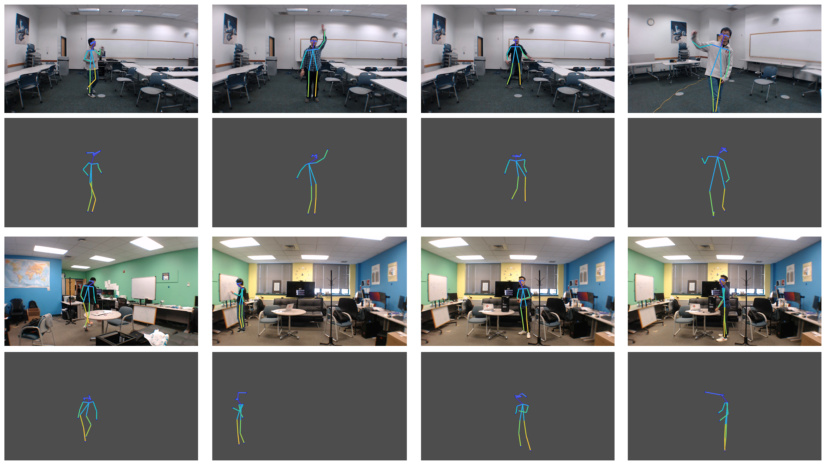
[4] X. Li, S. Li, D. Zhang, J. Xiong, Y. Wang, and H. Mei, “Dynamic-music: accurate device-free indoor
localization,” in _Proceedings of the 2016 ACM International Joint Conference on Pervasive and Ubiquitous_
_Computing_ . ACM, 2016, pp. 196–207.


[5] W. Wang, A. X. Liu, M. Shahzad, K. Ling, and S. Lu, “Understanding and modeling of wifi signal
based human activity recognition,” in _Proceedings of the 21st annual international conference on mobile_
_computing and networking_ . ACM, 2015, pp. 65–76.


[6] A. Virmani and M. Shahzad, “Position and orientation agnostic gesture recognition using wifi,” in _Proceed-_
_ings of the 15th Annual International Conference on Mobile Systems, Applications, and Services_ . ACM,
2017, pp. 252–264.


[7] M. Kotaru and S. Katti, “Position tracking for virtual reality using commodity wifi,” in _Proceedings of the_
_IEEE Conference on Computer Vision and Pattern Recognition_, 2017, pp. 68–78.


[8] H.-S. Fang, S. Xie, Y.-W. Tai, and C. Lu, “Rmpe: Regional multi-person pose estimation,” in _Proceedings_
_of the IEEE International Conference on Computer Vision_, 2017, pp. 2334–2343.


[9] Y. Chen, Z. Wang, Y. Peng, Z. Zhang, G. Yu, and J. Sun, “Cascaded pyramid network for multi-person
pose estimation,” in _Proceedings of the IEEE Conference on Computer Vision and Pattern Recognition_,
2018, pp. 7103–7112.


[10] F. Wang, J. Han, S. Zhang, X. He, and D. Huang, “Csi-net: Unified human body characterization and
action recognition,” _arXiv preprint arXiv:1810.03064_, 2018.


[11] K. He, X. Zhang, S. Ren, and J. Sun, “Deep residual learning for image recognition,” in _Proceedings of the_
_IEEE conference on computer vision and pattern recognition_, 2016, pp. 770–778.


[12] J. Long, E. Shelhamer, and T. Darrell, “Fully convolutional networks for semantic segmentation,” in
_Proceedings of the IEEE conference on computer vision and pattern recognition_, 2015, pp. 3431–3440.


[13] S.-E. Wei, V. Ramakrishna, T. Kanade, and Y. Sheikh, “Convolutional pose machines,” in _CVPR_, 2016.


[14] Z. Cao, T. Simon, S.-E. Wei, and Y. Sheikh, “Realtime multi-person 2d pose estimation using part affinity
fields,” in _CVPR_, 2017.


[15] A. Newell, K. Yang, and J. Deng, “Stacked hourglass networks for human pose estimation,” in _European_
_Conference on Computer Vision_ . Springer, 2016, pp. 483–499.


[16] Y. Zhang, C. J. Yang, S. E. Hudson, C. Harrison, and A. Sample, “Wall++: Room-scale interactive and
context-aware sensing,” in _Proceedings of the 2018 CHI Conference on Human Factors in Computing_
_Systems_ . ACM, 2018, p. 273.


[17] MG Chemicals. Product Information at [https://www.mgchemicals.com/](https://www.mgchemicals.com/products/emi-and-rfi-shielding/water-based-conductive-coatings-wb-series/841wb-super-shield-water-based-nickel-conductive-coating)
[products/emi-and-rfi-shielding/water-based-conductive-coatings-wb-series/](https://www.mgchemicals.com/products/emi-and-rfi-shielding/water-based-conductive-coatings-wb-series/841wb-super-shield-water-based-nickel-conductive-coating)
[841wb-super-shield-water-based-nickel-conductive-coating.](https://www.mgchemicals.com/products/emi-and-rfi-shielding/water-based-conductive-coatings-wb-series/841wb-super-shield-water-based-nickel-conductive-coating)


[18] T. Li, C. An, Z. Tian, A. T. Campbell, and X. Zhou, “Human sensing using visible light communication,” in
_Proceedings of the 21st Annual International Conference on Mobile Computing and Networking_ . ACM,
2015, pp. 331–344.


[19] T. Li, Q. Liu, and X. Zhou, “Practical human sensing in the light,” in _Proceedings of the 14th Annual_
_International Conference on Mobile Systems, Applications, and Services_ . ACM, 2016, pp. 71–84.


[20] T. Li, X. Xiong, Y. Xie, G. Hito, X.-D. Yang, and X. Zhou, “Reconstructing hand poses using visible light,”
_Proceedings of the ACM on Interactive, Mobile, Wearable and Ubiquitous Technologies_, vol. 1, no. 3, p. 71,
2017.


[21] F. Adib, C.-Y. Hsu, H. Mao, D. Katabi, and F. Durand, “Capturing the human figure through a wall,” _ACM_
_Transactions on Graphics (TOG)_, vol. 34, no. 6, p. 219, 2015.


[22] M. Zhao, T. Li, M. A. Alsheikh, Y. Tian, H. Zhao, A. Torralba, and D. Katabi, “Through-wall human
pose estimation using radio signals,” in _2018 IEEE/CVF Conference on Computer Vision and Pattern_
_Recognition_ . IEEE, 2018, pp. 7356–7365.


[23] D. Shin, F. Xu, D. Venkatraman, R. Lussana, F. Villa, F. Zappa, V. K. Goyal, F. N. Wong, and J. H. Shapiro,
“Photon-efficient imaging with a single-photon camera,” _Nature communications_, vol. 7, p. 12046, 2016.


[24] M. O’Toole, F. Heide, D. B. Lindell, K. Zang, S. Diamond, and G. Wetzstein, “Reconstructing transient
images from single-photon sensors,” in _IEEE Conference on Computer Vision and Pattern Recognition_ .
IEEE, 2017, pp. 2289–2297.


[25] D. Halperin, W. Hu, A. Sheth, and D. Wetherall, “Tool release: Gathering 802.11 n traces with channel
state information,” _ACM SIGCOMM Computer Communication Review_, vol. 41, no. 1, pp. 53–53, 2011.


[26] J. Redmon and A. Farhadi, “Yolov3: An incremental improvement,” _arXiv preprint arXiv:1804.02767_,
2018.


[27] D. B. West _et al._, _Introduction to graph theory_ . Prentice hall Upper Saddle River, NJ, 1996, vol. 2.


10


[28] K. Simonyan and A. Zisserman, “Very deep convolutional networks for large-scale image recognition,”
_arXiv preprint arXiv:1409.1556_, 2014.


[29] S. Ioffe and C. Szegedy, “Batch normalization: Accelerating deep network training by reducing internal
covariate shift,” _arXiv preprint arXiv:1502.03167_, 2015.


[30] A. Krizhevsky, I. Sutskever, and G. E. Hinton, “Imagenet classification with deep convolutional neural
networks,” in _Advances in neural information processing systems_, 2012, pp. 1097–1105.


[31] M. Andriluka, L. Pishchulin, P. Gehler, and B. Schiele, “2d human pose estimation: New benchmark and
state of the art analysis,” in _CVPR_, 2014, pp. 3686–3693.


[32] Y. Yang and D. Ramanan, “Articulated human detection with flexible mixtures of parts,” _TPAMI_, vol. 35,
no. 12, pp. 2878–2890, 2013.


11


