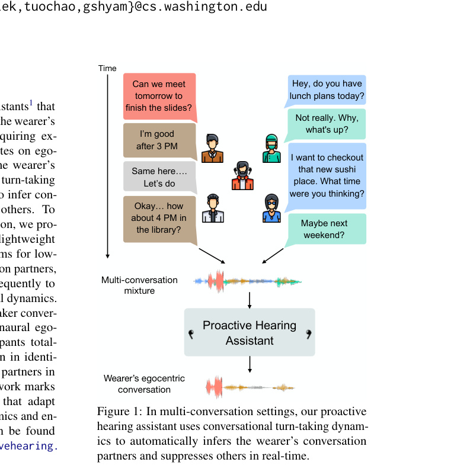
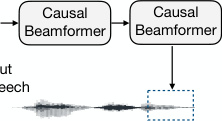
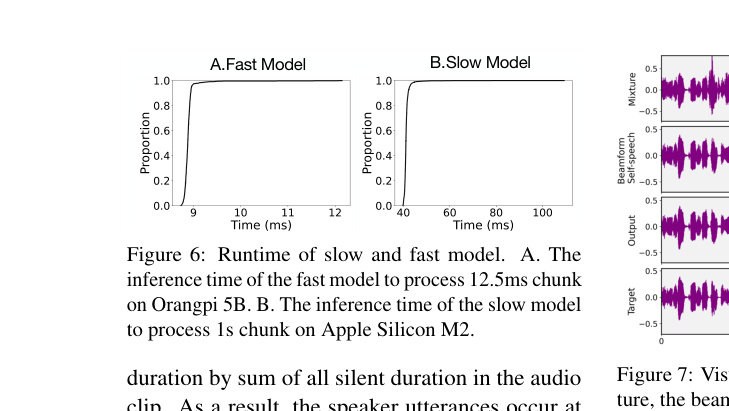
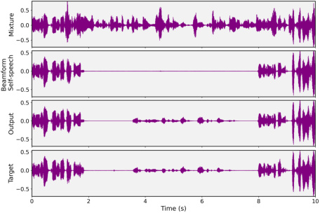

## **Proactive Hearing Assistants that Isolate Egocentric Conversations**

**Guilin Hu** **[*]** **Malek Itani** **[*]** **Tuochao Chen** **Shyamnath Gollakota**
*Co-primary student authors
1Paul G. Allen School of Computer Science & Engineering, University of Washington

[cs.washington.edu/](https://proactivehearing.cs.washington.edu/)

**1** **Introduction**

Human hearing is remarkably adaptable, yet fundamentally limited in crowded auditory environments.
In such settings, isolating relevant voices, known
as the cocktail party problem, becomes especially
difficult. For individuals with hearing loss, distinguishing overlapping conversations can result in
cognitive overload and listening fatigue (SalorioCorbetto and Moore, 2023).
Existing hearing assistants, like augmented devices, wireless earbuds and hearing aids, are “reactive” in that users manually prompt the devices
to pick specific sound sources via spatial filtering or phone-based interfaces (Veluri et al., 2023,

1Our hearing assistants are ‘proactive’ in that they infer and
adapt to conversational engagement without user commands.

2024a). However, these approaches struggle in
multi-party conversations where speakers are spatially dispersed or involve more than two speakers,
making manual enrollment impractical.

We propose an alternative: real-time proactive
hearing assistants that automatically identify and
enhance the voices involved in a conversation with
the wearer, without explicit prompts. Our system
processes egocentric binaural audio to dynamically
track conversational partners and suppress others,
adapting to engagement naturally and seamlessly,
without explicit user commands or prompts.

This task poses three key challenges: (1) identifying and separating conversational partners, (2)
operating on-device in real-time with low latency,
and (3) generalizing to real-world, egocentric,

multi-party environments.
Our approach builds on insights from core NLP
tasks like turn-taking prediction, speaker diarization, and dialog modeling, to design a proactive
hearing assistant. We make three key contributions:
(1) an anchoring mechanism based on the wearer’s
self-speech to track conversation partners, (2) a
dual-model architecture that enables low-latency,
real-time processing, and (3) a real-world end-toend evaluation using egocentric binaural conversational recordings captured with wearable hardware.
Concretely, we anchor the system on the
wearer’s self-speech, extracted using a beamformer
trained on egocentric audio. The assistant activates when the wearer speaks for a few seconds,
signaling conversational intent. The assistant leverages turn-taking cues, such as alternating speech,
low overlap, and temporal coordination, to identify conversational partners. These interactional
patterns, well-studied in dialogue systems (Stivers
et al., 2009; Levinson and Torreira, 2015; Chen
et al., 2024b), allow the proactive assistant to infer
engagement in real time and selectively separate
the voices of relevant speakers.
To meet real-time constraints, the system processes audio in short streaming chunks. However,
as conversations unfold, the sequence length grows,
increasing the memory demands of attention-based
models. Since full self-attention scales quadratically with sequence length (Ainslie et al., 2020;
Cheng et al., 2025), achieving both long-context
awareness and low-latency performance requires a
carefully designed architecture.
To balance real-time responsiveness and conversational context length, we use a dual-model architecture: A fast streaming model runs every 12.5 ms,
extracting the target conversation in real time. A
slower model runs once per second and provides
periodic longer-term conversational embeddings,
capturing conversation turn-taking and discourse
structure without incurring full-attention memory.
We train on diverse speech and conversational
English and Mandarin datasets, including Candor (Reece et al., 2023), LibriTTS (Zen et al., 2019)
and RAMC (Yang et al., 2022), spatialized to emulate egocentric conditions. We evaluate our models
on out-of-distribution SpokenWOZ (Si et al., 2023)
and the Japanese Duplex Conversation Dataset
(Beijing Magic Data Technology Co., Ltd., 2025).
We also collect real-world 2- and 3-speaker conversational testset using binaural egocentric hardware
from 11 participants, totaling 6.8 hours.

In both out-of-distribution and real-world egocentric settings, our system accurately identifies
conversational partners, with accuracies and confusion rates of 80-92% and 1.5-2.2% respectively.
It also improves speech quality of the conversation
partners by 7.22-11.95 dB (SISDRi), and operates
in real time on embedded and mobile devices.
This work shows a path toward proactive hearing
assistants that go beyond source separation to infer
who the user wants to hear, adapting to conversation dynamics in a way that aligns closely with
goals in dialogue systems, speech understanding,
and human-AI interaction. It also offers future potential for adapting LLM agents to track spoken
conversations in noisy, multi-party settings.

**2** **Related work**

**Conversational dynamics.** Understanding multiparty conversation structure has long been a focus in dialogue systems and speech processing.
Prior work has explored speech recognition (Wei
et al., 2022), speaker diarization (Mao et al., 2020),
and speech-driven question answering (You et al.,
2022), often under idealized conditions without interfering speakers. Dialogue-level sentiment analysis and discourse segmentation have also been
explored in clean settings (Shenoy and Sardana,
2020; Yu et al., 2023).
Turn-taking is a central feature of conversational
dynamics (Levinson and Torreira, 2015), and has
been studied using corpus-based models (Sacks
and Schegloff; Stivers et al., 2009; Heldner and
Edlund, 2010) that identify patterns such as alternating speech, pauses, and backchannels. Recent
approaches model turn-taking directly (Ekstedt and
Skantze, 2022; Inoue et al., 2024; Nguyen et al.,
2025), including listener behavior prediction in
dyadic settings (Ng et al., 2022).
Most relevant to our task is Target Conversation
Extraction (TCE) (Chen et al., 2024b), which uses
turn-taking cues to extract a target conversation.
Our work differs in three key aspects: (1) TCE
operates offline and requires future context, making it unsuitable for real-time use; (2) it relies on
explicit speaker embeddings, while we use selfspeech extracted from egocentric binaural audio as
a natural anchor; and (3) it uses monaural recordings, whereas we focus on realistic, spatialized
egocentric audio from wearable devices.

**Audiovisual speech understanding.** Our work
intersects with research in Active Speaker Detec

tion (ASD) and Active Speaker Localization (ASL).
ASD systems identify who is speaking using audiovisual correlations or facial features (Saenko et al.,
2005), while ASL focuses on spatial localization
(Senocak et al., 2018; Jiang et al., 2022; Donley
et al., 2021). Recent work in Selective Auditory Attention Localization extends this to inferring whom
the user is attending to, using egocentric video and
audio (Ryan et al., 2023; Kong et al., 2024).

Efforts in egocentric video understanding have
explored detecting social engagement (Fathi et al.,
2012) and speaker attention (Grauman et al., 2022).
For instance, the Ego4D benchmark includes a
“Talking to Me” task focused on identifying who
is addressing the camera wearer. However, these
tasks typically stop at detection. In contrast, we go
further: identifying, separating, and enhancing all
speakers engaged with the wearer, in real time and
on-device, under real-world constraints.

**Auditory attention decoding.** Research in this
domain attempts to infer the target speaker by correlating brain activity (e.g., EEG or fNIRS) with
competing audio streams (O’Sullivan et al., 2014;
Choudhari et al., 2024; Pan et al., 2024). While
promising, these systems lack real-time deployment capabilities and require bulky or invasive
hardware. Even with miniaturized in-ear EEG sensors (Bleichner and Debener, 2017; Kaveh et al.,
2020), challenges remain in noisy, real-world settings with multiple speakers (Mirkovic et al., 2016).
In contrast, our work explores an dialog-based approach that aligns better with practical hearing assistance, leveraging self-speech as an implicit signal of attention and engagement.

**Proactive assistants.** Prior work has explored
proactive interaction in task planning (Zhang et al.,
2024), user modeling (Lu et al., 2025), and conversational guidance (Chen et al., 2025). However,
these systems focus on information-seeking or planning tasks, which are complementary to our task.

**Augmented hearing.** Contemporary hearing systems support selection of target sound sources, e.g.,
a speaker or sound class, via spatial filtering or manual enrollment (Veluri et al., 2023, 2024a; Chen
et al., 2024a; Srinivas et al., 2024). Apple’s Conversation Awareness mode (Apple, 2024) reduces
background volume upon detecting wearer speech,
but does not perform speaker separation or conversational tracking.

**3** **Proactive Hearing Assistants**

**3.1** **Problem formulation**

The input egocentric audio stream can be decomposed into three components: the target conversation involving the wearer, interfering conversations,
and background noise.
The target conversation consists of the wearer’s
self-speech and the speech of their conversational
partners. Notably, in egocentric recordings, the
wearer’s own speech is typically louder than all
other voices.
Our goal is to identify and separate the wearer’s
conversation partners, which can be done by isolating the target conversation and suppressing model
output during the wearer’s own speech, using ondevice voice activity detection (e.g., as in AirPods (Apple, 2024)). The system can then output
the conversation partners’ speech into the ear.
The system must handle dynamic conversational
settings, where speakers may join or leave the conversation at any time, following natural turn-taking
patterns. Real-world dialogue includes backchannels and overlaps, requiring the model to adapt as
speakers shift between target and interfering conversations. For example, a speaker might begin
as part of the target conversation (e.g., at a dinner
table) but later engage in a separate, interfering
conversation, requiring the system to adapt.
Once the conversation partners are extracted,
their voices must be rendered to the wearer with
minimal delay to preserve a natural conversational
experience. Thus, the system must process audio
in small chunks of 10–20 ms to maintain a latency
below the perceptual threshold. Real-time operation requires each chunk to be processed faster than
it is recorded. Because offloading to a phone or
cloud introduces communication delays (10–30 ms
over Bluetooth and 100–200 ms over the Internet), streaming processing must occur on-device
on compute-limited embedded platforms.
An assumption we make is that the wearer is an
active participant in the conversation. Thus, passive
listening, such as eavesdropping, is a non-goal.

**3.2** **Proactive assistant modeling**

Fig. 2 shows the full architecture, including all subnetworks and the data pipeline. The beamformer
and the slow conversational embedding model operate on audio chunks of _T_ second length, while the
fast streaming model runs on much shorter chunks
of _τ_ seconds ( _τ ≪_ _T_ ). The beamformer takes the

A. B.

Self-speech

Right

. . .

Conversation

Embedding

Clean Output

Figure 2: Overview of our model pipeline. A. The streaming beamformer extracts the wearer’s self-speech from the
binaural mixture. B. Dual-model architecture: the slow model runs every 1s ( _T_ ) on the mixture and self-speech to
produce a conversation embedding; the fast model runs every 12.5 ms ( _τ_ ) on the current mixture and embedding
from the previous 1s ( _T_ ), to output the cleaned target conversation.

egocentric binaural audio stream and isolates the
wearer’s own voice by beamforming toward their
mouth. This self-speech, along with the monaural egocentric audio mixture, is inputted to the
slow model, which generates an embedding every _T_ seconds. This embedding is then used by the
fast streaming model to guide target conversation
extraction for upcoming audio chunks. The fast
model receives a single egocentric audio stream
and the conversational embedding as input.

**3.2.1** **Dual-model processing**

Conversations can occur continuously for very long
durations. Thus, it is useful to utilize attention to
effectively model and retain minutes-long contextual sequences of audio. However, with attention,
it is challenging to meet the strict real-time requirements needed for proactive hearing assistants on
hardware with tight processing capabilities.
Specifically, as conversation length increases, so
does the number of chunks, leading to longer input sequences for the attention mechanism. This
is problematic, as the memory requirements of
full self-attention scale quadratically with sequence
length (Ainslie et al., 2020; Cheng et al., 2025). Ideally, we want to maintain long-context awareness
for accurate filtering while ensuring low memory
usage and real-time performance.
We employ a dual-model pipeline. It incorporates a high-latency, attention-based network
to model long sequences and extract a conversation embedding, and a low-latency, low-complexity
LSTM-based network that integrates this conversation embedding to estimate the target conversation in small chunks. Since the fast model does
not directly attend to historical context, its mem

ory footprint is low. Further, because the large
model processes fewer, longer chunks, it attends
over fewer tokens for the same conversation duration, enabling it to efficiently capture extended
context (details in §A).
Several key design choices support real-time performance. First, the beamformed self-speech is
not fed into the fast model, as doing so would introduce additional processing latency that would
violate real-time constraints. Second, the slow embedding model processes audio _T_ seconds behind
the fast stream. This decoupling allows these models to run remotely on say a smartphone. Further,
it prevents their higher processing latency from
affecting streaming performance, but introduces
a tradeoff: larger _T_ values reduce the system’s responsiveness to conversational dynamics (see §4.5).
Third, both the fast and slow models use monaural
rather than binaural audio as input. This reduces
computational load on the fast model and ensures
the models focus on conversational turn-taking and
dynamics rather than spatial cues.

**3.3** **Training strategy**

Our models must generalize to egocentric binaural
conversations with 2–3 participants and handle dynamic scenarios where participants may leave the
target conversation and join an interfering one. To
jointly model conversation tracking and source separation, we require mixtures of a target egocentric
conversation with a separate interfering conversation with no shared speakers. However, since the
wearer’s self-speech dominates in egocentric audio, we cannot simply mix two egocentric recordings. Instead, we need passive third-person binaural recordings to construct realistic mixtures.

Existing egocentric datasets like EgoCom (Northcutt et al., 2023) and EasyCom (Donley
et al., 2021) are unsuitable for this purpose: EgoCom features the same host in all recordings and
both datasets lack third-person binaural recordings
needed for mixture synthesis.
Instead, we use non-egocentric datasets and spatialize them to simulate egocentric scenarios. We
train on the Candor dataset (Reece et al., 2023),
which contains 850 hours of high-quality 2-speaker
English conversations, and RAMC (Yang et al.,
2022), which has 180 hours of 2-speaker Mandarin
conversations. Both provide clean audio, speaker
IDs, and timestamps. Large open-source datasets
with 3-speaker conversations or complex dynamics
(e.g., speakers switching conversations) are scarce.

**3.3.1** **Synthetic dataset creation**

To address this, we adopt the time-preserving
method from (Chen et al., 2024b) and generate
five synthetic datasets (see §C.1):

 - _Libri (2spk)._ We align LibriTTS (Zen et al.,
2019) audio from two random English speakers
with RAMC (Yang et al., 2022) 2-spk timestamps,
replacing the original Mandarin utterances.

 - _Libri (3spk)._ With RAMC timestamps, we randomly assign each turn to one of three LibriTTS
speakers, creating a synthetic 3-spk conversation.

 - _Libri (leaving)._ A speaker active in the first 20
seconds of the 3-spk conversation leaves and reappears in the interfering conversation between 20–40
seconds, simulating speaker dynamics.

 - _Libri (4spk) and (5spk) (Evaluation only)._ Two
test-only datasets where RAMC test set timestamps are used to generate synthetic four- and fivespeaker conversations by randomly assigning each
turn to one of four or five LibriTTS speakers.

**3.3.2** **Training procedure**

We generate mixtures by combining a target conversation with an interfering conversation and noise.
Each target conversation starts at least 5 seconds of
the wearer’s self-speech, so the models can anchor
to the wearer. Training proceeds in three stages.
We pretrain on the training splits of the three
synthetic datasets and Candor mixtures. The fast
streaming model and the slow conversational embedding model are trained jointly, with a negative
SNR loss computed on the fast model’s output to
reconstruct the target conversation. The conversational embedding model receives ground-truth

self-speech as input.
In the second stage, to simulate egocentric hearing, we spatialize the synthetic and Candor datasets
(see §C.2). Ground-truth self-speech is replaced
with the output of a pretrained beamformer, which
serves as input to the slow model. Both models are
trained jointly using the same loss function.
To address the distribution shift between Candor (Zoom-based, first-time interactions) and realworld, in-person conversations between familiar
participants, in the final stage, we finetune the
model by perturbing the amount of silence and
overlap between speaker utterances (see §D)).

**3.4** **On-device real-time inference**

The fast streaming model runs on a low-power embedded device, while the slower conversational embedding model can operate remotely on device with
more compute. To meet real-time requirements, we
run the fast streaming model on an embedded Orange Pi 5B and the slower conversational model on
Apple M2 silicon, supported by commodity wearable devices. The fast model processes 12.5 ms
audio chunks in 8.9 ms on average, while the slow
model processes 1-second chunks in 41.3 ms. In
addition, we profiled memory usage for the slow
and fast models. We run streaming inference of
the slow and fast models for 100 runs. Then we
measure the peak memory usage averaged over 100
runs. Peak memory is 591.47 MB (slow model) and
86.33 MB (fast model) during streaming inference.

**4** **Evaluation**

**4.1** **Metrics**

Since the beamformer already outputs self-speech
and the proactive assistant aims to help the wearer
hear conversational partners, we compute four metrics for the _partners’ speech_ segments output by
the models (see §B for self-speech results).

 - _SISDRi:_ Scale-Invariant Signal-to-Distortion Ratio improvement (SISDRi) quantifies how much the
target speech is enhanced relative to the noisy input. Higher values indicate better separation and
preservation of the target speech.

- ∆ _PESQ:_ Perceptual Evaluation of Speech Quality (PESQ) estimates speech quality based on human auditory perception. ∆PESQ measures the
perceptual improvement over the input mixture.

 - _Accuracy (Acc):_ Measures how often we correctly select the conversational partner at each conversation turn. A correct selection occurs when: (1)

the conversational partner’s SISDRi > 0, and (2) it
exceeds all interfering speakers’ SISDRi.

 - _Confusion Rate (CR):_ How often we select an
interfering speaker over the target. This occurs
when: (1) the interfering speaker’s SISDRi > 0, and
(2) it exceeds the conversational partner’s SISDRi.

**4.2** **Testsets**

We evaluate our models on several test sets:
synthetic 2-speaker conversations (Libri 2spk),
3-speaker conversations (Libri 3spk), speakerswitching conversations (Libri leaving), and the
Candor test set. There is no speaker or turn-taking
timestamp overlap between the training, validation,
and test sets, ensuring that the models have not seen
the test conversations or speakers during training.
We also assess generalization by testing the
English-trained models on both the RAMC Mandarin test set, which contains no turn-taking timestamp data from training, and the Japanese Duplex
Conversation Dataset (Beijing Magic Data Technology Co., Ltd., 2025). We also tested the model
on Libri (4 spk) and Libri (5 spk), where the model
was not trained on such a large number of speakers. Finally, we evaluate on the out-of-distribution
SpokenWOZ (Si et al., 2023) 2-speaker conversation dataset. Since SpokenWOZ contains relatively
short utterances, we do not enforce the condition
that the wearer speaks for at least 5 consecutive seconds at the beginning. Instead, we randomly select
two recordings with disjoint speakers and designate
the first speaker in the target conversation as the
wearer.

**4.3** **Results**

Table 1 shows evaluation results on several opensource conversational datasets. We use DeepFilterNet2 (Schröter et al., 2022), a widely adopted
speech enhancement model, as our baseline. In
the non-spatialized setting, our dual-model consistently outperforms the baseline across all four metrics. On the synthetic Libri conversational dataset,
the model achieves significant improvements in
both SISDR and PESQ under various conditions,
including 2-, 3-speaker and speaker-leaving scenarios. Additionally, our model achieves a high accuracy to pick the conversational partners and a very
low confusion rate to pick the interfering speakers.
In contrast, the baseline model enhances speech
uniformly without distinguishing between target
and interfering speakers. As it is not conversation

Figure 3: Model enhances then suppresses speaker following shift from target to interfering conversation.

aware or capable of speech separation, it fails to
deliver SISDR improvements.

Fig. 3 shows a scatterplot from the Libri (leaving) test set, where a speaker transitions from the
target conversation to the interfering one. The plot
depicts the SISDRi achieved by our dual-model for
this speaker, both before and after leaving the target
conversation. While part of the target conversation,
the speaker receives a positive SISDRi, indicating
successful enhancement. After switching to the
interfering conversation, the SISDRi becomes negative, showing that the model correctly suppresses
the speaker once they are no longer part of the conversational flow. This shows the model’s ability to
adapt to dynamic, multi-party interactions.

To evaluate the model’s ability to generalize to
conversations involving more than three speakers,
we constructed Libri 4- and 5-speaker datasets,
which were only used as test sets. As shown in
Table 2, although the model was not trained on
conversations with such a number of speakers, it
achieved performance comparable to that observed
on the Libri 2- and 3-speaker datasets. This suggests the model generalizes well to conversations
with previously unseen numbers of target speakers.

In Table 1, we further evaluate the model on SpokenWOZ, an out-of-distribution (OOD) English
dataset, highlighting the generalization ability of
both the model and training approach. In addition, to assess the model’s ability to generalize
across languages, we evaluate it on the Mandarin
RAMC dataset and the Japanese Duplex Conversation Dataset (Beijing Magic Data Technology
Co., Ltd., 2025). As shown in Table 2, our model
reaches a 6.5 dB and a 7.92 dB SISDRi, respectively. This shows that even though our model is
trained solely on English speakers, it can generalize to conversations in other languages, because it
is primarily learning the turn-taking patterns.

We also evaluate our model on the noisy Libri
(2-spk) test set, where WHAM! noise from its test

Table 1: Evaluation on English (Libri, Candor, SpokenWoZ) and Mandarin (RAMC) testsets.

Non-spatialized Spatialized

**Metrics** SISDRi( _↑_ ) Acc ( _↑_ ) CR ( _↓_ ) ∆PESQ( _↑_ ) SISDRi( _↑_ ) Acc( _↑_ ) CR( _↓_ ) ∆PESQ( _↑_ )

**Baseline Model (SE)**

Synthetic Libri -1.95 (1.94) 26.8% 26.3% -0.16 (0.14) -3.31 (2.23) 10.5% 27.7% -0.13 (0.13)
Candor -5.16 (3.19) 13.5% 24.4% -0.29 (0.22) -3.05 (2.84) 18.8% 21.7% -0.16 (0.17)
SpokenWoz (OOD) -5.05 (4.04) 14.7% 14.7% -0.48 (0.33) -3.45 (3.78) 16.8% 9.2% -0.16 (0.21)
RAMC -4.28 (6.01) 13.6% 27.9% -0.32 (0.28) -4.30 (3.37) 6.8% 19.9% -0.17 (0.17)

**Our Dual Models**

Synthetic Libri 11.70 (4.56) 96.3% 1.4% 1.11 (0.30) 14.62 (6.05) 96.8% 0.8% 0.63 (0.23)
Candor 6.75 (4.29) 87.0% 2.7% 0.64 (0.31) 9.82 (3.77) 93.9% 1.1% 0.56 (0.20)
SpokenWoz (OOD) 7.27 (6.11) 84.5% 4.3% 0.58 (0.44) 11.95 (6.22) 92.1% 1.5% 0.52 (0.25)
RAMC 6.50 (7.45) 85.5% 5.6% 0.63 (0.41) 8.05 (9.29) 78.0% 9.4% 0.26 (0.40)

Libri (2spk) 12.48 (4.28) 98.4% 0.6% 1.14 (0.24) 15.68 (5.46) 99.2% 0.2% 0.65 (0.22)
Libri (3spk) 12.03 (4.00) 96.6% 1.2% 1.16 (0.25) 14.29 (6.08) 96.1% 0.6% 0.63 (0.21)
Libri (leaving) 10.58 (5.10) 94.1% 2.5% 1.03 (0.36) 13.89 (6.42) 95.7% 1.5% 0.60 (0.24)

Table 2: SISDRi results for generalization.

**Dataset** SISDRi ( _↑_ )

Libri (2spk) 12.48 (4.28)
Libri (3spk) 12.03 (4.00)
Libri (4spk) 11.94 (4.46)
Libri (5spk) 11.85 (4.58)

RAMC 6.50 (7.45)
Japanese (OOD) 7.92 (5.19)

split is added. The model achieves an SISDRi of
10.37 dB, demonstrating its ability to generalize
to noisy conditions despite not being trained on
such data. Further fine-tuning on noisy data for 35
epochs using the WHAM! training split yields an
improved SISDRi of 11.84 dB.
Finally, we evaluate all models on spatialized test
sets that emulate egocentric conditions, as shown
in Table 1. In egocentric scenarios, speech from
other speakers tends to have lower amplitude than
the wearer’s self-speech due to physical distance.
As a result, after spatializing the synthetic Libri
conversational dataset, the average input SISDR
for the conversation partners drops from 1 dB to
–10 dB, and the average input PESQ decreases from
2.52 to 2.04. Given this challenging setting, our
model achieves a 14.62 dB improvement in SISDR
and a 0.63 increase in PESQ, while maintaining
high speaker selection accuracy (96.8%) and a low
confusion rate (0.8%). We also observe similarly
strong performance across other datasets including
spatialized Candor and on the out-of-distribution
spatialized SpokenWOZ testset.

**4.4** **Subjective human evaluation**

To evaluate the model from a user-centric perspective, we conducted a user study with 11 participants (8 males, 3 females, 1 non-binary) with an

Table 3: Subjective evaluation results (5-point scale).

**Question** **Model Output** **Mixture**

Noise suppression 4.29 (1.19) 1.67 (1.04)
Comprehension 4.35 (1.02) 1.97 (0.93)
Effort 4.45 (0.95) 1.97 (0.96)
Overall MOS 4.30 (1.14) 1.88 (1.02)

age range of 21-65. Each listened to six random
conversations from the Candor dataset, experiencing both the original mixture and the model output
in a random order. Following (Veluri et al., 2024b),
we asked participants four 5-point scale questions
about their experience in focusing on the target
conversation (see §H). As shown in Table 3, the
proposed system improves user-perceived quality
across all four aspects, raising the overall mean
opinion score from 1.88 to 4.30.

**4.5** **Ablation studies**

_Dual-model versus single model._ We compare our
dual-model approach with a single fast streaming
model that uses the self-speech and mixture audio
as input. The single model achieves an SISDR
improvement of only 1.45 dB for the conversation partners, much lower than the dual model’s
12.48 dB. This shows that without the support of
the slower conversation embedding model, the fast
model alone, struggles to capture conversational
dynamics effectively.

_Update rate for conversational embeddings._ Since
the fast streaming model relies on conversation embeddings generated by the slow model, we compare
two embedding update intervals: 1 second and 4
seconds. We train the dual models on the Libri
2-speaker training set for ten epochs each and evaluate them on the corresponding test set. Increasing

Table 4: Evaluation on real egocentric conversations.

**Metrics** SISDRi( _↑_ ) Acc ( _↑_ ) CR ( _↓_ )

**Number of speakers**

2 speakers 7.84 (6.79) 85.0% 1.1%
3 speakers 6.00 (7.14) 73.4% 3.7%

**Augmentation**

✗ 5.49 (5.30) 77.9% 1.2%
✓ 7.22 (6.96) 80.0% 2.2%

Table 5: Impact of perturbing the turn-taking in human
conversations. (SD=standard deviation)

**Perturbation SD** **SISDRi (dB)**

No perturbation 6.75
0.5s 6.25
1s 5.68
1.5s 5.25
2s 4.79
2.5s 4.50
3s 4.16

the update interval from 1s to 4s leads to a drop of
1.22 dB in SISDRi.

_Speaker embedding versus self-speech._ Instead of
anchoring conversation extraction on self-speech,
we also explore using the wearer’s speaker embedding (Variani et al., 2014). Following (Chen et al.,
2024b), we compute 256-dimensional d-vectors
from clean wearer speech, and provide these as embeddings to the slow model. Using speaker embeddings reduces the SISDRi by 2.65 dB compared
to self-speech, likely due to temporal variability
in speech characteristics and lossy representation,
which reduce embedding reliability.

_Beamforming versus self-speech_ . To study the impact of using the beamformer’s self-speech output
versus the ground truth self-speech from the conversation mixture, we use the model trained on
spatialized data from stage 2 and evaluate it on
Libri (2-spk) test set. The difference in SISDRi
between the two modes was less than 0.38 dB.

_Impact of turn-taking disruption._ We performed an
ablation on the Candor test set to assess the impact
of turn-taking pattern disruption. By perturbing
inter-utterance silence durations with shifts sampled from a normal distribution with mean 0 and
varying standard deviation (SD), we increasingly
disrupted the natural turn-taking structure. Table.
5 shows that as SD and overlap ratio increases, performance gradually degrades, as this breaks the
turn-taking structure that the model leverages to
separate the targets.

_Context length._ We trained models with different
context lengths (full context, 10s, 5s, 1s) by mask

Figure 4: SISDRi histogram on egocentric recordings.

ing the slow model’s self-attention to limit each
token’s access to past tokens on Libri 2spk training
set. We then evaluated on the Libri 2spk testset.
Compared to the model with full context access,
SISDRi dropped by 2.12 dB, 4.06 dB, and 5.74 dB
for context lengths of 10s, 5s, and 1s, respectively.
This demonstrates that access to long-term context
is a key factor for the system’s performance.

**5** **Real-World Egocentric Recordings**

We recruited 11 participants (2 female, 9 male)
with an age range of 21–39. The dataset comprises
a total of 6.8 hours of binaural egocentric audio
recordings, including seven two-speaker and five
three-speaker conversations, each lasting approximately 10 minutes. The participants engaged in
open-ended discussions in English, on topics such
as food, hobbies, recent activities, research, workouts, and travel plans, with no constraints on subject matter. All recordings took place in an environment with typical background noise, including
HVAC and ambient sounds. A summary of the
conversation statistics is provided in Table 9.
All sessions took place in the same acoustic environment so they can be mixed for creating mixtures.
During recording, each speaker wore a pair of binaural microphones (Sonic Presence SP15C) and
connected it to a smartphone to capture egocentric
audio of the conversation. Further, in each conversation, a silent participant served as a listener
by wearing the microphones and standing in the
vicinity of the speakers. These passive recordings,
which lack dominant self-speech, serve as representative samples of interfering conversations.

**5.1** **Data pre-processing**

Since each conversation participant recorded their
own egocentric audio, their self-speech appears
with the highest amplitude in their recordings. Using these recordings alongside our beamformer network, we estimated the speech activity timestamps
for each speaker. The authors manually verified

Table 6: When the conversation partners start speaking,
how quickly does the model pick them up?

**Chunk** 0-2s 2-4s 4-6s 6-8s 8-10s

SISDRi (dB) 4.77 8.04 8.17 8.69 9.16

Table 7: Effects of turn-change gap between target conversation and interfering conversation.

**Turn-change** 0-1s 1-2s 2-4s 4-6s - 6s
**Gap**

Proportion 11.3% 12.2% 20.7% 15.5% 40.3%
SISDRi (dB) 4.98 8.03 7.80 8.22 8.46

these timestamps to ensure their quality.
Conversation mixtures were created by combining audio from a target speaker with that of a listener in a separate interfering conversation. To
avoid amplifying noise, denoising (Sainburg et al.,
2020; Sainburg, 2019) was applied only to the target audio, while interfering audio remained unprocessed to preserve realistic ambient noise. Speakers
were not shared across the two conversations. Interfering conversations always involved two speakers,
while target conversations had two or three. Each
sample was constructed to begin with at least 3
seconds of self-speech, and none from a conversation partner. Input SNRs for the target conversation
were uniformly sampled between –10 and 10 dB.
We generated 200 conversation mixtures to serve
as out-of-distribution test set for our model.

**5.2** **Real-world Results**

Table 4 shows performance on real-world egocentric recordings with 2- and 3-speaker conversation
mixtures. The performance drop with 3-speaker
target conversations is because the three speakers
turn-taking dynamic in our training data is all synthesized. Fine-tuning on real 3-speaker conversation datasets may further improve results.
These results show real-world generalization
from simulated training data. Around 80% of conversations have a positive SISDRi (Fig. 4). These
results also show the benefit of augmentation described in §D, which improves performance by
1.73 dB by creating a more diverse distribution of
overlaps and silence in the training set.
_How quickly is a conversation partner picked_
_up?_ We investigate how fast the model enhances a
conversation partner after they begin talking. Using
a 2-second sliding window over each non-wearer
turn in the real-world egocentric dataset, Table 6
shows the average SISDRi, averaged over all turns
and samples in the real-world egocentric dataset. In

Figure 5: Extended periods of wearer silence. The gray
regions denote durations were the wearer was active.

the first 0–2 seconds, SISDRi is 4.77 dB, indicating
initial adaptation. After 2 seconds, it exceeds 8 dB,
showing the model quickly adapts to conversational
partners within a turn.

_How does turn-change collision impact perfor-_
_mance?_ We examine how overlapping turn transitions in target and interfering conversations affect
performance. For each self-to-other turn change
in the target conversation, we compute the time
gap to the nearest turn change in the interference.
A small gap indicates simultaneous speaker transitions. Table 6 shows that 11.3% of turns have gaps
under 1 second, where SISDRi drops to 4.98 dB.
This suggests that closely timed turn-changes can
confuse the model. Future work could address this
by incorporating conversation content.

_What happens with extended periods of wearer_
_silence?_ Fig. 5 shows a real-world example where
the wearer did not speak for over 2 minutes. The
purple curve indicates the SISDRi of the conversational partner in 30-second windows; grey areas show when the wearer was speaking. SISDRi
stayed above 5 dB during intermittent speech but
dropped below zero during prolonged silence, indicating the model failed. Performance recovered
once the wearer resumed speaking, highlighting
the model’s reliance on self-speech as an anchor.

**6** **Conclusion**

We present the first real-time, proactive hearing
assistant that automatically identifies the wearer’s
conversational partners and suppresses unrelated
speech, without requiring explicit user prompts.
Our system runs on-device and generalizes to realworld egocentric recordings despite being trained
only on synthetic data. By leveraging turn-taking
cues to model conversational engagement, our approach connects speech separation with core dialogue modeling tasks. This work takes an important step towards proactive hearing assistants that
interpret and adapt to conversation dynamics.

**7** **Limitations and risks**

**Limitations.** Our system is designed for scenarios
in which the wearer is an active participant in a
conversation, using self-speech as an anchor to
identify conversational partners. It is not suited for
passive listening, such as eavesdropping or passive
consumption.

The current implementation prioritizes real-time,
on-device performance and incorporates conversational turn-taking. While this design choice supports low-latency operation, it may limit the system’s ability to disambiguate overlapping speakers,
especially when multiple speakers begin speaking
simultaneously. Incorporating lightweight contentaware models could be a direction for future work.

In addition, while the model generalizes to realworld egocentric recordings without fine-tuning on
such data, performance could likely benefit from
supervised adaptation to real-world acoustic and
conversation conditions.

Finally, although the model achieved crosslinguistic generalization in evaluations on English,
Mandarin, and Japanese datasets, cultural and linguistic differences in turn-taking behavior (Stivers
et al., 2009) suggest that further fine-tuning for
language- or culture-specific dynamics may improve robustness.

**Ethical considerations.** Proactive hearing assistants hold promise for improving communication
access for individuals with hearing loss, particularly in dynamic and crowded settings. They may
be especially valuable for older adults or users with
limited dexterity, for whom manual control interfaces may be impractical.

However, there are important risks. Incorrect
speaker detection may suppress relevant voices or
amplify unrelated ones. Such errors are particularly
concerning in high-stakes or fast-moving conversational contexts. Improving this remains a key area
for future work.

Additionally, if the assistant fails or behaves unpredictably, users should have a clear and intuitive
means to override or adjust system behavior. One
practical solution could be a physical control (e.g.,
a tactile button) to temporarily disable the assistant or reset its state. Addressing these through
transparent design, user-centric controls, and robust real-world evaluation will be essential for safe
and responsible deployment.

**References**

Joshua Ainslie, Santiago Ontanon, Chris Alberti, Vaclav Cvicek, Zachary Fisher, Philip Pham, Anirudh
Ravula, Sumit Sanghai, Qifan Wang, and Li Yang.
2020. Etc: Encoding long and structured inputs in
transformers. In _EMNLP_ .

[Apple. 2024. Use adaptive audio with your airpods.](https://support.apple.com/en-us/104979)

Beijing Magic Data Technology Co., Ltd. 2025.

[Japanese duplex conversation training dataset.](https://magichub.com/datasets/japanese-duplex-conversation-training-dataset/)

[Martin G. Bleichner and Stefan Debener. 2017. Con-](https://api.semanticscholar.org/CorpusID:2859820)
[cealed, unobtrusive ear-centered eeg acquisition: cee-](https://api.semanticscholar.org/CorpusID:2859820)
[grids for transparent eeg.](https://api.semanticscholar.org/CorpusID:2859820) _Frontiers in Human Neuro-_
_science_, 11.

Tuochao Chen, Nicholas Batchelder, Alisa Liu, Noah
Smith, and Shyamnath Gollakota. 2025. Llamapie:
Proactive in-ear conversation assistants. _Findings of_
_the Annual Meeting of the Association for Computa-_
_tional Linguistics_ .

Tuochao Chen, Malek Itani, Sefik Emre Eskimez,
Takuya Yoshioka, and Shyamnath Gollakota. 2024a.
Hearable devices with sound bubbles. _Nature Elec-_
_tronics_, pages 1–12.

Tuochao Chen, Qirui Wang, Bohan Wu, Malek Itani,
Eskimez Sefik, Yoshioka Takuya Yoshioka, and Gollakota Shyamnath. 2024b. Target conversation extraction: Source separation using turn-taking dynamics. In _arxiv preprint_ .

Longbiao Cheng, Ashutosh Pandey, Buye Xu, Tobi
Delbruck, Vamsi Krishna Ithapu, and Shih-Chii Liu.
[2025. Modulating state space model with slowfast](https://doi.org/10.1109/ICASSP49660.2025.10889061)
[framework for compute-efficient ultra low-latency](https://doi.org/10.1109/ICASSP49660.2025.10889061)
[speech enhancement. In](https://doi.org/10.1109/ICASSP49660.2025.10889061) _ICASSP 2025 - 2025 IEEE_
_International Conference on Acoustics, Speech and_
_Signal Processing (ICASSP)_, pages 1–5.

Vishal Choudhari, Cong Han, Stephan Bickel, Ashesh D.
Mehta, Catherine Schevon, Guy M. McKhann, and
Nima Mesgarani. 2024. Brain-controlled augmented
hearing for spatially moving conversations in multitalker environments. _Advanced Science_ .

Jacob Donley, Vladimir Tourbabin, Jung-Suk Lee, Mark
Broyles, Hao Jiang, Jie Shen, Maja Pantic, Vamsi Kr[ishna Ithapu, and Ravish Mehra. 2021. Easycom: An](https://arxiv.org/abs/2107.04174)
[augmented reality dataset to support algorithms for](https://arxiv.org/abs/2107.04174)
[easy communication in noisy environments.](https://arxiv.org/abs/2107.04174) _Preprint_,
arXiv:2107.04174.

Erik Ekstedt and Gabriel Skantze. 2022. Voice activity
projection: Self-supervised learning of turn-taking
events. _arxiv_ .

Alircza Fathi, Jessica K. Hodgins, and James M. Rehg.
[2012. Social interactions: A first-person perspective.](https://doi.org/10.1109/CVPR.2012.6247805)
In _2012 IEEE Conference on Computer Vision and_
_Pattern Recognition_, pages 1226–1233.

Kristen Grauman, Andrew Westbury, Eugene Byrne,
Zachary Chavis, Antonino Furnari, Rohit Girdhar,
Jackson Hamburger, Hao Jiang, Miao Liu, Xingyu
Liu, Miguel Martin, Tushar Nagarajan, Ilija Radosavovic, Santhosh Kumar Ramakrishnan, Fiona
Ryan, Jayant Sharma, Michael Wray, Mengmeng Xu,
Eric Zhongcong Xu, Chen Zhao, Siddhant Bansal,
Dhruv Batra, Vincent Cartillier, Sean Crane, Tien
Do, Morrie Doulaty, Akshay Erapalli, Christoph Feichtenhofer, Adriano Fragomeni, Qichen Fu, Abrham
Gebreselasie, Cristina González, James Hillis, Xuhua
Huang, Yifei Huang, Wenqi Jia, Weslie Khoo,
Jáchym Kolá˘ı, Satwik Kottur, Anurag Kumar, Federico Landini, Chao Li, Yanghao Li, Zhenqiang Li,
Karttikeya Mangalam, Raghava Modhugu, Jonathan
Munro, Tullie Murrell, Takumi Nishiyasu, Will
Price, Paola Ruiz Puentes, Merey Ramazanova, Leda
Sari, Kiran Somasundaram, Audrey Southerland,
Yusuke Sugano, Ruijie Tao, Minh Vo, Yuchen Wang,
Xindi Wu, Takuma Yagi, Ziwei Zhao, Yunyi Zhu,
Pablo Arbeláez, David Crandall, Dima Damen, Giovanni Maria Farinella, Christian Fuegen, Bernard
Ghanem, Vamsi Krishna Ithapu, C. V. Jawahar, Hanbyul Joo, Kris Kitani, Haizhou Li, Richard Newcombe, Aude Oliva, Hyun Soo Park, James M. Rehg,
Yoichi Sato, Jianbo Shi, Mike Zheng Shou, Antonio
Torralba, Lorenzo Torresani, Mingfei Yan, and Jiten[dra Malik. 2022. Ego4d: Around the world in 3,000](https://doi.org/10.1109/CVPR52688.2022.01842)
[hours of egocentric video. In](https://doi.org/10.1109/CVPR52688.2022.01842) _2022 IEEE/CVF Con-_
_ference on Computer Vision and Pattern Recognition_
_(CVPR)_, pages 18973–18990.

Mattias Heldner and Jens Edlund. 2010. Pauses, gaps
and overlaps in conversations. _Journal of Phonetics_,
38(4):555–568.

Koji Inoue, Bing’er Jiang, Erik Ekstedt, Tatsuya Kawahara, and Gabriel Skantze. 2024. Real-time and continuous turn-taking prediction using voice activity
projection. _IWSDS_ .

Hao Jiang, Calvin Murdock, and Vamsi Krishna Ithapu.
[2022. Egocentric Deep Multi-Channel Audio-Visual](https://doi.org/10.1109/CVPR52688.2022.01029)
[Active Speaker Localization . In](https://doi.org/10.1109/CVPR52688.2022.01029) _2022 IEEE/CVF_
_Conference on Computer Vision and Pattern Recog-_
_nition (CVPR)_, pages 10534–10542, Los Alamitos,
CA, USA. IEEE Computer Society.

Ryan Kaveh, Justin Doong, Andy Zhou, Carolyn
Schwendeman, Karthik Gopalan, Fred L. Burghardt,
Ana C. Arias, Michel M. Maharbiz, and Rikky Muller.
[2020. Wireless user-generic ear eeg.](https://doi.org/10.1109/TBCAS.2020.3001265) _IEEE Transac-_
_tions on Biomedical Circuits and Systems_, 14(4):727–
737.

Deqian Kong, Furqan Khan, Xu Zhang, Prateek Sing[hal, and Ying Nian Wu. 2024. Long-term social](https://doi.org/10.1109/ICASSP48485.2024.10447323)
[interaction context: The key to egocentric addressee](https://doi.org/10.1109/ICASSP48485.2024.10447323)
[detection. In](https://doi.org/10.1109/ICASSP48485.2024.10447323) _ICASSP 2024 - 2024 IEEE Interna-_
_tional Conference on Acoustics, Speech and Signal_
_Processing (ICASSP)_, pages 8250–8254.

Stephen C Levinson and Francisco Torreira. 2015. Timing in turn-taking and its implications for processing
models of language. _Frontiers in psychology_, 6:731.

Ilya Loshchilov and Frank Hutter. 2017. Decoupled weight decay regularization. _arXiv preprint_
_arXiv:1711.05101_ .

Yaxi Lu, Shenzhi Yang, Cheng Qian, Guirong Chen,
Qinyu Luo, Yesai Wu, Huadong Wang, Xin Cong,
Zhong Zhang, Yankai Lin, Weiwen Liu, Yasheng
Wang, Zhiyuan Liu, Fangming Liu, and Maosong
Sun. 2025. Proactive agent: Shifting llm agents from
reactive responses to active assistance. _ICLR_ .

Huanru Henry Mao, Shuyang Li, Julian McAuley, and
Garrison Cottrell. 2020. Speech recognition and
multi-speaker diarization of long conversations. _In-_
_terSpeech_ .

Bojana Mirkovic, Martin G. Bleichner, Maarten de Vos,
[and Stefan Debener. 2016. Target speaker detection](https://api.semanticscholar.org/CorpusID:5261720)
[with concealed eeg around the ear.](https://api.semanticscholar.org/CorpusID:5261720) _Frontiers in Neu-_
_roscience_, 10.

Evonne Ng, Hanbyul Joo, Liwen Hu, Hao Li, Trevor
Darrell, Angjoo Kanazawa, and Shiry Ginosar. 2022.
Learning to listen: [Modeling non-deterministic](https://doi.org/10.1109/CVPR52688.2022.01975)
[dyadic facial motion. In](https://doi.org/10.1109/CVPR52688.2022.01975) _2022 IEEE/CVF Confer-_
_ence on Computer Vision and Pattern Recognition_
_(CVPR)_, pages 20363–20373.

Tu Anh Nguyen, Benjamin Muller, Bokai Yu,
Marta R. Costa-jussa, Maha Elbayad, Sravya Popuri, Christophe Ropers, Paul-Ambroise Duquenne,
Robin Algayres, Ruslan Mavlyutov, Itai Gat, Mary
Williamson, Gabriel Synnaeve, Juan Pino, Benoît
[Sagot, and Emmanuel Dupoux. 2025. SpiRit-LM: In-](https://doi.org/10.1162/tacl_a_00728)
[terleaved spoken and written language model.](https://doi.org/10.1162/tacl_a_00728) _Trans-_
_actions of the Association for Computational Linguis-_
_tics_, 13:30–52.

Curtis G. Northcutt, Shengxin Zha, Steven Lovegrove, and Richard Newcombe. 2023. [Egocom:](https://doi.org/10.1109/TPAMI.2020.3025105)
[A multi-person multi-modal egocentric communi-](https://doi.org/10.1109/TPAMI.2020.3025105)
[cations dataset.](https://doi.org/10.1109/TPAMI.2020.3025105) _IEEE Trans. Pattern Anal. Mach._
_Intell._, 45(6):6783–6793.

James O’Sullivan, Alan J Power, Nima Mesgarani,
Siddharth Rajaram, John Foxe, Barbara ShinnCunningham, Malcolm Slaney, Shihab Shamma, and
[Edmund Lalor. 2014. Attentional selection in a cock-](https://doi.org/10.1093/cercor/bht355)
[tail party environment can be decoded from single-](https://doi.org/10.1093/cercor/bht355)
[trial eeg.](https://doi.org/10.1093/cercor/bht355) _Cerebral cortex (New York, N.Y. : 1991)_,
25.

Zexu Pan, Marvin Borsdorf, Siqi Cai, Tanja Schultz,
and Haizhou Li. 2024. [Neuroheed:](https://doi.org/10.1109/TASLP.2024.3463498) Neurosteered speaker [extraction](https://doi.org/10.1109/TASLP.2024.3463498) using eeg signals.
_IEEE/ACM Trans. Audio, Speech and Lang. Proc._,
32:4456–4470.

Andrew Reece, Gus Cooney, Peter Bull, Christine
Chung, Bryn Dawson, Casey Fitzpatrick, Tamara
Glazer, Dean Knox, Alex Liebscher, and Sebastian
Marin. 2023. The candor corpus: Insights from a
large multimodal dataset of naturalistic conversation.
_Science Advances_, 9(13):eadf3197.

Fiona Ryan, Hao Jiang, Abhinav Shukla, James M.
[Rehg, and Vamsi Krishna Ithapu. 2023. Egocentric](https://doi.org/10.1109/CVPR52729.2023.01409)
[auditory attention localization in conversations. In](https://doi.org/10.1109/CVPR52729.2023.01409)
_2023 IEEE/CVF Conference on Computer Vision and_
_Pattern Recognition (CVPR)_, pages 14663–14674.

Harvey Sacks and Emanuel A Schegloff. (1974). a simplest systematics for the organization of turn-taking
for conversation. _Language_, 50(4):696–735.

K. Saenko, K. Livescu, M. Siracusa, K. Wilson, J. Glass,
and T. Darrell. 2005. [Visual speech recognition](https://doi.org/10.1109/ICCV.2005.251)
[with loosely synchronized feature streams. In](https://doi.org/10.1109/ICCV.2005.251) _Tenth_
_IEEE International Conference on Computer Vision_
_(ICCV’05) Volume 1_, volume 2, pages 1424–1431
Vol. 2.

[Marina Salorio-Corbetto and Brian Moore. 2023. Hear-](https://doi.org/10.1121/AT.2023.19.2.45)
[ing aids can’t solve the cocktail party problem — yet.](https://doi.org/10.1121/AT.2023.19.2.45)
_Acoustics Today_, 19:45.

Hendrik Schröter, A Maier, Alberto N Escalante-B, and
Tobias Rosenkranz. 2022. Deepfilternet2: Towards
real-time speech enhancement on embedded devices
for full-band audio. In _2022 international workshop_
_on acoustic signal enhancement (IWAENC)_, pages
1–5. IEEE.

Arda Senocak, Tae-Hyun Oh, Junsik Kim, Ming-Hsuan
[Yang, and In So Kweon. 2018. Learning to Localize](https://doi.org/10.1109/CVPR.2018.00458)
[Sound Source in Visual Scenes . In](https://doi.org/10.1109/CVPR.2018.00458) _2018 IEEE/CVF_
_Conference on Computer Vision and Pattern Recog-_
_nition (CVPR)_, pages 4358–4366, Los Alamitos, CA,
USA. IEEE Computer Society.

Aman Shenoy and Ashish Sardana. 2020. Multiloguenet: A context-aware rnn for multi-modal emotion
detection and sentiment analysis in conversation. In
_Second Grand-Challenge and Workshop on Multi-_
_modal Language (Challenge-HML)_ .

Shuzheng Si, Wentao Ma, Haoyu Gao, Yuchuan Wu,
Ting-En Lin, Yinpei Dai, Hangyu Li, Rui Yan, Fei
Huang, and Yongbin Li. 2023. Spokenwoz: A largescale speech-text benchmark for spoken task-oriented
dialogue agents. _Advances in Neural Information_
_Processing Systems_, 36:39088–39118.

Vidya Srinivas, Malek Itani, Tuochao Chen, Sefik Eskimez, Takuya Yoshioka, and Shyamnath Gollakota.
2024. Knowledge boosting during low-latency inference. In _InterSpeech_ .

Tanya Stivers, Nicholas J Enfield, Penelope Brown,
Christina Englert, Makoto Hayashi, Trine Heinemann, Gertie Hoymann, Federico Rossano, Jan Peter
De Ruiter, Kyung-Eun Yoon, et al. 2009. Universals
and cultural variation in turn-taking in conversation.
_Proceedings of the National Academy of Sciences_,
106(26):10587–10592.

Ehsan Variani, Xin Lei, Erik McDermott, Ignacio Lopez
Moreno, and Javier Gonzalez-Dominguez. 2014.
Deep neural networks for small footprint textdependent speaker verification. In _2014 IEEE inter-_
_national conference on acoustics, speech and signal_
_processing (ICASSP)_, pages 4052–4056. IEEE.

Bandhav Veluri, Malek Itani, Justin Chan, Takuya Yosh[ioka, and Shyamnath Gollakota. 2023. Semantic](https://doi.org/10.1145/3586183.3606779)
[hearing: Programming acoustic scenes with binaural](https://doi.org/10.1145/3586183.3606779)
[hearables. In](https://doi.org/10.1145/3586183.3606779) _Proceedings of the 36th Annual ACM_
_Symposium on User Interface Software and Technol-_
_ogy_, UIST ’23, New York, NY, USA. Association for
Computing Machinery.

Bandhav Veluri, Malek Itani, Tuochao Chen, Takuya
[Yoshioka, and Shyamnath Gollakota. 2024a. Look](https://doi.org/10.1145/3613904.3642057)
[once to hear: Target speech hearing with noisy ex-](https://doi.org/10.1145/3613904.3642057)
[amples. In](https://doi.org/10.1145/3613904.3642057) _Proceedings of the 2024 CHI Conference_
_on Human Factors in Computing Systems_, CHI ’24,
New York, NY, USA. Association for Computing
Machinery.

Bandhav Veluri, Malek Itani, Tuochao Chen, Takuya
Yoshioka, and Shyamnath Gollakota. 2024b. Look
once to hear: Target speech hearing with noisy examples. In _Proceedings of the CHI Conference on_
_Human Factors in Computing Systems_ .

Zhong-Qiu Wang, Samuele Cornell, Shukjae Choi,
Younglo Lee, Byeong-Yeol Kim, and Shinji Watan[abe. 2023. Tf-gridnet: Making time-frequency do-](https://doi.org/10.1109/ICASSP49357.2023.10094992)
[main models great again for monaural speaker sepa-](https://doi.org/10.1109/ICASSP49357.2023.10094992)
[ration. In](https://doi.org/10.1109/ICASSP49357.2023.10094992) _ICASSP 2023 - 2023 IEEE International_
_Conference on Acoustics, Speech and Signal Process-_
_ing (ICASSP)_, pages 1–5.

Zhong-Qiu Wang, Gordon Wichern, Shinji Watanabe,
[and Jonathan Le Roux. 2022. Stft-domain neural](https://doi.org/10.1109/TASLP.2022.3224285)
[speech enhancement with very low algorithmic la-](https://doi.org/10.1109/TASLP.2022.3224285)
[tency.](https://doi.org/10.1109/TASLP.2022.3224285) _IEEE/ACM Trans. Audio, Speech and Lang._
_Proc._, 31:397–410.

Kun Wei, Yike Zhang, Sining Sun, Lei Xie, and
Long Ma. 2022. [Conversational speech recogni-](https://doi.org/10.1109/ICASSP43922.2022.9746884)
[tion by learning conversation-level characteristics.](https://doi.org/10.1109/ICASSP43922.2022.9746884)
In _ICASSP 2022_, pages 6752–6756.

Zehui Yang, Yifan Chen, Lei Luo, Runyan Yang, Lingxuan Ye, Gaofeng Cheng, Ji Xu, Yaohui Jin, Qingqing
Zhang, Pengyuan Zhang, et al. 2022. Open source
magicdata-ramc: A rich annotated mandarin conversational (ramc) speech dataset. _arXiv preprint_
_arXiv:2203.16844_ .

Chenyu You, Nuo Chen, Fenglin Liu, Shen Ge, Xian
Wu, and Yuexian Zou. 2022. End-to-end spoken conversational question answering: Task, dataset and
model. _Findings of the Association for Computa-_
_tional Linguistics: NAACL 2022_ .

Tianshu Yu, Haoyu Gao, Ting-En Lin, Min Yang,
Yuchuan Wu, Wen-Cheng Ma, Chao Wang, Fei
Huang, and Yongbin Li. 2023. [Speech-text pre-](https://api.semanticscholar.org/CorpusID:258823001)
[training for spoken dialog understanding with ex-](https://api.semanticscholar.org/CorpusID:258823001)
[plicit cross-modal alignment. In](https://api.semanticscholar.org/CorpusID:258823001) _Annual Meeting of_
_the Association for Computational Linguistics_ .

Heiga Zen, Viet Dang, Rob Clark, Yu Zhang, Ron J
Weiss, Ye Jia, Zhifeng Chen, and Yonghui Wu. 2019.
Libritts: A corpus derived from librispeech for textto-speech. _arXiv preprint arXiv:1904.02882_ .

Xuan Zhang, Yang Deng, Zifeng Ren, See-Kiong Ng,
[and Tat-Seng Chua. 2024. Ask-before-plan: Proac-](https://doi.org/10.18653/v1/2024.findings-emnlp.636)
[tive language agents for real-world planning. In](https://doi.org/10.18653/v1/2024.findings-emnlp.636) _Find-_
_ings of the Association for Computational Linguistics:_
_EMNLP 2024_, pages 10836–10863, Miami, Florida,
USA. Association for Computational Linguistics.

**A** **Dual Model architecture details**

As shown in Fig. 2, our architecture includes a fast
streaming model and a slower conversation embedding model. The streaming model outputs audio
with minimal latency, processing each chunk as it
arrives. The slow model buffers _T_ seconds of audio
to capture long-term conversational dynamics and
generates a conversation embedding, which conditions the streaming model for the next _T_ seconds
before being updated.
The conversation embedding model also takes
the wearer’s self-speech as input, estimated using
a neural beamformer. While the beamformer adds
some latency, it is negligible compared to _T_ and
does not affect streaming model latency. The selfspeech is concatenated with the noisy audio along
the channel dimension and passed to the conversation embedding model.
Both the streaming and conversation embedding
models are based on TF-GridNet (Wang et al.,
2023) and operate on audio in the time-frequency
(TF) domain. We first convert time-domain audio
signal _x ∈_ **R** _[C][×][t]_, where _C_ is the number of channels and _t_ is the number of frames, using the shorttime Fourier Transform (STFT) to obtain the TFrepresentation _X ∈_ **C** _[C][×][F]_ _[×][L]_, where _F_ is the number of frequency bins, and _L_ = _τ_ _[t]_ [is the number]

of time steps after STFT. The real and imaginary
components are concatenated along the channel dimension and the resulting tensor _X_ _[′]_ _∈_ **R** [2] _[C][×][F]_ _[×][L]_

is provided as the input.
The conversation embedding model first maps
_X_ _[′]_ to a _D_ -channel latent space using a 3 _×_ 3 2D
causal convolutional layer to get _Ze ∈_ **R** _[D][×][F]_ _[×][L]_ .
Then, the input is processed by a stack of six extraction blocks, each of which consists of a local
module and a global module. The local module
processes audio information within a _T_ second
chunk. It uses bidirectional LSTMs to 1) model
the spectral information within the same time step,
and 2) model the temporal information within the
same frequency bin over exactly _T_ second chunks.
This latter process requires that the model wait for
_T_ seconds before it can process the sequence of
chunks. The global module models relationships
across sequences of _T_ second chunks. Specifically,

we average pool the information from every _T_ seconds to reduce the temporal resolution and use
self-attention on this pooled representation. To ensure causality, attention weights are masked using
a lower-triangular matrix, allowing each time step
to attend only to previous steps. We use 4 attention
heads and absolute positional encoding. Following
the global module, we replicate every time step in
the pooled representation to retrieve a tensor with
the original number of timesteps before pooling.
After the last extraction block, we simulate the
slow model’s algorithmic latency by shifting the
result backwards in time by _T_ seconds, inserting
zeros at the beginning. This time-varying conversation embedding _E ∈_ **R** _[D][×][F]_ _[×][L]_ is returned and can
be used to condition the streaming model.
The streaming model also maps _X_ _[′]_ to a latent
representation _Zs ∈_ **R** _[D][×][F]_ _[×][L]_ using a 3 _×_ 3 2D
causal convolutional layer and processes the resulting tensor through six extraction blocks. The
model is conditioned on the conversation embedding by multiplying it, element-wise, with the feature map between the first and second extraction
blocks. The extraction block uses a bidirectional
LSTM to model sequences of frequencies within
the same time frame, but replaces the bidirectional
temporal LSTM with a unidirectional LSTM to
reduce latency and discards the global module entirely. After the last extraction block, we use a
deconvolution layer to convert the data back to the
TF-domain _Y_ _[′]_ _∈_ **R** [2] _[C][×][T]_ _[×][F]_ . Finally, we use an
inverse STFT and overlap-add to reconstruct the
output time-domain signal _x ∈_ **R** [1] _[×][T]_

We adopt the dual-window method for
time–frequency transformation from (Wang et al.,
2022). Using this framework, we use an STFT
with a chunk size of 200 samples (12.5 ms) and
a lookback and lookahead of 32 samples (2 ms).
The output window size for the inverse STFT is
232 samples, i.e. we discard the first 32 samples
of the inverse FFT output every STFT frame. We
use rectangular synthesis and analysis windows.
Both models use a latent dimension _D_ = 32, and
an LSTM hidden dimension _H_ = 32. The local
modules of the embedding module use unfolding
to reduce the number of steps to process in the
time and frequency sequences. This unfolding
operation has a kernel size of 2 and a stride size
of 2. The global modules project the tensor onto
a smaller subspace with only 2 channels before
applying self-attention.
The conversation embedding model has 986K

parameters and the streaming model has 491K parameters.

**B** **Beamformer model details**

Our beamformer model follows the architecture
in (Chen et al., 2024a), excluding the frequency
compression modules. To minimize algorithmic latency, we once again use the dual-window method
for time–frequency transformation from (Wang
et al., 2022). We use a chunk size of 96 samples
(6 ms), with a lookback of 96 samples (4 ms) and
a lookahead of 64 samples (6 ms). The encoder
consists of 3×3 2D causal convolution layers, producing a 32-dimensional latent representation. The
model then processes the input with 6 GridNet
blocks and LSTMs with a hidden dimension of 32.
The inverse DFT uses a 160-sample output window, discarding the first 96 samples during overlapadd. The network outputs two channels, which
are averaged to produce the final single-channel
beamformer output.

**B.1** **Beamformer datasets**

The beamformer is a neural network designed to
extract the user’s self-speech in the presence of surrounding speech and noise. It takes binaural audio
recorded from a headset worn by the user as input.
Because the network relies on spatial cues, such as
inter-channel phase and level differences, it is especially sensitive to spatial features that are difficult
to model accurately in simulated environments.
To address this, we first pretrain the beamformer
on a large dataset of synthetically generated binaural recordings, then finetune it on a smaller set of
real-world binaural recordings. The final model is
a lightweight beamformer with 174K parameters
that generalizes well to real-world acoustic conditions, making it well-suited for use as a self-speech
extractor for our real-time hearing assistant.
To train the beamformer on synthetic data, we
create a dataset of 5-second audio mixtures. Each
mixture includes speech from a user wearing a binaural headset and 1 to 5 interfering speakers, sampled with equal probability. All speech signals are
drawn from LibriSpeech. If an audio clip exceeds
5 seconds, we randomly crop a 5-second segment;
if it is shorter, we pad it with a random duration of
silence. Simulated egocentric binaural signals are
generated using the method described in §C.2, and
these signals are summed to form the final mixture.
Interfering signals are scaled so that the mixture’s

SNR is uniformly distributed between -5 and 20dB.
Training and validation audio are sampled from
LibriSpeech’s train-clean-360 and dev-clean
splits, respectively. The final synthetic dataset contains 20K training mixtures and 1K val mixtures.
We further train the beamformer using realworld data. For this, we collected 3 hours of
self-speech from 9 participants across 15 different rooms, along with 4 hours of interfering speech
from 4 participants in 3 rooms. To generate training
examples, we create 5-second binaural mixtures by
combining a 5-second self-speech clip with 0 to 5
interfering speech clips of the same length. Each
5-second clip is formed by extracting 2–5 seconds
of active speech from a speaker and padding it with
a random amount of silence.
All audio clips are scaled so that their power (in
dBFS) follows a normal distribution with a mean
of -25 and a standard deviation of 5. Additionally,
we include a 5-second binaural noise clip from the
binaural WHAM! dataset. The WHAM! noise is
randomly scaled by a factor in [0 _,_ 1] before being
added to the mixture. Noise clips for training and
validation are drawn from the tr and cv splits of the
WHAM! dataset, respectively. The final mixture is
obtained by summing the self-speech, interfering
speech, and noise. Interfering speech and noise are
scaled to produce an overall SNR uniformly distributed in [ _−_ 5 _,_ 20] dB. These real-world mixtures
are generated on the fly during training, and we use
1,000 mixtures for validation.

**B.2** **Beamformer training**

The beamformer is trained in two stages: (1) on
synthetic data, and (2) fine-tuned on real-world
recordings. In both stages, we use a batch size
of 8, apply gradient clipping with a max norm of
0.1, and optimize using AdamW (Loshchilov and
Hutter, 2017) with a weight decay of 0.01.
The synthetic data training stage is trained for
200 epochs on negative SNR Loss. We vary the
learning rate based on a schedule. For the first 10
epochs, we linearly increase the learning rate from
0.0001 to 0.001. Then, we maintain this learning
rate for 140 epochs. Finally, we further train for 50
epochs, halving the learning rate every 15 epochs.
The real world data fine-tuning stage occurs over
300 epochs, with each epoch defined as 20K iterations. Here, we use the following composite loss
function: _L_ (ˆ _x, x_ ) = 10 _||x −_ _x_ ˆ _||_ 1 + _LMR_ (ˆ _x, x_ ),
where _x_ is the target signal, ˆ _x_ is the beamformer
output signal, _|| · ||_ 1 is the L1-norm, and _LMR_ is

Table 8: Beamformer evaluation on unseen real-world
mixtures. DNSMOS BAK is the estimate of the ITU
P.835 background noise quality using a neural net.

**Metrics** SNR (dB) SI-SDR (dB) DNSMOS
BAK

Mixture -0.13 -0.13 1.94
Beamformer 8.36 7.78 3.96

the multiresolution STFT loss. The multiresolution
STFT loss uses a weight of 1 for the spectral convergence loss term, a weight of 1 for the log magnitude
loss term, a weight of 4 for the linear magnitude
loss term. It also uses Hanning windows with FFT
sizes [1024 _,_ 2048 _,_ 512], hop sizes [120 _,_ 240 _,_ 50],
and window lengths [600 _,_ 1200 _,_ 240]. The learning
rate is initially 0.001 and we halve it if the loss
function does not improve after 8 epochs.

**B.3** **Beamformer real-world evaluation**

We evaluate the beamformer on real world recorded
data from 6 unseen human participants in 3 unseen
rooms. We group participants in pairs, and record
data for every pair of participants in a different
room. Each participant wears a microphone around
each ear to record a binaural recording. The pair of
participants take turns speaking for 8-10 minutes,
with both participants recording audio the entire
time. We process the recordings to slice out sections of self-speech recordings (same recorder and
speaker) and interfering speech recordings (different recorder and speaker). Then, we create 100
5-second mixtures per speaker by combining a 5second crop of self-speech and with a 5-second
crop of interfering speech recorded by the same
participant. We scale the power of each segment
in a similar fashion as described in §B.1, and then
further scale the interfering speech so the scaled
SNR is now uniformly sampled from [ _−_ 5 _,_ 5] dB.
We report the results on this out-of-distribution
beamformer dataset in Table 8, clearly showing significant noise reduction and self-speech extraction.

**C** **Datasets**

We detail the dataset generation and spatialization
process. With the exception of the Libri (leaving)
dataset, the interference conversation in all datasets
is always composed of exactly 2 speakers, with the
target and interference conversations never sharing
a common speaker.

**C.1** **Dataset Generation**

**Libri** . This is a combination of 5 datasets – Libri
(2 spk), Libri (3 spk), Libri (4 spk), Libri (5 spk),
and Libri (leaving) – each of which consists of
60-second conversation mixtures between a target conversation and an interference conversation.
These conversations are synthesized by populating
speaker timestamps from one conversation dataset
(RAMC (Yang et al., 2022)), with audio from another dataset LibriTTS (Zen et al., 2019). Libri has
16,000 training samples, 2,600 validation samples,
and 1000 test samples. Among the 1000 test samples, there are 200 samples for Libri (2 spk), 200
samples for Libri (3 spk), 200 samples for Libri
(4 spk), 200 samples for Libri (5 spk), and 200
samples for Libri (leaving). The input SNR for the
target conversation is sampled uniformly from –10
to 10 dB.

_Libri (2 spk)_ . The target conversations in this
dataset have exactly 2 speakers. Since our model
relies on self-speech to identify other speakers in
the target conversation, we initially populate the
timestamps with the self-speaker’s audio for a minimum total duration of 5 seconds. Subsequently, for
every remaining timestamp, we randomly populate
it with speech from either the self speaker or the
conversation partner. To prevent one speaker from
dominating the conversation, we ensure the other
target speaker meets a minimum utterance duration
of 5 seconds.

_Libri (3 spk)_ . The target conversations in this
dataset have exactly 3 speakers. Similar to the
generation procedure for Libri (2 spk), we begin by
ensuring the self-speaker speaks for the first 5 seconds. For all subsequent utterances, we randomly
pick one speaker from the target conversation and
insert their corresponding Libri audio into the utterance. Finally, we verify that each of the two
conversation partners has at least one utterance exceeding 5 seconds in duration. The interference
conversation in this mixture has 2 speakers.

_Libri (4 spk) and Libri (5 spk) (Evaluation only)_ .
The target conversations in these two datasets contain exactly four and five speakers, respectively.
The generation procedure is the same as in Libri
(2 spk) and Libri (3 spk), except that for each utterance, we populate the audio with a randomly
sampled speaker from a pool of 4 or 5 speakers.
We ensure that the self-speaker speaks for the first
5 seconds, and that every other speaker has at least
one utterance longer than 5 seconds to ensure their

participation in the conversation.

_Libri (leaving)_ . Since human conversations are
highly dynamic, our model must adapt to both preserve target speakers and suppress them when they
leave the conversation and join the interference.
To model this behavior, we generate a dataset that
initially consists of a 3-speaker target conversation
and a 2-speaker interference, which then transitions
into a 2-speaker target conversation and a 3-speaker
interference. We first ensure the self speaker speaks
consecutively for at least 5 seconds at the start of
the conversation.

Then, one of the two conversation partners is
chosen at random to leave the target conversation
and join the interference conversation. Specifically,
we randomly select a timestamp from the interference conversation that starts after that chosen
timestamp for the conversation partner and before
the 40 second mark to use for their first utterance
in the interference conversation. We also require
the leaving speaker to have a consecutive 5-second
utterance in the interference conversation to confirm their presence. After this transition, the target
conversation becomes a two-speaker conversation,
and the interference becomes a three-speaker conversation.

**Candor** . This is a dataset consisting of 60-second
conversation mixtures between a target and interference conversation from Candor. Since Candor
dataset does not provide predefined splits, we created our own own by assigning 80% of speakers
to training, 10% to validation, and 10% to testing.
Thus, we ensure there are no overlapping speakers
across splits. When generating conversation mixture, we randomly select two recordings from the
same split and ensure that they do not share any
speakers. For the target conversation, we extract the
60-second segment where the self-speaker speaks
continuously for at least 5 seconds at the beginning. In total, we generate 7000 training samples,
900 validation samples and 500 testing samples.
Similar to the Libri datasets, the input SNR for the
target conversation is sampled uniformly from –10
to 10 dB.

**C.2** **Dataset Spatialization**

We generate synthetic egocentric audio using PyRoomAcoustics, an open-source room acoustics
simulator widely used in audio research. The simulator produces left- and right-channel room impulse
responses (RIRs) from each speaker, including the

wearer, to microphones placed at the wearer’s ears.
Rooms have dimensions sampled uniformly:
length and width from [5 _,_ 10] m, and height from

[3 _,_ 4] m. The user is positioned at a distance uniformly sampled from [0 _,_ 1]m from the room center; other speakers are placed at distances from

[0 _._ 5 _,_ 1 _._ 5]m. Person heights are sampled from
_N_ (175cm _,_ 7cm).
Microphones are placed near the user’s ears,
offset laterally from the head center by half the
head width, sampled from _N_ (15 cm _,_ 2 cm). Audio sources are placed near each speaker’s mouth:
vertically offset along the negative z-axis by
_N_ (18 cm _,_ 2 cm), and horizontally offset from their
center by _N_ (10 _._ 75 cm _,_ 2 cm).
Room reverberation time (RT60) is sampled uniformly from [0 _._ 15 _,_ 1] s, capturing a range of acoustic environments.

**D** **Training details**

In the first stage, we pretrain on 2K Libri (2spk)
mixtures, 7K Libri (3spk) mixtures, 7K Libri (leaving) mixtures, and 7K Candor mixtures. The fast
streaming model and the slow conversation embedding model are trained jointly without any pretraining. The two models were jointly trained for
120 epochs, with an initial learning rate of 0.002,
AdamW optimizer with a weight decay of 0.01,
and clip gradient norms to 1. We halve the learning
rate if the loss does not decrease after 8 epochs. We
use the negative SNR loss function and a batch size
of 16 on 8 L40s.
In the second stage, we jointly train the two models on the spatialized dataset (procedure outlined in
Appendix C.2). The slow model is initialized with
the pretrained weights from Stage 1, while the fast
model is initialized from scratch. The models are
jointly trained for 50 epochs with a with an initial
learning rate of 0.002, AdamW optimizer with a
weight decay of 0.01, and clip gradient norms to
1. We halve the learning rate if the loss does not
decrease after 4 epochs. We use the negative SNR
loss function and a batch size of 16 on 8 L40s.
In the final stage, we augment our datasets by
changing the duration of silence between every successive conversation partner utterance by a random
amount sampled from _N_ (0 _,_ 0 _._ 5 _s_ ). To preserve the
order of utterances from the same speaker, we clip
all silent durations to at least 1 sample. Finally, to
retain the same overall duration of silence in the
clip, we then normalize the length of each silent

slightly different (and random) times, often overlapping with the user’s speech. Here, we use the
AdamW optimizer with a weight decay of 0.01,
clip gradient norms to 1, and an initial learning rate
of 0.0005. We halve the learning rate if the loss
does not decrease after 8 epochs. This stage was
trained for 42 epochs with a batch size of 4 on 2
A100 GPUs and the negative SNR loss function.

**E** **Runtime analysis**

Fig. 6 reports CDF plots for the inference time of
both the fast and slow models on the OrangePi 5B
and Apple M2 silicon, respectively.

**F** **Conversation waveform examples**

Fig. 7 shows an example from the spatialized
Libri (2 spk) dataset. The mixture audio contains both the target and interference conversations.
The beamformed self-speech is generated by applying our beamformer to this mixture. Due to
spatialization, the self-speech is emitted closer to
the wearer’s ears, resulting in a higher amplitude
compared to the other target speaker. However,
our model was able to capture the low-amplitude
speech of the other speaker.

**G** **Details of Ablation studies**

_Dual-model versus single model_ . The fast only
streaming model is trained on the same dataset
as our dual model from stage 1, with a learning
rate of 0.002, AdamW optimizer, a negative SNR
loss function, and a batch size of 16 on 8 L40s.
After training, we evaluate the model on the Libri
2-speaker testing dataset.
_Conversation embedding update rate_ . The two
dual-models are trained from scratch for 10 epochs
using a learning rate of 0.001, the AdamW optimizer, a negative SNR loss, and a batch size of 8 on

and the groundtruth target egocentric conversation.

8 RTX 6000 GPUs. After 10 epochs, the models
show a consistent trend where the 1-second update
rate outperforms the 4-second rate. Evaluation was
conducted on 200 Libri 2-speaker test samples.

_Speaker embedding versus self-speech_ . We trained
two slow models on the Libri 2-speaker training
dataset. One model uses speaker embeddings and
the other uses self-speech. Both models were
trained for 100 epochs with a learning rate of 0.001,
the AdamW optimizer, a negative SNR loss on 4
L40s. Evaluation was performed on 200 Libri 2
speaker test samples.

_Beamforming versus groundtruth self-speech_ . For
this ablation study, we used the model trained in
stage 2 and evaluated it on 200 spatialized Libri 2speaker test samples. During evaluation, the model
was conditioned on either the original self-speech
audio present in the mixture or the self-speech audio output by our beamformer.

_Impact of turn-taking disruption_ We changed the
duration of silence between two consecutive utterances from every speaker by sampling a duration
shift from a normal distribution with mean 0 and
a standard deviation parameter SD. This duration
shift is added to the original silence duration and
clipped to preserve the order of the utterances. The
lengths of the new silent sections are normalized so
that the overall silence duration remains the same.
With this perturbation technique, the parameter SD
controls the extent to which the turn-taking dynamics are changed. Larger values of the standard deviation correspond to larger distortions of the original
turn-taking structure. This process maintains the
overall speech content but disrupts the natural temporal flow of the conversation. We then evaluate
the performance of our model trained in stage 1 on

Table 9: Statistics for our real egocentric conversation
recordings.

Statistic Mean (STD)

Turn-change Frequency ( _min_ _[−]_ [1] ) 6.2 (4.6)
Turn Duration 8.2s (8.8s)
Overlap Ratio 1.3% (2.5%)
IPU Duration ( _min_ _[−]_ [1] ) 52.0s (3.54s)
FTO 0.18s (1.38s)

our Candor test set with different perturbations.

_Context length._ We trained 4 dual models with
different context length configurations (1s, 5s, 10s,
full context) for 20 epochs with a learning rate of
0.001, AdamW optimizer and negative SNR loss.
We train the models on Libri 2-speaker training
set and evaluate them on 200 Libri 2 speaker test
samples.

**H** **User Study Design**

We ask each participant the following four questions after they listen to both the original audio
mixture and our model’s output. Each question
used a 5-point scale.

(1) **Noise** **Suppression** : How INTRUSIVE/NOTICEABLE were the INTERFERING SPEAKERS? 5 - Not noticeable; 4

  - Slightly noticeable; 3 - Noticeable, but not
intrusive; 2 - Somewhat intrusive; 1- Very
intrusive

(2) **Conversation Comprehension** : How EASY
was it to understand the target conversation in
this audio sample? 5 - Very easy; 4 - Easy; 3 Neutral or Neither easy nor hard; 2 - Hard; 1 Very hard

(3) **Effort** : How much EFFORT did it take to focus on the target conversation in this audio
sample? 5 - Very little effort; 4 - Little effort; 3

  - Moderate effort; 2 - High effort; 1 - Very high
effort

(4) **Overall MOS** : If the goal is to focus on this
target conversation, how was your OVERALL
experience? 5 - Excellent; 4 - Good; 3 - Fair; 2

  - Poor; 1 - Bad

**I** **Egocentric evaluation participants**

The study was approved by our institution’s IRB.
All participants provided informed consent and
were recruited from our institution and nearby areas. They were offered a $15 compensation.

**J** **Real-egocentric conversation analysis**

We compute several conversational statistics from
our collected real-world egocentric recordings:

 - _Turn-Change Frequency._ The number of speaker
turn changes per minute.

 - _Turn Duration._ The length of each individual
speaking turn.

 - _Overlap Ratio._ The proportion of time during
which multiple speakers talk simultaneously.

 - _Interpausal Unit (IPU) Duration._ A continuous
stretch of speech from a single speaker, bounded
by silences longer than 200 ms on both sides, as
detected by a voice activity detector.

 - _Floor-Transfer Offset (FTO)._ The time gap between the end of one speaker’s turn and the start of
the next, which is a combination of overlaps and
gaps. Negative values indicate overlapping speech,
while positive values indicate gaps between turns.

