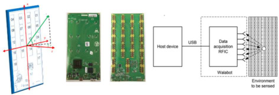
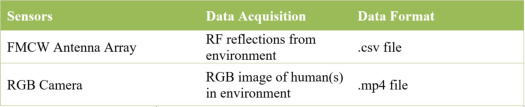
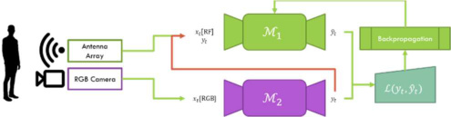
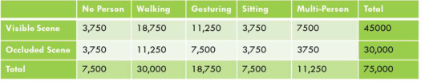
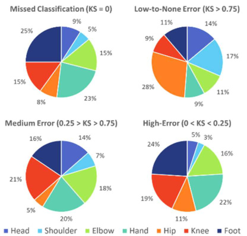
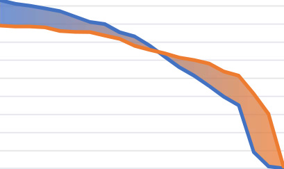
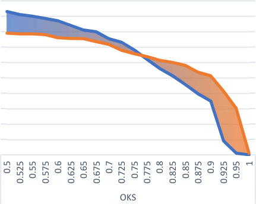
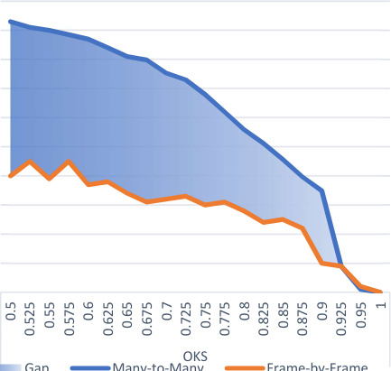
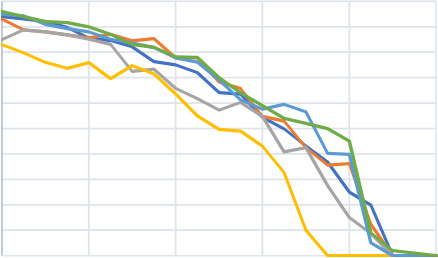
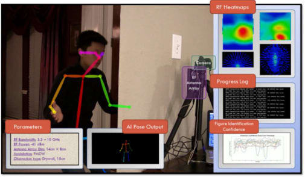

# Through-Wall Pose Imaging in Real-Time with a Many-to-Many Encoder/Decoder Paradigm

Kevin Meng
ACM Student Member

Plano, Texas
kevinmeng@acm.org

_**Abstract**_ **— Overcoming the visual barrier and developing “see-**
**through vision” has been one of mankind’s long-standing dreams.**
**Unlike visible light, Radio Frequency (RF) signals penetrate**
**opaque obstructions and reflect highly off humans. This paper**
**establishes a deep-learning model that can be trained to**
**reconstruct continuous video of a 15-point human skeleton even**
**through visual occlusion. The training process adopts a**
**student/teacher learning procedure inspired by the Feynman**
**learning technique, in which video frames and RF data are first**
**collected simultaneously using a co-located setup containing an**
**optical camera and an RF antenna array transceiver. Next, the**
**video frames are processed with a computer-vision-based gait**
**analysis “teacher” module to generate ground-truth human**
**skeletons for each frame. Then, the same type of skeleton is**
**predicted from corresponding RF data using a “student” deep-**
**learning model consisting of a Residual Convolutional Neural**
**Network (CNN), Region Proposal Network (RPN), and Recurrent**
**Neural Network with Long-Short Term Memory (LSTM) that 1)**
**extracts spatial features from RF images, 2) detects all people**
**present in a scene, and 3) aggregates information over many time-**
**steps, respectively. The model is shown to both accurately and**
**completely predict the pose of humans behind visual obstruction**
**solely using RF signals. Primary academic contributions include**
**the novel many-to-many imaging methodology, unique integration**
**of RPN and LSTM networks, and original training pipeline.**

_**Keywords—radio frequency (RF), computer vision, CNN, RPN,**_
_**LSTM, pose reconstruction, many-to-many imaging, radar**_

I. INTRODUCTION

Our ability to perceive information about our environment
suffers from a significant bottleneck from the physical
properties of visible light: it is either reflected or absorbed by
objects in our immediate surroundings, allowing various items
such as furniture and walls obstruct our view of entities we want
to see. Especially in search & rescue, non-invasive healthcare,
and military operations, the ability to perceive human presence
and recover the figure could prove instrumental to saving lives.

However, most types of electromagnetic radiation other than
visible light are either too powerful, to the extent of causing
adverse health effects by exposure, or too high in wavelength,
causing them to pass straight through objects. In contrast, Radio
Frequency (RF) electromagnetic radiation is safe, can traverse
materials of low reflective index such as walls and furniture, and
reflect off humans. This makes them an ideal imaging wave to
harness in transcending the physical limits of traditional vision.

There are many applications for the solution proposed in this
paper, one of which is Search & Rescue: RF can detect victims
behind an assortment of obstructions, potentially preventing a

Yu Meng, Ph.D.
IEEE Senior Member

Dallas, Texas
yu.meng.us@ieee.org

portion of the 1.35 million deaths and 218 injuries caused by
6,873 natural disasters worldwide between 1994 and 2013 [1].

An especially exciting application of such a technology is in
fire search & rescue. In environments polluted by smoke,
infrared radiation, and physical debris, no technological
instruments can currently image life from safety. RF imaging
could provide not only detection but also figure retrieval [11].

This paper aims to establish an innovative methodology that
allows people to detect the human figure through visual
obstruction. Figure 1 depicts the intended system design. First,
RF signals are transmitted and received by an RF imaging
device. While some signals are reflected, absorbed, or attenuated
by an intermediate obstruction, others penetrate and reflect off a
human subject. Using a computing device, RF reflection data is
extracted and processed, before being inputted into a deep
learning pose decoding module.

II. RELATED WORKS

_A._ _Figure Retrieval Using Physical Sensors_

Estimation of the human figure via physical sensors has been
developed extensively and put into commercial production [37]
due to the relative ease with which the data may be extracted
using inertial measurement units [38]. However, these solutions
require the target user to wear a bevy of cumbersome sensors on
their bodies. In some cases, including search & rescue cases or
military operation, this bottleneck defeats the purpose of trying
to estimate the human figure. In other cases, this causes a major
inconvenience for users, as in medical healthcare.

_B._ _Figure Retrieval Using the RGB Domain_

Analyzing the human figure using RGB video has also been
a hotspot of recent computer vision research, as the high spatial
resolution of color images allows for an accurate and complete
extraction of the human pose. Notably, Zhe Cao et al. [20] have
developed a state-of-the-art pose estimation technique using Part

Affinity Fields to extract 2D poses from images. Another group
developing similar systems is Microsoft Asia Research, with
their Microsoft Human Pose Estimation (MSFT) model [47].

_C._ _Figure Retrieval Using the RF Domain_

In the past, RF signals ( 3kHz −300kHz ) were used
sparingly in human localization problems, because they required
the user to carry a Wi-Fi or Cellular-enabled device to query the
person’s location [39, 40]. This provided little advantage
relative to the solutions mentioned in §II-A. Recently, however,
researchers have begun studying the usage of RF signals in an
imaging context, as opposed to their traditional function as a
communications wave. In these works, RF signals are broadcast
into the environment, and their reflections off human bodies are
used to deduce the human figure behind walls. These works can
be stratified into two primary categories. First is the research
concerning high-precision imaging using 100GHz frequencies
(colloquially known as mmWave). This provides precise detail
but is incapable of penetrating walls or furniture. In contrast, the
second category of work concerns penetrative applications using
Wi-Fi-band signals (3GHz ≤𝑓≤10GHz). These EM waves
provide less detail but allow the penetration of common building
materials. Discussions will focus on Wi-Fi-band imaging for its
penetrative capability, which is central to this study.

Currently, few reflection-based RF imaging systems can
provide high detail; most works can only achieve localization

[41, 42, 43] or coarse approximation of the human figure, such
as in [7]. Limitations to reflective RF imaging are caused by
physical properties of RF waves, including specularity and low
spatial resolution. For this reason, poses recovered from models
may exhibit incompleteness and flickering. [35] attempted to
address specularity using 3D convolutions. However, studies
have shown jointly convolutional and recurrent models to
capture spatio-temporal dependencies better [36]. Additionally,
no previously proposed deep learning system exhibiting
through-wall vision capability is trained using a pipeline
_explicitly_ designed to handle attenuation and noise associated
with wave propagation in complex media. In this paper, we
present a novel approach that aims to resolve shortcomings of
previous works.

III. PROCEDURAL FLOW

This paper proposes a system in which RF signals are
computationally analyzed by a deep learning model to infer the
pose of person(s) though visual obstruction, including walls and
furniture.

An analysis of the scientific problem yields the formulation
of a 5-step project flow: 1) Device Sensors, 2) Data Acquisition,
3) RF Data Pre-Processing, 4) Deep Learning Modeling, and 5)
Output Performance Analysis. Each of the following sections
will explain the motivation and implementation behind design
choices in this paper.

IV. DEVICE SENSORS

Sensory data is collected simultaneously in two separate
channels: RF reflection signals and RGB images. The RF
signals will be used as input to the deep learning model during
training and inference, while the RGB images will be inputted
to a second computer vision model during training to cross

modally supervise the RF image-to-pose model. To ensure that
images from both the camera and webcam are representative of
the same scene from the same viewing angle, the FMCW
antenna array and RGB camera are mounted in positions fixed
relative to each other on a tripod. Furthermore, to ensure
synchronization in the time domain, the RF and RGB inputs are
synced to within ~5ms of error.

_A._ _FMCW Radio-Frequency Antenna Array_

This paper utilizes an RF antenna array as the imaging
device, which transmits signals on the RF wavelength into the
environment and collects reflected signals. The antenna array
used in this paper is the Walabot Developer, a commerciallyavailable, FCC-compliant radio. Technical specifications
include a frequency bandwidth in range 3.3GHz to 10GHz and
transmit power of approximately 100𝑝𝑊, which is 1/1000 the
transmission power of Wi-Fi. Its API returns a 3D distribution,
where each point represents the signal power received at that
voxel. Imaging is completed on the spherical coordinate system
(𝜃, 𝜙, 𝑟). We refer the reader to [2] for more details on the
hardware device.

Figure 2. Radio-Frequency Antenna Array

_B._ _RGB Camcorder_

The Logitech HD Pro Webcam C920 is used to capture fullcolor RGB video of the environment. It supports connection to
computers via the USB-A protocol. The camera resolution is
downgraded to 640x480 to reduce storage consumption.

_C._ _Co-Located Setup with Array and Camera_

The Camera and Array are spatially co-located to ensure
that the outputs are consistent. Table 1 details the data
collection from the various sensory inputs.

Table 1. Sensory Input, Data Acquisition, and Data Format

V. DATA ACQUISITION VIA RF SENSING

In this study, a primary challenge lies in determining a viable
physical means to overcome the boundaries imposed on vision
by the ~380nm to ~750nm wavelength range of the
electromagnetic spectrum, better known as visible light. At this
wavelength, it fails to penetrate opaque objects. Alternatively,
radio frequency (RF) waves, such as Wi-Fi signals, _can_
penetrate walls. In addition, humans have high reflective
coefficients [3]; therefore, RF waves can be used to break the

vision barrier. To harness these types of EM waves, we employ
antenna arrays.

The following subsections will detail the implementation
and key operative features of necessary imaging devices.

_A._ _Single Transmitter and Recevier Antenna Pair_

An RF signal is a waveform which has a periodic phase
factor. By calling or sampling the received signal, both
amplitude and its phase can be recorded [4]. The antennas in the
radio used in this study have broadband performance covering
the 3-10GHz frequency range.

_B._ _Antenna Array_

Antenna arrays can be used to identify the spatial direction
from which an RF signal arrives with significantly improved
ability to discern spatial direction compared to a single antenna.
The angular resolution of an antenna array can be expressed as:

Δ𝜃= 0.886 [𝜆]

𝑛𝑑

(1)

Developer Pack SDK [12], is used to grab data from the RF
hardware. Data is transposed into a 3D matrix representing
reflected signal power, and 𝑅(𝜃, 𝜙, 𝑟) is used to query the raw
reflected signal power from each voxel in 3D space.

Figure 3. Collection Setup

VI. RF DATA PRE-PROCESSING

_A._ _Coordinate Conversion_

Sensor data is retrieved in spherical coordinates using API
calls to the Walabot Developer SDK. However, Cartesian
representation is desired to represent 3D space [13]. Equation 4
is used to convert between the two coordinate systems.

where 𝑛 is number of transmitters, and 𝑑 is the space interval
between adjacent antennas [7]. We refer readers to [6] for details
regarding antenna arrays.

_C._ _Frequency-Modulated Continuous Wave (FMCW)_

Although antenna arrays, by themselves, are able to perceive
spatial location, they are not sensitive to depth. A
straightforward method of measuring depth is using the distance
formula: 𝑑= 𝑐𝑡, where 𝑐 is the speed of light. However, the
time of flight 𝑡 is extremely difficult to measure, as it is typically
in the nanosecond range [8].

FMCW is a special radar technique that allows the
measurement of reflector depth in a feasible manner. Rather than
attempting to capture the miniscule difference between time of
transmission and receipt, it sends a signal linearly modulated in
frequency w.r.t. time. In this manner, rather than measuring the
time delay between the transmitted chirp and reflected chirp, the
Δ𝑓 is measured; this can be accomplished using a low-cost,
passive hardware device called a mixer [9]. To compute Δ𝑡
given Δ𝑓, we simply use the modulation slope 𝑘:

Δ𝑡= [Δ𝑓] (2)

𝑘

Equipped with this knowledge, we can compute the reflected
power emanating from a depth 𝑟. Furthermore, depth resolution
depends on the bandwidth of the frequency chirps, as shown in
the equation below:

Δ𝑟= [𝑐] (3)

2𝐵

where 𝐵 is the difference between the maximum and minimum
frequencies of the chirps [11].

Jointly, antenna arrays and FMCW allow us to perceive 3D
information through RF reflection, analogous to an optical
imaging system with visible light reflections.

_D._ _Antenna Array SDK API for Implementation_

Following the hardware considerations, we now examine its
interface with software. The Walabot API, contained in Walabot

𝑥= 𝑟∗sin 𝜃
𝑦= 𝑟∗cos 𝜃∗sin 𝜙
𝑧= 𝑟∗cos 𝜃∗cos 𝜙

(4)

_B._ _Dimensionality Reduction_

A 3D point cloud is computationally expensive to compute
over and potentially prohibitive to real-time execution. To
reduce computational demand, we propose to simplify the 3D
point clouds collected by the RF antenna array into two 2D
heatmaps: vertical and horizontal. By summing values of
reflection intensity over two planes, we minimize the number of
sparse data points, while keeping features salient to the decoding
of bodily keypoints. Reduction in the computational complexity
by an order of magnitude significantly reduces time and space
demands.

����

⎧𝑅⎪ ����(𝑥, 𝑧) = - 𝑅(𝑥, 𝑦, 𝑧)

������

(5)

⎨
⎪
⎩

𝑅����(𝑥, 𝑦) = �𝑅(𝑥, 𝑦, 𝑧)

������

����

VII. PHYSICS-DRIVEN DESIGN CONSIDERATIONS

In §VI, the final step of RF data processing is performed.
From this step, both horizontal and vertical heatmaps are
outputted to represent the person in the RF domain. However,
analysis of vertical heatmaps, in particular, reveals a significant
challenge: not all body parts show up on a single RF heatmap.
Within 200ms, body parts with smaller surface areas can
disappear.

This section aims to A) identify the physical cause of this
phenomenon and B) outline a solution that employs state-of-theart deep learning techniques.

_A._ _Body-Part Specularity (Reflection and Scattering)_

Reflection occurs when a beam impinges upon a surface
smooth relative to its wavelength; the physical behavior of the

wave will obey the law of reflection, i.e. 𝜃�������� = 𝜃���������

[14]. On the other hand, scattering occurs when a wave impinges
upon an object that is rough or uneven relative to the signal’s
wavelength, causing the reflected energy to spread out or
“scatter” [15]. Figure 4 depicts this phenomenon.

In experimental settings, the 𝜆 of RF is ~5cm, as opposed to
the ~10 [��] m wavelength of visible light. Therefore, the physics
of RF imaging are fundamentally different from that of optical
imaging. With respect to the miniscule wavelength of visible
light, surfaces are rough and therefore function as scatterers, as
seen in Figure 4(b). Conversely, in the ~5cm wavelength of RF,
objects function as reflectors. Therefore, only signals that fall
approximately normal to an object surface are reflected back
toward the transceiver. However, as the person walks, different
body parts reflect signals toward the device and become visible
to the device at different timesteps.

_B._ _Deep Learning-Based Solution Sketch_

Based on observations made in the previous subsection, we
deduce that RF imaging, unlike optical imaging, is _not a one-to-_
_one scenario_ . In optical imaging, one sampling of lens-focused
light waves is sufficient to reconstruct a full image; this is
because objects scatter light waves. However, in the RF domain,
not all critical limbs show up at once. Therefore, to compute the
human figure at each timestep, the model must consider not just
the current RF image, but also several that come before it. This
enables the model to together various limbs that reflect signals
back to the receiver at various times.

A computational method by which this can be accomplished
is deep learning. Namely, Recurrent Neural Networks (RNN)

[16] have been the workhorses behind recent breakthrough
applications in analyzing sequential data, because they consider
past information when constructing each prediction. In this
manner, RNN’s are capable of accumulating information over
time to make an accurate pose inference. RNN’s can also be
combined with Convolutional Neural Networks (CNN) [17],
which learn spatial features from RF heatmaps. In tandem,
CNN’s and RNN’s jointly learn spatio-temporal patterns.

VIII.DEEP LEARNING ARCHITECTURE & ALGORITHMS

_A._ _Body Pose Keypoint Definitions_

Figure 1 depicts the BODY-15 definition of the 15 body
keypoints that are to be detected through visual obstruction.
These include: head, shoulder, elbow, hand, hip, knee, and foot
datapoints. At each timestep, each of these keypoints will be
classified into a pixel on the screen. Note that there exist more
granular definitions of body keypoints [20], but the body-part
specularity phenomenon and low spatial resolution of RF
images do not lend to such detailed representations.

_B._ _Overview of Cross-Modal Supervision Algorithm_

Because it is infeasible to manually label radio-frequency
image with the appropriate keypoints, a more efficient manner
of generating supervisory labels is desired. This involves a
computational method utilizing a deep learning model crossmodally dependent on another.

Let ℳ� denote an initially untrained deep learning model
(i.e. See-Through Model) that takes RF images as input and
outputs 15 body keypoints at each time step. Let ℳ� denote a
pre-trained deep learning model that takes RGB images as input
and outputs 15 body keypoints at each time step.

ℳ� will be cross-modally supervised by ℳ� during training.
More concretely, each training sample consists of only an input
𝑥�, which contains 5 channels of data: 2 for the horizontal and
vertical heatmaps, and 3 for the RGB image. All 5 channels
describe the same moment in time from different perspectives.
A supervision label 𝑦�, containing, the “ground truth” values for
each of the 15 keypoints, will be generated with the evaluation
of ℳ�(𝑥�[RGB]). Then, the training pair (𝑥�[𝑅𝐹], 𝑦�) will be
inputted into ℳ�, resulting in final prediction vector 𝑦��. Loss
will be computed as 𝐽(𝑦�, 𝑦��; 𝜃), where 𝐽 is the objective. In
practice, we implement ℳ� as the state-of-the-art OpenPose
computer vision gait analysis module.

Figure 5. Cross-Modal Supervision

_C._ _Novel Training Pipeline with Artificial Obstruction_

A supplemental stand is used to introduce RF obstruction
without blocking the RGB camera: Wood, brick, drywall,
concrete, plastic, paper board, insulation, linoleum, carpet, fog,
leaves. This increases robustness of trained model through
explicit learning on through-obstruction scenes.

_D._ _Multilayer Perceptron (MLP) & Deep Neural Network_

Neural networks [22] are composed of layers of neurons,
much like the biological brain. Each neuron accepts input 𝑝 and
outputs 𝑎= 𝑤𝑝+ 𝑏. 𝑎 is then subject to an activation function
𝜙(⋅) that regularizes its value and introduces non-linearity; this
produces final output 𝑎′. 𝑤 and 𝑏 are values that can be adjusted
through training of the network. Neurons can have many inputs,
in the form of vectors. If 𝐩 is a vector of inputs, 𝓵 is a layer of
neurons, 𝐖 is a weight matrix representing all connections
between 𝐩 and 𝓵, and 𝐛 is a vector of bias values for each
output, then the operations of a neuron are best represented by
matrix multiplication; output vector 𝐚′ = 𝜙(𝐖𝐩+ 𝐛).

_E._ _Residual Convolutional Neural Network_

In contrast to deep multilayer perceptron models where each
layer is fully connected to the layers around it, each neuron in a
convolutional neural network (CNN) [17] is only locally
connected with a few neurons in the surrounding layers.
Additionally, all neurons in a CNN layer share identical weights.
Mathematically, the value of a neuron in a CNN can be

computed as the convolution of a weight kernel with the neurons
in the previous layer:

𝑎� = 𝜙(𝑘� ∗𝑎���) (6)

where ∗ is the convolution operator, and 𝑘� is the weight kernel
at layer 𝑛. CNNs leverage local dependencies and features in
data, especially that of images, to reduce the total number of
learned parameters. This acts as a regularization and resource
reduction mechanism. The neurons, or weight kernels 𝑘�∀𝑛, in
a CNN are referred to as feature maps, as they can be viewed as
features that correspond to different parts of the input. Deeper
layers, or layers with a large 𝑛, will learn increasingly abstract
and global properties of the image [23].

A derivative of the CNN, the Residual Convolutional Neural
Network (ResNet) [24], is employed to enable deeper stacking
of layers without high risk of overfitting, all while smoothing
the topology of the objective function for a more favorable
optimization landscape. ResNet is implemented as DarkNet-53,
the convolutional foundation of the YOLOv3 detection
algorithm.

_F._ _Region Proposal Network for Multiple People per Frame_

A Region Proposal Network is adopted to detect multiple
people within a single snapshot, frame-by-frame. The RPN is
implemented as in the YOLOv3 algorithm; we refer the reader
to [25] for more information on the object detection technique.
In short, YOLOv3 detects objects by sliding a convolutional
network over the final ResNet output feature map.

The RPN accepts features from the CNN and outputs a
𝑃× 𝐷 size matrix, where 𝑃 is the maximum number of people
in a frame and 𝐷 is the dimensionality of data encoding each
person in the RF image. In this paper, 𝐷= 445 for the 4
bounding box descriptors [25], denoted 𝐝, and 21 × 21 sized
flattened feature map, denoted 𝝈. Variable-sized feature maps
are cropped and resized to the designated size using Region of
Interest (ROI) Pooling, as in [25]. The 445 values are expressed
in a concatenated one-dimensional vector.

Now we define an objective to minimize for the RPN, for
which two factors are considered: 1) localization error: the
discrepancy between 4 corners of the bounding box should be
minimized, and 2) continuity error: predicted bounding boxes
should not dart across space, so a small portion of the loss is
dedicated to minimizing the L1 distances between bounding box
vertices. To improve convergence, continuity error is modified
by a factor of 0.2.

ℒ��� = ℒ��� + 0.2ℒ���� (7)

Term Memory (LSTM) solves this problem by providing key
modifications. Namely, input, output, and forget gates are
introduced to retain long term dependencies [27].

Because LSTM networks are so effective at modeling
temporal relationships, they are optimal for many-to-many
imaging; they can accumulate RF information over time to
recover a _complete_ pose. This is in comparison to direct 3D
convolutions, which were shown by [36] to aggregate spatiotemporal information less effectively than 2D convolutions
jointly trained with an LSTM. Therefore, the CNN spatial
feature extractor and LSTM temporal architecture are explicitly
separated in this architecture to encourage the learning of
stronger spatio-temporal relationships.

At each timestep 𝑡, the LSTM outputs concatenated logit
vectors 𝐩��, for all people 𝑝 in a frame. Then, each of the 15

vectors 𝐩��, for all people 𝑝 in a frame. Then, each of the 15

keypoints 𝑘 on each person 𝑝 are transformed into a hidden
representation for each keypoint 𝐡��� as:

- as:

�� = 𝐖�𝐩�

𝐡��

�� + 𝐛�, ∀𝑘, 𝑝 (9)

Then, two sets of shared weights and biases are used to
transform each hidden representation into a pixel classification:
x-coordinate and y-coordinate. These weights and biases are
shared across all keypoints; their sole responsibility is to
transform an intermediate hidden representation into Cartesian
coordinates.

𝛼��

𝛽���

�� + 𝐛��

��� = argmax �𝐖�𝐡���

��� = argmax (𝐖�𝐡���

��� + 𝐛�) [ ∀𝑘, 𝑝] (10)

where 𝛼 represents the x-coordinate and 𝛽 the y-coordinate.

_H._ _Context-Aware Region Proposals_

If multiple people are in a scene, accumulating information
for each person requires tracking the identities of the people as
time progresses. In [7], it was shown to be feasible to
differentiate individuals based on their unique RF fingerprints.
Therefore, we draw inspiration from the Siamese Neural
Network [44] to teach the model to encode similar features for
the same person in a sequence of RF images. In implementation,
a new factor in the objective function is defined:

�, ��𝝈�� −𝝈������

- �, �

�� −𝝈����

(11)

ℒ����� = ��𝜃�, ��𝝈�

- [∗]

-, 𝐝�

+ 0.2 ��(𝐝�

�� −𝐝����

(8)

where 𝝈�� are the descriptive encoding features of the person 𝑎

at time 𝑏 and 𝜃�,� is an indicator value that is 1 if 𝑝= 𝑞 or −1
if not. In this manner, the minimization of ℒ����� teaches the
model to classify the same person to the same identity over time,
and different people to different identities.

_I._ _Novel Exponential Classification Objective_

With a high number of output pixels per timestep, overfitting
is a significant risk. To combat this, a novel classification
objective function ℒ��� is proposed by the researcher to
encourage a better fit. ℒ��� is the direct sum between the
individual losses for 𝛼 and 𝛽, denoted as ℒ���� and ℒ����,
respectively. If 𝑘 is the keypoint being classified for person 𝑝 at
time 𝑡, the two components of classification loss are given as:

ℒ��� = ��𝐿������ �𝐝�

��

- )

- 

- 

The outputs of the 𝑃× 𝐷 matrix are sent to the next deep
learning module, LSTM.

_G._ _Long Short-Term Memory Network (LSTM)_

Recurrent Neural Networks (RNN) [16] are a variant of the
traditional neural network, which are highly effective at
modeling temporal dependencies. However, RNN’s are known
to suffer from the vanishing/exploding gradient problem, which
results in the loss of long-term dependencies [26]. Long Short

⎧ℒ⎪ ���� = ���𝑛���

��������
��

��� � 𝑥���

- [𝑅𝐹])

- 𝑒

��� - log 𝑝�𝛼���

IX. OUTPUT AND PERFORMANCE ANALYSIS

_A._ _OKS Analysis_

The Object Keypoint Similarity (OKS) [34] metric
quantifies the average quality of keypoint localization over all
15 bodily keypoints defined in BODY-15. Keypoint Similarity
(KS) is computed by evaluating an un-normalized Gaussian
distribution. Where 𝜽 [�] are classified keypoints of person 𝑝, 𝜽 [�∗]
are ground truth locations, 𝐶� is the prediction’s confidence
level, and 𝑠 and 𝑘� are constants used to scale std. deviation:

⎨
⎪
⎩

 

(12)

��������
��

���� 𝑥���

- [𝑅𝐹])

ℒ���� = ���𝑛���𝑒

- 𝑒

��� - log 𝑝�𝛽���

where 𝑇 is #timesteps, 𝑃 is #people, 𝐾 is #keypoints, 𝐶 is
#classes. 𝛿 represents the L2 pixel distance between the
predicted and ground-truth outputs:

�� [∗] −𝛽���

�� = �(𝛼���

���)� + (𝛽���

- )� (13)

⎪ [⎧𝑂𝐾𝑆(𝜽][�∗][, 𝜽][�][) =]

∑𝐾𝑆�𝜽� 

- �� [∗], 𝜽�� �𝛿(𝐶� - 0)

∑𝛿(𝐶� - - 0)

- [∗]

-, 𝜽�

𝛿��

��� [∗] −𝛼���

(15)

ℒ��� is a customized Cross-Entropy classification loss [28]
that adds an exponential term parameterized by 𝛿���. It penalizes

𝐾𝑆�𝜽�

- [∗]

-, 𝜽�

 

that adds an exponential term parameterized by 𝛿���. It penalizes

the model highly for misclassifying keypoints far from the
ground truth and less so for closer mistakes, on an exponential
scale. ℒ also considers the confidence output of the cross-modal
supervisory teacher model 𝑛��� for each keypoint, making

⎪ [⎨]
⎩

�𝜽�

- [∗] 
- �𝜽�

�� [�] �� ~~�~~

~~�~~

��= 𝑒

supervisory teacher model 𝑛��� for each keypoint, making

penalties more severe if the teacher label confidence is higher.

_J._ _Final Joint-Optimized Loss_

We have now defined all 3 elements for the loss that is to be
minimized: region proposal loss ℒ���, tracking loss ℒ�����, and
classification loss ℒ��� Through empirical experiments, the
optimal loss balancing ratio between ℒ���, ℒ�����, and ℒ��� was
determined to be 4:3:4. Therefore, balancing coefficient 𝜆 is
established with value 0.75. Therefore, our final objective that
jointly optimizes the weights of the CNN, RPN, and LSTM is:

ℒ= ℒ��� + 𝜆ℒ����� + ℒ��� (14)

Adam [46] is adopted as the minimization algorithm on the
compound objective defined in Equation 14.

_K._ _Researcher-Created Dataset With Adversarial Examples_

75,000 training samples of {RF, RGB} images were
collected at multiple locations including home, school, a fitness
center, and a public library. Multiple mediums were also
traversed: wood, brick, drywall, plastic, paper board, and open
air were selected for testing. Data was partitioned 75/5/20 for
training/validation/testing, respectively.

Table 2. Dataset Details

The no-person scenes can be considered as adversarial
examples, designed to fool the neural network. They they may
contain RF signatures that could be mistaken for humans but are
not. This alleviates the case of “phantom” predictions.

_L._ _Model Summary_

Figure 6. Summary

Average Accuracy 𝐴𝐴��� of classification for each person

can be computed at various KS values: Given a threshold 𝑇��,
compute the proportion of keypoints on person 𝑝 that fulfill
𝐾𝑆≥𝑇��. 𝐴𝐴 can also be computed per keypoint over the entire
dataset. For context, ~95% of human-annotated keypoints will
have 𝐾𝑆≥.75. As such, 𝐾𝑆= .75 is considered a highly strict
match; 𝐾𝑆= .50 is a medium match.

_i. Individual Keypoint Classification Error_

General trends are analyzed for KS values of all keypoint
types. The majority of keypoints are classified with low-to-none
error. Only 6% of keypoints are classified with high error or
missed classification, 30% hit medium error, and 64% achieved
low-to-none error. Figure 7 shows a detailed breakdown.
Shoulders and Hip are classified with highest consistency and
accuracy, while hands and feet were most difficult to classify.

Figure 7. KS Performance by Keypoint

_ii. Individual Keypoint AA on Various KS Levels & Obstruction_
_Statuses_

Putting the individual keypoint analyses together, AA for
each keypoint is calculated at 2 differing threshold values: 𝐾𝑆��,
and 𝐾𝑆�� (loose fit vs. strict fit). Data collected on both visible
and through-obstruction scenes. Keypoints can be classified
with high accuracy even at strict fit threshold.

Table 3. Keypoint AA at Various KS

|Visible Obstructed Visible Obstructed 𝑲𝑺 𝑲𝑺 𝑲𝑺 𝑲𝑺 𝟓𝟎 𝟓𝟎 𝟕𝟓 𝟕𝟓|Col2|Col3|Col4|Col5|
|---|---|---|---|---|
|**Head** 99%  91%  70%  50%|**Head** 99%  91%  70%  50%|**Head** 99%  91%  70%  50%|**Head** 99%  91%  70%  50%|**Head** 99%  91%  70%  50%|
|**Shoulder** 99%  95%  86%  72%|**Shoulder** 99%  95%  86%  72%|**Shoulder** 99%  95%  86%  72%|**Shoulder** 99%  95%  86%  72%|**Shoulder** 99%  95%  86%  72%|
|**Elbow** 97%  78%  56%  36%|**Elbow** 97%  78%  56%  36%|**Elbow** 97%  78%  56%  36%|**Elbow** 97%  78%  56%  36%|**Elbow** 97%  78%  56%  36%|
|**Hand** 95%  70%  50%  30%|**Hand** 95%  70%  50%  30%|**Hand** 95%  70%  50%  30%|**Hand** 95%  70%  50%  30%|**Hand** 95%  70%  50%  30%|
|**Hip** 99%  92%  93%  84%|**Hip** 99%  92%  93%  84%|**Hip** 99%  92%  93%  84%|**Hip** 99%  92%  93%  84%|**Hip** 99%  92%  93%  84%|
|**Knee** 96%  75%  49%  30%|**Knee** 96%  75%  49%  30%|**Knee** 96%  75%  49%  30%|**Knee** 96%  75%  49%  30%|**Knee** 96%  75%  49%  30%|
|**Foot**|95%|70%|61%|40%|

_iii. OKS Comparison with State-of-the-Art RGB Vision_

AA for RF pose parsing on visual scenes is compared to the
reported values for Microsoft Human Pose Estimation (MSFT)

[47], a state-of-the-art RGB image pose-decoding software. AA
for RF pose parsing on through-obstruction scenes is measured.

1

0.9

0.8

0.7

0.6

0.5

0.4

0.3

0.2

0.1

0

**Many-to-Many vs. Frame-by-Frame Imaging**

Figure 9. Many-to-Many Analysis

1

0.9

0.8

0.7

0.6

0.5

0.4

0.3

0.2

0.1

0

**AA on Subjects in Visual Scenes**

Figure 8. AA Over Multiple OKS

RF outperforms MSFT on low-threshold classification.
Possible reasons include that the novel objective function
(Equation 13) reduces overfitting, and that we employ many-tomany imaging using LSTM RNN’s (§VIII-G) to consider
multiple frames of input; this contrasts with the frame-by-frame
processing approach for MSFT.

RF has high performance even for through-obstruction
inference. Possible explanations include the novel training
pipeline introduced in §VIII-C and the many-to-many imaging
technique detailed in §VIII-G.

_iv. Many-to-Many Analysis_

The performance improvement attained when applying the
new Many-to-Many imaging methodology is evaluated in this
section. The See-Through Model is repurposed to process RF
images frame-by-frame without consideration to previous
context. Concretely, the LSTM model is removed while the
CNN and RPN operate on a frame-by-frame basis, sending their
features to fully connected layers fine-tuned to output pose
predictions for each individual frame. Many-to-Many Imaging
provides a key improvement over a frame-by-frame approach.

_v. Medium Analysis_

The following graph compares AA through different types
of obstruction. Typical types of obstruction have minimal
impact on performance depending on their dielectric constant.

**AA of Subject Through Various Types of Obstruction**

1

0.9

0.8

0.7

0.6

0.5

0.4

0.3

0.2

0.1

0

0.5 0.6 0.7 0.8 0.9 1

**OKS**

Wood Drywall Plastic
Brick Paper Board Regular

Figure 10. Medium Analysis

_vi. Real-Time Setup Analysis_

System execution was timed to verify the real-time
capability of the system. For 100,000 frames to be processed,
5,565.153 seconds were taken. This amounts to 0.056 sec per
frame, which is sufficiently fast to power a 5Hz stream of data.
It also leaves roughly 0.15 sec for network latency in the field.

X. CONCLUSION

The key contribution of this study is the proposal of a manyto-many RF imaging methodology, in contrast to one-to-one
imaging for optical systems, to extend the boundaries of human
vision beyond visual obstructions. This overcomes the challenge
of specular reflection by exploiting movement and synthesizing

time-sequential data. One particularly notable application of this
work is the detection of people trapped in burning buildings or
foliage of the forest from safety.

Contributions are summarized as follows: 1) Created a
many-to-many imaging decoder using state-of-the-art deep
learning techniques. 2) Proposed a novel objective function for
anti-overfitting optimization. 3) Implemented a new training
pipeline to solve a bottleneck with inexplicit through-wall
training.

XI. DEMO SIMULATOR & VIDEO

A demonstration video was filmed to show both offline and
online processing: `https://youtu.be/7hX8qGJdWno` . A
screenshot can be seen below:

XII. FUTURE RESEARCH

In the future, the principles established in this paper can be
augmented using multiple RF Antenna Arrays to achieve
stereoscopic RF Imaging. RF transceivers can be arranged in an
arc to capture a larger subset of reflections. This could possibly
mitigate the Body-Part Specularity challenge and allow for a
more accurate and complete pose construction.

XIII.REFERENCES

[1] https://www.usfa.fema.gov/data/statistics/

[2] P. Wang et al. FMCW Radar Imaging with Multi-channel Antenna Array

via Sparse Recovery Technique. 2010.

[3] P. L. Ryan. Radio Frequency Propagation Differences Through Various

Transmissive Materials. Univ. of North Texas, 2017.

[4] M. A. Richards. Fundamentals of Radar Signal Processing (Second ed.).

Published by McGraw Hill, 2014.

[5] Antenna Patterns and Their Meaning. https://goo.gl/pQExs3. Corporate
published by Cisco (n.d.)

[6] S. J. Orfanidis. Electromagnetic waves and antennas. Rutgers Univ, 2002.

[7] F. Adib. Capturing the Human Figure Through a Wall. In ACM TOG,

2015.

[8] H. El et. al. Sub-nanosecond Time Synchronization Mechanism for Radio

Interferometer Array. 2017.

[9] C. Nickolas The Basics of Mixers. https://goo.gl/B7uut5

[10] Mahafza, B. R. 2013. Radar systems analysis and design using MATLAB.

Chapman & Hall.

[11] C. M. Dissanayake et al. Signal Propagation Effects of Radio Link in Fire

Environments. In IEEE, 2010.

[12] https://api.walabot.com/

[13] Spherical Coordinates. https://goo.gl/nAFPMF (Lamar Math Tutorials)

[14] Cook. The Laws of Reflection and Refraction. University of Georgia,

2015.

[15] F. R. Hallett. Dynamic light scattering. In Food Research International

Vol. 27, 1994.

[16] M. I. Jordan. Attractor dynamics and parallelism in a connectionist

sequential machine. In Cogitive Science Conference 1986.

[17] Krizhevsky et al. Deep Convolutional Neural Networks. Commun. In

ACM Transactions, 2012.

[18] J. Goodfellow et al. Generative Adversarial Nets. In NIPS, 2014.

[19] S. Zhao et al. InfoVAE: Information Maximizing Variational

Autoencoders. In CoRR, 2017.

[20] Z. Cao et al. OpenPose: Realtime Multi-Person 2D Pose Estimation using

Part Affinity Fields. In CVPR, 2017.

[21] Evaluating Machine Learning Methods. University of Wisconsin
Madison.

[22] F. Murtagh. Multilayer perceptrons for classification and regression. In

Neurocomputing, 1991.

[23] R. Mopuri, U. Garg. An unraveling approach to visualize the

discriminative image regions. arXiv 1708.06670.

[24] He, et al. Deep Residual Learning for Image Recognition. In CVPR and

arXiv 1512.03385.

[25] S. Ren, K. He, et al. Faster R-CNN: Towards Real-Time Object Detection

with Region Proposal Networks. In NIPS 2015.

[26] Pascanu, Razvan & Mikolov, Tomas & Bengio, Y. On the difficulty of

training Recurrent Neural Networks. In ICML, 2013.

[27] S. Hochreiter and J. Schmidhuber. Long short-term memory. In Neural

computation, 1997.

[28] Janocha et al. On Loss Functions for Deep Neural Networks in

Classification. arXiv 1702.05659, 2017.

[29] P. J. Werbos. Backpropagation through time: what it does and how to do

it. In Proceedings of the IEEE, 1990.

[30] Kiefer, Joe & Wolfowitz, J. Stochastic Estimation of the Maximum of a

Regression Function. In AMS, 1952.

[31] Loizou et al. Momentum and Stochastic Momentum for Gradient Descent

Methods. The University of Edinburgh, 2017.

[32] M Li, T. Zhang, et al. Efficient Mini-batch Training for Stochastic

Optimization. In KDD, 2014.

[33] Nitish Srivastava et al. Dropout: A Simple Way to Prevent Neural

Networks from Overfitting. In JMLR, 2014.

[34] M. Ronchi et al. Benchmarking and Error Diagnosis in Multi-Instance

Pose Estimation. arXiv 1707.05388v2

[35] M. Zhao et al. Through-Wall Human Pose Estimation Using Radio

Signals. In CVPR, 2018.

[36] Z. Zuo et al. Convolutional recurrent neural networks: Learning spatial

dependencies for image representation. In CVPRW, 2015.

[37] https://www.xsens.com/

[38] M. Kok et al. Using Inertial Sensors for Position and Orientation

Estimation. In arXiv:1704.06053.

[39] J. Xiong et al. Arraytrack: A fine-grained indoor location system. In

Proceedings of the USENIX NSDI, 2013.

[40] M. Kotaru et al. Spotfi: Decimeter level localization using wifi. In ACM

SIGCOMM Computer Communication Review, 2015.

[41] F. Adib et al. 3D tracking via body radio reflections. In Proceedings of

the USENIX NSDI, 2014.

[42] W. Wang et al. Gait recognition using WiFi signals. In Proceedings of the

ACM UbiComp, 2016.

[43] P. Melgarejo et al. Leveraging directional antenna capabilities for fine
grained gesture recognition. In Proceedings of the ACM UbiComp, 2017

[44] Tao, R., et al. Siamese Instance Search for Tracking. In CVPR 2016.

[45] Jun-Yan Zhu, Taesung Park, Phillip Isola, and Alexei A. Efros. Unpaired

Image-to-Image Translation using Cycle-Consistent Adversarial
Networks. In ICCV 2017.

[46] D. P. Kingma, J. L. Ba. Adam: A Method for Stochastic Optimization. In

arxiv:1412.698

[47] Xiao, B., Wu, H., & Wei, Y. Simple baselines for human pose estimation

and tracking. In ECCV 2018

