# **RF-Based 3D SLAM Rivaling Vision Approaches**

### Haowen Lai [1] Zhiwei Zheng [1]

University of Pennsylvania University of Pennsylvania

### Haowen Lai [1]

### Zhiwei Zheng Mingmin Zhao

University of Pennsylvania University of Pennsylvania

**ABSTRACT**

This paper presents CartoRadar, a novel RF-based SLAM system that delivers high-fidelity 3D mapping with centimeterlevel accuracy. CartoRadar builds on top of the advancements in learning-based RF imaging. However, learningbased systems often exhibit variation in prediction accuracy during inference. To address this challenge and enable
robust RF sensing, CartoRadar introduces a novel, trainingfree uncertainty quantification method tailored to RF signals.
Additionally, CartoRadar features an efficient SLAM algorithm that incorporates this uncertainty into the mapping
process. We deploy CartoRadar on a mobile robot and conduct extensive evaluations across 14 floors in 5 buildings.
Results show that CartoRadar achieves a trajectory error
of 14.1 cm, outperforming camera-based baselines by 72.1%.
For mapping, CartoRadar achieves an accuracy of 7.4 cm
and a completion of 8.1 cm, improving over vision methods
by 46.2% and 67.6%, respectively. Code, datasets, and demo
[videos are available on our website.](https://waves.seas.upenn.edu/projects/cartoradar)

**CCS CONCEPTS**

- **Human-centered computing** → **Ubiquitous and mo-**
**bile computing** ; • **Networks** → **Mobile networks** ; • **Com-**
**puter systems organization** → _Robotics_ ; • **Computing**
**methodologies** → _Computer vision_ ; _Machine learning_ .

**KEYWORDS**

3D SLAM, Uncertainty Quantification, Occupancy Field, Wireless Sensing, mmWave, RF Imaging

**ACM Reference Format:**
Haowen Lai, Zhiwei Zheng, and Mingmin Zhao. 2025. RF-Based 3D
SLAM Rivaling Vision Approaches. In _The 31st Annual International_
_Conference on Mobile Computing and Networking (ACM MOBICOM_
_’25), November 4–8, 2025, Hong Kong, China._ ACM, New York, NY,
[USA, 16 pages. https://doi.org/10.1145/3680207.3723467](https://doi.org/10.1145/3680207.3723467)

1Euqal contribution

[This work is licensed under a Creative Commons Attribution 4.0 Interna-](https://creativecommons.org/licenses/by/4.0/legalcode)
[tional License.](https://creativecommons.org/licenses/by/4.0/legalcode)

_ACM MOBICOM ’25, November 4–8, 2025, Hong Kong, China_
© 2025 Copyright held by the owner/author(s).
ACM ISBN 979-8-4007-1129-9/2025/11.
[https://doi.org/10.1145/3680207.3723467](https://doi.org/10.1145/3680207.3723467)

|(a) Estimated Trajectory of the Robot|(b) Reconstructed Map of the Building|
|---|---|
|Ours iPad Pro RGB Images ZED 2i RealSense D455f (c) Details|Ours iPad Pro RGB Images ZED 2i RealSense D455f (c) Details|

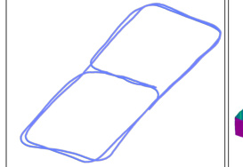

**Figure 1:** High-fidelity 3D SLAM using a mmWave radar as the robot
navigates through a building. CartoRadar leverages RF signals to simultaneously (a) localize the robot and (b) build a 3D map of the environment. It
captures (c) high-fidelity details, on par with vision baselines. Note the highlighted glass window, which is successfully reconstructed by our method
but missed by all vision baselines. Map colors represent surface normals.

**1** **INTRODUCTION**

Radio frequency (RF) sensing and imaging technologies [1–
3, 9, 49, 62, 86] have recently gained significant interest due
to their robustness in challenging environments, such as
those with poor lighting, occlusions, or smoke, where traditional vision-based methods typically struggle [19, 46, 84].
This resilience makes RF sensing particularly appealing for
robotics applications like simultaneous localization and mapping (SLAM), especially in complex or hazardous environments. Nevertheless, industrial and commercial sectors continue to favor optical sensing solutions. For example, autonomous driving primarily relies on cameras [4, 44] and
LiDARs [13, 48, 79], while search and rescue robots typically
integrate both modalities for environment perception [75].
We argue that a primary barrier to the wider adoption of
RF-based SLAM is imaging quality. While RF sensing excels
in challenging conditions, it often falls short in delivering
high-fidelity imaging necessary for precise navigation and
detailed mapping. Past RF-based SLAM systems [6, 11, 22,
23, 36, 66, 73] are limited to 2D mapping, failing to capture
crucial 3D structures. Moreover, their localization error exceeds half a meter, which is insufficient for tasks requiring
precise measurements or interactions with the environment.
This paper aims to address the critical gap between RFbased SLAM and its vision-based counterparts. We introduce CartoRadar, a robust, accurate, and efficient 3D SLAM

170

ACM MOBICOM ’25, November 4–8, 2025, Hong Kong, China Haowen Lai, Zhiwei Zheng, and Mingmin Zhao

system which operates using a single commercial off-theshelf mmWave radar. As illustrated in Fig. 1, CartoRadar
enables precise localization and detailed 3D mapping as a
robot navigates through a building. It accurately tracks the
robot’s trajectory while reconstructing a high-fidelity 3D
map of the environment. Fig. 1(c) showcases CartoRadar’s
detailed mapping capabilities compared to state-of-the-art
vision methods using stereo or RGB-D cameras. Notably,
CartoRadar outperforms vision-based SLAM [26, 37, 38] in
both localization and mapping given the same survey time
and trajectory (§ 7.1).
The design of CartoRadar requires us to overcome multiple challenges inherent to RF-based SLAM. Below, we outline
the key components that empower CartoRadar to deliver
robust, accurate, and efficient 3D SLAM.

**Robust RF Sensing with Uncertainty Quantification.**
State-of-the-art RF sensing systems leverage ML techniques
to significantly enhance imaging resolution [9, 19, 49, 62, 72].
However, these systems, like many ML-enabled technologies,
exhibit variation in prediction accuracy during inference. For
instance, a recent RF-based 3D imaging system [39] achieves
a median error of 3.4 cm, but the error at the 90th percentile
can be as high as 32 cm. Similar disparities between median
and 90th percentile errors have also been observed in other
learning-based RF sensing systems [9, 62, 72]. This lack of
robustness undermines the reliability of these sensing solutions and limits their use cases in safety-critical applications.
To address the challenge of long-tail error distribution and
enable robust RF sensing, we introduce a novel approach
that quantifies the uncertainty in model predictions. This
uncertainty quantification allows for more judicious use of
the sensing results, as downstream applications can now
reason about and adapt to the confidence of each prediction. Fig. 2 shows example outputs of our robust RF sensing component which not only predicts range images but
also estimates per-pixel uncertainty, where surface boundaries and distant surfaces show higher uncertainty. While
this addresses an uncertainty quantification problem similar
to those in ML literature [18, 34, 41], we propose a novel
training-free method tailored to the unique properties of
RF sensing, without the need for model modifications or
extensive retraining required in typical approaches. Specifically, our method performs multiple inference passes using
a pretrained imaging model [39], each time adding different noise to the raw RF signals. The intuition behind this
approach is that high-resolution RF imaging is inherently
under-determined, since various scenes could produce similar signals. By adding noise, we can observe how the predictions vary. Surfaces with strong evidence from raw signals
(i.e., low uncertainty) will show minimal variation across
different noise. In contrast, surfaces with weaker evidence

(c) Uncertainty (d) Uncertainty

Example 1 Example 2
**Figure 2:** The robust RF sensing component predicts both (a)(b) the range
images and (c)(d) the corresponding per-pixel uncertainty images.
(i.e., higher uncertainty) will exhibit greater variation in the
predicted results. Interestingly, we find that despite the high
dimensionality of the input space, a relatively small number of noisy inputs (N=16, using Gaussian white noise) is
sufficient to provide an accurate uncertainty estimation.
**Uncertainty-aware RF-Based SLAM.** 3D SLAM often relies on precise sensor measurements for 3D mapping [70, 71,
80]. However, the long-tail error distribution in RF imaging
can cause misalignment across different views and lead to distorted maps. To address this, we introduce a SLAM approach
that incorporates uncertainty from our robust RF imaging results. Inspired by Neural Radiance Fields (NeRF) [53], known
for multi-view consistency and high-fidelity representation,
our method introduces two key adaptations. First, we leverage the unique capabilities of FMCW radar to enhance efficiency. Unlike NeRF’s computationally intensive volume rendering [32] along entire rays, we utilize implicit occupancy
fields for depth information from Time-of-Flight measurements, enabling efficient training. Second, we incorporate
our quantified uncertainty into a probabilistic SLAM framework, allowing the system to weigh observations based on
their reliability. This approach effectively recovers map details despite the long-tail error distribution (Fig. 1(c)).
**Efficient and Online SLAM.** For time-sensitive applications such as motion planning, and search and rescue [47,
75], the runtime performance of a SLAM system is critical.
CartoRadar achieves efficient and online operation through
a combination of designs. First, our uncertainty quantification method is simple yet effective, with a small number of
noise-injected inputs (i.e., 16) that can be batched for efficient
inference on GPUs. Additionally, we speed up NeRF training
with direct point-level supervision from ToF measurements,
eliminating the need for time-consuming volume rendering.
Furthermore, we implement an efficient processing pipeline
where the main modules operate in parallel as separate processes. This structure allows continuous map updates while
processing new incoming RF imaging data. Shared memory
queues are used to ensure efficient data access. Together,
these designs enable our online system to deliver accurate localization and mapping results with reduced computational
overhead, making CartoRadar well-suited for applications
that require timely scene understanding.
We build CartoRadar with a single TI AWR1843 FMCW
radar. We rotate the radar with a stepper motor to form a

171

RF-Based 3D SLAM Rivaling Vision Approaches ACM MOBICOM ’25, November 4–8, 2025, Hong Kong, China

synthetic aperture and enhance imaging resolution similar
to [39]. To evaluate our system, we conduct extensive experiments across 14 floors in 5 different buildings. We use an
Ouster 64-beam LiDAR ($9k) to provide ground truth. We
show that CartoRadar achieves a mean absolute trajectory
error (ATE) of 14.1 cm and a mean relative pose error (RPE)
of 0.9° for robot localization. It achieves an accuracy of 7.4 cm
and a completion of 8.1 cm for mapping. We further compare
CartoRadar to leading vision-based SLAM systems: ZEDsdk on ZED 2i [26], RTAB-Map on Intel RealSense D455f [38],
and RTAB-Map on iPad Pro (M2) [37]. Notably, CartoRadar
outperforms the best of them by 72.1% in localization ATE,
46.2% in map accuracy, and 67.6% in map completion. Moreover, incorporating uncertainty shows a 12% improvement in
mapping performance. These results collectively show that
our RF-based 3D SLAM system is on par with, and in many
cases outperforms, vision-based approaches.
The key contributions of the paper are as follows:

- To the best of our knowledge, CartoRadar is the first RFbased 3D SLAM system achieving centimeter-level localization and mapping accuracy with high-fidelity details.

- We propose a novel training-free uncertainty quantification method towards robust RF sensing and imaging,
which effectively addresses the long-tail error distribution
inherent in learning-based RF systems.

- We develop an efficient SLAM algorithm tailored to uncertainty-quantified and robust RF sensing.

- We extensively evaluate the system across diverse trajectories, showing its robustness in different environments.

- We release the code and dataset to support further research
in this field.

**2** **OVERVIEW**
CartoRadar performs RF-based 3D SLAM using a mmWave
radar mounted on a moving robot, with the system architecture illustrated in Fig. 3. To achieve this, our robust RF
sensing component (§ 3) processes the RF signals and predicts a range image, accompanied by per-pixel uncertainty
estimation. As the robot moves, measurements from different
viewpoints are integrated by the uncertainty-aware RF-based
SLAM component (§ 4). The system’s efficiency is further
optimized to support online SLAM (§ 5).

**3** **ROBUST RF SENSING WITH**
**UNCERTAINTY QUANTIFICATION**

State-of-the-art RF sensing and imaging systems commonly
utilize advanced machine learning methods to improve sensing resolution [5, 19, 49, 62, 86]. However, despite their effectiveness, learning-based systems can suffer from inconsistent accuracy due to the "black-box" nature of neural networks [10]. For example, a recent RF imaging system [39]

|Col1|Col2|Range Image|Col4|
|---|---|---|---|
|||Range Image |Range Image |
|Range Image Per-pixel Uncertainty|Range Image Per-pixel Uncertainty|Range Image |Range Image |
|Range Image Per-pixel Uncertainty|Range Image Per-pixel Uncertainty|Range Image ||

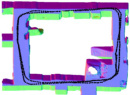

**Figure 3:** Overview of CartoRadar. To perform 3D SLAM with a mmWave
radar, CartoRadar incorporates a robust RF sensing component with uncertainty quantification (§ 3), and an uncertainty-aware RF-based SLAM
component (§ 4). The efficiency is further enhanced for online SLAM (§ 5).

achieves a median error of 3.4 cm, yet its 90th percentile error
extends to 32 cm. Similarly, another learning-based sensing
system fusing RF and visual signals [9] exhibits a 90th percentile error that is 10× greater than the median. This large
disparity between median and 90th percentile errors is not
uncommon and has been observed in other learning-based
RF systems as well [62, 72]. These findings highlight a longtail error distribution in learning-based RF sensing, which
can impact the accuracy and more importantly the reliability
of sensing results, particularly in safety-critical applications.
To leverage the effectiveness of ML-based sensing technology while addressing the long-tail error distribution issue,
we introduce a novel uncertainty quantification method for
RF sensing. Building on the design of [39], our imaging system rotates a mmWave radar to achieve high-resolution RF
imaging. Each full rotation generates a dense 3D point cloud,
followed by uncertainty estimation for each point in the
point cloud. This per-point uncertainty enables downstream
applications, such as SLAM systems, to weigh measurements
based on their reliability, effectively mitigating the impact
of long-tail errors and enhancing overall system robustness.
Our proposed uncertainty quantification method is specifically designed to accommodate the unique characteristics
of RF signals. Besides, our method is training-free, meaning it can be applied directly to a trained network without
any model modifications [17, 34, 61] or extensive retraining [25, 41]. In the following sections, we first establish the
problem definition and notations (§ 3.1) and then present
our training-free uncertainty quantification method (§ 3.2).
Notably, our approach is orthogonal to existing distributionbased uncertainty quantification methods [34, 61]. Thus, they
can be combined to achieve additional performance gains,
though this comes with the cost of increased training and
inference overhead (§ 3.3).

**3.1** **Problem Definition and Notations**
RF imaging aims to convert RF signals into a point cloud
representation of the scene. Specifically, the input to our
imaging ML model is a 3D RF heatmap, which represents the

Robot with a
mmWave Radar

Trajectory & Map

Efficient & Online SLAM (§ 5)

172

ACM MOBICOM ’25, November 4–8, 2025, Hong Kong, China Haowen Lai, Zhiwei Zheng, and Mingmin Zhao

Noise-free Prediction Noisy Predictions

**Figure 4:** Examples of input RF heatmaps and predicted range images at
different places. For heatmap visualization, we extract a slice at elevation
_𝜙𝑖_ = 0, corresponding to a range-azimuth heatmap of the horizontal plane.

strength of RF reflections from various locations in 3D space.
We denote the model as _𝑓_ and the input as _𝑿_ ∈ R _[𝑁][𝜙]_ [×] _[𝑁][𝜃]_ [×] _[𝑁][𝑟]_
along elevation ( _𝜙_ ), azimuth ( _𝜃_ ), and range ( _𝑟_ ) dimensions.
The original output of this model is a 2D range image _𝒀_ =
_𝑓_ ( _𝑿_ ) ∈ R _[𝑁][𝜙]_ [×] _[𝑁][𝜃]_ along elevation ( _𝜙_ ) and azimuth ( _𝜃_ ) dimensions. Each pixel _𝒀𝑖𝑗_ located at indices ( _𝑖, 𝑗_ ) in this range
image, with its elevation angle _𝜙𝑖_, azimuth angle _𝜃_ _𝑗_, and
range _𝑟𝑖𝑗_, can be converted to a 3D point ( _𝑥𝑖𝑗,𝑦𝑖𝑗,𝑧𝑖𝑗_ ) as:

_𝑥𝑖𝑗_ = _𝑟𝑖𝑗_ cos( _𝜙𝑖_ ) cos( _𝜃_ _𝑗_ ) _,_

_𝑦𝑖𝑗_ = _𝑟𝑖𝑗_ cos( _𝜙𝑖_ ) sin( _𝜃_ _𝑗_ ) _,_ (1)

_𝑧𝑖𝑗_ = _𝑟𝑖𝑗_ sin( _𝜙𝑖_ ) _._

Consequently, the range image _𝒀_ can be directly converted
into a 3D point cloud for visualization and further processing.
Throughout this paper, we will refer to _𝒀_ interchangeably
as a range image or a point cloud, based on the context.
Our goal is to quantify the uncertainty of the model prediction _𝒀_ . This is crucial because the model _𝑓_, while effective,
is not perfect and can produce errors, sometimes with a
long-tail distribution as discussed earlier. Uncertainty quantification in this context involves estimating the reliability
and confidence of each predicted range value, allowing us to
identify potential inaccuracies in the model’s output. Specifically, we aim to compute an uncertainty image _𝑼_ ∈ R _[𝑁][𝜙]_ [×] _[𝑁][𝜃]_,
where each element _𝑼𝑖𝑗_ corresponds to the uncertainty of
the predicted range value _𝒀𝑖𝑗_, with higher values indicating
greater uncertainty and lower confidence. A range image
and its corresponding uncertainty image, i.e., _𝒀_ and _𝑼_, can be
transformed into a point cloud with per-point uncertainty.

**3.2** **Training-free Quantification**
RF imaging is challenging due to factors such as energy
spreading (i.e., low resolution), specular reflection, and multipath effects [59, 83]. These inherent characteristics of RF
signals often make the imaging process under-determined,
meaning that different scenes or geometries could produce
similar signals. This ambiguity can cause the model to confuse one geometry for another, resulting in erroneous predictions. Fig. 4(a) shows an example where an elevator (highlighted region) with a highly specular surface produces weak
reflections back toward the sensor due to the oblique viewing angle. The pattern observed in the heatmap could also
be produced by an open area, introducing uncertainty and

**…**

Variance of N Noisy Predictions

LiDAR Estimated Uncertainty

**…**

Error N=4 N=8 N=16

**Figure 5:** Model predictions with noise injected into the input RF heatmap.
As the number of samples ( _𝑁_ ) increases, our uncertainty quantification
performance improves, and the uncertainty approaches the prediction error.

leading to prediction errors. In contrast, regions like the one
shown in Fig. 4(b) display a clear curve in the heatmap, indicating strong reflections from a wall segment (i.e., a diffuse
reflector). These patterns are less likely to be confused with
other geometries, resulting in lower uncertainty and accurate
prediction. These examples highlight how uncertainty arises
in model predictions within an under-determined system.
To quantify the uncertainty in ML-based RF sensing, we
propose a simple yet effective training-free method inspired
by sensitivity analysis. Our approach is based on the intuition that in an under-determined system, reconstructed
geometries with strong signal support (and thus lower uncertainty) should exhibit minimal variability when subjected
to perturbations. Conversely, geometries with weaker signal
support (and higher uncertainty) will show greater variation,
even with minor interference. To implement this concept,
we introduce random noise into the RF heatmap to create
multiple input variations. We then feed these noisy inputs
into the model to generate multiple predictions. The variance
of each range prediction _𝒀𝑖𝑗_ across these noisy outputs indicates its uncertainty _𝑼𝑖𝑗_ . Since the added noise is intended to
introduce perturbations rather than to explicitly model the
complexities of radio signals (e.g., multipath), our method
does not require incorporating real-world RF properties or
environment-specific characteristics in the noise formulation.
Empirically, we found Gaussian white noise to be effective.
Formally, let _𝑬_ ∈ R _[𝑁][𝜙]_ [×] _[𝑁][𝜃]_ [×] _[𝑁][𝑟]_ represent a 3D noise tensor,
where each element _𝑬𝑖𝑗𝑘_ is independently and identically
distributed (i.i.d.) according to a Gaussian distribution, _𝑬𝑖𝑗𝑘_ ∼
N (0 _, 𝜎_ [2] ) with _𝜎_ controlling the noise level. We calculate the
uncertainty of _𝒀𝑖𝑗_ as:
_𝑼𝑖𝑗_ = Var _𝑬𝑖𝑗𝑘_ ∼N(0 _,𝜎_ 2 ) [ _𝑓_ ( _𝑿_ + _𝑬_ ) _𝑖𝑗_ ] _._ (2)
Due to the complexity and non-linearity of neural networks,
deriving an analytical expression for _𝑼𝑖𝑗_ in Eqn. (2) is not
feasible. To address this, we use an approximation approach

173

RF-Based 3D SLAM Rivaling Vision Approaches ACM MOBICOM ’25, November 4–8, 2025, Hong Kong, China

**(a)** A single frame **(b)** Stack of multiple point clouds

**Figure 6:** Model prediction and its uncertainty. (a) A single frame of the
prediction. The last two rows highlight a strong correlation between the
estimated uncertainty and the prediction error. (b) Multiple point clouds,
colored by per-point uncertainty, are stacked with the robot trajectory. We
can see erroneous points have high uncertainty (in red).

based on Monte Carlo sampling. Specifically, we sample multiple noise tensors _𝑬_ 1 _, 𝑬_ 2 _,_ - · · _, 𝑬𝑁_ and compute the uncertainty _𝑼_ as the per-pixel variance across the finite predictions _𝑓_ ( _𝑿_ + _𝑬𝑛_ ) for _𝑛_ = 1 _,_ 2 _,_ - · · _, 𝑁_ . Fig. 5 shows an example
of our uncertainty quantification process. It demonstrates
the variation of the predictions given different noise samples.
With Monte Carlo sampling, the estimated uncertainty
gradually converges as the sample size increases. Interestingly, despite the large size of the input 3D tensor _𝑿_, we
observe that the variance converges with a relatively small
number of samples (i.e., _𝑁_ = 16 in our experiments). This allows our approach to be efficiently implemented by treating
_𝑁_ variants of noisy inputs as a batch and leveraging the parallel computation capabilities of GPUs. Finally, Fig. 6 shows
a strong correlation between our estimated uncertainty and
the prediction error, suggesting that our method accurately
identifies areas of potential inaccuracy in the RF imaging
results. This property enables the subsequent SLAM module
to transform a collection of noisy point clouds from different
locations (Fig. 6(b)) into a fine-grained 3D map (Fig. 1(b)).

**3.3** **Boosting Quantification Performance**
In the field of uncertainty quantification, several studies [8,
34, 61] focus on capturing prediction uncertainty by modeling the learning target as a distribution. Instead of predicting
a single value, these methods output the parameters of a
distribution. For example, when a Gaussian distribution is
used, the model predicts both the mean and variance, where
the mean represents the predicted value, and the variance
reflects the uncertainty around that prediction. However,
while these methods directly predict uncertainty, they often
overlook the uncertainty in the predicted distribution parameters themselves, a crucial aspect given that RF sensing
is inherently an under-determined problem. This additional
uncertainty can be effectively quantified with our approach.
In this section, we propose a hybrid uncertainty quantification method that combines our approach from § 3.2

with the distribution-based approach. This combination enhances the overall uncertainty quantification performance.
The core idea of the hybrid approach is to quantify the total
variance [69] of the model’s output. Assuming a Gaussian
distribution is used, we model the predicted range value
_𝒀𝑖𝑗_ as N ( _𝑴𝑖𝑗, 𝑽𝑖𝑗_ ), where _𝑴𝑖𝑗_ and _𝑽𝑖𝑗_ are elements of the
2D mean tensor _𝑴_ ∈ R _[𝑁𝜙]_ [×] _[𝑁][𝜃]_ and the 2D variance tensor
_𝑽_ ∈ R _[𝑁][𝜙]_ [×] _[𝑁][𝜃]_ . A model _𝑓_ [′] maps inputs to these tensors, denoted as _𝑓_ [′] ( _𝑿_ ) →( _𝑴, 𝑽_ ). For simplicity, we define m(·) and
v(·) to extract the mean and variance tensors, respectively,
such that _𝑴_ = m( _𝑓_ [′] ( _𝑿_ )) and _𝑽_ = v( _𝑓_ [′] ( _𝑿_ )). In a manner similar to Eqn. (2), we introduce noise _𝑬_ into the RF heatmap _𝑿_ .
According to the law of total variance [69], the uncertainty
in the range prediction _𝒀𝑖𝑗_ is then expressed as:

_𝑼𝑖𝑗_ = Var _𝑬𝑖𝑗𝑘_ ∼N(0 _,𝜎_ 2 ) [m( _𝑓_ [′] ( _𝑿_ + _𝑬_ )) _𝑖𝑗_ ]

(3)
+ E _𝑬𝑖𝑗𝑘_ ∼N(0 _,𝜎_ 2 ) [v( _𝑓_ [′] ( _𝑿_ + _𝑬_ )) _𝑖𝑗_ ] _._

We compute Eqn. (3) numerically using the same sampling
approach described in § 3.2.
While this hybrid approach achieves better uncertainty
quantification performance than both our training-free approach and the distribution-based method, it requires retraining since _𝑓_ [′] is a new model from the original out-ofthe-box model _𝑓_ . Furthermore, similar to [8, 34], we found
that a Laplace distribution offers better performance than a
Gaussian distribution. Therefore, in our experiments, we use
the Laplace distribution for this approach.

**4** **UNCERTAINTY-AWARE RF-BASED**
**SLAM**
The long-tail error distribution presents challenges when
combining multiple point clouds into a globally consistent
map. Typical 3D LiDAR SLAM methods [70, 71, 80] create
maps by concatenating point clouds, but this approach leads
to mapping inconsistencies across different views and reduced accuracy with our noisy radar point clouds. These
methods assume precise sensor measurements—a condition
not satisfied by ML-based RF imaging. To address this issue
and achieve robust, accurate, and fast mapping, we propose
two key components. First, we present an implicit occupancy
field that enforces multi-view consistency, ensuring the reconstructed 3D geometry remains coherently aligned across
all views. Although the raw radar signals are viewpointdependent, our approach operates on the predicted point
clouds. These point clouds, which encapsulate environmental geometry, naturally exhibit multi-view consistency. Moreover, we enhance training efficiency by eliminating the need
for time-consuming volume rendering and adopting a more
direct supervision strategy. Our high training efficiency plays
a crucial role in our later online deployment. Second, we

174

ACM MOBICOM ’25, November 4–8, 2025, Hong Kong, China Haowen Lai, Zhiwei Zheng, and Mingmin Zhao

naturally promoting multi-view consistency, a key factor in

_𝐷_ ˆ (r) =

_𝑁𝑝_
∑︁

_𝑇𝑚_ (1 − exp(− _𝜎𝑚𝛿𝑚_ )) _𝑠𝑚,_ (4)
_𝑚_ =1

|𝐫(𝑠) 𝐷 𝐩 𝐨 (a)|𝜎= 𝑓N(𝐫(𝑠)) Volume න Rendering 0 𝐷 𝐫(𝑠) 𝐷෡ Loss (b)|
|---|---|
|0 1 𝐫(𝑠) ෠𝑂= 𝑓O(𝐫(𝑠)) 0 1 𝐫(𝑠) 𝑂 𝐷 **(c)** Per-point Loss|𝐫(𝑠) ෠𝑂= 𝑓O(𝐫(𝑠)) 0 1 𝐫(𝑠) 𝑝(𝐷) 2𝜀 𝑠𝑚 **(d)** 𝑂𝑚= 1 𝑂𝑚= 0 𝑂𝑚= ? 0|

**Figure 7:** Illustration of (a) ray-casting in the scene, (b) classic NeRF, (c)
implicit occupancy fields, and (d) the proposed probabilistic learning for
implicit occupancy fields. In each case, we only focus on one ray, where the
orange curves represent the network queries. For the implicit occupancy
field in (c), the green curve shows the learning target, which corresponds to
the expected occupancy of sampled points. In (d), the green curve instead
represents the distribution of distances to the first hit point along the ray.

introduce a probabilistic learning strategy for field optimization, leveraging quantified uncertainty to probabilistically
weigh observations based on their reliability. Although the
implicit occupancy field ensures multi-view consistency, it
may yield overly smooth surfaces due to treating all predicted
points equally. To overcome this limitation, our probabilistic approach enables us to reconstruct surfaces with highfidelity details comparable to those obtained from visionbased methods.
In the following subsections, we first introduce NeRF for
range data, serving as the foundation of our approach. We
then introduce our implicit occupancy field, followed by a
detailed explanation of our probabilistic learning method.

**4.1** **Primer: NeRF for Range Data**
NeRF [53] has demonstrated its ability to create photometrically accurate 3D representations of environments with
RGB images and has been extended to accommodate other
modalities [7, 42, 50]. Similarly, several studies have modified NeRF to better integrate depth information for range
data [7, 30, 67]. Below, we take point clouds as an example
for illustration. As shown in Fig. 7(a), for a point p ∈ R [3]

observed by a robot at location o ∈ R [3], a ray r( _𝑠_ ) = o + _𝑠_ d is
cast, where d ∈ R [3] is a unit direction vector pointing from

- to p, and _𝑠_ is the travel distance of the ray. Along this
ray, _𝑁_ p points are sampled within predefined near and far
bounds, with each sampled point denoted as r( _𝑠𝑚_ ), where
_𝑚_ = 1 _,_ 2 _, . . ., 𝑁_ p, shown by the dots in Fig. 7(b). To build
the field, a neural network _𝑓_ N takes each sampled point as
input and outputs the volume density _𝜎𝑚_ = _𝑓_ N(r( _𝑠𝑚_ )). Since

where _𝛿𝑚_ = _𝑠𝑚_ +1 − _𝑠𝑚_ is the distance between two sampled points, and _𝑇𝑚_ = exp(− [�] _[𝑚]_ _𝑛_ = [−] 1 [1] _[𝜎][𝑛][𝛿][𝑛]_ [)][ is the accumulated]
transmittance. For field optimization, an L2 loss ∥ _𝐷_ [ˆ] - _𝐷_ ∥2
is applied to provide ray-level supervision, where _𝐷_ is the
distance between o and p, corresponding to _𝒀𝑖𝑗_ in § 3.1.

**4.2** **Implicit Occupancy Field with**
**Probabilistic Learning**
While NeRF-based approaches have been widely adopted,
directly applying them to our system poses two challenges.
First, their reliance on volume rendering makes training timeconsuming. Additionally, the ray-level supervision adopted
in NeRF lacks explicit supervision for each sampled point,
further prolonging field optimization. Second, although NeRF
ensures multi-view consistency, the reconstructed map tends
to lack details and exhibits over-smoothed geometry. This
issue arises from the long-tail error distribution in the point
clouds predicted by ML models. The equal treatment of all
predicted points during mapping leads to an averaging effect, which reduces the reconstruction accuracy. To address
these two challenges, we propose an implicit occupancy field
integrated with a probabilistic learning strategy.
**Implicit Occupancy Field.** To enhance training efficiency,
we remove the time-consuming volume rendering. Particularly, we shift the scene representation from volume density
to occupancy, which represents the probability of a point
being occupied, with values in the range [0 _,_ 1]. As shown
in Fig. 7(c), for each sampled point r( _𝑠𝑚_ ), the network _𝑓_ O
outputs an occupancy value _𝑂_ [ˆ] _𝑚_ = _𝑓_ O (r( _𝑠𝑚_ )). For a ray r( _𝑠_ )
with a range _𝐷_, the point at distance _𝐷_ is marked as occupied
(1), while the expected occupancy of all preceding sampled
points r( _𝑠𝑚_ ) where _𝑠𝑚_ _< 𝐷_ are set as unoccupied (0). A binary cross-entropy (BCE) loss is applied between _𝑂𝑚_ and _𝑂_ [ˆ] _𝑚_
for all sampled points. Notably, points beyond _𝐷_ are excluded
from sampling and supervision due to the line-of-sight constraint. Unlike traditional occupancy grid maps [24], which
are spatially discrete and limited in resolution due to memory
constraints, our method learns a continuous field, bringing
finer details and greater flexibility. Additionally, point-level
supervision enables more direct gradient backpropagation,
improving the optimization efficiency.
**Probabilistic Learning.** To further recover high-fidelity
details in the mapping process, it is essential to distinguish

175

RF-Based 3D SLAM Rivaling Vision Approaches ACM MOBICOM ’25, November 4–8, 2025, Hong Kong, China

between accurate and inaccurate predicted points and handle
them accordingly. For this purpose, we utilize the quantified
uncertainty _𝑼𝑖𝑗_ of each point and introduce a probabilistic
learning method for the implicit occupancy field. Specifically, the distance _𝐷_ to the first hit point on a ray is no
longer treated as a fixed value but is modeled as a probabilistic distribution. We represent it with a Laplace distribution
_𝑝_ ( _𝐷_ ; _𝜇,𝑏_ ), where _𝜇_ = _𝒀𝑖𝑗_ is the predicted range, and the diversity _𝑏_ = √︁ _𝑼𝑖𝑗_ /2 is derived from the quantified uncertainty.

As illustrated in Fig. 7(d), for any sampled point r( _𝑠𝑚_ ), three
possible cases arise: **First**, if the first hit point coincides with
the sampled point ( _𝐷_ = _𝑠𝑚_ ), the point r( _𝑠𝑚_ ) is considered
occupied ( _𝑂𝑚_ = 1) with probability _𝑃𝐷_ = _𝑠𝑚_ = ∫ _𝑠𝑚𝑠𝑚_ −+ _𝜖𝜖_ _[𝑝]_ [(] _[𝐷]_ [)][d] _[𝐷]_ [.]
Here, we integrate over the small segment [ _𝑠𝑚_ - _𝜖,𝑠𝑚_ + _𝜖_ ] to
capture a meaningful probability mass. Our ablation study
in § 7.3 demonstrates that our method is insensitive to _𝜖_ .
**Second**, if the first hit point is beyond the sampled point
( _𝐷_ _> 𝑠𝑚_ ), the point r( _𝑠𝑚_ ) is considered unoccupied ( _𝑂𝑚_ = 0)
with probability _𝑃𝐷>𝑠𝑚_ = ∫ _𝑠𝑚_ +∞+ _𝜖_ _[𝑝]_ [(] _[𝐷]_ [)][d] _[𝐷]_ [.] **[ Third]** [, if the first]
hit point occurs before the sampled point ( _𝐷_ _< 𝑠𝑚_ ), the
occupancy of r( _𝑠𝑚_ ) is unknown due to non-line-of-sight conditions. For supervision, we omit the third case as it provides
no valid information. Considering the other two cases, the
loss function for a sampled point r( _𝑠𝑚_ ) is defined as:

Incoming Raw

Point Cloud
w/ Per-point

Uncertainty

Robot Pose

Randomly-selected
Latest Frame Historical Frame

|Col1|…|Col3|Col4|
|---|---|---|---|
|||||
||**…**|||

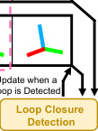

Lr( _𝑠𝑚_ ) = _𝑃𝐷_ = _𝑠𝑚_ - BCE( _𝑂_ [ˆ] _𝑚,_ 1) + _𝑃𝐷>𝑠𝑚_ - BCE( _𝑂_ [ˆ] _𝑚,_ 0)

(5)
= − _𝑃𝐷_ = _𝑠𝑚_    - log( _𝑂_ [ˆ] _𝑚_ ) − _𝑃𝐷>𝑠𝑚_    - log(1 − _𝑂_ [ˆ] _𝑚_ ) _._

**Figure 8:** Pipeline of the online SLAM system. Different modules run as
separate processes. The robust RF sensing module (blue) and the odometry
module (grey) append new data to a shared memory queue. The localization
and mapping module (green) samples frames from the queue while jointly
optimizing robot poses and a neural network (the occupancy field). The loop
closure detection module (yellow) updates poses when a loop is detected.

**5** **EFFICIENT AND ONLINE SLAM**
So far, we have discussed our robust RF sensing, which
generates point clouds with per-point uncertainty, and our
uncertainty-aware RF-based SLAM, which ensures accurate
and consistent reconstruction. However, these components
were originally designed for offline SLAM systems, in which
processing begins only after all data become available. For
time-sensitive applications like navigation, planning, and
search and rescue [47, 75], runtime efficiency is crucial. In
this section, we shift our focus to online and efficient SLAM.
We first introduce the remaining components of CartoRadar
and explain how we transform it into an online SLAM system.
Finally, we summarize the design choices and techniques
employed to optimize efficiency in our online SLAM system.

**5.1** **Full System**
CartoRadar is built around four modules: robust RF sensing, localization and mapping, odometry, and loop closure
detection, as shown in Fig. 8. Below, we describe additional
components essential for our SLAM system.
**Odometry for Initial Poses.** We employ the motion estimation method outlined in [39] to derive the robot’s velocity
from raw RF signals. Given the relatively short update interval (0.5 s), we assume the velocity remains constant during
this period. Consequently, the change in the robot’s location
is calculated by multiplying the velocity by the time interval.
Through incrementally accumulating these transformations,
we generate odometry that provides the initial robot poses.
**Loop Closure Detection.** Odometry often suffers from error
accumulation and drift over time [80]. A common technique
to address this is loop closure detection [40, 70, 71]. During
localization, when the robot approaches a previously mapped
location within a certain distance, the newly observed point
cloud will overlap with the prior one. We exploit this overlap
using point-to-plane ICP [14], a point cloud registration algorithm that computes a transformation to align the two point

Our qualitative and quantitative analysis in (§ 7.3) demonstrates improved detail reconstruction and a 12% increase
in both mapping accuracy and completion, validating the
effectiveness of our probabilistic approach.
**Rendering and Visualization.** To visualize the scene represented by the implicit occupancy field, we convert it into
point clouds with the following procedure. First, we uniformly sample points r( _𝑠𝑚_ ) along a ray. Each sampled point
is then queried through the network to obtain its occupancy
value, _𝑂_ [ˆ] _𝑚_ = _𝑓_ O (r( _𝑠𝑚_ )). Considering the possibility of a ray
intersecting multiple objects, we follow the approach in [53]
to obtain the termination distance. Specifically, we first compute the accumulated transmittance _𝑇𝑚_ = [�] _[𝑚]_ _𝑛_ = [−] 1 [1] [(][1][ −] _[𝑂]_ [ˆ] _[𝑛]_ [)][.]
Next, we achieve the rendered range, _𝐷_ [ˆ] (r), as the distance
to the point with the highest termination probability _𝑇𝑚𝑂_ [ˆ] _𝑚_ :

_𝐷_ ˆ (r) = _𝑠_ _𝑗,_ where _𝑗_ = arg max( _𝑇𝑚𝑂_ [ˆ] _𝑚_ ) _._ (6)

_𝑚_

By rendering the range _𝐷_ [ˆ] (r) for rays originating from various locations o and directions d, we generate a point cloud
map of the scene, which can be subsequently used to construct a mesh via Poisson surface reconstruction [33].

176

ACM MOBICOM ’25, November 4–8, 2025, Hong Kong, China Haowen Lai, Zhiwei Zheng, and Mingmin Zhao

clouds. Since the long-tail error in the predicted point clouds
can affect the registration accuracy, only points whose uncertainty is below a threshold are used. These transformations
act as loop closure constraints and help mitigate accumulated
errors in odometry. Specifically, a pose graph is constructed
with the initial poses and loop closure constraints, which is
then optimized to correct the drift in the trajectory.
**Joint Optimization.** Our localization and mapping module
optimizes an implicit field that represents the environment.
However, errors in poses can cause misalignment between
geometries in different views, especially for object details,
degrading mapping quality. To address it, we enable gradient
backpropagation to the poses and perform joint optimization,
leveraging the fact that the entire pipeline is differentiable
with respect to the poses. While this approach has minimal
impact on localization, we found that joint optimization significantly improves mapping performance (detailed in § 7.3).

**5.2** **Online SLAM**
To enable online 3D SLAM, CartoRadar incorporates the
following key designs, as illustrated in Fig. 8: **(1) Parallel**
**Execution:** The four modules, robust RF sensing, odometry, localization and mapping, and loop closure detection,
run as separate processes within a multi-process framework,
allowing them to operate in parallel. **(2) Shared Memory**
**Queue:** A shared memory queue is used to store initial poses,
point clouds, and per-point uncertainty. Different modules
access this queue to read and update them as needed. **(3)**
**Online Loop Closure Detection:** Whenever a new point
cloud is added to the queue, loop closure detection is triggered. If a loop is detected, the pose graph will be updated
and optimized, and the poses in the queue will be updated
accordingly. **(4) Ray Sampling Strategy:** Each time a new
point cloud is added to the queue, we sample half of the
rays from the latest frame and the other half from randomly
selected previous point clouds.
Efficient operation is crucial for online SLAM. Our system
is efficient in the following aspects:
**Efficient Pipeline.** As previously mentioned, the modules of
our system operate in parallel, running in separate processes
rather than in a linear sequence. This helps to optimize the
use of system resources. For instance, the radar rotates at
2 Hz, generating new point cloud observations every 0.5 s.
The localization and mapping module, however, can process
one batch of rays in approximately 0.04 s. Instead of waiting
for new data, the system continues training by sampling rays
from the queue to prevent catastrophic forgetting [16].
**Efficient Uncertainty Quantification.** As discussed in
§ 3.2, our training-free uncertainty quantification method
converges with only a small number of samples (e.g., _𝑁_ = 16).
This allows us to stack noisy heatmaps into a batch and

process them in parallel using GPUs. Additionally, instead
of generating new noise tensors _𝑬𝑛_ for each point cloud, we
pre-sample _𝑁_ noise tensors and use them across all inputs,
significantly reducing the time spent on noise sampling.
**Efficient Mapping.** As explained in § 4.2, our implicit occupancy field leverages the exceptional reconstruction capabilities of NeRF while eliminating the time-consuming volume
rendering during training. Direct point-level supervision of
the occupancy not only reduces the required operations but
also simplifies optimization, thereby improving training efficiency. To further speed up training, we limit the number
of points sampled along each ray to 64 in the online system,
which is 8 times fewer than in the offline version.
With these efficient designs, our online SLAM system
can accurately reconstruct details while significantly reducing computational costs. As shown in our experiments (see
Tab. 1), CartoRadar achieves performance similar to the offline version, with only a slight increase of less than 4 cm in
localization error and 2 cm in mapping error.

**6** **IMPLEMENTATION**

**Hardware:** We use a TI AWR1843 single-chip mmWave
FMCW radar, which is configured to sweep from 77 to 81 GHz
(4 GHz bandwidth), with 256 samples in each chirp and a
maximum sensing range of 10 m. A stepper motor rotates
the radar with an 8 cm radius at a speed of 2 Hz, simulating
a synthetic aperture radar. For ground truth reference, we include an Ouster 64-beam mechanical LiDAR. To synchronize
the RF data collected by a Jetson Nano and the LiDAR data
collected by a Raspberry Pi, we use an optical switch to detect every cycle of the rotation and align them by timestamps.
Our system is mounted on a Lynxmotion Mecanum Rover
mobile platform. The robot is controlled manually with a
joystick and has a maximum speed of 0.6 m/s.
**Scenarios:** Our SLAM dataset covers 14 floors across 5 separate buildings. The diversity of the buildings is notable,
featuring distinct designs and materials with construction
dates stretching from 1906 to 2006. The entire dataset was
collected traversing a distance of 1527 meters. After signal
processing, it consists of 6637 synchronized RF and LiDAR
frames, respectively, aggregating to 223 GB.
**ML Models:** For RF imaging, we directly adopt the opensourced ML model in [39] to show the training-free property of our uncertainty quantification method. This imaging
model has a 7-stage U-Net [68] structure, each with 4 ResNet
blocks. Further, we extend the network by duplicating the
decoder branch from the last stage for predicting Laplace
distribution parameters, creating a distribution-based model
for the hybrid uncertainty quantification method. For the
implicit occupancy field, we utilize learnable dense grid encoding [55] to map each sampled point’s location to a vector

177

RF-Based 3D SLAM Rivaling Vision Approaches ACM MOBICOM ’25, November 4–8, 2025, Hong Kong, China

**Table 1:** The localization and mapping performance of our system compared
with baselines. For vision baselines, due to their limited FOV, we report two
cases: [1] : mounted on a cart, and [2] : handheld for full scans. ATE, Acc., Comp.

Localization Mapping Scan
Methods
ATE RPE Acc. Comp. F-S. Time
ZED-sdk (ZED) ~~[1]~~ 50.62 5.79 24.55 24.99 39.88 1.0
RTAB-Map (R.S.) [1] 72.26 1.29 28.66 28.93 45.00 1.0
RTAB-Map (iPad) [1] 53.47 9.17 13.75 28.09 62.76 1.0
Ours (Online) 18.08 1.01 9.24 9.13 72.48 1.0
Ours (Ofine) **14.12** **0.93** **7.40** **8.09** **76.48** 1.0
RTAB-Map (iPad) ~~[2]~~  -  - 5.29 5.92 85.33 5.5

of length 20. Features are then decoded to occupancy with a
2-layer MLP, each hidden layer comprising 64 neurons.
**Computational Cost:** All computations are performed on
an Intel i7-11700 CPU and an NVIDIA GeForce RTX 3090
GPU. We set the batch size to 4096 for the implicit occupancy
field, sampling 512 points per ray for offline SLAM and 64
for online SLAM. Consequently, each iteration takes 0.07 s
for offline SLAM and 0.04 s for online SLAM.

**7** **EVALUATION**

In this section, we evaluate the performance of CartoRadar.
Specifically, for uncertainty quantification, we adopt a crossbuilding evaluation strategy to assess generalization. All
training-required uncertainty quantification methods are
trained on four buildings, while trajectories from the remaining held-out building are used to evaluate performance. This
process is repeated for all five buildings, ensuring comprehensive testing across diverse environments. Worth mentioning,
unless otherwise specified, our RF-based SLAM system consistently incorporates the estimated uncertainty and includes
loop closure detection.

**7.1** **SLAM System Performance**

**Baselines.** We evaluate our approach against popular visual SLAM methods with various modalities, namely ZEDsdk with ZED 2i (stereo camera) [26], RTAB-Map with Intel RealSense D455f (RGB-D camera) [38], and RTAB-Map
with iPad Pro (RGB + depth scanner) [37]. We note that
CartoRadar performs 3D SLAM, whereas recent mmWavebased methods [46, 66, 73] only focus on 2D mapping. For a
fair comparison, we choose these vision-based baselines to
evaluate our 3D performance.
**Metrics.** Following literature [28], we report absolute trajectory error (ATE)↓ and relative pose error (RPE)↓ for localization, quantifying position and orientation errors respectively.
For mapping, accuracy (Acc.)↓ and completion (Comp.)↓ are
used to measure point cloud distance error, while F-score
(F-S., with a 10 cm threshold)↑ combines precision and recall
into one metric.

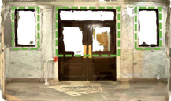

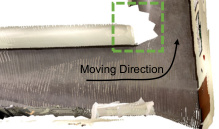

**(a)** Limited FOV **(b)** Transparent Windows

**Figure 9:** Mapping results of baselines. (a) Due to the limited FOV, there
are many unscanned regions in the map. (b) Vision-based methods struggle
to reconstruct transparent objects such as windows.

**SLAM Performance.** We evaluate and compare the SLAM
performance with baselines, with the results summarized
in Tab. 1. Among all approaches, given the same scanning
time, our method achieves the best performance for both localization and mapping. Specifically, for vision baselines, we
mount the sensors on a cart and follow the same trajectories
as our radar. However, compared to our system, vision-based
systems face inherent limitations. Their restricted field of
view (FOV) often leaves many regions unscanned, resulting in incomplete scene reconstructions, as illustrated in
Fig. 9(a). Moreover, because these methods rely on visible
light, they struggle to accurately capture transparent objects,
such as windows (see Fig. 9(b)), which can be critical details in applications such as firefighting and other rescue
missions. To fully leverage the potential of the vision-based
method, we conduct a manual full scan of the environment
and run the RTAB-Map (iPad) method, which yields the best
performance among all vision-based methods. Although full
scanning leads to a notable improvement in performance, as
indicated by [2] in Tab. 1 (∼50% in mapping accuracy), it also
increases the scan time by up to 5.5 times, posing challenges
for deployment in time-sensitive applications.
Qualitative results of our mapping across multiple diverse
buildings are presented in Fig. 10, where we leverage Poisson surface reconstruction [33] to obtain meshes from point
clouds. As the left side shows, our system is able to accurately
reconstruct the whole scene, which is close to those achieved
by a 3D LiDAR (Ouster OS0-64 costing $9,000). Furthermore,
our system successfully captures geometry details in the
environment, such as chairs, stairs, corners, and straight
walls, with high fidelity. Meanwhile, the properties of the
mmWave signals, such as being opaque to glass [27], are also
maintained in this process, providing particular advantages.
For instance, in Trajectory 4 Details (b), while both RF and
LiDAR recover the bench, our system successfully reconstructs the glass behind it, which LiDAR fails to capture as
laser penetrates the glass.

**7.2** **Uncertainty Performance**

**Baselines.** We choose three widely used uncertainty quantification methods as our baselines. The first one adopts a

178

ACM MOBICOM ’25, November 4–8, 2025, Hong Kong, China Haowen Lai, Zhiwei Zheng, and Mingmin Zhao

**Figure 10:** Mapping results (left) and details (right) of CartoRadar in different environments. For each trajectory, we compare ours with the corresponding
LiDAR mesh map. The maps are colored according to their surface normal. Trajectories are depicted as yellow lines.

**Table 2:** Evaluation of different uncertainty quantification methods on five different buildings. We report NLL, AUSE (×0 _._ 1), and the number of models
needed to be trained. The best performance is highlighted. Abbreviation: Lap. = Laplacian [34], Ens. = Ensemble [41], and Drop. = MC Dropout [17].

Re-train Required Out-of-the-box Re-train Required
Lap. Ens.-4 Ens.-8 Ens.-12 Drop.-32 Drop.-128 Ours-16 Ours-32 OursH-16 OursH-32
NLL↓ 0.97 0.46 -0.09 -0.12 1.11 1.00 -0.80 -0.82 -0.93 **-0.94**
AUSE↓ 0.96 1.20 0.99 0.87 0.92 0.87 0.80 0.74 0.75 **0.70**
#Trained Models 1 4 8 12 1 1 **0** **0** 1 1

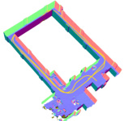

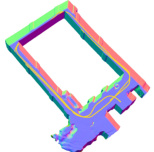

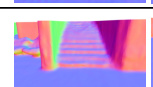

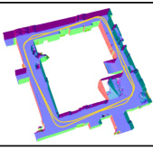

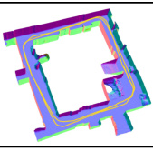

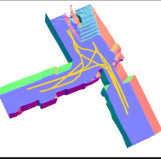

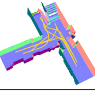

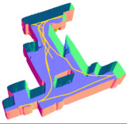

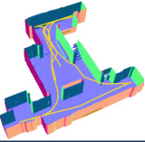

distribution-based approach, modeling outputs as a Laplacian distribution and minimizing a negative log-likelihood
during training [34]. The second involves neural network ensembles [41]. Multiple models with an identical structure are
trained and their outputs are aggregated. The third method,
MC-dropout [17], involves random neuron dropout during
both training and inference phases. In our implementation,
we incorporate a dropout layer following each downsampling and skip-connection operation, setting a dropout rate of
0.4 which gives the best performance after searching among
{0 _._ 2 _,_ 0 _._ 4 _,_ 0 _._ 6 _,_ 0 _._ 8}. Notably, all these methods require either
re-training or modifications to the original model.
**Metrics.** To evaluate performance, two commonly used metrics are employed. The first one is the negative log-likelihood
(NLL) [56], which measures the probability of observing

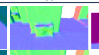

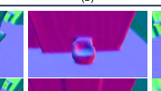

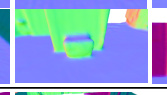

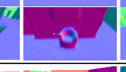

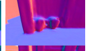

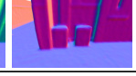

the given data under the assumed statistical model. Specifically, we adopt a Laplace distribution when calculating NLL,
since we employ it in the distribution-based baseline. The
other metric we use is the area under the sparsification error
(AUSE) [61], which assesses the effectiveness of the uncertainty in approximating the prediction error. For both metrics, lower values signify better quantification performance.
**Performance.** We compare our proposed uncertainty quantification methods against three baselines, summarizing the
results of NLL and AUSE in Tab. 2. For simplification, we
denote each method as name-#, where "name" refers to the
method and "#" indicates training or sampling number, if
applicable. Our training-free method, designated as Ours-16,
surpasses all the baselines while avoiding any re-training
or modification to the network architecture. Specifically,

179

RF-Based 3D SLAM Rivaling Vision Approaches ACM MOBICOM ’25, November 4–8, 2025, Hong Kong, China

Error Laplace

Ensemble-16 Dropout-128

Ours-16 OursH-16

**Figure 11:** Range errors and the uncertainty from different approaches.
Both our training-free method and the hybrid method follow the error well.

|Components Uncert. Optim. Pose|Acc. Impr. (cm) (%)|Comp. Impr. (cm) (%)|F-S. Impr. (%) (%)|
|---|---|---|---|
|# # #     #   |6.27 – 5.04 19.6 5.44 13.2 **4.32** **31.1**|6.75 – 5.38 20.3 5.92 12.3 **4.83** **28.4**|83.1 – 88.5 5.4 87.0 3.9 **91.0** **7.9**|

0.0

−0.2

−0.4

−0.6

−0.8

−1.0

|Col1|Col2|Col3|Ours-16 Ours-Ext16|
|---|---|---|---|
|||||

0.5 1.0 1.5 2.0
noise level _σ_

|Col1|Col2|O O|urs-16 urs-Ext16|
|---|---|---|---|
|||||
|||||

0.5 1.0 1.5 2.0
noise level _σ_

1.2

1.1

1.0

0.9

0.8

0.7

**Figure 12:** Uncertainty quantification comparison with different noise
levels. Optimal noise levels can be found for both approaches.

compared to MC-dropout, which also requires sampling,
Ours-16 proves more efficient, requiring only 16 samples
versus MC-dropout’s 128, while achieving a better performance. Doubling the sample number of our method to 32
further improves NLL by 0.02 and AUSE by 0.06, but this
comes with an increase in the inference time by 40%. Notably, the time increase is less than double because the GPU
efficiently batchifies the additional inputs, enabling parallel
processing and preventing a linear increase in time. Besides,
this marginal gain from doubling the samples suggests that
our method already performs well with fewer samples. Our
method can also be significantly enhanced when extended
with distribution-based models, forming a hybrid approach,
designated as OursH-#. It outperforms both our previous
method and the standalone distribution-based method. Given
its superior performance, we take OursH-16 as our default
uncertainty quantification method in CartoRadar. Remarkably, like Ours-#, the hybrid method also converges with
only 16 samples. Fig. 11 illustrates a comparison between
range prediction errors and the quantified uncertainty across
different methods. Although the baselines show a correlation between error and estimated uncertainty in specific
areas, Ours-16 and OursH-16 track the error more closely
and accurately, particularly in the central region.
**Noise Levels.** The proposed methods, Ours-# and OursH#, perform multiple inferences on RF heatmaps with added
Gaussian white noise. To assess the impact of noise variance,
we conduct an ablation study by adjusting the variance of
the input white noise to different levels. Fig. 12 presents the
NLL and AUSE results under varying noise intensities. We
observe that performance initially improves with increasing
noise levels but then declines, indicating the existence of
an optimal noise level. We attribute this behavior to the
fact that small amounts of noise are insufficient for effective

**Table 3:** Mapping performance with different system components. To show
the improvement in mapping details while removing the influence of the
localization error, we divide trajectories into segments (every 15 frames)
and align them when computing metrics.

uncertainty quantification, whereas excessive noise degrades
the underlying signal.

**7.3** **Other Components and Online SLAM**

**Improvement from Uncertainty.** We evaluate the impact
of uncertainty on mapping by comparing field optimization
with and without uncertainty. For the training of occupancy
fields without uncertainty, we follow the process outlined in
Fig. 7(c). As shown in Tab. 3, quantitative analysis reveals that
incorporating uncertainty enhances both mapping accuracy
and completion by at least 12.3%. For qualitative analysis,
we present two challenging cases in Fig. 13. The first one
shows a wall observed at a far distance, where uncertainty
aids in smoothing the surface and removing floating artifacts. The second one showcases two chairs, where the use
of uncertainty transforms their appearance from generalized,
sphere-like shapes to more precise and detailed chairs. In
conclusion, both the quantitative and qualitative results highlight the importance of uncertainty in improving mapping
quality and validate the effectiveness of our approach.
**Analysis of Segment Length.** We conduct an ablation study
on how varying the segment length _𝜖_ described in § 4.2 affects the mapping performance. Specifically, we test different
values _𝜖_ ∈[0 _._ 35 _,_ 0 _._ 40 _,_ 0 _._ 45 _,_ 0 _._ 50] cm to observe its impact.
Experiments show the F-score of the mapping results are

[0 _._ 764 _,_ 0 _._ 765 _,_ 0 _._ 762 _,_ 0 _._ 759] respectively, indicating its minimal influence. For other experiments, we set _𝜖_ to 0.40 cm, as
it has relatively higher performance compared to others.
**Improvement from Joint Optimization.** As noted in § 5.1,
during the mapping process, CartoRadar leverages the joint
optimization to simultaneously adjust the poses and the occupancy field. Our experiments show the improvement in
localization is modest. We attribute the limited gain to the
almost accurate pose estimation after loop closure, leaving
little room for further optimization. However, joint optimization significantly enhances the mapping process. As shown
in Tab. 3, both accuracy and completion of the reconstructed
map are improved by more than 1 cm, resulting in an overall
F-score improvement of 5.4% without uncertainty and 7.9%
with uncertainty. This occurs because incremental refinements in pose yield more precise scene alignment, enabling

180

ACM MOBICOM ’25, November 4–8, 2025, Hong Kong, China Haowen Lai, Zhiwei Zheng, and Mingmin Zhao

w/o Uncertainty w/ Uncertainty LiDAR

**Figure 13:** Comparison of mapping results without and with uncertainty.
The black boxes highlight notable differences between the two results.

0.75

0.50

0.8

0.4

0.0

|Col1|Col2|Col3|Col4|
|---|---|---|---|
|||||
||||Ours|
||N|eRF|eRF|

0 20 40 60 80 100
Training Time (s)

0 1 2 3 4 5
Training Time (s)

0.8

0.4

0.0

**Figure 16:** Mapping efficiency (offline) of our implicit occupancy field
compared with NeRF [53]. The zoom-in plots are shown on the right.

|Col1|Col2|Col3|Col4|Col5|Col6|Col7|
|---|---|---|---|---|---|---|
||||||||
||||||||
||||||~~w/o~~ w/ L|~~ LCD~~  CD|

|Performance - Time Plot|Col2|Col3|Col4|
|---|---|---|---|
|Performance - Time Plot  |Performance - Time Plot  |Performance - Time Plot  |Performance - Time Plot  |
|Loop Clos|| ~~Online~~|~~Offline~~|
|Loop Clos||ure||
|||||
|||Online|Offline|
|Trajecto|Trajecto|ry Ends||
|||Online|Offline|
|||||
|||||

0 100 200 300 400
Training Time (s)

8.0

7.5

7.0

5.5

5.0

4.5

8.0

7.5

7.0

**Figure 17:** Localization and mapping for our online and offline pipelines.
The offline training starts only when the trajectory ends (at 95 s). For offline
SLAM, loop closure detection happens before the training starts, therefore
not explicitly indicated above. The zoom-in plots are shown on the right.

summarized in Tab. 1. Fig. 17 further illustrates the comparison between online and offline SLAM. While offline SLAM
achieves slightly better performance, it requires the full trajectory before processing, leading to significant delay. Please
note that both online and offline SLAM are subject to error
accumulation from odometry drift, and loop closure detection is used in both cases to mitigate it. The key difference is
that the offline method has access to the complete dataset
upfront and performs loop closure detection before mapping
begins, whereas the online method detects loop closures
dynamically during the robot’s movement.

**7.4** **Downstream Re-localization Tasks**

To evaluate the potential of CartoRadar for broader robotic
applications, we assess whether the reconstructed map can
be leveraged for downstream tasks such as re-localization.
During data collection, we supplement each of the 14 trajectories with additional radar measurements at 10 randomly
selected locations while simultaneously tracking the corresponding poses. These data are processed by the sensing
module to generate point clouds and estimate uncertainty
but are not used in SLAM. Once the reconstructed map from
CartoRadar is obtained, we apply Adaptive Monte Carlo
Localization (AMCL) to the predicted point clouds for pose
estimation. Our experiments yield a mean translation error of
35.43 cm and an orientation error of 0.12 rad in re-localization.
By filtering out points with high uncertainty before applying
AMCL, the translation error is reduced to 31.39 cm, and the
orientation error decreases to 0.09 rad. Considering that the
building dimensions extend up to 25 m and comparing our

20

10

0

10

5

0

20

10

0

100 200 300 400
Training Time (s)

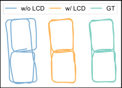

**Figure 14:** The localization results
without and with loop closure detection (LCD).

0.00

Localization Error (m)

**Figure 15:** CDF plot of the localization errors without and with loop closure detection.

the capture of finer scene details and ultimately improving
mapping performance.
**Loop Closure.** One important component of CartoRadar in
localization is loop closure detection (§ 5.1). Odometry drift
can lead to significant errors in the localization, as the blue
trajectory shown in Fig. 14. To show the effectiveness of loop
closure, Fig. 15 presents the localization error of our SLAM
system across the entire dataset. Notably, the mean error
decreases by 0.43 m, and the 90th percentile error has a more
significant drop by 0.89 m, both of which have improved for
at least 76%. This shows the great benefits of the loop closure
detection. Note that the large localization errors observed
without loop closure detection primarily result from error
accumulation of the odometry drift rather than the long-tail
error distribution in the imaging results.
**Mapping Efficiency.** To show the efficiency of the proposed
implicit occupancy field, we compare it against the baseline
NeRF [53]. The result in Fig. 16 demonstrates our method not
only achieves more accurate mapping but also achieves it in
a much faster way. This efficiency stems from eliminating
the time-consuming integration process and providing direct
supervision for sampled points. This efficient mapping serves
as the foundation for subsequent online SLAM.
**Online SLAM.** CartoRadar supports online SLAM which
performs localization, mapping, and loop closure detection
progressively as new data become available. Compared to
our offline version, online SLAM exhibits a similar performance, with ATE increasing by only 3.96 cm. The accuracy
and completion errors rise by 1.84 cm and 1.04 cm, respectively, while the F-score decreases by only 4%. The results are

181

RF-Based 3D SLAM Rivaling Vision Approaches ACM MOBICOM ’25, November 4–8, 2025, Hong Kong, China

results to the 2D re-localization performance in [46], the reconstructed map from CartoRadar demonstrates sufficient
accuracy for subsequent robotic tasks.

**8** **RELATED WORK**

**RF Sensing:** Due to the robustness and privacy preservation, RF sensing technology has been used in different scenarios, such as RF imaging [29, 84–86], vital sign monitoring [3, 78], localization and tracking [1, 2, 31, 45, 82], detection [21, 43, 52, 63], etc. However, limitations like low
sensing resolution, specular reflection, and multipath effect
still pose significant challenges in application. While some
work [35, 57, 64, 77] leverages signal processing techniques
to address these issues, others [9, 19, 39, 49, 62, 72] turn to
data-driven approaches by training a model to predict the
corresponding target from the signal. Although learning with
data implicitly exploits the underlying latent information of
the RF signal [19, 84, 85] and achieves good performance,
it is usually hard to identify errors and hallucinations. The
inability to discern unreliable model outputs undermines
the robustness of RF signals, where those merits are important for safety-critical applications such as autonomous
driving [54] and search and rescue [20].
**Uncertainty Quantification:** In the field of robust AI, researchers have explored various methods to quantify the reliability of model outputs. Common techniques include model
ensembles [25, 41] and Monte Carlo dropout [17, 18]. These
methods estimate uncertainty in the learned mapping function by measuring the variance in outputs across different
network variants. Another approach models uncertainty by
representing outputs as probability distributions [34, 58, 61],
learning prediction errors [12], or predicting confidence intervals [60], thereby directly encoding uncertainty in the
output representation. However, all these techniques require
modifications to the original model and necessitate retraining. In particular, model ensembles with _𝑁_ models require
_𝑁_ separate training sessions, significantly increasing computational cost and posing challenges, especially under strict
time constraints.
**RF-based SLAM:** Recent RF-based SLAM methods address
the challenge of mapping unknown environments while simultaneously tracking the pose using radar sensors [46].
Approaches like [22, 36] use point registration on sparse
radar point clouds for trajectory estimation. Others, such
as [11, 23], improve robustness and accuracy by extracting
and matching features. Machine learning techniques have
been integrated to extract more robust key points [6], and
Doppler effects have been incorporated to enhance precision [66, 73]. However, these methods are limited to 2D
SLAM, neglecting the height dimension. The closest work
to ours performs 3D SLAM using denser point clouds from

an expensive 4D radar [81], yet it exhibits meter-level errors
despite relying on additional sensors like barometers. Furthermore, like others, it prioritizes tracking over mapping
and fails to produce a full and accurate map of environments.
**Implicit Field:** Since NeRF [53] introduced implicit representations for RGB novel-view synthesis, numerous works
have extended it to other areas including SLAM. Early approaches [74, 87] demonstrate SLAM with RGB inputs. Following work [15, 28] adapts to range measurements by representing scenes with volume density and signed distance
functions, respectively. However, they show high computational costs when updating the implicit field, and they
all assume the input measurements are noise-free. Another
line of work [51, 65] considers the noise in measurements
and incorporates uncertainty as a weight for the ray-level
loss, but it does not align with our point-level supervision.
Although [76] integrates uncertainty for volume density,
it depends on extra hyper-parameters such as predefined
truncation ranges, which may restrict its generalizability in
diverse mapping environments.

**9** **DISCUSSION**
While CartoRadar outperforms vision-based SLAM methods under the same trajectory and scanning time, visionbased approaches capture rich color and texture information,
which is useful for tasks like scene understanding and object
recognition. Additionally, CartoRadar is currently designed
for indoor static environments. Handling dynamic objects
remains an open challenge for future research. This could
potentially be addressed through motion modeling or dynamic object filtering. Another limitation lies in loop closure
detection, where the current distance-based method may fail
under severe drift. Future work could explore more advanced
feature-based approaches, particularly how to extract robust
and distinguishable features from RF signals.

**10** **CONCLUSION**
CartoRadar introduces the first RF-based 3D SLAM system
achieving localization and mapping with centimeter-level accuracy and high-fidelity details comparable to vision-based
approaches. The precise localization and mapping capabilities, together with the resilience of RF sensors, offer mobile
robots an opportunity to operate effectively in challenging
environments. In particular, our training-free uncertainty
quantification enhances the reliability of ML-based RF sensing systems in safety-critical scenarios. By integrating implicit occupancy fields with probabilistic learning, we effectively manage accuracy variations in ML-based RF sensing. We believe this work will facilitate further research in
RF-based 3D SLAM, providing a robust and cost-effective
alternative to conventional vision-based methods.

182

ACM MOBICOM ’25, November 4–8, 2025, Hong Kong, China Haowen Lai, Zhiwei Zheng, and Mingmin Zhao

**REFERENCES**

[1] Fadel Adib, Zachary Kabelac, and Dina Katabi. 2015. Multi-person
localization via RF body reflections. In _12th USENIX Symposium on_
_Networked Systems Design and Implementation (NSDI 15)_ . 279–292.

[2] Fadel Adib, Zach Kabelac, Dina Katabi, and Robert C Miller. 2014. 3D
tracking via body radio reflections. In _11th USENIX Symposium on_
_Networked Systems Design and Implementation (NSDI 14)_ . 317–329.

[3] Fadel Adib, Hongzi Mao, Zachary Kabelac, Dina Katabi, and Robert C
Miller. 2015. Smart homes that monitor breathing and heart rate. In
_Proceedings of the 33rd annual ACM conference on human factors in_
_computing systems_ . 837–846.

[4] PV Ajitha and Ankita Nagra. 2021. An overview of artificial intelligence in automobile industry–a case study on Tesla cars. _Solid State_
_Technology_ 64, 2 (2021), 503–512.

[5] Kshitiz Bansal, Keshav Rungta, Siyuan Zhu, and Dinesh Bharadia. 2020.
Pointillism: Accurate 3d bounding box estimation with multi-radars.
In _Proceedings of the 18th Conference on Embedded Networked Sensor_
_Systems_ . 340–353.

[6] Dan Barnes and Ingmar Posner. 2020. Under the radar: Learning to
predict robust keypoints for odometry estimation and metric localisation in radar. In _2020 IEEE international conference on robotics and_
_automation (ICRA)_ . IEEE, 9484–9490.

[7] Wenjing Bian, Zirui Wang, Kejie Li, Jia-Wang Bian, and Victor Adrian
Prisacariu. 2023. Nope-nerf: Optimising neural radiance field with
no pose prior. In _Proceedings of the IEEE/CVF Conference on Computer_
_Vision and Pattern Recognition_ . 4160–4169.

[8] Michael Bloesch, Jan Czarnowski, Ronald Clark, Stefan Leutenegger,
and Andrew J Davison. 2018. Codeslam—learning a compact, optimisable representation for dense visual slam. In _Proceedings of the IEEE_
_conference on computer vision and pattern recognition_ . 2560–2568.

[9] Tara Boroushaki, Isaac Perper, Mergen Nachin, Alberto Rodriguez, and
Fadel Adib. 2021. RFusion: Robotic Grasping via RF-Visual Sensing
and Learning. In _Proceedings of the 19th ACM Conference on Embedded_
_Networked Sensor Systems_ (Coimbra, Portugal) _(SenSys ’21)_ . Association
[for Computing Machinery, New York, NY, USA, 192–205. https://doi.](https://doi.org/10.1145/3485730.3485944)
[org/10.1145/3485730.3485944](https://doi.org/10.1145/3485730.3485944)

[10] Vanessa Buhrmester, David Münch, and Michael Arens. 2021. Analysis
of Explainers of Black Box Deep Neural Networks for Computer Vision:
A Survey. _Machine Learning and Knowledge Extraction_ 3, 4 (2021), 966–
[989. https://doi.org/10.3390/make3040048](https://doi.org/10.3390/make3040048)

[11] Jonas Callmer, David Törnqvist, Fredrik Gustafsson, Henrik Svensson,
and Pelle Carlbom. 2011. Radar SLAM using visual features. _EURASIP_
_Journal on Advances in Signal Processing_ 2011, 1 (2011), 1–11.

[12] Long Chen, Wen Tang, Tao Ruan Wan, and Nigel W John. 2020. Selfsupervised monocular image depth learning and confidence estimation.
_Neurocomputing_ 381 (2020), 272–281.

[13] Xuesong Chen, Shaoshuai Shi, Benjin Zhu, Ka Chun Cheung, Hang
Xu, and Hongsheng Li. 2022. Mppnet: Multi-frame feature intertwining with proxy points for 3d temporal object detection. In _European_
_Conference on Computer Vision_ . Springer, 680–697.

[14] Yang Chen and Gérard Medioni. 1992. Object modelling by registration
of multiple range images. _Image and vision computing_ 10, 3 (1992),
145–155.

[15] Junyuan Deng, Qi Wu, Xieyuanli Chen, Songpengcheng Xia, Zhen Sun,
Guoqing Liu, Wenxian Yu, and Ling Pei. 2023. NeRF-LOAM: Neural
Implicit Representation for Large-Scale Incremental LiDAR Odometry
and Mapping. In _Proceedings of the IEEE/CVF International Conference_
_on Computer Vision_ .

[16] Robert M French. 1999. Catastrophic forgetting in connectionist networks. _Trends in cognitive sciences_ 3, 4 (1999), 128–135.

[17] Yarin Gal and Zoubin Ghahramani. 2016. Dropout as a bayesian
approximation: Representing model uncertainty in deep learning. In
_international conference on machine learning_ . PMLR, 1050–1059.

[18] Yarin Gal and Zoubin Ghahramani. 2016. A theoretically grounded
application of dropout in recurrent neural networks. _Advances in_
_neural information processing systems_ 29 (2016).

[19] Junfeng Guan, Sohrab Madani, Suraj Jog, Saurabh Gupta, and Haitham
Hassanieh. 2020. Through fog high-resolution imaging using millimeter wave radar. In _Proceedings of the IEEE/CVF Conference on Computer_
_Vision and Pattern Recognition_ . 11464–11473.

[20] Maki K Habib and Yvan Baudoin. 2010. Robot-assisted risky intervention, search, rescue and environmental surveillance. _International_
_Journal of Advanced Robotic Systems_ 7, 1 (2010), 10.

[21] Yiduo Hao, Sohrab Madani, Junfeng Guan, Mohammed Alloulah,
Saurabh Gupta, and Haitham Hassanieh. 2024. Bootstrapping Autonomous Driving Radars with Self-Supervised Learning. In _Proceed-_
_ings of the IEEE/CVF Conference on Computer Vision and Pattern Recog-_
_nition (CVPR)_ . 15012–15023.

[22] Martin Holder, Sven Hellwig, and Hermann Winner. 2019. Real-time
pose graph SLAM based on radar. In _2019 IEEE Intelligent Vehicles_
_Symposium (IV)_ . IEEE, 1145–1151.

[23] Ziyang Hong, Yvan Petillot, and Sen Wang. 2020. Radarslam: Radar
based large-scale slam in all weathers. In _2020 IEEE/RSJ International_
_Conference on Intelligent Robots and Systems (IROS)_ . IEEE, 5164–5170.

[24] Armin Hornung, Kai M Wurm, Maren Bennewitz, Cyrill Stachniss,
and Wolfram Burgard. 2013. OctoMap: An efficient probabilistic 3D
mapping framework based on octrees. _Autonomous robots_ 34 (2013),
189–206.

[25] Gao Huang, Yixuan Li, Geoff Pleiss, Zhuang Liu, John E Hopcroft, and
Kilian Q Weinberger. 2016. Snapshot Ensembles: Train 1, Get M for
Free. In _International Conference on Learning Representations_ .

[26] Stereolabs Inc. [n. d.]. Spatial Mapping with ZED Camera. [https:](https://www.stereolabs.com/docs/spatial-mapping)
[//www.stereolabs.com/docs/spatial-mapping](https://www.stereolabs.com/docs/spatial-mapping)

[27] Texas Instruments. [n. d.]. mmWave radar sensors in robotics applica[tions (Rev. A). Texas Instruments. https://www.ti.com/lit/pdf/spry311](https://www.ti.com/lit/pdf/spry311)

[28] Seth Isaacson, Pou-Chun Kung, Mani Ramanagopal, Ram Vasudevan,
and Katherine A Skinner. 2023. Loner: Lidar only neural representations for real-time slam. _IEEE Robotics and Automation Letters_ (2023).

[29] Haojian Jin, Jingxian Wang, Zhijian Yang, Swarun Kumar, and Jason
Hong. 2018. Wish: Towards a wireless shape-aware world using passive
rfids. In _Proceedings of the 16th Annual International Conference on_
_Mobile Systems, Applications, and Services_ . 428–441.

[30] Mohammad Mahdi Johari, Yann Lepoittevin, and François Fleuret. 2022.
Geonerf: Generalizing nerf with geometry priors. In _Proceedings of_
_the IEEE/CVF Conference on Computer Vision and Pattern Recognition_ .
18365–18375.

[31] Kiran Joshi, Dinesh Bharadia, Manikanta Kotaru, and Sachin Katti. 2015.
Wideo: Fine-grained device-free motion tracing using RF backscatter.
In _12th USENIX Symposium on Networked Systems Design and Imple-_
_mentation (NSDI 15)_ . 189–204.

[32] James T Kajiya and Brian P Von Herzen. 1984. Ray tracing volume
densities. _ACM SIGGRAPH computer graphics_ 18, 3 (1984), 165–174.

[33] Michael Kazhdan, Matthew Bolitho, and Hugues Hoppe. 2006. Poisson surface reconstruction. In _Proceedings of the fourth Eurographics_
_symposium on Geometry processing_, Vol. 7.

[34] Alex Kendall and Yarin Gal. 2017. What uncertainties do we need
in bayesian deep learning for computer vision? _Advances in neural_
_information processing systems_ 30 (2017).

[35] Daniel Konings, Fakhrul Alam, Frazer Noble, and Edmund M-K. Lai.
2019. Device-Free Localization Systems Utilizing Wireless RSSI: A
Comparative Practical Investigation. _IEEE Sensors Journal_ 19, 7 (2019),
[2747–2757. https://doi.org/10.1109/JSEN.2018.2888862](https://doi.org/10.1109/JSEN.2018.2888862)

183

RF-Based 3D SLAM Rivaling Vision Approaches ACM MOBICOM ’25, November 4–8, 2025, Hong Kong, China

[36] Pou-Chun Kung, Chieh-Chih Wang, and Wen-Chieh Lin. 2021. A
normal distribution transform-based radar odometry designed for
scanning and automotive radars. In _2021 IEEE International Conference_
_on Robotics and Automation (ICRA)_ . IEEE, 14417–14423.

[37] Mathieu Labbé. [n. d.]. RTAB-Map - 3D LiDAR Scanner. [https://apps.apple.com/cd/app/rtab-map-3d-lidar-](https://apps.apple.com/cd/app/rtab-map-3d-lidar-scanner/id1564774365?platform=ipad)
[scanner/id1564774365?platform=ipad](https://apps.apple.com/cd/app/rtab-map-3d-lidar-scanner/id1564774365?platform=ipad)

[38] Mathieu Labbé and François Michaud. 2019. RTAB-Map as an opensource lidar and visual simultaneous localization and mapping library
for large-scale and long-term online operation. _Journal of field robotics_
36, 2 (2019), 416–446.

[39] Haowen Lai, Gaoxiang Luo, Yifei Liu, and Mingmin Zhao. 2024. Enabling Visual Recognition at Radio Frequency. In _Proceedings of the 30th_
_Annual International Conference on Mobile Computing and Networking_ .
388–403.

[40] Haowen Lai, Peng Yin, and Sebastian Scherer. 2022. Adafusion: Visuallidar fusion with adaptive weights for place recognition. _IEEE Robotics_
_and Automation Letters_ 7, 4 (2022), 12038–12045.

[41] Balaji Lakshminarayanan, Alexander Pritzel, and Charles Blundell.
2017. Simple and scalable predictive uncertainty estimation using
deep ensembles. _Advances in neural information processing systems_ 30
(2017).

[42] Zitong Lan, Chenhao Zheng, Zhiwei Zheng, and Mingmin Zhao. 2024.
Acoustic Volume Rendering for Neural Impulse Response Fields. _arXiv_
_preprint arXiv:2411.06307_ (2024).

[43] Tianhong Li, Lijie Fan, Mingmin Zhao, Yingcheng Liu, and Dina Katabi.
2019. Making the invisible visible: Action recognition through walls
and occlusions. In _Proceedings of the IEEE/CVF International Conference_
_on Computer Vision_ . 872–881.

[44] Zhiqi Li, Wenhai Wang, Hongyang Li, Enze Xie, Chonghao Sima, Tong
Lu, Qiao Yu, and Jifeng Dai. 2024. Bevformer: learning bird’s-eye-view
representation from lidar-camera via spatiotemporal transformers.
_IEEE Transactions on Pattern Analysis and Machine Intelligence_ (2024).

[45] Bo Liang, Purui Wang, Renjie Zhao, Heyu Guo, Pengyu Zhang, Junchen
Guo, Shunmin Zhu, Hongqiang Harry Liu, Xinyu Zhang, and Chenren
Xu. 2023. {RF-Chord}: Towards deployable {RFID} localization system for logistic networks. In _20th USENIX Symposium on Networked_
_Systems Design and Implementation (NSDI 23)_ . 1783–1799.

[46] Chris Xiaoxuan Lu, Stefano Rosa, Peijun Zhao, Bing Wang, Changhao
Chen, John A Stankovic, Niki Trigoni, and Andrew Markham. 2020.
See through smoke: robust indoor mapping with low-cost mmwave
radar. In _Proceedings of the 18th International Conference on Mobile_
_Systems, Applications, and Services_ . 14–27.

[47] Chris Xiaoxuan Lu, Muhamad Risqi U Saputra, Peijun Zhao, Yasin Almalioglu, Pedro PB De Gusmao, Changhao Chen, Ke Sun, Niki Trigoni,
and Andrew Markham. 2020. milliEgo: single-chip mmWave radar
aided egomotion estimation via deep sensor fusion. In _Proceedings of_
_the 18th Conference on Embedded Networked Sensor Systems_ . 109–122.

[48] Tao Ma, Zhiwei Zheng, Hongbin Zhou, Xinyu Cai, Xuemeng Yang,
Yikang Li, Botian Shi, and Hongsheng Li. 2024. VeloVox: A Low-Cost
and Accurate 4D Object Detector with Single-Frame Point Cloud of
Livox LiDAR. In _2024 IEEE International Conference on Robotics and_
_Automation (ICRA)_ . IEEE, 1992–1998.

[49] Sohrab Madani, Jayden Guan, Waleed Ahmed, Saurabh Gupta, and
Haitham Hassanieh. 2022. Radatron: Accurate Detection Using Multiresolution Cascaded MIMO Radar. In _17th European Conference of_
_Computer Vision (ECCV)_ . Springer, 160–178.

[50] Anagh Malik, Parsa Mirdehghan, Sotiris Nousias, Kyros Kutulakos,
and David Lindell. 2023. Transient neural radiance fields for lidar
view synthesis and 3D reconstruction. _Advances in Neural Information_
_Processing Systems_ 36 (2023), 71569–71581.

[51] Ricardo Martin-Brualla, Noha Radwan, Mehdi SM Sajjadi, Jonathan T
Barron, Alexey Dosovitskiy, and Daniel Duckworth. 2021. Nerf in the
wild: Neural radiance fields for unconstrained photo collections. In
_Proceedings of the IEEE/CVF conference on computer vision and pattern_
_recognition_ . 7210–7219.

[52] Pedro Melgarejo, Xinyu Zhang, Parameswaran Ramanathan, and
David Chu. 2014. Leveraging directional antenna capabilities for
fine-grained gesture recognition. In _Proceedings of the 2014 ACM In-_
_ternational Joint Conference on pervasive and ubiquitous computing_ .
541–551.

[53] Ben Mildenhall, Pratul P Srinivasan, Matthew Tancik, Jonathan T
Barron, Ravi Ramamoorthi, and Ren Ng. 2021. Nerf: Representing
scenes as neural radiance fields for view synthesis. _Commun. ACM_ 65,
1 (2021), 99–106.

[54] Khan Muhammad, Amin Ullah, Jaime Lloret, Javier Del Ser, and Victor
Hugo C de Albuquerque. 2020. Deep learning for safe autonomous
driving: Current challenges and future directions. _IEEE Transactions_
_on Intelligent Transportation Systems_ 22, 7 (2020), 4316–4336.

[55] Thomas Müller. 2021. _tiny-cuda-nn_ [. https://github.com/NVlabs/tiny-](https://github.com/NVlabs/tiny-cuda-nn)
[cuda-nn](https://github.com/NVlabs/tiny-cuda-nn)

[56] Venkat Nemani, Luca Biggio, Xun Huan, Zhen Hu, Olga Fink, Anh
Tran, Yan Wang, Xiaoge Zhang, and Chao Hu. 2023. Uncertainty
quantification in machine learning for engineering design and health
prognostics: A tutorial. _Mechanical Systems and Signal Processing_ 205
(2023), 110796.

[57] Prasanga Neupane, Guannan Liu, Hsiao-Chun Wu, Weidong Xiang,
Shih Yu Chang, and Yiyan Wu. 2021. Novel Device-Free Indoor Human
Localization using Wireless Radio-Frequency Fingerprinting. In _2021_
_IEEE International Symposium on Broadband Multimedia Systems and_
_Broadcasting (BMSB)_ [. 1–7. https://doi.org/10.1109/BMSB53066.2021.](https://doi.org/10.1109/BMSB53066.2021.9547072)
[9547072](https://doi.org/10.1109/BMSB53066.2021.9547072)

[58] David A Nix and Andreas S Weigend. 1994. Estimating the mean and
variance of the target probability distribution. In _Proceedings of 1994_
_ieee international conference on neural networks (ICNN’94)_, Vol. 1. IEEE,
55–60.

[59] Anurag Pallaprolu, Belal Korany, and Yasamin Mostofi. 2022. Wiffract:
a new foundation for RF imaging via edge tracing. In _Proceedings of_
_the 28th Annual International Conference on Mobile Computing And_
_Networking (MobiCom)_ . 255–267.

[60] Tim Pearce, Alexandra Brintrup, Mohamed Zaki, and Andy Neely. 2018.
High-quality prediction intervals for deep learning: A distribution-free,
ensembled approach. In _International conference on machine learning_ .
PMLR, 4075–4084.

[61] Matteo Poggi, Filippo Aleotti, Fabio Tosi, and Stefano Mattoccia. 2020.
On the uncertainty of self-supervised monocular depth estimation. In
_Proceedings of the IEEE/CVF Conference on Computer Vision and Pattern_
_Recognition_ . 3227–3237.

[62] Akarsh Prabhakara, Tao Jin, Arnav Das, Gantavya Bhatt, Lilly Kumari,
Elahe Soltanaghai, Jeff Bilmes, Swarun Kumar, and Anthony Rowe.
2023. High Resolution Point Clouds from mmWave Radar. In _2023_
_IEEE International Conference on Robotics and Automation (ICRA)_ . IEEE,
4135–4142.

[63] Qifan Pu, Sidhant Gupta, Shyamnath Gollakota, and Shwetak Patel.
2013. Whole-home gesture recognition using wireless signals. In _Pro-_
_ceedings of the 19th annual international conference on Mobile computing_
_& networking_ . 27–38.

[64] Kun Qian, Zhaoyuan He, and Xinyu Zhang. 2020. 3D point cloud
generation with millimeter-wave radar. _Proceedings of the ACM on_
_Interactive, Mobile, Wearable and Ubiquitous Technologies_ 4, 4 (2020),
1–23.

[65] Yunlong Ran, Jing Zeng, Shibo He, Jiming Chen, Lincheng Li, Yingfeng
Chen, Gimhee Lee, and Qi Ye. 2023. Neurar: Neural uncertainty for

184

ACM MOBICOM ’25, November 4–8, 2025, Hong Kong, China Haowen Lai, Zhiwei Zheng, and Mingmin Zhao

autonomous 3d reconstruction with implicit neural representations.
_IEEE Robotics and Automation Letters_ 8, 2 (2023), 1125–1132.

[66] Fraser Rennie, David Williams, Paul Newman, and Daniele De Martini.
2023. Doppler-aware Odometry from FMCW Scanning Radar. In _2023_
_IEEE 26th International Conference on Intelligent Transportation Systems_
_(ITSC)_ . IEEE, 5126–5132.

[67] Barbara Roessle, Jonathan T Barron, Ben Mildenhall, Pratul P Srinivasan, and Matthias Nießner. 2022. Dense depth priors for neural
radiance fields from sparse input views. In _Proceedings of the IEEE/CVF_
_Conference on Computer Vision and Pattern Recognition_ . 12892–12901.

[68] Olaf Ronneberger, Philipp Fischer, and Thomas Brox. 2015. U-net: Convolutional networks for biomedical image segmentation. In _Medical_
_Image Computing and Computer-Assisted Intervention–MICCAI 2015:_
_18th International Conference, Munich, Germany, October 5-9, 2015, Pro-_
_ceedings, Part III 18_ . Springer, 234–241.

[69] Andrea Saltelli, Paola Annoni, Ivano Azzini, Francesca Campolongo,
Marco Ratto, and Stefano Tarantola. 2010. Variance based sensitivity
analysis of model output. Design and estimator for the total sensitivity
index. _Computer Physics Communications_ [181, 2 (2010), 259–270. https:](https://doi.org/10.1016/j.cpc.2009.09.018)
[//doi.org/10.1016/j.cpc.2009.09.018](https://doi.org/10.1016/j.cpc.2009.09.018)

[70] Tixiao Shan and Brendan Englot. 2018. Lego-loam: Lightweight and
ground-optimized lidar odometry and mapping on variable terrain.
In _2018 IEEE/RSJ International Conference on Intelligent Robots and_
_Systems (IROS)_ . IEEE, 4758–4765.

[71] Tixiao Shan, Brendan Englot, Drew Meyers, Wei Wang, Carlo Ratti, and
Daniela Rus. 2020. Lio-sam: Tightly-coupled lidar inertial odometry
via smoothing and mapping. In _2020 IEEE/RSJ international conference_
_on intelligent robots and systems (IROS)_ . IEEE, 5135–5142.

[72] Emerson Sie, Zikun Liu, and Deepak Vasisht. 2023. Batmobility: Towards flying without seeing for autonomous drones. In _Proceedings_
_of the 29th Annual International Conference on Mobile Computing and_
_Networking_ . 1–16.

[73] Emerson Sie, Xinyu Wu, Heyu Guo, and Deepak Vasisht. 2024.
Radarize: Enhancing Radar SLAM with Generalizable Doppler-Based
Odometry. In _Proceedings of the 22nd Annual International Conference_
_on Mobile Systems, Applications and Services (MobiSys)_ . 331–344.

[74] Edgar Sucar, Shikun Liu, Joseph Ortiz, and Andrew J Davison. 2021.
imap: Implicit mapping and positioning in real-time. In _Proceedings of_
_the IEEE/CVF international conference on computer vision_ . 6229–6238.

[75] Gongcheng Wang, Weidong Wang, Pengchao Ding, Yueming Liu, Han
Wang, Zhenquan Fan, Hua Bai, Zhu Hongbiao, and Zhijiang Du. 2023.
Development of a search and rescue robot system for the underground
building environment. _Journal of Field Robotics_ 40, 3 (2023), 655–683.

[76] Shaoxiang Wang, Yaxu Xie, Chun-Peng Chang, Christen Millerdurai,
Alain Pagani, and Didier Stricker. 2024. Uni-SLAM: Uncertainty-Aware
Neural Implicit SLAM for Real-Time Dense Indoor Scene Reconstruction. _arXiv preprint arXiv:2412.00242_ (2024).

[77] Yaxiong Xie, Jie Xiong, Mo Li, and Kyle Jamieson. 2019. MD-Track:
Leveraging Multi-Dimensionality for Passive Indoor Wi-Fi Tracking.
In _The 25th Annual International Conference on Mobile Computing_
_and Networking_ (Los Cabos, Mexico) _(MobiCom ’19)_ . Association for
[Computing Machinery, New York, NY, USA, Article 8, 16 pages. https:](https://doi.org/10.1145/3300061.3300133)
[//doi.org/10.1145/3300061.3300133](https://doi.org/10.1145/3300061.3300133)

[78] Xin Yang, Selman A. Kurt, Qihang Zeng, Xi Tian, Mingmin Zhao,
and John S. Ho. 2023. Non-contact mmWave Physiological Sensor in Eyewear Based on Spoof Localized Surface Plasmons. In _2023_
_IEEE/MTT-S International Microwave Symposium - IMS 2023_ . 975–978.
[https://doi.org/10.1109/IMS37964.2023.10188017](https://doi.org/10.1109/IMS37964.2023.10188017)

[79] Peng Yin, Shiqi Zhao, Haowen Lai, Ruohai Ge, Ji Zhang, Howie Choset,
and Sebastian Scherer. 2023. Automerge: A framework for map assembling and smoothing in city-scale environments. _IEEE Transactions on_
_Robotics_ 39, 5 (2023), 3686–3704.

[80] Ji Zhang and Sanjiv Singh. 2014. LOAM: Lidar odometry and mapping
in real-time.. In _Robotics: Science and systems_, Vol. 2. Berkeley, CA, 1–9.

[81] Jun Zhang, Huayang Zhuge, Zhenyu Wu, Guohao Peng, Mingxing
Wen, Yiyao Liu, and Danwei Wang. 2023. 4DRadarSLAM: A 4D imaging
radar SLAM system for large-scale environments based on pose graph
optimization. In _2023 IEEE International Conference on Robotics and_
_Automation (ICRA)_ . IEEE, 8333–8340.

[82] Tengxiang Zhang, Zitong Lan, Chenren Xu, Yanrong Li, and Yiqiang
Chen. 2023. Bleselect: Gestural iot device selection via bluetooth angle
of arrival estimation from smart glasses. _Proceedings of the ACM on_
_Interactive, Mobile, Wearable and Ubiquitous Technologies_ 6, 4 (2023),
1–28.

[83] Tianyu Zhang, Dongheng Zhang, Guanzhong Wang, Yadong Li, Yang
Hu, Qibin sun, and Yan Chen. 2024. RLoc: Towards Robust Indoor
Localization by Quantifying Uncertainty. _Proc. ACM Interact. Mob._
_Wearable Ubiquitous Technol._ 7, 4, Article 200 (jan 2024), 28 pages.

[84] Mingmin Zhao, Tianhong Li, Mohammad Abu Alsheikh, Yonglong
Tian, Hang Zhao, Antonio Torralba, and Dina Katabi. 2018. Throughwall human pose estimation using radio signals. In _Proceedings of the_
_IEEE Conference on Computer Vision and Pattern Recognition_ . 7356–
7365.

[85] Mingmin Zhao, Yingcheng Liu, Aniruddh Raghu, Tianhong Li, Hang
Zhao, Antonio Torralba, and Dina Katabi. 2019. Through-wall human
mesh recovery using radio signals. In _Proceedings of the IEEE/CVF_
_International Conference on Computer Vision_ . 10113–10122.

[86] Mingmin Zhao, Yonglong Tian, Hang Zhao, Mohammad Abu Alsheikh,
Tianhong Li, Rumen Hristov, Zachary Kabelac, Dina Katabi, and Antonio Torralba. 2018. RF-based 3D skeletons. In _Proceedings of the 2018_
_Conference of the ACM Special Interest Group on Data Communication_ .
267–281.

[87] Zihan Zhu, Songyou Peng, Viktor Larsson, Weiwei Xu, Hujun Bao,
Zhaopeng Cui, Martin R. Oswald, and Marc Pollefeys. 2022. NICESLAM: Neural Implicit Scalable Encoding for SLAM. In _Proceedings of_
_the IEEE/CVF Conference on Computer Vision and Pattern Recognition_
_(CVPR)_ .

185

