1

# SoundStream: An End-to-End Neural Audio Codec

Neil Zeghidour, Alejandro Luebs, Ahmed Omran, Jan Skoglund, Marco Tagliasacchi

_**Abstract**_ **—We present** _**SoundStream**_ **, a novel neural audio**
**codec that can efficiently compress speech, music and general**
**audio at bitrates normally targeted by speech-tailored codecs.**
_**SoundStream**_ **relies on a model architecture composed by a fully**
**convolutional encoder/decoder network and a residual vector**
**quantizer, which are trained jointly end-to-end. Training lever-**
**ages recent advances in text-to-speech and speech enhancement,**
**which combine adversarial and reconstruction losses to allow**
**the generation of high-quality audio content from quantized**
**embeddings. By training with structured dropout applied to**
**quantizer layers, a single model can operate across variable**
**bitrates from 3 kbps to 18 kbps, with a negligible quality loss**
**when compared with models trained at fixed bitrates. In addition,**
**the model is amenable to a low latency implementation, which**
**supports streamable inference and runs in real time on a**
**smartphone CPU. In subjective evaluations using audio at 24 kHz**
**sampling rate,** _**SoundStream**_ **at 3 kbps outperforms Opus at**
**12 kbps and approaches EVS at 9.6 kbps. Moreover, we are able to**
**perform joint compression and enhancement either at the encoder**
**or at the decoder side with no additional latency, which we**
**demonstrate through background noise suppression for speech.**

I. INTRODUCTION

Audio codecs can be partitioned into two broad categories:
waveform codecs and parametric codecs. Waveform codecs
aim at producing at the decoder side a faithful reconstruction
of the input audio samples. In most cases, these codecs
rely on transform coding techniques: a (usually invertible)
transform is used to map an input time-domain waveform
to the time-frequency domain. Then, transform coefficients
are quantized and entropy coded. At the decoder side the
transform is inverted to reconstruct a time-domain waveform.
Often the bit allocation at the encoder is driven by a perceptual
model, which determines the quantization process. Generally,
waveform codecs make little or no assumptions about the
type of audio content and can thus operate on general audio.
As a consequence of this, they produce very high-quality
audio at medium-to-high bitrates, but they tend to introduce
coding artifacts when operating at low bitrates. Parametric
codecs aim at overcoming this problem by making specific
assumptions about the source audio to be encoded (in most
cases, speech) and introducing strong priors in the form of a
parametric model that describes the audio synthesis process.
The encoder estimates the parameters of the model, which are
then quantized. The decoder generates a time-domain waveform
using a synthesis model driven by quantized parameters.
Unlike waveform codecs, the goal is not to obtain a faithful
reconstruction on a sample-by-sample basis, but rather to
generate audio that is perceptually similar to the original.
Traditional waveform and parametric codecs rely on signal
processing pipelines and carefully engineered design choices,
which exploit in-domain knowledge on psycho-acoustics and
speech synthesis to improve coding efficiency. More recently,

|Col1|Col2|Col3|Col4|Col5|Col6|Col7|Col8|Col9|Col10|Col11|Col12|
|---|---|---|---|---|---|---|---|---|---|---|---|
||So|undSt|rea|m|||E|VS||||
||So|undSt|rea|m ~~-~~|scala|ble||||Op|us|
|||||||||||||
|||||~~EV~~|~~S~~|||||||
||~~Ly~~|~~a~~||||||||||
|||||Op|us|||||||
|~~3~~ ~~6~~ ~~9~~ ~~12~~ Bitrate (kbps)|~~3~~ ~~6~~ ~~9~~ ~~12~~ Bitrate (kbps)|~~3~~ ~~6~~ ~~9~~ ~~12~~ Bitrate (kbps)|~~3~~ ~~6~~ ~~9~~ ~~12~~ Bitrate (kbps)|~~3~~ ~~6~~ ~~9~~ ~~12~~ Bitrate (kbps)|~~3~~ ~~6~~ ~~9~~ ~~12~~ Bitrate (kbps)|~~3~~ ~~6~~ ~~9~~ ~~12~~ Bitrate (kbps)|~~3~~ ~~6~~ ~~9~~ ~~12~~ Bitrate (kbps)|~~3~~ ~~6~~ ~~9~~ ~~12~~ Bitrate (kbps)|~~3~~ ~~6~~ ~~9~~ ~~12~~ Bitrate (kbps)|~~3~~ ~~6~~ ~~9~~ ~~12~~ Bitrate (kbps)|~~3~~ ~~6~~ ~~9~~ ~~12~~ Bitrate (kbps)|

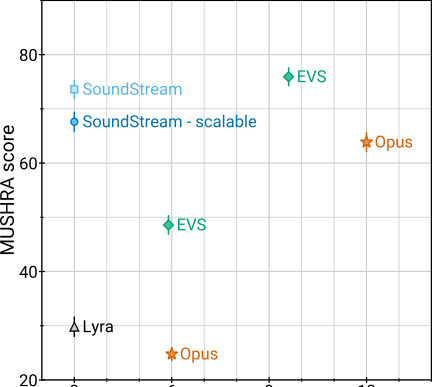

Fig. 1: _SoundStream_ @3 kbps vs. state-of-the-art codecs.

machine learning models have been successfully applied in the
field of audio compression, demonstrating the additional value
brought by data-driven solutions. For example, it is possible
to apply them as a post-processing step to improve the quality
of existing codecs. This can be accomplished either via audio
superresolution, i.e., extending the frequency bandwidth [1],
via audio denoising, i.e., removing lossy coding artifacts [2],
or via packet loss concealment [3].
Other solutions adopt ML-based models as an integral part of
the audio codec architecture. In these areas, recent advances in
text-to-speech (TTS) technology proved to be a key ingredient.
For example, WaveNet [4], a strong generative model originally
applied to generate speech from text, was adopted as a decoder
in a neural codec [5], [6]. Other neural audio codecs adopt
different model architectures, e.g., WaveRNN in LPCNet [7]
and WaveGRU in Lyra [8], all targeting speech at low bitrates.
In this paper we propose _SoundStream_, a novel audio codec
that can compress speech, music and general audio more
efficiently than previous codecs, as illustrated in Figure 1.
_SoundStream_ leverages state-of-the-art solutions in the field
of neural audio synthesis, and introduces a new learnable
quantization module, to deliver audio at high perceptual quality,
while operating at low-to-medium bitrates. Figure 2 illustrates
the high level model architecture of the codec. A fully convolutional encoder receives as input a time-domain waveform
and produces a sequence of embeddings at a lower sampling
rate, which are quantized by a residual vector quantizer. A
fully convolutional decoder receives the quantized embeddings
and reconstructs an approximation of the original waveform.
The model is trained end-to-end using both reconstruction and

2

Fig. 2: _SoundStream_ model architecture. A convolutional encoder produces a latent representation of the input audio samples,
which is quantized using a variable number _nq_ of residual vector quantizers (RVQ). During training, the model parameters
are optimized using a combination of reconstruction and adversarial losses. An optional conditioning input can be used to
indicate whether background noise has to be removed from the audio. When deploying the model, the encoder and quantizer
on a transmitter client send the compressed bitstream to a receiver client that can then decode the audio signal.

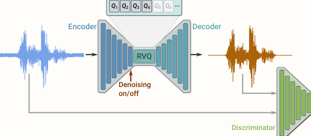

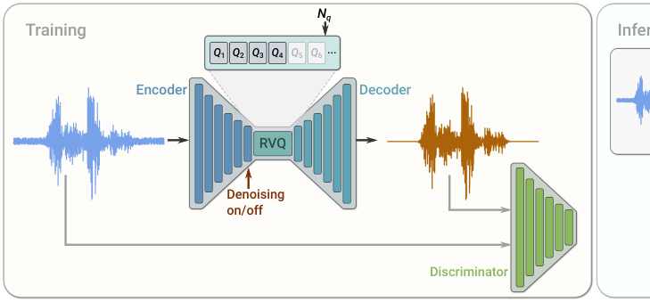

adversarial losses. To this end, one (or more) discriminators are
trained jointly, with the goal of distinguishing the decoded audio
from the original audio and, as a by-product, provide a space
where a feature-based reconstruction loss can be computed.
Both the encoder and the decoder only use causal convolutions,
so the overall architectural latency of the model is determined
solely by the temporal resampling ratio between the original
time-domain waveform and the embeddings.
In summary, this paper makes the following key contributions:

_•_ We propose _SoundStream_, a neural audio codec in which
all the constituent components (encoder, decoder and quantizer) are trained end-to-end with a mix of reconstruction
and adversarial losses to achieve superior audio quality.

_•_ We introduce a new residual vector quantizer, and investigate the rate-distortion-complexity trade-offs implied by its
design. In addition, we propose a novel “quantizer dropout”
technique for training the residual vector quantizer, which
enables a single model to handle different bitrates.

_•_ We demonstrate that learning the encoder brings a very
significant coding efficiency improvement, with respect
to a solution that adopts mel-spectrogram features.

_•_ We demonstrate by means of subjective quality metrics
that _SoundStream_ outperforms both Opus and EVS over
a wide range of bitrates.

_•_ We design our model to support streamable inference,
which can operate at low-latency. When deployed on a
smartphone, it runs in real-time on a single CPU thread.

_•_ We propose a variant of the _SoundStream_ codec that
performs jointly audio compression and enhancement,
without introducing additional latency.

II. RELATED WORK

**Traditional audio codecs**  - Opus [9] and EVS [10] are
state-of-the-art audio codecs, which combine traditional coding
tools, such as LPC, CELP and MDCT, to deliver high

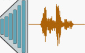

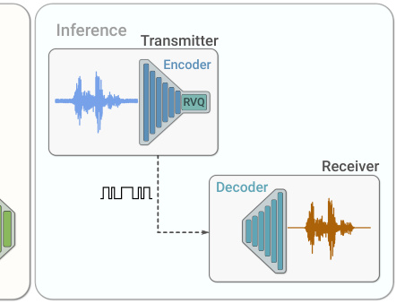

coding efficiency over different content types, bitrates and
sampling rates, while ensuring low-latency for real-time audio
communications. We compare SoundStream with both Opus
and EVS in our subjective evaluation.
**Audio generative models**  - Several generative models
have been developed for converting text or coded features
into audio waveforms. WaveNet [4] allows for global and
local signal conditioning to synthesize both speech and music.
SampleRNN [11] uses recurrent networks in a similar fashion,
but it relies on previous samples at different scales. These
auto-regressive models deliver very high-quality audio, at the
cost of increased computational complexity, since samples
are generated one by one. To overcome this issue, Parallel WaveNet [12] allows for parallel computation, yielding considerable speedup during inference. Other approaches involve
lightweight and sparse models [13] and networks mimicking
the fast Fourier transform as part of the model [7], [14].
More recently, generative adversarial models have emerged
as a solution able to deliver high-quality audio with a lower
computational complexity. MelGAN [15] is trained to produce
audio waveforms when conditioned on mel-spectrograms,
training a multi-scale waveform discriminator together with the
generator. HiFiGAN [16] takes a similar approach but it applies
discriminators to both multiple scales and multiple periods of
the audio samples. The design of the decoder and the losses in
_SoundStream_ is based on this class of audio generative models.
**Audio enhancement**  - Deep neural networks have been
applied to different audio enhancement tasks, ranging from
denoising [17]–[21] to dereverberation [22], [23], lossy coding
denoising [2] and frequency bandwidth extension [1], [24]. In
this paper we show that it is possible to jointly perform audio
enhancement and compression with a single model, without
introducing additional latency.
**Vector quantization**  - Learning the optimal quantizer is a
key element to achieve high coding efficiency. Optimal scalar
quantization based on Lloyd’s algorithm [25] can be extended
to a high-dimensional space via the generalized Lloyd algorithm

(GLA) [26], which is very similar to k-means clustering [27].
In vector quantization [28], a point in a high-dimensional
space is mapped onto a discrete set of code vectors. Vector
quantization has been commonly used as a building block
of traditional audio codecs [29]. For example, CELP [30]
adopts an excitation signal encoded via a vector quantizer
codebook. More recently, vector quantization has been applied
in the context of neural network models to compress the latent
representation of input features. For example, in variational
autoencoders, vector quantization has been used to generate
images [31], [32] and music [33], [34]. Vector quantization can
become prohibitively expensive, as the size of the codebook
grows exponentially when rate is increased. For this reason,
structured vector quantizers [35], [36] (e.g., residual, product,
lattice vector quantizers, etc.) have been proposed to obtain
a trade-off between computational complexity and coding
efficiency in traditional codecs. In _SoundStream_, we extend the
learnable vector quantizer of VQ-VAE [31] and introduce a
residual (a.k.a. multi-stage) vector quantizer, which is learned
end-to-end with the rest of the model. To the best of the
authors knowledge, this is the first time that this form of vector
quantization is used in the context of neural networks and
trained end-to-end with the rest of the model.
**Neural audio codecs**  - End-to-end neural audio codecs rely
on data-driven methods to learn efficient audio representations,
instead of relying on handcrafted signal processing components.
Autoencoder networks with quantization of hidden features
were applied to speech coding early on [37]. More recently,
a more sophisticated deep convolutional network for speech
compression was described in [38]. Efficient compression of
audio using neural networks has been demonstrated in several
works, mostly targeting speech coding at low bitrates. A VQVAE speech codec was proposed in [6], operating at 1 _._ 6 kbps.
Lyra [8] is a generative model that encodes quantized melspectrogram features of speech, which are decoded with an
auto-regressive WaveGRU model to achieve state-of-the-art
results at 3 kbps. A very low-bitrate codec was proposed in [39]
by decoding speech representations obtained via self-supervised
learning. An end-to-end audio codec targeting general audio
at high bitrates (i.e., above 64 kbps) was proposed in [40].
The model architecture adopts a residual coding pipeline,
which consists of multiple autoencoding modules and a psychoacoustic model is used to drive the loss function during training.
Unlike [39] which specifically targets speech by combining
speaker, phonetic and pitch embeddings, _SoundStream_ does
not make assumptions on the nature of the signal it encodes,
and thus works for diverse audio content types. While [8]
learns a decoder on fixed features, _SoundStream_ is trained
in an end-to-end fashion. Our experiments (see Section IV)
show that learning the encoder increases the audio quality
substantially. _SoundStream_ achieves bitrate scalability, i.e., the
ability of a single model to operate at different bitrates at no
additional cost, thanks to its residual vector quantizer and to
our original quantizer dropout training scheme (see Section
III-C). This is unlike [38] and [40] which enforce a specific
bitrate during training and require training a different model
for each target bitrate. A single _SoundStream_ model is able
to compress speech, music and general audio, while operating

3

at a 24 kHz sampling rate and low-to-medium bitrates (3 kbps
to 18 kbps in our experiments), in real time on a smartphone
CPU. This is the first time that a neural audio codec is shown
to outperform state-of-the-art codecs like Opus and EVS over
this broad range of bitrates.
**Joint compression and enhancement**  - Recent work has
explored joint compression and enhancement. The work in [41]
trains a speech enhancement system with a quantized bottleneck.
Instead, _SoundStream_ integrates a time-dependent conditioning
layer, which allows for real-time controllable denoising. As
we design _SoundStream_ as a general-purpose audio codec,
controlling when to denoise allows for encoding acoustic scenes
and natural sounds that would be otherwise removed.

III. MODEL

We consider a single channel recording _x ∈_ R _[T]_, sampled at
_fs_ . The _SoundStream_ model consists of a sequence of three
building blocks, as illustrated in Figure 2:

_•_ an encoder, which maps _x_ to a sequence of embeddings
(see Section III-A),

_•_ a residual vector quantizer, which replaces each embedding by the sum of vectors from a set of finite codebooks,
thus compressing the representation with a target number
of bits (see Section III-C),

_•_ a decoder, which produces a lossy reconstruction ˆ _x ∈_ R _[T]_

from quantized embeddings (see Section III-B).

The model is trained end-to-end together with a discriminator (see Section III-D), using the mix of adversarial and
reconstruction losses described in Section III-E. Optionally, a
conditioning signal can be added, which determines whether
denoising is applied at the encoder or decoder side, as detailed
in Section III-F.

_A. Encoder architecture_

The encoder architecture is illustrated in Figure 3 and
follows the same structure as the _streaming SEANet_ encoder
described in [1], but without skip connections. It consists of a
1D convolution layer (with _C_ enc channels), followed by _B_ enc
convolution blocks. Each of the blocks consists of three residual
units, containing dilated convolutions with dilation rates of 1,
3, and 9, respectively, followed by a down-sampling layer in
the form of a strided convolution. The number of channels is
doubled whenever down-sampling, starting from _C_ enc. A final
1D convolution layer with a kernel of length 3 and a stride of
1 is used to set the dimensionality of the embeddings to _D_ . To
guarantee real-time inference, all convolutions are _causal_ . This
means that padding is only applied to the past but not the future
in both training and offline inference, whereas no padding is
used in streaming inference. We use the ELU activation [42]
and we do not apply any normalization. The number _B_ enc of
convolution blocks and the corresponding striding sequence
determines the temporal resampling ratio between the input
waveform and the embeddings. For example, when _B_ enc = 4
and using (2 _,_ 4 _,_ 5 _,_ 8) as strides, one embedding is computed
every _M_ = 2 _·_ 4 _·_ 5 _·_ 8 = 320 input samples. Thus, the encoder
outputs enc( _x_ ) _∈_ R _[S][×][D]_, with _S_ = _T/M_ .

4

Encoder Decoder

Fig. 3: Encoder and decoder model architecture.

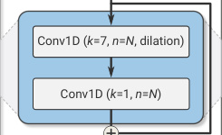

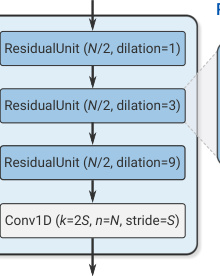

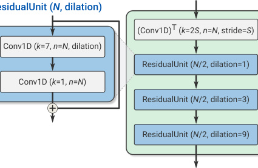

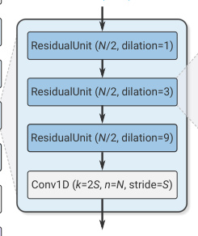

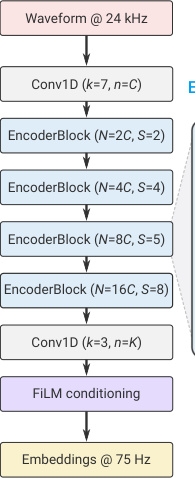

**Algorithm 1:** Residual Vector Quantization

**Input:** _y_ = enc( _x_ ) the output of the encoder, vector
quantizers _Qi_ for _i_ = 1 _..Nq_
**Output:** the quantized ˆ _y_
_y_ ˆ _←_ 0 _._ 0
residual _←_ _y_
**for** _i_ = 1 _to Nq_ **do**

_y_ ˆ += _Qi_ (residual)
residual _−_ = _Qi_ (residual)

**return** ˆ _y_

_B. Decoder architecture_

The decoder architecture follows a similar design, as
illustrated in Figure 3. A 1D convolution layer is followed by a
sequence of _B_ dec convolution blocks. The decoder block mirrors
the encoder block, and consists of a transposed convolution
for up-sampling followed by the same three residual units. We
use the same strides as the encoder, but in reverse order, to
reconstruct a waveform with the same resolution as the input
waveform. The number of channels is halved whenever upsampling, so that the last decoder block outputs _C_ dec channels.
A final 1D convolution layer with one filter, a kernel of size
7 and stride 1 projects the embeddings back to the waveform
domain to produce ˆ _x_ . In Figure 3, the same number of channels
in both the encoder and the decoder is controlled by the same
parameter, i.e., _C_ enc = _C_ dec = _C_ . We also investigate cases in
which _C_ enc _̸_ = _C_ dec, which results in a computationally lighter
encoder and a heavier decoder, or vice-versa (see Section V-D).

_C. Residual Vector Quantizer:_

The goal of the quantizer is to compress the output
of the encoder enc( _x_ ) to a target bitrate _R_, expressed in

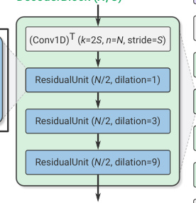

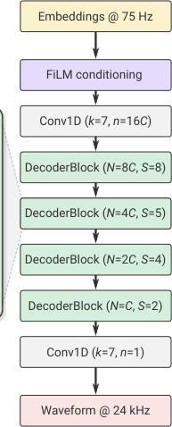

bits/second (bps). In order to train _SoundStream_ in an endto-end fashion, the quantizer needs to be jointly trained with
the encoder and the decoder by backpropagation. The vector
quantizer (VQ) proposed in [31], [32] in the context of VQVAEs meets this requirement. This vector quantizer learns a
codebook of _N_ vectors to encode each _D_ -dimensional frame
of enc( _x_ ). The encoded audio enc( _x_ ) _∈_ R _[S][×][D]_ is then mapped
to a sequence of one-hot vectors of shape _S × N_, which can
be represented using _S_ log2 _N_ bits.
**Limitations of Vector Quantization** - As a concrete example,
let us consider a codec targeting a bitrate _R_ = 6000 bps.
When using a striding factor _M_ = 320, each second of
audio at sampling rate _fs_ = 24000 Hz is represented by
_S_ = 75 frames at the output of the encoder. This corresponds
to _r_ = 6000 _/_ 75 = 80 bits allocated to each frame. Using a
plain vector quantizer, this requires storing a codebook with
_N_ = 2 [80] vectors, which is obviously unfeasible.
**Residual Vector Quantizer** - To address this issue we
adopt a Residual Vector Quantizer (a.k.a. multi-stage vector
quantizer [36]), which cascades _Nq_ layers of VQ as follows.
The unquantized input vector is passed through a first VQ and
quantization residuals are computed. The residuals are then
iteratively quantized by a sequence of additional _Nq −_ 1 vector
quantizers, as described in Algorithm 1. The total rate budget
is uniformly allocated to each VQ, i.e., _ri_ = _r/Nq_ = log2 _N_ .
For example, when using _Nq_ = 8, each quantizer uses a
codebook of size _N_ = 2 _[r/N][q]_ = 2 [80] _[/]_ [8] = 1024. For a target
rate budget _r_, the parameter _Nq_ controls the tradeoff between
computational complexity and coding efficiency, which we
investigate in Section V-D.
The codebook of each quantizer is trained with exponential
moving average updates, following the method proposed in
VQ-VAE-2 [32]. To improve the usage of the codebooks we
use two additional methods. First, instead of using a random

initialization for the codebook vectors, we run the k-means
algorithm on the first training batch and use the learned
centroids as initialization. This allows the codebook to be
close to the distribution of its inputs and improves its usage.
Second, as proposed in [34], when a codebook vector has not
been assigned any input frame for several batches, we replace
it with an input frame randomly sampled within the current
batch. More precisely, we track the exponential moving average
of the assignments to each vector (with a decay factor of 0 _._ 99)
and replace the vectors of which this statistic falls below 2.
**Enabling bitrate scalability with quantizer dropout** - Residual vector quantization provides a convenient framework for
controlling the bitrate. For a fixed size _N_ of each codebook,
the number of VQ layers _Nq_ determines the bitrate. Since the
vector quantizers are trained jointly with the encoder/decoder,
in principle a different _SoundStream_ model should be trained
for each target bitrate. Instead, having a single _bitrate scalable_
model that can operate at several target bitrates is much more
practical, since this reduces the memory footprint needed to
store model parameters both at the encoder and decoder side.
To train such a model, we modify Algorithm 1 in the
following way: for each input example, we sample _nq_ uniformly
at random in [1; _Nq_ ] and only use quantizers _Qi_ for _i_ = 1 _. . . nq_ .
This can be seen as a form of structured dropout [43] applied
to quantization layers. Consequently, the model is trained to
encode and decode audio for all target bitrates corresponding
to the range _nq_ = 1 _. . . Nq_ . During inference, the value of
_nq_ is selected based on the desired bitrate. Previous models
for neural compression have relied on product quantization
(wav2vec 2.0 [44]), or on concatenating the output of several
VQ layers [5], [6]. With such approaches, changing the bitrate
requires either changing the architecture of the encoder and/or
the decoder, as the dimensionality changes, or retraining an
appropriate codebook. A key advantage of our residual vector
quantizer is that the dimensionality of the embeddings does
not change with the bitrate. Indeed, the additive composition
of the outputs of each VQ layer progressively refines the
quantized embeddings, while keeping the same shape. Hence,
no architectural changes are needed in neither the encoder nor
the decoder to accommodate different bitrates. In Section V-C,
we show that this method allows one to train a single
_SoundStream_ model, which matches the performance of models
trained specifically for a given bitrate.

_D. Discriminator architecture_

To compute the adversarial losses described in Section III-E,
we define two different discriminators: i) a wave-based discriminator, which receives as input a single waveform; ii) an
STFT-based discriminator, which receives as input the complexvalued STFT of the input waveform, expressed in terms of
real and imaginary parts. Since both discriminators are fully
convolutional, the number of logits in the output is proportional
to the length of the input audio.
For the wave-based discriminator, we use the same multiresolution convolutional discriminator proposed in [15] and
adopted in [45]. Three structurally identical models are applied
to the input audio at different resolutions: original, 2-times

5

|Col1|Col2|
|---|---|
|Conv2D (_k_=3×3,_n_=_N_)|Conv2D (_k_=3×3,_n_=_N_)|
|||
|Conv2D (_k_=(_st _+2)×(_sf _+2),_ n_=_mN_)|Conv2D (_k_=(_st _+2)×(_sf _+2),_ n_=_mN_)|
|||
|||

Fig. 4: STFT-based discriminator architecture.

down-sampled, and 4-times down-sampled. Each single-scale
discriminator consists of an initial plain convolution followed
by four grouped convolutions, each of which has a group size
of 4, a down-sampling factor of 4, and a channel multiplier
of 4 up to a maximum of 1024 output channels. They are
followed by two more plain convolution layers to produce the
final output, i.e., the logits.
The STFT-based discriminator is illustrated in Figure 4
and operates on a single scale, computing the STFT with a
window length of _W_ = 1024 samples and a hop length of
_H_ = 256 samples. A 2D-convolution (with kernel size 7 _×_ 7
and 32 channels) is followed by a sequence of residual blocks.
Each block starts with a 3 _×_ 3 convolution, followed by a 3 _×_ 4 or
a 4 _×_ 4 convolution, with strides equal to (1 _,_ 2) or (2 _,_ 2), where
( _st, sf_ ) indicates the down-sampling factor along the time axis
and the frequency axis. We alternate between (1 _,_ 2) and (2 _,_ 2)
strides, for a total of 6 residual blocks. The number of channels
is progressively increased with the depth of the network. At
the output of the last residual block, the activations have shape
_T/_ ( _H ·_ 2 [3] ) _× F/_ 2 [6], where _T_ is the number of samples in the
time domain and _F_ = _W/_ 2 is the number of frequency bins.
The last layer aggregates the logits across the (down-sampled)
frequency bins with a fully connected layer (implemented as a
1 _× F/_ 2 [6] convolution), to obtain a 1-dimensional signal in the
(down-sampled) time domain.

_E. Training objective_

Let _G_ ( _x_ ) = dec( _Q_ (enc( _x_ )) denote the _SoundStream_ generator, which processes the input waveform _x_ through the
encoder, the quantizer and the decoder, and ˆ _x_ = _G_ ( _x_ ) be the
decoded waveform. We train _SoundStream_ with a mix of losses

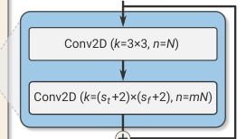

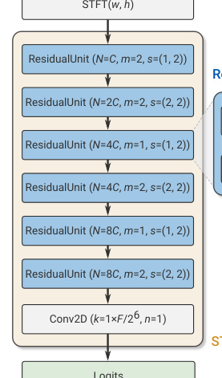

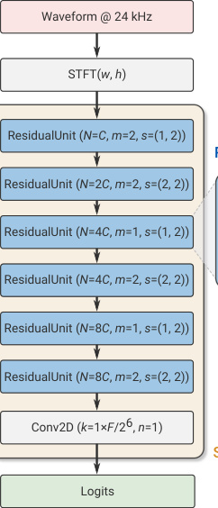
to achieve both signal reconstruction fidelity and perceptual
quality, following the principles of the perception-distortion
trade-off discussed in [46].
The adversarial loss is used to promote perceptual quality
and it is defined as a hinge loss over the logits of the
discriminator, averaged over multiple discriminators and over
time. More formally, let _k ∈{_ 0 _, . . ., K}_ index over the
individual discriminators, where _k_ = 0 denotes the STFT-based
discriminator and _k ∈{_ 1 _, . . ., K}_ the different resolutions
of the waveform-based discriminator ( _K_ = 3 in our case).
Let _Tk_ denote the number of logits at the output of the _k_ -th
discriminator along the time dimension. The discriminator is
trained to classify original vs. decoded audio, by minimizing

_k_

_k_

- max �0 _,_ 1 _−Dk,t_ ( _x_ )� [�]

_t_

- max �0 _,_ 1 + _Dk,t_ ( _G_ ( _x_ ))� [�]

_t_

   -   - [�]
max 0 _,_ 1 + _Dk,t_ ( _G_ ( _x_ ))

_t_

1
_Tk_

1
_Tk_

_LD_ = _Ex_

_Ex_

1

_K_

1

_K_

+

_,_ (1)

6

_F. Joint compression and enhancement_

In traditional audio processing pipelines, compression and
enhancement are typically performed by different modules.
For example, it is possible to apply an audio enhancement
algorithm at the transmitter side, before audio is compressed,
or at the receiver side, after audio is decoded. In this setup,
each processing step contributes to the end-to-end latency, e.g.,
due to buffering the input audio to the expected frame length
determined by the specific algorithm adopted. Conversely,
we design _SoundStream_ in such a way that compression and
enhancement can be carried out jointly by the same model,
without increasing the overall latency.
The nature of the enhancement can be determined by the
choice of the training data. As a concrete example, in this
paper we show that it is possible to combine compression
with background noise suppression. More specifically, we
train a model in such a way that one can flexibly enable or
disable denoising at inference time, by feeding a conditioning
signal that represents the two modes (denoising enabled
or disabled). To this end, we prepare the training data to
consist of tuples of the form: (inputs _,_ targets _,_ denoise).
When denoise = false, targets = inputs; when
denoise = true, targets contain the clean speech
component of the corresponding inputs. Hence, the network
is trained to reconstruct noisy speech if the conditioning signal
is disabled, and to produce a clean version of the noisy input if
it is enabled. Note that when inputs consist of clean audio
(speech or music), targets = inputs and denoise can
be either true or false. This is done to prevent _SoundStream_
from adversely affecting clean audio when denoising is enabled.
To process the conditioning signal, we use Feature-wise
Linear Modulation (FiLM) layers [49] in between residual
units, which take network features as inputs and transform
them as

       - _an,c_ = _γn,can,c_ + _βn,c,_ (7)

where _an,c_ is the _n_ [th] activation in the _c_ [th] channel. The
coefficients _γn,c_ and _βn,c_ are computed by a linear layer that
takes as input a (potentially time-varying) two-dimensional
one-hot encoding that determines the denoising mode. This
allows one to adjust the level of denoising over time.
In principle, FiLM layers can be used anywhere throughout
the encoder and decoder architecture. However, in our preliminary experiments, we found that applying conditioning
at the bottleneck either at the encoder or at the decoder
side (as illustrated in Figure 3) was effective and no further
improvements were observed by applying FiLM layers at
different depths. In Section V-E, we quantify the impact of
enabling denoising at either the encoder or decoder side both
in terms of audio quality and bitrate.

IV. EVALUATION SETUP

_A. Datasets_

We train SoundStream on three types of audio content:
clean speech, noisy speech and music, all at 24 kHz sampling
rate. For clean speech, we use the LibriTTS dataset [50].
For noisy speech, we synthesize samples by mixing speech

while the adversarial loss for the generator is

_k,t_


1 - _Tk_ max 0 _,_ 1 _−Dk,t_ ( _G_ ( _x_ ))  _._ (2)

_L_ [adv] _G_ = _Ex_



 [1]

_K_

To promote fidelity of the decoded signal ˆ _x_ with respect to
the original _x_ we adopt two additional losses: i) a “feature”
loss _L_ [feat] _G_ [, computed in the feature space defined by the]
discriminator(s) [15]; ii) a multi-scale spectral reconstruction
loss _L_ [rec] _G_ [[47].]
More specifically, the feature loss is computed by taking
the average absolute difference between the discriminator’s
internal layer outputs for the generated audio and those for the
corresponding target audio.

_k,l_

_t_

1
_Tk,l_



��� _Dk,t_ ( _l_ ) [(] _[x]_ [)] _[ −D]_ _k,t_ [(] _[l]_ [)] [(] _[G]_ [(] _[x]_ [))] ��� _,_

_L_ [feat] _G_ = _Ex_



 [1]

_KL_

(3)
where _L_ is the number of internal layers, _Dk,t_ [(] _[l]_ [)] [(] _[l][ ∈{]_ [1] _[, . . ., L][}]_ [)]
is the _t_ -th output of layer _l_ of discriminator _k_, and _Tk,l_ denotes
the length of the layer in the time dimension.
The multi-scale spectral reconstruction loss follows the
specifications described in [48]:

_L_ [rec] _G_ [=] 
_s∈_ 2 [6] _,...,_ 2 [11]

- _∥St_ _[s]_ [(] _[x]_ [)] _[ −S]_ _t_ _[s]_ [(] _[G]_ [(] _[x]_ [))] _[∥]_ [1][+] (4)

_t_

_αs_ - _∥_ log _St_ _[s]_ [(] _[x]_ [)] _[ −]_ [log] _[ S]_ _t_ _[s]_ [(] _[G]_ [(] _[x]_ [))] _[∥]_ [2] _[,]_ (5)

_t_

where _St_ _[s]_ [(] _[x]_ [)][ denotes the] _[ t]_ [-th frame of a 64-bin mel-]
spectrogram computed with window length equal to _s_ and
hop length equal to _s/_ 4. We set _αs_ = - _s/_ 2 as in [48].

The overall generator loss is a weighted sum of the different
loss components:

_LG_ = _λ_ adv _L_ [adv] _G_ [+] _[ λ]_ [feat] _[· L]_ [feat] _G_ [+] _[ λ]_ [rec] _[· L]_ [rec] _G_ _[.]_ (6)

In all our experiments we set _λ_ adv = 1, _λ_ feat = 100 and
_λ_ rec = 1.

from LibriTTS with noise from Freesound [51]. We apply
peak normalization to randomly selected crops of 3 seconds
and adjust the mixing gain of the noise component sampling
uniformly in the interval [ _−_ 30 dB _,_ 0 dB]. For music, we use
the MagnaTagATune dataset [52]. We evaluate our models
on disjoint test splits of the datasets above. In addition, we
collected a real-world dataset, which contains both near-field
and far-field (reverberant) speech, with background noise in
some of the examples. Unless stated otherwise, objective and
subjective metrics are computed on a set of 200 audio clips
2-4 seconds long, with 50 samples from each of the four
datasets listed above (i.e., clean speech, noisy speech, music,
noisy/reverberant speech).

_B. Evaluation metrics_

To evaluate _SoundStream_, we perform subjective evaluations
by human raters. We have chosen a crowd-sourced methodology
inspired by MUSHRA [53], with a hidden reference but
no lowpass-filtered anchor. Each of the 200 samples of the
evaluation dataset, which include clean, noisy and reverberant
speech, as well as music, was rated 20 times. The raters were
required to be native English speakers and be using headphones.
Additionally, to avoid noisy data, a post-screening was put in
place to exclude ratings by listeners who rated the reference
below 90 more than 20% of the time or rated non-reference
samples above 90 more than 50% of the time.
For development and hyperparameter selection, we rely on
computational, objective metrics. Numerous metrics have been
developed in the past for assessing the perceived similarity
between a reference and a processed audio signal. The ITU-T
standards PESQ [54] and its replacement POLQA [55] are
commonly used metrics. However, both are inconvenient to use
owing to licensing restrictions. We choose the freely available
and recently open-sourced ViSQOL [56], [57] metric, which has
previously shown comparable performance to POLQA. In early
experiments, we found this metric to be strongly correlated
with subjective evaluations. We thus use it for model selection
and ablation studies.

_C. Baselines_

Opus [9] is a versatile speech and audio codec supporting
signal bandwidths from 4 kHz to 24 kHz and bitrates from
6 kbps to 510 kbps. Since its standardization by the IETF in
2012 it has been widely deployed for speech communication
over the internet. As the audio codec in applications such as
Zoom and applications based on WebRTC [58], [59], such
as Microsoft Teams and Google Meet, Opus has hundreds
of millions of daily users. Opus is also one of the main
audio codecs used in YouTube for streaming. Enhanced Voice
Services (EVS) [10] is the latest codec standardized by the
3GPP and was primarily designed for Voice over LTE (VoLTE).
Like Opus, it is a versatile codec operating at multiple signal
bandwidths, 4 kHz to 20 kHz, and bitrates, 5.9 kbps to 128 kbps.
It is replacing AMR-WB [60] and retains full backward
operability. In this paper we utilize these two systems as
baselines for comparison with the SoundStream codec. For the
lowest bitrates, we also compare the performance of the recently

7

presented Lyra codec [8] which is an autoregressive generative
codec operating at 3 kbps. We provide audio processed by
_SoundStream_ and baselines at different bitrates on a public
webpage [1] .

V. RESULTS

_A. Comparison with other codecs_

Figure 5 reports the main result of the paper, where we
compare _SoundStream_ to Opus and EVS at different bitrates.
Namely, we repeated a subjective evaluation based on a
MUSHRA-inspired crowdsourced scheme, when _SoundStream_
operates at three different bitrates: i) low (3 kbps); ii) medium
(6 kbps); iii) high (12 kbps). Figure 5a shows that _SoundStream_
at 3 kbps significantly outperforms both Opus at 6 kbps and
EVS at 5 _._ 9 kbps (i.e., the lowest bitrates at which these codecs
can operate), despite using half of the bitrate. To match the
quality of _SoundStream_, EVS needs to use at least 9 _._ 6 kbps
and Opus at least 12 kbps, i.e., 3.2 _×_ to 4 _×_ more bits than
_SoundStream_ . We also observe that _SoundStream_ outperforms
Lyra when they both operate at 3 kbps. We observe similar
results when _SoundStream_ operates at 6 kbps and 12 kbps. At
medium bitrates, EVS and Opus require, respectively, 2.2 _×_ to
2.6 _×_ more bits to match the same quality. At high bitrates,
1.3 _×_ to 1.6 _×_ more bits.
Figure 6 illustrates the results of the subjective evaluation
by content type. We observe that the quality of _SoundStream_
remains consistent when encoding clean speech and noisy
speech. In addition, _SoundStream_ can encode music when
using as little as 3 kbps, with quality significantly better than
Opus at 12 kbps and EVS at 5.9 kbps. This is the first time
that a codec is shown to operate on diverse content types at
such a low bitrate.

_B. Objective quality metrics_

Figure 7a shows the rate-quality curve of _SoundStream_ over
a wide range of bitrates, from 3 kbps to 18 kbps. We observe
that quality, as measured by means of ViSQOL, gracefully
decreases as the bitrate is reduced and it remains above 3.7
even at the lowest bitrate. In our work, _SoundStream_ operates
at constant bitrate, i.e., the same number of bits is allocated
to each encoded frame. At the same time, we measure the
bitrate lower bound by computing the empirical entropy of the
quantization symbols of the vector quantizers, assuming each
vector quantizer to be a discrete memoryless source, i.e., no
statistical redundancy is exploited across different layers of the
residual vector quantizer, nor across time. Figure 7a indicates
a potential rate saving between 7% and 20%.
We also investigate the rate-quality tradeoff achieved when
encoding different content types, as illustrated in Figure 7b.
Unsurprisingly, the highest quality is achieved when encoding
clean speech. Music represents a more challenging case, due
to its inherent diversity of content.

[1 https://google-research.github.io/seanet/soundstream/examples/](https://google-research.github.io/seanet/soundstream/examples/)

8

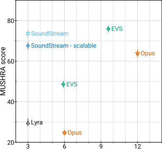

|Col1|Col2|
|---|---|
|EVS dStream||
|dStream ~~-~~ scalable|Opus|
|||
|~~EVS~~||
|||
|Opus||
|~~6~~ ~~9~~ ~~12~~ Bitrate (kbps)|~~6~~ ~~9~~ ~~12~~ Bitrate (kbps)|

(a) Low bitrate.

(a) Low bitrate.

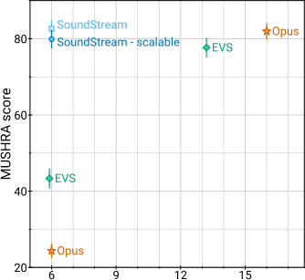

|tream tream - scalable EVS|Op|us|
|---|---|---|
||||
||||
||||
||||
||||
||||
|~~9~~ ~~12~~ ~~15~~ Bitrate (kbps)|~~9~~ ~~12~~ ~~15~~ Bitrate (kbps)|~~9~~ ~~12~~ ~~15~~ Bitrate (kbps)|

(b) Medium bitrate.

|ps ps|Col2|
|---|---|
|e ps ps ps e)||
|e ps ps ps e)||

(b) Medium bitrate.

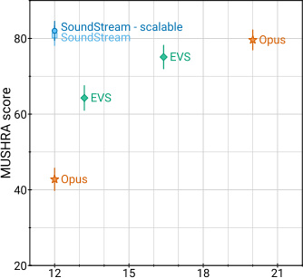

|SoundStream SoundStream|- scalab|le|Opu|s|
|---|---|---|---|---|
||E|VS|||
|EVS|||||
||||||
|Opus|||||
||||||
||||||
|~~15~~ ~~18~~ ~~21~~ Bitrate (kbps)|~~15~~ ~~18~~ ~~21~~ Bitrate (kbps)|~~15~~ ~~18~~ ~~21~~ Bitrate (kbps)|~~15~~ ~~18~~ ~~21~~ Bitrate (kbps)|~~15~~ ~~18~~ ~~21~~ Bitrate (kbps)|

(c) High bitrate.

|Col1|Music Noisy|Col3|
|---|---|---|
||Music  spee|Music  spee|
||||
||||

(c) High bitrate.

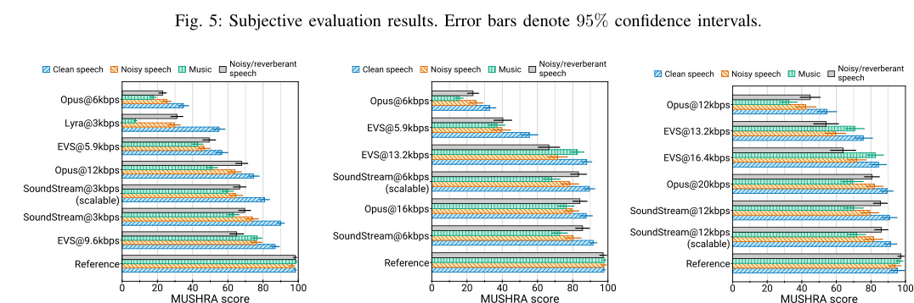

Fig. 6: Subjective evaluation results by content type. Error bars denote 95% confidence intervals.

_C. Bitrate scalability_

We investigate the bitrate scalability provided by training
a single model that can serve different bitrates. To evaluate
this aspect, for each bitrate _R_ we consider three _SoundStream_
configurations: a) a non-scalable model trained and evaluated
at bitrate _R_ ( _bitrate specific_ ); b) a non-scalable model trained
at 18 kbps and evaluated at bitrate _R_ by using only the
first _nq_ quantizers during inference ( _18 kbps - no dropout_ );
c) a scalable model trained with quantizer dropout and
evaluated at bitrate _R_ ( _bitrate scalable_ ). Figure 7c shows the
ViSQOL scores for these three scenarios. Remarkably, a model
trained specifically at 18 kbps retains good performance when
evaluated at lower bitrates, even though the model was not
trained in these conditions. Unsurprisingly, the quality drop
increases as the bitrate decreases, i.e., when there is a more
significant difference between training and inference. This gap
vanishes when using the quantizer dropout strategy described
in Section III-C. Surprisingly, the bitrate scalable model seems
to marginally outperform bitrate specific models at 9 kbps and
12 kbps. This suggests that quantizer dropout, beyond providing
bitrate scalability, may act as a regularizer.

We confirm these results by including the bitrate scalable
variant of _SoundStream_ in the MUSHRA subjective evaluation

(see Figure 5). When operating at 3 kbps, the bitrate scalable
variant of _SoundStream_ is only slightly worse than the bitrate
specific variant. Conversely, both at 6 kbps and 12 kbps it
matches the same quality as the bitrate specific variant.

_D. Ablation studies_

We carried out several additional experiments to evaluate the
impact of some of the design choices applied to _SoundStream_ .
Unless stated otherwise, all these experiments operate at 6 kbps.
**Advantage of learning the encoder** - We explored the impact
of replacing the learnable encoder of _SoundStream_ with a
fixed mel-filterbank, similarly to Lyra [8]. We learned both the
quantizer and the decoder and observed a significant drop in
objective quality, with ViSQOL going from 3.96 to 3.33. Note
that this is significantly worse than what can be achieved when
learning the encoder and halving the bitrate (i.e., ViSQOL
equal to 3.76 at 3 kbps). This demonstrates that the additional
complexity of having a learnable encoder translates to a very
significant improvement in the rate-quality trade-off.
**Encoder and decoder capacity** - The main drawback of
using a learnable encoder is the computational cost of the
neural architecture, which can be significantly higher than
computing fixed, non-learnable features such as mel-filterbanks.

9

|4.4 a b c|a|b|Col4|Col5|Col6|Col7|c|Col9|Col10|
|---|---|---|---|---|---|---|---|---|---|
|~~3~~ ~~6~~ ~~9~~ ~~12~~ ~~15~~ ~~18~~ 3.6 3.8 4 4.2  ViSQOL ~~SoundStream~~ Empirical entropy bound ~~3~~ ~~6~~ ~~9~~ ~~12~~ ~~15~~ ~~18~~ Bitrate (kbps) ~~Clean speech~~ Noisy speech ~~Music~~ Noisy/reverberant speech ~~3~~ ~~6~~ ~~9~~ ~~12~~ ~~15~~ ~~18~~ Bitrate scalable ~~Not bitrate scalable~~ Bitrate specific||||||||||
|~~3~~ ~~6~~ ~~9~~ ~~12~~ ~~15~~ ~~18~~ 3.6 3.8 4 4.2  ViSQOL ~~SoundStream~~ Empirical entropy bound ~~3~~ ~~6~~ ~~9~~ ~~12~~ ~~15~~ ~~18~~ Bitrate (kbps) ~~Clean speech~~ Noisy speech ~~Music~~ Noisy/reverberant speech ~~3~~ ~~6~~ ~~9~~ ~~12~~ ~~15~~ ~~18~~ Bitrate scalable ~~Not bitrate scalable~~ Bitrate specific||||||||||
|~~3~~ ~~6~~ ~~9~~ ~~12~~ ~~15~~ ~~18~~ 3.6 3.8 4 4.2  ViSQOL ~~SoundStream~~ Empirical entropy bound ~~3~~ ~~6~~ ~~9~~ ~~12~~ ~~15~~ ~~18~~ Bitrate (kbps) ~~Clean speech~~ Noisy speech ~~Music~~ Noisy/reverberant speech ~~3~~ ~~6~~ ~~9~~ ~~12~~ ~~15~~ ~~18~~ Bitrate scalable ~~Not bitrate scalable~~ Bitrate specific||||||||||
|~~3~~ ~~6~~ ~~9~~ ~~12~~ ~~15~~ ~~18~~ 3.6 3.8 4 4.2  ViSQOL ~~SoundStream~~ Empirical entropy bound ~~3~~ ~~6~~ ~~9~~ ~~12~~ ~~15~~ ~~18~~ Bitrate (kbps) ~~Clean speech~~ Noisy speech ~~Music~~ Noisy/reverberant speech ~~3~~ ~~6~~ ~~9~~ ~~12~~ ~~15~~ ~~18~~ Bitrate scalable ~~Not bitrate scalable~~ Bitrate specific||||||||||
|~~3~~ ~~6~~ ~~9~~ ~~12~~ ~~15~~ ~~18~~ 3.6 3.8 4 4.2  ViSQOL ~~SoundStream~~ Empirical entropy bound ~~3~~ ~~6~~ ~~9~~ ~~12~~ ~~15~~ ~~18~~ Bitrate (kbps) ~~Clean speech~~ Noisy speech ~~Music~~ Noisy/reverberant speech ~~3~~ ~~6~~ ~~9~~ ~~12~~ ~~15~~ ~~18~~ Bitrate scalable ~~Not bitrate scalable~~ Bitrate specific|||~~Clean speech~~|~~Clean speech~~|~~Clean speech~~|~~Clean speech~~||||
|~~3~~ ~~6~~ ~~9~~ ~~12~~ ~~15~~ ~~18~~ 3.6 3.8 4 4.2  ViSQOL ~~SoundStream~~ Empirical entropy bound ~~3~~ ~~6~~ ~~9~~ ~~12~~ ~~15~~ ~~18~~ Bitrate (kbps) ~~Clean speech~~ Noisy speech ~~Music~~ Noisy/reverberant speech ~~3~~ ~~6~~ ~~9~~ ~~12~~ ~~15~~ ~~18~~ Bitrate scalable ~~Not bitrate scalable~~ Bitrate specific||| Noisy speech | Noisy speech | Noisy speech | Noisy speech |Bitrate scalable |Bitrate scalable |Bitrate scalable |
|~~3~~ ~~6~~ ~~9~~ ~~12~~ ~~15~~ ~~18~~ 3.6 3.8 4 4.2  ViSQOL ~~SoundStream~~ Empirical entropy bound ~~3~~ ~~6~~ ~~9~~ ~~12~~ ~~15~~ ~~18~~ Bitrate (kbps) ~~Clean speech~~ Noisy speech ~~Music~~ Noisy/reverberant speech ~~3~~ ~~6~~ ~~9~~ ~~12~~ ~~15~~ ~~18~~ Bitrate scalable ~~Not bitrate scalable~~ Bitrate specific|~~SoundStream~~ Empirical entropy bound|~~Music~~ Noisy/reverberant speech|~~Music~~ Noisy/reverberant speech|~~Music~~ Noisy/reverberant speech|~~Music~~ Noisy/reverberant speech|~~Music~~ Noisy/reverberant speech||~~Not bitrate scalable~~ Bitrate specific|~~Not bitrate scalable~~ Bitrate specific|
|~~3~~ ~~6~~ ~~9~~ ~~12~~ ~~15~~ ~~18~~ 3.6 3.8 4 4.2  ViSQOL ~~SoundStream~~ Empirical entropy bound ~~3~~ ~~6~~ ~~9~~ ~~12~~ ~~15~~ ~~18~~ Bitrate (kbps) ~~Clean speech~~ Noisy speech ~~Music~~ Noisy/reverberant speech ~~3~~ ~~6~~ ~~9~~ ~~12~~ ~~15~~ ~~18~~ Bitrate scalable ~~Not bitrate scalable~~ Bitrate specific||||||||||

Fig. 7: ViSQOL vs. bitrate. **a)** SoundStream performance on test data, comparing the actual bitrate with the potential bitrate
savings achievable by entropy coding **b)** ViSQOL scores by content type **c)** Comparison of _SoundStream_ models that are
trained at 18 kbps with quantizer dropout (bitrate scalable), without quantizer dropout (not bitrate scalable) and evaluated with a
variable number of quantizers, or trained and evaluated at a fixed bitrate (bitrate specific). Error bars denote 95% confidence
intervals.

TABLE I: Audio quality (ViSQOL) and model complexity
(number of parameters and real-time factor) for different
capacity trade-offs between encoder and decoder, at 6kbps.

|Cenc|Cdec|#Params|RTF (enc)|RTF (dec)|ViSQOL|
|---|---|---|---|---|---|
|32 16|32 16|8_._4 M 2_._4 M|2.4_×_ 7.5_×_|2.3_×_ 7.1_×_|4.01_ ±_ 0.03 3.98_ ±_ 0.03|

Smaller encoder
16 32 5 _._ 5 M 7.5 _×_ 2.3 _×_ 4.02 _±_ 0.03
8 32 4 _._ 8 M 18.6 _×_ 2.3 _×_ 3.99 _±_ 0.03

Smaller decoder
32 16 5 _._ 3 M 2.4 _×_ 7.1 _×_ 3.97 _±_ 0.03
32 8 4 _._ 4 M 2.4 _×_ 17.1 _×_ 3.90 _±_ 0.03

For _SoundStream_ to be competitive with traditional codecs,
not only should it provide a better perceptual quality at an
equivalent bitrate, but it must also run in real-time on resourcelimited hardware. Table I shows how computational efficiency
and audio quality are impacted by the number of channels in the
encoder _C_ enc and the decoder _C_ dec. We measured the real-time
factor (RTF), defined as the ratio between the temporal length
of the input audio and the time needed for encoding/decoding it
with _SoundStream_ . We profiled these models on a single CPU
thread of a Pixel4 smartphone. We observe that the default
model ( _C_ enc = _C_ dec = 32) runs in real-time (RTF _>_ 2 _._ 3 _×_ ).
Decreasing the model capacity by setting _C_ enc = _C_ dec =
16 only marginally affects the reconstruction quality while
increasing the real-time factor significantly (RTF _>_ 7 _._ 1 _×_ ).
We also investigated configurations with asymmetric model
capacities. Using a smaller encoder, it is possible to achieve a
significant speedup without sacrificing quality (ViSQOL drops
from 3.96 to 3.94, while the encoder RTF increases to 18 _._ 6 _×_ ).
Instead, decreasing the capacity of the decoder has a more
significant impact on quality (ViSQOL drops from 3.96 to
3.84). This is aligned with recent findings in the field of neural
image compression [61], which also adopt a lighter encoder
and a heavier decoder.
**Vector quantizer depth and codebook size** - The number of
bits used to encode a single frame is equal to _Nq_ log2 _N_, where

TABLE II: Trade-off between residual vector quantizer depth
and codebook size at 6 kbps.

Number of quantizers _Nq_ 8 16 80
Codebook size _N_ 1024 32 2
ViSQOL 4.01 _±_ 0.03 3.98 _±_ 0.03 3.92 _±_ 0.03

TABLE III: Audio quality (ViSQOL) and real-time factor for
different levels of architectural latency, defined by the total
striding factor of the encoder/decoder, at 6 kbps.

|Strides|Latency|Nq|RTF (enc)|RTF (dec)|ViSQOL|
|---|---|---|---|---|---|
|(1_,_ 4_,_ 5_,_ 8) (2_,_ 4_,_ 5_,_ 8) (4_,_ 4_,_ 5_,_ 8)|7.5ms 13ms 26ms|4 8 16|1.6_×_ 2.4_×_ 4.1_×_|1.5_×_ 2.3_×_ 4.0_×_|4.01_ ±_ 0.02 4.01_ ±_ 0.03 4.01_ ±_ 0.03|

_Nq_ denotes the number of quantizers and _N_ the codebook
size. Hence, it is possible to achieve the same target bitrate
for different combinations of _Nq_ and _N_ . Table II shows
three configurations, all operating at 6 kbps. As expected,
using fewer vector quantizers, each with a larger codebook,
achieves the highest coding efficiency at the cost of higher
computational complexity. Remarkably, using a sequence of
80 1-bit quantizers leads only to a modest quality degradation.
This demonstrates that it is possible to successfully train very
deep residual vector quantizers without facing optimization
issues. On the other side, as discussed in Section III-C, growing
the codebook size can quickly lead to unmanageable memory
requirements. Thus, the proposed residual vector quantizer
offers a practical and effective solution for learning neural
codecs operating at high bitrates, as it scales gracefully when
using many quantizers, each with a smaller codebook.
**Latency** - The architectural latency _M_ of the model is defined
by the product of the strides, as explained in Section III-A.
In our default configuration, _M_ = 2 _·_ 4 _·_ 5 _·_ 8 = 320 samples,
which means that one frame corresponds to 13.3ms of audio
at 24 kHz. The bit budget allocated to the residual vector
quantizer needs to be adjusted based on the target architectural
latency. For example, when operating at 6 kbps, the residual

10

|a b c|a|Col3|b|Col5|Col6|Col7|Col8|c|Col10|
|---|---|---|---|---|---|---|---|---|---|
|~~3~~ ~~6~~ ~~9~~ ~~12~~ ~~15~~ ~~18~~ 3.2 3.4 3.6 3.8 ViSQOL Encoder conditioning ~~Denoising on~~ Denoising on (EC) ~~Denoising off~~ Denoising off (EC) ~~3~~ ~~6~~ ~~9~~ ~~12~~ ~~15~~ ~~18~~ Bitrate (kbps) Decoder conditioning ~~Denoising on~~ Denoising on (EC) ~~Denoising off~~ Denoising off (EC) ~~3~~ ~~6~~ ~~9~~ ~~12~~ ~~15~~ ~~18~~ Fixed denoiser ~~Fixed denoiser~~ Fixed denoiser (EC)|Encoder conditioning|Encoder conditioning|Decoder conditioning|Decoder conditioning|Decoder conditioning|Decoder conditioning|Decoder conditioning|Fixed denoiser|Fixed denoiser|
|~~3~~ ~~6~~ ~~9~~ ~~12~~ ~~15~~ ~~18~~ 3.2 3.4 3.6 3.8 ViSQOL Encoder conditioning ~~Denoising on~~ Denoising on (EC) ~~Denoising off~~ Denoising off (EC) ~~3~~ ~~6~~ ~~9~~ ~~12~~ ~~15~~ ~~18~~ Bitrate (kbps) Decoder conditioning ~~Denoising on~~ Denoising on (EC) ~~Denoising off~~ Denoising off (EC) ~~3~~ ~~6~~ ~~9~~ ~~12~~ ~~15~~ ~~18~~ Fixed denoiser ~~Fixed denoiser~~ Fixed denoiser (EC)||||||||||
|~~3~~ ~~6~~ ~~9~~ ~~12~~ ~~15~~ ~~18~~ 3.2 3.4 3.6 3.8 ViSQOL Encoder conditioning ~~Denoising on~~ Denoising on (EC) ~~Denoising off~~ Denoising off (EC) ~~3~~ ~~6~~ ~~9~~ ~~12~~ ~~15~~ ~~18~~ Bitrate (kbps) Decoder conditioning ~~Denoising on~~ Denoising on (EC) ~~Denoising off~~ Denoising off (EC) ~~3~~ ~~6~~ ~~9~~ ~~12~~ ~~15~~ ~~18~~ Fixed denoiser ~~Fixed denoiser~~ Fixed denoiser (EC)||||||||||
|~~3~~ ~~6~~ ~~9~~ ~~12~~ ~~15~~ ~~18~~ 3.2 3.4 3.6 3.8 ViSQOL Encoder conditioning ~~Denoising on~~ Denoising on (EC) ~~Denoising off~~ Denoising off (EC) ~~3~~ ~~6~~ ~~9~~ ~~12~~ ~~15~~ ~~18~~ Bitrate (kbps) Decoder conditioning ~~Denoising on~~ Denoising on (EC) ~~Denoising off~~ Denoising off (EC) ~~3~~ ~~6~~ ~~9~~ ~~12~~ ~~15~~ ~~18~~ Fixed denoiser ~~Fixed denoiser~~ Fixed denoiser (EC)|~~Denoising on~~ Denoising on (EC) ~~Denoising off~~|~~Denoising on~~ Denoising on (EC) ~~Denoising off~~|~~Denoising on~~ Denoising on (EC) ~~Denoising off~~|~~Denoising on~~ Denoising on (EC) ~~Denoising off~~|~~Denoising on~~ Denoising on (EC) ~~Denoising off~~|~~Denoising on~~ Denoising on (EC) ~~Denoising off~~|~~Denoising on~~ Denoising on (EC) ~~Denoising off~~|~~Fixed denoiser~~|~~Fixed denoiser~~|
|~~3~~ ~~6~~ ~~9~~ ~~12~~ ~~15~~ ~~18~~ 3.2 3.4 3.6 3.8 ViSQOL Encoder conditioning ~~Denoising on~~ Denoising on (EC) ~~Denoising off~~ Denoising off (EC) ~~3~~ ~~6~~ ~~9~~ ~~12~~ ~~15~~ ~~18~~ Bitrate (kbps) Decoder conditioning ~~Denoising on~~ Denoising on (EC) ~~Denoising off~~ Denoising off (EC) ~~3~~ ~~6~~ ~~9~~ ~~12~~ ~~15~~ ~~18~~ Fixed denoiser ~~Fixed denoiser~~ Fixed denoiser (EC)| Denoising off (EC)| Denoising off (EC)| Denoising off (EC)| Denoising off (EC)| Denoising off (EC)| Denoising off (EC)| Denoising off (EC)| Fixed denoiser (EC)| Fixed denoiser (EC)|
|~~3~~ ~~6~~ ~~9~~ ~~12~~ ~~15~~ ~~18~~ 3.2 3.4 3.6 3.8 ViSQOL Encoder conditioning ~~Denoising on~~ Denoising on (EC) ~~Denoising off~~ Denoising off (EC) ~~3~~ ~~6~~ ~~9~~ ~~12~~ ~~15~~ ~~18~~ Bitrate (kbps) Decoder conditioning ~~Denoising on~~ Denoising on (EC) ~~Denoising off~~ Denoising off (EC) ~~3~~ ~~6~~ ~~9~~ ~~12~~ ~~15~~ ~~18~~ Fixed denoiser ~~Fixed denoiser~~ Fixed denoiser (EC)||||||||||
|~~3~~ ~~6~~ ~~9~~ ~~12~~ ~~15~~ ~~18~~ 3.2 3.4 3.6 3.8 ViSQOL Encoder conditioning ~~Denoising on~~ Denoising on (EC) ~~Denoising off~~ Denoising off (EC) ~~3~~ ~~6~~ ~~9~~ ~~12~~ ~~15~~ ~~18~~ Bitrate (kbps) Decoder conditioning ~~Denoising on~~ Denoising on (EC) ~~Denoising off~~ Denoising off (EC) ~~3~~ ~~6~~ ~~9~~ ~~12~~ ~~15~~ ~~18~~ Fixed denoiser ~~Fixed denoiser~~ Fixed denoiser (EC)||||||||||

Fig. 8: Performance of _SoundStream_ when performing joint compression and background noise suppression, measured by
ViSQOL scores at different bitrates. We compare three variants: **a)** flexible denoising, where the conditioning is added at the
encoder side; **b)** flexible denoising, where the conditioning is added at the decoder side; and **c)** fixed denoising, where the
model was trained to always produce clean outputs. For all models we also report the potential bitrate savings achievable by
entropy coding (EC). Error bars denote 95% confidence intervals.

vector quantizer has a budget of 80 bits per frame. If we
double the latency, one frame corresponds to 26.6ms, so the
per-frame budget needs to be increased to 160 bits. Table III
compares three configurations, all operating at 6 kbps, where
the budget is adjusted by changing the number of quantizers,
while keeping the codebook size fixed. We observe that these
three configurations are equivalent in terms of audio quality. At
the same time, increasing the latency of the model significantly
increases the real-time factor, as encoding/decoding of a single
frame corresponds to a longer audio sample.

_E. Joint compression and enhancement_

We evaluate a variant of _SoundStream_ that is able to jointly
perform compression and background noise suppression, which
was trained as described in Section III-F. We consider two
configurations, in which the conditioning signal is applied to
the embeddings: i) one where the conditioning signal is added
at the encoder side, just before quantization; ii) another where
it is added at the decoder side. For each configuration, we train
models at different bitrates. For evaluation we use 1000 samples
of noisy speech, generated as described in Section IV-A and
compute ViSQOL scores when denoising is enabled or disabled,
using clean speech references as targets. Figures 8 shows a
substantial improvement of quality when denoising is enabled,
with no significant difference between denoising either at the
encoder or at the decoder. We observe that the proposed model,
which is able to flexibly enable or disable denoising at inference
time, does not incur a cost in performance, when compared
with a model in which denoising is always enabled. This can
be seen comparing Figure 8c with Figure 8a and Figure 8b.
We also investigate whether denoising affects the potential
bitrate savings that would be achievable by entropy coding. To
evaluate this aspect, we first measured the empirical probability
distributions _p_ [(] _i_ _[q]_ [)] _[, i]_ [ = 1] _[ . . . N, q]_ [ = 1] _[ . . . N][q]_ [ on 3200 samples]
of training data. Then, we measured the empirical distribution
_ri_ [(] _[q]_ [)] on the 1000 test samples and computed the cross-entropy
_H_ ( _r, p_ ) = _−_ [�] _i,q_ _[r]_ _i_ [(] _[q]_ [)] log2 _pi_ [(] _[q]_ [)][, as an estimate of the bitrate]

lower bound needed to encode the test samples. Figure 8 shows
that both the encoder-side denoising and fixed denoising offer
substantial bitrate savings when compared with decoder-side
denoising. Hence, applying denoising before quantization leads
to a representation that can be encoded with fewer bits.

_F. Joint vs. disjoint compression and enhancement_

We compare the proposed model, which is able to perform
joint compression and enhancement, with a configuration
in which compression is performed by _SoundStream_ (with
denoising disabled) and enhancement by a dedicated denoising
model. For the latter, we adopt SEANet [45], which features a
very similar model architecture, with the notable exception of
skip connections between encoder and decoder layers and the
absence of quantization. We consider two variants: i) one in
which compression is followed by denoising (i.e., denoising is
applied at the decoder side); ii) another one in which denoising
is followed by compression (i.e., denoising is applied at the
encoder side).
We evaluate the different models using the VCTK
dataset [62], which was neither used for training _SoundStream_
nor SEANet. The input samples are 2 s clips of noisy speech
cropped to reduce periods of silence and resampled at 24 kHz.
For each of the four input signal-to-noise ratios (0 dB, 5 dB,
10 dB and 15 dB), we run inference on 1000 samples and
compute ViSQOL scores. As shown in Table IV, one single
model trained for joint compression and enhancement achieves
a level of quality that is almost on par with using two disjoint
models. Also, the former requires only half of the computational
cost and incurs no additional architectural latency, which would
be introduced when stacking disjoint models. We also observe
that the performance gap decreases as the input SNR increases.

VI. CONCLUSIONS

We propose _SoundStream_, a novel neural audio codec that
outperforms state-of-the-art audio codecs over a wide range
of bitrates and content types. _SoundStream_ consists of an

TABLE IV: Comparison of _SoundStream_ as a joint denoiser and
codec with SEANet as a denoiser compressed by a _SoundStream_
codec at different signal-to-noise ratios. Uncertainties denote
95% confidence intervals.

|Col1|ViSQOL|
|---|---|
|Input SNR|_SoundStream_ _SoundStream_ _→_SEANet SEANet _→SoundStream_|
|0 dB 5 dB 10 dB 15 dB|2.93_ ±_ 0.02 3.02_ ±_ 0.03 3.05_ ±_ 0.02 3.18_ ±_ 0.02 3.30_ ±_ 0.02 3.31_ ±_ 0.02 3.42_ ±_ 0.02 3.51_ ±_ 0.02 3.50_ ±_ 0.02 3.58_ ±_ 0.02 3.64_ ±_ 0.02 3.63_ ±_ 0.02|

encoder, a residual vector quantizer and a decoder, which are
trained end-to-end using a mix of adversarial and reconstruction
losses to achieve superior audio quality. The model supports
streamable inference and can run in real-time on a single
smartphone CPU. When trained with quantizer dropout, a
single _SoundStream_ model achieves bitrate scalability with
a minimal loss in performance when compared with bitratespecific models. In addition, we show that it is possible to
combine compression and enhancement in a single model
without introducing additional latency.

ACKNOWLEDGMENTS

The authors thank Yunpeng Li, Dominik Roblek, Felix de´
Chaumont Quitry and Dick Lyon for their feedback on this
work.

REFERENCES

[1] Y. Li, M. Tagliasacchi, O. Rybakov, V. Ungureanu, and D. Roblek,
“Real-time speech frequency bandwidth extension,” in _IEEE International_
_Conference on Acoustics, Speech and Signal Processing (ICASSP)_, 2021,
pp. 691–695.

[2] A. Biswas and D. Jia, “Audio codec enhancement with generative
adversarial networks,” in _IEEE International Conference on Acoustics,_
_Speech and Signal Processing (ICASSP)_, 2020, pp. 356–360.

[3] F. Stimberg, A. Narest, A. Bazzica, L. Kolmodin, P. Barrera Gonzalez,´
O. Sharonova, H. Lundin, and T. C. Walters, “WaveNetEQ — Packet loss
concealment with WaveRNN,” in _54th Asilomar Conference on Signals,_
_Systems, and Computers_, 2020, pp. 672–676.

[4] A. van den Oord, S. Dieleman, H. Zen, K. Simonyan, O. Vinyals,
A. Graves, N. Kalchbrenner, A. Senior, and K. Kavukcuoglu, “WaveNet:
A generative model for raw audio,” _arXiv:1609.03499_, 2016.

[5] W. B. Kleijn, F. S. Lim, A. Luebs, J. Skoglund, F. Stimberg, Q. Wang,
and T. C. Walters, “Wavenet based low rate speech coding,” in _IEEE_
_international conference on acoustics, speech and signal processing_
_(ICASSP)_, 2018, pp. 676–680.

[6] C. Garbacea, A. van den Oord, Y. Li, F. S. C. Lim, A. Luebs, O. Vinyals,ˆ
and T. C. Walters, “Low bit-rate speech coding with VQ-VAE and
a WaveNet decoder,” in _IEEE International Conference on Acoustics,_
_Speech and Signal Processing (ICASSP)_, 2019, pp. 735–739.

[7] J.-M. Valin and J. Skoglund, “LPCNet: improving neural speech synthesis
through linear prediction,” in _IEEE International Conference on Acoustics,_
_Speech and Signal Processing (ICASSP)_, 2019, pp. 5891–5895.

[8] W. B. Kleijn, A. Storus, M. Chinen, T. Denton, F. S. C. Lim, A. Luebs,
J. Skoglund, and H. Yeh, “Generative speech coding with predictive
variance regularization,” _arXiv:2102.09660_, 2021.

[9] J.-M. Valin, K. Vos, and T. B. Terriberry, “Definition of the Opus Audio
Codec,” IETF RFC 6716, 2012, _https://tools.ietf.org/html/rfc6716_ .

[10] M. Dietz, M. Multrus, V. Eksler, V. Malenovsky, E. Norvell, H. Pobloth,
L. Miao, Z. Wang, L. Laaksonen, A. Vasilache, Y. Kamamoto, K. Kikuiri,
S. Ragot, J. Faure, H. Ehara, V. Rajendran, V. Atti, H. Sung, E. Oh,
H. Yuan, and C. Zhu, “Overview of the EVS codec architecture,” in _IEEE_
_International Conference on Acoustics, Speech and Signal Processing_
_(ICASSP)_, 2015, pp. 5698–5702.

11

[11] S. Mehri, K. Kumar, I. Gulrajani, R. Kumar, S. Jain, J. Sotelo,
A. Courville, and Y. Bengio, “SampleRNN: An unconditional end-to-end
neural audio generation model,” _arXiv:1612.07837_, 2017.

[12] A. van den Oord, Y. Li, I. Babuschkin, K. Simonyan, O. Vinyals,
K. Kavukcuoglu, G. van den Driessche, E. Lockhart, L. Cobo, F. Stimberg,
N. Casagrande, D. Grewe, S. Noury, S. Dieleman, E. Elsen, N. Kalchbrenner, H. Zen, A. Graves, H. King, T. Walters, D. Belov, and D. Hassabis,
“Parallel WaveNet: Fast high-fidelity speech synthesis,” in _Proceedings_
_of the 35th International Conference on Machine Learning_, 2018, pp.
3918–3926.

[13] N. Kalchbrenner, E. Elsen, K. Simonyan, S. Noury, N. Casagrande,
E. Lockhart, F. Stimberg, A. van den Oord, S. Dieleman, and
K. Kavukcuoglu, “Efficient neural audio synthesis,” _arXiv:1802.08435_,
2018.

[14] Z. Jin, A. Finkelstein, G. J. Mysore, and J. Lu, “FFTNet: a real-time
speaker-dependent neural vocoder,” in _IEEE International Conference on_
_Acoustics, Speech and Signal Processing (ICASSP)_, 2018, pp. 2251–2255.

[15] K. Kumar, R. Kumar, T. de Boissiere, L. Gestin, W. Z. Teoh, J. Sotelo,
A. de Brebisson, Y. Bengio, and A. Courville, “MelGAN: Generative
adversarial networks for conditional waveform synthesis,” in _Advances_
_in Neural Information Processing Systems_, 2019.

[16] J. Kong, J. Kim, and J. Bae, “HiFi-GAN: Generative Adversarial Networks for efficient and high fidelity speech synthesis,” _arXiv:2010.05646_,
2020.

[17] X. Feng, Y. Zhang, and J. Glass, “Speech feature denoising and
dereverberation via deep autoencoders for noisy reverberant speech
recognition,” in _IEEE International Conference on Acoustics, Speech_
_and Signal Processing (ICASSP)_, 2014, pp. 1759–1763.

[18] S. Pascual, A. Bonafonte, and J. Serra, “SEGAN: Speech enhancement
generative adversarial network,” _arXiv:1703.09452_, 2017.

[19] F. G. Germain, Q. Chen, and V. Koltun, “Speech denoising with deep
feature losses,” _arXiv:1806.10522_, 2018.

[20] D. Rethage, J. Pons, and X. Serra, “A WaveNet for speech denoising,”
in _IEEE International Conference on Acoustics, Speech and Signal_
_Processing (ICASSP)_, 2018, pp. 5069–5073.

[21] C. Donahue, B. Li, and R. Prabhavalkar, “Exploring speech enhancement
with generative adversarial networks for robust speech recognition,” in
_2018 IEEE International Conference on Acoustics, Speech and Signal_
_Processing (ICASSP)_, 2018, pp. 5024–5028.

[22] T. Ishii, H. Komiyama, T. Shinozaki, Y. Horiuchi, and S. Kuroiwa,
“Reverberant speech recognition based on denoising autoencoder.” in
_Interspeech_, 2013, pp. 3512–3516.

[23] D. S. Williamson and D. Wang, “Time-frequency masking in the
complex domain for speech dereverberation and denoising,” _IEEE/ACM_
_Transactions on Audio, Speech, and Language Processing_, vol. 25, pp.
1492–1501, 2017.

[24] T. Y. Lim, R. A. Yeh, Y. Xu, M. N. Do, and M. Hasegawa-Johnson, “Timefrequency networks for audio super-resolution,” in _IEEE International_
_Conference on Acoustics, Speech and Signal Processing (ICASSP)_, 2018,
pp. 646–650.

[25] S. Lloyd, “Least squares quantization in PCM,” _IEEE transactions on_
_information theory_, vol. 28, pp. 129–137, 1982.

[26] Y. Linde, A. Buzo, and R. Gray, “An algorithm for vector quantizer
design,” _IEEE Transactions on Communications_, vol. 28, pp. 84–95,
1980.

[27] J. MacQueen, “Some methods for classification and analysis of multivariate observations,” _Proceedings of the Fifth Berkeley Symposium on_
_Mathematical Statistics and Probability_, pp. 281–297, 1967.

[28] R. Gray, “Vector quantization,” _IEEE ASSP Magazine_, vol. 1, pp. 4–29,
1984.

[29] J. Makhoul, S. Roucos, and H. Gish, “Vector quantization in speech
coding,” _Proceedings of the IEEE_, vol. 73, pp. 1551–1588, 1985.

[30] M. Schroeder and B. Atal, “Code-excited linear prediction (CELP): Highquality speech at very low bit rates,” in _IEEE International Conference on_
_Acoustics, Speech, and Signal Processing (ICASSP)_, 1985, pp. 937–940.

[31] A. van den Oord, O. Vinyals, and K. Kavukcuoglu, “Neural discrete
representation learning,” _arXiv:1711.00937_, 2017.

[32] A. Razavi, A. van den Oord, and O. Vinyals, “Generating diverse highfidelity images with VQ-VAE-2,” _arXiv:1906.00446_, 2019.

[33] S. Dieleman, A. van den Oord, and K. Simonyan, “The challenge of realistic music generation: Modelling raw audio at scale,” _arXiv:1806.10474_,
2018.

[34] P. Dhariwal, H. Jun, C. Payne, J. W. Kim, A. Radford, and I. Sutskever,
“Jukebox: A generative model for music,” _arXiv:2005.00341_, 2020.

[35] B.-H. Juang and A. Gray, “Multiple stage vector quantization for speech
coding,” in _IEEE International Conference on Acoustics, Speech, and_
_Signal Processing (ICASSP)_, 1982, pp. 597–600.

[36] A. Vasuki and P. Vanathi, “A review of vector quantization techniques,”
_IEEE Potentials_, vol. 25, pp. 39–47, 2006.

[37] S. Morishima, H. Harashima, and Y. Katayama, “Speech coding based
on a multi-layer neural network,” in _IEEE International Conference on_
_Communications, Including Supercomm Technical Sessions_, 1990, pp.
429–433.

[38] S. Kankanahalli, “End-to-end optimized speech coding with deep neural
networks,” in _IEEE International Conference on Acoustics, Speech and_
_Signal Processing (ICASSP)_, 2018, pp. 2521–2525.

[39] A. Polyak, Y. Adi, J. Copet, E. Kharitonov, K. Lakhotia, W.-N. Hsu,
A. Mohamed, and E. Dupoux, “Speech resynthesis from discrete
disentangled self-supervised representations,” _arXiv:2104.00355_, 2021.

[40] K. Zhen, J. Sung, M. S. Lee, S. Beack, and M. Kim, “Cascaded crossmodule residual learning towards lightweight end-to-end speech coding,”
_arXiv:1906.07769_, 2019.

[41] J. Casebeer, V. Vale, U. Isik, J.-M. Valin, R. Giri, and A. Krishnaswamy,
“Enhancing into the codec: Noise robust speech coding with vectorquantized autoencoders,” in _IEEE International Conference on Acoustics,_
_Speech and Signal Processing (ICASSP)_, 2021, pp. 711–715.

[42] D.-A. Clevert, T. Unterthiner, and S. Hochreiter, “Fast and accurate
deep network learning by exponential linear units (elus),” _arXiv preprint_
_arXiv:1511.07289_, 2015.

[43] N. Srivastava, G. Hinton, A. Krizhevsky, I. Sutskever, and R. Salakhutdinov, “Dropout: a simple way to prevent neural networks from overfitting,”
_The journal of machine learning research_, vol. 15, pp. 1929–1958, 2014.

[44] A. Baevski, H. Zhou, A. Mohamed, and M. Auli, “wav2vec 2.0:
A framework for self-supervised learning of speech representations,”
_arXiv:2006.11477_, 2020.

[45] M. Tagliasacchi, Y. Li, K. Misiunas, and D. Roblek, “SEANet: A multimodal speech enhancement network,” in _Interspeech_, 2020, pp. 1126–
1130.

[46] Y. Blau and T. Michaeli, “The perception-distortion tradeoff,” in
_IEEE/CVF Conference on Computer Vision and Pattern Recognition_,
2018, pp. 6228–6237.

[47] J. Engel, L. H. Hantrakul, C. Gu, and A. Roberts, “DDSP: Differentiable
digital signal processing,” _arXiv:2001.04643_, 2020.

[48] A. A. Gritsenko, T. Salimans, R. van den Berg, J. Snoek, and N. Kalchbrenner, “A spectral energy distance for parallel speech synthesis,”
_arXiv:2008.01160_, 2020.

[49] E. Perez, F. Strub, H. de Vries, V. Dumoulin, and A. Courville, “FiLM:
Visual reasoning with a general conditioning layer,” _Proceedings of the_
_AAAI Conference on Artificial Intelligence_, vol. 32, pp. 3942–3951, 2018.

12

[50] H. Zen, V. Dang, R. Clark, Y. Zhang, R. J. Weiss, Y. Jia, Z. Chen, and
Y. Wu, “LibriTTS: a corpus derived from LibriSpeech for text-to-speech,”
_arXiv:1904.02882_, 2019.

[51] E. Fonseca, J. Pons Puig, X. Favory, F. Font Corbera, D. Bogdanov,
A. Ferraro, S. Oramas, A. Porter, and X. Serra, “Freesound datasets: a
platform for the creation of open audio datasets,” in _Proceedings of the_
_18th ISMIR Conference_, 2017, pp. 486–493.

[52] E. Law, K. West, M. I. Mandel, M. Bay, and J. S. Downie, “Evaluation
of algorithms using games: The case of music tagging.” in _ISMIR_, 2009,
pp. 387–392.

[53] ITU-R, _Recommendation BS.1534-1: Method for the subjective as-_
_sessment of intermediate quality level of coding systems_, International
Telecommunications Union, 2001.

[54] ITU, “Perceptual evaluation of speech quality (PESQ): an objective
method for end-to-end speech quality assessment of narrow-band
telephone networks and speech codecs,” Int. Telecomm. Union, Geneva,
Switzerland, ITU-T Rec. P.862, 2001.

[55] ——, “Perceptual objective listening quality assessment,” Int. Telecomm.
Union, Geneva, Switzerland, ITU-T Rec. P.863, 2018.

[56] A. Hines, J. Skoglund, A. Kokaram, and N. Harte, “ViSQOL: The virtual
speech quality objective listener,” in _International Workshop on Acoustic_
_Signal Enhancement (IWAENC)_, 2012, pp. 1–4.

[57] M. Chinen, F. S. C. Lim, J. Skoglund, N. Gureev, F. O’Gorman, and
A. Hines, “ViSQOL v3: an open source production ready objective speech
and audio metric,” in _Twelfth International Conference on Quality of_
_Multimedia Experience (QoMEX)_, 2020, pp. 1–6.

[58] W3C, “WebRTC 1.0: Real-time communication between browsers,” 2019,
_https://www.w3.org/TR/webrtc/_ .

[59] C. Holmberg, S. Hakansson, and G. Eriksson, “Web real-time com-˚
munication use cases and requirements,” IETF RFC 7478, Mar. 2015,
_https://tools.ietf.org/html/rfc7478_ .

[60] B. Bessette, R. Salami, R. Lefebvre, M. Jelinek, J. Rotola-Pukkila,
J. Vainio, H. Mikkola, and K. Jarvinen, “The adaptive multirate wideband
speech codec (AMR-WB),” _IEEE Transactions on Speech and Audio_
_Processing_, vol. 10, pp. 620–636, 2002.

[61] F. Mentzer, G. Toderici, M. Tschannen, and E. Agustsson, “High-fidelity
generative image compression,” _arXiv:2006.09965_, 2020.

[62] J. Yamagishi, C. Veaux, and K. MacDonald, “CSTR VCTK Corpus:
English multi-speaker corpus for CSTR voice cloning toolkit (version
0.92),” 2019.

