## **Connecting Touch and Vision via Cross-Modal Prediction**

Yunzhu Li Jun-Yan Zhu Russ Tedrake Antonio Torralba
MIT CSAIL

**Abstract**

_Humans perceive the world using multi-modal sensory_
_inputs such as vision, audition, and touch. In this work, we_
_investigate the cross-modal connection between vision and_
_touch. The main challenge in this cross-domain modeling_
_task lies in the significant scale discrepancy between the_
_two: while our eyes perceive an entire visual scene at once,_
_humans can only feel a small region of an object at any given_
_moment. To connect vision and touch, we introduce new tasks_
_of synthesizing plausible tactile signals from visual inputs as_
_well as imagining how we interact with objects given tactile_
_data as input. To accomplish our goals, we first equip robots_
_with both visual and tactile sensors and collect a large-scale_
_dataset of corresponding vision and tactile image sequences._
_To close the scale gap, we present a new conditional ad-_
_versarial model that incorporates the scale and location_
_information of the touch. Human perceptual studies demon-_
_strate that our model can produce realistic visual images_
_from tactile data and vice versa. Finally, we present both_
_qualitative and quantitative experimental results regarding_
_different system designs, as well as visualizing the learned_
_representations of our model._

**1. Introduction**

People perceive the world in a multi-modal way where
vision and touch are highly intertwined [24, 43]: when we
close our eyes and use only our fingertips to sense an object
in front of us, we can make guesses about its texture and geometry. For example in Figure 1d, one can probably tell that
s/he is touching a piece of delicate fabric based on its tactile
“feeling”; similarly, we can imagine the feeling of touch by
just seeing the object. In Figure 1c, without directly contacting the rim of a mug, we can easily imagine the sharpness
and hardness of the touch merely by our visual perception.
The underlying reason for this cross-modal connection is
the shared physical properties that influence both modalities
such as local geometry, texture, roughness, hardness and so
on. Therefore, it would be desirable to build a computational
model that can extract such shared representations from one
modality and transfer them to the other.
In this work, we present a cross-modal prediction system

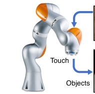

GelSight Touch Image

(a) Setup (b) Sample Touch

Predicted touch Ground truth

Source Reference

(c) Vision to Touch

Predicted vision Ground truth

Source touch Reference

(d) Touch to Vision

Figure 1. **Data collection setup:** (a) we use a robot arm equipped
with a GelSight sensor [15] to collect tactile data and use a webcam
to capture the videos of object interaction scenes. (b) An illustration of the GelSight touching an object. **Cross-modal prediction:**
given the collected vision-tactile pairs, we train cross-modal prediction networks for several tasks: (c) Learning to feel by seeing
(vision _→_ touch): predicting the a touch signal from its corresponding vision input and reference images and (d) Learning to see by
touching (touch _→_ vision): predicting vision from touch. The
predicted touch locations and ground truth locations (marked with
yellow arrows in (d)) share a similar feeling. Please check out our
[website for code and more results.](http://visgel.csail.mit.edu/)

between vision and touch with the goals of _learning to see_
_by touching_ and _learning to feel by seeing_ . Different from
other cross-modal prediction problems where sensory data
in different domains are roughly spatially aligned [13, 1], the

1

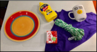

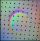

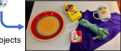

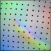

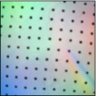

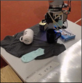

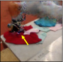

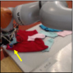

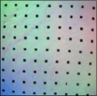
scale gap between vision and touch signals is huge. While
our visual perception system processes the entire scene as
a whole, our fingers can only sense a tiny fraction of the
object at any given moment. To investigate the connections
between vision and touch, we introduce two cross-modal
prediction tasks: (1) synthesizing plausible temporal tactile
signals from vision inputs, and (2) predicting which object
and which object part is being touched directly from tactile
inputs. Figure 1c and d show a few representative results.
To accomplish these tasks, we build a robotic system to
automate the process of collecting large-scale visual-touch
pairs. As shown in Figure 1a, a robot arm is equipped with
a tactile sensor called GelSight [15]. We also set up a standalone web camera to record visual information of both
objects and arms. In total, we recorded 12 _,_ 000 touches on
195 objects from a wide range of categories. Each touch
action contains a video sequence of 250 frames, resulting in
3 million visual and tactile paired images. The usage of the
dataset is not limited to the above two applications.
Our model is built on conditional adversarial networks [11, 13]. The standard approach [13] yields less
satisfactory results in our tasks due to the following two
challenges. First, the scale gap between vision and touch
makes the previous methods [13, 40] less suitable as they
are tailored for spatially aligned image pairs. To address this
scale gap, we incorporate the scale and location information
of the touch into our model, which significantly improves the
results. Second, we encounter severe mode collapse during
GANs training when the model generates the same output
regardless of inputs. It is because the majority of our tactile
data only contain flat regions as often times, robots arms are
either in the air or touching textureless surface, To prevent
mode collapse, we adopt a data rebalancing strategy to help
the generator produce diverse modes.
We present both qualitative results and quantitative analysis to evaluate our model. The evaluations include human
perceptual studies regarding the photorealism of the results,
as well as objective measures such as the accuracy of touch
locations and the amount of deformation in the GelSight images. We also perform ablation studies regarding alternative
model choices and objective functions. Finally, we visualize
the learned representations of our model to help understand
what it has captured.

**2. Related Work**

**Cross-modal learning and prediction** People understand
our visual world through many different modalities. Inspired by this, many researchers proposed to learn shared
embeddings from multiple domains such as words and images [9], audio and videos [32, 2, 36], and texts and visual
data [33, 34, 1]. Our work is mostly related to cross-modal
prediction, which aims to predict data in one domain from
another. Recent work has tackle different prediction tasks

such as using vision to predict sound [35] and generating
captions for images [20, 17, 42, 6], thanks to large-scale
paired cross-domain datasets, which are not currently available for vision and touch. We circumvent this difficulty by
automating the data collection process with robots.

**Vision and touch** To give intelligent robots the same tactile sensing ability, different types of force, haptic, and tactile sensors [22, 23, 5, 16, 39] have been developed over
the decades. Among them, GelSight [14, 15, 44] is considered among the best high-resolution tactile sensors. Recently, researchers have used GelSight and other types of
force and tactile sensors for many vision and robotic applications [46, 48, 45, 26, 27, 25]. Yuan et al. [47] studied
physical and material properties of fabrics by fusing visual,
depth, and tactile sensors. Calandra et al. [3] proposed a
visual-tactile model for predicting grasp outcomes. Different
from prior work that used vision and touch to improve individual tasks, in this work we focus on several cross-modal
prediction tasks, investigating whether we can predict one
signal from the other.

**Image-to-image translation** Our model is built upon recent work on image-to-image translation [13, 28, 51], which
aims to translate an input image from one domain to a photorealistic output in the target domain. The key to its success
relies on adversarial training [11, 30], where a discriminator
is trained to distinguish between the generated results and
real images from the target domain. This method enables
many applications such as synthesizing photos from user
sketches [13, 38], changing night to day [13, 52], and turning semantic layouts into natural scenes [13, 40]. Prior work
often assumes that input and output images are geometrically aligned, which does not hold in our tasks due to the
dramatic scale difference between two modalities. Therefore,
we design objective functions and architectures to sidestep
this scale mismatch. In Section 5, we show that we can
obtain more visually appealing results compared to recent
methods [13].

**3. VisGel Dataset**

Here we describe our data collection procedure including
the tactile sensor we used, the way that robotic arms interacting with objects, and a diverse object set that includes 195
different everyday items from a wide range of categories.

**Data collection setup** Figure 1a illustrates the setup in our
experiments. We use KUKA LBR iiwa industrial robotic
arms to automate the data collection process. The arm is
equipped with a GelSight sensor [44] to collect raw tactile
images. We set up a webcam on a tripod at the back of
the arm to capture videos of the scenes where the robotic
arm touching the objects. We use recorded timestamps to
synchronize visual and tactile images.

|Col1|# touches|# total vision-touch frames|
|---|---|---|
|Train|10,000|2,500,000|
|Test|2,000|500,000|

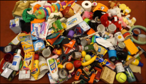

(a) Training objects and known

objects for testing

(b) Unseen test objects

Figure 2. **Object set.** Here we show the object set used in training
and test. The dataset includes a wide range of objects from food
items, tools, kitchen items, to fabrics and stationery.

**GelSight sensor** The GelSight sensor [14, 15, 44] is an
optical tactile sensor that measures the texture and geometry of a contact surface at very high spatial resolution [15].
The surface of the sensor is a soft elastomer painted with a
reflective membrane that deforms to the shape of the object
upon contact, and the sensing area is about 1 _._ 5cm _×_ 1 _._ 5cm.
Underneath this elastomer is an ordinary camera that views
the deformed gel. The colored LEDs illuminate the gel from
different directions, resulting in a three-channel surface normal image (Figure 1b). GelSight also uses markers on the
membrane and recording the flow field of the marker movement to sketched the deformation. The 2D image format of
the raw tactile data allows us to use standard convolutional
neural networks (CNN) [21] for processing and extracting
tactile information. Figure 1c and d show a few examples of
collected raw tactile data.

**Objects dataset** Figure 2 shows all the 195 objects used
in our study. To collect such a diverse set of objects, we start
from Yale-CMU-Berkeley (YCB) dataset [4], a standard
daily life object dataset widely used in robotic manipulation
research. We use 45 objects with a wide range of shapes,
textures, weight, sizes, and rigidity. We discard the rest of
the 25 small objects (e.g., plastic nut) as they are occluded
by the robot arm from the camera viewpoint. To further
increase the diversity of objects, we obtain additional 150
new consumer products that include the categories in the
YCB dataset (i.e., food items, tool items, shape items, task
items, and kitchen items) as well as new categories such as
fabrics and stationery. We use 165 objects during our training
and 30 seen and 30 novel objects during test. Each scene
contains 4 _∼_ 10 randomly placed objects that sometimes
overlap with each other.

**Generating touch proposals** A random touch at an arbitrary location may be suboptimal due to two reasons. First,
the robotic arm can often touch nothing but the desk. Second,
the arm may touch in an undesirable direction or unexpectedly move the object so that the GelSight Sensor fails to
capture any tactile signal. To address the above issues and
generate better touch proposals, we first reconstruct 3D point
clouds of the scene with a real-time SLAM system called
ElasticFusion [41]. We then sample a random touch region

Table 1. **Statistics of our VisGel dataset.** We use a video camera
and a tactile sensor to collect a large-scale synchronized videos of
a robot arm interacting with household objects.

whose surface normals are mostly perpendicular to the desk.
The touching direction is important as it allows robot arms
to firmly press the object without moving it.

**Dataset Statistics** We have collected synchronized tactile
images and RGB images for 195 objects. Table 1 shows the
basic statistics of the dataset for both training and test. To
our knowledge, this is the largest vision-touch dataset.

**4. Cross-Modal Prediction**
We propose a cross-modal prediction method for predicting vision from touch and vice versa. First, we describe our
basic method based on conditional GANs [13] in Section 4.1.
We further improve the accuracy and the quality of our prediction results with three modifications tailored for our tasks
in Section 4.2. We first incorporate the scale and location of
the touch into our model. Then, we use a data rebalancing
mechanism to increase the diversity of our results. Finally,
we further improve the temporal coherence and accuracy of
our results by extracting temporal information from nearby
input frames. In Section 4.3, we describe the details of our
training procedure as well as network designs.

**4.1. Conditional GANs**

Our approach is built on the pix2pix method [13], a recently proposed general-purpose conditional GANs framework for image-to-image translation. In the context of visiontouch cross-modal prediction, the generator _G_ takes either a
vision or tactile image _x_ as an input and produce an output
image in the other domain with _y_ = _G_ ( _x_ ). The discriminator _D_ observes both the input image _x_ and the output result
_y_ : _D_ ( _x, y_ ) _→_ [0 _,_ 1]. During training, the discriminator
_D_ is trained to reveal the differences between synthesized
results and real images while the objective of the generator _G_ is to produce photorealistic results that can fool the
discriminator _D_ . We train the model with vision-touch image pairs _{_ ( **x** _,_ **y** ) _}_ . In the task of touch _→_ vision, **x** is a
touch image and **y** is the corresponding visual image. The
same thing applies to the vision _→_ touch direction, i.e.,
( **x** _,_ **y** ) = (visual image _,_ touch image). Conditional GANs
can be optimized via the following min-max objective:

_G_ _[∗]_ = arg min (1)
_G_ [max] _D_ _[L]_ [GAN][(] _[G, D]_ [) +] _[ λ][L]_ [1][(] _[G]_ [)]

where the adversarial loss _L_ GAN( _G, D_ ) is derived as:

E( **x** _,_ **y** )[log _D_ ( **x** _,_ **y** )] + E **x** [log(1 _−_ _D_ ( **x** _, G_ ( **x** ))] _,_ (2)

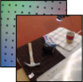

**r**

Vision & Touch

reference

**r**

Vision & touch

reference

**r**

Vision & Touch

reference

Predicted touch

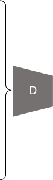

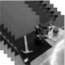

Vision sequence

**¯x** _[t]_

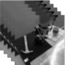

Vision sequence **¯x** _[t]_

Vision sequence **¯x** _[t]_

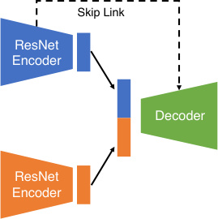

Figure 3. **Overview of our cross-modal prediction model.** Here we show our vision _→_ touch model. The generator _G_ consists of two
ResNet encoders and one decoder. It takes both reference vision and touch images **r** as well as a sequence of frames ¯ **x** _[t]_ as input, and
predict the tactile signal ˆ **y** _[t]_ as output. Both reference images and temporal information help improve the results. Our discriminator learns to
distinguish between the generated tactile signal ˆ **y** _[t]_ and real tactile data **y** _[t]_ . For touch _→_ vision, we switch the input and output modality and
train the model under the same framework.

where the generator _G_ strives to minimize the above objective against the discriminator’s effort to maximize it, and
we denote E **x** ≜ E **x** _∼p_ data( _x_ ) and E( **x** _,_ **y** ) ≜ E( **x** _,_ **y** ) _∼p_ data( **x** _,_ **y** )
for brevity. In additional to the GAN loss, we also add a
direct regression _L_ 1 loss between the predicted results and
the ground truth images. This loss has been shown to help
stabilize GAN training in prior work [13]:

_L_ 1( _G_ ) = E( **x** _,_ **y** ) _||_ **y** _−_ _G_ ( **x** ) _||_ 1 (3)

**4.2. Improving Photorealism and Accuracy**

We first experimented with the above conditional GANs
framework. Unfortunately, as shown in the Figure 4, the
synthesized results are far from satisfactory, often looking
unrealistic and suffering from severe visual artifacts. Besides,
the generated results do not align well with input signals.
To address the above issues, we make a few modifications
to the basic algorithm, which significantly improve the quality of the results as well as the match between input-output
pairs. We first feed tactile and visual reference images to
both the generator and the discriminator so that the model
only needs to learn to model cross-modal changes rather than
the entire signal. Second, we use a data-driven data rebalancing mechanism in our training so that the network is more
robust to mode collapse problem where the data is highly
imbalanced. Finally, we extract information from multiple
neighbor frames of input videos rather than the current frame
alone, producing temporal coherent outputs.

**Using reference tactile and visual images** As we have
mentioned before, the scale between a touch signal and a
visual image is huge as a GelSight sensor can only contact
a very tiny portion compared to the visual image. This gap

makes the cross-modal prediction between vision and touch
quite challenging. Regarding touch to vision, we need to
solve an almost impossible ‘extrapolation’ problem from
a tiny patch to an entire image. From vision to touch, the
model has to first localize the location of the touch and
then infer the material and geometry of the touched region.
Figure 4 shows a few results produced by conditional GANs
model described in Section 4.1, where no reference is used.
The low quality of the results is not surprising due to selfocclusion and big scale discrepancy.

We sidestep this difficulty by providing our system both
the reference tactile and visual images as shown in Figure 1c
and d. A reference visual image captures the original scene
without any robot-object interaction. For vision to touch
direction, when the robot arm is operating, our model can
simply compare the current frame with its reference image
and easily identify the location and the scale of the touch.
For touch to vision direction, a reference visual image can
tell our model the original scene and our model only needs to
predict the location of the touch and hallucinate the robotic
arm, without rendering the entire scene from scratch. A
reference tactile image captures the tactile response when the
sensor touches nothing, which can help the system calibrate
the tactile input, as different GelSight sensors have different
lighting distribution and black dot patterns.

In particular, we feed both vision and tactile reference
images **r** = ( **x** [ref] _,_ **y** [ref] ) to the generator _G_ and the discriminator _D_ . As the reference image and the output often
share common low-level features, we introduce skip connections [37, 12] between the encoder convolutional layers
and transposed-convolutional layers in our decoder.

(a)

(b)

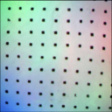

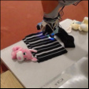

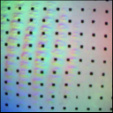

Input vision Ground truth touch w/o reference Ours

Input touch Ground truth vision w/o reference Ours

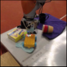

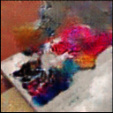

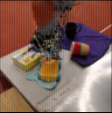

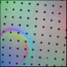

Figure 4. **Using reference images.** Qualitative results of our methods with / without using reference images. Our model trained with
reference images produces more visually appealing images.

**Data rebalancing** In our recorded data, around 60 percentage of times, the robot arm is in the air without touching any
object. This results in a huge data imbalance issue, where
more than half of our tactile data has only near-flat responses
without any texture or geometry. This highly imbalanced
dataset causes severe model collapse during GANs training [10]. To address it, we apply data rebalancing technique,
widely used in classification tasks [8, 49]. In particular,
during the training, we reweight the loss of each data pair
( **x** _[t]_ _,_ **r** _,_ **y** _[t]_ ) based on its rarity score **w** _[t]_ . In practice, we calculate the rarity score based on a ad-hoc metric. We first
compute a residual image _∥_ **x** _[t]_ _−_ **x** [ref] _∥_ between the current
tactile data **x** _[t]_ and its reference tactile data **x** [ref] . We then simply calculate the variance of Laplacian derivatives over the
difference image. For IO efficiency, instead of reweighting,
we sample the training data pair ( **x** _[t]_ _,_ **r** _,_ **y** _[t]_ ) with the proba**w** _[t]_
bility ~~�~~ [. We denote the resulting data distribution as] _[ p]_ **[w]** [.]

_t_ **[w]** _[t]_
Figure 5 shows a few qualitative results demonstrating the
improvement by using data rebalancing. Our evaluation in
Section 5 also shows the effectiveness of data rebalancing.

**Incorporating temporal cues** We find that our initial results look quite realistic, but the predicted output sequences
and input sequences are often out of sync (Figure 7). To address this temporal mismatch issue, we use multiple nearby
frames of the input signal in addition to its current frame. In
practice, we sample 5 consecutive frames every 2 frames:
**x** ¯ _[t]_ = _{_ **x** _[t][−]_ [4] _,_ **x** _[t][−]_ [2] _,_ **x** _[t]_ _,_ **x** _[t]_ [+2] _,_ **x** _[t]_ [+4] _}_ at a particular moment _t_ .
To reduce data redundancy, we only use grayscale images
and leave the reference image as RGB.

**Our full model** Figure 3 shows an overview of our final
cross-modal prediction model. The generator _G_ takes both
input data ¯ **x** _[t]_ = _{_ **x** _[t][−]_ [4] _,_ **x** _[t][−]_ [2] _,_ **x** _[t]_ _,_ **x** _[t]_ [+2] _,_ **x** _[t]_ [+4] _}_ as well as reference vision and tactile images **r** = ( **x** [ref] _,_ **y** [ref] ) and produce
a output image ˆ **y** _[t]_ = _G_ (¯ **x** _[t]_ _,_ **r** ) at moment _t_ in the target
domain. We extend the minimax objective (Equation 1)

_L_ GAN( _G, D_ ) + _λL_ 1( _G_ ), where _L_ GAN( _G, D_ ) is as follows:

E(¯ **x** _t,_ **r** _,_ **y** _t_ ) _∼p_ **w** [log _D_ (¯ **x** _[t]_ _,_ **r** _,_ **y** _[t]_ )]+E(¯ **x** _t,_ **r** ) _∼p_ **w** [log(1 _−D_ (¯ **x** _[t]_ _,_ **r** _,_ ˆ **y** _[t]_ )] _,_
(4)
where _G_ and _D_ both takes both temporal data ¯ **x** _[t]_ and reference images **r** as inputs. Similarly, the regression loss _L_ 1( _G_ )
can be calculated as:

_L_ 1( _G_ ) = E(¯ **x** _t,_ **r** _,_ **y** _t_ ) _∼p_ **w** _||_ **y** _[t]_ _−_ **y** ˆ _[t]_ _||_ 1 (5)

Figure 3 shows a sample input-output combination where
the network takes a sequence of visual images and the corresponding references as inputs, synthesizing a tactile prediction as output. The same framework can be applied to the
touch _→_ vision direction as well.

**4.3. Implementation details**

**Network architectures** We use an encoder-decoder architecture for our generator. For the encoder, we use two
ResNet-18 models [12] for encoding input images **x** and
reference tactile and visual images **r** into 512 dimensional
latent vectors respectively. We concatenate two vectors from
both encoders into one 1024 dimensional vector and feed it
to the decoder that contains 5 standard strided-convolution
layers. As the output result looks close to one of the reference images, we add several skip connections between the
reference branch in the encoder and the decoder. For the
discriminator, we use a standard ConvNet. Please find more
details about our architectures in our supplement.

**Training** We train the models with the Adam solver [18]
with a learning rate of 0 _._ 0002. We set _λ_ = 10 for _L_ 1 loss.
We use LSGANs loss [29] rather than standard GANs [11]
for more stable training, as shown in prior work [51, 40].
We apply standard data augmentation techniques [19] including random cropping and slightly perturbing the brightness,
contrast, saturation, and hue of input images.

**5. Experiments**
We evaluate our method on cross-modal prediction tasks
between vision and touch using the VisGel dataset. We
report multiple metrics that evaluate different aspects of the
predictions. For vision _→_ touch prediction, we measure (1)
perceptual realism using AMT: whether results look realistic,
(2) the moment of contact: whether our model can predict
if a GelSight sensor is in contact with the object, and (3)
markers’ deformation: whether our model can track the
deformation of the membrane. Regarding touch _→_ vision
direction, we evaluate our model using (1) visual realism
via AMT and (2) the sense of touch: whether the predicted
touch position shares a similar feel with the ground truth
position. We also include the evaluations regarding fullreference metrics in the supplement. We feed reference
images to all the baselines, as they are crucial for handling
the scale discrepancy (Figure 4). Please find our code, data,
[and more results on our website.](http://visgel.csail.mit.edu)

(a)

(b)

(c)

(d)

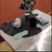

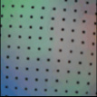

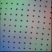

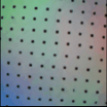

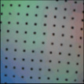

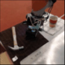

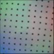

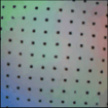

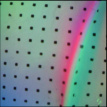

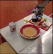

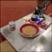

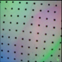

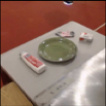

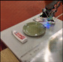

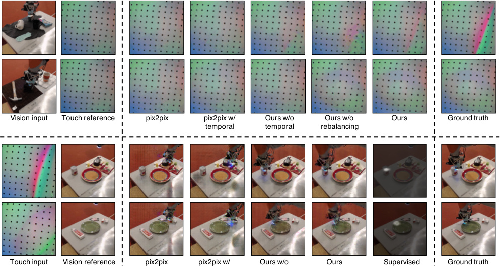

temporal

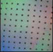

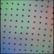

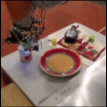

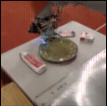

temporal

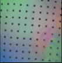

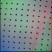

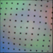

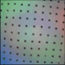

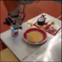

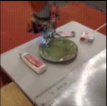

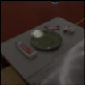

prediction

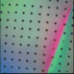

Figure 5. **Example cross-modal prediction results.** (a) and (b) show two examples of vision _→_ touch prediction by our model and
baselines. (c) and (d) show the touch _→_ vision direction. In both cases, our results appear both realistic and visually similar to the ground
truth target images. In (c) and (d), our model, trained without ground truth position annotation, can accurately predict touch locations,
comparable to a fully supervised prediction method.

**Seen objects** **Unseen objects**

% Turkers labeled % Turkers labeled
**Method**
_real_ _real_
pix2pix [13] 28.09 % 21.74%
pix2pix [13] w/ temporal 35.02% 27.70%
Ours w/o temporal 41.44% 31.60%
Ours w/o rebalancing 39.95% 34.86%
**Ours** **46.63%** **38.22%**

Table 2. **Vision2Touch AMT “real vs fake” test.** Our method
can synthesize more realistic tactile signals, compared to both
pix2pix [13] and our baselines, both for seen and novel objects.

**5.1. Vision** _→_ **Touch**

We first run the trained models to generate GelSight outputs frame by frame and then concatenate adjacent frames
together into a video. Each video contains exactly one action
with 64 consecutive frames.
An ideal model should produce a perceptually realistic
and temporal coherent output. Furthermore, when humans
observe this kind of physical interaction, we can roughly
infer the moment of contact and the force being applied to
the touch; hence, we would also like to assess our model’s
understanding of the interaction. In particular, we evaluate
whether our model can predict the moment of contact as
well as the deformation of the markers grid. Our baselines
include pix2pix [13] and different variants of our method.

**Perceptual realism (AMT)** Human subjective ratings
have been shown to be a more meaningful metric for image

synthesis tasks [49, 13] compared to metrics such as RMS
or SSIM. We follow a similar study protocol as described in
Zhang et al. [49] and run a real vs. fake forced-choice test on
Amazon Mechanical Turk (AMT). In particular, we present
our participants with the ground truth tactile videos and the
predicted tactile results along with the vision inputs. We ask
which tactile video corresponds better to the input vision
signal. As most people may not be familiar with tactile data,
we first educate the participants with 5 typical ground truth
vision-touch video pairs and detailed instruction. In total, we
collect 8 _,_ 000 judgments for 1 _,_ 250 results. Table 2 shows
that our full method can outperform the baselines on both
seen objects (different touches) and unseen objects.

**The moment of contact** The deformation on the GelSight
marker field indicates whether and when a GelSight sensor
touches a surface. We evaluate our system by measuring how
well it can predict the _moment of contact_ by comparing with
the ground truth contact event. We track the GelSight markers and calculate the average _L_ 2 distance for each marker.
For each touch sequence, we denote the largest deformation
distance as _d_ max and the smallest deformation as _d_ min, we
then set a cutoff threshold at _r ·_ ( _d_ max _−_ _d_ min)+ _d_ min, where _r_
is set to 0 _._ 6 in our case. We mark the left most and right most
cutoff time point as _tl_ and _tr_ individually. Similarly, we compute the ground truth cutoff time as _t_ [gt] _l_ [and] _[ t]_ _r_ [gt][; then the error]
of the _moment of contact_ for this sequence is determined as

Ground
Ours

Truth

Ours w/o
Temporal

Ours w/o
Rebalancing

(a)

(b)

(a)

(b)

As shown in Figure 6a, the methods without temporal
cues produce a large error due to temporal misalignment.
Figure 6a also shows that our model works better on seen
objects than unseen objects, which coincides with the empirical observation that humans can better predict the touch
outcomes if they have interacted with the object before.
We also show deformation curves for several torch sequences. Figure 7a illustrates a case where all the methods
perform well in detecting the ground truth _moment of contact_ .
Figure 7b shows an example where the model without temporal cues completely missed the contact event. Figure 7c
shows another common situation, where the _moment of con-_
_tact_ predicted by the method without temporal cues shifts
from the ground truth. Figure 7 shows several groundtruth
frames and predicted results. As expected, a single-frame
method fails to accurately predict the contact moment.

**Tracking markers’ deformation** The flow field of the
GelSight markers characterizes the deformation of the membrane, which is useful for representing contact forces as
well as detecting slippery [7]. In this section, we assess
our model’s ability by comparing the predicted deformation with the ground truth deformation. We calculate the
average _L_ 2 distance between each corresponding markers in
the ground truth and the generated touch image. Figure 6b
shows that the single-frame model performs the worst, as
it misses important temporal cues, which makes it hard to
infer information like force and sliding.

Figure 7. **Vision2Touch - detecting the moment of contact.** We
show the markers’ deformation across time, determined by the
average shift of all black markers. Higher deformation implies
object contact with a larger force. **Top:** Three typical cases, where
(a) all methods can infer the moment of contact, (b) the method
without temporal cues failed to capture the moment of contact, and
(c) the method without temporal cues produces misaligned results.
**Bottom:** We show several vision and touch frames from case (c).
Our model with temporal cues can predict GelSight’s deformation
more accurately. The motion of the markers is magnified in red for
better visualization.

**Visualizing the learned representation** We visualize the
learned representation using a recent network interpretation
method [50], which can highlight important image regions
for final decisions (Figure 8a and b). Many meaningful patterns emerge, such as arms hovering in the air or touching
flat area and sharp edges. This result implies that our representation learns shared information across two modalities.
Please see our supplemental material for more visualizations.

**5.2. Touch** _→_ **Vision**

We can also go from touch to vision - by giving the model
a reference visual image and tactile signal, can the model
imagine where it is touching? It is impossible to locate the
GelSight if the sensor is not in contact with anything; hence,
we only include vision-touch pairs where the sensor touches
the objects. An accurate model should predict a reasonable
touch position from the geometric cues of the touch images.

**The Sense of Touch** Different regions and objects can
stimulate similar senses of touch. For example, our finger
may feel the same if we touch various regions on a flat

(a)

(b)

(c)

(d)

Figure 8. **Visualizing the learned representations using Zhou et**
**al. [50]** (a) and (b) visualize two internal units of our vision _→_
touch model. They both highlight the position of the GelSight,
but focus on sharp edges and flat surfaces respectively. (c) and (d)
visualize internal units of our touch _→_ vision model. They focus
on different geometric patterns.

surface or along the same sharp edge. Therefore, given a
tactile input, it is unrealistic to ask a model to predict the
exact same touch location as the ground truth. As long as
the model can predict a touch position that feels the same
as the ground truth position, it is still a valid prediction.
To quantify this, we show the predicted visual image as
well as the ground truth visual image. Then we ask human
participants whether these two touch locations feel similar
or not. We report the average accuracy of each method
over 400 images (200 seen objects and 200 unseen objects).
Table 3 shows the performance of different methods. Our full
method can produce much more plausible touch positions.
We also compare our method with a baseline trained with
explicit supervision provided by humans. Specifically, we
hand-label the position of the GelSight on 1 _,_ 000 images, and
train a Stacked Hourglass Network [31] to predict plausible
touch positions. Qualitative and quantitative comparisons
are shown in Figure 5 and Table 3. Our self-supervised
method is comparable to its fully-supervised counterpart.

**Perceptual Realism (AMT)** Since it is difficult for humans participants to imagine a robotic manipulation scene
given only tactile data, we evaluate the quality of results
without showing the tactile input. In particular, we show
each image for 1 second, and AMT participants are then
given unlimited time to decide which one is fake. The first
10 images of each HITs are used for practice and we give
AMT participants the correct answer. The participants are
then asked to finish the next 40 trials.

**Seen objects** **Unseen objects**

% Turkers labeled % Turkers labeled
**Method**
_Feels Similar_ _Feels Similar_

pix2pix [13] 44.52% 25.21%
pix2pix w/ temporal 53.27% 35.45%
Ours w/o temporal 81.31% 78.40%
**Ours** **89.20%** **83.44%**
Supervised prediction **90.37%** **85.29%**

Table 3. **Touch2Vision “Feels Similar vs Feels Different” test** .
Our self-supervised method significantly outperforms baselines.

produces identical images due to mode collapse. Figure 5 shows
a typical collapsed mode, where pix2pix always places the arm at
the top-right corner of the image. More qualitative results can be
found in our supplementary material.

In total, we collect 8 _,_ 000 judgments for 1 _,_ 000 results.
Table 4 shows the fooling rate of each method. We note that
results from pix2pix [13] suffer from severe mode collapse
and always produce identical images, although they look
realistic according to AMT participants. See our website
for a more detailed comparison. We also observe that the
temporal cues do not always improve the quality of results
for touch _→_ vision direction as we only consider visiontouch pairs in which the sensor touches the objects.

**Visualizing the learned representation** The visualization of the learned representations (Figure 8c and d) show
two units that focus on different geometric cues. Please see
our supplemental material for more examples.

**6. Discussion**

In this work, we have proposed to draw connections between vision and touch with conditional adversarial networks. Humans heavily rely on both sensory modalities
when interacting with the world. Our model can produce
promising cross-modal prediction results for both known
objects and unseen objects. In the future, vision-touch crossmodal connection may help downstream vision and robotics
applications, such as object recognition and grasping in a
low-light environment, and physical scene understanding.

**Acknowledgement** We thank Shaoxiong Wang, Wenzhen
Yuan, and Siyuan Dong for their insightful advice and technical support. This work was supported by Draper Laboratory
Incorporated (Award No. SC001-0000001002) and NASAJohnson Space Center (Award No. NNX16AC49A).

**References**

[1] Yusuf Aytar, Lluis Castrejon, Carl Vondrick, Hamed Pirsiavash, and Antonio Torralba. Cross-modal scene networks.
_PAMI_, 2017. 1, 2

[2] Yusuf Aytar, Carl Vondrick, and Antonio Torralba. Soundnet:
Learning sound representations from unlabeled video. In
_NIPS_, 2016. 2

[3] Roberto Calandra, Andrew Owens, Manu Upadhyaya, Wenzhen Yuan, Justin Lin, Edward H Adelson, and Sergey Levine.
The feeling of success: Does touch sensing help predict grasp
outcomes? In _PMLR_, 2017. 2

[4] Berk Calli, Arjun Singh, James Bruce, Aaron Walsman, Kurt
Konolige, Siddhartha Srinivasa, Pieter Abbeel, and Aaron M
Dollar. Yale-cmu-berkeley dataset for robotic manipulation
research. _The International Journal of Robotics Research_,
2017. 3

[5] Mark R Cutkosky, Robert D Howe, and William R Provancher.
Force and tactile sensors. In _Springer Handbook of Robotics_,
2008. 2

[6] Jeffrey Donahue, Lisa Anne Hendricks, Sergio Guadarrama,
Marcus Rohrbach, Subhashini Venugopalan, Kate Saenko,
and Trevor Darrell. Long-term recurrent convolutional networks for visual recognition and description. In _CVPR_, 2015.
2

[7] Siyuan Dong, Wenzhen Yuan, and Edward Adelson. Improved gelsight tactile sensor for measuring geometry and
slip. In _IROS_, 2017. 7

[8] Clement Farabet, Camille Couprie, Laurent Najman, and
Yann LeCun. Learning hierarchical features for scene labeling.
_PAMI_, 2013. 5

[9] Andrea Frome, Greg S Corrado, Jon Shlens, Samy Bengio,
Jeff Dean, Tomas Mikolov, et al. Devise: A deep visualsemantic embedding model. In _NIPS_, 2013. 2

[10] Ian Goodfellow. Nips 2016 tutorial: Generative adversarial
networks. _arXiv preprint arXiv:1701.00160_, 2016. 5

[11] Ian Goodfellow, Jean Pouget-Abadie, Mehdi Mirza, Bing
Xu, David Warde-Farley, Sherjil Ozair, Aaron Courville, and
Yoshua Bengio. Generative adversarial networks. In _NIPS_,
2014. 2, 5

[12] Kaiming He, Xiangyu Zhang, Shaoqing Ren, and Jian Sun.
Deep residual learning for image recognition. In _CVPR_, 2016.
4, 5

[13] Phillip Isola, Jun-Yan Zhu, Tinghui Zhou, and Alexei A Efros.
Image-to-image translation with conditional adversarial networks. In _CVPR_, 2017. 1, 2, 3, 4, 6, 8

[14] Micah K Johnson and Edward H Adelson. Retrographic
sensing for the measurement of surface texture and shape. In
_CVPR_, 2009. 2

[15] Micah K Johnson, Forrester Cole, Alvin Raj, and Edward H
Adelson. Microgeometry capture using an elastomeric sensor.
In _SIGGRAPH_, 2011. 1, 2, 3

[16] Zhanat Kappassov, Juan-Antonio Corrales, and Veronique´
Perdereau. Tactile sensing in dexterous robot hands. _Robotics_
_and Autonomous Systems_, 2015. 2

[17] Andrej Karpathy and Li Fei-Fei. Deep visual-semantic alignments for generating image descriptions. In _CVPR_, 2015.
2

[18] Diederik Kingma and Jimmy Ba. Adam: A method for
stochastic optimization. In _ICLR_, 2014. 5

[19] Alex Krizhevsky, Ilya Sutskever, and Geoffrey E Hinton. Imagenet classification with deep convolutional neural networks.
In _NIPS_, 2012. 5

[20] Girish Kulkarni, Visruth Premraj, Vicente Ordonez, Sagnik
Dhar, Siming Li, Yejin Choi, Alexander C Berg, and Tamara L
Berg. Babytalk: Understanding and generating simple image
descriptions. _PAMI_, 2013. 2

[21] Yann LeCun, Leon Bottou, Yoshua Bengio, and Patrick´
Haffner. Gradient-based learning applied to document recognition. _Proceedings of the IEEE_, 1998. 3

[22] Susan J Lederman and Roberta L Klatzky. Hand movements:
A window into haptic object recognition. _Cognitive psychol-_
_ogy_, 1987. 2

[23] Susan J Lederman and Roberta L Klatzky. Haptic perception:
A tutorial. _Attention, Perception, & Psychophysics_, 2009. 2

[24] Susan J Lederman, Georgie Thorne, and Bill Jones. Perception of texture by vision and touch: Multidimensionality and
intersensory integration. _Journal of Experimental Psychology:_
_Human Perception and Performance_, 1986. 1

[25] Michelle A Lee, Yuke Zhu, Krishnan Srinivasan, Parth Shah,
Silvio Savarese, Li Fei-Fei, Animesh Garg, and Jeannette
Bohg. Making sense of vision and touch: Self-supervised
learning of multimodal representations for contact-rich tasks.
In _ICRA_, 2019. 2

[26] Rui Li and Edward H Adelson. Sensing and recognizing
surface textures using a gelsight sensor. In _CVPR_, 2013. 2

[27] Rui Li, Robert Platt, Wenzhen Yuan, Andreas ten Pas, Nathan
Roscup, Mandayam A Srinivasan, and Edward Adelson. Localization and manipulation of small parts using gelsight tactile sensing. In _IROS_, 2014. 2

[28] Ming-Yu Liu, Thomas Breuel, and Jan Kautz. Unsupervised
image-to-image translation networks. In _NIPS_, 2017. 2

[29] Xudong Mao, Qing Li, Haoran Xie, Raymond YK Lau, Zhen
Wang, and Stephen Paul Smolley. Least squares generative
adversarial networks. In _ICCV_, 2017. 5

[30] Mehdi Mirza and Simon Osindero. Conditional generative
adversarial nets. _arXiv preprint arXiv:1411.1784_, 2014. 2

[31] Alejandro Newell, Kaiyu Yang, and Jia Deng. Stacked hourglass networks for human pose estimation. In _ECCV_, 2016.
8

[32] Jiquan Ngiam, Aditya Khosla, Mingyu Kim, Juhan Nam,
Honglak Lee, and Andrew Y Ng. Multimodal deep learning.
In _ICML_, 2011. 2

[33] Mohammad Norouzi, Tomas Mikolov, Samy Bengio, Yoram
Singer, Jonathon Shlens, Andrea Frome, Greg S Corrado, and
Jeffrey Dean. Zero-shot learning by convex combination of
semantic embeddings. In _ICLR_, 2014. 2

[34] Mayu Otani, Yuta Nakashima, Esa Rahtu, Janne Heikkila, and¨
Naokazu Yokoya. Learning joint representations of videos
and sentences with web image search. In _ECCV_, 2016. 2

[35] Andrew Owens, Phillip Isola, Josh McDermott, Antonio Torralba, Edward H Adelson, and William T Freeman. Visually
indicated sounds. In _CVPR_, 2016. 2

[36] Andrew Owens, Jiajun Wu, Josh H McDermott, William T
Freeman, and Antonio Torralba. Ambient sound provides
supervision for visual learning. In _ECCV_, 2016. 2

[37] Olaf Ronneberger, Philipp Fischer, and Thomas Brox. U-net:
Convolutional networks for biomedical image segmentation.
In _MICCAI_, 2015. 4

[38] Patsorn Sangkloy, Jingwan Lu, Chen Fang, Fisher Yu, and
James Hays. Scribbler: Controlling deep image synthesis
with sketch and color. In _CVPR_, 2017. 2

[39] Subramanian Sundaram, Petr Kellnhofer, Yunzhu Li, Jun-Yan
Zhu, Antonio Torralba, and Wojciech Matusik. Learning the
signatures of the human grasp using a scalable tactile glove.
_Nature_, 569(7758), 2019. 2

[40] Ting-Chun Wang, Ming-Yu Liu, Jun-Yan Zhu, Andrew Tao,
Jan Kautz, and Bryan Catanzaro. High-resolution image
synthesis and semantic manipulation with conditional gans.
In _CVPR_, 2018. 2, 5

[41] Thomas Whelan, Stefan Leutenegger, R Salas-Moreno, Ben
Glocker, and Andrew Davison. Elasticfusion: Dense slam
without a pose graph. In _Robotics: Science and Systems_, 2015.
3

[42] Kelvin Xu, Jimmy Ba, Ryan Kiros, Kyunghyun Cho, Aaron
Courville, Ruslan Salakhudinov, Rich Zemel, and Yoshua
Bengio. Show, attend and tell: Neural image caption generation with visual attention. In _ICML_, 2015. 2

[43] Jeffrey M Yau, Anitha Pasupathy, Paul J Fitzgerald, Steven S
Hsiao, and Charles E Connor. Analogous intermediate shape
coding in vision and touch. _Proceedings of the National_
_Academy of Sciences_, 2009. 1

[44] Wenzhen Yuan, Siyuan Dong, and Edward H Adelson. Gelsight: High-resolution robot tactile sensors for estimating
geometry and force. _Sensors_, 2017. 2

[45] Wenzhen Yuan, Rui Li, Mandayam A Srinivasan, and Edward H Adelson. Measurement of shear and slip with a
gelsight tactile sensor. In _ICRA_, 2015. 2

[46] Wenzhen Yuan, Mandayam A Srinivasan, and Edward H
Adelson. Estimating object hardness with a gelsight touch
sensor. In _IROS_, 2016. 2

[47] Wenzhen Yuan, Shaoxiong Wang, Siyuan Dong, and Edward
Adelson. Connecting look and feel: Associating the visual
and tactile properties of physical materials. In _CVPR_, 2017. 2

[48] Wenzhen Yuan, Chenzhuo Zhu, Andrew Owens, Mandayam A Srinivasan, and Edward H Adelson. Shapeindependent hardness estimation using deep learning and
a gelsight tactile sensor. In _ICRA_, 2017. 2

[49] Richard Zhang, Phillip Isola, and Alexei A Efros. Colorful
image colorization. In _ECCV_, 2016. 5, 6

[50] Bolei Zhou, Aditya Khosla, Agata Lapedriza, Aude Oliva,
and Antonio Torralba. Object detectors emerge in deep scene
cnns. In _ICLR_, 2015. 7, 8

[51] Jun-Yan Zhu, Taesung Park, Phillip Isola, and Alexei A Efros.
Unpaired image-to-image translation using cycle-consistent
adversarial networks. In _ICCV_, 2017. 2, 5

[52] Jun-Yan Zhu, Richard Zhang, Deepak Pathak, Trevor Darrell,
Alexei A Efros, Oliver Wang, and Eli Shechtman. Toward
multimodal image-to-image translation. In _NIPS_, 2017. 2

